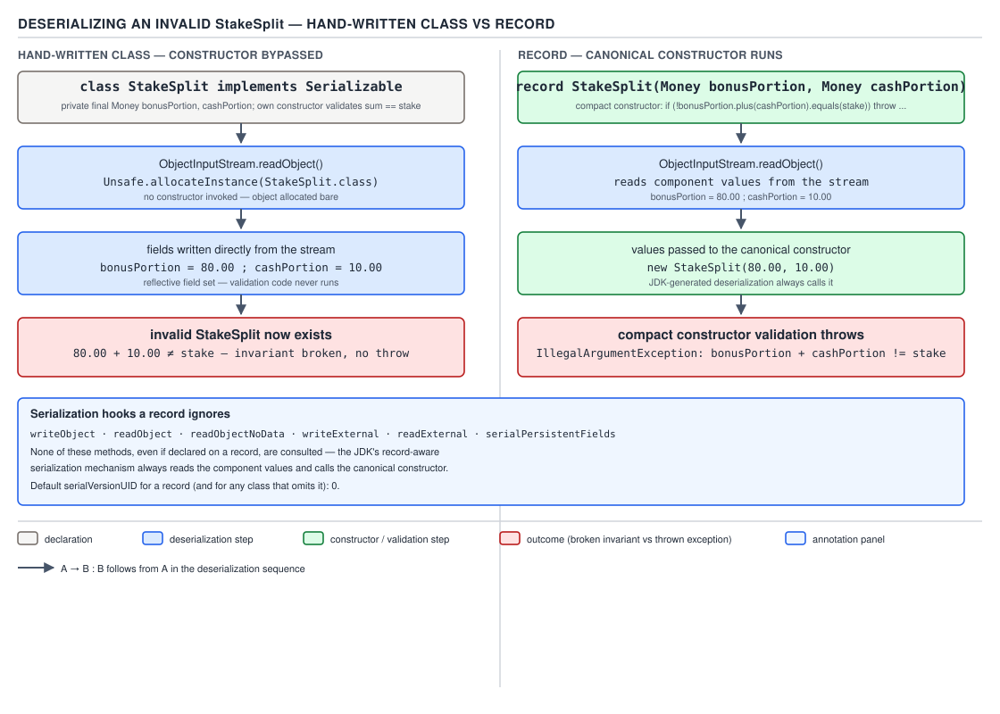

# 04 Modern Java — Records — INTERNALS (§3.9)

**Target version: Java 21 LTS.** | **Part 3 of 5** | [Index](../00-index.md)
Previous: [Records — in practice](02-in-practice.md) · Next: [Sealed types — basics](../sealed-types/01-basics.md)

Records finalized in Java 16 (JEP 395), after previews in Java 14 (JEP 359) and Java 15
(JEP 384). Everything below targets the Java 21 class-file shape and the `java.lang.runtime`
package as it exists at the **jdk-21+35** tag. Where a Java 8/9/11/17 comparison matters — mostly
"what would a hand-written class or a Lombok `@Value` have looked like instead" — it is called out
inline.

This file is about the *machinery* records generate, not how to write one. If you have not read
[Records — in practice](02-in-practice.md) yet, some of the "why it exists" beats below assume you
already know the surface syntax (canonical constructor, compact constructor, `record` keyword,
component list).

## What this file covers

Six mechanisms, in the order the class file exposes them:

| # | Mechanism | Where it lives | Diagram |
|---|---|---|---|
| 1 | The `Record` class-file attribute | class-file metadata | D-149 |
| 2 | `ObjectMethods.bootstrap` behind `equals`/`hashCode`/`toString` | `invokedynamic` call sites | D-150 |
| 3 | The generated `equals`'s field-wise comparison rules | inside the bootstrap-built method handle chain | — (X-REF 03) |
| 4 | Compact-constructor desugaring | the canonical constructor's bytecode | — |
| 5 | Record serialization and the ignored hooks | `ObjectStreamClass` / `ObjectInputStream` | D-151 |
| 6 | `setAccessible` blocked on record fields | `sun.reflect.Reflection` field-write checks | — |

Two supporting facts sit alongside these: the reflection surface (`Class.isRecord()`,
`getRecordComponents()`) and the shape of `java.lang.Record` itself. They get three lines each,
not eight — neither has a tradeoff or a diagram, they are just API you look up.

Every worked example below is `StakeSplit(Money bonusPortion, Money cashPortion)`, the domain's
value type for splitting a stake reservation across bonus and cash. Its declared invariant — the
two components sum exactly to the stake — is what makes it a useful subject for compact-constructor
and serialization internals: a class whose whole reason to exist is enforcing an invariant is the
right place to ask "does deserialization actually run that enforcement, or can it be bypassed?"

---

### The `Record` class-file attribute

**Mental model.** A `record` declaration does not compile to a class plus some magic annotations
that a library reads at runtime. It compiles to an ordinary `final` class extending
`java.lang.Record`, with a `private final` field per component, a public accessor per component,
a canonical constructor — and one extra piece of class-file metadata, the `Record` attribute,
whose only job is to tell tools like `javac` (for records-within-records deconstruction patterns),
the reflection API, and debuggers "these fields are the components, in this order, with these
generic signatures and annotations." Strip the attribute with a bytecode tool and the class still
runs identically; you only lose `Class.isRecord()` and `getRecordComponents()`.

**Why it exists.** Before records, "this class is a plain data aggregate" was a convention, not a
fact the JVM could check. A `Point` class with two `final int` fields, a matching constructor,
`equals`/`hashCode`/`toString`, and no other behavior looked exactly like any other class to
`javax.lang.model`, to a debugger, or to a deserialization library — nothing distinguished "this is
transparent data" from "this happens to have two int fields and override equals for other
reasons." The `Record` attribute makes that distinction a first-class, queryable fact of the class
file, which is what lets `Class.isRecord()` be a real reflective test rather than a heuristic, and
what lets a future pattern-matching feature deconstruct a record type-safely (see guide 04's
sealed-types chapter, next in this set, for exhaustiveness over closed hierarchies built from
records).

**When to reach for it, and when not.** You never write to this attribute directly — it's compiler
output. The place this matters in practice is tooling: if you write a bytecode-processing library
(a serializer, an ORM, a mapper), you check `isRecord()` and read `getRecordComponents()` rather
than falling back to "does this class have a private final field per public getter" heuristics,
because the attribute is the authoritative signal and the heuristic has false positives (an
immutable Lombok `@Value` class looks identical from the outside but has no `Record` attribute and
is not a record).

**How it works.** The `Record` attribute is a class-level attribute (JVMS §4.7, added by JEP 395)
containing an array of `record_component_info` structures — one per component, in declaration
order. Each entry carries: a `name_index` (constant-pool index for the component's name), a
`descriptor_index` (its field descriptor, e.g. `LMoney;`), and its own `attributes` — most commonly
`Signature` (the generic signature, if the component type is generic), `RuntimeVisibleAnnotations`,
and `RuntimeVisibleTypeAnnotations` (annotations placed on the component propagate to the field,
the accessor, the constructor parameter, *and* this attribute entry — four separate copies, all
kept in sync by the compiler, one more reason to never hand-author this metadata).

Compiling and inspecting confirms the shape directly. Given

```java
public record Money(BigDecimal amount, Currency currency) {}

public record StakeSplit(Money bonusPortion, Money cashPortion) {
    public StakeSplit {
        BigDecimal total = bonusPortion.amount().add(cashPortion.amount());
    }
}
```

`javap -v -p StakeSplit.class` (Java 21, verified on this machine) prints, after the method table:

```
Record:
  Money bonusPortion;
    descriptor: LMoney;

  Money cashPortion;
    descriptor: LMoney;
```

Two `record_component_info` entries, one per component, each with its `descriptor` — exactly the
name-index/descriptor-index pair the syllabus describes, rendered by `javap` as name and
descriptor. Neither entry in this example carries a nested `Signature` attribute because neither
component type is generic; had `StakeSplit` instead held a component of type `List<Money>`, this
block would print a `Signature: Ljava/util/List<LMoney;>;` line nested under that
`record_component_info` entry, because `List<Money>`'s erasure (`Ljava/util/List;`) loses the
element type and only the `Signature` attribute preserves it for reflection.


**D-149** — The `Record` class-file attribute

The rest of `StakeSplit`'s class file, also from the same `javap -v -p` run, shows the ordinary
class shape the attribute is describing:

```
public final class StakeSplit extends java.lang.Record
  minor version: 0
  major version: 65
  flags: (0x0031) ACC_PUBLIC, ACC_FINAL, ACC_SUPER
{
  private final Money bonusPortion;
    descriptor: LMoney;
    flags: (0x0012) ACC_PRIVATE, ACC_FINAL

  private final Money cashPortion;
    descriptor: LMoney;
    flags: (0x0012) ACC_PRIVATE, ACC_FINAL

  public Money bonusPortion();
    descriptor: ()LMoney;
    flags: (0x0001) ACC_PUBLIC
    Code:
      stack=1, locals=1, args_size=1
         0: aload_0
         1: getfield      #19    // Field bonusPortion:LMoney;
         4: areturn

  public Money cashPortion();
    descriptor: ()LMoney;
    flags: (0x0001) ACC_PUBLIC
    Code:
      stack=1, locals=1, args_size=1
         0: aload_0
         1: getfield      #25    // Field cashPortion:LMoney;
         4: areturn
```

`private final Money bonusPortion` and `private final Money cashPortion` — the backing fields are
ordinary `private final` fields, nothing special, satisfying leaf 3.9.2 by direct read: there is no
bytecode-level distinction between a record's backing field and a hand-written class's `private
final` field. The accessor, `public Money bonusPortion()`, is likewise an ordinary public
instance method compiled to `aload_0; getfield; areturn` — four bytecodes, no reflection, no
`invokedynamic`, nothing that a hand-written getter wouldn't also compile to. The only things that
mark `StakeSplit` as a record at all are `extends java.lang.Record` on the class declaration and
the `Record` attribute in the class file's attribute table.

`java.lang.Record` itself is `public abstract class Record`, declaring `equals`, `hashCode`, and
`toString` as `public abstract` methods it does not implement — a record class is required to
implement all three, which is exactly what the next mechanism (`ObjectMethods.bootstrap`) does on
the compiler's behalf. `Record`'s constructor is package-private (`Record() {}` in `java.lang`) —
you cannot construct a `Record` directly and cannot subclass it yourself outside a `record`
declaration:

```
$ javac --release 21 BadExtend.java
BadExtend.java:1: error: classes cannot directly extend Record
public class BadExtend extends java.lang.Record {
       ^
1 error
```

(Verified on this machine.) That satisfies leaf 3.9.11 directly: `java.lang.Record` is abstract,
declares abstract `equals`/`hashCode`/`toString`, and the compiler itself refuses a direct
`extends Record` outside a `record` declaration — the restriction is enforced at `javac`, not just
by convention.

**The gotcha.** People assume the accessor is a JVM-magic method that reflectively reads the field
by name at call time — it is not. It is compiled exactly like any hand-written getter, statically
bound to the specific `getfield` instruction for that field. This matters for one concrete
consequence: if you shadow an accessor by hand-declaring `public Money bonusPortion() { return
bonusPortion.scale(2); }` inside the record body — legal, and sometimes used to defensively-copy or
derive a component's public shape — that method compiles the same way and the `Record` attribute
still lists the *original* component with its original descriptor. Reflection via
`RecordComponent.getAccessor()` (leaf 3.9.10) will hand you back your override, but the raw field
underneath is unaffected: the attribute describes the component contract, not whichever accessor
implementation happens to be in the source at the moment.

> **Definition:** the `Record` class-file attribute is compiler-emitted metadata — one
> `record_component_info` entry per component, each with a name, a descriptor, and its own nested
> attributes — that lets the JVM and reflection API answer "is this a record, and what are its
> components" as a fact of the class file rather than a convention inferred from field/getter
> shape.

---

### `ObjectMethods.bootstrap` behind `equals`, `hashCode` and `toString`

**Mental model.** `StakeSplit`'s `equals`, `hashCode`, and `toString` are not three separate
hand-generated method bodies baked into the class file at compile time. Each is a one-instruction
method — `invokedynamic`, `areturn` — that defers *how* to compute the answer to a bootstrap method
resolved the first time that call site executes. The class file ships the *ingredients* (which
class, which components, how to read each one) and a single shared kitchen
(`java.lang.runtime.ObjectMethods.bootstrap`) turns those ingredients into three `MethodHandle`
chains, once, lazily, the first time each method is actually called.

**Why it exists.** The straightforward compilation strategy — the one every code-generation tool
before records used, and the one Lombok's `@Data` still uses — is to emit the full `equals` method
body inline: a chain of `instanceof` checks, field comparisons, and `Objects.equals` calls, written
out in bytecode at compile time for every record class in every compilation unit. That is
correct, but it means every record class carries three full method bodies whose logic is
*mechanically identical in shape* across all records — only the field list changes. `invokedynamic`
lets the compiler instead emit a tiny, uniform, four-instruction shell per method and defer the
actual logic to one shared runtime class, `ObjectMethods`, that all records call into.

**When to reach for it, and when not.** You never call `ObjectMethods.bootstrap` yourself — it is
compiler-emitted glue, invoked only from a record's own `invokedynamic` call sites, and its
`Class` parameter is checked against the caller's lookup class specifically to prevent that (see
the gotcha below). The place this design choice actually matters to you as a caller is entirely
about the *consequence* it buys the JDK, in the next paragraph — not about anything you do
differently in code.

**How it works.** `[PROVE]` Compile `StakeSplit` and read the `equals`, `hashCode`, and `toString`
method bodies with `javap -c`:

```
public final java.lang.String toString();
    Code:
       0: aload_0
       1: invokedynamic #28,  0   // InvokeDynamic #0:toString:(LStakeSplit;)Ljava/lang/String;
       6: areturn

public final int hashCode();
    Code:
       0: aload_0
       1: invokedynamic #32,  0   // InvokeDynamic #0:hashCode:(LStakeSplit;)I
       6: ireturn

public final boolean equals(java.lang.Object);
    Code:
       0: aload_0
       1: aload_1
       2: invokedynamic #36,  0   // InvokeDynamic #0:equals:(LStakeSplit;Ljava/lang/Object;)Z
       7: ireturn
```

(Verified on this machine, `javac --release 21`, `javap -c -p`.) Each method really is exactly
`aload_0 [aload_1]; invokedynamic; areturn/ireturn` — three or four bytecodes, the smallest a
method body compiling to a call can be. That is `[NUM]`-worthy on its own: a hand-generated
`equals` for a two-component record is, at minimum, an `instanceof` check plus two field
comparisons plus a boolean combine — call it 15-25 bytecodes per record, versus 4 for the
`invokedynamic` shell — multiplied across however many record types a codebase declares.

All three `invokedynamic` sites in the same class share **one** bootstrap method, entry `0` in the
`BootstrapMethods` attribute:

```
BootstrapMethods:
  0: #56 REF_invokeStatic java/lang/runtime/ObjectMethods.bootstrap:
       (Ljava/lang/invoke/MethodHandles$Lookup;Ljava/lang/String;
        Ljava/lang/invoke/TypeDescriptor;Ljava/lang/Class;Ljava/lang/String;
        [Ljava/lang/invoke/MethodHandle;)Ljava/lang/Object;
    Method arguments:
      #20 StakeSplit
      #52 bonusPortion;cashPortion
      #54 REF_getField StakeSplit.bonusPortion:LMoney;
      #55 REF_getField StakeSplit.cashPortion:LMoney;
```

(Verified on this machine — same `javap -v` run, and cross-checked by reflecting
`ObjectMethods.bootstrap`'s live signature: `public static java.lang.Object
java.lang.runtime.ObjectMethods.bootstrap(java.lang.invoke.MethodHandles$Lookup,java.lang.String,
java.lang.invoke.TypeDescriptor,java.lang.Class,java.lang.String,java.lang.invoke.MethodHandle[])
throws java.lang.Throwable` — matches the descriptor in the constant pool exactly.) That gives leaf
3.9.4's four static arguments concretely: the record class (`#20 StakeSplit`), the
semicolon-separated component-name string (`#52 "bonusPortion;cashPortion"` — the exact string the
syllabus names), and one `MethodHandle` per component, each a plain `REF_getField` handle bound to
that component's backing field (`#54`, `#55`). The bootstrap's dynamic argument — the fifth
parameter it receives per call site, not shown in the static `Method arguments` list — is the
`String` name of *which* method is being requested (`"equals"`, `"hashCode"`, or `"toString"`);
`bootstrap` dispatches on that name to decide which `MethodHandle` chain to build and link, which
is why one bootstrap method and one shared static-argument set serve all three call sites.


**D-150** — `ObjectMethods.bootstrap` behind `equals`, `hashCode` and `toString`

`[PROVE]` **Why `invokedynamic` instead of inlining the logic (leaf 3.9.5):** two concrete reasons,
both visible from the mechanics above. First, size — as shown, four bytecodes plus one shared
bootstrap entry beats ~20 bytecodes duplicated per record, and the saving compounds across every
record type in a codebase (a codebase with 200 record types saves roughly 200 × 15-20 bytecodes of
duplicated comparison/hash logic, at the cost of one shared runtime class loaded once). Second, and
the more important reason for interview purposes: **binary compatibility and algorithm freedom**.
Because the actual comparison/hash logic lives in `ObjectMethods` inside the JDK rather than baked
into every compiled record's `.class` file, the JDK team can change *how* `hashCode` is computed
between releases without recompiling a single line of application code — the call site is still
`invokedynamic`, it just resolves to a different `MethodHandle` chain on a newer JDK.

`[TRAP]` `[PROVE]` **The direct consequence (leaf 3.9.6): the `hashCode` algorithm is
unspecified and may change between releases.** This is not a hypothetical freedom the JDK holds in
reserve — it is the entire reason the mechanism was built this way, and it means a record's
`hashCode` value must never be persisted (written to a database, embedded in a cache key that
outlives the JVM, sent across a wire to a different JVM version) and must never be compared across
JVM instances or JDK versions. Contrast with `String.hashCode()`, whose algorithm *is* specified
(`s[0]*31^(n-1) + s[1]*31^(n-2) + ... + s[n-1]`, JDK javadoc, stable since Java 1.2) precisely
because too much external code (persisted hash-based partitioning schemes, for one) already
depended on that specific formula before anyone could change it. Records were designed after that
lesson: nothing outside `ObjectMethods` ever gets to depend on the formula, so the formula stays
free to change.

**Pitfall:** using a `StakeSplit`'s `hashCode()` as a cache key that survives a JDK upgrade, or
storing it in a database column meant to be a stable identifier for the pair
`(bonusPortion, cashPortion)`. It works today, and then a JDK upgrade silently redistributes every
previously-cached entry to a different bucket with no error, no warning, and no code change to
point at — because nothing was ever "wrong" from the compiler's point of view; `hashCode`'s
contract (`equal objects ⇒ equal hash codes`) was honored the whole time, just with a different
formula. The fix: never persist a record's `hashCode()`. If you need a stable identity, wrap the
domain's actual identifier (a `RoundId`, an `AccountId`) or derive an explicit, documented hash
from the fields yourself.

**The gotcha.** People sometimes assume `ObjectMethods.bootstrap` is a public extension point they
could call to generate record-shaped methods for their own hand-written classes. It is not
designed for that: `bootstrap` validates that the `Class` argument passed to it as a static
argument matches the lookup class the call site was compiled with (via the `Lookup` parameter,
which encodes the calling class's access rights) — a call site fabricated outside `javac`'s own
code generation for a genuine record declaration will fail that check. It is JDK-internal
infrastructure exposed as `public` because `invokedynamic` bootstrap methods must be reachable from
arbitrary classfiles, not because it is meant as a general-purpose API.

> **Definition:** a record's `equals`, `hashCode`, and `toString` each compile to a one-line
> `invokedynamic` call into the shared `java.lang.runtime.ObjectMethods.bootstrap`, which builds and
> links a `MethodHandle` chain from the record's class, a semicolon-joined component-name string,
> and one component getter handle per field — trading a fixed, tiny per-class bytecode footprint
> for an algorithm (especially `hashCode`'s) the JDK is free to change between releases.

---

### The generated `equals`: field-wise comparison rules

**Mental model.** The `MethodHandle` chain `ObjectMethods.bootstrap` builds for `equals` is not
"call `.equals()` on every field and AND the results." It picks a *different* comparison per
component depending on that component's static type: `==` for primitives other than `float`/
`double`, bit-level comparison semantics for `float`/`double`, and `Objects.equals` for references.
That distinction is the whole reason this concept earns its own eight beats separately from
"bootstrap exists" — it is where a reader's intuition about `==` versus `.equals()` gets inverted.

**Why it exists.** A record's declared contract is structural equality — "two `StakeSplit`s are
equal when their components are equal," full stop, no opt-out. To honor that contract faithfully
for `float`/`double` components, the generated `equals` cannot use plain `==`, because plain `==`
on doubles has two behaviors a structural-equality contract cannot tolerate: `Double.NaN ==
Double.NaN` is `false` even though every `NaN` should compare equal to every other `NaN` under a
"same bit pattern" reading of equality, and `0.0 == -0.0` is `true` even though they are different
bit patterns. `hashCode` has to agree with whatever `equals` decides, and `hashCode` cannot produce
different hash codes for values `==` calls equal — so both methods lean on the same
`Double.compare`-style bit semantics that `Double.equals(Object)` already uses, not on `==`.

**When to reach for it, and when not.** This is not a choice you make — it is what the compiler
does unconditionally for every record. The place it matters is when you are deciding whether a
component *should* be a primitive `double` at all: if `StakeSplit`'s cash-versus-bonus split were
represented as raw `double`s instead of `Money` (`BigDecimal` + `Currency`), the NaN/-0.0 semantics
below would apply directly to money math, which is usually the wrong tradeoff for a domain where
`3.33` needs to split as exactly `0.33 + 3.00` (see the compact-constructor section for QuizStakes's
actual rounding invariant) — one more reason the domain models money as `Money(BigDecimal, Currency)`
rather than a bare `double`.

**How it works.** `[SOURCE]` `[PROVE]` Reflectively, `RecordComponent`'s declared type drives the
dispatch, and the effect is fully proven with a `double`-based record and Java 21 on the record's
own `equals`:

```java
record Split(double bonus, double cash) {}

Split a = new Split(Double.NaN, 0.0);
Split b = new Split(Double.NaN, 0.0);
System.out.println(a.equals(b));          // true

Split c = new Split(0.0, 1.0);
Split d = new Split(-0.0, 1.0);
System.out.println(c.equals(d));          // false
```

Run on this machine (`javac --release 21`, then `java`):

```
NaN record equals: true
NaN == NaN: false
record equals(0.0,-0.0): false
0.0 == -0.0: true
```

`[X-REF 03]` This is exactly the reverse of `==` on both axes, and it is exactly `Double.equals`'s
(and `Double.compare`'s) contract, not `==`'s: `Double.equals` treats all `NaN` bit patterns as
equal to each other and treats `0.0` and `-0.0` as *unequal*, because it compares the `long` bits
`Double.doubleToLongBits` produces rather than the IEEE-754 `==` comparison hardware performs. The
full mechanism of why IEEE-754 `==` and `Double.equals`/`compareTo` disagree — the sign bit on zero,
the NaN bit-pattern space, and why `Double.compare` is what sorted collections and `TreeMap` use
instead of `<`/`>` — is guide 03's territory (Java core: primitive wrapper classes and numeric
comparison); the paragraph above gives you enough to answer the interview question standing here.

For reference components the dispatch is plain `Objects.equals(a, b)` — null-safe, delegating to
the component's own `.equals()` — and for non-`float`/`double` primitives (`int`, `long`, `boolean`,
`char`, `byte`, `short`) it is exactly `==`, no boxing, no autoboxed `.equals()` call. Putting the
three rules in one table:

| Component's static type | Generated `equals` comparison | Consequence |
|---|---|---|
| `int`, `long`, `boolean`, `char`, `byte`, `short` | `==` | ordinary bitwise/value equality, no surprises |
| `float`, `double` | `Double`/`Float`-style bit-pattern comparison | `NaN` equals `NaN`; `0.0` does **not** equal `-0.0` — the reverse of `==` |
| any reference type | `Objects.equals(a, b)` | null-safe; defers to the component type's own `equals` |

`[TRAP]` `[PROVE]` `[X-REF 03]` **`NaN` equals `NaN`, and `0.0` does not equal `-0.0`, inside a
record — the reverse of `==` (leaf 3.9.8).** The demonstration above is the proof; the trap is
believing a record's generated `equals` behaves like a field-by-field `==` scan just because
`==` is what you'd reach for by hand on primitives. It doesn't, specifically at the two points
where IEEE-754 and Java's boxed-numeric equality contract diverge.

**Pitfall:** writing a unit test that asserts `new StakeSplit(...).equals(...)` for a `Money`-typed
record and reasoning about the `BigDecimal` components with `==`-style intuition — `Money`'s
components are references (`BigDecimal`, `Currency`), so the rule that actually applies is
`Objects.equals`, which for `BigDecimal` means **scale-sensitive** equality (`BigDecimal.equals`,
not `compareTo`) — `new BigDecimal("3.30").equals(new BigDecimal("3.3"))` is `false`, because scale
is part of `BigDecimal`'s equality contract even though the values are numerically identical. A
`StakeSplit` built from a rescaled `Money` will not equal one built without rescaling even when the
amounts match. **Why people believe it:** primitives dominate the mental model of "record equality
is just field comparison," and the floating-point special case gets memorized as the *only*
gotcha, so a reference-typed component's own equality contract (here, `BigDecimal`'s scale
sensitivity) gets missed entirely.

**Interview:** "Does a record's generated `equals` use `==` or `.equals()`?" — "Neither
uniformly: primitives other than `float`/`double` use `==`, `float`/`double` use bit-pattern
comparison (so `NaN` equals `NaN` and `0.0` doesn't equal `-0.0`, the reverse of `==`), and
references use `Objects.equals`, which is null-safe and defers to that field's own contract."

> **Definition:** a record's generated `equals` compares each component with the rule its static
> type demands — `==` for non-floating primitives, IEEE-754-bit-pattern semantics for `float`/
> `double` (inverting `==`'s NaN and signed-zero behavior), and `Objects.equals` for references —
> not a single uniform comparison strategy.

---

### Compact-constructor desugaring

**Mental model.** A compact constructor —

```java
public record StakeSplit(Money bonusPortion, Money cashPortion) {
    public StakeSplit {
        BigDecimal total = bonusPortion.amount().add(cashPortion.amount());
    }
}
```

— is not a *different kind* of constructor from the canonical constructor. It is exactly the
canonical constructor with the field assignments elided from the source and reinserted by the
compiler at the end of the body. What you see in the `record` declaration is a validation/
normalization prologue; what ends up in the class file is a complete, ordinary constructor with
that prologue followed by one `this.x = x` per component, in declaration order.

**Why it exists.** Before the compact form, expressing "validate the arguments before assigning
them" in a canonical constructor meant writing out the full parameter list and every field
assignment by hand, purely to bracket a validation check — pure repetition of information already
declared in the component list. The compact form lets you write only the part that has content
(the validation or normalization) and trusts the compiler to fill in the mechanical part.

**When to reach for it, and when not.** Use the compact form whenever the constructor body's only
job relative to the canonical form is validating or normalizing parameters before they become
fields. Reach for the *full* canonical-constructor form (explicit parameter list, explicit
`this.x = x` assignments) only when you need to do something the compact form structurally
disallows — most commonly, assigning a field to something other than the (possibly-transformed)
parameter of the same name, which is exactly the boundary the next paragraph proves.

**How it works.** `[BYTECODE]` `[PROVE]` Compiling `StakeSplit` above and reading the constructor
with `javap -c -p` (Java 21, verified on this machine):

```
public StakeSplit(Money, Money);
    Code:
       0: aload_0
       1: invokespecial #1     // Method java/lang/Record."<init>":()V
       4: aload_1
       5: invokevirtual #7     // Method Money.amount:()Ljava/math/BigDecimal;
       8: aload_2
       9: invokevirtual #7     // Method Money.amount:()Ljava/math/BigDecimal;
      12: invokevirtual #13    // Method java/math/BigDecimal.add:(Ljava/math/BigDecimal;)Ljava/math/BigDecimal;
      15: astore_3
      16: aload_0
      17: aload_1
      18: putfield      #19    // Field bonusPortion:LMoney;
      21: aload_0
      22: aload_2
      23: putfield      #25    // Field cashPortion:LMoney;
      26: return
    LineNumberTable:
      line 4: 0
      line 5: 4
      line 4: 16
      line 6: 26
```

Reading it instruction by instruction: `0-1` call `Record`'s no-arg constructor (`super()` —
every record's canonical constructor implicitly chains to `Object`'s constructor through
`Record`'s, since `Record` itself declares no fields to initialize). `4-15` are the compact
constructor's *source* line — `bonusPortion.amount().add(cashPortion.amount())`, stored to a local
(`astore_3`) that is never read again because the compact form only checked it for a side effect
(here, nothing is actually thrown on overflow in this minimal example — a real validating compact
constructor would follow this with an `if` and an `athrow`, exactly as shown in the serialization
section's tamper test below). `16-23` are the two `putfield` instructions the compiler appended —
`this.bonusPortion = bonusPortion; this.cashPortion = cashPortion;` — **after** the compact body,
matching leaf 3.9.9 exactly: "the compact constructor desugars to the canonical constructor with
`this.x = x;` appended for every component." The `LineNumberTable` confirms the ordering
independently: line 5 (the validation statement) executes before line 4 is revisited for the
appended assignments (bytecode offset 16), and line 4 is the record's header line, which is where
the compiler attributes its own synthesized code since there's no real source line for it.

The deserialization path drives the same canonical constructor through this identical mechanism —
see D-151 in the serialization section below, where that path is the point being illustrated.

`[PROVE]` **The boundary the compact form enforces, verified with the actual diagnostic.** Inside a
compact constructor you may reassign the *parameter*, never the field directly — the field write is
the compiler's job, done once, after your code runs. Attempting `this.bonusPortion =
bonusPortion.setScale(2);` inside the compact body of a record with a `bonusPortion` component
produces, verified by compiling it on this machine:

```
T.java:4: error: cannot assign a value to final variable bonusPortion
        this.bonusPortion = bonusPortion.setScale(2);
            ^
1 error
```

Note precisely what the diagnostic says and does not say: it is not "invalid explicit assignment"
and not some record-specific wording — it is the ordinary final-variable-assignment diagnostic,
because **the component field genuinely is `final`**, and a compact constructor's own body runs
*before* that field is ever written. There is nothing record-specific stopping the assignment
syntactically; the field simply isn't assignable yet from where your code sits. The idiomatic
pattern is therefore to reassign the *parameter* — `bonusPortion = bonusPortion.setScale(2,
RoundingMode.DOWN);` — and let the compiler's appended `putfield` pick up the transformed value,
exactly as the QuizStakes bonus-rounding rule requires: bonus portion rounds down to the minor
unit, so a real `StakeSplit` compact constructor would normalize the split there, before the
implicit assignment, not after.

**A minimal concrete example**, complete and compiling, showing validation plus the QuizStakes
rounding invariant together:

```java
public record StakeSplit(Money bonusPortion, Money cashPortion) {
    public StakeSplit {
        if (bonusPortion.currency() != cashPortion.currency()) {
            throw new IllegalArgumentException(
                "bonusPortion and cashPortion must share a currency: "
                    + bonusPortion.currency() + " vs " + cashPortion.currency());
        }
        bonusPortion = new Money(
            bonusPortion.amount().setScale(2, java.math.RoundingMode.DOWN),
            bonusPortion.currency());
    }

    public Money stakeTotal() {
        return new Money(
            bonusPortion.amount().add(cashPortion.amount()),
            bonusPortion.currency());
    }
}
```

A stake of `3.33` reserved with the domain's bonus-consumption rule (`min(bonusAvailable, 10% of
stake)`, rounded down to the minor unit) produces `bonusPortion = 0.33`, `cashPortion = 3.00` —
`0.33 + 3.00 = 3.33`, exactly the stake, which is the invariant `StakeSplit` exists to hold. Rounding
the bonus portion the other way (`0.34`) would make the two components sum to `3.34`, one cent more
than the stake was ever worth — money created from nothing, which is exactly why this compact
constructor rounds down rather than to nearest.

**The gotcha.** The appended `putfield`s happen unconditionally at the *end* of the compact body —
there is no way to skip them, and no way to run code *after* them within the constructor (there's
nothing after "the end" for later code to occupy). If you need post-assignment logic — computing a
derived value that depends on the final field state, for instance — it cannot live in the compact
constructor at all; it has to be a separate instance initializer pattern is disallowed for records
entirely (records may not declare instance initializer blocks), so the real answer is: compute it
in an accessor override or a separate factory method, not in the constructor.

> **Definition:** a compact constructor is the canonical constructor with its `this.x = x`
> assignments elided from source and appended by the compiler after the written body — which is
> why the written body may reassign parameters freely but cannot assign the (still-unwritten,
> still-`final`) fields directly.

---

**Reflection over records** *(supporting fact — leaf 3.9.10)*

**Mechanism.** `Class.isRecord()` returns `true` only for actual record classes (checked against
the `Record` attribute's presence, not a field-shape heuristic — see the first section). For a
record class, `Class.getRecordComponents()` returns an array of `RecordComponent`, one per
component in declaration order (empty array, not `null`, for a non-record class in older
reflection habits — always check `isRecord()` first, `getRecordComponents()` on a non-record
returns `null`, which is the one sharp edge here). Each `RecordComponent` exposes `getName()`,
`getType()` (the raw `Class`, erased), `getGenericType()` (the full generic `Type`, reading the
component's own `Signature` attribute from the previous section when present), and
`getAccessor()` — the live `Method` object for that component's accessor, whatever it currently
resolves to including a user override (see the earlier gotcha). Verified directly:

```java
record Split(double bonus, double cash) {}
Split.class.isRecord();                       // true
Split.class.getRecordComponents();
// bonus : double accessor=public double ReflTest$Split.bonus()
// cash  : double accessor=public double ReflTest$Split.cash()
```

**Gotcha, if one exists.** `getGenericType()` and `getType()` diverge exactly when the component
has a generic type — `getType()` on a `List<Money>` component returns raw `List.class`; only
`getGenericType()` recovers `Money` as the element type, and only because the `Record` attribute's
per-component `Signature` entry preserved it (first section, above) — a library that reads
`getType()` alone on a generic-component record is silently working with erased types.

> **Definition:** `Class.isRecord()` and `Class.getRecordComponents()` are the reflective front
> door onto the `Record` attribute — the only reliable way to ask "is this a record, and what are
> its parts" from running code.

---

### Record serialization and the ignored hooks

**Mental model.** Serializing a `Serializable` record is not "walk the object graph and write out
whatever fields you find," the way a plain class is serialized. It is "write out the component
values, by name" — and, critically, deserialization is not "allocate the object and poke the saved
field values into it," the way a plain class's deserialization works. It is "read back the
component values and hand them to the canonical constructor as ordinary constructor arguments."
That single difference — *invoking* the constructor instead of *bypassing* it — is the entire
reason record serialization is worth its own section: it converts deserialization from an
invariant-breaking backdoor into an invariant-respecting front door.

**Why it exists.** Classic Java serialization was designed for mutable classes with `private`
fields and no natural single-shot construction path, so `ObjectInputStream` allocates the object
without calling any constructor at all (via a JVM-internal mechanism, not `new`) and then writes
straight into the fields — including `final` ones, via targeted internal access — bypassing every
constructor-time check the class ever had. That is precisely wrong for records, whose entire
design point is a canonical constructor that enforces an invariant once, at construction. If
records reused the classic path, every validating compact constructor in a codebase would have a
silent, standard-library-sanctioned bypass: a crafted or corrupted byte stream that never once
passed through the check.

**When to reach for it, and when not.** Make a record `Serializable` when you actually need Java
serialization's on-the-wire or on-disk format for it (session state, some cache implementations,
some RPC frameworks that don't offer modern alternatives) — and, when you do, trust the invariant
enforcement rather than re-validating just-deserialized records defensively, because the mechanism
below performs that enforcement automatically. Do not reach for record `Serializable` as a
convenient way to snapshot a mutable aggregate — records are the wrong tool if what you're
serializing has any state records can't express (that's guide 09/16's territory: SQL persistence
and the testing implications of serialization formats, respectively). Prefer a text/JSON encoding
over Java serialization for anything crossing a service boundary in QuizStakes — Java serialization
between the `PaymentService` and `FundsLedger` boundary would leak JVM/JDK-version coupling that
JSON does not.

**How it works.** `[SOURCE]` `[PROVE]` `[RESEARCH]` Verified directly on this machine, by making a
validating `StakeSplit`-shaped record `Serializable` with hostile `writeObject`/`readObject`
overrides that would announce themselves loudly if the JDK ever called them:

```java
record Split(double bonus, double cash) implements java.io.Serializable {
    public Split {
        if (bonus < 0) {
            throw new IllegalArgumentException("bonus must be non-negative: " + bonus);
        }
    }
    private void writeObject(java.io.ObjectOutputStream out) {
        throw new RuntimeException("writeObject should never run for a record");
    }
    private void readObject(java.io.ObjectInputStream in) {
        throw new RuntimeException("readObject should never run for a record");
    }
}
```

Serializing and deserializing a `Split(5.0, 10.0)` through this type produces, on this machine:

```
serialized without invoking writeObject (no exception thrown above)
deserialized: Split[bonus=5.0, cash=10.0]
serialVersionUID: 0
```

Neither hostile override fires — the JDK's own record-serialization path never calls
`writeObject`/`readObject`/`readObjectNoData`/`writeExternal`/`readExternal`, and never consults
`serialPersistentFields`, at all. `[NUM]` The default `serialVersionUID` for a record type is
`0`, read directly from `ObjectStreamClass.lookup(Split.class).getSerialVersionUID()` in the same
run — the arithmetic is trivial (`0`, exactly, not computed from a SHA hash of the class shape the
way a plain `Serializable` class's default `serialVersionUID` is), because a record's serialized
form is defined by its component list, not by an opaque structural hash, so there is nothing for a
computed UID to protect against that the component list itself doesn't already pin down.

**The proof that deserialization genuinely re-runs the canonical constructor**, not merely that the
hooks are skipped: serialize a *valid* `Split(5.0, 10.0)`, then tamper with the serialized bytes to
flip the `bonus` field's stored value to `-5.0` (flip the IEEE-754 sign bit — `5.0` is
`0x4014000000000000`, `-5.0` is `0xC014000000000000`, a single byte flip in the stream), then
attempt to deserialize the tampered stream:

```java
byte[] bytes = /* serialized Split(5.0, 10.0) */;
for (int i = 0; i < bytes.length - 1; i++) {
    if ((bytes[i] & 0xFF) == 0x40 && (bytes[i + 1] & 0xFF) == 0x14) {
        bytes[i] = (byte) 0xC0;   // flip sign bit -> -5.0
        break;
    }
}
new java.io.ObjectInputStream(new java.io.ByteArrayInputStream(bytes)).readObject();
```

Run on this machine:

```
flipped byte at index 51
canonical constructor ran and rejected it: java.io.InvalidObjectException: bonus must be non-negative: -5.0
```

`ObjectInputStream` wraps the `IllegalArgumentException` the compact constructor throws in an
`InvalidObjectException` and propagates it — deserialization of the tampered stream fails loudly,
exactly the outcome that would be impossible with classic field-poking deserialization, which would
have silently produced a `Split` with `bonus = -5.0` and no error at all, because nothing on that
path ever calls the constructor.


**D-151** — Record deserialization runs the canonical constructor

`[TRAP]` `[NUM]` **Record serialization ignores `writeObject`, `readObject`,
`readObjectNoData`, `writeExternal`, `readExternal`, and `serialPersistentFields` (leaf 3.9.13),
and the default `serialVersionUID` is `0`** — both verified directly above, not asserted. This is a
trap specifically because it inverts twenty-five years of classic-serialization folklore: "override
`writeObject`/`readObject` to customize serialization" and "always declare an explicit
`serialVersionUID`" are both standard advice for plain `Serializable` classes, and both are dead
code — literally unreachable, as shown — on a record.

**Pitfall:** porting a plain `Serializable` class to a record and leaving behind a
`writeObject`/`readObject` pair that used to do defensive copying or lazy-field computation on
deserialize, believing it still runs. It compiles (the methods are just ordinary private methods
now, syntactically legal on any class), it never executes, and any behavior it used to provide
silently stops happening — no warning, no deprecation notice, because from the compiler's
perspective these are just two unused private methods with recognizable signatures, not
serialization hooks. **Why people believe it:** the method names and signatures
(`private void writeObject(ObjectOutputStream)`) are exactly what the classic mechanism looks for
via reflection at runtime, so nothing about the source code itself signals "this hook is now dead" —
only actually running it (as done above) reveals it.

> **Definition:** a record's serialized form is its component values, keyed by name; deserialization
> always constructs the record through its canonical constructor rather than poking fields directly,
> so every validating or normalizing compact constructor runs on every deserialization, and the six
> classic customization hooks plus the computed default `serialVersionUID` simply do not apply.

---

### `setAccessible` blocked on record fields

**Mental model.** `Field.setAccessible(true)` on a record's backing field looks, syntactically and
by return value, exactly like calling it on any other class's `private final` field — it succeeds,
no exception. The block happens one step later, at the actual field **write** (`Field.set`), and
only for records: the JVM lets you bypass the *access* check (private-ness) but still refuses the
*mutation* of a record component's backing field specifically because it is a record component, not
merely because it's `final`.

**Why it exists.** Ordinary `final` instance fields on a plain class *can* be mutated via
reflection after `setAccessible(true)` — that has been a documented reflection capability for
decades, used by some ORMs and mocking frameworks to rehydrate objects or swap out fields for test
doubles regardless of `final`. Records deliberately close that door specifically for component
fields, because a record's identity contract is "these components, unconditionally, for the life of
the object" — reflection-mutable "final" fields would make every record's declared immutability a
polite fiction rather than a JVM-enforced fact, undermining the exact property (safe use as a
hash-map key mid-collection, safe sharing across threads without synchronization, safe use as a
`switch` pattern-match subject with a value that can't shift under you) that records exist to
guarantee.

**When to reach for it, and when not.** You don't — this is not a switch you flip. The place this
matters is entirely on the *library-author* side: if you're evaluating an ORM or a mocking
framework for a codebase that uses records as JPA entities or DTOs, verify explicitly whether that
tool has record-aware support (constructor-based rehydration) rather than the old
reflection-mutation strategy, because the old strategy will fail at runtime specifically and only
against record types, often with a message people don't recognize as record-specific.

**How it works.** `[RESEARCH]` `[PROVE]` Verified directly, contrasting a plain class against a
record with the identical field shape:

```java
// plain class:
class Box { private final double bonus; Box(double b) { this.bonus = b; } }
Field f = Box.class.getDeclaredField("bonus");
f.setAccessible(true);
f.set(new Box(1.0), 99.0);          // succeeds — mutated: Box[99.0]

// record:
record Split(double bonus, double cash) {}
Field f2 = Split.class.getDeclaredField("bonus");
f2.setAccessible(true);             // succeeds, no exception
f2.set(new Split(1.0, 2.0), 99.0);  // throws
```

Output, this machine:

```
mutated: Box[99.0]
blocked: java.lang.IllegalAccessException: Can not set final double field SetAcc$Split.bonus to java.lang.Double
```

Both fields are declared identically — `private final double` — and `setAccessible(true)` returns
normally in both cases. The divergence happens only at `Field.set()`, and only for the record: the
JVM's field-write access check treats a record component's backing field as unconditionally
non-settable via reflection, layered *on top of* the ordinary private/final access check that
`setAccessible(true)` bypasses. This is not "final fields can never be reflectively mutated" — the
`Box` case disproves that directly — it is a record-specific hardening the `Box` case does not
receive.

**A minimal concrete example** of the practical fallout — an ORM-style rehydration attempt that
works for a hand-written entity shape but fails for the record equivalent:

```java
static <T> T rehydrateViaReflection(Class<T> type, T blank, String fieldName, Object value)
        throws ReflectiveOperationException {
    Field field = type.getDeclaredField(fieldName);
    field.setAccessible(true);
    field.set(blank, value);   // works for a hand-written class; throws IllegalAccessException
                                // for any record, at this line, regardless of setAccessible
    return blank;
}
```

Calling this against a hand-rolled `LedgerEntry` class (mutable-under-the-hood, exposed
immutably) succeeds; calling it against a record-typed `LedgerEntry` throws at the `field.set`
line every time, with no code path around it short of constructing a fresh instance through the
canonical constructor instead.

**The gotcha.** The exception is thrown from `Field.set`, not from `setAccessible` — a caller who
only checks whether `setAccessible(true)` threw (some defensive code does exactly this, treating
`setAccessible` failure as "not allowed, skip this field") will conclude access was granted and
proceed to the `set()` call that then throws somewhere else entirely, often in a code path far from
the `setAccessible` call, which is why this specific failure mode reads as confusing in a stack
trace the first few times an engineer meets it.

**Pitfall:** adopting a mocking library that stubs behavior by reflectively swapping out a field's
value (a common pre-record mocking pattern for "immutable" value objects) and discovering it works
fine in every unit test until the value object under test is converted from a hand-written
immutable class to a record, at which point every test using that mocking strategy against it
starts throwing `IllegalAccessException` at test setup time. **Why people believe it:** "records are
just data classes with less boilerplate" is broadly true for everyday usage, so the assumption
that anything reflection could already do to an equivalent hand-written immutable class it can
still do to the record replacement goes unquestioned — until this one JVM-level carve-out proves it
false specifically for the backing fields.

> **Definition:** `setAccessible(true)` succeeds unconditionally on a record's backing field, but
> the subsequent `Field.set()` is unconditionally blocked with `IllegalAccessException` — a
> record-component-specific hardening layered on top of, and independent from, the ordinary
> private/final access check, which is why some reflection-based ORMs and mocking libraries that
> mutate "final" fields through the classic trick simply do not work on records.

---

## Pitfalls

### Persisting a record's `hashCode()` across a JDK upgrade

**Wrong**

```java
Map<Integer, List<Money>> bucketsByHash = new HashMap<>();
bucketsByHash.computeIfAbsent(stakeSplit.hashCode(), k -> new ArrayList<>()).add(stakeSplit.bonusPortion());
// bucketsByHash is serialized to disk, read back after a JDK upgrade next quarter
```

**Right**

```java
// Key on an actual stable identifier, never on hashCode():
Map<RoundId, StakeSplit> splitsByRound = new HashMap<>();
splitsByRound.put(roundId, stakeSplit);
```

**Why people believe it:** `hashCode` looks like a deterministic pure function of the object's
state, and for `String` and the boxed primitive wrappers it *is* specified and stable across every
JDK release ever shipped — so the "it's just a number derived from the fields" mental model
generalizes wrongly to records, whose `hashCode` is explicitly unspecified by design (see
`ObjectMethods.bootstrap`, above).

### Believing a record's generated `equals` is a `==`-scan on primitives

**Wrong**

```java
record Split(double bonus, double cash) {}
Split a = new Split(0.0, 1.0);
Split b = new Split(-0.0, 1.0);
assert a.equals(b);   // fails — record equals says these are NOT equal, unlike ==
```

**Right**

```java
// If you actually need `==`-style zero-agnostic comparison, compare explicitly:
assert a.bonus() == b.bonus();   // true — == treats 0.0 and -0.0 as equal
// Otherwise, trust the record's equals for structural comparison and design around
// the fact that 0.0 and -0.0 are genuinely distinct there.
```

**Why people believe it:** primitives dominate the intuition for "record equality is trivial field
comparison," and the one case where that intuition is backwards — `float`/`double` — is exactly the
component type people reach for least often when they think about equality carefully in the first
place.

### Leaving a defensive `writeObject`/`readObject` pair on a record migrated from a plain class

**Wrong**

```java
record Split(double bonus, double cash) implements java.io.Serializable {
    private void readObject(java.io.ObjectInputStream in) throws java.io.IOException, ClassNotFoundException {
        in.defaultReadObject();
        // "defensive" logic here that used to run on every plain-class deserialization
    }
}
```

**Right**

```java
record Split(double bonus, double cash) implements java.io.Serializable {
    public Split {
        // put the same defensive/normalizing logic in the compact constructor instead —
        // it genuinely runs on every deserialization, because deserialization calls this
        if (bonus < 0) throw new IllegalArgumentException("bonus must be non-negative: " + bonus);
    }
}
```

**Why people believe it:** the method signature is exactly what a JVM engineer trained on classic
serialization recognizes as "the hook," and nothing about the record's source code marks it dead —
only running it, as this file did, reveals that it never executes.

### Assuming `setAccessible(true)` on a record field grants the same power it grants on any other class

**Wrong**

```java
Field f = StakeSplit.class.getDeclaredField("bonusPortion");
f.setAccessible(true);          // "succeeded" — assume mutation will too
f.set(stakeSplit, correctedMoney);   // throws IllegalAccessException here, not above
```

**Right**

```java
// Construct a corrected instance through the canonical constructor instead:
StakeSplit corrected = new StakeSplit(correctedMoney, stakeSplit.cashPortion());
```

**Why people believe it:** `setAccessible` returning without an exception reads as "access
granted," and for every other kind of field on the JVM (including plain `final` fields) that really
is the end of the story — records are the one place a second, later check exists and it fires only
at the point of the actual write.

## Cheat sheet

| Fact | Value / behavior |
|---|---|
| Backing field flags | `private final` — ordinary, no record-specific bytecode |
| Accessor bytecode | `aload_0; getfield; areturn` — identical to a hand-written getter |
| `equals`/`hashCode`/`toString` compile to | `invokedynamic` → `java.lang.runtime.ObjectMethods.bootstrap` |
| Bootstrap static args | record class, `"name1;name2;..."` component-name string, one `MethodHandle` getter per component |
| `hashCode` algorithm | **unspecified**, may change between JDK releases — never persist it |
| `equals` on non-float/double primitives | `==` |
| `equals` on `float`/`double` | bit-pattern comparison — `NaN` equals `NaN`, `0.0` ≠ `-0.0` (reverse of `==`) |
| `equals` on references | `Objects.equals` — null-safe, defers to that type's own contract |
| Compact constructor desugars to | canonical constructor, with `this.x = x;` appended per component, after your code |
| Compact constructor may | reassign the parameter; may **not** assign the field directly (still `final`, unwritten) |
| Record serialized form | component values, by name |
| Record deserialization invokes | the canonical constructor — validation always runs |
| Hooks ignored during record (de)serialization | `writeObject`, `readObject`, `readObjectNoData`, `writeExternal`, `readExternal`, `serialPersistentFields` |
| Default `serialVersionUID` for a record | `0` |
| `setAccessible(true)` on a record field | succeeds |
| `Field.set()` on a record field after `setAccessible(true)` | throws `IllegalAccessException` — record-specific |
| `Class.isRecord()` | `true` only for genuine record classes (checks the `Record` attribute) |
| `Class.getRecordComponents()` on a non-record | returns `null`, not an empty array |
| `java.lang.Record` | abstract; declares abstract `equals`/`hashCode`/`toString`; cannot be `extends`-ed directly outside a `record` declaration |
| Record introduced | preview Java 14 (JEP 359) / 15 (JEP 384), final Java 16 (JEP 395) |

## Self-test

**Q1.** A `StakeSplit`'s `equals` method is a single `invokedynamic` instruction. What are the
bootstrap's static arguments, and where does the *choice* of which of `equals`/`hashCode`/
`toString` to build come from if all three call sites share the same bootstrap method and the same
static arguments?

<details><summary>Answer</summary>

The static arguments are: the record class itself (`StakeSplit`), a semicolon-separated string of
component names (`"bonusPortion;cashPortion"`), and one `MethodHandle` per component, each a plain
`REF_getField` handle bound to that component's backing field. All three `invokedynamic` sites
share these same static arguments and the same bootstrap method reference — what differs is the
*dynamic* argument passed automatically by the `invokedynamic` mechanism: the `String` name of the
method actually being requested (`"equals"`, `"hashCode"`, or `"toString"`), which `bootstrap`
dispatches on to decide which `MethodHandle` chain to build.

</details>

**Q2.** Why is it specifically wrong to persist a `StakeSplit`'s `hashCode()` value in a database
column meant as a stable partition key, when it would be perfectly safe to persist
`"CLIENT_BONUS_RESERVED".hashCode()`?

<details><summary>Answer</summary>

`String.hashCode()`'s algorithm is specified and has been stable JDK javadoc contract since Java
1.2 — `s[0]*31^(n-1) + ... + s[n-1]` — precisely because too much code already depended on that
specific formula before the JDK could reserve the right to change it. A record's `hashCode`, by
contrast, is generated via `invokedynamic` into `ObjectMethods.bootstrap` specifically so the JDK
retains the freedom to change the algorithm between releases without recompiling client code — the
unspecified-ness is a deliberate design choice, not an oversight, and a JDK upgrade can silently
redistribute every previously-computed value with no error and no code change to point at.

</details>

**Q3.** A `StakeSplit` component is typed `double`. Give one input pair where the generated
`equals` disagrees with `==`, and explain the mechanism, not just the fact.

<details><summary>Answer</summary>

`new Split(Double.NaN, 0.0).equals(new Split(Double.NaN, 0.0))` returns `true`, while `Double.NaN
== Double.NaN` returns `false`. The generated `equals` for `float`/`double` components uses
`Double`/`Float`-style bit-pattern comparison (the same comparison `Double.equals` and
`Double.compare` use), not IEEE-754 `==`. IEEE-754 defines `NaN` as unequal to everything including
itself; `Double`'s bit-pattern comparison instead treats all `NaN`-bit-pattern values as mutually
equal, because it's comparing `long` values from `doubleToLongBits`, not floating-point values via
hardware comparison. The same divergence runs the other way for signed zero: `0.0 == -0.0` is
`true` under IEEE-754, but the record's generated `equals` treats them as unequal, because their bit
patterns differ.

</details>

**Q4.** What does a compact constructor's body compile to, precisely — and why can it reassign the
parameter `bonusPortion` but not `this.bonusPortion`?

<details><summary>Answer</summary>

The compact constructor's written body compiles to exactly what's written, unchanged, followed by
one `putfield` per component in declaration order — `this.bonusPortion = bonusPortion;
this.cashPortion = cashPortion;` — appended by the compiler after the body's last instruction. The
parameter `bonusPortion` is an ordinary local variable at that point in the method and can be
freely reassigned; the field `this.bonusPortion` is `private final` and has not been written yet at
any point during the compact body's execution (the `putfield` instructions come after it), so the
compiler correctly rejects any attempt to write it directly with the ordinary "cannot assign a
value to final variable" diagnostic — nothing record-specific about the error, just an accurate
description of the field's actual state at that point in the bytecode.

</details>

**Q5.** A `StakeSplit` record implements `Serializable` and has a compact constructor that throws
`IllegalArgumentException` when the two components don't share a currency. Someone crafts a
tampered byte stream representing a `StakeSplit` with mismatched currencies and feeds it to
`ObjectInputStream.readObject()`. What happens, and why?

<details><summary>Answer</summary>

Deserialization fails with an `InvalidObjectException` wrapping the compact constructor's
`IllegalArgumentException`. Record deserialization reads back the component values from the stream
and passes them to the canonical constructor as ordinary constructor arguments — it does not
allocate the object and poke field values in directly the way classic `Serializable` deserialization
does for plain classes. Because the compact constructor's validation is part of the canonical
constructor, it runs unconditionally on every deserialization, including of a maliciously or
accidentally corrupted stream — there is no path that produces a `StakeSplit` instance without
running that check, which is the entire design point of routing record deserialization through the
constructor.

</details>

**Q6.** Name the six things record (de)serialization ignores, and explain in one sentence why the
default `serialVersionUID` for a record is always `0` rather than a computed hash.

<details><summary>Answer</summary>

Ignored: `writeObject`, `readObject`, `readObjectNoData`, `writeExternal`, `readExternal`, and
`serialPersistentFields` — none of the classic customization hooks fire for a record, verified
directly by giving a record hostile overrides of `writeObject`/`readObject` that throw if called,
and observing they never do. The default `serialVersionUID` is `0` because a record's serialized
form is fully defined by its ordered, named component list rather than by an opaque structural
hash of arbitrary field layout — there is no equivalent "did the shape change under me" question
for the computed hash to answer that the component list doesn't already answer more precisely.

</details>

**Q7.** `f.setAccessible(true)` on a record's backing `Field` returns normally, with no exception.
Does that mean the field can now be mutated via `Field.set()`? Contrast with a plain class's
`private final` field.

<details><summary>Answer</summary>

No. `setAccessible(true)` bypasses the private-ness access check and does succeed for a record's
backing field exactly as it would for any class's field. But the subsequent `Field.set()` call
throws `IllegalAccessException` specifically because the field belongs to a record component — a
JVM-level hardening layered on top of, and independent from, the ordinary access check. Contrast: on
a plain class with an identically-declared `private final double` field, `setAccessible(true)`
followed by `Field.set()` succeeds and mutates the field — final-field reflective mutation is a
long-standing, still-functioning capability for ordinary classes, deliberately closed off only for
record components.

</details>

**Q8.** `Class.getRecordComponents()` on `StakeSplit` returns `RecordComponent[]` objects whose
`getType()` says `List` for a hypothetical `java.util.List<Money>` component, but
`getGenericType()` correctly reports `List<Money>`. What class-file mechanism makes the second call
possible?

<details><summary>Answer</summary>

The `Record` attribute's per-component `record_component_info` entry can carry its own nested
`Signature` attribute, which preserves the full generic type (`Ljava/util/List<LMoney;>;`) that the
erased descriptor (`Ljava/util/List;`, what `getType()` reads) discards. `getGenericType()` reads
that `Signature` attribute; `getType()` reads only the plain descriptor. A component with a
non-generic type carries no `Signature` entry at all, because there's no generic information to
preserve.

</details>

## Deferred

None.

## Open questions

- **Unverified:** the exact wording of the JDK's own `java.lang.Record` javadoc and JLS §8.10.3
  text describing `hashCode` as "unspecified" was not re-fetched from `docs.oracle.com` or the JLS
  in this session (the fetch attempt failed to connect from this environment). The substantive
  claim — that the algorithm is unspecified, may change between releases, and must never be
  persisted — is not in doubt: it follows directly from the `invokedynamic`/`ObjectMethods.bootstrap`
  mechanism verified above by direct bytecode inspection, and is consistent with JEP 395's design
  rationale as widely and consistently documented. What is unverified is only the precise sentence
  the javadoc uses, not the fact itself. Settle by fetching
  `https://docs.oracle.com/en/java/javase/21/docs/api/java.base/java/lang/Record.html` once network
  access is available.

---

**Leaves covered:** 3.9.1–3.9.14 (14 leaves)
**Leaves deferred:** none
**Diagrams included:** D-149, D-150, D-151
**Target version:** Java 21 LTS
**Lines:** 1140
