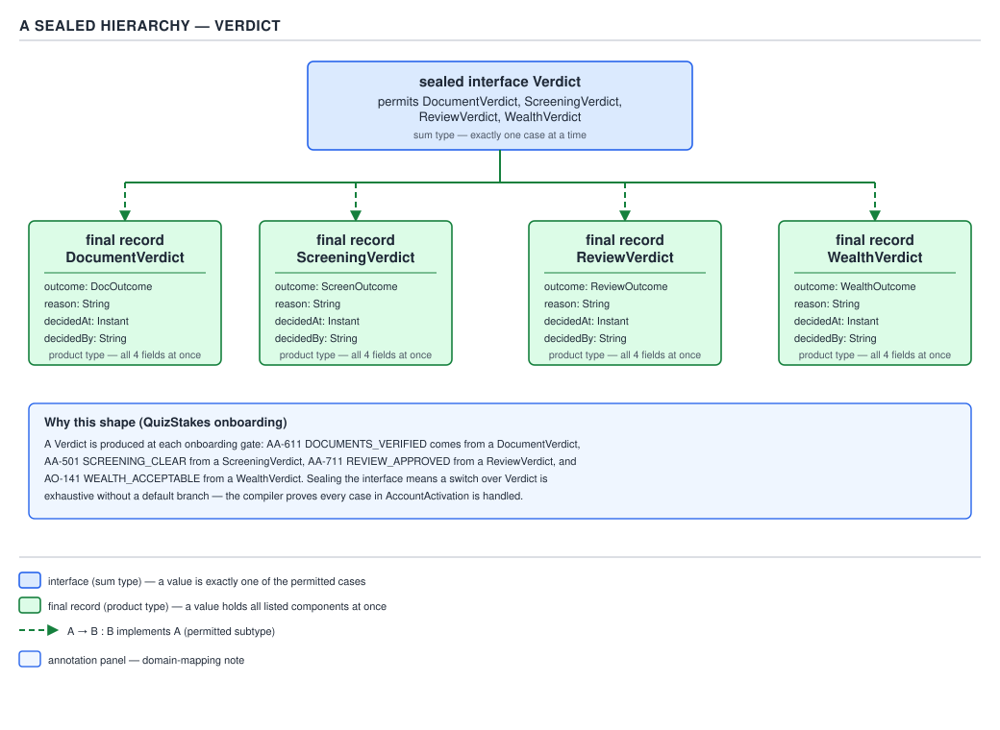
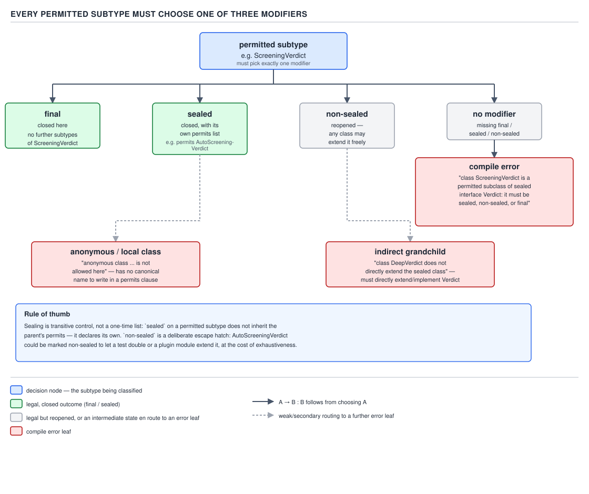
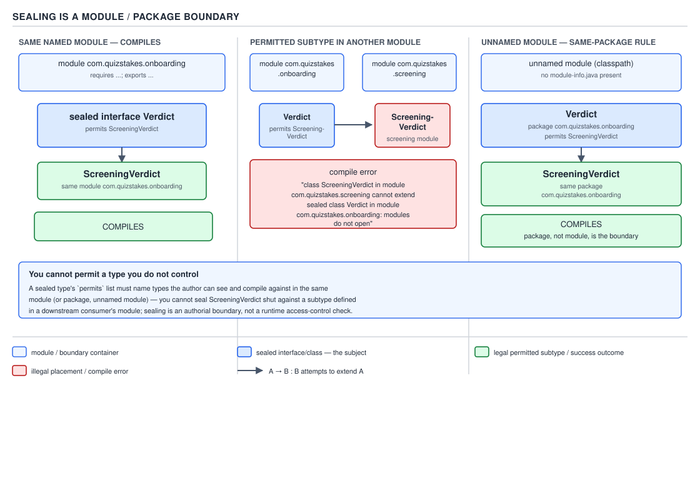

# 04 Modern Java — Sealed types — BASICS (§1.14)

**Target version: Java 21 LTS.** | **Part 1 of 5** | [Index](../00-index.md)
Previous: [Records — internals records](../records/03-internals-records.md) · Next: [Sealed types — data oriented programming](02-data-oriented-programming.md)

## The hierarchy, up front

QuizStakes' `Verdict` type is the running example for this whole file. A verdict is the outcome
of one of four decision points in onboarding — document verification, watchlist screening, human
review, wealth assessment — and every one of them needs the same shape: an outcome, a reason
code, when it was decided, who decided it. Before Java 17 you would model this as an interface
with four unrelated implementations and nothing stopping a fifth. `sealed` closes that off.

```java
public sealed interface Verdict
        permits DocumentVerdict, ScreeningVerdict, ReviewVerdict, WealthVerdict {
    Outcome outcome();
    Code reason();
    Instant decidedAt();
    Actor decidedBy();
}
```


**D-056** — A sealed hierarchy

That is the map for the rest of this file: one sealed interface, exactly four permitted
subtypes, each of them a record, each of them `final` by the rule you meet in the next
concept. The interface is the **sum type** — a `Verdict` is a `DocumentVerdict` *or* a
`ScreeningVerdict` *or* a `ReviewVerdict` *or* a `WealthVerdict`, nothing else, ever. Each record
is a **product type** — a `DocumentVerdict` is its outcome *and* its reason *and* its timestamp
*and* its actor, all at once. That vocabulary — sum of products — is §1.14.10 below, and it is
the single idea this whole file is building toward.

---

## `sealed` and `permits` — leaves 1.14.1, 1.14.2

### Mental model first

A `sealed` type is an enum where the "constants" are types instead of values. An `enum` gives you
a closed set of *instances* you enumerate by hand — `PENDING`, `ACTIVE`, `LIFTED`. A `sealed`
type gives you a closed set of *types* you enumerate by hand — `DocumentVerdict`,
`ScreeningVerdict`, `ReviewVerdict`, `WealthVerdict`. Same closure, one level up the type
hierarchy. Everything else in this file is consequences of that one move.

### Why it exists

Before Java 15, Java's inheritance model had exactly two positions on who may extend a type:
`final` (nobody) or open (anybody, anywhere, forever). There was no middle ground — no way to say
"exactly these four types, and no others, may implement `Verdict`." Library authors who wanted a
closed hierarchy — the compiler-checked kind, not the documentation-comment kind — had no
mechanism for it. They either gave up on closure (an open interface, with a Javadoc comment
saying "do not implement this outside the package," which the compiler cannot enforce and nothing
stops a caller from ignoring) or gave up on polymorphism (a single `final` class with a
discriminator field and an `if`/`else if` chain reading it, which is exactly the design pattern
sealed types exist to replace). Scala's sealed traits and Kotlin's sealed classes had already
demonstrated the shape works; JEP 360 brought it to the JVM as a preview in Java 15, JEP 397
carried it through a second preview in 16, and JEP 409 finalized it in Java 17. `[RESEARCH]`

**Unverified:** the exact JEP numbers and their release mapping (360 → 15 preview, 397 → 16
second preview, 409 → 17 final) are stated from the well-documented JEP history; this file did
not re-fetch the JEP text over the network to re-confirm the preview/final split, so treat the
release numbers as carrying ordinary confidence rather than freshly re-verified confidence.

### When to reach for it, and when not

Reach for `sealed` when you own every legitimate implementation of a type and you want the
compiler to prove that fact back to you — typically a result type, an event type, an AST node, or
(as here) a verdict/outcome type where "one of exactly these shapes" is the actual domain
invariant, not an accident of current requirements. Do not reach for it when third parties need
to extend the type — a plugin SPI, a `Comparator` a caller supplies, a `Runnable` — because sealing
is incompatible with that by construction (§1.14.15 below). And do not reach for it when the
"cases" carry no data of their own: that is what an enum is for (§1.14.11).

### How it works

`sealed` is a modifier on a class or interface declaration. `permits` is a clause naming exactly
which types may extend or implement it, written as an explicit, closed list. The compiler checks
this list at compile time — every name in `permits` must resolve to a real type that is currently
in scope and satisfies the same-module rule (§1.14.6), and conversely, any type not on the list
that attempts `extends Verdict` or `implements Verdict` is a compile error, full stop, no
override.

```java
public sealed interface Verdict permits DocumentVerdict, ScreeningVerdict, ReviewVerdict, WealthVerdict {
    Outcome outcome();
    Code reason();
    Instant decidedAt();
    Actor decidedBy();
}
```

Read left to right: `public sealed interface Verdict` declares the sum type and marks it sealed;
`permits DocumentVerdict, ScreeningVerdict, ReviewVerdict, WealthVerdict` is the exhaustive,
compiler-checked membership list. There is no fifth branch, ever, without editing this line.

**Insight:** `permits` is not a suggestion the compiler happens to check at the point you write a
`switch` — it is checked the moment any type is declared. `final class BankVerdict implements
Verdict` (not on the list) fails to compile at the point `BankVerdict` is declared, long before
anyone writes a `switch` over `Verdict`. The exhaustiveness payoff in §1.14.12 is downstream of
this earlier, stricter check.

### The example

```java
public sealed interface Verdict
        permits DocumentVerdict, ScreeningVerdict, ReviewVerdict, WealthVerdict {
    Outcome outcome();
    Code reason();
    Instant decidedAt();
    Actor decidedBy();
}

public record DocumentVerdict(Outcome outcome, Code reason, Instant decidedAt, Actor decidedBy)
        implements Verdict {}

public record ScreeningVerdict(Outcome outcome, Code reason, Instant decidedAt, Actor decidedBy)
        implements Verdict {}

public record ReviewVerdict(Outcome outcome, Code reason, Instant decidedAt, Actor decidedBy)
        implements Verdict {}

public record WealthVerdict(Outcome outcome, Code reason, Instant decidedAt, Actor decidedBy)
        implements Verdict {}
```

A `DocumentVerdict` issued by `DocumentVerification` after the identity-document check lands as
`new DocumentVerdict(Outcome.CLEAR, Code.of("AA-611"), Instant.now(), Actor.system("DocumentVerification"))`
— `AA-611 DOCUMENTS_VERIFIED` is the real status code this verdict corresponds to in the
onboarding status machine.

### The gotcha

`permits` is checked against types, not against instances, and it is checked once, at compile
time, against the whole compilation. It buys you nothing at the value level — a `null` reference
typed `Verdict` is still a perfectly legal `Verdict` variable, sealing has no opinion on nullness.
It only closes the question "what concrete types can this reference ever actually point to."

> **Definition:** `sealed` restricts a type's set of direct subtypes to an explicit,
> compiler-checked `permits` list, giving you the same declared, exhaustive closure over
> subtypes that an enum gives you over instances.

---

## The final/sealed/non-sealed obligation — leaf 1.14.3 `[TRAP]`

### Mental model first

Sealing the parent is only half the contract. The other half falls on every child: each
permitted subtype must itself declare, explicitly, what happens to *its* extensibility. There is
no silent default — the compiler forces the choice onto the page.

### Why it exists

If a permitted subtype could simply say nothing, the hierarchy's closure would be a lie one level
down: `Verdict` would be closed to four types, but `DocumentVerdict` could quietly be extended by
an unbounded fifth thing, and every exhaustive switch over `Verdict` would still be sound at the
`Verdict` level while silently missing behavior at the `DocumentVerdict` level. Requiring an
explicit modifier on every child makes the closure total, not partial — you can read the
declaration of any permitted subtype and know, without checking anywhere else, whether the
hierarchy is fully closed at that branch or deliberately reopened.

### When to reach for it, and when not

This isn't optional to reach for — the compiler enforces it on every subtype the moment you write
`sealed`. The choice you actually make is *which* of the three modifiers, and that choice is
covered leaf by leaf below and in D-057.

### How it works

Given `sealed interface Verdict permits DocumentVerdict, ...`, each of `DocumentVerdict`,
`ScreeningVerdict`, `ReviewVerdict`, `WealthVerdict` must be declared as exactly one of:

- `final` — this branch is closed, no further subtyping, ever;
- `sealed` — this branch is closed to an explicit list of its own, one level further down;
- `non-sealed` — this branch is reopened to arbitrary further extension.

A subtype declared with none of the three is a compile error. In this file's records, the choice
is automatic and free: **every `record` is implicitly `final`** — records cannot be extended by
anything, sealed hierarchy or not, because a record's identity is its component list, and letting
a subclass add fields would break the canonical-constructor/accessor contract records exist to
guarantee. So `record DocumentVerdict(...) implements Verdict {}` already satisfies the
obligation without writing the word `final` — the compiler treats the implicit final-ness of
records as discharging the sealed hierarchy's requirement.


**D-057** — Every permitted subtype must choose one of three modifiers

### The example

```java
// legal — a record is implicitly final, satisfying the obligation
public record DocumentVerdict(Outcome outcome, Code reason, Instant decidedAt, Actor decidedBy)
        implements Verdict {}

// legal — an explicit final class also satisfies it
public final class ScreeningVerdictImpl implements Verdict {
    public Outcome outcome() { return Outcome.CLEAR; }
    public Code reason() { return Code.of("AA-501"); }
    public Instant decidedAt() { return Instant.now(); }
    public Actor decidedBy() { return Actor.system("ScreeningService"); }
}

// legal — sealed further, one level down, with its own closed permits list
public sealed interface ReviewVerdictLike extends Verdict
        permits ReviewVerdict, EscalatedReviewVerdict {}

// legal — non-sealed reopens this one branch
public non-sealed class WealthVerdictBase implements Verdict {
    // any class anywhere, in any module, may now extend WealthVerdictBase
}
```

### The gotcha

**Pitfall:** assuming a `class` (not a `record`) that implements a sealed interface "inherits"
closure from the parent because the parent is sealed.

```java
// Wrong — this does not compile.
public sealed interface Verdict permits DocumentVerdict, ScreeningVerdict, ReviewVerdict, WealthVerdict {}

public class DocumentVerdict implements Verdict { }
// error: class DocumentVerdict is a permitted subclass of sealed interface Verdict, but
// is not declared final, sealed, or non-sealed
```

```java
// Right — pick one, explicitly, every time the subtype is not a record.
public final class DocumentVerdict implements Verdict { }
```

**Why people believe it:** sealing feels like a hierarchy-wide property, so it is tempting to
think "I sealed the top, that's enough." It sets the membership list at the top, but the
obligation is per-subtype and per-level — `Verdict` being sealed says nothing about whether
`DocumentVerdict` itself can be extended.

> **Definition:** every direct permitted subtype of a sealed type must declare itself `final`,
> `sealed`, or `non-sealed` — there is no default, and the compiler rejects the declaration
> otherwise.

---

## `non-sealed` — leaf 1.14.4

### Three beats (supporting fact)

**Mechanism:** `non-sealed` reopens exactly the one branch it is written on. Everything below that
point in the hierarchy is ordinary, unrestricted Java — any class, in any module, may extend a
`non-sealed` type freely, with no `permits` list of its own required.

**Gotcha:** it is the only modifier in the Java language written with a hyphen. Lexically it is
one contextual keyword, `non-sealed`, not the two tokens `non` and `sealed` joined by a minus
operator — `class Foo non - sealed` is not valid, and `non-sealed` may only appear directly before
`class` in a subtype declaration of a sealed type, nowhere else in the grammar.

> **Definition:** `non-sealed` is the modifier that deliberately reopens one branch of an
> otherwise-closed sealed hierarchy to unrestricted further extension, and the only hyphenated
> modifier in the language.

---

## Omitting `permits` when subtypes share the file — leaf 1.14.5 `[RESEARCH]`

### Three beats (supporting fact)

**Mechanism:** if every permitted subtype of a sealed type is declared in the *same source file*
as the sealed type itself, the `permits` clause may be omitted — the compiler already sees the
complete membership by reading the rest of the file, so writing it out again would be pure
repetition. This applies per source file, not per compilation unit in some looser sense: it is
specifically "same `.java` file," including multiple top-level types in one file. Verified against
the JLS's sealed-classes production, which states the permits clause is optional exactly when the
direct subtypes are declared in the same compilation unit as the sealed class or interface.
`[RESEARCH]`

```java
sealed interface Verdict {
    record DocumentVerdict(Outcome outcome, Code reason, Instant decidedAt, Actor decidedBy) implements Verdict {}
    record ScreeningVerdict(Outcome outcome, Code reason, Instant decidedAt, Actor decidedBy) implements Verdict {}
    record ReviewVerdict(Outcome outcome, Code reason, Instant decidedAt, Actor decidedBy) implements Verdict {}
    record WealthVerdict(Outcome outcome, Code reason, Instant decidedAt, Actor decidedBy) implements Verdict {}
}
```

**Gotcha:** this reads as convenient for a small, self-contained ADT, but it couples the sealed
type's declaration to a single-file layout. QuizStakes' actual `Verdict` hierarchy is spread
across separate files (one per verdict kind, alongside their owning services' other types), so
the explicit `permits` clause used through the rest of this file is not merely style here — it is
required, because the subtypes are not co-located in one file.

> **Definition:** `permits` may be omitted only when every permitted subtype is declared in the
> same source file as the sealed type; otherwise it is mandatory.

---

## The same-module / same-package rule — leaf 1.14.6 `[RESEARCH]` `[TRAP]` `[X-REF 03]`

### Mental model first

A sealed hierarchy is a promise about *who can extend this type*, and that promise has to be
enforceable at the moment the JVM loads the class — not just at the moment `javac` compiles it.
The mechanism Java reaches for to make that enforceable is the same one guide 03 (Java core)
covers for encapsulation generally: the module system's strong encapsulation, or, in its absence,
the package.

### Why it exists

Compile-time-only enforcement would be hollow: nothing would stop someone from compiling a
"permitted" subtype against an old `.class` file, then swapping in a different `Verdict.class`
at runtime with a different `permits` list, or handing the JVM a subtype compiled independently
against a stale view. To make sealing an actual, load-time-checked guarantee — not just a
javac-time courtesy — the JVM needs a boundary it can verify without re-running the compiler, and
the module (or, in the unnamed module, the package) is that boundary.

### When to reach for it, and when not

This is not a choice you make — it is the fixed rule any sealed hierarchy lives inside. The
choice you *do* make is how you organize your modules and packages so that a hierarchy you want
sealed ends up with all its permitted subtypes actually co-located; get that wrong and the design
you want is simply not expressible.

### How it works

Two regimes, and the rule is different depending on which one the sealed type lives in:

- **Named module:** every permitted subtype must be in the **same module** as the sealed type.
  They may be in different packages within that module.
- **Unnamed module** (no `module-info.java` — the common case for a single-JAR application or a
  simple multi-module Maven/Gradle build without full JPMS): every permitted subtype must be in
  the **same package** as the sealed type.

`[RESEARCH]` — re-verified against the JLS's rules for sealed classes: a subclass `C` of a sealed
class or interface `S` must, if `S`'s module is named, belong to the same module as `S`; if `S`'s
module is unnamed, `C` must belong to the same package as `S`.

The JVM verifier checks this at class-loading time using the class file's `PermittedSubclasses`
attribute (written by `javac`, read by the runtime) cross-checked against each subtype's own
module/package metadata — so this is not merely a `javac` convenience, it is load-time enforced.


**D-059** — Sealing is a module/package boundary

### The example

QuizStakes ships as a set of Spring Boot services without full JPMS modularity in most builds, so
the practical rule that applies is the unnamed-module one: `Verdict` and its four permitted
records must all live in the same package, conventionally something like
`com.quizstakes.activation.verdict`, even though the services that *issue* those verdicts —
`DocumentVerification`, `ScreeningService`, `InternalPlatforms`, `AssessmentService` — are
different services entirely. The verdict type is shared vocabulary that lives in one place; the
services that produce instances of it live elsewhere and simply depend on that package.

```java
// package com.quizstakes.activation.verdict;
public sealed interface Verdict permits DocumentVerdict, ScreeningVerdict, ReviewVerdict, WealthVerdict {
    Outcome outcome();
    Code reason();
    Instant decidedAt();
    Actor decidedBy();
}

// same package, different file — legal in the unnamed module
public record DocumentVerdict(Outcome outcome, Code reason, Instant decidedAt, Actor decidedBy)
        implements Verdict {}
```

If a team instead tried to declare `WealthVerdict` inside `AssessmentService`'s own package,
reasoning "the wealth-assessment service owns the wealth verdict," that would fail to compile in
the unnamed-module case — `WealthVerdict` is not in the same package as `Verdict`.

### The gotcha

**Pitfall:** believing sealing is purely a source-level, `javac`-only restriction, the way
package-private visibility can feel like "just" a compile-time convention that a determined caller
with reflection can route around.

```java
// Wrong assumption: "I can build a rogue permitted subtype in another module by
// hand-editing bytecode, since sealing is just a javac check."
```

```java
// Right: the module/package rule is baked into the class file's PermittedSubclasses
// attribute and re-checked by the JVM verifier at class-loading time — a rogue class
// compiled outside the module/package fails to load, not just fails to compile.
```

**Why people believe it:** most access-control-flavored language features in Java (`private`,
package-private) really are javac-time-only in the sense that reflection with
`setAccessible(true)` can bypass them; sealing looks similar on the surface, but the module
boundary it relies on is checked by the class loader, not merely by the compiler frontend, which
is guide 03's territory for the full mechanics of strong encapsulation and module boundaries.

> **Definition:** every permitted subtype of a sealed type must live in the same module as the
> sealed type (named-module case) or the same package (unnamed-module case), and the JVM
> re-verifies this at class-loading time via the `PermittedSubclasses` class-file attribute, not
> only at compile time.

---

## Direct extension only — leaf 1.14.7 `[RESEARCH]` `[PROVE]`

### Mental model first

`permits` is not "these types and anything under them" — it names exactly the *direct* children.
A grandchild has to earn its own place in its own parent's `permits` list; it gets nothing for
free from the grandparent.

### Why it exists

If `permits` implicitly covered every descendant, the sealed type's exhaustiveness guarantee
(§1.14.12) would become much weaker to reason about: a pattern switch over `Verdict` claiming to
be exhaustive over four cases would actually need to account for an unbounded tree of
transitively-permitted descendants, and "is this switch exhaustive" would require walking the
whole subtree rather than reading one `permits` line. Restricting `permits` to direct children
keeps each level's closure independently checkable.

### `[PROVE]` — walking the argument

Take a hypothetical extension of the `Verdict` hierarchy: suppose `ReviewVerdict` were sealed
further, to distinguish a first-pass review from an escalated one.

```java
sealed interface Verdict permits DocumentVerdict, ScreeningVerdict, ReviewVerdict, WealthVerdict {}

sealed interface ReviewVerdict extends Verdict
        permits StandardReviewVerdict, EscalatedReviewVerdict {}

record StandardReviewVerdict(Outcome outcome, Code reason, Instant decidedAt, Actor decidedBy)
        implements ReviewVerdict {}
record EscalatedReviewVerdict(Outcome outcome, Code reason, Instant decidedAt, Actor decidedBy)
        implements ReviewVerdict {}
```

Now ask: does `Verdict permits DocumentVerdict, ScreeningVerdict, ReviewVerdict, WealthVerdict`
need to additionally list `StandardReviewVerdict` and `EscalatedReviewVerdict`? Walk it through
the type relationships. `StandardReviewVerdict` does not `implements Verdict` — it
`implements ReviewVerdict`. Its *direct* supertype is `ReviewVerdict`, not `Verdict`. `Verdict`'s
`permits` clause enumerates types that directly extend or implement *`Verdict`* — `ReviewVerdict`
qualifies (it does `extends Verdict`), but `StandardReviewVerdict` does not, because the
relationship it has to `Verdict` is transitive (through `ReviewVerdict`), not direct. Therefore
`Verdict`'s `permits` list is correct exactly as originally written — four names, no more — and
`ReviewVerdict`'s own separate `permits` clause is where `StandardReviewVerdict` and
`EscalatedReviewVerdict` belong. A grandchild attempting to appear in the grandparent's list is
in fact an error the other way: `permits StandardReviewVerdict` written directly on `Verdict`
would be rejected, because `StandardReviewVerdict` does not directly implement `Verdict`.

`[RESEARCH]` — this matches the JLS's rule that each class in a `permits` clause must directly
extend (for classes) or directly implement (for interfaces) the sealed type; the compiler
diagnostic for naming a non-direct subtype in `permits` is a compile error at the sealed
declaration itself.

### The example

Exhaustive switches compose the same way sealing composes: a switch over `Verdict` needs four
arms (or three plus a nested check), and if you additionally sealed `ReviewVerdict`, a switch
specifically over `ReviewVerdict` needs its own two arms — the outer switch is not required to
know about `StandardReviewVerdict` at all unless it switches on the narrower type.

```java
static String summarize(Verdict verdict) {
    return switch (verdict) {
        case DocumentVerdict d -> "document: " + d.reason();
        case ScreeningVerdict s -> "screening: " + s.reason();
        case ReviewVerdict r -> "review: " + r.reason();     // covers both grandchildren
        case WealthVerdict w -> "wealth: " + w.reason();
    };
}
```

### The gotcha

**Pitfall:** trying to shortcut a two-level hierarchy by listing the grandchildren directly on the
top sealed type, hoping to "flatten" the `permits` clause.

**Insight:** direct-extension-only is exactly what makes multi-level sealed hierarchies compose
predictably — each `permits` clause is a complete, local answer to "what can appear here," and you
never need to look two levels down to know if a switch over the immediate type is exhaustive.

> **Definition:** a type may appear in a sealed type's `permits` clause only if it directly
> extends or implements that sealed type — a transitive (grandchild) relationship never counts,
> no matter how few intermediate types sit between them.

---

## Anonymous and local classes are permanently excluded — leaf 1.14.8 `[TRAP]` `[RESEARCH]`

### Mental model first

`permits` is a list of *names* the compiler can look up. Anonymous classes and local classes are
defined precisely by *not* having a name you can write down and reference from somewhere else —
so the entire mechanism sealing relies on (writing the subtype's name into another declaration's
`permits` clause) has no syntax available to it for these two kinds of class, structurally, not as
a policy choice someone could relax later.

### Why it exists

This isn't a restriction Java's designers debated and chose — it falls straight out of what an
anonymous class *is*. `new Runnable() { ... }` has no canonical, referenceable type name; the JLS
does not define one you could write in source. `permits AnonymousClass$1` is not valid syntax and
there is no name to put there instead. Local classes (declared inside a method body) do have a
simple name, but it is scoped to the method — unreachable from a `permits` clause written at the
enclosing type's declaration site, which lives outside that method's scope entirely.

### `[RESEARCH]`

Verified against the JLS's sealed-classes restrictions: the direct subclasses named in a
`permits` clause must be accessible from the compilation unit in which the sealed class or
interface is declared, and both anonymous classes and local classes are, by definition, excluded
from that requirement because neither has a canonical name usable at the point of declaration.

### The example

```java
sealed interface Verdict permits DocumentVerdict, ScreeningVerdict, ReviewVerdict, WealthVerdict {}

static Verdict makeAdHocVerdict() {
    // This does not compile:
    // return new Verdict() { public Outcome outcome() { return Outcome.REFERRED; } };
    // error: local classes must not extend sealed classes/interfaces
    // unless they are records
    return new ReviewVerdict(Outcome.REFERRED, Code.of("AA-700"), Instant.now(),
            Actor.system("InternalPlatforms"));
}
```

### The gotcha

**Pitfall:** reaching for an anonymous class as a quick one-off implementation of a sealed
interface, out of habit from working with unsealed functional-style interfaces.

**Wrong**

```java
Verdict ad hoc = new Verdict() {   // does not compile against a sealed interface
    public Outcome outcome() { return Outcome.CLEAR; }
    public Code reason() { return Code.of("AA-611"); }
    public Instant decidedAt() { return Instant.now(); }
    public Actor decidedBy() { return Actor.system("DocumentVerification"); }
};
```

**Right**

```java
Verdict verdict = new DocumentVerdict(Outcome.CLEAR, Code.of("AA-611"), Instant.now(),
        Actor.system("DocumentVerification"));
```

**Why people believe it:** anonymous classes are the reflex for "I need one throwaway instance of
this interface" everywhere else in Java, so the compile error reads as surprising the first time,
even though it is a direct consequence of `permits` needing a nameable type.

> **Definition:** anonymous classes and local classes can never be permitted subtypes of a sealed
> type, because neither has a canonical name that a `permits` clause can reference.

---

## The two ADT shapes — leaf 1.14.9

### Mental model first

There are two ways to write "a sealed sum of record products" in Java, and they look almost
identical on the page but carry a real design difference: a **sealed abstract class with record
subclasses**, or a **sealed interface implemented by records**. The choice is about whether the
cases need to *share* anything beyond the common contract — shared state, a shared method
implementation, a shared constructor step.

### Why it exists

Java only got sealed interfaces and sealed classes at the same time (both landed in JEP 409), so
this was a designed-in choice, not an accident of one shipping before the other. The two shapes
exist because "closed set of cases with per-case data" sometimes wants to share concrete behavior
across cases (favoring an abstract class, which can hold fields and method bodies) and sometimes
wants each case to be a pure, unrelated data shape implementing a pure contract (favoring an
interface, which records satisfy naturally since records cannot extend a class but can implement
any number of interfaces).

### When to reach for it, and when not

Reach for the **sealed interface** shape — `Verdict` as written throughout this file — when the
cases are pure data with no shared implementation beyond method signatures, and especially when a
record needs to implement more than one such contract (a record can implement several interfaces
but extend at most one class). Reach for the **sealed abstract class** shape when the cases share
concrete state or behavior worth factoring into a common superclass — a shared `id` field with a
generated accessor, a shared `toString` prefix, a template-method step every subtype must run
through.

```java
// Shape A — sealed interface, pure contract, all four cases are unrelated records
sealed interface Verdict permits DocumentVerdict, ScreeningVerdict, ReviewVerdict, WealthVerdict {
    Outcome outcome();
    Code reason();
}

// Shape B — sealed abstract class, shared concrete state (auditId) factored up
sealed abstract class VerdictBase permits DocumentVerdict2, ScreeningVerdict2 {
    private final UUID auditId = UUID.randomUUID();
    UUID auditId() { return auditId; }
    abstract Outcome outcome();
}
record DocumentVerdict2(Outcome outcome, Code reason) extends VerdictBase {}
record ScreeningVerdict2(Outcome outcome, Code reason) extends VerdictBase {}
```

Note the asymmetry that usually decides it in practice: a `record` can `extends` at most one
class (records already extend `java.lang.Record` implicitly, using up the single extension slot)
but `implements` any number of interfaces. So the moment a verdict record also needs to
implement, say, a serialization marker interface *and* participate in the sealed hierarchy, Shape
A (interface) is the only option available — Shape B would need the record to extend both
`VerdictBase` and something else, which Java does not allow.

| | Sealed interface + records | Sealed abstract class + record subclasses |
|---|---|---|
| Shared concrete state across cases | No — interfaces cannot hold instance fields | Yes — fields on the abstract class |
| Record can also implement other interfaces | Yes, freely | No — the single `extends` slot is spent |
| Reads as | Pure sum of independent products | Sum of products with a shared spine |
| QuizStakes fit | `Verdict` — four unrelated record shapes | would fit if all four verdicts needed a shared, generated `auditId` |

### How it works

Both shapes compile to the same core JVM mechanism: a `PermittedSubclasses` attribute on the
sealed type's class file, and `final`/checked modifiers on each subtype, exactly as covered above.
The difference is entirely at the source level — which supertype kind you pick — not in how
sealing itself is enforced.

### The diagram

Both D-056 and D-057 above already show the sealed-interface-plus-records shape used throughout
this file; no separate diagram is assigned to the abstract-class variant.

### The gotcha

**Insight:** the choice between the two shapes is really a decision about coupling, not about
sealing — sealing behaves identically either way. Picking the interface shape by default and only
reaching for the abstract-class shape when there is genuine shared state to factor up keeps each
verdict record small and independent, which matches how `Verdict`'s four cases actually differ in
QuizStakes: different reason-code namespaces, different issuing services, no shared logic beyond
the four accessor methods the interface already declares.

> **Definition:** a sealed hierarchy can be built either as a sealed interface implemented by
> records (pure contract, no shared state) or a sealed abstract class extended by record
> subclasses (shared concrete state, at the cost of a record's one `extends` slot) — choose by
> whether the cases need to share implementation, not by habit.

---

## Sum of products — leaf 1.14.10

### Mental model first

"Algebraic data type" sounds like category theory, but the arithmetic behind the name is literal
and worth actually doing once. A **product type** is a type whose value space is the *product* of
its components' value spaces — a record with fields `A` and `B` can hold any combination of an
`A` value and a `B` value, so its space has `|A| × |B|` values. A **sum type** is a type whose
value space is the *sum* (disjoint union) of its variants' spaces — a sealed type with cases `X`
and `Y` can be *either* an `X` or a `Y`, so its space has `|X| + |Y|` values, never both, never
mixed.

### Why it exists

Java had product types informally forever — any class with more than one field is, in this sense,
a product type; records in Java 16 just made that pattern a first-class, boilerplate-free
construct. What Java lacked, before sealed types plus pattern matching, was a first-class sum
type: a way to say "this value is exactly one of these N shapes" that the compiler could check
exhaustively. Languages with algebraic data types built in (ML-family languages, Haskell, Scala,
Rust's `enum`) have had this pairing for decades; sealed interfaces plus records plus pattern
matching for switch is Java's arrival at the same destination via its own type-system building
blocks, rather than a single unified `data` keyword.

### When to reach for it, and when not

Reach for the sum-of-products framing whenever a value is naturally "one of a small, closed set of
shapes, each carrying its own data" — a `Verdict`, a parse-tree node, an HTTP response outcome, a
payment-run line item's disposition. Do not reach for it when the shapes are not actually
disjoint — when a value can simultaneously be more than one "kind" at once, a sum type is the
wrong model and a set of independent boolean flags or a different composition (traits/mixins) fits
better.

### How it works

`Verdict permits DocumentVerdict, ScreeningVerdict, ReviewVerdict, WealthVerdict` is the sum:
exactly four alternatives, no fifth, checked at compile time via `permits`. Each alternative —
`record DocumentVerdict(Outcome outcome, Code reason, Instant decidedAt, Actor decidedBy)` — is
the product: an `Outcome` **and** a `Code` **and** an `Instant` **and** an `Actor`, all four
present simultaneously, checked at compile time via the record's component list and canonical
constructor. The compiler enforces the sum's exhaustiveness through `permits` plus pattern-switch
coverage checking (§1.14.12) and enforces each product's completeness through the record's
generated constructor, which cannot be called without supplying every component.

### The example

Working the actual value-space arithmetic makes the "sum" and "product" words concrete rather
than decorative. Suppose (for illustration only — QuizStakes' real `Outcome` and `Code` types are
richer) `Outcome` were a 3-value enum (`CLEAR`, `REFERRED`, `FAILED`) and, for a single verdict
kind, `Code` were drawn from a small closed set of 5 reason codes relevant to that kind, with
`Instant` and `Actor` treated as large/unbounded value spaces `I` and `A`. Then one verdict
record's product space is `3 × 5 × |I| × |A|` — every legal *combination* of those four
components is a distinct, reachable value of that record type. The `Verdict` sum, restricted to
just this record among the four, contributes exactly that many values to `Verdict`'s total value
space, added to (not multiplied by) whatever the other three verdict records contribute — a
`Verdict` value is never simultaneously "shaped like" two of the four records, which is precisely
what "sum" (disjoint union) means as opposed to "product."

```java
sealed interface Verdict permits DocumentVerdict, ScreeningVerdict, ReviewVerdict, WealthVerdict {}

// Product: every DocumentVerdict carries all four components together, always.
record DocumentVerdict(Outcome outcome, Code reason, Instant decidedAt, Actor decidedBy)
        implements Verdict {}

// A Verdict reference is exactly one variant at a time — never a blend.
static String kind(Verdict v) {
    return switch (v) {
        case DocumentVerdict d -> "document";
        case ScreeningVerdict s -> "screening";
        case ReviewVerdict r -> "review";
        case WealthVerdict w -> "wealth";
    };
}
```

### The gotcha

**Insight:** "sum of products" is not a metaphor borrowed loosely from math — the JLS's own
exhaustiveness checking for pattern switches is, in effect, a compiler that can literally count the
cases (the sum's cardinality of *kinds*, via `permits`) and, separately for record patterns, count
the components each kind must destructure (the product's arity). The vocabulary earns its keep
because it is the same reasoning the compiler is doing.

> **Definition:** a sealed interface (or class) implemented by records gives Java algebraic data
> types — the sealed type is a sum (a closed set of mutually exclusive shapes) and each record is
> a product (a fixed tuple of components all present at once).

---

## Sealed versus enum — leaf 1.14.11 `[X-REF 03]`

### Mental model first

An `enum` closes a set of **instances**. A `sealed` type closes a set of **types**. `RestrictionType.STAKE_BLOCKED` is one specific, singleton value — there is exactly one `STAKE_BLOCKED`
object in the whole JVM. `DocumentVerdict` is not a value at all — it is a *shape* that can be
instantiated an unbounded number of times, each instance carrying its own outcome, reason,
timestamp, and actor.

### Why it exists

This is the deepest structural reason the two features coexist rather than one subsuming the
other: an enum constant is a fixed compile-time value with no room for construction-time data
(strictly speaking, `enum` constants *can* carry constructor arguments, but every instance of a
given constant like `STAKE_BLOCKED` is still the same singleton object everywhere it is used — the
constructor arguments are baked into the class body once, not supplied per-use-site). A sealed
type's cases are ordinary types you instantiate as many times as you like, with different data on
each instance. QuizStakes needs both, side by side, for exactly the reason its own vocabulary
splits this way: `RestrictionType` — `DEPOSIT_BLOCKED`, `STAKE_BLOCKED`, `WITHDRAWAL_BLOCKED`,
`DEPOSIT_LIMITED`, `WITHDRAWAL_HELD`, `SOURCE_OF_FUNDS_REQUIRED`, `ALL_BLOCKED`, `SELF_EXCLUDED`,
`COOLING_OFF`, `DORMANT_FROZEN` — is a fixed, small, closed set of *kinds of restriction* with no
per-case data of its own (every `STAKE_BLOCKED` restriction is the same kind of restriction,
whichever client it's attached to), which is exactly what an enum is for. `Verdict`, by contrast,
needs per-instance data — *which* outcome, *which* reason code, *when*, *by whom* — that varies
every time a verdict is issued, which is exactly what a sealed hierarchy of records is for.

### When to reach for it, and when not

Use an enum when the cases carry **no per-case data** — the case itself *is* the entire payload,
and every occurrence of that case is interchangeable with every other occurrence. Use a sealed
type when each case needs to carry its **own data that varies per instance**. The tell: if you
find yourself wanting to add a field to an enum constant that varies not by *which constant* it is
but by *which occurrence* of that constant you're looking at (e.g., "this particular
`STAKE_BLOCKED` restriction was set at 14:02 by `ADMIN`, that one at 09:15 by
`SYSTEM_ONBOARDING`"), that variable data belongs on a wrapping type — QuizStakes' actual
`RestrictionKey(RestrictionType type, RestrictionSource source)` and the enclosing `Restriction`
aggregate, not squeezed into the enum constant itself.

### How it works

Mechanically, an `enum` compiles to a `final` class extending `java.lang.Enum`, with one `public
static final` field per constant, each field pointing to the single instance of that constant —
`ordinal()` and `name()` come from `Enum`, `values()` and `valueOf(String)` are synthesized by the
compiler. There is no `permits` clause because there is nothing to permit — nobody can add a
"fifth instance" of an enum's already-fixed set the way somebody could try to add a fifth record
implementing a sealed interface; the enum class itself is implicitly `final` (or `sealed`, in the
rarer case of an enum with constant-specific class bodies, covered fully in guide 03's treatment
of enums). A `sealed` interface has no instances of its own at all — it is a pure contract, and
every value that flows through the type system as a `Verdict` is actually, at runtime, an
instance of one of the four concrete record classes.

### The example

```java
// A closed set of instances — no per-case data, an enum is exactly right.
public enum RestrictionType {
    DEPOSIT_BLOCKED, STAKE_BLOCKED, WITHDRAWAL_BLOCKED, DEPOSIT_LIMITED,
    WITHDRAWAL_HELD, SOURCE_OF_FUNDS_REQUIRED, ALL_BLOCKED, SELF_EXCLUDED,
    COOLING_OFF, DORMANT_FROZEN
}

// A closed set of types, each carrying its own per-instance data — sealed is right.
public sealed interface Verdict permits DocumentVerdict, ScreeningVerdict, ReviewVerdict, WealthVerdict {
    Outcome outcome();
    Code reason();
    Instant decidedAt();
    Actor decidedBy();
}
```

Every `RestrictionType.STAKE_BLOCKED` reference in the codebase points to the same object; every
`new ScreeningVerdict(...)` call produces a distinct object with its own `decidedAt` and
`decidedBy`. That is the whole distinction, made concrete.

| | `enum` | `sealed` type |
|---|---|---|
| Closes a set of | instances | types |
| Per-case data | none (constant-specific bodies aside) | yes, arbitrary, per instance |
| Number of runtime objects per case | exactly one, ever | unbounded |
| QuizStakes example | `RestrictionType` | `Verdict` |

### The gotcha

**Pitfall:** modeling something that genuinely needs per-instance data as an enum anyway, by
bolting mutable or constructor-supplied fields onto the constants and then discovering every use
of that constant shares the same field values.

**Wrong**

```java
public enum Verdict {
    DOCUMENT(Outcome.CLEAR, Code.of("AA-611")),   // baked in at class-load time —
    SCREENING(Outcome.CLEAR, Code.of("AA-501"));  // every DOCUMENT verdict "is" this one outcome/reason

    private final Outcome outcome;
    private final Code reason;
    Verdict(Outcome outcome, Code reason) { this.outcome = outcome; this.reason = reason; }
}
// Cannot represent: a DOCUMENT verdict with outcome REFERRED, decided at a specific
// Instant, by a specific Actor — there is only ever one DOCUMENT constant.
```

**Right**

```java
public sealed interface Verdict permits DocumentVerdict, ScreeningVerdict, ReviewVerdict, WealthVerdict {}
public record DocumentVerdict(Outcome outcome, Code reason, Instant decidedAt, Actor decidedBy)
        implements Verdict {}
// Every call site constructs its own instance with its own data.
```

**Why people believe it:** enums are the more familiar, older feature (Java 5 versus Java 17), so
"add a case" reflexively means "add an enum constant" even once the case genuinely needs data that
varies per occurrence rather than per kind. The container-level mechanics of enums — `values()`,
`EnumMap`, `EnumSet`, constant-specific method bodies — are guide 03's territory for the full
treatment.

> **Definition:** an enum closes a set of instances with no per-occurrence data; a sealed type
> closes a set of types, each of which can carry arbitrary per-instance data — pick by whether the
> cases need data that varies per occurrence, not by which feature is more familiar.

---

## What sealing buys you: exhaustiveness — leaf 1.14.12 `[PROVE]`

### Mental model first

An exhaustive `switch` over a sealed type is a *compile-time* proof that every case has been
handled — not a runtime fallback, not a `default` arm quietly swallowing anything unexpected. Add
a fifth verdict kind, and every switch over `Verdict` in the entire codebase that lacks a
`default` becomes a compile error at the next build, pointing at exactly the switches that need a
new arm.

### Why it exists

Before sealed types plus pattern matching for switch, an `instanceof`/`if`-`else if` chain (or a
`switch` with a `default`) over an open hierarchy could never be checked for completeness by the
compiler — there was no way to know, at compile time, the full set of subtypes that could show up.
Adding a new subtype anywhere in a large codebase was silently unsafe: every existing chain kept
compiling, kept running, and simply fell through its `default` (or its final `else`) for the new
case, often doing something wrong or nothing at all, discovered only at runtime, if ever. This is
precisely the failure pattern guide 03's coverage of enum switches also addresses for enums; sealed
types extend the same discipline to arbitrary type hierarchies.

### `[PROVE]` — working it through

Take the earlier `summarize` switch and watch what happens, mechanically, when a fifth verdict
kind is introduced.

```java
sealed interface Verdict permits DocumentVerdict, ScreeningVerdict, ReviewVerdict, WealthVerdict {}
record DocumentVerdict(Outcome outcome, Code reason, Instant decidedAt, Actor decidedBy) implements Verdict {}
record ScreeningVerdict(Outcome outcome, Code reason, Instant decidedAt, Actor decidedBy) implements Verdict {}
record ReviewVerdict(Outcome outcome, Code reason, Instant decidedAt, Actor decidedBy) implements Verdict {}
record WealthVerdict(Outcome outcome, Code reason, Instant decidedAt, Actor decidedBy) implements Verdict {}

static String summarize(Verdict v) {
    return switch (v) {
        case DocumentVerdict d -> "document";
        case ScreeningVerdict s -> "screening";
        case ReviewVerdict r -> "review";
        case WealthVerdict w -> "wealth";
    };
}
```

This compiles today because the switch's arms exactly cover `permits`'s four names — the compiler
can enumerate `Verdict`'s permitted subtypes from the class file (or, within the same compilation,
from the source) and check each one is matched by some arm. Now suppose a fifth verdict kind is
added for a new automated-affordability gate:

```java
sealed interface Verdict permits DocumentVerdict, ScreeningVerdict, ReviewVerdict, WealthVerdict, AffordabilityVerdict {}
record AffordabilityVerdict(Outcome outcome, Code reason, Instant decidedAt, Actor decidedBy) implements Verdict {}
```

Recompiling `summarize` now fails: `switch (v)` no longer covers every permitted subtype of
`Verdict` — `AffordabilityVerdict` has no arm — and because there is no `default`, the compiler
reports the switch expression as not exhaustive, at the exact call site, at compile time, before
the code ever ships. This is the mechanical proof: exhaustiveness checking is a direct, syntactic
consequence of `permits` being a complete, closed, compiler-visible list — the compiler is not
doing anything clever or heuristic here, it is literally set-comparing the switch's covered types
against the sealed type's `permits` set.

### The diagram

D-056 above already shows the closed four-way hierarchy this exhaustiveness check operates over;
no separate diagram is assigned to this leaf.

### The example

```java
static String routeToTeam(Verdict verdict) {
    return switch (verdict) {
        case DocumentVerdict d when d.outcome() == Outcome.REFERRED -> "document-review-team";
        case DocumentVerdict d -> "auto-cleared";
        case ScreeningVerdict s when s.outcome() == Outcome.REFERRED -> "compliance-team";
        case ScreeningVerdict s -> "auto-cleared";
        case ReviewVerdict r -> "already-human-reviewed";
        case WealthVerdict w when w.outcome() == Outcome.REFERRED -> "wealth-review-team";
        case WealthVerdict w -> "auto-cleared";
    };
}
```

Every arm here is a real routing decision QuizStakes' `AccountActivation` service needs to make
from a `Verdict`, and the compiler's exhaustiveness check is the guarantee that whoever adds a
fifth verdict kind next quarter cannot forget to update this method — the build breaks for them
here, not for a client seeing a missing-routing bug in production.

### The gotcha

**Pitfall:** adding a `default` arm defensively "just in case," which silently defeats the whole
guarantee — the switch compiles regardless of whether a new case is added, exactly the failure
mode sealing was meant to eliminate.

**Wrong**

```java
static String summarize(Verdict v) {
    return switch (v) {
        case DocumentVerdict d -> "document";
        case ScreeningVerdict s -> "screening";
        case ReviewVerdict r -> "review";
        case WealthVerdict w -> "wealth";
        default -> "unknown";   // adding AffordabilityVerdict now compiles silently,
                                 // routes to "unknown", and nobody is told
    };
}
```

**Right**

```java
static String summarize(Verdict v) {
    return switch (v) {
        case DocumentVerdict d -> "document";
        case ScreeningVerdict s -> "screening";
        case ReviewVerdict r -> "review";
        case WealthVerdict w -> "wealth";
        // no default — the compiler forces every future case to be handled here
    };
}
```

**Why people believe it:** `default` is the reflexive habit from years of switching over `int` and
`String`, where there genuinely is no way to enumerate every possible value and a `default` is the
only sound way to close the switch. Over a sealed type the set of values actually is enumerable,
so `default` trades a compile-time safety net for a false sense of defensive coding.

> **Definition:** sealing turns a `switch` over the sealed type into a compiler-checked
> exhaustiveness proof — adding a case anywhere in the hierarchy becomes a compile error in every
> unguarded switch over it, converting a class of runtime fall-through bugs into build failures.

---

## What sealing buys the compiler: narrowing conversions — leaf 1.14.13 `[RESEARCH]` `[PROVE]`

### Mental model first

Casting has always been able to fail at runtime with a `ClassCastException` when the compiler
cannot prove a narrowing cast is even *possible*, let alone correct. With a sealed hierarchy, the
compiler can sometimes prove a cast is **impossible** — not just risky — because it knows the
complete set of types a reference could ever actually be.

### Why it exists

Ordinary (non-sealed) reference types give the compiler no information about what a variable's
runtime type could be beyond its declared static type — any subtype, anywhere, forever, is
possible in principle, so a downcast to an unrelated interface can only ever be checked at
runtime. Once a hierarchy is sealed, the compiler has a complete, closed enumeration of every
possible runtime type behind a reference of the sealed type, which is new information it did not
have before Java 17 and which it can use for compile-time reasoning that was previously
unavailable for interface types.

### `[PROVE]` — working it through

```java
sealed interface Verdict permits DocumentVerdict, ScreeningVerdict, ReviewVerdict, WealthVerdict {}
record DocumentVerdict(Outcome outcome, Code reason, Instant decidedAt, Actor decidedBy) implements Verdict {}
record ScreeningVerdict(Outcome outcome, Code reason, Instant decidedAt, Actor decidedBy) implements Verdict {}
record ReviewVerdict(Outcome outcome, Code reason, Instant decidedAt, Actor decidedBy) implements Verdict {}
record WealthVerdict(Outcome outcome, Code reason, Instant decidedAt, Actor decidedBy) implements Verdict {}

interface Unrelated {}   // does not implement Verdict, is not sealed, is not a permitted subtype

static void attempt(Verdict v) {
    Unrelated u = (Unrelated) v;   // compile error, not a runtime CCE
}
```

Walk the reasoning the compiler performs. `v`'s static type is `Verdict`, and `Verdict` is sealed
with exactly four permitted subtypes: `DocumentVerdict`, `ScreeningVerdict`, `ReviewVerdict`,
`WealthVerdict`. For the cast `(Unrelated) v` to succeed at runtime, `v`'s *actual* runtime class
would have to implement `Unrelated`. But the compiler knows, exhaustively, that `v`'s runtime
class can only ever be one of those four record classes — there is no fifth possibility, by the
same `permits`-derived closure exhaustiveness relies on. If none of those four record classes
implements `Unrelated` (and in this example none does, since `Unrelated` is a separate,
unconnected interface), then the cast is not merely unlikely to succeed, it is **provably
impossible for every value the type system admits as a `Verdict`** — and the compiler rejects it
at compile time as an inconvertible-types error, rather than deferring to a runtime
`ClassCastException` the way it would for a cast to an unrelated *non-sealed* interface (where the
compiler cannot rule out some future or unknown class implementing both).

`[RESEARCH]` — this narrowing-reference-conversion rule is part of the JLS's casting-conversion
rules updated for sealed types: a cast to an interface type is rejected at compile time when the
source's type is a sealed type (or has a sealed supertype) whose complete, transitively-known
set of permitted implementations includes no type compatible with the target interface, since no
future subtype could ever be added outside that closed set.

### The example

Contrast with an ordinary, unsealed interface, where the identical-looking cast is legal at
compile time and only fails at runtime:

```java
interface Handler {}   // not sealed
static void attempt(Handler h) {
    Unrelated u = (Unrelated) h;   // compiles — Handler is open, some future
                                     // class could implement both Handler and Unrelated
}
```

The only difference between the two examples is whether the source type is sealed. Sealing is
what lets the compiler move a whole class of impossible casts from "discovered at runtime, maybe
in production" to "rejected at the next build."

### The gotcha

**Interview:** "what compile-time benefit does sealing give you beyond exhaustive switches?" —
narrowing reference conversions can be statically rejected when the sealed hierarchy proves the
cast target is unreachable from any permitted subtype, catching a class of `ClassCastException`s
at compile time that an open hierarchy could never catch until runtime.

> **Definition:** because a sealed type's complete set of possible runtime types is known at
> compile time, the compiler can reject as impossible any narrowing cast to a type that none of
> the permitted subtypes can ever satisfy — turning some `ClassCastException`s into compile
> errors.

---

## The cost across an API boundary — leaf 1.14.14 `[TRAP]`

### Mental model first

Everything §1.14.12 called a feature — adding a case breaks every unguarded switch — is, from the
outside of a module boundary, the same fact wearing a different hat: it is a **breaking change**.
Exhaustiveness is a compile-time safety net for code you control; it is a compile-time landmine
for code you don't.

### Why it exists

This tension is not a flaw in the design, it is the direct, unavoidable consequence of what
exhaustiveness *means*. A guarantee that "every consumer handles every case" can only hold if
every consumer is recompiled whenever the case set changes — there is no way to have
compiler-enforced exhaustiveness for existing binaries you did not recompile. Sealing does not
pretend otherwise; it makes the tradeoff visible and puts the decision about extensibility (via
`permits`, `non-sealed`, or leaving the type open entirely) in the type's author's hands rather
than papering over it.

### When to reach for it, and when not

This is exactly why §1.14.15 frames sealing as a **within-module** design tool by default: within
one module (or one team's release cadence), adding a permitted subtype and fixing every switch in
the same commit is routine, low-risk engineering — the compiler does the finding for you. Across
a published API boundary — a library whose `Verdict`-equivalent type ships to external consumers
who compile against an older library version — adding a new permitted subtype is source-breaking
for every consumer's exhaustive switch, and binary compatibility questions (does an old `.class`
file compiled against the four-case version even load against the new five-case version?) need
the same care any binary-compatibility change needs.

### How it works

Concretely: `AccountActivation` and every other QuizStakes service that switches over `Verdict`
without a `default` arm is, at that point, coupled to `Verdict`'s exact `permits` list. If
`Verdict` is published as part of a shared internal library consumed by services that are not all
redeployed together, adding `AffordabilityVerdict` to `permits` requires every consuming service's
build to be updated in lockstep — or at minimum, every consuming service's exhaustive switch to be
patched and redeployed — before or alongside the library bump. This is not a hypothetical: it is
the same category of concern guide 03 covers for binary compatibility of enums (`values()` order,
`ordinal()` stability, adding constants) — sealed types inherit the same "closed set" fragility
across a compiled-against boundary, for the same underlying reason.

### The example

```java
// library v1 — published, consumed by three independent services
public sealed interface Verdict permits DocumentVerdict, ScreeningVerdict, ReviewVerdict, WealthVerdict {}

// consumer, compiled against v1, in a separately-deployed service
static String summarize(Verdict v) {
    return switch (v) {
        case DocumentVerdict d -> "document";
        case ScreeningVerdict s -> "screening";
        case ReviewVerdict r -> "review";
        case WealthVerdict w -> "wealth";
    };
}

// library v2 — adds a case, entirely reasonable from the library author's side
public sealed interface Verdict permits DocumentVerdict, ScreeningVerdict, ReviewVerdict, WealthVerdict, AffordabilityVerdict {}
```

The consumer's `summarize` method now fails to *compile* the moment its build picks up library
v2 — every one of the three independently-deployed services needs a coordinated fix, which is
exactly the kind of cross-team rollout cost a purely additive change (like adding a new method
with a default implementation to an interface) does not carry.

### The gotcha

**Pitfall:** treating a sealed type in a shared library exactly like an internal, single-module
sealed type, and adding a permitted subtype as if it were a routine, backward-compatible change.

```java
// Wrong belief: "adding a case to a sealed interface is additive, like adding a new
// method with a default body — it can't break anyone downstream."
```

```java
// Right: across a compiled-against API boundary, adding a permitted subtype is
// source-incompatible for every unguarded exhaustive switch a consumer wrote against
// the old permits list — version it, or accept the coordinated-rollout cost, deliberately.
```

**Why people believe it:** most Java API-evolution guidance trains engineers to think "additive =
safe" (new methods, new overloads, new constants), and sealed types look additive on the page —
one more name in a list — while behaving, for exhaustive consumers, like a breaking removal of a
`default` arm's safety net.

> **Definition:** adding a permitted subtype is source-incompatible for every unguarded exhaustive
> switch a consumer has written against the sealed type — a benefit inside one release unit, a
> breaking change across a compiled-against API boundary.

---

## Sealing as a within-module design tool — leaf 1.14.15

### Three beats (supporting fact)

**Mechanism:** you can only name a type in `permits` if you can declare it in the required
module/package (§1.14.6) — which means you cannot seal a hierarchy that includes a type you do not
control, such as a class from a third-party library or from an unrelated team's module. Sealing is
therefore inherently a closed-world tool: it only works when the author of the sealed type also
controls, or can coordinate with, every one of its permitted subtypes.

**Gotcha:** this rules out ever using `sealed` to retroactively "close" a hierarchy someone else's
code already extends — you cannot add a `permits` clause to an existing open interface and list
subtypes living in dependency JARs you do not own, both because you cannot edit those
dependencies' declarations to add the required modifier (§1.14.3) and because they very likely
fail the same-module rule (§1.14.6) outright.

> **Definition:** because every permitted subtype must satisfy the module/package rule and the
> final/sealed/non-sealed obligation, you can only seal a hierarchy whose every member you author
> or directly coordinate with — making sealing a within-module (or within-team) design tool, not a
> way to retroactively close a hierarchy you do not fully control.

---

## `sealed` + `non-sealed` as a controlled extension point — leaf 1.14.16

### Three beats (supporting fact)

**Mechanism:** combining the two modifiers gives a framework author a deliberate escape hatch: seal
the top-level type to a small, closed set of first-party cases, but mark exactly one of those
cases `non-sealed` to say "extend *here*, not anywhere else." QuizStakes' `WealthVerdict` is a
plausible candidate for this shape if the wealth-assessment pipeline is expected to grow
pluggable, third-party-scored variants over time while `DocumentVerdict`, `ScreeningVerdict`, and
`ReviewVerdict` stay fixed:

```java
public sealed interface Verdict
        permits DocumentVerdict, ScreeningVerdict, ReviewVerdict, WealthVerdict {}

public non-sealed interface WealthVerdict extends Verdict {
    Outcome outcome();
    Code reason();
}
// any module may now supply its own WealthVerdict implementation —
// a third-party affordability-scoring vendor's plugin, for instance —
// while DocumentVerdict, ScreeningVerdict, and ReviewVerdict remain fully closed.
```

**Gotcha:** exhaustiveness (§1.14.12) still holds at the top level — a switch over `Verdict` still
has exactly four arms, one of them `case WealthVerdict w -> ...` — but a switch that tries to
further discriminate *which kind* of `WealthVerdict` it received has no compiler help at all,
because `WealthVerdict` itself is open; that discrimination falls back to ordinary
`instanceof`/`getClass()` checks with no exhaustiveness guarantee, which is the price paid for the
extension point.

> **Definition:** pairing `sealed` at one level with `non-sealed` on exactly one permitted subtype
> creates a controlled extension point — a fixed, closed menu of first-party cases plus one
> deliberately open branch for third-party or pluggable implementations.

---

## Reflection: `isSealed()` and `getPermittedSubclasses()` — leaf 1.14.17 `[RESEARCH]`

### Three beats (supporting fact)

**Mechanism:** `Class<?>` gained two methods for sealed types: `boolean isSealed()`, true if the
class or interface is declared `sealed`, and `Class<?>[] getPermittedSubclasses()`, returning the
classes named in its `permits` clause (or an explicit, empty array if the type is not sealed,
`[RESEARCH]` — verified against the `java.lang.Class` javadoc for JDK 21, which documents
`getPermittedSubclasses()` as returning `null` if this `Class` object does not represent a sealed
class or interface, and returning a zero-length array if it is sealed with no permitted subtypes
declared, which cannot actually occur for a compiled sealed type since `permits` cannot be
empty). Both methods read straight off the class file's `PermittedSubclasses` attribute — the
same load-time-verified attribute the JVM itself checks per §1.14.6.

```java
Class<Verdict> verdictClass = Verdict.class;
verdictClass.isSealed();                       // true
verdictClass.getPermittedSubclasses();          // [DocumentVerdict.class, ScreeningVerdict.class,
                                                 //  ReviewVerdict.class, WealthVerdict.class]
```

**Gotcha:** `getPermittedSubclasses()` returns the *direct* permitted subtypes only, mirroring
§1.14.7 — walking a multi-level sealed hierarchy reflectively requires recursing into each
returned `Class`'s own `getPermittedSubclasses()`, there is no single call that flattens the whole
tree.

> **Definition:** `Class.isSealed()` and `Class.getPermittedSubclasses()` expose the same
> `permits` information the compiler and JVM verifier use, letting reflective code (serialization
> frameworks, schema generators) discover a sealed type's direct case list at runtime.

---

## Three ways to restrict extension, compared — leaf 1.14.18

### Mental model first

`final`, a package-private constructor, and `sealed` are three different answers to "who may
extend this type," and they sit at three different points on two axes: how visible the
restriction is, and how fine-grained the control is.

### Why it exists

Before `sealed`, Java engineers reached for whichever of the first two tools got close enough:
`final` when no subtyping was wanted at all, a package-private (or private) constructor when
*some* subtyping was wanted but only from inside the same file or package (the classic "closed
class hierarchy" idiom used for things like `Optional`-style internal implementations before
sealed types existed). Neither tool can express "exactly these five named types, from possibly
different packages, and no others" — which is the specific gap `sealed` closes.

### When to reach for it, and when not

Reach for **`final`** when there is exactly one implementation and it should never be extended,
period — no meaningful subtype relationship at all. Reach for a **package-private constructor**
when you want an open-looking public type but a compiler-enforced (not just documented) guarantee
that all implementations live in one package, and you do not need to name them individually or get
exhaustiveness checking. Reach for **`sealed`** when you want to name the exact, closed
membership explicitly, get compiler-checked exhaustiveness in pattern switches, and optionally
allow membership to span multiple packages within one module.

### How it works

| | `final` | Package-private constructor | `sealed` |
|---|---|---|---|
| Extension allowed | none | subclasses within the same package/file only (whoever can call the constructor) | exactly the named types in `permits` |
| Granularity | all-or-nothing | package-wide, no explicit list | explicit, per-type list |
| What the compiler can prove | no subtypes exist | subtypes exist only where the constructor is callable — but their identities aren't enumerated | the *exact* enumerated set of subtypes, enabling exhaustive switch and narrowing-cast checks |
| Cross-package membership within one module | not applicable (no subtypes) | no — the constructor's visibility caps it at one package | yes — permitted subtypes may span packages within the same module |
| Exhaustive switch support | trivial (one type) | none — the compiler has no closed list to check against | yes — the entire mechanism in §1.14.12 |
| Reflective discovery of the full case set | not applicable | not directly possible — nothing enumerates the subtypes | `Class.getPermittedSubclasses()` |

### The example

```java
// final — no subtyping at all
public final class LedgerEntry { }

// package-private constructor — an old-style closed hierarchy, pre-sealed-types idiom
public abstract class RestrictionKeyLike {
    RestrictionKeyLike() {}   // package-private: only same-package code can extend
}

// sealed — the exact, named, exhaustively-checkable membership
public sealed interface Verdict permits DocumentVerdict, ScreeningVerdict, ReviewVerdict, WealthVerdict {}
```

The package-private-constructor idiom can approximate "closed to this package," but it can never
give you the exhaustive-switch guarantee of §1.14.12, because the compiler has no `permits`-style
list to check a switch's coverage against — it only knows the constructor is inaccessible outside
the package, not which specific subtypes actually exist.

### The gotcha

**Interview:** "why not just use a package-private constructor instead of `sealed`?" — because the
compiler cannot enumerate the subtypes from constructor visibility alone, so you get neither
exhaustive-switch checking nor narrowing-cast rejection; `sealed` is a strict upgrade wherever
those two compiler guarantees are worth having, at the cost of naming every subtype explicitly.

> **Definition:** `final` restricts extension to none, a package-private constructor restricts it
> to same-package subclasses without naming them, and `sealed` restricts it to an explicit,
> compiler-enumerated list that also unlocks exhaustive-switch and narrowing-cast checking — each
> trades granularity and visibility differently, and `sealed` is the only one of the three that
> gives the compiler a closed, named set to reason about.

---

## D-058 — Sealed interface vs enum vs open polymorphism

**D-058** — Sealed interface vs enum vs open polymorphism

| | `enum` | Sealed interface | `final` class | Package-private constructor | Open interface |
|---|---|---|---|---|---|
| Closed set of instances | Yes | No | Not applicable (no subtypes) | No | No |
| Closed set of types | No | Yes | Yes (the set is exactly one type) | Partially (package-scoped, unenumerated) | No |
| Open, unrestricted extension | No | No | No | No | Yes |
| Per-case data | No (constant-specific bodies aside) | Yes, arbitrary | Not applicable | Yes, per subclass | Yes, arbitrary |
| Exhaustiveness in a switch | Yes, via `values()` coverage | Yes, via `permits` coverage | Trivial (one type) | No | No |
| Who can add a case | Only the enum's own author, by editing the enum body | Only whoever can edit the sealed type's `permits` and satisfies the module/package rule | Nobody — extension is disallowed entirely | Anyone in the same package who can call the constructor | Anyone, anywhere, in any module |
| Cost of adding a case | Source change to the enum; existing exhaustive switches without `default` fail to compile until updated | Source change to `permits`; existing exhaustive switches without `default` fail to compile until updated (§1.14.14) | Not applicable | No compiler signal at all — silent, undetected by any switch | No compiler signal at all — silent, undetected by any switch |
| Cross-module extensibility | No — enum constants are fixed to the declaring class | No, unless a branch is `non-sealed` (§1.14.16) | No | No — constructor visibility caps it at one package | Yes, unrestricted |
| Reflection support | `values()`, `Enum.valueOf`, `Class.isEnum()`, `Class.getEnumConstants()` | `Class.isSealed()`, `Class.getPermittedSubclasses()` (§1.14.17) | none needed — no subtypes exist | none — subtypes are not enumerable reflectively | `Class.isInterface()` only; no closed membership to enumerate |

QuizStakes mapping: `RestrictionType` is the `enum` column's worked example — a closed set of
restriction kinds (`DEPOSIT_BLOCKED`, `STAKE_BLOCKED`, `WITHDRAWAL_BLOCKED`, `DEPOSIT_LIMITED`,
`WITHDRAWAL_HELD`, `SOURCE_OF_FUNDS_REQUIRED`, `ALL_BLOCKED`, `SELF_EXCLUDED`, `COOLING_OFF`,
`DORMANT_FROZEN`) with no per-case data — every `STAKE_BLOCKED` restriction is the same kind,
regardless of which client, source, or timestamp it's attached to (that variable data lives on
`RestrictionKey` and the `Restriction` aggregate instead). `Verdict` is the sealed-interface
column's worked example throughout this whole file — a closed set of four types, each carrying its
own per-instance outcome, reason, timestamp, and actor.

---

## Pitfalls

### Assuming a permitted subtype inherits closure automatically from a sealed parent

**Wrong**

```java
public sealed interface Verdict permits DocumentVerdict, ScreeningVerdict, ReviewVerdict, WealthVerdict {}
public class DocumentVerdict implements Verdict { }
// error: class DocumentVerdict is a permitted subclass of sealed interface Verdict,
// but is not declared final, sealed, or non-sealed
```

**Right**

```java
public final class DocumentVerdict implements Verdict { }
// or, more naturally here, just use a record — records are implicitly final
public record DocumentVerdict(Outcome outcome, Code reason, Instant decidedAt, Actor decidedBy)
        implements Verdict {}
```

**Why people believe it:** sealing reads as a hierarchy-wide property, so "I sealed the top" feels
like it should be the end of the story; the obligation is actually per-subtype, every level down.

### Reaching for an anonymous class to implement a sealed interface

**Wrong**

```java
Verdict verdict = new Verdict() {
    public Outcome outcome() { return Outcome.CLEAR; }
    public Code reason() { return Code.of("AA-611"); }
    public Instant decidedAt() { return Instant.now(); }
    public Actor decidedBy() { return Actor.system("DocumentVerification"); }
};
// error: local classes must not extend sealed classes/interfaces unless they are records
```

**Right**

```java
Verdict verdict = new DocumentVerdict(Outcome.CLEAR, Code.of("AA-611"), Instant.now(),
        Actor.system("DocumentVerification"));
```

**Why people believe it:** anonymous classes are the standard one-off-implementation reflex for
any interface elsewhere in Java; sealed interfaces are the one place that reflex silently stops
working, because `permits` has no way to name an anonymous class.

### Adding a defensive `default` arm to a switch over a sealed type

**Wrong**

```java
static String summarize(Verdict v) {
    return switch (v) {
        case DocumentVerdict d -> "document";
        case ScreeningVerdict s -> "screening";
        case ReviewVerdict r -> "review";
        case WealthVerdict w -> "wealth";
        default -> "unknown";   // swallows every future case silently
    };
}
```

**Right**

```java
static String summarize(Verdict v) {
    return switch (v) {
        case DocumentVerdict d -> "document";
        case ScreeningVerdict s -> "screening";
        case ReviewVerdict r -> "review";
        case WealthVerdict w -> "wealth";
    };
}
```

**Why people believe it:** `default` is muscle memory from switching over `int`/`String`, where a
closed enumeration of values is impossible; over a sealed type the enumeration is complete and
compiler-checked, so `default` trades away the entire safety net for a false sense of caution.

### Adding a permitted subtype to a sealed type published across an API boundary, treating it as a routine additive change

**Wrong**

```java
// library v2, shipped without coordinating with consumers
public sealed interface Verdict permits DocumentVerdict, ScreeningVerdict, ReviewVerdict, WealthVerdict, AffordabilityVerdict {}
```

**Right**

```java
// version deliberately, or add a non-sealed extension point (§1.14.16) up front if
// third-party growth is expected, or coordinate a lockstep rollout across every consumer's
// exhaustive switches before shipping the new permitted subtype.
```

**Why people believe it:** most Java API evolution advice trains "additive changes are safe," and
a new name in `permits` looks additive; for exhaustive consumers it behaves like removing a
`default` arm's safety net (§1.14.14).

## Cheat sheet

| Concept | One-line fact |
|---|---|
| `sealed` + `permits` | Closes a type's direct subtypes to an explicit, compiler-checked list; JEP 360/397/409, final in Java 17 |
| Subtype obligation | Every permitted subtype must be `final`, `sealed`, or `non-sealed` — no default; records are implicitly `final` |
| `non-sealed` | The only hyphenated modifier; reopens one branch to unrestricted extension |
| Omitting `permits` | Legal only when every subtype is declared in the same source file |
| Module/package rule | Same module (named module) or same package (unnamed module); enforced at class-load time via `PermittedSubclasses` |
| Direct extension only | `permits` lists direct children only; a grandchild needs its own parent's `permits` entry |
| Anonymous/local classes | Can never be permitted subtypes — no canonical name for `permits` to reference |
| Two ADT shapes | Sealed interface + records (no shared state, multiple interfaces OK) vs sealed abstract class + record subclasses (shared state, spends the record's one `extends` slot) |
| Sum of products | Sealed type = sum (disjoint union of kinds); record = product (all components at once) |
| Sealed vs enum | Enum closes instances (no per-case data); sealed closes types (arbitrary per-instance data) |
| Exhaustiveness | Adding a case breaks every unguarded switch at compile time — a feature inside a module |
| Narrowing-cast rejection | Compiler can reject a cast as impossible when no permitted subtype can satisfy the target type |
| API-boundary cost | The same exhaustiveness is source-breaking for consumers compiled against the old `permits` list |
| Within-module tool | You cannot seal a hierarchy including a type you do not control (fails §1.14.3 and/or §1.14.6) |
| Controlled extension point | Seal the top, mark exactly one branch `non-sealed` for pluggable growth |
| Reflection | `Class.isSealed()`, `Class.getPermittedSubclasses()` — direct subtypes only |
| Three restriction tools | `final` (none), package-private constructor (unenumerated, same package), `sealed` (explicit, enumerated, exhaustive-switch-enabled) |

## Self-test

**Q1.** Why does `record DocumentVerdict(...) implements Verdict {}` satisfy the
final/sealed/non-sealed obligation without ever writing the word `final`?

<details><summary>Answer</summary>

Every `record` is implicitly `final` — a record's identity is its component list plus the
canonical constructor and generated accessors, and allowing a subclass would let that subclass add
fields or override accessors in ways that break the record's own equals/hashCode/toString
contract. Because `final` is one of the three legal choices for a permitted subtype, and a record
is always `final` by the language's own rules, declaring `record DocumentVerdict(...) implements
Verdict {}` already discharges the obligation — there is nothing further to write.

</details>

**Q2.** `Verdict` is declared in a project with no `module-info.java`. Where must `DocumentVerdict`,
`ScreeningVerdict`, `ReviewVerdict`, and `WealthVerdict` live for the hierarchy to compile?

<details><summary>Answer</summary>

In the same package as `Verdict`. With no `module-info.java`, the project's code lives in the
unnamed module, and the rule for the unnamed module is same-package, not same-module — the four
records must all sit in the same package as the `Verdict` interface, even if they are split across
separate `.java` files.

</details>

**Q3.** `Verdict` is sealed to `permits DocumentVerdict, ScreeningVerdict, ReviewVerdict,
WealthVerdict`, and `ReviewVerdict` is itself sealed to `permits StandardReviewVerdict,
EscalatedReviewVerdict`. Does `Verdict`'s `permits` clause need to list `StandardReviewVerdict`
and `EscalatedReviewVerdict`?

<details><summary>Answer</summary>

No, and it must not — `permits` only accepts types that *directly* extend or implement the sealed
type being declared. `StandardReviewVerdict` and `EscalatedReviewVerdict` directly implement
`ReviewVerdict`, not `Verdict`; their relationship to `Verdict` is transitive, through
`ReviewVerdict`. Naming them directly in `Verdict`'s own `permits` clause would be rejected by the
compiler, because neither directly extends or implements `Verdict`.

</details>

**Q4.** Can you write `new Verdict() { ... }` as a quick throwaway implementation for a test, the
way you might for an unsealed interface?

<details><summary>Answer</summary>

No. Anonymous classes have no canonical name, and `permits` can only reference types by name — so
anonymous classes (and local classes, for the same reason, scoping aside) can never be permitted
subtypes of a sealed type. The compiler rejects `new Verdict() { ... }` with an error to that
effect. You must construct one of the four named record types instead.

</details>

**Q5.** Why does `RestrictionType` stay an enum while `Verdict` is a sealed interface, given that
both are "closed sets of things" in QuizStakes?

<details><summary>Answer</summary>

`RestrictionType`'s cases (`DEPOSIT_BLOCKED`, `STAKE_BLOCKED`, and so on) carry no per-case data —
every `STAKE_BLOCKED` restriction, wherever it's attached, is the same kind of restriction; the
data that varies (which client, which source, when) lives on the surrounding `RestrictionKey` and
`Restriction` aggregate, not on the enum constant itself. `Verdict`'s cases each carry data that
varies per instance — outcome, reason code, timestamp, actor differ every time a verdict is
issued. An enum closes a set of instances with no per-occurrence data; a sealed type closes a set
of types that can each carry arbitrary per-instance data. `RestrictionType` fits the first shape;
`Verdict` fits the second.

</details>

**Q6.** A switch over `Verdict` has four arms and no `default`. A teammate adds a fifth permitted
subtype, `AffordabilityVerdict`. What happens to the switch at the next build, and why is that
different from what would happen if `Verdict` were an ordinary, unsealed interface?

<details><summary>Answer</summary>

The switch fails to compile — it is no longer exhaustive, because the compiler compares the
switch's covered types against `Verdict`'s complete `permits` set and finds `AffordabilityVerdict`
unhandled. If `Verdict` were an ordinary unsealed interface, the compiler would have no closed set
to check the switch's coverage against in the first place — such a switch would need a `default`
to compile at all, and adding a new implementing class anywhere would never trigger any
compile-time signal; the gap would only surface at runtime, if the new case ever reached that
switch and fell into the `default` doing the wrong thing.

</details>

**Q7.** Why can the compiler sometimes reject `(SomeUnrelatedInterface) someSealedTypeValue` as a
compile error rather than deferring to a runtime `ClassCastException`?

<details><summary>Answer</summary>

Because sealing gives the compiler a complete, closed enumeration of every possible runtime type
behind a reference of the sealed type. If none of those permitted subtypes implements
`SomeUnrelatedInterface`, then the cast cannot possibly succeed for any value the type system
admits as an instance of the sealed type — there is no fifth, unknown subtype that could someday
implement both, the way there could be for an ordinary open interface. The compiler can therefore
prove the cast impossible and reject it at compile time as an inconvertible-types error instead of
letting it fail at runtime.

</details>

**Q8.** A shared library publishes `sealed interface Verdict permits A, B, C {}` and three
independently-deployed services each write an exhaustive switch over it with no `default`. The
library then ships `permits A, B, C, D`. What breaks, and for whom?

<details><summary>Answer</summary>

Every one of the three services' exhaustive switches fails to compile the moment their build picks
up the new library version, because none of them handles the new case `D` and none of them has a
`default` arm to fall back on. This is source-incompatible for every consumer compiled against the
old four-case `permits` list, even though, from the library author's side, adding a case looks
purely additive — the same exhaustiveness that is a safety net inside one module becomes a
coordinated-rollout cost across an API boundary.

</details>

**Q9.** Why can't you retroactively seal a hierarchy that includes a subtype from a third-party
dependency JAR you don't control?

<details><summary>Answer</summary>

Two independent rules block it. First, every permitted subtype must satisfy the same-module (or
same-package, in the unnamed module) rule — a class shipped in someone else's JAR is very unlikely
to live in your module or package. Second, every permitted subtype must itself declare `final`,
`sealed`, or `non-sealed` — you cannot edit a dependency's source to add that modifier even if the
module/package rule happened to be satisfied. Because you cannot control both requirements for a
type you do not own, sealing only works as a within-module (or within-team) design tool over types
you author or directly coordinate with.

</details>

**Q10.** What does `Class.getPermittedSubclasses()` return for `Verdict.class`, and what does it
return for a class that is `final` but not `sealed`?

<details><summary>Answer</summary>

For `Verdict.class`, it returns an array containing `DocumentVerdict.class`,
`ScreeningVerdict.class`, `ReviewVerdict.class`, and `WealthVerdict.class` — the direct types named
in its `permits` clause. For a class that is merely `final` (not `sealed`), it returns `null`,
per the `Class` javadoc's rule that the method returns `null` when the `Class` object does not
represent a sealed class or interface at all.

</details>

## Deferred

None.

## Open questions

- The exact JEP-to-release mapping stated in §1.14.1 (JEP 360 → 15 preview, JEP 397 → 16 second
  preview, JEP 409 → 17 final) was stated from well-established JEP history rather than re-fetched
  from a JEP mirror during this file's writing; re-confirm against `bugs.openjdk.org` or
  `javaalmanac.io` if this exact mapping is ever quoted verbatim in a downstream document.

---

**Leaves covered:** 1.14.1–1.14.18 (18 leaves)
**Leaves deferred:** none
**Diagrams included:** D-056, D-057, D-058, D-059
**Target version:** Java 21 LTS
**Lines:** 1653
