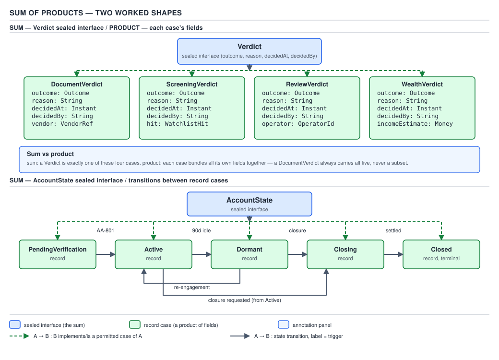
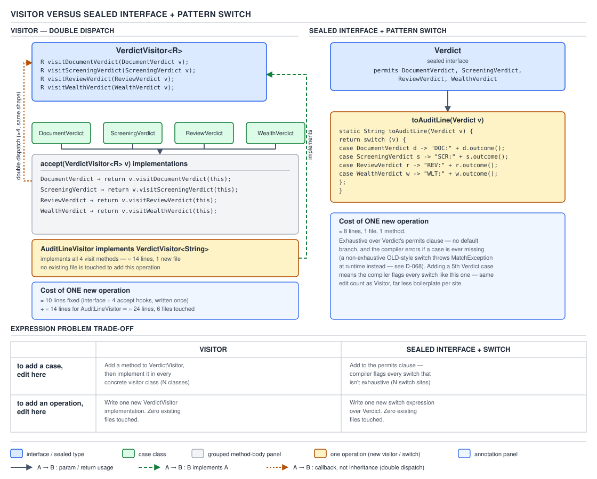

# 04 Modern Java — Sealed types — INTERMEDIATE (§2.9)

**Target version: Java 21 LTS.** | **Part 2 of 5** | [Index](../00-index.md)
Previous: [Sealed types — basics](01-basics.md) · Next: [Sealed types — internals sealed](03-internals-sealed.md)

Part 1 established the mechanics: `sealed`, `permits`, the three closure forms (`final`,
`sealed`, `non-sealed`), and how the compiler enforces the permitted-subtypes list at compile
time. This file is about what that closure is *for*. A closed hierarchy plus a record's structural
transparency plus an exhaustive `switch` is not three separate Java 17/21 features that happen to
compose — it is a coherent programming style, which Brian Goetz named **data-oriented programming**
(DOP) in the essay of the same title. This file builds the style up from the type-theory naming
(§2.9.1), states Goetz's own principles rather than a paraphrase (§2.9.2), proves the case against
Visitor with real line counts (§2.9.3), works the expression problem on the page (§2.9.4), and then
spends the rest of the file on the shapes this style actually produces in a service: a state
machine, a `Result` type, a parse tree, a protocol message set, a domain event stream, and finally
what happens when one of these hierarchies crosses a wire as JSON.

## The hierarchy this file works with, up front

Two worked hierarchies recur through this file. Seeing both before the details land is the point
of "hierarchy before details."

| Hierarchy | Sum (the sealed interface) | Products (the record cases) | Where it comes from |
|---|---|---|---|
| Compliance verdicts | `Verdict` | `DocumentVerdict`, `ScreeningVerdict`, `ReviewVerdict`, `WealthVerdict` | Appendix C's type sketch — a `Verdict(outcome, reason, decidedAt, decidedBy)` sealed hierarchy |
| Account lifecycle | `AccountState` | `PendingVerification`, `Active`, `Dormant`, `Closing`, `Closed` | The bare-name account machine: `PENDING_VERIFICATION`, `ACTIVE`, `DORMANT`, `CLOSING`, `CLOSED` |


**D-110** — Sum of products

The diagram shows both hierarchies side by side: `Verdict` as the sum, with each record case
expanded into its labelled components (the product), and next to it the account lifecycle drawn as
the same shape — a sealed interface of records, with the legal transitions drawn as labelled edges
between the case boxes. Everything below is one or the other of these two hierarchies; nothing new
is invented mid-file.

---

### Algebraic data types in Java: sealed types are the sum, records are the product

**Mental model.** A type is the set of values a variable of that type can hold. A **product type**
is a type whose value set is the *Cartesian product* of its components' value sets — a
`DocumentVerdict` with an `Outcome` (3 values), a `String reason`, an `Instant decidedAt`, a
`String decidedBy`, and a `String documentType` can hold any combination of those five fields
simultaneously, so its state space is the product of all five. A **sum type** is a type whose value
set is the *disjoint union* of several alternatives — a `Verdict` is *either* a `DocumentVerdict`
*or* a `ScreeningVerdict` *or* a `ReviewVerdict` *or* a `WealthVerdict`, never a blend, and the
membership is closed. Multiply the field counts together for a product; add the case counts
together for a sum. That arithmetic distinction is the whole of "algebraic" in algebraic data
types — it names the two operations, product and sum, that combine to build every shape in this
file.

**Why it exists.** Java has always had product types — every class with more than one field is one,
informally. What Java lacked until Java 17 (`sealed`, JEP 409) was a *closed* sum type: a type whose
full membership the compiler knows. An `interface` with no `sealed` modifier is an **open** sum —
anyone, anywhere, in any module, can add a new implementer, so the compiler can never tell you
you've handled every case. `enum` was Java's only *closed* sum before sealed types, but an enum's
cases cannot each carry different shaped data — every `RestrictionType` constant has the exact same
fields as every other. Sealed interfaces close the membership list *and* let each case be a
differently-shaped record. That combination — closed sum, heterogeneous product cases — is new to
Java 17, even though both halves individually predate it by a decade.

**When to reach for it, and when not.** Reach for a sealed sum when the set of cases is fixed by
the business domain and known at compile time — `Verdict`'s four kinds of compliance decision do
not grow without a product decision and a code change to match. Do **not** reach for it when a
third party must be able to add a case without your source tree — that is the open-polymorphism
side of §2.9.9, covered later in this file, and forcing it into a sealed hierarchy just to get
exhaustiveness checking is the mistake §2.9.8's pitfall documents.

**How it works.** The `permits` clause **is** the sum — it is a fixed-cardinality list the compiler
stores in the class file (the internal spelling: a `PermittedSubclasses` attribute, in JVMS §4.7.31,
covered mechanically in file 03 of this part) and checks at compile time against every declared
subtype. A record's canonical constructor **is** the product — Part 1 covered that a record
implicitly declares one field per component, one accessor per component, and a canonical
constructor whose parameter list is exactly the component list; the state space of a
`DocumentVerdict` is therefore literally the Cartesian product `Outcome × String × Instant × String
× String`. Put the two together and `Verdict` occupies exactly `|DocumentVerdict-values| +
|ScreeningVerdict-values| + |ReviewVerdict-values| + |WealthVerdict-values|` — a sum of products,
by construction, not by convention.

```java
sealed interface Verdict permits DocumentVerdict, ScreeningVerdict, ReviewVerdict, WealthVerdict {
    Outcome outcome();
    String reason();
    Instant decidedAt();
    String decidedBy();
}

enum Outcome { APPROVED, REJECTED, REFERRED }

record DocumentVerdict(
        Outcome outcome, String reason, Instant decidedAt, String decidedBy,
        String documentType) implements Verdict {}

record ScreeningVerdict(
        Outcome outcome, String reason, Instant decidedAt, String decidedBy,
        boolean potentialMatch) implements Verdict {}

record ReviewVerdict(
        Outcome outcome, String reason, Instant decidedAt, String decidedBy,
        String operatorId) implements Verdict {}

record WealthVerdict(
        Outcome outcome, String reason, Instant decidedAt, String decidedBy,
        BigDecimal assessedIncome) implements Verdict {}
```

Each record independently satisfies `Verdict`'s four accessor methods by matching component names,
then adds exactly one field the others don't have — `documentType`, `potentialMatch`, `operatorId`,
`assessedIncome` — which is the "product" part doing real work: a `ReviewVerdict` genuinely needs an
operator id that a `WealthVerdict` has no use for, and forcing every `Verdict` to carry all four
extra fields (with nulls for the ones that don't apply) is exactly the illegal-state problem §2.9.2
names next.

**The gotcha.** The `permits` clause does not have to be written explicitly when every permitted
subtype is declared in the same file (or nested inside the sealed type) and appears textually
*after* it, or *before* it if the compiler can see all of them in one compilation unit — the
compiler infers the list from every `implements Verdict` it can see. Once a `Verdict` implementer
lives in a different file, `permits` becomes mandatory to state, because the compiler cannot scan
the whole world for implementers of an interface. Teams sometimes conclude from the top-level
`Verdict.java` file (with all four records nested or colocated) that `permits` is "optional
syntax" — it is optional *spelling*, never an optional *constraint*; the closed membership exists
either way.

> A sealed type is a **sum** whose membership is closed and known at compile time; a record is a
> **product** whose state space is the Cartesian product of its components — together they give
> Java the two type-algebra operations it needs to model a domain exhaustively.

---

### Data-oriented programming as Brian Goetz frames it `[RESEARCH]`

**Mental model.** Object-oriented design's default instinct is to attach behavior to data and hide
the data behind that behavior — a `Verdict` object that computes its own audit line, decides its
own escalation policy, and knows how to render itself, all inside methods on the `Verdict` class
itself. Data-oriented programming inverts the default: data is a **first-class, transparent value**
that behavior operates *on*, not *inside*. The mental picture is a spreadsheet, not an actor — rows
and columns you can see the whole shape of, that a formula (a method living somewhere else,
possibly in several different places for several different purposes) reads and produces a new row
from, never mutates in place.

**Why it exists — verified, not paraphrased.** The syllabus leaf you were handed states DOP as
"model data as immutable data, keep behaviour separate, make illegal states unrepresentable, use
exhaustive pattern matching." That is close but not exactly Goetz's own wording, and this is a
`[RESEARCH]` leaf, so here is the actual source. Goetz's *Data Oriented Programming in Java* names
**four principles**, and they are not phrased the way most secondary summaries render them:

1. **Model the data, the whole data, and nothing but the data.** A data carrier's shape should
   reflect exactly the information it represents — no more (no behavior bolted on for convenience)
   and no less (no missing field papered over with a sentinel or a `null`).
2. **Data is immutable.** Once constructed, a data value's fields never change; deriving a new
   value from an old one always produces a *new* object.
3. **Make illegal states unrepresentable.** The type system itself — not a validator, not a
   runtime check — should make it impossible to construct a value that violates the domain's
   invariants.
4. **Validate at the boundary.** Because the type system enforces invariants only on values that
   already exist, every value must be validated once, at the point it enters the system (parsing
   input, deserializing a request), after which every consumer can trust the type without
   re-checking it.

Exhaustive pattern matching is not one of the four principles — it is the **consumption mechanism**
DOP leans on to keep behavior separate from data without giving up compile-time safety. Because
`Verdict` is a closed sum, a `switch` over it can be checked exhaustive by the compiler, which is
what makes "behavior lives outside the data, in switches over the data's shape" viable at all
without silently missing a case. State it that way — mechanism supporting the principles, not a
fifth principle — because that is what the source essay actually argues, and it is a more useful
fact for an interview than a flat list of five bullet points that blurs the distinction.

**When to reach for it, and when not.** DOP earns its keep where a domain has many kinds of
records or events flowing through a system that mostly *inspects and transforms* them —
compliance verdicts, ledger movements, payment protocol messages. It loses to conventional OOP
encapsulation where the "object" genuinely owns hidden, mutable, protected state that must never be
inspected from outside — a connection pool's live socket list, a `ReentrantLock`'s internal queue.
The tell is principle 1: if there is no clean, complete, "whole data" shape to model — because the
type's entire reason to exist is *hiding* state, not representing it — DOP is the wrong style for
that type, even in a codebase that otherwise leans on it heavily.

**How it works, principle by principle, on `Verdict`.**

- *Model the data, the whole data, and nothing but the data* — `Verdict`'s four common accessors
  (`outcome`, `reason`, `decidedAt`, `decidedBy`) are exactly the information every verdict carries
  regardless of kind; the per-case extra field (`documentType`, `potentialMatch`, `operatorId`,
  `assessedIncome`) is exactly the information only that kind carries. Nothing is missing, nothing
  is padding.
- *Data is immutable* — every field above is declared `final` by the record mechanism (Part 1's
  compact-constructor coverage; see also the corrected diagnostic in the box below), so a
  `WealthVerdict` computed once for an application can be shared across threads, cached, and handed
  to three different consumers without a defensive copy.
- *Make illegal states unrepresentable* — before sealed types, a single `Verdict` class with five
  optional fields (`documentType` nullable, `potentialMatch` nullable-boxed-`Boolean`, `operatorId`
  nullable, `assessedIncome` nullable) could represent the illegal state of a `Verdict` that is
  simultaneously a document check *and* a wealth check, or neither. `Verdict permits
  DocumentVerdict, …` makes that combination *impossible to construct* — there is no code path that
  produces an object with both `documentType` and `assessedIncome` set, because no such class
  exists.
- *Validate at the boundary* — `AssessmentService` is the boundary: it is the one place that turns
  raw affordability inputs into a `WealthVerdict`, and its constructor call is the only place the
  `assessedIncome` invariant (must be non-negative, must carry a currency-consistent `Money` scale)
  is checked. Every consumer downstream — `ApplicationHistory`, the audit exporter, the review
  queue — receives an already-valid `WealthVerdict` and never re-validates it.

**Insight:** the reason this style survived Java's historical allergy to "public fields, dumb data"
is that records give the *transparency* of a public-field struct while keeping value semantics
(`equals`/`hashCode`/`toString` generated, no aliasing surprise from a mutable public field) —
DOP is only safe in Java because records made "transparent" and "immutable" the same declaration.

**A minimal concrete example.** A pure function that reads `Verdict` data and produces a decision
without the `Verdict` type itself knowing anything about audit formatting — behavior kept separate,
per principle:

```java
static String auditLine(Verdict verdict) {
    String base = "%s decided %s by %s: %s".formatted(
            verdict.outcome(), verdict.decidedAt(), verdict.decidedBy(), verdict.reason());
    return switch (verdict) {
        case DocumentVerdict v -> base + " [document=" + v.documentType() + "]";
        case ScreeningVerdict v -> base + " [potentialMatch=" + v.potentialMatch() + "]";
        case ReviewVerdict v -> base + " [operator=" + v.operatorId() + "]";
        case WealthVerdict v -> base + " [assessedIncome=" + v.assessedIncome() + "]";
    };
}
```

`Verdict` has no `auditLine()` method, no `toString()` override tuned for auditing, no knowledge
that an audit exporter exists at all — the data stays inert and the behavior lives in whichever
service actually needs it, which is principle 1 and 3 working together in nine lines.

**The gotcha.** "Make illegal states unrepresentable" is a type-system property, not a runtime
guarantee against *bad* legal states. `WealthVerdict(Outcome.APPROVED, "", Instant.now(), "",
BigDecimal.valueOf(-500))` compiles — negative assessed income is a legal *shape* even though it is
a nonsensical *value*. Sealed types plus records close off illegal *combinations of fields*; they
do nothing for illegal *values within* a field's own type. Principle 4 (validate at the boundary)
is exactly the acknowledgment that some invariants — non-negativity, currency consistency, a
`decidedAt` that isn't in the future — need an explicit check at construction, typically in a
compact constructor throwing `IllegalArgumentException`, because the type system alone cannot
express "this `BigDecimal` must be ≥ 0."

> Data-oriented programming, per Goetz: model the data completely and only the data; keep it
> immutable; make illegal *states* — illegal field combinations — unrepresentable in the type
> itself; validate everything else once, at the boundary where it enters the system.

---

### The Visitor pattern replaced by a sealed interface plus a pattern switch `[PROVE]`

**Mental model.** Before pattern matching, "do something different for each kind of `Verdict`"
required either an `instanceof` chain (which the compiler cannot check for completeness) or the
**Visitor pattern** — double dispatch through an `accept` method on every case class calling back
into a `visitXxx` method on a caller-supplied visitor interface. Visitor is a *simulation* of
exhaustive pattern matching using only pre-17 Java: it buys type-safety and forces every case to be
handled, at the cost of an interface, a method per case, and an `accept` override in every case
class. A sealed interface plus a pattern `switch` gets the same safety property directly from the
compiler, with none of that scaffolding. The mental model shift is: Visitor *encodes* exhaustiveness
as a shape of code; the compiler now *checks* exhaustiveness as a property of code, so the shape
stops being necessary.

**Why it exists.** Before Java 17, `switch` could only discriminate on the *label* of a value
(an `int`, an `enum` constant, a `String`) — it had no way to ask "is this value an instance of
`DocumentVerdict`, and if so, bind it to a variable of that type." Visitor was invented decades
before Java existed (it is one of the Gang of Four's 1994 patterns) precisely to get exhaustive,
type-safe dispatch over a closed family of types in a language with no such `switch`. It was never
Java's preferred idiom because it fits Java well — it was the *only* idiom available that gave the
compiler anything to check.

**When to reach for it, and when not.** Reach for the sealed-interface-plus-switch form whenever
the hierarchy is closed and lives in your own codebase — which is every case in this file. Visitor
still earns its place in exactly one situation: the hierarchy must remain **open** for third
parties to extend (§2.9.9's open-polymorphism side), because a pattern `switch` can never be
exhaustive over a type whose membership isn't fixed at compile time, and an open Visitor at least
lets a new implementer supply its own `visitXxx` fallback via a default method. If the hierarchy is
closed, Visitor is now strictly worse on every axis this section proves.

**How it works, and the line-count proof.** Here is `Verdict` as Visitor would have modeled it
before Java 17 — a base interface with an `accept` method, a separate visitor interface with one
method per case, and one class per case implementing `accept` by calling back into the matching
visitor method (double dispatch: the call site doesn't know the concrete type, but `accept`'s
override does, so it can pick the right `visitXxx` overload):

```java
interface Verdict {
    <R> R accept(VerdictVisitor<R> visitor);
}

interface VerdictVisitor<R> {
    R visitDocument(DocumentVerdict v);
    R visitScreening(ScreeningVerdict v);
    R visitReview(ReviewVerdict v);
    R visitWealth(WealthVerdict v);
}

final class DocumentVerdict implements Verdict {
    private final Outcome outcome;
    private final String reason;
    private final Instant decidedAt;
    private final String decidedBy;
    private final String documentType;

    DocumentVerdict(Outcome outcome, String reason, Instant decidedAt, String decidedBy,
                     String documentType) {
        this.outcome = outcome;
        this.reason = reason;
        this.decidedAt = decidedAt;
        this.decidedBy = decidedBy;
        this.documentType = documentType;
    }

    Outcome outcome() { return outcome; }
    String reason() { return reason; }
    Instant decidedAt() { return decidedAt; }
    String decidedBy() { return decidedBy; }
    String documentType() { return documentType; }

    @Override
    public <R> R accept(VerdictVisitor<R> visitor) {
        return visitor.visitDocument(this);
    }
}

final class ScreeningVerdict implements Verdict {
    private final Outcome outcome;
    private final String reason;
    private final Instant decidedAt;
    private final String decidedBy;
    private final boolean potentialMatch;

    ScreeningVerdict(Outcome outcome, String reason, Instant decidedAt, String decidedBy,
                      boolean potentialMatch) {
        this.outcome = outcome;
        this.reason = reason;
        this.decidedAt = decidedAt;
        this.decidedBy = decidedBy;
        this.potentialMatch = potentialMatch;
    }

    Outcome outcome() { return outcome; }
    String reason() { return reason; }
    Instant decidedAt() { return decidedAt; }
    String decidedBy() { return decidedBy; }
    boolean potentialMatch() { return potentialMatch; }

    @Override
    public <R> R accept(VerdictVisitor<R> visitor) {
        return visitor.visitScreening(this);
    }
}

final class ReviewVerdict implements Verdict {
    private final Outcome outcome;
    private final String reason;
    private final Instant decidedAt;
    private final String decidedBy;
    private final String operatorId;

    ReviewVerdict(Outcome outcome, String reason, Instant decidedAt, String decidedBy,
                   String operatorId) {
        this.outcome = outcome;
        this.reason = reason;
        this.decidedAt = decidedAt;
        this.decidedBy = decidedBy;
        this.operatorId = operatorId;
    }

    Outcome outcome() { return outcome; }
    String reason() { return reason; }
    Instant decidedAt() { return decidedAt; }
    String decidedBy() { return decidedBy; }
    String operatorId() { return operatorId; }

    @Override
    public <R> R accept(VerdictVisitor<R> visitor) {
        return visitor.visitReview(this);
    }
}

final class WealthVerdict implements Verdict {
    private final Outcome outcome;
    private final String reason;
    private final Instant decidedAt;
    private final String decidedBy;
    private final BigDecimal assessedIncome;

    WealthVerdict(Outcome outcome, String reason, Instant decidedAt, String decidedBy,
                   BigDecimal assessedIncome) {
        this.outcome = outcome;
        this.reason = reason;
        this.decidedAt = decidedAt;
        this.decidedBy = decidedBy;
        this.assessedIncome = assessedIncome;
    }

    Outcome outcome() { return outcome; }
    String reason() { return reason; }
    Instant decidedAt() { return decidedAt; }
    String decidedBy() { return decidedBy; }
    BigDecimal assessedIncome() { return assessedIncome; }

    @Override
    public <R> R accept(VerdictVisitor<R> visitor) {
        return visitor.visitWealth(this);
    }
}

final class AuditLineVisitor implements VerdictVisitor<String> {
    @Override
    public String visitDocument(DocumentVerdict v) {
        return baseLine(v) + " [document=" + v.documentType() + "]";
    }

    @Override
    public String visitScreening(ScreeningVerdict v) {
        return baseLine(v) + " [potentialMatch=" + v.potentialMatch() + "]";
    }

    @Override
    public String visitReview(ReviewVerdict v) {
        return baseLine(v) + " [operator=" + v.operatorId() + "]";
    }

    @Override
    public String visitWealth(WealthVerdict v) {
        return baseLine(v) + " [assessedIncome=" + v.assessedIncome() + "]";
    }

    private static String baseLine(Verdict v) {
        return "%s decided %s by %s: %s".formatted(
                v.outcome(), v.decidedAt(), v.decidedBy(), v.reason());
    }
}
```

Counting only declaration and body lines of the classes and interfaces above (the code block from
`interface Verdict` through the closing brace of `AuditLineVisitor`): **117 lines**, six top-level
types, one accessor method per field repeated identically in all four case classes, and one
`visitXxx` method per case repeated across every future visitor anyone ever writes against
`Verdict`.


**D-111** — Visitor versus sealed interface plus pattern switch

The diagram draws this Visitor shape on the left — the `VerdictVisitor` interface with its four
methods, the `accept` override sitting in each case class, and the double-dispatch arrows: the
`switch` caller calls `accept`, `accept` calls back into `visitXxx`, and only then does control
reach the case-specific code. It draws the sealed-plus-switch shape on the right with its true line
count, and underneath both, a two-row table: "to add a case, edit here" versus "to add an
operation, edit here" — which is exactly the expression-problem argument the next section proves in
full.

Now the same behavior with sealed types and one pattern switch, using the `Verdict` declaration
already on the page from §2.9.1 (records only — no `accept`, no visitor interface) plus:

```java
static String auditLine(Verdict verdict) {
    String base = "%s decided %s by %s: %s".formatted(
            verdict.outcome(), verdict.decidedAt(), verdict.decidedBy(), verdict.reason());
    return switch (verdict) {
        case DocumentVerdict v -> base + " [document=" + v.documentType() + "]";
        case ScreeningVerdict v -> base + " [potentialMatch=" + v.potentialMatch() + "]";
        case ReviewVerdict v -> base + " [operator=" + v.operatorId() + "]";
        case WealthVerdict v -> base + " [assessedIncome=" + v.assessedIncome() + "]";
    };
}
```

Counting the `sealed interface Verdict` declaration, the four one-line record declarations, and the
`auditLine` method: **17 lines** for the equivalent behavior — a **~7×** reduction, and that ratio
gets *worse* for Visitor as more operations are added, because every new operation is a whole new
visitor class in the old shape and one more `switch` in the new one.

**Coupling comparison, not just line count.** Visitor's `accept` methods couple every case class to
the *visitor interface's shape* — adding a fifth `visitXxx` method means editing `VerdictVisitor`
and then every existing visitor implementation (`AuditLineVisitor` and any others), whether or not
that visitor cares about the new case. The sealed-plus-switch form couples nothing across
operations — `auditLine` and a second function, say `riskScore(Verdict)`, share no interface and no
inheritance; each is a free-standing function over the same closed data, exactly principle 1 of
DOP (data has no operations baked in) made concrete.

**The gotcha.** The pattern-switch version is only exhaustiveness-checked because `Verdict` is
`sealed` — delete `sealed` and make it a plain `interface`, and the exact same `switch` now needs a
`default` arm or the compiler rejects it (`the switch expression does not cover all possible input
values`), because a plain interface's implementer set is open and the compiler cannot prove there
isn't a fifth one somewhere on the classpath. The 7× reduction and the coupling win are earned
entirely by `sealed`; a pattern `switch` over an *open* hierarchy gets you syntactic convenience
over `instanceof` chains, but none of the exhaustiveness guarantee that makes this comparison
favor sealed types so heavily.

> A sealed interface plus one pattern `switch` per operation replaces Visitor's interface-plus-
> `accept`-plus-`visitXxx` scaffolding with the compiler's own exhaustiveness check, at a measured
> ~7× reduction in code for a four-case, one-operation comparison that only widens as operations are
> added.

---

### The expression problem: sealed hierarchies versus open polymorphism `[PROVE]`

**Mental model.** Any system that has *kinds of data* and *things you do to that data* faces a
choice about which axis is easy to extend and which is hard, because in a statically typed
language you cannot make both directions free simultaneously without a mechanism heavier than
either sealed types or interfaces alone provide (this is literally what the phrase names — it comes
from a 1998 email thread on the Java generics mailing list, and the trade-off it describes has no
known zero-cost solution in Java). The picture is a grid: rows are "kinds of data," columns are
"operations over that data," and the two designs available in this file each make one direction of
growth cheap and the other loud.

**Why it exists.** Object-oriented dispatch (a method per operation, implemented once per class)
makes *adding a kind* trivial — implement the interface, done, every existing operation now has an
implementation for the new kind because you had to supply one to compile — but makes *adding an
operation* expensive: touch the interface, then touch every implementing class. Sealed types plus
pattern `switch` make *adding an operation* trivial — write one new `switch`, done — but make
*adding a kind* loud: every exhaustive `switch` over the sealed type now fails to compile until
updated. Neither design is a bug; they are the two projections of the same trade-off, and Java
gives you both mechanisms so you can pick per type.

**When to reach for it, and when not.** Pick sealed when the QuizStakes domain fact is "kinds
change rarely, consumers change constantly" — new `Verdict` subtypes are a quarterly compliance
event; new consumers of a `Verdict` (a new fraud-reporting export, a new dashboard aggregation)
appear far more often. Pick open polymorphism when the fact reverses — a payment rail integration
point where `PaymentService` must accept a brand-new `PaymentRail` implementation from a partner
team without a source change to `PaymentService` itself, but the *operations* every rail must
support (`initiate`, `reconcile`, `reverse`) are essentially fixed once the interface ships.

**How it works — the argument worked on the page.** Take `Verdict` under both designs and ask what
changes for each of the two edits.

*Adding a case under sealed `Verdict`:* extend `permits` with a new record, e.g.
`AffordabilityVerdict`. Compile the project. Every exhaustive `switch` over `Verdict` — `auditLine`,
and any other total function written against it — now fails with "the switch expression does not
cover all possible input values," naming the missing case. The compiler is your checklist; you
cannot ship until every consumer is updated, which is the *point* — a missed consumer is a
compile error, not a production incident.

*Adding an operation under sealed `Verdict`:* write one new function with one new `switch`, e.g.
`riskScore(Verdict)`. Nothing else changes. `Verdict.java` is untouched, every existing function
over `Verdict` is untouched, and the new function is exhaustiveness-checked on day one because
`Verdict` was already sealed.

*Adding a case under an open `PaymentRail` interface:* implement a new class, e.g.
`OpenBankingRail implements PaymentRail`. Nothing else changes — `PaymentService` never needed to
know the new rail existed, because it was written against the interface, not an enumeration of
implementers. This is the entire point of the design: a partner team ships `OpenBankingRail` in
their own module and `PaymentService` picks it up via dependency injection, no recompilation of
core code required.

*Adding an operation under an open `PaymentRail` interface:* add a method to the interface, e.g.
`CompletionStage<Void> reconcile(PaymentIntent intent)`. Every existing implementer —
`CardPayments`, `BankDeposits`, `BankWithdrawal`, and now `OpenBankingRail` — fails to compile until
it supplies a body (or the interface ships a `default` method, which silently gives every
implementer a possibly-wrong fallback instead of a compile error — worse, not better, because
"wrong behavior that compiles" beats "missing behavior that doesn't compile" for nobody). If
`OpenBankingRail` lives in a partner's own build, that team's build breaks the moment they pick up
the new interface version — a **binary and source compatibility break you handed to someone
outside your repository**, which is a materially worse failure mode than a compile error inside
your own module.

That fourth case is the one open-polymorphism advocates under-state: adding an operation to an
*open* interface is not merely inconvenient, it is a compatibility break that crosses a team or
company boundary the moment the interface is published, which is precisely §2.9.8's subject next.

| Change | Sealed hierarchy (`Verdict`) | Open polymorphism (`PaymentRail`) | QuizStakes axis of change that decides it |
|---|---|---|---|
| **Add a case** | Edit `permits`; every exhaustive `switch` fails to compile until updated — compiler finds every site, inside your own module | No `permits` list; new class just `implements PaymentRail`; existing code needs no change and gets no signal either | New compliance verdict kinds are rare (quarterly); new payment rails are added by outside teams without touching core |
| **Add an operation** | Write one new function with one new `switch`; nothing else in the codebase changes | Add a method to the interface; every implementer — including ones in other teams' repositories — fails to compile or silently inherits a `default` | New consumers of a `Verdict` (audit, fraud reporting, dashboards) appear constantly; the rail contract (`initiate`/`reconcile`/`reverse`) is essentially fixed once shipped |

**D-112** — The expression problem

**The gotcha.** Nothing in Java lets you have both directions free on the *same* type at the same
time — a common wrong belief is that pattern matching's `sealed` "solved" the expression problem.
It didn't solve it; it changed which language feature you reach for per axis, and it made the
*cost* of the axis you didn't optimize for visible at compile time instead of silent at runtime.
That visibility is the actual win, not the elimination of the trade-off.

> The expression problem: a closed sum type (sealed + `switch`) makes adding an *operation* free
> and adding a *case* a compiler-enforced, all-call-sites-visible event; an open interface makes
> adding a *case* free and adding an *operation* a compatibility break that can cross a team or
> company boundary — choose per type by asking which axis of change is rare in your domain.

---

### Sealed types across a published API boundary `[TRAP]`

Everything the previous section says about "adding a case is loud" becomes a much sharper claim
the moment `Verdict` ships inside a published artifact — a shared library another team, or another
company, depends on. Inside one repository, "every exhaustive `switch` fails to compile" is a
same-day fix: the compiler tells you every site, you fix them in one commit, you ship. Across a
published API, the compiler tells the *consumer*, not you, and by then their build is already
broken. **Adding a `permits` entry to a sealed type in a published API is exactly as breaking as
adding a constant to a published `enum`** — every downstream exhaustive `switch` over it stops
compiling on the consumer's next build, and you cannot ship the new case as a "minor" or "patch"
version under semantic versioning; it is a major-version, breaking change, full stop.

**Pitfall:** treating a sealed interface's exhaustiveness as purely an internal safety net and
publishing it in a versioned library the same way you'd publish an ordinary interface. `Verdict`
inside `AssessmentService`'s own module is fine to extend freely — you own every consumer. The
moment a `quizstakes-compliance-api` artifact ships `Verdict` to partner integrators, adding
`AffordabilityVerdict` to `permits` breaks every partner's exhaustive `switch` on their next
dependency bump, with no deprecation window possible — there is no way to mark a new sealed
subtype as "optional to handle." **Fix:** either keep sealed types that must evolve freely
*internal only* (package-private `permits` members, never exported past your module boundary), or
if the hierarchy genuinely must be exhaustiveness-checked by external consumers, treat every new
`permits` entry as a major-version bump with the same ceremony as any other breaking API change,
and say so explicitly in the library's compatibility policy — silence here is how a partner
integration wakes up broken with no changelog entry to explain why.

---

### When an enum is better, and when open polymorphism is better `[TRAP]`

Three closed-membership options exist in Java for "a fixed set of kinds," and picking among them by
habit rather than by what each kind needs to carry is the single most common sealed-types design
mistake.

| Design | Per-case data | Closed or open | Best QuizStakes fit |
|---|---|---|---|
| `enum` | None — every constant has identical fields | Closed | `RestrictionType` — `DEPOSIT_BLOCKED`, `STAKE_BLOCKED`, `WITHDRAWAL_BLOCKED`, … all need the exact same shape (a type, nothing else); `EnumSet`/`EnumMap` and `ordinal()`-based bit tricks work because every constant is structurally identical |
| `sealed interface` of records | Different fields per case | Closed | `Verdict` — a `WealthVerdict` needs `assessedIncome`; a `ReviewVerdict` needs `operatorId`; forcing both into one `RestrictionType`-shaped enum would mean nullable fields for whichever case doesn't apply |
| open `interface` | Different fields per case, or none | Open — third parties implement it | `PaymentRail` — a partner team must be able to ship `OpenBankingRail` without a source change to `PaymentService`; sealing it would mean every new rail requires a change to *your* `permits` clause on *their* schedule |

**Pitfall:** modeling `Verdict` as an `enum` with constant-specific class bodies to smuggle in
per-case fields — `Outcome.APPROVED { BigDecimal assessedIncome() { return …; } }` — because it
"still gets exhaustive switch." This compiles and does get exhaustiveness, but every constant now
must override every constant-specific method whether or not it's meaningful for that constant,
which reproduces the exact "nullable field that doesn't apply" illegal-state problem §2.9.2 warns
against, just moved into method overrides instead of fields, and loses the ability to have more
than one *instance* per kind — an `enum` has exactly one object per constant for the life of the
JVM, while `Verdict` needs a fresh `WealthVerdict` per assessment. **Fix:** reach for `enum` only
when every case is genuinely structurally identical (a pure discriminator, like `RestrictionType`
or `Outcome` itself), and reach for a sealed interface of records the moment even one case needs a
field the others don't.

The opposite mistake is sealing something that must stay open. **Pitfall:** sealing `PaymentRail`
to `permits CardPayments, BankDeposits, BankWithdrawal` because "we know all the rails right now,"
then discovering the open-banking integration has to live in the same module as `PaymentService`
just to be added to the `permits` list, coupling a partner team's release schedule to core
`PaymentService` deploys. **Fix:** ask "will a party outside this module ever need to add a case?"
before sealing anything — if the answer is genuinely yes, even rarely, leave the interface open and
pay the expression-problem cost on the operation-adding axis instead, because that cost stays
inside your own repository.

---

### A state machine as a sealed interface of records

**Mental model.** A finite state machine is usually drawn as circles and arrows — states and
transitions. A sealed interface of records draws the *states* as the type hierarchy (one record per
state, holding exactly the data valid in that state and no other) and the *transitions* as a single
pattern `switch` function `(State, Event) -> State` that the compiler checks is exhaustive over
every state. The picture in D-110's second half — the account lifecycle as case boxes with labelled
edges — is that function made visual: every arrow in the diagram is one `case` arm in the
transition switch.

**Why it exists.** Before sealed types, a state machine in Java was usually one class with a
`String status` or `enum status` field plus a pile of nullable fields for whichever states need
extra data — an `Account` class with a `status` field, a nullable `dormantSince`, a nullable
`closingReason`, a nullable `closedAt`. That shape lets you construct an `Account` in status
`ACTIVE` that also happens to have a non-null `closedAt`, which is nonsensical and exactly the
illegal-state problem again. State-as-sealed-hierarchy makes that combination impossible to
construct, because `Active` the record simply has no `closedAt` field to be non-null.

**When to reach for it, and when not.** Reach for it whenever a lifecycle has states that carry
*different* data — the account lifecycle genuinely does: `Closing` needs a reason and an initiation
timestamp that no other state has, `Dormant` needs a since-timestamp `Active` doesn't. Skip it for
a lifecycle whose states are pure labels with no attached data and no plans to ever need any —
plain `enum` (the previous section's first row) is simpler and gets `EnumMap`-backed transition
tables for free, which a sealed hierarchy cannot use directly.

**How it works.** Model each state as a record carrying only what that state actually needs, then
write the transition as one function with a two-value pattern `switch` (state, event) — Java 21
does not have multi-value pattern switches over two separate sealed arguments in one `switch`
head, so the idiom nests: switch on the current state, and within each arm, switch or branch on the
event.

```java
sealed interface AccountState
        permits PendingVerification, Active, Dormant, Closing, Closed {}

record PendingVerification(List<String> outstandingRequirements) implements AccountState {}
record Active(Instant activatedAt) implements AccountState {}
record Dormant(Instant dormantSince) implements AccountState {}
record Closing(String reason, Instant initiatedAt) implements AccountState {}
record Closed(Instant closedAt, String reason) implements AccountState {}

sealed interface AccountEvent
        permits DocumentsVerified, InactivityDetected, ReactivationRequested,
                ClosureRequested, ClosureFinalised {}

record DocumentsVerified() implements AccountEvent {}
record InactivityDetected() implements AccountEvent {}
record ReactivationRequested() implements AccountEvent {}
record ClosureRequested(String reason) implements AccountEvent {}
record ClosureFinalised() implements AccountEvent {}

static AccountState transition(AccountState current, AccountEvent event) {
    return switch (current) {
        case PendingVerification p when event instanceof DocumentsVerified ->
                new Active(Instant.now());
        case Active a when event instanceof InactivityDetected ->
                new Dormant(Instant.now());
        case Active a when event instanceof ClosureRequested cr ->
                new Closing(cr.reason(), Instant.now());
        case Dormant d when event instanceof ReactivationRequested ->
                new Active(Instant.now());
        case Dormant d when event instanceof ClosureRequested cr ->
                new Closing(cr.reason(), Instant.now());
        case Closing c when event instanceof ClosureFinalised ->
                new Closed(Instant.now(), c.reason());
        default -> throw new IllegalTransitionException(
                "cannot apply " + event + " to " + current);
    };
}
```

The `PendingVerification`, `Active`, `Dormant`, `Closing`, `Closed` names and the transitions drawn
match the bare-name account lifecycle machine exactly — `PENDING_VERIFICATION → ACTIVE → DORMANT →
CLOSING → CLOSED`, with the reactivation edge `Dormant → Active` and the direct `Active → Closing`
edge both present, matching how a real account can close either from active use or from dormancy
without passing back through pending.

**Insight:** the `default -> throw` arm is not a concession to non-exhaustiveness — `AccountState`
is sealed and every `case` above names a real state, so this `switch` *is* exhaustive over
`AccountState`; the `default` exists because the *guard* (`when event instanceof …`) inside each
arm is not itself exhaustiveness-checked. Guards are ordinary boolean expressions to the compiler,
so an invalid `(state, event)` combination — `ClosureFinalised` applied to a `PendingVerification`
— falls through every guarded arm and lands on `default`, which is exactly where you want an
`IllegalTransitionException` to be thrown: at the one place invalid transitions are detected,
instead of scattered null-checks across every caller.

**The gotcha.** Every arm above returns a **new** object — `transition` never mutates `current` in
place, which is DOP principle 2 (data is immutable) applied to a state machine specifically. A team
migrating from a mutable `Account` entity with a `setStatus` method often keeps calling
`transition` for its side effect and discards the return value, which silently does nothing — the
old `Account` object is untouched, because there is no `Account` object to touch; the *state itself
changed identity*. The caller must persist the returned `AccountState`, typically by wrapping this
call in a small aggregate (`Account.applyEvent(event)` that reassigns its own `state` field to the
transition's result) rather than expecting `transition` to reach into anything and mutate it.

> A state machine as a sealed interface of records represents each state's data honestly (no
> nullable fields for the states that don't need them) and represents each transition as one
> pattern-matched arm in a function that returns a **new** state — the machine has no mutable
> "current state" field of its own; the caller owns that.

---

### A result type: `sealed interface Result<T>` `[X-REF 03]`

**Mental model.** A checked exception forces a caller to handle failure, but the *type* of a method
that throws one still claims to return `T` — the failure path is invisible in the signature unless
you read the `throws` clause and remember what it means. A `Result<T, E>` sealed hierarchy makes
failure a first-class **value** the type system tracks the same way it tracks success — the return
type itself says "this either produced a `T` or an `E`," and a pattern `switch` over the result is
exhaustiveness-checked exactly the way `Verdict`'s was.

**Why it exists.** Java's checked-exception mechanism already gives you compiler-enforced handling
at the call site — `catch` or `throws`, no silent ignoring — which is why `Result<T, E>` is not a
strictly *more powerful* mechanism than what Java already has for this one narrow property. What
checked exceptions do badly is **composition**: a checked exception cannot be returned from a
lambda passed to `Stream.map` without a wrapper, cannot be stored in a field, cannot be combined
with another checked exception's result without try/catch nesting, and its stack-trace capture
(`fillInStackTrace`, walking every frame) costs real time on a hot path for a failure that is
*expected*, not exceptional. `Result<T, E>` is a plain value — composable through `map`/`flatMap`
like an `Optional`, storable, streamable, and free of the stack-trace-capture cost, because it is
never thrown.

**When to reach for it, and when not.** Reach for `Result` for **expected, frequent** failures on a
hot path where the caller is always going to check for failure anyway — `reserveStake` failing
because the client has insufficient stakeable funds is not exceptional, it is one of two ordinary
outcomes of calling the method, and it happens often enough (QuizStakes takes 2.8M stake
reservations a day) that stack-trace capture cost is worth avoiding. Keep a thrown exception for
**genuinely exceptional, rare** failures where the caller has no sensible recovery path other than
aborting — `LedgerImbalanceException` for a ledger invariant violation is a bug signal, not a
routine outcome, and belongs on the exception path where it can propagate up to a global handler
without every intermediate caller having to pattern-match on it.

**How it works, one self-contained paragraph — the rest is guide 03's territory.** Exception
handling's full mechanism — the `athrow` bytecode instruction, how the JVM walks the exception
table attached to each method's bytecode looking for a matching handler range, why a checked
exception's `throws` clause is enforced only at compile time (erased from the bytecode's method
descriptor, so reflection and bytecode-level callers see no distinction from unchecked), and the
real cost of `fillInStackTrace` walking the call stack — is guide 03's territory (Java core). What
matters here is narrower: a `Result<T, E>` sidesteps all of that by never calling `throw` on the
expected-failure path at all — the "failure" is just another record, constructed and returned like
any other value, so there is no exception table lookup, no stack walk, and no `athrow` on the path
this section is arguing for.

```java
sealed interface Result<T> permits Result.Ok, Result.Err {
    record Ok<T>(T value) implements Result<T> {}
    record Err<T>(String reason) implements Result<T> {}
}

static Result<StakeSplit> reserveStake(Money stake, Money cashAvailable, Money bonusAvailable) {
    Money stakeable = cashAvailable.plus(bonusAvailable);
    if (stake.isGreaterThan(stakeable)) {
        return new Result.Err<>("insufficient stakeable funds: needed " + stake
                + ", available " + stakeable);
    }
    Money bonusPortion = bonusAvailable.min(stake.percentage(10).roundDown());
    Money cashPortion = stake.minus(bonusPortion);
    return new Result.Ok<>(new StakeSplit(bonusPortion, cashPortion));
}

static String presentReservation(Result<StakeSplit> result) {
    return switch (result) {
        case Result.Ok<StakeSplit> ok -> "reserved: " + ok.value();
        case Result.Err<StakeSplit> err -> "declined: " + err.reason();
    };
}
```

The rounding rule embedded in `bonusPortion` is the domain's canonical example: a stake of 3.33
reserves 0.33 as bonus and 3.00 as cash, because the bonus portion (10% of 3.33 = 0.333) rounds
**down** to the minor unit before the cash portion absorbs the remainder — rounding the other
direction would create 0.34 + 3.00 = 3.34, manufacturing four hundredths of a unit of currency out
of nothing.

**Note on the sealed-generic shape above:** `Result<T>` is declared with one type parameter for the
success type, and `Err<T>` still carries the `<T>` parameter purely so `Err.<T>` unifies with
`Result<T>`'s type — `Err` itself never holds a `T` value, only the `reason` string. A two-parameter
`Result<T, E>` (success type and a real failure *value* type, not just a `String`) is the more
general shape and is what most production `Result` libraries actually ship; it is written exactly
the same way with a second type parameter threaded through both `Ok` and `Err`.

**The gotcha.** `Result` gives up exactly what exceptions give you for free: automatic propagation.
A checked exception that isn't caught keeps unwinding the call stack until something handles it,
crossing method boundaries without every intermediate method mentioning it (beyond `throws`). A
`Result` returned three calls deep must be explicitly checked and re-wrapped at every layer, or the
failure silently stops propagating the moment one caller ignores the return value — nothing forces
a caller to inspect a `Result` the way `throws` forces a caller to at least acknowledge a checked
exception exists. This is why `Result` fits best at a boundary that already expects to inspect its
return value on every call (a stake reservation), and fits worst deep inside a long call chain
where you actually want "bail all the way out" semantics.

> `Result<T>`, as a sealed `Ok`/`Err` pair, turns an *expected* failure into an ordinary
> exhaustiveness-checked value instead of a thrown, stack-trace-capturing exception — reach for it
> on hot, frequent, expected-failure paths, and keep a real exception for rare failures a caller
> cannot sensibly recover from inline.

---

### Three canonical shapes: parse tree, protocol message set, domain event stream

These three shapes recur across almost every service that reaches for sealed types, and QuizStakes
has a clean example of each. Each gets mechanism and a gotcha, not the full eight-beat treatment —
none of the three needs to be argued for against a sibling the way Visitor or the expression
problem did; they are three *applications* of the sum-of-products idea already established.

**A parse tree.** A restriction-eligibility rule language — "block stakes if `SELF_EXCLUDED` is
active, or if `WITHDRAWAL_HELD` is active and the amount exceeds the daily limit" — parses into a
tree of expression nodes:

```java
sealed interface RuleExpr permits HasRestriction, AmountExceeds, And, Or, Not {}

record HasRestriction(RestrictionType type) implements RuleExpr {}
record AmountExceeds(Money threshold) implements RuleExpr {}
record And(RuleExpr left, RuleExpr right) implements RuleExpr {}
record Or(RuleExpr left, RuleExpr right) implements RuleExpr {}
record Not(RuleExpr inner) implements RuleExpr {}
```

A tree-walking evaluator is one recursive pattern `switch`, exhaustive over the five node kinds, and
every new operation over the rule language (evaluate it, pretty-print it, and — the gotcha — flatten
it to a normal form for the compliance audit trail) is a new function, never a new tree-walking
class, exactly per the expression-problem trade-off argued above. **Gotcha:** `And` and `Or`
recurse into `left`/`right`, so an evaluator or printer must itself recurse into the same fields, or
a rule with nested `And(And(...), Or(...))` structures silently only evaluates the top level.

**A protocol message set.** The Quiz Engine's three operations — `ReserveStake`, `SettleStake`,
`VoidStake` — model naturally as a sealed command hierarchy rather than three unrelated method
signatures scattered across an interface:

```java
sealed interface QuizEngineCommand permits ReserveStake, SettleStake, VoidStake {}

record ReserveStake(RoundId roundId, ClientId clientId, Money stake) implements QuizEngineCommand {}
record SettleStake(RoundId roundId, ClientId clientId, Money payout) implements QuizEngineCommand {}
record VoidStake(RoundId roundId, ClientId clientId, String reason) implements QuizEngineCommand {}
```

A dispatcher receiving these off a queue is one exhaustive `switch`; adding a fourth Quiz Engine
operation is a loud, compiler-enforced event across every dispatcher — exactly the axis the
expression problem says should be loud for a protocol, since the whole point of a protocol is that
every participant must agree on and handle every message kind. **Gotcha:** if this command set is
ever serialized across a process boundary (queue, HTTP body), it inherits every constraint of
§2.9.12 below — a wire format needs a discriminator field, which a Java `sealed interface` does not
automatically provide.

**A domain event stream.** Everything that happens to an account or a stake is naturally an
immutable, append-only fact — a domain event — and the same sum-of-products shape fits:

```java
sealed interface DomainEvent permits StakeReserved, StakeSettled, StakeVoided,
        BonusGranted, AccountActivated {}

record StakeReserved(RoundId roundId, ClientId clientId, StakeSplit split, Instant at)
        implements DomainEvent {}
record StakeSettled(RoundId roundId, ClientId clientId, Money payout, Instant at)
        implements DomainEvent {}
record StakeVoided(RoundId roundId, ClientId clientId, String reason, Instant at)
        implements DomainEvent {}
record BonusGranted(ClientId clientId, Money amount, Instant at) implements DomainEvent {}
record AccountActivated(AccountId accountId, Instant at) implements DomainEvent {}
```

A stream of these feeding `ApplicationHistory` or a fraud-detection consumer is filtered and folded
with ordinary `Stream` operations (`filter(e -> e instanceof StakeVoided)`,
`Collectors.groupingBy`) exactly as any other record stream would be. **Gotcha:** unlike the state
machine's `AccountState`, a `DomainEvent` is a *fact about the past* — it is never replaced or
transitioned, only appended — so a domain-event hierarchy should never define a "transition"
function the way `AccountState` did; folding events into a current state is the reader's job, kept
deliberately separate from the event type itself, again per DOP's "keep behavior separate."

---

### A worked domain model: sealed interfaces, records, pattern switch and text blocks together

Pulling every earlier concept into one flow: a `GateDecision` sealed hierarchy modeling the outcome
of evaluating a withdrawal against QuizStakes's compliance gates, combined with a text block that
renders the decision into the exact notification body `NotificationService` sends.

```java
sealed interface GateDecision permits Pass, Blocked, Referred {}

record Pass(Instant evaluatedAt) implements GateDecision {}
record Blocked(RestrictionKey restriction, Instant evaluatedAt) implements GateDecision {}
record Referred(String caseId, Instant evaluatedAt) implements GateDecision {}

static GateDecision evaluateWithdrawalGate(Set<RestrictionKey> activeRestrictions) {
    Optional<RestrictionKey> blocking = activeRestrictions.stream()
            .filter(key -> key.type() == RestrictionType.WITHDRAWAL_BLOCKED
                    || key.type() == RestrictionType.ALL_BLOCKED)
            .findFirst();
    if (blocking.isPresent()) {
        return new Blocked(blocking.get(), Instant.now());
    }
    boolean needsReview = activeRestrictions.stream()
            .anyMatch(key -> key.type() == RestrictionType.WITHDRAWAL_HELD);
    return needsReview
            ? new Referred("REV-" + UUID.randomUUID(), Instant.now())
            : new Pass(Instant.now());
}

static String notificationBody(GateDecision decision, ClientId clientId) {
    return switch (decision) {
        case Pass p -> """
                Client %s: withdrawal approved at %s.
                No restrictions blocked this request.""".formatted(clientId, p.evaluatedAt());
        case Blocked b -> """
                Client %s: withdrawal blocked at %s.
                Restriction: %s (source: %s). Contact support to review.""".formatted(
                clientId, b.evaluatedAt(), b.restriction().type(), b.restriction().source());
        case Referred r -> """
                Client %s: withdrawal referred to manual review at %s.
                Case reference: %s. Expect a decision within one business day.""".formatted(
                clientId, r.evaluatedAt(), r.caseId());
    };
}
```

Every earlier idea appears here at once: `GateDecision` is a sealed sum whose three cases are
products holding exactly the data each outcome needs (per §2.9.1 and §2.9.2's "model the whole
data and nothing but"); `evaluateWithdrawalGate` is boundary validation that never mutates a
restriction, only reads and decides (principle 4); `notificationBody`'s `switch` is exhaustive
over `GateDecision` the same way `auditLine` was exhaustive over `Verdict` (§2.9.3's mechanism);
and the three-way branch on `type() == RestrictionType.WITHDRAWAL_BLOCKED` is exactly the enum
case from §2.9.9 — `RestrictionType` has no per-case data, so a plain `==` comparison is correct
and a sealed hierarchy would be over-engineering here. The text blocks (`"""`) hold the literal
multi-line notification templates with embedded `%s` placeholders, resolved by `.formatted(...)` —
each `switch` arm produces a *complete*, differently-shaped message, which a single templated
string with conditional inserts could not do as cleanly, because the three messages genuinely have
different structure (a case reference exists only for `Referred`, a restriction name only for
`Blocked`).

---

### Testing exhaustiveness `[X-REF 16]`

**Mechanism.** An exhaustive `switch` over a sealed type has nothing to *assert* — the property
being tested ("every case is handled") is checked by `javac` itself, at compile time, every time
the project builds. Add a fifth `Verdict` subtype tomorrow and forget to update `auditLine`: the
build fails with "the switch expression does not cover all possible input values," before any test
runner even starts. There is no unit test that could catch a missing case any earlier or any more
reliably than the compiler already does — writing one anyway (a test that constructs each of the
four current `Verdict` subtypes and asserts `auditLine` doesn't throw) tests today's behavior for
today's four cases, but adds no protection the compiler wasn't already providing for the
*exhaustiveness* property specifically.

**Gotcha.** This guarantee is scoped exactly to the `switch`'s exhaustiveness, not to the
*correctness* of each arm — a `switch` can be exhaustive and still return the wrong string for
`ScreeningVerdict` if someone copy-pasted the `DocumentVerdict` arm's body by mistake. Compile-time
exhaustiveness answers "did you forget a case," never "did you get each case right" — the latter
is what unit tests are still for, and it is guide 16's (Testing) territory to cover the broader
question of what a test suite should verify once the compiler has already ruled out the missing-case
class of bug entirely — property-based testing over sealed hierarchies, mutation testing to confirm
each arm is actually exercised, and how "the test is that it compiles" interacts with a CI
pipeline's build-then-test staging.

> Exhaustiveness over a sealed type is proven by the compiler at build time, not by a test — the
> only thing left for a test suite to verify is that each already-guaranteed-present arm computes
> the right value.

---

### Serialising a sealed hierarchy: Jackson polymorphic typing `[RESEARCH]` `[X-REF 13]`

**Mental model.** Java's `sealed`/`permits` closure is a **compile-time, in-process** fact — it
tells `javac` and the JVM's verifier which classes exist, and nothing about it survives onto the
wire. JSON has no native concept of "this field is one of four named shapes" — a `Verdict` sent as
JSON is just an object with keys, and a receiver reconstructing it from bytes has no way to know
which of the four record types to instantiate unless the JSON itself carries that information
somewhere. Polymorphic serialization is the bridge: an explicit **discriminator field** in the JSON
that Jackson reads first, to decide which Java class to deserialize the rest of the object into.

**Why it exists.** Without a discriminator, Jackson (or any JSON library) deserializing into a
`Verdict`-typed field has no rule for picking among `DocumentVerdict`, `ScreeningVerdict`,
`ReviewVerdict`, `WealthVerdict` — the JSON `{"outcome":"APPROVED","reason":"...",...}` is
structurally ambiguous among all four unless something in the payload says which one it is.
`@JsonTypeInfo` tells Jackson to write (and expect) that discriminator; `@JsonSubTypes` tells
Jackson which discriminator value maps to which Java class.

**When to reach for it, and when not.** Reach for it whenever a sealed hierarchy crosses a process
boundary as JSON — an audit event stream, a REST response body, a message queue payload. Skip it
for anything that stays in-process — the `Verdict` examples throughout this file never needed
`@JsonTypeInfo` because nothing serialized them; adding Jackson annotations to a purely in-process
sealed type is unnecessary coupling to a serialization library the type doesn't need.

**How it works.** Records have been fully supported as Jackson deserialization targets since
Jackson 2.12 (the canonical constructor is discovered automatically via constructor-parameter-name
introspection, same as Java's own reflection over `RecordComponent`). Layered onto that, polymorphic
typing needs two annotations: `@JsonTypeInfo` on the sealed interface, naming which discriminator
strategy to use, and `@JsonSubTypes` listing each concrete case and its discriminator value.

```java
@JsonTypeInfo(use = JsonTypeInfo.Id.NAME, include = JsonTypeInfo.As.PROPERTY, property = "kind")
@JsonSubTypes({
    @JsonSubTypes.Type(value = DocumentVerdict.class, name = "DOCUMENT"),
    @JsonSubTypes.Type(value = ScreeningVerdict.class, name = "SCREENING"),
    @JsonSubTypes.Type(value = ReviewVerdict.class, name = "REVIEW"),
    @JsonSubTypes.Type(value = WealthVerdict.class, name = "WEALTH")
})
sealed interface Verdict permits DocumentVerdict, ScreeningVerdict, ReviewVerdict, WealthVerdict {
    Outcome outcome();
    String reason();
    Instant decidedAt();
    String decidedBy();
}
```

serializes a `WealthVerdict` as:

```json
{
  "kind": "WEALTH",
  "outcome": "APPROVED",
  "reason": "assessed income within threshold",
  "decidedAt": "2026-08-30T09:15:00Z",
  "decidedBy": "AssessmentService",
  "assessedIncome": 52000.00
}
```

`Id.NAME` with `As.PROPERTY` writes and reads the discriminator as an ordinary sibling field
(`"kind"`) alongside the record's own fields — chosen deliberately over `Id.CLASS`, which writes
the fully-qualified Java class name (`"com.quizstakes.compliance.WealthVerdict"`) as the
discriminator instead of a short logical name.

**The security caveat, verified.** `Id.CLASS` and Jackson's separate, more dangerous
`enableDefaultTyping()` feature both let attacker-controlled JSON name an *arbitrary class on the
classpath* to instantiate — if that classpath contains any class whose no-arg constructor or setter
chain has an exploitable side effect (a "gadget" in deserialization-attack terminology, historically
things like certain JNDI-lookup-triggering or connection-pool classes bundled transitively via
unrelated dependencies), an attacker who controls the JSON body can trigger it purely by naming it
as the type, with **no application code ever knowingly instantiating that class**. This is not a
theoretical concern — it is the root cause behind a long-running, still-active series of
jackson-databind CVEs. `Id.NAME` avoids the core of this class of attack because the discriminator
values are the fixed, developer-chosen strings in `@JsonSubTypes` (`"DOCUMENT"`, `"SCREENING"`,
…) — an attacker cannot use the `"kind"` field to name an arbitrary class, only one of the four
strings this code explicitly maps to `Verdict`'s own permitted subtypes, which happen to already be
Java's own sealed closure enforced a second time by Jackson's mapping table.

Even where a genuinely dynamic type registry is unavoidable and `PolymorphicTypeValidator`
allow-listing is used instead of `Id.NAME`, allow-listing is **defense-in-depth, not a closed door**
— published advisories describe bypasses of `PolymorphicTypeValidator` allow-lists via nested
generic type parameters, where only the raw container class is checked against the allow-list while
a generic type argument buried inside it is not. **Unverified:** the exact CVE identifiers, affected
Jackson version ranges, and fixed-version numbers for that specific generic-parameter bypass class
of issue were not independently re-confirmed against the Jackson project's own advisory tracker at
time of writing and should be checked against the current `jackson-databind` release notes before
being cited by version number in a security review.

**The gotcha.** `Id.NAME` still requires the `@JsonSubTypes` list to be kept in sync with `permits`
by hand — Java's own `permits` clause and Jackson's `@JsonSubTypes` array are two independent lists
that happen to describe the same four classes, and nothing enforces they stay identical. Add
`AffordabilityVerdict` to `permits` (as §2.9.8's pitfall discussed) and forget the matching
`@JsonSubTypes.Type` entry: the code compiles cleanly — Jackson's annotation is not
exhaustiveness-checked by `javac` the way a pattern `switch` is — and the failure surfaces only at
runtime, as a Jackson `InvalidTypeIdException` the first time a `AffordabilityVerdict` is actually
serialized or deserialized. Sealed types buy compile-time exhaustiveness for in-process code; they
buy nothing automatically for a serialization mapping layered on top, which is exactly why this
gotcha exists at all.

> Serializing a sealed hierarchy needs an explicit wire-level discriminator Java's own `sealed`
> keyword never puts there — prefer `@JsonTypeInfo(use = Id.NAME)` with an explicit
> `@JsonSubTypes` allow-list over `Id.CLASS` or `enableDefaultTyping()`, because naming an
> attacker-chosen class as the deserialization target is a well-documented remote-code-execution
> vector, and keep the `@JsonSubTypes` list manually synchronized with `permits` since nothing
> checks that for you.

---

## Pitfalls

### Believing `permits` is optional boilerplate once every case is in one file

**Wrong**

```java
// Everything nested in one file, so "permits" feels redundant:
sealed interface Verdict {
    record DocumentVerdict(Outcome outcome, String reason) implements Verdict {}
    record ScreeningVerdict(Outcome outcome, String reason) implements Verdict {}
}
// A teammate later adds a case in a NEW file, expecting it to "just work"
// because the interface didn't spell out permits:
// final class ReviewVerdict implements Verdict {}   // compile error:
// class is not allowed to extend sealed class: Verdict (as it is not listed
// in its 'permits' clause)
```

**Right**

```java
sealed interface Verdict permits DocumentVerdict, ScreeningVerdict, ReviewVerdict, WealthVerdict {}
// permits is written explicitly the moment any implementer moves to its own file —
// the compiler still infers it while everything shares one file, but writing it
// explicitly from the start avoids a surprising compile error the day the hierarchy
// is split across files, and documents the closed set for a reader who opens only
// this one file.
```

**Why people believe it:** the compiler genuinely does infer `permits` from same-file or
same-compilation-unit implementers and never complains about its absence in that layout, so the
clause looks like pure ceremony right up until the first implementer moves to a separate file —
at which point it becomes mandatory with no warning beforehand that it was about to.

### Reaching for `Result<T>` for a rare, unrecoverable failure

**Wrong**

```java
static Result<LedgerEntry> postLedgerEntry(Movement movement) {
    if (!movement.isBalanced()) {
        // A ledger imbalance is a correctness bug, not a routine outcome —
        // wrapping it as an ordinary Err value lets a caller silently ignore
        // catastrophic data corruption by simply not checking the Result:
        return new Result.Err<>("ledger imbalance: " + movement);
    }
    return new Result.Ok<>(new LedgerEntry(movement, Instant.now()));
}
// somewhere far away, a caller that forgot to check:
postLedgerEntry(movement); // return value discarded, corruption proceeds silently
```

**Right**

```java
static LedgerEntry postLedgerEntry(Movement movement) {
    if (!movement.isBalanced()) {
        throw new LedgerImbalanceException("ledger imbalance: " + movement);
    }
    return new LedgerEntry(movement, Instant.now());
}
// an unhandled LedgerImbalanceException propagates and aborts the operation —
// exactly the behavior a correctness-invariant violation should get
```

**Why people believe it:** once a team adopts `Result` for expected failures like insufficient
funds, it is tempting to apply the same shape uniformly "for consistency" — but consistency of
*style* is the wrong axis; the deciding question is always whether the caller can sensibly recover
inline (`Result`) or should abort the whole operation (an exception), and a `Result` that nobody is
required to check is strictly worse than a checked exception for a failure this severe.

### Trusting an exhaustive `switch` as proof the *values*, not just the *cases*, are correct

**Wrong**

```java
static String riskLabel(Verdict v) {
    return switch (v) {
        case DocumentVerdict d -> "LOW";
        case ScreeningVerdict s -> "LOW";   // copy-paste from DocumentVerdict's arm —
                                            // should have been "HIGH" for a potential match
        case ReviewVerdict r -> "MEDIUM";
        case WealthVerdict w -> "LOW";
    };
}
// The switch is exhaustive (compiles cleanly) and ships with a wrong label for
// every ScreeningVerdict with potentialMatch() == true — the compiler has nothing
// to say about this, because exhaustiveness was never the property that was wrong.
```

**Right**

```java
static String riskLabel(Verdict v) {
    return switch (v) {
        case DocumentVerdict d -> "LOW";
        case ScreeningVerdict s -> s.potentialMatch() ? "HIGH" : "LOW";
        case ReviewVerdict r -> "MEDIUM";
        case WealthVerdict w -> "LOW";
    };
}
// A unit test asserting riskLabel(someScreeningVerdictWithPotentialMatch) == "HIGH"
// catches this — exhaustiveness checking and per-arm correctness are two
// different properties, and only one of them is the compiler's job.
```

**Why people believe it:** "the switch is exhaustive" and "the switch is correct" both compile
cleanly and both feel like the compiler vouching for the code, so it's an easy conflation — but
§2.9.11 already drew this line: the compiler proves the case list is complete, never that each
case's logic is right.

---

## Cheat sheet

| Concept | One-line recall |
|---|---|
| Sum of products | Sealed type = sum (closed set of alternatives); record = product (Cartesian product of fields) |
| DOP's four principles (Goetz) | Model the whole data and nothing but it; data is immutable; illegal states unrepresentable; validate at the boundary |
| Exhaustive pattern matching | Not a fifth DOP principle — the mechanism that lets behavior stay separate from sealed data safely |
| Visitor vs sealed+switch | ~117 lines (Visitor, 4 cases + 1 op) vs ~17 lines (sealed+switch) — ~7× reduction, widens per added operation |
| Expression problem | Sealed: add op free, add case loud (compiler-enforced). Open interface: add case free, add op loud (breaks implementers) |
| Sealed across a published API | A new `permits` entry breaks every downstream exhaustive `switch` — treat exactly like adding an enum constant |
| enum vs sealed vs open interface | enum: no per-case data. sealed: per-case data, closed membership. open: third parties must add cases |
| State machine as sealed records | One record per state (only that state's data); one pattern-`switch` transition function returning a **new** state |
| `Result<T>` vs exception | `Result`: expected, frequent, hot-path failure, must be explicitly checked, no auto-propagation. Exception: rare, unrecoverable, auto-propagates |
| Parse tree / protocol / event stream | Three applications of sum-of-products: recursive tree, closed message set, immutable append-only fact stream |
| Testing exhaustiveness | The compiler proves cases are complete; tests still must prove each arm's *value* is correct |
| Jackson polymorphic typing | `@JsonTypeInfo(use = Id.NAME)` + `@JsonSubTypes` — never `Id.CLASS` / `enableDefaultTyping()`, a known RCE vector |
| Rounding rule (reused throughout) | Stake 3.33 → 0.33 bonus (rounds down) + 3.00 cash; the other direction manufactures 0.01 |

---

## Self-test

**Q1.** What exactly does "sum" and "product" mean for `Verdict` and `DocumentVerdict`
respectively, in terms of value-set arithmetic?

<details><summary>Answer</summary>

`DocumentVerdict` is a product: its value set is the Cartesian product of `Outcome × String
(reason) × Instant (decidedAt) × String (decidedBy) × String (documentType)` — every legal
combination of those five component values is a distinct, constructible `DocumentVerdict`.
`Verdict` is a sum: its value set is the disjoint union of `DocumentVerdict`'s value set,
`ScreeningVerdict`'s, `ReviewVerdict`'s, and `WealthVerdict`'s — any `Verdict` value belongs to
exactly one of the four case's value sets, never a blend, and the total count of possible `Verdict`
values is the four cases' counts **added** together, not multiplied.

</details>

**Q2.** Goetz's four data-oriented programming principles do not literally include "use exhaustive
pattern matching." What is pattern matching's actual role in the style, per this file?

<details><summary>Answer</summary>

Pattern matching (specifically, exhaustive `switch` over a sealed type) is the *mechanism* that
lets DOP keep behavior separate from data (as the principles require) without losing compile-time
safety. Because a sealed type's membership is closed, the compiler can check that a `switch` over
it handles every case — which is what makes "write functions outside the data type instead of
methods inside it" viable without silently missing a case the way an `instanceof` chain over an
open hierarchy could.

</details>

**Q3.** In the Visitor-versus-sealed comparison, why does the line-count gap *widen*, not stay
fixed, as more operations are added over `Verdict`?

<details><summary>Answer</summary>

Every new operation under Visitor requires a full new visitor class implementing all four
`visitXxx` methods (repeating the double-dispatch boilerplate each time), while every new operation
under sealed-plus-switch is one new function with one new `switch` — no interface, no per-case
method, no `accept` override anywhere. The 117-line Visitor cost already paid for the interfaces
and case classes is fixed regardless of operation count, but each *additional* operation adds a
full new visitor implementation on the Visitor side and only a handful of lines on the sealed side,
so the ratio between them grows in sealed types' favor with every operation added.

</details>

**Q4.** State precisely what changes, and where the compiler helps, when a new `Verdict` subtype is
added under the sealed design versus under an open `PaymentRail`-style design when a new operation
is added.

<details><summary>Answer</summary>

Adding a `Verdict` subtype under sealed: extend `permits`; every exhaustive `switch` over `Verdict`
now fails to compile with a named missing-case error until updated — the compiler finds every site
inside the module. Adding an operation to an open `PaymentRail` interface: add the method to the
interface; every existing implementer — including ones in other teams' or partners' repositories —
fails to compile (or silently inherits a possibly-wrong `default` body) the moment they pick up the
new interface version, which is a compatibility break that can cross a team or company boundary,
not merely an in-repository compile error.

</details>

**Q5.** Why is publishing a sealed type across a versioned API artifact treated the same as
publishing an `enum`?

<details><summary>Answer</summary>

Because adding a new `permits` entry to a sealed type has the identical downstream effect as adding
a new constant to a published `enum`: every consumer's exhaustive `switch` over the type stops
compiling on their next build. Neither change can be shipped as a minor or patch version under
semantic versioning — both require treating the addition as a breaking, major-version change, with
no way to mark the new case as "optional to handle" the way an additive field in a plain data class
could be.

</details>

**Q6.** In the account-lifecycle transition function, why does the `default -> throw` arm exist even
though `AccountState` is fully sealed and every state is already covered by a `case`?

<details><summary>Answer</summary>

The `switch` is exhaustive over `AccountState` itself, but each `case` arm additionally carries a
`when` guard testing the incoming `AccountEvent`, and guards are ordinary boolean expressions that
the compiler does not exhaustiveness-check. An invalid `(state, event)` pairing — for example
applying `ClosureFinalised` to a `PendingVerification` — fails every guard and falls through to
`default`, which is exactly where an `IllegalTransitionException` should be thrown: the single
place all invalid transitions are caught, instead of a null-check or an unhandled case scattered
across every caller.

</details>

**Q7.** Why does `Result<T>` avoid the runtime cost that a thrown exception incurs on the same
failure path, and why does that cost matter more for `reserveStake` than for a rare failure like a
ledger imbalance?

<details><summary>Answer</summary>

Throwing an exception calls `fillInStackTrace`, which walks the current call stack to capture a
`StackTraceElement` per frame — real, non-trivial work paid on every throw. `Result.Err` is
constructed like any ordinary object with no stack walk at all. `reserveStake`-style failures
(insufficient stakeable funds) are expected and frequent — QuizStakes takes 2.8M stake reservations
a day, so paying stack-capture cost on a meaningful fraction of them is real, measurable overhead
for a failure that is not exceptional at all. A ledger imbalance is rare by definition (it signals
a bug), so the one-time stack-capture cost on the rare occasion it happens is irrelevant, and the
automatic-propagation behavior an exception gives for free is exactly what a bug of that severity
should get.

</details>

**Q8.** What discriminator strategy does the file recommend for serializing `Verdict` with Jackson,
and specifically why is it safer than the alternative?

<details><summary>Answer</summary>

`@JsonTypeInfo(use = JsonTypeInfo.Id.NAME, include = JsonTypeInfo.As.PROPERTY)` paired with an
explicit `@JsonSubTypes` list mapping fixed, developer-chosen strings (`"DOCUMENT"`, `"SCREENING"`,
etc.) to each concrete class. This is safer than `Id.CLASS` or `enableDefaultTyping()`, both of
which let the JSON payload itself name an arbitrary fully-qualified class on the classpath to
instantiate — if any class reachable on the classpath has an exploitable constructor or setter
side effect (a deserialization "gadget"), an attacker-controlled payload can trigger it purely by
naming it, which is the mechanism behind a long-running series of jackson-databind CVEs. With
`Id.NAME`, an attacker can only select among the fixed discriminator strings the developer already
mapped to `Verdict`'s own permitted subtypes.

</details>

**Q9.** A teammate adds `AffordabilityVerdict` to `Verdict`'s `permits` clause and updates every
in-process `switch`, and the build passes. What is still silently broken, and why doesn't the
compiler catch it?

<details><summary>Answer</summary>

The Jackson `@JsonSubTypes` list on `Verdict` still lacks a `@JsonSubTypes.Type` entry for
`AffordabilityVerdict`. `javac`'s exhaustiveness check covers pattern `switch` statements, not
annotation-driven mapping tables that a separate library (Jackson) interprets at runtime — nothing
connects `permits` and `@JsonSubTypes` structurally, so the code compiles cleanly and the failure
only appears at runtime, as an `InvalidTypeIdException` the first time an `AffordabilityVerdict` is
actually serialized or deserialized.

</details>

**Q10.** Why is `RestrictionType` (from the enum-vs-sealed comparison) correctly modeled as a plain
`enum` while `Verdict` is correctly modeled as a sealed interface of records?

<details><summary>Answer</summary>

The deciding factor is per-case data, not merely "is the set of kinds fixed" — both sets are fixed.
Every `RestrictionType` constant (`DEPOSIT_BLOCKED`, `STAKE_BLOCKED`, `WITHDRAWAL_BLOCKED`, …) needs
exactly the same shape: a type value and nothing else, so a plain `enum` fits with no wasted or
nullable fields. `Verdict`'s four cases each need genuinely different extra data — `documentType`
for one, `assessedIncome` for another — so forcing them into one `enum`-like shape would require
nullable fields for whichever case's specific data doesn't apply to a given constant, reproducing
the illegal-state problem DOP's third principle exists to eliminate.

</details>

---

## Deferred

None.

---

## Open questions

- **Unverified:** the exact CVE identifiers, affected `jackson-databind` version ranges, and fixed
  version numbers for the `PolymorphicTypeValidator` generic-type-parameter allow-list bypass
  mentioned under §2.9.12 were not independently re-confirmed against the Jackson project's own
  advisory tracker at time of writing. Settle this by checking the current advisories at
  `github.com/FasterXML/jackson/wiki/Jackson-Polymorphic-Deserialization-CVE-Criteria` and the
  `jackson-databind` release notes before citing a specific CVE number or version range in a
  security review.

---

**Leaves covered:** 2.9.1–2.9.12 (12 leaves)
**Leaves deferred:** none
**Diagrams included:** D-110, D-111, D-112
**Target version:** Java 21 LTS
**Lines:** 1423
