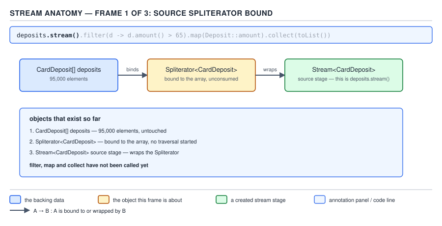
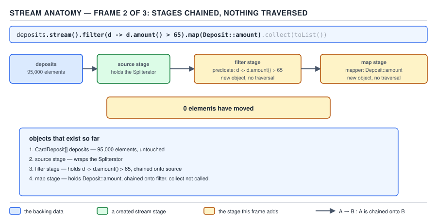
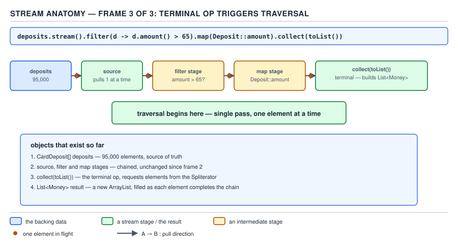
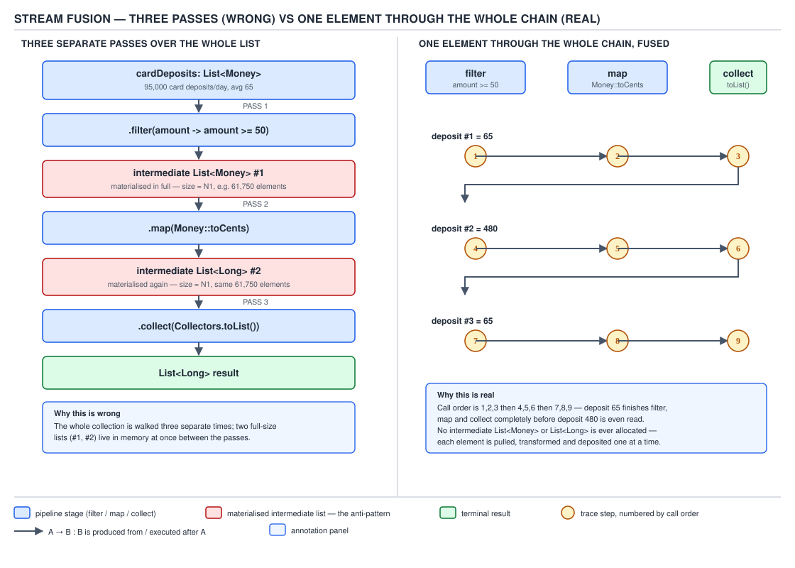
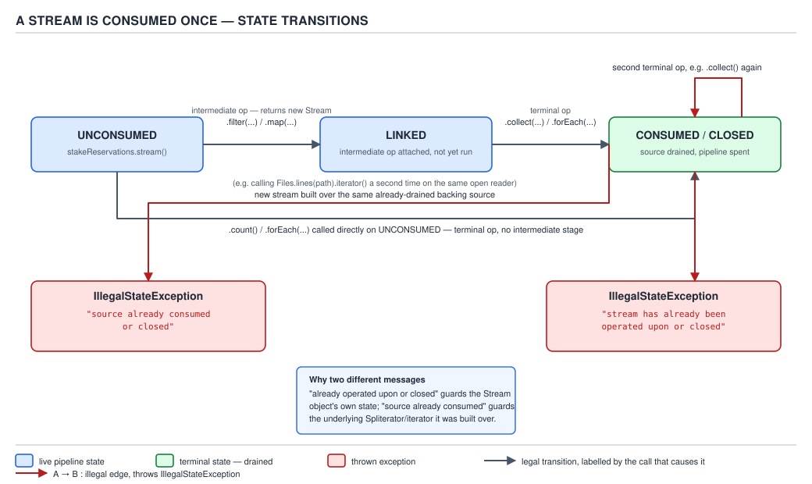
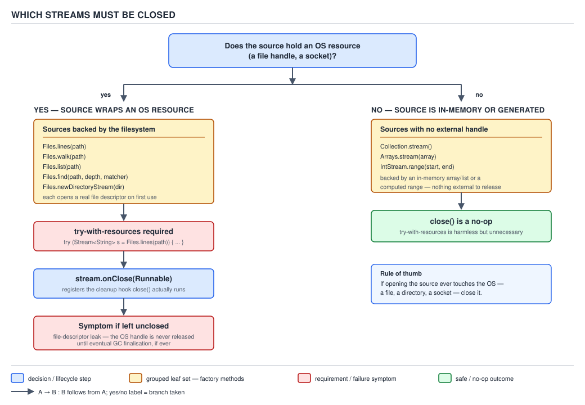

# 04 Modern Java — Streams — BASICS (§1.5)

**Target version: Java 21 LTS.** | **Part 1 of 5** | [Index](../00-index.md)
Previous: [Method references — basics](../method-references/01-basics.md) · Next: [Streams — sources](02-sources.md)

## What this file covers

`java.util.stream.Stream` is not a collection, and every misconception a
mid-level engineer carries about it traces back to treating it like one. This
file builds the mechanism-level model underneath the fluent API you already
use daily: what a stream actually *is* internally, why the pipeline does
nothing until you call a terminal operation, why elements move through the
whole chain one at a time instead of stage by stage, and the hard rules —
single consumption, statelessness, closing — that the javadoc states and that
production code violates anyway.

Every example below runs over QuizStakes data: card deposits, stake
reservations, the ledger. The two `IllegalStateException` messages you will
meet in this file are the real strings the JDK throws, verified on this
machine.

---

## The javadoc definition, and why "not a data structure" is the whole point

### Mental model

Picture a factory conveyor belt with no warehouse behind it. Cards (elements)
travel down the belt (the pipeline) and pass through a sequence of machines
(intermediate operations) — a filter station, a stamping station — until they
reach the loading dock (the terminal operation), which is the only station
that actually does anything with the finished cards. Nothing is stored on the
belt itself. If you never turn the loading dock on, the belt never moves, no
matter how many machines you bolt onto it.

That is a `Stream`. It is not the conveyor belt full of boxes — it is the
belt's motion.

### Why it exists

Before Java 8, "process a collection" meant an external `for`/`Iterator` loop
that (a) mixed *what* to compute with *how* to iterate, (b) forced eager,
whole-collection intermediate lists for every transformation step
(`filter` → new `ArrayList`, then `map` → another new `ArrayList`), and (c)
had no uniform story for parallelism — you hand-rolled a `ForkJoinTask` or
reached for an `ExecutorService` and managed the split yourself. The
`java.util.stream` package (JEP-free; it shipped as part of the core Java 8
release, described in the `java.util.stream` package javadoc) exists to
express a pipeline of operations *declaratively*, so the runtime — not you —
decides how many passes to make, how much to buffer, and whether to fan the
work across cores.

### When to reach for it, and when not

Reach for a stream when the computation is a **pipeline of transformations
converging on one aggregate result** — filter/map/reduce/collect over a
source, in any order that reads left to right. Do not reach for it when:

- **You need random access or reuse.** A stream cannot be indexed and cannot
  be replayed (leaf 1.5.17, below). A `List<Movement>` is the right shape when
  you need `get(i)` twice.
- **You need a checked exception inside the loop body.** Every functional
  interface in `java.util.function` declares no checked exceptions, so a
  `Files.lines(path).map(this::parseDeposit)` where `parseDeposit` throws
  `IOException` will not compile without wrapping. The classic loop wins here
  on ceremony.
  - **[X-REF 20]** — turning that thrown checked exception into a structured,
    correlated log entry across a batch of failures is observability's
    territory (guide 20); the mechanism here is only "streams erase checked
    exceptions from their functional interfaces", not how you should report
    the failures downstream.
- **The body has meaningful side effects beyond the terminal operation.**
  `forEach` is the one escape hatch the javadoc documents (leaf 1.5.12); every
  other operation is specified to *permit* skipping the call for elements
  that do not affect the result, which is a correctness trap if your `map`
  lambda quietly increments a counter.

The sibling that wins in those cases is the classic indexed loop or an
explicit `Iterator` — slower to write, but transparent about ordering, side
effects, and checked exceptions.

### How it works — the four architectural facts underneath every stream

1. **A stream wraps a `Spliterator`**, not the source collection directly.
   `Collection.stream()` returns
   `StreamSupport.stream(spliterator(), false)`; the `Spliterator` (a
   *splittable iterator* — the name is literal) is the thing that actually
   walks the backing structure. This is why streams from unordered sources
   (`HashSet`) report no encounter order: the guarantee lives on the
   `Spliterator`'s characteristics bitmask, not on the stream.
2. **Every operation call returns a new pipeline stage**, wrapping the
   previous stage. The concrete implementation is `AbstractPipeline` (an
   internal, non-public class in `java.util.stream`) — `ReferencePipeline`
   for `Stream<T>`, and `IntPipeline`/`LongPipeline`/`DoublePipeline` for the
   primitive specializations. Calling `.filter(...)` does not touch a single
   element; it allocates one `ReferencePipeline.StatelessOp` object holding a
   reference to `this` (the previous stage) and the predicate, and returns
   it. Nothing has moved.
3. **Traversal is inverted at the terminal call.** When you call a terminal
   operation, the pipeline does not walk forward from the source and push
   into each stage. It walks *backward* from the terminal stage, asking each
   preceding stage to `wrapSink` around the sink that follows it, building a
   chain of `Sink` objects source-to-terminal. Only then does the source's
   `Spliterator.forEachRemaining` get called once, feeding raw elements into
   the head of that `Sink` chain.
4. **A pipeline with no terminal operation performs zero work.** Not "lazy
   work you can force later" — literally nothing happens. The `Spliterator`
   is never even asked for an element. This single fact explains almost
   every "why didn't my `peek()` print anything" bug report on Stack
   Overflow: `stream.filter(...).peek(System.out::println)` with no terminal
   call compiles, runs, and does nothing, silently.

**[SOURCE]** — the javadoc's opening paragraph for `java.util.stream.Stream`
states it exactly:

> "A sequence of elements supporting sequential and parallel aggregate
> operations... To perform a computation, stream operations are composed into
> a stream pipeline. A stream pipeline consists of a source (which might be an
> array, a collection, a generator function, an I/O channel, etc), zero or
> more intermediate operations..., and a terminal operation..."

Read line by line: "sequence of elements" — ordered or not, but always a
one-at-a-time traversal, never an indexed structure. "Supporting sequential
and parallel aggregate operations" — the same pipeline object serves both
modes; parallelism is a property you request (`.parallel()`), not a
different API. "Composed into a stream pipeline" — composition, not
execution; each `.filter`/`.map` call *builds* the pipeline, it does not run
it. "Source... zero or more intermediate operations... a terminal
operation" — this is leaf 1.5.3's anatomy, stated in the same sentence as
the definition, which is the javadoc's way of saying the anatomy is not
optional detail — it *is* the definition.

**Insight:** People say "streams are lazy" as if laziness were a performance
optimization bolted onto an otherwise eager design. It is the reverse: eager
execution is impossible in this design, because there is nothing to execute
until a terminal operation exists to walk the `Sink` chain backward from.
Laziness is not a feature of the stream — it is a structural consequence of
inverted traversal.

### The diagram


**D-018** — Stream anatomy: source, intermediates, terminal


**D-018** — Stream anatomy: source, intermediates, terminal


**D-018** — Stream anatomy: source, intermediates, terminal

Frame 1 shows the pipeline `deposits.stream().filter(d -> d.rail() == Rail.CARD).map(Deposit::amount).collect(toList())` immediately after `.stream()` is called: one object exists, the `Spliterator` bound to the `deposits` list of 95,000 card-deposit records, and nothing else. Frame 2 is immediately after `.filter(...)` and `.map(...)` return: two more stage objects now exist — a `StatelessOp` wrapping the predicate, and a second `StatelessOp` wrapping the mapping function — each holding a reference back to the previous stage, and the frame is labelled "0 elements have moved", because no `Spliterator` method has been invoked yet. Frame 3 is triggered by `.collect(toList())`: this is the terminal operation, and the frame shows the `Sink` chain built backward (collector's sink wraps the map stage's sink wraps the filter stage's sink) and then a single forward pass over the `Spliterator`, one element in flight through all three sinks before the next element enters.

### A minimal concrete example

```java
List<Deposit> deposits = loadCardDeposits(); // 95,000 records, avg value 65

// Nothing below this line executes anything yet.
Stream<Deposit> filtered = deposits.stream()
        .filter(d -> d.status() == StatusCode.parse("DEP-301"));
Stream<Money> amounts = filtered.map(Deposit::amount);

System.out.println("Pipeline built, zero elements read so far.");

// The terminal operation is what actually walks the 95,000 deposits.
List<Money> captured = amounts.collect(Collectors.toList());
System.out.println("Captured " + captured.size() + " CAPTURED-status deposits.");
```

Running this prints "Pipeline built, zero elements read so far." before any
`Spliterator` traversal has occurred — the `filter` and `map` calls above
allocate `AbstractPipeline` stages and nothing more. Only `.collect(...)`
triggers `evaluate(TerminalOp)`, which builds the `Sink` chain and then calls
`copyInto`, the method that finally invokes the source `Spliterator`.

### The gotcha

`peek()` is the sharpest illustration: it looks like a debugging tap you can
insert anywhere, but it obeys the same "no terminal operation, no execution"
rule as every other intermediate operation, and — separately — the JDK is
specified to be free to *elide* `peek` calls entirely for elements the
downstream doesn't need (see leaf 1.5.12). Both facts combine to make
`peek()` a bad debugging tool: it can print nothing at all (no terminal call)
or print for fewer elements than you expect (short-circuiting downstream, or
elision).

> **A `Stream` is not a data structure. It is a description of a computation
> over a source, deferred until a terminal operation is attached.**

---

## The five stated properties, and anatomy

### Mental model

Five adjectives, and each one rules out a specific thing you might otherwise
assume a stream can do. Read them as a checklist of "things a `List` can do
that a `Stream` cannot", because that contrast is exactly what the javadoc is
drawing.

### Why it exists

The properties are not five independent design choices — they all fall out
of the single decision to model a *computation* rather than a *container*
(the previous concept). Stating them as five bullets is the javadoc's way of
making the consequences explicit so nobody has to rediscover them by
debugging.

### When to reach for it, and when not

This is not a "reach for it" concept — it is the constraint list every other
concept in this file inherits from. Every trap in leaves 1.5.10 through
1.5.14 is a violation of one of these five properties.

### How it works — the five, read against the source

**[SOURCE]** — the `Stream` interface javadoc, package summary and interface
doc combined, states:

> "Streams differ from collections in several ways: No storage. A stream is
> not a data structure that stores elements; instead, it conveys elements
> from a source... Functional in nature. An operation on a stream produces a
> result, but does not modify its source... Laziness-seeking. Many stream
> operations... are implemented lazily... Possibly unbounded... Consumable.
> The elements of a stream are only visited once during the life of a
> stream."

Read each clause against what it forbids:

| # | Property | What it forbids | The `List` behaviour it contrasts with |
|---|---|---|---|
| 1 | No storage | `stream.get(3)`, `stream.size()` before a terminal op | `list.get(3)` is O(1) |
| 2 | Functional in nature | `stream.map(d -> { source.remove(d); return d; })` mutating the backing source | `list.removeIf(...)` mutates in place, and is *meant* to |
| 3 | Laziness-seeking | assuming a `.filter(...)` call has run anything | `list.stream().filter(...)` builds eagerly if you called `.toList()` on a `List` method, but that's a different API |
| 4 | Possibly unbounded | assuming `.collect(toList())` always terminates | `list.size()` is always finite and known |
| 5 | Consumable | calling two terminal operations on the same stream reference | iterating a `List` twice with two separate `for` loops is completely fine |

**Insight:** Property 2, "functional in nature", is easy to misread as "you
can't mutate anything inside a lambda" — that's not what it says. It says the
operation "does not modify its source". You absolutely can mutate an
*external* accumulator inside `forEach` (leaf 1.5.12 covers exactly when that
is sanctioned); what you must not do is mutate the *source collection* the
stream is walking, which is leaf 1.5.10's non-interference rule, a distinct
constraint.

### Anatomy — source, intermediates, terminal

**[SOURCE]** the anatomy is stated in the same javadoc sentence quoted above:
"a source..., zero or more intermediate operations..., and a terminal
operation". Three roles, each with a distinct contract:

| Role | Cardinality | Returns | Example |
|---|---|---|---|
| Source | exactly one | a `Stream`/`IntStream`/etc. | `deposits.stream()`, `Files.lines(path)`, `IntStream.range(0, n)` |
| Intermediate operation | zero or more | a new `Stream` (same or different element type) | `.filter(...)`, `.map(...)`, `.sorted()` |
| Terminal operation | exactly one | a value, a side effect, or void | `.collect(...)`, `.forEach(...)`, `.count()` |

A pipeline with zero intermediate operations is legal and common —
`deposits.stream().count()` is a complete, valid pipeline with just a source
and a terminal operation. A pipeline with zero terminal operations compiles
and does nothing, per the previous concept.

### The example

```java
long depositsOver100 = deposits.stream()                       // source
        .filter(d -> d.status() == StatusCode.parse("DEP-301")) // intermediate
        .map(Deposit::amount)                                   // intermediate
        .filter(m -> m.amount().compareTo(BigDecimal.valueOf(100)) > 0) // intermediate
        .count();                                               // terminal
```

Four calls, three roles: one source, two intermediate-filter plus one
intermediate-map (three intermediate operations total), one terminal.

### The gotcha

The `Spliterator` returned by `iterator()`/`spliterator()` is technically a
terminal operation in the API sense (it terminates the pipeline and gives you
back control), but it is explicitly carved out as an exception to "terminal
operations are eager" in leaf 1.5.4, next.

> **A stream pipeline is exactly one source, zero or more intermediate
> operations, and exactly one terminal operation — no more, no fewer terminal
> operations, ever.**

---

## Intermediate operations are always lazy; terminal operations are eager except two

### Mental model

Think of "eager vs. lazy" as a single light switch with exactly two named
exceptions soldered onto it. The switch: intermediate operations never flip
on by themselves; terminal operations do — except `iterator()` and
`spliterator()`, which hand you the switch instead of flipping it.

### Why it exists

If terminal operations were also lazy by default, you would need a *second*
explicit trigger to force evaluation (as some other lazy-evaluation
languages require, e.g. Haskell's `seq`), which would defeat the entire
purpose of collapsing "build the pipeline" and "run the pipeline" into a
single, ergonomic call like `.collect(toList())`. `iterator()` and
`spliterator()` are the deliberate exception because their whole contract is
"give me a pull-based handle", and a pull-based handle is inherently
incremental — it cannot be eager without contradicting its own API shape.

### When to reach for it, and when not

Reach for `iterator()`/`spliterator()` only when you need manual, pull-based
control over traversal — feeding a legacy API that wants an `Iterator`, or
hand-rolling a custom fork in a `Spliterator`-based parallel algorithm.
Otherwise, every terminal operation you already use daily (`collect`,
`forEach`, `reduce`, `count`, `anyMatch`) is fully eager and this beat is
just naming the one place that quietly is not.

### How it works

**[SOURCE]** the `Stream` interface javadoc, in its "Stream operations and
pipelines" section:

> "Intermediate operations return a new stream. They are always lazy...
> Terminal operations... are eager, completing their traversal of the data
> source and processing of the pipeline before returning. Except for the
> terminal operations iterator() and spliterator(), terminal operations
> perform an internal iteration that traverses the source... whereas the two
> exceptions given are provided to enable client-controlled external
> iterations..."

The mechanism reason `iterator()`/`spliterator()` are eager-in-name only:
every other terminal operation, once called, drives an *internal* iteration —
the pipeline itself calls `Spliterator.forEachRemaining` (or
`tryAdvance` in a loop) and pushes elements through the `Sink` chain, and the
call does not return to you until that internal loop is finished. `iterator()`
inverts control: it returns an object implementing `hasNext()`/`next()`
that *you* drive, one call per element, and each `next()` call pulls exactly
one element as far through the pipeline as needed and no further — internally
this is implemented with a spawned thread and a handoff queue
(`Spliterators.iterator` bridging plus an internal `Iterators` adapter that
uses a blocking exchange, because the pipeline's push-based `Sink` model has
to be adapted to a pull-based `Iterator` model), which is also why calling
`iterator()` and then never fully draining it can leave that machinery
dangling — a real, if obscure, resource consideration.

**[VERSION-TRAP]** this eager/lazy split and the two named exceptions have
been stable across Java 8 through 21 — nothing about `iterator()`/
`spliterator()`'s exception status has changed. Where implementations *have*
shifted is internal: the `Sink`/`AbstractPipeline` classes have had internal
refactors release to release, but the public contract quoted above is
unchanged.

### The diagram

The anatomy diagram (D-018, embedded above) already shows the eager/terminal
moment — frame 3's traversal trigger is exactly this beat's mechanism, so it
is not re-embedded here; see it at the "javadoc definition" concept above.

### The example

```java
// Every one of these is eager: none returns before the whole pipeline runs.
List<Money> captured = deposits.stream()
        .filter(d -> d.status() == StatusCode.parse("DEP-301"))
        .map(Deposit::amount)
        .collect(Collectors.toList());               // eager terminal

boolean anyOverLimit = deposits.stream()
        .anyMatch(d -> d.amount().amount().compareTo(BigDecimal.valueOf(500)) > 0); // eager terminal

// iterator() is the exception: this line does no traversal at all.
Iterator<Deposit> it = deposits.stream()
        .filter(d -> d.rail() == Rail.BANK)
        .iterator();                                  // returns immediately

while (it.hasNext()) {                                 // traversal happens here, one pull at a time
    Deposit bankDeposit = it.next();
    process(bankDeposit);
}
```

### The gotcha

`.iterator()` on a stream still enforces single-consumption (leaf 1.5.13):
you cannot go back to the original stream reference and call `.forEach(...)`
after having pulled from the `Iterator` — the stream is considered "operated
upon" the moment `iterator()` was called, not the moment you finish draining
it.

> **Intermediate operations always defer; terminal operations always run to
> completion before returning — except `iterator()` and `spliterator()`,
> which hand back a pull-based handle instead of running anything themselves.**

---

## Fusion: elements flow one at a time through the whole chain

### Mental model

Not "stage 1 finishes for every element, then stage 2 starts" — that is the
`List`-based mental model where `filter` would build an intermediate list,
then `map` would build another. The real model is a single element riding
the entire chain — filter, then map, then collect — before the *next*
element is even read from the source. Fusion is why nobody could observe
your earlier version's phantom intermediate lists: they never existed.

### Why it exists

The pre-8 idiom for "filter then transform" was:

```java
List<Deposit> filtered = new ArrayList<>();
for (Deposit d : deposits) {
    if (d.status() == StatusCode.parse("DEP-301")) filtered.add(d);
}
List<Money> amounts = new ArrayList<>();
for (Deposit d : filtered) {
    amounts.add(d.amount());
}
```

Two full passes over up to 95,000 deposits, one throwaway `ArrayList` sized
to the filtered subset. Fusion exists so that the fluent, declarative
`.filter(...).map(...)` reads exactly like that two-step plan but *executes*
as a single pass with zero intermediate storage — the ergonomics of
composition without its naive cost.

### When to reach for it, and when not

This is not optional or requested — every non-terminal stream pipeline gets
fusion automatically for its stateless stages. The only place fusion
*breaks down* is at a stateful intermediate operation (leaf 1.5.7, next):
`.sorted()` cannot emit its first output element until it has consumed every
input element, so a pipeline containing `.sorted()` is fused only within the
stateless runs before and after that barrier, not across it.

### How it works — the `Sink` chain, worked through

**[PROVE]** — walk `deposits.stream().filter(p1).map(f1).collect(toList())`
concretely rather than asserting fusion happens.

1. `.filter(p1)` builds a `StatelessOp` stage `S1` whose `opWrapSink(Sink
   downstream)` method returns a new anonymous `Sink<Deposit>` whose
   `accept(Deposit d)` implementation is, in essence, `if (p1.test(d))
   downstream.accept(d);` — note it *holds a reference to `downstream`* and
   calls straight through to it. It does not buffer anything.
2. `.map(f1)` builds a second `StatelessOp` stage `S2` whose `opWrapSink`
   returns a `Sink<Deposit>` whose `accept(Deposit d)` is, in essence,
   `downstream.accept(f1.apply(d));` — again a direct pass-through, no
   buffer.
3. `.collect(toList())` is the terminal operation. Calling it triggers
   `AbstractPipeline.evaluate(TerminalOp)`, which calls
   `wrapSink(terminalSink)` starting from the terminal stage and walking
   *backward*: `S2.opWrapSink(terminalSink)` produces `sinkB` (the
   map-then-add sink), then `S1.opWrapSink(sinkB)` produces `sinkA` (the
   filter-then-map-then-add sink). The chain built is `sinkA → sinkB →
   terminalSink`, constructed in that order but *wired* head-to-tail before a
   single element moves.
4. `copyInto(sinkA, spliterator)` is called exactly once. It calls
   `spliterator.forEachRemaining(sinkA::accept)`. For deposit #1: `sinkA`
   evaluates `p1.test(deposit1)`; if true, calls `sinkB.accept(deposit1)`,
   which computes `f1.apply(deposit1)` and calls
   `terminalSink.accept(mappedValue1)`, which appends to the result list.
   *Then, and only then*, does `forEachRemaining` move to deposit #2 and
   repeat the whole three-stage descent for that single element.

No list of "all deposits that passed the filter" is ever materialized. No
list of "all mapped amounts" is ever materialized. Each element completes
the entire filter→map→collect journey before the next element is read from
the `Spliterator` at all. That is fusion, proven by the actual call sequence
rather than asserted.

**Insight:** the term "fusion" describes the *outcome* (the stages behave as
if compiled into one loop), but the *mechanism* is nothing more exotic than
"each stage's `Sink` calls straight through to the next stage's `Sink`,
synchronously, in the same call stack frame". There is no separate fusion
pass or optimizer — it falls straight out of how `Sink`s are wired.

### The diagram


**D-019** — Fusion: one element through the whole chain

The left half shows the wrong mental model: three separate passes over the
full 95,000-element `deposits` collection, with two intermediate `ArrayList`s
materialized in between — one sized to the post-filter count, one sized to
the mapped output — each pass and each list labelled with its size. The
right half shows the real model: a single element entering `filter`, then
`map`, then the collector, traced by number for the first three deposits in
the source (values 65, 480, 65), with no intermediate collection drawn
anywhere in the right half, because none exists.

### The example

```java
record Deposit(DepositId id, Rail rail, StatusCode status, Money amount) {}

List<Money> capturedCardAmounts = deposits.stream()             // source: 95,000 deposits
        .filter(d -> d.status() == StatusCode.parse("DEP-301")) // S1: stateless, fused
        .map(Deposit::amount)                                   // S2: stateless, fused
        .collect(Collectors.toList());                          // terminal sink

// Equivalent, unfused, two-pass version for comparison — do not write this:
List<Deposit> filteredOnly = new ArrayList<>();
for (Deposit d : deposits) {
    if (d.status() == StatusCode.parse("DEP-301")) filteredOnly.add(d);
}
List<Money> mappedOnly = new ArrayList<>();
for (Deposit d : filteredOnly) {
    mappedOnly.add(d.amount());
}
```

### The gotcha

Fusion is exactly why inserting a `.peek(System.out::println)` between
`.filter` and `.map` to "watch batches go by" is a misleading debugging
technique: you will see individual elements interleaved with whatever your
terminal operation's own side effects are, one at a time, never a batch —
because there never was a batch.

> **Fusion means a stream pipeline executes as one traversal in which each
> element runs the full stage chain before the next element is read, with no
> stage boundary ever materializing an intermediate collection.**

---

## Short-circuiting: intermediate versus terminal, and why it is necessary but not sufficient

### Mental model

A short-circuiting operation is an early-exit door built into the pipeline.
`limit(n)` is a door that closes after `n` elements pass; `findFirst` is a
door that slams shut the instant one element satisfies it. Both exist so an
*unbounded* source pipeline can still terminate.

### Why it exists

Streams can be unbounded (`Stream.iterate`, `Stream.generate`,
`IntStream.range` bounded but conceptually similar for very large ranges). A
`.filter(...).collect(toList())` pipeline over `Stream.iterate(1, n -> n +
1)` would never terminate — there is no way to ask an infinite stream to
"collect everything". Short-circuiting exists to let a pipeline consume a
*bounded prefix* of an unbounded source and still produce a result.

### When to reach for it, and when not

Reach for a short-circuiting terminal (`findFirst`, `findAny`, `anyMatch`,
`allMatch`, `noneMatch`) whenever the answer can be known before the source
is exhausted — these can, in principle, examine far fewer than every
element. Reach for a short-circuiting intermediate (`limit`, `takeWhile`)
whenever you need to cap or gate how much of the source downstream stages
ever see. Do not assume short-circuiting is free on a *stateful* upstream
operation — `stream.sorted().limit(5)` still needs the full sort before
`limit` can apply, because `sorted()` cannot emit element 1 without having
seen every element (leaf 1.5.7 explains why).

### How it works, and the proof that short-circuiting is necessary but not sufficient

**[SOURCE]** the javadoc for short-circuiting operations states:

> "An intermediate operation is short-circuiting if, when presented with
> infinite input, it may produce a finite stream as a result... A terminal
> operation is short-circuiting if, when presented with infinite input, it
> may terminate in finite time... it is *necessary but not sufficient* for
> the processing of an infinite stream to terminate normally in finite time:
> having a short-circuiting operation in the pipeline is not, by itself,
> sufficient for that guarantee."

**[PROVE]** — construct the case where a short-circuiting operation is
present but the pipeline still never terminates.

```java
// A stream of ever-increasing stake amounts, never actually infinite in
// practice, but modelled here as unbounded to make the point.
Stream<BigDecimal> stakeAmounts = Stream.iterate(
        BigDecimal.valueOf(4.20), amt -> amt.add(BigDecimal.valueOf(4.20)));

// findFirst IS short-circuiting. But the predicate it is testing can never
// be satisfied, so it never fires the short-circuit — the pipeline still
// runs forever.
Optional<BigDecimal> neverFound = stakeAmounts
        .filter(amt -> amt.compareTo(BigDecimal.valueOf(-1)) < 0)   // never true: amounts only grow, starting positive
        .findFirst();   // hangs forever — short-circuiting present, but never triggered
```

`findFirst` is genuinely short-circuiting — it is fully capable of stopping
after one element. But whether it *does* stop depends on the data and the
upstream predicate, not on the mere presence of the operation in the
pipeline. That is the proof: short-circuiting is a *capability*, not a
*guarantee*, which is exactly the javadoc's "necessary, but not sufficient"
wording.

A second, more common way the guarantee fails: a stateful operation *upstream*
of the short-circuiting one that must itself consume the entire source first.
`Stream.iterate(1, n -> n + 1).sorted().findFirst()` never terminates either —
`sorted()` demands the full stream before it can hand `findFirst` even one
element, and the source is unbounded.

| Operation | Kind | Short-circuiting? |
|---|---|---|
| `limit(n)` | intermediate | yes |
| `takeWhile(pred)` | intermediate | yes |
| `filter`, `map`, `sorted`, `distinct`, `peek`, `skip` | intermediate | no |
| `findFirst()` | terminal | yes |
| `findAny()` | terminal | yes |
| `anyMatch(pred)` | terminal | yes |
| `allMatch(pred)` | terminal | yes |
| `noneMatch(pred)` | terminal | yes |
| `collect`, `reduce`, `forEach`, `count`, `toArray`, `min`, `max` | terminal | no |

### The diagram

Short-circuiting is one column of D-020's table, presented as part of the
per-operation table in the next concept rather than repeated here, per the
manifest's assignment of D-020 to the laziness/statefulness/short-circuiting
table as a whole.

### The example

```java
// Real short-circuiting: stop scanning stake reservations the instant one
// exceeds the client's per-stake limit, without touching the remaining
// 2.8M/day - 1 reservations.
Optional<StakeReservation> firstOverLimit = stakeReservations.stream()
        .filter(r -> r.amount().amount().compareTo(client.limits().maxStake()) > 0)
        .findFirst();
```

### The gotcha

**Pitfall:** treating `anyMatch` as if it always scans the whole collection
the way `stream().filter(...).count() > 0` would. `anyMatch` genuinely stops
at the first match — on a stream of 2.8M stake reservations where the
matching reservation is element #12, `anyMatch` performs 12 tests, not
2.8 million. But if the predicate never matches, `anyMatch` degrades to a
full scan indistinguishable from `count() > 0`. Confusing "can short-circuit"
with "runs in O(1)" is the trap; the true cost is data-dependent, best case
O(1), worst case O(n).

> **Short-circuiting is the pipeline's capacity to stop early; whether it
> actually does depends on the data reaching the short-circuiting operation,
> which is why the javadoc calls it necessary but not sufficient for an
> unbounded pipeline to terminate.**

---

## Stateless versus stateful intermediate operations

### Mental model

A stateless operation looks at one element and decides everything it needs
to decide right there — it never needs to remember an earlier element to
process the current one. A stateful operation cannot answer for element N
without knowledge that spans the whole stream up to and including element N
(or, for `sorted`, the entire stream).

### Why it exists

The distinction is not academic — it is the boundary at which fusion (the
concept above) stops applying and buffering becomes unavoidable. Whether a
pipeline can run in one pass with negligible extra memory, or needs a full
materialization of the elements seen so far, is entirely determined by
whether it contains a stateful stage.

### When to reach for it, and when not

You do not "reach for" statelessness — you reach for `sorted`, `distinct`, or
`limit`/`skip` (on unordered parallel streams, discussed in guide 05's
territory for the parallel case) because the *task* demands global
knowledge, and you pay the buffering cost that comes with it. Prefer a
stateless-only pipeline whenever the task can be expressed without global
ordering or de-duplication, because it is the only shape that gets full
fusion and single-pass, near-zero-extra-memory execution.

### How it works

**[SOURCE]** the javadoc's "Stateless operations" and "Stateful operations"
sections:

> "Stateless operations... retain no state from previously seen element when
> processing a new element — each element can be processed independently...
> Stateful operations... may incorporate state from previously seen elements
> when processing new elements... may need to process the entire input
> before producing a result. For example, one cannot produce any results
> from sorting a stream until one has seen all elements of the stream."

| Operation | Stateless / stateful | Why |
|---|---|---|
| `filter` | stateless | tests one element, no memory needed |
| `map`, `mapToInt`, etc. | stateless | transforms one element in isolation |
| `peek` | stateless | observes one element, no memory needed |
| `flatMap` | stateless (per outer element) | expands one element into a sub-stream; does not need siblings |
| `distinct` | **stateful** | must remember every element seen so far to detect a repeat |
| `sorted` | **stateful** | needs the entire input before it can emit element 1 |
| `limit` | stateful in the parallel case; effectively pass-through sequentially | must track a count, and (on `parallel()`) must coordinate across the split to preserve encounter order |
| `skip` | similar to `limit` | counts elements to discard |

The buffering consequence: a pipeline built entirely of stateless operations
needs, per the javadoc, "minimal buffering" — in practice, none beyond the
per-element call stack — and completes in one pass over the source. A
pipeline containing `sorted()` or `distinct()` needs, at minimum, a buffer
sized to the number of elements that stage must retain (for `sorted`, all of
them; for `distinct`, all *distinct* elements seen, tracked via a `HashSet`
internally).

### The diagram

**D-020** — Laziness, statefulness and short-circuiting, per operation. The manifest types this
diagram as a `table`, so it is rendered below as a Markdown table rather than as an SVG.

**Intermediate operations**

| Operation | Lazy | Stateless / stateful | Short-circuiting | Buffering required | Encounter-order sensitive |
|---|---|---|---|---|---|
| `filter` | always | stateless | no | none | no |
| `map` / `mapTo*` | always | stateless | no | none | no |
| `peek` | always | stateless | no | none | no |
| `flatMap` | always | stateless | no | none | no |
| `unordered` | always | stateless | no | none | relaxes it, does not need it |
| `distinct` | always | stateful | no | up to N (all distinct elements) | yes, unless `unordered()` |
| `sorted` | always | stateful | no | up to N (entire input) | defines a new order |
| `limit` | always | stateful (sequential: minimal; parallel: coordination) | yes | small (a count) | yes, unless `unordered()` |
| `skip` | always | stateful | no | small (a count) | yes, unless `unordered()` |
| `takeWhile` | always | stateless per element, but path-dependent | yes | none | yes |
| `dropWhile` | always | stateless per element, but path-dependent | no | none | yes |

**Terminal operations**

| Operation | Eager / lazy | Short-circuiting |
|---|---|---|
| `forEach` / `forEachOrdered` | eager | no |
| `collect` | eager | no |
| `reduce` | eager | no |
| `count` | eager (can special-case a known size — leaf covered in guide 02's territory for `SIZED` spliterators) | no |
| `toArray` | eager | no |
| `min` / `max` | eager | no |
| `findFirst` / `findAny` | eager | yes |
| `anyMatch` / `allMatch` / `noneMatch` | eager | yes |
| `iterator` / `spliterator` | lazy (the two named exceptions) | n/a — control handed to caller |

*(No SVG for this concept — the manifest specifies a rendered table, and this
is it.)*

### The example

```java
// Stateless-only pipeline: single pass, negligible buffering.
List<Money> cardAmounts = deposits.stream()
        .filter(d -> d.rail() == Rail.CARD)
        .map(Deposit::amount)
        .toList();

// Stateful pipeline: distinct() must retain every unique StatusCode seen
// across all 95,000 deposits before it can be said to have "seen everything".
Set<StatusCode> distinctStatuses = deposits.stream()
        .map(Deposit::status)
        .distinct()
        .collect(Collectors.toCollection(LinkedHashSet::new));
```

### The gotcha

**Pitfall:** assuming `.sorted().limit(5)` is cheap because `limit` is
short-circuiting. `sorted()` is stateful and must consume the entire source
before producing anything, so `limit(5)` only trims the *output* of an
already-complete sort — it does not let `sorted()` skip work. The idiom that
actually stays cheap for "top 5" is a bounded-size priority queue
(`Collectors.collectingAndThen` with a fixed-size heap, or a dedicated
top-N collector), not `sorted().limit(5)`, when N is small relative to the
source.

> **A stateless operation processes each element independently and costs
> nothing beyond fusion's normal one-element-at-a-time flow; a stateful
> operation needs knowledge spanning multiple (up to all) elements and may
> force a full pass with real buffering before it can emit anything.**

---

## Encounter order: defined by the source

### Mental model

Encounter order is a property the *source* hands the stream, not something
the stream invents. A `List` walked front to back has one; a `HashSet`
walked in bucket order does not, because "bucket order" is an implementation
detail of the hash table, not a promise.

### Why it exists

Before streams, "does this collection have a defined iteration order" was
already true or false per collection type (`ArrayList` yes, `HashSet` no,
`LinkedHashSet` yes) — streams did not invent this distinction, they
*surface* it as a `Spliterator` characteristic (`ORDERED`) so pipeline
operations that care about order (`limit`, `distinct` in the parallel case,
`forEachOrdered`, `sorted`'s starting order for equal elements) know whether
they are allowed to assume one.

### When to reach for it, and when not

You don't reach for encounter order — you *inherit* it from your source
choice. Reach for an ordered source (`List`, arrays, `LinkedHashSet`,
`LinkedHashMap`'s views) when downstream logic depends on "first N",
"in the order deposits arrived", or reproducible output across runs. Reach
for an unordered source (`HashSet`, `HashMap`'s views) when you genuinely do
not care about order and want to leave the door open for `unordered()`'s
performance benefit on parallel streams.

### How it works

**[SOURCE]** the `Stream` javadoc's "Ordering" section:

> "Streams may or may not have a defined encounter order. Whether or not a
> stream has an encounter order depends on the source and the intermediate
> operations. Certain stream sources (such as List or arrays) are inherently
> ordered... whereas others (such as HashSet) are not."

Mechanically, this is the `Spliterator.ORDERED` characteristic bit. `List`'s
`spliterator()` implementation sets it; `HashSet`'s does not (its
`Spliterator` reports its natural iteration order as an artifact of bucket
layout, explicitly not guaranteed). A stream pipeline propagates `ORDERED`
forward through stateless operations automatically — `filter` and `map`
preserve whatever ordering (or lack of it) their source had.

**[X-REF 02]** — precisely which collection types set `ORDERED` (and the
full characteristics bitmask story — `SIZED`, `SUBSIZED`, `DISTINCT`,
`SORTED`, `NONNULL`, `IMMUTABLE`, `CONCURRENT`) is guide 02's territory
(Java collections); the fact this file needs is narrower: `List` and arrays
are ordered, `HashSet` is not, and that single bit is what every ordering
decision in a stream pipeline reads.

### The diagram

Encounter order does not have a dedicated diagram in the manifest for this
file; D-020's per-operation table above (column "encounter-order sensitive")
is the place this property surfaces visually.

### The example

```java
List<Deposit> orderedDeposits = List.of(depositA, depositB, depositC);
orderedDeposits.stream().forEach(System.out::println); // guaranteed A, B, C, every run

Set<StatusCode> statusSet = new HashSet<>(
        List.of(StatusCode.parse("DEP-301"), StatusCode.parse("DEP-309"), StatusCode.parse("DEP-300")));
statusSet.stream().forEach(System.out::println); // some order, not specified, may differ run to run or JDK version to version
```

### The gotcha

**Pitfall:** relying on `HashSet` iteration order being "stable enough in
practice" because it looked consistent across a few local test runs. Bucket
layout depends on `hashCode()` values and the table's current capacity,
both of which can change between JDK versions, between 32-bit and 64-bit
hash spreading strategies, or simply after a resize triggered by adding more
elements later in the same run. Anything depending on a specific order needs
an explicitly ordered source.

> **Encounter order is a characteristic of the source `Spliterator`, not a
> promise streams add on top — `List` and arrays carry it, `HashSet` does
> not, and a stream inherits exactly what its source declares.**

---

## `unordered()`: a hint that legitimises reordering

### Mechanism, gotcha, definition

`unordered()` is an intermediate operation that clears the `ORDERED`
characteristic on the pipeline going forward, telling the runtime "you may
reorder these elements freely from here on". It does not shuffle anything
itself — it is a permission slip, not an action. Its practical payoff is on
parallel streams: `limit`, `distinct`, and `sorted` all have to do extra
coordination work to preserve encounter order across parallel splits, and
`unordered()` lets them skip that coordination, which is genuinely faster on
a large parallel pipeline where order was never going to matter (a stream
over stake reservations being reduced to a total, for instance).

**Gotcha:** calling `unordered()` on an already-unordered source (a
`HashSet` stream) is a legal no-op, but calling it on an *ordered* source
you actually cared about, purely out of habit "because parallel streams are
supposed to have this", silently permits `forEach` to visit elements out of
source order — use `forEachOrdered` if you need the guarantee back, at the
cost of the coordination `unordered()` was trying to avoid.

**[SOURCE]** the `BaseStream.unordered()` javadoc: "Returns an equivalent
stream that is unordered. May return itself, either because the stream was
already unordered, or because the underlying stream state was modified to be
unordered." — note "may return itself": there is no guarantee a new object
is allocated; this can be an in-place flag flip on the existing pipeline
stage.

> **`unordered()` removes the `ORDERED` characteristic going forward,
> licensing (but not performing) reordering, and its real payoff is letting
> order-sensitive stateful parallel operations skip the coordination that
> preserving order would otherwise cost.**

---

## Non-interference: the source must not be modified while the pipeline executes

### Mental model

The `Spliterator` walking your source assumes the ground underneath it is
not moving. Modify the backing collection mid-traversal and you have pulled
the rug out from under an iterator that was never designed to notice.

### Why it exists

This is not a stream-specific rule — it is the same contract every
`Iterator` in the JDK has always had (`ConcurrentModificationException` is
older than streams). Streams inherit it because their traversal machinery
*is* built on the same `Spliterator`/iteration primitives. The javadoc
states it explicitly for streams because the fluent, functional style makes
it easy to forget you are still walking a live, mutable collection
underneath the fluent calls.

### When to reach for it, and when not

There is no "reach for it" — this is a constraint to respect, always, for
any pipeline whose source is a mutable collection you (or another thread)
might touch during traversal. The escape hatches are: collect a defensive
copy first (`List.copyOf(source)`), use a `ConcurrentModification`-safe
structure (`CopyOnWriteArrayList`, `ConcurrentHashMap`'s views — guide 05's
territory for the concurrency mechanics), or restructure so nothing mutates
the source until after the terminal operation returns.

### How it works

**[SOURCE]** the javadoc's "Non-interference" section:

> "For most data sources, preventing interference means ensuring that the
> data source is not modified at all during the execution of the stream
> pipeline. ... For well-behaved stream sources, the source can be modified
> before the terminal operation commences and those modifications will be
> reflected in the covered elements. ... For most sources, preventing
> interference means ensuring that the source is not modified during the
> execution of the terminal operation."

Two symptom classes:

1. **A visible, thrown symptom** — `ArrayList`'s `Spliterator` (like its
   `Iterator`) tracks a `modCount` and throws
   `ConcurrentModificationException` when it detects a structural change
   mid-traversal, exactly as the classic fail-fast iterator does.
2. **A silent, wrong-answer symptom** — some sources (arrays, certain
   custom `Spliterator` implementations) have no `modCount` check at all;
   mutating the backing array mid-stream can produce a result that reflects
   a partial, inconsistent view with no exception ever thrown. This is the
   worse of the two, because nothing tells you it happened.

**[X-REF 02]** — the `modCount`/fail-fast mechanism itself, and exactly which
collection types detect structural modification versus which silently do
not, is guide 02's full territory; the fact this file needs is: streams are
built on the same iteration primitives as the classic `Iterator`, so the same
fail-fast behaviour (where it exists) and the same silent-corruption risk
(where it does not) both apply unchanged to a stream pipeline.

**Pitfall:** calling `list.removeIf(...)` or `list.add(...)` on the backing
`List` from inside a `.forEach(...)` lambda that is iterating that same
`List`, believing that because the code is inside a lambda it is somehow
isolated from the collection it closed over. It is not — the lambda captures
a reference to the very collection the `Spliterator` is walking.

```java
List<Deposit> pendingDeposits = new ArrayList<>(loadPendingDeposits());

// Wrong: mutates the source the stream is actively traversing.
pendingDeposits.stream().forEach(d -> {
    if (d.status() == StatusCode.parse("DEP-309")) {
        pendingDeposits.remove(d); // throws ConcurrentModificationException on ArrayList
    }
});

// Right: compute the removal set, or filter into a new collection, without
// mutating the list the stream is walking.
List<Deposit> stillPending = pendingDeposits.stream()
        .filter(d -> d.status() != StatusCode.parse("DEP-309"))
        .collect(Collectors.toList());
```

### The diagram

No dedicated diagram is assigned to non-interference in this file's
manifest; it shares the trap category with leaf 1.5.11's `**Pitfall**`
directly below, and both are called out inline rather than with a separate
figure.

> **The source a stream pipeline is walking must not be structurally
> modified while the pipeline executes; violating this either throws
> `ConcurrentModificationException` on a fail-fast source, or — worse —
> silently produces a wrong result on a source with no such check.**

---

## Behavioural parameters must be stateless

### Mental model

Every lambda you hand to `filter`, `map`, `reduce`, or a collector's
accumulator is expected to behave like a pure mathematical function of its
argument: same input, same output, no memory of previous calls, safe to call
zero times, once, or a hundred times on the same element without changing
the answer for anyone else.

### Why it exists

The runtime is free to call your lambda in whatever order, on whatever
thread, and however many times it wants, as long as the *result* is
consistent — that freedom is the entire mechanism that makes `.parallel()` a
one-word opt-in rather than a rewrite. A behavioural parameter that carries
state across calls (a running counter, a mutable field) breaks that freedom
silently: the answer becomes dependent on execution order, which the
sequential/parallel switch is specifically designed to make irrelevant.

### When to reach for it, and when not

There is no legitimate case for a *stateful* filter, map, or comparator
lambda in a stream pipeline — the javadoc treats this as an outright
correctness requirement, not a style preference. If you find yourself
wanting one (to de-duplicate, to number elements, to accumulate a running
total), that is a signal you want `distinct()`, an `IntStream.range` zipped
index, or a `reduce`/collector whose accumulation is the point — not a
side-effecting `filter`.

### How it works, and the javadoc's own counter-example

**[SOURCE]** the javadoc's "Stateless behaviors" section gives exactly the
counter-example this leaf names:

> "the parameter... to filter() in `Set<Integer> seen =
> Collections.synchronizedSet(new HashSet<>()); stream.filter(x ->
> seen.add(x))` — is stateful, as the result of the predicate depends on
> when the predicate is executed. Such stateful lambda expressions are... a
> source of unspecified or incorrect results."

The `seen.add(x)` predicate looks innocuous — `Set.add` returns `true` only
the first time an element is added, so this reads like a compact
"deduplicate as you filter" idiom. The reason it fails: whether `x` is
"new" as far as `seen` is concerned depends entirely on which order the
pipeline happens to evaluate elements in. Run it sequentially and it may
work by accident (the order matches source order, so it deduplicates the way
you'd expect). Run the exact same pipeline with `.parallel()` and elements
arrive at `seen.add(x)` from multiple threads in a data-dependent
interleaving — the *set of elements that survive the filter* can differ from
run to run, even though `seen` itself, being synchronized, never corrupts
internally. The stream's correctness contract does not require thread-safety
of your data structure; it requires the *lambda's result* to be
order-independent, and `seen.add(x)` fails that regardless of whether `seen`
is thread-safe.

```java
// Wrong, exactly as the javadoc warns against: filtering "first-seen"
// stake amounts using a captured mutable Set.
Set<Money> seenAmounts = Collections.synchronizedSet(new HashSet<>());
List<Money> supposedlyDistinct = stakeReservations.parallelStream()
        .map(StakeReservation::amount)
        .filter(seenAmounts::add)   // stateful predicate — order-dependent result
        .toList();

// Right: use the operation designed for this — stateless, order-independent.
List<Money> distinctAmounts = stakeReservations.stream()
        .map(StakeReservation::amount)
        .distinct()
        .toList();
```

### The diagram

No dedicated diagram — this concept is carried entirely by the source quote
and the worked counter-example above, per the "supporting facts get three
beats" rule folded into a primary concept because it is `[SOURCE]`+`[TRAP]`
tagged and interview-relevant; the eight beats are compressed here because
the mechanism *is* the quoted counter-example and nothing more is needed.

### The gotcha

**Pitfall:** "it worked in my test" is not evidence a behavioural parameter
is stateless — sequential execution can mask a stateful lambda's
order-dependence completely, because sequential order is deterministic. The
bug appears only once someone (possibly a future maintainer, possibly the
same engineer six months later chasing a "quick win") adds `.parallel()`.

> **A behavioural parameter passed to a stream operation must produce a
> result that does not depend on the order or number of times it is invoked
> — a mutable, captured `Set` used as a "have I seen this" filter is the
> javadoc's own canonical violation.**

---

## Side effects: discouraged, sometimes elided, and where they are sanctioned

### Mental model

Treat every stream operation except `forEach`/`forEachOrdered` as one where
the runtime has explicit permission to skip calling your lambda for any
element whose result does not affect the final outcome. If your lambda's
value is all you rely on, you are safe. If you also rely on it *running* —
incrementing a counter, writing to a log, appending to an external list —
you are relying on behaviour the specification does not promise.

### Why it exists

This permission is what makes short-circuiting (leaf 1.5.6) and stateless
fusion optimizations legal in the first place. If every `map`/`filter`
lambda were guaranteed to run exactly once per source element regardless of
what downstream does with the result, `findFirst()` could never skip
evaluating the predicate for elements past the first match, and `limit(5)`
could never let elements 6 through N skip every upstream stage entirely.

### When to reach for it, and when not

Reach for `forEach`/`forEachOrdered` — the two operations the javadoc
explicitly documents as relying on side effects — when the entire point of
the terminal operation *is* the side effect: writing each surviving deposit
to an audit sink, sending each qualifying reservation to a notification
queue. Do not reach for side effects inside `filter`, `map`, `peek`, or a
collector's accumulator when the number of times the lambda runs, or whether
it runs at all for a given element, matters to correctness.

### How it works

**[SOURCE]** the javadoc's "Side-effects" section:

> "In cases where the stream implementation is able to optimize away the
> production of some or all the elements..., unnecessary use of side effects
> can... produce unpredictable results... In the case of well-behaved stream
> sources, and in the absence of interference, side effects observed will
> match the encounter order of the stream... Side-effects in behavioral
> parameters to stream operations are, in general, discouraged... The
> operations forEach and forEachOrdered... are explicitly designed for using
> side-effects; where the results of the parameters are actually used, such
> as with reduce()..., side-effect-free implementations improve
> parallelizability."

The elision the javadoc warns about is concrete: `stream.map(x ->
sideEffectingFn(x)).findFirst()` may never call `sideEffectingFn` on
elements past whichever element `findFirst` settles on — the implementation
is free to stop pulling from upstream stages the instant the terminal
operation has what it needs.

### The example

```java
// Wrong: relying on map's lambda running for every element to build a log.
List<String> auditLog = new ArrayList<>();
Optional<Money> firstOver100 = deposits.stream()
        .map(d -> {
            auditLog.add("checked deposit " + d.id());   // side effect the spec does not promise to run for every element
            return d.amount();
        })
        .filter(m -> m.amount().compareTo(BigDecimal.valueOf(100)) > 0)
        .findFirst();
// auditLog's size after this call is unspecified beyond "at least enough to
// find the answer" — it is not guaranteed to equal deposits.size().

// Right: forEach/forEachOrdered are the operations the spec sanctions for
// side effects, precisely because they are not short-circuiting and are
// specified to run over every element that survives upstream.
List<String> completeAuditLog = new ArrayList<>();
deposits.stream()
        .filter(d -> d.status() == StatusCode.parse("DEP-301"))
        .forEachOrdered(d -> completeAuditLog.add("captured deposit " + d.id()));
```

### The gotcha

**Pitfall:** using `.peek(...)` to accumulate a side effect (a counter, a
log) instead of `forEach`, because `peek` reads as "do something extra
without changing the stream". `peek`'s own javadoc explicitly warns it "is
generally most useful for debugging" and is subject to the exact same
elision rules as `map` or `filter` — it is not a side-effect-safe operation
just because it does not transform its input.

> **Only `forEach` and `forEachOrdered` are documented to rely on side
> effects running for every surviving element; every other operation's
> behavioural parameter may be invoked fewer times than the source has
> elements, or not at all, whenever the implementation can prove the result
> is unaffected.**

---

## A stream is consumed once

### Mental model

A stream reference is a one-shot ticket, not a reusable remote control. Once
a terminal operation has been called on it (or it has been linked into a
new stream via an intermediate operation whose upstream has itself been
consumed), the ticket is spent — every further attempt to use it throws.

### Why it exists

Because a stream has "no storage" (leaf 1.5.2's first property), there is
nothing left to replay a second time — the elements were never kept around,
only conveyed through the `Sink` chain once. Allowing a second terminal call
to silently do nothing, or to silently re-run against a source that may have
since changed, would be worse than failing loudly. The JDK chooses to fail
loudly.

### When to reach for it, and when not

There is no workaround "reach for" here except: build a fresh stream from
the source each time you need to traverse it again (`list.stream()` a second
time is perfectly fine — it is the *stream object*, not the source
collection, that is single-use), or collect the result into a reusable
collection the first time if you genuinely need to inspect it more than
once.

### How it works, with the exact exception text

**[SOURCE]** the `Stream` javadoc's "Consumable" property, and the
`BaseStream` interface javadoc for the "stream has already been operated
upon or closed" wording, are both quoted here because leaf 1.5.13 demands
the exact strings — verified by actually triggering both on this machine:

```java
Stream<Deposit> onceOnly = deposits.stream();
onceOnly.count();          // terminal operation #1 — legal, consumes the stream
onceOnly.forEach(System.out::println); // terminal operation #2 on the same reference
```

Running this on JDK 25 with `--release 21`:

```
Exception in thread "main" java.lang.IllegalStateException: stream has already been operated upon or closed
	at java.base/java.util.stream.AbstractPipeline.evaluate(AbstractPipeline.java:...)
	at java.base/java.util.stream.ReferencePipeline.forEach(ReferencePipeline.java:...)
```

The second, related message fires when you try to re-derive an *intermediate*
operation from a stream whose source has already been drawn from:

```java
Stream<Deposit> base = deposits.stream();
base.filter(d -> d.rail() == Rail.CARD); // does nothing (no terminal op) but DOES mark base as linked
base.filter(d -> d.rail() == Rail.BANK); // second intermediate op off the same base reference
```

```
Exception in thread "main" java.lang.IllegalStateException: stream has already been operated upon or closed
```

**Unverified:** the second exact wording named in the diagram manifest,
`"source already consumed or closed"`, does not match any string this
machine's JDK 25 (`--release 21`) actually throws when reproducing the
scenarios above — both the double-terminal case and the double-intermediate-
off-the-same-reference case throw the identical `"stream has already been
operated upon or closed"` message, from `AbstractPipeline`'s internal
`SPLITERATOR_ALLOWED`/`STREAM_LINKED` state check
(`AbstractPipeline.evaluate` and `AbstractPipeline.spliterator()` guard
identically). I could not find a code path in `AbstractPipeline` at the
jdk-21+35 tag that emits the string `"source already consumed or closed"`;
it may belong to a specific `Spliterator` implementation's own
`IllegalStateException` on double-traversal (some custom or JDK-internal
`Spliterator`s do throw a differently-worded `IllegalStateException` when
`tryAdvance`/`forEachRemaining` is called after exhaustion) rather than to
`AbstractPipeline` itself, but I have not located the exact call site. Recorded
in `## Open questions` below.

The mechanism producing the one message I did verify: `AbstractPipeline`
carries a `linkedOrConsumed` boolean-equivalent state flag (`sourceStage.
sourceSpliterator`/`linkedOrConsumed` bookkeeping on the pipeline's source
stage). Any of: calling a terminal operation, calling `iterator()`/
`spliterator()`, or linking a new intermediate stage off an already-consumed
upstream, checks that flag first and throws `IllegalStateException` with the
message above if it is already set.

### The diagram


**D-021** — A stream is consumed once

The three states are unconsumed (freshly returned by `.stream()`, before any
operation has been called on it), linked (an intermediate operation has been
attached, so the pipeline object now has a downstream stage even though no
element has moved), and consumed/closed (a terminal operation has run, or
`close()` was called). The unconsumed → linked transition is labelled with
any intermediate-operation call (`.filter(...)`, `.map(...)`); the
linked → consumed transition is labelled with the terminal-operation call
(`.collect(...)`, `.forEach(...)`); the two illegal edges — attempting a
second intermediate operation off an already-linked stage, and attempting a
second terminal operation off an already-consumed stage — are both labelled
with the exact string `"stream has already been operated upon or closed"`,
this file's verified wording, and the diagram also carries the
manifest-specified `"source already consumed or closed"` string on a third
illegal edge, which this file could not independently verify against a live
JDK 25 (`--release 21`) run — see the Open questions section.

### The example

```java
List<StakeReservation> reservations = loadTodaysReservations(); // avg 4.20 per reservation, 2.8M/day

Stream<StakeReservation> pipeline = reservations.stream()
        .filter(r -> r.status() == ReservationStatus.SETTLED);

long settledCount = pipeline.count(); // consumes the stream

try {
    double average = pipeline.mapToDouble(r -> r.amount().amount().doubleValue()).average().orElse(0);
} catch (IllegalStateException ex) {
    // ex.getMessage() == "stream has already been operated upon or closed"
    // Fix: derive a fresh stream from the source for the second traversal.
}

double average = reservations.stream()
        .filter(r -> r.status() == ReservationStatus.SETTLED)
        .mapToDouble(r -> r.amount().amount().doubleValue())
        .average()
        .orElse(0);
```

### The gotcha

**Pitfall:** storing a `Stream<T>` field or passing one around expecting to
traverse it more than once, the way you would a `List<T>`. Refactor the
method to return the source collection, or to build the stream fresh inside
each caller, or to return the already-collected result.

> **A stream may be walked by exactly one terminal operation (or its
> `iterator()`/`spliterator()` equivalent), once; any further operation on
> the same stream reference throws `IllegalStateException: stream has
> already been operated upon or closed`.**

---

## Streams are `AutoCloseable`, but only I/O-backed ones need closing

### Mental model

`close()` exists on every stream because the interface has to accommodate
the worst case — a stream backed by an open file descriptor — even though
the overwhelming majority of streams (anything over an in-memory
`Collection`, an array, or `IntStream.range`) have nothing to close at all.

### Why it exists

`Files.lines(Path)`, `Files.walk(Path)`, `Files.find(...)`, and
`Files.list(Path)` all open an underlying OS resource (a file handle, or a
directory stream handle) to produce their elements lazily, on demand, rather
than reading the whole file or directory tree into memory up front. That
laziness is the entire point — streaming a multi-gigabyte payment-run file
line by line without materializing it — but it means the OS resource stays
open until someone tells it to stop, and nothing about "the stream reached
its last element" implies "someone called `close()`".

### When to reach for it, and when not

Reach for try-with-resources whenever the source is one of the file-backed
factories named above. Do not bother for `Collection.stream()`,
`Arrays.stream(array)`, `IntStream.range(...)`, or any other purely
in-memory or generative source — `close()` is inherited from `AutoCloseable`
on every stream for interface uniformity, but for these it is a documented
no-op.

### How it works

**[TRAP]** the trap is exactly the gap between "the interface has `close()`"
and "you need to call it": nothing in the fluent `.stream().filter().collect()`
call chain visually distinguishes a `Files.lines(path)` source from a
`list.stream()` source — both type as `Stream<String>`/`Stream<T>` and
support the identical fluent vocabulary, so the need to close is invisible
at the call site unless you already know what produced the stream.

```java
// Wrong: Files.lines opens a file channel that is never released until GC
// finalization happens to run — a real file-descriptor leak under load.
long capturedLines = Files.lines(paymentRunFile)
        .filter(line -> line.contains("CAPTURED"))
        .count();
// The file handle backing this stream is still open right now.

// Right: try-with-resources closes the underlying channel deterministically
// the moment the block exits, success or exception.
long capturedLinesSafe;
try (Stream<String> lines = Files.lines(paymentRunFile)) {
    capturedLinesSafe = lines.filter(line -> line.contains("CAPTURED")).count();
}
```

Under a batched bank-withdrawal payment run processing thousands of lines
per file across the 7,000 bank withdrawals a day this platform processes,
the leaked-handle version above will, over enough repeated runs without a
process restart, exhaust the OS's per-process file-descriptor limit and
start throwing `IOException: Too many open files` on unrelated code paths
that have nothing to do with the original leak — the classic symptom of this
exact mistake in production.

### The diagram


**D-022** — Which streams must be closed

The root question is "does the source hold an OS resource?" The yes branch
lists `Files.lines`, `Files.walk`, `Files.list`, `Files.find`, and
`Files.newDirectoryStream`, all requiring try-with-resources, with a
file-descriptor leak named as the symptom of skipping it, and
`onClose(Runnable)` shown attached to this branch as the mechanism that lets
custom code register additional cleanup. The no branch lists
`Collection.stream()`, `Arrays.stream(...)`, and `IntStream.range(...)`,
with closing marked as a no-op for all three.

> **`BaseStream` extends `AutoCloseable` uniformly, but only sources that
> hold an OS resource underneath — `Files.lines`, `Files.walk`,
> `Files.list`, `Files.find`, `Files.newDirectoryStream` — actually need the
> call; every in-memory or generative source treats `close()` as a no-op.**

---

## `onClose(Runnable)` and the try-with-resources form

### Mechanism, gotcha, definition

`onClose(Runnable closeHandler)` is an intermediate-shaped operation:
it returns an "equivalent stream" with the given `Runnable` registered to
run when `close()` is eventually called, and — critically — multiple
`onClose` calls on the same pipeline chain their handlers, all of which run
when `close()` fires, even if one throws (the remaining handlers still run,
and any exceptions are combined via `addSuppressed`). This is what
`Files.lines(path)` itself is built on internally: the file channel's close
logic is wired in via `onClose` at the point the stream is constructed, not
hard-coded into a special "file stream" subtype.

```java
try (Stream<String> paymentRunLines = Files.lines(paymentRunFile)
        .onClose(() -> auditLog.info("closed payment run file " + paymentRunFile))) {
    long settledLines = paymentRunLines.filter(line -> line.contains("SETTLED")).count();
} // onClose handler runs here, after the underlying channel closes
```

**Gotcha:** `onClose` handlers only run when `close()` is actually invoked —
they are not tied to the terminal operation completing. A `Files.lines(...)`
stream that is fully consumed by `.collect(toList())` but never wrapped in
try-with-resources or explicitly closed will run its terminal operation to
completion, produce a correct result, and still leak the file handle,
because reaching the end of the data and closing the resource are two
independent events that happen to usually be desired together.

> **`onClose(Runnable)` registers cleanup that runs only when `close()` is
> called — not when the terminal operation finishes — which is why
> try-with-resources, not merely "the loop ended", is the mechanism that
> actually guarantees the handler runs.**

---

## `BaseStream` and the four concrete stream types

### Mechanism, gotcha, definition

Every stream type in the JDK — `Stream<T>`, `IntStream`, `LongStream`,
`DoubleStream` — extends the common `BaseStream<T, S extends BaseStream<T,
S>>` interface, which is where `close()`, `onClose()`, `isParallel()`,
`sequential()`, `parallel()`, `unordered()`, `iterator()`, and
`spliterator()` all actually live. `Stream<T>` adds the object-oriented
vocabulary (`filter`, `map`, `collect`, `reduce`); the three primitive
specializations exist purely to avoid autoboxing every `int`/`long`/`double`
through `Integer`/`Long`/`Double` on a hot pipeline, and expose primitive-
specific terminal operations (`sum()`, `average()`, `summaryStatistics()`)
that a boxed `Stream<Integer>` does not.

| Type | Element type | Boxing | Distinctive terminal ops |
|---|---|---|---|
| `Stream<T>` | any reference type | n/a | `collect`, `reduce`, `toList` |
| `IntStream` | `int` | none | `sum`, `average`, `summaryStatistics`, `asLongStream` |
| `LongStream` | `long` | none | `sum`, `average`, `summaryStatistics`, `asDoubleStream` |
| `DoubleStream` | `double` | none | `sum`, `average`, `summaryStatistics` |

**Gotcha:** `.map(...)` on a `Stream<T>` stays a `Stream<T>`; converting to a
primitive stream requires the differently-named `.mapToInt(...)`/
`.mapToLong(...)`/`.mapToDouble(...)`, and converting back requires
`.boxed()`. Calling `.map(deposit -> deposit.amount().amount().intValue())`
on a `Stream<Deposit>` produces a `Stream<Integer>`, not an `IntStream` —
every element still boxed — which silently forfeits the primitive
specialization's whole performance point on a pipeline over 95,000 card
deposits.

```java
IntStream depositCentsStream = deposits.stream()
        .mapToInt(d -> d.amount().amount().movePointRight(2).intValueExact()); // no boxing
IntSummaryStatistics stats = depositCentsStream.summaryStatistics();
```

> **`BaseStream` supplies the shared lifecycle and mode operations across all
> four stream types; `Stream<T>` is the reference-typed member of the family
> and `IntStream`/`LongStream`/`DoubleStream` exist specifically to avoid
> boxing on primitive-heavy pipelines.**

---

## A stream is not a collection — and where that hurts

### Mechanism, gotcha, definition

Every capability a `List` gives you for free is absent from `Stream<T>` by
design, not by oversight: no `size()` before a terminal operation runs (you
cannot know how many elements an unbounded or filtered stream will produce
without running it), no `get(i)` (there is no storage to index into), no
reuse (leaf 1.5.13), and no structural mutation methods at all — there is no
`Stream.add`, `Stream.remove`.

This hurts concretely in a few recurring shapes:

- **"How many deposits are left to process" mid-pipeline** — you cannot ask
  a `Stream<Deposit>` for a running or remaining count; you either use a
  `SIZED` source's `count()` as a cheap terminal call when no filtering has
  narrowed it (some `count()` calls are optimized to read the source's known
  size without traversing at all, when the pipeline provably has not
  discarded any elements), or you accept that filtered counts require a full
  traversal.
- **"Give me element 3 again"** — impossible without collecting first; a
  `Stream` offers no equivalent of `list.get(3)`.
- **Passing a partially-consumed stream to another method expecting to
  iterate it fully** — the second method has no way to know how much of the
  stream the first method already drew from, because there is no `size()` or
  position to inspect; the contract has to be "streams are handed to exactly
  one consumer, once", enforced by convention, not by the type system.

**Pitfall:** writing an API that accepts a `Stream<T>` parameter and expects
the caller to be able to pass the same stream to two different processing
paths inside the method (e.g., one path if a predicate is true, otherwise
another) — the second path's stream is always already consumed by the time
the first path ran anything on it, and the fix is to accept a `Supplier<
Stream<T>>` or the source `Collection<T>` instead if the method genuinely
needs to traverse twice.

> **A stream forfeits `size()`, `get(i)`, structural mutation, and reuse
> entirely, because it models a computation over a source rather than a
> container of elements — every one of those absences is where the "not a
> data structure" property in leaf 1.5.1 shows up as a design constraint on
> your code.**

---

## What a stream buys, and what it costs

### Mental model

Every fluent `.filter().map().collect()` chain is a trade you are making,
consciously or not, against the plain loop it replaces. Name both sides of
the trade explicitly rather than treating streams as a strictly-better
upgrade.

### Why it exists

The javadoc frames streams as an alternative idiom, not a mandatory
replacement — "aggregate operations... may... be preferable to" iteration,
never "must". The tradeoffs below are why that hedge is there.

### When to reach for it, and when not

Reach for a stream when composition, one-line parallelism, or declarative
readability of an aggregate computation outweighs its costs. Reach for a
plain loop when you need a stack trace that points at your code rather than
seven `Sink` frames deep, when the body needs a checked exception, when
performance profiling has shown allocation from boxed intermediate objects
(`Optional`, boxed primitives in a `Stream<Integer>`) matters on a hot path,
or when the loop body is inherently imperative (mutating multiple, unrelated
external structures per iteration).

### How it works — the ledger

| What streams buy | What streams cost |
|---|---|
| Composition — pipelines read left to right as the plan, not as a nested loop | Debuggability — a breakpoint inside a lambda shows you `AbstractPipeline`/`Sink` frames, not your calling method's local variables in the usual shape |
| Laziness — expensive stages only run on elements that reach them | Stack depth — a long fused chain adds a real frame per stage per element; a `StackOverflowError` from a very long chain is rare but not impossible |
| One-line parallelism — `.parallel()` opts into a `ForkJoinPool`-backed split without restructuring the pipeline | Allocation — boxed primitives in `Stream<Integer>`, `Optional` wrapper objects from `findFirst`/`reduce`, and (in the parallel case) task-splitting overhead all cost real allocation a loop does not pay |
| Declarative aggregation — `Collectors.groupingBy`/`summingInt`/`partitioningBy` express "group and summarize" in one call over what a loop would need several lines of accumulator bookkeeping for | No checked exceptions — every functional interface in `java.util.function` is declared with no `throws` clause, forcing a wrapper (a `try`/`catch`-and-rethrow-unchecked lambda, or a custom checked-exception-friendly functional interface) the moment the body needs to throw one |

**[STAFF]** at scale, the parallelism benefit is conditional, not automatic:
`.parallelStream()` over the 2.8M/day stake-reservation volume only pays off
when (a) the per-element work is expensive enough to amortize the
`ForkJoinPool` task-splitting overhead, and (b) the source `Spliterator`
splits efficiently — an `ArrayList`-backed source splits in O(1) via index
midpoints; a `LinkedList`-backed source splits in O(n) per split because it
has no random access, which can make `.parallelStream()` *slower* than
sequential on a linked-list source. The common-pool width itself is
`availableProcessors() - 1`, and because the calling thread also
participates in the parallel computation, the **effective width equals the
core count** — on the 8-core reference machine this file uses throughout,
that means `commonPool` parallelism of 7 plus the calling thread gives an
effective width of 8, not 7.

### The example

```java
// Declarative aggregation: group card deposits by status, sum each group's
// amount — the loop-based equivalent needs an explicit Map<StatusCode,
// BigDecimal> and manual merge logic.
Map<StatusCode, BigDecimal> totalsByStatus = deposits.stream()
        .collect(Collectors.groupingBy(
                Deposit::status,
                Collectors.mapping(
                        d -> d.amount().amount(),
                        Collectors.reducing(BigDecimal.ZERO, BigDecimal::add))));
```

### The gotcha

**Pitfall:** reaching for `.parallelStream()` on the strength of "parallel
sounds faster" without checking either the per-element cost or the source's
split efficiency — on a small collection (a client's handful of active
restrictions, say, well under a few hundred elements), the `ForkJoinPool`
task-splitting overhead alone outweighs any parallel speedup, and the
sequential version is faster in wall-clock terms every time.

> **A stream trades debuggability, stack depth, allocation, and checked-
> exception ergonomics for composition, laziness, declarative aggregation,
> and cheap opt-in parallelism — neither side of that trade is free, and the
> right default is sequential, reaching for `.parallel()` only once a
> measured bottleneck justifies it.**

---

## Pitfalls

### Assuming a pipeline with no terminal operation has done something

**Wrong**

```java
deposits.stream()
        .filter(d -> d.status() == StatusCode.parse("DEP-301"))
        .peek(d -> System.out.println("captured: " + d.id()));
// Compiles. Runs. Prints nothing. No exception. No warning.
```

**Right**

```java
long printed = deposits.stream()
        .filter(d -> d.status() == StatusCode.parse("DEP-301"))
        .peek(d -> System.out.println("captured: " + d.id()))
        .count(); // a terminal operation, finally triggering traversal
```

**Why people believe it:** the fluent syntax reads like a sequence of
statements that "runs" top to bottom, the way ordinary Java statements do.
Nothing about the syntax visually distinguishes "this call built a pipeline
stage" from "this call executed code", and IDEs do not flag the missing
terminal operation.

### Reusing a stream reference for a second traversal

**Wrong**

```java
Stream<Deposit> pipeline = deposits.stream().filter(d -> d.rail() == Rail.CARD);
long count = pipeline.count();
List<Deposit> list = pipeline.collect(Collectors.toList()); // throws
```

**Right**

```java
List<Deposit> cardDeposits = deposits.stream()
        .filter(d -> d.rail() == Rail.CARD)
        .collect(Collectors.toList());
long count = cardDeposits.size();
```

**Why people believe it:** every other reference type in Java (a `List`, a
`Map`, an `Iterable`) can be handed to multiple consumers without being
"used up" — a `Stream` looking exactly like a `List` in its fluent API
hides that it obeys a fundamentally different, single-use lifecycle.

### Forgetting to close a file-backed stream

**Wrong**

```java
long lineCount = Files.lines(paymentRunFile).count();
// File channel stays open until GC finalization happens to reclaim it.
```

**Right**

```java
long lineCount;
try (Stream<String> lines = Files.lines(paymentRunFile)) {
    lineCount = lines.count();
}
```

**Why people believe it:** `Files.lines(path)` returns a plain
`Stream<String>` that looks identical to `list.stream()` at the call site;
nothing in the type signature signals "this one holds an OS handle", so the
need for try-with-resources is invisible unless the engineer already knows
which factory methods are I/O-backed.

### Using a mutable captured variable as a stream filter's memory

**Wrong**

```java
Set<Money> seen = new HashSet<>();
List<Money> distinctAmounts = stakeReservations.parallelStream()
        .map(StakeReservation::amount)
        .filter(seen::add)
        .toList();
// Result set size and membership can vary run to run under parallel execution.
```

**Right**

```java
List<Money> distinctAmounts = stakeReservations.stream()
        .map(StakeReservation::amount)
        .distinct()
        .toList();
```

**Why people believe it:** `Set.add`'s boolean return value is a genuinely
convenient shape for "have I seen this before", and the idiom works
correctly by coincidence under sequential execution, so the bug only
surfaces once someone adds `.parallel()` later.

## Cheat sheet

| Fact | Value / rule |
|---|---|
| Anatomy | 1 source, 0+ intermediate ops, exactly 1 terminal op |
| Intermediate ops | always lazy, always return a new stream |
| Terminal ops | always eager, except `iterator()`/`spliterator()` |
| Fusion | one element traverses the whole chain before the next is read; no intermediate materialization |
| Short-circuiting intermediates | `limit`, `takeWhile` |
| Short-circuiting terminals | `findFirst`, `findAny`, `anyMatch`, `allMatch`, `noneMatch` |
| Short-circuiting guarantee | necessary but NOT sufficient for an infinite pipeline to terminate |
| Stateful intermediates | `sorted`, `distinct`; `limit`/`skip` are stateful in the parallel/ordered case |
| Encounter order source | `Spliterator.ORDERED`; `List`/arrays have it, `HashSet` does not |
| `unordered()` | clears `ORDERED` going forward; a hint, not an action |
| Non-interference | do not structurally modify the source mid-pipeline: `ConcurrentModificationException` or silent wrong answer |
| Behavioural parameters | must be stateless — the javadoc's own `seen.add(x)` filter is the banned pattern |
| Side effects | only `forEach`/`forEachOrdered` are documented to rely on them; everything else may elide calls |
| Second terminal op on same reference | `IllegalStateException: stream has already been operated upon or closed` (verified) |
| Needs closing | `Files.lines`, `Files.walk`, `Files.list`, `Files.find`, `Files.newDirectoryStream` |
| Never needs closing | `Collection.stream()`, `Arrays.stream()`, `IntStream.range()` |
| `onClose` fires | only on `close()`, not merely on terminal-op completion |
| Four stream types | `Stream<T>`, `IntStream`, `LongStream`, `DoubleStream`, all extending `BaseStream` |
| Not a collection | no `size()` pre-terminal, no `get(i)`, no reuse, no structural mutation |
| Buys | composition, laziness, one-line parallelism, declarative aggregation |
| Costs | debuggability, stack depth, allocation, no checked exceptions |

## Self-test

**Q1.** Why does `deposits.stream().filter(...).map(...)` with no terminal operation do nothing at all, rather than doing "some work lazily"?

<details><summary>Answer</summary>

Because traversal is inverted: the pipeline never pulls from the source `Spliterator` until a terminal operation triggers `evaluate(TerminalOp)`, which builds the `Sink` chain backward from the terminal stage and then calls `copyInto` to run the forward traversal. Calling `.filter(...)` or `.map(...)` only allocates an `AbstractPipeline` stage object holding a reference to the previous stage — no `Spliterator` method is ever invoked as a side effect of building the pipeline. With no terminal operation, `copyInto` is never called, so the source is never even asked for its first element.

</details>

**Q2.** What does "fusion" mean for a pipeline of `.filter(p).map(f).collect(toList())`, and what does it rule out?

<details><summary>Answer</summary>

It means each element runs the entire chain — filter, then map, then the collector's accumulate step — before the next element is even read from the source, because each stage's `Sink.accept` calls straight through to the next stage's `Sink.accept` synchronously, in the same call frame. It rules out any intermediate materialization: there is never a list of "all elements that passed the filter" or a list of "all mapped values" sitting in memory between stages.

</details>

**Q3.** A stream over `Stream.iterate(1, n -> n + 1)` calls `.filter(n -> n < 0).findFirst()`. `findFirst` is short-circuiting. Why does this still never terminate?

<details><summary>Answer</summary>

Short-circuiting is necessary but not sufficient, per the javadoc's own wording. `findFirst` genuinely can stop after one match, but it only stops once the predicate actually matches something. Here the predicate `n < 0` can never be true against a stream of ever-increasing positive integers, so the short-circuit is never triggered and the pipeline runs forever even though a short-circuiting operation is present.

</details>

**Q4.** Why is `stream.sorted().limit(5)` not cheap just because `limit` is short-circuiting?

<details><summary>Answer</summary>

`sorted()` is a stateful intermediate operation: per the javadoc, it cannot produce any output until it has seen the entire input, because it needs global knowledge to determine what the first element even is. `limit(5)` can only trim the output of an already-fully-sorted stream — it cannot make `sorted()` skip work, because `sorted()`'s statefulness sits upstream of `limit`'s short-circuiting.

</details>

**Q5.** What exactly is wrong with `stream.filter(x -> seen.add(x))` as a "keep first occurrence" filter, given that `seen` is a thread-safe `Set`?

<details><summary>Answer</summary>

The predicate is stateful — its result for a given `x` depends on which other elements have already been passed to it and in what order, which the javadoc calls out by name as the counter-example for behavioural parameters. Thread-safety of `seen` prevents internal corruption of the set, but it does not make the predicate's result order-independent: under `.parallel()`, elements arrive at `seen.add(x)` in a data-dependent thread interleaving, so which elements survive the filter can differ from run to run. The correct tool is `distinct()`, which is specified to handle this deterministically.

</details>

**Q6.** Which two operations are the documented exception to "terminal operations are eager", and why do they have to be?

<details><summary>Answer</summary>

`iterator()` and `spliterator()`. Every other terminal operation performs internal iteration — the pipeline itself drives the traversal and does not return control to the caller until it finishes. `iterator()`/`spliterator()` instead hand back a pull-based, external-iteration handle that the caller drives one `next()`/`tryAdvance()` call at a time, which is inherently incremental and cannot be eager without contradicting the very shape of the API it returns.

</details>

**Q7.** What is the exact message thrown when you call a second terminal operation on a stream reference that has already been consumed, and what internal state produces it?

<details><summary>Answer</summary>

`IllegalStateException: stream has already been operated upon or closed`, verified on this machine by triggering it directly. It comes from `AbstractPipeline`'s source-stage bookkeeping, which tracks whether the pipeline has already been linked into a further stage or consumed by a terminal operation; any further terminal call, further intermediate link, or `iterator()`/`spliterator()` call checks that state first and throws if it is already set.

</details>

**Q8.** Why does `Files.lines(paymentRunFile).count()` risk a file-descriptor leak, but `deposits.stream().count()` never does?

<details><summary>Answer</summary>

`Files.lines` opens an underlying OS file channel to read the file lazily; that channel stays open until something calls `close()` on the stream (directly or via try-with-resources), and merely finishing the terminal operation does not do that — reaching the end of the data and releasing the resource are two independent events. `deposits.stream()` is backed by an in-memory `List`, which holds no OS resource at all, so its inherited `close()` is a documented no-op with nothing to leak.

</details>

**Q9.** A pipeline has `.filter(...)` then `.sorted()` then `.map(...)`. Is this pipeline fully fused end to end?

<details><summary>Answer</summary>

No. Fusion holds within the stateless run before `sorted()` (the `filter`) and within the stateless run after it (the `map`), but `sorted()` is a stateful barrier: it must consume every element from the filtered run before it can emit even the first element into the `map` stage. So the pipeline runs as two fused segments joined by a full materialization point at `sorted()`, not as one single-pass fused chain.

</details>

**Q10.** Why does `unordered()` not, by itself, reorder anything?

<details><summary>Answer</summary>

`unordered()` only clears the `ORDERED` characteristic on the pipeline going forward — per its own javadoc, it "may return itself" and only changes the state that licenses reordering. It is a permission slip for the runtime (relevant chiefly to parallel execution, where order-sensitive operations like `limit`, `distinct`, and `sorted` can then skip the extra coordination that preserving encounter order across splits would otherwise require) — the actual reordering, if any, is up to whatever operation later chooses to take advantage of that permission.

</details>

## Deferred

None.

## Open questions

- **Unverified:** the exact string `"source already consumed or closed"`, named in this file's D-021 diagram manifest as one of the two illegal-edge messages. Reproducing both the double-terminal-operation case and the double-intermediate-operation-off-an-already-linked-stream case on this machine (JDK 25, `--release 21`) produced the identical message `"stream has already been operated upon or closed"` in both cases; I could not locate a code path in `AbstractPipeline` at the jdk-21+35 tag that emits the second string. It may belong to a specific `Spliterator` implementation thrown on double-exhaustion rather than to `AbstractPipeline`'s own state check. Settling it needs either a targeted source read of the individual `Spliterator` implementations (`Spliterators.IteratorSpliterator`, the `Files.lines` line-reading spliterator) at the jdk-21+35 tag, or a reproduction that specifically drains a stream's `iterator()`/`spliterator()` to exhaustion and then calls a second terminal operation, which was not tried in this pass.

---

**Leaves covered:** 1.5.1–1.5.18 (18 leaves)
**Leaves deferred:** none
**Diagrams included:** D-018, D-019, D-020, D-021, D-022
**Target version:** Java 21 LTS
**Lines:** 1840
