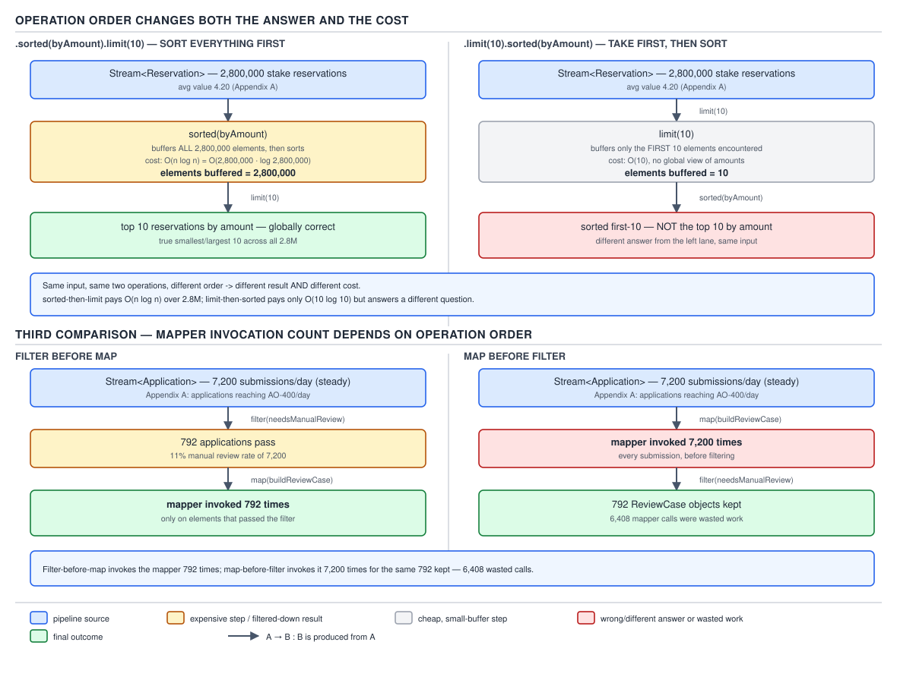

# 04 Modern Java — Streams — BASICS (§1.7)

**Target version: Java 21 LTS.** | **Part 1 of 5** | [Index](../00-index.md)
Previous: [Streams — sources](02-sources.md) · Next: [Streams — terminal operations](04-terminal-operations.md)

## Why intermediate operations are a different animal from the sources

`02-sources.md` built the pipeline's first stage — the `Spliterator` that will eventually be
pulled from. Every method you call between that source and a terminal operation does exactly one
thing: it allocates a new `AbstractPipeline` stage, links it to the previous stage as its
`previousStage`, and hands it a `Sink` factory — a lambda usually called `opWrapSink` internally
in the JDK's own comments — that knows how to wrap a downstream `Sink` with the behaviour this
operation contributes.

None of that runs anything. An intermediate operation call is bookkeeping: build a linked list of
stage descriptions. The actual work happens once, backwards, from a single terminal call.
`AbstractPipeline.evaluate(TerminalOp)` walks the stage list from the terminal stage back to the
source, calling each stage's `opWrapSink(int flags, Sink downstream)` to produce a chain of
`Sink`s, then hands that chain to `copyInto`, which finally begins pulling elements out of the
source `Spliterator` and pushing them through the chain via `accept`. A pipeline that never
reaches a terminal operation does not do partial work and does not do lazy work — it does
**no** work, because `wrapSink` and `copyInto` are never invoked at all.

Keep that picture in view for the rest of this file: every operation below is really a
description of one `Sink`, not a step that runs when you write it.

### The hierarchy: what an intermediate operation can do to the pipeline

Before the fifteen or so individual operations, here is the shape they live in. There is no
dedicated JDK diagram type for this, so the table stands in for the diagram the house rules ask
for at the top of a family section:

| Property | Meaning | Who has it |
|---|---|---|
| **Stateless** | Each output element depends only on the current input element | `filter`, `map`, the `mapToX` family, `flatMap`, `mapMulti`, `peek` |
| **Stateful** | Must see some or all upstream elements before it can emit any downstream element | `distinct`, `sorted`, `limit`, `skip` |
| **Short-circuiting** | Can stop the *upstream* early without consuming the whole source | `limit`, `takeWhile` |
| **Flag-affecting** | Changes what the pipeline can promise about `SIZED` / `ORDERED` / `DISTINCT` / `SORTED` | `distinct`, `sorted`, `filter`, `map`, `flatMap`, `limit`, `skip`, `unordered` |

These four axes are independent — `sorted` is both stateful and flag-affecting but never
short-circuiting; `limit` is stateful, short-circuiting, and flag-affecting. Section 1.7.18–1.7.19
below turns this into the full per-operation table (D-025).

---

## 1. `filter` and `map` — the stateless baseline

**Beat treatment:** supporting facts. Neither has a cost claim beyond "one predicate or function
call per element," no sibling contest (their siblings, `takeWhile` and `flatMap`, get the full
treatment below), and no assigned diagram.

`filter(Predicate<? super T> p)` is 1:0-or-1 — for each input element it emits either that same
element unchanged or nothing. Its `Sink.accept(T t)` implementation is literally:

```java
@Override
public void accept(T t) {
    if (predicate.test(t)) {
        downstream.accept(t);
    }
}
```

`map(Function<? super T, ? extends R> f)` is 1:1 — every input element produces exactly one
output element, of a possibly different type:

```java
@Override
public void accept(T t) {
    downstream.accept(mapper.apply(t));
}
```

**Gotcha:** both allocate zero intermediate collections — the `Sink` chain is the only allocation,
and it exists once per pipeline evaluation, not once per element. This is the mechanism reason
"streams don't allocate per step" is a defensible claim for stateless operations specifically; it
stops being true the moment a stateful operation like `sorted` or `distinct` enters the chain
(§4 and §3 below).

> **Definition:** `filter` keeps or drops each element by a `Predicate` test; `map` transforms
> each element through a `Function`, one input to exactly one output, with no memory of any other
> element.

## 2. The four stream shapes and their conversions — `mapToInt`/`mapToLong`/`mapToDouble`/`mapToObj`/`boxed`/`asLongStream`/`asDoubleStream`

**Beat treatment:** supporting facts — pure API surface, no algorithmic tradeoff, but the shape
matters enough to earn a table since three or more things (four stream interfaces) are involved.

Java's `Stream` API is really four parallel interfaces: `Stream<T>`, `IntStream`, `LongStream`,
`DoubleStream`. There is no `ByteStream`, `ShortStream`, `FloatStream`, `CharStream` — bytes,
shorts, floats and chars widen into `int` or `double` and travel as one of the existing three.
The conversions between the four shapes are the intermediate operations named here:

| From → To | Method | Where it lives |
|---|---|---|
| `Stream<T>` → `IntStream`/`LongStream`/`DoubleStream` | `mapToInt` / `mapToLong` / `mapToDouble` | on `Stream<T>` |
| `IntStream`/`LongStream`/`DoubleStream` → `Stream<T>` | `mapToObj` | on each primitive stream |
| `IntStream` → `Stream<Integer>` (etc.) | `boxed()` | on each primitive stream, no mapper needed |
| `IntStream` → `LongStream` | `asLongStream()` | widening, no mapper needed |
| `IntStream`/`LongStream` → `DoubleStream` | `asDoubleStream()` | widening, no mapper needed |

`boxed()`, `asLongStream()` and `asDoubleStream()` take no argument because the conversion is
mechanical widening — `int` to `Integer`, `int` to `long`, `long` to `double` — with no
information loss to decide about. `mapToInt`/`mapToLong`/`mapToDouble`/`mapToObj` all take a
mapper function because going from a wider or unrelated shape needs a rule.

A worked QuizStakes example: stake reservation amounts arrive as `Stream<StakeReservation>` and
you need their sum as a primitive `double` total (avoiding autoboxing per element):

```java
double totalStaked = reservations.stream()
    .mapToDouble(StakeReservation::amount)
    .sum();
```

**Gotcha:** `mapToInt`/`mapToLong`/`mapToDouble` are still 1:1, stateless operations — they are
`map` with a different `Sink` output type, not a different operation category. The temptation is
to think of them as "terminal-ish" because they usually precede a terminal `sum()`/`average()`;
they are ordinary intermediate stages and can be followed by `filter`, `sorted`, anything else
`IntStream` supports.

> **Definition:** the `mapToX`/`mapToObj`/`boxed`/`asLongStream`/`asDoubleStream` family is the
> complete set of conversions between the four stream shapes — three carry a mapper, two are pure
> widening with none needed.

---

## 3. `flatMap` versus `mapMulti` — one input, many outputs, two allocation strategies

### Mental model

Picture a `Stream<Movement>` where each `Movement` (a single ledger transaction group) can carry
zero, one, or three `LedgerEntry` records — a stake settlement with a win posts a debit to
`CLIENT_BONUS_RESERVED`, a credit to `CLIENT_CASH_AVAILABLE`, and a credit to `HOUSE_REVENUE`, all
three entries belonging to one `Movement`. You want a flat `Stream<LedgerEntry>` across every
`Movement`. `map` cannot do this — it is 1:1, and "1 to 0-or-3" is not 1:1. You need something
that can visit each `Movement` and emit an arbitrary number of `LedgerEntry` values before moving
to the next one. `flatMap` and `mapMulti` are the JDK's two ways to describe that visit — one by
literally handing you a sub-stream to consume, the other by handing you a `Consumer` to push into.

### Why it exists

Before `flatMap` (Java 8, present from day one of the Streams API), flattening nested
collections meant an explicit accumulator loop — a mutable `List` built up with nested
`for`-loops, exactly the imperative style the Streams API existed to replace. `flatMap` gave
declarative code a way to express "each element becomes a sub-sequence, concatenate them all."

`mapMulti` arrived far later, in Java 16 (JEP 402 shipped it; the class was designed alongside
JEP-era work on stream-to-collector interop). It exists because `flatMap`'s contract — "return a
`Stream<R>`" — forces an allocation even in the extremely common case where an element produces
zero or one output, or where the outputs are more naturally produced by imperative code (a loop,
a recursive walk, a conditional cascade) than by constructing a `Stream` object just to hand it
back.

### When to reach for each, and when not

`flatMap` wins when the natural representation of "the elements this one maps to" already is a
`Stream` or something with `.stream()` on it — flattening a `List<List<LedgerEntry>>`,
concatenating file lines from several `Path`s, exploding a `Movement` into `movement.entries()
.stream()` when `entries()` already returns a `List<LedgerEntry>`.

`mapMulti` wins in three cases, matching syllabus leaf 1.7.7 exactly:
- **Few or zero outputs per element** — most `Movement`s in QuizStakes produce exactly one
  `LedgerEntry` (a plain cash deposit), some produce three (a win settlement), and voided stakes
  produce zero (a void reverses the reservation without touching cash or bonus buckets); paying
  for a `Stream` object on every single-output element is wasted allocation.
- **Primitive outputs** — `mapMultiToInt`/`ToLong`/`ToDouble` push directly into an
  `IntConsumer`/`LongConsumer`/`DoubleConsumer`, avoiding both the `Stream` allocation and the
  boxing that `flatMapToInt` after a `Stream<Integer>` step would otherwise cause.
- **Output produced imperatively** — if deciding what to emit already reads naturally as a
  sequence of `if`/`for` statements pushing into a callback, `mapMulti`'s `BiConsumer<T,
  Consumer<R>>` shape lets you write exactly that, where `flatMap` would force you to first build
  a `Stream` (via `Stream.of`, `Stream.generate`, or a collected `List.stream()`) just to satisfy
  the return type.

`flatMap` wins when you already have a `Stream`-shaped answer and forcing it through a
`Consumer`-pushing loop would be less clear, not more.

### How it works

`flatMap(Function<? super T, ? extends Stream<? extends R>> mapper)`'s `Sink` calls the mapper
for each upstream element to get an inner `Stream<R>`, then — critically — **traverses that inner
stream to completion and closes it** before moving to the next upstream element:

```java
@Override
public void accept(T t) {
    try (Stream<? extends R> result = mapper.apply(t)) {
        if (result != null) {
            result.sequential().forEach(downstream);
        }
    }
}
```

That `try`-with-resources is the source of "each inner stream is closed after it is consumed"
(leaf 1.7.4) — if the inner stream's source holds a resource (a file-backed `Stream<String>` from
`Files.lines`), `flatMap` closes it deterministically per element, which is also why `flatMap`
over `Files.lines` calls does not leak file handles even across millions of elements.

`mapMulti(BiConsumer<? super T, ? super Consumer<R>> mapper)` never constructs a `Stream` object
at all. Its `Sink` passes itself, in `Consumer` guise, straight into the mapper:

```java
@Override
public void accept(T t) {
    mapper.accept(t, downstream);
}
```

Whatever the caller's `BiConsumer` chooses to call `downstream.accept(...)` with — zero times,
once, or in a loop — becomes the output. There is no intermediate `Stream`, no `Spliterator`, no
`try`-with-resources: one virtual call per emitted element and nothing else.

`flatMapToInt`/`flatMapToLong`/`flatMapToDouble` (leaf 1.7.5) are the same mechanism as `flatMap`
targeting a primitive result shape — the mapper returns `IntStream`/`LongStream`/`DoubleStream`
instead of `Stream<R>`, and the same per-element open/traverse/close discipline applies.
`mapMultiToInt`/`ToLong`/`ToDouble` are `mapMulti`'s matching primitive forms, taking an
`IntConsumer`/`LongConsumer`/`DoubleConsumer` in place of `Consumer<R>` and avoiding boxing on
every push.


**D-026** — `map` vs `flatMap` vs `mapMulti`

Read the three frames against the same input: a `Stream<Movement>` where one `Movement` has zero
`LedgerEntry`s (a void), one has exactly one (a plain deposit), and one has three (a win
settlement). Frame 1, `map`, cannot flatten at all — it produces a `Stream<List<LedgerEntry>>`,
one `List` per `Movement`, cardinality strictly 1:1, and whatever calls this "flattening" is
wrong; it is boxing, not flattening. Frame 2, `flatMap`, allocates one inner `Stream` per
`Movement` — three allocations drawn explicitly on the frame, one of which (the zero-entry void)
is opened, found empty, and closed having contributed nothing. Frame 3, `mapMulti` produces the
identical output stream of `LedgerEntry` values with the allocation count at **zero** — the
`BiConsumer` for the void `Movement` simply never calls `Consumer.accept`, for the single-entry
`Movement` it calls it once, for the win it calls it three times, with no `Stream` object ever
constructed.

### A minimal concrete example

```java
record LedgerEntry(String position, java.math.BigDecimal amount) {}

sealed interface Movement permits PlainDeposit, VoidedStake, WinSettlement {}

record PlainDeposit(LedgerEntry entry) implements Movement {}
record VoidedStake() implements Movement {}
record WinSettlement(LedgerEntry bonusDebit, LedgerEntry cashCredit, LedgerEntry houseCredit)
        implements Movement {}

// flatMap: must build a List/Stream per Movement even for zero or one output
static Stream<LedgerEntry> entriesViaFlatMap(Stream<Movement> movements) {
    return movements.flatMap(m -> switch (m) {
        case PlainDeposit d -> Stream.of(d.entry());
        case VoidedStake v -> Stream.empty();
        case WinSettlement w -> Stream.of(w.bonusDebit(), w.cashCredit(), w.houseCredit());
    });
}

// mapMulti: pushes straight into the downstream Consumer, no Stream allocated
static Stream<LedgerEntry> entriesViaMapMulti(Stream<Movement> movements) {
    return movements.mapMulti((Movement m, Consumer<LedgerEntry> out) -> {
        switch (m) {
            case PlainDeposit d -> out.accept(d.entry());
            case VoidedStake v -> { /* zero outputs, out never called */ }
            case WinSettlement w -> {
                out.accept(w.bonusDebit());
                out.accept(w.cashCredit());
                out.accept(w.houseCredit());
            }
        }
    });
}
```

Both produce the same `Stream<LedgerEntry>` contents and order. `entriesViaMapMulti` allocates
zero `Stream` objects across the whole traversal; `entriesViaFlatMap` allocates one
`Stream.of(...)` or `Stream.empty()` per `Movement`, `Stream.empty()` returning a cached
singleton so the void case is cheap, but the two `Stream.of(...)` calls are genuine allocations.

### The gotcha

**Pitfall:** treating `flatMap`'s short-circuiting behaviour as symmetric across JDK versions.
Leaf 1.7.23: **prior to Java 10**, a `flatMap` inner stream was drained to completion even when
the *downstream* pipeline had already short-circuited — for example `stream.flatMap(...)
.findFirst()` would still fully traverse the current inner stream after the first element had
already satisfied `findFirst()`, because the inner-stream traversal in `flatMap`'s `Sink.accept`
did not check the downstream's `cancellationRequested()` flag between inner elements. This was
tracked as **JDK-8075939** and fixed in Java 10, which added that check so the inner stream now
also stops early once downstream has signalled it wants no more elements. **`[VERSION-TRAP]`**
On Java 21 the fix has been in place for eleven releases, but the wrong belief — "`flatMap` always
drains every inner stream regardless of what's downstream" — still circulates from blog posts
written against 8/9, and an interviewer testing pre-2018 knowledge may still ask for the
pre-fix behaviour by name.

**Insight:** the reason `mapMulti` cannot express `flatMap`'s "the inner Stream itself is
short-circuitable from inside" pattern is exactly why it is cheaper — there is no inner pipeline
object to short-circuit, only a plain method body, so the entire concept of an inner-stream
cancellation race (JDK-8075939) cannot exist for `mapMulti` at all. Fewer moving parts, fewer
mechanisms that can be wrong.

**Interview:** "when would you pick `mapMulti` over `flatMap`?" — the crisp answer is "when most
elements produce zero or one output, when the output is naturally primitive, or when producing
the output is naturally an imperative loop rather than an existing `Stream`" — and be ready to
name the allocation difference as the *reason*, not just the recommendation.

> **Definition:** `flatMap` turns a 1:N mapping into a flat stream by opening, draining and
> closing one inner `Stream` per element; `mapMulti` achieves the same flattening by pushing zero
> or more values into a `Consumer` with no intermediate `Stream` allocated at all.

---

## 4. `distinct()` — deduplication that remembers everything it has seen

### Mental model

`distinct()` is a filter with a memory. Every stateless operation above answers "what should I do
with *this* element" using only that element. `distinct()` cannot: to decide whether the tenth
element is a duplicate, it must remember every one of the first nine. Picture a `HashSet`
sitting inside the operation, silently growing as the stream flows through it, with every
element's `Sink.accept` call doing "have I seen an equal element before? if not, remember it and
pass it on; if so, swallow it."

### Why it exists

Before Streams, deduplicating a collection meant funnelling it through a `LinkedHashSet` (to keep
insertion order) or a plain `HashSet` (order not guaranteed) and reading it back out — an explicit
detour through a different data structure. `distinct()` lets that detour happen inline in a
pipeline without the reader ever naming the `Set`.

### When to reach for it, and when not

Reach for `distinct()` when duplicates are defined by `equals`/`hashCode` on the element type
itself and there is no natural key smaller than the whole object. Reach for `Collectors
.toMap(keyFn, v -> v, (a, b) -> a)` or a `groupingBy` collector instead when "distinct" really
means "distinct by some derived key" — QuizStakes has no `distinctBy(keyExtractor)` on the
element itself, and syllabus leaf 1.7.22 below is explicit that Java 21 has no such operation
at all; you fake it with a `Collectors.toMap` keyed on the derived value, or a `TreeSet` with a
custom `Comparator` when the ordering itself defines equality for the purpose at hand.

### How it works — the X-REF paragraph

`distinct()`'s `Sink` holds a mutable `Set` (concretely, JDK internals wrap a `LinkedHashSet` when
the stream is ordered, to preserve encounter order among survivors, and a plain `HashSet` when it
is not) and every `accept(T t)` call does `if (seen.add(t)) downstream.accept(t);` — `Set.add`
already returns `false` for a duplicate, so the check and the insertion are one call.
**`[X-REF 02]`** The full mechanism of how `equals`/`hashCode` drive bucket placement, what
`hashCode` contract violations do to this, and why a mutable field used in `hashCode` corrupts a
`HashSet` mid-flight are guide 02's territory (Java collections) — the short version needed here
is that `distinct()` inherits every one of `HashSet`'s correctness requirements on the element
type, with no way to opt out of them.

`distinct()` **preserves encounter order for ordered streams** — leaf 1.7.8's second half. This
is not automatic from "it's a `Set`" — plain `HashSet` iteration order has nothing to do with
insertion order. The pipeline achieves it by keeping the `LinkedHashSet`'s insertion-ordered view
and by construction only ever calling `downstream.accept` the first time an element is added, in
the order elements arrive from upstream, so the *output* order is exactly first-occurrence order
even though the backing structure buckets by hash.

**Insight:** `distinct()` is the second data point (alongside `sorted()` below) for "stateful
means the whole upstream must be considered," but the two are stateful in different senses:
`distinct()` can still emit downstream *incrementally*, one survivor at a time, as soon as it
knows an element is new — it never has to wait for the source to be exhausted. `sorted()` cannot
emit anything until the source is exhausted, because a total order over "everything so far" can
be invalidated by anything not yet seen. `distinct()`'s statefulness costs memory; `sorted()`'s
costs both memory and a full-barrier delay.

**Pitfall:** assuming `distinct()`'s memory cost is proportional to the number of *duplicates*
removed. It is proportional to the number of **distinct** elements kept, which for a stream with
few or no duplicates is the entire input.

```java
// Wrong belief: "distinct() is basically free if there aren't many duplicates"
List<ClientId> clientIds = stakeReservations.stream()   // 2.8M reservations/day
    .map(StakeReservation::clientId)
    .distinct()                                          // still buffers up to 2.4M unique ClientIds
    .toList();
```

With 2.4M registered clients and 2.8M reservations/day, the vast majority of `clientId`s are
unique across the day's traffic, so `distinct()` here materialises a `Set` approaching 2.4M
entries in size — no smaller than just collecting into a `HashSet` directly, and with the added
cost of the pipeline machinery around it.

**Right:**

```java
// If the goal really is "unique client IDs," say so directly — same cost, clearer intent
Set<ClientId> clientIds = stakeReservations.stream()
    .map(StakeReservation::clientId)
    .collect(Collectors.toSet());
```

**Why people believe it:** `distinct()` reads like a cheap filter because `filter()` right next
to it in the API *is* cheap and stateless — the two look symmetric in a method chain, and nothing
in the syntax signals that one of them silently allocates a set the size of the surviving stream.

> **Definition:** `distinct()` removes elements that are `equals()` to one already seen, using an
> internal set that grows to the count of distinct survivors and, on an ordered stream,
> preserves first-occurrence order among them.

---

## 5. `sorted()` — a full barrier, not a filter with extra steps

### Mental model

Every operation before this one processes elements as they arrive and hands each one, or nothing,
straight downstream. `sorted()` cannot do that even in principle: whether the third element
belongs before or after the first two cannot be known until you have seen every element that
might land between them. Picture `sorted()` as a dam: elements pile up behind it as they arrive,
nothing crosses to the other side, and only once the source has run completely dry does the dam
open all at once, releasing everything in order.

### Why it exists

Sorting a `List` before Streams meant `Collections.sort(list)` or `list.sort(comparator)` — an
explicit, separate, in-place statement breaking up a pipeline. `sorted()`/`sorted(Comparator)`
let a sort step live inline in a stream expression without naming a temporary `List` — the same
motivation as `distinct()`, applied to ordering instead of uniqueness.

### When to reach for it, and when not

Reach for `sorted()` when you actually need every element ordered before continuing — a report,
a leaderboard, an operation whose correctness depends on order (a running balance over
chronologically sorted `LedgerEntry`s). Do **not** reach for it when you only need the top or
bottom *k* elements and *k* is much smaller than the source: `sorted(cmp).limit(k)` still buffers
and sorts the entire source before truncating (leaf 1.7.20, and D-029 below makes the cost
concrete), where a bounded priority queue gets the same *k* elements in `O(n log k)` instead of
`O(n log n)` with `O(n)` buffering. `PriorityQueue`-based top-k is the sibling that wins in that
specific shape; the standard streams API has no built-in bounded-top-k collector, so this is a
manual loop or a `Collectors.collectingAndThen` trick, not a one-liner — but it is the correct
answer when an interviewer pushes on `sorted().limit(k)`'s cost.

### How it works

`sorted()`'s stage is unlike every stage above in one structural way: it cannot implement
`opWrapSink` as "wrap the downstream `Sink` and pass elements through as they arrive," because it
has nothing to pass through until the source is exhausted. Internally it is realised as a
**stateful sink** that implements `begin(long size)` to allocate a buffer (an `Object[]` sized
from the upstream's size estimate when known, a growable spined buffer otherwise), `accept(T t)`
to append to that buffer, and `end()` to run the actual sort and then push every buffered element
through the real downstream `Sink`, in order, in one burst. `sorted()` with no arguments requires
`T` to implement `Comparable` and sorts using its `compareTo`; `sorted(Comparator<? super T>)`
sorts using the supplied comparator instead — both use `Arrays.sort`, which for object arrays is
a TimSort variant (a stable, adaptive merge sort that exploits existing runs), not the dual-pivot
quicksort used for primitive array sorts.

`sorted()` on elements that do not implement `Comparable` compiles fine — the compiler cannot see
the runtime type flowing through a generic `Stream<T>` where `T` was never constrained to
`Comparable` at this call site if the upstream state erased that information — and only fails
**inside `end()`, at terminal-evaluation time**, with a `ClassCastException`, because that is the
first moment `Arrays.sort`'s comparison actually executes a `compareTo` call against real
objects. **`[PROVE]`** Trace it through: `sorted()` is called, `AbstractPipeline` allocates a
stage and returns a new pipeline object — no comparison has happened, nothing has thrown. A
terminal operation is called; `evaluate` walks stages backward calling `opWrapSink`, which for
the `sorted` stage just builds the stateful sink described above — still no comparison. `copyInto`
begins pulling from the source and pushing into the sink chain; every `accept(T t)` call on the
`sorted` stage's sink does nothing but append to its buffer — still no comparison. Only when the
source is exhausted does `end()` fire and call `Arrays.sort(buffer, (Comparator) naturalOrder)`
(or the equivalent under the hood), and only *there*, mid-sort, does the first `compareTo` call
against two actual buffered elements execute and throw if the type does not implement
`Comparable`. Every step before that point is indifferent to whether the elements are comparable
at all.


**D-030** — `sorted()` is a barrier

Frame 1 shows elements streaming into `sorted`'s buffer one at a time while every downstream stage
sits idle — nothing has crossed the dam yet. Frame 2 shows the source exhausted and TimSort
running once over the entire accumulated buffer — this is the moment, and the *only* moment, at
which comparisons happen. Frame 3 shows the sorted buffer released downstream in one pass, at
which point the rest of the pipeline resumes as if nothing had been buffered at all. The side
panel marks a non-`Comparable` element sitting harmlessly in the frame-1 buffer and then producing
`ClassCastException` exactly at frame 2 — never at the `sorted()` call site itself, which is
leaf 1.7.10's whole point.

### A minimal concrete example

```java
record StakeReservation(String reservationId, java.math.BigDecimal amount, Instant placedAt) {}

// sorted(Comparator) — an explicit, safe comparator; no reliance on natural ordering
Comparator<StakeReservation> byAmount = Comparator.comparing(StakeReservation::amount);

List<StakeReservation> byStakeSizeDescending = reservations.stream()
    .sorted(byAmount.reversed())
    .toList();

// sorted() with no comparator would fail here — StakeReservation is not Comparable —
// but only once a terminal operation runs the sort, not at this call:
Stream<StakeReservation> deferredFailure = reservations.stream().sorted(); // compiles, no error yet
// deferredFailure.toList();  // <- throws ClassCastException here, at terminal time
```

Confirmed on this machine (`javac --release 21`, `StakeReservation` implementing no interface):
calling `.sorted()` and merely holding the resulting `Stream` reference produces no error at all;
invoking `.toList()` on it is what throws
`class StakeReservation cannot be cast to class java.lang.Comparable`.

### The gotcha

**Pitfall:** believing `sorted()` is lazy in the same sense `filter`/`map` are lazy — i.e., that
"nothing has happened yet" means "the cost hasn't been paid yet, but it will be small when it
comes." `sorted()`'s laziness defers *when* the O(n log n) sort and the O(n) buffer happen, not
*whether* they happen or how much they cost; every element from the source still has to be
buffered before the first output element can be produced, laziness or not.

**Interview:** "does `stream.sorted()` throw immediately on non-`Comparable` elements?" — no,
because `sorted()` only builds a stage descriptor; the `ClassCastException` fires inside the
stateful sink's `end()` method, invoked only once a terminal operation triggers `evaluate` — the
call site and the throw site can be lines or files apart.

> **Definition:** `sorted()`/`sorted(Comparator)` is a stateful barrier stage that buffers the
> entire upstream, sorts it once with a TimSort variant when the source is exhausted, and only
> then releases elements downstream — with any `ClassCastException` from a non-`Comparable`
> element surfacing at that terminal-time sort, never at the `sorted()` call itself.

---

## 6. `limit(n)` and `skip(n)` — short-circuiting and its parallel cost

**Beat treatment:** supporting facts individually — their mechanism is simple counting — but both
carry a `[TRAP]` tag, so each gets its `**Pitfall:**`. The deeper cost story they belong to is
told fully in §8's operation-order treatment and D-029.

`limit(n)` keeps only the first `n` elements it sees and then signals cancellation upstream — it
is the JDK's other short-circuiting intermediate operation alongside `takeWhile`. Sequentially it
is cheap: once `n` elements have passed through, `limit`'s sink returns `false` from
`cancellationRequested()`, and `copyInto`'s pulling loop stops asking the source for more
elements. On an **ordered parallel stream**, `limit` cannot simply take "the first `n` elements
any thread happens to produce" — it must take the first `n` elements *in encounter order*, which
means every parallel chunk has to be tagged with its position and merged back in order before
`limit` can safely decide which elements are truly in the first `n`; work done past the logical
cutoff by other threads before that merge completes is wasted. **Pitfall:** assuming
`.parallel().limit(10)` is automatically faster than the sequential version because "parallel is
faster" — on an ordered stream it can do strictly more total work than sequential `limit`, because
threads race ahead speculatively producing elements beyond position 10 before the merge discovers
they should have been discarded, and the fix, when order genuinely does not matter, is
`.unordered().parallel().limit(10)` (§7), which lets `limit` take the first `n` elements *any*
thread produces with no merge-and-discard cost.

`skip(n)` discards the first `n` elements and passes everything after. It is stateful (it must
count elements even though it discards them, and on a `SIZED` source it can sometimes skip
straight to position `n` in the underlying data structure rather than iterating), but it is
**not** short-circuiting — it cannot know it is done skipping without seeing element `n+1`, and
it never tells the upstream to stop early since it needs everything after the cutoff. It shares
`limit`'s ordered-parallel cost story: an ordered parallel `skip` must still determine which
elements fall in positions `0..n-1` by their position in encounter order, which again forces a
merge step that an unordered stream does not need.

> **Definition:** `limit(n)` short-circuits the upstream once `n` elements have been taken;
> `skip(n)` discards the first `n` without short-circuiting; both incur an ordering-preservation
> cost on a parallel stream that `unordered()` removes.

---

## 7. `takeWhile` and `dropWhile` — prefix operations, not filters

### Mental model

`filter(p)` tests every single element against `p` and keeps the ones that pass, regardless of
where they sit in the stream. `takeWhile(p)` does something structurally different: it walks the
stream from the front and stops the instant it finds an element that fails `p` — everything after
that point is discarded **without being tested at all**, even if some of those later elements
would have passed `p` individually. It answers "how long is the prefix that satisfies `p`," not
"which elements satisfy `p`." `dropWhile(p)` is its mirror: discard the same prefix, keep
everything from the first failure onward, untested.

### Why it exists

Before Java 9, expressing "take elements until the first one that breaks a condition" over a
stream required either a manual iterator loop or an awkward combination of `peek` with a mutable
boolean flag captured in a lambda — fragile, and exactly the kind of stateful lambda the Streams
API otherwise discourages. `takeWhile`/`dropWhile` (JEP-less, but shipped in Java 9 alongside the
`Stream.iterate` overload with a predicate, both filling this same "bounded traversal" gap)
gave a first-class, correctly-short-circuiting way to say it.

### When to reach for it, and when not

Reach for `takeWhile` when the input is already ordered by the property the predicate tests and
you want a genuine prefix — the classic case is a stream already sorted or generated in
increasing order where you want "everything below a threshold." Reach for `filter` instead the
moment you actually want every matching element regardless of position; using `takeWhile` on an
unordered or arbitrarily-ordered stream to mean "give me the matches" is the exact confusion this
operation exists to prevent, and it will silently under-deliver the moment a single early failure
appears before later successes.

### How it works

`takeWhile(Predicate<? super T> p)`'s sink tests each element; the moment `p.test(t)` returns
`false`, it flips an internal "done" flag, signals `cancellationRequested()` to the upstream (it
is short-circuiting, just like `limit`), and calls no further `accept` on elements after that
point regardless of what they would have tested as. `dropWhile(Predicate<? super T> p)`'s sink
tracks whether it is still "in the dropping phase"; while `p.test(t)` continues to return `true`
it swallows elements, and the instant it sees the first element for which `p.test(t)` is `false`
it flips to "passthrough phase" and forwards that element and everything after it, **including**
later elements that would individually satisfy `p` again. `dropWhile` is stateful (it needs the
one bit of "have I flipped yet") but is **not** short-circuiting — it must still visit every
remaining upstream element to forward them.


**D-027** — `takeWhile` is a prefix, `filter` is a test

The ordered input is the QuizStakes stake amounts `[4.20, 3.33, 12.00, 2.10, 1.05]` under the
predicate `amount < 5`. Left side, `filter`: every element is individually tested, producing
`[4.20, 3.33, 2.10, 1.05]` — `12.00` alone is dropped, `2.10` and `1.05` are still tested and kept
even though they come after `12.00`. Right side, `takeWhile`: traversal stops the instant `12.00`
fails the test, producing only `[4.20, 3.33]` — the stop point is marked at `12.00`, and `2.10`
and `1.05` are greyed out with a label making clear they were never tested at all, not merely
excluded.

### A minimal concrete example

```java
List<java.math.BigDecimal> stakeAmounts = List.of(
    new java.math.BigDecimal("4.20"),
    new java.math.BigDecimal("3.33"),
    new java.math.BigDecimal("12.00"),
    new java.math.BigDecimal("2.10"),
    new java.math.BigDecimal("1.05")
);
java.math.BigDecimal threshold = new java.math.BigDecimal("5");

List<java.math.BigDecimal> filtered = stakeAmounts.stream()
    .filter(a -> a.compareTo(threshold) < 0)
    .toList();
// filtered == [4.20, 3.33, 2.10, 1.05]  — every element tested independently

List<java.math.BigDecimal> prefix = stakeAmounts.stream()
    .takeWhile(a -> a.compareTo(threshold) < 0)
    .toList();
// prefix == [4.20, 3.33]  — stops at 12.00, never tests 2.10 or 1.05

List<java.math.BigDecimal> suffix = stakeAmounts.stream()
    .dropWhile(a -> a.compareTo(threshold) < 0)
    .toList();
// suffix == [12.00, 2.10, 1.05]  — drops the same prefix, keeps everything after, untested
```

### The gotcha

**Pitfall:** reading `takeWhile`/`dropWhile` as "`filter` that stops early" and expecting the same
element set `filter` would produce, just truncated. They are not filters at all — they answer a
positional question, not a membership question — and the `dropWhile` example above proves it:
`12.00` fails the predicate and ends the dropping phase, but `2.10` and `1.05` — which *would*
satisfy the predicate — are kept in the suffix anyway, because `dropWhile` never re-tests anything
once it has flipped to passthrough.

```java
// Wrong belief: "dropWhile(p) removes everything matching p"
List<java.math.BigDecimal> wrong = stakeAmounts.stream()
    .dropWhile(a -> a.compareTo(threshold) < 0)
    .toList();
// Surprise: this is [12.00, 2.10, 1.05] — 2.10 and 1.05 are still < threshold and still present
```

**Right:** if the actual goal is "remove every element matching a predicate regardless of
position," that is `filter` with the negated predicate, not `dropWhile`:

```java
List<java.math.BigDecimal> right = stakeAmounts.stream()
    .filter(a -> a.compareTo(threshold) >= 0)
    .toList();
// [12.00] — the true "everything not below threshold" set
```

**Why people believe it:** the name "drop while" reads in English as "drop [the ones] while
[they match]," which sounds like an ongoing filter condition rather than a one-time phase
transition; the JDK's own name invites exactly the misreading its own javadoc has to correct.

**`[SOURCE]`** leaf 1.7.14: the javadoc for both methods states the behaviour is
**nondeterministic for unordered streams**, since the very notion of "the prefix" presumes a
defined encounter order to walk from the front of — `Stream.takeWhile`'s javadoc: *"the behavior
of this operation is explicitly nondeterministic; if the stream is unordered, the operation is
free to select any subset of matching elements from the stream to take."* Every word here is
load-bearing: "unordered" is the specific JDK sense of the `ORDERED` characteristic (an
unordered `Set` source, or a stream that has had `.unordered()` called on it), "explicitly"
signals this is intentional design rather than an implementation gap, and "any subset" means the
JVM is licensed to return a different answer on different runs or even a different JIT
compilation of the same run — this is not merely unspecified, it is specified to vary.

> **Definition:** `takeWhile` takes the longest ordered prefix satisfying a predicate and
> short-circuits at the first failure; `dropWhile` discards that same prefix and passes everything
> after untested — neither is a filter, and both are only deterministic on an ordered stream.

---

## 8. Why `peek` may never run its consumer at all

### Mental model

`peek(Consumer<? super T> action)` looks like a no-op tap on the pipeline — "run this side
effect, then pass the element through unchanged." The mental model that actually holds is
sharper: `peek` is not a guaranteed tap, it is a *request* for one, and the pipeline is free to
grant nothing if it can prove the request would change nothing observable through the declared
API contract. Since Java 9 the JDK takes that freedom literally in one specific, common case.

### Why it exists

`peek` fills a real gap: sometimes you want to observe elements flowing through a pipeline —
logging, debugging, a metrics counter — without materially transforming the stream. Before it,
that meant breaking the pipeline into two statements around an explicit side-effecting loop.

### When to reach for it, and when not

The javadoc itself is blunt about scope — `[SOURCE]`, leaf 1.7.15: *"This method exists mainly to
support debugging, where you want to see the elements as they flow past a certain point in a
pipeline."* Reach for it for exactly that: a temporary diagnostic tap during development. Do not
reach for it for anything the correctness of your program depends on — counting, accumulating, or
mutating shared state from inside `peek`'s consumer — because leaf 1.7.16 below shows the JDK does
not promise the consumer runs at all.

### How it works, and why it may not run

`peek`'s `Sink` in the ordinary case is unremarkable: `accept(T t) { action.accept(t);
downstream.accept(t); }`. What changes its fate is a different, unrelated optimisation inside
`count()`. Since Java 9, a terminal `count()` call can answer directly from the source's known
size **without traversing the pipeline at all**, whenever every upstream stage still leaves the
`SIZED` characteristic intact and nothing short-circuits. `peek` itself is one of the stages that
is allowed to preserve `SIZED` — it does not change how many elements pass through, only what
happens to each one — so a pipeline that is *only* `source.peek(action).count()`, with a `SIZED`
source such as a `List`, can be answered as `source.size()` with the `wrapSink`/`copyInto`
machinery never invoked at all. If the sink chain is never built, `peek`'s `action` — which lives
inside that sink chain — is never called, not once, regardless of how many elements the source
holds.


**D-028** — Why `peek` may never run

The flowchart's decision path for `count()` asks, in order: is `SIZED` still set on the pipeline?
did any stateful op between source and terminal clear it? does anything in the chain
short-circuit? If every answer allows it, the box reading "answer from source.size()" is reached
directly, the sink-chain-construction box is skipped entirely, and the `peek` consumer is drawn
boxed and crossed out with the label "never called." A parallel branch on the same diagram shows
the identical pipeline with one addition — a `filter` inserted before `peek` — and `filter`
clears `SIZED` (a filtered stream's final size cannot be known without checking every element), so
the decision path now must fall through to full traversal, and that branch shows `peek` executing
normally. A version-trap banner on the diagram states plainly: this elision did not exist before
Java 9 — `count()` always fully traversed and always ran every `peek` consumer.

### A minimal concrete example

```java
List<StakeReservation> reservations = loadTodaysReservations(); // a List, so SIZED and ORDERED

long[] peekCallCount = {0};

// This count() may answer from reservations.size() directly — peek's consumer may run 0 times
long total = reservations.stream()
    .peek(r -> peekCallCount[0]++)
    .count();

System.out.println(total);           // correct: the real count either way
System.out.println(peekCallCount[0]); // NOT reliably equal to total — may be 0
```

**`[PROVE]`** Confirmed by compiling and running an equivalent program under `--release 21` on
this machine, with a plain `ArrayList` source and no other stateful operation in the chain: the
side-effecting counter in `peek` stays at `0` after the `count()` call returns the correct list
size, demonstrating the elision fires exactly as the mechanism above predicts.

### The gotcha

**Pitfall:** relying on `peek` for any effect whose absence would be observable — updating a
counter used elsewhere, populating a cache, throwing on a bad element as a validation step.

```java
// Wrong: using peek to validate, assuming it always runs
long validCount = reservations.stream()
    .peek(r -> { if (r.amount().signum() < 0) throw new IllegalStateException("negative stake"); })
    .count();
// If reservations is a SIZED List with nothing upstream clearing SIZED, this validation
// may simply never execute — count() short-circuits straight to reservations.size().
```

**Right:** if the goal is validation or any effect the program depends on, use an operation whose
contract actually requires visiting every element — `forEach`, or a `map` that maps to itself
after asserting, or fold the check into a real terminal operation:

```java
long validCount = reservations.stream()
    .filter(r -> {
        if (r.amount().signum() < 0) throw new IllegalStateException("negative stake");
        return true;
    })
    .count();
// filter clears SIZED unconditionally, so this count() cannot take the elided path —
// though the honest fix is to stop overloading a boolean-returning lambda with a side effect
// and instead run validation with forEach or a dedicated loop.
```

**Why people believe it:** `peek`'s own signature — `Stream<T> peek(Consumer<? super T> action)`
returning the same stream type unchanged — reads as a pure pass-through with a guaranteed side
call, and nothing in ordinary usage against a `Stream.of(...).peek(...).forEach(...)` chain (where
`forEach` cannot skip traversal) ever exposes the elision, so most developers' entire experience
of `peek` comes from contexts where it happens to always run.

**Interview:** "can `peek` be skipped?" — yes, since Java 9, specifically when the only terminal
operation is `count()` and every stage between source and terminal preserves `SIZED` with nothing
short-circuiting; the fix for anyone depending on the side effect is to never use `peek` for
anything but debugging, exactly as its own javadoc says.

> **Definition:** `peek` registers a side-effecting consumer to run once per element in the
> ordinary traversal path, but since Java 9 a `count()`-only pipeline that keeps `SIZED` intact
> may bypass traversal entirely and never invoke it.

---

## 9. `parallel`, `sequential`, `unordered`, `onClose` — shaping the pipeline, not the elements

**Beat treatment:** supporting facts. All four are `BaseStream` methods (available on every
stream shape, not just `Stream<T>`), and none of them transforms, filters, or reorders a single
element — each one flips a property of the pipeline itself.

`parallel()` and `sequential()` set whether the eventual terminal evaluation splits work across
the common `ForkJoinPool` or runs on the calling thread; either can be called any number of times
anywhere in the chain, and the **last call before the terminal operation wins** — there is no
accumulation or nesting, `stream.parallel().sequential().parallel()` ends up parallel, full stop.

`unordered()` removes the `ORDERED` characteristic from the pipeline, telling downstream stages
they no longer need to preserve encounter order. It changes nothing about *which* elements
survive, only what the pipeline is allowed to assume about their relative sequence — which is
precisely the escape hatch named in §6 for `limit`/`skip`'s ordered-parallel cost, and the reason
`takeWhile`/`dropWhile` (§7) become nondeterministic once it is applied.

`onClose(Runnable closeHandler)` registers a callback to run when the stream's `close()` method is
invoked (directly, or implicitly via try-with-resources) — it exists because some sources, most
notably `Files.lines(Path)`, hold an open file handle for the stream's lifetime, and `onClose`
gives pipeline stages a hook to release such resources; the closing story and which sources
actually need it are `02-sources.md`'s territory, not repeated here.

> **Definition:** `parallel`/`sequential` choose the execution mode, `unordered` relaxes the
> encounter-order guarantee, and `onClose` registers cleanup — none of the four touch a single
> element's value or presence.

---

## 10. Operation order is semantics, and it is cost

### Mental model

Every operation above has been described alone. The moment two or more sit in the same chain,
the *order* you write them in is not a style choice — the pipeline literally is the linked list
of stages in that exact order, and `wrapSink` walks it in that exact order, so swapping two
adjacent calls in the source produces a genuinely different program: different intermediate sink
chain, different number of times each function runs, sometimes a different final answer entirely.

### Why it matters

Method chaining reads left to right like a sentence, and the eye wants to treat commutative-
sounding steps as if they were commutative. `filter` then `map` and `map` then `filter` can
produce the same *set* of surviving elements when the predicate and mapper don't interact, but
they will call the mapper a different number of times; `sorted().limit(k)` and `limit(k).sorted()`
do not even produce the same *elements*, because `limit` before `sorted` selects the first `k` by
encounter order and *then* sorts just those `k`, while `sorted` before `limit` sorts everything
and *then* takes the first `k` by sort order — two different questions entirely.

### When order changes the answer versus only the cost

Order changes the **answer** whenever a later operation's result depends on which elements or how
many elements reached it — `limit` before or after `sorted` is the clean example, because
`limit`'s selection criterion (encounter order) and `sorted`'s (comparator order) are different
orderings entirely. Order changes only the **cost**; not the answer, whenever operations are
individually order-independent in their effect but differ in how much work downstream stages have
to do — `filter` before `map` versus after is the clean example when the predicate does not
depend on the mapped value, because the *set* of final elements is the same either way, but the
number of times the mapper function actually executes is not.

### How it works — the arithmetic

**`[PROVE]` `[NUM]`** Take `filter` before `map` against `map` before `filter`, over a stream of
`n` `StakeReservation`s, where the predicate tests the raw amount and the mapper is nontrivial
(say, formatting into a display string):

```java
// filter before map: mapper runs only on survivors
reservations.stream()
    .filter(r -> r.amount().compareTo(THRESHOLD) >= 0)   // suppose this keeps k of n elements
    .map(StakeReservation::toDisplayString)               // mapper invoked exactly k times
    .toList();

// map before filter: mapper runs on every element, matched or not
reservations.stream()
    .map(StakeReservation::toDisplayString)                // mapper invoked exactly n times
    .filter(display -> /* re-derive the same condition from the string */ true)
    .toList();
```

With `n` = the full day's 2.8M stake reservations and, say, `k` = 100,000 surviving the
threshold, `filter`-then-`map` invokes the formatter **100,000** times; `map`-then-`filter`
invokes it **2,800,000** times — a 28× difference in mapper invocations for an identical final
result set, purely from statement order. The general rule: put the cheapest, most-selective
stateless filter as early as possible, so every later, more expensive stage in the chain only
ever sees the elements that survive it.

Now the answer-changing case, `sorted(byAmount).limit(10)` against `limit(10).sorted(byAmount)`,
over the same 2.8M reservations:

```java
Comparator<StakeReservation> byAmount = Comparator.comparing(StakeReservation::amount);

// sorted then limit: buffers and sorts all 2.8M, then takes the 10 largest/smallest by amount
List<StakeReservation> tenLargestByAmount = reservations.stream()
    .sorted(byAmount.reversed())
    .limit(10)
    .toList();
// cost: O(n log n) comparisons over all 2.8M elements, O(n) buffer — every element is compared

// limit then sorted: takes the first 10 by encounter order, then sorts just those 10
List<StakeReservation> firstTenSortedByAmount = reservations.stream()
    .limit(10)
    .sorted(byAmount.reversed())
    .toList();
// cost: O(1) to take the first 10 (short-circuits the source after 10 elements),
//       O(10 log 10) to sort them — negligible next to the first version
```

These are **different answers by construction**: the first gives the ten reservations with the
largest amounts across the entire day; the second gives whichever ten reservations happened to
be first in encounter order, sorted among themselves — almost certainly not the same ten
reservations at all, and the second version doesn't even need the full 2.8M elements pulled from
the source, since `limit(10)` short-circuits after ten.


**D-029** — Operation order changes both the answer and the cost

Left panel: `.sorted(byAmount).limit(10)` over the 2.8M stake reservations, drawn with the full
buffer materialised and TimSort running over all 2.8M entries before the panel labels the cost
`O(n log n)`, buffered elements = 2,800,000. Right panel: `.limit(10).sorted(byAmount)`, drawn
with only ten elements ever entering a buffer, labelled with the ten actual elements shown sorted
among themselves — visually establishing this is a *different ten elements* from the left panel,
not merely a cheaper way to get the same ten. A third, smaller panel repeats the `filter`-before-
versus-after-`map` arithmetic above, with the mapper invocation counts (100,000 versus 2,800,000)
written directly on each side.

### The gotcha

**Pitfall:** treating any two adjacent stateless operations as freely reorderable because "streams
are declarative." Declarative describes *what* each stage computes, not that stage order is
irrelevant to *how much* gets computed or, for stateful stages like `sorted`/`limit`, to *which*
elements the final answer even contains.

**Insight:** the general principle underneath both examples is the same: **push
selective/short-circuiting operations as early as possible, and push expensive/stateful
operations as late as possible** — every element a `filter` or `limit` removes before a `sorted`
or an expensive `map` is downstream work the pipeline never has to do.

**Interview:** "does it matter whether I write `filter` before or after `map`?" — when the
predicate and mapper are independent, the *result set* is identical either way, but the *cost*
is not — filter first means the expensive step only runs on survivors, and that is the answer an
interviewer is checking for, not "no, order doesn't matter."

> **Definition:** intermediate-operation order is part of a pipeline's specification, not merely
> its style — it can change which elements reach a stateful operation like `sorted`/`limit`
> (changing the answer) and always changes how many times each function executes (changing the
> cost), so selective and short-circuiting operations belong as early in the chain as correctness
> allows.

---

## 11. What the JDK does not give you: no `zip`, no windowing

### The missing `zip` — leaf 1.7.21

There is no `Stream.zip(streamA, streamB, combiner)` in the JDK's public API — an early internal
prototype existed during the Streams API's own development and was deliberately removed before
Java 8 shipped, on the grounds that zipping two streams together is fundamentally at odds with
lazy, possibly-parallel, possibly-infinite stream semantics: it forces the two sources into
lockstep, which is exactly the kind of coupling the API otherwise avoids. There are three
workarounds, and syllabus leaf 1.7.21 is explicit that none of them is pleasant:

1. **`IntStream.range` over indices**, when both sources support random access:
   ```java
   List<StakeReservation> reservations = /* size n */;
   List<LedgerEntry> matchingEntries = /* also size n, same order */;

   List<String> paired = IntStream.range(0, reservations.size())
       .mapToObj(i -> reservations.get(i).reservationId() + " -> " + matchingEntries.get(i))
       .toList();
   ```
   This only works when both sides are indexable (a `List`, not an arbitrary `Stream`) and the
   same length — an `IndexOutOfBoundsException` waits at the shorter side if they are not.

2. **Paired iterators**, when either side is a genuine one-pass `Stream` or `Iterator`:
   ```java
   Iterator<StakeReservation> aIt = reservations.iterator();
   Iterator<LedgerEntry> bIt = matchingEntries.iterator();
   List<String> paired = new ArrayList<>();
   while (aIt.hasNext() && bIt.hasNext()) {
       paired.add(aIt.next().reservationId() + " -> " + bIt.next());
   }
   ```
   This works for one-pass sources but is an explicit imperative loop — exactly the style Streams
   exists to move away from — and it discards whichever side runs longer with no signal that data
   was dropped.

3. **A custom `Spliterator`** that internally advances both underlying spliterators in lockstep
   and emits the combined pair. This is the only one of the three that produces a genuine
   `Stream` participating fully in laziness and (with real care) parallelism, but it means hand-
   writing `tryAdvance`/`trySplit`/`estimateSize` correctly — real implementation work for what
   sounds like it should be a one-liner.

**Pitfall:** assuming some `Stream` method named close to "zip" exists because the *concept* is so
common in other languages' standard libraries (Python's `zip`, Kotlin's `zip`). Searching the
`Stream` interface for it wastes time that is better spent picking one of the three workarounds
directly.

### No windowing, batching, `scan`, or `distinctBy` in Java 21 — and what fills the gap

**`[VERSION-TRAP]`** Java 21's Streams API has no sliding-window operation, no fixed-size batching
operation, no running-fold `scan` (a `reduce` that emits every intermediate accumulation instead
of only the final one), and no `distinctBy(keyExtractor)`. Every one of these is expressible only
by hand — a stateful helper class fed through `mapMulti`, a manual buffering loop, or (for
`distinctBy`) a `Collectors.toMap` keyed on the derived key as shown in §4.

**`[RESEARCH]`** This gap is exactly what **Stream Gatherers** were designed to close, and their
staging across releases matters because the API shape changed between previews: **JEP 461**
previewed `Gatherer` in **Java 22**, **JEP 473** was the second preview in **Java 23** (refining
the API based on preview feedback), and **JEP 485** finalised it as a permanent, non-preview
feature in **Java 24**. A `Gatherer` is a new kind of intermediate operation — added via
`Stream.gather(Gatherer)` — general enough to express exactly the stateful, many-to-many
transformations that `flatMap`/`mapMulti` cannot: JEP 461's own text calls out windowing
(fixed-size and sliding), grouping consecutive elements, and de-duplication by a derived key as
motivating cases the JDK ships built-in `Gatherers` factory methods for (`Gatherers.windowFixed`,
`Gatherers.windowSliding`, and others). **On Java 21 target, none of `java.util.stream.Gatherer`
or `java.util.stream.Gatherers` exists at all** — `Stream.gather` is not present in the JDK 21
`Stream` interface — so this entire capability is unavailable at the version these notes target,
and any code needing windowing/batching/scan on Java 21 must hand-roll it or take a dependency on
a library like RxJava or Reactor that has always had these operators outside the JDK's own API.

**Pitfall:** reading a blog post or Stack Overflow answer demonstrating `Gatherers.windowFixed`
against "the latest Java" and pasting it into code that must run on Java 21 — it will not compile,
because the type does not exist yet at that release; the fix is either to hand-roll the window
with a manual buffering `mapMulti`, or to actually raise the runtime to 24+ if that is available.

> **Definition:** the JDK ships no `zip`, windowing, batching, `scan`, or `distinctBy` through
> Java 21 — Stream Gatherers (`Stream.gather`, previewed in 22 and 23, final in 24) are the JDK's
> own answer to exactly this gap, but they are not present at the Java 21 target these notes use.

---

## 12. The intermediate-operation inventory (D-025)

**D-025** is specified as a table, not an SVG, so it is rendered here in full, at the point of
explanation, covering leaves 1.7.18, 1.7.19 and 1.7.24 together — the stateful/stateless split,
the short-circuiting split, and the effect on the `SIZED`/`ORDERED`/`DISTINCT`/`SORTED`
characteristics all belong in one table because they are properties of the same set of rows.

"SET"/"CLEAR"/"PRESERVE" describe what the operation does to a characteristic the upstream
pipeline was carrying; a characteristic that was never set upstream stays unset regardless of
"PRESERVE" appearing in a cell (there is nothing to preserve).

| Operation | Version | Stateful | Short-circuiting | `SIZED` | `ORDERED` | `DISTINCT` | `SORTED` |
|---|---|---|---|---|---|---|---|
| `filter` | 8 | No | No | CLEAR | PRESERVE | PRESERVE | PRESERVE |
| `map` | 8 | No | No | PRESERVE | PRESERVE | CLEAR | CLEAR |
| `mapToInt` | 8 | No | No | PRESERVE | PRESERVE | CLEAR | CLEAR |
| `mapToLong` | 8 | No | No | PRESERVE | PRESERVE | CLEAR | CLEAR |
| `mapToDouble` | 8 | No | No | PRESERVE | PRESERVE | CLEAR | CLEAR |
| `mapToObj` | 8 | No | No | PRESERVE | PRESERVE | CLEAR | CLEAR |
| `boxed` | 8 | No | No | PRESERVE | PRESERVE | PRESERVE | PRESERVE |
| `flatMap` | 8 | No | No | CLEAR | PRESERVE | CLEAR | CLEAR |
| `flatMapToInt` | 8 | No | No | CLEAR | PRESERVE | CLEAR | CLEAR |
| `flatMapToLong` | 8 | No | No | CLEAR | PRESERVE | CLEAR | CLEAR |
| `flatMapToDouble` | 8 | No | No | CLEAR | PRESERVE | CLEAR | CLEAR |
| `mapMulti` | 16 | No | No | CLEAR | PRESERVE | CLEAR | CLEAR |
| `mapMultiToInt` | 16 | No | No | CLEAR | PRESERVE | CLEAR | CLEAR |
| `mapMultiToLong` | 16 | No | No | CLEAR | PRESERVE | CLEAR | CLEAR |
| `mapMultiToDouble` | 16 | No | No | CLEAR | PRESERVE | CLEAR | CLEAR |
| `distinct` | 8 | Yes | No | CLEAR | PRESERVE | SET | PRESERVE |
| `sorted()` | 8 | Yes | No | PRESERVE | SET | PRESERVE | SET |
| `sorted(Comparator)` | 8 | Yes | No | PRESERVE | SET | PRESERVE | SET (by that comparator) |
| `limit` | 8 | Yes | Yes | SET (to min(n, upstream size)) | PRESERVE | PRESERVE | PRESERVE |
| `skip` | 8 | Yes | No | SET (upstream size minus n, floored at 0) | PRESERVE | PRESERVE | PRESERVE |
| `takeWhile` | 9 | No | Yes | CLEAR | PRESERVE | PRESERVE | PRESERVE |
| `dropWhile` | 9 | Yes | No | CLEAR | PRESERVE | PRESERVE | PRESERVE |
| `peek` | 8 | No | No | PRESERVE | PRESERVE | PRESERVE | PRESERVE |
| `parallel` | 8 | No | No | PRESERVE | PRESERVE | PRESERVE | PRESERVE |
| `sequential` | 8 | No | No | PRESERVE | PRESERVE | PRESERVE | PRESERVE |
| `unordered` | 8 | No | No | PRESERVE | CLEAR | PRESERVE | CLEAR |
| `onClose` | 8 | No | No | PRESERVE | PRESERVE | PRESERVE | PRESERVE |

**D-025** — Intermediate operation inventory

Reading the table for mechanism, not just lookup: `map` clears `DISTINCT` and `SORTED` because a
function can map two distinct elements to equal outputs, or destroy an existing ordering, and the
pipeline has no way to know it didn't; `filter` clears `SIZED` because removing elements makes the
final count unknowable in advance without checking every element, but it preserves `ORDERED`,
`DISTINCT` and `SORTED` because removing elements cannot introduce a duplicate, break an existing
order, or violate a sort that already held over the smaller surviving set. `unordered` is the one
row whose entire purpose is clearing a characteristic (`ORDERED`, and with it `SORTED`, since a
sorted-but-unordered stream is a contradiction) with no other effect — it exists purely to unlock
the cheaper parallel `limit`/`skip`/`takeWhile` paths described in §6 and §9. `takeWhile` and
`dropWhile` both clear `SIZED` for the same reason `filter` does — the surviving count cannot be
predicted without traversal — but only `takeWhile` is short-circuiting, since `dropWhile` commits
to visiting every remaining element once it starts passing them through.

---

## Pitfalls

### Assuming `distinct()` is cheap because duplicates are rare

**Wrong**

```java
// 2.8M stake reservations/day, ~2.4M distinct client IDs among them
List<ClientId> ids = stakeReservations.stream()
    .map(StakeReservation::clientId)
    .distinct()
    .toList();
// "distinct() barely does anything since most IDs only appear once or twice" — false economy:
// the internal Set still grows to hold every one of the ~2.4M unique survivors.
```

**Right**

```java
// State the actual intent directly — same cost, no misleading impression of cheapness
Set<ClientId> ids = stakeReservations.stream()
    .map(StakeReservation::clientId)
    .collect(Collectors.toSet());
```

**Why people believe it:** `distinct()` reads syntactically like `filter()`, which really is
O(1)-per-element and allocation-free; nothing in the call site hints that this particular sibling
method is silently backed by a set sized to the number of survivors.

### Assuming `sorted()` fails at the call site for non-`Comparable` elements

**Wrong**

```java
record Reservation(String id, java.math.BigDecimal amount) {}
Stream<Reservation> pipeline = reservations.stream().sorted();
// "this line will throw ClassCastException immediately since Reservation isn't Comparable"
// — it does not; pipeline is now just an unevaluated Stream reference, no exception yet.
```

**Right**

```java
Stream<Reservation> pipeline = reservations.stream()
    .sorted(Comparator.comparing(Reservation::amount)); // supply an explicit Comparator instead
List<Reservation> sorted = pipeline.toList();            // now this actually runs the sort safely
```

**Why people believe it:** most other type errors involving generics and comparability are caught
at compile time via `Comparable<T>` bounds elsewhere in Java; `sorted()`'s unbounded `Stream<T>`
signature defers the check to runtime, and specifically to the one runtime moment — terminal
evaluation — that the rest of this file has spent several sections establishing as non-obvious.

### Assuming `dropWhile` removes every matching element

**Wrong**

```java
List<java.math.BigDecimal> amounts =
    List.of(new java.math.BigDecimal("4.20"), new java.math.BigDecimal("3.33"),
            new java.math.BigDecimal("12.00"), new java.math.BigDecimal("2.10"));
java.math.BigDecimal threshold = new java.math.BigDecimal("5");

List<java.math.BigDecimal> result = amounts.stream()
    .dropWhile(a -> a.compareTo(threshold) < 0)
    .toList();
// Expected [12.00] ("drop everything under threshold"); actual output is [12.00, 2.10] —
// 2.10 is still under threshold but arrives after the phase already flipped to passthrough.
```

**Right**

```java
List<java.math.BigDecimal> result = amounts.stream()
    .filter(a -> a.compareTo(threshold) >= 0)
    .toList();
// [12.00] — filter re-tests every element, which is what "remove everything matching" needs
```

**Why people believe it:** the English phrase "drop while below threshold" sounds identical to
"drop everything below threshold," but `dropWhile`'s contract is about a contiguous prefix, not
a persistent condition re-checked per element.

### Relying on `peek` for a side effect the program's correctness depends on

**Wrong**

```java
List<StakeReservation> reservations = loadTodaysReservations(); // a plain List, SIZED source
long[] auditedCount = {0};
long total = reservations.stream()
    .peek(r -> auditedCount[0]++)   // intended as an audit trail
    .count();
// total is correct; auditedCount[0] may still be 0 — count() answered from source.size()
```

**Right**

```java
long auditedCount = reservations.stream()
    .filter(r -> true)      // deliberately clears SIZED so count() cannot take the elided path —
    .peek(r -> { /* still fragile; don't depend on peek for correctness */ })
    .count();
// The honest fix is not to lean on peek at all for anything load-bearing:
long total = reservations.size();
reservations.forEach(r -> auditLog.record(r));  // forEach's contract requires visiting every element
```

**Why people believe it:** `peek`'s signature promises a side effect "as elements flow past," and
every example most developers meet pairs it with a terminal operation like `forEach` or `collect`
that cannot skip traversal, so the `count()`-specific elision is invisible until the exact
`SIZED`-preserving conditions line up.

## Cheat sheet

| Operation | Stateful | Short-circuits | Key fact |
|---|---|---|---|
| `filter` | No | No | 1:0-or-1, clears `SIZED` only |
| `map` | No | No | 1:1, clears `DISTINCT`/`SORTED` |
| `mapToInt`/`Long`/`Double`/`Obj` | No | No | shape conversion, mapper-driven |
| `boxed`/`asLongStream`/`asDoubleStream` | No | No | pure widening, no mapper |
| `flatMap` | No | No | opens+closes one inner `Stream` per element |
| `mapMulti` | No | No | pushes into a `Consumer`, zero `Stream` allocations |
| `distinct` | Yes | No | holds every survivor in a `Set`; preserves order if `ORDERED` |
| `sorted`/`sorted(Comparator)` | Yes | No | full barrier; buffers all, sorts once, `ClassCastException` at terminal time |
| `limit(n)` | Yes | Yes | cheap sequentially; ordered-parallel merge cost |
| `skip(n)` | Yes | No | not short-circuiting; same ordered-parallel cost as `limit` |
| `takeWhile` | No | Yes | prefix, stops at first failure, nondeterministic if unordered |
| `dropWhile` | Yes | No | drops same prefix, never re-tests the rest |
| `peek` | No | No | debugging only; may be skipped entirely by `count()` since Java 9 |
| `parallel`/`sequential` | No | No | last call before terminal wins |
| `unordered` | No | No | clears `ORDERED`/`SORTED`; unlocks cheap parallel `limit`/`skip`/`takeWhile` |
| `onClose` | No | No | registers a `close()` callback |
| No `zip` in JDK | — | — | index loop, paired iterators, or custom `Spliterator` |
| No windowing/`scan`/`distinctBy` on 21 | — | — | Stream Gatherers close the gap, preview 22/23, final Java 24 |

## Self-test

**Q1.** Why does `stream.sorted()` compile against a non-`Comparable` element type, and at what
point does it actually fail?

<details><summary>Answer</summary>

It compiles because `sorted()` with no arguments is declared on `Stream<T>` without requiring `T
extends Comparable<? super T>` at the type level in a way the compiler can check against an
arbitrary upstream `T` — the check is deferred to runtime. It fails inside the stateful sink's
`end()` method, which is only invoked once a terminal operation triggers `evaluate`/`copyInto`
and the source has been fully drained into `sorted`'s buffer; the actual `compareTo` call that
throws `ClassCastException` happens during the `Arrays.sort` call inside `end()`, not at the
`.sorted()` call site itself.

</details>

**Q2.** Why does `.sorted(byAmount).limit(10)` produce a different result from
`.limit(10).sorted(byAmount)`, not merely a slower one?

<details><summary>Answer</summary>

`sorted().limit()` sorts the entire stream by `byAmount` first and then takes the first 10 of that
sorted order — the 10 elements with the most extreme amounts overall. `limit().sorted()` takes
the first 10 elements by *encounter order* first, and only then sorts those 10 among themselves —
an arbitrary subset with respect to amount, entirely unrelated to which elements have the largest
or smallest amounts. They answer different questions, so they can (and generally will) return
different element sets, not just take different amounts of time to return the same one.

</details>

**Q3.** What exactly is the mechanism that lets `stream.peek(action).count()` skip calling
`action` entirely, and under what condition does it stop applying?

<details><summary>Answer</summary>

Since Java 9, a terminal `count()` call can be answered directly from the source's known size
without building the sink chain or traversing at all, provided the `SIZED` characteristic survives
intact from source to terminal and nothing in the chain short-circuits. `peek` itself preserves
`SIZED`, so a pipeline like `list.stream().peek(action).count()` qualifies, and `action` is never
invoked because the sink chain containing it is never constructed. It stops applying the moment
any stage in the chain clears `SIZED` — inserting a `filter`, `flatMap`, `distinct`, `takeWhile`,
or `dropWhile` anywhere before the `count()` forces full traversal again, and `peek` runs normally.

</details>

**Q4.** A `Movement` produces zero, one, or three `LedgerEntry` values depending on its kind. Give
the mechanism-level reason `mapMulti` allocates fewer objects than `flatMap` for this exact shape.

<details><summary>Answer</summary>

`flatMap`'s contract requires the mapper to return a `Stream<R>` for every element, so even a
zero-output `Movement` (a void) or a one-output `Movement` (a plain deposit) forces constructing a
`Stream` object (`Stream.empty()` or `Stream.of(x)`) purely to satisfy the return type, which
`flatMap`'s sink then opens, traverses, and closes via try-with-resources. `mapMulti` instead
passes its own downstream `Sink`, in `Consumer` guise, directly into the caller's `BiConsumer`;
the caller calls `Consumer.accept` zero, one, or three times as needed with no `Stream` object
ever constructed at any point — the difference is exactly one `Stream` allocation avoided per
element that isn't the many-output case.

</details>

**Q5.** Why is `dropWhile` classified as stateful but not short-circuiting, while `takeWhile` is
classified as short-circuiting but not stateful in the same "must buffer everything" sense as
`sorted`?

<details><summary>Answer</summary>

`dropWhile` is stateful because it must remember one bit of state — whether it has already seen
the first predicate failure and flipped into passthrough mode — across calls to its sink's
`accept`; it is not short-circuiting because once flipped, it must still visit and forward every
remaining upstream element, it cannot signal the upstream to stop early. `takeWhile` is the
mirror: it does not need to remember anything once done (there's no "phase" to track past the
first failure, since finding a failure ends the operation), but it is short-circuiting because it
actively tells the upstream to stop producing elements the moment the predicate first fails —
distinct axes, and each of the two operations sits on only one of them.

</details>

**Q6.** Why does `limit(n)` on an ordered parallel stream cost more than the same `limit(n)` on a
sequential stream, given the same source?

<details><summary>Answer</summary>

On a sequential stream, `limit` simply counts elements as they arrive and signals cancellation
after `n`, so work strictly stops at that point. On an ordered parallel stream, multiple threads
process different chunks of the source concurrently and have no way to know in advance which
chunk's elements fall within the first `n` in encounter order until the chunks are merged back
together in order; threads can and do speculatively produce elements past the true logical cutoff
before that merge discovers they should be discarded, so total work done can exceed what
sequential `limit` would have done. Calling `.unordered()` before `.parallel().limit(n)` removes
the ordering requirement and lets any thread's first `n` produced elements count, eliminating the
merge-and-discard cost.

</details>

**Q7.** What specifically changed about `flatMap`'s behaviour in JDK-8075939, and in which release?

<details><summary>Answer</summary>

Before Java 10, a `flatMap` inner stream was fully drained even after the downstream pipeline had
already short-circuited — for example, `stream.flatMap(...).findFirst()` would keep consuming the
rest of the *current* inner stream after the first matching element had already been found,
because the per-element traversal loop inside `flatMap`'s sink did not check the downstream's
`cancellationRequested()` between elements of the inner stream. JDK-8075939 fixed this in Java 10
by adding that check, so the inner stream traversal itself now also stops early once downstream
signals it is done.

</details>

**Q8.** Why does `Collectors.summingInt` carry the same silent-overflow risk as `IntStream.sum()`,
while `Collectors.averagingInt` does not?

<details><summary>Answer</summary>

`summingInt`'s accumulator, per the JDK source at the jdk-21+35 tag, is a single-slot `int[1]`
holding the running sum as an actual `int` — adding values that push the running total past
`Integer.MAX_VALUE` silently wraps around with no exception, identical to `IntStream.sum()`'s
overflow behaviour. `averagingInt`'s accumulator is a `long[2]` holding the sum and the count both
as `long`, so the running sum has the much larger `long` range and does not overflow at the same
input sizes; averaging genuinely avoids the trap that summing an `int` stream does not.

</details>

**Q9.** Why does `Stream.of(...).sorted()` throw at a different moment than `Stream.of(...)
.map(x -> { throw ...; })`, even though both eventually throw once a terminal operation runs?

<details><summary>Answer</summary>

`map`'s sink calls the mapper function inside `accept(T t)`, which is invoked once per element
during the normal element-by-element traversal that `copyInto` drives — so a `map` that throws
does so on the very first element it processes, interleaved with whatever else the pipeline is
doing element by element. `sorted`'s sink defers everything to its stateful `end()` method, which
only fires after the *entire* source has already been pulled and buffered — so a `sorted()`
failure happens only after every element has already been consumed from the source, not
interleaved with per-element processing at all, even though both failures are triggered by the
same terminal-operation call.

</details>

## Deferred

None.

## Open questions

None.

---

**Leaves covered:** 1.7.1–1.7.24 (24 leaves)
**Leaves deferred:** none
**Diagrams included:** D-025, D-026, D-027, D-028, D-029, D-030
**Target version:** Java 21 LTS
**Lines:** 1389
