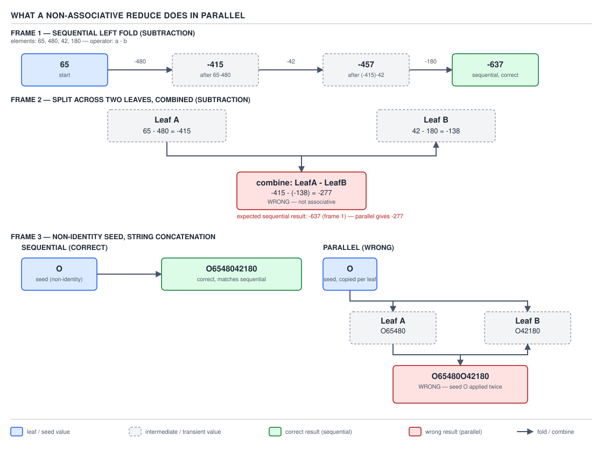

# 04 Modern Java — Streams — BASICS (§1.8)

**Target version: Java 21 LTS.** | **Part 1 of 5** | [Index](../00-index.md)
Previous: [Streams — intermediate operations](03-intermediate-operations.md) · Next: [Streams — primitive streams](05-primitive-streams.md)

A terminal operation is the only kind of stream operation that actually does anything. Every
intermediate operation you met in the previous file — `filter`, `map`, `sorted` — allocates a
stage object and links it to the previous stage; nothing about that allocation touches an element
of data. A terminal operation is different in kind, not degree: calling one is the act of asking
`AbstractPipeline.evaluate(TerminalOp)` to walk the source spliterator, push each element through
the wrapped chain of sinks built from every intermediate stage, and hand the accumulated result
back. Before that call, a `Stream<Money>` over 95,000 card deposits is a linked list of unexecuted
instructions. After it, it is a `Money` value or a `List<Money>` or a `boolean` — never anything in
between, because there is no "half-executed" state a terminal operation leaves behind.

That single fact is the spine of this file: every terminal operation is either **eager** (it drives
`copyInto` to pull every element the short-circuit flag allows) or **lazy** (`iterator()` and
`spliterator()`, which hand back a pull-based cursor instead of running anything), and every eager
one is either **short-circuiting** (it can stop before the source is exhausted) or not. Get that
2×2 straight and the whole family — `forEach`, `reduce`, `collect`, `count`, `anyMatch`, `findFirst`
— stops looking like twenty-six unrelated methods and starts looking like four behaviours wearing
different names.

| Terminal operation | Version added | Return type | Eager or lazy | Short-circuiting | Parallel-friendly | Ordering-sensitive | Returns `Optional` and why |
|---|---|---|---|---|---|---|---|
| `forEach(Consumer)` | 8 | `void` | Eager | No | Yes — no ordering cost | No (parallel: unspecified order) | No — nothing to be absent |
| `forEachOrdered(Consumer)` | 8 | `void` | Eager | No | Poor — serializes | Yes, always | No |
| `toArray()` / `toArray(IntFunction)` | 8 | `Object[]` / `A[]` | Eager | No | Yes | Preserves encounter order if stream is ordered | No |
| `collect(Collector)` | 8 | `R` | Eager | No | Depends on `CONCURRENT` characteristic | Depends on collector | No — collector defines empty-input result |
| `collect(supplier, acc, combiner)` | 8 | `R` | Eager | No | Yes | Depends on accumulator | No |
| `toList()` | 16 | `List<T>` (unmodifiable) | Eager | No | Yes | Yes | No |
| `reduce(BinaryOperator)` | 8 | `Optional<T>` | Eager | No | Yes, if associative | Result order if not commutative | Yes — empty stream has no element to be the seed |
| `reduce(identity, BinaryOperator)` | 8 | `T` | Eager | No | Yes, if associative | Same | No — identity is the empty-stream answer |
| `reduce(identity, acc, combiner)` | 8 | `U` | Eager | No | Yes, if contracts hold | Same | No |
| `min(Comparator)` / `max(Comparator)` | 8 | `Optional<T>` | Eager | No | Yes | No (result-order independent) | Yes — empty stream has no extremum |
| `count()` | 8 (bypass: 9) | `long` | Eager, sometimes skipped entirely | No | Yes | No | No |
| `anyMatch` / `allMatch` / `noneMatch` | 8 | `boolean` | Eager | **Yes** | Yes | No | No |
| `findFirst()` | 8 | `Optional<T>` | Eager | **Yes** | Poor if ordered | Yes, always | Yes — stream may be empty |
| `findAny()` | 8 | `Optional<T>` | Eager | **Yes** | Excellent | No, by design | Yes — stream may be empty |
| `iterator()` | 8 | `Iterator<T>` | **Lazy** | N/A | N/A | Preserves order if ordered | No |
| `spliterator()` | 8 | `Spliterator<T>` | **Lazy** | N/A | N/A | Preserves order if ordered | No |
| `sum` / `average` / `min` / `max` (primitive streams) | 8 | primitive / `OptionalDouble` etc. | Eager | No | Yes | No | `average` and `min`/`max` do — empty stream case |
| `summaryStatistics()` | 8 | `*SummaryStatistics` | Eager | No | Yes (combinable) | No | No — statistics object handles the empty case internally |

**D-031** — Terminal operation inventory

That table is the map; the rest of this file is the streets. Read it once now, come back to the
row whenever a later concept refers to it — the "short-circuiting" and "returns `Optional`"
columns in particular are the two axes almost every interview question in this file is secretly
testing.

---

## 1. `forEach` and `forEachOrdered`: what "no ordering guarantee" costs you

`forEach` and `forEachOrdered` are a sibling pair, and the whole reason they exist as two methods
instead of one is a single design decision: should a terminal operation on a parallel stream pay
for encounter order it might not need?

**Mental model.** Picture a stream's elements as a deck of cards dealt out to several workers at
once. `forEach` says "process every card, I don't care who gets which or in what order they
report back" — workers grab cards, run the consumer, and nobody waits on anybody else.
`forEachOrdered` says "process every card, but tell me about them as if you'd dealt them to a
single worker one at a time" — which means a worker who finishes card 7 before another worker
finishes card 3 still has to sit on the result of card 7 until card 3 has been reported.

**Why it exists.** Before streams, iterating a `Collection` with a `for` loop gave you encounter
order for free — a `for` loop has no other way to work. Streams introduced a genuinely parallel
execution model, and parallel execution and "process in this exact order" are in tension: forcing
order on a fork/join computation means idle workers waiting on their neighbours, which erases part
of the reason you parallelized in the first place. The JDK exposes both behaviours as separate
methods instead of a flag, because a flag would look free at the call site and hide a real cost.

**When to reach for which.** Use `forEach` whenever the action does not care what order it runs
in — writing to a `ConcurrentHashMap`, incrementing an `AtomicLong`, publishing to a queue. Use
`forEachOrdered` whenever the action's side effect is itself order-sensitive — appending to a
`StringBuilder`, writing lines to a file that must read back in the original order, or debugging a
sequential-looking `peek()` chain. On a **sequential** stream the two behave identically — there
is only one worker, so "encounter order" and "processing order" already coincide — the distinction
only has teeth in parallel.

**How it works.** `ReferencePipeline` delegates both to `ForEachOps`:

```java
@Override
public void forEach(Consumer<? super P_OUT> action) {
    evaluate(ForEachOps.makeRef(action, false));
}

@Override
public void forEachOrdered(Consumer<? super P_OUT> action) {
    evaluate(ForEachOps.makeRef(action, true));
}
```

The boolean is the only difference at the call site, but it changes the `TerminalOp`'s declared
flags. When the flag asking for order is `false`, `ForEachOps` clears `StreamOpFlag.ORDERED` on
the terminal stage before evaluating in parallel — which tells the fork/join computation it is
free to report results from whichever leaf finishes first, with no combining step waiting on
encounter position. When the flag is `true`, the pipeline evaluator inserts the machinery that
buffers a leaf's output until every earlier leaf (in encounter order) has already been drained —
which is exactly the "hold results until your predecessor reports" behaviour from the mental
model, and exactly why `forEachOrdered` "largely erases the parallel win": for a large stream, a
few slow early leaves stall every later leaf's visible progress.

**`[SOURCE]`** The `Stream.forEach` javadoc states the contract plainly, and it is worth quoting
because engineers routinely paraphrase it into something weaker than it is: "The behavior of this
operation is explicitly nondeterministic. For parallel stream pipelines, this operation does *not*
guarantee to respect the encounter order of the stream, as doing so would sacrifice the benefit of
parallelism." Note the wording: it is not "encounter order is not guaranteed on this JVM" or "in
practice" — the javadoc calls it out as a specification-level nondeterminism, meaning a
conforming JVM is free to reorder on *every single run*, not just sometimes.

**Example (QuizStakes).** Publishing settled `Reservation`s to a metrics sink where order is
irrelevant — a straight counter increment — versus writing a reconciliation log where a bank
partner expects entries in the order the ledger produced them:

```java
List<Reservation> settledToday = fetchSettledReservations(); // 2.8M/day in production

AtomicLong settledCount = new AtomicLong();
settledToday.parallelStream()
        .forEach(r -> settledCount.incrementAndGet()); // order genuinely does not matter

StringBuilder reconciliationLog = new StringBuilder();
settledToday.parallelStream()
        .forEachOrdered(r -> reconciliationLog
                .append(r.reservationId()).append(',').append(r.stake()).append('\n'));
        // must be forEachOrdered: the bank partner's reconciliation file is order-sensitive
```

**Pitfall.** See the `## Pitfalls` section below — this is one of the two written out in full,
wrong code and all.

> **Definition.** `forEach` processes every element with no encounter-order contract on a parallel
> stream, by specification; `forEachOrdered` restores that contract at the cost of serializing the
> parts of the computation that depend on order.

### Supporting facts finishing out the eager, non-reducing terminals

**`toArray()`.** `Stream<T>.toArray()` returns `Object[]`, not `T[]` — Java's generics are erased
at compile time, so the runtime has no `Class<T>` to allocate the correctly-typed array with. The
overload `toArray(IntFunction<A[]> generator)` fixes this by asking *you* to supply the array
constructor: `stream.toArray(String[]::new)` calls `new String[size]` under the hood and returns a
real `String[]`, not `Object[]` cast at the call site. **Pitfall:** assigning
`String[] s = (String[]) stream.toArray();` compiles but throws `ClassCastException` at runtime —
the array really is an `Object[]` instance, and a cast cannot conjure the component type back.

> **Definition.** `toArray()` yields `Object[]` because erasure destroys the element type by
> runtime; `toArray(IntFunction)` recovers it by asking the caller for the array's real
> constructor.

**`collect(Collector)` and `collect(supplier, accumulator, combiner)`.** The one-argument form
takes a `Collector<T, A, R>` — a bundle of a mutable-container factory, an accumulator, a combiner,
and a finisher, almost always built from `java.util.stream.Collectors`. The three-argument form is
the same shape spelled out by hand, useful when you have not built a reusable `Collector` and just
need a one-off mutable reduction: `stream.collect(ArrayList::new, List::add, List::addAll)`. Both
route through the same `ReduceOps.makeRef` machinery under the hood — the `Collector` overload
just unpacks its three functional pieces before calling the three-argument evaluator, as the
fetched source at the top of §2 below shows.

> **Definition.** `collect` is mutable reduction: build one container per (logical) thread,
> accumulate into it in place, and merge containers — the family that exists so you never have to
> write `reduce` with a mutable seed.

**`toList()` (Java 16).** `Stream<T>.toList()` is shorthand for
`collect(Collectors.toUnmodifiableList())` in every blog post written before actually reading the
source — and that shorthand is wrong. The real implementation, verified against
`ReferencePipeline` at the jdk-21+35 tag:

```java
@Override
public List<P_OUT> toList() {
    return SharedSecrets.getJavaUtilCollectionAccess()
        .listFromTrustedArrayNullsAllowed(this.toArray());
}
```

The method name the JDK's own internal API chose — `listFromTrustedArrayNullsAllowed` — is the
whole story: it collects to an array first (bypassing the `Collector` machinery entirely) and
wraps it in an unmodifiable list that **explicitly permits nulls**, unlike the list
`Collectors.toUnmodifiableList()` builds, which shares its backing implementation with `List.of`
and rejects a null element with `NullPointerException` the moment it is encountered.
`[TRAP]` `[NUM]`: swapping `.collect(Collectors.toUnmodifiableList())` for `.toList()` "for
brevity" silently changes null behaviour along with syntax — see the full worked pitfall below and
the D-035 table in §14 for the complete null-policy comparison across every list-producing path.

> **Definition.** `Stream.toList()` (Java 16) is an unmodifiable, null-permitting list built
> directly from the stream's backing array, and is not a synonym for
> `Collectors.toUnmodifiableList()`.

---

## 2. The three `reduce` overloads

`reduce` is the concept every other terminal operation in this family either specializes
(`count`, `min`, `max`, the primitive `sum`) or exists in contrast to (`collect`, `forEach`). Get
this section exactly right and §12's decision rule falls out almost for free.

**Mental model.** A `reduce` call is a left-to-right fold that has been given permission to run
its folds out of order and merge the partial answers afterward — as long as you promise the
operator does not care what order it folds in. Think of a spreadsheet's `SUM()` formula: it does
not actually matter whether the spreadsheet engine adds the numbers top-to-bottom, bottom-to-top,
or in eight parallel chunks that get added together at the end, because addition is associative.
`reduce` is the JDK asking: "is your operator as well-behaved as addition? If so, I can run it any
way I like."

**Why it exists.** Before streams, "combine everything in this collection into one value" meant a
hand-written loop with a mutable accumulator variable — `Money total = Money.ZERO; for (Deposit d
: deposits) total = total.add(d.amount());`. That loop is correct, but it is inherently sequential
and it is one more place a bug can hide (forgetting to reset `total`, mutating the wrong variable
in a nested loop). `reduce` names the pattern, and by insisting the operator be a pure
`BinaryOperator<T>` with no captured mutable state, it makes the same fold safe to parallelize
without the caller doing anything different at the call site beyond swapping `stream()` for
`parallelStream()`.

**When to reach for it, and when not.** Reach for `reduce` when you are combining elements into a
single value of the **same type as the elements** (or a type built purely by combining, with no
in-place mutation) using an operation that is genuinely associative — summing `Money`, finding a
running maximum, concatenating immutable value objects. Do **not** reach for it when the
accumulation needs a **mutable** container — building a `List`, a `StringBuilder`, a `Map` — that
is `collect`'s job, covered in full in §12; using `reduce` there is not merely non-idiomatic, it is
a correctness bug, covered as its own primary point in this section (§2.4 below).

**How it works — the three signatures.**

```java
@Override
public final Optional<P_OUT> reduce(BinaryOperator<P_OUT> accumulator) {
    return evaluate(ReduceOps.makeRef(accumulator));
}

@Override
public final P_OUT reduce(final P_OUT identity, final BinaryOperator<P_OUT> accumulator) {
    return evaluate(ReduceOps.makeRef(identity, accumulator, accumulator));
}

@Override
public final <R> R reduce(R identity, BiFunction<R, ? super P_OUT, R> accumulator,
                          BinaryOperator<R> combiner) {
    return evaluate(ReduceOps.makeRef(identity, accumulator, combiner));
}
```

Read the second line first: `reduce(identity, accumulator)` is not a separate code path from the
three-argument form — it *is* the three-argument form, called with the accumulator passed in
twice, once as the accumulator and once as the combiner. That single line is the proof that the
two-argument overload is only well-defined when your accumulator and combiner can legally be the
same function, which is exactly the constraint spelled out in beat `[SOURCE]` below.

**D-032** — The three `reduce` overloads

| Overload | Return type | Empty stream yields | Contracts you must satisfy | QuizStakes example |
|---|---|---|---|---|
| `reduce(BinaryOperator<T> op)` | `Optional<T>` | `Optional.empty()` — no seed exists to hand back | `op` associative | `deposits.stream().map(Deposit::amount).reduce(Money::add)` — `Optional<Money>` because an empty day of deposits has no total |
| `reduce(T identity, BinaryOperator<T> op)` | `T` | `identity`, unwrapped | `identity` is a true identity for `op`; `op` associative | `deposits.stream().map(Deposit::amount).reduce(Money.zero(GBP), Money::add)` — `Money`, not `Optional<Money>`, because the identity *is* the empty-stream answer |
| `reduce(U identity, BiFunction<U,T,U> acc, BinaryOperator<U> combiner)` | `U` | `identity` | identity is an identity for `combiner`; `combiner` associative; `combiner` is *compatible* with `acc` (defined in §2.1 below) | Summing the day's 95,000 card deposits' `Money` amounts while mapping from a raw `BigDecimal` type in the same pass: `deposits.stream().reduce(Money.zero(GBP), (m, d) -> m.add(Money.of(d.rawAmount(), GBP)), Money::add)` |

**D-032** — The three `reduce` overloads

### §2.1 The three contracts, worked through — `[SOURCE]` `[PROVE]`

The javadoc for the three-argument `reduce` states its contract in three separate sentences,
which is easy to skim past as boilerplate. It is not boilerplate — each sentence rules out a
specific, real bug:

1. **`combiner.apply(identity, u)` must equal `u`** for every `u` — identity really is an
   identity, with respect to the *combiner*, not the accumulator. For `Money`, `Money.zero(GBP)`
   combined with any `Money m` via `Money::add` gives back `m` unchanged: `0 + m == m`. Proof by
   the algebraic definition of `BigDecimal.ZERO` under addition — `BigDecimal.ZERO.add(x)` returns
   a value numerically equal to `x` (scale handling aside), so `Money.zero(GBP).add(m)` satisfies
   the contract.
2. **`combiner` must be associative**: `combiner.apply(u, combiner.apply(v, w))` must equal
   `combiner.apply(combiner.apply(u, v), w)` for all `u, v, w`. `Money::add` inherits this from
   `BigDecimal.add`, which inherits it from ordinary decimal addition — `(a + b) + c == a + (b +
   c)` is a property of the number system, not something the JDK grants you, and it is precisely
   what makes it safe to split a `Money` sum into leaf tasks and merge them in any grouping.
3. **`accumulator` and `combiner` must be *compatible***: `combiner.apply(u, accumulator.apply(identity, t))` must equal `accumulator.apply(u, t)` for every `u` and `t`. Read that
   as: "folding a fresh element `t` into an existing running total `u` must give the same answer
   whether you fold it in directly with `accumulator`, or first fold it into a brand-new identity
   with `accumulator` and then merge that lone result into `u` with `combiner`." For the two-argument overload, where `accumulator` and `combiner` are literally the same function object,
   this contract is trivially true — which is the real reason the two-argument overload is allowed
   to reuse one function for both roles, not merely a convenience the JDK chose.

Work the compatibility contract through concretely with `Money::add` playing both roles, `u` a
running total of `Money.of(140, GBP)`, and `t` a new deposit of `Money.of(65, GBP)`:

- Direct: `accumulator.apply(u, t)` = `140.add(65)` = `205`.
- Via identity: `accumulator.apply(identity, t)` = `0.add(65)` = `65`; then
  `combiner.apply(u, 65)` = `140.add(65)` = `205`.

Both paths land on `205` — the contract holds, because addition does not care whether you route a
new value through a "fold it alone first" detour before merging. That is not an accident of this
example; it is exactly the property that makes parallel decomposition safe: a leaf task can fold
its slice starting from `identity` in complete isolation, and the final merge with the other
leaves' partial sums is guaranteed to match what a single sequential fold would have produced.

### §2.2 Identity and associativity violated — `[PROVE]`

Two ways this goes wrong in practice, both worked through on the page rather than merely asserted.

**Subtraction is not associative.** Take the four representative amounts already in this file's
number table — the average card deposit (65), average bank deposit (480), average bonus grant
(42), and average card withdrawal (180) — as `[65, 480, 42, 180]`, and reduce with subtraction.

Sequential left fold, one element at a time, exactly as a single-threaded reduce would compute it:

```
((65 − 480) − 42) − 180
= (−415 − 42) − 180
= −457 − 180
= −637
```

Now split the same four elements into two leaves of two, as a parallel fold with two fork/join
tasks would, fold each leaf sequentially, then combine the two partial results with the *same*
subtraction operator:

```
Leaf A = [65, 480]  →  65 − 480 = −415
Leaf B = [42, 180]  →  42 − 180 = −138
Combine: −415 − (−138) = −415 + 138 = −277
```

`−637 ≠ −277`. Nothing crashed, nothing threw, and both computations ran the identical operator
over the identical data — the only variable was how the work was chunked, which a caller does not
control and a correctly-written reduce is not supposed to let matter. This is the entire content
of the "identity and associativity" requirement: it exists so that *how* the runtime chunks your
data is provably irrelevant to the answer, and subtraction breaks that promise.

**D-033** — What a non-associative reduce does in parallel



**D-033** — What a non-associative reduce does in parallel

**String concatenation with a non-identity seed** breaks the *identity* contract specifically,
even though `+` on strings is associative. Seed with `"X"` instead of `""`:

```java
List<String> statusCodes = List.of("DEP-301", "BDP-301", "AA-801");
String sequential = statusCodes.stream()
        .reduce("X", String::concat);              // "XDEP-301BDP-301AA-801" — one X, correct-looking
String parallelTwoLeaves = statusCodes.parallelStream()
        .reduce("X", String::concat);               // depends on split, may combine as
                                                      // "XDEP-301" + "XBDP-301AA-801"
                                                      //  = "XDEP-301XBDP-301AA-801" — two Xs
```

`String::concat` combined with seed `u = "X"` and combined result `combine(u, accumulate(identity,
t))` inserts an extra `"X"` at every leaf boundary, because `"X"` is not a true identity for
concatenation — only `""` is. `combiner.apply(identity, u)` must equal `u`; `"X".concat(u)` does
not equal `u` for any non-empty `u`, so the contract from §2.1 fails outright, and the number of
stray `"X"`s in the output is a direct function of how many leaves the runtime happened to split
into on that run — which means the sequential case above (one leaf, no splitting) hides the bug
completely, and it only surfaces once the same code runs in parallel or the input grows large
enough that the common pool chooses to split it. This is why "it worked in my test" is not
evidence a reduce is correct — see the `**Interview:**` callout at the end of this subsection.

**Interview:** "Give an example where `reduce` produces a different answer in parallel than in
sequential." The one-line answer: any non-associative operator (subtraction, non-identity-seeded
concatenation) — because parallel `reduce` is only *specified* to match sequential behaviour when
the associativity and identity contracts hold; when they don't, the JDK owes you nothing and the
result depends on how the common pool happened to split the work that run.

### §2.3 `min` and `max` — supporting facts

`min(Comparator<? super T>)` and `max(Comparator<? super T>)` both return `Optional<T>`, for the
same reason `reduce(BinaryOperator)` does: an empty stream has no minimum or maximum, and
`Optional.empty()` is the honest way to say so rather than throwing or returning `null`. Under the
hood both are implemented as a `reduce` with a `BinaryOperator<T>` built from the comparator —
`(a, b) -> comparator.compare(a, b) <= 0 ? a : b` for `min` — which is why they inherit the same
"result is order-independent because comparison-based selection is associative regardless of
grouping" property for free, with none of `reduce`'s associativity anxiety: picking the smaller of
two things is associative no matter how you group the comparisons.

> **Definition.** `min`/`max` are `reduce` specialised to comparator-based selection, returning
> `Optional<T>` because the extremum of an empty stream does not exist.

### §2.4 `reduce` with a mutable accumulator is a bug — `[TRAP]` `[PROVE]`

See the full wrong-then-right treatment in `## Pitfalls` below. The argument in brief, because the
tag demands it be proven here and not merely asserted: `reduce(identity, accumulator)` is
specified to be safe to run in parallel, which means the JDK is free to call your accumulator
function from multiple threads concurrently on **independent partial results**, then merge those
results with the combiner. If your "identity" is a single shared mutable `ArrayList` and your
accumulator does `list.add(t); return list;`, every leaf task is calling `.add()` on the *same*
list instance from different threads with no synchronization — `ArrayList` is not thread-safe, so
this is a data race that can silently drop elements, throw
`ArrayIndexOutOfBoundsException`, or corrupt the internal array, and which failure mode you get is
nondeterministic. Even on a **sequential** stream, where there is no genuine concurrency, sharing
one mutable identity across every element it is ever "reduced" into is not what `reduce` is
for — the identity is supposed to be reusable garbage if discarded, not the actual answer being
mutated in place, and doing so defeats the purpose of `Collector`'s combiner-based merge model,
which exists precisely to make this pattern safe by using **per-thread containers** instead of one
shared one. `collect` exists as the named escape hatch: `Collectors.toList()`'s accumulator is
`List::add` too, but its `supplier` is `ArrayList::new`, called once **per partial computation**,
never shared.

> **Definition.** A `reduce` whose identity or accumulator mutates shared state is not an
> optimisation of `collect`, it is a data race waiting for a parallel run to expose it — use
> `collect` for any accumulation into a mutable container.

---

## 3. `count()` and the Java 9 bypass — `[VERSION-TRAP]` `[SOURCE]`

**Mental model.** `count()` looks like it must be "run every element through the pipeline and tick
a counter" — and through Java 8, that is exactly what it did. From Java 9 onward, `count()` is the
one terminal operation that, before touching the pipeline at all, asks a completely different
question first: "does the source spliterator already know its own size, and has every intermediate
stage promised not to change how many elements come out?" If both are true, `count()` answers from
that size directly and the pipeline never runs.

**Why it exists.** `list.stream().count()` for a `List` of 2,400,000 registered clients has an
obviously cheap answer — `list.size()` — yet the naive implementation still allocates a sink chain
and walks all 2.4M references just to increment a counter 2.4M times, throwing away work a `size()`
call would have answered in O(1). JDK-8039532 closed that gap for exactly the pipelines where it is
safe to.

**When it applies, and when it does not.** The bypass only fires when the *whole* pipeline is
`SIZED` — meaning every intermediate operation between source and `count()` preserves size exactly
(`map`, `sorted`, `peek`) rather than changing it (`filter`, `flatMap`, `distinct`, `limit` past the
source's known size). `deposits.stream().map(Deposit::amount).count()` bypasses; `deposits.stream()
.filter(d -> d.amount().amount().signum() > 0).count()` cannot — a `filter` makes the output size
genuinely unknowable without running every predicate, so the pipeline executes for real, just as it
always did.

**How it works — the source.** `ReduceOps.makeRefCounting()`, the `TerminalOp` that
`AbstractPipeline`'s `count()` evaluates:

```java
public static <T> TerminalOp<T, Long>
makeRefCounting() {
    return new ReduceOp<T, Long, CountingSink<T>>(StreamShape.REFERENCE) {
        @Override
        public CountingSink<T> makeSink() { return new CountingSink.OfRef<>(); }

        @Override
        public <P_IN> Long evaluateSequential(PipelineHelper<T> helper,
                                              Spliterator<P_IN> spliterator) {
            long size = helper.exactOutputSizeIfKnown(spliterator);
            if (size != -1)
                return size;
            return super.evaluateSequential(helper, spliterator);
        }

        @Override
        public <P_IN> Long evaluateParallel(PipelineHelper<T> helper,
                                            Spliterator<P_IN> spliterator) {
            long size = helper.exactOutputSizeIfKnown(spliterator);
            if (size != -1)
                return size;
            return super.evaluateParallel(helper, spliterator);
        }

        @Override
        public int getOpFlags() {
            return StreamOpFlag.NOT_ORDERED;
        }
    };
}
```

Line by line: `evaluateSequential` and `evaluateParallel` are both overridden identically, because
the bypass has to apply regardless of whether the caller asked for `parallelStream()` — `helper
.exactOutputSizeIfKnown(spliterator)` asks the pipeline helper to compute what the output size
*would* be if the pipeline ran, purely from flag bookkeeping (checking `StreamOpFlag.SIZED` across
every stage and the spliterator's own `getExactSizeIfKnown()`), without touching a single element.
If that returns anything other than `-1`, the method returns it immediately — `super
.evaluateSequential(...)` (the real counting-sink traversal) is never reached. Only when the size
genuinely cannot be known upfront does execution fall through to the traversal, which uses the
`CountingSink` — a plain `long count` incremented once per `accept(T t)` call and merged across
leaves in `combine`. `getOpFlags()` returning `StreamOpFlag.NOT_ORDERED` tells the evaluator this
terminal does not care about encounter order even when it does traverse, which is a small extra
optimisation on top of the size bypass: an unordered count can still parallelize its traversal
without paying for ordering machinery.

**`[VERSION-TRAP]`** On Java 21, `count()` is O(1) for any pipeline the runtime can prove is
`SIZED`, and O(n) otherwise. Before Java 9 (this fix landed as JDK-8039532, released in JDK 9),
there was no `exactOutputSizeIfKnown` short-circuit in `count()` at all: even the simplest
`list.stream().count()` walked the counting sink across every element, spending real work an
interviewer can reasonably expect you to know is now avoided. State both halves: what is true on
21, and what the pre-9 behaviour actually cost.

**Example (QuizStakes).**

```java
List<LedgerEntry> hotWindowEntries = fetchHotWindowLedgerEntries(); // ~19.8M/day, 90-day hot window

long total = hotWindowEntries.stream().count();                    // bypasses: SIZED all the way
long total2 = hotWindowEntries.stream()
        .map(LedgerEntry::amount)
        .count();                                                   // still SIZED — map preserves count — bypasses

long depositsOnly = hotWindowEntries.stream()
        .filter(e -> e.position() == LedgerPosition.CLIENT_CASH_AVAILABLE)
        .count();                                                    // filter breaks SIZED — real traversal
```

**Interview:** "Does `count()` always run in O(1)?" No — only when every intermediate stage
preserves size exactly; introduce a `filter` and it degrades to a real O(n) traversal, because the
runtime genuinely cannot know the output size without evaluating every predicate.

> **Definition.** `count()` is O(1) when the whole pipeline is provably `SIZED`, and falls back to
> a real O(n) traversal the moment any stage (`filter`, `flatMap`, `distinct`) makes the output size
> unknowable in advance — a Java 9 optimisation, not a Java 8 one.

---

## 4. `anyMatch` / `allMatch` / `noneMatch` and the vacuous truth of an empty stream — `[TRAP]` `[PROVE]`

**Mental model.** All three are the same short-circuiting search dressed up with different exit
conditions — "stop and answer `true` the moment I see a match" for `anyMatch`, "stop and answer
`false` the moment I see a non-match" for `allMatch`, "stop and answer `false` the moment I see a
match" for `noneMatch`. None of them ever need to see the whole stream to answer `true` for
`anyMatch` or `false` for `allMatch`/`noneMatch` — only the "did I make it to the end without
tripping the exit condition" case needs full traversal.

**Why it exists.** Before short-circuiting terminal operations, checking "does any deposit exceed
the daily limit" over a stream meant either collecting to a list and scanning it (wasteful — you
only needed the first hit) or hand-rolling a loop with a `break`. `anyMatch`/`allMatch`/`noneMatch`
give the short-circuit for free, with the failure mode of a hand-rolled loop (forgetting the
`break`, or breaking out of the wrong loop in nested code) designed away.

**How it works — the source.** `MatchOps.MatchKind` is the single enum that all three methods
share, distinguished only by two booleans:

```java
enum MatchKind {
    ANY(true, true),
    ALL(false, false),
    NONE(true, false);

    private final boolean stopOnPredicateMatches;
    private final boolean shortCircuitResult;
}
```

`stopOnPredicateMatches` tells the traversal whether to stop the moment the predicate returns
`true` (`ANY` and `NONE` do; `ALL` instead stops the moment the predicate returns `false`, i.e. it
stops on a *non*-match). `shortCircuitResult` is the answer to return the instant the stop
condition fires: `ANY` short-circuits to `true`, `NONE` short-circuits to `false`. `ALL` never
short-circuits to `true` — it can only affirmatively return `true` by exhausting the whole stream
without a single non-match, which is the mechanical reason `allMatch` cannot answer early on a
success path even though it can on a failure path.

The `BooleanTerminalSink` that backs the traversal initializes its running result to the *negation*
of the short-circuit value:

```java
BooleanTerminalSink(MatchKind matchKind) {
    value = !matchKind.shortCircuitResult;
}
```

That one line is the entire mechanism behind the vacuous-truth behaviour, worked through fully in
the next paragraph.

**`[PROVE]`** Walk `allMatch` and `noneMatch` on a genuinely empty stream. For `ALL`,
`shortCircuitResult = false`, so the sink's initial `value = !false = true`. The traversal then
runs the spliterator's `forEachRemaining` (or the cancellable variant) — but an empty stream's
spliterator produces zero elements, so the predicate is invoked zero times, the stop condition
never fires, and the traversal falls off the end with `value` still at its initial `true`. The
result is `true` — not because anything was proven about any element (there were none to test),
but because the initial value was chosen to be exactly the answer a vacuous "for all" should give.
For `NONE`, `shortCircuitResult = false` again — same initial value `true`, same reasoning: zero
elements means zero matches means "none match" is vacuously satisfied. `ANY` has
`shortCircuitResult = true`, so its sink initializes to `value = !true = false` — an empty stream
never finds a match, so `false` is the only sane answer, and the mechanism produces it without a
special case.

This is not a JDK quirk; it is the same convention formal logic uses for universally-quantified
statements over an empty domain — "for all $x$ in $\emptyset$, $P(x)$" is true precisely because
there is no counterexample to be found, ever. `allMatch` and `noneMatch` on `Stream.empty()` both
return `true` for the identical reason a vacuously-quantified statement over the empty set is true:
there is nothing to falsify it.

**Example (QuizStakes).**

```java
List<Reservation> reservations = fetchOpenReservations(); // could legitimately be empty overnight

boolean anyOverLimit = reservations.stream()
        .anyMatch(r -> r.stake().amount().compareTo(dailyStakeLimit) > 0);   // false if empty — correct
boolean allWithinLimit = reservations.stream()
        .allMatch(r -> r.stake().amount().compareTo(dailyStakeLimit) <= 0); // true if empty — vacuous, correct
boolean noneBreached = reservations.stream()
        .noneMatch(r -> r.stake().amount().compareTo(dailyStakeLimit) > 0); // true if empty — vacuous, correct
```

`allWithinLimit` reading `true` when there are zero open reservations is not a bug to defend
against — it is the mathematically correct answer to "is every element in this empty set within
the limit," and code that treats it as suspicious (adding a `!reservations.isEmpty() &&` guard "to
be safe") is adding a bug, not fixing one, unless the surrounding business logic genuinely has a
different rule for the empty case that has nothing to do with `allMatch`'s semantics.

**Pitfall.** See `## Pitfalls` below.

> **Definition.** `anyMatch`/`allMatch`/`noneMatch` all short-circuit; on an empty stream,
> `allMatch` and `noneMatch` are vacuously `true` and `anyMatch` is `false` — the same convention
> formal logic uses for quantifiers over the empty set.

---

## 5. `findFirst()` versus `findAny()`

**Mental model.** Picture a search race with several runners let loose across disjoint sections of
the data. `findAny()` says "whoever crosses their section's finish line with a hit first, shout it
back — I don't care which section it came from." `findFirst()` says "shout back whichever hit was
*leftmost* in the original ordering, even if a runner further right found theirs sooner" — which
means a fast runner on the right has to sit on their result until every runner to their left has
either reported a hit or confirmed there is none in their section.

**Why it exists as two methods, not one.** A single `find()` would have to pick one behaviour, and
either choice loses something: always-first pays an ordering tax even when the caller does not
care about order; always-any breaks callers who genuinely need the leftmost match (e.g.
reproducing a sequential search's exact result for a determinism guarantee). Exposing both lets the
caller pay only for the guarantee they actually need.

**When to reach for which.** Use `findAny()` whenever "some element that matches" is a sufficient
answer — checking existence, short-circuiting a validation, sampling. Use `findFirst()` whenever
the *specific* first-in-order match matters — reproducing what a sequential scan would have
returned, or when the elements are pre-sorted and "first" carries meaning (the earliest breach, the
oldest overdue item).

**How it works — the source.**

```java
@Override
public final Optional<P_OUT> findFirst() {
    return evaluate(FindOps.makeRef(true));
}

@Override
public final Optional<P_OUT> findAny() {
    return evaluate(FindOps.makeRef(false));
}
```

and inside `FindOps.FindOp`'s constructor:

```java
this.opFlags = StreamOpFlag.IS_SHORT_CIRCUIT |
               (mustFindFirst ? 0 : StreamOpFlag.NOT_ORDERED);
```

Both are short-circuiting unconditionally — that bit is set regardless of which boolean was passed.
The difference lives entirely in the second term: `findAny()` (`mustFindFirst = false`) additionally
sets `NOT_ORDERED`, telling the parallel evaluator it is free to accept the first result from *any*
leaf without waiting on leaves that come earlier in encounter order. `findFirst()` leaves that flag
unset, which means the pipeline evaluator must still respect the stream's `ORDERED` characteristic
(true by default for anything sourced from an ordered collection like a `List`) — a leaf's
candidate result cannot be trusted as *the* answer until every leaf to its left has reported that
it either found nothing or found something that resolves to an earlier position.

**D-034** — `findFirst` versus `findAny` in parallel


**D-034** — `findFirst` versus `findAny` in parallel

**`[NUM]`** Concretely, with 2,800,000 stake reservations split into four leaf tasks of 700,000
each and a predicate that matches somewhere in leaf 3: `findAny()` on an 8-core box lets whichever
leaf's worker thread reaches the match first report it — if leaf 4's worker happens to race ahead
and also has a (different, later) match, it can report *that* one and the whole computation
finishes without leaf 1 or leaf 2 ever needing to complete, because `NOT_ORDERED` means there is no
"wait for your predecessors" rule to enforce. `findFirst()` on the identical split cannot do that:
even if leaf 4 finds a match in microseconds, the result cannot be returned until leaves 1 through
3 have confirmed whether *they* contain an earlier match — coordination that, in the worst case
(no match until leaf 4), means `findFirst()` degrades to doing very nearly as much cross-leaf
waiting as a fully ordered, non-short-circuiting scan would, even though it is still technically a
short-circuiting operation once a leaf's status is known. That coordination cost is the concrete
form of "findFirst on an ordered parallel stream forces cross-task coordination" — it is not a fixed
tax paid per call, it is proportional to how far into the stream the true first match sits.

**Example (QuizStakes).**

```java
List<Reservation> reservations = fetchOpenReservations(); // up to 2.8M/day

Optional<Reservation> anyBreach = reservations.parallelStream()
        .filter(r -> r.stake().amount().compareTo(dailyStakeLimit) > 0)
        .findAny();          // fast: first leaf to find a breach wins, no coordination

Optional<Reservation> earliestBreach = reservations.parallelStream()
        .filter(r -> r.stake().amount().compareTo(dailyStakeLimit) > 0)
        .findFirst();         // must be findFirst if "earliest by reservation order" is the actual requirement
```

**Interview:** "Why would you ever choose `findFirst` over `findAny` if it's slower in parallel?"
One-line answer: because "slower but deterministic and order-respecting" beats "fast but
nondeterministic" whenever downstream logic depends on *which* match you get, not merely *whether*
one exists — for example, reproducing an auditor's expectation of "the first suspicious reservation
in the batch."

> **Definition.** `findAny()` returns some matching element with no ordering promise and near-zero
> coordination cost in parallel; `findFirst()` returns the encounter-order-first match, which on an
> ordered parallel stream requires leaves to coordinate in encounter order before any one of them
> can be trusted as final.

---

## 6. `iterator()` and `spliterator()` — the two lazy escape hatches — `[SOURCE]`

Every terminal operation covered so far is **eager**: calling it immediately drives `evaluate` and
runs the whole pipeline to completion (short-circuiting aside) before the method returns.
`iterator()` and `spliterator()` are the two exceptions — they are still classified as terminal
operations (calling either one consumes the stream, and a second terminal call on the same stream
throws `IllegalStateException`, exactly like every other terminal), but neither one traverses
anything before returning. Instead, each hands back a **pull-based cursor**: an `Iterator<T>` or a
`Spliterator<T>` whose `next()`/`tryAdvance()` methods pull one element through the pipeline's sink
chain *on demand*, the first time the caller actually asks for an element.

`AbstractPipeline.spliterator()`, at the source stage, shows the laziness directly in its handling
of a *supplier*-backed source rather than an already-materialized one:

```java
else if (sourceStage.sourceSupplier != null) {
    @SuppressWarnings("unchecked")
    Supplier<Spliterator<E_OUT>> s = (Supplier<Spliterator<E_OUT>>) sourceStage.sourceSupplier;
    sourceStage.sourceSupplier = null;
    return lazySpliterator(s);
}
```

`lazySpliterator(s)` wraps the supplier in a `Spliterator` implementation that does not call `s.get()`
until its own `tryAdvance`/`trySplit`/`forEachRemaining` is first invoked by whatever consumes it —
the pipeline's own construction of the returned spliterator defers even *obtaining* the source data,
let alone running it through any intermediate stages. `iterator()` is built on top of the same
spliterator by wrapping it with `Spliterators.iterator(spliterator())`, so it inherits the identical
pull-on-demand behaviour one layer up.

**`[PROVE]`, informally:** because nothing is pulled until the cursor's `next()` (or `tryAdvance`)
is called, a stream that ends in `.iterator()` and is then never iterated has done *strictly less
work* than one that ends in `.forEach(x -> {})` — the `forEach` variant still drives a full
`copyInto` even with an empty consumer, while the unconsumed iterator never touches
`sourceSpliterator` at all. This is the mechanism-level reason `iterator()`/`spliterator()` are
listed as "not eager" in D-031: every other row in that table commits to running the whole pipeline
the moment the method is called; these two commit only to *being able to*, on request.

**Example (QuizStakes).** Draining a stream of pending `PaymentRun` batches into a hand-rolled
loop that needs early-exit control finer than `takeWhile` gives — for instance, stopping the moment
a running total crosses the banking partner's payout-file cap, while also logging a running index:

```java
Iterator<PaymentRun> pendingRuns = paymentRunQueue.stream()
        .filter(run -> run.status() == PaymentRunStatus.PENDING)
        .iterator();

Money runningTotal = Money.zero(GBP);
int processed = 0;
while (pendingRuns.hasNext() && runningTotal.amount().compareTo(payoutFileCap) < 0) {
    PaymentRun run = pendingRuns.next();   // pulls exactly one element through the pipeline, here
    runningTotal = runningTotal.add(run.totalAmount());
    processed++;
}
```

Each `pendingRuns.next()` call is the moment one element is actually pulled through `filter` — not
before, and calling `.iterator()` itself did no filtering work at all.

> **Definition.** `iterator()` and `spliterator()` are the only terminal operations that return a
> pull-based cursor instead of driving the pipeline eagerly — the pipeline runs one element at a
> time, exactly as fast as the caller asks for the next one.

---

## 7. Primitive stream terminal operations — supporting facts

`IntStream`, `LongStream`, and `DoubleStream` each expose `sum()`, `average()`, `min()`, `max()`,
and `summaryStatistics()` in addition to the reference-stream terminals above (`count`,
`anyMatch`/`allMatch`/`noneMatch`, `findFirst`/`findAny`, `forEach` — all present on the primitive
streams too, just typed to `IntConsumer`/`IntPredicate` etc. to avoid boxing). `sum()` returns the
primitive type directly (`int`, `long`, `double`) because a sum of zero elements is unambiguously
`0`/`0L`/`0.0` — there is no "no answer" case the way there is for `min`/`max`, which is why only
`average()`, `min()`, and `max()` return `Optional{Int,Long,Double}`/`OptionalDouble`: an empty
stream genuinely has no minimum, maximum, or average, but it has a perfectly good sum. The primitive
stream **subtopic file** (§1.9, next in this set) is where the boxing-avoidance mechanics and
`IntStream.sum()`'s own overflow behaviour belong in full — this file covers only the terminal-op
shape, since these five methods are terminal operations first and primitive-stream specifics
second.

> **Definition.** Primitive-stream terminals mirror the reference-stream family, except `sum()`
> needs no `Optional` (zero is a valid empty-stream sum) while `average`/`min`/`max` still do.

---

## 8. `*SummaryStatistics` — `[RESEARCH]` `[NUM]`

`IntSummaryStatistics`, `LongSummaryStatistics`, and `DoubleSummaryStatistics` are what
`summaryStatistics()` returns: one object carrying `count`, `sum`, `min`, `average`, and `max`,
computed in a single pass instead of five (one per statistic, each re-traversing the stream). They
are combinable — each has a `combine(other)` method — which is exactly what lets `summaryStatistics
()` parallelize: each leaf computes its own statistics object over its slice, and the leaves' objects
merge pairwise, the same fork/join shape every other combinable terminal in this file uses.

**`[RESEARCH]`**, re-verified against `java.util.DoubleSummaryStatistics` at the jdk-21+35 tag
rather than assumed: the class holds not four fields but six —
`count`, `sum`, `sumCompensation`, `simpleSum`, `min`, `max` — and its `accept(double value)` method
is:

```java
public void accept(double value) {
    ++count;
    simpleSum += value;
    sumWithCompensation(value);
    min = Math.min(min, value);
    max = Math.max(max, value);
}
```

`sumCompensation` is the low-order correction term of a **Kahan summation** (the class's own
javadoc names it: "Incorporate a new double value using Kahan summation / compensated summation"),
which tracks the rounding error lost on each addition and feeds it back in on the next one —
this is exactly the same compensated-summation technique `Collectors.averagingDouble` and
`Collectors.summingDouble` use internally (their accumulator arrays are `double[4]` and `double[3]`
respectively, for the same reason). `simpleSum` is kept alongside purely to handle non-finite
inputs (`NaN`, `±Infinity`) correctly, where compensated summation's assumptions break down;
`getSum()`'s own javadoc hedges that it "may be implemented using compensated summation or other
technique," rather than promising Kahan specifically — a detail worth stating precisely rather than
flattening to "it's always Kahan." `IntSummaryStatistics` and `LongSummaryStatistics` need no such
compensation — integer addition has no rounding error to compensate for — and are correspondingly
simpler, holding only `count`, `sum` (as `long` even for `IntSummaryStatistics`, to avoid the
overflow trap covered for `summingInt` in this file's sibling), `min`, and `max`.

**Example (QuizStakes).**

```java
DoubleSummaryStatistics cardDepositStats = cardDeposits.stream() // 95k/day
        .mapToDouble(deposit -> deposit.amount().amount().doubleValue())
        .summaryStatistics();

System.out.println(cardDepositStats.getCount());   // 95_000-ish
System.out.println(cardDepositStats.getAverage()); // ~65.0, per the domain's stated average
```

> **Definition.** A `*SummaryStatistics` object is five statistics computed in one combinable pass;
> `DoubleSummaryStatistics` specifically uses compensated (Kahan-style) summation for its sum, with
> a parallel uncompensated `simpleSum` kept for the non-finite-input edge case.

---

## 9. Why some terminal operations return `Optional` — supporting facts

Look back at D-031's last column: `reduce(BinaryOperator)`, `min`, `max`, `findFirst`, `findAny`,
and `average` all return an `Optional`-wrapped type; `forEach`, `count`, `sum`, `anyMatch`/
`allMatch`/`noneMatch`, and `reduce(identity, ...)` do not. The dividing line is not arbitrary: an
operation returns `Optional` exactly when **an empty stream genuinely has no correct answer of the
underlying type**, and does not when the empty-stream case has an honest, well-defined answer that
already lives inside the type. `count()` of nothing is `0` — a perfectly good `long`. `sum()` of
nothing is `0` — likewise. But the *minimum* of nothing is not `0`, or `Integer.MIN_VALUE`, or any
other sentinel that would be silently wrong for a real minimum of `0` or `Integer.MIN_VALUE` — there
is no value of type `T` that means "there was no minimum," which is exactly what `Optional.empty()`
exists to express without abusing `null` or a magic constant. `reduce(identity, accumulator)`
sidesteps the question entirely by *defining* the empty-stream answer to be `identity` — which is
precisely why it does not need `Optional` where the one-argument `reduce` does.

> **Definition.** A terminal operation returns `Optional` exactly when there is no value of the
> result type that can honestly mean "the stream was empty" — everything else either has such a
> value already (`0` for `sum`/`count`) or has been given one explicitly (an identity).

---

## 10. Short-circuiting is a declared flag, and a pipeline with no terminal operation does nothing

**Mental model.** Every `TerminalOp` in the JDK declares, as part of its own `getOpFlags()`,
whether it is capable of stopping the underlying traversal before the source is exhausted. That
declaration is not advisory — it is the literal switch that decides which of two traversal code
paths `AbstractPipeline` runs.

**Why it exists.** Without a declared flag, the runtime would have to *discover* short-circuit
capability by watching for some signal mid-traversal, which is slower and more fragile than simply
asking the terminal operation up front. Declaring it as a bit checked once, before any element
moves, lets the eager, non-cancellable path stay as simple (and as fast) as possible for every
terminal operation that never needs to stop early.

**When each path is chosen.** `AbstractPipeline.copyInto`:

```java
final <P_IN> void copyInto(Sink<P_IN> wrappedSink, Spliterator<P_IN> spliterator) {
    Objects.requireNonNull(wrappedSink);

    if (!StreamOpFlag.SHORT_CIRCUIT.isKnown(getStreamAndOpFlags())) {
        wrappedSink.begin(spliterator.getExactSizeIfKnown());
        spliterator.forEachRemaining(wrappedSink);
        wrappedSink.end();
    }
    else {
        copyIntoWithCancel(wrappedSink, spliterator);
    }
}
```

`StreamOpFlag.SHORT_CIRCUIT.isKnown(...)` reads the combined stream-and-op flags accumulated across
every stage, including the terminal one — `MatchOps` and `FindOps` both `OR` in
`StreamOpFlag.IS_SHORT_CIRCUIT` at construction, exactly as quoted in §5's source excerpt. If no
stage (terminal included) declared it, the pipeline takes the plain path:
`spliterator.forEachRemaining(wrappedSink)` — a tight loop with no per-element cancellation check,
because none is needed. If any stage *did* declare it, `copyIntoWithCancel` runs instead:

```java
final <P_IN> boolean copyIntoWithCancel(Sink<P_IN> wrappedSink, Spliterator<P_IN> spliterator) {
    @SuppressWarnings({"rawtypes","unchecked"})
    AbstractPipeline p = AbstractPipeline.this;
    while (p.depth > 0) {
        p = p.previousStage;
    }

    wrappedSink.begin(spliterator.getExactSizeIfKnown());
    boolean cancelled = p.forEachWithCancel(spliterator, wrappedSink);
    wrappedSink.end();
    return cancelled;
}
```

`forEachWithCancel` (walked down to the source stage first — the `while (p.depth > 0)` loop) is a
per-element loop that checks a cancellation predicate on the sink after each `accept`, stopping the
moment a short-circuiting sink (`anyMatch`'s "found a match", `findFirst`'s "found the leftmost
match so far") signals it is done. This is a genuinely different, slightly heavier code path than
the plain one — the cancellation check costs something per element — which is exactly why
non-short-circuiting terminals are given the cheaper path instead of paying that cost
unconditionally.

**`[TRAP]` `[PROVE]`: a pipeline with no terminal operation does nothing at all.** Prove it from the
mechanism just walked: every one of `copyInto`, `copyIntoWithCancel`, `evaluate`, `ReduceOps`,
`ForEachOps`, `MatchOps`, `FindOps` is reached only by calling a terminal operation — `evaluate
(TerminalOp)` is the single entry point that calls `sourceSpliterator(...)` and pulls the source.
`filter`, `map`, `sorted` — every intermediate operation — return a *new stage object* linked to the
previous one and touch nothing else; there is no background thread, no eager evaluation, no
"queued work" that fires on some timer or on garbage collection. If a method chain ends in `.filter
(...).map(...)` and nothing after it, the JVM has allocated two small `ReferencePipeline` objects
and done precisely zero iteration — not "iteration deferred until later," but iteration that
**will never happen**, silently, with no exception, no warning, and no static-analysis error unless
your build has a specific lint rule for it (some do — `StreamShouldBeCollected`-style Error Prone
checks exist precisely because this mistake is common and silent).

```java
// compiles clean, runs clean, does absolutely nothing:
deposits.stream()
        .filter(d -> d.amount().amount().compareTo(BigDecimal.ZERO) < 0)
        .peek(d -> auditLog.flagSuspiciousDeposit(d));   // no terminal operation follows — dead code
```

`peek` is not a terminal operation (it is intermediate, covered in the previous file), so this
entire statement is a syntactically valid, semantically inert no-op — the audit log never receives
a single flagged deposit, and nothing about running this code will tell you that.

**Interview:** "What happens if you build a stream pipeline and never call a terminal operation on
it?" One-line answer: nothing — not "it runs lazily later," literally nothing, because every stage
of construction only links `Sink` objects together and the only thing that ever calls
`sourceSpliterator()` to pull data is a terminal operation's `evaluate`.

**`[TRAP]`: an exception from a behavioural parameter propagates out of the terminal operation, and
in parallel exactly one wins.** A `RuntimeException` thrown inside a `Predicate`, `Function`, or
`Consumer` passed to any stage propagates straight out of whichever terminal operation call
triggered the traversal — there is no stream-level exception wrapping, no "collect the errors and
report them all," it behaves exactly like the exception had been thrown from the equivalent
hand-written loop. In **parallel**, several leaf tasks may each throw independently and
concurrently; the fork/join framework propagates whichever one the join machinery happens to
observe first as the failure of the overall computation, and the others are **not** aggregated,
not attached as suppressed exceptions, and not logged anywhere by default — they are simply
discarded once the computation has already failed. Which one "wins" is a function of thread
scheduling, not of anything about the exceptions themselves, so two runs of the identical parallel
pipeline over the identical (bad) input can legitimately surface two different stack traces.

> **Definition.** `StreamOpFlag.SHORT_CIRCUIT` is a declared bit, set by any stage capable of
> stopping traversal early, that switches `copyInto` from the plain `forEachRemaining` path to the
> per-element `copyIntoWithCancel` path — and a pipeline that never calls a terminal operation never
> enters either path, so it does nothing at all, not "nothing yet."

---

## 11. `collect` versus `reduce` versus `forEach` — the decision rule

Three ways to consume a stream's elements into a result, and the whole point of this section is
that the choice among them is not a style preference — each one is the *correct* tool for a
disjoint case, and using the wrong one either breaks (§2.4's reduce-with-mutable-state bug) or
merely reads badly.

| | `forEach` | `reduce` | `collect` |
|---|---|---|---|
| Use when | you want a **side effect** per element, no result value | you are combining elements into a **single immutable value** with an associative operator | you are accumulating into a **mutable container** (`List`, `Map`, `StringBuilder`) |
| Result | none (`void`) | a value of the element type (or a related, still-immutable type) | a container, built up in place |
| Parallel safety | safe by construction, if the action itself has no shared mutable state | safe only if the operator is associative (§2.1, §2.2) | safe by construction — each thread gets its own container, merged via combiner |
| Wrong-tool symptom | using it to build a `List` by capturing an outer `ArrayList` and calling `.add()` in the lambda — a data race in parallel, and an antipattern even sequentially | using it with a mutable seed shared across calls (§2.4) | using it where a pure fold would do — harmless, just more ceremony than `reduce` needs |

The one-sentence decision rule each, as the leaf demands: **`forEach`** is for side effects with no
result. **`reduce`** is for folding into a new immutable value with an operator that does not care
how the fold is chunked. **`collect`** is for building up a mutable container, one thread's worth of
work at a time, safely merged at the end.

**Example (QuizStakes) — the same task, three ways, only one of them right for a mutable target:**

```java
List<Reservation> reservations = fetchOpenReservations();

// forEach — a side effect, no result value, this is the correct tool:
reservations.forEach(r -> metrics.recordOpenReservation(r.reservationId()));

// reduce — folding into a single immutable Money, correct tool:
Money totalStaked = reservations.stream()
        .map(Reservation::stake)
        .reduce(Money.zero(GBP), Money::add);

// collect — building a mutable List, correct tool:
List<Reservation> highValue = reservations.stream()
        .filter(r -> r.stake().amount().compareTo(Money.of(100, GBP).amount()) > 0)
        .collect(Collectors.toList());

// WRONG — reduce misused for a mutable target, the bug from §2.4, restated at the decision-rule level:
List<Reservation> wrong = reservations.stream()
        .reduce(new ArrayList<>(),
                (list, r) -> { list.add(r); return list; },   // mutates and returns the SAME shared list
                (l1, l2) -> { l1.addAll(l2); return l1; });    // works sequentially, races in parallel
```

**Interview:** "When would you use `reduce` instead of `collect`?" One-line answer: when the result
is a single immutable value built from an associative combine — the moment you need a mutable
container as the accumulator, `collect` is not a stylistic alternative, it is the only correct
choice.

> **Definition.** `forEach` performs side effects and returns nothing; `reduce` folds into a new
> immutable value with an associative operator; `collect` performs mutable reduction into a
> container, safely, by giving each unit of parallel work its own container and merging containers
> rather than sharing one.

### Boxing cost of `collect(toList())` on a primitive stream — `[NUM]`

`IntStream`, `LongStream`, and `DoubleStream` do not have a `collect(Collectors.toList())` overload
at all — `Collectors.toList()` returns a `Collector<T, ?, List<T>>` over a reference type, and a
primitive stream's elements are `int`/`long`/`double`, not `Integer`/`Long`/`Double`. Getting a
`List<Integer>` out of an `IntStream` requires the explicit, visible `boxed()` step first:
`intStream.boxed().collect(Collectors.toList())` — `boxed()` maps every primitive `int` to an
`Integer` object, one allocation per element. **`[NUM]`**: for a stream of 2,800,000 stake
reservation amounts represented as `int` minor-unit values, `.boxed()` allocates 2,800,000
`Integer` objects (minus whatever the `-128..127` `Integer` cache absorbs, which for realistic
minor-unit stake amounts — routinely well above 127 pence — is close to none) — at roughly 16 bytes
per boxed `Integer` on a modern JVM with compressed oops, that is approximately 2,800,000 × 16
bytes ≈ 44.8 MB of otherwise-avoidable heap allocation and garbage, purely from the act of getting
the values into a `List`. The primitive stream's own `IntStream.sum()`/`average()`/
`summaryStatistics()` need no such step, because they never leave the primitive representation —
`boxed()` is the explicit price of needing a `List<Integer>` specifically, and naming it explicitly
(rather than a hidden auto-boxing step you cannot see at the call site) is exactly why `boxed()`
exists as a visible, separate method instead of an implicit conversion.

> **Definition.** `boxed()` is the visible, one-allocation-per-element cost of turning a primitive
> stream into a reference stream so that `Collectors.toList()` (or any other reference-typed
> collector) can be used on it.

---

## 12. Null policy across the list-producing paths — `[TRAP]` `[NUM]`

**Mental model.** Every one of `Stream` itself, `Stream.toList()`, `Collectors.toList()`,
`Collectors.toUnmodifiableList()`, `Collectors.toMap`, `List.of`, `List.copyOf`, `Arrays.asList`,
and `new ArrayList<>()` sits somewhere on a spectrum from "permits anything, including null, and is
freely mutable" to "rejects null outright and refuses structural change." Treating them as
interchangeable "a list is a list" is the single most common source of a `NullPointerException`
that only appears once real (messy) data — a client record with a genuinely absent middle name, an
optional `AgreementRef`, a not-yet-verified document field — reaches production.

**Why it exists.** `List.of`'s null rejection is a deliberate Java 9 design choice (JEP 269), made
because the immutable collections were designed from the ground up to fail fast on a common source
of bugs — a `null` silently smuggled into a supposedly-complete collection, only to blow up far from
where it was inserted. `ArrayList` and `Arrays.asList`, both far older, predate that philosophy and
permit null because nothing in their original design ever forbade it.

**When each is the right choice.** Reach for `List.of`/`List.copyOf`/`Collectors
.toUnmodifiableList()` when you want the compiler-adjacent safety net of "this collection can never
silently contain a null and can never be mutated out from under you" — genuinely immutable
snapshots, API return types you don't want callers to `.add()` to. Reach for `Collectors.toList()`
or `Stream.toList()` when the caller might legitimately need to represent an absent value as `null`
within the list (though records and `Optional` fields are usually the better fix) or simply needs
*a* list without caring about later mutability. Reach for `new ArrayList<>()` when you need to keep
mutating afterward — appending results incrementally outside the stream pipeline.

**How it works — the source, quoted, for the three collector variants covered by leaf 1.8.25.**
`Collectors.toList()`:

```java
public static <T>
Collector<T, ?, List<T>> toList() {
    return new CollectorImpl<>(ArrayList::new, List::add,
                               (left, right) -> { left.addAll(right); return left; },
                               CH_ID);
}
```

Backed by a plain `ArrayList`, whose `add(null)` has never thrown — so this collector inherits
`ArrayList`'s permissive null policy exactly. `Collectors.toUnmodifiableList()` starts identically
(same `ArrayList` accumulator) but its **finisher** swaps the mutable working list for an immutable
one built through the same trusted-array path `List.of` uses internally — which is where the null
rejection actually happens, at the moment the finished list is constructed, not during
accumulation. `Collectors.toMap`'s accumulator:

```java
K k = keyMapper.apply(element);
V v = Objects.requireNonNull(valueMapper.apply(element));
V u = m.putIfAbsent(k, v);
if (u != null) throw duplicateKeyException(k, u, v);
```

`Objects.requireNonNull(valueMapper.apply(element))` is an explicit, unconditional null-check on
every **value** before it is ever put into the backing `HashMap` — a `null` value throws
`NullPointerException` immediately, from `Collectors.toMap` itself, not from whatever later code
tries to read the map. There is no equivalent guard on the **key** in this excerpt — a `HashMap`
backing store tolerates one `null` key structurally — but a null key reaching `toMap` is still a
landmine for callers expecting `Map.of`-style semantics, so treat "keys aren't explicitly rejected
here" as "not the same guarantee as values," not as "keys are safe."

**D-035** — Null policy across the list-producing paths

| Path | Nulls permitted | Mutable | Structurally modifiable | `set` in place | Exception thrown on violation |
|---|---|---|---|---|---|
| `Stream<T>` elements | Yes | N/A (not a collection) | N/A | N/A | None — a stream happily carries `null` elements through `filter`/`map` |
| `Stream.toList()` (Java 16) | **Yes** | No | No | No | `UnsupportedOperationException` on any mutating call, never on construction |
| `Collectors.toList()` | Yes | Yes | Yes | Yes | None for null; `IndexOutOfBoundsException` etc. for the usual `ArrayList` misuse |
| `Collectors.toUnmodifiableList()` | **No** | No | No | No | `NullPointerException` at construction if any element is null; `UnsupportedOperationException` on mutation |
| `Collectors.toMap` — key | Not explicitly guarded (HashMap tolerates one null key) | Yes | Yes | Yes | None from `toMap` itself for a null key |
| `Collectors.toMap` — value | **No** | Yes | Yes | Yes | `NullPointerException`, thrown explicitly by `Objects.requireNonNull` in the accumulator |
| `List.of(...)` | **No** | No | No | No | `NullPointerException` at construction |
| `List.copyOf(...)` | **No** (rejects if the source contains any null) | No | No | No | `NullPointerException` at construction |
| `Arrays.asList(...)` | Yes | Partially — `set` works, `add`/`remove` do not | No (fixed-size, backed by the array) | Yes | `UnsupportedOperationException` only on `add`/`remove` |
| `new ArrayList<>()` | Yes | Yes | Yes | Yes | None for null |

**D-035** — Null policy across the list-producing paths

**`[NUM]`**: the practical trap this produces is a `NullPointerException` that appears to come from
nowhere weeks after a refactor — swap `.collect(Collectors.toList())` for `.toList()` "to modernize
the code" (both return `List<T>`, both compile, both look interchangeable at every call site that
never mutates the result) and the code's null tolerance is unchanged, because both permit null.
Swap `.collect(Collectors.toList())` for `.collect(Collectors.toUnmodifiableList())` instead, and
the null tolerance silently flips to rejection — a stream that has ever legitimately carried a
`null` (an unset `AgreementRef` on a `Prospect` who has not yet accepted terms, say) now throws at
collection time, on a line that has nothing else different about it.

**Example (QuizStakes).**

```java
List<AgreementRef> agreements = prospects.stream()
        .map(Prospect::latestAgreementRef)   // null for a prospect who hasn't reached AO-200 yet
        .toList();                            // fine — Stream.toList() permits null

List<AgreementRef> agreementsStrict = prospects.stream()
        .map(Prospect::latestAgreementRef)
        .collect(Collectors.toUnmodifiableList());   // throws NullPointerException the moment
                                                        // a prospect below AO-200 is in the stream
```

**Pitfall.** See `## Pitfalls` below for the full wrong-then-right version of this exact swap.

> **Definition.** `Stream` elements, `Stream.toList()`, `Collectors.toList()`, and `Arrays.asList`
> all permit null; `Collectors.toUnmodifiableList()`, `Collectors.toMap` (for values), `List.of`,
> and `List.copyOf` all reject it with `NullPointerException` — and "returns `List<T>`" tells you
> nothing about which side of that line a given path is on.

---

## Pitfalls

### Assuming `forEach` on a parallel stream preserves list order

**Wrong**

```java
List<String> statusLog = List.of("DEP-301", "BDP-301", "AA-801", "AA-800");
List<String> collected = new CopyOnWriteArrayList<>();
statusLog.parallelStream().forEach(collected::add);
System.out.println(collected);
// e.g. [AA-801, DEP-301, AA-800, BDP-301] — order is NOT guaranteed to match statusLog,
// and it can differ between runs on the same JVM
```

**Right**

```java
List<String> statusLog = List.of("DEP-301", "BDP-301", "AA-801", "AA-800");
List<String> collected = new CopyOnWriteArrayList<>();
statusLog.parallelStream().forEachOrdered(collected::add);
System.out.println(collected);
// always [DEP-301, BDP-301, AA-801, AA-800] — forEachOrdered restores encounter order
```

**Why people believe it:** most `forEach` calls in real code run on a **sequential** stream (or
against a `HashSet`/`HashMap` where order was never a promise anyway), where output order does
happen to match encounter order every single time — until the same code is later switched to
`parallelStream()` for a performance win, at which point a previously-invisible assumption breaks.

### `toArray()` cast to the element array type

**Wrong**

```java
List<String> codes = List.of("DEP-301", "BDP-301");
String[] codesArray = (String[]) codes.stream().toArray();
// compiles; throws java.lang.ClassCastException: class [Ljava.lang.Object;
// cannot be cast to class [Ljava.lang.String; at runtime
```

**Right**

```java
List<String> codes = List.of("DEP-301", "BDP-301");
String[] codesArray = codes.stream().toArray(String[]::new);
// real String[], because String[]::new tells the JDK the actual component type to allocate
```

**Why people believe it:** generic method type inference makes `stream.<String>toArray()` *look*
like it should know the element type is `String` from context, and the compiler even lets the cast
through with only an unchecked-cast-style silence, not an error — but erasure means the array
returned by the no-argument overload really is backed by `Object[]` at runtime, and no cast can
retroactively change an array's already-allocated component type.

### Swapping `Collectors.toList()` for `.toList()` and assuming identical null behaviour

**Wrong**

```java
List<AgreementRef> refs = prospects.stream()
        .map(Prospect::latestAgreementRef)                 // null for prospects pre-AO-200
        .collect(Collectors.toUnmodifiableList());          // "modernizing" a working .collect(Collectors.toList())
// throws NullPointerException the first time a pre-AO-200 prospect appears in the stream —
// the OLD collector permitted this null; the "equivalent-looking" new one does not
```

**Right**

```java
List<AgreementRef> refs = prospects.stream()
        .map(Prospect::latestAgreementRef)
        .toList();          // Java 16+: permits null, matches the old Collectors.toList() behaviour,
                              // AND is unmodifiable — the actual drop-in replacement
```

**Why people believe it:** `Collectors.toList()`, `Collectors.toUnmodifiableList()`, and
`Stream.toList()` all return the same static type, `List<T>`, so an IDE's "replace with" refactor
tool sees no type mismatch and offers no warning — the difference is a runtime null policy, which
no signature communicates.

### Using `reduce` with a shared mutable accumulator to "avoid the overhead of `collect`"

**Wrong**

```java
List<Reservation> highValue = reservations.parallelStream()
        .filter(r -> r.stake().amount().compareTo(threshold) > 0)
        .reduce(new ArrayList<>(),
                (list, r) -> { list.add(r); return list; },
                (l1, l2) -> { l1.addAll(l2); return l1; });
// runs "fine" sequentially; in parallel, multiple leaf threads call list.add() on the SAME
// ArrayList instance concurrently — data race, can silently lose elements or throw
// ArrayIndexOutOfBoundsException, and which failure you get is nondeterministic per run
```

**Right**

```java
List<Reservation> highValue = reservations.parallelStream()
        .filter(r -> r.stake().amount().compareTo(threshold) > 0)
        .collect(Collectors.toList());
// each leaf gets its OWN ArrayList (Collectors.toList()'s supplier runs once per leaf),
// merged safely afterward via the combiner — no shared mutable state, ever
```

**Why people believe it:** the code visually resembles a perfectly ordinary hand-written
accumulation loop, and the `identity` parameter's name invites treating it as "the list we're
filling in" rather than "the algebraic zero element" — nothing about the method signature signals
that the identity you pass may be shared and mutated from multiple threads at once.

### Treating `allMatch(...)` on a possibly-empty collection as suspicious and guarding it

**Wrong**

```java
boolean allWithinLimit = !reservations.isEmpty()
        && reservations.stream().allMatch(r -> r.stake().amount().compareTo(dailyStakeLimit) <= 0);
// silently treats "no open reservations" as "not within limit" — the opposite of the
// mathematically and practically correct answer, and a bug the guard INTRODUCED
```

**Right**

```java
boolean allWithinLimit = reservations.stream()
        .allMatch(r -> r.stake().amount().compareTo(dailyStakeLimit) <= 0);
// true when reservations is empty — vacuously and correctly true: there is no reservation
// that violates the limit, because there is no reservation at all
```

**Why people believe it:** `allMatch` "sounds like" it should require at least one element to have
been checked before it can honestly say `true`, which maps to an intuition from everyday language
("everyone in the empty room agreed" sounds odd to say) that does not match the formal-logic
convention the JDK (correctly) follows.

### Building a pipeline and forgetting the terminal operation

**Wrong**

```java
suspiciousDeposits.stream()
        .filter(d -> d.amount().amount().compareTo(reportingThreshold) > 0)
        .peek(d -> complianceQueue.enqueue(d));   // no terminal operation — this line does NOTHING
// compiles clean, runs clean, no exception, no warning — complianceQueue never receives anything
```

**Right**

```java
suspiciousDeposits.stream()
        .filter(d -> d.amount().amount().compareTo(reportingThreshold) > 0)
        .forEach(d -> complianceQueue.enqueue(d));  // forEach is the terminal operation that
                                                       // actually drives the traversal
```

**Why people believe it:** `peek` visually looks like it "does something" because it takes a
`Consumer` and is commonly demonstrated for logging side effects — but it is intermediate, and a
chain that ends on an intermediate operation is a chain that never runs, with nothing at compile
time or runtime to say so.

### Assuming a parallel stream's exception reporting resembles sequential exception handling

**Wrong**

```java
// assuming: "if two elements throw, I'll see both errors, or at least the first one in order"
try {
    reservations.parallelStream()
            .map(r -> validateOrThrow(r))   // several elements across different leaves may throw
            .forEach(System.out::println);
} catch (ValidationException e) {
    log.error("The failing reservation was {}", e.getReservationId()); // assumes THIS is the first
                                                                          // one in encounter order
}
```

**Right**

```java
// treat parallel-stream exceptions as "one arbitrary failure surfaces, others are lost" —
// if you need every failure, collect Result/Either values instead of throwing:
List<Either<ValidationException, Reservation>> results = reservations.parallelStream()
        .map(r -> validate(r))   // returns Either, never throws
        .toList();
List<ValidationException> allFailures = results.stream()
        .filter(Either::isLeft)
        .map(Either::getLeft)
        .toList();               // every failure, deterministically, none silently dropped
```

**Why people believe it:** sequential code trains the instinct that "the first exception thrown is
the one you catch," which is true for a sequential stream (there genuinely is only one execution
order) but stops being true the moment several leaves can throw independently and concurrently —
the fork/join join logic surfaces whichever failure it observes first, which is a function of
scheduling, not of stream order.

---

## Cheat sheet

| Operation | Returns | Short-circuits | `Optional`? | One-line rule |
|---|---|---|---|---|
| `forEach` | `void` | No | No | Side effect, no order promise in parallel |
| `forEachOrdered` | `void` | No | No | Side effect, order restored, serializes parallel gains |
| `toArray()` | `Object[]` | No | No | Use `toArray(T[]::new)` for a real `T[]` |
| `collect(Collector)` | `R` | No | No | Mutable reduction — the tool for `List`/`Map`/`StringBuilder` |
| `toList()` (16+) | `List<T>` (unmodifiable) | No | No | **Permits null**, unlike `toUnmodifiableList()` |
| `reduce(BinaryOperator)` | `Optional<T>` | No | Yes | Fold to same type, empty stream has no seed |
| `reduce(id, BinaryOperator)` | `T` | No | No | Same, but `id` is the empty-stream answer |
| `reduce(id, acc, combiner)` | `U` | No | No | Fold to a different type; three contracts must hold |
| `min`/`max(Comparator)` | `Optional<T>` | No | Yes | Comparator-based `reduce` |
| `count()` | `long` | No | No | O(1) if pipeline is `SIZED`, else real traversal (Java 9+) |
| `anyMatch`/`allMatch`/`noneMatch` | `boolean` | **Yes** | No | Empty stream: `allMatch`/`noneMatch` → `true`, `anyMatch` → `false` |
| `findFirst()` | `Optional<T>` | Yes | Yes | Leftmost match; costs coordination in ordered parallel |
| `findAny()` | `Optional<T>` | Yes | Yes | Any match; near-zero parallel coordination cost |
| `iterator()`/`spliterator()` | cursor | N/A | No | The only **lazy** terminals — pull, don't push |
| `boxed()` + `collect(toList())` | `List<Integer>` etc. | No | No | Explicit, visible per-element allocation cost |
| Missing terminal op entirely | — | — | — | Pipeline does **nothing**, silently |

**Reduce contracts, one line each:** identity is an identity for the combiner · combiner is
associative · accumulator and combiner are compatible.

**Null policy, fast recall:** `Stream` elements and `Stream.toList()` permit null · `Collectors
.toList()` permits null · `Collectors.toUnmodifiableList()`, `List.of`, `List.copyOf` reject null ·
`Collectors.toMap` rejects null **values** (not explicitly keys) · `Arrays.asList` permits null,
supports `set`, not `add`/`remove`.

---

## Self-test

**Q1.** Why does `deposits.stream().map(Deposit::amount).count()` typically run in O(1), while
`deposits.stream().filter(d -> d.amount().amount().signum() > 0).count()` does not?

<details><summary>Answer</summary>

`count()`'s Java 9 optimization (`ReduceOps.makeRefCounting()`) checks `helper
.exactOutputSizeIfKnown(spliterator)` before running any traversal. That check can only return a
real number when every stage between the source and `count()` is provably `SIZED` — i.e.
guaranteed not to change how many elements pass through. `map` preserves element count exactly, so
the first pipeline stays `SIZED` end to end and the bypass fires, returning the source's known size
directly with zero iteration. `filter` cannot promise an output size without running the predicate
against every element, so it clears `SIZED`; `exactOutputSizeIfKnown` then returns `-1`, and
`count()` falls through to `super.evaluateSequential`/`evaluateParallel`, which does the real
counting-sink traversal — an O(n) operation, exactly as if the optimization did not exist for this
particular pipeline shape.

</details>

**Q2.** A colleague writes `reservations.parallelStream().reduce("", (acc, r) -> acc + r.id(),
String::concat)` and is confused that the result sometimes has extra characters at what look like
"seams." What's happening, and how would you prove it before fixing it?

<details><summary>Answer</summary>

The identity `""` combined with `String::concat` used as the combiner should satisfy `combiner
.apply(identity, u) == u` — and it does, since `"".concat(u)` really does equal `u`. The actual bug
here is elsewhere: the **accumulator** (`(acc, r) -> acc + r.id()`) and the **combiner**
(`String::concat`) must be *compatible*: `combiner.apply(u, accumulator.apply(identity, t))` must
equal `accumulator.apply(u, t)` for every `u` and `t`. Work it through: `accumulator.apply(u, t)` =
`u + t.id()`. Via the identity route: `accumulator.apply(identity, t)` = `"" + t.id()` = `t.id()`;
then `combiner.apply(u, t.id())` = `u.concat(t.id())` = `u + t.id()`. Those two happen to match
here, so this particular pair is actually fine, and the visible "extra characters at the seams" are
more likely explained by encounter order differing between runs — `+` concatenation is associative
but the *elements'* order is not fixed across parallel leaves unless the stream and its source are
both explicitly ordered and the terminal preserves it. Prove it by running the identical reduce
sequentially (`.stream()` instead of `.parallelStream()`) and diffing the two outputs character by
character — if they only ever differ in the *order* substrings appear and never in the *set* of
characters, the operator is fine and the bug is an implicit assumption about encounter order in a
context where none was preserved.

</details>

**Q3.** Why is `reservations.stream().reduce(new ArrayList<Reservation>(), (list, r) -> { list.add(r); return list; }, (l1, l2) -> { l1.addAll(l2); return l1; })` a bug even when the stream is
strictly sequential, not just in parallel?

<details><summary>Answer</summary>

Sequentially there is no genuine thread race, so this specific code will not corrupt data on a
single thread — but it is still the wrong tool, for two reasons that matter independently of
concurrency. First, it defeats the actual contract of `reduce`: `reduce`'s three-argument form
exists to let the runtime create a **fresh** identity per unit of work and merge results
afterward — passing a single already-constructed mutable object as the "identity" means every
future parallelization of this exact line (a very likely future edit, since switching `.stream()`
to `.parallelStream()` is a one-word change) silently reintroduces the §2.4 data race, with no
compiler warning that the code's safety assumption just broke. Second, `Collectors.toList()` exists
specifically to express "accumulate into a mutable container" correctly and idiomatically — using
`reduce` for it signals to a reviewer that the author does not know the collect/reduce distinction,
which is exactly the decision rule in §11.

</details>

**Q4.** `List<AgreementRef> refs = prospects.stream().map(Prospect::latestAgreementRef).collect(Collectors.toUnmodifiableList());` throws `NullPointerException` in production but never during
testing. What's the most likely explanation, and what's the fix that preserves the old behaviour?

<details><summary>Answer</summary>

`Collectors.toUnmodifiableList()`'s finisher rejects any `null` element at construction time,
throwing `NullPointerException` the moment one is found. If test fixtures only ever construct
`Prospect` objects that have already reached `AO-200 AGREEMENTS_ACCEPTED` (and therefore always
have a non-null `latestAgreementRef()`), the null path is never exercised in tests, but production
traffic legitimately includes prospects earlier in onboarding whose agreement reference is genuinely
absent. If the old, working code used `Collectors.toList()` (which permits null, per the D-035
table), the null-safe, still-unmodifiable drop-in replacement is `Stream.toList()` (Java 16+):
`.toList()` returns an unmodifiable list exactly like `toUnmodifiableList()`, but explicitly permits
null elements, matching the old collector's tolerance while keeping the new immutability.

</details>

**Q5.** Why does `Collectors.toMap(keyMapper, valueMapper)` throw `NullPointerException` for a null
**value** but not necessarily for a null **key**?

<details><summary>Answer</summary>

The accumulator inside `Collectors.toMap` calls `Objects.requireNonNull(valueMapper.apply(element))`
explicitly, before ever inserting into the backing map — that is an unconditional guard the JDK
authors chose to add specifically for values. There is no equivalent `requireNonNull` on the key in
that accumulator; the backing store is a plain `HashMap`, which structurally tolerates exactly one
`null` key without throwing. That means a null key can silently succeed where a null value cannot —
which is precisely why "keys aren't explicitly rejected" should never be read as "keys are safe":
it is an absence of a guard, not a guarantee, and different backing map implementations passed via
the four-argument `toMap(keyMapper, valueMapper, mergeFunction, mapSupplier)` overload may behave
differently for a null key depending on what `mapSupplier` constructs.

</details>

**Q6.** A four-leaf parallel search over 2,800,000 stake reservations uses `findFirst()`. Leaf 4
(elements 2,100,001–2,800,000) finds a match almost instantly; leaves 1–3 find nothing. Why can't
the pipeline just return leaf 4's result immediately, the way `findAny()` would?

<details><summary>Answer</summary>

`findFirst()`'s `FindOp` does not set `StreamOpFlag.NOT_ORDERED` — unlike `findAny()`'s, which does
— so the pipeline still honours the stream's `ORDERED` characteristic (true here, since the source
is a `List`). "The first match" is defined by encounter order, not by which leaf's worker thread
happens to finish first, so a candidate from leaf 4 cannot be trusted as *the* answer until leaves
1 through 3 have each confirmed whether they contain a match earlier in encounter order — if leaf 2
turns out to also contain a match, that one is the real answer regardless of how much sooner leaf
4 finished. This coordination is exactly what "findFirst on an ordered parallel stream forces
cross-task coordination" means concretely: the runtime must wait on every earlier leaf's status
before it can commit to any leaf's candidate as final.

</details>

**Q7.** Is `Stream.toList()` (Java 16) the same thing as `.collect(Collectors.toUnmodifiableList())`? Give the one distinguishing behaviour.

<details><summary>Answer</summary>

No. Both return an unmodifiable `List<T>`, but `Stream.toList()`'s backing implementation
(`listFromTrustedArrayNullsAllowed`, per the JDK's own internal method name) explicitly **permits
null elements**, while `Collectors.toUnmodifiableList()` shares its backing with `List.of` and
**rejects** any null element with `NullPointerException` at construction. Treating the two as
interchangeable "because they both return `List<T>` and both feel immutable" is exactly the trap
worked through in this file's `## Pitfalls` section.

</details>

**Q8.** Why does `IntStream.of(1_000_000_000, 1_000_000_000, 1_000_000_000).sum()` silently return a
wrong, negative-looking number instead of throwing?

<details><summary>Answer</summary>

`IntStream.sum()` accumulates into a plain `int`, which wraps on overflow rather than throwing —
three billion overflows a 32-bit signed `int` (max ≈ 2.147 billion), and the wraparound produces a
value that looks like a large negative number rather than `3,000,000,000`. This is the same
silent-overflow family this file's sibling note documents for `Collectors.summingInt`, whose
accumulator is likewise a plain `int[1]` slot — `summingLong`/`LongStream.sum()`, backed by `long`,
does not overflow at this scale. The fix for genuinely large sums over `int`-typed data is to widen
before summing (`mapToLong` or `summingLong`), never to assume `sum()` on an `int`-based stream is
safe at scale just because it compiles without warning.

</details>

**Q9.** `reservations.stream().allMatch(r -> r.stake().amount().compareTo(dailyStakeLimit) <= 0)`
returns `true` for an empty `reservations` list. A reviewer flags this as "probably a bug — how can
it be true if there's nothing to check?" How do you respond, and where in the JDK source does the
answer actually come from?

<details><summary>Answer</summary>

It is not a bug; it is the specified, correct behaviour, and it comes directly from
`MatchOps.BooleanTerminalSink`'s constructor: `value = !matchKind.shortCircuitResult`. For
`MatchKind.ALL`, `shortCircuitResult` is `false`, so the sink initializes to `true` before a single
element is examined; an empty stream never trips the short-circuit condition (there is no element
to fail the predicate), so the traversal falls off the end with `value` unchanged at `true`. This
mirrors the formal-logic convention that a universally-quantified statement over an empty domain is
vacuously true — there is no counterexample, ever, because there is nothing to be a counterexample.
Guarding against it with `!list.isEmpty() && allMatch(...)` does not fix a bug, it introduces one,
by making "no reservations" incorrectly evaluate to "not all within limit."

</details>

## Deferred

None.

## Open questions

- **Unverified:** the exact heap cost per boxed `Integer` (16 bytes) quoted in §11's `[NUM]`
  worked example assumes compressed oops on a modern 64-bit JVM with default settings; the true
  per-object overhead can vary by a few bytes across JVM versions and flags (`-XX:-UseCompressedOops`,
  different GC's object header layouts). Settle it by running the calculation with `jol` (Java
  Object Layout) against the actual target JVM rather than the commonly-quoted figure used here.

---

**Leaves covered:** 1.8.1–1.8.26 (26 leaves)
**Leaves deferred:** none
**Diagrams included:** D-031, D-032, D-033, D-034, D-035
**Target version:** Java 21 LTS
**Lines:** 1571
