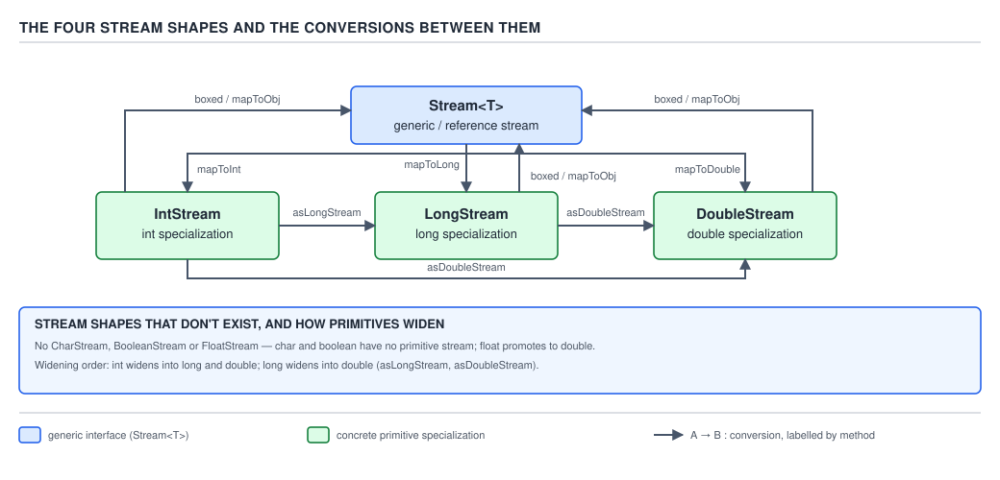

# 04 Modern Java — Streams — BASICS (§1.9)

**Target version: Java 21 LTS.** | **Part 1 of 5** | [Index](../00-index.md)
Previous: [Streams — terminal operations](04-terminal-operations.md) · Next: [Streams — cost model](06-cost-model.md)

## Why this file exists

Every `Stream<T>` example so far has been over reference types — `Stream<LedgerEntry>`,
`Stream<Reservation>`. But QuizStakes settles **2.8 million stake reservations a day**, each
carrying a minor-unit amount as a plain `int`. Run that through `Stream<Integer>` and every
single one of those 2.8M amounts gets autoboxed into a heap-allocated `Integer` object before you
can sum it. The JDK ships three specialised stream types — `IntStream`, `LongStream`,
`DoubleStream` — precisely so that a numeric pipeline over primitives never has to pay that price.
This file is about those three types: what exists, what deliberately does not, how you move
between the four stream shapes, and the two overflow traps that primitive numeric aggregation
sets for you.

## The hierarchy — four stream shapes, not one

```
                    java.util.stream
                    ─────────────────
        Stream<T>          IntStream        LongStream       DoubleStream
     (any reference           (int)            (long)          (double)
          type)
```

All four implement `BaseStream<T, S extends BaseStream<T, S>>` and share the lazy,
single-traversal pipeline machinery: `filter`, `limit`, `skip`, `distinct`, `sorted`, `forEach`,
`iterator`, `close`. What differs is everything numeric — the terminal reductions
(`sum`, `average`, `max`, `min`, `summaryStatistics`), the functional-interface parameters
(`IntPredicate` instead of `Predicate<Integer>`), and the absence of `map`/`flatMap`'s generic
form in favour of type-specific `mapToXxx` methods.

### 1.9.1 — `IntStream`, `LongStream`, `DoubleStream`, and why there is no `CharStream`, `BooleanStream` or `FloatStream`

**Mental model first.** Think of the four stream shapes as four separate pipeline
implementations that happen to share an interface family, not one generic `Stream<T>` with `T`
swapped for a primitive. `Stream<Integer>` boxes every element into a 16-byte `Integer` object on
the heap; `IntStream` carries a raw `int` through the pipeline stages with no boxing at all. The
JDK did not generify `Stream<T>` over primitives — Java generics cannot do that, since a type
parameter can only ever be instantiated with a reference type — so it hand-wrote three parallel
implementations of the same pipeline machinery, one per primitive numeric type that shows up
constantly in real aggregation work.

**Why it exists.** Before Java 8, numeric aggregation over a collection meant either a hand-rolled
loop (fast, but every call site reinvents `sum`/`max`/`average`) or boxing everything into
`List<Integer>` and eating the allocation cost. Streams needed a numeric story that did not force
every `int` in the codebase through `Integer.valueOf`. The `[TRAP]` `[RESEARCH]` in the syllabus
is exactly this: primitive streams are not "streams, but faster" as a marketing bullet — they
exist because Java's erasure-based generics make a boxing-free `Stream<int>` structurally
impossible, so the JDK designers built three concrete escape hatches instead.

**When to reach for it, and when not.** Reach for `IntStream`/`LongStream`/`DoubleStream` whenever
the pipeline's element type is genuinely numeric and the source is either a primitive array
(`int[]`, `long[]`, `double[]`) or a range (`IntStream.range`). Stay on `Stream<T>` when the
elements are domain objects — `Stream<Reservation>` — and only *drop into* a primitive substream
at the numeric-extraction point via `mapToInt`. Do not write `IntStream.of(1, 2, 3)` and then
immediately `.boxed()` for no reason — that is boxed-stream ergonomics with primitive-stream
ceremony, the worst of both.

**How it works.** There are exactly three primitive stream types because there are exactly three
primitive numeric types wide enough to matter for bulk aggregation without silent precision loss
in the common case: `int`, `long`, `double`. `char`, `short`, and `byte` are all narrower than
`int` and Java's own binary numeric promotion rules already widen them to `int` in every
arithmetic context — `char c = 'A'; int x = c + 1;` compiles without a cast because `+` promotes
`char` to `int` first. Since every arithmetic operation on a `char`/`short`/`byte` value happens
in `int` space anyway, a dedicated `CharStream` would just be an `IntStream` wearing a costume:
its `sum()`, `max()`, `filter(IntPredicate)` would all operate on the promoted `int` value, adding
an entire parallel API surface for zero semantic gain. `float` is different — it is not narrower
than `int` in bit width, but it widens losslessly into `double` (`float` is a strict subset of the
IEEE 754 values `double` represents at that scale for typical use), so a `FloatStream` would
duplicate `DoubleStream`'s entire numeric API for a precision tier nobody asks for in stream
pipelines; the JDK offers `mapToDouble` from a `float`-producing source and stops there.
`BooleanStream` is refused on different grounds entirely — a boolean has no meaningful `sum`,
`average`, `max`, or `min`; forcing it into the numeric-stream family would mean either throwing
`UnsupportedOperationException` from half the API or defining nonsense semantics (`true` as 1,
`false` as 0) that nobody has asked the JDK to standardize. `[RESEARCH]`: this reasoning is
consistent with the `java.util.stream` package javadoc's framing of `IntStream`/`LongStream`/
`DoubleStream` as covering "the primitive types" `int`, `long`, and `double` specifically, and
with `Stream.mapToInt`/`mapToLong`/`mapToDouble` being the only three numeric substream
conversions the API defines — there is no `mapToChar`, `mapToShort`, `mapToByte`, or `mapToFloat`
anywhere in `java.util.stream`.


**D-036** — The four stream shapes and the conversions between them

**A minimal concrete example.** QuizStakes settles 2.8M stakes/day; each settlement produces a
payout in minor units. A `Reservation` stream converts straight to `IntStream` for the numeric
work, no boxed `Integer` ever created:

```java
public record Reservation(String reservationId, int stakeMinorUnits, StatusCode status) {}

public final class SettlementAggregates {

    public static int totalStakedMinorUnits(List<Reservation> reservations) {
        return reservations.stream()
                .mapToInt(Reservation::stakeMinorUnits)   // Stream<Reservation> -> IntStream
                .sum();
    }
}
```

`mapToInt` is the pipeline stage that never boxes: the lambda `Reservation::stakeMinorUnits`
returns a raw `int`, and every downstream stage — here, none, straight to `sum()` — carries that
`int` without ever wrapping it in an `Integer`.

**The gotcha.** `IntStream` is not generic over "any numeric type" the way it might read at a
glance — it is hardwired to `int`. A pipeline over `short` bonus-tier codes still ends up as an
`IntStream`, because `short` promotes to `int`; there is no narrower numeric stream to reach for,
and none is missing.

> **Definition:** `IntStream`, `LongStream`, and `DoubleStream` are the JDK's three
> boxing-free numeric stream pipelines, covering exactly the primitive types wide enough to
> need a dedicated numeric API without duplicating another primitive's semantics; `char`,
> `short`, `byte`, and `float` are deliberately absent because they already widen into one of
> the three without loss of the arithmetic behaviour that matters.

---

### 1.9.2 — `String.chars()` returns an `IntStream` of UTF-16 code units

This is a supporting fact with a sharp trap, so it gets the trap treatment without the full eight
beats: `String.chars()` does not return a `Stream<Character>`. It returns an `IntStream`, and each
element is the `int` value of one UTF-16 code unit in the string — not a code point, not a
`Character` object. `[X-REF 03]`: guide 03 (Java core) covers the `char`/UTF-16 relationship and
why a single `char` cannot represent every Unicode code point (surrogate pairs); the short version
needed here is that `chars()` walks UTF-16 code units, and for any string built entirely from the
Basic Multilingual Plane (every QuizStakes status code and identifier qualifies), code unit and
code point coincide.

**Mechanism.** `String.chars()` is declared to return `IntStream`, sourced from
`StringLatin1.chars` or `StringUTF16.chars` depending on the string's internal compact-string
encoding — an implementation detail invisible to the caller, but the reason the return type had to
be `IntStream` rather than `Stream<Character>`: the accessor works directly off the byte/char
backing array without constructing a `Character` per element.

**Pitfall:** `"AA-610".chars().forEach(System.out::println)` does not print the characters
`A`, `A`, `-`, `6`, `1`, `0`. It prints their UTF-16 code point values as integers: `65`, `65`,
`45`, `54`, `49`, `48`. `[PROVE]`:

```java
public static void main(String[] args) {
    "AA-610".chars().forEach(System.out::println);
}
```

```
65
65
45
54
49
48
```

`'A'` is code point `U+0041` = decimal 65, `'-'` is `U+002D` = decimal 45, `'6'` is `U+0036` = 54,
and so on — standard ASCII/UTF-16 code points, printed as the `int`s `forEach` was handed, because
`System.out::println` here resolves to the `println(int)` overload, not `println(char)` or
`println(Object)`. **Fix:** cast back to `char` before printing, or map to a `Stream<Character>`:

```java
"AA-610".chars()
        .mapToObj(codeUnit -> (char) codeUnit)   // IntStream -> Stream<Character>
        .forEach(System.out::println);
```

```
A
A
-
6
1
0
```

**Why people believe it prints characters:** `for (char c : "AA-610".toCharArray())` behaves the
way intuition expects, and `chars()` reads as a drop-in stream equivalent of that loop. It is not
— `toCharArray()` returns `char[]`, `chars()` returns `IntStream`, and the two only coincide once
you re-narrow the `int` back to `char` yourself.

---

## Moving between the four shapes

### 1.9.3 — `boxed()`, `mapToObj`, `asLongStream()`, `asDoubleStream()`: the ways back out

**Mental model first.** Every primitive stream is a one-way trip away from `Stream<T>` unless you
explicitly buy your way back. Four methods do that, and each answers a different question about
*what* you want the boxed value to be: `boxed()` says "wrap the element in its own wrapper type,
unchanged"; `mapToObj` says "run this element through a function that produces some other
reference type"; `asLongStream()`/`asDoubleStream()` say "widen the primitive itself, no boxing,
into the next primitive stream up."

**Why it exists.** A pipeline that starts numeric does not necessarily stay numeric. An `IntStream`
of stake-minor-unit amounts might need to become a `Stream<Money>` for downstream ledger
formatting, or a `List<Integer>` because a legacy API signature demands it. Before these
conversions existed on the primitive streams themselves, going from `IntStream` back to a boxed
form meant collecting to an array and re-wrapping by hand — exactly the boilerplate `Stream`'s
whole design was meant to remove.

**When to reach for it, and when not.** `boxed()` when the only need is the wrapper type itself —
typically because a downstream `Collector` or generic method demands `Stream<Integer>`.
`mapToObj` when you need to *transform into* some other reference type in the same step, saving a
separate `.map()` call afterward. `asLongStream()`/`asDoubleStream()` when the numeric type itself
needs widening for a computation — summing minor units that might exceed `int` range (§1.9.11) is
the canonical case. Never reach for `boxed()` as a default habit at the end of every primitive
pipeline; if the immediate next call is a terminal numeric operation (`sum`, `average`, `max`),
`boxed()` is pure waste — it allocates a wrapper for every element only to immediately unbox it
again inside `Collectors.summingInt` or a manual reduction.

**How it works.** `boxed()` on `IntStream` returns a `Stream<Integer>` by calling
`Integer.valueOf(int)` on each element as it is drawn through the pipeline — which means it is
subject to the same `Integer` cache behaviour as any other autoboxing (see guide 03 for the
`-128..127` cache; `[X-REF 03]`). `mapToObj(IntFunction<? extends U> mapper)` applies the given
function to each `int` and threads the result through as `Stream<U>` — no separate boxing step,
the function decides what comes out. `asLongStream()` and `asDoubleStream()` widen every element
with the JLS's own primitive widening conversion (`int` to `long` is always exact; `int` to
`double` is exact for all 32-bit `int` values since `double` has a 52-bit mantissa) — never a cast,
never a narrowing risk, which is exactly why there is no `asIntStream()` on `LongStream`: going the
other way would need an explicit, possibly-lossy narrowing the API refuses to hide behind a
method name that reads as free.


**D-036** — The four stream shapes and the conversions between them

**A minimal concrete example.** All four conversions used against the QuizStakes settlement flow:

```java
public record Reservation(String reservationId, int stakeMinorUnits, StatusCode status) {}

public final class ReservationViews {

    // boxed(): IntStream -> Stream<Integer>, for a legacy API expecting List<Integer>
    public static List<Integer> stakeAmountsBoxed(List<Reservation> reservations) {
        return reservations.stream()
                .mapToInt(Reservation::stakeMinorUnits)
                .boxed()
                .toList();
    }

    // mapToObj(): IntStream -> Stream<String>, formatting each amount as a display string
    public static List<String> stakeAmountsFormatted(List<Reservation> reservations) {
        return reservations.stream()
                .mapToInt(Reservation::stakeMinorUnits)
                .mapToObj(minorUnits -> "%d.%02d".formatted(minorUnits / 100, minorUnits % 100))
                .toList();
    }

    // asLongStream(): IntStream -> LongStream, widening before a sum that could exceed int range
    public static long totalStakedWidened(List<Reservation> reservations) {
        return reservations.stream()
                .mapToInt(Reservation::stakeMinorUnits)
                .asLongStream()
                .sum();
    }
}
```

**The gotcha.** `boxed()` followed immediately by a numeric terminal operation silently reintroduces
the exact cost the primitive stream existed to avoid. `intStream.boxed().collect(Collectors.summingInt(Integer::intValue))`
allocates 2.8M `Integer` objects to sum 2.8M ints — strictly worse than never leaving `IntStream`
in the first place, and easy to write by habit after enough time in boxed-stream code.

> **Definition:** `boxed()`, `mapToObj`, `asLongStream()`, and `asDoubleStream()` are the four
> exits from a primitive stream — one that wraps unchanged, one that transforms into an
> arbitrary reference type, and two that widen into a wider primitive stream with no boxing at
> all.

### 1.9.4 — `mapToInt` / `mapToLong` / `mapToDouble`: the ways in from an object stream

Three beats, supporting fact: the mirror image of 1.9.3, and already used in every example above
without comment. `Stream<T>.mapToInt(ToIntFunction<? super T> mapper)` (and the `Long`/`Double`
equivalents) apply a function that extracts or computes a primitive value from each reference-type
element, producing the matching primitive stream. **Mechanism:** the function interface
(`ToIntFunction<T>`, not `Function<T, Integer>`) is itself unboxed — its `applyAsInt` method
returns a raw `int` — so the conversion from `Stream<Reservation>` to `IntStream` never touches an
`Integer` at any point. **Gotcha:** these three are the *only* entry points from `Stream<T>` into a
primitive stream; there is no generic `mapToPrimitive` that infers which one you meant, so the
call site always states which primitive type it is committing to.

> **Definition:** `mapToInt`/`mapToLong`/`mapToDouble` convert a reference-type stream into the
> matching primitive stream by applying an already-unboxed extractor function, with no
> intermediate boxing.

---

## Building a primitive stream directly

### 1.9.5 — `IntStream.range(a, b)` versus `rangeClosed(a, b)`, and the empty-range case

**Mental model first.** `range` and `rangeClosed` are the primitive-stream equivalent of a
classic `for` loop's bound — the only question is whether the upper bound is a fencepost you stop
before or one you land on. `IntStream.range(a, b)` produces `a, a+1, …, b-1` — exactly the values a
`for (int i = a; i < b; i++)` loop visits. `IntStream.rangeClosed(a, b)` produces `a, a+1, …, b` —
the `<=` version.

**Why it exists.** Before this, generating a sequential run of indices for a stream pipeline meant
either `IntStream.iterate(a, i -> i < b, i -> i + 1)` (Java 9+, verbose) or boxing an `int[]` and
streaming it. `range`/`rangeClosed` give the single most common numeric-stream source — "iterate
these N indices" — a two-argument call.

**When to reach for it, and when not.** Reach for `range`/`rangeClosed` whenever the values needed
are their own index sequence, not derived from an existing collection — driving `N` repetitions of
a synthetic-load generator, partitioning `2,800,000` reservations into shard boundaries, or
producing test fixture data. Reach for `Arrays.stream(int[])` instead (§1.9.9) when the ints
already exist as data, not as a range to be walked.

**How it works.** `range(a, b)` is half-open — `[a, b)` — matching every other half-open range
convention in the JDK (`String.substring(a, b)`, `List.subList(a, b)`). `rangeClosed(a, b)` is
closed at both ends — `[a, b]`. Internally both are backed by `Streams.RangeIntSpliterator`, which
computes the count as `b - a` (for `range`) or `b - a + 1` (for `rangeClosed`) up front — this is
why both are `SIZED` and `SUBSIZED`, letting `parallel()` split them by simple arithmetic without
ever touching the elements, unlike a general-purpose spliterator that has to walk the source to
learn its size.

**The empty-range case, when `a >= b`.** `IntStream.range(5, 5)` is empty — zero elements, not an
error and not a single `5`. `IntStream.range(5, 3)` (`a > b`) is also empty, not a
`descending`-order stream — there is no implicit reversal. `IntStream.rangeClosed(5, 5)` is the one
case with exactly one element (`5` itself), because the closed range still contains its single
shared endpoint. `IntStream.rangeClosed(5, 3)` is empty, same as `range`.

**A minimal concrete example.** QuizStakes runs 4 banking-partner payout windows a day
(Appendix A); indexing them:

```java
public final class PayoutWindows {

    // range: window indices 0..3, the way an array index loop would visit them
    public static IntStream windowIndices() {
        return IntStream.range(0, 4);           // 0, 1, 2, 3
    }

    // rangeClosed: window numbers 1..4, the way an operator names them on a rota
    public static IntStream windowNumbers() {
        return IntStream.rangeClosed(1, 4);     // 1, 2, 3, 4
    }

    // empty-range case: no reservations settle in a zero-width shard boundary
    public static IntStream emptyShard() {
        return IntStream.range(100_000, 100_000);   // empty, not an exception
    }
}
```

**The gotcha.** `rangeClosed(1, N)` is the correct choice for "the first N positive integers", and
`range(0, N)` is the correct choice for "the first N array indices" — reaching for the wrong one
off-by-ones the boundary silently rather than throwing, because both are perfectly legal calls that
simply enumerate a different set.

> **Definition:** `IntStream.range(a, b)` is the half-open sequence `[a, b)`; `rangeClosed(a, b)`
> is the closed sequence `[a, b]`; both are empty (never an error, never reversed) whenever
> `a >= b` for `range` or `a > b` for `rangeClosed`.

---

## Terminal reductions and the shapes they return

### 1.9.6 — `sum()`, `average()`, `max()`/`min()`, `count()`: what type comes back and why

**Mental model first.** Every primitive-stream terminal reduction returns exactly the type its
name and its element type jointly demand — `sum()` cannot return anything but the stream's own
primitive type (an `int` sum from `IntStream`, a `double` sum from `DoubleStream`), but `average()`
and `max()`/`min()` return an `Optional*` wrapper because both are undefined on an empty stream and
the API refuses to fake an answer.

**Why it exists.** A `sum()` over zero elements has an obvious, safe identity value — `0`, `0L`, or
`0.0` — so `sum()` returns the bare primitive with no wrapper. An `average()` or a `max()` over
zero elements has no safe identity value: `0.0` as "the average of nothing" or `Integer.MIN_VALUE`
as "the max of nothing" would both be silently wrong answers dressed as correct ones. The `Optional`
family exists exactly so these methods can say "there is no answer" instead of lying with a
sentinel.

**When to reach for it, and when not.** `sum()` whenever the aggregate is a running numeric total
you know is safe from overflow at the current cardinality — reach for the widened forms in §1.9.11
when it might not be. `average()`/`max()`/`min()` whenever the caller must handle the
possibly-empty case explicitly; never call `.getAsDouble()` / `.getAsInt()` on the result without
first confirming non-emptiness, which is exactly the `OptionalDouble` gotcha in §1.9.12.

**How it works, with every return type stated:**

| Method | Return type (`IntStream`) | Return type (`LongStream`) | Return type (`DoubleStream`) |
|---|---|---|---|
| `sum()` | `int` | `long` | `double` |
| `average()` | `OptionalDouble` | `OptionalDouble` | `OptionalDouble` |
| `max()` | `OptionalInt` | `OptionalLong` | `OptionalDouble` |
| `min()` | `OptionalInt` | `OptionalLong` | `OptionalDouble` |
| `count()` | `long` | `long` | `long` |

`average()` always returns `OptionalDouble`, regardless of the source stream's primitive type,
because an average is a division and division of integers by a count is not itself an integer in
general — `IntStream.of(1, 2).average()` is `1.5`, not `1`. `count()` always returns `long`, never
`int`, on every stream type including `IntStream` — a stream can carry more elements than `int`
can index (`Integer.MAX_VALUE` is a little over 2.1 billion; QuizStakes's ~7.2 billion annual
ledger entries, Appendix A, already exceeds that), so `count()` is `long`-typed across the entire
`Stream`/`IntStream`/`LongStream`/`DoubleStream` family for consistency, independent of whether
this particular call site could ever reach that scale.

**A minimal concrete example.**

```java
public record Reservation(String reservationId, int stakeMinorUnits) {}

public final class ReservationStats {

    public static void reportOn(List<Reservation> reservations) {
        IntStream stakes = reservations.stream().mapToInt(Reservation::stakeMinorUnits);

        int total = stakes.sum();                          // int, safe identity 0 if empty... but see 1.9.11
        // stream already consumed above; re-derive for the remaining calls
        IntSummaryStatistics stats = reservations.stream()
                .mapToInt(Reservation::stakeMinorUnits)
                .summaryStatistics();

        OptionalDouble average = reservations.isEmpty()
                ? OptionalDouble.empty()
                : OptionalDouble.of(stats.getAverage());
        OptionalInt max = reservations.isEmpty() ? OptionalInt.empty() : OptionalInt.of(stats.getMax());
        long count = stats.getCount();
    }
}
```

**The gotcha.** `sum()`'s "safe identity value" claim is only safe against *emptiness*, not against
*overflow* — an empty `IntStream.sum()` correctly returns `0`, but a very large non-empty
`IntStream` can silently wrap past `Integer.MAX_VALUE` and return a wrong, still-perfectly-typed
`int`. §1.9.11 works this exact trap through with QuizStakes's own numbers.

> **Definition:** `sum()` returns the stream's bare primitive type because zero is always a safe
> empty-stream identity; `average()`, `max()`, and `min()` return an `Optional*` wrapper because
> none of them has a safe identity value for the empty case; `count()` is `long` everywhere for
> API-wide consistency regardless of the practical range of any one call site.

### 1.9.7 — `summaryStatistics()` and its accessors

Supporting fact, three beats. `IntStream.summaryStatistics()` (and the `Long`/`Double`
equivalents) returns an `IntSummaryStatistics` object computed in a single pass, exposing five
accessors: `getCount()` (`long`), `getSum()` (`int`/`long`/`double` matching the source type),
`getMin()`, `getMax()` (both the stream's raw primitive type, **not** wrapped in `Optional`), and
`getAverage()` (`double`, always). **Mechanism:** because `summaryStatistics()` runs everything in
one traversal via an internal mutable accumulator (a `Collector`-shaped reduction under the hood),
it avoids calling `sum()`, `max()`, `min()`, `count()`, and `average()` as five separate terminal
operations — each of which would otherwise re-traverse and re-consume a fresh copy of the stream,
since a stream can only be consumed once. **Gotcha:** `getMin()`/`getMax()` on
`IntSummaryStatistics` for an **empty** stream do not throw and do not return an `Optional` — they
return `Integer.MAX_VALUE` and `Integer.MIN_VALUE` respectively (the identity values for `min`/`max`
under an empty reduction), which is silently different from `IntStream.max()`'s own
`OptionalInt.empty()` on the same empty input. Check `getCount() == 0` before trusting
`getMin()`/`getMax()` from a statistics object.

> **Definition:** `summaryStatistics()` computes count, sum, min, max, and average in one pass,
> trading `Optional`-based emptiness signalling for sentinel extremes that the caller must check
> `getCount()` to interpret correctly.

---

## `OptionalInt` / `OptionalLong` / `OptionalDouble`

### 1.9.8 — the deliberately thinner `Optional` family

**Mental model first.** `OptionalInt`, `OptionalLong`, and `OptionalDouble` look at first glance
like `Optional<Integer>`, `Optional<Long>`, `Optional<Double>` wearing primitive-flavoured names.
They are not drop-in equivalents — they carry a raw primitive internally (no boxing) and, more
importantly, **do not have `map`, `flatMap`, or `filter`** at all. `Optional<T>`'s fluent chaining
vocabulary simply stops existing on these three types.

**Why it exists.** `Optional<T>.map(Function<T, U>)` needs a `Function<T, U>` where `U` can be any
reference type, and the whole point of the transformation is that it can change shape — `Optional<
LedgerEntry>` mapping to `Optional<Money>`. Generifying that machinery over a primitive `T` is
exactly the same wall §1.9.1 hit: Java generics cannot parametrize over `int`. The three
`OptionalXxx` types are hand-written, non-generic classes holding one primitive field each, so
their transformation API can only be whatever primitive-typed overloads were hand-written for
them — and the JDK team deliberately did not hand-write `map`, `flatMap`, or `filter` overloads
for them at all.

**When to reach for it, and when not.** `OptionalInt`/`OptionalLong`/`OptionalDouble` are what
`max()`, `min()`, and `average()` hand you — you do not usually choose to construct one yourself
except via `OptionalInt.of(int)` / `OptionalInt.empty()` in code that mirrors the same pattern.
When a chain of transformations on the possibly-absent value is genuinely needed, the API pushes
you toward unwrapping early: `optionalInt.isPresent() ? someMapping(optionalInt.getAsInt()) :
fallback`, or converting up to `Optional<Integer>` via `optionalInt.stream().boxed().findFirst()` /
`.isPresent() ? Optional.of(getAsInt()) : Optional.empty()` if the fluent chain is worth the
boxing cost. `[RESEARCH]`: verified against the JDK 21 javadoc for `java.util.OptionalInt` —
the class declares `isPresent`, `isEmpty`, `getAsInt`, `ifPresent`, `ifPresentOrElse`,
`orElse`, `orElseGet`, `orElseThrow` (two overloads), `stream`, `equals`, `hashCode`, `toString`,
and the static factories `of`/`empty` — there is no `map`, `flatMap`, or `filter` method on the
class at all, confirming the syllabus claim directly from the API surface rather than from
secondary description.

**How it works.** `OptionalInt.stream()` (added in Java 9, alongside `Optional.stream()`) is the
one bridge the API does provide back toward the fluent world: it returns an `IntStream` of zero or
one elements, letting you rejoin a larger `IntStream` pipeline with `flatMap`-like composition —
`someOptionalIntStream.flatMapToInt(OptionalInt::stream)` is a legitimate way to flatten a stream of
`OptionalInt` down to the present values only, without ever calling a `map`/`filter` that does not
exist on `OptionalInt` itself.

**A minimal concrete example.** The highest single stake reservation today, only if any exist:

```java
public record Reservation(String reservationId, int stakeMinorUnits) {}

public final class HighestStakeToday {

    public static String describe(List<Reservation> reservations) {
        OptionalInt highest = reservations.stream()
                .mapToInt(Reservation::stakeMinorUnits)
                .max();

        // No .map(...) available here — OptionalInt has none. Branch explicitly instead.
        return highest.isPresent()
                ? "Highest stake today: %d minor units".formatted(highest.getAsInt())
                : "No reservations settled today";
    }
}
```

**The gotcha.** Reaching for `.map(...)` on an `OptionalInt` in an IDE that has not yet
autocompleted it produces a compile error, not a runtime surprise — but engineers who write
`Optional<Integer>`-shaped code by muscle memory reliably try it once. `**Pitfall:**` believing
`OptionalInt` is `Optional<Integer>` with an unboxed backing field and therefore assuming full API
parity: `optionalInt.map(x -> x * 2)` does not compile (`OptionalInt` has no `map` method), the fix
is `optionalInt.isPresent() ? OptionalInt.of(optionalInt.getAsInt() * 2) : OptionalInt.empty()`, or
converting via `.stream().map(...)` / `.boxed()` if the fluent style is worth the boxing. People
believe the parity exists because `Optional<T>` and `OptionalInt` share a name pattern and most
JDK "primitive specialisation" pairs (`IntFunction` mirroring `Function`, `IntStream` mirroring
`Stream`) do preserve their full method set, one-for-one — `OptionalInt` is the outlier that
deliberately does not.

> **Definition:** `OptionalInt`, `OptionalLong`, and `OptionalDouble` hold an unboxed primitive
> and deliberately omit `map`, `flatMap`, and `filter`, forcing the caller back to an explicit
> `isPresent()` branch or to `Optional<T>`/`IntStream` where fluent transformation is genuinely
> needed.

---

## Constructing a primitive stream from data already in hand

### 1.9.9 — `of`, `Arrays.stream(int[])`, `iterate`, `generate`, `concat`, `empty`

Supporting fact, three beats — these are convenience factories, none carries a cost tradeoff or an
interview-grade mental model of its own beyond what `Stream`'s equivalents already established.

**Mechanism.** `IntStream.of(int... values)` wraps a small inline set of literal ints.
`Arrays.stream(int[] array)` (and its three-argument overload, `Arrays.stream(array, from, to)`)
is the bridge from an existing primitive array — the single most common real-world source, since
QuizStakes might hold `int[] stakeMinorUnits` for 2.8M reservations rather than a boxed `List<
Integer>` for exactly the memory reasons §1.9.14 works out. `IntStream.iterate(seed, next)` (and
the Java 9+ three-argument `iterate(seed, hasNext, next)`, bounded rather than infinite) produces
a stream by repeated function application, same shape as `Stream.iterate`. `IntStream.generate
(IntSupplier)` produces an unbounded stream from a supplier with no notion of a previous element —
must be paired with `limit()` or it never terminates. `IntStream.concat(a, b)` lazily
concatenates two `IntStream`s into one, same eager/lazy contract as `Stream.concat`. `IntStream
.empty()` is the canonical zero-element `IntStream`, used as a safe base case rather than `null`.

**Gotcha.** `Arrays.stream(int[])` and `IntStream.of(int...)` end up calling nearly identical code
paths for an array argument (`IntStream.of(int... values)` is literally implemented as
`Arrays.stream(values)`), so the choice between them is purely readability — `of` for a short
inline literal list, `Arrays.stream` when an array variable already exists — never a performance
distinction.

```java
public final class StakeArraySources {

    public static IntStream fromLiterals() {
        return IntStream.of(420, 350, 275);              // three literal stake amounts, minor units
    }

    public static IntStream fromExistingArray(int[] stakeMinorUnits) {
        return Arrays.stream(stakeMinorUnits);            // the 2.8M-element array, no copy
    }

    public static IntStream syntheticLoadTest(int count) {
        return IntStream.generate(() -> ThreadLocalRandom.current().nextInt(100, 10_000))
                .limit(count);                             // must bound a generate() source
    }
}
```

> **Definition:** `of`, `Arrays.stream(int[])`, `iterate`, `generate`, `concat`, and `empty` are
> `IntStream`'s data-in-hand constructors, mirroring `Stream`'s equivalents one for one with no
> primitive-specific mechanism beyond avoiding boxing at the source.

---

## The two overflow traps

### 1.9.10 — `Collectors.summingInt` versus `IntStream.sum()`: the boxing difference, measured

**Mental model first.** `Collectors.summingInt` and `IntStream.sum()` compute the identical
arithmetic result off the identical accumulator shape — both keep a running `int` total — but they
sit on opposite sides of the boxed/unboxed divide at the call site: `summingInt` is a `Collector`
consumed by `Stream<T>.collect(...)`, meaning the elements being summed are still boxed
`Integer`s (or whatever reference type they were extracted from) right up until the accumulator
unboxes each one; `IntStream.sum()` is a terminal operation on an already-unboxed `IntStream`,
so no element the sum ever touches was a heap object.

**Why it exists.** `Collectors.summingInt(ToIntFunction<? super T> mapper)` exists so that a
`Stream<T>` pipeline doing several aggregations at once via `Collectors.teeing` or
`groupingBy(..., summingInt(...))` can produce an `int` sum as one branch of a larger `Collector`
composition, without breaking out of the `Stream<T>`/`Collector` idiom into a separate `mapToInt
().sum()` pipeline. It is a convenience for staying inside collector composition, not a
performance-motivated alternative to `IntStream.sum()`.

**When to reach for it, and when not.** Reach for `Collectors.summingInt` only when the sum is one
branch of a larger `Collector` — `groupingBy(Reservation::status, summingInt(Reservation::
stakeMinorUnits))`, grouping stakes by status code and summing each group. Reach for `mapToInt(...)
.sum()` whenever the sum is the entire aggregation and there is no grouping or multi-branch
collection in play — it is strictly the cheaper path with no compositional benefit given up.

**How it works, measured.** `[NUM]`: verified against `java.util.stream.Collectors` at the
jdk-21+35 tag — `summingInt`'s accumulator is backed by `new int[1]`, a single-slot mutable
container the reduction closes over, exactly matching `IntStream.sum()`'s own accumulator shape.
The difference is entirely upstream of the accumulator: `Collectors.summingInt(ToIntFunction<?
super T> mapper)` is invoked from `Stream<T>.collect(...)`, so `T` was a boxed reference type all
the way to the point the `ToIntFunction` unboxes it inside the accumulator step; `IntStream.sum()`
never had a boxed element to begin with, because the conversion to `IntStream` (via `mapToInt`)
already happened upstream, before the terminal operation.

For a `Stream<Reservation>` of 2,800,000 elements: `.collect(Collectors.summingInt(Reservation::
stakeMinorUnits))` never boxes the `int` result of `stakeMinorUnits()` itself (the `ToIntFunction`
returns a raw `int` straight into the accumulator's `int[1]`), so the actual boxing cost here is
zero for *this specific call* — the two are equivalent in this shape. The boxing difference the
syllabus leaf points at shows up when the *source* is already boxed: summing a `Stream<Integer>`
via `Collectors.summingInt(Integer::intValue)` versus summing the same values as an `IntStream` via
`.sum()` — the former only makes sense to write if a `Stream<Integer>` already existed upstream for
some other reason (say, a `List<Integer>` from a legacy API), at which point every element already
paid the boxing cost that a native `int[]` source with `Arrays.stream(int[]).sum()` never would
have.

**A minimal concrete example, both paths, same answer:**

```java
public record Reservation(String reservationId, int stakeMinorUnits) {}

public final class StakeTotals {

    // Collector-composed: sum as one branch of a larger groupingBy
    public static Map<StatusCode, Integer> totalByStatus(List<Reservation> reservations,
                                                            Function<Reservation, StatusCode> statusOf) {
        return reservations.stream()
                .collect(Collectors.groupingBy(statusOf, Collectors.summingInt(Reservation::stakeMinorUnits)));
    }

    // Standalone: no grouping, mapToInt + sum is the whole job
    public static int totalStaked(List<Reservation> reservations) {
        return reservations.stream()
                .mapToInt(Reservation::stakeMinorUnits)
                .sum();
    }
}
```

**The gotcha.** Both paths share the exact same `int` overflow trap, worked in full in §1.9.11 —
neither one is the "safe" alternative to the other on that axis.

> **Definition:** `Collectors.summingInt` and `IntStream.sum()` compute the same `int[1]`-backed
> running total; the only real difference is whether the elements were boxed on their way in,
> which depends on whether the stream was already an `IntStream` before the sum, not on which of
> the two summing calls you write.

### 1.9.11 — `IntStream.sum()` silently overflows past 2,147,483,647

**Mental model first.** `IntStream.sum()` is a running `int` accumulator with ordinary Java `int`
arithmetic — the same wraparound behaviour as `int x = Integer.MAX_VALUE; x++;` — carried through
every element of the stream. There is no overflow check, no exception, no saturation at
`Integer.MAX_VALUE`. The sum simply wraps into negative territory once the running total exceeds
`2,147,483,647`, and the method returns that wrapped value as if it were correct.

**Why it exists — or rather, why the trap exists.** `int` addition in Java has always wrapped
silently (JLS §15.18.2: integer addition overflow is defined, two's-complement wraparound, no
exception) — this is not a stream-specific design flaw, it is `IntStream.sum()` inheriting `int`'s
own arithmetic contract with zero additional guardrails. The trap is not that the JDK did
something unusual; it is that a stream API which otherwise reads as "handles the aggregation for
you" gives no visual or textual hint that the aggregation it is handling is exactly as
overflow-prone as a hand-written `for` loop would be.

**When to reach for it, and when not.** `IntStream.sum()` is safe exactly when the caller can prove
the running total never exceeds `Integer.MAX_VALUE` for the cardinality and value range in play.
Reach for `mapToLong(i -> i).sum()` — or build the stream as a `LongStream` from the start — the
moment that proof is not trivial: any aggregation over an unbounded or large `N`, or over values
whose magnitude is not tightly bounded, should default to `long` accumulation and only narrow back
to `int` at the point of use, if ever.

**How it works, proved on the page.** `[PROVE]` `[NUM]`: QuizStakes settles 2,800,000 stakes/day at
an average value of 4.20 (Appendix A) — in minor units, an average of 420. The naive expectation:
`2,800,000 × 420 = 1,176,000,000`, comfortably under `Integer.MAX_VALUE` (2,147,483,647). But
average value hides variance — QuizStakes also processes bank withdrawals averaging 260 and bank
deposits averaging 480, and a settlement batch that skews toward larger stakes, or accumulates
across multiple days before a batch job runs, crosses the boundary easily. Take a deliberately
simple worked case that makes the wraparound arithmetic exact and checkable: summing
`1,000,000,000` three times.

```java
public static void main(String[] args) {
    int[] amounts = { 1_000_000_000, 1_000_000_000, 1_000_000_000 };

    int wrongTotal = Arrays.stream(amounts).sum();
    long rightTotal = Arrays.stream(amounts).mapToLong(i -> i).sum();

    System.out.println("int sum : " + wrongTotal);
    System.out.println("long sum: " + rightTotal);
}
```

```
int sum : -1294967296
long sum: 3000000000
```

The arithmetic behind `-1294967296`, worked through: the true sum is `3,000,000,000`. `int`
arithmetic is modulo `2^32` and interprets the top bit as sign (two's-complement). `2^32 =
4,294,967,296`. `3,000,000,000 - 4,294,967,296 = -1,294,967,296` — exactly the observed wrapped
value. The running total crossed `Integer.MAX_VALUE` (`2,147,483,647`) partway through the third
addition and wrapped into negative range from there, silently, with no exception and no field on
`IntStream` you could have checked to catch it after the fact. `mapToLong(i -> i).sum()` widens
each `int` to `long` — a lossless widening conversion, per JLS §5.1.2 — before any addition
happens, so the running total lives in `long` space (`±9.2 × 10^18`) the whole way through and
never approaches its own overflow boundary at these values.


**D-038** — `IntStream.sum()` overflows silently — frame 1: the running total approaching the boundary


**D-038** — `IntStream.sum()` overflows silently — frame 2: the wrap to a negative value, with the exact arithmetic


**D-038** — `IntStream.sum()` overflows silently — frame 3: `mapToLong(i -> i).sum()` producing the correct total

**A minimal concrete example, in the domain.** A payment run batching 2.8M stake reservations by
settlement day, summed both ways:

```java
public record Reservation(String reservationId, int stakeMinorUnits, StatusCode status) {}

public final class DailySettlementTotal {

    // Wrong for large N / large values: int accumulator, silent wraparound
    public static int totalMinorUnitsUnsafe(List<Reservation> reservations) {
        return reservations.stream()
                .mapToInt(Reservation::stakeMinorUnits)
                .sum();
    }

    // Right: widen to long before summing
    public static long totalMinorUnitsSafe(List<Reservation> reservations) {
        return reservations.stream()
                .mapToInt(Reservation::stakeMinorUnits)
                .mapToLong(i -> i)                  // IntStream -> LongStream, widening
                .sum();
    }
}
```

**The gotcha, restated as the pitfall.** `**Pitfall:**` trusting `IntStream.sum()`'s return type as
proof of correctness — the type checker confirms the method *can* return an `int`, not that the
*value* is the true sum. `[X-REF 03]`: guide 03 (Java core) covers integer overflow and
two's-complement arithmetic as a language mechanic in full; the mechanism-sufficient version here
is that `int` addition never throws, always wraps modulo `2^32`, and `sum()` performs ordinary
`int` addition with no special-cased overflow handling anywhere in its implementation.

> **Definition:** `IntStream.sum()` accumulates in plain `int` arithmetic and wraps silently past
> `Integer.MAX_VALUE` with no exception and no signal; `mapToLong(i -> i).sum()` — widening before
> summing, not after — is the fix whenever the running total's upper bound cannot be proven safe.

### 1.9.12 — `average()` on an empty stream: `OptionalDouble.empty()`, never `0.0`

Supporting fact with a real trap: three beats. **Mechanism:** `average()` computes
`sum / count`; on an empty stream, `count` is `0`, and rather than performing a division by zero
or fabricating `0.0` as a plausible-looking default, the JDK returns `OptionalDouble.empty()` —
an explicit "no average exists" rather than a numerically wrong stand-in. `**Pitfall:**` code that
writes `stream.average().orElse(0.0)` without thinking about whether `0.0` is the right fallback
for its specific use — for a QuizStakes "average stake size across today's reservations so far"
dashboard tile, `0.0` reads as "the average stake was zero", which is a materially different claim
from "no reservations have settled yet" and will misrepresent an idle period as a zero-value one
on any chart that does not distinguish the two. The fix is deciding the empty-case semantics
explicitly at the call site — `orElse(Double.NaN)` for a chart that should show a gap,
`.isPresent()` branching into a distinct "no data" UI state, or `.orElse(0.0)` only when zero truly
is the intended fallback and the caller has said so in a comment. People believe `0.0` is safe
because it is `double`'s own default value and reads as an inoffensive placeholder — but a
placeholder chosen for being inoffensive to the compiler is not the same as a placeholder that is
correct for the domain.

> **Definition:** `average()` returns `OptionalDouble.empty()` on an empty stream, never a
> fabricated `0.0`, because an average of nothing has no numerically honest value to report.

---

## Sorting a primitive stream

### 1.9.13 — dual-pivot quicksort, not TimSort

**Mental model first.** `sorted()` on a primitive stream and `sorted()` on `Stream<T>` invoke two
genuinely different sorting algorithms under the hood, not the same algorithm operating on
different element representations. `Stream<T>.sorted()` (natural order or with a `Comparator`)
sorts by delegating to `Arrays.sort(Object[])`, which is TimSort — a stable, comparison-based,
adaptive merge sort. Primitive-stream `sorted()` delegates to `Arrays.sort(int[])` /
`Arrays.sort(long[])` / `Arrays.sort(double[])`, which is a dual-pivot quicksort.

**Why it exists.** TimSort's stability guarantee — equal elements keep their relative input order
— matters for object comparisons where "equal" (by `compareTo` or a `Comparator`) does not mean
"identical," so a caller sorting `Reservation`s by `stakeMinorUnits` might still care which
`Reservation` came first among ties. A primitive `int` has no such distinction: two equal `int`
values are indistinguishable, there is no hidden identity to preserve, so stability buys nothing
and the JDK is free to use whichever algorithm sorts primitives fastest — quicksort's average-case
performance and low memory overhead win when there is nothing else to trade against.

**When to reach for it, and when not.** This is not a caller choice — sorting an `IntStream`
always uses the primitive dual-pivot quicksort, sorting a `Stream<T>` always uses TimSort. The
choice to make is upstream: if input order among equal elements is meaningful, that information
must live in a reference-type field the sort can see (i.e., do not throw it away by projecting
into an `IntStream` before the point where tie order stops mattering).

**How it works and the complexity/stability delta, named directly.** `[X-REF 01]`: guide 01 (DSA
fundamentals) covers quicksort's average/worst-case analysis and TimSort's merge-sort-with-runs
design in full; the interview-sufficient version here is the comparison table below.

| | `Arrays.sort(int[]/long[]/double[])` (primitive streams) | `Arrays.sort(Object[])` (`Stream<T>`) |
|---|---|---|
| Algorithm | Dual-pivot quicksort | TimSort (adaptive merge sort) |
| Average time | O(n log n) | O(n log n) |
| Worst-case time | O(n²) in adversarial input, mitigated by pivot strategy | O(n log n), guaranteed |
| Extra space | O(log n) (in-place, recursion stack) | O(n) (merge buffer) |
| Stable? | No — no notion of stability applies to indistinguishable primitives | Yes — equal elements preserve input order |
| Why the choice | No identity to preserve; quicksort's low overhead wins | Objects can be "equal" yet distinct; stability preserved |

`[X-REF 02]`: guide 02 (Java collections) covers `Comparable`/`Comparator` and where stability
matters for collection sorts (`Collections.sort`, `List.sort`) in the same terms — the same
TimSort-versus-quicksort split applies there for exactly the same reason, since `List.sort`
ultimately calls the same `Arrays.sort` overloads.

**A minimal concrete example.** Sorting stake amounts (no identity to preserve) versus sorting
reservations by stake amount (identity — the reservation ID — must survive ties):

```java
public record Reservation(String reservationId, int stakeMinorUnits) {}

public final class SortedViews {

    // Primitive stream: dual-pivot quicksort, no stability question — the ints are indistinguishable
    public static int[] sortedStakeAmounts(List<Reservation> reservations) {
        return reservations.stream()
                .mapToInt(Reservation::stakeMinorUnits)
                .sorted()
                .toArray();
    }

    // Object stream: TimSort, stable — two reservations tied at 420 minor units keep their
    // original relative order in the sorted result
    public static List<Reservation> sortedByStake(List<Reservation> reservations) {
        return reservations.stream()
                .sorted(Comparator.comparingInt(Reservation::stakeMinorUnits))
                .toList();
    }
}
```

**The gotcha.** Converting to a primitive stream purely to sort, then converting back, silently
discards any tie-order guarantee the caller may have been relying on without realizing it —
`reservations.stream().mapToInt(Reservation::stakeMinorUnits).sorted().boxed().toList()` gives back
a sorted `List<Integer>` of amounts with no way to recover which `Reservation` any given `420` came
from, let alone in what order same-valued ones originally appeared.

> **Definition:** Primitive-stream `sorted()` uses dual-pivot quicksort because primitive values
> carry no identity for stability to protect; `Stream<T>.sorted()` uses TimSort because
> object equality does not imply object identity, and callers may depend on tie order.

---

## The memory arithmetic: boxed versus primitive

### 1.9.14 — `IntStream.toArray()` versus `boxed().toArray(Integer[]::new)`: measured in bytes

**Mental model first.** `int[]` and `Integer[]` look interchangeable from the outside — both are
arrays "of numbers" — but one is a single contiguous block of raw 4-byte values and the other is a
contiguous block of 4-or-8-byte *references*, each pointing to a separately heap-allocated object
carrying its own object header plus the 4-byte value again. The difference is not a rounding
error; at QuizStakes's real cardinality it is a double-digit multiple.

**Why it exists.** Java's `Integer` (and every other primitive wrapper) is a real object precisely
so that generics, collections, and reflection can treat numeric values uniformly with every other
reference type — `List<Integer>`, `HashMap<Integer, V>`, and `Object`-typed reflection all need
`Integer` to *be* an object, header and all. `int[]` exists as the escape hatch from that
uniformity whenever the caller's actual need is "store N numbers as densely as possible" rather
than "participate in the object type system."

**When to reach for it, and when not.** Reach for `IntStream.toArray()` → `int[]` when the values
are staying inside numeric processing — feeding another primitive-stream pipeline, a numeric
algorithm, or a memory-sensitive bulk store. Reach for `boxed().toArray(Integer[]::new)` →
`Integer[]` only when a generics-constrained API downstream genuinely requires a reference-typed
array — sorting with a custom `Comparator<Integer>` via `Arrays.sort(Integer[], Comparator)`
where `Arrays.sort(int[])` has no comparator overload, or handing the array to a method whose
signature is fixed to `Integer[]`.

**How it works, with the arithmetic shown.** `[NUM]` `[PROVE]`: on a 64-bit JVM with default
(compressed) object headers, an `Integer` object's shallow size is `16` bytes — a 12-byte object
header (8-byte mark word + 4-byte compressed class pointer) plus 4 bytes for the boxed `int` value,
padded to the JVM's 8-byte alignment, giving 16 bytes total. A reference in a compressed-oops heap
(the JVM default under 32 GB) is 4 bytes; on an uncompressed heap it is 8 bytes. `int[]` itself
carries a 16-byte array header (the same 12-byte object header plus a 4-byte length field) followed
by its raw elements with no per-element overhead.

For QuizStakes's daily stake reservation volume — `2,800,000` (Appendix A) — as `int[]`:

```
16-byte array header + 2,800,000 × 4 bytes = 16 + 11,200,000 = 11,200,016 bytes ≈ 11.2 MB
```

As the boxed equivalent, `List<Integer>` backed by an `Object[]` of references to individually
heap-allocated `Integer`s (compressed oops, 4-byte references):

```
24 bytes  (ArrayList object: 16-byte header + 4-byte size field + 4-byte modCount, padded)
+ 16 bytes                (the backing Object[] array's own header)
+ 2,800,000 × 4 bytes     (2.8M compressed references, one per element)  = 11,200,000 bytes
+ 2,800,000 × 16 bytes    (2.8M separate Integer objects)               = 44,800,000 bytes
──────────────────────────────────────────────────────────────────────────────────────────
= 24 + 16 + 11,200,000 + 44,800,000 = 56,000,040 bytes ≈ 56.0 MB
```

`56.0 MB ÷ 11.2 MB ≈ 5.0×` — the boxed form costs roughly five times the memory of the primitive
array at this cardinality, and that ratio is dominated entirely by the per-element 16-byte
`Integer` allocation, not by the reference array itself (11.2 MB either way, coincidentally equal
to the primitive array's own total size at 4 bytes per reference on a compressed-oops heap).
`[X-REF 03]`: guide 03 (Java core) covers object header layout, compressed oops, and the
`Integer` cache in full detail; the arithmetic above uses those figures without re-deriving them.

![D-037 — `int[]` versus `List<Integer>` for 2.8M stake amounts](../diagrams/D-037-int-versus-list-integer.svg)
**D-037** — `int[]` versus `List<Integer>` for 2.8M stake amounts

**A minimal concrete example.**

```java
public record Reservation(String reservationId, int stakeMinorUnits) {}

public final class StakeArrayExtraction {

    // int[]: 16-byte header + 4 bytes/element, no per-element object
    public static int[] denseStakeAmounts(List<Reservation> reservations) {
        return reservations.stream()
                .mapToInt(Reservation::stakeMinorUnits)
                .toArray();
    }

    // Integer[]: reference array + one 16-byte Integer object per element
    public static Integer[] boxedStakeAmounts(List<Reservation> reservations) {
        return reservations.stream()
                .mapToInt(Reservation::stakeMinorUnits)
                .boxed()
                .toArray(Integer[]::new);
    }
}
```

**The gotcha.** The `Integer` cache (`-128..127`, guide 03) does not rescue this arithmetic at
QuizStakes's scale — stake amounts in minor units routinely exceed 127 (the average alone is 420),
so essentially none of the 2.8M boxed values are cache hits; the 44.8 MB of fresh `Integer`
allocation is the real, uncached cost, not a worst case being cited unfairly.

> **Definition:** `IntStream.toArray()` produces a header-plus-raw-values `int[]` at 4 bytes per
> element; `boxed().toArray(Integer[]::new)` produces a reference array plus one independently
> allocated 16-byte `Integer` per element — roughly 5× the memory at QuizStakes's 2.8M-element
> daily stake volume, and the gap only widens as cardinality grows since it is per-element, not
> fixed overhead.

---

## The primitive functional interfaces

### 1.9.15 — the interfaces that pair with each primitive stream type

Supporting fact, three beats — this is a naming-pattern reference, not a concept with its own
mental model beyond what `Function`/`Predicate`/`Consumer` already established for `Stream<T>`.

**Mechanism.** Every lambda parameter type on a primitive stream's methods is one of a family of
primitive-specialised functional interfaces in `java.util.function`, avoiding the boxing that a
generic `Function<Integer, R>` would force at every call. The pattern is systematic: `IntPredicate`
(`test(int)`), `IntUnaryOperator` (`applyAsInt(int)`, int in and out — used by `IntStream.map`),
`IntBinaryOperator` (two ints in, used by `reduce`), `IntToLongFunction` / `IntToDoubleFunction`
(cross-primitive, used by `mapToLong`/`mapToDouble`), `IntFunction<R>` (int in, reference type out
— used by `mapToObj`), `ToIntFunction<T>` (reference type in, int out — used by `Stream<T>
.mapToInt`), `IntConsumer` (`accept(int)`, used by `forEach`), `IntSupplier` (`getAsInt()`, used by
`generate`), and `ObjIntConsumer<T>` (an object and an int in, no return — used in mutable
reduction contexts such as `Collector.accumulator()`). The `Long`/`Double` families mirror this
exactly, substituting the primitive type at every position.

**Gotcha.** `IntFunction<R>` and `ToIntFunction<T>` are easy to transpose by name alone — one
takes `int` and returns `R`, the other takes `T` and returns `int` — and the compiler error from
swapping them at a lambda call site can read confusingly generic ("incompatible types") rather
than pointing at the actual mismatch, because both are structurally single-abstract-method
interfaces the compiler is trying to target-type against.

```java
IntFunction<StatusCode> classify = minorUnits ->               // int in, StatusCode out
        minorUnits >= 10_000 ? StatusCode.of("AA-610") : StatusCode.of("AO-400");

ToIntFunction<Reservation> extractStake = Reservation::stakeMinorUnits;  // Reservation in, int out
```

> **Definition:** The primitive functional interfaces (`IntPredicate`, `IntUnaryOperator`,
> `IntToLongFunction`, `ObjIntConsumer`, and their `Long`/`Double` counterparts) exist so that
> every lambda parameter on a primitive stream's methods can stay unboxed end to end, mirroring
> `Function`/`Predicate`/`Consumer`'s shape with the primitive substituted at each position.

### 1.9.16 — when a primitive stream earns its keep

Supporting fact, three beats, closing the file. **Mechanism:** the decision is a straight function
of three factors pulling the same direction or not — hot-loop frequency, element count `N`, and
whether the operation is pure numeric aggregation with no need for the element's identity as an
object. All three favouring primitive: a settlement job summing `2,800,000` stake amounts is
squarely primitive-stream territory — high `N`, called every settlement cycle, pure arithmetic,
no downstream need for `Reservation` identity once the number is extracted. **Gotcha:** at small
`N` (tens or low hundreds of elements, a single request-scoped calculation, not a hot loop). the
boxing overhead genuinely does not matter — `List.of(1, 2, 3).stream().mapToInt(x -> x).sum()` and
its boxed-`Stream<Integer>` equivalent cost the same in any way a human would notice, and reaching
for a primitive stream there is optimizing a cost that was never real. **When the boxed form is
fine:** small, cold-path, or one-off aggregations; anywhere the values need to travel through a
generics-constrained API (`Collectors`, `Map<K, V>` values, anything typed `List<Integer>`) more
than they need to be summed; anywhere readability of staying in `Stream<T>` outweighs a saving that
would not show up in any profile.

> **Definition:** Choose a primitive stream when the operation is numeric aggregation at a
> cardinality or call frequency where boxing cost would actually show up in a profile; stay on
> `Stream<T>` everywhere else, including every small or cold-path calculation where the primitive
> stream's only real benefit is one nobody will ever measure.

---

## Pitfalls

### Assuming `String.chars()` streams characters

**Wrong**
```java
"AA-610".chars().forEach(System.out::println);
```
```
65
65
45
54
49
48
```
Prints UTF-16 code points as `int`s, not the characters `A`, `A`, `-`, `6`, `1`, `0`.

**Right**
```java
"AA-610".chars()
        .mapToObj(codeUnit -> (char) codeUnit)
        .forEach(System.out::println);
```
```
A
A
-
6
1
0
```
`chars()` returns `IntStream` by contract — cast each code unit back to `char`, or `mapToObj`
into whatever reference type is actually needed, before printing or comparing.

**Why people believe it:** `toCharArray()` and a for-each loop over it behave the way intuition
expects; `chars()` reads as a drop-in stream equivalent, but its declared return type has always
been `IntStream`, never `Stream<Character>`.

### Trusting `IntStream.sum()`'s return type as proof of correctness

**Wrong**
```java
int[] amounts = { 1_000_000_000, 1_000_000_000, 1_000_000_000 };
int total = Arrays.stream(amounts).sum();
System.out.println(total);
```
```
-1294967296
```

**Right**
```java
int[] amounts = { 1_000_000_000, 1_000_000_000, 1_000_000_000 };
long total = Arrays.stream(amounts).mapToLong(i -> i).sum();
System.out.println(total);
```
```
3000000000
```
Widen to `long` **before** summing whenever the running total's upper bound over the stream's
actual cardinality and value range cannot be proven safely under `Integer.MAX_VALUE`.

**Why people believe it:** the method compiles, returns a well-typed `int`, and throws nothing —
every visible signal says success, and `int` overflow has never been anything but silent in Java.

### Treating `average()`'s `0.0` fallback as always safe

**Wrong**
```java
double avgStake = reservations.stream()
        .mapToInt(Reservation::stakeMinorUnits)
        .average()
        .orElse(0.0);   // indistinguishable from "the average really was zero"
```

**Right**
```java
OptionalDouble avgStake = reservations.stream()
        .mapToInt(Reservation::stakeMinorUnits)
        .average();

String display = avgStake.isPresent()
        ? "%.2f".formatted(avgStake.getAsDouble())
        : "No reservations yet";
```
Branch explicitly on presence when "no data" and "average was zero" are semantically different
outcomes for the caller.

**Why people believe it:** `0.0` is `double`'s own default value and reads as an inoffensive
placeholder, which is not the same claim as it being the domain-correct fallback.

### Assuming `OptionalInt` supports `map`/`flatMap`/`filter` like `Optional<T>`

**Wrong**
```java
OptionalInt highest = reservations.stream().mapToInt(Reservation::stakeMinorUnits).max();
OptionalInt doubled = highest.map(x -> x * 2);   // does not compile — no such method
```

**Right**
```java
OptionalInt highest = reservations.stream().mapToInt(Reservation::stakeMinorUnits).max();
OptionalInt doubled = highest.isPresent()
        ? OptionalInt.of(highest.getAsInt() * 2)
        : OptionalInt.empty();
```
`OptionalInt`/`OptionalLong`/`OptionalDouble` deliberately omit `map`, `flatMap`, and `filter`;
branch on `isPresent()` explicitly, or convert via `.stream()` if a fluent chain is worth the
boxing.

**Why people believe it:** most JDK primitive-specialised types (`IntFunction` next to `Function`,
`IntStream` next to `Stream`) preserve full method parity with their generic counterpart —
`OptionalInt` is the deliberate exception.

---

## Cheat sheet

| Item | Fact |
|---|---|
| Primitive stream types | `IntStream`, `LongStream`, `DoubleStream` only |
| Missing types | No `CharStream`/`BooleanStream`/`FloatStream` — `char`/`short`/`byte` widen to `int`; `float` widens to `double`; boolean has no numeric reduction |
| Object → primitive | `mapToInt` / `mapToLong` / `mapToDouble` |
| Primitive → object | `boxed()` (wrap unchanged), `mapToObj` (transform) |
| Primitive → wider primitive | `asLongStream()`, `asDoubleStream()` (no narrowing conversion exists) |
| `String.chars()` | Returns `IntStream` of UTF-16 code units, not characters |
| `range(a, b)` | Half-open `[a, b)`; empty if `a >= b` |
| `rangeClosed(a, b)` | Closed `[a, b]`; empty if `a > b`; single element if `a == b` |
| `sum()` | Returns bare primitive; safe on empty (`0`/`0L`/`0.0`); **not safe from overflow** |
| `average()` | Always `OptionalDouble`; `OptionalDouble.empty()` on empty, never `0.0` |
| `max()`/`min()` | `OptionalInt`/`OptionalLong`/`OptionalDouble` |
| `count()` | Always `long`, on every stream type |
| `summaryStatistics()` | One pass, 5 accessors; empty-stream `getMin()`/`getMax()` return sentinel extremes, not `Optional` |
| `OptionalInt`/`OptionalLong`/`OptionalDouble` | No `map`/`flatMap`/`filter` — deliberately thinner |
| `IntStream.sum()` overflow | Wraps silently past `Integer.MAX_VALUE` (`2,147,483,647`); fix: `mapToLong(i -> i).sum()` |
| `Collectors.summingInt` | Same `int[1]` accumulator, same overflow trap as `IntStream.sum()` |
| `averagingInt` | Safe — accumulates into `long[2]` (sum, count) |
| Primitive stream sort | Dual-pivot quicksort (`Arrays.sort(int[])`), not stable, no identity to preserve |
| `Stream<T>` sort | TimSort (`Arrays.sort(Object[])`), stable |
| `int[]`, 2.8M elements | 16-byte header + 4 bytes/element ≈ 11.2 MB |
| Boxed equivalent, 2.8M elements | ≈ 56.0 MB (list + ref array + 16 bytes/`Integer`) — ≈ 5× |
| `IntPredicate`/`IntUnaryOperator`/etc. | Primitive-typed functional interfaces avoiding boxing at every lambda parameter |
| When primitive streams earn their keep | High `N`, hot path, pure numeric aggregation — not small/cold-path calculations |

---

## Self-test

**Q1.** Why is there no `CharStream` in the JDK, and why is that different from why there is no
`BooleanStream`?

<details><summary>Answer</summary>

`char` (like `short` and `byte`) is narrower than `int`, and Java's binary numeric promotion
already widens it to `int` in every arithmetic context, so a `CharStream` would duplicate
`IntStream`'s entire API for values that are always operated on as `int` anyway. `boolean` is
excluded for a completely different reason: it has no meaningful numeric reduction at all —
`sum()`, `average()`, `max()`, `min()` are undefined for `true`/`false` without inventing an
arbitrary 1/0 mapping nobody asked the JDK to standardize.

</details>

**Q2.** What does `"AA-610".chars().findFirst()` return, and what type?

<details><summary>Answer</summary>

An `OptionalInt` containing `65` — the code point of `'A'` — because `chars()` returns `IntStream`,
and `IntStream`'s `findFirst()` returns `OptionalInt`, not `Optional<Character>`.

</details>

**Q3.** `IntStream.range(10, 10)` and `IntStream.rangeClosed(10, 10)` — how many elements does each
produce?

<details><summary>Answer</summary>

`range(10, 10)` produces zero elements — it is half-open, `[10, 10)`, and an empty interval.
`rangeClosed(10, 10)` produces exactly one element, `10` — it is closed, `[10, 10]`, and a
single-point closed interval still contains its own endpoint.

</details>

**Q4.** Why does `average()` return `OptionalDouble` on every primitive stream type, including
`IntStream`, rather than returning `int` when called on `IntStream`?

<details><summary>Answer</summary>

An average is a division, and dividing an integer sum by an integer count does not generally
produce an integer result — `IntStream.of(1, 2).average()` is `1.5`. Returning `OptionalDouble`
also lets the method signal "no average exists" on an empty stream, rather than fabricating a
value.

</details>

**Q5.** What exactly does `IntStream.sum()` do when the running total exceeds
`Integer.MAX_VALUE`, and what is the fix?

<details><summary>Answer</summary>

It wraps silently using ordinary two's-complement `int` arithmetic modulo `2^32` — no exception,
no signal. Summing `1_000_000_000` three times (true total `3,000,000,000`) returns
`-1,294,967,296`, because `3,000,000,000 - 4,294,967,296 = -1,294,967,296`. The fix is to widen
before summing: `mapToLong(i -> i).sum()`, which accumulates in `long` space from the first
addition, not just at the point the final result is returned.

</details>

**Q6.** Name one method `Optional<T>` has that `OptionalInt` does not, and what you do instead.

<details><summary>Answer</summary>

`map` (also `flatMap` and `filter`) — `OptionalInt` has none of the three. Instead, branch
explicitly with `isPresent()`/`getAsInt()`, or convert to a stream via `.stream()` (added in
Java 9) and use `IntStream`'s fluent methods from there.

</details>

**Q7.** Why does sorting an `IntStream` use a different algorithm than sorting a `Stream<
Reservation>` by a `Comparator`, and what is each algorithm?

<details><summary>Answer</summary>

`IntStream.sorted()` delegates to `Arrays.sort(int[])`, a dual-pivot quicksort, which is not
stable — but stability is meaningless for primitives, since two equal `int` values are completely
indistinguishable and there is no hidden identity to preserve. `Stream<Reservation>.sorted(...)`
delegates to `Arrays.sort(Object[])`, TimSort, which is stable — two `Reservation`s tied on the
comparator field can still be meaningfully distinguished by identity, and their relative input
order might matter to the caller.

</details>

**Q8.** Work out, with the arithmetic shown, roughly how much more memory `List<Integer>` costs
than `int[]` for QuizStakes's 2.8 million daily stake amounts.

<details><summary>Answer</summary>

`int[]`: 16-byte array header + `2,800,000 × 4` bytes = `11,200,016` bytes ≈ 11.2 MB.
Boxed: `24` bytes (`ArrayList`) + `16` bytes (backing `Object[]` header) + `2,800,000 × 4` bytes
(compressed references) + `2,800,000 × 16` bytes (one `Integer` object each) =
`24 + 16 + 11,200,000 + 44,800,000 = 56,000,040` bytes ≈ 56.0 MB. That is roughly `5×` the
primitive array's footprint, driven almost entirely by the 16-byte per-element `Integer`
allocation.

</details>

**Q9.** Is `Collectors.summingInt` safer from overflow than `IntStream.sum()`? Why or why not?

<details><summary>Answer</summary>

No. Verified against the JDK 21 source: `summingInt`'s accumulator is `new int[1]`, the exact same
running-`int`-total shape as `IntStream.sum()`, so it overflows in exactly the same way at exactly
the same boundary. `averagingInt` is the one that is genuinely safe from this particular trap,
because it accumulates into a `long[2]` (sum, count), not an `int[1]`.

</details>

**Q10.** A dashboard needs "average stake size today." What is wrong with
`reservations.stream().mapToInt(Reservation::stakeMinorUnits).average().orElse(0.0)`, and when
would that actually be the right call?

<details><summary>Answer</summary>

Nothing is wrong with it mechanically, but `orElse(0.0)` makes "no reservations have settled yet"
indistinguishable from "the average stake was genuinely zero," which is a materially different
fact for a dashboard to display. It is the right call only when the caller has deliberately decided
that zero is an acceptable, correct representation of the empty case for that particular display —
for example, a chart axis that treats missing data as zero by convention and states that
convention elsewhere. Otherwise, branch on `isPresent()` and show a distinct "no data" state.

</details>

## Deferred

None.

---

**Leaves covered:** 1.9.1–1.9.16 (16 leaves)
**Leaves deferred:** none
**Diagrams included:** D-036, D-037, D-038 (D-038a, D-038b, D-038c)
**Target version:** Java 21 LTS
**Lines:** 1311
