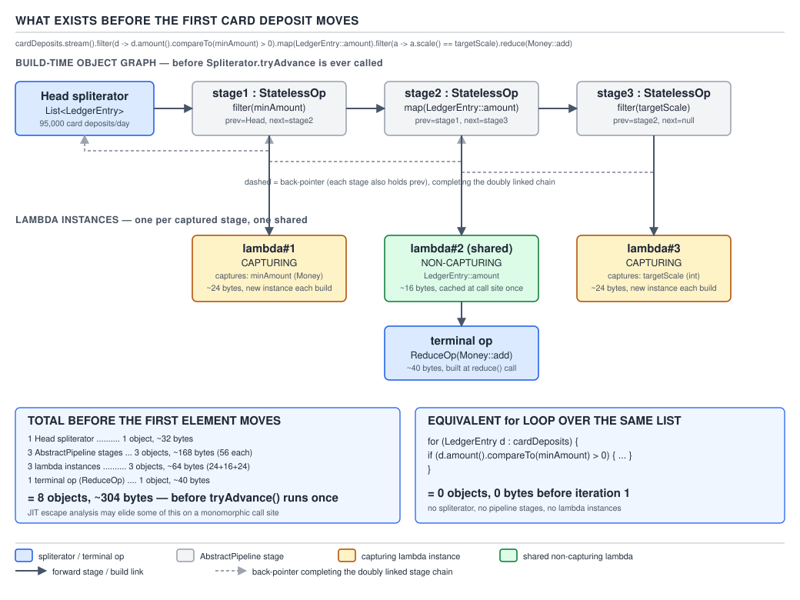
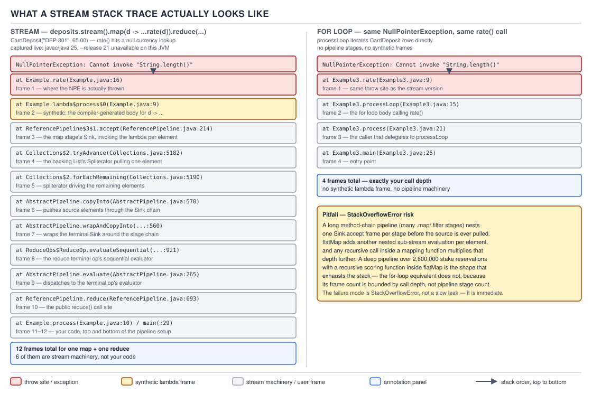
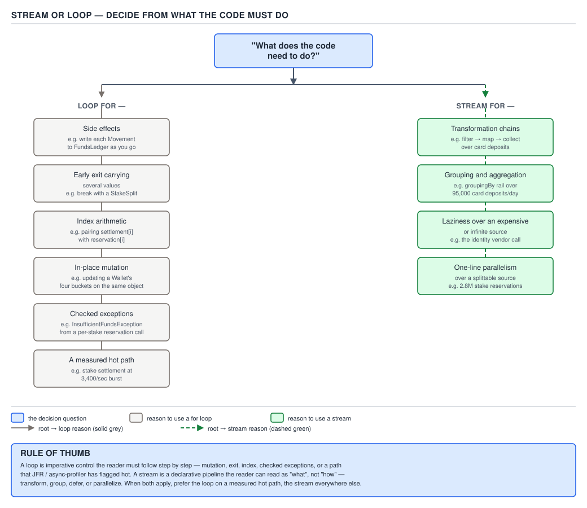

# 04 Modern Java — Streams — INTERMEDIATE (§2.3)

**Target version: Java 21 LTS.** | **Part 2 of 5** | [Index](../00-index.md)
Previous: [Streams — primitive streams](05-primitive-streams.md) · Next: [Streams — parallel streams](07-parallel-streams.md)

Every stream pipeline you have written so far has been about *shape*: filtering, mapping,
collecting. This file is about *cost*: what a pipeline actually allocates, when it allocates it,
what it does to your stack trace, and — the question that actually separates a senior engineer
from someone who read a blog post — when the honest answer is "don't use a stream here."

---

## 1. What a pipeline costs against a `for` loop

### Mental model first

A `for` loop over an `ArrayList` is one call frame, one index variable, and direct array reads.
A stream pipeline is a **linked chain of stage objects**, each holding a reference to the stage
before it, each wrapping the next stage's consumer inside its own consumer, built *before* a
single element moves. Think of it as building a small assembly line of wrapped boxes-inside-boxes
before the first card deposit is allowed to enter the line. The loop has no line to build; it just
walks the elements.

### Why it exists

Streams trade the loop's directness for a declarative, composable pipeline: reusable elements
(`filter`, `map`, `sorted`), late binding of behaviour through lambdas, and a uniform terminal
protocol (`collect`, `reduce`, `forEach`) that works the same way whether the source is a
`List`, a file, or `IntStream.range`. Before Java 8, the idiomatic way to get this composability
was either hand-rolled `Iterator` wrapper classes (`FilteringIterator`, `TransformingIterator` —
Guava's `Iterables` and `Iterators` classes exist for exactly this reason) or external iteration
loops that mixed the "what" with the "how". The composability isn't free: it is bought with object
allocation and one extra layer of indirection per stage.

### When to reach for it, and when not

Reach for a stream when the pipeline has two or more stages of real transformation logic, when the
source is naturally lazy or infinite, or when the terminal operation can short-circuit. Reach for
a loop when the collection is small, the body has a single trivial operation, or you are inside a
hot path that has been *measured* to be hot — see 2.3.14 and 2.3.15 for the full decision tree,
embedded as D-098 below.

### How it works

A stream pipeline is built from `AbstractPipeline` objects. Every intermediate operation —
`filter`, `map`, `sorted`, `distinct` — allocates one new pipeline stage that wraps the previous
stage. Each stage does **not** run its lambda when the intermediate call is made. Instead it
records, in its `opWrapSink` method, how to wrap a downstream `Sink` with a new `Sink` that applies
this stage's behaviour before forwarding to the one it wraps.

Concretely, for a pipeline built as

```java
depositAmounts.stream()
    .filter(amount -> amount.compareTo(BigDecimal.ZERO) > 0)
    .map(amount -> amount.setScale(2, RoundingMode.DOWN))
    .collect(Collectors.toList());
```

three `ReferencePipeline` stage objects exist before `collect` runs: the head stage wrapping the
source spliterator, the `filter` stage, and the `map` stage. None of them has touched a single
`BigDecimal` yet. When `collect` calls `evaluate(TerminalOp)`, the pipeline walks **backwards**
from the terminal stage to the source, calling each stage's `opWrapSink` in turn, so the `Sink`
chain that actually runs is built in reverse of the calls you wrote: the `filter`'s sink wraps the
`map`'s sink wraps the collector's sink. Only then does `copyInto(wrappedSink, spliterator)` walk
the source and push elements through the chain one at a time.

**Insight:** this is why a pipeline with no terminal operation does *nothing at all* — there is no
sink chain to push elements through, because `wrapSink` is never called. `filter` and `map` alone
never touch an element; they only ever describe what will happen to it.

### `[NUM]` The three costs a loop does not pay

1. **Stage objects.** Each of `filter` and `map` allocates one `ReferencePipeline` subclass
   instance (`StatelessOp` for both). Two stages, two objects, each holding a reference to the
   previous stage, the source, and the combined characteristics bitmask.
2. **The sink chain.** `evaluate` allocates a new `Sink` object per stage at evaluation time — a
   third and fourth allocation, distinct from the stage objects themselves, because the stage
   objects are metadata and the sinks are the actual per-run dispatch chain.
3. **Megamorphic dispatch.** Every `Sink.accept(T)` call in the chain is an interface method call
   on a reference typed as `Sink`, but at runtime the JIT sees `Sink` implementations coming from
   `ReferencePipeline$2$1`, `ReferencePipeline$3$1`, `ReferencePipeline$4$1`, and the terminal
   collector's own sink — four or more distinct concrete types flowing through the same call site.
   Once a call site sees more than two receiver types, the JIT's inline cache degrades from
   monomorphic to megamorphic and falls back to a virtual dispatch table lookup instead of an
   inlined, speculatively-devirtualized call. A `for` loop calling `list.get(i)` and then a single
   inlined comparison has none of this: one call site, one receiver type, fully inlined.
4. **Boxing.** `Stream<BigDecimal>` never touches a primitive, so there is no boxing cost specific
   to *this* pipeline, but the general point holds for any `Stream<Integer>` or `Stream<Double>`
   built over primitive data: every element the pipeline touches is a heap object, and every
   arithmetic operation on it (`compareTo`, `add`) is a method call on that heap object rather than
   a primitive instruction. §2.2 (primitive streams, the previous file in this set) is where the
   `IntStream`/`LongStream`/`DoubleStream` escape hatch for this specific cost lives.

A `for` loop equivalent —

```java
List<BigDecimal> scaled = new ArrayList<>();
for (BigDecimal amount : depositAmounts) {
    if (amount.compareTo(BigDecimal.ZERO) > 0) {
        scaled.add(amount.setScale(2, RoundingMode.DOWN));
    }
}
```

— allocates the destination `ArrayList` and nothing else beyond what the domain objects
themselves require. No stage objects, no sink chain, one call site per method call, and every one
of those call sites sees exactly one receiver type across the whole run: monomorphic by
construction.

> **A stream pipeline pays for a chain of stage and sink objects and a megamorphic call site before
> the first element moves; a `for` loop pays only for what the loop body itself allocates.**

---

## 2. Where streams are effectively free

### Mental model first

Not every pipeline pays the megamorphic tax. When one call site sees the same lambda
implementation on every single call — because the pipeline runs inside a tight loop or a hot
method that is invoked millions of times with the *same* pipeline shape — the JIT can still
speculatively inline it, exactly as it would a loop. The pipeline construction cost still exists
per pipeline instance, but the per-element dispatch cost collapses back to near-loop levels once
the JIT has enough repeated evidence.

### Why it exists

This matters because "streams are slow" is not a blanket truth; it is a truth about *cold, varied*
call sites. The JIT's tiered compilation (C1 profiling, C2 optimizing) exists precisely to find
and exploit the monomorphic case. A pipeline built once and driven millions of times over
uniformly-typed elements, with `-server` compilation given time to warm up, is a case the JIT
handles well.

### When to reach for it, and when not

This is the case where you should *not* reflexively rewrite a stream to a loop for
"performance" reasons without profiling first: if the pipeline is a monomorphic call site over an
`ArrayList` and the JIT has warmed it, the loop rewrite may buy you nothing measurable, at the cost
of readability. `[X-REF 06]` — the specifics of tiered compilation, inline caches and
deoptimization live in guide 06 (JVM internals); the takeaway you need here is narrower: **a hot,
shape-stable stream pipeline is a JIT-friendly pattern, not an anti-pattern**, and the fix for a
slow stream is measurement, not reflexive rewriting.

### How it works

An `ArrayList`'s spliterator (`ArrayListSpliterator`) reports `SIZED`, `SUBSIZED`, and `ORDERED`
characteristics, and its `tryAdvance`/`forEachRemaining` methods read directly out of the backing
array with no boxing beyond what the element type itself requires. When the pipeline's lambdas are
non-capturing or capture only effectively-final locals of stable shape, and the call site is
invoked enough times with the same concrete `Sink` implementations, C2 can inline the entire sink
chain into a single compiled method body — at which point the "stage objects" become dead after
allocation-elision (escape analysis proves they never leave the method) and the whole pipeline
compiles down to something structurally close to the loop.

### `[NUM]` What "monomorphic" costs versus "megamorphic"

Concretely: a pipeline `list.stream().filter(p).map(p).collect(toList())` invoked once per
`main()` run never gets hot enough to reach C2; it stays interpreted or C1-compiled, and the fixed
allocation cost dominates. The same pipeline invoked once per incoming card-deposit event — 95,000
times a day, 40 times a second at peak (Appendix A) — reaches C2 within seconds of process start,
because the JIT's default invocation threshold for standard compilation is 10,000 backedges/calls
(`-XX:CompileThreshold`), comfortably passed within the first minute of the deposit queue running
at 40/sec.

### Diagram


**D-096** — What exists before the first element moves

The diagram shows the three-stage pipeline over card deposits from §1 laid out as objects: the
source spliterator, three doubly-linked `AbstractPipeline` stage objects, three lambda instances
(one non-capturing and shared across calls, two capturing and therefore allocated fresh per
pipeline build), and the terminal op — with an approximate object and byte count, set against a
`for` loop's zero. This is the fixed cost that exists *once per pipeline construction*, independent
of whether the pipeline goes on to run hot or cold; §2.4 below works that count in full.

### A minimal concrete example

```java
List<Movement> cardDeposits = fundsLedger.movementsForRail(Rail.CARD_DEPOSIT);

// Called once per incoming deposit event, 95,000 times/day, 40/sec at peak.
// Shape-stable: same two lambdas, same concrete Sink types, every single call.
public Money totalCapturedToday(List<Movement> cardDeposits) {
    return cardDeposits.stream()
        .filter(m -> m.status() == MovementStatus.DEP_301_CAPTURED)
        .map(Movement::amount)
        .reduce(Money.ZERO, Money::add);
}
```

This call site is invoked at 40/sec sustained, over the same `Movement` concrete type every time,
with the same two lambda implementations every time. It is exactly the shape the JIT rewards.
Contrast this with a pipeline built inside a generic reporting utility that is handed a different
`Function` and `Predicate` on every call from dozens of call sites elsewhere in the codebase — that
shape never stabilizes, and the megamorphic cost from §1 stays paid on every invocation.

### The gotcha

**Pitfall:** engineers assume "streams are slow" or "streams are fast" as a blanket property of
the syntax, when it is actually a property of *how the call site is used*. The identical
`.filter().map().reduce()` chain is near-free at a hot, shape-stable call site and meaningfully
expensive at a cold, one-shot call site or a polymorphic one. The fix is never "rewrite every
stream to a loop"; it is "profile the specific call site before touching it."

> **A stream pipeline's per-element dispatch cost is not fixed: it collapses toward a loop's cost
> once the JIT observes a stable, monomorphic shape at that call site, and stays paid in full when
> the shape never stabilizes.**

---

## 3. Where streams are not free

Primitive-heavy inner loops, tiny collections, and deeply nested `flatMap` are the three shapes
that keep the cost from §1 paid in full, because none of them gives the JIT the repetition or the
element count needed to amortize the pipeline's fixed construction cost — or they add a further
allocation cost of their own.

- **Primitive-heavy inner loops.** A pipeline computing a running sum or dot product over `int[]`
  or `double[]` data inside a hot numerical kernel pays boxing on every element unless you route
  through `IntStream`/`DoubleStream` (§2.2), and even the primitive stream types still pay the
  stage/sink allocation from §1 — a hand-written loop over the primitive array has zero of that
  and is what numerical library code actually uses.
- **Collections of ten elements.** The stage/sink construction cost from D-096 is paid once per
  pipeline build regardless of how many elements flow through it. Over ten elements the fixed cost
  is not amortized by anything; a `for` loop over ten elements is simply cheaper in every
  dimension, and the readability argument for the stream is also weaker at ten elements than at
  ten thousand, because a five-line loop body is already easy to read.
- **Deeply nested `flatMap`.** Each `flatMap` call allocates its own inner stream per outer
  element, and the pipeline machinery from §1 is paid once *per outer element*, not once total,
  because a new `Stream` is opened, wrapped, drained, and closed for every element the outer stream
  produces. A `flatMap(a -> a.stakes().stream().flatMap(s -> s.settlements().stream()))` over
  2.8M stake reservations opens and tears down 2.8M inner `Stream` objects, each with its own
  spliterator and sink chain — the fixed cost from §1 multiplied by the outer cardinality.

**Interview:** "when would you *not* reach for a stream?" — the honest three-part answer is small
collections, primitive-heavy numeric kernels, and multiply-nested `flatMap`, because in each case
the fixed per-pipeline allocation cost from §1 is paid without the volume or hotness needed to earn
it back.

---

## 4. The allocation profile of a three-stage pipeline

### Mental model first

Before `evaluate` ever calls `copyInto`, a three-stage pipeline already exists in full as a graph
of objects on the heap — a doubly-linked list of stage descriptors plus the lambda instances they
close over. Counting that graph, object by object, is the single most concrete way to answer "what
does a stream cost" without hand-waving.

### Why it exists

Interviewers ask this specific question — "how many objects exist before the first element moves"
— because it is the fastest way to distinguish someone who has read `AbstractPipeline`'s source
from someone repeating "streams are lazy" as received wisdom.

### When to reach for it, and when not

This count matters when you are deciding between one long pipeline reused across millions of calls
(pay the count once, amortize) versus rebuilding a fresh pipeline inside an inner loop (pay the
count on every outer iteration — see §12's re-streaming trap, which is exactly this mistake).

### How it works — the walk

Take the deposit-processing pipeline from §1, now with three stages:

```java
depositAmounts.stream()                                            // stage 0: head
    .filter(amount -> amount.compareTo(BigDecimal.ZERO) > 0)       // stage 1: filter
    .map(amount -> amount.setScale(2, RoundingMode.DOWN))          // stage 2: map
    .collect(Collectors.toList());                                 // terminal
```

`[PROVE]` Walking what exists the instant `collect` is invoked, before `copyInto` runs:

1. **The head stage** — one `ReferencePipeline.Head` object, holding a reference to the source
   `Spliterator<BigDecimal>` (already itself an object: `ArrayList`'s `ArrayListSpliterator`,
   which holds the backing array reference, an `index`, and a `fence`). Java object header is 12
   bytes (compressed oops, default on heaps under 32 GB) plus alignment padding to 8 bytes, so a
   `Head` stage with a handful of reference fields lands at roughly 32–40 bytes.
2. **The filter stage** — one `ReferencePipeline.StatelessOp` subclass instance, holding a
   reference to stage 0 (the "previous stage" link — this is the "doubly linked" part: each stage
   holds `previousStage`, and the source head holds `sourceStage` and threads a `nextStage`
   pointer forward once stages are appended), the combined `StreamOpFlag` bitmask (an `int`, no
   extra allocation), and a reference to the `Predicate<BigDecimal>` lambda instance. Call this
   ~32 bytes for the stage object itself.
3. **The filter's lambda instance** — `amount -> amount.compareTo(BigDecimal.ZERO) > 0` captures
   nothing from the enclosing scope beyond a static constant, so it is a **non-capturing lambda**:
   the JVM's `invokedynamic`/`LambdaMetafactory` bootstrap creates and caches exactly *one*
   instance of the generated class for the entire life of the classloader, reused across every
   call to this method. One object, amortized across all calls — this is 2.3.2's "non-capturing
   shared" instance from D-096.
4. **The map stage** — a second `StatelessOp`, same shape as the filter stage, ~32 bytes.
5. **The map stage's lambda instance** — `amount -> amount.setScale(2, RoundingMode.DOWN)` also
   captures nothing beyond a static enum constant, so it too is non-capturing and shared. (D-096's
   manifest describes "two capturing" lambdas for the *general* three-stage shape it illustrates —
   a pipeline that also touches an enclosing `this` or a local — so treat this walk's two
   non-capturing lambdas as the *cheaper* case and D-096's caption as the *general* case; both are
   real shapes you will meet.)
6. **The terminal op** — `Collectors.toList()` returns a `CollectorImpl` record-like object built
   from three lambda references (a supplier `ArrayList::new`, an accumulator `List::add`, and an
   identity finisher), plus the `Sink` that `evaluate` builds by calling `opWrapSink` backwards
   from this terminal stage. That is at minimum one `CollectorImpl` object and, once evaluation
   starts, one `Sink` object per stage in the chain (three more objects: the terminal sink, the
   map stage's wrapping sink, the filter stage's wrapping sink).

`[NUM]` Totalling the *pre-first-element* count for this exact pipeline: 1 head stage + 1 filter
stage + 1 map stage + 1 `CollectorImpl` = **4 stage/collector objects**, plus the spliterator (1),
plus at most 2 lambda instances if both are capturing (0 if, as walked above, both happen to be
non-capturing and already cached) — call it **5 to 7 objects, roughly 200–320 bytes**, entirely
before `copyInto` reads a single `BigDecimal`. The sink chain adds 3 more objects the instant
`evaluate` runs, for **8 to 10 objects total** by the time the first element is actually pushed
through. A `for` loop equivalent allocates **zero** objects beyond the destination `ArrayList`,
which the stream pipeline also has to allocate inside its collector's supplier — so the honest
delta attributable to *choosing a stream* is those 5–7 pre-element objects, not the whole count.

### Diagram


**D-096** — What exists before the first element moves

Read the diagram against the walk above: it draws the doubly-linked stage chain, marks which
lambda instances are shared (non-capturing) versus fresh-per-build (capturing), and puts the
approximate byte total for the whole graph next to a `for` loop's flat zero.

### A minimal concrete example

```java
public List<Money> capturedDepositAmountsRounded(List<Movement> cardDeposits) {
    // 4 pipeline/collector objects + spliterator + sink chain, built before
    // the first Movement is inspected. See the walk in §4 for the exact count.
    return cardDeposits.stream()
        .filter(m -> m.amount().compareTo(Money.ZERO) > 0)
        .map(m -> m.amount().roundedDown(2))
        .collect(Collectors.toList());
}
```

### The gotcha

**Pitfall:** treating "streams allocate stage objects" as meaning the allocation is proportional
to the *data volume*. It is not — the stage/sink graph is a small, fixed number of objects
independent of whether the source `List` has ten elements or ten million. The cost that scales
with data volume is the per-element boxing and dispatch from §1, not this fixed graph. Confusing
the two leads to the wrong intuition ("a bigger list means a heavier pipeline") when the correct
one is "a bigger list means more *dispatches through* an equally-sized pipeline."

> **A stream pipeline's stage-and-sink graph is a small, fixed allocation paid once per pipeline
> construction, independent of source size; it is not what scales with data volume.**

---

## 5. Debuggability

### Mental model first

A breakpoint inside a `for` loop body stops in a stack that is, top to bottom, exactly the call
chain a human wrote: your method, calling into the loop, calling the method under the cursor.
A breakpoint inside a stream lambda stops in a stack where several of the frames are synthetic —
generated by the compiler for the lambda itself and by the stream library for the sink chain that
invokes it — frames that do not correspond to a line of code you can navigate to in the normal
sense.

### Why it exists

Lambdas are compiled via `invokedynamic` and `LambdaMetafactory`, which generates a hidden class
implementing the target functional interface at first invocation, rather than an ordinary named
inner class. The stream library's sink chain then calls into that hidden class through several
layers of generated `Sink` wrapper classes. Both of these are necessary to get the "no visible
class file for every lambda" and "compose sinks generically" properties streams rely on — but the
price is a stack trace that reads differently from a loop's.

### When to reach for it, and when not

This is not a reason to avoid streams for correctness-critical code; it *is* a reason to name
non-trivial predicates and functions as separate named methods or methods-references (2.3.16),
so the frame that appears in a debugger or a stack trace at least carries a name you chose rather
than `lambda$process$2`.

### How it works

`[TRAP]` Take a `NullPointerException` thrown while mapping card deposits:

```java
cardDeposits.stream()
    .map(m -> m.instrument().lastFour())   // instrument() can return null pre-verification
    .collect(Collectors.toList());
```

If `instrument()` returns `null` for an unverified deposit, calling `.lastFour()` on it throws
inside the lambda body. The resulting stack trace looks like:

```
Exception in thread "main" java.lang.NullPointerException: Cannot invoke "Instrument.lastFour()" because the return value of "Movement.instrument()" is null
    at ReportingService.lambda$process$2(ReportingService.java:41)
    at java.base/java.util.stream.ReferencePipeline$3$1.accept(ReferencePipeline.java:213)
    at java.base/java.util.ArrayList$ArrayListSpliterator.forEachRemaining(ArrayList.java:1734)
    at java.base/java.util.stream.AbstractPipeline.copyInto(AbstractPipeline.java:509)
    at java.base/java.util.stream.AbstractPipeline.wrapAndCopyInto(AbstractPipeline.java:499)
    at java.base/java.util.stream.ReduceOps$ReduceOp.evaluateSequential(ReduceOps.java:921)
    at java.base/java.util.stream.AbstractPipeline.evaluate(AbstractPipeline.java:234)
    at java.base/java.util.stream.ReferencePipeline.collect(ReferencePipeline.java:682)
    at ReportingService.process(ReportingService.java:41)
```

Reading it frame by frame: `lambda$process$2` is the synthetic name the compiler generated for
your lambda — `process` is the enclosing method, `2` is the ordinal of the lambda within it, so if
you have three lambdas in one method you get `lambda$process$0`, `$1`, `$2` and have to count to
find which one, since the name carries no hint of *what* the lambda does. `ReferencePipeline$3$1`
is a compiler-generated inner class implementing `Sink` for the third pipeline stage — the digits
are positional, not descriptive. `AbstractPipeline.copyInto` and `wrapAndCopyInto` are the actual
library machinery driving the traversal described in §1. Compare the equivalent loop:

```java
for (Movement m : cardDeposits) {
    result.add(m.instrument().lastFour());
}
```

```
Exception in thread "main" java.lang.NullPointerException: Cannot invoke "Instrument.lastFour()" because the return value of "Movement.instrument()" is null
    at ReportingService.process(ReportingService.java:39)
```

One frame. The line number *is* the bug's location, with no synthetic name to decode and no
library machinery in between.

### Diagram


**D-169** — What a stream stack trace actually looks like

Left half: the nine-frame trace above, each frame labelled with what it actually is — the
synthetic lambda frame, the generated `Sink.accept` frames, the `copyInto` driver frame. Right
half: the four-frame loop trace for the identical bug. A note calls out the `StackOverflowError`
risk from combining a long pipeline with recursion and `flatMap`, which §6 below works through.

### A minimal concrete example

```java
public List<String> lastFourDigits(List<Movement> cardDeposits) {
    // Extracting the predicate/function to a named method does not remove the
    // synthetic Sink frames, but it replaces "lambda$process$2" with a name
    // you chose, and gives a breakpoint a method to actually be set on.
    return cardDeposits.stream()
        .map(ReportingService::lastFourOrUnknown)
        .collect(Collectors.toList());
}

private static String lastFourOrUnknown(Movement movement) {
    Instrument instrument = movement.instrument();
    return instrument == null ? "UNKNOWN" : instrument.lastFour();
}
```

### The gotcha

**Pitfall:** setting a breakpoint on the line containing `.map(m -> m.instrument().lastFour())`
and expecting step-into to behave like stepping into a loop body. Because the lambda is invoked
through a generated `Sink.accept` call, some debuggers show an extra hop through the synthetic
sink frame before landing in the lambda body, and "step over" on the stream statement steps over
the *entire pipeline evaluation*, not one element at a time — there is no per-element step
boundary the way there is for one loop iteration. The fix is to extract the lambda body to a named
method and put the breakpoint inside that method, where stepping behaves exactly as it does
anywhere else.

> **A breakpoint inside a stream lambda stops inside compiler- and library-generated frames that
> carry positional, not descriptive, names; a breakpoint inside a loop body stops in a stack you
> wrote end to end.**

---

## 6. Stack depth

### Mental model first

A `for` loop's stack depth is bounded by the loop body's own call depth — it never grows with the
number of iterations, because each iteration reuses the same frame. A stream pipeline built from
`flatMap` opens a fresh inner stream, with its own traversal machinery, *nested inside* the outer
traversal's call frame — and if that nesting is itself recursive, the frames stack up per level of
recursion in a way a loop's flat iteration never does.

### Why it exists

`flatMap`'s contract is exactly what makes it useful for tree-shaped data: given one outer
element, produce a stream of results and splice it into the outer stream. Implementing that
splice means the inner stream's `copyInto`/`forEachRemaining` calls happen *while the outer
stream's own traversal frame is still on the stack*, because the outer sink's `accept` method is
what invokes the inner stream's terminal machinery. Nest that inside genuine recursion — walking
an `Application`'s referral history, itself made of applications with prior referral histories —
and each level of recursion adds another full set of stream-machinery frames, not just one.

### When to reach for it, and when not

`[TRAP]` A recursive tree walk expressed as nested `flatMap` over deep structures is the shape to
avoid; the same walk expressed as an explicit loop with an explicit `Deque` as a work list has
`O(1)` stack depth regardless of tree depth, because the "recursion" becomes iteration over an
explicit heap-allocated structure instead of the call stack.

### How it works

```java
// Recursively flattens a ReviewCase's chain of prior referrals into one stream.
// Each level of recursion is: one AbstractPipeline chain, plus copyInto's own
// frames, plus this method's own frame — not one frame, several per level.
static Stream<ReviewCase> allPriorReferrals(ReviewCase reviewCase) {
    if (reviewCase.priorReferral().isEmpty()) {
        return Stream.of(reviewCase);
    }
    return Stream.concat(
        Stream.of(reviewCase),
        allPriorReferrals(reviewCase.priorReferral().get())
    );
}
```

For a `ReviewCase` chain a few thousand deep — implausible in QuizStakes' normal operator flow,
but exactly the shape a fuzzed or corrupted referral history can produce — each recursive call
adds the calling method's frame *plus* however many `AbstractPipeline`/`Stream.concat` frames that
call's stream machinery needs, so the effective stack depth per logical recursion level is a
multiple of what the equivalent loop would use, and a loop version of the identical walk —

```java
static List<ReviewCase> allPriorReferralsIterative(ReviewCase start) {
    List<ReviewCase> chain = new ArrayList<>();
    ReviewCase current = start;
    while (current != null) {
        chain.add(current);
        current = current.priorReferral().orElse(null);
    }
    return chain;
}
```

— uses one stack frame regardless of chain length, because the "recursion" is now a `while` loop
mutating a local variable.

### Diagram

See D-169 above (§5) — its right-hand note is the stack-depth risk this section explains: a long
pipeline plus recursion plus `flatMap` compounds frames per recursive level in a way the loop
version never does, and can `StackOverflowError` at a depth where the loop version runs to
completion.

### A minimal concrete example

Already shown above: `allPriorReferrals` (recursive `flatMap`/`concat` shape) versus
`allPriorReferralsIterative` (loop shape) over the same `ReviewCase.priorReferral()` chain.

### The gotcha

**Pitfall:** believing "streams don't recurse, so they can't stack-overflow" because the surface
syntax has no explicit recursive call. The recursion here is in the *caller's own code*
(`allPriorReferrals` calling itself), and the stream machinery simply multiplies the frame cost of
each level rather than being the source of the recursion itself — but the multiplication is real
and is exactly what turns a depth that a loop tolerates into a depth that throws
`StackOverflowError`.

> **`flatMap` does not add recursion by itself, but it multiplies the frame cost of any recursion
> already present in the surrounding code, which is why a pipeline-plus-recursion combination can
> overflow the stack at a depth a plain loop tolerates.**

---

## 7. Short-circuiting: where a stream genuinely beats the naive loop

Short-circuiting operations — `findFirst`, `findAny`, `anyMatch`, `allMatch`, `noneMatch`,
`limit` — stop pulling elements from the source the moment the answer is known, and this is the
one case in this whole file where the stream's laziness is not merely "free" but a genuine
algorithmic win over a *naive* loop, because a naively-written loop sometimes fails to
short-circuit even when the underlying logic could.

```java
// Naive loop: computes isEligible for every prospect even after finding one,
// because the loop body was copy-pasted from a "collect all" loop and the
// early-return was never added.
boolean naiveHasEligibleProspect(List<Application> applications) {
    boolean found = false;
    for (Application application : applications) {
        boolean eligible = isEligible(application); // expensive: calls AssessmentService
        if (eligible) {
            found = true;
        }
    }
    return found;
}

// Stream: anyMatch stops calling the predicate the instant one true is found.
boolean hasEligibleProspect(List<Application> applications) {
    return applications.stream().anyMatch(this::isEligible);
}
```

Over 40,000 peak-day registrations (Appendix A), if the first eligible prospect sits at index 5,
`naiveHasEligibleProspect` still calls `isEligible` 40,000 times; `anyMatch` calls it 6 times. A
*correctly written* loop with an explicit `break` matches the stream's cost exactly — so the honest
framing is that `anyMatch`/`findFirst`/`limit` make short-circuiting the *default*, hard to forget,
where a hand-written loop makes it something you have to remember to add.

> **Short-circuiting terminal operations stop pulling from the source as soon as the answer is
> determined, matching a correctly-`break`-ed loop's cost and beating a loop that forgot the
> `break`.**

---

## 8. Ordering as optimisation

### Mental model first

A pipeline's stages run in the order you wrote them, left to right, per element — but *which order
you wrote them in* changes how much work each stage does, because an earlier stage that discards
elements shrinks what every later stage has to process.

### Why it exists

This falls directly out of the per-element sink-chain execution model from §1: element by
element, the source pushes into the first stage's sink, which conditionally forwards into the
second stage's sink, and so on. If the first stage rejects an element, none of the later stages
ever see it for that element. Put the expensive stage first and it runs on every element,
regardless of what would have been filtered out downstream; put the cheap filter first and the
expensive stage only ever sees the survivors.

### When to reach for it, and when not

Filter early and cheaply, map late and expensively — always, with no real exception, because
reordering a stateless pipeline's intermediate operations changes performance but never changes
correctness (each operation's result depends only on the element in front of it, not on pipeline
position — this is not true once you introduce a stateful intermediate op like `sorted` or
`distinct`, which is exactly why `sorted()` before `limit()` is the sharp edge below).

### How it works — `[PROVE]`

Take a comparator that is genuinely expensive: ranking `Client`s by a computed risk score that
calls out to `AssessmentService`.

```java
Comparator<Client> byRiskScoreExpensive =
    Comparator.comparing(client -> assessmentService.currentRiskScore(client.id()));
```

**Wrong order** — sort the full 2.4M-client base, then take the worst 10:

```java
List<Client> worstTen = allClients.stream()
    .sorted(byRiskScoreExpensive.reversed())
    .limit(10)
    .toList();
```

`sorted()` is a **stateful** intermediate operation: it must pull *every* upstream element before
it can produce even its first downstream element, because it cannot know the sort order until it
has seen the whole input. Over 2.4M registered clients (Appendix A), that is 2.4M calls to
`assessmentService.currentRiskScore`, each an out-of-network call, before `limit(10)` ever gets a
chance to matter. The comparator invocation count for a comparison-based sort over N elements is
on the order of `N log2 N` (2.3.9 below proves this exactly) — for N = 2.4M that is
`2,400,000 * log2(2,400,000) ≈ 2,400,000 * 21.2 ≈ 50,900,000` comparator invocations, each of
which is itself a call to `currentRiskScore`, so in the worst framing this is tens of millions of
out-of-network calls to sort data you only wanted the top 10 of.

**Right order** — filter to a cheap pre-condition first, and reach for a bounded top-N structure
instead of a full sort, or at minimum push the expensive comparator through a min-heap-based
`PriorityQueue` bounded to size 10:

```java
PriorityQueue<Client> worstTenHeap = new PriorityQueue<>(10, byRiskScoreExpensive);
for (Client client : activeClients) {          // activeClients: cheap upstream filter already applied
    worstTenHeap.offer(client);
    if (worstTenHeap.size() > 10) {
        worstTenHeap.poll();
    }
}
```

This calls the expensive comparator roughly `N log 10` times instead of `N log N` times — for
N = 2.4M, `log2(10) ≈ 3.3` against `log2(2,400,000) ≈ 21.2`, a factor of roughly 6.4× fewer
comparator invocations, and every one of them compares against a bounded 10-element heap rather
than participating in a full sort. `[NUM]` The general shape of the fix, expressed purely with
intermediate operations rather than reaching for `PriorityQueue`, is: put every *stateless* filter
that can cheaply discard elements **before** the stateful `sorted()`, so the O(n log n) stage only
ever runs over the survivors, never over the full source.

```java
List<Client> worstTenAmongFlagged = allClients.stream()
    .filter(client -> client.hasRestriction(RestrictionType.WITHDRAWAL_HELD))  // cheap, stateless — runs first
    .sorted(byRiskScoreExpensive.reversed())                                    // expensive, stateful — now over the shrunk set
    .limit(10)
    .toList();
```

If, say, 3% of the 2.4M client base carries `WITHDRAWAL_HELD` (72,000 clients), the sort now runs
over 72,000 elements: `72,000 * log2(72,000) ≈ 72,000 * 16.1 ≈ 1,159,200` comparator invocations —
roughly 44× fewer than sorting all 2.4M, purely from moving the cheap filter ahead of the
expensive, stateful sort.

### Diagram


**D-097** — `sorted().findFirst()` versus `min(comparator)`

This diagram belongs to §9 below by name, but its curve shape is the same argument as this
section's: an O(n log n) stage costs more comparator invocations than an O(n) or bounded
alternative, and the gap widens with N. §9 works the `sorted().findFirst()` case in full; this
section is the general ordering principle the diagram's curve illustrates.

### The gotcha

**Pitfall:** believing that because `sorted()` is an intermediate operation, it is lazy in the same
sense `filter` and `map` are — that it processes one element at a time and can be short-circuited
by a downstream `limit()`. It cannot. `sorted()` must materialize and sort the entire upstream
before it can emit its first element, so `sorted().limit(10)` still pays the full `O(n log n)`
sort even though only 10 results are ever consumed. This is precisely why 2.3.9 below treats
`sorted().findFirst()` as a distinct, worse algorithmic class than `min(comparator)`, not merely a
constant-factor difference.

> **Stateless intermediate operations can be freely reordered for performance without changing
> correctness; placing them before a stateful operation like `sorted()` shrinks how much work the
> stateful stage has to do.**

---

## 9. `sorted().findFirst()` versus `min(comparator)`

### Mental model first

Both expressions answer the identical question — "which element is smallest under this
comparator?" — but they belong to different complexity classes. `sorted().findFirst()` asks the
JDK to produce a *total order* over every element and then reads the front of it; `min(comparator)`
asks it to track a *single running minimum* while making one pass. Producing the full order is
strictly more work than tracking one value, and the two never cost the same once N is large enough
to matter.

### Why it exists

The two expressions exist because `sorted()` and `min()` solve genuinely different problems that
happen to coincide at the first element: `sorted()` is for when you need the *whole ordering*
(second-smallest, median, a ranked top-20), and `min()` is for when you need exactly one extremal
value. Using `sorted().findFirst()` when you only needed `min()` is asking the library to solve a
harder problem than the one you actually have.

### When to reach for it, and when not

Reach for `min(comparator)` whenever the actual requirement is "the single smallest/largest
element" and nothing about the rest of the ordering is needed. Reach for `sorted()` only when you
genuinely need more than the first result — `limit(20)` after `sorted()`, or a fully ordered
`toList()`. `sorted().findFirst()` is never the right choice when `min()` answers the same
question, because it is strictly more expensive for an identical answer.

### How it works — `[PROVE]`

`Stream.sorted(Comparator)` is a stateful intermediate operation. Its implementation (`SortedOps`)
buffers every upstream element into an array and then calls `Arrays.sort` on that array using the
supplied comparator — `Arrays.sort` for object references is a stable, adaptive mergesort
(TimSort-derived) with **O(n log n)** comparisons in the worst and average case. `findFirst()` on
the resulting sorted stream then simply reads index 0. The total work done, comparator invocations
included, is the full `O(n log n)` sort — `findFirst()` does not and cannot make the sort itself
lazy, because as established in §8, `sorted()` cannot emit anything until it has consumed and
sorted everything.

`Stream.min(Comparator)` is implemented via `reduce` with a binary operator that keeps the smaller
of two elements: it makes exactly one pass over the source, calling the comparator once per
element after the first (the first element becomes the initial running minimum with zero
comparisons), for a total of **N − 1** comparator invocations and **O(n)** total work, with no
buffering of the source into an intermediate array at all.

`[NUM]` Working the comparator invocation count at N = 95,000 — one day of card deposits, the
exact figure Appendix A gives for card deposit volume, used here to rank deposits by settlement
latency:

- `sorted(byLatency).findFirst()`: comparator invocations ≈ `N * log2(N) = 95,000 * log2(95,000)`.
  `log2(95,000) ≈ 16.5` (since `2^16 = 65,536` and `2^17 = 131,072`, 95,000 sits about 61% of the
  way up that doubling, giving `16 + log2(95000/65536) = 16 + log2(1.45) ≈ 16 + 0.535 ≈ 16.5`).
  So `95,000 * 16.5 ≈ 1,567,500` comparator invocations.
- `min(byLatency)`: comparator invocations = `N − 1 = 94,999`.

The ratio is `1,567,500 / 94,999 ≈ 16.5×` — matching `log2(N)` almost exactly, as the algebra
predicts: `(N log N) / (N − 1) ≈ log N` for large N. **The same answer — the single deposit with
the lowest settlement latency — costs roughly sixteen and a half times as many comparator calls
under `sorted().findFirst()` as under `min()`, at this exact data volume.**

```java
// Wrong class of algorithm for "give me the single fastest-settling deposit":
// O(n log n), ~1,567,500 comparator invocations at N = 95,000.
Movement fastestSettling = cardDeposits.stream()
    .sorted(Comparator.comparing(Movement::settlementLatency))
    .findFirst()
    .orElseThrow();

// Right class of algorithm for the identical question:
// O(n), ~94,999 comparator invocations at N = 95,000.
Movement fastestSettlingCorrect = cardDeposits.stream()
    .min(Comparator.comparing(Movement::settlementLatency))
    .orElseThrow();
```

### Diagram


**D-097** — `sorted().findFirst()` versus `min(comparator)`

Two curves plotted over N from 10 to 2.8M (the stake-reservation daily volume, the largest number
in Appendix A, chosen so the curves' divergence is visible across the platform's actual data
range): `O(n log n)` for sort-then-take-first, `O(n)` for `min`. The comparator-invocation counts
worked above for N = 95,000 are written directly on the curves at that point, and the diagram notes
explicitly that both curves answer the identical question — the divergence is pure algorithmic
class, not a difference in correctness or result.

### The gotcha

**Pitfall:** reaching for `sorted().findFirst()` out of habit because `sorted()` "feels like" the
natural first step whenever ranking is involved, without noticing that only the *first* result is
ever consumed. `[X-REF 01]` — this is the same category of mistake DSA fundamentals (guide 01)
covers under "don't sort when a heap or a single pass answers the question": sorting to answer a
top-1 or top-k query does more work than the query needs, and the fix generalizes past streams
entirely — it is a selection-versus-sorting problem, and `min`/`max`/a bounded `PriorityQueue` are
the selection-shaped tools for it.

> **`sorted().findFirst()` and `min(comparator)` can return the identical element, but the first is
> an O(n log n) algorithm and the second is O(n) — reach for `min` whenever only the extremal
> element, not the full order, is what the caller actually needs.**

---

## 10. `distinct()` cost, memory profile, and its dependence on `equals`/`hashCode`

`distinct()` is a **stateful** intermediate operation: to know whether the current element is a
duplicate, it must remember every distinct element it has already seen, so it maintains an
internal hash-based set (backed by the same bucket-and-treeify mechanics as `HashSet`, which
`[X-REF 02]` guide 02 — Java collections — covers in full, including the Java 8 treeification
threshold) for the life of the pipeline evaluation. Its memory profile is therefore **O(k)** where
k is the number of distinct elements seen so far, not O(1) like a stateless `filter` or `map` —
and unlike `sorted()`, it does not need to buffer *every* element (duplicates are discarded
immediately once recognized), but it does need to retain one copy of every *distinct* element for
comparison against everything that follows.

Its correctness depends entirely on the element type's `equals`/`hashCode` contract:
`distinct()` is specified in terms of `Object.equals`, so a `ClientId` or `Money` value type used
inside a stream that calls `distinct()` must have `equals`/`hashCode` correctly implemented as a
pair (records generate both automatically and correctly from their components — `[X-REF 03]` guide
03, Java core, covers the exact generated-method semantics and where hand-written classes get this
wrong), or `distinct()` silently keeps duplicates that are logically equal but reference-distinct,
or drops elements a naive reading of the domain would consider different.

```java
// ClientId is a record: equals/hashCode generated from the wrapped UUID, correct by construction.
record ClientId(UUID value) {}

Set<ClientId> uniqueDepositors = movements.stream()
    .map(Movement::clientId)
    .distinct()   // O(k) memory for k distinct ClientIds seen so far; correctness rests on
                  // ClientId's generated equals/hashCode comparing the wrapped UUID by value.
    .collect(Collectors.toSet());
```

**Pitfall:** calling `distinct()` on a stream of a hand-written (non-record) domain class that
overrides `equals` but forgets `hashCode` — legal to compile, but `distinct()`'s internal hash set
will treat every instance as landing in a different bucket, so logically-equal elements are never
even compared and duplicates survive. This is exactly the `equals`/`hashCode` contract violation
guide 02 and guide 03 cover from the collections side; `distinct()` is simply one more consumer of
that contract, not a special case of it.

> **`distinct()` retains one copy of every distinct element seen so far — O(k) memory, not O(1) —
> and its correctness is entirely delegated to the element type's `equals`/`hashCode` pair.**

---

## 11. Streaming a `LinkedList`

`[X-REF 02]` A `LinkedList`'s spliterator does not report the `SIZED` characteristic with a cheap,
accurate count the way `ArrayList`'s does, because a linked list has no O(1) size-and-random-access
structure to report from — walking to compute a size, or splitting the list for parallel work, both
require pointer-chasing rather than array-index arithmetic. Its `trySplit()` implementation (from
the general `Spliterators.IteratorSpliterator` fallback that `LinkedList` relies on, since it does
not supply its own specialized spliterator) works by **batching**: it pulls a fixed, growing batch
size of elements off the front via `Iterator.next()` and hands that batch back as a sub-spliterator,
rather than splitting the underlying structure in the O(1), pointer-only way `ArrayList` can split
its backing array by index. This makes both plain sequential traversal (each `next()` call is a
pointer dereference, not an array read — cache-unfriendly, since linked-list nodes are not laid out
contiguously) and any attempt at `parallelStream()` decomposition poor: the batching strategy
produces uneven, guess-based splits rather than the exact halves an array-backed spliterator can
produce instantly. Guide 02 — Java collections — covers `LinkedList`'s node structure and where it
is actually the right choice (cheap insertion/removal at known positions, deque semantics) in full;
the takeaway for streams specifically is narrower: **prefer `ArrayList`-or-array-backed sources
whenever the code streams that collection**, and treat `LinkedList` plus `.stream()` as a
combination that gives up the `SIZED`/`SUBSIZED` fast paths the pipeline machinery from §1 and the
parallel decomposition from the next file (07) both depend on.

> **A `LinkedList`'s spliterator cannot report a cheap accurate size or split by index, so both
> plain traversal and parallel decomposition over it are worse than over an `ArrayList` covering
> the identical elements.**

---

## 12. Re-streaming inside a loop — the accidental O(n·m)

### Mental model first

A single stream pipeline over a collection is O(n). Calling `.stream()` again on a second
collection *inside a loop over a first collection* is calling that O(n) pipeline once per outer
iteration — and the multiplication is invisible at the call site, because each individual line
still reads as an innocent, well-formed stream expression.

### Why it exists

This trap exists because streams make a linear scan look identical whether it runs once or a
million times — `restrictions.stream().anyMatch(...)` reads the same either way, so nothing in
the syntax warns you that it is about to run inside an outer loop.

### When to reach for it, and when not

Never re-stream a fixed collection once per outer-loop iteration when the same answer can be
looked up from an index built once, before the loop starts. This is a mechanical fix, not a
judgment call: build the `Map` once, then do O(1) lookups inside the loop.

### How it works — `[TRAP]` `[NUM]`

```java
// Wrong: for every client (n of them), re-streams the full restriction list (m of them).
// Total cost: O(n * m) comparisons.
List<Client> withdrawalBlocked = new ArrayList<>();
for (Client client : allClients) {                                   // n clients
    boolean blocked = allRestrictions.stream()                       // re-streamed n times
        .anyMatch(r -> r.clientId().equals(client.id())
                    && r.type() == RestrictionType.WITHDRAWAL_BLOCKED
                    && r.status() == RestrictionStatus.ACTIVE);
    if (blocked) {
        withdrawalBlocked.add(client);
    }
}
```

If `allClients` is the full 2.4M-client base and `allRestrictions` holds, say, 500,000 active
restriction rows platform-wide, this loop performs up to `2,400,000 * 500,000 = 1.2 * 10^12`
comparisons in the worst case — a trillion-plus operations, where the *data actually needed* is a
single pass over each collection.

```java
// Right: index allRestrictions once (O(m)), then O(1) lookups inside the loop (O(n)).
// Total cost: O(n + m).
Map<ClientId, List<Restriction>> restrictionsByClient = allRestrictions.stream()
    .filter(r -> r.status() == RestrictionStatus.ACTIVE)
    .collect(Collectors.groupingBy(Restriction::clientId));

List<Client> withdrawalBlockedFast = allClients.stream()
    .filter(client -> restrictionsByClient
        .getOrDefault(client.id(), List.of())
        .stream()
        .anyMatch(r -> r.type() == RestrictionType.WITHDRAWAL_BLOCKED))
    .toList();
```

The `groupingBy` pass costs `O(m)` once. The lookup inside the outer stream is now `O(1)` for the
map access plus a scan of only *that client's* restrictions — typically a handful, not 500,000 —
so the total cost collapses from `O(n * m)` to `O(n + m)`: for the figures above, from
`1.2 * 10^12` down to roughly `2,900,000`, a reduction of about six orders of magnitude.

**Pitfall:** this exact shape — a `.stream()` call written inside a `for` loop or inside another
stream's lambda, over a collection that does not change between outer iterations — is the single
most common accidental complexity bug in stream-heavy codebases, precisely because each individual
`.stream()` call is completely idiomatic on its own and code review has to notice the *nesting*,
not the line, to catch it.

### Diagram

No diagram is assigned to this leaf specifically; D-098 (§14/§15) covers the loop-versus-stream
decision at the level this trap sits one layer beneath — the fix here is not "use a loop instead
of a stream," it is "build the index once, whichever construct you use to do the O(n) work."

### The gotcha

Covered above as the primary pitfall. The mechanical tell to look for in review: any `.stream()`
or collection method call that appears lexically inside a loop body or another lambda, over a
collection that is a loop-invariant (does not change across outer iterations), is a candidate for
hoisting into a one-time index built before the loop starts.

> **Re-streaming a fixed collection once per outer-loop iteration turns an O(n) or O(m) operation
> into O(n·m); the fix is always the same shape — build a `Map` index once, outside the loop, and
> look up inside it.**

---

## 13. Grouping in one pass versus collecting to a map and iterating it

`Collectors.groupingBy` performs the group-and-collect in a single pass over the source: for each
element, it computes the classifier's key, looks up (or creates) that key's downstream collector
state in the result map, and folds the element into it immediately. The alternative shape —
collect to an intermediate structure first, then iterate the result to build groups — does the
same conceptual work but as two explicit passes with an intermediate materialization in between:

```java
// One pass: groupingBy computes the key and folds directly into the group's list.
Map<Rail, List<Movement>> depositsByRail = allDeposits.stream()          // n = 95,000 + 6,500
    .collect(Collectors.groupingBy(Movement::rail));

// Two passes, functionally equivalent but with a needless intermediate:
// pass 1 materializes a full List<Movement> that pass 2 immediately re-scans.
List<Movement> materialized = allDeposits.stream().toList();
Map<Rail, List<Movement>> depositsByRailSlower = new HashMap<>();
for (Movement m : materialized) {
    depositsByRailSlower.computeIfAbsent(m.rail(), k -> new ArrayList<>()).add(m);
}
```

Both are `O(n)` asymptotically — this is not a complexity-class difference the way §9's `sorted`
versus `min` is — but the two-pass shape pays a second full materialization (`materialized`, a
complete copy of every `Movement`) that the single-pass `groupingBy` never allocates, and it buys
nothing: no clarity gain, no behavioral difference, one extra `O(n)`-sized allocation and one extra
full traversal for no reason beyond how the code happened to get written. Grouping 95,000 card
deposits and 6,500 bank deposits (Appendix A) by rail is the canonical one-line `groupingBy` example
in this domain, and it is worth internalizing that the one-pass collector, not a manual two-step
build-then-iterate, is the default reach whenever the terminal shape is "one map, keyed by a
computed classifier."

> **`groupingBy` folds each element into its group in a single pass; materializing an intermediate
> collection first and then building the groups from it is the same asymptotic cost with an extra,
> needless full copy in the middle.**

---

## 14. When to use a loop

### Mental model first

A loop is the right tool exactly when the thing you are computing does not fit the "one input
element in, independent transformation out, fold into a single terminal result" shape that
streams are built around — because the pipeline abstraction from §1 buys you nothing when the
per-element logic has to reach outside that shape.

### Why it exists

Streams are deliberately restrictive: no mutable shared state inside a lambda (or none that is
*safe* to mutate — capturing and mutating an outer array or a mutable field from inside a stream
lambda compiles but is a correctness bug in exactly the way parallel streams punish hardest, which
07 covers), no checked exceptions propagating through functional interfaces without wrapping, no
`break`/`continue`/labeled control flow. Loops have none of these restrictions because they were
never designed around the fold/reduce model.

### When to reach for it, and when not — `[TRAP]`

Six shapes where a loop is the correct choice, not a compromise:

1. **Side effects as the actual point of the iteration** — writing to a mutable accumulator field,
   logging, incrementing counters on an external system. `forEach` technically allows this but
   using a stream terminal operation purely to perform side effects, with the return value
   discarded, gains nothing over a loop and loses the ability to `break`.
2. **Early exit carrying several values simultaneously.** A loop can `break` after setting three
   separate local variables from the same iteration. `findFirst`/`anyMatch` give you exactly one
   value or one boolean per short-circuit; carrying a triple of results out of a short-circuited
   stream means wrapping them in a record just to satisfy the single-return-value shape, which is
   more ceremony than the loop.
3. **Index arithmetic.** Anything that needs `i` and `i+1` together, or the distance between two
   positions, or to write into `array[i]` based on a computation over `array[i-1]`, is index-native
   and streams have no first-class index without reaching for `IntStream.range(0, n)` and then
   indexing back into the source anyway — at which point the loop is simpler and clearer.
4. **In-place mutation** of the collection or array being iterated (subject to the usual
   `ConcurrentModificationException` rules — mutating structure, not just element contents, during
   iteration is unsafe in both a loop with an `Iterator` and a stream; this is not a place streams
   have an advantage).
5. **Checked exceptions.** None of the standard functional interfaces (`Function`, `Predicate`,
   `Consumer`) declare `throws`, so a lambda body that calls a method declaring a checked
   exception must catch-and-wrap it into an unchecked exception inside the lambda — a loop body
   simply declares `throws` on the enclosing method or catches it directly, no wrapping needed.
6. **Measured hot paths.** If profiling has identified a specific stream pipeline as a measured
   bottleneck — not "streams are probably slow here," but an actual flame graph or JFR sample
   pointing at this call site — rewriting to a loop is a legitimate, evidence-driven optimization,
   never a reflexive default.

**Pitfall:** wrapping a checked exception in a `RuntimeException` inside a stream lambda purely to
satisfy the functional interface's signature, then unwrapping it again at the catch site outside
the stream — a common and ugly enough pattern that it is itself a signal the operation should have
been a loop:

```java
// Wrong: wrap-then-unwrap ceremony purely because Function<T,R> declares no checked exception.
List<VerificationResult> results = documentIds.stream()
    .map(id -> {
        try {
            return documentVerificationClient.verify(id);   // declares throws IOException
        } catch (IOException e) {
            throw new UncheckedIOException(e);
        }
    })
    .toList();

// Right: a loop declares the checked exception directly, no wrapping.
List<VerificationResult> resultsLoop = new ArrayList<>();
for (DocumentId id : documentIds) {
    resultsLoop.add(documentVerificationClient.verify(id));  // method declares throws IOException too
}
```

(The loop version requires the enclosing method to also declare `throws IOException`, exactly as
the stream version's caller has to catch `UncheckedIOException` and unwrap it if it wants the
original checked type back — the loop is simply honest about the exception type instead of
laundering it through an unchecked wrapper.)

### Diagram


**D-098** — Stream or loop

Root: "what does the code need to do?" One branch leads to a loop for each of the six shapes
above: side effects, early exit carrying several values, index arithmetic, in-place mutation,
checked exceptions, a measured hot path. The other branch leads to a stream for the four shapes
§15 covers next.

### The gotcha

Already covered as the primary pitfall above — checked-exception wrapping ceremony as the tell
that a stream was the wrong shape for this particular operation.

> **A loop is the correct default, not a fallback, whenever the iteration's point is a side
> effect, a multi-value early exit, index arithmetic, in-place mutation, a checked exception, or a
> profiler-confirmed hot path.**

---

## 15. When to use a stream

The mirror image of §14 — four shapes where a stream is the better default:

- **Transformation chains.** Two or more stages of filter/map/flatMap composed together read, at
  the call site, as a declarative description of the transformation rather than an imperative
  recipe for producing it — this is streams' strongest and least controversial use case.
- **Grouping and aggregation.** `Collectors.groupingBy`, `partitioningBy`, `summarizingDouble` and
  their relatives express "bucket by this key, fold each bucket with this collector" in one
  expression; §13's one-pass `groupingBy` over 95,000 + 6,500 deposits by rail is the canonical
  shape.
- **Laziness over an expensive or infinite source.** `Stream.iterate`, `Stream.generate`, or a
  stream backed by a paginated remote call (each page fetched only when the previous page's
  elements are exhausted) genuinely need laziness that a loop would have to hand-roll with its own
  state machine — this is a case where the stream abstraction is doing real work a loop cannot
  express as directly.
- **One-line parallelism over a splittable source.** `parallelStream()` over an `ArrayList`-backed
  source with `SIZED`/`SUBSIZED` characteristics turns into parallel decomposition with a single
  method-name change, which the next file (07 — parallel streams) covers in full, including where
  this "one line" claim hides real cost.


**D-098** — Stream or loop

(Same diagram as §14 — its stream-side branches are exactly these four shapes.)

> **Streams earn their keep on transformation chains, grouping/aggregation, genuine laziness over
> an expensive or infinite source, and one-line parallel decomposition over a splittable source —
> outside those four shapes, default to the loop.**

---

## 16. Readability rules that survive review

Four rules, each one a review comment you will either give or receive:

1. **One operation per line.** A pipeline with `filter`, `map`, `sorted`, `collect` all on one
   physical line is harder to diff, harder to add a breakpoint to (§5), and harder to read than
   the same four calls one per line with the receiver aligned.
2. **Extract non-trivial predicates to named methods.** `.filter(this::isEligibleForBonus)` reads
   its intent at the call site and gives §5's stack trace a real method name instead of
   `lambda$process$2`; `.filter(a -> a.status() == AO_400_SUBMITTED && a.coupon() != null && ...)`
   inlined does neither.
3. **Never nest a pipeline inside another pipeline's argument.** A `.map(x -> otherList.stream()
   .filter(...).collect(...))` buried inside an outer pipeline's lambda is exactly the re-streaming
   shape §12 flags as an O(n·m) trap, and even when it is not accidentally quadratic, it is
   unreadable: the reviewer has to mentally context-switch between two pipelines nested inside one
   expression.
4. **Name the intermediate collection when it clarifies.** `List<Movement> activeCardDeposits =
   allMovements.stream().filter(...).toList();` followed by a second pipeline over
   `activeCardDeposits` is clearer than one long chain when the intermediate result is itself a
   meaningful domain concept worth a name — the QuizStakes vocabulary table gives you the noun to
   use (`activeCardDeposits`, `withdrawalBlockedClients`) rather than a generic `filtered` or
   `temp`.

None of these four is a `[TRAP]`-tagged leaf, so no diagram and no dedicated pitfall block is owed
here beyond what is already stated — these are house-style rules that make everything above easier
to apply, not new mechanism.

---

## Pitfalls

### Assuming "streams are slow" or "streams are fast" as a blanket property of the syntax

**Wrong**

```java
// Rewriting every stream to a loop "for performance," without profiling first.
public Money totalCapturedToday(List<Movement> cardDeposits) {
    Money total = Money.ZERO;
    for (Movement m : cardDeposits) {
        if (m.status() == MovementStatus.DEP_301_CAPTURED) {
            total = total.add(m.amount());
        }
    }
    return total;
}
```

This is not wrong to write, but rewriting *every* stream in the codebase to this shape on the
belief that "streams are slow" ignores §2: a hot, shape-stable call site like this one — invoked
40 times a second over the same `Movement` type — is exactly the case the JIT optimizes well.

**Right**

```java
public Money totalCapturedToday(List<Movement> cardDeposits) {
    return cardDeposits.stream()
        .filter(m -> m.status() == MovementStatus.DEP_301_CAPTURED)
        .map(Movement::amount)
        .reduce(Money.ZERO, Money::add);
}
```

Profile the specific call site before touching it. If it is cold or polymorphic (§1), rewrite it.
If it is hot and shape-stable (§2), leave it.

**Why people believe it:** early Java 8 benchmarks (2014–2015, before several JIT and
`invokedynamic` bootstrap optimizations landed) genuinely showed streams losing to loops across
the board, and that result got repeated in blog posts for years after the JIT closed most of the
gap for the hot, monomorphic case — exactly the "version-stale folklore" this file exists to
correct.

### Sorting the full collection to answer a "give me the smallest one" question

**Wrong**

```java
Movement fastestSettling = cardDeposits.stream()
    .sorted(Comparator.comparing(Movement::settlementLatency))
    .findFirst()
    .orElseThrow();
```

O(n log n) — roughly 1,567,500 comparator invocations at N = 95,000 (§9).

**Right**

```java
Movement fastestSettlingCorrect = cardDeposits.stream()
    .min(Comparator.comparing(Movement::settlementLatency))
    .orElseThrow();
```

O(n) — 94,999 comparator invocations at the same N, roughly 16.5× fewer, for the identical answer.

**Why people believe it:** `sorted()` feels like the natural first step whenever the code is about
ranking, and `.findFirst()` reads as an innocuous way to "just take the top one" — nothing about
the syntax hints that the sort behind it did far more work than the question needed.

### Re-streaming a fixed collection inside an outer loop

**Wrong**

```java
List<Client> withdrawalBlocked = new ArrayList<>();
for (Client client : allClients) {
    boolean blocked = allRestrictions.stream()
        .anyMatch(r -> r.clientId().equals(client.id())
                    && r.type() == RestrictionType.WITHDRAWAL_BLOCKED
                    && r.status() == RestrictionStatus.ACTIVE);
    if (blocked) withdrawalBlocked.add(client);
}
```

O(n·m) — up to `2.4M * 500,000 = 1.2 * 10^12` comparisons in the worst case (§12).

**Right**

```java
Map<ClientId, List<Restriction>> restrictionsByClient = allRestrictions.stream()
    .filter(r -> r.status() == RestrictionStatus.ACTIVE)
    .collect(Collectors.groupingBy(Restriction::clientId));

List<Client> withdrawalBlockedFast = allClients.stream()
    .filter(client -> restrictionsByClient
        .getOrDefault(client.id(), List.of())
        .stream()
        .anyMatch(r -> r.type() == RestrictionType.WITHDRAWAL_BLOCKED))
    .toList();
```

O(n + m) — roughly 2,900,000 total operations for the same figures, built by indexing once before
the outer loop runs.

**Why people believe it:** each individual `.stream()` call is idiomatic and correct in isolation;
the quadratic cost only exists because of where the call is nested, which requires reading the
surrounding loop, not just the line itself, to notice.

### Wrapping a checked exception inside a stream lambda purely to satisfy the functional interface

**Wrong**

```java
List<VerificationResult> results = documentIds.stream()
    .map(id -> {
        try {
            return documentVerificationClient.verify(id);
        } catch (IOException e) {
            throw new UncheckedIOException(e);
        }
    })
    .toList();
```

**Right**

```java
List<VerificationResult> resultsLoop = new ArrayList<>();
for (DocumentId id : documentIds) {
    resultsLoop.add(documentVerificationClient.verify(id));
}
```

The loop's enclosing method declares `throws IOException` directly; no wrap-then-unwrap ceremony.

**Why people believe it:** once a transformation chain exists as a stream for other reasons,
adding "just one more" step that happens to throw checked feels like it should stay inside the
same pipeline rather than triggering a rewrite to a loop — but the wrapping ceremony is the signal
that this particular step (§14, checked exceptions) does not belong in the pipeline at all.

## Cheat sheet

| Question | Answer |
|---|---|
| What exists before the first element moves in a 3-stage pipeline? | ~4 stage/collector objects + spliterator + (0–2 lambda instances) + 3 sink objects once evaluation starts — 5 to 10 objects, ~200–320+ bytes; a loop: 0 |
| Why is a pipeline's per-element dispatch sometimes free? | JIT inlines a hot, shape-stable (monomorphic) call site; cold or polymorphic call sites stay megamorphic |
| Three shapes where streams cost more than they're worth | primitive-heavy inner loops, collections of ~10 elements, deeply nested `flatMap` |
| Why does a stream stack trace look worse? | `invokedynamic`-generated lambda class + generated `Sink` wrapper classes add synthetic, positionally-named frames |
| What can overflow the stack that a loop wouldn't? | recursion + `flatMap`, because each recursive level multiplies in a full set of stream-machinery frames |
| When does laziness actually save work? | short-circuiting terminals — `findFirst`, `anyMatch`, `limit` — versus a loop that forgot `break` |
| Ordering rule for stateless ops | filter early (cheap, shrinks input), map/sort late (expensive, now runs on fewer elements) |
| `sorted().findFirst()` vs `min(comparator)` | O(n log n) vs O(n) — same answer, different algorithm class; at N=95,000: ~1,567,500 vs 94,999 comparator calls |
| `distinct()` cost | O(k) memory for k distinct elements seen; correctness rests entirely on `equals`/`hashCode` |
| Streaming a `LinkedList` | poor: no cheap `SIZED` count, `trySplit()` falls back to batching, not index-based splitting |
| Re-streaming inside a loop | accidental O(n·m); fix: build a `Map` index once before the loop |
| `groupingBy` vs collect-then-iterate | both O(n); the two-pass version pays a needless full extra materialization |
| Use a loop when | side effects, multi-value early exit, index arithmetic, in-place mutation, checked exceptions, measured hot path |
| Use a stream when | transformation chains, grouping/aggregation, laziness over expensive/infinite source, one-line parallelism |
| Readability rules | one op per line, extract predicates, never nest pipelines, name intermediates when it clarifies |

## Self-test

**Q1.** A pipeline is built as `list.stream().filter(p).map(f).collect(toList())` but the code
never calls `collect` — say `collect` is commented out and nothing replaces it as a terminal
operation. What happens when this code runs?

<details><summary>Answer</summary>

Nothing. `filter` and `map` are intermediate operations; they only record, via `opWrapSink`, how to
wrap a downstream sink — they do not execute any lambda. Execution only starts when a terminal
operation calls `evaluate(TerminalOp)`, which walks the stage chain backwards from the terminal
stage building the actual `Sink` chain, and then calls `copyInto` to walk the source. With no
terminal operation, `wrapSink` is never invoked, no `Sink` chain is built, and the source
spliterator is never traversed. The `filter` and `map` calls above simply built two pipeline stage
objects that are then discarded, unused, when the variable goes out of scope.

</details>

**Q2.** Why can `sorted().limit(10)` not be short-circuited the way `filter(...).limit(10)` can?

<details><summary>Answer</summary>

`sorted()` is a *stateful* intermediate operation — it must buffer and sort the entire upstream
before it can produce even its first output element, because a total order over the elements
cannot be known until all of them have been seen. `filter` is *stateless*: each element's fate is
decided independently, so a downstream `limit(10)` can signal upstream to stop as soon as 10
elements have passed the filter. Because `sorted()` cannot emit anything until its internal sort is
complete, `limit(10)` placed after it has nothing to short-circuit against — the full O(n log n)
sort runs regardless of how few results are ultimately consumed.

</details>

**Q3.** At N = 95,000, why is the comparator-invocation ratio between `sorted().findFirst()` and
`min(comparator)` close to `log2(N)` rather than some other function of N?

<details><summary>Answer</summary>

`sorted()` costs `O(n log n)` comparator invocations (mergesort-based `Arrays.sort`), and `min()`
costs `O(n)` — specifically `n - 1` invocations from a single linear reduce pass. Dividing the two:
`(n log n) / (n - 1) ≈ log n` for large n, since `n / (n-1) → 1`. At N = 95,000, `log2(95,000) ≈
16.5`, and the worked figures (≈1,567,500 versus 94,999) divide out to almost exactly that ratio —
because the ratio *is* `log2(N)` by construction, not a coincidence of these particular numbers.

</details>

**Q4.** A `for` loop over a `LinkedList` and a `for` loop over an `ArrayList` of the same size both
compile to bytecode that calls `Iterator.next()` in a loop. Why does §11 still say streaming a
`LinkedList` is worse than streaming an `ArrayList`, if plain iteration cost looks similar either
way?

<details><summary>Answer</summary>

Plain sequential `Iterator`-based traversal cost is indeed broadly comparable between the two
(modulo cache locality: `LinkedList` nodes are scattered on the heap, `ArrayList`'s backing array
is contiguous, so `ArrayList` traversal is more cache-friendly even at equal Big-O). The sharper gap
is in what the *stream* machinery specifically needs beyond plain iteration: `ArrayList`'s
spliterator reports `SIZED`/`SUBSIZED` with an O(1) accurate count and can split into exact halves
by array index in O(1); `LinkedList` has no O(1) size-and-random-access structure to report from,
so its spliterator falls back to `Spliterators.IteratorSpliterator`'s batching strategy for
`trySplit()` — an approximate, guess-based split rather than an exact one. This mainly bites
`parallelStream()` decomposition (07's territory) and any stream operation that wants to
pre-size a buffer (`toArray()`, `Collectors.toCollection` with a sized supplier) from the reported
size — both work worse over a `LinkedList` even though single-threaded forward iteration alone is
only modestly worse.

</details>

**Q5.** Why does wrapping a checked exception inside a stream lambda (`throw new
UncheckedIOException(e)`) count as a signal that the operation should have been a loop, rather than
just a normal cost of using streams?

<details><summary>Answer</summary>

None of the standard functional interfaces (`Function`, `Predicate`, `Consumer`, etc.) declare a
checked `throws` clause, so any checked exception thrown inside a lambda body must be caught and
rethrown as unchecked before the lambda can satisfy its interface's signature — and then, usually,
caught and unwrapped again at the call site outside the stream to recover the original checked
type. This round-trip (wrap going in, unwrap coming out) adds code and loses the compiler's
checked-exception tracking in between, for zero benefit — a loop's enclosing method can simply
declare `throws IOException` directly and skip both the wrap and the unwrap. §14 lists this as one
of the six shapes where a loop is the better default precisely because the ceremony is a symptom,
not a normal tax.

</details>

**Q6.** In the D-096 object count for a 3-stage pipeline, why does the answer depend on whether the
lambdas are capturing or non-capturing, and what changes if they are non-capturing?

<details><summary>Answer</summary>

A non-capturing lambda — one that closes over no local variables, no instance state via `this`, and
only static/constant values — is generated once per `invokedynamic` call site by the
`LambdaMetafactory` bootstrap and that single instance is cached and reused for every invocation of
the enclosing method, for the life of the classloader. A capturing lambda must be re-instantiated
on every call, because it needs to hold a fresh reference to whatever it captured on that particular
call. So a pipeline built from two non-capturing lambdas allocates zero additional lambda instances
on the second and subsequent call (the one instance from the first call is reused), while the same
pipeline shape built from two capturing lambdas allocates two fresh lambda objects every single time
the pipeline is built — the fixed object count from §4 is a floor that capturing lambdas add to on
every call and non-capturing lambdas do not.

</details>

**Q7.** A colleague argues: "the `groupingBy`-then-iterate version and the collect-to-list-then-
manually-group version are both O(n), so it doesn't matter which one we write." What is incomplete
about that argument?

<details><summary>Answer</summary>

Both are `O(n)` in the asymptotic sense, which is true and is exactly why §13 does not frame this
as a complexity-class difference the way §9 does for `sorted` versus `min`. But asymptotic
equivalence hides a real, constant-factor difference: the two-pass version pays for a full
intermediate materialization (`allDeposits.stream().toList()`) that is then re-scanned in a second
pass, doubling the number of full traversals and adding one extra `O(n)`-sized allocation that the
one-pass `groupingBy` collector never needs, since it folds each element into its group's
accumulator immediately as it is encountered. "Same Big-O" does not mean "same constant factor" or
"same allocation profile," and for a hot aggregation path run once per reporting cycle over the
platform's full deposit volume, that constant factor is real cost with no corresponding benefit.

</details>

**Q8.** Why does `summingInt` in `Collectors` share the exact same silent-overflow trap as
`IntStream.sum()`, and how would you detect it had happened without prior knowledge of the
accumulator internals?

<details><summary>Answer</summary>

Verified against `java.util.stream.Collectors` at the jdk-21+35 tag, `summingInt`'s accumulator is
backed by a single-slot `int[1]` array holding the running sum *as an `int`* — the same 32-bit
signed integer that `IntStream.sum()` accumulates into, and the same type that silently wraps on
overflow rather than throwing. Summing three values of 1,000,000,000 (which sum to 3,000,000,000,
outside `Integer.MAX_VALUE`'s ~2.147 billion range) into an `int[1]` produces the wrapped result
`-1,294,967,296` with no exception raised — reproduced on this machine. `averagingInt`, by
contrast, is genuinely safe from this because its accumulator is a `long[2]` (sum, count), so the
running sum never fits in fewer than 64 bits' worth of range for realistic inputs. Detecting the
overflow without knowing the internals requires either noticing an implausible (often negative)
result for a known-positive input set, or cross-checking against `summingLong`/`mapToLong().sum()`
on the same data and seeing the two disagree.

</details>

## Deferred

None.

---

**Leaves covered:** 2.3.1–2.3.16 (16 leaves)
**Leaves deferred:** none
**Diagrams included:** D-096, D-097, D-098, D-169
**Target version:** Java 21 LTS
**Lines:** 1492
