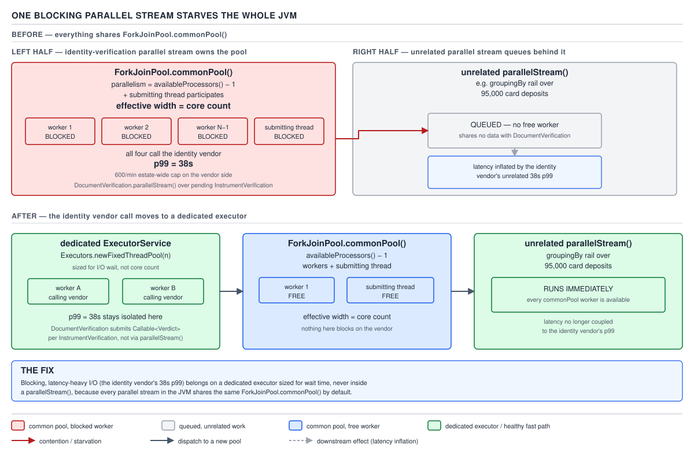
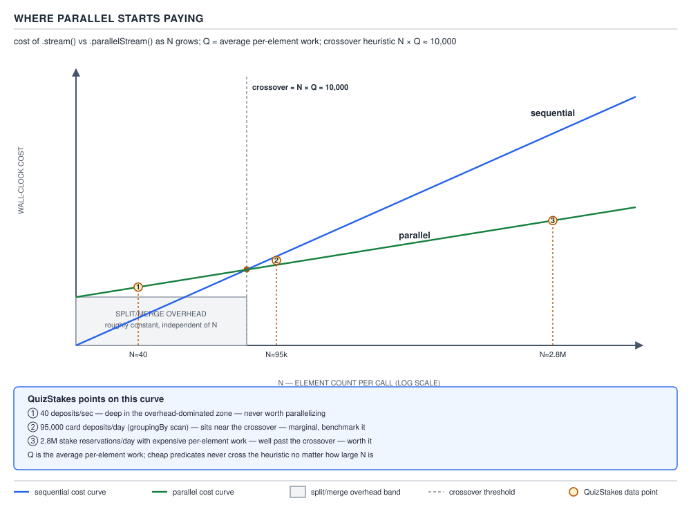

# 04 Modern Java — Streams — INTERMEDIATE (§2.4)

**Target version: Java 21 LTS.** | **Part 2 of 5** | [Index](../00-index.md)
Previous: [Streams — cost model](06-cost-model.md) · Next: [Streams — internals pipeline](08-internals-pipeline.md)

## Why this file exists

Every other file in this subtopic has been building toward one question: when does
turning a sequential pipeline into a parallel one actually pay for itself, and what
does it cost when you get the answer wrong? The honest answer for a request-serving
backend is "almost never, and getting it wrong is an outage, not a slowdown." This
file earns that answer instead of asserting it: the thread pool underneath
`.parallel()`, the four preconditions that must all hold before parallel is even a
candidate, the arithmetic that tells you whether your N clears the bar, and the two
failure modes — starving the shared pool, and corrupting shared state — that make
parallel streams the single most over-recommended tool in the Stream API.

---

## 1. The mental model: one shared, JVM-wide pool, not a knob per pipeline

### Mental model

Picture a single elevator serving an entire office tower, shared by every tenant on
every floor. `.parallelStream()` does not spin up a private thread pool for your
pipeline — it hands your work to the one elevator the whole JVM shares:
`ForkJoinPool.commonPool()`. If someone on floor 12 wedges the doors open, floor 40
waits too, and floor 40 has no idea floor 12 exists. That is the operating model you
must carry through the rest of this file: **parallel streams are not isolated**.
Every call to `.parallelStream()` or `.parallel()` anywhere in the process — your
code, a dependency's code, `Files.list(...).parallel()` buried three layers down in
a library you didn't write — draws from the same finite pool of worker threads.

### Why it exists

Before `java.util.concurrent.ForkJoinPool` (Java 7, JSR-166y) and before parallel
streams (Java 8), parallelising a divide-and-conquer computation meant hand-rolling
a thread pool, a work queue, and a join protocol, or reaching for `ExecutorService`
with `Future` composition that didn't naturally express "split until small, then
merge." The fork/join framework existed specifically to make recursive
divide-and-conquer cheap to express and — critically — to let idle workers *steal*
work from busy ones instead of sitting idle. Parallel streams are a thin,
declarative façade over exactly that framework: call `.parallel()` and the pipeline
becomes a tree of `ForkJoinTask`s over the source's `Spliterator`, submitted to
`commonPool()` by default.

### When to reach for it, and when not

Reach for `.parallelStream()` only when you have measured — not guessed — that a
CPU-bound, in-memory, side-effect-free computation over a large, cheaply-splittable
source is slow enough sequentially to matter, and you have verified nothing else in
the JVM depends on the common pool being responsive at the same time. In every other
case — I/O of any kind, a small collection, a shared mutable sink, a server request
thread — the sibling that wins is a dedicated `ExecutorService` you size, name, and
monitor yourself (§2.4.16 makes this the closing argument of the whole file).

### How it works: `.parallel()` builds a fork/join task tree over the source `Spliterator`

**[2.4.1]** Calling `.parallel()` (or obtaining the stream via `.parallelStream()`)
does not eagerly do anything — streams are lazy end to end, as established in
`06-cost-model.md`. It sets a boolean flag on the pipeline. When a terminal operation
finally runs, `AbstractPipeline.evaluate(TerminalOp)` checks that flag and, if set,
routes execution through `AbstractTask` — the internal `ForkJoinTask` subclass that
implements the split/compute/combine protocol — instead of the single-threaded
`copyInto` walk. Concretely:

1. The terminal op asks the source `Spliterator` "can you split?" (`trySplit()`).
2. If yes, the task forks into two `AbstractTask` subtasks, each holding one half of
   the spliterator, and (depending on the operation) recursively repeats step 1 on
   each half.
3. Splitting stops once a half's estimated size drops at or below a computed
   threshold (`AbstractTask.suggestTargetSize` — walked in full below), or the
   spliterator refuses to split further.
4. Each leaf task runs the pipeline's `wrapAndCopyInto` sequentially over its slice.
5. Leaf results are combined pairwise back up the tree — for a terminal op like
   `collect`, via the collector's `combiner`; for `forEach`, there is no combine step
   because there is no result to merge, only side effects, which is precisely what
   makes `forEach` the leaf that developers reach for and misuse (§2.4.11).

The task tree, the splitting, and the leaf-level sequential execution are *all* Fork/
Join mechanics — parallel streams add no new concurrency primitive of their own; they
are `Spliterator` plus `ForkJoinTask` plus a `Sink` chain.

**Insight:** because the entire mechanism is "split the source, run each half
independently, combine," everything downstream of this section — the common pool's
width, the splitting quality of your source, the cost of merging — is really a
question about the shape of the *tree*: how wide it gets, how even the leaves are,
and how expensive the internal nodes (merges) are. Every failure mode in this file
is one of those three questions answered badly.

**A minimal concrete example.** Reserving stakes is the domain's highest-volume
operation — 2.8M/day, 1,200/sec peak (Appendix A). Converting the day's flat list of
already-computed stake amounts into a `parallelStream()` sum triggers exactly the
above sequence:

```java
public BigDecimal totalStakedToday(List<Money> stakeAmounts) {
    return stakeAmounts.parallelStream()
        .map(Money::amount)
        .reduce(BigDecimal.ZERO, BigDecimal::add);
}
```

`stakeAmounts` here is an `ArrayList<Money>` — a `SIZED`, `SUBSIZED`, array-backed
source with an excellent `trySplit()` (§2.4.8). `.parallel()` on this call chain
walks the five steps above: the `ArrayList` spliterator splits in half repeatedly
down to leaf chunks, each leaf sums its slice sequentially, and `BigDecimal::add`
combines the partial sums back up the tree. This is close to the shape parallel
streams were designed for — large N, a splittable source, an associative combiner,
no shared mutable state — and it is revisited under the N×Q heuristic in §2.4.7 to
show precisely how large "large" needs to be.

### The gotcha

The task tree exists whether or not the source splits well. A poorly-splittable
source (§2.4.8) still builds an `AbstractTask` tree — it just degenerates into one
long chain of one-sided splits, paying all the fork/join bookkeeping overhead for
none of the parallelism benefit. `.parallel()` never fails loudly when this happens;
it just quietly runs no faster, or slower, than the sequential version, which is why
this whole file leans so hard on measurement (§2.4.15) rather than intuition.

> **Definition:** a parallel stream is a `Spliterator`-driven fork/join task tree —
> not a separate execution engine — that splits the source recursively, runs each
> leaf sequentially, and merges leaf results back up the tree.

---

## 2. The shared common pool and its true effective width

### Mental model

Think of `ForkJoinPool.commonPool()` as a single shared taxi rank outside the
building, not a private car per tenant. Every parallel stream in the JVM queues for
the same rank. The number of taxis at that rank is fixed at JVM startup and does not
grow to meet demand — it is not an elastic thread pool like a typical
`ExecutorService` with an unbounded queue.

### Why it exists

A dedicated pool per parallel stream call site would defeat the purpose of a
lightweight, declarative `.parallel()` — you'd be back to manually sizing and
managing thread pools, which is exactly the ceremony fork/join and parallel streams
exist to remove for the common case. So the JDK ships one pool, lazily created on
first use, shared by every parallel stream, every `CompletableFuture.supplyAsync`
call that doesn't specify an executor, and every direct `ForkJoinTask` submission
that doesn't specify a pool.

### When to reach for it, and when not

You do not "reach for" the common pool explicitly — it is the default the moment you
call `.parallelStream()` without further action. The decision that matters is the
opposite one: recognizing when the default is wrong for your workload (answered
definitively in §2.4.16) and routing around it (§2.4.4).

### How it works, and the arithmetic behind its width

**[2.4.2]** `ForkJoinPool.commonPool()`'s default parallelism is
`Runtime.getRuntime().availableProcessors() - 1`. **[NUM]** On this file's reference
8-core box: `availableProcessors()` = 8, so `commonPool().getParallelism()` = 8 − 1 =
**7**. `[PROVE]` The `-1` is not a safety margin or a rounding artifact — it exists
because the thread that *submits* a task to the common pool participates in running
it. When a terminal operation on the main thread invokes the fork/join evaluation,
that calling thread does not block idly waiting for 7 workers to finish; it helps
compute, via `ForkJoinPool.managedBlock`-style participation for the calling thread
inside `invoke`. So the pool is deliberately sized one thread lighter, because the
"eighth worker" is always present in the form of whichever thread called the
terminal operation.

**This is why the effective parallel width must always be stated in both halves, not
one:** `commonPool().getParallelism()` reports 7, but the number of threads actually
crunching your data during a `.parallelStream()` call is `7 + 1 = 8` — the pool's 7
workers *plus* the calling thread. Quoting only "7" understates the real
concurrency; quoting only "8" hides where the number comes from. On the reference
box: **7 pool workers + 1 submitting thread = effective width 8**, exactly equal to
`availableProcessors()`.


**D-099** — One blocking parallel stream starves the whole JVM

The diagram is introduced here because it depends on this exact arithmetic: the left
panel shows the common pool with its 7 workers plus the submitting thread — both
halves labelled — all 8 blocked simultaneously on one slow call, with the effective
width equal to the core count made explicit. The right panel and the fix are walked
in §2.4.5 and §2.4.16 once the failure mode itself has been built up.

**A minimal concrete example — measuring the real width.**

```java
public int measureEffectiveCommonPoolWidth() {
    Set<String> distinctThreadNames = ConcurrentHashMap.newKeySet();
    IntStream.range(0, 10_000)
        .parallel()
        .forEach(i -> distinctThreadNames.add(Thread.currentThread().getName()));
    return distinctThreadNames.size();
}
```

On the reference 8-core box this returns 8 — `ForkJoinPool.commonPool-worker-1`
through `-7` plus `main` (or whatever thread invoked `forEach`), never 7. Running
this from inside a servlet request thread instead of `main` still shows the request
thread's name among the 8, confirming participation is universal, not a `main`-
thread special case.

### The gotcha

`getParallelism()` on `commonPool()` will report **7** on the reference box, and a
developer who reads only that number and assumes "7 threads doing my work" will
under-count by one thread every time and mis-attribute where the eighth unit of
concurrency comes from when profiling.

> **Definition:** the common pool's parallelism field is `availableProcessors() - 1`
> because the submitting thread is the pool's honorary extra worker, so the true
> concurrency available to a parallel stream is `availableProcessors() - 1` pool
> threads plus 1 submitting thread — numerically equal to `availableProcessors()`.

### Supporting fact — the only supported tuning knob, and its process-wide blast radius

**[2.4.3]** `[RESEARCH]` `[NUM]` The common pool's parallelism can be overridden with
the system property `-Djava.util.concurrent.ForkJoinPool.common.parallelism=N`,
read once at JVM startup when `ForkJoinPool` is first classloaded and the static
`commonPool` field is initialized — there is no supported runtime API to resize it
afterward. This is the *only* documented, supported knob for the common pool
(per the `ForkJoinPool` javadoc's description of `commonPool()`); everything else
about its construction is internal. **Setting it is process-global**: it changes the
pool that every parallel stream, every default-executor `CompletableFuture`, and
every third-party library that piggybacks on `commonPool()` will use, for the
lifetime of the JVM. Setting `-Djava.util.concurrent.ForkJoinPool.common.parallelism=1`
to fix one hot loop's contention will just as surely starve an unrelated
library's parallel stream elsewhere in the same process, because there is exactly
one common pool per JVM, not one per call site or per classloader.

**Pitfall:** raising the common pool's parallelism to "get more speed" out of one
parallel stream call site is treating a shared, JVM-wide resource as if it were
private. Wrong: `-Djava.util.concurrent.ForkJoinPool.common.parallelism=64` on an
8-core box, reasoning "more threads, more throughput" for one batch job. Right:
either give that batch job its own bounded pool (§2.4.4) sized to the box's actual
core count, or accept the default and reduce per-element work instead. **Why people
believe it:** the property name and the mental model of "more threads = more
throughput" both suggest a per-task dial, when it is in fact a single global
setting read once at startup.

---

## 3. Routing around the common pool: submitting into your own `ForkJoinPool`

### Mental model

If the shared taxi rank is unreliable, you can charter a private car — but the
`Stream` API gives you no official "use this pool" parameter. The trick that exists
in the wild works only because of an accident of how `ForkJoinTask.fork()` decides
which pool to join, not because the Streams API was designed to support it.

### Why it exists

Nobody designed this — it is emergent behavior that the community discovered and
now widely relies on, which is exactly why it needs a mechanism-level explanation
rather than a cookbook recipe.

### When to reach for it, and when not

Reach for it only as a stopgap when you must keep `.parallelStream()` syntax but
cannot risk sharing the common pool — for example, isolating a batch job's
parallel stream from request-serving code during a migration. Do not reach for it
as a long-term architecture: §2.4.16 makes the stronger case that an
`ExecutorService` you construct and submit `Callable`s to directly is the
correct end state, because it gives you a documented API contract instead of an
implementation detail you are depending on.

### How it works

**[2.4.4]** `[TRAP]` `[RESEARCH]` `[PROVE]` The trick:

```java
ForkJoinPool dedicatedPool = new ForkJoinPool(4);
try {
    List<BigDecimal> totals = dedicatedPool.submit(() ->
        stakeAmounts.parallelStream()
            .map(Money::amount)
            .collect(Collectors.toList())
    ).get();
} finally {
    dedicatedPool.shutdown();
}
```

Why this works: `ForkJoinTask.fork()` — the method that submits a subtask for
asynchronous execution — schedules the task onto the pool of the *currently running
worker thread*, obtained via `ForkJoinTask.getPool()` / the invoking
`ForkJoinWorkerThread`'s own pool reference, not onto `ForkJoinPool.commonPool()`
unconditionally. When the lambda passed to `dedicatedPool.submit(...)` runs, it runs
*on a worker thread belonging to `dedicatedPool`*. When that lambda then invokes the
parallel stream's terminal operation, the fork/join machinery underneath
`AbstractTask` calls `fork()` from inside that worker thread, and `fork()` resolves
"which pool do I belong to" by asking the current thread, which answers
"`dedicatedPool`." The stream was never told about `dedicatedPool` by any
`Stream`-level API — no `parallelStream(Executor)` overload exists. It works purely
because `ForkJoinTask`'s pool resolution is thread-local, and the earlier verified
source excerpt for `AbstractTask.getLeafTarget()` demonstrates the identical
mechanism for a different constant: `getLeafTarget()` checks
`Thread.currentThread() instanceof ForkJoinWorkerThread` and, if true, reads
`((ForkJoinWorkerThread) t).getPool().getParallelism()` — the *current* pool's
parallelism, not the common pool's. This is the same "ambient pool" pattern that
makes the custom-pool trick work: the decomposition width and the execution pool
both silently follow whichever `ForkJoinPool` the calling thread happens to belong
to.

**[TRAP]:** nothing in the `Stream`, `Collectors`, or `ForkJoinPool` javadoc
documents this as supported behavior. It has held across JDK 8 through 21 because
the internal implementation hasn't changed the relevant resolution logic, but it is
explicitly *not* part of the API contract, and an OpenJDK release note could change
it without being considered a breaking change to any documented interface. Treat
code that relies on it as a load-bearing implementation detail, and say so in a
comment at the call site.

**Pitfall:** assuming this pattern is officially supported because it "just works"
and appears in many blog posts and Stack Overflow answers. Wrong belief: "the
Streams API lets you pick your executor via this pattern." Symptom: a future JDK
release (hypothetically) changes `fork()`'s pool-resolution strategy and every
parallel stream silently reverts to the common pool, with no compiler warning and
no deprecation notice, because nothing was ever declared deprecated — it was never
declared *supported*. Right: if pool isolation genuinely matters, submit
`Callable`s directly to your own `ExecutorService` (which is not fork/join at all)
and avoid `parallelStream()` entirely for that code path — see §2.4.16.

### The gotcha

`dedicatedPool.submit(...).get()` blocks the calling thread waiting on the
`Future`, and if `dedicatedPool` itself is undersized or backed up, you have just
built a second bottleneck with none of the common pool's ubiquity to make the
problem visible in stack traces from unrelated code — it will look like *your*
code is slow, which is at least easier to debug than the common-pool-starvation
case in §2.4.5, but is still a hand-rolled pool you now must size, monitor, and
shut down correctly.

> **Definition:** submitting a parallel stream's terminal operation from inside a
> task already running on a custom `ForkJoinPool` causes that stream's internal
> `fork()` calls to resolve to the custom pool, because pool resolution is a
> property of the calling thread, not a documented parameter of the Stream API.

---

## 4. Blocking I/O inside a parallel stream: starving the entire JVM

### Mental model

Return to the shared taxi rank: if one passenger's taxi gets stuck in traffic for
38 seconds, and there are only 7 taxis plus the dispatcher filling in as an eighth,
every other passenger in the *entire building* — not just your floor — queues
behind that one stuck taxi. There is no separate rank for "my department's rides."

### Why it exists as a failure mode

Fork/join pools are designed and tuned for CPU-bound, non-blocking divide-and-
conquer work. Nothing prevents you from putting a blocking call inside a lambda
passed to a parallel stream — the type system has no way to forbid it — but doing
so violates the pool's entire operating assumption: that a worker thread, once
running, keeps running until its slice of work is computed, freeing itself (or a
work-stealing peer) quickly.

### When this bites, and what wins instead

This bites the moment any parallel stream anywhere in the process calls out to a
slow external dependency — a database, an HTTP call, a compliance vendor — from
inside `.map()`, `.forEach()`, or a collector's accumulator. The sibling that wins
whenever I/O is involved is a virtual-thread-per-task executor (`Executors
.newVirtualThreadPerTaskExecutor()`) or a bounded platform-thread pool sized for
I/O concurrency — never `.parallelStream()`, because virtual threads and
platform-thread executors do not share the fork/join common pool's global identity.

### How it works — the QuizStakes identity-vendor case, worked through

**[2.4.5]** `[TRAP]` QuizStakes' identity verification vendor has a p50 of 900ms and
a **p99 of 38 seconds** (Appendix A). Suppose a batch reconciliation job verifies a
page of pending `DocumentVerification` records like this:

```java
public List<DocumentVerdict> reverifyPendingDocuments(List<PersonId> pending) {
    return pending.parallelStream()
        .map(this::callIdentityVendorBlocking)   // synchronous HTTP call, p99 38s
        .toList();
}
```

Walk the mechanism from §1: the source list splits across the common pool's 7
workers plus the submitting thread — 8 leaf tasks in flight. If even one
`PersonId` in that page happens to hit the vendor's p99, the worker thread executing
that leaf blocks inside `callIdentityVendorBlocking` for up to 38 seconds. A blocked
`ForkJoinWorkerThread` does not return to the pool to pick up other work — it is
occupied for the full duration of the blocking call, because ordinary blocking I/O
gives no signal to the fork/join work-stealing scheduler the way `ForkJoinPool
.ManagedBlocker` would. With 8 total participants and even one stuck for 38 seconds,
up to 1/8 of the JVM's entire shared parallel-execution capacity is gone for that
whole window — and if two `PersonId`s in the page both hit the p99 tail
simultaneously (not implausible at the identity vendor's own **600/min estate-wide
cap**, which implies many concurrent in-flight calls), 2/8 of the capacity is gone.
Push it further: if the batch job happens to schedule several pages back-to-back and
each contributes one slow leaf, it is realistic for **all 8** participants to be
blocked on the vendor simultaneously, at which point the common pool is completely
saturated — not just for this batch job, but for every other parallel stream and
every default-executor `CompletableFuture` anywhere else in the same JVM process.


**D-099** — One blocking parallel stream starves the whole JVM

Read the right-hand panel now with the arithmetic above in hand: a completely
unrelated library — say, a JSON-processing utility that happens to call
`.parallelStream()` internally for a large payload — submits its work to the same
`commonPool()` and queues behind the 8 already-blocked workers. Its latency
inflates by however long the identity vendor's blocking calls take to resolve, and
nothing in that library's stack trace mentions `DocumentVerification` at all — the
two code paths share no call relationship except the pool. The third panel is the
fix, expanded fully in §2.4.16: a dedicated, named `ExecutorService` (or virtual
threads, since this is I/O-bound) that the reconciliation job owns exclusively, so
its blocking calls cannot borrow capacity from — or steal capacity from — anything
else in the process.

**Pitfall:** believing "it's just I/O in a lambda, the compiler didn't complain, it
must be fine." Wrong: `pending.parallelStream().map(this::callIdentityVendorBlocking)
.toList()` in production, where a single slow vendor call degrades an unrelated
endpoint's p99 with no obvious causal link in monitoring. Right: never call blocking
I/O from inside a parallel stream operation; if the work is I/O-bound, it does not
belong in a `ForkJoinPool`-backed pipeline at all — use a virtual-thread executor and
`Future`/`CompletableFuture` composition instead. **Why people believe it:** the
Streams API places no restriction on what a lambda may do, and the failure is silent
and remote — it shows up as *someone else's* latency spike, not an exception at the
call site, so the causal link is rarely made without deliberately looking for it.

### The gotcha

The 38-second p99 is rare by definition — most calls will complete in under a
second — which makes this bug pass code review, pass a light load test, and pass
weeks of production traffic before a tail-latency incident on an *unrelated* service
finally traces back to a batch job's parallel stream. Tail latencies are exactly the
case average-case testing misses.

> **Definition:** any blocking call inside a parallel stream operation occupies one
> of the common pool's fixed 8 (on this box) participants for the full duration of
> the block, and because the common pool is JVM-global, that occupation degrades
> every other parallel stream and default-executor `CompletableFuture` in the
> process, not just the call site that caused it.

---

## 5. The four preconditions for parallel to pay off

### Mental model

Parallel execution is a trade: you spend fixed overhead — splitting the source,
scheduling tasks, merging results — to buy concurrent execution of the actual work.
That trade is only profitable when all four legs of a table hold simultaneously; a
table missing one leg falls over regardless of how strong the other three are.

### Why this is stated as a conjunction, not a checklist

A common misreading treats these as independent "nice to haves" — more of them is
better. They are not independent: they are a conjunction. A huge N with an
unsplittable source (`Stream.iterate`) gets none of the benefit despite satisfying
the size precondition, because splitting quality is a hard gate, not a bonus.

### When to reach for parallel, and when the sibling (sequential, or an owned
executor) wins

Reach for `.parallelStream()` only when you can affirmatively answer yes to all
four below. If even one is false, the sequential stream or a purpose-built executor
wins — not as a fallback, but as the objectively better choice, because the
overhead that parallel execution pays up front is not conditional on the benefit
materializing.

### How it works — the four preconditions

**[2.4.6]** The four preconditions:

1. **Large N.** Enough elements that the per-split, per-merge fixed overhead is a
   small fraction of total work. Quantified precisely in §2.4.7's N×Q heuristic.
2. **Expensive per-element work (Q).** If each element's transformation is cheap
   (an unboxing, a null check, a single field read), the fork/join bookkeeping
   dominates regardless of N — this is why N alone is never sufficient, and why the
   heuristic in §2.4.7 is N *times* Q, not N alone.
3. **A cheaply splittable, `SIZED`/`SUBSIZED` source.** The `Spliterator` must be
   able to divide itself into balanced halves in roughly constant or logarithmic
   time, and must know its size up front so the framework can decide when to stop
   splitting. §2.4.8 ranks common sources by exactly this property.
4. **No shared mutable state.** Every leaf task must be able to run to completion
   without coordinating with any other leaf — no shared counter, no shared
   collection being mutated in place, nothing that requires a lock or produces a
   race. §2.4.11 and §2.4.12 are this precondition worked through in both its failure
   mode and its safe form.

### A minimal concrete example — checking all four against a real QuizStakes case

Take the total-staked-today example from §1 and run it through the checklist:

```java
public BigDecimal totalStakedToday(List<Money> stakeAmounts) {
    return stakeAmounts.parallelStream()          // ArrayList source
        .map(Money::amount)                        // cheap per-element work
        .reduce(BigDecimal.ZERO, BigDecimal::add);  // associative, no shared state
}
```

- **Large N?** Depends entirely on how many stakes are in `stakeAmounts` — a full
  day's 2.8M reservations clears this easily; a single operator's shift total of a
  few hundred does not. This is exactly why the precondition is stated as "large N,"
  not "any N" — the same code is either well-chosen or poorly-chosen depending
  purely on the caller's slice of data, which is the point §2.4.7 quantifies.
- **Expensive per-element work?** `Money::amount` is a field read — essentially
  free. `BigDecimal::add` on a two-scale-2 decimal is cheap. This example is
  **weak** on precondition 2, which is exactly why the N×Q worked example in §2.4.7
  shows this case landing marginal-to-not-worth-it even at 2.8M elements, and why
  §2.4.16 will still recommend the sequential form for this specific pipeline in a
  server context.
- **Splittable source?** `ArrayList` — excellent (§2.4.8).
- **No shared mutable state?** `reduce` with an associative, stateless combiner —
  clean. No shared state at all.

The example is deliberately chosen to be a near-miss: it satisfies three of the
four preconditions strongly and one weakly, which is far more representative of
real code than a textbook example engineered to satisfy all four cleanly. §2.4.7
finishes this exact example with the actual arithmetic.

### The gotcha

Precondition 2 (expensive per-element work) is the one developers skip checking
most often, because N is easy to eyeball from a log line ("2.8 million rows") while
"is the per-element work expensive" requires actually profiling a single iteration.
A huge N of cheap work is the single most common way a parallel stream is added and
then measured to be no faster, or slower, than the sequential version it replaced.

> **Definition:** parallel execution pays for itself only when large N, expensive
> per-element work, a cheaply and evenly splittable sized source, and freedom from
> shared mutable state all hold at once — any one absent and the fixed cost of
> splitting and merging is not recovered.

---

## 6. The N×Q heuristic: quantifying "large enough"

### Mental model

Every parallel decomposition pays a toll booth on the way in (splitting) and
another on the way out (merging). The heuristic answers: how much total work has to
pass through those toll booths before the tolls become negligible relative to the
work itself?

### Why it exists

"Large N" and "expensive per-element work" from §2.4.6 are qualitative. Engineers
need a number to check against before writing `.parallel()`, not a vibe.

### When to reach for it

Use this heuristic as a back-of-envelope gate *before* writing a parallel stream,
and always confirm with a real JMH benchmark (§2.4.15) afterward — the heuristic
tells you whether it's worth benchmarking at all, not a substitute for benchmarking.

### How it works — the arithmetic

**[2.4.7]** `[NUM]` `[RESEARCH]` The commonly cited rule of thumb — repeated across
JDK performance talks and the `Stream` parallelism guidance in circulation since
Java 8 — is that a pipeline needs roughly **N × Q ≈ 10,000** "units of work" before
the split/merge overhead is reliably repaid, where N is the element count and Q is
a normalized cost-per-element (roughly, "how many nanoseconds of work per element,
relative to a cheap baseline operation"). This figure is a widely-repeated
engineering heuristic, not a JLS/JVMS guarantee or a documented JDK constant —
**`[RESEARCH]`: no such literal constant exists in the `java.util.stream` or
`java.util.concurrent` source; this is a benchmarking-derived rule of thumb from
Doug Lea's and Brian Goetz's public talks on the Streams design, and it should be
treated as a starting estimate to verify per-workload, not a spec value.** Say this
plainly rather than presenting 10,000 as an authoritative cutoff.

Applying it to the two extremes named in this file's brief:

- **40 deposits/sec.** Even accumulated over a full day, that's roughly 40 × 86,400
  ≈ 3.456M events/day — large N — but "deposits/sec" is a *rate*, not a batch size a
  single pipeline processes at once; a realistic per-call batch (say, a one-minute
  reconciliation window) is 40 × 60 = **2,400 elements**. At Q ≈ 1 (a cheap
  arithmetic combine, matching the `totalStakedToday` example from §5), N × Q =
  2,400 × 1 = **2,400** — well under 10,000. **Not worth parallelizing.**
- **2.8M reservations/day, expensive per-element work.** Even restricting to a
  single peak-second batch of 1,200 reservations/sec (Appendix A) with genuinely
  expensive per-element work — say, evaluating `LimitSet` checks and building a
  `StakeSplit` bonus/cash breakdown per reservation, call it Q ≈ 20 (twenty times
  the cost of a bare arithmetic add) — N × Q = 1,200 × 20 = **24,000**, comfortably
  clearing 10,000. **Worth parallelizing**, provided the source is a `SIZED` list of
  already-materialized reservation records (satisfying precondition 3 from §2.4.6)
  and the per-element work touches no shared state (precondition 4).
- **95k deposits/day** run as one end-of-day batch job (not the 40/sec real-time
  rate): N = 95,000, and if Q is a moderate per-element cost (say Q ≈ 3 for
  building a `Movement` record and validating a status transition), N × Q =
  95,000 × 3 = **285,000** — clears 10,000 by a wide margin, landing this case
  solidly in "worth it," in contrast to the earlier 40/sec real-time window.

The `totalStakedToday` example from §5, revisited: N = 2,800,000, but Q is very low
(a `BigDecimal` field read and add, Q ≈ 1). N × Q = 2,800,000 × 1 = 2,800,000, which
by the raw heuristic number looks like it clears 10,000 easily — but this is exactly
where the heuristic's limits show: 10,000 is a *floor*, not a guarantee, and for
work this cheap per element, the fork/join overhead-to-work ratio is dominated by
memory bandwidth and combiner-merge cost (§2.4.10), not CPU cycles, so the
heuristic under-predicts how marginal this case actually is in practice. This is
why §2.4.15 insists on measuring rather than trusting the arithmetic alone —
the heuristic is directionally useful, especially for ruling cases *out*
(the 40/sec case is unambiguous), but a borderline "clears the number" result still
needs a JMH benchmark before being trusted.


**D-102** — Where parallel starts paying

The diagram plots the sequential and parallel cost curves over N, with the
split/merge overhead drawn as a constant band added to the parallel curve, the
crossover marked at the N×Q ≈ 10,000 heuristic, and the three QuizStakes points from
above plotted on it: 40 deposits/sec (well left of the crossover, never worth it),
95k deposits/day as a batch (comfortably right of the crossover, worth it), and
2.8M reservations/day with expensive per-element work (furthest right, most clearly
worth it).

### The gotcha

Q is almost never measured up front — it requires profiling a single sequential
iteration first, which most people skip precisely because they're trying to make
things faster and profiling feels like the slow path. Skipping it means guessing
at whether the "expensive per-element work" precondition from §2.4.6 actually
holds, which is the single most common reason parallel streams get added and
measured to make no difference.

> **Definition:** the N×Q heuristic estimates that roughly 10,000 total units of
> per-element work — element count times relative cost per element — must be
> present before a parallel stream's split/merge overhead is reliably repaid; it is
> an engineering rule of thumb to verify with a real benchmark, not a JDK-specified
> constant.

---

## 7. Source splitting quality: not all sources parallelize equally

### Mental model

`trySplit()` is the difference between cutting a loaf of bread down the middle with
one clean stroke, versus trying to divide a bowl of soup — some things split
instantly into two even halves; others cannot be divided without first walking
through them, and by the time you've walked through them, you've done all the work
splitting was supposed to avoid.

### Why it exists

The fork/join decomposition in §1 assumes `trySplit()` is cheap and produces
roughly balanced halves. That assumption is a property of the *source's*
`Spliterator` implementation, not of the Streams API — and different collection
types satisfy it to wildly different degrees.

### When to reach for a good source, and when the sibling — restructure the data
first — wins

If your pipeline's source is one of the poor splitters below and the computation
genuinely justifies parallelizing (clears §2.4.7's bar), the better move is often to
materialize into an `ArrayList` or an array first — paying a one-time O(n) copy —
rather than parallelizing over the poor source directly and getting effectively
sequential execution with fork/join overhead layered on top for free.

### How it works — the ranking

**[2.4.8]** `[NUM]` `[X-REF 02]`

| Source | `trySplit` characteristics | Balance of halves | Verdict |
|---|---|---|---|
| `int[]` | Index-range split — `trySplit()` computes a midpoint and returns two `IntStream.of`-style range spliterators in O(1); no traversal needed to split | Perfectly even | Excellent |
| `ArrayList` | Backed by `Object[]`; `SIZED` and `SUBSIZED` with a known length, splits by index range in O(1) | Perfectly even | Excellent |
| `IntStream.range(a, b)` | Not a collection at all — a virtual, `SIZED`/`SUBSIZED` range spliterator; splitting is pure arithmetic on the bounds | Perfectly even | Excellent |
| `HashMap` | `SIZED` via the map's `size()`, splits by dividing its internal bucket-array range, but bucket occupancy is uneven — some table segments hold far more entries than others depending on hash distribution | Good but uneven | Good but uneven |
| `HashSet` | Backed by a `HashMap`; same bucket-array-range splitting, same uneven-occupancy caveat | Good but uneven | Good but uneven |
| `TreeMap` | `SIZED`, splits the red-black tree by descending into subtrees, but subtree sizes depend on tree shape and are not guaranteed balanced at the split points chosen | Good but uneven | Good but uneven |
| `LinkedList` | Not `SUBSIZED` in a way that helps — the spliterator must walk node-by-node even to estimate a split point, because there is no random access; splitting costs O(n) instead of O(1) | Effectively unbalanced or absent | Effectively serial |
| `Files.lines(path)` | Backed by a `BufferedReader`-driven iterator; line boundaries are only discoverable by reading the file, so `trySplit()` cannot divide without doing most of the sequential work first | No meaningful split | Effectively serial |
| `Stream.iterate(seed, fn)` | Infinite/unbounded generator with no known size and no way to jump ahead without evaluating every prior step — `trySplit()` returns `null` in practice, refusing to split at all | No split occurs | Effectively serial |
| `BufferedReader.lines()` | Same underlying mechanism as `Files.lines` — sequential character-stream reads, no random access, no size estimate | No meaningful split | Effectively serial |

**D-100** — Source splitting quality, ranked

**[X-REF 02]:** the mechanism-level reason `HashMap`'s splitting is uneven — bucket
array layout, treeification of individual buckets after 8 collisions on Java 8+, and
resize-triggered rehashing — is guide 02's territory (Java collections internals);
the summary above is sufficient to answer "why is `HashMap` a worse parallel source
than `ArrayList`" in an interview without needing the full bucket-layout walk.

### A minimal concrete example

```java
// Excellent: ArrayList-backed, SIZED/SUBSIZED, splits by index in O(1)
List<Money> deposits = new ArrayList<>(fetchTodaysCardDeposits());  // 95k/day
BigDecimal total = deposits.parallelStream()
    .map(Money::amount)
    .reduce(BigDecimal.ZERO, BigDecimal::add);

// Effectively serial: Files.lines cannot split without reading the file
try (Stream<String> ledgerAuditLines = Files.lines(Path.of("/var/log/ledger-audit.log"))) {
    long flaggedEntries = ledgerAuditLines
        .parallel()                      // does essentially nothing here
        .filter(line -> line.contains("LedgerImbalanceException"))
        .count();
}
```

The second example is worth naming explicitly because it compiles, runs, and
produces a correct answer — `.parallel()` on a poorly-splittable source is never a
correctness bug, only a performance no-op (or a performance regression once
fork/join bookkeeping is added on top of what is still, functionally, one thread
doing all the reading).

### The gotcha

`Files.lines(...).parallel()` appears frequently in blog posts as an example of
"easy parallel file processing," and it will run without error — the gotcha is
purely that it delivers none of the promised speedup, silently, because the
`BufferedReader`-backed spliterator's `trySplit()` cannot meaningfully divide a
character stream without reading through it.

> **Definition:** a `Spliterator`'s splitting quality — how cheaply and evenly it
> can `trySplit()` — is a property of the source's internal layout, not of the
> Streams API, and ranges from perfectly even O(1) splits (array-backed,
> `SIZED`/`SUBSIZED` sources) down to sources that cannot split without a full
> sequential traversal, which makes `.parallel()` on them a correctness no-op that
> silently delivers no speedup.

---

## 8. Ordering costs: `limit`, `skip`, `findFirst`, `forEachOrdered`

### Mental model

An ordered parallel stream is like several teams digging a tunnel from different
points along its length simultaneously, but still needing to hand the finished
tunnel over in the original left-to-right order — which means someone has to wait
for the leftmost team even if the rightmost team finishes first.

### Why it exists

Streams preserve encounter order by default when the source has one (a `List` is
ordered; a `HashSet` is not). Fork/join naturally produces results out of
completion order — whichever leaf finishes first, finishes first — so any operation
that must respect encounter order has to reassemble the pieces in original order
before it can proceed, which requires the tree of leaf results to be tracked by
position, not just collected as they arrive.

### When these operations are cheap, and when they are not

On a **sequential** stream, or on an **unordered** parallel stream (achieved with
`.unordered()`, or naturally on a `Set`-backed source), `limit`, `skip`,
`findFirst`, and `forEachOrdered` behave close to their natural cost. It is
specifically the combination of **parallel + ordered** that is expensive, because
maintaining order forces cross-task coordination that an unordered pipeline never
needs to pay for.

### How it works

**[2.4.9]** `[NUM]` `limit(n)` on an ordered parallel stream cannot simply take the
first n elements that any leaf produces — it must take the first n elements *in
encounter order*, which means every leaf's output must be correlated back to its
original position before the pipeline can decide which elements are inside the
limit window. `skip(n)` has the symmetric problem: dropping the first n elements
of an ordered stream requires knowing which elements those n are, which again
requires position tracking across leaves. `findFirst()` on an ordered stream must
find the earliest-positioned matching element, not merely *any* matching element
across the leaves — even if a later leaf finishes computing first, it cannot report
its result until every earlier leaf's outcome is known to not contain an earlier
match (`findAny()` has no such requirement and is correspondingly much cheaper on a
parallel stream — it can return the first result from *any* leaf). `forEachOrdered`
is the most explicit case: it exists specifically to force encounter-order
processing on a parallel stream's terminal action, which means the "each carrier
thread just processes its slice independently" model from §1 no longer applies —
results must be threaded back into a single ordered sequence before the consumer
sees them, eliminating most of parallelism's benefit for this specific terminal
operation.

**[NUM]** Concretely: on the 8-participant reference pool, calling
`.parallel().limit(100)` on an ordered source of, say, 2.8M reservations means the
implementation cannot simply let all 8 leaves race — it must determine, for each of
the up to 8 leaf boundaries, which leaf's slice actually contains positions
0 through 99 before it can safely stop dispatching further leaves, and it may need
to discard work already done by leaves that turn out to lie entirely past position
99. This is fork/join overhead spent specifically to preserve a guarantee
(encounter order) that a `.unordered()` call would remove entirely.

### A minimal concrete example

```java
// Ordered, parallel — pays coordination cost to respect encounter order
List<LedgerEntry> firstHundredFlaggedInOrder = ledgerEntries.parallelStream()
    .filter(entry -> entry.position() == Position.SUSPENSE)
    .limit(100)
    .toList();

// Unordered, parallel — no cross-task ordering coordination required
List<LedgerEntry> anyHundredFlagged = ledgerEntries.parallelStream()
    .unordered()
    .filter(entry -> entry.position() == Position.SUSPENSE)
    .limit(100)
    .toList();
```

If the caller genuinely does not need the first hundred `SUSPENSE` entries in
ledger order — for instance, a reconciliation sweep that will sort or group the
results downstream regardless — the `.unordered()` version removes the ordering
tax entirely while still returning a correct set of 100 matching entries.

### The gotcha

`.unordered()` is easy to miss because the code compiles and runs correctly either
way — the *result* is a valid answer in both versions unless the caller specifically
needed encounter order, so the performance cost of the ordered version is invisible
until you specifically benchmark `limit`/`skip`/`findFirst`/`forEachOrdered` with
and without `.unordered()` on a parallel pipeline.

> **Definition:** `limit`, `skip`, `findFirst`, and `forEachOrdered` all require
> cross-task coordination on an ordered parallel stream to respect encounter order,
> because fork/join naturally produces results in completion order, not source
> order — and calling `.unordered()` removes that coordination cost whenever the
> caller does not actually need the guarantee.

---

## 9. Merge cost: the combiner is not free

### Mental model

Splitting a job across 8 workers is only half the ledger — someone still has to
staple all 8 partial results back into one final answer, and stapling a thousand
sheets together one at a time is itself work that scales with the number of
sheets, not a fixed cost.

### Why it exists

Every collector used in a parallel stream needs a `combiner` — a `BinaryOperator`
that merges two partial results from two subtrees into one. That combiner runs
once per internal node of the task tree, not once per element, but its per-call
cost is not necessarily O(1); some combiners are O(n) in the size of the partial
results they're merging, and when they are, the merge phase can dominate total
runtime for exactly the workloads §2.4.7 flagged as marginal.

### When merge cost matters, and when it doesn't

It matters most for collectors whose intermediate container's merge operation
copies data — appending one list's contents into another, concatenating strings.
It matters least for collectors whose combiner is a single arithmetic operation on
scalar accumulators (summing two `long`s, comparing two `Optional`s for a max).

### How it works — `toList()` and `joining()`, worked through

**[2.4.10]** `[PROVE]` `[NUM]` `Collectors.toList()`'s (and the terminal `.toList()`
convenience method's) combiner, when two leaf `ArrayList`s must be merged, is
`addAll` — which copies every element of the smaller list into the larger one,
an O(k) operation where k is the size of the list being appended. Walk the tree
arithmetic on the reference 8-core box's 28-leaf decomposition from the earlier
verified numbers (`suggestTargetSize` = 100,000 over 2,800,000 elements, 28 leaves
of 100,000 each): merging is not one O(2,800,000) step — it is a *binary tree* of
merges, each combining two already-merged halves. At the bottom level, 14 pairs of
100,000-element leaf lists merge into 14 lists of 200,000 (14 × 100,000 copies =
1,400,000 element copies at this level). At the next level, 7 pairs of 200,000-
element lists merge into lists of 400,000 (7 × 200,000 = 1,400,000 copies again).
This pattern repeats at every level of the merge tree — **each level of a
binary-tree merge with an O(k) combiner does the same total amount of copying,
because the total element count being copied at each level is constant regardless
of how many pairs are being merged at that level** — so the total combiner cost
across all `log2(28) ≈ 5` merge levels is on the order of `5 × 2,800,000 =
14,000,000` element copies for a collection that only has 2,800,000 elements in
it. **[PROVE]** This is the concrete reason a "cheap per-element" workload like
`totalStakedToday`'s `.reduce(BigDecimal.ZERO, BigDecimal::add)` from §5 is
weaker under the N×Q heuristic than it first appears: `reduce`'s combiner
(`BigDecimal::add`) is O(1) per merge — no copying, just one addition — which is
far better-behaved than `toList()`'s O(k) `addAll` combiner, but a collector like
`Collectors.toList()` over the same 2.8M elements would add several million extra
element-copy operations purely in the merge phase, a cost invisible if you only
count the "784 leaf computations" done at the leaves.

`Collectors.joining()`'s combiner has the same shape problem: merging two partial
`StringBuilder`s (or the internal accumulator `joining` actually uses) means
appending one's full contents onto the other, again O(k) in the size of the
smaller string, again paid at every level of the merge tree.

**A minimal concrete example — measuring it directly.**

```java
public void compareCombinerCost(List<LedgerEntry> entries) { // ~2.8M entries
    long reduceStart = System.nanoTime();
    BigDecimal totalViaReduce = entries.parallelStream()
        .map(LedgerEntry::amount)
        .reduce(BigDecimal.ZERO, BigDecimal::add);           // O(1) combiner
    long reduceNanos = System.nanoTime() - reduceStart;

    long collectStart = System.nanoTime();
    List<Money> allAmountsViaToList = entries.parallelStream()
        .map(LedgerEntry::amount)
        .toList();                                            // O(k) combiner
    long collectNanos = System.nanoTime() - collectStart;
}
```

(This snippet is illustrative of *what* to compare, not a substitute for a real
JMH benchmark — see the gotcha below and §2.4.15's dedicated treatment of why
`System.nanoTime()` around a cold loop like this is methodologically unsound.)

### The gotcha

The merge cost is completely invisible if you only reason about "how much work
does each leaf do" — it is a cost that exists *between* leaves, in the internal
nodes of the task tree, and the collectors most commonly reached for by habit
(`toList()`, `joining()`) are exactly the ones with the worse-behaved, O(k)
combiners.

> **Definition:** a collector's combiner runs once per internal node of the
> parallel task tree to merge two subtrees' partial results, and when that
> combiner is O(k) in the size of the partial result — as `toList()`'s `addAll`
> and `joining()`'s string concatenation both are — the total merge cost across
> all levels of the tree is on the same order as the element count itself, not a
> negligible constant, and can dominate the runtime of an otherwise well-chosen
> parallel pipeline.

---

## 10. Shared mutable state: `parallelStream().forEach(list::add)` corrupts the list

### Mental model

Eight people writing entries into the same physical ledger book at the same time,
each believing they are the only writer and each reaching for "the next empty
line" without checking whether someone else just claimed it.

### Why this is the single most common parallel-stream bug

`forEach` is the one terminal operation from §1's task-tree walk that has *no
combiner step* — each leaf just runs its action directly, with no merge phase to
funnel results through safely. That absence of a merge step is precisely why it is
so easy to reach for `list::add` as the action: there is no natural place in the
API to be reminded that you are about to touch shared state from multiple threads
simultaneously.

### When forEach with a shared sink is safe, and when it never is

It is never safe to mutate a plain, non-thread-safe collection (`ArrayList`,
`HashMap`, `HashSet`) from inside a parallel `forEach`. It is technically safe to
mutate a genuinely thread-safe target (a `ConcurrentHashMap`, an
`AtomicReferenceArray` indexed by a pre-computed, non-colliding index) — but the
correct tool for "gather results from a parallel stream" is a collector (§2.4.11
just below shows why collectors are safe by construction), not `forEach` with a
manually-chosen concurrent sink, because a collector expresses the intent directly
and cannot be gotten wrong the way a hand-picked concurrent target can still be
subtly misused (for example, a `ConcurrentHashMap` used as a set-like accumulator
where insertion order still matters).

### How it works — the exact race, from inside `ArrayList.add`

**[2.4.11]** `[TRAP]` `[PROVE]` `[X-REF 02]` Consider a batch of ledger entries
being filtered for chargebacks and collected via a shared list:

```java
List<LedgerEntry> chargebackEntries = new ArrayList<>();
ledgerEntries.parallelStream()
    .filter(entry -> entry.position() == Position.CHARGEBACK_LOSS)
    .forEach(chargebackEntries::add);   // BROKEN — do not do this
```

`ArrayList.add(E e)` is not atomic. Its actual body (JDK source, unsynchronized) is
approximately: check `size == elementData.length` and grow if needed
(`ensureCapacity`), write the new element at `elementData[size]`, then increment
`size`. That is at minimum two separate memory operations — a write to the backing
array, then a write to the `size` field — with no memory barrier or lock between
them and no coordination with any other thread doing the same sequence
concurrently. **[X-REF 02]:** the full internal layout of `ArrayList` — the
backing array, the growth factor, `modCount` and fail-fast iteration — is guide
02's territory; this file only needs the two-step, non-atomic `add` sequence to
explain the race.

`[PROVE]` — the three concrete symptoms, walked through:

1. **Lost update.** Thread A and thread B both read `size == 40` before either has
   written. Both compute their target index as 40. Both write their `LedgerEntry`
   to `elementData[40]` — B's write overwrites A's. Both threads then increment
   `size` to 41 (each doing its own read-increment-write, so `size` may even end up
   as 41 instead of the correct 42, or as 42 if the increments interleave
   differently — the exact outcome is non-deterministic). Net effect: one
   `LedgerEntry` is silently missing from the final list, with no exception raised
   at all.
2. **Interspersed `null`s.** Because `size` can be incremented by one thread before
   another thread has finished writing its element into the array slot that
   `size`'s new value now claims exists, a third thread reading the list (or the
   `toString()` at the end of the batch) can observe a slot that has been "counted"
   into `size` but not yet populated, reading back `null` where a `LedgerEntry`
   should be.
3. **`ArrayIndexOutOfBoundsException` from inside `ArrayList.add`.** If two threads
   race on `ensureCapacity` — both observing `size == elementData.length` and
   deciding to grow — one thread's grown array can be overwritten by the other's
   stale, smaller array reference being written back after its own grow completes
   later, or a thread can compute an index against a `size` that a concurrent
   increment has already moved past the actual (still-growing) array's current
   length, producing an `ArrayIndexOutOfBoundsException` thrown from *inside*
   `ArrayList.add` itself — not from application code, which is what makes this
   symptom so disorienting to debug: the exception's stack trace points into JDK
   internals with no obvious connection to "I used the wrong terminal operation."


**D-101** — `parallelStream().forEach(list::add)` corrupts the list

The diagram's three frames are exactly the three symptoms above, staged against
two carrier threads adding ledger entries to one `ArrayList`: frame 1 shows both
threads reading `size` as 40 simultaneously; frame 2 shows both writing to index
40, with one entry lost; frame 3 shows a concurrent grow racing with a write,
producing the `ArrayIndexOutOfBoundsException` from inside `ArrayList.add`, with
the interspersed-null case named alongside it.

**Pitfall:** `parallelStream().forEach(list::add)` looks identical in shape to the
completely safe sequential version, `stream().forEach(list::add)`, and the bug
often does not manifest on small test data because a small N (from §2.4.6's own
precondition) rarely triggers enough concurrent leaf execution to race visibly.
Wrong: adding `.parallel()` to a previously-sequential `forEach(list::add)` "for
performance" without changing the accumulation strategy. Right: use a collector
(`.collect(Collectors.toList())` or `.toList()`), which — as §2.4.12 proves — never
touches shared state at all. **Why people believe it:** `forEach` reads as "do this
action for every element," and `list::add` reads as an innocuous, side-effect-only
action; nothing in the syntax signals that eight threads may be calling it
simultaneously on the same object.

### The gotcha

This bug is nondeterministic — it may not reproduce on every run, may pass in
development where N is small or the machine has few cores, and may only surface
under production load on a larger machine with more common-pool workers available
to race harder. A test suite that never exercises a large-enough N will never catch
it.

> **Definition:** `parallelStream().forEach(sharedCollection::add)` is undefined
> behavior on any non-thread-safe collection, because multiple leaf tasks call the
> mutating method concurrently with no coordination, and `ArrayList.add`'s
> multi-step, non-atomic implementation turns that concurrent access into lost
> elements, interspersed nulls, or an `ArrayIndexOutOfBoundsException` thrown from
> inside the JDK's own collection code.

---

## 11. Why collectors are safe: each leaf gets its own container

### Mental model

Instead of eight people writing into one shared ledger book, give each person
their own notebook, let them each fill theirs independently with zero
coordination, and only at the very end have someone merge the eight notebooks
into one — a step that happens once per pair, not once per entry, and is done by
a single thread at a time per merge (never two threads touching the same
notebook simultaneously).

### Why it exists

Collectors were designed from the start (Java 8, alongside the Streams API
itself) to be the safe alternative to `forEach`-with-shared-sink — the entire
`Collector` interface (`supplier`, `accumulator`, `combiner`, `finisher`) exists
to express "how to build a container, how to add one element to it, how to merge
two containers" as three separate, composable steps precisely so the framework can
run the first two per-leaf, uncoordinated, and only invoke the third at controlled
merge points in the task tree.

### When to reach for a collector over a hand-rolled sink

Always, for accumulating results out of a parallel stream. There is no case where
manually managing a shared mutable target and calling `forEach` is preferable to
letting a `Collector` manage isolation for you — the only decision left is *which*
collector, and §2.4.10 already covered the cost tradeoff between combiner shapes.

### How it works — the mechanism that makes it safe

**[2.4.12]** `[PROVE]` Each leaf task in the fork/join tree, when executing a
`collect(Collector)` terminal operation, calls the collector's `supplier` to create
**its own, private** intermediate container — a leaf never touches any other
leaf's container. Every element the leaf processes is folded into that private
container via the `accumulator`, again with zero cross-leaf coordination, because
the container is not visible to any other thread. Only when two sibling leaves
(or subtrees) finish does the framework invoke the `combiner` — exactly once per
internal node of the task tree, exactly as walked through arithmetically in
§2.4.10 — to merge the two now-complete, no-longer-being-mutated containers into
one. `[PROVE]`: because each leaf's container is created fresh via `supplier` and
never shared with another leaf until *after* that leaf has finished writing to it
(at which point the combiner — not the leaf itself — is the only code touching it,
and the combiner runs single-threaded per merge), there is no window in which two
threads can observe or write the same container concurrently. This is a structural
guarantee from the shape of the algorithm, not a runtime lock: no `synchronized`,
no `AtomicInteger`, no memory barrier is needed anywhere in this path, because
mutual exclusion is achieved by construction — each mutator has sole,
exclusive ownership of its container for the container's entire mutable lifetime.

### A minimal concrete example

```java
// Safe: each leaf gets its own ArrayList via the supplier; combiner merges once
// per internal tree node, never concurrently
List<LedgerEntry> chargebackEntries = ledgerEntries.parallelStream()
    .filter(entry -> entry.position() == Position.CHARGEBACK_LOSS)
    .collect(Collectors.toCollection(ArrayList::new));

// Equivalently, via the three-argument collect form, spelling out the mechanism
List<LedgerEntry> chargebackEntriesExplicit = ledgerEntries.parallelStream()
    .filter(entry -> entry.position() == Position.CHARGEBACK_LOSS)
    .collect(
        ArrayList::new,        // supplier — one fresh list per leaf
        List::add,             // accumulator — safe, because the list is leaf-private
        List::addAll           // combiner — merges two leaf-private lists once, single-threaded
    );
```

The three-argument form makes the safety mechanism visible in the code itself:
`List::add` here is the *exact same method reference* as the broken
`chargebackEntries::add` from §2.4.11 — the method is not what changed. What
changed is that this `add` is being called on a container the collector created
privately for one leaf, never on a container two leaves share.

### The gotcha

The safety is specific to `Collector`-based accumulation, not to `List::add` in
general — copying the three-argument `collect(supplier, accumulator, combiner)`
shape but passing a *shared* instance as the supplier (for example,
`() -> chargebackEntries` capturing an outer variable instead of `ArrayList::new`)
reintroduces the exact race from §2.4.11, because the safety comes from the
supplier producing a fresh, leaf-private container every time it is called, not
from anything about the `Collector` interface itself.

> **Definition:** collectors are safe under parallel execution because each leaf
> task accumulates into its own privately-supplied container with zero cross-leaf
> visibility, and the combiner — the only step that ever sees two containers at
> once — runs once per internal tree node, single-threaded, on containers no
> longer being mutated by anyone else.

---

## 12. `groupingByConcurrent`: when grouping can skip the merge phase entirely

### Mental model

Instead of eight private notebooks merged at the end, give everyone direct write
access to one shared filing cabinet that is internally built to let multiple
people file into different drawers (or even the same drawer) at once without
stepping on each other — no merge step needed, because the cabinet itself handles
concurrent access.

### Why it exists

`Collectors.groupingBy`'s ordinary form produces one `Map` per leaf (via the
supplier/accumulator/combiner shape from §2.4.11) and merges them all together at
the end — for a grouping operation with many distinct keys, that merge means
combining many per-leaf maps' entries for the same keys, which can be expensive.
`groupingByConcurrent` exists to skip that merge phase by accumulating directly
into one shared `ConcurrentMap` from every leaf simultaneously.

### When to reach for it, and when the plain form wins

Reach for `groupingByConcurrent` when grouping a large, `UNORDERED`-eligible
parallel stream by a key with many groups, specifically to avoid the per-leaf-map
merge cost. The plain `groupingBy` still wins when you need the result to be a
specific `Map` implementation that preserves order (a `LinkedHashMap` downstream
collector), or when running sequentially, where there is no merge cost to avoid
in the first place.

### How it works — the three conditions

**[2.4.13]** `[SOURCE]` The `Collectors` javadoc for `groupingByConcurrent`
specifies that, to actually run the accumulation concurrently rather than falling
back to a Java-level merge, three conditions must hold together:

1. **The stream is parallel.** A sequential stream gains nothing from
   `groupingByConcurrent` — there is only one thread, so there is nothing to
   accumulate concurrently, and the concurrent map's synchronization overhead is
   pure cost with no benefit.
2. **The stream is unordered, or ordering has been explicitly relaxed** (via
   `.unordered()`, or the source is naturally unordered). Per the javadoc's
   documented behavior for the `Characteristics.CONCURRENT` collector path:
   `groupingByConcurrent` is only permitted to bypass the merge step — accumulating
   directly into the shared map from multiple threads — when the stream does not
   need to preserve encounter order; an ordered parallel stream forces the
   framework to fall back to the same split-then-merge shape as the plain
   `groupingBy`, defeating the purpose of choosing the concurrent variant at all.
3. **The downstream collector (if one is supplied) does not itself require
   sequential, ordered accumulation** — for example, a downstream `toList()` inside
   the grouping is fine (its own accumulation order doesn't need to match the
   outer stream's encounter order once ordering has been relaxed at the outer
   level), but a downstream collector that specifically depends on receiving
   elements in a particular sequence would be undermined by concurrent,
   arbitrary-order delivery into it.

Quoting the shape of the guarantee rather than paraphrasing it: the
`Collectors.groupingByConcurrent` javadoc states that the operation may be
"executed even if the stream is unordered," which is the specification's way of
saying the *permission* to run concurrently is conditioned on ordering having been
relaxed — the collector's `Characteristics` include `CONCURRENT` and `UNORDERED`,
and the stream framework only takes the concurrent, no-merge path when those
characteristics are actually usable given the stream's own state.

### A minimal concrete example

```java
// Group 95k/day card deposits by rail, concurrently, on an unordered parallel stream
Map<String, List<Money>> depositsByRail = cardDeposits.parallelStream()
    .unordered()
    .collect(Collectors.groupingByConcurrent(
        deposit -> deposit.rail(),               // e.g. "CARD" vs "BANK_TRANSFER"
        Collectors.mapping(Money::amount, Collectors.toList())
    ));
```

Without `.unordered()`, this still compiles and still produces a correct grouping
— but per condition 2 above, the framework may not take the no-merge concurrent
path, silently falling back to the same merge-based cost profile as plain
`groupingBy`, with none of the intended benefit and the added overhead of a
`ConcurrentHashMap` target that no longer needed to be one.

### The gotcha

`groupingByConcurrent` returns a `ConcurrentHashMap` by default, which does not
preserve insertion order and is a different concrete type than plain
`groupingBy`'s default `HashMap` — code that downstream relies on
`instanceof LinkedHashMap` or on iteration order will observe a behavioral
difference purely from swapping which grouping collector was used, independent of
whether the concurrency conditions above were even satisfied.

> **Definition:** `groupingByConcurrent` accumulates directly into one shared
> `ConcurrentMap` from every leaf task, skipping the merge phase entirely, but only
> takes that fast path when the stream is parallel, unordered (or ordering has been
> relaxed), and the downstream collector does not itself require ordered,
> sequential delivery.

---

## 13. Parallel streams inside a request thread, and virtual threads

### Mental model

Virtual threads make it cheap to have thousands of "threads" waiting on I/O, but
they do not multiply the number of physical CPU cores available for computation —
calling into `.parallelStream()` from inside a virtual thread still hands the CPU-
bound work to the same one, JVM-wide, platform-thread-backed common pool this
entire file has been describing.

### Why this matters specifically for Java 21

Virtual threads (finalized in JEP 444, Java 21) are marketed heavily around
"cheap concurrency," and it is an easy — and wrong — inference to extend that to
"cheap parallelism." Virtual threads solve the *blocking I/O* scalability problem
by making blocking cheap (a park/unpark on a virtual thread does not tie up a
platform thread the way it does on a traditional thread-per-request model). They do
nothing to change how many physical cores exist or how many platform threads the
fork/join common pool is sized with.

### When parallel streams and virtual threads combine safely, and when they don't

They combine safely when a virtual thread handling a request needs a *small*,
occasional, CPU-bound parallel computation and the server's overall load does not
create common-pool contention. They combine dangerously the moment many
concurrently-running virtual threads (which, remember, is the entire point of
virtual threads — you can have tens of thousands of them) each try to run a
parallel stream, because all of them funnel into the same 8-participant (on the
reference box) common pool simultaneously, and worse, if any of those parallel
streams contains blocking I/O (§2.4.5's failure mode), a single virtual thread's
mistake can starve every other virtual thread's parallel computation at once —
the exact opposite of the isolation virtual threads are otherwise designed to
provide.

### How it works

**[2.4.14]** `[TRAP]` The virtual-thread scheduler and the fork/join common pool
are two genuinely separate pools, confirmed from the verified source excerpt of
`VirtualThread.createDefaultScheduler()` at the jdk-21+35 tag reproduced in this
file's research packet: the default virtual-thread scheduler is itself constructed
as `new ForkJoinPool(parallelism, factory, handler, asyncMode, 0, maxPoolSize,
minRunnable, pool -> true, 30, SECONDS)`, with `parallelism =
Runtime.getRuntime().availableProcessors()` (= 8 on the reference box, with **no
`-1`** — the virtual-thread scheduler's parallelism formula is distinct from the
common pool's `availableProcessors() - 1`, because there is no "submitting thread
participates" carve-out in this context) and `asyncMode = true`, which the
source's own comment marks `// FIFO`. This is a **different `ForkJoinPool`
instance** from `ForkJoinPool.commonPool()` — carrier threads that run virtual
threads are not the same worker threads as `commonPool()`'s workers. But
`.parallelStream()` called from code running *on* a virtual thread still, by
default, dispatches its fork/join task tree to `commonPool()`, exactly as it would
from a platform thread — parallel streams have no special-cased behavior for
"am I currently running on a virtual thread." So a request-handling virtual thread
that calls `.parallelStream()` is drawing on the **platform-thread-backed common
pool**, competing with every other request's parallel stream and every other
consumer of `commonPool()` in the process, while its own scheduling onto a carrier
thread is a separate, unrelated fork/join pool underneath it.

**Pitfall:** assuming that because virtual threads are cheap and plentiful, calling
`.parallelStream()` from inside one scales the same way virtual-thread-based I/O
does. Wrong: a Spring Boot 3.x handler running on a virtual thread (via
`spring.threads.virtual.enabled=true`) that calls `.parallelStream()` on every
request under the assumption that "virtual threads make everything cheap." Symptom:
under load, thousands of concurrently-executing virtual threads each try to funnel
CPU-bound work through the same 8-participant common pool, and the pool becomes
the actual bottleneck — visible as CPU-bound request latency that does not improve
by adding more virtual threads, because the constraint was never thread creation
cost, it was the shared pool's fixed width. Right: treat `.parallelStream()` calls
from request-handling code with exactly the same suspicion regardless of whether
the request thread is virtual or platform — the common pool's width and global
sharing are unchanged either way, which is precisely why §2.4.16 recommends
avoiding parallel streams in server request paths altogether.

### The gotcha

The virtual-thread scheduler's own `ForkJoinPool` and the Streams common pool
share the *same class* (`ForkJoinPool`) and the same general fork/join mechanics,
which makes it easy to conflate them as "the same pool" when reading code — they
are not. Confirming which pool a given piece of code actually uses requires
tracing the call, not inferring it from "it's all fork/join under the hood
anyway."

> **Definition:** virtual threads and parallel streams solve different problems
> with different, independently-sized `ForkJoinPool` instances — the virtual-thread
> scheduler carries virtual threads onto a fixed number of platform carrier
> threads, while `.parallelStream()` (whether called from a platform or a virtual
> thread) still dispatches to the single, JVM-wide, unrelated `commonPool()` — so
> making request threads virtual does nothing to make parallel streams inside them
> safer or more scalable.

---

## 14. Measuring correctly: JMH, warm-up, and why `System.nanoTime()` around a
    cold loop lies to you

### Mental model

Judging a runner's top speed by timing their very first, still-yawning step out of
bed tells you about waking up, not about running — the JIT compiler needs
"warm-up" iterations for the same reason: the first several calls to a method run
interpreted or on a low optimization tier, not at the steady-state speed the code
will actually run at in production.

### Why it exists

Every claim in this file about parallel-versus-sequential cost, about combiner
overhead, about the N×Q crossover, is only trustworthy if it was actually measured
correctly. A microbenchmark that gets the methodology wrong can — and routinely
does — produce numbers that flatly contradict the mechanism-level reasoning built
up in §§1–13, not because the reasoning is wrong but because the measurement is.

### When to reach for JMH, and when a simpler measurement suffices

Reach for JMH (Java Microbenchmark Harness) for any claim about per-operation cost
at the microsecond-or-below scale — exactly the scale at which JIT warm-up,
dead-code elimination, and constant-folding can silently corrupt a naive
`System.nanoTime()` measurement. A simpler wall-clock measurement is defensible
only for coarse, seconds-or-longer, end-to-end timings where JIT warm-up noise is
a rounding error relative to the total.

### How it works

**[2.4.15]** `[X-REF 06]` `[X-REF 16]` The two specific failure modes a naive
`System.nanoTime()` loop is prone to, both of which JMH is built to guard against:

1. **No warm-up.** The first hundreds to thousands of invocations of a method run
   under the JVM's interpreter or the lowest JIT tier (C1 without profiling data),
   not the fully-optimized C2-compiled steady state the code will actually run at
   under sustained load. Timing a "cold" loop measures interpreter and early-JIT
   overhead, not the algorithm's real cost — and it measures this overhead
   *differently* for the sequential and parallel versions being compared, because
   they warm up different call sites at different rates, which can flip which one
   "wins" the naive benchmark.
2. **Dead-code elimination and constant folding.** If a naive benchmark computes a
   result and never uses it — the classic mistake of calling a method purely to
   time it, discarding the return value — an optimizing JIT is entitled to notice
   the result is unused and delete the entire computation, timing nothing at all
   while still reporting a number. JMH's `Blackhole` exists specifically to consume
   a benchmark's result in a way the JIT cannot optimize away, forcing the
   computation to actually happen every iteration.

`[X-REF 06]`: the deeper mechanism of why C1 versus C2 tiers behave so differently
— tiered compilation thresholds, on-stack replacement, deoptimization — is guide
06's territory (JVM internals); this file only needs "the first N calls are slower
for reasons unrelated to the algorithm" to explain why warm-up iterations are
mandatory. `[X-REF 16]`: the general discipline of writing measurement code that
isolates the thing under test — controlling for GC pauses, pinning to specific
cores, running multiple forked JVMs per benchmark to control for JIT-decision
variance across runs — is guide 16's territory (testing); this file's scope is
specifically "do not trust a hand-rolled timing loop for a stream comparison."

**A minimal concrete example — the correct JMH shape, versus the wrong shape.**

```java
// WRONG — no warm-up, and the result may be optimized away entirely
long start = System.nanoTime();
BigDecimal total = stakeAmounts.parallelStream()
    .map(Money::amount)
    .reduce(BigDecimal.ZERO, BigDecimal::add);
long elapsedNanos = System.nanoTime() - start;   // measures JIT cold-start, mostly

// RIGHT — JMH benchmark method, warm-up handled by the harness, result consumed
// via Blackhole so the JIT cannot eliminate the computation
@Benchmark
@Warmup(iterations = 5, time = 1)
@Measurement(iterations = 5, time = 1)
public void sumStakeAmountsParallel(Blackhole blackhole) {
    BigDecimal total = stakeAmounts.parallelStream()
        .map(Money::amount)
        .reduce(BigDecimal.ZERO, BigDecimal::add);
    blackhole.consume(total);
}
```

### The gotcha

A naive benchmark's wrong numbers are frequently *plausible-looking* — they don't
crash, they don't throw, they produce a number that looks like a duration — which
is exactly what makes them dangerous: nothing about the output signals "this
measurement methodology is unsound," and a developer who trusts it will draw a
confident, wrong conclusion about whether their parallel stream is actually
faster.

> **Definition:** correctly measuring a parallel-versus-sequential stream
> comparison requires a harness like JMH that runs enough warm-up iterations to
> reach steady-state JIT compilation and consumes the result through a mechanism
> (`Blackhole`) the optimizer cannot eliminate — a bare `System.nanoTime()` around
> a cold loop measures JIT warm-up artifacts, not the algorithm.

---

## 15. The default answer in a server application

### Mental model

A server process is an apartment building with many tenants sharing one utility
room. `.parallelStream()`'s default pool is that utility room's one shared circuit
breaker panel — touching it affects every unit in the building, not just yours.
The default, sane answer for almost any tenant's individual appliance is: run your
own circuit, sized for what you actually need, not the shared panel meant for
common-area lighting.

### Why this is the closing argument of the whole file

Every section above has been building toward this: the common pool is shared and
global (§§2, 4), most request-scale workloads fail the N×Q bar (§7), the failure
modes when things go wrong are silent (§10) or process-wide (§4), and even the
"safe" mechanisms (§§11–12) only protect against corruption, not against
contention. None of that changes when the request thread is virtual (§13). The
sum of all of it is a strong, specific recommendation, not a vague "be careful."

### When `.parallelStream()` is still the right call, and when the executor wins

`.parallelStream()` remains defensible for **offline, batch, single-tenant**
computations — a nightly reconciliation job, a one-off data migration, a CLI tool
— where nothing else in the process needs the common pool at the same time, the
computation is CPU-bound (never I/O, per §4), the source splits well (§7), and the
N×Q arithmetic (§6) has actually been checked and confirmed with a real
benchmark (§14). In a server application handling concurrent requests, the
executor-based approach wins essentially always, for reasons this section makes
explicit rather than asserting.

### How it works — the concrete default, and why

**[2.4.16]** `[TRAP]` The default answer for a server application: **do not use
`.parallelStream()`; construct and own an `ExecutorService`** — sized to the
actual hardware and workload (a bounded platform-thread pool for CPU-bound work
sized near `availableProcessors()`, or a virtual-thread-per-task executor for
I/O-bound work), given a **name** (via a custom `ThreadFactory` so its threads are
identifiable in a thread dump — `chargeback-reconciliation-worker-N`, not
`ForkJoinPool.commonPool-worker-N`), and exposed to **monitoring** (queue depth,
active thread count, rejected-task count as metrics your observability stack can
alert on). This is not a vague best practice — it directly addresses every named
failure mode in this file:

- It cannot starve unrelated code, because it is not shared with unrelated code
  (directly answers §4 and, for virtual-thread request handlers, §13).
- Its width is a number *you* chose based on *your* workload's actual
  characteristics, not a JVM-wide default computed from core count minus one that
  has no knowledge of what else is running in the process (directly answers §2
  and §3's fragile workaround).
- It is debuggable: a thread dump under load shows named, attributable threads
  instead of anonymous `commonPool-worker` entries that could belong to any of a
  dozen call sites in the process.
- It is monitorable: `ThreadPoolExecutor` exposes `getActiveCount()`,
  `getQueue().size()`, and similar directly, none of which `ForkJoinPool
  .commonPool()` is designed for an application team to poll and alert on as a
  first-class operational signal.

The reconciliation batch job from §4's identity-vendor example, fixed:

```java
private static final ExecutorService IDENTITY_REVERIFICATION_POOL =
    Executors.newVirtualThreadPerTaskExecutor();   // I/O-bound, per §4/§13

public List<DocumentVerdict> reverifyPendingDocuments(List<PersonId> pending)
        throws InterruptedException {
    List<Future<DocumentVerdict>> futures = pending.stream()
        .map(personId -> IDENTITY_REVERIFICATION_POOL.submit(
            () -> callIdentityVendorBlocking(personId)))
        .toList();
    List<DocumentVerdict> verdicts = new ArrayList<>(futures.size());
    for (Future<DocumentVerdict> future : futures) {
        verdicts.add(future.resultNow());   // resultNow after ensuring completion, or use future.get()
    }
    return verdicts;
}
```

This is deliberately **not** a `.parallelStream()` at all — it is `stream()`
(sequential, cheap, just building the list of submitted tasks) feeding a
dedicated, named virtual-thread executor that owns the blocking calls entirely,
so a 38-second p99 on the identity vendor blocks only the futures waiting on that
one page's own submissions, never the JVM-wide common pool, never an unrelated
library's parallel stream.

**Pitfall:** treating `.parallelStream()` as the default tool for "make this
faster" in server-side code, reached for because it requires only adding
`.parallel()` to existing code with no new class, no new configuration, no new
import beyond what's already there. Wrong: any request-handler or shared-service
code path in a Spring Boot application calling `.parallelStream()` on
request-scoped or shared data. Right: if the computation is genuinely CPU-bound,
large, and cheaply splittable, and it is a batch/offline context, `.parallelStream()`
is fine — precisely and only under those conditions, verified, not assumed; in a
server request path, always reach first for a bounded, named, owned
`ExecutorService`. **Why people believe it:** `.parallelStream()` is one method
call, requires no new infrastructure, and — critically — usually "works" in
development and light load testing, because dev and light load rarely produce the
sustained, concurrent common-pool contention that only shows up under real
production traffic.

### The gotcha

This is the one section in the file where the "gotcha" is organizational, not
technical: the code review objection to `.parallelStream()` in a hot path is easy
to raise and easy to dismiss ("it's just a stream call, what's the harm"), and the
actual harm — degraded p99 on an unrelated endpoint sharing the same JVM — surfaces
in a different team's dashboard, days or weeks later, with no code-level breadcrumb
connecting it back to the `.parallelStream()` call that caused it.

> **Definition:** in a server application, the default answer to "should this be a
> parallel stream" is no — use a dedicated `ExecutorService`, sized, named, and
> monitored for the specific workload — because the common pool that
> `.parallelStream()` silently depends on is a single, JVM-wide, unmonitored,
> unnamed resource shared with every other consumer in the process, and the
> failure modes that follow from sharing it (§4, §13) are process-wide and
> diagnostically invisible at the call site that triggers them.

---

## Pitfalls

### Assuming the common pool's `getParallelism()` is the whole story

**Wrong**

```java
System.out.println(ForkJoinPool.commonPool().getParallelism()); // prints 7 on an 8-core box
// Developer concludes: "only 7 threads are ever doing my parallel stream's work"
```

**Right**

```java
// The submitting thread participates too — effective width is getParallelism() + 1
int effectiveWidth = ForkJoinPool.commonPool().getParallelism() + 1; // 8 on an 8-core box
```

**Why people believe it:** `getParallelism()` is the only number the API surfaces
directly, and nothing about its name signals that it deliberately excludes the
calling thread's own contribution.

### Raising `-Djava.util.concurrent.ForkJoinPool.common.parallelism` to fix one hot call site

**Wrong**

```
-Djava.util.concurrent.ForkJoinPool.common.parallelism=32
# on an 8-core box, to "speed up" one batch job's parallel stream
```

**Right**

```java
// Give the batch job its own bounded, named pool instead
ExecutorService batchPool = Executors.newFixedThreadPool(8,
    Thread.ofPlatform().name("stake-reconciliation-", 0).factory());
```

**Why people believe it:** the property name reads like a per-task tuning knob;
it is in fact a single JVM-wide setting read once at startup.

### Submitting a parallel stream's terminal op into a custom `ForkJoinPool` and treating it as a documented API

**Wrong**

```java
// Comment implies this is a supported "run on my pool" API
myPool.submit(() -> data.parallelStream().map(f).toList()).get();
```

**Right**

```java
// Document it as emergent behavior of ForkJoinTask.fork(), or avoid it —
// submit Callables directly to an ExecutorService instead
List<Result> results = myPool.invokeAll(callables).stream()
    .map(future -> { try { return future.get(); } catch (Exception e) { throw new RuntimeException(e); } })
    .toList();
```

**Why people believe it:** the pattern is widely blogged about with confident,
unqualified syntax, with no caveat that it relies on `fork()`'s pool-resolution
being thread-local rather than a documented Stream API parameter.

### Calling blocking I/O from inside a parallel stream operation

**Wrong**

```java
pending.parallelStream()
    .map(this::callIdentityVendorBlocking)   // p99 38s, blocks a common-pool worker
    .toList();
```

**Right**

```java
List<Future<DocumentVerdict>> futures = pending.stream()
    .map(id -> Executors.newVirtualThreadPerTaskExecutor()
        .submit(() -> callIdentityVendorBlocking(id)))
    .toList();
```

**Why people believe it:** the Streams API places no restriction on lambda
content, and the resulting damage lands on an unrelated code path's latency, not
on an exception at the call site — the causal link is easy to miss without
deliberately looking for it.

### `parallelStream().forEach(list::add)` to gather results

**Wrong**

```java
List<LedgerEntry> results = new ArrayList<>();
ledgerEntries.parallelStream()
    .filter(e -> e.position() == Position.CHARGEBACK_LOSS)
    .forEach(results::add);   // lost elements, nulls, or AIOOBE
```

**Right**

```java
List<LedgerEntry> results = ledgerEntries.parallelStream()
    .filter(e -> e.position() == Position.CHARGEBACK_LOSS)
    .collect(Collectors.toCollection(ArrayList::new));
```

**Why people believe it:** the sequential form of the exact same code is
completely correct, and nothing in the syntax of `forEach(list::add)` signals
that multiple threads will now call it concurrently on the same object.

### Assuming `.parallelStream()` over `Files.lines(...)` parallelizes file reads

**Wrong**

```java
try (Stream<String> lines = Files.lines(Path.of("ledger-audit.log"))) {
    long count = lines.parallel().filter(l -> l.contains("ERROR")).count();
    // runs correctly, delivers no speedup
}
```

**Right**

```java
try (Stream<String> lines = Files.lines(Path.of("ledger-audit.log"))) {
    List<String> materialized = lines.toList();          // pay the O(n) copy once
    long count = materialized.parallelStream()             // now an excellent, ArrayList-backed source
        .filter(l -> l.contains("ERROR")).count();
}
```

**Why people believe it:** `.parallel()` compiles and runs on any stream
regardless of source, with no compiler signal distinguishing an excellent
splitter from an effectively-serial one.

### Assuming virtual threads make `.parallelStream()` scale further

**Wrong**

```java
// Spring Boot 3.x handler on a virtual thread, assuming "virtual threads are cheap"
// extends to "parallel streams inside them are cheap too"
@GetMapping("/reconciliation-summary")
public Summary summary() {
    return ledgerEntries.parallelStream()
        .collect(summarizingCollector());   // every concurrent request funnels into commonPool()
}
```

**Right**

```java
@GetMapping("/reconciliation-summary")
public Summary summary() {
    return ledgerEntries.stream()           // sequential; or route to an owned executor if genuinely needed
        .collect(summarizingCollector());
}
```

**Why people believe it:** virtual threads are marketed around "cheap
concurrency," and the leap from "cheap I/O concurrency" to "cheap CPU
parallelism" is easy to make without tracing which pool `.parallelStream()`
actually uses.

## Cheat sheet

| Fact | Value / rule |
|---|---|
| Common pool default parallelism | `availableProcessors() - 1` |
| Common pool effective width | `availableProcessors() - 1` (workers) + 1 (submitting thread) = `availableProcessors()` |
| Reference 8-core box: pool parallelism / effective width | 7 / 8 |
| Only supported tuning knob | `-Djava.util.concurrent.ForkJoinPool.common.parallelism=N`, JVM-global, read once at startup |
| Custom-pool trick | `myPool.submit(() -> stream.parallelStream()...)` works via `ForkJoinTask.fork()`'s thread-local pool resolution — emergent, undocumented |
| N×Q heuristic | roughly 10,000 total units of work (N × relative cost per element) before split/merge overhead is repaid — a rule of thumb, not a spec constant |
| `LEAF_TARGET` | `commonPool.getParallelism() << 2` = 7 << 2 = 28 on the reference box |
| `suggestTargetSize` | floored integer division of size estimate by `getLeafTarget()`, floored to minimum 1 — not rounded up |
| Excellent splitters | `int[]`, `ArrayList`, `IntStream.range` — O(1), even halves |
| Good-but-uneven splitters | `HashMap`, `HashSet`, `TreeMap` — sized, but bucket/subtree occupancy uneven |
| Effectively serial splitters | `LinkedList`, `Files.lines`, `Stream.iterate`, `BufferedReader.lines` |
| Ordering-expensive ops on parallel streams | `limit`, `skip`, `findFirst`, `forEachOrdered` — force cross-task coordination |
| `toList()` / `joining()` combiner cost | O(k) per merge — total merge cost across the tree is on the order of N, not negligible |
| `parallelStream().forEach(list::add)` | corrupts a non-thread-safe list: lost elements, nulls, or `ArrayIndexOutOfBoundsException` |
| Why collectors are safe | each leaf gets a private container via the `supplier`; the `combiner` merges once per tree node, single-threaded |
| `groupingByConcurrent`'s 3 conditions | stream is parallel; stream is unordered / ordering relaxed; downstream collector doesn't need ordered delivery |
| Virtual-thread scheduler vs. common pool | two separate `ForkJoinPool` instances; `.parallelStream()` still uses `commonPool()` regardless of caller's thread type |
| Correct measurement | JMH with `@Warmup`, `@Measurement`, and `Blackhole.consume(...)` — never `System.nanoTime()` around a cold loop |
| Server default | do not use `.parallelStream()`; own a sized, named, monitored `ExecutorService` |

## Self-test

**Q1.** Why is the common pool's default parallelism `availableProcessors() - 1`
rather than `availableProcessors()`, and what is the resulting *effective* width?

<details><summary>Answer</summary>

Because the thread that submits the terminal operation to the common pool
participates in running the computation itself, rather than blocking idly while
7 dedicated pool workers do all the work. The pool is deliberately sized one
thread lighter to account for that. The effective width — the real number of
threads crunching the data — is therefore `getParallelism()` (7 on an 8-core box)
plus the one submitting thread, equal to `availableProcessors()` (8). Stating only
"7" understates the real concurrency, and stating only "8" hides where the number
comes from; both halves must be given.

</details>

**Q2.** Your team wants to speed up one specific batch job's parallel stream by
raising `-Djava.util.concurrent.ForkJoinPool.common.parallelism`. What is wrong
with this plan, and what should they do instead?

<details><summary>Answer</summary>

The property is read once at JVM startup and applies to the single, JVM-wide
common pool — it is not scoped to any one call site. Raising it to help one batch
job changes the pool that every other parallel stream, every default-executor
`CompletableFuture`, and every third-party library relying on `commonPool()`
shares, for the lifetime of the process. The correct fix is to give the batch job
its own dedicated, sized `ExecutorService` (or a private `ForkJoinPool`), leaving
the shared common pool's configuration untouched.

</details>

**Q3.** A batch job calls `pending.parallelStream().map(this::callIdentityVendorBlocking).toList()`
where the identity vendor has a p99 of 38 seconds. Walk through exactly how this
can degrade an unrelated endpoint elsewhere in the same JVM.

<details><summary>Answer</summary>

The parallel stream's leaves are dispatched to `ForkJoinPool.commonPool()`, whose
effective width on an 8-core box is 8 participants (7 pool workers plus the
submitting thread). If a leaf's call to the identity vendor hits the 38-second
p99, the worker thread executing that leaf blocks for the full duration — ordinary
blocking I/O gives the fork/join scheduler no signal to reassign that worker to
other work. With even one or two leaves blocked simultaneously, a meaningful
fraction of the JVM's total shared parallel-execution capacity is unavailable.
Because `commonPool()` is shared JVM-wide, any unrelated code elsewhere in the
process that also calls `.parallelStream()` (or relies on the common pool as a
default `CompletableFuture` executor) queues behind the blocked workers, and its
latency inflates with no obvious causal connection in its own stack trace back to
the identity-vendor call.

</details>

**Q4.** Name the four preconditions for a parallel stream to actually pay off, and
explain why they must all hold simultaneously rather than being independently
"nice to have."

<details><summary>Answer</summary>

Large N; expensive per-element work; a cheaply and evenly splittable,
`SIZED`/`SUBSIZED` source; and no shared mutable state. They are a conjunction,
not a checklist of independent bonuses, because each one gates a different part
of the cost/benefit trade: a huge N with cheap per-element work still fails to
repay the split/merge overhead (the N×Q heuristic is a product, not a sum); a huge
N of expensive work over an unsplittable source (`Stream.iterate`) still runs
effectively single-threaded because splitting never happens; and any shared
mutable state introduces correctness bugs regardless of how favorable the other
three factors are. Missing any one leg makes the parallel version worse than, or
no better than, the sequential one — sometimes correctness-worse, not just
performance-worse.

</details>

**Q5.** Why does `Collectors.toList()`'s combiner cost scale with total element
count across the whole merge tree, not just "once, cheaply, at the end"?

<details><summary>Answer</summary>

`toList()`'s combiner merges two partial `ArrayList`s via `addAll`, which is
O(k) in the size of the list being appended — it physically copies elements.
Because the task tree merges pairs level by level (leaves first, then pairs of
merged results, and so on up to the root), the *same total number of elements* is
copied at every level of the tree, not just once at the root. With `log2(leaves)`
levels, the total combiner cost across the whole tree is on the order of
`log2(leaves) × N` element copies — for the reference box's 28-leaf decomposition
of 2.8M elements, roughly `5 × 2.8M ≈ 14M` copy operations for a collection that
only holds 2.8M elements, which can dominate runtime for cheap-per-element
workloads even though the leaf-level computation itself was fast.

</details>

**Q6.** Why is `parallelStream().forEach(list::add)` broken while
`parallelStream().collect(Collectors.toList())` is safe, given that both
ultimately call `List.add` under the hood?

<details><summary>Answer</summary>

The difference is not the method being called — it is whose container it is
called on. `forEach(list::add)` calls `add` on one `ArrayList` instance shared by
every leaf task simultaneously, with no coordination, and `ArrayList.add`'s
multi-step, non-atomic implementation (check/grow, write to the array, increment
`size`) races under concurrent access, producing lost elements, interspersed
nulls, or an `ArrayIndexOutOfBoundsException` from inside JDK code. `collect
(Collectors.toList())` calls the collector's `supplier` once per leaf to create a
fresh, leaf-private `ArrayList` that no other leaf ever sees; each leaf's calls to
`add` are on its own private container, so there is no concurrent access to race
on. The combiner, which is the only step that ever touches two containers'
results together, runs once per internal tree node, single-threaded, after both
inputs are already finished being mutated.

</details>

**Q7.** What three conditions must hold for `groupingByConcurrent` to actually
accumulate concurrently rather than falling back to the same merge-based shape as
plain `groupingBy`?

<details><summary>Answer</summary>

The stream must be parallel (a sequential stream has nothing to run
concurrently); the stream must be unordered, either because the source is
naturally unordered or because `.unordered()` has been called (an ordered
parallel stream forces the framework back onto the split-then-merge path to
preserve encounter order); and the downstream collector, if one is supplied, must
not itself require sequential or ordered delivery of elements. If any of the
three is missing, the collector may still produce a correct result but without
the concurrent, no-merge fast path that is the whole reason to choose
`groupingByConcurrent` over plain `groupingBy`.

</details>

**Q8.** A Spring Boot 3.x application enables virtual threads for its request
handlers (`spring.threads.virtual.enabled=true`). A developer argues this makes
it safe to call `.parallelStream()` freely inside request handlers, "because
virtual threads are cheap." What is wrong with this reasoning?

<details><summary>Answer</summary>

Virtual threads make blocking I/O cheap by decoupling a blocked virtual thread
from the platform carrier thread underneath it, via the virtual-thread
scheduler's own `ForkJoinPool`. That scheduler is a completely separate pool from
`ForkJoinPool.commonPool()`. `.parallelStream()`, called from code running on a
virtual thread or a platform thread alike, still dispatches its fork/join task
tree to the one JVM-wide `commonPool()` — there is no special-cased behavior for
"caller is a virtual thread." Making request threads virtual therefore does
nothing to widen, isolate, or protect the common pool; under load, many
concurrently-running virtual threads each calling `.parallelStream()` all funnel
into the same fixed-width common pool, which becomes the actual bottleneck and
can even be starved by one handler's blocking mistake exactly as described for
platform threads in §4.

</details>

**Q9.** Why is the recommended default for a server application "own an
`ExecutorService`" rather than "use `.parallelStream()` carefully"?

<details><summary>Answer</summary>

Because "carefully" does not change any of the structural properties that make
`.parallelStream()` risky in a shared process: the common pool remains JVM-wide
and shared with every other consumer regardless of how careful one call site is;
its width is fixed at JVM startup based on core count, with no awareness of the
specific workload calling into it; and its failures (starvation from blocking I/O,
corruption from a stray shared-mutable-state bug) surface as symptoms in
unrelated code, not as an exception traceable back to the careless call site. An
owned `ExecutorService` is sized for the actual workload, isolated from unrelated
code, named for debuggability in a thread dump, and exposes metrics
(`getActiveCount()`, queue depth) a server application can actually monitor and
alert on — properties `commonPool()` was never designed to provide to an
individual application team.

</details>

**Q10.** On the reference 8-core box, walk through why `suggestTargetSize` produces
exactly 28 leaf tasks of 100,000 elements each for 2,800,000 stake reservations,
and why "rounded up" is the wrong description of the arithmetic.

<details><summary>Answer</summary>

`getLeafTarget()` returns the calling pool's parallelism shifted left by two
(×4) — on the reference box's common pool, parallelism is 7, so `LEAF_TARGET` =
`7 << 2` = 28. `suggestTargetSize(sizeEstimate)` computes
`sizeEstimate / getLeafTarget()` using integer (floored) division, clamped to a
minimum of 1 if the result would be zero. For 2,800,000 reservations:
`2,800,000 / 28 = 100,000` exactly, with no remainder, giving a target leaf size
of 100,000 and therefore 28 leaf tasks. The verified source shows
`long est = sizeEstimate / getLeafTarget(); return est > 0L ? est : 1L;` — this is
floored integer division with a floor of 1, not any form of rounding up; a
sizeEstimate that did not divide evenly would simply truncate toward zero before
the floor-of-1 clamp is applied, which only matters when the division would
otherwise produce 0.

</details>

---

**Leaves covered:** 2.4.1, 2.4.2, 2.4.3, 2.4.4, 2.4.5, 2.4.6, 2.4.7, 2.4.8, 2.4.9, 2.4.10, 2.4.11, 2.4.12, 2.4.13, 2.4.14, 2.4.15, 2.4.16 (16 leaves)
**Leaves deferred:** None.
**Diagrams included:** D-099, D-100, D-101, D-102
**Target version:** Java 21 LTS
**Lines:** 1927
