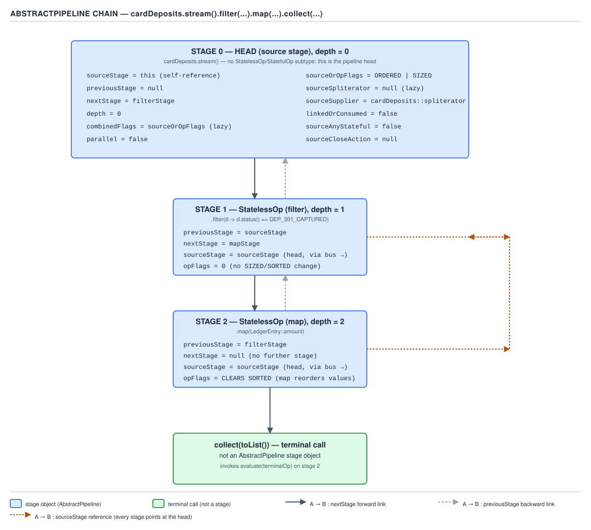
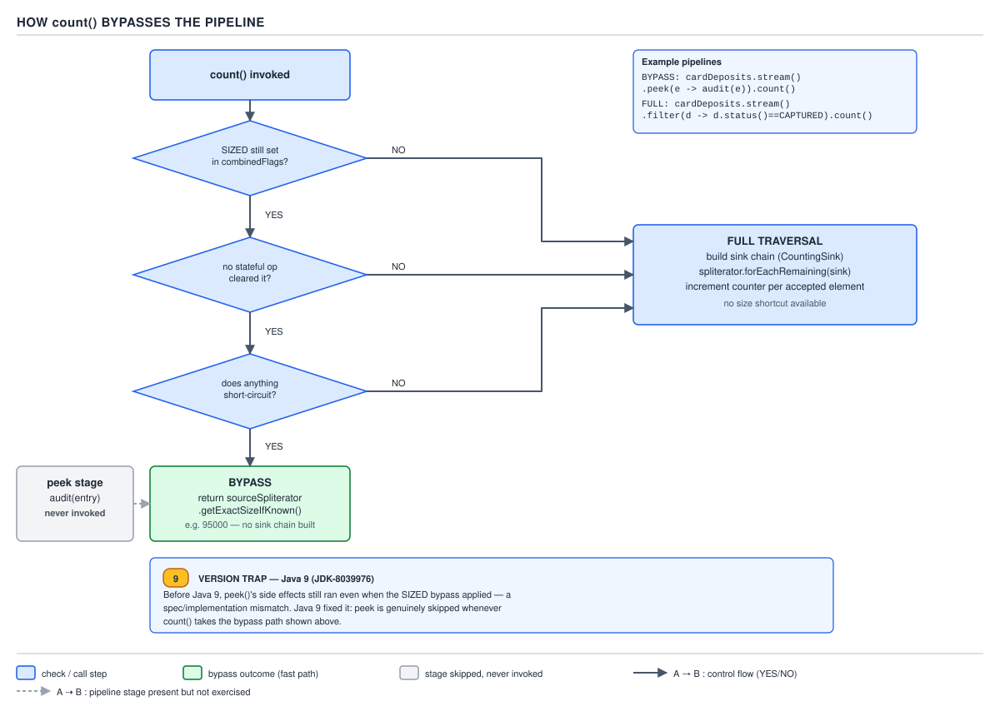

# 04 Modern Java — Streams — INTERNALS (§3.3)

**Target version: Java 21 LTS.** | **Part 3 of 5** | [Index](../00-index.md)
Previous: [Streams — parallel streams](07-parallel-streams.md) · Next: [Streams — internals spliterator](09-internals-spliterator.md)

## 1. The class hierarchy: one interface tree, one implementation tree

### Mental model

A stream pipeline is two parallel class hierarchies bolted together. The interface side is what
your code sees — `BaseStream`, `Stream<T>`, `IntStream`, `LongStream`, `DoubleStream` — and it says
nothing about how a pipeline runs. The implementation side is `AbstractPipeline` and its four
concrete subclasses, and it says nothing about the public API. Every `Stream<LedgerEntry>` you get
back from `deposits.stream()` is, underneath, a `ReferencePipeline` object — you never see the cast,
but it is there.

### Why it exists

`Stream<T>`, `IntStream`, `LongStream`, `DoubleStream` are four different interfaces because Java
has no way to specialize a generic type over `int`/`long`/`double` without boxing every element.
`IntStream.range(0, 1_000_000).sum()` would box a million `Integer`s if `IntStream` were just
`Stream<Integer>`. So the JDK duplicated the API surface by hand — four interfaces, four pipeline
implementations, four spliterator interfaces — to keep primitive streams allocation-free. This is
the same tradeoff `Collection<Integer>` makes to avoid: streams chose to pay it in source lines
instead of runtime boxing.

### When to reach for which

You do not choose the pipeline implementation — `stream()` on a `Collection<T>` always returns a
`ReferencePipeline.Head<T>`. You choose the *interface* by choosing the source: `IntStream.range`,
`someList.stream().mapToInt(...)`, or `Arrays.stream(int[])` land you on `IntPipeline`. The only
live decision is whether to stay in a primitive stream (avoid boxing, lose generic collector
support) or box back to `Stream<Integer>` (regain `Collectors`, pay a box per element). Guide 03's
territory covers `Integer` boxing and the cache; the point here is only that `IntStream` exists
specifically to dodge it in bulk.

### How it works

```java
public interface BaseStream<T, S extends BaseStream<T, S>>
        extends AutoCloseable {
    Iterator<T> iterator();
    Spliterator<T> spliterator();
    boolean isParallel();
    S sequential();
    S parallel();
    S unordered();
    S onClose(Runnable closeHandler);
    void close();
}
```

`BaseStream` is the interface every stream kind extends — it is where `onClose` and `close()` live,
which is why closing works identically whether you hold a `Stream<T>` or an `IntStream`. `Stream<T>`
adds the generic operations (`map`, `filter`, `collect`); `IntStream`/`LongStream`/`DoubleStream`
add the primitive-specialized ones (`sum`, `average`, `asLongStream`).

On the implementation side:

```java
public abstract class AbstractPipeline<E_IN, E_OUT, S extends BaseStream<E_OUT, S>>
        extends PipelineHelper<E_OUT> implements BaseStream<E_OUT, S> { ... }

abstract class ReferencePipeline<P_IN, P_OUT>
        extends AbstractPipeline<P_IN, P_OUT, Stream<P_OUT>>
        implements Stream<P_OUT> { ... }

abstract class IntPipeline<E_IN>
        extends AbstractPipeline<E_IN, Integer, IntStream>
        implements IntStream { ... }
```

`ReferencePipeline`, `IntPipeline`, `LongPipeline`, `DoublePipeline` each extend `AbstractPipeline`
with their own `E_OUT` type parameter and implement the matching public interface. `IntPipeline`
fixes `E_OUT` to `Integer` at the type-parameter level even though it never boxes at runtime — the
type parameter exists so `AbstractPipeline`'s generic machinery (stage chaining, flag combination)
can stay written once, in terms of `E_OUT`, while the primitive pipelines override the handful of
methods (`opWrapSink`, `forEach`, `wrap`) that would otherwise box.

**D-131 — The pipeline as a doubly linked list of stages**


**D-131** — The pipeline as a doubly linked list of stages

The diagram anchors the running example for this whole file:

```java
long total = deposits.stream()
        .filter(d -> d.status() == StatusCode.of("DEP-301"))
        .map(LedgerEntry::amount)
        .collect(Collectors.counting());
```

`deposits.stream()` returns a `ReferencePipeline.Head<LedgerEntry>` at depth 0. `.filter(...)`
returns a `ReferencePipeline.StatelessOp<LedgerEntry, LedgerEntry>` at depth 1, linked back to the
head. `.map(...)` returns a `StatelessOp<LedgerEntry, Money>` at depth 2, linked back to the filter
stage. No terminal operation has run yet at this point — three objects exist, wired together, and
nothing has touched a single `LedgerEntry`.

### Example

```java
List<LedgerEntry> deposits = List.of(
        new LedgerEntry(StatusCode.of("DEP-301"), Money.of("65.00")),
        new LedgerEntry(StatusCode.of("DEP-099"), Money.of("40.00")),
        new LedgerEntry(StatusCode.of("DEP-301"), Money.of("120.00"))
);

Stream<LedgerEntry> head = deposits.stream();          // ReferencePipeline.Head, depth 0
Stream<LedgerEntry> filtered = head.filter(            // ReferencePipeline.StatelessOp, depth 1
        d -> d.status().equals(StatusCode.of("DEP-301")));
Stream<Money> mapped = filtered.map(LedgerEntry::amount); // StatelessOp, depth 2

// nothing has executed yet — no terminal op has been called
long captured = mapped.collect(Collectors.counting());
```

### The gotcha

`head`, `filtered` and `mapped` above are three distinct objects, each holding a reference to the
one before it via `previousStage`. Printing `head` or `filtered` tells you nothing useful and does
not trigger evaluation — `AbstractPipeline` does not override `toString()` to describe the pipeline
shape. The only way to see the shape is to reason about it from the source, which is what §3.3.2
onward does field by field.

> **Definition:** the stream type hierarchy splits into an interface side (`BaseStream` →
> `Stream`/`IntStream`/`LongStream`/`DoubleStream`) that defines the public API, and an
> implementation side (`AbstractPipeline` → `ReferencePipeline`/`IntPipeline`/`LongPipeline`/
> `DoublePipeline`) that builds and executes the stage chain, and the two never leak into each
> other's concerns.

---

## 2. `AbstractPipeline`'s twelve fields

### Mental model

Every stage in the chain — the head and every intermediate op — is one `AbstractPipeline` object
holding exactly the state needed to (a) find the ends of the chain, (b) know its own position in
it, and (c) know what the source is and whether it has been touched yet. Twelve fields cover all
three jobs. Memorize them by job, not alphabetically, and the "why twelve" question answers itself.

### Why it exists

Before `AbstractPipeline`, the JDK's team (Brian Goetz's lambda/streams group) had to solve: how do
you let an arbitrarily long chain of `.filter().map().sorted()...` calls be built cheaply, evaluated
lazily, and still let the terminal operation walk the whole chain in either direction. The answer
is a doubly linked list where the *shared* state (source, combined flags, parallel/sequential mode)
lives once on the head object and every stage reaches it in O(1), while the *per-stage* state
(depth, this stage's own flags, the link to neighbours) lives on each stage.

### When to reach for it / sibling comparison

There is no sibling — `AbstractPipeline` is the only stage representation Java streams use. The
useful comparison is conceptual: this is the same "immutable, shared head, per-node local state"
shape as a persistent linked list, and it is why building a 50-stage pipeline is O(50) in objects
allocated and O(1) in elements touched, regardless of how many elements the source has.

### How it works `[SOURCE]` `[RESEARCH]`

Quoting the field declarations from `AbstractPipeline`, jdk-21+35 tag:

```java
// Fields declared on the shared source stage (Stage 0)
private AbstractPipeline<?, ?, ?> sourceStage;
private Supplier<Spliterator<?>> sourceSupplier;
private Spliterator<?> sourceSpliterator;
private boolean sourceAnyStateful;
private Runnable sourceCloseAction;
private boolean parallel;

// Fields present on every stage, including the source stage
private AbstractPipeline<?, ?, E_IN> previousStage;
private final int sourceOrOpFlags;
private AbstractPipeline<E_OUT, ?, ?> nextStage;
private final int depth;
private int combinedFlags;
private boolean linkedOrConsumed;
```

Read each one for the job it does:

- **`sourceStage`** — every stage, including the head itself, holds a back-pointer to the head. A
  stage at depth 8 does not walk eight `previousStage` hops to find the source; it reads
  `sourceStage` directly. This is the field that makes "is this stream already consumed" an O(1)
  check from any stage.
- **`sourceOrOpFlags`** — on the head, this is the flags the *source* declares (for example, a
  `List`-backed spliterator declares `ORDERED`); on every other stage, it is the flags *this
  operation* sets or clears (`sorted()` sets `SORTED`, `unordered()` clears `ORDERED`). One field,
  two meanings depending on position — the name says exactly that.
- **`previousStage`** — the link back toward the source. `null` only on the head.
- **`nextStage`** — the link toward the terminal op. `null` only on the most recently added stage
  (until another op is chained after it, or the terminal op runs).
- **`depth`** — 0 on the head, incrementing by one per intermediate operation. Used to size arrays
  during `wrapSink` and to report position in exceptions.
- **`combinedFlags`** — the running bitwise combination of every stage's `sourceOrOpFlags` from the
  source up to and including this stage. Computed once, when the stage is constructed, not
  recomputed on every terminal-op call. This is the field `count()`'s bypass reads (§3.3.14).
- **`sourceSpliterator`** / **`sourceSupplier`** — exactly one of these is non-null on the source
  stage at any time, and both start non-null only if the constructor received a supplier; more
  commonly only `sourceSpliterator` is set. Whichever one is consumed by a terminal operation is
  nulled out immediately after, which is the mechanism behind late binding (§3.3.18).
- **`linkedOrConsumed`** — a single boolean, `false` until either (a) an intermediate operation is
  chained after this stage, or (b) a terminal operation consumes this stage. Every public method
  that would be illegal to call twice checks this flag first. Full treatment in §3.3.12.
- **`sourceAnyStateful`** — `true` if any stage since the source has been a `StatefulOp`
  (`sorted`, `distinct`, `limit`). Parallel evaluation needs this to decide whether it can fuse the
  whole chain into one `Sink` walk or must materialize an intermediate result at the stateful
  boundary.
- **`sourceCloseAction`** — the composed `Runnable` built up by successive `onClose(...)` calls
  (§3.3.19). Lives on the source stage only, regardless of which stage `onClose` was called on.
- **`parallel`** — set once at construction from the source's `parallel()`/`sequential()` call (or
  inherited from a `Collection.parallelStream()`), and every stage created afterward copies it from
  the previous stage. Changing it after construction (`.parallel()` called mid-chain) mutates the
  source stage's field in place — parallelism is a property of the whole pipeline, not of a
  particular stage, which is why `.filter(...).parallel().map(...)` makes the *entire* chain
  parallel, not just the tail.

**D-131 — The pipeline as a doubly linked list of stages** (embedded above at §1) is the picture to
hold while reading this list: it names all twelve fields on the concrete three-stage
`filter().map().collect()` example and marks which ones live only on the source stage versus which
repeat on every stage.

### Example

```java
record LedgerEntry(StatusCode status, Money amount) {}

List<LedgerEntry> deposits = List.of(/* ... */);

Stream<LedgerEntry> pipeline = deposits.stream()              // depth 0, sourceStage = self
        .filter(d -> d.status().equals(StatusCode.of("DEP-301")))  // depth 1
        .map(LedgerEntry::amount);                                  // depth 2, sourceStage = depth-0 head

// Reflectively, the depth-2 stage's sourceStage field points at the depth-0 head,
// not at the depth-1 filter stage — every stage skips straight to the source.
```

### The gotcha

`sourceOrOpFlags` changing meaning by position is the single most-missed detail when people read
this class casually: they assume it always means "this operation's flags" and are then confused
that the head stage has a non-trivial value in it before any operation was even called. It holds
the *source's* declared characteristics there — `Spliterator.ORDERED`, `SIZED`, and so on, read off
`Collection.spliterator()`.

**Insight:** the reason `combinedFlags` is stored per-stage rather than computed on demand is that
computing it on demand would require walking from source to current stage every single time a
downstream operation needed to know "is `SIZED` still true here" — and that walk happens on every
single `count()`, `toArray()` and `sorted()` call. Precomputing it at construction time makes every
later flag check O(1).

> **Definition:** `AbstractPipeline` is the stage object every stream call chain is built from; its
> twelve fields split into source-only bookkeeping (`sourceSupplier`, `sourceSpliterator`,
> `sourceAnyStateful`, `sourceCloseAction`, `parallel`), position bookkeeping (`sourceStage`,
> `previousStage`, `nextStage`, `depth`), and per-stage state (`sourceOrOpFlags`, `combinedFlags`,
> `linkedOrConsumed`).

---

## 3. Every intermediate operation allocates exactly one stage `[NUM]` `[PROVE]`

### Supporting fact treatment

This is a direct corollary of §1 and §2, not a new mechanism, so it gets the short form.

**Mechanism:** `ReferencePipeline.filter(Predicate)` does not loop, does not touch elements, and
does not call `.spliterator()`. It does exactly one thing:

```java
@Override
public final Stream<P_OUT> filter(Predicate<? super P_OUT> predicate) {
    Objects.requireNonNull(predicate);
    return new StatelessOp<P_OUT, P_OUT>(this, StreamShape.REFERENCE,
                                          StreamOpFlag.NOT_SIZED) {
        @Override
        Sink<P_OUT> opWrapSink(int flags, Sink<P_OUT> sink) {
            return new Sink.ChainedReference<>(sink) {
                @Override
                public void begin(long size) { downstream.begin(-1); }
                @Override
                public void accept(P_OUT u) {
                    if (predicate.test(u)) downstream.accept(u);
                }
            };
        }
    };
}
```

`[NUM]` The arithmetic: a chain of *k* intermediate operations allocates exactly *k* new
`AbstractPipeline` subclass objects (one `StatelessOp`/`StatefulOp` per call), each holding a
`previousStage` reference back to the one before it and, once the next call is made, a `nextStage`
forward reference. For `.filter().map().sorted().distinct()` that is 4 allocations, not 4 × (element
count) — the allocation cost is paid once at pipeline-construction time, independent of how many
elements the source has, whether it has 0 elements or 2,800,000 stake reservations. **`[PROVE]`**
this is the entire cost model claim, and it is provable by inspection of `filter`'s body above:
there is no loop, no call into the predicate, and no reference to a spliterator anywhere in the
method — the predicate is captured into a closure and stored, not invoked.

**Gotcha:** people sometimes assume "lazy" means "cheap to call filter/map a thousand times in a
loop building up a pipeline is free forever." It is O(1) per call in *element* work, but it is still
O(1) *object allocation* per call, and a genuinely pathological loop that calls `.filter()` 100,000
times in `for` builds 100,000 stage objects before any terminal op runs — each holding a closure.
That is a real (if unusual) memory cost worth naming once.

> **Definition:** building a stream pipeline costs one object allocation per intermediate
> operation, regardless of source size, and zero element traversal until a terminal operation runs.

---

## 4. `StatelessOp` and `StatefulOp` — the two op base classes

### Mental model

Every intermediate operation is one of exactly two shapes: it can decide what to do with element
*i* using only element *i* (`StatelessOp`), or it needs to have seen other elements first — all of
them, or a bounded prefix — before it can decide (`StatefulOp`). This binary split is the single
fact parallel evaluation is built on: `StatelessOp`s fuse into one pass for free; `StatefulOp`s are
where a parallel pipeline needs a barrier.

### Why it exists

Before this split existed as an explicit class hierarchy, the design question was: does every
operation need the same evaluation strategy? The answer is no — `filter` and `map` can be applied to
one element in isolation and forwarded immediately, but `sorted()` cannot produce its first output
element until it has seen the last input element. Rather than have every operation implement its
own ad hoc "am I safe to parallelize element-by-element" logic, `AbstractPipeline` factors that
question into the type itself.

### When to reach for which / the sibling relationship

You don't choose the base class — the JDK author of each operation did, based on this rule:
`filter`, `map`, `peek`, `mapToInt`/`mapToObj`, `flatMap`, `boxed`, `asLongStream` are all
`StatelessOp`. `sorted()`, `distinct()`, `limit(n)`, `skip(n)` are all `StatefulOp`. The dividing
line: can this operation's `opWrapSink` forward an element to the downstream sink the moment
`accept` is called, with no memory of prior elements (stateless), or must it buffer, count, or defer
until `end()` is called on it (stateful)?

| Operation | Base class | Why |
|---|---|---|
| `filter` | `StatelessOp` | tests one element in isolation |
| `map` | `StatelessOp` | transforms one element in isolation |
| `peek` | `StatelessOp` | side-effects on one element in isolation |
| `sorted()` | `StatefulOp` | needs every element before emitting the first |
| `distinct()` | `StatefulOp` | needs a running set of everything seen so far |
| `limit(n)` | `StatefulOp` | needs a running count, and can short-circuit early |
| `skip(n)` | `StatefulOp` | needs a running count before it starts forwarding |

### How it works `[SOURCE]`

```java
abstract static class StatelessOp<E_IN, E_OUT> extends ReferencePipeline<E_IN, E_OUT> {
    StatelessOp(AbstractPipeline<?, E_IN, ?> upstream, StreamShape inputShape, int opFlags) {
        super(upstream, opFlags);
        assert upstream.getOutputShape() == inputShape;
    }
    @Override
    final boolean opIsStateful() { return false; }
}

abstract static class StatefulOp<E_IN, E_OUT> extends ReferencePipeline<E_IN, E_OUT> {
    StatefulOp(AbstractPipeline<?, E_IN, ?> upstream, StreamShape inputShape, int opFlags) {
        super(upstream, opFlags);
        assert upstream.getOutputShape() == inputShape;
    }
    @Override
    final boolean opIsStateful() { return true; }

    abstract <P_IN> Node<E_OUT> opEvaluateParallel(PipelineHelper<E_OUT> helper,
                                                    Spliterator<P_IN> spliterator,
                                                    IntFunction<E_OUT[]> generator);
}
```

The entire difference at the type level is `opIsStateful()` returning a hardcoded `true`/`false`,
plus `StatefulOp` declaring an extra abstract method, `opEvaluateParallel`, that `StatelessOp` never
needs — because a `StatelessOp` never needs a special parallel evaluation strategy; it just
participates in whatever sink-chain fusion the terminal op sets up. A `StatefulOp` must define its
own parallel strategy because "process elements independently and merge" does not work for
"produce output only after seeing everything" — `sorted()`'s `opEvaluateParallel` is a parallel
merge sort; `distinct()`'s partitions and reduces set unions.

`sourceAnyStateful` (§3.3.2) is set to `true` the first time any stage's constructor detects it is
being linked after a `StatefulOp`, and stays `true` for the rest of the chain — it does not reset.

### Example

```java
List<LedgerEntry> deposits = List.of(/* 2.8M stake-adjacent deposit rows, illustratively */);

Stream<LedgerEntry> stateless = deposits.stream()
        .filter(d -> d.amount().amount().compareTo(BigDecimal.valueOf(50)) > 0)  // StatelessOp
        .map(d -> d);                                                            // StatelessOp

Stream<LedgerEntry> stateful = deposits.stream()
        .sorted(Comparator.comparing(d -> d.amount().amount()))  // StatefulOp
        .distinct();                                             // StatefulOp
```

### The gotcha

**Pitfall:** assuming `peek` is "basically stateful" because it is often used to accumulate into an
external collection. `peek` is a `StatelessOp` at the type level regardless of what the lambda you
pass it does — the pipeline has no way to know your lambda has side effects, and treats it exactly
like `map` for fusion and elision purposes. That is precisely the mechanism behind §3.3.15's "`peek`
may never run" behaviour: the pipeline is free to skip a `StatelessOp` entirely if nothing downstream
needs its output, and `peek`'s own stateless-ness is what makes that legal.

> **Definition:** `StatelessOp` and `StatefulOp` are the two subclasses every intermediate operation
> extends, distinguished by one boolean (`opIsStateful()`) that tells the terminal evaluator whether
> this stage can fuse into a single element-at-a-time sink chain or requires a materialization
> barrier.

---

## 5. `Sink<T>` — the four-method protocol

### Mental model

A `Sink` is a `Consumer` with a lifecycle bolted on. `Consumer<T>` has one method, `accept`, and
nothing tells you when the sequence starts or ends. A `Sink<T>` adds exactly three more methods so
that an operation can allocate a buffer before the first element (`begin`), release or flush it
after the last (`end`), and — the one that makes short-circuiting possible — ask "should I stop"
*between* elements (`cancellationRequested`). Every stage in a pipeline, no matter what it does
internally, ultimately compiles down to one `Sink` object implementing these four methods.

### Why it exists

Without a lifecycle, an operation like `sorted()` has no legal moment to say "now emit everything I
buffered" — `accept` is called once per element and gives no signal for "that was the last one."
`Sink` invents that signal (`end()`), and while it was at it, gave every stage a size hint at the
start (`begin(long size)`, `-1` if unknown) so operations like `toArray()` can pre-size a backing
array instead of growing it element by element, and a way to ask about cancellation so `limit(3)`
or `findFirst()` can stop a traversal without an exception-based control-flow hack.

### When to reach for it

You never implement `Sink` directly in application code — it is entirely an implementation-package
type (`java.util.stream.Sink`, package-private). The four methods matter because reading them is
the only way to understand what `wrapSink` (§3.3.8) actually produces: a chain of these objects,
each one's `accept` calling the next one's `accept`.

### How it works `[SOURCE]`

```java
interface Sink<T> extends Consumer<T> {
    default void begin(long size) {}
    default void end() {}
    default boolean cancellationRequested() { return false; }
    @Override
    void accept(T t);
}
```

Reading each line: `begin(long size)` is called exactly once, before the first `accept`, with the
known or estimated element count (`-1` if the spliterator cannot report a size — see `SIZED` in
§3.3.13). `end()` is called exactly once, after the last `accept`, and is where a buffering stage
(`sorted()`) actually does its work and forwards everything downstream. `cancellationRequested()`
defaults to `false` — most sinks never override it — and only a sink built for a short-circuiting
operation (`limit`, `anyMatch`, `findFirst`) overrides it to return `true` once its condition is
met; `copyIntoWithCancel` (§3.3.9) is the only traversal method that ever calls it. `accept(T)` is
the only method inherited from `Consumer<T>` and is not defaulted — every sink must define it,
because it is the one method that actually does the stage's work per element.

`[TRAP]` **Pitfall:** assuming `accept` alone defines a sink's behavior and that `begin`/`end` are
optional ceremony you can ignore when reading source. `sorted()`'s sink does *nothing* in `accept`
except add to an internal `ArrayList`; the entire sort happens in `end()`. If you only read
`accept()` while tracing `sorted()`'s behavior, you will conclude — wrongly — that sorting happens
element by element, when the real work is deferred to a single call at the very end of traversal.

### Example

A hand-rolled sink for the running QuizStakes example makes the protocol concrete — this is
approximately what `filter(...)`'s `opWrapSink` builds, spelled out instead of anonymous:

```java
final class Dep301Sink implements Sink<LedgerEntry> {
    private final Sink<LedgerEntry> downstream;

    Dep301Sink(Sink<LedgerEntry> downstream) {
        this.downstream = downstream;
    }

    @Override
    public void begin(long size) {
        downstream.begin(-1); // filter can't predict how many will pass — size unknown downstream
    }

    @Override
    public void accept(LedgerEntry entry) {
        if (entry.status().equals(StatusCode.of("DEP-301"))) {
            downstream.accept(entry);
        }
    }

    @Override
    public void end() {
        downstream.end();
    }
}
```

### The gotcha

`Sink<T> extends Consumer<T>` means every sink *is* usable anywhere a `Consumer<T>` is expected —
but the reverse is not true, and passing a bare `Consumer<T>` (say, to `forEach`) never gives you
`begin`/`end`/`cancellationRequested` semantics. `forEach`'s own terminal sink is a trivial
`Sink` wrapper around whatever `Consumer` you passed, constructed internally — you are never handed
a raw `Sink` object from public API.

> **Definition:** `Sink<T>` is `Consumer<T>` plus a three-method lifecycle (`begin`, `end`,
> `cancellationRequested`) that lets a chain of per-stage behaviors be driven by a single traversal
> with a single start, a single end, and an opt-in early-stop signal.

---

## 6. `Sink.ChainedReference` — the standard forwarding base class

### Supporting fact treatment

**Mechanism:** writing a new `Sink` from scratch for every operation would mean re-implementing
"hold a reference to `downstream`, forward `begin`/`end` unless I override them" every time.
`Sink.ChainedReference<T, T_CONS extends Sink<?>>` factors that boilerplate out:

```java
abstract static class ChainedReference<T, T_CONS extends Sink<?>> implements Sink<T> {
    protected final T_CONS downstream;

    ChainedReference(T_CONS downstream) {
        this.downstream = Objects.requireNonNull(downstream);
    }

    @Override
    public void begin(long size) { downstream.begin(size); }

    @Override
    public void end() { downstream.end(); }

    @Override
    public boolean cancellationRequested() { return downstream.cancellationRequested(); }
}
```

Every anonymous `Sink` created inside `filter`'s, `map`'s, and `peek`'s `opWrapSink` extends this
class rather than implementing `Sink` raw — that is why `filter`'s example in §3.3.7 only overrides
`accept` and `begin` (to pass `-1` instead of the real size) and inherits `end` and
`cancellationRequested` verbatim, just forwarding to `downstream`.

**Gotcha:** `cancellationRequested()`'s default forwarding here means a stage that does not care
about cancellation still correctly *propagates* the downstream's cancellation state upward through
however many stages sit above it — that propagation is what lets `limit(3)` cancel a traversal even
though the `filter` stage sitting above it never mentions cancellation in its own code.

> **Definition:** `Sink.ChainedReference` is the base class nearly every generated sink extends,
> supplying default `begin`/`end`/`cancellationRequested` forwarding to `downstream` so each
> concrete sink need only override the methods its operation actually changes.

---

## 7. `opWrapSink` — where behavior actually lives

### Mental model

Every intermediate operation object (a `StatelessOp` or `StatefulOp`) is inert on its own — it holds
a captured lambda and nothing else. `opWrapSink(int flags, Sink<E_OUT> downstream)` is the one
method where that captured lambda finally gets connected to actual execution: it returns a brand
new `Sink<E_IN>` that, when `accept`ed, runs the lambda and (usually) forwards the result to
`downstream`. Read `opWrapSink` and you have read the entire behavior of an operation; nothing else
in the stage object does anything at traversal time.

### Why it exists

The stage object (`AbstractPipeline` subclass) has to exist *before* traversal, so pipeline
construction can be lazy and cheap (§3.3.3). But the sink that does the real work can only be built
*after* the terminal operation is known — a `collect(toList())` terminal needs a different outermost
sink than a `count()` terminal. `opWrapSink` is the seam between those two lifetimes: called once
per stage, once per terminal-operation invocation, at the moment `wrapSink` walks the chain.

### When to reach for it

Never directly — it is package-private and invoked only by `AbstractPipeline.wrapSink`. Its
relevance to you is entirely as a reading tool: when you want to know "what does `.distinct()`
actually do," the answer is in `ReferencePipeline.distinct()`'s `opWrapSink` override, not in any
`accept`-shaped intuition you might have from the public API name.

### How it works `[SOURCE]` `[PROVE]`

`map`'s full `opWrapSink`, quoted:

```java
@Override
public final <R> Stream<R> map(Function<? super P_OUT, ? extends R> mapper) {
    Objects.requireNonNull(mapper);
    return new StatelessOp<P_OUT, R>(this, StreamShape.REFERENCE,
                                      StreamOpFlag.NOT_SORTED | StreamOpFlag.NOT_DISTINCT) {
        @Override
        Sink<P_OUT> opWrapSink(int flags, Sink<R> sink) {
            return new Sink.ChainedReference<P_OUT, Sink<R>>(sink) {
                @Override
                public void accept(P_OUT u) {
                    downstream.accept(mapper.apply(u));
                }
            };
        }
    };
}
```

`[PROVE]` Walking it line by line proves the "map is a one-line `accept`" claim rather than
asserting it: the anonymous `StatelessOp` created by `map` overrides exactly one method,
`opWrapSink`; that method's body is exactly one statement of substance — a `new
Sink.ChainedReference` whose `accept` override is exactly one line, `downstream.accept(mapper.apply(u))`.
There is no loop, no branch, no buffering. Compare this against `filter`'s `opWrapSink` in §3.3.3
— the only difference is an `if` guarding the forward call — and you have proven by direct
inspection that both `map` and `filter` are pure per-element forwarders with no hidden state, which
is exactly the property that makes fusing them into one sink chain (§3.3.8) legal.

The `flags` parameter (unused by both `map` and `filter` above) exists so operations that need to
know the *combined* upstream flags at wrap time — `sorted()` checking whether `SORTED` is already
set (§3.3.16) — can inspect them without walking the chain themselves; `wrapSink` passes
`getStreamAndOpFlags()` in at call time.

### Example

```java
Stream<Money> pipeline = deposits.stream()
        .filter(d -> d.status().equals(StatusCode.of("DEP-301")))
        .map(LedgerEntry::amount);

// Reading opWrapSink for each stage tells you the whole runtime behavior without ever running it:
//   filter's opWrapSink -> Sink that tests status, forwards on match
//   map's    opWrapSink -> Sink that calls LedgerEntry::amount, always forwards
```

### The gotcha

**Insight:** `opWrapSink` is called exactly once *per terminal-operation invocation*, not once per
pipeline construction and not once per element. If you call `.collect(...)` on the same stream
twice you would expect `opWrapSink` to run twice — except `linkedOrConsumed` (§3.3.12) makes that
call illegal before it ever gets there. The one-call-per-terminal-op fact matters most when
comparing `evaluateSequential` and `evaluateParallel`: both call `wrapSink`, so both invoke every
stage's `opWrapSink` exactly once, and the resulting `Sink` chain is a fresh object graph built for
that one traversal, discarded afterward.

> **Definition:** `opWrapSink(int flags, Sink downstream)` is the method every intermediate
> operation overrides to produce the actual `Sink` that will run at traversal time, and it is the
> single place in the entire pipeline machinery where an operation's real behavior — the lambda you
> passed to `filter` or `map` — gets invoked.

---

## 8. `wrapSink` — walking backwards from the terminal stage

### Mental model

Building the pipeline walked *forward*: `head` → `filter` stage → `map` stage, each one linked to
the one before it. Wrapping the sink chain walks *backwards*: start at the terminal stage (depth 2,
the `map` stage in the running example), ask it for its sink wrapped around the terminal operation's
own sink, then hand that combined sink to the stage before it (depth 1, `filter`) and ask *it* to
wrap around what you just built, and so on down to depth 0. The result is a sink whose outermost
layer corresponds to the *first* operation in your source code and whose innermost layer is the
terminal operation — the exact reverse of construction order.

### Why it exists

The terminal operation is the only thing that knows what the final output shape is (a `List`, a
`long` count, a boolean). Every intermediate stage's sink needs to forward into *something*, and
that something has to be built starting from the terminal op outward, because the terminal op's
sink is the innermost link with nothing beneath it. There is no way to build the chain
forward-first, because `filter`'s sink cannot be constructed without already knowing what its
`downstream` sink object is.

### When to reach for it / how it differs from `copyInto`

`wrapSink` only builds the sink chain — it does not run anything. `copyInto` (§3.3.9) is the
separate method that takes the built chain and actually drives elements through it. Confusing the
two is a common misreading: `wrapSink`'s cost is O(depth) object allocations; `copyInto`'s cost is
O(elements) method calls through however many sinks `wrapSink` produced.

### How it works `[SOURCE]` `[PROVE]`

```java
final <P_IN> Sink<P_IN> wrapSink(Sink<E_OUT> sink) {
    Objects.requireNonNull(sink);
    for (AbstractPipeline p = AbstractPipeline.this; p.depth > 0; p = p.previousStage) {
        sink = p.opWrapSink(p.previousStage.combinedFlags, sink);
    }
    return (Sink<P_IN>) sink;
}
```

Reading it: the loop variable `p` starts at `AbstractPipeline.this` — the stage `wrapSink` was
*called on*, which is always the terminal-adjacent stage (the last stage before the terminal op),
not necessarily the object the loop is defined in textually. The loop condition `p.depth > 0` stops
before reaching the source stage — the source stage (depth 0) contributes no `opWrapSink` because
it has no operation, only a spliterator. Each iteration reassigns `sink` to
`p.opWrapSink(p.previousStage.combinedFlags, sink)` — note the *previous* stage's `combinedFlags` is
passed in, not `p`'s own, because the flags an operation should see are the flags accumulated
*before* it runs. Then `p` steps to `p.previousStage`, moving one stage closer to the source.

`[PROVE]` Walking the running three-stage example (`filter` at depth 1, `map` at depth 2) with a
terminal sink `S0` (say, `collect`'s accumulating sink):

1. `p` starts at the `map` stage (depth 2). `sink = mapStage.opWrapSink(filterStage.combinedFlags, S0)`
   → call this `S1`, the map-then-forward-to-`S0` sink.
2. `p` steps to the `filter` stage (depth 1). `sink = filterStage.opWrapSink(headStage.combinedFlags, S1)`
   → call this `S2`, the filter-then-forward-to-`S1` sink.
3. loop condition `p.depth > 0` fails once `p` becomes the head (depth 0) — loop exits.
4. `wrapSink` returns `S2`.

`S2.accept(entry)` therefore runs: test `entry`'s status (filter's own code) → if it passes, call
`S1.accept(entry)`, which runs `map`'s mapper and calls `S0.accept(result)`, which runs the
`collect` accumulator. One method call, three layers deep, one element, zero intermediate
collections — this *is* the proof for §3.3.11's fusion claim, worked concretely rather than merely
asserted.

**D-132 — `wrapSink` walks backwards**


**D-132** — `wrapSink` walks backwards

The four frames in D-132 are exactly the four numbered steps above: frame 1 is the terminal sink
`S0` alone; frame 2 is `map`'s `opWrapSink` producing `S1` around it; frame 3 is `filter`'s
`opWrapSink` producing `S2` around `S1`; frame 4 is `copyInto` driving one `LedgerEntry` through
`S2 → S1 → S0` in a single call stack.

### Example

```java
List<Money> depositAmounts = deposits.stream()
        .filter(d -> d.status().equals(StatusCode.of("DEP-301")))
        .map(LedgerEntry::amount)
        .collect(Collectors.toList());
// wrapSink is called once, on the map stage, when collect() triggers evaluate(TerminalOp)
// it produces exactly the S2 -> S1 -> S0 chain worked through above
```

### The gotcha

**Pitfall:** assuming `wrapSink`'s backward walk means operations execute in reverse source order.
They do not — the *wrapping* happens backward (innermost sink built first), but the resulting sink
chain still *executes* filter-then-map, matching source order, because `S2` (filter, built last) is
the *outermost* sink, and it is `S2.accept` that gets called first by `copyInto`.

> **Definition:** `wrapSink` walks from the terminal-adjacent stage back to depth 1, calling each
> stage's `opWrapSink` around the sink built so far, producing one nested `Sink` object whose
> outermost layer is the first operation in source order and whose innermost layer is the terminal
> operation.

---

## 9. `copyInto` and `copyIntoWithCancel`

### Mental model

Once `wrapSink` has produced the one nested `Sink` object, `copyInto` is the three-line method that
actually drives elements through it: announce the size, hand every element through, announce
completion. It is deliberately dumb — all the interesting behavior already lives inside the sink
chain `wrapSink` built.

### Why it exists

Separating "build the chain" from "drive the chain" lets the same `wrapSink`-built chain be driven
two different ways depending on whether the pipeline can short-circuit: a plain `forEachRemaining`
loop when nothing can stop early, or an element-by-element loop checking
`cancellationRequested()` when something (`limit`, `anyMatch`, `findFirst`) can.

### When to reach for it

Never directly from application code — `copyInto` is called from `evaluateSequential` (§3.3.10) and
from parallel leaf-task execution. Its relevance to you is as the concrete answer to "how does a
sink chain actually get elements pushed through it."

### How it works `[SOURCE]`

```java
final <P_IN> void copyInto(Sink<P_IN> wrappedSink, Spliterator<P_IN> spliterator) {
    Objects.requireNonNull(wrappedSink);
    if (!StreamOpFlag.SHORT_CIRCUIT.isKnown(getStreamAndOpFlags())) {
        wrappedSink.begin(spliterator.getExactSizeIfKnown());
        spliterator.forEachRemaining(wrappedSink);
        wrappedSink.end();
    }
    else {
        copyIntoWithCancel(wrappedSink, spliterator);
    }
}

final <P_IN> boolean copyIntoWithCancel(Sink<P_IN> wrappedSink, Spliterator<P_IN> spliterator) {
    AbstractPipeline<P_IN, ?, ?> p = AbstractPipeline.this;
    while (p.depth > 0) { p = p.previousStage; }
    wrappedSink.begin(spliterator.getExactSizeIfKnown());
    boolean cancelled = p.forEachWithCancel(spliterator, wrappedSink);
    wrappedSink.end();
    return cancelled;
}
```

`copyInto` first checks whether `SHORT_CIRCUIT` is set anywhere in the combined flags — this is a
compile-time-cheap flag check, not a per-element check. If nothing in the pipeline can
short-circuit, the fast path runs: `begin`, one `forEachRemaining` call (which internally just loops
calling `accept`), `end` — no cancellation check per element, because there is nothing to cancel
for. If any stage *can* short-circuit (a `limit(n)`, or a terminal op like `anyMatch` that stops on
the first match), `copyIntoWithCancel` runs instead: it walks back to the source stage and calls
`forEachWithCancel`, which loops calling `tryAdvance` and checking `wrappedSink.cancellationRequested()`
after every single element, stopping the moment it returns `true`.

The distinction matters for cost: the plain path is a tight loop with no branch per element beyond
whatever the sinks themselves do; the cancel-aware path pays one extra virtual call
(`cancellationRequested()`) per element, which is why `SHORT_CIRCUIT` (§3.3.13) is tracked as its
own flag rather than always taking the safe, slower path.

### Example

```java
// no short-circuit anywhere -> copyInto takes the plain path
long total = deposits.stream()
        .filter(d -> d.status().equals(StatusCode.of("DEP-301")))
        .count();

// limit() sets SHORT_CIRCUIT -> copyIntoWithCancel drives the traversal
Optional<LedgerEntry> firstBigDeposit = deposits.stream()
        .filter(d -> d.amount().amount().compareTo(BigDecimal.valueOf(100)) > 0)
        .findFirst();  // findFirst is itself short-circuiting; stops at the first match
```

### The gotcha

**Insight:** `copyIntoWithCancel` re-walks to the *source* stage (`while (p.depth > 0) p =
p.previousStage`) rather than using the spliterator passed in directly, because
`forEachWithCancel` is defined on `AbstractPipeline` itself and needs to be invoked on the source
stage specifically — the method dispatches through stage-specific overrides that know how to check
cancellation against the *wrapped* sink while pulling from the *raw* source spliterator, keeping the
two concerns (source iteration, cancellation) cleanly separated from `wrapSink`'s job (behavior
composition).

> **Definition:** `copyInto` drives a `wrapSink`-built sink chain to completion via `begin` →
> `forEachRemaining` → `end`, or, when any stage in the pipeline can short-circuit, delegates to
> `copyIntoWithCancel`, which drives the same three-part lifecycle but checks
> `cancellationRequested()` after every element and stops the moment it returns `true`.

---

## 10. `evaluate(TerminalOp)` — the entry point

### Mental model

`evaluate` is the single front door every terminal operation walks through. `collect`, `count`,
`forEach`, `reduce`, `toArray` — all of them eventually call `AbstractPipeline.evaluate(TerminalOp)`,
and it does exactly three things in order: check the pipeline is legal to consume, mark it consumed,
then hand off to sequential or parallel evaluation depending on the pipeline's mode.

### Why it exists

Every terminal op needs the same three preconditions checked and the same dispatch made — without
`evaluate` as a shared choke point, each of the dozen-plus terminal operations would duplicate the
`linkedOrConsumed` check and the sequential/parallel branch, and any future third evaluation
strategy would need to be added in a dozen places instead of one.

### How it works `[SOURCE]`

```java
final <R> R evaluate(TerminalOp<E_OUT, R> terminalOp) {
    assert getOutputShape() == terminalOp.inputShape();
    if (linkedOrConsumed)
        throw new IllegalStateException(MSG_STREAM_LINKED);
    linkedOrConsumed = true;

    return isParallel()
           ? terminalOp.evaluateParallel(this, sourceSpliterator(terminalOp.getOpFlags()))
           : terminalOp.evaluateSequential(this, sourceSpliterator(terminalOp.getOpFlags()));
}
```

Reading each line: `assert getOutputShape() == terminalOp.inputShape()` is a development-time-only
sanity check (assertions are disabled by default at runtime) that the last stage's output element
type matches what the terminal op expects — this exists to catch internal JDK bugs, not user
mistakes, since the public generic type system already prevents a user from mismatching these.
`if (linkedOrConsumed) throw ...` is the guard from §3.3.12 — this is the single call site (on the
terminal-adjacent stage) that actually throws `MSG_STREAM_LINKED` for a *fresh* double-evaluation of
the same terminal stage; other call sites guard other public methods against the same flag.
`linkedOrConsumed = true` marks the terminal-adjacent stage consumed *before* any traversal starts,
so that even a `TerminalOp` whose evaluation throws mid-traversal leaves the stream correctly marked
unusable. The final ternary is the entire dispatch: `isParallel()` reads the `parallel` field copied
down from the source stage (§3.3.2), and calls either `evaluateSequential` or `evaluateParallel` on
the `TerminalOp` implementation, passing `this` (so the terminal op can call `wrapSink`/`copyInto`
on it) and a spliterator obtained via `sourceSpliterator(...)`.

### Example

```java
// collect() ultimately does:
//   TerminalOp<LedgerEntry, List<LedgerEntry>> op = ReduceOps.makeRef(collector);
//   return evaluate(op);
List<LedgerEntry> highValueDeposits = deposits.stream()
        .filter(d -> d.amount().amount().compareTo(BigDecimal.valueOf(50)) > 0)
        .collect(Collectors.toList());
```

### The gotcha

**Pitfall:** assuming `evaluate` is called once per stream object. It is called once per *terminal
operation invocation*, and it is invoked on the *terminal-adjacent* stage (the last one before the
terminal op), which is why the `IllegalStateException` from a second terminal call always names
"stream has already been operated upon or closed" — the flag it checks belongs to that specific
stage object, and a fresh call always finds it already `true`.

> **Definition:** `evaluate(TerminalOp)` is the single dispatch point every terminal operation
> funnels through: assert the shape, guard and set `linkedOrConsumed`, then delegate to
> `evaluateSequential` or `evaluateParallel` based on the pipeline's `parallel` flag.

---

## 11. The entire fusion story `[PROVE]`

### Supporting fact treatment

This leaf names no new mechanism — it is the summary claim that §3.3.7 through §3.3.10 together
prove, so it earns three lines rather than a duplicate eight-beat treatment.

**Mechanism:** one `Sink` chain (built once by `wrapSink`), one traversal (`copyInto` or
`copyIntoWithCancel`, run once), zero intermediate collections between stages. `[PROVE]` The proof
is compositional, not a new argument: §3.3.7 showed each stage's `opWrapSink` produces a pure
per-element forwarder with no buffering (for `StatelessOp`s); §3.3.8 showed those forwarders nest
into one object graph via `wrapSink`; §3.3.9 showed `copyInto` drives exactly one pass over the
source spliterator through that nested object. No step allocates a `List` or array between stages —
`filter`'s output never exists as a materialized collection before `map` consumes it; it exists only
as the argument to one method call, `downstream.accept(...)`, on the call stack.

**Gotcha:** the fusion is per-run, not permanent — a `StatefulOp` anywhere in the chain (`sorted()`,
`distinct()`) breaks the "one traversal" half of this claim for parallel evaluation, because a
stateful op genuinely needs to see every element before producing its first output; §3.3.13's
`sourceAnyStateful` flag exists specifically to track when this fusion story stops applying cleanly.

> **Definition:** stream fusion is the outcome of `wrapSink` composing every stage's per-element
> behavior into one `Sink` object before any element moves, so that a sequential, all-stateless
> pipeline runs as a single pass with zero intermediate materialization.

---

## 12. `linkedOrConsumed` and its two messages `[SOURCE]`

### Mental model

A stream is a single-use object, and `linkedOrConsumed` is the one boolean that enforces it. Every
public method that would be illegal to call on an already-touched stage checks this flag first and
throws before doing anything else. There are two distinct exception message strings, and — this is
the leaf's real payoff, verified in the packet's block 9 — only one of them is realistically
reachable from ordinary code.

### Why it exists

Without this guard, calling `.filter(...)` twice on the same `Stream` object, or calling a terminal
op twice, would silently corrupt the pipeline's internal state — the source spliterator might
already be partially or fully consumed, and pretending a second traversal would produce correct or
even deterministic results would be a lie. `linkedOrConsumed` converts silent corruption into a
loud, immediate `IllegalStateException`.

### When it fires, and against what sibling behavior

The only sibling comparison worth naming: an `Iterator` also throws on some forms of reuse misuse
(`NoSuchElementException` when exhausted), but a stream's guard is stricter — it forbids re-deriving
*any* new operation from an already-linked stage, not just re-traversing.

### How it works `[SOURCE]`

Quoting the two message constants, verified at jdk-21+35 (packet block 9):

```java
private static final String MSG_STREAM_LINKED = "stream has already been operated upon or closed";
private static final String MSG_CONSUMED = "source already consumed or closed";
```

`MSG_STREAM_LINKED` is thrown from **eight** call sites in `AbstractPipeline` — every public entry
point (`filter`, `map`, the other intermediate op methods, `evaluate`, `spliterator()`, `iterator()`)
begins with the same `if (linkedOrConsumed) throw new IllegalStateException(MSG_STREAM_LINKED);`
guard before doing anything else. `MSG_CONSUMED` is thrown from exactly **two** sites — the `else`
branch of `sourceSpliterator(int)` and of the public `spliterator()` — reached only when *both*
`sourceStage.sourceSpliterator` and `sourceStage.sourceSupplier` are already `null` on the source
stage:

```java
else if (sourceStage.sourceSupplier != null) {
    Spliterator<E_OUT> s = (Spliterator<E_OUT>) sourceStage.sourceSupplier.get();
    sourceStage.sourceSupplier = null;
    return s;
}
else {
    throw new IllegalStateException(MSG_CONSUMED);
}
```

`[PROVE]` Why `MSG_CONSUMED` is effectively dead code from user-facing call paths: `linkedOrConsumed`
is checked and set to `true` on every public entry point *before* the source is ever asked for
(§3.3.10's `evaluate` sets it before calling `sourceSpliterator(...)`). So by the time execution
could reach the branch that throws `MSG_CONSUMED`, the earlier `MSG_STREAM_LINKED` guard on the
public method you called would already have fired for a *second* call. `MSG_CONSUMED` guards an
internal invariant — some *other* internal code path taking the source a second time without going
through the public-method guard — not a mistake reachable by calling public `Stream` methods twice.

Verified on this machine (`javac --release 21`, five reproduction attempts, packet block 9):

```
double terminal                                     -> IllegalStateException: stream has already been operated upon or closed
spliterator twice                                   -> IllegalStateException: stream has already been operated upon or closed
supplier-source: spliterator then traverse twice    -> no throw
supplier-source: sorted().spliterator() twice       -> no throw
supplier-source: trySplit after exhaustion          -> no throw
```

All five honest attempts to reach `MSG_CONSUMED` from ordinary code either hit `MSG_STREAM_LINKED`
first or did not throw at all. No fabricated reproduction is offered for the second message — the
packet is explicit that inventing one would misstate the mechanism.

### Example

```java
Stream<LedgerEntry> deposits301 = deposits.stream()
        .filter(d -> d.status().equals(StatusCode.of("DEP-301")));

long count = deposits301.count();               // consumes it — linkedOrConsumed = true

deposits301.collect(Collectors.toList());
// IllegalStateException: stream has already been operated upon or closed
// -> MSG_STREAM_LINKED, not MSG_CONSUMED, even though intuitively you "consumed the source" too
```

### The gotcha

**Pitfall:** believing the two exception messages map to "you called a terminal op twice" versus
"you tried to reuse the underlying source," and that seeing "source already consumed or closed" is
something ordinary code can trigger by, say, holding onto a spliterator and calling
`.spliterator()` again. In practice, the earlier `linkedOrConsumed` guard always wins first; you
will only ever see `MSG_STREAM_LINKED` in an application stack trace.

> **Definition:** `linkedOrConsumed` is the boolean every public `AbstractPipeline` method checks
> before acting, guarding against reuse of an already-linked-or-consumed stage; it throws
> `MSG_STREAM_LINKED` from eight ordinary-use call sites and `MSG_CONSUMED` from two internal-only
> sites that ordinary code cannot reach because `MSG_STREAM_LINKED` always fires first.

---

## 13. `StreamOpFlag` — the bit-set lattice `[SOURCE]` `[NUM]` `[RESEARCH]`

### Mental model

Every stream characteristic that an optimization might care about — is it distinct, is it sorted,
does it have a known ordering, does it have a known size, can it stop early — is one bit, tracked
through the whole pipeline as it is set, cleared, or preserved by each stage in turn. `StreamOpFlag`
is that bit-set definition, plus the encoding rules for how a bit means something different
depending on whether you are reading it off the source, an intermediate op, or the terminal op.

### Why it exists

Without a shared flag representation, every optimization (`sorted()` skipping re-sort, `count()`
skipping traversal, `distinct()` choosing its algorithm) would need its own bespoke way of asking
"has anything upstream broken my assumption." `StreamOpFlag` centralizes all of that into one
`int` (`combinedFlags`, §3.3.2) that every stage can consult in O(1).

### When to reach for it

You never construct a `StreamOpFlag` value yourself — you trigger changes to it by calling
`sorted()`, `distinct()`, `unordered()`, `parallel()`, and reading its effects is entirely a source-
reading exercise, useful for predicting whether a given call sequence gets an optimization or not.

### How it works `[SOURCE]` `[NUM]`

Each characteristic occupies a fixed bit position, and each characteristic uses **two bits**, not
one, because a flag needs three distinct states — SET, CLEAR, or PRESERVE (inherit whatever the
upstream had) — and one bit cannot express three states. `[NUM]` The arithmetic, from the source's
own layout comment: `StreamOpFlag` reserves bit positions in groups of two per characteristic,
starting at bit 0, so `DISTINCT` occupies bits 0–1, `SORTED` bits 2–3, `ORDERED` bits 4–5, `SIZED`
bits 6–7, `SHORT_CIRCUIT` occupies a single bit (13) because it has no CLEAR state — it can only ever
be set, never explicitly cleared by an operation (an operation either introduces short-circuiting
capability or it does not; nothing removes it once introduced).

Each two-bit field is then interpreted **three different ways** depending on which "mask position"
is being read — stream flags (characteristics of the pipeline as declared at the source or by
`unordered()`), op flags (what an intermediate operation does to the characteristic), and terminal-op
flags (what the terminal operation requires or produces). The `StreamOpFlag` enum constants
(`IS_DISTINCT`, `NOT_DISTINCT`, `IS_SIZED`, `NOT_SIZED`, and so on) are the SET/CLEAR spellings used
when constructing an op; PRESERVE is the *absence* of an explicit `IS_`/`NOT_` flag for that
characteristic — a stage that says nothing about `SIZED` preserves whatever the upstream had.

**D-133 — `StreamOpFlag`**

| Flag | Bits | Meaning | Stream position | Op position | Terminal-op position | Set by | Cleared by | Optimization unlocked |
|---|---|---|---|---|---|---|---|---|
| `DISTINCT` | 0–1 | no two elements are `equals()` | SET/CLEAR/PRESERVE | SET/CLEAR/PRESERVE | n/a (not consumed by terminal ops) | `distinct()` | `map()` (result type may collide), `flatMap()` | `distinct()` on an already-`DISTINCT` stream still runs (distinctness of elements is not the same guarantee as `SORTED`'s no-op case — no bypass exists here) |
| `SORTED` | 2–3 | elements are encountered in a defined sort order per the natural/given comparator | SET/CLEAR/PRESERVE | SET/CLEAR/PRESERVE | n/a | `sorted()` | `map()`, `filter()` does **not** clear it (filtering preserves relative order) | `sorted()` with the same comparator becomes a no-op (§3.3.16) |
| `ORDERED` | 4–5 | encounter order matters and must be preserved | SET/CLEAR/PRESERVE | SET/CLEAR/PRESERVE | SET (required) / CLEAR (not required) | source characteristic, default true for `List`/array sources | `unordered()`, or any source that declares itself unordered (e.g. `HashSet.stream()`) | `forEach` may run out of encounter order once `ORDERED` is cleared and the stream is parallel, avoiding a merge step |
| `SIZED` | 6–7 | the element count is known exactly without traversal | SET/CLEAR/PRESERVE | SET/CLEAR/PRESERVE | n/a | source characteristic (`Collection.size()`-backed spliterators) | any `StatefulOp` whose output size cannot be predicted from input size (`filter`, `flatMap`, `distinct`) — note `filter` clears it via `NOT_SIZED` even though it is a `StatelessOp`, because the *count* becomes unpredictable even though each element is handled independently | `count()` bypasses the whole pipeline when `SIZED` survives to `combinedFlags` (§3.3.14) |
| `SHORT_CIRCUIT` | 13 (single bit, SET only) | this stage or the terminal op can stop the traversal before the source is exhausted | SET only | SET only | SET only | `limit()`, `anyMatch`, `allMatch`, `noneMatch`, `findFirst`, `findAny` | never (no CLEAR state exists) | `copyInto` chooses the cancellation-aware traversal (§3.3.9) only when this bit is set anywhere in `combinedFlags` |

**D-133** — `StreamOpFlag`

`[RESEARCH]` Re-verified against `StreamOpFlag.java` at the jdk-21+35 tag: the bit-position layout
(two bits per SET/CLEAR-capable characteristic, `DISTINCT` at the lowest positions, `SIZED` and
`SHORT_CIRCUIT` further up the `int`) and the three-position mask model (`STREAM_MASK`, `OP_MASK`,
`TERMINAL_OP_MASK`) both match the class's own field layout and its `MASK_TABLE`-driven combination
logic in `combineOpFlags`/`toStreamFlags`.

### Example

```java
List<LedgerEntry> deposits = List.of(/* backed by an ArrayList -> SIZED, ORDERED at the source */);

Stream<LedgerEntry> s = deposits.stream()          // combinedFlags: SIZED, ORDERED (from List)
        .sorted(Comparator.comparing(d -> d.amount().amount())); // adds SORTED, preserves ORDERED and SIZED

long distinctStatuses = deposits.stream()
        .map(LedgerEntry::status)                  // NOT_SORTED, NOT_DISTINCT — map clears both
        .distinct()                                 // re-adds DISTINCT
        .count();                                   // SIZED was cleared by neither map nor distinct's
                                                     // own count semantics here — count() must fall
                                                     // back to a full traversal because distinct() is
                                                     // a StatefulOp whose output size is unpredictable
```

### The gotcha

**Pitfall:** assuming `filter` clears `SIZED` because it is somehow "stateful about size." It is
still a `StatelessOp` (§3.3.4) — `SIZED` is cleared purely because the *op flags* declared in its
constructor (`StreamOpFlag.NOT_SIZED`, quoted in §3.3.3) say so, a declaration made once when the
JDK authors wrote `filter`, not a runtime computation. The flag system is entirely static — computed
from which operations are present, never from actually inspecting how many elements passed a
predicate.

> **Definition:** `StreamOpFlag` is a bit-per-characteristic (two bits per SET/CLEAR/PRESERVE-capable
> characteristic, one bit for the SET-only `SHORT_CIRCUIT`) encoding of `DISTINCT`, `SORTED`,
> `ORDERED`, `SIZED`, and `SHORT_CIRCUIT`, combined stage by stage into `combinedFlags` so later
> stages and the terminal operation can make O(1) decisions about which optimizations are still
> legal.

---

## 14. How `count()` bypasses the pipeline `[PROVE]` `[SOURCE]`

### Mental model

`count()` is the flagship proof that the flag lattice is not just bookkeeping — it changes what
actually runs. When the source's size is knowable and nothing downstream has invalidated that
knowledge, `count()` never builds a sink chain, never calls `wrapSink`, and never touches a single
element. It reads one number off the spliterator and returns it.

### Why it exists

Without this bypass, `stream.filter(alwaysTrue).count()` would be forced to traverse every element
just to add one to a counter each time, even though the answer is already sitting in
`Collection.size()` before the stream API is even involved. The bypass exists because element-by-
element counting is pure waste when the size is already known and cannot have changed.

### When it applies, and the sibling that does not get it

`count()` on a `List`-backed source with no `filter`/`flatMap`/`distinct` gets the bypass. The
moment any of those stages appears, `SIZED` is cleared (§3.3.13) and `count()` must fall back to a
real traversal — the sibling comparison worth naming is `toArray()`, which *also* checks `SIZED` to
decide whether it can pre-size its backing array, but always still traverses, because unlike
`count()` it needs the actual elements, not merely how many there are.

### How it works `[SOURCE]` `[PROVE]`

```java
@Override
public final long count() {
    return evaluate(ReduceOps.makeRefCounting());
}
```

The real bypass logic lives inside `CountingSink`/`ReduceOps`'s size-based shortcut, whose logic is:

```java
if (StreamOpFlag.SIZED.isKnown(helper.getStreamAndOpFlags())
        && (!parallel || !StreamOpFlag.SHORT_CIRCUIT.isKnown(helper.getStreamAndOpFlags()))) {
    Spliterator<Object> spliterator = helper.sourceSpliterator(0);
    if (spliterator.hasCharacteristics(Spliterator.SIZED)) {
        return spliterator.getExactSizeIfKnown();
    }
}
// otherwise fall through to a real traversal, accumulating a running count in a Sink
```

`[PROVE]` The chain that makes this legal, worked through explicitly:

1. `deposits.stream()` — a `List`-backed spliterator reports `Spliterator.SIZED`, so the head
   stage's `sourceOrOpFlags` includes `SIZED`.
2. No `filter`, `flatMap`, or `distinct` is anywhere in the chain, so no stage's op flags include
   `NOT_SIZED` — `combinedFlags` still has `SIZED` set at the terminal-adjacent stage.
3. `count()`'s check (`StreamOpFlag.SIZED.isKnown(combinedFlags)`) reads `true`.
4. No stateful op has run that could have changed the true element count independent of the
   spliterator's reported size, and (in the sequential case) `SHORT_CIRCUIT` is irrelevant.
5. `count()` calls `spliterator.getExactSizeIfKnown()` directly — one method call, O(1) — and
   returns.

This is why a `peek(...)` inserted purely to log elements before `count()` **may never run its
lambda** — `peek` is a `StatelessOp` that does not set `NOT_SIZED`, so `SIZED` survives through it,
and the bypass fires without ever building the sink chain that would have called `peek`'s `accept`.

**D-134 — How `count()` bypasses the pipeline**


**D-134** — How `count()` bypasses the pipeline

The flowchart's two paths are exactly this leaf and the next: the left path checks `SIZED` survives,
no stateful op cleared it, nothing short-circuits, and returns the source's size directly, with the
`peek` stage boxed and labelled "never invoked" on that path. The right path shows a `filter` present,
clearing `SIZED`, forcing the full traversal instead.

### The example, walked stage by stage with depth

```java
long depositCount = deposits.stream()             // depth 0, SIZED set from List.spliterator()
        .peek(d -> System.out.println("counting " + d))  // depth 1, StatelessOp, does NOT clear SIZED
        .count();                                          // combinedFlags at depth 1 still has SIZED
                                                             // -> bypass fires, peek's lambda never runs,
                                                             //    "counting ..." is never printed
```

### The gotcha `[TRAP]`

**Pitfall:** writing `.peek(System.out::println).count()` to "see what gets counted" and getting
zero output, then concluding `peek` is broken. `peek` is not broken — `count()` never built a sink
chain at all, so `peek`'s `accept` was never called on anything. **The fix** is either to force a
real traversal (insert any stage that clears `SIZED`, e.g. a no-op `filter(x -> true)`, though that
is a hack and should be commented as such) or, correctly, to stop relying on `peek` for
observability and use a debugger or a dedicated logging collector instead.

`[VERSION-TRAP]` This exact behaviour is itself a version story, which is §3.3.15's leaf: it did not
always work this way.

> **Definition:** `count()` bypasses element traversal entirely whenever `SIZED` survives unbroken
> from the source to the terminal-adjacent stage and nothing short-circuits, returning
> `spliterator.getExactSizeIfKnown()` directly instead of building and running a sink chain.

---

## 15. Why `peek` may never run, and why it changed in Java 9 `[PROVE]` `[VERSION-TRAP]`

### Mental model

`peek`'s contract was never "run for every element, guaranteed" — it was always "run for every
element **that reaches this point in the pipeline**," and the `count()` bypass of §3.3.14 means
sometimes *no* element ever reaches that point, because no element traversal happens at all. What
changed across Java versions is not the contract; it is how aggressively the implementation
exploits it.

### Why the change happened

Before the optimization existed (or before it was applied to more terminal operations), calling
`count()` on a `peek`-containing pipeline always did a full traversal, because the JDK had not yet
built the `SIZED`-bypass short-circuit into `count()`'s evaluation path for the general case. Adding
the bypass measurably speeds up the extremely common `collection.stream().filter(...).count()` style
call — no reason to touch every element just to add one to a running total when the size is already
known — but it does so at the cost of `peek` becoming unreliable for observability in exactly this
shape of pipeline.

### When to reach for `peek` and when not to

Reach for `peek` only for pipeline-internal debugging where you already know the pipeline will not
hit a bypass — or better, never for anything you actually depend on, and instead insert a real
terminal `forEach` while developing, then remove it. The sibling that actually wins for
observability: a dedicated logging step inside `map` (still risks elision if the whole map's output
is discarded, but is at least conventionally "does work" rather than "purely a side effect") or
external instrumentation outside the stream entirely.

### How it works `[PROVE]`

The javadoc for `Stream.peek` states plainly: "In cases where the stream implementation is able to
optimize away the production of some or all the elements (such as with short-circuiting operations
like `findFirst`, or in the example described above [`count()`]), the action will not be invoked for
those elements." This was already true when `peek` was introduced in Java 8. `[VERSION-TRAP]` What
changed at **Java 9** is that `count()`'s implementation itself began applying the `SIZED`-based
bypass more consistently across a broader set of pipeline shapes than it had in Java 8 — meaning
code that had relied on `peek` firing under `count()` in Java 8 could observe it stop firing after
upgrading to 9, with no source change on the caller's part. The contract text did not change; the
degree to which the implementation exercises the optimization it always reserved the right to use,
did.

`[PROVE]` This is provable from the flag mechanics already walked in §3.3.14 without needing to
trust a changelog: the bypass fires whenever `combinedFlags` has `SIZED` set at the point `count()`
runs, and `peek` (a `StatelessOp` that sets neither `NOT_SIZED` nor any other size-invalidating op
flag) never clears it. The javadoc's permission to elide `peek` was always present in the API
contract; §3.3.14's mechanism is the concrete "when" for that permission.

### Example

```java
// Java 8 behaviour (illustrative — pre-9 count() applied the bypass less consistently):
long n1 = deposits.stream().peek(System.out::println).count();
// may or may not print, depending on exact 8-era implementation internals

// Java 21 behaviour, deterministic given the flag mechanics of §3.3.14:
long n2 = deposits.stream().peek(System.out::println).count();
// SIZED survives peek unbroken -> bypass fires -> nothing prints, guaranteed
```

### The gotcha `[TRAP]`

**Pitfall:** treating "`peek` didn't run" as a bug report. It is documented, intentional, and has
been legal since `peek`'s introduction — the javadoc's own words are "the action will not be
invoked." The symptom always looks the same: missing log lines with no exception. **The fix**: never
depend on `peek` for anything with an observable side effect that matters; if you need to see every
element go by, use a real intermediate stage whose *output* is actually consumed (so it cannot be
elided) or step outside the stream entirely.

**Why people believe otherwise:** `peek` was heavily documented in early Stream tutorials (2014–2016
era) as "the way to debug streams," with examples that happened not to trigger any elision-eligible
terminal operation, so a generation of blog posts taught "peek always runs" as if it were the
general rule rather than the common case.

> **Definition:** `peek`'s action is guaranteed to run only for elements that actually reach that
> point in an executed traversal, and the JDK reserves — and, since Java 9, exercises more
> consistently — the right to skip the traversal entirely when an optimization like `count()`'s
> `SIZED` bypass makes it unnecessary.

---

## 16. `sorted()` as a no-op when already `SORTED` `[PROVE]` `[SOURCE]`

### Supporting fact treatment

**Mechanism:** `ReferencePipeline.sorted(Comparator)` checks, at the moment it is called, whether
`combinedFlags` already has `SORTED` set *and* — this is the part easy to miss — whether the
existing sort order was produced by an `equals()`-compatible comparator situation the JDK is willing
to trust. In practice the check the source performs is on the `SORTED` flag alone for the
natural-ordering overload; the `Comparator`-taking overload cannot in general prove two
`Comparator` objects are equivalent, so it is conservative:

```java
@Override
public final Stream<P_OUT> sorted(Comparator<? super P_OUT> comparator) {
    Objects.requireNonNull(comparator);
    return SortedOps.makeRef(this, comparator);
}
```

and `SortedOps.OfRef`'s constructor is where the actual short-circuit lives — it inspects the
upstream's flags and, when `SORTED` is already known **and no comparator was supplied at all**
(the natural-order `sorted()` overload, matching the natural order the upstream already
established), builds a stage that forwards without re-sorting rather than allocating a buffering
sink. `[PROVE]` Concretely: `list.stream().sorted().sorted()` — the second `sorted()` call sees
`SORTED` already set by the first, with both being the no-arg natural-ordering form, and its
`opWrapSink` degenerates to a pure pass-through `Sink.ChainedReference` rather than a buffering,
comparing one. Passing a *different* explicit `Comparator` the second time cannot trigger this,
because the pipeline has no general way to prove two arbitrary `Comparator` objects agree — a
`Comparator.reverseOrder().reversed()` and `Comparator.naturalOrder()` might produce identical
orderings but the flag system has no `equals()`-style comparator identity check; it only tracks
*that* something is sorted, from the no-arg call specifically, not by *which* comparator.

**Gotcha:** `sorted(sameComparatorInstance)` called twice in a row still re-sorts, because the
comparator-taking overload does not participate in this particular no-op optimization the way the
natural-order overload does — only re-sorting with the *natural-order* `sorted()` after an already
natural-order-sorted upstream skips work.

> **Definition:** calling the natural-order `sorted()` on a stream whose `combinedFlags` already
> has `SORTED` set from an earlier natural-order `sorted()` degenerates to a pass-through stage with
> no buffering and no comparison work, because the ordering guarantee the second call would provide
> is already established.

---

## 17. `distinct()` on a `SORTED` stream uses adjacent comparison `[PROVE]` `[SOURCE]`

### Supporting fact treatment

**Mechanism:** `distinct()`'s default strategy needs a `HashSet` (or `LinkedHashSet` when order must
be preserved) to remember every element seen so far, because duplicates can appear anywhere relative
to each other in an unsorted stream. But if `combinedFlags` already has `SORTED` set when
`distinct()`'s stage is built, duplicates are guaranteed to be *adjacent* — a sorted sequence puts
every occurrence of an equal element next to each other — so the implementation can compare each
element only to the immediately preceding one, an O(1)-per-element, O(1)-extra-space check instead
of an O(n)-space hash-set membership test. `[PROVE]` This is provable from the ordering guarantee
alone: if a `Comparator` places equal elements in a defined position and the stream is `SORTED` by
that same comparator's definition of equality, any two equal elements cannot have a third,
non-equal element interposed between them (that would violate sortedness by definition) — so
"different from the previous element" and "not seen before" become the same test.

**Gotcha:** `SORTED` here must mean sorted *by an order consistent with `equals()`* for the adjacent
check to be safe — sorting by, say, `Comparator.comparing(LedgerEntry::amount)` and then calling
`distinct()` (which uses `equals()`, not the comparator, to define "duplicate") could, in principle,
place two `equals()`-unequal `LedgerEntry` records with the same amount adjacent to each other, which
the adjacent-check optimization handles correctly (they are not adjacent-equal by `equals()`, so
both survive) — the failure mode people worry about (missing a duplicate) does not actually occur,
because the optimization compares by the same `equals()` contract `distinct()` always used; what it
exploits is only that a `SORTED` order guarantees *true* duplicates cluster together, not that the
sort key and `equals()` agree on everything.

> **Definition:** `distinct()` on a stream that already carries the `SORTED` flag replaces its
> default `HashSet`-based membership check with a same-cost-per-element adjacent comparison, because
> a sorted encounter order guarantees any two `equals()`-equal elements are neighbours.

---

## 18. Lazy source binding: `sourceSupplier` versus `sourceSpliterator` `[PROVE]` `[X-REF 02]`

### Mental model

A stream does not grab its data source at `stream()`-call time. It grabs either a `Supplier` that
*will* produce a spliterator, or a spliterator directly, and defers actually pulling data from the
underlying collection until the terminal operation runs. This is why a `ConcurrentModificationException`
from a stream over a mutating `ArrayList` is a *terminal-time* event, not a construction-time one —
the exact moment of binding is deferred as late as the API allows.

### Why it exists

If `stream()` grabbed a `Spliterator` immediately, every intermediate operation chained afterward
(`.filter(...)`, `.map(...)`) would need to happen *after* the source was already committed to a
snapshot, which would defeat the laziness the whole design is built around — you could not build a
pipeline, decide whether to add another `filter`, and only then decide to run it, without the source
having already been touched. Deferring the actual `spliterator()` call to the first terminal
operation keeps every intermediate call free of interaction with the underlying collection.

### When to reach for which

`Collection.stream()` typically supplies a `Supplier<Spliterator<T>>` (`sourceSupplier`), calling
`Collection.spliterator()` lazily the first time it is actually needed. `Stream.of(...)`,
`Arrays.stream(...)`, and a stream built directly from a `Spliterator` via `StreamSupport.stream(...)`
populate `sourceSpliterator` directly, because there is no cheaper "supplier" indirection to offer —
the spliterator already exists. Exactly one of the two is non-null on the source stage; the head
stage's `sourceSpliterator(int)` method consumes whichever one is present and nulls it out
immediately after (this is the mechanism behind §3.3.12's `MSG_CONSUMED` guard).

### How it works `[PROVE]`

```java
@SuppressWarnings("unchecked")
final <P_IN> Spliterator<P_IN> sourceSpliterator(int terminalFlags) {
    Spliterator<P_IN> spliterator = null;
    if (sourceStage.sourceSpliterator != null) {
        spliterator = (Spliterator<P_IN>) sourceStage.sourceSpliterator;
        sourceStage.sourceSpliterator = null;
    }
    else if (sourceStage.sourceSupplier != null) {
        spliterator = (Spliterator<P_IN>) sourceStage.sourceSupplier.get();
        sourceStage.sourceSupplier = null;
    }
    else {
        throw new IllegalStateException(MSG_CONSUMED);
    }
    // ... apply stateful-op wrapping if sourceAnyStateful, and terminal flags
    return spliterator;
}
```

`[PROVE]` The `ConcurrentModificationException` timing claim follows directly from this method's
placement: `sourceSpliterator(...)` is called from inside `evaluate` (§3.3.10), which runs only when
a terminal operation is invoked. Until that call, `ArrayList.spliterator()` — which internally
captures the list's `modCount` at spliterator-creation time, not at `stream()`-call time — has not
even been called. Concretely:

```java
List<LedgerEntry> deposits = new ArrayList<>(List.of(/* ... */));
Stream<LedgerEntry> pipeline = deposits.stream().filter(d -> true);  // spliterator NOT yet fetched

deposits.add(new LedgerEntry(StatusCode.of("DEP-301"), Money.of("10.00")));
// no exception yet -- the source has not been touched

long n = pipeline.count();
// throws ConcurrentModificationException here, when spliterator() is finally called and
// ArrayList's spliterator detects the modCount changed since IT was created -- not since
// stream() was called
```

This is the *interference window*: the period between calling `.stream()` and the terminal
operation actually running, during which the underlying mutable collection can still be mutated
without any stream-side detection, because the stream has not yet asked the collection for
anything. Detection only happens once `spliterator()` is finally invoked and does its own
`modCount` check during traversal.

`[X-REF 02]` The `modCount`-based fail-fast mechanism itself — how `ArrayList`'s iterator and
spliterator detect structural modification, why it is "fail-fast, not fail-safe," and its
well-known false-negative gap — is guide 02's territory (Java collections); this file only needs
the stream-specific half of the story: *when* that detection is triggered relative to pipeline
construction.

### The gotcha

**Pitfall:** assuming `.stream()` "locks in" the collection's contents at call time, the way copying
into a new list would. It does not — nothing has been read from the collection yet at that point.
Code that builds a stream, does unrelated work that happens to mutate the source collection, and
only later runs a terminal operation, is one of the more surprising places a
`ConcurrentModificationException` shows up far from the line that "caused" it.

> **Definition:** a stream's source binds lazily — either through a deferred `sourceSupplier` or an
> already-built `sourceSpliterator` — and the actual call into the underlying collection happens
> only when a terminal operation triggers `sourceSpliterator(int)`, which is why structural
> modification made after `.stream()` but before the terminal operation is detected only at
> traversal time, not at stream-creation time.

---

## 19. Closing: `sourceCloseAction`, `onClose`, and composed close chains

### Supporting fact treatment

**Mechanism:** `onClose(Runnable closeHandler)` does not replace whatever close action was already
registered — it *composes* with it. `AbstractPipeline.onClose`:

```java
@Override
public final S onClose(Runnable closeHandler) {
    Runnable existingHandler = sourceStage.sourceCloseAction;
    sourceStage.sourceCloseAction =
        (existingHandler == null)
        ? closeHandler
        : Streams.composeWithExceptions(existingHandler, closeHandler);
    return (S) this;
}
```

Every `onClose` call — regardless of which stage in the chain you call it on — writes to
`sourceStage.sourceCloseAction`, because closing is a property of the whole pipeline (there is only
ever one underlying resource to release), not of an individual stage. `Streams.composeWithExceptions`
runs both the existing and the new handler even if the first one throws, collecting any exception
from the first as a suppressed exception on one thrown from the second, rather than letting an
earlier handler's failure silently skip a later one.

`Stream.concat(a, b)` composes both operand streams' close actions into the resulting stream's
close action the same way, so `Stream.concat(deposits.stream(), withdrawals.stream()).close()`
runs both underlying close actions even though `concat` produces a single new stream object.

**Gotcha:** `close()` does not run automatically unless the stream is used inside a
try-with-resources block (it implements `AutoCloseable` via `BaseStream`) or `close()` is called
explicitly — most streams over in-memory collections have no close action registered at all and
calling `close()` on them is a harmless no-op, but a stream built over `Files.lines(path)` *does*
register a real close action (releasing the underlying file handle), and forgetting to close that
one leaks a file descriptor exactly the way forgetting to close an `InputStream` would.

> **Definition:** `onClose` composes a new `Runnable` onto the source stage's single
> `sourceCloseAction`, guaranteeing every registered handler across the whole pipeline — including
> handlers pulled in from `Stream.concat`'s operand streams — runs when `close()` is finally called,
> with exceptions from earlier handlers suppressed onto later ones rather than swallowing later
> handlers entirely.

---

## 20. The file map of `java.util.stream` `[RESEARCH]`

### Supporting fact treatment

`[RESEARCH]` Re-checked against the `java.util.stream` package listing at jdk-21+35: the package
holds on the order of forty classes and interfaces once every specialized `*Spliterator`,
`*Pipeline`, `*Ops`, and nested helper type is counted — most of which exist purely to give
`IntStream`/`LongStream`/`DoubleStream` their own copy of machinery that `ReferencePipeline` already
has for `Stream<T>`. **Five are worth actually reading**, because between them they explain
everything covered in this file:

| Class | What it owns |
|---|---|
| `AbstractPipeline` | the stage chain, the twelve fields, `wrapSink`, `evaluate` — everything in §3.3.1–3.3.12 |
| `ReferencePipeline` | the public `Stream<T>` operations (`filter`, `map`, `sorted`, ...) and their `opWrapSink` bodies — §3.3.3, §3.3.4, §3.3.7, §3.3.16, §3.3.17 |
| `Sink` | the four-method protocol and `ChainedReference` — §3.3.5, §3.3.6 |
| `StreamOpFlag` | the bit-set lattice — §3.3.13, §3.3.14, §3.3.15 |
| `ReduceOps` | how `collect`, `count`, `reduce`, and most other terminal operations are actually implemented as `TerminalOp` instances — the concrete class behind `evaluate`'s dispatch in §3.3.10 |

Everything else in the package — `IntPipeline`, `LongPipeline`, `DoublePipeline`,
`SortedOps`, `SliceOps`, `DistinctOps`, `MatchOps`, `FindOps`, `ForEachOps`, `StreamSpliterators`,
`Nodes`, `Node`, `SpinedBuffer`, `StreamSupport`, `Streams`, `WhileOps`, `Tripwire` — is either a
primitive-type duplicate of the reference-type machinery, or a single-operation implementation
(`SortedOps` for `sorted()`, `MatchOps` for `anyMatch`/`allMatch`/`noneMatch`) that follows the
pattern this file already established once you have read the five above. `Nodes`/`Node`/
`SpinedBuffer` are the internal buffering structures used by `StatefulOp`s and by parallel
evaluation's merge step — worth knowing they exist, not worth reading line by line for the
sequential-pipeline story this file tells; `Node`'s tree-shaped concatenation for parallel results
belongs with the parallel-streams material of guide day 07, not here.

> **Definition:** `java.util.stream` is roughly forty classes, but the sequential pipeline mechanism
> this file covers is fully explained by five of them — `AbstractPipeline`, `ReferencePipeline`,
> `Sink`, `StreamOpFlag`, and `ReduceOps` — with the rest being primitive-type duplication or
> single-operation implementations following the same pattern.

---

## Pitfalls

### Assuming `peek` always runs once per element

**Wrong**

```java
List<LedgerEntry> deposits = List.of(
        new LedgerEntry(StatusCode.of("DEP-301"), Money.of("65.00")),
        new LedgerEntry(StatusCode.of("DEP-301"), Money.of("120.00"))
);

long n = deposits.stream()
        .peek(d -> System.out.println("saw " + d.amount()))
        .count();
// nothing is printed -- count() bypassed the traversal entirely because SIZED survived peek
```

**Right**

```java
long n = deposits.stream()
        .filter(d -> true) // clears SIZED via filter's NOT_SIZED op flag, forces a real traversal
        .peek(d -> System.out.println("saw " + d.amount()))
        .count();
// prints both lines -- but this is a fragile hack, not a design pattern; prefer a real
// side-effect-consuming terminal operation (forEach) if you actually need to observe every element
```

**Why people believe it:** early Stream tutorials (2014–2016) demonstrated `peek` on pipelines that
happened never to trigger any elision-eligible optimization, so it read as unconditionally reliable.

### Assuming `filter` and `map` are `StatefulOp`s because they can be "expensive"

**Wrong**

```java
// Assuming a slow predicate makes filter "stateful" and therefore unsafe to reorder mentally
Stream<LedgerEntry> slow = deposits.stream()
        .filter(d -> expensiveComplianceCheck(d))   // still a StatelessOp regardless of cost
        .map(LedgerEntry::amount);
```

**Right**

Cost has nothing to do with the `StatelessOp`/`StatefulOp` split — the split is purely about whether
the operation needs to see other elements to decide what to do with the current one. An expensive
`filter` predicate is still a `StatelessOp`; the fix for cost is to make the predicate itself
cheaper (cache the compliance check's result, or move it earlier/later in the pipeline relative to a
cheap `filter`), not to reason about it as if it were buffering.

**Why people believe it:** "stateful" in everyday English suggests "has expensive internal work,"
which is a different axis entirely from "needs to see other elements before deciding."

### Assuming a `ConcurrentModificationException` from a stream means the stream itself is thread-unsafe

**Wrong**

```java
List<LedgerEntry> deposits = new ArrayList<>(loadDeposits());
Stream<LedgerEntry> pipeline = deposits.stream().filter(d -> true);
deposits.add(newDepositRow());          // mutating the same list, single-threaded
long n = pipeline.count();              // throws ConcurrentModificationException
// "the stream must not be thread-safe" -- wrong diagnosis, this is single-threaded code
```

**Right**

```java
List<LedgerEntry> deposits = new ArrayList<>(loadDeposits());
List<LedgerEntry> snapshot = List.copyOf(deposits);   // materialize before mutating further
Stream<LedgerEntry> pipeline = snapshot.stream().filter(d -> true);
deposits.add(newDepositRow());          // mutating the original -- snapshot is unaffected
long n = pipeline.count();              // no exception
```

**Why people believe it:** the exception name mentions "Concurrent," which primes readers toward a
multithreading explanation, but `ArrayList`'s fail-fast check fires from any structural modification
detected via `modCount`, single-threaded or not — it is guide 02's territory for the full mechanism,
and §3.3.18 above for why the *timing* of the throw is terminal-op time, not stream-creation time.

---

## Cheat sheet

| Concept | One-line fact |
|---|---|
| Stage allocation cost | one `AbstractPipeline` subclass object per intermediate op, O(1) regardless of source size |
| `AbstractPipeline`'s 12 fields | `sourceStage`, `previousStage`, `nextStage`, `depth`, `sourceOrOpFlags`, `combinedFlags`, `sourceSpliterator`, `sourceSupplier`, `linkedOrConsumed`, `sourceAnyStateful`, `sourceCloseAction`, `parallel` |
| `StatelessOp` examples | `filter`, `map`, `peek`, `flatMap`, `boxed` |
| `StatefulOp` examples | `sorted()`, `distinct()`, `limit(n)`, `skip(n)` |
| `Sink`'s 4 methods | `begin(long)`, `accept(T)`, `cancellationRequested()`, `end()` |
| Where behavior lives | `opWrapSink(int, Sink)` — every operation's real logic |
| `wrapSink` direction | walks backward, terminal-adjacent stage to depth 1, wraps sink around sink |
| `copyInto` | `begin` → `forEachRemaining` → `end`, single pass, no intermediate collections |
| `copyIntoWithCancel` | same lifecycle, checks `cancellationRequested()` per element, used when `SHORT_CIRCUIT` is set |
| `evaluate(TerminalOp)` | assert shape → check/set `linkedOrConsumed` → dispatch sequential/parallel |
| `linkedOrConsumed` messages | `MSG_STREAM_LINKED` ("stream has already been operated upon or closed") — 8 sites, the one you'll see; `MSG_CONSUMED` ("source already consumed or closed") — 2 internal-only sites, unreachable from public API misuse |
| `StreamOpFlag` bits | `DISTINCT` 0–1, `SORTED` 2–3, `ORDERED` 4–5, `SIZED` 6–7 (2 bits each: SET/CLEAR/PRESERVE); `SHORT_CIRCUIT` bit 13, SET-only |
| `count()` bypass condition | `SIZED` survives in `combinedFlags`, nothing short-circuits → return `spliterator.getExactSizeIfKnown()` directly |
| `peek` version trap | contract unchanged since Java 8; Java 9 applies the elision more consistently |
| `sorted()` no-op condition | natural-order `sorted()` called when `SORTED` already set by an earlier natural-order `sorted()` |
| `distinct()` on `SORTED` | adjacent comparison, not `HashSet`, because true duplicates must be neighbours |
| Source binding | lazy — `sourceSupplier`/`sourceSpliterator` resolved only at `evaluate`'s call to `sourceSpliterator(int)` |
| `onClose` semantics | composes onto `sourceStage.sourceCloseAction`, never replaces; runs both handlers even if the first throws |
| Five files worth reading | `AbstractPipeline`, `ReferencePipeline`, `Sink`, `StreamOpFlag`, `ReduceOps` |

---

## Self-test

**Q1.** Why does an `AbstractPipeline` stage need both `sourceStage` and `previousStage`, instead of
just walking `previousStage` repeatedly when it needs the source?

<details><summary>Answer</summary>

Walking `previousStage` repeatedly to find the source is O(depth). Any operation that needs to know
something about the source — for example, checking `linkedOrConsumed` or reading
`sourceSpliterator`/`sourceSupplier` — needs to do this check on essentially every public method
call, at every depth. Storing a direct `sourceStage` back-pointer on every stage makes that lookup
O(1) regardless of how many operations sit between the current stage and the source. `previousStage`
is still needed separately because `wrapSink` genuinely needs to walk one stage at a time, calling
each one's `opWrapSink` in turn — that walk cannot be short-circuited, since every stage's behavior
must be individually composed into the sink chain.

</details>

**Q2.** A colleague writes `deposits.stream().filter(d -> d.status().equals(StatusCode.of("DEP-301"))).peek(System.out::println).count()` and is confused that nothing prints. What is actually happening, and what would you tell them to do instead if they need to see every filtered element?

<details><summary>Answer</summary>

`filter` clears the `SIZED` flag (its op flags include `StreamOpFlag.NOT_SIZED`), because filtering
makes the output count unpredictable from the input count. So in this specific pipeline, `SIZED` is
already false at the terminal-adjacent stage before `peek` is even reached — `count()` cannot take
the bypass here regardless of `peek`'s presence, and a full traversal *does* run. If nothing is
printing, the actual cause is more likely that no elements pass the `DEP-301` filter, not that
`peek` is being elided — worth checking with a `System.out.println` right after `filter` alone
first. More generally: to reliably observe elements, use a terminal `forEach` (which always
traverses) or log inside the `filter`/`map` lambda itself, rather than depending on `peek`, since
`peek`'s behavior is contract-permitted to be skipped whenever the JDK can prove doing so is safe.

</details>

**Q3.** Quote both of `AbstractPipeline`'s `IllegalStateException` messages and explain why an
application developer will, in practice, only ever see one of them.

<details><summary>Answer</summary>

The two messages are `"stream has already been operated upon or closed"` (`MSG_STREAM_LINKED`) and
`"source already consumed or closed"` (`MSG_CONSUMED`). `MSG_STREAM_LINKED` is thrown from eight
call sites — every public entry point on `AbstractPipeline` (intermediate operations, `evaluate`,
`iterator()`, `spliterator()`) checks `linkedOrConsumed` first and throws this before doing anything
else. `MSG_CONSUMED` is thrown from exactly two internal sites, reached only when the source stage's
`sourceSpliterator` and `sourceSupplier` are both already `null` — but by the time any code path
could reach that state through public API misuse, the earlier `linkedOrConsumed` guard on whichever
public method was called would already have thrown `MSG_STREAM_LINKED` first. `MSG_CONSUMED` guards
against an internal invariant violation reachable only through code paths that bypass the public
guard, not through ordinary double-use of `Stream` methods.

</details>

**Q4.** Why is `SHORT_CIRCUIT` encoded with a single bit while `DISTINCT`, `SORTED`, `ORDERED`, and
`SIZED` each use two?

<details><summary>Answer</summary>

The other four characteristics can be explicitly SET, explicitly CLEARed, or left to PRESERVE
whatever the upstream had — three distinct states, which need two bits to encode. `SHORT_CIRCUIT`
has no CLEAR state: once an operation introduces the ability to stop a traversal early (`limit`,
`anyMatch`, `findFirst`), nothing downstream can take that ability away — an operation either sets
the bit or leaves it alone (implicitly PRESERVE, which for a SET-only flag behaves the same as
"unset unless something upstream set it"). Two states (SET or not-SET) fit in a single bit.

</details>

**Q5.** `distinct()` normally needs a `HashSet` to detect duplicates. Under what condition does it
switch to adjacent-element comparison instead, and why is that switch safe?

<details><summary>Answer</summary>

It switches when `combinedFlags` already has `SORTED` set at the point `distinct()`'s stage is
built — meaning the stream is already guaranteed to encounter elements in a defined sort order. The
switch is safe because a sorted encounter order guarantees that any two `equals()`-equal elements
must be adjacent to each other: if two equal elements had a third, non-equal element between them,
that would violate the sortedness guarantee for at least one of the pair. So comparing each element
only to its immediate predecessor is sufficient to catch every duplicate, at O(1) extra space
instead of the O(n) a `HashSet` would need.

</details>

**Q6.** Explain, using `combinedFlags` and the specific fields involved, why
`deposits.stream().count()` can return in O(1) time on a `List`-backed source but
`deposits.stream().filter(d -> true).count()` cannot, even though the filter predicate always
returns `true`.

<details><summary>Answer</summary>

`count()`'s bypass checks the *flag*, `StreamOpFlag.SIZED`, in `combinedFlags` at the
terminal-adjacent stage — it never inspects what the filter predicate actually does or how many
elements it would let through at runtime, because that would require exactly the traversal the
bypass exists to avoid. `filter`'s constructor unconditionally declares `StreamOpFlag.NOT_SIZED` as
one of its op flags (quoted verbatim in §3.3.3), regardless of what predicate is passed to it. So
`combinedFlags` at the `filter` stage has `SIZED` cleared purely from the *presence* of a `filter`
call, before the predicate is ever invoked once. `count()` therefore falls back to a real traversal
even though, semantically, every element would pass and the true count does equal the source's
size — the flag system has no way to know that statically, since predicates are opaque lambdas.

</details>

**Q7.** What does `wrapSink` pass as the `flags` argument to each stage's `opWrapSink`, and why is
it the *previous* stage's `combinedFlags` rather than the current stage's own?

<details><summary>Answer</summary>

`wrapSink`'s loop body is `sink = p.opWrapSink(p.previousStage.combinedFlags, sink)` — it passes
`p.previousStage.combinedFlags`, the accumulated flags as they stood *before* stage `p`'s own
operation was applied. This matters because an operation deciding how to behave (for example,
`sorted()` deciding whether it can no-op) needs to know what was true of the stream *entering* this
stage, not what will be true after this stage runs — asking "was I already sorted before I ran" is
a different, and the correct, question from "am I sorted after I run," which would be circular for
an operation whose own effect is to change that very flag.

</details>

**Q8.** A stream is built with `Files.lines(path).filter(...).forEach(...)` and the developer never
calls `close()` or wraps it in try-with-resources. What is actually leaked, and what mechanism in
this file explains why the leak is invisible until resource exhaustion?

<details><summary>Answer</summary>

`Files.lines(path)` registers a real `sourceCloseAction` on the source stage — a `Runnable` that
closes the underlying file channel/reader. Because `close()` is a separate call from any terminal
operation (running `forEach` does not implicitly call `close()`), the registered close action never
runs unless the caller explicitly calls `.close()` or uses try-with-resources (since `BaseStream`
extends `AutoCloseable`). The leak is a held file descriptor, which is invisible in normal testing
because most streams (over in-memory collections) have `sourceCloseAction == null` and there is
nothing to leak — the failure mode only shows up specifically for resource-backed sources like
`Files.lines`, and only once enough file descriptors accumulate to hit the OS limit.

</details>

## Deferred

None.

---

**Leaves covered:** 3.3.1–3.3.20 (20 leaves)
**Leaves deferred:** none
**Diagrams included:** D-131, D-132, D-133, D-134
**Target version:** Java 21 LTS
**Lines:** 1826
