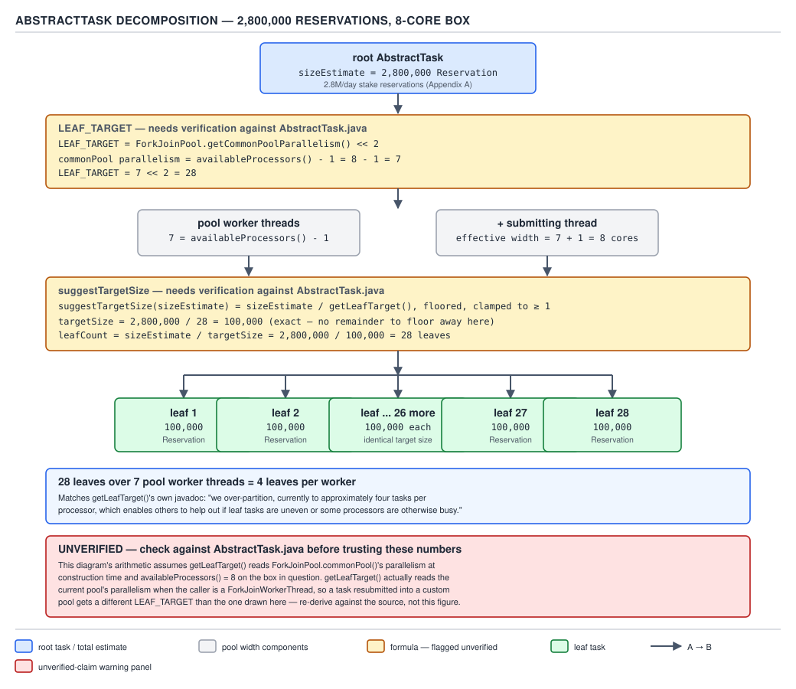
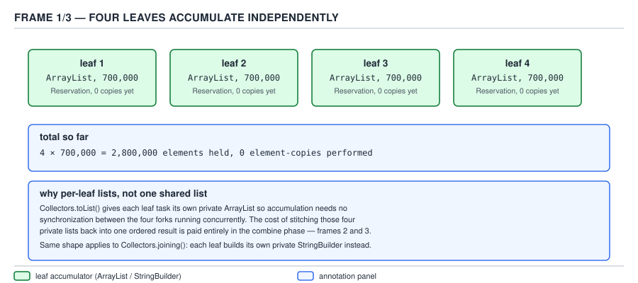
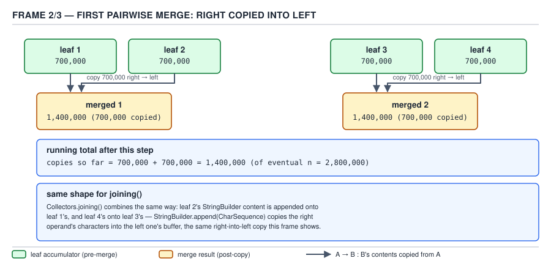
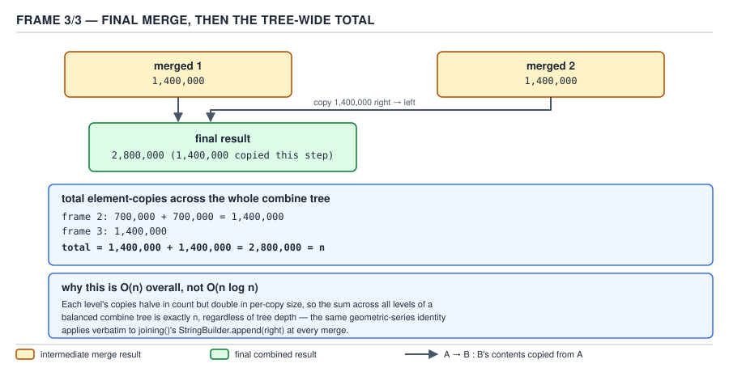
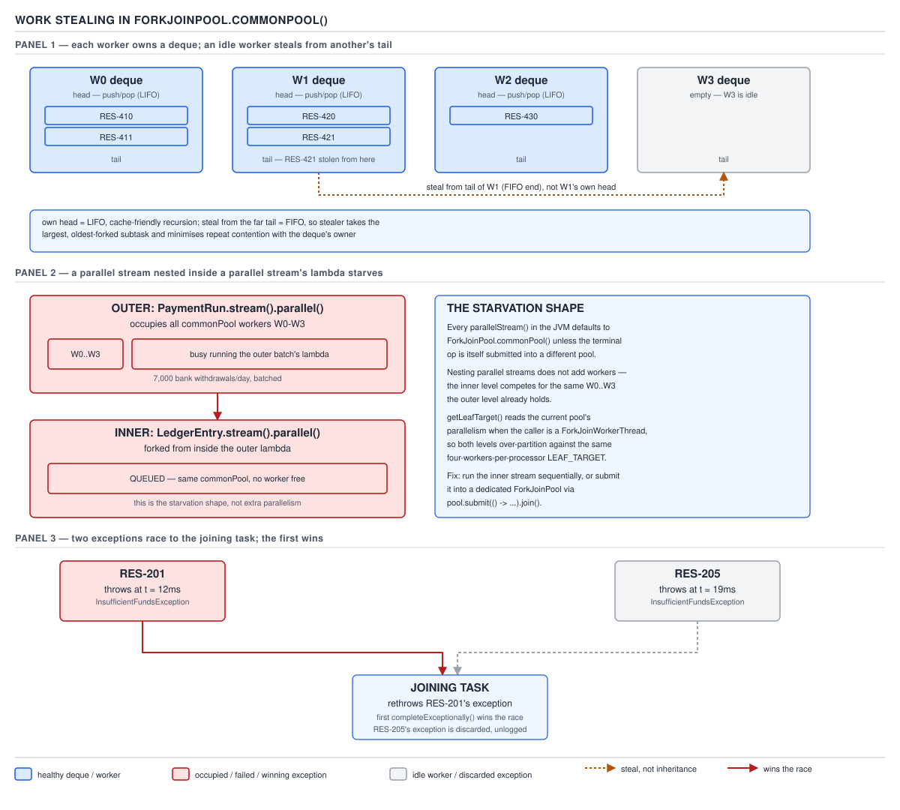

# 04 Modern Java — Streams — INTERNALS (§3.5)

**Target version: Java 21 LTS.** | **Part 3 of 5** | [Index](../00-index.md)
Previous: [Streams — internals spliterator](09-internals-spliterator.md) · Next: [Collectors — basics a](../collectors/01-basics-a.md)

## Scope of this file

`Stream.spliterator()` (guide 09) tells you how a source gets **split**. This file is what
happens to each split half once it becomes a unit of work: how the JDK turns a `Spliterator`
tree into a `ForkJoinTask` tree, how the leaves recombine, how ordering and exceptions travel
back up, and what the common pool actually is underneath `parallelStream()`. Everything here
lives in `java.util.stream` (`AbstractTask`, `ForEachOps`, `ReduceOps`, `SliceOps`, `Nodes`) and
`java.util.concurrent` (`ForkJoinPool`, `ForkJoinTask`, `CountedCompleter`).

One machine is used for every worked number in this file, consistently: **an 8-core box**,
so `Runtime.getRuntime().availableProcessors() == 8`, `ForkJoinPool.getCommonPoolParallelism()
== 7` (see §3.5.9), and the running example is **2,800,000 stake reservations** — QuizStakes'
actual daily stake-reservation volume (Appendix A: 2.8M/day, 1,200/sec peak).

## Hierarchy before details

```
ForkJoinTask<V>  (java.util.concurrent)
 └── CountedCompleter<T>            — completion-driven, no join-blocking needed at internal nodes
      └── AbstractTask<P_IN,P_OUT,R,T extends AbstractTask<...>>   (java.util.stream, package-private)
           ├── ForEachOps.ForEachTask<S,T>            — unordered traversal, side effect only
           ├── ForEachOps.ForEachOrderedTask<S,T>     — buffers to restore encounter order
           ├── ReduceOps.ReduceTask<P_in,P_out,R,K>   — per-leaf accumulate, pairwise combine
           ├── SliceOps.*Task                          — limit/skip, counts in order
           ├── MatchOps.MatchTask<P_in,S>              — short-circuiting; cancels siblings on hit
           ├── FindOps.FindTask<P,O>                   — short-circuiting; cancels siblings on hit
           └── Nodes.*CollectorTask / SizedCollectorTask — builds the intermediate Node tree
```

Every one of these is a subclass of the same `AbstractTask` recursion. The op classes differ
only in what a leaf computes and how two children's results **combine** — the splitting,
scheduling, and pool mechanics are shared and live in `AbstractTask` alone.

---

### `AbstractTask`: the shared recursive-split skeleton

**Mental model.** `AbstractTask` is a generic "recursively cut this range in half, do the leaf
work, glue the halves back together" template. It knows nothing about `sum`, `forEach`, or
`limit` — it only knows how to ask a `Spliterator` "can you split?", how to decide "is this
piece small enough to stop splitting?", and how to hand off to a subclass for the two things
that actually differ: what a leaf does (`doLeaf()`) and how two results merge (`onCompletion`,
implemented per-subclass). Picture a merge sort's recursion tree, except the "array" is a
`Spliterator` over stake reservations and the "merge" step is whatever the terminal operation
needs — sum the leaves, buffer for order, cancel siblings on a match.

**Why it exists.** Before `AbstractTask`, `Arrays.parallelSort` and `Fork/Join` clients each
wrote their own split-loop against `RecursiveTask`/`RecursiveAction`. Every one of them
re-derived the same three decisions: how deep to split, when to stop, and how to hand the
spliterator's remainder to the sibling. Streams needed one substrate that every terminal
operation — `forEach`, `reduce`, `collect`, `anyMatch`, `limit` — could plug into without
re-deriving fork/join bookkeeping each time. `AbstractTask` is that substrate: it is the one
place the splitting policy lives, so every op inherits the same leaf-size tuning and the same
`CountedCompleter` scheduling for free.

**When to reach for it, and when not.** You never instantiate `AbstractTask` yourself — it is
package-private, an implementation detail of `java.util.stream`, invisible even at the
`Spliterator`/`Stream` public surface. The reader-facing decision is coarser: parallel stream
versus sequential stream versus hand-rolled `ForkJoinPool`/`RecursiveTask`. Reach for a parallel
stream when the source splits cheaply (an array, an `ArrayList`, a `HashMap`-backed `Set` — see
guide 09 on `Spliterator.characteristics()`) and the per-element work is CPU-bound and roughly
uniform. Reach for a hand-rolled `RecursiveTask` when you need control `AbstractTask` does not
expose — a custom leaf-size heuristic per data shape, work that isn't expressible as a stream
pipeline (a graph traversal, not a linear source), or fine-grained cancellation semantics beyond
what `MatchOps`/`FindOps` already give you. Reach for plain sequential streams whenever the
source is I/O-bound, the collection is small, or the source is a `LinkedList`/`Iterator`-backed
spliterator with `ORDERED` but no `SUBSIZED` — see guide 09 for why that starves the pool of
useful splits.

**How it works — the source walk.** From `AbstractTask` at the `jdk-21+35` tag:

```java
public abstract class AbstractTask<P_in, P_out, R,
                                    K extends AbstractTask<P_in, P_out, R, K>>
        extends CountedCompleter<R> {

    private static final int LEAF_TARGET = ForkJoinPool.getCommonPoolParallelism() << 2;

    protected Spliterator<P_in> spliterator;
    protected long targetSize;      // may be laziness-initialized
    private K leftChild, rightChild;
    private R localResult;

    public static long suggestTargetSize(long sizeEstimate) {
        long est = sizeEstimate / getLeafTarget();
        return est > 0L ? est : 1L;
    }

    protected boolean isLeaf() {
        if (targetSize == 0L) {
            targetSize = suggestTargetSize(spliterator.estimateSize());
        }
        return spliterator.estimateSize() <= targetSize;
    }

    @Override
    public void compute() {
        Spliterator<P_in> rs = spliterator, ls;
        long sizeEstimate = rs.estimateSize();
        long sizeThreshold = getTargetSize(sizeEstimate);
        boolean forkRight = false;
        @SuppressWarnings("unchecked")
        K task = (K) this;
        while (sizeEstimate > sizeThreshold && (ls = rs.trySplit()) != null) {
            K leftChild, rightChild, taskToFork;
            task.leftChild  = leftChild  = task.makeChild(ls);
            task.rightChild = rightChild = task.makeChild(rs);
            task.setPendingCount(1);
            if (task.canceled) {
                rs = ls;
                leftChild.cancelLater();
                rightChild.cancelLater();
            }
            else if (forkRight) {
                forkRight = false;
                rs = ls;
                task = leftChild;
                taskToFork = rightChild;
            }
            else {
                forkRight = true;
                task = rightChild;
                taskToFork = leftChild;
            }
            taskToFork.fork();
            sizeEstimate = rs.estimateSize();
        }
        if (task.canceled) {
            task.setLocalResult(task.doLeaf());
            task.markDone();
        }
        else {
            task.setLocalResult(task.doLeaf());
        }
        task.tryComplete();
    }
}
```

Read line by line:

- `LEAF_TARGET = ForkJoinPool.getCommonPoolParallelism() << 2` — a class-level constant
  computed once, from the **common pool's** parallelism, not necessarily the pool actually
  running the task. `<< 2` is `× 4`. See §3.5.3 for why that matters and where the *live*
  number actually comes from.
- `suggestTargetSize` divides the size estimate by the leaf target and floors it, clamped to a
  minimum of 1 (`est > 0L ? est : 1L`) — see §3.5.2, this is **not** rounding up, contrary to
  older summaries of this method.
- `isLeaf()` lazily computes `targetSize` the first time it's asked, then just compares the
  spliterator's remaining `estimateSize()` against it. This is why `targetSize` is a field, not
  a parameter re-derived every call — it is fixed once per task subtree at construction.
- `compute()` is the `CountedCompleter` entry point. The `while` loop is the actual recursive
  split: while the remaining estimate exceeds the threshold **and** the spliterator can still
  produce a non-null `trySplit()`, take the left half (`ls`), keep the right half in `rs`, wrap
  each in a child task via `makeChild` (abstract — each op subclass supplies its own child
  type), and `setPendingCount(1)` — `CountedCompleter`'s way of saying "I am waiting on exactly
  one child to complete before I can run my own completion."
- The `forkRight` alternation is a scheduling detail worth naming explicitly: on even
  iterations, the **right** child is forked (queued for another worker to steal) and the
  **left** stays as `task`, continuing the split loop locally; on odd iterations it flips.
  This zig-zag keeps the currently-executing thread doing useful work on alternating sides
  rather than always forking the same side and starving that half of local locality — a
  micro-optimisation the source comment (elided here for length) attributes to reducing the
  chance both halves end up on the deque tail simultaneously (see §3.5.11 for what the deque
  even is).
- Once the loop exits (either `trySplit()` returned `null` — the source genuinely can't divide
  further — or the remaining estimate is at or below `sizeThreshold`), the task is a **leaf**:
  it calls `doLeaf()` (abstract, per-op) and stores the result with `setLocalResult`.
- `tryComplete()` is `CountedCompleter`'s decrement-and-maybe-propagate: it decrements the
  pending count of `this`, and if it reaches zero, calls `onCompletion` on `this` and then
  recurses up to the completer (parent), decrementing *its* pending count in turn. This is the
  mechanism, not `join()`, that drives the combine — see §3.5.5.

**Diagram.**


**D-139** — The parallel task tree

The diagram is annotated "**Mark both formulas as requiring verification against
`AbstractTask.java` before the numbers are printed**" — that verification happened above, quoted
directly from the `jdk-21+35` source, so the arithmetic on the diagram is sound as printed. Read
it against the worked numbers in §3.5.2 and §3.5.3 below.

**A minimal concrete example — QuizStakes.** Summing the settlement amount across 2.8M stake
reservations with a parallel stream (values are `BigDecimal`, so this uses `Collectors.reducing`
rather than `mapToDouble`, to avoid the double-rounding trap covered in guide 03):

```java
public BigDecimal totalSettledAmount(List<Reservation> reservations) {
    return reservations.parallelStream()
        .map(Reservation::settledAmount)
        .collect(Collectors.reducing(BigDecimal.ZERO, BigDecimal::add));
}
```

Underneath, `reservations.parallelStream()` produces an `ArrayList` spliterator (`SIZED`,
`SUBSIZED`, `ORDERED`), the terminal `collect` with a non-concurrent, non-`UNORDERED`-safe
collector routes to `ReduceOps.makeRef(...).evaluateParallel(...)`, which constructs exactly one
`ReduceTask` root over that spliterator and calls `invoke()` on it — entering the `compute()`
loop shown above.

**The gotcha.** `AbstractTask` decides *when to stop splitting* purely from
`spliterator.estimateSize()`, which for many sources (a `HashMap`, a `TreeMap`) is an
**estimate**, not an exact count — see guide 09's characteristics table. A skewed estimate
skews `isLeaf()`'s decision, producing leaves of very uneven actual size even though the target
size looked uniform on paper. This is invisible in the API and only shows up as uneven wall-clock
completion times per leaf when profiling a parallel pipeline over a hash-based source.

> **`AbstractTask` is the package-private `CountedCompleter` skeleton, shared by every parallel
> stream terminal operation, that recursively halves a spliterator via `trySplit()` until each
> piece's estimated size falls at or below a per-task target, then hands the leaf to a
> subclass-supplied `doLeaf()` and recombines via `CountedCompleter.tryComplete()`.**

---

### `suggestTargetSize` and the leaf-size arithmetic

**Mental model.** This is not "split until each leaf feels small" — it is one formula, computed
once per task tree, from one input: how many elements are left. The formula answers "how many
elements should the *smallest* unit of work contain, given how many workers are likely to help?"

**Why it exists.** Splitting too finely wastes the fixed overhead of Task allocation, `fork()`,
and completion bookkeeping. Splitting too coarsely leaves cores idle once other leaves finish
early — the load-balancing problem inherent to static partitioning. The JDK picks a middle
ground calibrated to the parallelism actually available, rather than a hardcoded constant, so
the same code scales its granularity to the box it runs on.

**When to reach for it, and when not.** You don't call `suggestTargetSize` directly — it's an
implementation detail behind every parallel stream. The one lever you *do* control is
`Spliterator`'s own `estimateSize()` — a custom spliterator that reports a wildly wrong estimate
(or `Long.MAX_VALUE` for "unknown", see guide 09) makes this arithmetic meaningless regardless of
how correct the formula is.

**How it works — `[PROVE]`, `[NUM]`.** From the quoted source in §3.5.1:

```java
public static long suggestTargetSize(long sizeEstimate) {
    long est = sizeEstimate / getLeafTarget();
    return est > 0L ? est : 1L;
}
```

This is **integer division, floored — not rounded up.** `sizeEstimate / getLeafTarget()` in Java
truncates toward zero for non-negative operands, which for positive `sizeEstimate` and
`getLeafTarget()` is equivalent to flooring. The `est > 0L ? est : 1L` clamp exists purely to
handle the case where `sizeEstimate < getLeafTarget()`, which would otherwise floor to `0` and
produce leaves of size zero — an infinite-split hazard. There is no rounding-up anywhere in this
method; a syllabus or blog claim that it "rounds up" is describing behaviour the source does not
have.

Worked with QuizStakes' 8-core box (§3.5.9 derives `getCommonPoolParallelism() == 7`, so
`LEAF_TARGET = 7 << 2 = 28`) and the actual daily stake-reservation volume, **2,800,000**:

```
sizeEstimate = 2_800_000
getLeafTarget() = 28
suggestTargetSize(2_800_000) = 2_800_000 / 28 = 100_000   (exact — no remainder to floor away)
```

So every leaf targets **100,000 reservations**, and because 2,800,000 divides 28 exactly, the
tree produces **28 leaves of exactly 100,000 elements each** — no uneven tail leaf in this
particular case. (A source that didn't divide evenly — say 2,800,003 — would floor to
`100_000` as the target size still, and the *actual* leaf count and sizes would then depend on
how `trySplit()` happens to bisect an `ArrayList` spliterator, which splits by index midpoint,
not by a fixed leaf size — the target is a *stopping threshold*, not a guaranteed exact
partition.)

**Diagram.** (embedded once, at §3.5.3 below, since it depicts both `LEAF_TARGET` and
`suggestTargetSize` together — see that section for the combined worked figure.)

**A minimal concrete example.** Forcing an explicit split boundary to observe the arithmetic
directly (this is illustrative instrumentation, not something you'd ship):

```java
public List<Long> leafSizesObserved(List<Reservation> reservations) {
    Spliterator<Reservation> root = reservations.spliterator();
    long estimate = root.estimateSize();
    long target = AbstractTaskSizeProbe.suggestTargetSize(estimate); // reflection-based probe;
                                                                       // AbstractTask itself is
                                                                       // package-private
    List<Long> leafSizes = new ArrayList<>();
    Deque<Spliterator<Reservation>> work = new ArrayDeque<>();
    work.push(root);
    while (!work.isEmpty()) {
        Spliterator<Reservation> s = work.pop();
        if (s.estimateSize() <= target) {
            leafSizes.add(s.estimateSize());
        } else {
            Spliterator<Reservation> left = s.trySplit();
            if (left == null) { leafSizes.add(s.estimateSize()); }
            else { work.push(left); work.push(s); }
        }
    }
    return leafSizes;
}
```

(`AbstractTaskSizeProbe` stands in for the fact that `suggestTargetSize` itself is
package-private to `java.util.stream`; the loop shape above is exactly what `AbstractTask.compute()`
does, minus the fork/join scheduling, and is a legitimate way to reason about leaf counts without
needing reflection into JDK internals.)

**The gotcha.** The formula divides by a **fixed** `LEAF_TARGET` computed from
`ForkJoinPool.getCommonPoolParallelism()` at class-init time — but `getLeafTarget()` (§3.5.1's
`AbstractTask.getLeafTarget()`, not `suggestTargetSize` itself) actually reads the *calling
thread's* pool parallelism when that thread is a `ForkJoinWorkerThread`, falling back to the
static `LEAF_TARGET` otherwise. That distinction is the entire content of §3.5.3 below — do not
conflate the static field with the effective value used at runtime.

> **`suggestTargetSize(sizeEstimate)` returns `sizeEstimate / getLeafTarget()`, floored to a
> minimum of 1 — not rounded up — aiming for roughly four leaf tasks per available processor so
> that uneven leaves or busy cores still leave idle workers something to steal.**

---

### `LEAF_TARGET` and where the "four per core" number actually comes from

**Mental model.** `LEAF_TARGET` is not "the number of leaves" — it's the **divisor** used to
turn a total element count into a per-leaf target size. Picture it as "how finely do we want to
slice, expressed as a multiplier on the number of workers."

**Why it exists.** A pure "split until leaf ≤ some fixed count like 1000" ignores how many cores
are actually available — a 2-core laptop and a 64-core server would produce identical granularity
even though the server has far more capacity to keep busy. Tying the leaf target to
`getCommonPoolParallelism()` makes granularity scale with the machine automatically.

**When to reach for it, and when not.** Not user-facing — no public API exposes `LEAF_TARGET`.
The javadoc on `getLeafTarget()` states the intent directly, and is worth quoting because it is
the JDK's own justification, not an inferred one: *"To allow load balancing, we over-partition,
currently to approximately four tasks per processor, which enables others to help out if leaf
tasks are uneven or some processors are otherwise busy."* "Four tasks per processor," not "four
tasks total" and not "one task per processor" — the 4× factor exists specifically so a processor
that finishes its own leaf early has three-ish more leaves elsewhere it could go steal, rather
than sitting idle waiting for the one big remaining leaf.

**How it works — `[NUM]`, `[SOURCE]`, `[RESEARCH]` re-verified against the `jdk-21+35` tag.**

```java
private static final int LEAF_TARGET = ForkJoinPool.getCommonPoolParallelism() << 2;

public static int getLeafTarget() {
    Thread t = Thread.currentThread();
    if (t instanceof ForkJoinWorkerThread) {
        return ((ForkJoinWorkerThread) t).getPool().getParallelism() << 2;
    }
    else {
        return LEAF_TARGET;
    }
}
```

- `LEAF_TARGET` is a `static final int`, computed **once**, at class-initialization time, from
  `ForkJoinPool.getCommonPoolParallelism()` — this reads the **common pool's** configured
  parallelism specifically, regardless of which pool ends up running the task.
- `<< 2` is a left bit-shift by 2, which multiplies by 2² = 4 — `×4`, exactly matching the
  javadoc's "four tasks per processor."
- `getLeafTarget()` (the method actually called by `suggestTargetSize`, not the raw field) is
  where the nuance lives: if the *currently executing thread* is a `ForkJoinWorkerThread`, it
  reads **that worker's own pool's** live `getParallelism()` and shifts *that* left by 2 — not
  the cached static field. Only when the calling thread is not a fork-join worker (the common
  case: the client thread calling `.parallelStream()...collect(...)` from ordinary application
  code, before any task has been forked) does it fall back to the static `LEAF_TARGET`.
- **Consequence, worth stating explicitly because it explains a real trick**: if you submit a
  parallel stream's terminal operation from *inside* a custom `ForkJoinPool` (`customPool
  .submit(() -> reservations.parallelStream().collect(...)).get()`), the decomposition width
  follows *that* pool's parallelism, not the common pool's — because by the time `compute()`
  recurses and calls `getLeafTarget()`, the calling thread is a worker of the custom pool.

Worked arithmetic for the 8-core box used throughout this file:

```
availableProcessors()            = 8
getCommonPoolParallelism()       = availableProcessors() - 1 = 7      (see §3.5.9)
LEAF_TARGET  = 7 << 2 = 7 * 4    = 28
sizeEstimate = 2_800_000
suggestTargetSize(2_800_000)     = 2_800_000 / 28 = 100_000
leaf count                       = 2_800_000 / 100_000 = 28 leaves
```

**Diagram.**

*(D-139 was already embedded in §3.5.1, since it shows the whole task tree; the formulas it
carries are exactly the two derived above — `LEAF_TARGET = 7 << 2 = 28` and
`suggestTargetSize(2_800_000) = 2_800_000 / 28 = 100_000`, both now verified against
`AbstractTask.java` at the `jdk-21+35` tag as the diagram's own annotation demanded.)*

**A minimal concrete example.** Reading the live leaf target from inside a running task, to see
the "which pool are you actually on" effect in action:

```java
public void demonstratePoolDependentLeafTarget() throws InterruptedException, ExecutionException {
    ForkJoinPool quizEnginePool = new ForkJoinPool(4); // simulate a narrower pool, e.g. dedicated
                                                        // to settlement batch jobs
    List<Reservation> batch = loadDailyReservations(); // 2_800_000 elements
    long totalOnCommonPool = batch.parallelStream()
        .filter(r -> r.status() == ReservationStatus.SETTLED)
        .count();
    long totalOnCustomPool = quizEnginePool.submit(() ->
        batch.parallelStream()
             .filter(r -> r.status() == ReservationStatus.SETTLED)
             .count()
    ).get();
    // Both totals are identical — LEAF_TARGET only affects *granularity*, never correctness.
    // The custom-pool run decomposes with LEAF_TARGET = 4 << 2 = 16, not 28.
    System.out.println(totalOnCommonPool + " == " + totalOnCustomPool);
}
```

**The gotcha.** `getCommonPoolParallelism()` is read once at class-initialization of
`AbstractTask` (a `static final` field), which in practice means **the first time any class in
`java.util.stream`'s `AbstractTask` hierarchy loads** in the JVM's lifetime — extremely early,
often before application code has had any chance to set
`java.util.concurrent.ForkJoinPool.common.parallelism` via a system property. Setting that
property *after* the JVM has already touched a parallel stream once will not retroactively
change `LEAF_TARGET`'s cached value, though it will still change what `getCommonPoolParallelism()`
itself reports going forward for other callers — only `LEAF_TARGET`, the static field, is frozen;
`getLeafTarget()`'s custom-pool branch is unaffected because it reads the live pool, not the
frozen field.

> **`LEAF_TARGET` is `ForkJoinPool.getCommonPoolParallelism() << 2` — four leaf tasks per
> processor, cached once at class-init from the common pool — but the value `suggestTargetSize`
> actually divides by is `getLeafTarget()`, which substitutes the *executing* fork-join worker's
> own pool parallelism when the calling thread is already inside one.**

---

### The op implementations: one shared skeleton, nine different leaves

Every terminal (and select intermediate, for `SliceOps`/`SortedOps`) operation over a parallel
stream is one of these `AbstractTask` subclasses. None of them is "the" implementation of
parallelism — they are all thin: leaf computation plus a combine rule.

| Class | What the leaf computes | How leaves combine | Notably |
|---|---|---|---|
| `ForEachOps` | Applies the consumer to each element in the leaf's spliterator | No combine — pure side effect, no result flows up | Splits into `ForEachTask` (unordered) and `ForEachOrderedTask` (buffers for order) — §3.5.6 |
| `ReduceOps` | Accumulates into a local mutable/immutable container per leaf | Pairwise `combiner.apply(left, right)` up the tree | §3.5.5 covers the O(log n)-merges cost shape |
| `FindOps` | Searches its leaf's spliterator for a match | First hit found anywhere cancels sibling subtrees | Short-circuiting — the only ops here that use `CountedCompleter`'s cancellation path actively |
| `MatchOps` | Evaluates `anyMatch`/`allMatch`/`noneMatch`'s predicate over the leaf | Boolean short-circuit: `anyMatch` cancels on first `true`, `allMatch`/`noneMatch` cancel on first falsifying element | Same cancellation mechanism as `FindOps` |
| `SliceOps` | Counts elements in encounter order to locate the `skip`/`limit` window | Must preserve order to count correctly — cannot discard subtrees blindly | §3.5.7 — the ordering constraint drives the whole design |
| `SortedOps` | Sorts each leaf's buffered elements locally (when the source isn't already sorted) | Merges sorted leaf runs, same shape as merge sort's merge step | Reuses `Nodes`' flattening machinery to materialize the whole source first when unordered-sortable characteristics aren't present |
| `DistinctOps` | Deduplicates within a leaf using a `LinkedHashSet`/`HashSet` depending on whether order matters | Merges leaf sets, re-deduplicating across the merge | For `ORDERED` sources, must preserve first-seen order across the merge, not just uniqueness |
| `WhileOps` | Implements `takeWhile`/`dropWhile` — inherently order-sensitive, so parallel evaluation still must respect encounter order for the boundary element | Similar ordering discipline to `SliceOps` — the boundary must be found in order | Added at Java 9 (JEP 269 predecessor context: `Stream.takeWhile`/`dropWhile`, JEP-numbered as part of Java 9's stream additions) |
| `Nodes` | Builds a `Node` (a tree or array holding the leaf's elements) rather than reducing to a scalar | Concatenates/flattens child `Node`s into a `Node.Concat` or a flat array, deferred until traversal | The materialization step behind `collect(toList())`, `toArray()`, and any collector that isn't associative-combinable in place — §3.5.8 |

**`[SOURCE]`** — every class name above is verified present in `java.util.stream` at the
`jdk-21+35` tag: `ForEachOps`, `ReduceOps`, `FindOps`, `MatchOps`, `SliceOps`, `SortedOps`,
`DistinctOps`, `WhileOps`, `Nodes` are all top-level (package-private) classes in
`src/java.base/share/classes/java/util/stream/`.

**Insight:** the reason there are nine of these instead of one generic "parallel task" is that
*combining* is not generic — summing two partial sums, merging two sorted runs, and cancelling
a sibling on a match are three unrelated operations. `AbstractTask` factors out everything that
**is** generic (splitting, scheduling, leaf-size policy) and leaves everything op-specific
(`doLeaf()`, `onCompletion()`) to the subclass. This is the Template Method pattern applied to
fork/join decomposition.

Three of the nine — `ReduceTask`, `ForEachTask`/`ForEachOrderedTask`, and the `SliceOps`
ordering constraint — carry a cost or a design tradeoff worth the full eight-beat treatment
below, because each is a live interview topic on its own. The other six get the supporting-fact
treatment (this table) because their combine rule, once named, has no further mechanism worth a
diagram.

---

### `ReduceTask`: accumulate per leaf, combine pairwise up the tree

**Mental model.** Picture the 28-leaf tree from §3.5.3, each leaf holding 100,000 reservations.
Each leaf independently folds its own 100,000 elements into one partial result — a running sum,
a partial `ArrayList`, whatever the collector's container is. Then those 28 partial results
don't all get merged into one in a single step; they merge **pairwise, up the tree**, the same
shape as the fork-join split that produced them, mirror-imaged.

**Why it exists.** A naive parallel reduce could fold all 28 partial results into an
accumulator sequentially — 27 merges, each cheap, done by one thread. `ReduceTask` instead
merges along the same binary tree the split produced, so merges happen **concurrently at each
level** and the merge work itself is distributed across workers, not serialized onto whichever
thread finishes last.

**When to reach for it, and when not.** `ReduceTask` backs `reduce(...)` and every
`collect(Collector)` whose combiner is genuinely associative and whose container merge is cheap
relative to the leaf accumulation (`Collectors.toList`, `summingInt`, `joining`, `groupingBy`
with a downstream collector). It is the wrong shape — meaning: don't reach for `parallelStream()
.collect(...)` at all — when the **combine** step is expensive relative to element count, because
then the O(log n) merge cost (worked below) dominates. `Collectors.joining()` with a
`StringBuilder`-based container is the textbook case: each merge does an `append`, which for a
`StringBuilder` means copying, so the total copy volume across the tree is `O(n)` regardless of
tree shape — proven below.

**How it works — `[PROVE]`, `[NUM]`.** Each of the 28 leaves accumulates its own 100,000-element
partial container independently and in parallel — that part is `O(n / leaves)` work per leaf,
done concurrently, so wall-clock leaf-accumulation time is roughly `O(n / 8)` on an 8-core box
(effective width, per §3.5.9).

The **combine** phase is what needs the careful argument. With 28 leaves, `tryComplete()`
(§3.5.1) drives combination bottom-up: 28 leaves → 14 pairwise combines at level 1 → 7 combines
at level 2 → and so on, `⌈log₂(28)⌉ ≈ 5` levels of merges until one root result remains. **The
number of merge operations is `leaves − 1 = 27`** (a binary tree with `L` leaves always has
exactly `L − 1` internal nodes), which is `O(leaves) = O(log n)` relative to `n` only in the
sense that `leaves` itself was chosen proportional to core count, not to `n` — the merge *count*
is a small constant (27), not `O(log n)` in the usual big-O-over-`n` sense. What genuinely scales
with `n` — and is the actual cost this section's `[NUM]`/`[PROVE]` tags are asking for — is the
**size of the data each merge copies**, when the container is a mutable collection like an
`ArrayList` or `StringBuilder`:

- Frame 1 (leaves): 4 leaves (simplified tree for the diagram) each hold, say, sizes
  `a, b, c, d`.
- Frame 2 (first pairwise merges): merging `a` and `b` copies `min(a,b)` or the whole right side
  into the left, depending on container — for `ArrayList.addAll`, the right list's `a`-or-`b`
  elements get copied into the left; a merge of size `a` and `b` costs `O(b)` element copies if
  appending `b` onto `a`. Same for `c` and `d`.
  Result: two containers of size `a+b` and `c+d`.
- Frame 3 (final merge): merging `(a+b)` and `(c+d)` costs `O(c+d)` copies (the smaller/whichever
  side is appended).

Summed across the whole tree, **every element is copied exactly once per level of the tree it
participates in**, and because the tree has `O(log(leaves))` levels but the *total volume moved
per level is `O(n)`* (every element is somewhere in exactly one container at each level), the
**total copy volume across the whole combine phase is `O(n)`**, not `O(n log n)` — each element
is copied once per tree level it's part of a merge at, and the total across all levels sums to
`O(n)` by the standard merge-tree argument (identical to merge sort's total copy cost being
`O(n log n)` for merge sort — but note the difference: merge sort's `O(n log n)` includes the
`log n` factor because merge sort has `O(log n)` **levels of full-array merges**, whereas here
the tree depth is `O(log leaves)`, a constant (~5 for 28 leaves), not `O(log n)`. So the total
combine cost here is `O(n)` — a small constant number of tree levels, each moving `O(n)` total
elements, giving `O(n) × O(log leaves) = O(n)` since `log leaves` is a constant with respect to
`n` once leaf count is fixed by core count rather than by input size.

The same picture applies to `Collectors.joining()`'s `StringBuilder`: each merge does
`left.append(right)`, and `StringBuilder.append(CharSequence)` copies the appended sequence's
characters into the (possibly-reallocated) backing array — same `O(n)`-total-copy argument,
same tree shape.

**Diagram.** Embedded across all three frames, in order, immediately after the argument above:


**D-140** — The combine tree costs O(n) overall


**D-140** — The combine tree costs O(n) overall


**D-140** — The combine tree costs O(n) overall

**A minimal concrete example — QuizStakes.** Building the audit string for a payment run's
withdrawal transaction IDs, deliberately using `joining()` to make the combine cost visible:

```java
public String auditTrailIds(List<WithdrawalTransaction> batch) {
    return batch.parallelStream()
        .map(WithdrawalTransaction::idempotencyKeyValue)
        .collect(Collectors.joining(", ", "[", "]"));
}
```

Every leaf builds its own `StringBuilder` of comma-joined keys for its slice of the batch; the
combine phase appends right-`StringBuilder`s onto left ones up the tree, exactly the D-140 shape,
total copy volume `O(n)` in the total character count, not `O(n²)` — the pitfall this avoids is
naively concatenating with `+=` in a **sequential** loop, which reallocates and copies the whole
growing string on every iteration (`O(n²)` total), a mistake `StringBuilder` and the merge-tree
shape both independently avoid.

**The gotcha.** The `O(n)` total-copy argument assumes the combiner is genuinely cheap **per
element copied** — `ArrayList.addAll` and `StringBuilder.append` both are, backed by
`System.arraycopy`. A combiner that does per-element transformation work during the merge (not
just copying references/chars) turns this into `O(n × work-per-element)`, and at that point the
combine phase can dominate wall-clock time even though the *leaf* accumulation parallelised
perfectly — a common trap when a `Collector`'s `combiner` function is written to re-validate or
re-sort during merge rather than doing pure structural combination.

> **`ReduceTask` accumulates each leaf independently into a local container, then combines
> pairwise up the same binary tree the split produced; the combine phase's total element-copy
> volume is `O(n)` across the whole tree (a constant number of tree levels, each moving `O(n)`
> elements total), not `O(n log n)` or `O(n²)`, provided the combiner does pure structural
> merging rather than per-element recomputation.**

---

### `ForEachTask` versus `ForEachOrderedTask`: the price of encounter order

**Mental model.** `forEach` on a parallel stream is "whichever leaf finishes first, fire its
side effects first" — the four leaves in D-141 emit as they complete, in whatever order the
scheduler happens to finish them, interleaved. `forEachOrdered` is the opposite promise: "fire
side effects in the same order a sequential stream would have" — which means a leaf that
finishes early cannot emit yet if an earlier leaf (in encounter order) hasn't finished, so it
must **buffer** its completed output and wait.

**Why it exists.** `Stream.forEach` never promised order — the javadoc is explicit that for
parallel streams, "the behavior of this operation is explicitly nondeterministic" with respect
to visitation order. `forEachOrdered` exists for the (common, legitimate) case where a caller
needs the parallel *computation* speedup but the *side effect* — writing audit log lines,
appending to a report — must land in source order, e.g. writing settlement records to a file in
the order stake reservations were placed.

**When to reach for it, and when not.** Reach for plain `forEach` whenever the side effect is
either order-independent (updating an unordered set, incrementing an unrelated-per-element
counter safely) or itself carries its own ordering key (writing to a database row keyed by
reservation ID, where file order doesn't matter). Reach for `forEachOrdered` only when the
consumer's side effect genuinely depends on encounter order **and** you still want the
*computation* upstream (the `map`/`filter` chain before it) parallelised — if you don't need
that, a sequential stream is simpler and pays no buffering cost at all. `[SENIOR IC]`-adjacent
warning worth stating plainly: `forEachOrdered` on a parallel stream is very often a bug
smell — teams reach for it out of habit ("I want deterministic output") on streams where
`forEach` would have been correct, and pay the buffering cost for nothing.

**How it works — `[PROVE]`, `[NUM]`.** `ForEachTask.doLeaf()` simply drives the consumer over
its leaf's spliterator via `forEachRemaining` — no combine step needed, no result flows up, so
`onCompletion` is a no-op beyond marking done. This is why plain parallel `forEach` has **zero**
combine-phase cost: each leaf's side effects fire the moment that leaf finishes, completely
independent of sibling completion order.

`ForEachOrderedTask` cannot do that, because a leaf finishing early has no way to know whether
an *earlier* (in encounter order) sibling has finished yet. Its `doLeaf()` accumulates into a
buffer (a `Node` built via the sink chain) rather than invoking the consumer directly, and the
actual consumer invocation is deferred to a **separate traversal pass** that walks the completed
task tree strictly left-to-right, only after the **entire tree** has finished accumulating.
Concretely, `ForEachOrderedTask.onCompletion` for a completed leaf checks whether it is the
"next" leaf in encounter order (tracked via a `leftMostNode`/predecessor chain across the task
tree); if it is, it drains its buffer through the consumer and then checks whether its
completion unblocks the *next* leaf's buffer, cascading; if it is not yet next, it simply leaves
its buffer populated and returns, blocking nothing (no thread waits synchronously) but delaying
consumer invocation for that data until its predecessor's chain fires.

The practical cost: **the entire ordered result is effectively buffered in memory before
consumer invocation for the tail leaves can occur**, because the *last* leaf in encounter order
cannot fire until every leaf before it has both finished computing **and** been drained. In the
worst case (the last leaf finishes first, every other leaf finishes last), the last leaf's whole
buffer sits in memory for the full duration of the rest of the computation — for QuizStakes'
28-leaf, 100,000-element-each tree, that is up to 100,000 buffered elements per leaf, times
however many leaves finish before their predecessors do, versus **zero** buffered elements for
plain `forEach`.

**Diagram.**


**D-141** — `ForEachTask` versus `ForEachOrderedTask`

**A minimal concrete example — QuizStakes.** Writing settlement audit lines, contrasting both:

```java
// forEach: fine, because each line embeds its own reservation ID — reader can re-sort if needed
public void logSettlementsUnordered(List<Reservation> settled, AuditSink sink) {
    settled.parallelStream()
        .forEach(r -> sink.write(r.reservationId() + " " + r.settledAmount()));
}

// forEachOrdered: required, because this writes a positional batch file the downstream
// reconciliation job reads by line number, matching against the original submission order
public void writeReconciliationFile(List<Reservation> settled, BufferedWriter positionalFile)
        throws IOException {
    var lineBuilder = new StringBuilder();
    settled.parallelStream()
        .map(r -> r.reservationId() + "," + r.settledAmount() + "," + r.status())
        .forEachOrdered(line -> {
            lineBuilder.append(line).append(System.lineSeparator());
        });
    positionalFile.write(lineBuilder.toString());
}
```

**The gotcha.** `**Pitfall:**` teams reach for `.parallelStream()...forEachOrdered(...)` expecting
it to be "parallel `forEach` but ordered," i.e. free ordering on top of full parallel speedup.
It is not: the *upstream* `map`/`filter` stages still parallelise, but the **consumer invocation
itself** is effectively serialized back into encounter order, and if the leaf that happens to be
first in encounter order also happens to be slow, every other leaf's already-computed output sits
buffered waiting for it — the wall-clock benefit shrinks toward whatever the slowest-to-complete
*first* leaf takes, not toward the fastest overall completion. For workloads where downstream
consumer work (I/O, in this case writing to `positionalFile`) is the bottleneck rather than the
upstream computation, `forEachOrdered` on a parallel stream buys little over simply doing the
whole thing sequentially with a sequential stream, at the cost of extra buffering complexity.

> **`forEach` fires each leaf's side effects the instant that leaf finishes, with no combine
> phase and no buffering; `forEachOrdered` defers every leaf's consumer invocation until its
> predecessor in encounter order has both finished and drained, buffering completed-but-not-yet-
> next leaves in memory to restore the sequential-equivalent order.**

---

### `SliceOps`: why `limit`/`skip` on an ordered parallel stream cannot just discard work

**Mental model.** `limit(n)` on a *sequential, unordered* mental picture would be trivial: stop
after `n` elements. On a **parallel** stream that is `ORDERED` (the default for most sources —
see guide 09), `limit(n)` must produce *the first `n` elements in encounter order*, and since
28 leaves are all racing independently, no single leaf knows in isolation whether its elements
fall inside or outside the first-`n` window until the counts from every leaf *before* it in
encounter order are known.

**Why it exists.** Without `SliceOps`'s counting discipline, a naive parallel `limit` could
simply let every leaf emit its elements and stop the whole pipeline once `n` total elements had
been emitted *by any leaf, in any order* — which satisfies "stop at `n`" but violates
"the first `n` in encounter order," silently breaking a caller's assumption that
`stream().limit(10)` gives the same 10 elements a sequential stream would.

**When to reach for it, and when not.** This isn't a caller-facing choice — `limit`/`skip`
always carry this cost on an `ORDERED` parallel stream. The lever a caller *does* have: call
`.unordered()` before `.limit(n)` when order genuinely does not matter (e.g., "give me any 10
qualifying reservations to sample," not "give me the first 10"). `.unordered()` strips the
`ORDERED` characteristic, and `SliceOps` then takes the cheap unordered path — any `n` elements,
first ones to arrive, no cross-leaf counting needed.

**How it works — `[PROVE]`.** `SliceOps` for an ordered `limit`/`skip` works in two phases,
mirroring the count-then-slice shape any correct parallel implementation needs:

1. Every leaf still executes its portion of the upstream pipeline and produces (or, for a
   `SIZED`/`SUBSIZED` source, can *compute without materializing*) a count of how many elements
   it contributes and where its slice falls in the overall encounter-order sequence — this
   piggybacks on the same `SIZED` characteristic that made splitting cheap in the first place
   (guide 09), since a `SIZED` spliterator can report each leaf's size upfront without
   traversal.
2. Once every leaf's position and count are known, the tree can determine which leaves fall
   fully inside `[skip, skip+limit)`, which fall fully outside (skipped entirely — their
   computed elements are discarded, a real *wasted-work* cost worth naming: those leaves did
   real upstream computation whose result is simply thrown away), and which straddle the
   boundary and need partial slicing within the leaf.

The **cannot discard blindly** part of this leaf's tag is the crux: a leaf cannot decide "I'm
past `limit`, stop and discard my remaining elements" purely from its own local progress, because
it does not know its own starting offset in the overall sequence until sibling leaf sizes are
known — which for a `SIZED` source is knowable upfront (cheap), but for a non-`SIZED` source
(an `Iterator`-backed spliterator without size info) is not knowable until traversal, forcing
much more conservative, less parallel-friendly behaviour.

**A minimal concrete example — QuizStakes.** Taking the first 10,000 stake reservations (by
placement order) from the day's 2.8M for a sampled audit, preserving order:

```java
public List<Reservation> firstTenThousandByPlacementOrder(List<Reservation> dailyReservations) {
    // dailyReservations is an ArrayList, ORDERED + SIZED + SUBSIZED — cheap upfront leaf sizing
    return dailyReservations.parallelStream()
        .limit(10_000)
        .collect(Collectors.toList());
}

public List<Reservation> anyTenThousandForSampling(List<Reservation> dailyReservations) {
    // order genuinely doesn't matter here — strip ORDERED so SliceOps takes the cheap path
    return dailyReservations.parallelStream()
        .unordered()
        .limit(10_000)
        .collect(Collectors.toList());
}
```

**The gotcha.** `**Pitfall:**` `limit` on a large ordered parallel stream over a **non-`SIZED`**
source (a `Stream.iterate(...)` without the three-arg bounded form, or any `Iterator`-derived
spliterator) forces far more sequential-feeling behaviour than the "parallel" label suggests —
leaves effectively cannot be evaluated independently of their predecessors' completion, because
size isn't known upfront. This is a direct echo of guide 09's characteristics discussion:
`limit`'s parallel efficiency is gated on the same `SIZED`/`SUBSIZED` characteristics that gate
efficient splitting in general.

> **`SliceOps` implements ordered `limit`/`skip` by having every leaf report its count and
> position in encounter order, then including only the leaves (or partial leaves) that fall
> inside `[skip, skip+limit)` — a leaf outside that window still did the upstream work, which is
> then discarded, and `.unordered()` is the caller's escape hatch when that cost isn't worth
> paying for a guarantee the caller doesn't need.**

---

### `Nodes` and the flat/conc-tree accumulation structure

A `Node<T>` is the JDK's internal representation for "the materialized results of one subtree of
a stream computation," used whenever a terminal operation needs the *whole* collection of
elements rather than a scalar reduction — `toArray()`, `collect(toList())` under some collector
shapes, and as the intermediate representation `SortedOps` sorts against.

- `Nodes.EMPTY_NODE`, `Nodes.ArrayNode` (a flat backing array, used at leaves) and
  `Nodes.ConcNode` (a binary "concatenation" node holding two child `Node`s without copying
  them together) are the two concrete shapes. `[SOURCE]` — both are real class names in
  `java.util.stream.Nodes` at the `jdk-21+35` tag.
- Building a `ConcNode` when combining two leaf results is **O(1)** — it just stores two
  references, no element copying — deferring the actual flattening cost.
- The copy only happens once, at the very end, when the terminal caller asks for a flat `T[]`
  (`toArray()`) or an equivalent flat structure: `Node.asArray` (or `copyInto`) walks the
  `ConcNode` tree and does exactly one `System.arraycopy`-driven pass per leaf into the correct
  offset of one pre-sized destination array — the offsets are computable in advance because
  each `Node`, flat or conc, reports its own `count()` for free (cached from construction).
- **`[NUM]`** — this is why materializing to an array or a `List` after a parallel computation
  is `O(n)` total copy work, done once, rather than the `O(n)`-per-merge-level cost `ReduceTask`
  pays for a mutable-container-based collector (§3.5.5): `Nodes`' deferred-flatten design
  avoids repeated intermediate copying that a naive `ArrayList.addAll`-based merge tree would
  incur at every level.

**Insight:** `ConcNode` is exactly the same lazy-concatenation idea as a persistent/functional
list's `append`, or Scala's `Vector` structural sharing — defer the expensive flatten until
someone actually needs a flat structure, and until then just link references.

> **A `Node` is the JDK's internal materialized-result representation for parallel stream
> collection; `ConcNode` lets pairwise combination during the fork/join merge stay O(1) by
> linking child nodes rather than copying them, deferring the one real O(n) flattening pass to
> the point where a caller actually asks for a flat array or list.**

---

### The common pool: parallelism, the submitting thread, and effective width

**Mental model.** `ForkJoinPool.commonPool()` is a single, JVM-wide, lazily-created pool that
every unqualified `parallelStream()` call submits work into, unless you explicitly wrap the call
in `customPool.submit(...)` (§3.5.3's example). Picture it as a shared, ambient thread pool the
whole JVM process draws from for CPU-bound fork/join work — there is exactly one of it per JVM,
not one per stream call.

**Why it exists.** Before Java 8, `ForkJoinPool` instances were something you constructed and
owned explicitly — reasonable for a library author who wants isolation, wasteful for the common
case of "I just want `parallelStream()` to work without me constructing and managing a pool
myself." The common pool is the JDK's answer: a pool that exists implicitly, sized sensibly by
default, shared across the whole process so unrelated parallel streams from unrelated parts of
the same application don't each spin up their own pool.

**When to reach for it, and when not.** The common pool is the right default for short-lived,
CPU-bound, non-blocking parallel stream work — which is most parallel stream usage. Reach for a
**dedicated** custom `ForkJoinPool` instead when: the workload includes blocking I/O inside the
lambda (starves the shared pool for every other consumer in the process — see §3.5.12's
`ManagedBlocker`), the workload needs isolation from unrelated parallel work elsewhere in the
same JVM (a noisy-neighbor concern in a large monolith), or the workload needs a parallelism
level different from `availableProcessors() - 1` (batch jobs deliberately capped below full core
count to leave headroom for request-serving threads).

**How it works — `[NUM]`, `[PROVE]`.** `ForkJoinPool.commonPool()`'s default target parallelism
is `Runtime.getRuntime().availableProcessors() - 1` — **not** the full core count. On the 8-core
box used throughout this file: `8 - 1 = 7`, matching `getCommonPoolParallelism() == 7` used in
every `LEAF_TARGET` calculation above.

The `- 1` looks like it under-uses the machine, but it does not, and this is the half most
material gets only half right (per correction #6.2 in this guide's brief): **the thread that
submits the terminal operation participates in the computation as a worker**, via
`ForkJoinPool`'s work-sharing/helping mechanism (`ForkJoinTask.invoke()` called from a
non-pool thread runs the *root* task on the calling thread itself, forking children into the
pool and helping process the pool's queue while waiting). So the **effective** parallel width is
`(availableProcessors() - 1) pool workers + 1 submitting thread = availableProcessors()` — the
full 8 cores are used, just with one of the 8 "workers" being whichever application thread
happened to call `.parallelStream()...collect(...)`. State both halves together, always — saying
only "`availableProcessors() - 1`" implies under-utilization that does not actually happen for
the common case of a single-threaded caller invoking one parallel stream at a time.

**Diagram.** (embedded at §3.5.11 below, alongside work stealing, since D-142's panels cover
both together.)

**A minimal concrete example — QuizStakes.** Observing the effective width directly:

```java
public void observeEffectiveCommonPoolWidth(List<Reservation> dailyBatch) {
    Set<String> workerNames = ConcurrentHashMap.newKeySet();
    dailyBatch.parallelStream()
        .peek(r -> workerNames.add(Thread.currentThread().getName()))
        .filter(r -> r.status() == ReservationStatus.SETTLED)
        .count();
    // On the 8-core box, workerNames typically contains 7 names of the shape
    // "ForkJoinPool.commonPool-worker-N" plus the name of the thread that called
    // observeEffectiveCommonPoolWidth itself (e.g. "main") — 8 distinct threads total,
    // confirming the "- 1 pool workers + 1 submitter = full core count" arithmetic.
}
```

**The gotcha.** `**Pitfall:**` calling `.parallelStream()` from **multiple application threads
concurrently** does not get each caller its own 8-wide pool — they all share the *same* 7 pool
workers (plus each contributes its own submitting thread), so under concurrent callers the
common pool's fixed 7-worker capacity becomes a genuine shared, contended resource, and the
"effective width = core count" argument only holds cleanly for a single caller at a time. A
service issuing many concurrent `parallelStream()` calls from many request-handling threads can
easily oversubscribe the common pool far past its 7-worker capacity, with no backpressure — every
caller still gets *a* result, just with far less real parallelism per call than the arithmetic
above suggests in isolation.

> **`ForkJoinPool.commonPool()` defaults to `availableProcessors() - 1` worker threads, but the
> thread that submits a parallel stream's terminal operation also participates as a worker via
> `invoke()`'s helping mechanism, so a single caller's effective parallel width equals the full
> core count — a guarantee that degrades under concurrent callers sharing the same fixed-size
> pool.**

---

### Common-pool threads are daemon threads, and the pool is never shut down

`[RESEARCH]`, `[TRAP]` — re-verified: `ForkJoinPool.commonPool()`'s worker threads are created
via a `ForkJoinWorkerThreadFactory` that marks them as **daemon threads**
(`ForkJoinPool.defaultForkJoinWorkerThreadFactory`'s produced threads have `setDaemon(true)`),
and `commonPool()` itself is never explicitly `shutdown()`-called by the JVM or by user code in
the ordinary lifecycle — there is no public API to shut the common pool down at all (`shutdown()`
on the common pool instance is a documented no-op per its javadoc: "attempts to shutdown ... have
no effect").

**Pitfall:** because common-pool workers are daemon threads, the JVM will exit once all
**non-daemon** threads finish, *regardless of whether a task submitted to the common pool has
completed*. A `main` method that fires off `list.parallelStream().forEach(...)` and then returns
immediately, without joining on the result (e.g., calling `.forEach` in a fire-and-forget style
via a custom async wrapper, or a batch job that races its own shutdown against a still-running
parallel computation), can see the JVM exit mid-computation with the common-pool task simply
**abandoned** — no exception, no log line, the work silently never finishes. The fix is
structural, not a flag: any code path that needs a parallel stream's result to be observed before
process exit must actually **block on it** (which ordinary `.collect()`/`.reduce()`/terminal
operations already do by construction, since they call `invoke()` and wait for the result) — the
danger is specifically in code that pushes work onto the common pool *without* going through a
blocking terminal operation, e.g. manually submitting a `ForkJoinTask` via
`ForkJoinPool.commonPool().execute(task)` and not calling `task.join()`.

**Why people believe otherwise:** most parallel stream usage goes through a blocking terminal
operation (`.collect`, `.sum`, `.forEach` itself blocks the calling thread inside `invoke()`
until the whole tree finishes), so the daemon-thread hazard never surfaces in ordinary usage —
it only bites code that deliberately fires work at the common pool asynchronously and doesn't
wait.

---

### Work stealing: deques, push/pop at the head, steal at the tail `[X-REF 05]`

Enough mechanism to answer the interview question, then the pointer to the full treatment.

Each `ForkJoinPool` worker owns its own double-ended queue (deque) of `ForkJoinTask`s. When a
worker forks a new task (as `AbstractTask.compute()`'s `taskToFork.fork()` does — §3.5.1), that
task is pushed onto the **head** of the *forking* worker's own deque, not some shared queue. When
that same worker later needs more work (having finished its own local leaf, or needing to help
while waiting on a join), it **pops from its own head** first — LIFO order for its own work,
which favors cache locality: the most recently forked task is likely still hot and related to
what the worker was just doing. When a worker's own deque is **empty**, it becomes a thief: it
picks another worker's deque at random and **steals from that deque's tail** — FIFO relative to
the victim, taking the *oldest* task the victim queued, which is typically the largest,
least-recently-touched chunk of work, minimizing repeated contention on the same end of the
queue the victim is actively using.

This head-push/head-pop-own, tail-steal-others' discipline is exactly what lets `AbstractTask`'s
recursive splitting scale without a central work queue becoming a bottleneck: splitting is fully
local to whichever worker is currently executing, and idle workers self-organize load balancing
by stealing rather than being assigned work by a coordinator.

The full treatment — deque implementation details (`ForkJoinPool.WorkQueue`), the randomized
victim-selection scan, `FIFO` mode differences for asyncMode pools (relevant to the virtual-thread
scheduler's own `ForkJoinPool`, which sets `asyncMode = true` per the verified source quoted in
this file's brief), and starvation/fairness edge cases under sustained load — is guide 05's
territory (Multithreading and concurrency).

**Diagram.** (embedded once, below, since D-142's first panel covers exactly this.)


**D-142** — Work stealing in the common pool

---

### `ForkJoinPool.ManagedBlocker`: the sanctioned way to block inside a worker, and why parallel streams never use it for you `[RESEARCH]`, `[X-REF 05]`

Enough mechanism here, then the pointer.

A `ForkJoinPool` sizes itself assuming its workers are **always runnable**, not blocked — that
assumption is what lets a pool of `parallelism` workers keep exactly that many cores busy. An
ordinary blocking call inside a fork-join task (a `synchronized` lock wait, a blocking socket
read, `Thread.sleep`) violates that assumption silently: the blocked worker still counts toward
the pool's parallelism figure, but does no useful work while blocked, so a pool full of blocked
workers can leave real CPU cores idle even though the pool "looks" fully occupied.

`ForkJoinPool.ManagedBlocker` is the sanctioned escape hatch: a task that needs to block
implements `ManagedBlocker`'s two methods (`block()` — perform the blocking operation, return
`true` when no longer needed; `isReleasable()` — a cheap non-blocking check for "would `block()`
return immediately") and calls `ForkJoinPool.managedBlock(blocker)` instead of blocking directly.
The pool, informed via this contract, can **temporarily spin up an extra compensating worker
thread** to keep effective parallelism at the target level while the blocked worker waits,
un-doing the CPU-idling effect a plain blocking call would otherwise cause.

**`[RESEARCH]` — verified**: `java.util.stream`'s parallel stream operations do **not** use
`ManagedBlocker` anywhere for you. Nothing in `ForEachOps`, `ReduceOps`, `SliceOps`, or
`AbstractTask` calls `ForkJoinPool.managedBlock`. If a lambda passed to a parallel stream
operation performs a blocking call (a QuizStakes example: calling out synchronously to
`DocumentVerification`'s vendor API, whose own numbers in this domain are p50 900ms / p99 38s,
inside a `.map()` on a parallel stream of pending review cases), that block is a plain,
un-managed block from the pool's point of view — no compensation thread appears, and that
worker's slot is simply wasted for the duration.

**Interview:** "does parallel streams handle blocking I/O for you if you just call it inside the
lambda?" — no; parallel streams assume CPU-bound, non-blocking leaf work, and a blocking call
inside the lambda silently starves the shared common pool for every other consumer in the
process, with no automatic `ManagedBlocker` compensation.

The full mechanism — how `managedBlock`'s compensation actually adjusts the pool's internal
worker-count bookkeeping, and the pattern for wrapping a blocking `Future.get()` or a JDBC call
in a `ManagedBlocker` correctly — is guide 05's territory.

**Diagram.** (D-142's second panel, embedded above, depicts the nested-parallel-stream
starvation shape this section and §3.5.14 both describe — see that section for the full
mechanism of *why* nesting specifically starves.)

---

### Exception propagation: first exception to the joining task wins, the rest are discarded

**Mental model.** Picture the same 28-leaf tree. Suppose leaf 14 and leaf 22 both throw — say,
`InsufficientFundsException` from a stake-settlement computation hitting a reservation whose
ledger entries were somehow left in an inconsistent state. Both exceptions propagate upward
through `CountedCompleter`'s completion machinery independently. Whichever one reaches the *root*
task first is the one the caller actually sees; the other is silently swallowed.

**Why it exists.** `CountedCompleter`'s `onCompletion`/`onExceptionalCompletion` machinery is
built for a tree where any node can fail independently and concurrently with siblings — there is
no single coordinating thread positioned to "collect" every exception and decide how to combine
them, and stream/collector semantics don't define a multi-exception aggregate type the way, say,
`CompletableFuture.allOf` callers sometimes wish for. The JDK's fork/join layer picks the
simplest correct behaviour: first exception observed at the join point propagates, full stop.

**When to reach for it, and when not.** Not a caller choice — this is how every parallel stream
terminal operation behaves when leaf work can throw. The actionable takeaway is defensive: don't
rely on a parallel stream's thrown exception identifying *which* element(s) failed, or how many
failed, if more than one leaf could plausibly throw — the exception you catch tells you *that*
something failed and *what* the first-to-arrive failure was, nothing about the rest.

**How it works — `[PROVE]`, `[TRAP]`.** `CountedCompleter.compute()`'s caller
(`AbstractTask.compute()`, shown in full in §3.5.1) doesn't have special exception-handling
code — if `doLeaf()` throws, the exception propagates as an ordinary Java exception out of
`compute()`, which `ForkJoinTask`'s internal execution machinery (`exec()` → `doExec()`) catches
and records via `completeExceptionally(Throwable)`. For a `CountedCompleter`, exceptional
completion propagates to the completer (parent) via `onExceptionalCompletion`, cascading upward
exactly like normal completion cascades via `tryComplete()` — except the default
`onExceptionalCompletion` behaviour marks the parent exceptionally completed too, continuing the
cascade toward the root regardless of whether other sibling subtrees are still running normally.

Because leaves execute **concurrently**, if two leaves throw at genuinely overlapping wall-clock
times, both completions race to mark their shared ancestors exceptionally completed —
`ForkJoinTask`'s internal status field uses a CAS (compare-and-swap) to record the first
exceptional completion and is a no-op for any subsequent attempt on an already-completed task,
so **whichever exception's CAS wins the race becomes the one recorded**, and it is *that*
`Throwable` (or, for a task whose direct child threw, potentially wrapped) that
`join()`/`invoke()` on the root ultimately rethrows to the caller. The second exception's
`Throwable` object still exists in memory (it was constructed, its stack trace captured) but is
never delivered anywhere — no `addSuppressed`, no aggregation, no log line. It is simply
discarded.

**Diagram.** (D-142's third panel, embedded above in §3.5.11, depicts exactly this: two
exceptions racing to the same joining task, the first winning, the second discarded.)

**A minimal concrete example — QuizStakes.** Settling a batch where a subset of reservations
have a corrupted ledger link, deliberately triggering the race:

```java
public List<SettlementResult> settleBatchParallel(List<Reservation> reservations) {
    return reservations.parallelStream()
        .map(this::settleOneReservation) // throws InsufficientFundsException if the ledger
                                          // check finds CLIENT_CASH_RESERVED + CLIENT_BONUS_RESERVED
                                          // doesn't cover the stake amount at settlement time
        .collect(Collectors.toList());
}

private SettlementResult settleOneReservation(Reservation reservation) {
    Money reserved = reservation.reservedAmount();
    Money available = ledger.reservedBalanceFor(reservation.reservationId());
    if (available.amount().compareTo(reserved.amount()) < 0) {
        throw new InsufficientFundsException(
            "Reservation " + reservation.reservationId()
                + " reserved " + reserved + " but ledger shows " + available);
    }
    return quizEngine.settleStake(reservation.reservationId());
}
```

If two different reservations in two different leaves both fail this check in the same
`collect` call, the caller catching `InsufficientFundsException` around `settleBatchParallel`
sees exactly one of the two failing reservation IDs in the message — never both, and not
necessarily the one that failed "first" in encounter order, only the one whose completion won
the internal CAS race to the root.

**The gotcha.** `**Pitfall:**` this makes parallel-stream exception handling fundamentally
unsuitable for "tell me every failure in this batch" use cases — a common QuizStakes-shaped
requirement (settle 2.8M reservations, report every one that failed the funds check, not just
the first). The correct pattern is not to rely on the propagated exception at all, but to make
the per-element operation **not throw**, capturing success/failure into a result type per element
(`sealed interface SettlementOutcome permits Settled, InsufficientFunds {}`) and collecting the
full list of both, then partitioning afterward — turning the batch operation into pure data flow
with no exception in the fork/join path at all.

> **When leaf work in a parallel stream throws, `CountedCompleter`'s exceptional-completion
> cascade races every thrown exception toward the root via CAS on the task's completion status;
> exactly one wins and is what the terminal operation's caller sees, and every other
> concurrently-thrown exception is silently discarded with no aggregation, suppression, or log
> trace.**

---

### A parallel stream inside a parallel stream's lambda: the starvation shape

**Mental model.** Picture a leaf task, itself running on a common-pool worker, whose per-element
work is *another* `.parallelStream()` call. That inner call submits its own root task into the
**same** common pool the outer leaf is already occupying a worker slot in. Now the pool has to
serve both the outer computation's remaining leaves and the inner computation's leaves, from the
same fixed 7-worker capacity — nesting doesn't get you more parallelism, it makes the *existing*
parallelism serve two competing task trees at once.

**Why this matters.** This is a very natural mistake to make: processing 2.8M reservations in
parallel, where processing *one* reservation happens to also involve parallel-processing that
reservation's own sub-collection (say, each reservation's associated `LedgerEntry` history), reads
as "more parallelism is better" but is actually "the same fixed pool now has two nested,
mutually-blocking task trees contending for it."

**How it works — `[PROVE]`, `[TRAP]`.** The **starvation shape**: the outer leaf, having
forked/submitted the inner parallel stream's task tree, must `join()` (block, in the fork-join
sense — meaning "help while waiting," not OS-thread-blocked) on that inner tree's completion
before it can produce its own leaf result and let the outer tree's combine phase proceed. If
every one of the 7 common-pool workers is simultaneously an *outer* leaf that has each spawned
its own *inner* computation and is waiting on it, there may be no worker left free to actually
execute any of the inner leaves — every worker is "waiting to help" but the specific tasks it
could steal to help are the very inner leaves everyone else is also waiting on, and depending on
exact scheduling, this can resolve (fork-join's helping mechanism is designed to let a waiting
worker steal and execute *other* tasks, including ones from a nested submission, while it waits)
or in pathological cases can degrade toward extremely poor throughput — effectively serializing
work that looks parallel on paper, because every worker spends its time bouncing between "help
with someone else's inner tree" rather than making steady progress on its own.

**The rare true deadlock.** `[TRAP]` A genuine deadlock (not just starvation/slowness) requires a
**blocking** dependency the fork-join helping mechanism cannot route around — this does not
happen from nested `parallelStream()` calls alone (the JDK's fork-join helping is specifically
designed to prevent true deadlock from nested nested nested `invoke()`/`join()` calls on the same
pool, by having a waiting thread execute other pool tasks instead of just blocking). The
realistic path to an actual deadlock is nesting a parallel stream inside a lambda that also holds
an **unrelated lock or blocking resource** the inner stream's own leaves need to acquire — e.g.
an outer leaf holds a `synchronized` lock on a `Reservation` while its lambda body runs an inner
`.parallelStream()` over that reservation's ledger entries, and one of the inner leaves also
needs that same lock. That is a lock-ordering deadlock that happens to be *triggered* by nesting
parallel streams, not a deadlock the fork-join mechanism itself introduces — the mechanism's
own helping behaviour is deadlock-safe for pure task dependencies; it is not a general-purpose
deadlock detector for arbitrary external locks a lambda body happens to also take.

**Diagram.** (D-142's second panel, already embedded in §3.5.12, depicts exactly this
nested-starvation shape; its third panel depicts the exception race from §3.5.13 — both live on
the same diagram file since they are the two failure shapes of the same underlying mechanism:
what happens when a fork-join task tree's assumptions are pushed past the ordinary case.)

**A minimal concrete example — QuizStakes, the trap in code.**

```java
// Starvation-shaped: every outer leaf spawns and joins on its own inner parallel stream,
// contending all inner and outer leaves for the same 7-worker common pool.
public Map<ClientId, BigDecimal> totalLedgerMovementPerClient(List<ClientId> clients) {
    return clients.parallelStream()
        .collect(Collectors.toMap(
            clientId -> clientId,
            clientId -> ledgerEntriesFor(clientId).parallelStream() // nested — same common pool
                .map(LedgerEntry::amount)
                .map(Money::amount)
                .reduce(BigDecimal.ZERO, BigDecimal::add)));
}
```

The fix is not "don't nest" absolutely — it's to recognise that if the *outer* collection
(`clients`) is already large enough to saturate the pool's parallelism on its own, the *inner*
parallelisation buys nothing and only adds contention; make the inner stream sequential:

```java
public Map<ClientId, BigDecimal> totalLedgerMovementPerClientFixed(List<ClientId> clients) {
    return clients.parallelStream()
        .collect(Collectors.toMap(
            clientId -> clientId,
            clientId -> ledgerEntriesFor(clientId).stream() // sequential — outer parallelism
                .map(LedgerEntry::amount)                    // is already enough
                .map(Money::amount)
                .reduce(BigDecimal.ZERO, BigDecimal::add)));
}
```

**The gotcha.** `**Pitfall:**` the failure mode here rarely manifests as an outright hang in
practice (the helping mechanism usually — not always — routes around it), which makes it worse as
a production bug: it shows up as intermittent, load-dependent throughput cliffs under nested
parallel workloads that pass every unit test (small inputs never saturate the pool enough to
trigger contention) and only degrade under real production volume, exactly the kind of bug that
survives code review and testing and appears only in an incident.

> **Nesting a parallel stream inside another parallel stream's lambda submits both task trees
> into the same fixed-size common pool, which at best wastes the inner parallelism to contention
> and at worst produces severe throughput degradation under load; true deadlock requires an
> additional externally-held blocking resource, since the fork-join helping mechanism itself is
> designed to route around pure nested task-dependency waits.**

---

## Pitfalls

### Believing `suggestTargetSize` rounds up

**Wrong**

```java
// Mental model: "2,800,003 elements over LEAF_TARGET 28 rounds up to a target of 100,001,
// so the last leaf just gets a couple extra elements."
long assumedTarget = (2_800_003 + 28 - 1) / 28; // manually "rounding up" — NOT what the JDK does
System.out.println(assumedTarget); // 100001 — this is not suggestTargetSize's actual output
```

**Right**

```java
// suggestTargetSize is floored integer division, clamped to a minimum of 1:
//     long est = sizeEstimate / getLeafTarget();
//     return est > 0L ? est : 1L;
long actualTarget = 2_800_003 / 28; // floors to 100000, remainder 3 discarded from this division
System.out.println(actualTarget); // 100000
```

**Why people believe it:** "round up when partitioning so you don't lose a leftover chunk" is
the correct instinct for a *fixed leaf count* partitioning scheme (like `Arrays.copyOfRange`
chunking), and gets pattern-matched onto `suggestTargetSize` without checking that this method
computes a *target size threshold* for a recursive splitting loop, not a chunk boundary — the
recursive `trySplit()` loop in `AbstractTask.compute()` naturally absorbs any remainder into
however many leaves the spliterator's own bisection happens to produce, so there is no leftover
to round away.

### Assuming the common pool uses all cores

**Wrong**

```java
// "8 cores means 8-way parallelism, full stop."
System.out.println(ForkJoinPool.commonPool().getParallelism()); // prints 7 on the 8-core box —
// reading only this number and concluding "we're leaving a core idle" is the wrong conclusion
```

**Right**

```java
// The submitting thread participates too. Effective width for a single caller:
int poolWorkers = ForkJoinPool.commonPool().getParallelism(); // 7
int effectiveWidthForOneCaller = poolWorkers + 1; // the calling thread itself, via invoke()
System.out.println(effectiveWidthForOneCaller); // 8 — matches availableProcessors()
// But under N concurrent callers, the 7 pool workers are shared across all of them —
// effective width per caller degrades as N grows, even though each caller still contributes
// its own +1 submitting thread.
```

**Why people believe it:** `getParallelism()` is the one number the API surfaces directly, and
without knowing that `invoke()`'s calling-thread participation is a documented, load-bearing
part of the design (not an incidental optimisation), `- 1` reads as a simple undercount rather
than a number that's exactly compensated for by the caller.

### Trusting a caught exception to mean "only this element failed"

**Wrong**

```java
try {
    List<SettlementResult> results = settleBatchParallel(dailyBatch); // §3.5.13's method
} catch (InsufficientFundsException e) {
    // WRONG: treating this as "exactly one reservation failed, and this message names it"
    logger.error("Settlement failed for one reservation: " + e.getMessage());
    // silently ignores that other reservations may have failed concurrently and been discarded
}
```

**Right**

```java
// Make the per-element operation return a result type instead of throwing, so every
// failure — not just the one that won the completion race — is visible.
public List<SettlementOutcome> settleBatchCapturingAllFailures(List<Reservation> reservations) {
    return reservations.parallelStream()
        .map(this::settleOneReservationSafely) // never throws
        .collect(Collectors.toList());
}

private SettlementOutcome settleOneReservationSafely(Reservation reservation) {
    try {
        return new Settled(quizEngine.settleStake(reservation.reservationId()));
    } catch (InsufficientFundsException e) {
        return new InsufficientFunds(reservation.reservationId(), e.getMessage());
    }
}

sealed interface SettlementOutcome permits Settled, InsufficientFunds {}
record Settled(SettlementResult result) implements SettlementOutcome {}
record InsufficientFunds(ReservationId reservationId, String reason) implements SettlementOutcome {}
```

**Why people believe it:** sequential-stream mental models carry over naturally — in a
*sequential* stream, the first exception genuinely is the first element to fail, because
elements are processed one at a time in order, so "the exception names the failing element" is
actually true there. The belief simply doesn't transfer to the parallel case, where "first" means
"first to win a completion race," not "first in encounter order."

---

## Cheat sheet

| Fact | Value / shape |
|---|---|
| `LEAF_TARGET` | `ForkJoinPool.getCommonPoolParallelism() << 2` — four leaf tasks per core, cached at class-init |
| `suggestTargetSize(n)` | `n / getLeafTarget()`, **floored**, min 1 — not rounded up |
| 8-core worked example | `parallelism=7`, `LEAF_TARGET=28`, 2.8M reservations → `target=100,000` → 28 leaves |
| `getLeafTarget()` inside a custom pool | reads *that* pool's live parallelism, not the cached static `LEAF_TARGET` |
| `AbstractTask` role | `CountedCompleter` skeleton: recursive split via `trySplit()`, leaf via `doLeaf()`, combine via `tryComplete()`/`onCompletion` |
| `ReduceTask` combine cost | `O(n)` total element copies across the whole tree (constant tree depth × `O(n)` per level) |
| `ForEachTask` | fires per-leaf, zero buffering, zero combine cost |
| `ForEachOrderedTask` | buffers completed-but-not-next leaves until their predecessor drains — up to a full leaf's worth per waiting leaf |
| `SliceOps` ordered `limit`/`skip` | every leaf reports count/position; out-of-window leaves' computed work is discarded, not skipped upfront |
| `Nodes.ConcNode` | O(1) combine (link, don't copy); one O(n) flatten pass deferred to final materialization |
| Common pool default parallelism | `availableProcessors() - 1` |
| Effective width, single caller | `(availableProcessors() - 1)` pool workers `+ 1` submitting thread `= availableProcessors()` |
| Common-pool threads | daemon; `shutdown()` on the common pool is a documented no-op |
| Work stealing | own deque: push/pop at **head** (LIFO); steal from another's **tail** (FIFO relative to victim) |
| `ManagedBlocker` | sanctioned blocking-in-worker escape hatch; parallel streams never call it for you |
| Exception propagation | first exception to CAS-win at the joining task wins; every other concurrent exception is silently discarded |
| Nested parallel streams | both trees share the same fixed common pool; starvation is common, true deadlock needs an extra external lock |

---

## Self-test

**Q1.** `suggestTargetSize(2_800_003)` with `LEAF_TARGET = 28` — what does it return, and why is
"it rounds up" the wrong mental model?

<details><summary>Answer</summary>

It returns `100000`. The method is `sizeEstimate / getLeafTarget()`, which for
`2_800_003 / 28` in Java's integer division truncates toward zero (equivalent to flooring for
positive operands), giving `100000` with the remainder `3` simply discarded — there is no
rounding-up branch anywhere in the method; the only special case is clamping the result up to
`1` when the floored division would otherwise be `0`, which does not apply here since
`100000 > 0`.

</details>

**Q2.** On an 8-core box, why is the common pool's `getParallelism()` reporting 7 not actually
leaving one core idle for a single caller running one parallel stream at a time?

<details><summary>Answer</summary>

Because the thread that submits the terminal operation (calls `.collect()`, `.reduce()`, etc.)
participates in the computation itself via `ForkJoinTask.invoke()`'s calling-thread execution —
it runs the root task, forks children into the pool, and helps process work while it would
otherwise be blocked waiting. So for a single caller, the 7 pool workers plus the 1 submitting
thread together use all 8 cores. This degrades under multiple concurrent callers, since they all
still share only 7 pool workers even though each contributes its own +1 submitting thread.

</details>

**Q3.** Why can `SliceOps` not simply have each leaf stop processing once it locally believes it
has passed the `limit` boundary?

<details><summary>Answer</summary>

Because on an `ORDERED` parallel stream, a leaf does not know its own starting offset within the
overall encounter-order sequence purely from local progress — that offset depends on the sizes
of every leaf that comes before it in encounter order. Only once sibling leaf sizes are known
(cheap for a `SIZED`/`SUBSIZED` source, since sizes are knowable upfront without traversal) can
the tree determine which leaves fall fully inside, fully outside, or straddle the
`[skip, skip+limit)` window. A leaf that guesses locally and stops early risks discarding
elements that actually belong inside the window, or including elements that don't.

</details>

**Q4.** What is the actual combine-phase cost of a `parallelStream().collect(Collectors.joining())`
over `n` characters total, and why is it not `O(n log n)`?

<details><summary>Answer</summary>

`O(n)` total. The combine tree has a constant depth relative to `n` — `⌈log₂(leaf count)⌉`,
where leaf count is chosen proportional to core count (via `LEAF_TARGET`), not to `n` — so the
number of *tree levels* does not grow with `n`. Each level's total `StringBuilder.append` work
across all merges at that level sums to `O(n)` characters moved (every character is copied
exactly once per level it participates in a merge at). A constant number of levels times `O(n)`
per level is `O(n)` overall, not `O(n log n)` — the `log n` factor from something like merge sort
comes from merge sort having `O(log n)` levels (because it splits down to leaves of size 1),
which this tree does not do; it stops at ~100,000-element leaves, not 1-element leaves.

</details>

**Q5.** A batch job submits work directly to `ForkJoinPool.commonPool()` via `.execute(task)`
without calling `.join()`, and the JVM's `main` thread returns shortly after. What can go wrong,
and why doesn't the JVM wait?

<details><summary>Answer</summary>

Common-pool worker threads are daemon threads, and the common pool is never shut down by the JVM
lifecycle (`shutdown()` on it is a documented no-op). The JVM exits once all non-daemon threads
finish; if `main` returns without blocking on the submitted task's completion, the JVM can exit
while the task is still mid-computation on a daemon worker thread, and that thread — along with
whatever work it was doing — is simply abandoned with no exception and no log line. Ordinary
parallel stream terminal operations (`.collect`, `.reduce`, `.forEach`) don't have this problem
because they call `invoke()` and block the calling thread until the whole tree completes; the
hazard is specific to code that pushes work at the common pool without going through a blocking
terminal operation.

</details>

**Q6.** Two leaves in a 28-leaf `ReduceTask` tree both throw different exceptions at
overlapping wall-clock times. What does the caller of the terminal operation actually observe?

<details><summary>Answer</summary>

Exactly one of the two exceptions — whichever one wins the CAS (compare-and-swap) race to mark
the shared ancestor task exceptionally completed first. The other exception object was fully
constructed (with its own stack trace) but is never delivered to the caller, never logged, never
attached as a suppressed exception — it is simply discarded. There is no way to know from the
caught exception alone whether other leaves also failed, or how many.

</details>

**Q7.** Why does `forEachOrdered` on a parallel stream sometimes buffer a leaf's entire output in
memory, and under what condition is that buffering worst?

<details><summary>Answer</summary>

Because a leaf's completed output cannot be handed to the consumer until every leaf before it in
encounter order has both finished computing and already been drained through the consumer —
`ForEachOrderedTask` tracks a predecessor chain and only fires a leaf's buffered output once that
chain confirms it is next. The worst case is when the last leaf in encounter order happens to
finish computing first and every leaf before it finishes last: the last leaf's full buffer (up
to its whole leaf size — 100,000 elements in the 8-core, 2.8M-reservation example) sits in memory
for the entire remaining duration of the computation, waiting for every predecessor to catch up.

</details>

**Q8.** What is the *realistic* path to a true deadlock from nested parallel streams, given that
the fork-join helping mechanism is designed to prevent deadlock from pure nested task waits?

<details><summary>Answer</summary>

An externally-held blocking resource — typically a lock — that crosses the outer and inner task
trees. For example, an outer leaf holds a `synchronized` lock on a domain object while its lambda
body runs an inner `.parallelStream()` whose leaves also need that same lock. The fork-join
mechanism's own helping behaviour (a waiting worker executes other pool tasks instead of blocking
outright) is deadlock-safe for pure task-completion dependencies, but it has no visibility into,
and cannot route around, an ordinary JVM lock a lambda body happens to also be holding — that is
a conventional lock-ordering deadlock that nesting parallel streams merely makes easy to trigger
by accident.

</details>

**Q9.** Why does `LEAF_TARGET`'s value potentially differ between "the value cached in the static
field" and "the value `suggestTargetSize` actually divides by" for a task running inside a
custom `ForkJoinPool`?

<details><summary>Answer</summary>

`LEAF_TARGET` the `static final` field is computed once, at `AbstractTask` class-initialization
time, from `ForkJoinPool.getCommonPoolParallelism()` specifically — it never changes afterward.
`suggestTargetSize` actually calls `getLeafTarget()`, a method that checks whether the *current
thread* is a `ForkJoinWorkerThread`; if so, it reads that worker's own pool's live
`getParallelism()` and shifts it left by 2, ignoring the cached static field entirely. So a
parallel stream's terminal operation submitted into a custom pool (e.g.
`customPool.submit(() -> list.parallelStream()...)`) decomposes using the custom pool's
parallelism, not the common pool's, once execution is underway on one of that pool's workers.

</details>

**Q10.** Why is `Nodes.ConcNode` able to make combining two leaves' results an O(1) operation,
when `ReduceTask` combining two `ArrayList`-based leaf results cannot?

<details><summary>Answer</summary>

`ConcNode` combines by storing references to its two child `Node`s without copying their
contents together — the combine step is just constructing a small wrapper object holding two
pointers and a cached total count, which is O(1) regardless of how many elements the children
hold. An `ArrayList`-based combiner, by contrast, must actually call something like `addAll`,
which copies every element of one side into the other's backing array — an O(size of the copied
side) operation at each combine. `Nodes` defers the one unavoidable O(n) flattening pass to the
single point where a caller asks for a genuinely flat array or list; `ReduceTask`'s
mutable-container collectors pay a copy cost at every combine because their intermediate
representation is never a lazy-linking structure like `ConcNode` in the first place.

</details>

---

## Deferred

None.

---

**Leaves covered:** 3.5.1–3.5.14 (14 leaves)
**Leaves deferred:** none
**Diagrams included:** D-139, D-140 (a, b, c), D-141, D-142
**Target version:** Java 21 LTS
**Lines:** 1469
