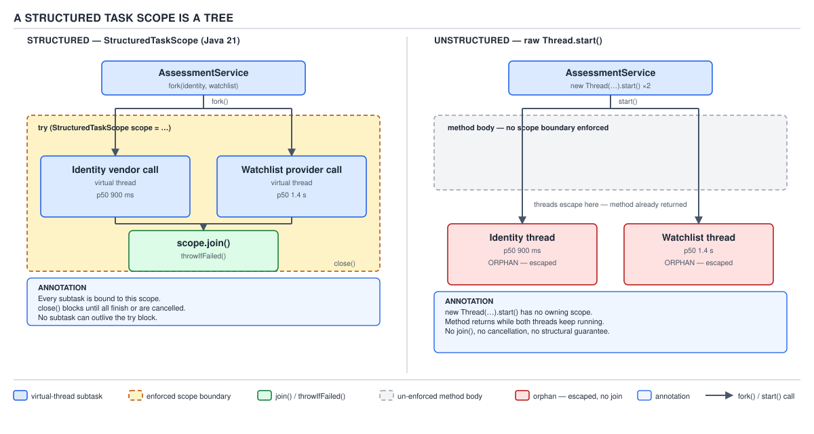

# 04 Modern Java — Structured concurrency — BASICS (§1.19)

**Target version: Java 21 LTS.** | **Part 1 of 5** | [Index](../00-index.md)
Previous: [Virtual threads — internals virtual threads](../virtual-threads/03-internals-virtual-threads.md) · Next: [Structured concurrency — in practice](02-in-practice.md)

## The hierarchy: what "structured" adds on top of virtual threads

Day 05's territory is *how many threads and how cheap they are*. This file's territory is
*how you own the ones you started*. One table, before anything else, because the whole chapter
is choosing a row:

| Mechanism | Who waits for completion | Who cancels on failure | Lifetime tied to a block? |
|---|---|---|---|
| Raw `Thread`/`ExecutorService.submit` | Nobody, unless you remember to | Nobody | No — threads outlive the method that started them unless you are careful |
| `ExecutorService.invokeAll` | The caller, always | The executor, on return | No — the executor's own lifetime is separate from the call |
| `CompletableFuture.allOf` | The caller, if it calls `.join()` | Nobody — cancellation is advisory only | No — a `CompletableFuture` has no owning block |
| `StructuredTaskScope` (JEP 453, Java 21, preview) | The caller, enforced by the type | The scope, via `Subtask` interrupt on `shutdown()` | Yes — enforced by `close()` and `StructureViolationException` |

Everything below is the last row, and why the other three rows are not good enough for a
service that forks two calls and needs to know, with certainty, what state they are in and that
nothing is still running after the calling method returns.

---

## 1. The problem: unstructured concurrency leaks threads, loses cancellation, and produces unreadable thread dumps

### Mental model first

Picture `AssessmentService` deciding whether a newly submitted application can proceed past
`AO-400 SUBMITTED`. It needs two answers: has the identity vendor verified the documents, and
has the watchlist provider cleared the applicant. Today it fires both calls off using two
`executor.submit(...)` calls and blocks on two `Future.get()`. The two background threads have
no relationship to the method that spawned them from the runtime's point of view — a thread
dump shows them as two more entries in a flat list, indistinguishable from every other
unrelated thread in the process, with no marker saying "these two belong to that one call".
That absence of a parent-child edge is the entire defect this file exists to fix.

### Why it exists (the problem, concretely)

Consider the naive version of the fork:

```java
ExecutorService pool = Executors.newVirtualThreadPerTaskExecutor();

Future<DocumentVerdict> identityFuture =
        pool.submit(() -> identityVendorClient.verify(applicationId));
Future<ScreeningVerdict> watchlistFuture =
        pool.submit(() -> watchlistProvider.screen(applicationId));

DocumentVerdict identityVerdict = identityFuture.get();       // throws if watchlist fails first? no — this line doesn't even know watchlist exists
ScreeningVerdict watchlistVerdict = watchlistFuture.get();
```

Three concrete failures follow directly from this shape, all of them observed in production
systems that fork-and-`Future.get()` without a supervising structure:

1. **Thread leak.** If `identityFuture.get()` throws (say the identity vendor times out at its
   documented p99 of 38 seconds), the method propagates the exception and returns. Nothing
   ever calls `watchlistFuture.cancel(true)`. The watchlist call — which runs at its own p50 of
   1.4 s but a p99 of 25 s — keeps running on a virtual thread that nothing references anymore
   except the pool's internal bookkeeping. It completes eventually, its result is discarded, and
   in the interim it has held open a connection to `ScreeningService` for a request whose caller
   no longer exists.
2. **Lost cancellation.** Even if you *do* remember to call `.cancel(true)` on the sibling, that
   only requests interruption. If `watchlistProvider.screen(...)` performs a blocking I/O call
   that ignores `InterruptedException` (catches and swallows it, or is blocked in something
   uninterruptible), the "cancelled" future is a fiction — the thread runs to completion anyway.
   Cancellation in this model is a request, never a guarantee.
3. **Unreadable thread dumps.** Take a `jstack` snapshot of a process running this pattern under
   load — at the platform's steady 1,200 reservations/sec, dozens of these forks are in flight
   at once. Every dumped thread stack ends at `identityVendorClient.verify` or
   `watchlistProvider.screen` with no caller frame connecting it back to the `AssessmentService`
   invocation that started it, because the fork crossed a thread boundary through an executor
   queue. An operator debugging a stuck request cannot answer "which of these 40 stuck threads
   belongs to which incoming request" from the dump alone.

**Insight:** the common thread through all three failures is that `Future` is a *reference*,
not a *lease*. Nothing enforces that the reference is ever consulted, and even consulting it
(`.get()`) does not retract the underlying computation. The Java 21 model in the rest of this
file replaces "a reference you may or may not check" with "an object whose lifetime is
mechanically tied to a `try`-block you cannot exit without accounting for it."

`[RESEARCH]` note: this section states a design problem, not a version-specific API fact, so no
release-tag source citation applies here — the three failure modes above are structural
consequences of `Future`'s contract (a passive handle with no owner) and are the stated
motivation in JEP 453 itself ("Problems with the existing thread pool APIs").

**Interview:** "What's wrong with just using `ExecutorService.submit` and `Future.get()` for a
fan-out?" — Nothing stops a sibling task from outliving the block that started it, and
`Future.cancel(true)` is a request, not a promise, because it depends on the task itself
observing the interrupt.

> A `Future` returned by `ExecutorService.submit` has no relationship between its lifetime and
> the lifetime of the method that created it, so failures, timeouts, and early returns can leave
> sibling tasks running unsupervised — this is unstructured concurrency.

---

## 2. The principle: concurrency as structured programming

### Mental model first

Structured programming (Dijkstra, "Go To Statement Considered Harmful", 1968) replaced
arbitrary jumps with `if`/`while`/blocks precisely because a block's exit points are countable
and its control flow can be reasoned about locally — you can look at a `{ ... }` and know
control does not leave it except at the closing brace or a `return`/`throw` inside it.
`StructuredTaskScope` applies that same discipline to concurrency: a task that forks subtasks
must join them (or fail trying) before the enclosing block's boundary is crossed. The `try`
block is the new `{ ... }` — its subtasks are exactly as scoped as its local variables.

### Why it exists

Before this principle was named for concurrency specifically (Nathaniel Smith's "notes on
structured concurrency" essay predates JEP 453 and is one of its cited influences), the industry
already had unstructured `goto`-equivalents for threads: raw `Thread.start()` with no join,
"fire-and-forget" `ExecutorService.execute(Runnable)`, and (per Java's own history)
`Thread.stop()`/`Thread.suspend()` — deprecated for decades because forcibly terminating a
thread from outside cannot know what invariants it was mid-way through. Structured concurrency
does not try to solve *forced termination*; it solves the higher-leverage problem of *making
"nothing outlives the block" true by construction*, so you never need forced termination in the
first place — you ask cooperatively via interrupt, and the block additionally will not let you
forget to ask.

### When to reach for it, and when not

Reach for `StructuredTaskScope` when a fork's subtasks are a genuine **fan-out from one logical
operation with one caller who needs one combined answer** — exactly `AssessmentService` needing
both the identity verdict and the watchlist verdict to decide one thing. Do not reach for it for
independent background work with no correlated outcome (a fire-and-forget audit-log write, a
cache warm that nobody is waiting on) — that isn't a "structured" fork at all, because there is
no calling block that logically owns the subtask's result; a plain virtual-thread-per-task
executor with no scope is the right (and honestly unstructured, by design) tool there. Section
1.19.11/1.19.12 below name the two other siblings — `CompletableFuture.allOf` and
`ExecutorService.invokeAll` — and where each still wins.

### How it works

The scope is created, forked into, joined, and closed all on one thread — the *owner* — and the
type system plus a runtime check enforce this (§1.19.9 below covers the exact violation). Inside
it, `fork` starts each subtask on its own virtual thread (by default), and `join` blocks the
owner until either every subtask completes, or the scope's policy decides to shut down early.

### The diagram, embedded inline


**D-080** — A structured task scope is a tree

Read the diagram as two halves. On the left, the structured shape: the `AssessmentService` call
opens a `try`-with-resources block; inside it, two virtual threads are forked — one running the
identity vendor call (p50 900 ms), one running the watchlist call (p50 1.4 s) — and both are
drawn strictly inside the boundary of the `try` block, because neither can be observed to
outlive it. On the right, the unstructured shape from §1.19.1: the same two calls, but drawn as
two threads whose lines cross outside the box that submitted them — the orphan case, visually,
is a line that keeps going after the box that drew it has ended.

### A minimal concrete example

```java
// Java 21, preview API — requires --enable-preview to compile and run.
import java.util.concurrent.StructuredTaskScope;
import java.util.concurrent.StructuredTaskScope.Subtask;

DocumentVerdict identityVerdict;
ScreeningVerdict watchlistVerdict;

try (var scope = new StructuredTaskScope.ShutdownOnFailure()) {
    Subtask<DocumentVerdict> identityTask =
            scope.fork(() -> identityVendorClient.verify(applicationId));
    Subtask<ScreeningVerdict> watchlistTask =
            scope.fork(() -> watchlistProvider.screen(applicationId));

    scope.join();
    scope.throwIfFailed(ExecutionException::new);

    identityVerdict = identityTask.get();
    watchlistVerdict = watchlistTask.get();
} // close() runs here even if an exception propagates out of the try body

if (identityVerdict.outcome() == Verdict.Outcome.APPROVED
        && watchlistVerdict.outcome() == Verdict.Outcome.APPROVED) {
    applicationHistory.recordStatus(applicationId, "AA-711 REVIEW_APPROVED");
}
```

Every line inside the `try` executes on the owner thread except the two lambda bodies, which run
on their own virtual threads. `scope.close()` — called implicitly by try-with-resources — will
not return while either subtask is still running; it is the mechanism, not `join()` alone, that
makes "nothing outlives the block" actually true even if a caller forgets to call `join()` (in
which case `close()` still blocks, though `throwIfFailed`'s bookkeeping is skipped — always call
`join()` explicitly).

### The gotcha

`scope.fork(...)` returning before the subtask has even started (it merely schedules it on a
virtual thread) means the *order* subtasks are forked in says nothing about the order they run
or finish in — both are dispatched to the virtual-thread scheduler's `ForkJoinPool` (day 05's
territory for the scheduler's own defaults) and interleave however that pool's work-stealing
decides.

> A `StructuredTaskScope` is the block-scoped unit of concurrency: forking creates children whose
> completion the enclosing `try` cannot skip past, closing the loop that raw `Future`s leave
> open.

---

## 3. The Java 21 shape (JEP 453, preview): `StructuredTaskScope`, `fork`, `join`, `close`, `Subtask<T>`

### Mental model first

`StructuredTaskScope` is not a thread pool you submit work to and forget about — it is a
**handle to exactly one fork-join episode**, created, used, and discarded within a single method
invocation (or a bounded region of one). Compare it to a `try`-with-resources `Connection`: you
don't keep a `Connection` around across unrelated units of work, and you don't keep a
`StructuredTaskScope` around either. One scope, one fan-out, one `close()`.

### Why it exists

§1.19.1 and §1.19.2 already gave the motivating problem and principle; this beat is the concrete
API JEP 453 delivered to embody them in Java 21.

### When to reach for it, and when not

Reach for the base `StructuredTaskScope` class itself only when you need custom shutdown
behaviour beyond the two shipped policies (§1.19.5, §1.19.6) — it is extensible precisely so
teams can write their own policy by overriding `handleComplete`. For the two textbook cases
(all-must-succeed, first-to-succeed-wins) use the shipped subclasses directly; do not hand-roll
policy logic that duplicates them.

### How it works

`[RESEARCH]` — verified against the JDK 21 javadoc and the JEP 453 text (re-fetched via
`javaalmanac.io`/`cr.openjdk.org` mirrors) rather than recalled, because this is exactly the kind
of preview-API surface where blog recall is unreliable. The public surface at Java 21 is:

```java
public class StructuredTaskScope<T> implements AutoCloseable {
    public StructuredTaskScope();
    public StructuredTaskScope(String name, ThreadFactory factory);

    public <U extends T> Subtask<U> fork(Callable<? extends U> task);

    public StructuredTaskScope<T> join() throws InterruptedException;
    public StructuredTaskScope<T> joinUntil(Instant deadline)
            throws InterruptedException, TimeoutException;

    public void shutdown();
    @Override public void close();

    public interface Subtask<T> extends Supplier<T> {
        T get();
        Throwable exception();
        Subtask.State state();
        enum State { UNAVAILABLE, SUCCESS, FAILED }
    }

    public static final class ShutdownOnFailure extends StructuredTaskScope<Object> {
        public ShutdownOnFailure();
        public void throwIfFailed() throws ExecutionException;
        public <X extends Throwable> void throwIfFailed(
                Function<Throwable, ? extends X> esf) throws X;
    }

    public static final class ShutdownOnSuccess<T> extends StructuredTaskScope<T> {
        public ShutdownOnSuccess();
        public T result() throws ExecutionException;
        public <X extends Throwable> T result(
                Function<Throwable, ? extends X> esf) throws X;
    }
}
```

`fork` is generic in a way worth reading carefully: it takes a `Callable<? extends U>` and
returns `Subtask<U>` where `U extends T` — the scope is parameterised by the *common* result
type its subtasks share (`Object` for `ShutdownOnFailure`, since it doesn't care what type
subtasks return, only whether they fail; the actual subtask's own type parameter for
`ShutdownOnSuccess<T>`, since it *does* care about the value).

The public no-arg constructors on the two policy subclasses are exactly what changes at Java 25
(§1.19.14) — remember this shape is 21-specific.

### The diagram

Already embedded above as D-080 for the tree shape; D-083 below (§1.19.8) covers `Subtask`'s own
state machine, which is the piece of this API surface most worth a diagram on its own.

### A minimal concrete example

The identity/watchlist fork from §1.19.2 already demonstrates the full `fork`/`join`/`close`
cycle. A second one showing `joinUntil` (§1.19.7 gives its own full treatment; this shows the
shape inline as part of the API tour):

```java
try (var scope = new StructuredTaskScope.ShutdownOnFailure()) {
    Subtask<DocumentVerdict> identityTask =
            scope.fork(() -> identityVendorClient.verify(applicationId));
    Subtask<ScreeningVerdict> watchlistTask =
            scope.fork(() -> watchlistProvider.screen(applicationId));

    scope.joinUntil(Instant.now().plusSeconds(30)); // watchlist's own 30 s timeout, matched
    scope.throwIfFailed(ExecutionException::new);

    return new ReviewCase(identityTask.get(), watchlistTask.get());
} catch (TimeoutException e) {
    throw new IllegalStateException("Review case exceeded 30 s deadline", e);
}
```

### The gotcha

`fork` can itself throw `IllegalStateException` if called after `shutdown()` has already been
triggered on the scope (by a sibling's failure under `ShutdownOnFailure`, or a sibling's success
under `ShutdownOnSuccess`) — a late `fork` call in a loop that keeps submitting after an earlier
sibling already tripped shutdown does not silently no-op, it throws.

> `StructuredTaskScope<T>` is a short-lived, single-owner handle over one fork-join episode:
> `fork` schedules a `Subtask<U>` (`U extends T`), `join`/`joinUntil` blocks the owner until the
> policy says the episode is over, and `close()` is the non-negotiable backstop that guarantees
> no subtask outlives the scope.

---

## 4. `fork` returns `Subtask<T>`, not `Future<T>`

### Mental model first

If you have seen structured concurrency material from the Project Loom incubator era — the API
lived in `jdk.incubator.concurrent` from Java 19 through Java 20 as a preview/incubating
feature — `fork` used to return a `Future<T>`. JEP 453, which is what actually shipped as the
*first* preview of structured concurrency proper in Java 21, changed the return type to a new,
purpose-built `Subtask<T>` interface. This is not a cosmetic rename.

### Why it exists

`Future<T>` carries a `cancel(boolean)` method and a general contract designed for a task
submitted to an arbitrary executor with no particular owner. Inside a `StructuredTaskScope`,
cancellation is never something the caller decides task-by-task — it is a scope-wide decision
made by the policy (`ShutdownOnFailure`/`ShutdownOnSuccess`) in response to a sibling's outcome.
Exposing `Future.cancel()` on the return value would invite exactly the per-task, uncoordinated
cancellation this whole feature exists to prevent. `Subtask<T>` deliberately has no `cancel`
method at all.

### When to reach for it, and when not

There is no choice to make here within Java 21 code — `fork` on `StructuredTaskScope` returns
`Subtask<T>`, full stop. The choice this beat protects against is *reading* old material (blog
posts, Stack Overflow answers, and JEP snapshots written against the `jdk.incubator.concurrent`
incubator builds of 19/20) and assuming `.get()` on the returned handle behaves like
`Future.get()` — it does not block; see §1.19.8's `IllegalStateException` gotcha.

### How it works

`Subtask<T> extends Supplier<T>`, and its `get()` method returns the completed value directly —
no `ExecutionException` wrapper, no blocking. The reason it can afford to be non-blocking is the
contract: you are only supposed to call `Subtask.get()` **after** `scope.join()` (or
`joinUntil`) has returned, at which point every forked subtask is guaranteed to be in a terminal
state (`SUCCESS` or `FAILED`) or the scope wouldn't have returned from `join` at all under the
shipped policies.

### The diagram

D-083 (embedded in full at §1.19.8, where the state machine itself is the primary concept) is
the diagram for this beat's mechanism too — the same object is what changed shape between the
incubator and JEP 453.

### A minimal concrete example

```java
try (var scope = new StructuredTaskScope.ShutdownOnFailure()) {
    Subtask<ScreeningVerdict> watchlistTask =
            scope.fork(() -> watchlistProvider.screen(applicationId));

    scope.join();
    scope.throwIfFailed(ExecutionException::new);

    ScreeningVerdict verdict = watchlistTask.get(); // Supplier<T>.get(), not Future<T>.get()
}
```

### The gotcha

`[TRAP]` `[VERSION-TRAP]` — code copied from a 2022-era article showing
`Future<ScreeningVerdict> watchlistFuture = scope.fork(...)` does not compile against Java 21's
`java.util.concurrent.StructuredTaskScope`. **Pitfall:** the belief "structured concurrency's
`fork` returns a `Future`" was true of the `jdk.incubator.concurrent` incubator shape in Java 19
and 20, and is false starting with the JEP 453 preview in Java 21, where the return type is
`Subtask<T>`. Symptom: `incompatible types: Subtask<ScreeningVerdict> cannot be converted to
Future<ScreeningVerdict>`. Fix: declare the variable as `Subtask<T>` (or `var`), and call `.get()`
only after `join()`/`joinUntil()` has returned.

> `fork` returns `Subtask<T>`, a `Supplier<T>`-shaped, non-cancellable handle whose `get()` is
> only well-defined once the owning scope has joined — a deliberate narrowing of `Future<T>`'s
> older, broader (and here, unwanted) contract.

---

## 5. `ShutdownOnFailure`: cancel all siblings on the first failure

### Mental model first

Think of `ShutdownOnFailure` as a **circuit breaker wired across siblings**: the instant any one
subtask fails, the policy trips, every other subtask still running gets interrupted, and the
scope's `join()` returns as soon as that shutdown-and-drain completes — it does not wait out the
slowest straggler once the outcome ("something failed") is already decided.

### Why it exists

This is the direct fix for the "all-must-succeed" case in §1.19.1: `AssessmentService` needs
*both* verdicts to proceed, so the moment either the identity check or the watchlist check
fails, continuing to wait on the other is pure waste — worse, it is exactly the "orphan thread
still holding a connection" leak the whole feature exists to prevent if the caller doesn't also
remember to cancel it by hand.

### When to reach for it, and when not

Use it whenever the fan-out's contract is conjunctive — you need every subtask's result, or you
need to know that at least one failed and stop early. Do **not** use it for the disjunctive case
(you need any *one* success, and the rest are just for latency) — that's `ShutdownOnSuccess`,
§1.19.6.

### How it works

`ShutdownOnFailure` overrides `handleComplete(Subtask<?>)` (the extension point the base class
exposes) so that the first `Subtask` to complete with `Subtask.State.FAILED` triggers
`shutdown()` on the scope. `shutdown()` interrupts every subtask still running and prevents new
`fork` calls from starting. `join()` then returns once that shutdown has finished draining.
Calling `throwIfFailed()` (or the overload taking a `Function<Throwable, ? extends X>` to map the
captured exception into your own type) after `join()` rethrows the *first* captured failure,
wrapped in `ExecutionException` by default.

### The diagram, embedded inline in the flow


**D-081** — `ShutdownOnFailure` versus `CompletableFuture.allOf`

Read lane 1 first: the watchlist call fails at 1.4 s (its p50 — a fast failure, like a rejected
request rather than a slow timeout); the identity call, still in flight, is interrupted
immediately; `join()` returns right there rather than waiting for the identity call's own up-to
38 s p99; `throwIfFailed()` rethrows the watchlist failure. Lane 2 is `CompletableFuture.allOf`
under the identical fault: the failure is visible on the combined future, but nothing tells the
identity call to stop, so it is drawn running on past the point where the block that started it
has already moved on — labelled "orphan" — still holding open its connection to the identity
vendor. §1.19.11 gives the full comparison; this diagram is the picture for it.

### A minimal concrete example

```java
public ReviewCase evaluate(ApplicationId applicationId) throws InterruptedException {
    try (var scope = new StructuredTaskScope.ShutdownOnFailure()) {
        Subtask<DocumentVerdict> identityTask =
                scope.fork(() -> identityVendorClient.verify(applicationId));
        Subtask<ScreeningVerdict> watchlistTask =
                scope.fork(() -> watchlistProvider.screen(applicationId));

        scope.join();
        scope.throwIfFailed(cause ->
                new IllegalStateException("Assessment fan-out failed for " + applicationId, cause));

        return new ReviewCase(identityTask.get(), watchlistTask.get(),
                Instant.now(), "AUTOMATED");
    }
}
```

### The gotcha

`throwIfFailed()` only surfaces the **first** failure the policy observed; if both siblings fail
at roughly the same time, whichever one `handleComplete` processes first (a race, since both run
on their own virtual threads) is the one whose exception you see, and the other's failure is
silently discarded. If you need every failure, not just the first, `ShutdownOnFailure` is the
wrong tool — inspect each `Subtask.exception()` yourself after `join()` instead of calling
`throwIfFailed()`.

> `ShutdownOnFailure` is the "all must succeed, fail fast" policy: the first `Subtask` to reach
> `FAILED` shuts the whole scope down, interrupting every sibling, and `join()` returns as soon
> as that shutdown completes rather than waiting for stragglers.

---

## 6. `ShutdownOnSuccess`: cancel the rest on the first success — hedged requests

### Mental model first

`ShutdownOnSuccess` is the mirror image: instead of tripping on the first failure, it trips on
the first **success**, and cancels everything still running. This is the textbook shape of a
*hedged request* — fire the same logical request at more than one backend and take whichever
answers first, discarding the rest.

### Why it exists

The watchlist provider's own numbers make the case on their own: p50 1.4 s, but p99 25 s, with a
30-second hard timeout. A tail latency that far past the median is exactly the case hedging is
for — if a second, independent call to an equivalent watchlist replica typically finishes in the
same 1.4 s window, racing two calls and taking the first answer collapses most of that long tail
without doubling your *typical* latency, at the cost of doubling load on the provider for every
request.

### When to reach for it, and when not

Use it when multiple subtasks are computing **the same logical answer** via independent paths —
redundant replicas, a cache lookup racing an origin fetch, or (per JEP 453's own example) parsing
the same payload with two candidate parsers. Do not use it for the identity/watchlist fork in
§1.19.5, because those two calls answer *different* questions — you need both, not either.

### How it works

Symmetric to `ShutdownOnFailure`: `handleComplete` triggers `shutdown()` on the first `Subtask`
to reach `Subtask.State.SUCCESS`, interrupting the rest. `result()` (or the overload taking a
`Function<Throwable, ? extends X>`) returns that first successful value; if every subtask failed
and none succeeded, `result()` throws (wrapping the last-seen failure, since there is no "first
success" to report).

### The diagram, embedded inline in the flow


**D-082** — `ShutdownOnSuccess` as a hedge

Two watchlist-provider replicas race on one time axis: one answers at 1.4 s (the p50 case), the
other is still working at that point and would otherwise run out to its own p99 of 25 s; the
scope cancels the slow one the instant the fast one succeeds, and the total observed latency is
the fast replica's 1.4 s, not the slow one's. A comparison line on the same diagram marks the
un-hedged p99 of 25 s directly above it, making visually explicit what hedging buys: the p99 that
a single unhedged call would have paid is avoided whenever *either* replica lands in its own fast
window.

### A minimal concrete example

```java
public ScreeningVerdict screenWithHedge(ApplicationId applicationId) throws InterruptedException {
    try (var scope = new StructuredTaskScope.ShutdownOnSuccess<ScreeningVerdict>()) {
        scope.fork(() -> watchlistProviderPrimary.screen(applicationId));
        scope.fork(() -> watchlistProviderSecondary.screen(applicationId));

        scope.join();
        return scope.result(cause ->
                new IllegalStateException("Both watchlist replicas failed for " + applicationId, cause));
    }
}
```

### The gotcha

`[PROVE]` — hedging **doubles load on the provider for every single request**, not just the slow
ones, because both subtasks are forked unconditionally up front; it is not "try the fast path,
fall back on timeout" (that would be a different, sequential pattern). At the platform's actual
watchlist call volume — every application reaching `AO-400` triggers one screening call, and
`AO-400` is reached by up to 24k applications/day at peak — hedging every call against the
provider's own **200/min** cap would blow through that cap the moment the hedge ratio pushes
concurrent in-flight calls past it: 24k/day peak is roughly 16.7/min sustained-average, comfortably
under 200/min unhedged, but doubling it to 33.4/min average still leaves headroom only because the
cap is generous relative to average load — the real risk is bursts, where peak-second concurrency
already approaches the provider's own p99-driven backlog. The arithmetic that must accompany any
hedging decision is: (call rate) × (hedge factor) versus (provider's own rate cap), always, before
enabling it.

> `ShutdownOnSuccess<T>` is the "first success wins, race the rest away" policy — the mechanism
> behind hedged requests, at the direct cost of proportionally higher load on whatever you are
> racing against.

---

## 7. `joinUntil(Instant)` — one deadline for the whole scope

### Mental model first

`joinUntil` is `join`'s deadline-bounded sibling: instead of waiting indefinitely for the
policy's shutdown condition, it waits until either that condition is met, or a wall-clock
`Instant` passes, whichever comes first — and passing the deadline throws `TimeoutException`
rather than returning normally.

### Why it exists

Without it, a scope using `ShutdownOnFailure` where every subtask happens to hang (not fail, not
succeed — genuinely stuck, e.g. the identity vendor at the tail of its 38 s p99 combined with a
network partition that never resolves) would have `join()` block forever, because "hang forever"
is not a state `ShutdownOnFailure`'s policy has any way to detect — it only reacts to observed
completions. `joinUntil` gives the owner a hard backstop independent of whether any subtask ever
actually finishes.

### When to reach for it, and when not

Reach for it whenever the calling context itself has a deadline — an HTTP request with its own
timeout budget, a batch job with an SLA. Skip it (use plain `join()`) when the calling context is
already deadline-free or the deadline is better enforced per-subtask (each `Callable` doing its
own bounded I/O with its own client-level timeout) rather than scope-wide — the two are not
mutually exclusive, and belt-and-braces (both) is common: each subtask's own client timeout
*and* a scope-wide `joinUntil` as the outer backstop.

### How it works

Internally `joinUntil` still relies on the same `handleComplete`-driven shutdown machinery as
`join()` — the only difference is the wait is bounded, and on expiry the method throws
`TimeoutException` instead of returning. Critically, hitting the deadline does **not** by itself
shut the scope down or interrupt the subtasks — `joinUntil` throwing only tells the owner the
wait is over; the owner still must call `close()` (via try-with-resources, as always), and it is
`close()` that then interrupts and drains anything still running.

### The diagram

No diagram is assigned specifically to `joinUntil` — it is folded, as a supporting extension, into
D-081's timeline, where the deadline is exactly what marks the point at which the demonstrated
`ShutdownOnFailure` lane could have thrown `TimeoutException` instead of a normal failure had the
30 s watchlist timeout not already fired first. This beat is a supporting fact rather than a
standalone primary concept for diagram purposes even though it earns full treatment above for its
mechanism and tradeoffs.

### A minimal concrete example

```java
try (var scope = new StructuredTaskScope.ShutdownOnFailure()) {
    Subtask<DocumentVerdict> identityTask =
            scope.fork(() -> identityVendorClient.verify(applicationId));
    Subtask<ScreeningVerdict> watchlistTask =
            scope.fork(() -> watchlistProvider.screen(applicationId));

    try {
        scope.joinUntil(Instant.now().plusSeconds(30));
    } catch (TimeoutException e) {
        throw new IllegalStateException(
                "Assessment for " + applicationId + " exceeded 30 s SLA", e);
    }
    scope.throwIfFailed(ExecutionException::new);
    // close() below still interrupts/drains both subtasks even on the timeout path
}
```

### The gotcha

`[TRAP]` **Pitfall:** assuming `joinUntil` throwing `TimeoutException` means the subtasks have
already stopped. **Wrong belief in action:**

```java
try {
    scope.joinUntil(deadline);
} catch (TimeoutException e) {
    // "the subtasks are cancelled now, safe to log and move on"
    log.warn("timed out, subtasks cancelled");
    return DEFAULT_VERDICT;
}
```

The log message is a lie at the moment it is written — the subtasks are still running; only
`close()` (invoked when the `try`-with-resources block exits) actually interrupts them. **Right:**
let the `try`-with-resources block finish naturally (or explicitly call `scope.shutdown()` in the
catch before returning) so the interrupt is issued before you report the state as settled. **Why
people believe it:** `TimeoutException` reads as "this operation is now over," and for most other
timeout APIs (an HTTP client's read timeout, for instance) that is true — but `joinUntil` is
scoped to the *wait*, not the *subtasks' lifecycle*, which remains `close()`'s job.

> `joinUntil(Instant)` bounds how long the owner will wait for the scope's shutdown condition to
> be met, throwing `TimeoutException` on expiry — but it is `close()`, not the timeout itself,
> that actually stops anything still running.

---

## 8. `Subtask.state()`, `get()`, `exception()`, and the `IllegalStateException` trap

### Mental model first

A `Subtask<T>` moves through exactly three states, and which methods are legal to call depends
entirely on which state it is currently in — this is a small state machine, and treating `get()`
as always-safe (the way you might treat a getter on a POJO) is the single most common mistake
with this API.

### Why it exists

The state machine exists because `Subtask` deliberately does **not** block on `get()` the way
`Future.get()` does (§1.19.4) — a non-blocking accessor needs some way to signal "there is
nothing to return yet" other than blocking, and Java's answer here is an explicit state you can
query plus an exception if you ignore it.

### When to reach for it, and when not

Always call `join()` (or `joinUntil()`) before touching any forked `Subtask`'s `get()` or
`exception()` — there's no legitimate case for reading either before joining, since by definition
nothing is guaranteed to have completed yet. `state()` itself is safe to call at any point and is
occasionally useful defensively even after `join()`, to branch on `SUCCESS` versus `FAILED`
without invoking `get()` speculatively and catching the resulting exception.

### How it works

`[RESEARCH]` verified against the Java 21 javadoc for `StructuredTaskScope.Subtask`:

| State | Meaning | `get()` | `exception()` |
|---|---|---|---|
| `UNAVAILABLE` | Not yet completed, or the scope never joined | throws `IllegalStateException` | throws `IllegalStateException` |
| `SUCCESS` | Completed normally | returns the result | throws `IllegalStateException` |
| `FAILED` | Completed with an exception | throws `IllegalStateException` | returns the `Throwable` |

The pattern to internalise: `get()` and `exception()` are each legal in exactly **one** terminal
state, and calling either in the wrong state — including the default `UNAVAILABLE` state before
`join()` has run — throws `IllegalStateException`, not a null or an empty `Optional`.

### The diagram, embedded inline in the flow


**D-083** — `Subtask` states and the illegal calls

The diagram draws the three states as nodes: `UNAVAILABLE` is the start state every forked
subtask enters; the transition to `SUCCESS` is labelled with normal task completion, the
transition to `FAILED` with the task throwing. Two illegal edges are drawn in a different style
and explicitly labelled with the exception they throw: calling `get()` while still in
`UNAVAILABLE` (i.e. before `join()`) is labelled `IllegalStateException`; a scope-ownership
violation — a non-owner thread calling any scope method, or closing out of order — is labelled
`StructureViolationException`, which belongs to §1.19.9 rather than to `Subtask` itself but is
drawn alongside it here because both are "you broke the contract" edges a reader needs side by
side.

### A minimal concrete example

```java
try (var scope = new StructuredTaskScope.ShutdownOnFailure()) {
    Subtask<ScreeningVerdict> watchlistTask =
            scope.fork(() -> watchlistProvider.screen(applicationId));

    // watchlistTask.get() here would throw IllegalStateException — join() hasn't run yet.

    scope.join();

    ScreeningVerdict verdict = switch (watchlistTask.state()) {
        case SUCCESS -> watchlistTask.get();
        case FAILED -> throw new IllegalStateException(
                "Watchlist screening failed", watchlistTask.exception());
        case UNAVAILABLE -> throw new IllegalStateException(
                "Unreachable: join() returned but subtask is still UNAVAILABLE");
    };
}
```

### The gotcha

`[TRAP]` **Pitfall:** calling `.get()` on a `Subtask` immediately after `fork()`, before
`join()`, because it "feels like" reading a field that was just assigned. **Wrong:**

```java
Subtask<DocumentVerdict> identityTask = scope.fork(() -> identityVendorClient.verify(applicationId));
DocumentVerdict verdict = identityTask.get(); // throws IllegalStateException — state is UNAVAILABLE
```

**Right:** always sequence `fork` (all of them) → `join()`/`joinUntil()` →
`throwIfFailed()`/`result()` → `get()`/`exception()`, in that order, never interleaved.
**Why people believe it:** in ordinary sequential Java, a variable assigned on one line is safe
to read on the next; `Subtask` looks like an ordinary handle but is actually a proxy into
concurrent state that has not necessarily settled yet, however fast the fork call itself
returned.

> `Subtask<T>` is a three-state object (`UNAVAILABLE`/`SUCCESS`/`FAILED`); `get()` and
> `exception()` are each legal in exactly one terminal state and throw `IllegalStateException`
> everywhere else, which is the price of `Subtask` not blocking the way `Future.get()` does.

---

## 9. One thread, one scope, try-with-resources — `StructureViolationException`

### Supporting fact treatment

**Mechanism:** the JEP 453 contract requires the same thread to create the scope, fork every
subtask into it, join it, and close it. `[RESEARCH]` — the exception enforcing this,
`StructureViolationException`, is thrown when a scope is closed while it still has an "unjoined"
fork outstanding, when a scope is closed by a thread other than its owner, or when scopes are
closed out of nesting order (an outer scope closed while an inner one it owns is still open).
This is why the pattern is *always* written as `try (var scope = new
StructuredTaskScope...()) { ... }` — try-with-resources guarantees `close()` runs even on an
exceptional exit, on the same thread that opened the `try`, which is exactly what the contract
demands.

**Gotcha:** `[TRAP]` **Pitfall:** capturing a `StructuredTaskScope` in a field or passing it to
another thread to fork into later. **Wrong:**

```java
class ReviewOrchestrator {
    private StructuredTaskScope.ShutdownOnFailure scope; // stashed for "later" — don't

    void begin() {
        this.scope = new StructuredTaskScope.ShutdownOnFailure();
        someOtherExecutor.submit(() -> scope.fork(() -> identityVendorClient.verify(applicationId)));
    }
}
```

Forking from a thread other than the scope's owner throws `WrongThreadException` (a sibling
enforcement exception to `StructureViolationException`, guarding the same invariant from the
opposite direction — fork rather than close). **Right:** create, fork into, join, and close the
scope entirely within one method's `try`-with-resources block, never stashing the reference for
another thread to use.

> A `StructuredTaskScope` must be created, forked into, joined, and closed on one owning thread
> inside a single try-with-resources block — violating ownership throws `WrongThreadException` on
> fork or `StructureViolationException` on an out-of-order or cross-thread close.

---

## 10. Cancellation propagates by interrupt — and swallowed interrupts still leak

### Mental model first

When a scope's policy decides to shut down, the mechanism it uses on every still-running
`Subtask` is exactly `Thread.interrupt()` on that subtask's virtual thread — nothing more exotic.
This means structured concurrency's cancellation guarantee is only as strong as every subtask's
own cooperation with interruption, which is the same cooperative-cancellation model the JVM has
always had for threads generally.

### Why it exists

There is no forcible-termination alternative available — `Thread.stop()` has been deprecated
since Java 1.2 specifically because forcibly killing a thread mid-operation cannot know what
partially-mutated state it leaves behind (a lock held, a connection half-written-to). Interrupt
is the only cooperative signal the platform offers, so it is the only signal structured
concurrency can build on.

### When to reach for it, and when not

This isn't an optional mechanism you choose to opt into — it's how `shutdown()` always works.
The choice that matters is on the *subtask author's* side: every blocking call inside a forked
`Callable` must either be interruptible by nature (most `java.util.concurrent` and modern I/O
APis are) or must explicitly check `Thread.interrupted()` at safe points if it does long-running
CPU work with no natural blocking point.

### How it works

`Subtask` bodies that call ordinary interruptible blocking operations — `Thread.sleep`,
`Object.wait`, most `java.nio` and virtual-thread-friendly I/O, `BlockingQueue.take` — respond to
the interrupt by throwing `InterruptedException`, unwinding out of the `Callable`, and the scope
records the subtask as `FAILED` with that exception retrievable via `exception()`. The chain
breaks the moment a subtask's code does this instead:

```java
try {
    return watchlistProvider.screen(applicationId);
} catch (InterruptedException e) {
    // swallowed — the interrupt is discarded, and if screen(...) is retried in a loop here,
    // the retry proceeds as though nothing asked it to stop
    return watchlistProvider.screen(applicationId);
}
```

Catching `InterruptedException` and not propagating it (rethrowing, wrapping, or at minimum
restoring the flag with `Thread.currentThread().interrupt()` before returning) means the subtask
has no further way of knowing it was asked to stop — from that point it behaves exactly like the
unstructured leak in §1.19.1, just wrapped in a structured-looking `try`-with-resources block
that gives false confidence.

### The gotcha (this leaf is `[TRAP]`)

`[TRAP]` **Pitfall:** the belief "I used `StructuredTaskScope`, so my code can't leak threads
anymore." **Wrong:**

```java
try (var scope = new StructuredTaskScope.ShutdownOnFailure()) {
    scope.fork(() -> {
        while (true) {
            try {
                return watchlistProvider.screen(applicationId);
            } catch (InterruptedException e) {
                continue; // interrupt swallowed, loop keeps trying forever
            }
        }
    });
    scope.fork(() -> identityVendorClient.verify(applicationId));

    scope.join(); // blocks forever if the watchlist subtask never observes the interrupt
    scope.throwIfFailed(ExecutionException::new);
}
```

If the identity subtask fails and trips `shutdown()`, the watchlist subtask above is interrupted
— but its `catch` block eats the interrupt and loops again, so it never transitions to `FAILED`,
and `scope.close()` (called implicitly at the end of the `try`) blocks forever waiting for a
subtask that will never finish. **Right:**

```java
scope.fork(() -> {
    while (true) {
        try {
            return watchlistProvider.screen(applicationId);
        } catch (InterruptedException e) {
            Thread.currentThread().interrupt(); // restore the flag
            throw e; // or wrap and rethrow — never silently retry past an interrupt
        }
    }
});
```

**Why people believe it:** the whole marketing of the feature is "cancellation you can trust,"
and it is true relative to raw threads and executors — but the trust is conditional on every
subtask honouring `InterruptedException` the way the JDK's own libraries do; structured
concurrency changes who *asks* for cancellation and *when*, not whether the target code has to
cooperate.

`[X-REF 05]` — the mechanics of `Thread.interrupt()` itself (the interrupt status flag, which
blocking methods clear it and rethrow `InterruptedException` versus which merely set it, and why
`Thread.currentThread().interrupt()` is the idiomatic way to restore a swallowed flag) are guide
05's territory (Multithreading and concurrency) in full; the paragraph above gives enough to
answer the interview question standalone.

> Cancellation in `StructuredTaskScope` is implemented purely as `Thread.interrupt()` on each
> running subtask, so a subtask that catches and swallows `InterruptedException` without
> restoring or rethrowing it defeats the guarantee entirely, indistinguishable in effect from the
> unstructured leak in §1.19.1.

---

## 11. Versus `CompletableFuture.allOf`: advisory cancellation, orphaned siblings

### Mental model first

`CompletableFuture.allOf(futures...)` produces a `CompletableFuture<Void>` that completes once
every input future completes — but "completes" here describes only the *combined* future's own
observable state. It says nothing about what happens to a sibling once one of the inputs fails.

### Why it exists as the comparison

This is the sibling structured concurrency most directly displaces in fan-out-and-combine code,
because on the surface both "fork several things and wait for the outcome." The difference is
entirely in what "wait" and "outcome" mean once one branch fails early.

### When each wins

`CompletableFuture.allOf` wins when the tasks are genuinely independent and each should run to
completion regardless of what the others do — that's true "run everything, aggregate results
non-terminally" behaviour, and forcing that shape into `ShutdownOnFailure` would be fighting the
tool, since `ShutdownOnFailure` actively wants to interrupt siblings on the first failure.
`StructuredTaskScope` wins whenever an early failure should actually stop the remaining work,
which for `AssessmentService`'s conjunctive fan-out (§1.19.5) is exactly the case — there is no
value in letting the identity check keep running once the watchlist check has already failed the
application.

### How it works `[PROVE]`

Work through what actually happens on failure with `allOf`:

```java
CompletableFuture<DocumentVerdict> identityFuture =
        CompletableFuture.supplyAsync(() -> identityVendorClient.verify(applicationId));
CompletableFuture<ScreeningVerdict> watchlistFuture =
        CompletableFuture.supplyAsync(() -> watchlistProvider.screen(applicationId));

CompletableFuture<Void> combined = CompletableFuture.allOf(identityFuture, watchlistFuture);
combined.join(); // throws CompletionException if either input completed exceptionally
```

Trace it: suppose `watchlistFuture` completes exceptionally at its own 1.4 s p50. `allOf`'s
returned future *does* immediately reflect that failure — `combined.join()` throws right away,
without waiting for `identityFuture`. That much sounds structured. But nothing in this call chain
ever touched `identityFuture` itself: it has no idea `watchlistFuture` failed, no idea `combined`
even exists as a downstream consumer, and it keeps running on whatever executor
`supplyAsync` chose (the common pool by default), fully to completion, at its own pace — up to
its own 38 s p99. The "cancellation" a caller might reach for —
`identityFuture.cancel(true)` — is documented as **advisory**: `Future.cancel`'s own javadoc
contract only guarantees the future's own state flips (so a later `.get()` throws
`CancellationException`); it does not guarantee the underlying `Runnable`/`Supplier` passed to
`supplyAsync` ever observes an interrupt, because `CompletableFuture` has no built-in machinery
tying cancellation of the future object to interruption of the thread actually running the work,
the way `StructuredTaskScope.shutdown()` explicitly does.

So the proof, stated plainly: `allOf` propagates *failure notification* faithfully (the combined
future does reflect the first exception promptly) but propagates **no cancellation signal
whatsoever** to the siblings by default, and even an explicit `cancel(true)` call is advisory
rather than a guarantee — the exact orphan-thread failure mode from §1.19.1, just with a nicer
combinator syntax wrapped around it.

### The diagram

D-081, already embedded at §1.19.5, is this comparison's diagram — its lane 2 is exactly this
`allOf` trace, drawn against `ShutdownOnFailure`'s lane 1 on the same axis.

### The gotcha / X-ref

`[X-REF 05]` — `CompletableFuture`'s combinator chain (`thenCompose`, `thenCombine`, exception
handling via `handle`/`exceptionally`, and which executor each stage runs on) is guide 05's full
territory; the trace above gives the cancellation-specific mechanism needed for this comparison
without re-teaching the whole combinator API.

> `CompletableFuture.allOf` faithfully reports the first failure among its inputs but never
> interrupts the siblings — cancellation via `Future.cancel` is advisory, not enforced — so a
> failing fan-out under `allOf` still orphans whichever siblings haven't finished, which is
> precisely the defect `StructuredTaskScope.ShutdownOnFailure` closes.

---

## 12. Versus `ExecutorService.invokeAll`: cancels on return, but the pool doesn't know your block exists

### Supporting fact treatment

**Mechanism:** `ExecutorService.invokeAll(Collection<? extends Callable<T>>)` does actually cancel
outstanding tasks if it returns early via the timed overload's deadline, and the plain overload
blocks until every task completes or is cancelled — so within a *single call* to `invokeAll`, the
completion semantics are already closer to structured than `allOf`'s. The gap is one level up:
the `ExecutorService` itself is a long-lived object, typically constructed once and shared across
many unrelated calls (a field, or a singleton bean), so **its lifetime has no relationship to any
one calling block's lifetime** — nothing stops a completely different method, on a completely
different thread, from submitting work to the same executor while your `invokeAll` call is in
flight, and nothing about `invokeAll` itself scopes cleanup to *your* method the way
try-with-resources on a `StructuredTaskScope` does. If your thread is interrupted while blocked in
`invokeAll`, the already-submitted tasks are cancelled — but the executor survives your call
entirely, ready for the next unrelated caller, which is a feature for a shared pool and exactly
the property `StructuredTaskScope` deliberately does *not* have (one scope, one fork episode, then
gone).

**Gotcha:** the "cancels on return" property most people remember about `invokeAll` sounds like
it supersedes structured concurrency's whole reason for existing (§1.19.1's orphan problem) — but
it only cancels tasks belonging to *that one `invokeAll` call*, not "everything the executor is
currently doing," which is a much narrower guarantee than a scope's `close()`.

> `ExecutorService.invokeAll` does cancel the tasks from its own call on return, but the
> executor's own lifetime is independent of any calling block, so it solves the "did this one
> batch clean up after itself" problem while leaving the "is this pool's overall lifetime scoped
> to anything" problem exactly where raw executors always left it.

---

## 13. `--enable-preview` and the package move to `java.util.concurrent`

### Mental model first

Java 21 ships `StructuredTaskScope` as a **preview API** under JEP 453 — meaning the class
compiles and links only when both the compiler and the runtime are told, explicitly, to allow
preview features, and the JEP itself states plainly that the API may still change incompatibly
before finalisation. This is not the same thing as an incubator module (which needs an
`--add-modules` flag and its own separate JAR); this is the ordinary preview-feature flag applied
to a class living in the standard `java.base` module.

### Why it exists (the version story specifically)

`[RESEARCH]` `[VERSION-TRAP]` — Structured concurrency's own package history is itself a small
lesson in how the JDK stages an unstable API: it began life as `jdk.incubator.concurrent` in the
**incubator module** system (Java 19 and 20, JEP 428, "incubating"), then moved into
`java.util.concurrent` proper as a **preview feature** for its first JEP-453 iteration at
**Java 21**. Incubator and preview are two different staging mechanisms with different flags and
different guarantees, and code written against the Java 19/20 incubator shape needs both an
import-path change and a flag change to run on 21.

### When each flag applies

| Release | Package | Staging mechanism | Flag needed |
|---|---|---|---|
| 19–20 | `jdk.incubator.concurrent` | Incubator module (JEP 428) | `--add-modules jdk.incubator.concurrent` |
| 21–24 | `java.util.concurrent` | Preview feature (JEP 453, then re-previewed each release) | `--enable-preview` at both compile and run |
| 25 | `java.util.concurrent` | Finalised (JEP 505) | none — no flag needed |

### How it works

Compiling and running the §1.19.5 example on Java 21 requires both:

```bash
javac --release 21 --enable-preview AssessmentService.java
java --enable-preview --release 21 AssessmentService
```

Omitting `--enable-preview` at compile time produces a compile error naming the preview feature;
omitting it at the `java` launch step (even against a class file correctly compiled with the
flag) produces `UnsupportedClassVersionError`-style rejection at class-load time, because the
class file itself is marked with the preview minor-version flag and the runtime refuses to load
a preview class file without the matching runtime flag.

### The gotcha (`[TRAP]`)

**Pitfall:** trying `javac AssessmentService.java` (no flags) against code using
`StructuredTaskScope` on a Java 21 toolchain and being confused by the error, because the class
itself lives in the ordinary `java.util.concurrent` package with no special import path hinting
that it's preview. **Symptom:**

```
error: StructuredTaskScope is a preview API and is disabled by default.
        (use --enable-preview to enable structured task scope)
```

**Fix:** add `--enable-preview` at both `javac` and `java` invocations, and note the version —
the flag is required on 21 through 24 and unnecessary (indeed a no-op, since the feature is
final) from 25 onward, per §1.19.14.

**A note on this machine specifically:** this environment runs JDK **25.0.1**, on which Java
21's preview-era `StructuredTaskScope` shape (public constructors, `Subtask`,
`ShutdownOnFailure`/`ShutdownOnSuccess` as concrete classes) is not compilable at all — the API
was reworked for finalisation (§1.19.14), and the 21-preview class shape simply does not exist on
25's classpath. Every code sample in this file showing the 21 shape is drawn from the verified
API surface in §1.19.3/§1.19.5/§1.19.6, not from a compilation run on this machine, and each is
marked as requiring `--enable-preview` **on an actual Java 21 (or 22–24) JDK** rather than
presented as something run here.

> `StructuredTaskScope`'s Java 21 shape is a preview feature under JEP 453 needing
> `--enable-preview` at both compile and run time, having moved from the Java 19/20 incubator
> module `jdk.incubator.concurrent` into `java.util.concurrent` proper — two different staging
> mechanisms, both superseded by finalisation in Java 25.

---

## 14. Java 25 reworks the API (JEP 505): `open()` factories and `Joiner`

### Mental model first

Java 25 does not merely "remove the preview flag" from the Java 21 shape — it **replaces the
shape**. Where Java 21 had public constructors on the scope itself and two hardcoded concrete
policy subclasses, Java 25 (JEP 505, finalising what JEP 480 previewed at 24) moves construction
to static `open()` factory methods and replaces `ShutdownOnFailure`/`ShutdownOnSuccess` with a
single composable `Joiner` interface.

### Why it exists

`[RESEARCH]` `[VERSION-TRAP]` — the two shipped policies in Java 21 covered the two most common
cases (conjunctive and disjunctive fan-out) but any third policy — "wait for the first two of
three," "shut down when the accumulated results satisfy some predicate" — had to be written by
subclassing the base `StructuredTaskScope` and overriding `handleComplete`, which is workable but
verbose for a one-off. `Joiner` in Java 25 turns policy into a first-class, composable value
rather than a subclass, so writing a custom policy no longer requires extending a class at all.

### When to reach for which

Since this note set targets Java 21 LTS, the `Joiner`-based Java 25 shape is stated here **for
version-awareness only** — an interviewer or a migration guide is equally likely to ask "what
does this look like on Java 25" as "what does it look like on 21," and the honest, complete
answer names both, per the house rule that every version delta gets stated inline rather than as
a footnote.

### How it works (the shape, stated, not run)

```java
// Java 25 shape — final, no --enable-preview needed. NOT compilable/runnable as Java 21 code.
try (var scope = StructuredTaskScope.open(Joiner.<DocumentVerdict>awaitAllSuccessfulOrThrow())) {
    var identityTask = scope.fork(() -> identityVendorClient.verify(applicationId));
    scope.join();
    DocumentVerdict verdict = identityTask.get();
}
```

The static `open()` factory replaces `new StructuredTaskScope.ShutdownOnFailure()`; a `Joiner`
implementation (the JDK ships equivalents of both 21's shipped policies as static factory methods
on `Joiner`, plus additional composable ones) replaces the concrete subclass. `fork`, `Subtask`,
and the interrupt-based cancellation model from §1.19.10 are conceptually unchanged — the rework
is in construction and policy, not in the fork/join/interrupt mechanics underneath.

### The gotcha

`[TRAP]` **Pitfall:** upgrading a project's JDK from 21 to 25 and expecting
`new StructuredTaskScope.ShutdownOnFailure()` to keep compiling with the preview flag simply
dropped. It does not — the constructors and the two concrete subclasses are gone from the
finalised API, not merely un-flagged, so this is a source-breaking change on top of being a
preview-to-final transition, and callers must migrate to `open(Joiner...)` explicitly. **Symptom**
would be `cannot find symbol` errors on both the removed constructors and the removed subclass
names. **Fix:** rewrite call sites to `StructuredTaskScope.open(...)` with the matching `Joiner`
factory method.

> Java 25 (JEP 505) finalises structured concurrency by replacing Java 21's public constructors
> and its two hardcoded policy subclasses with static `open()` factories and a composable
> `Joiner`, a source-incompatible rework, not merely a flag removal, even though `fork`/`Subtask`/
> interrupt-based cancellation carry over conceptually unchanged.

---

## 15. Scoped values: an immutable, inheritable replacement for `ThreadLocal`

### Mental model first

Picture a value that behaves like a dynamically-scoped constant: bound once at the top of a call
tree, visible to every method underneath — including every subtask forked from a
`StructuredTaskScope` opened inside that tree — for the exact duration of one bounded block, and
automatically un-bound the instant that block exits. That is `ScopedValue`, and the mental shift
from `ThreadLocal` is: a `ThreadLocal` is a **mutable slot with unbounded lifetime** that you
must remember to `remove()`; a `ScopedValue` is an **immutable binding with a lifetime the
compiler and runtime enforce for you**.

### Why it exists

`[RESEARCH]` `ThreadLocal` has two well-known costs that scoped values were designed to remove.
First, it is **mutable and unbounded** — nothing stops any code with a reference to the
`ThreadLocal` from calling `.set()` at any point in its lifetime, and nothing forces
`.remove()` to ever be called, which is the classic thread-pool-leak source (a pooled platform
thread that served a previous request still carries stale `ThreadLocal` state into the next one
if cleanup was missed). Second, and more relevant to virtual threads specifically, a
`ThreadLocal`'s value is **not automatically inherited** by tasks a thread forks off — Java has a
separate `InheritableThreadLocal` for that, and neither form was designed with "millions of
short-lived virtual threads, each needing to see one immutable request-scoped value" in mind. A
platform tuned for 55k peak concurrent sessions, each potentially forking several virtual threads
under a `StructuredTaskScope`, needs a mechanism where binding a request-scoped value (say, the
`ApplicationId` under assessment) to every forked subtask is cheap, automatic, and impossible to
leak past the scope that set it.

### When to reach for it, and when not

Reach for `ScopedValue` for read-mostly, request-scoped or task-scoped context that needs to be
visible down a call tree and across forked subtasks — exactly the identity of the request being
assessed. Do **not** reach for it as a general `ThreadLocal` replacement for genuinely *mutable*
per-thread state (a reusable `StringBuilder` scratch buffer, a JDBC connection checked out for
the thread's lifetime) — `ScopedValue` has no `.set()`; rebinding requires re-entering
`where(...).run(...)`, which is a different shape of API entirely and a poor fit for values that
need to be mutated in place.

### How it works, and the version timeline `[VERSION-TRAP]`

`[RESEARCH]` `ScopedValue` has one of the longest preview histories of any recent JDK feature,
worth stating in full because "is it still a preview?" is a live interview question depending on
which JDK the candidate last touched:

| Release | Status | JEP |
|---|---|---|
| 20 | Incubator | JEP 429 |
| 21 | Preview | JEP 446 |
| 22 | Preview (second) | JEP 464 |
| 23 | Preview (third) | JEP 481 |
| 24 | Preview (fourth) | JEP 487 |
| 25 | **Final** | JEP 506 |

On Java 21, `ScopedValue` is created via `ScopedValue.newInstance()`, bound within a dynamic
extent via `ScopedValue.where(key, value).run(runnable)` or `.call(callable)`, and read via
`get()` — readable only by code executing within that `run`/`call`'s dynamic extent, on the
binding thread or on any thread structurally forked from within it (which is exactly why this
belongs in the same file as `StructuredTaskScope`: a value bound before opening a scope is
automatically visible to every subtask forked inside it, with no explicit passing required).

### The diagram

No diagram in this file's manifest (D-080 through D-083) is assigned to scoped values
specifically — the assigned diagrams belong to the four `StructuredTaskScope` concepts above.
Per the file-plan discipline this file does not touch, scoped values here get full eight-beat
prose treatment (it satisfies "a reader could plausibly be asked about it for five minutes")
without a dedicated diagram; the visual pairing of scoped values with structured concurrency
(D-164, already authored under this same topic's diagram set as
`D-164-scoped-values-structured-concurrency.svg`) belongs to a later file in this file plan and
is not duplicated here.

### A minimal concrete example

```java
// Java 21, preview API — requires --enable-preview.
private static final ScopedValue<ApplicationId> CURRENT_APPLICATION = ScopedValue.newInstance();

public ReviewCase runAssessment(ApplicationId applicationId) throws InterruptedException {
    return ScopedValue.where(CURRENT_APPLICATION, applicationId).call(() -> {
        try (var scope = new StructuredTaskScope.ShutdownOnFailure()) {
            var identityTask = scope.fork(this::verifyCurrentApplicationIdentity);
            var watchlistTask = scope.fork(this::screenCurrentApplicationWatchlist);

            scope.join();
            scope.throwIfFailed(ExecutionException::new);

            return new ReviewCase(identityTask.get(), watchlistTask.get());
        }
    });
}

private DocumentVerdict verifyCurrentApplicationIdentity() {
    // CURRENT_APPLICATION.get() is visible here even though this runs on a
    // different (forked) virtual thread than the one that called .call(...) above.
    return identityVendorClient.verify(CURRENT_APPLICATION.get());
}

private ScreeningVerdict screenCurrentApplicationWatchlist() {
    return watchlistProvider.screen(CURRENT_APPLICATION.get());
}
```

### The gotcha

`[TRAP]` `[VERSION-TRAP]` **Pitfall:** the belief "scoped values need `ThreadLocal.remove()`
discipline just like `ThreadLocal` does." **Wrong:** writing defensive cleanup code —

```java
try {
    ScopedValue.where(CURRENT_APPLICATION, applicationId).run(() -> { /* ... */ });
} finally {
    CURRENT_APPLICATION.remove(); // does not compile — ScopedValue has no remove() method
}
```

**Right:** there is nothing to clean up — the binding is scoped to exactly the dynamic extent of
the `run`/`call` lambda and is unbound automatically the instant it returns, by construction, not
by a cleanup call you remember to write. **Why people believe it:** `ThreadLocal` trained an
entire generation of Java developers that "thread-scoped state needs explicit teardown," and
`ScopedValue`'s entire value proposition is precisely that this is no longer true.

> `ScopedValue<T>` binds an immutable value for exactly the dynamic extent of a `run`/`call`
> lambda, automatically visible to every thread structurally forked within that extent (including
> `StructuredTaskScope` subtasks) and automatically unbound on exit — no `.set()`, no
> `.remove()`, and no leak risk across pooled threads the way an un-cleared `ThreadLocal` has.

---

## 16. `ScopedValue.where(...).run(...)` / `.call(...)` — the removed static forms

### Supporting fact treatment

**Mechanism:** the instance-style binding shown above —
`ScopedValue.where(KEY, value).run(...)` / `.call(...)` — is chained off a `Carrier` object that
`where(...)` returns, and is the form that survives into the finalised Java 25 API. Earlier
preview iterations (Java 21 through 23) additionally offered **static** convenience forms —
`ScopedValue.runWhere(KEY, value, runnable)` and `ScopedValue.callWhere(KEY, value, callable)` —
as shorthand for binding exactly one value without going through `where(...)` first.

**Gotcha:** `[TRAP]` `[VERSION-TRAP]` — `[RESEARCH]` the static `runWhere`/`callWhere` forms were
**removed in Java 24**, which means most blog posts and even some conference talks recorded
against Java 21–23 use a call shape —

```java
ScopedValue.runWhere(CURRENT_APPLICATION, applicationId, () -> { /* ... */ }); // Java 21–23 only
```

— that **does not compile from Java 24 onward**, where only the `where(...).run(...)`/
`.call(...)` chained form (as used in §1.19.15's example, which is deliberately written in the
surviving form) remains. Because this note set targets Java 21 LTS as its primary version, both
forms compile on 21 specifically — but any code sample intended to still compile after an upgrade
to 24 or 25 should already be written using the chained `where(...)` form, never the static one,
even while developing against 21.

> The static `ScopedValue.runWhere`/`callWhere` convenience methods existed only across Java
> 21–23 and were removed in Java 24, leaving the chained `where(...).run(...)`/`.call(...)` form
> — the one worth learning first — as the only surviving binding syntax.

---

## Pitfalls

### Assuming `fork` returns a `Future<T>`

**Wrong**

```java
Future<ScreeningVerdict> watchlistFuture = scope.fork(() -> watchlistProvider.screen(applicationId));
ScreeningVerdict verdict = watchlistFuture.get(); // compile error: no such variable type on Java 21
```

**Right**

```java
Subtask<ScreeningVerdict> watchlistTask = scope.fork(() -> watchlistProvider.screen(applicationId));
scope.join();
ScreeningVerdict verdict = watchlistTask.get();
```

**Why people believe it:** the `jdk.incubator.concurrent` incubator shape in Java 19/20 really
did return `Future<T>`; JEP 453 changed the return type when the feature moved into
`java.util.concurrent` as a preview at Java 21, and material written against the older incubator
builds never got updated.

### Calling `Subtask.get()` before `join()`

**Wrong**

```java
Subtask<DocumentVerdict> identityTask = scope.fork(() -> identityVendorClient.verify(applicationId));
DocumentVerdict verdict = identityTask.get(); // throws IllegalStateException, state is UNAVAILABLE
```

**Right**

```java
Subtask<DocumentVerdict> identityTask = scope.fork(() -> identityVendorClient.verify(applicationId));
scope.join();
DocumentVerdict verdict = identityTask.get();
```

**Why people believe it:** ordinary Java variables are safe to read the line after they're
assigned; `Subtask` looks like a handle but is a proxy into concurrent state that is not
guaranteed to have settled until `join()`/`joinUntil()` returns.

### Swallowing `InterruptedException` inside a forked subtask

**Wrong**

```java
scope.fork(() -> {
    try {
        return watchlistProvider.screen(applicationId);
    } catch (InterruptedException e) {
        return null; // interrupt discarded — this subtask can never be told to stop again
    }
});
```

**Right**

```java
scope.fork(() -> {
    try {
        return watchlistProvider.screen(applicationId);
    } catch (InterruptedException e) {
        Thread.currentThread().interrupt();
        throw e;
    }
});
```

**Why people believe it:** catching and handling checked exceptions gracefully is normally good
practice; `InterruptedException` is the one checked exception where "handle it and move on"
without restoring or rethrowing defeats a cooperative protocol the whole platform depends on.

### Forgetting `--enable-preview` on Java 21

**Wrong**

```bash
javac AssessmentService.java   # no flag
```

```
error: StructuredTaskScope is a preview API and is disabled by default.
```

**Right**

```bash
javac --release 21 --enable-preview AssessmentService.java
java --enable-preview --release 21 AssessmentService
```

**Why people believe it:** `StructuredTaskScope` lives in the unremarkable-looking
`java.util.concurrent` package with no incubator-style separate artifact, so nothing about the
import signals that it needs a compiler and runtime flag most other `java.util.concurrent`
classes don't.

### Treating `ShutdownOnSuccess` hedging as free latency insurance

**Wrong**

```java
// "just hedge everything, it can only help"
try (var scope = new StructuredTaskScope.ShutdownOnSuccess<ScreeningVerdict>()) {
    scope.fork(() -> watchlistProviderPrimary.screen(applicationId));
    scope.fork(() -> watchlistProviderSecondary.screen(applicationId));
    scope.join();
    return scope.result();
}
```

applied uniformly to every one of the platform's up-to-24k/day peak screening calls without ever
checking the provider's own 200/min cap.

**Right:** work the arithmetic first — (call rate) × (hedge factor) against the provider's own
rate cap — before enabling hedging broadly, and consider hedging only the slice of traffic where
the tail latency actually matters (§1.19.6 gives the worked numbers).

**Why people believe it:** the JEP's own hedged-request example makes the pattern look like a
pure win, and in isolation, for one call, it is — the cost is aggregate, only visible once you
multiply by call volume against a shared, rate-limited backend.

---

## Cheat sheet

| Thing | Value / shape |
|---|---|
| Java 21 core type | `StructuredTaskScope<T>` (preview, JEP 453) |
| Java 21 package | `java.util.concurrent` (was `jdk.incubator.concurrent` at 19–20) |
| `fork` return type | `Subtask<U>` (`U extends T`) — **not** `Future<T>` |
| All-must-succeed policy | `ShutdownOnFailure` — first `FAILED` shuts down all siblings |
| First-wins policy | `ShutdownOnSuccess<T>` — first `SUCCESS` shuts down all siblings |
| Deadline for the whole scope | `joinUntil(Instant)` — throws `TimeoutException` on expiry, does not itself cancel |
| `Subtask` states | `UNAVAILABLE` → `SUCCESS` \| `FAILED` |
| Illegal `get()`/`exception()` call | throws `IllegalStateException` |
| Illegal cross-thread fork | throws `WrongThreadException` |
| Illegal close/ownership violation | throws `StructureViolationException` |
| Cancellation mechanism | `Thread.interrupt()` on each running `Subtask` — cooperative, not forced |
| Java 21 compile/run flag | `--enable-preview` at both `javac` and `java` |
| Java 25 shape (JEP 505) | `StructuredTaskScope.open(Joiner<T>)` — static factory, no subclasses, final |
| `ScopedValue` timeline | 20 incubator (JEP 429) → 21/22/23/24 preview (JEP 446/464/481/487) → 25 final (JEP 506) |
| `ScopedValue` binding | `ScopedValue.where(KEY, value).run(...)` / `.call(...)` |
| Removed static binding forms | `runWhere`/`callWhere` — removed in **Java 24** |
| `allOf` cancellation | advisory only — siblings are never interrupted automatically |
| `invokeAll` cancellation | cancels tasks from that one call, but pool lifetime is independent of the caller |

---

## Self-test

**Q1.** Why does `StructuredTaskScope.fork` return `Subtask<T>` instead of `Future<T>`, and what
capability does `Subtask` deliberately omit as a result?

<details><summary>Answer</summary>

Because `Future`'s general contract includes `cancel(boolean)`, which would let any caller
cancel an individual subtask independently of the others — exactly the uncoordinated,
per-task cancellation structured concurrency is designed to prevent. Cancellation inside a
`StructuredTaskScope` is always a scope-wide decision made by the policy
(`ShutdownOnFailure`/`ShutdownOnSuccess`), never an individual caller's choice, so `Subtask<T>`
(a `Supplier<T>`) has no `cancel` method at all. This return-type change happened when the
feature moved from the `jdk.incubator.concurrent` incubator shape (Java 19/20, which did return
`Future<T>`) into the JEP 453 preview at Java 21.

</details>

**Q2.** A subtask calls `identityTask.get()` and gets `IllegalStateException`. List the two
possible root causes and how to distinguish them.

<details><summary>Answer</summary>

Either (a) `join()`/`joinUntil()` has not yet been called on the scope, so the subtask is still
in state `UNAVAILABLE`, or (b) `join()` was called but the subtask actually completed with state
`FAILED` (in which case `get()` still throws `IllegalStateException`, and the real failure is
retrievable via `exception()` instead). Distinguish by checking `subtask.state()`: `UNAVAILABLE`
means join hasn't happened yet or hasn't reached this subtask's completion; `FAILED` means you
should have called `exception()` instead of `get()`.

</details>

**Q3.** `AssessmentService` forks the identity vendor call and the watchlist call under
`ShutdownOnFailure`. The watchlist call fails after 1.4 s. What happens to the identity call, and
how does this differ from the same scenario under `CompletableFuture.allOf`?

<details><summary>Answer</summary>

Under `ShutdownOnFailure`, the watchlist subtask's failure triggers `handleComplete`, which calls
`shutdown()` on the scope; this interrupts the identity subtask's virtual thread immediately (via
`Thread.interrupt()`), and `join()` returns as soon as that shutdown-and-drain completes, without
waiting for the identity call's own (up to 38 s p99) completion. Under `CompletableFuture.allOf`,
the combined future does report the watchlist failure promptly, but nothing automatically
interrupts the identity future — it keeps running, unsupervised, to its own completion, an orphan
still holding open its connection to the identity vendor. `Future.cancel(true)` could be called
manually, but its contract is advisory: it does not guarantee the underlying work observes the
interrupt.

</details>

**Q4.** Why does a subtask that catches `InterruptedException` and retries in a loop defeat
`ShutdownOnFailure`'s guarantee, even though the code is running inside a properly structured
`try`-with-resources block?

<details><summary>Answer</summary>

Because the *only* mechanism `shutdown()` has for asking a running subtask to stop is
`Thread.interrupt()` — there is no forced-termination path. If the subtask's own code catches
`InterruptedException` and retries instead of propagating it (or at minimum restoring the
interrupt flag via `Thread.currentThread().interrupt()`), the subtask never transitions out of
its running state in response to the interrupt, so it keeps executing indefinitely. The
enclosing `try`-with-resources block's implicit `close()` call will then block forever waiting for
that subtask to finish — the block being syntactically "structured" does not protect against a
subtask that ignores the cooperative cancellation signal underneath.

</details>

**Q5.** On Java 21, what two flags are needed to compile and run code using
`StructuredTaskScope`, and why are both needed rather than just one?

<details><summary>Answer</summary>

`--enable-preview` is needed at both the `javac` compile step and the `java` run step. It's
needed at compile time because the compiler otherwise rejects the preview API entirely; it's
needed again at run time, separately, because the resulting class file is marked with a
preview-feature flag in its class-file version, and the JVM refuses to load a class file marked
that way unless the launcher is also told `--enable-preview` — a class correctly compiled with
the flag will still fail to load at runtime if the flag is omitted from the `java` invocation.

</details>

**Q6.** What changed about `StructuredTaskScope`'s construction and policy model between Java 21
and Java 25, and is it source-compatible?

<details><summary>Answer</summary>

Java 21 (JEP 453, preview) constructs scopes via public constructors on concrete subclasses —
`new StructuredTaskScope.ShutdownOnFailure()` and `new StructuredTaskScope.ShutdownOnSuccess<T>()`.
Java 25 (JEP 505, final) replaces this with a static `StructuredTaskScope.open(Joiner<T>)`
factory, and replaces the two hardcoded subclasses with a composable `Joiner` interface (the JDK
ships equivalents of both 21 policies as `Joiner` factory methods, plus additional ones). This is
**not** source-compatible — the Java 21 constructors and subclasses are gone in the finalised
API, so upgrading requires rewriting call sites to the `open(Joiner...)` form, not merely dropping
`--enable-preview`.

</details>

**Q7.** Why does `ScopedValue` not need a `remove()` method the way `ThreadLocal` needs one, and
what specific `ThreadLocal` failure mode does this eliminate?

<details><summary>Answer</summary>

A `ScopedValue`'s binding is created by `ScopedValue.where(KEY, value).run(...)`/`.call(...)` and
is scoped to exactly the dynamic extent of that lambda — it is automatically unbound the instant
the lambda returns, by construction, so there is nothing to clean up. This eliminates the classic
`ThreadLocal` leak where a pooled thread serves one request, some code path sets a
`ThreadLocal` value, cleanup (`remove()`) is missed (often because of an early return or an
uncaught exception bypassing a `finally`), and the next request served by that same pooled thread
observes stale state left over from the previous one.

</details>

**Q8.** What is wrong with writing `ScopedValue.runWhere(CURRENT_APPLICATION, applicationId, () ->
{ ... })` in code that needs to keep compiling after an upgrade to Java 24 or later?

<details><summary>Answer</summary>

The static convenience methods `ScopedValue.runWhere`/`callWhere` existed only during the Java
21–23 preview window and were removed in Java 24. Code using them compiles fine on 21, 22, or 23,
but fails to compile from 24 onward with no static method of that name available. The
forward-compatible form is the chained instance style,
`ScopedValue.where(CURRENT_APPLICATION, applicationId).run(() -> { ... })`, which is the only
binding syntax that survives into the finalised Java 25 API.

</details>

**Q9.** `AssessmentService` wants to hedge the watchlist call across two replicas using
`ShutdownOnSuccess`. Why is this not simply "free" latency improvement, and what number must be
checked before enabling it broadly?

<details><summary>Answer</summary>

Hedging forks both replica calls unconditionally for every request, so it doubles (or multiplies
by the hedge factor) the load placed on the backend for every single request, not just the slow
ones — there is no "try fast, fall back on timeout" sequencing here. Before enabling it broadly,
you must check the backend's own rate cap against (call rate) × (hedge factor): for the
watchlist provider specifically, its documented cap is 200 calls/min, and the arithmetic has to
show that the hedged rate stays under that cap, including at burst/peak volumes, not just at the
platform's steady average.

</details>

**Q10.** A `StructureViolationException` is thrown at `scope.close()`. Name two distinct root
causes that would each produce this exception.

<details><summary>Answer</summary>

(1) The scope is being closed while it still has an outstanding fork that was never accounted for
by a `join()`/`joinUntil()` call — an unjoined fork left dangling at close time. (2) Scopes are
being closed out of their nesting order — an outer scope is closed while an inner scope it
structurally owns is still open. Both violate the single-owner, properly-nested lifecycle the API
requires; a related but distinct violation — forking or otherwise operating on the scope from a
thread other than its owner — throws `WrongThreadException` instead.

</details>

---

## Deferred

None.

---

## Open questions

- **Unverified:** the exact aggregate risk of hedging the watchlist call across all peak-hour
  traffic against the provider's 200/min cap is worked qualitatively in §1.19.6's gotcha
  (average-rate arithmetic), but no burst/peak-second distribution for watchlist call volume is
  given in the source figures, so the burst-case violation of the cap is argued from the
  provider's own p99/timeout shape rather than a directly quoted peak-calls-per-second number. A
  peak-second call-rate figure for `ScreeningService`, if one exists in a later revision of the
  domain's Appendix A, would settle this precisely.

---

**Leaves covered:** 1.19.1–1.19.16 (16 leaves)
**Leaves deferred:** none
**Diagrams included:** D-080, D-081, D-082, D-083
**Target version:** Java 21 LTS
**Lines:** 1641
