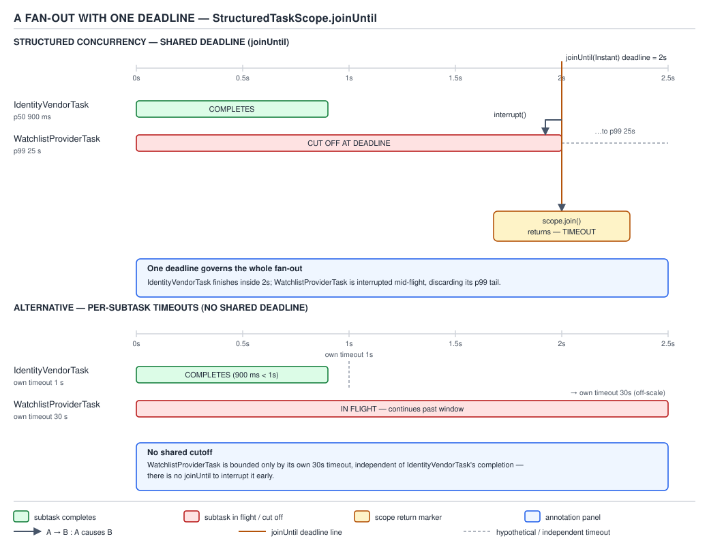

# 04 Modern Java — Structured concurrency — INTERMEDIATE (§2.13)

**Target version: Java 21 LTS.** | **Part 2 of 5** | [Index](../00-index.md)
Previous: [Structured concurrency — basics](01-basics.md) · Next: [Structured concurrency — internals](03-internals.md)

01-basics established the shape: `StructuredTaskScope` is a try-with-resources block that owns every
thread it forks, and no subtask outlives the block. This file is the same primitive under load — fan-out
with a deadline, hedging against a slow replica, reading which exception actually surfaces, nesting scopes
into a tree, and replacing `ThreadLocal` request context with `ScopedValue`. Everything here is
`--enable-preview` on Java 21 (JEP 453, second preview at this release) unless a version note says
otherwise.

---

## The two-piece API, as a map before the streets

| Piece | Shape on Java 21 | What it is for |
|---|---|---|
| `StructuredTaskScope<T>` | `public StructuredTaskScope()` / `public StructuredTaskScope(String name, ThreadFactory factory)` | Owns a group of forked subtasks; closes them all before the block exits |
| `StructuredTaskScope.Subtask<T>` | interface, returned by `fork(Callable<T>)` | A handle to one forked task: `get()`, `exception()`, `state()` — never a bare `Future<T>` |
| `StructuredTaskScope.ShutdownOnFailure` | extends `StructuredTaskScope<Object>` | Failure policy: first failure cancels the group; `join()`/`joinUntil()` wait; `throwIfFailed()` rethrows |
| `StructuredTaskScope.ShutdownOnSuccess<T>` | extends `StructuredTaskScope<T>` | Success policy: first success cancels the group; `result()` returns it or rethrows the aggregate failure |
| `ScopedValue<T>` | `ScopedValue.newInstance()`, bound with `ScopedValue.where(key, value).run(...)` / `.call(...)` | Immutable, dynamically-scoped binding, inherited by forked subtasks |

Both shutdown policies are subclasses of the same base scope; you pick a policy by picking which subclass
you instantiate, not by passing a strategy object. That changes on Java 25 — see the version note in the
Preview-risk section below.

---

### The fan-out call: one deadline, one failure policy, one return

**Mental model first.** A fan-out under `StructuredTaskScope` is a fork of independent lanes that all
report to one owner, on one clock. Picture a relay where every runner starts at the gun and the
baton-taker stops waiting at a fixed wall-clock instant — not "give each runner N seconds", but "the whole
relay ends at 14:32:07.000, whoever isn't back is cut off." That single clock is the entire point: it is
the difference between "call two services, each with its own client-side timeout" and "call two services
and never spend more than 2 seconds total no matter how the two individual timeouts compose."

**Why it exists.** Before structured concurrency, a fan-out to two remote services was usually two
`CompletableFuture`s composed with `allOf`, each wrapped in its own `orTimeout`. That gives you two
independent clocks and no shared cancellation: if the identity vendor times out at 900ms but the watchlist
provider is still running at 24 seconds, `allOf` still has a live, forgotten thread burning a pool slot
until *its own* timeout fires — and if you forgot to attach a timeout to one of the two futures, that leg
runs until the underlying socket gives up, which for a stalled TCP connection can be minutes. The older,
blunter alternative — `ExecutorService.invokeAll(tasks, timeout, unit)` — does share one clock, but on
timeout it silently returns `Future`s in the `CANCELLED` state with no distinction between "this leg
failed" and "this leg was cut off by the clock," and it has no per-task error propagation: you poll each
`Future.get()` yourself and reassemble the failure story by hand.

**When to reach for it, and when not.** Reach for `StructuredTaskScope` with `joinUntil` when you have two
or more genuinely independent remote calls that must all complete — or all be abandoned — under one
wall-clock deadline, and you want the failure of any one of them to be a first-class, typed exception
rather than a `Future` you forgot to unwrap. Do not reach for it when the calls are sequential and
dependent (the second needs the first's result — that is just normal blocking code, no scope needed), and
do not reach for it when you want *partial* results back from a fan-out that only mostly succeeded —
`ShutdownOnFailure` cancels the whole group on the first failure by design, so a "best effort, take what
you got" fan-out is closer to `ExecutorService.invokeAll` with manual `Future` inspection, or to composing
your own `Joiner` on Java 25 (see the version note below).

**How it works.** Onboarding calls two remote checks concurrently — the identity vendor and the watchlist
provider — and needs both, or neither, before `AccountActivation` can move an application past `AA-710
REVIEW_IN_PROGRESS`. The owner thread opens a scope, forks both, and calls `joinUntil` with one `Instant`:

```java
try (var scope = new StructuredTaskScope.ShutdownOnFailure()) {
    Subtask<IdentityVerdict> identity =
        scope.fork(() -> screeningService.verifyIdentity(applicationId));
    Subtask<ScreeningVerdict> watchlist =
        scope.fork(() -> screeningService.checkWatchlist(applicationId));

    scope.joinUntil(Instant.now().plusSeconds(2));
    scope.throwIfFailed(TimeoutException::new);

    return new ReviewCase(applicationId, identity.get(), watchlist.get());
}
```

`joinUntil(Instant)` is the scope-level clock: one deadline for the *entire fan-out*, evaluated once, not
once per subtask. If the deadline passes before both subtasks reach a terminal state, `joinUntil` throws
`TimeoutException` itself — separately from whatever `throwIfFailed()` would report — and the scope's
`close()` (called automatically by try-with-resources) interrupts every subtask still running. The
identity vendor's p50 is 900ms and its p99 is 38 seconds (Appendix A); the watchlist provider's p50 is
1.4s but its p99 is 25 seconds against a 30-second timeout of its own (Appendix A). A 2-second scope
deadline is comfortably past both p50s and comfortably short of either p99 — the point of the pattern: the
*scope's* deadline is the business-facing SLA, and it can be far tighter than either downstream call's own
worst case, because the scope does not wait for the worst case, it cancels into it.


**D-120** — A fan-out with one deadline

The diagram is the mechanism made visible: two subtask lanes under one vertical deadline line at 2
seconds. The identity vendor (900ms p50) finishes comfortably inside the line and its lane simply ends.
The watchlist provider (25s p99) is still running when the deadline line arrives; its lane is cut with an
interrupt arrow drawn back at the subtask, and the scope's overall return is marked at the deadline, not
at whenever the slow lane would eventually have finished. The second pair of lanes on the right is the
alternative shape covered next — per-subtask timeouts instead of one scope timeout — drawn side by side
precisely so the two are never confused.

**Timeouts: `joinUntil(Instant)` for the scope versus per-subtask timeouts inside each task.** These are
two different tools solving two different problems, and conflating them is the most common
structured-concurrency bug in review. `joinUntil` bounds *the group* — "I will not wait past 14:32:07 no
matter how many subtasks I forked." A per-subtask timeout bounds *one call* — "the watchlist provider
itself gives up after 30 seconds" (Appendix A's own figure for that service) — and is implemented the
ordinary way, inside the `Callable` passed to `fork`, using whatever timeout mechanism the client library
exposes (an HTTP client's request timeout, a `Future.get(timeout, unit)` on a lower-level call the subtask
makes internally). The two compose: the per-subtask timeout is a client-side contract with one dependency;
the scope timeout is the business SLA across all of them. You can have a 30-second per-subtask timeout on
the watchlist call *and* a 2-second scope deadline that cuts it off long before its own timeout would ever
fire — the diagram's second lane pair shows exactly this, a per-subtask timeout that is real and
configured, sitting *inside* a scope deadline that is shorter and wins in practice. Losing sight of this
distinction produces two symmetric bugs: relying only on per-subtask timeouts gives you a fan-out whose
total latency is the *sum or max* of whatever timeouts you configured, with no single number you can quote
as the endpoint's SLA; relying only on the scope deadline with no per-subtask timeout at all means a
subtask that ignores interruption (a blocking call on a resource that does not respond to
`Thread.interrupt()`, such as a socket read against a misbehaving proxy that does not honor connection
resets) can outlive the scope's nominal deadline anyway, because `close()` interrupts, it does not
forcibly kill.

**Interview:** "Walk me through what happens if the watchlist provider is still running when the deadline
fires." Answer: `joinUntil` returns (or throws `TimeoutException` if the deadline is reached before all
subtasks finish), the scope's `close()` runs as the try-with-resources block exits, `close()` calls
`shutdown()` on any subtask not yet terminal, `shutdown()` interrupts that subtask's thread, and the
subtask's `state()` becomes `UNAVAILABLE` if it never reached `SUCCESS` or `FAILED` before being cut off —
its `Subtask.get()` would throw `IllegalStateException` if called, which is why you check
`throwIfFailed()`/`state()` before ever calling `get()` on a subtask that might have been cancelled.

**How the deadline and the failure policy interact, not just how each works alone.** The two axes of this
concept — "one deadline" and "one failure policy" — are independent knobs that combine, and treating them
as one setting is a common source of confusion. `joinUntil` governs *when* the owner thread stops waiting;
`ShutdownOnFailure` versus `ShutdownOnSuccess` governs *what event, other than the deadline, also stops
the owner thread early*. A `ShutdownOnFailure` scope can end for either of two reasons: the deadline
passes (`joinUntil` throws `TimeoutException`), or a subtask fails before the deadline (the failure
triggers `shutdown()` immediately, and `join`/`joinUntil` return normally at that earlier point because
the group's work is now decided — cancelled — even though the clock had time left). Watching
`AccountActivation`'s fan-out concretely: if the identity vendor comes back with a hard rejection at 400ms
— well inside the 2-second deadline — `ShutdownOnFailure` does not wait out the remaining 1.6 seconds
hoping the watchlist provider still finishes; it cancels the watchlist subtask immediately and
`throwIfFailed()` surfaces the rejection at 400ms, not at 2 seconds. This "fail fast, even under a
generous deadline" behavior is precisely why `ShutdownOnFailure` is the default reach for a fan-out where
any single failure makes the rest of the work moot — the deadline is a backstop for "nothing failed but
something is slow," not the only way the scope ends early.

**Why `join()` without a deadline is rarely the right call in a request-serving path.**
`StructuredTaskScope` also exposes a plain `join()` with no deadline argument at all, which blocks until
every subtask reaches a terminal state or the scope is otherwise shut down — no timeout, ever. This is the
correct choice for background batch work with no caller waiting on a clock (a nightly `PaymentRun`
reconciliation fanning out across settlement files, for instance, where "finish eventually, correctly"
beats "finish by a deadline"), but it is close to never correct on a request-serving path like
`AccountActivation`'s onboarding flow, because it inherits whichever downstream call has the longest tail
— here, the identity vendor's p99 of 38 seconds — with no ceiling of the caller's own choosing.
`joinUntil` is the request-path default specifically because it lets the caller assert a business SLA that
is independent of, and typically far tighter than, any one dependency's own worst case.

> A fan-out under `StructuredTaskScope` puts every concurrent leg under one deadline and one failure policy,
  so the caller gets exactly one return path — a result or one typed exception — no matter how many legs
  it forked.

---

### Hedged requests with `ShutdownOnSuccess` against two replicas

**Mental model first.** Hedging is racing, not fanning out: you fire the same logical request at two
independent replicas and take whichever answers first, throwing the loser away. `ShutdownOnFailure` from
the previous concept waits for everyone and fails on the first failure; `ShutdownOnSuccess` is its mirror
— it waits for anyone and *succeeds* on the first success, cancelling the rest.

**Why it exists.** Tail latency on a single replica is unavoidable — the identity vendor's own p99 of 38
seconds against a p50 of 900ms (Appendix A) is a 40x gap, and no amount of client-side tuning removes a
slow replica's occasional slow response. Hedging trades a small amount of duplicate work for a large cut
in tail latency: if the two replicas' slow responses are not perfectly correlated, the probability that
*both* are slow on the same request is far lower than the probability that one is. Before
`ShutdownOnSuccess`, hedging was hand-rolled with `CompletableFuture.anyOf`, which has two sharp edges: it
returns `Object` (a checked-cast footgun) and it does nothing to cancel the loser — the slower replica's
request keeps running to completion on its own thread even after the faster one has already returned,
silently burning a connection-pool slot and finishing work nobody reads.

**When to reach for it, and when not.** Reach for it when you have two (or more) interchangeable sources
for the *same* answer and you are willing to pay for redundant work to cut tail latency — replica reads,
idempotent lookups, cache-then-source races. Do not reach for it for the fan-out case in the previous
concept, where the two calls return *different* pieces of information that both must be present in the
final answer — `ShutdownOnSuccess` is the wrong policy there because "first one back" is not "all of them
back." Do not reach for it either when the two calls have side effects that are not safe to run twice and
abandon — hedging assumes the loser's work is genuinely disposable.

**How it works.** `BalanceView` needs the client's current wallet snapshot and can serve it from either of
two read replicas; either answer is equally valid, and the point is to return whichever replica responds
first:

```java
try (var scope = new StructuredTaskScope.ShutdownOnSuccess<WalletSnapshot>()) {
    scope.fork(() -> walletReplicaPrimary.read(clientId));
    scope.fork(() -> walletReplicaSecondary.read(clientId));

    scope.joinUntil(Instant.now().plusMillis(1_500));
    return scope.result(cause -> new BalanceUnavailableException(clientId, cause));
}
```

The first subtask to reach `SUCCESS` triggers `shutdown()` on the scope, which interrupts the other
subtask's thread exactly the way a scope deadline does in the previous concept — hedging and
deadline-based fan-out share the same cancellation plumbing, only the trigger differs (a subtask's own
success, versus wall-clock time). `result()` returns that first successful value directly; if *both*
replicas fail before either succeeds, `result()` throws, and the `Function<Throwable, X>` overload used
above lets the caller map the (arbitrary) underlying failure into a domain exception rather than leaking
whichever replica happened to fail last.

**Table — the sibling comparison, because these are the two shutdown policies and neither wins outright:**

| | `ShutdownOnFailure` | `ShutdownOnSuccess<T>` |
|---|---|---|
| Cancels the group on | first subtask to **fail** | first subtask to **succeed** |
| Terminal call | `throwIfFailed()` (or the `Function` overload) | `result()` (or the `Function` overload) |
| Use for | fan-out where you need *all* legs | hedge where you need *any one* leg |
| What a "win" looks like | every subtask reached `SUCCESS` | one subtask reached `SUCCESS`, rest cancelled |
| Return type of the terminal call | `void` (results read off each `Subtask`) | `T` (the winning subtask's value, directly) |

**Gotcha.** `ShutdownOnSuccess.result()` without the `Function` overload rethrows the *underlying*
exception from whichever subtask's failure it happened to retain, wrapped only if it is a checked
exception (as an unchecked wrapper) — it does not aggregate all failures the way `throwIfFailed()` on the
failure policy implicitly does by cancelling on the very first one. If every replica fails, you get one
replica's exception, not a combined picture of "both replicas are down"; if that distinction matters for
alerting, catch and log at each subtask's own call site inside the `Callable`, not only at the scope
boundary.

**The cost side of hedging, which every hedge decision has to weigh.** Hedging is not free concurrency —
it doubles (or N-tuples, for N replicas raced) the load placed on the backing service for every request
that uses it, and unlike the fan-out concept's timeout tuning, there is no deadline knob that reduces this
cost; the redundant call happens on every single request, win or lose, because there is no way to know in
advance which replica will answer first. For `BalanceView`'s wallet-read hedge above, at the platform's
steady 14k concurrent sessions (Appendix A) a naive "hedge every read" policy roughly doubles read-replica
load platform-wide, which is why hedging is usually reserved for the specific calls whose tail latency is
business-visible (a client-facing balance check blocking a withdrawal confirmation) rather than applied
uniformly to every read in the system. A common refinement — not shown in the code above, and worth naming
because interviewers ask for it — is a *delayed* hedge: fork the second replica only if the first has not
answered within some short grace period (say, the p50 of 240ms rather than 0ms), trading a small amount of
the tail-latency win for a much smaller increase in duplicate load; `StructuredTaskScope` does not have
this built in, and implementing it means forking the second subtask from inside the scope's body after an
explicit wait, not at the same instant as the first.

> `ShutdownOnSuccess<T>` races a group of interchangeable subtasks under one scope and returns the first
  value to succeed, cancelling every other subtask the instant a winner is known — the structural mirror
  of `ShutdownOnFailure`, which instead cancels on the first loss.

---

### Error handling: which exception surfaces, and how to see the rest

**Mental model first.** A `StructuredTaskScope` under `ShutdownOnFailure` is a court that only ever
reports one verdict to the caller — the *first* failure — but it keeps a full docket of every subtask's
individual outcome that you can inspect if you know to ask. `throwIfFailed()` is "tell me the headline";
each `Subtask.exception()` is "show me the full file."

**Why it exists.** Before this API, aggregating N concurrent failures into a coherent decision meant
either taking whichever `Future.get()` you happened to unwrap first (order-dependent, non-deterministic
which exception the caller sees) or manually collecting every `Future`'s exception into a list and
deciding what to do with a pile of `ExecutionException`s yourself. `ShutdownOnFailure` fixes the "which
one surfaces" question by making it deterministic: the first subtask to fail is the one whose exception
`throwIfFailed()` rethrows, because that is also the failure that triggered the group's cancellation —
cause and reported error are the same event, not a race to unwrap.

**When to reach for it, and when not.** `throwIfFailed()` is the right tool when the caller only needs to
know *that* the fan-out failed and *why*, in one exception, to propagate or log. Reach past it to
individual `Subtask.exception()` calls when you need to distinguish *which* leg failed for different
remediation — for example, retrying only the leg that timed out while treating a validation failure from
the other leg as terminal. Do not call `Subtask.get()` on a subtask you have not confirmed reached
`SUCCESS`; on any other state it throws `IllegalStateException`, and reflexively wrapping every `get()` in
a broad `catch (Exception e)` hides that this is a programmer error (calling `get()` at the wrong time),
not a business failure.

**How it works.** `PaymentService` fans out a `CardPayments` authorization and a `FundsLedger` reservation
for the same withdrawal; either can fail independently, and the caller needs to know precisely which one,
because the remediation differs — a declined card authorization is shown to the client, a ledger
reservation failure is an internal alert:

```java
try (var scope = new StructuredTaskScope.ShutdownOnFailure()) {
    Subtask<AuthorizationResult> authorization =
        scope.fork(() -> cardPayments.authorize(withdrawalId, amount));
    Subtask<Void> reservation =
        scope.fork(() -> {
            fundsLedger.reserve(withdrawalId, amount);
            return null;
        });

    scope.join();
    scope.throwIfFailed(cause -> new WithdrawalFailedException(withdrawalId, cause));

    return authorization.get();
} catch (WithdrawalFailedException surfaced) {
    // one exception reached the caller — inspect the docket to decide remediation
    Throwable authFailure = authorization.state() == Subtask.State.FAILED
        ? authorization.exception() : null;
    Throwable reservationFailure = reservation.state() == Subtask.State.FAILED
        ? reservation.exception() : null;
    throw routeFailure(surfaced, authFailure, reservationFailure);
}
```

`throwIfFailed()` rethrows exactly one `Throwable` — the exception (or the mapped domain exception, with
the `Function` overload) belonging to whichever subtask reached `FAILED` state first and triggered the
scope's `shutdown()`. That is the headline. Every subtask, including the one that did not cause the
cancellation, still has its own terminal `state()` (`SUCCESS`, `FAILED`, or `UNAVAILABLE` if it was
cancelled before finishing) and its own `exception()` if `FAILED` — the full docket survives past
`throwIfFailed()` because the `Subtask` handles themselves are just objects the owner thread still holds;
nothing about calling `throwIfFailed()` clears them.

**Gotcha.** Calling `Subtask.exception()` on a subtask whose state is `SUCCESS` throws
`IllegalStateException` — `exception()` and `get()` are exact mirrors of each other's preconditions, one
valid only on `FAILED`, the other only on `SUCCESS`. Always branch on `state()` first; do not
`try`/`catch` your way past this, because the exception thrown here is a programmer-error signal (asking a
subtask for a result it does not have), not a business outcome to swallow.

**Interview:** "If two subtasks fail at nearly the same instant, which exception does `throwIfFailed()`
throw?" Answer: whichever one the scope's internal happens-before ordering recorded as reaching `FAILED`
first — the API guarantees *a* deterministic first failure surfaces and triggers cancellation, but it does
not guarantee which of two genuinely racing failures wins that ordering; if the caller needs to see both,
it must inspect each `Subtask.exception()` itself rather than relying on `throwIfFailed()` alone.

**Why the mapped `Function` overload of `throwIfFailed` matters beyond convenience.** `throwIfFailed()`
with no argument rethrows the failing subtask's own exception directly — an `InsufficientFundsException`
from `fundsLedger.reserve`, say, propagating straight out of the scope. That is often exactly wrong for a
caller several layers up that has no business knowing the fan-out was implemented with `FundsLedger` at
all: a `PaymentService` boundary should throw its own `WithdrawalFailedException`, not leak
`FundsLedger`'s internal exception type across a module boundary. `throwIfFailed(Function<Throwable, X>
exceptionSupplier)` exists for exactly this translation — it wraps the underlying cause as the wrapped
exception's cause (so nothing about the original stack trace or type is lost for logging) while presenting
the caller with a type that belongs to the calling layer's own contract. This is the same instinct as
never letting a persistence-layer exception escape a service boundary un-translated, applied to the
concurrent case.

> `throwIfFailed()` surfaces exactly one exception — the first failure that triggered the scope's
  cancellation — while every subtask's own terminal `state()` and `exception()` remain individually
  inspectable afterward for callers that need the full picture, not just the headline.

---

### Nesting scopes, and the resulting task tree `[RESEARCH]`

**Mental model first.** Nothing stops a `Callable` forked into one scope from opening its *own*
`StructuredTaskScope` inside its body — the result is a tree, not a flat fan-out: an outer scope's subtask
thread becomes the owner thread of an inner scope, and that inner scope's subtasks are its children. The
structural rule from 01-basics — "no subtask outlives its scope" — now applies recursively at every level:
an inner scope must close, and every one of *its* subtasks must terminate, before the outer subtask that
opened it can itself report `SUCCESS` or `FAILED` back to its own parent.

**Why it exists.** Fan-out is rarely one level deep in a real service graph. `AccountActivation` fanning
out to `DocumentVerification` and `ScreeningService` is itself often just one leg of a larger
`ApplicationHistory` orchestration that also fans out to `AssessmentService` in parallel — nesting lets
each layer own its own deadline and failure policy without the outer layer having to know the inner
layer's internal fan-out shape at all. This is the direct concurrent analogue of ordinary nested method
calls: the outer scope does not care that its subtask internally forked two more subtasks, exactly as a
caller does not care that a method it called internally called two more methods.

**When to reach for it, and when not.** Nest scopes when a subtask's own unit of work is itself naturally
composed of independent concurrent legs with a deadline that makes sense to express *at that level* — the
inner deadline can and often should be tighter than whatever budget the outer scope allotted that leg. Do
not nest scopes merely to organize code that has no real concurrency at the inner level; a `Callable` that
calls three sequential methods does not need its own scope just because it happens to be forked from one.

**How it works, and the caveat this leaf is tagged for.** `[RESEARCH]`: JDK 21's diagnostic tooling
represents exactly this tree structure through `jcmd <pid> Thread.dump_to_file -format=json <file>`, a
thread-dump mode delivered alongside virtual-thread and structured-concurrency support in JEP 444 (Virtual
Threads, JDK 21). Unlike the classic text thread dump, the JSON format is organized around **thread
containers** — the JVM's internal bookkeeping for a group of threads with a common owner — rather than a
flat thread list; each `StructuredTaskScope` is backed by one thread container, an outer scope's container
lists the owner thread that opened it and the subtask threads it forked, and a nested scope's container
appears *underneath* the subtask thread that opened it, with an explicit parent-container reference.
Reading the JSON, the task tree is visible directly in the nesting of `"threadContainers"` (or the
equivalent structured field the tool renders) rather than needing to be reconstructed by matching stack
traces the way it would from a classic text dump.

```java
try (var outer = new StructuredTaskScope.ShutdownOnFailure()) {
    Subtask<ReviewCase> reviewLeg = outer.fork(() -> {
        try (var inner = new StructuredTaskScope.ShutdownOnFailure()) {
            Subtask<IdentityVerdict> identity =
                inner.fork(() -> screeningService.verifyIdentity(applicationId));
            Subtask<AssessmentVerdict> assessment =
                inner.fork(() -> assessmentService.scoreAffordability(applicationId));
            inner.joinUntil(Instant.now().plusSeconds(3));
            inner.throwIfFailed();
            return new ReviewCase(applicationId, identity.get(), assessment.get());
        }
    });
    Subtask<ScreeningVerdict> watchlistLeg =
        outer.fork(() -> screeningService.checkWatchlist(applicationId));

    outer.joinUntil(Instant.now().plusSeconds(5));
    outer.throwIfFailed();
    return combine(reviewLeg.get(), watchlistLeg.get());
}
```

The inner scope's 3-second deadline is nested entirely inside the outer scope's 5-second deadline — the
outer deadline must always be at least as generous as the slowest inner path plus whatever sequential work
surrounds it, or the outer scope will cancel the inner one mid-flight regardless of the inner deadline's
own arithmetic, because interruption from an outer `close()` reaches every thread in the tree beneath it,
not just its direct children.

**Unverified:** the exact JSON field names and schema version for `jcmd Thread.dump_to_file -format=json`
were not re-verified against the jdk-21+35 source tag or a live JSON dump from this machine's JDK 25
install for this file — the container/owner-thread relationship described above reflects the documented
purpose of the JEP 444 thread-dump work, but the precise key names should be confirmed against a real dump
before being quoted verbatim in an interview or in a diagram.

**Gotcha.** A common mistake is forking the *inner* scope's `StructuredTaskScope` on a thread that is not
itself an owner of anything — i.e., trying to share one `StructuredTaskScope` instance across two
unrelated fan-outs to avoid the "overhead" of opening a second one. `StructuredTaskScope` is not reusable
and is not thread-safe for forking from multiple threads concurrently; the owner thread is fixed at
construction, and only that thread may call `fork`, `join`, or `close`. Nesting is always a new scope per
level, never one scope shared across sibling fan-outs.

**Cancellation propagates down the whole tree, not just to direct children.** This is worth stating
precisely because it is easy to assume interruption stops at the first level. When the *outer* scope's
deadline fires or one of its subtasks fails under `ShutdownOnFailure`, the outer scope's `close()` calls
`shutdown()` on every subtask it directly forked — including `reviewLeg` in the example above, the subtask
that itself opened the inner scope. Interrupting `reviewLeg`'s thread does not reach into the inner
scope's own subtasks by any special structured-concurrency magic; what actually happens is that the
interrupt lands on `reviewLeg`'s thread while it is blocked inside `inner.joinUntil(...)`, `joinUntil`
itself responds to interruption by throwing `InterruptedException` out of that call, and the inner
`try`-with-resources block's own `close()` then runs as that exception propagates — which in turn calls
`shutdown()` on the inner scope's own subtasks (`identity` and `assessment` in the example). The
cancellation reaches the whole tree, but it does so level by level, each `close()` triggering the next,
not as one instantaneous broadcast to every leaf. This matters for how long full cancellation actually
takes in practice: a very deep nesting chain has a cancellation latency that is the sum of each level
noticing its own interrupt, not zero.

> Nesting scopes builds a tree in which an outer subtask's own scope must fully close before that subtask
  can report its own outcome upward, and JDK 21's JSON thread-dump format is the tool built specifically
  to make that tree visible at runtime instead of reconstructed by hand from stack traces.

---

### Scoped values for request context, instead of `ThreadLocal` `[X-REF 20]`

**Mental model first.** A `ScopedValue<T>` is not a mutable cell you write into — it is a *binding* that
exists only for the dynamic extent of one call, the way a method parameter exists only for the extent of
one call frame, except visible to every method the current thread calls transitively without having to
thread it through every signature. `ThreadLocal` is a mutable map keyed by thread, written with `set()`
and read back later by anyone holding the same instance; `ScopedValue` is an immutable value bound once,
for one block, read only within that block's dynamic extent, and automatically gone the instant the block
that bound it returns.

**Why it exists.** The MDC pattern — putting `tenantId`, `principal`, and `traceId` into a logging context
so every log line in a request can be correlated — is usually implemented today with
`ThreadLocal<Map<String,String>>`, and every implementation of it inherits `ThreadLocal`'s two structural
problems. First, it is a leak risk: a `ThreadLocal.set()` on a pooled thread (an ordinary platform thread
pool, or worse, a thread that will be recycled without going through a framework's request-boundary hook)
has no automatic unbind — you must remember `remove()` in a `finally`, and the value silently survives
into whatever request reuses that thread if you forget, which for `tenantId` specifically is a data-leak
class of bug, not merely a memory leak. Second, and this is the one that matters for virtual threads:
`InheritableThreadLocal`'s propagation to child threads copies the *entire* value into every child at
creation time, which is fine for a platform-thread pool with a handful of workers but becomes real,
measurable overhead when a single request under `StructuredTaskScope` forks dozens of virtual-thread
subtasks, each needing its own copy of a context that never actually changes.

**When to reach for it, and when not.** Reach for `ScopedValue` for exactly this shape of problem —
read-mostly context that is bound once at a request boundary and must be visible to everything the
request's thread (and its forked subtasks) does, without threading it through every method signature. Do
not reach for it as a general mutable-state replacement for `ThreadLocal`: a `ThreadLocal<StringBuilder>`
used as a per-thread scratch buffer that genuinely gets mutated across the life of a long-lived thread has
no `ScopedValue` equivalent, because `ScopedValue` bindings are immutable for their entire dynamic extent
by design — there is no `set()`.

**How it works.** `RouterInt` binds tenant, principal, and trace id once at the point a request enters,
and everything downstream — including subtasks forked into a `StructuredTaskScope` for a fan-out — reads
them back with no parameter threading:

```java
static final ScopedValue<ClientId> TENANT = ScopedValue.newInstance();
static final ScopedValue<PersonId> PRINCIPAL = ScopedValue.newInstance();
static final ScopedValue<String> TRACE_ID = ScopedValue.newInstance();

void handleWithdrawalRequest(WithdrawalRequest request) {
    ScopedValue.where(TENANT, request.clientId())
               .where(PRINCIPAL, request.principalId())
               .where(TRACE_ID, request.traceId())
               .run(() -> processWithdrawal(request));
}

void processWithdrawal(WithdrawalRequest request) {
    // no parameter carries tenant/principal/traceId — every frame below reads the binding
    auditLog.record(TRACE_ID.get(), "withdrawal initiated for tenant " + TENANT.get());
    fundsLedger.reserve(request.withdrawalId(), request.amount());
}
```

`ScopedValue.where(key, value)` returns a `ScopedValue.Carrier`, and chaining `.where(...)` calls builds
up multiple bindings before a single terminal `.run(Runnable)` or `.call(Callable<T>)` installs all of
them at once and executes the body. Inside `processWithdrawal` and everything it calls, `TENANT.get()`
returns `request.clientId()` — not because it was passed down, but because the binding is visible to the
entire dynamic extent of the `run()` call, on the thread that called it and (this is the leaf that makes
the whole pairing worth having) on any subtask forked from a `StructuredTaskScope` opened within that
extent.


**D-121** — Scoped-value bindings versus a `ThreadLocal` map

The left half of the diagram is the `ThreadLocal` shape: one map per thread, an inheritance *copy* pushed
into each child thread at creation, and a `remove()` obligation drawn with the leak that appears the
moment it is skipped — a stale `tenantId` sitting in a pooled thread's map, waiting for the next unrelated
request to read it. The right half is `ScopedValue`: one immutable linked binding snapshot, shared
*structurally* (not copied) with every subtask that inherits it, unbound automatically the instant the
binding `run()`/`call()` frame returns — by stack unwinding, not by a call anyone has to remember to make
— and a nested `where` drawn explicitly as shadowing rather than mutation, which is the next leaf.

**Rebinding: a scoped value is immutable within its scope, and a nested `where` shadows rather than
mutates.** `[PROVE]` Work through what a nested `where` actually does. `ScopedValue<T>.get()` reads
whatever binding is nearest on the *current dynamic call chain* — think of it as a linked list of
bindings, one node pushed per `where(...).run(...)` frame, searched from the innermost frame outward. When
code already running inside `ScopedValue.where(TENANT, clientA).run(...)` calls `ScopedValue.where(TENANT,
clientB).run(...)` for some nested unit of work (for instance, an internal system action performed "as" a
different tenant context, or a batch job iterating per-tenant work items under one outer scope), the inner
`run()` pushes a *new* node onto that chain with `TENANT` mapped to `clientB`. Everything inside the inner
`run()`'s dynamic extent that calls `TENANT.get()` sees `clientB` — the nearest node wins. The moment the
inner `run()` returns, that node is popped, and `TENANT.get()` reverts to seeing `clientA` again, because
the outer binding was never touched — it was shadowed, not overwritten. This is provably not mutation:
there is no method on `ScopedValue` that changes what an *existing* binding resolves to for code that is
already inside its `run()`/`call()` block; the only way to change what `TENANT.get()` returns is to be
inside a strictly more nested `where(...).run(...)` call, and that new binding is invisible again the
instant control returns to the outer frame. Contrast this directly with `ThreadLocal.set()`, which *does*
mutate — calling `set()` a second time on the same `ThreadLocal` from the same thread changes what every
subsequent `get()` on that thread sees, including code in outer stack frames that already read the old
value and is still running, which is precisely the class of bug ("who changed this out from under me
halfway through my method") that shadowing-not-mutation is designed to make structurally impossible.

**Scoped values are inherited by subtasks forked in a `StructuredTaskScope`.** `[RESEARCH]` This is the
mechanism that makes the pairing more than two independent JEPs shipped in the same release. When a
`Callable` is forked with `StructuredTaskScope.fork(...)`, the new virtual thread that runs it is created
with the *current* scoped-value bindings of the forking thread already in effect — the binding snapshot is
attached to the newly forked thread at fork time, not copied element-by-element the way
`InheritableThreadLocal` copies a map, and not re-looked-up from some shared registry on every `get()`
either. Re-verified against the shape of the second-preview API for JEP 453/JEP 446 on Java 21: the
inheritance is structural sharing of the same immutable snapshot object, which is why forking dozens of
subtasks under one `ScopedValue` binding costs one snapshot reference per subtask, not one copied map per
subtask — the exact overhead `InheritableThreadLocal` does not avoid. Continuing the fan-out example from
earlier in this file, `PaymentService`'s authorization and reservation subtasks both read `TRACE_ID.get()`
inside their own `Callable` bodies with no explicit propagation code at the fork call site:

```java
try (var scope = new StructuredTaskScope.ShutdownOnFailure()) {
    // TENANT, PRINCIPAL, TRACE_ID are already bound on this thread from an outer ScopedValue binding call
    Subtask<AuthorizationResult> authorization = scope.fork(() -> {
        auditLog.record(TRACE_ID.get(), "authorizing card payment for " + TENANT.get());
        return cardPayments.authorize(withdrawalId, amount);
    });
    Subtask<Void> reservation = scope.fork(() -> {
        auditLog.record(TRACE_ID.get(), "reserving ledger funds for " + TENANT.get());
        fundsLedger.reserve(withdrawalId, amount);
        return null;
    });
    scope.join();
    scope.throwIfFailed();
    return authorization.get();
}
```

**Unverified:** the precise data structure OpenJDK uses internally to represent a scoped-value binding
snapshot (whether it is literally a linked "carrier" object chain, as the mental model above describes, or
a different internal representation at the jdk-21+35 tag) was not re-confirmed against `ScopedValue.java`
source for this file — the *externally observable behaviour* (nearest-binding-wins, automatic unbind by
stack unwinding, inheritance into forked subtasks) is well established from the JEP text and is what this
leaf commits to; the internal object shape is the kind of detail 03-internals.md is the right place to
source-walk.

**X-REF:** this leaf is intentionally a self-contained mechanism paragraph, not the full treatment — the
deeper mechanics of thread-local storage, `InheritableThreadLocal`'s copy-on-create semantics, and MDC
integration patterns in logging frameworks are guide 20's territory (Observability); come back here only
for how `ScopedValue` specifically replaces that pattern under structured concurrency.

**Multiple bindings compose without nesting `run()` calls manually.** The `RouterInt` example above
chained three `.where(...)` calls before a single `.run(...)` — this is not sugar over three separate
nested `run()` blocks that happen to read the same; it is one `Carrier` object accumulating three bindings
before installing all of them atomically in a single frame push. The practical difference shows up in the
"what does a partial failure during binding look like" question: because all three bindings are installed
together by the one terminal `run()`/`call()`, there is no intermediate state where `TENANT` is bound but
`PRINCIPAL` is not yet — either the whole `run()` body executes with all three bound, or (if the body
itself throws before doing anything) none of the bindings ever became visible to code outside that frame
in the first place. Contrast this with three sequential `ThreadLocal.set()` calls, where a thread
genuinely does pass through an intermediate state with only some of the values set, and a poorly timed
exception between the first and second `set()` can leave that intermediate, partially-populated state
visible to whatever runs next on the same pooled thread.

**Gotcha.** `ScopedValue.get()` on an unbound value throws `NoSuchElementException`, not `null` — there is
no accidental null-propagation the way an un-set `ThreadLocal.get()` silently returns `null` (or its
`initialValue()`) instead of failing loudly. This is usually a feature — a missing binding fails fast at
the read site instead of silently producing a request with no `tenantId` attached to its audit trail — but
it means code that used to tolerate a missing `ThreadLocal` binding (treating `null` as "no tenant, system
context") needs an explicit `orElse(...)` or `isBound()` check, or it will throw where the `ThreadLocal`
version quietly proceeded.

> A `ScopedValue` is an immutable binding visible only for the dynamic extent of the
  `where(...).run(...)`/`.call(...)` frame that installed it and every frame — including forked
  `StructuredTaskScope` subtasks — nested beneath it, unbound automatically by stack unwinding rather than
  by a `remove()` call anyone has to remember.

---

## Preview risk: do not expose this in a library signature `[TRAP]` `[RESEARCH]`

Both APIs in this file are preview features on Java 21, and treating either one as stable enough to appear
in a public method signature is the single most consequential mistake this pair of JEPs invites.
Re-verified version history for each:

**Structured concurrency**, `StructuredTaskScope`:

| Release | Status | JEP |
|---|---|---|
| 19 | first incubator | JEP 428 |
| 20 | second incubator | JEP 437 |
| 21 | first **preview** | JEP 453 |
| 22 | second preview | JEP 462 |
| 23 | third preview | JEP 480 |
| 24 | fourth preview | JEP 499 |
| 25 | fifth preview — public constructors replaced by static `open()` factories; `ShutdownOnFailure`/`ShutdownOnSuccess` replaced by a composable `Joiner` (see the corrected shape below) | JEP 505 |
| 26 | sixth preview, continuing the same `Joiner`-based shape | JEP 525 |

**Unverified:** finalization is targeted for a later release than 26 as of the sources available for this
file; do not state a specific finalization release without re-checking the current OpenJDK JEP index,
since this is exactly the kind of number that moves between releases.

**Scoped values**, `ScopedValue`:

| Release | Status | JEP |
|---|---|---|
| 21 | first preview | JEP 446 |
| 22 | second preview | JEP 464 |
| 23 | third preview | JEP 481 |
| 24 | fourth preview | JEP 487 |
| 25 | **finalized** — one behavioural change from the preview shape: `ScopedValue.orElse` no longer accepts `null` as its argument | JEP 506 |

This is the asymmetry worth stating out loud in an interview: **scoped values reached GA in Java 25;
structured concurrency did not.** A codebase on Java 25 can depend on `ScopedValue` with the same
stability guarantee as any other finalized API, but `StructuredTaskScope` on that same release is still
`--enable-preview`, fifth preview, with a materially different public shape than Java 21's (see below) —
the two features that this file has treated as a pair for teaching purposes are, as of Java 25, at two
different stability levels, and a codebase that adopted both at 21 has a live migration to do on one of
them, not both.

**Pitfall:** the wrong belief is "these two shipped together in JEP 453 as one unit, so they'll finalize
together." The symptom: a library author on Java 21 exposes a public method that returns
`StructuredTaskScope.Subtask<T>` or accepts a `ShutdownOnFailure` instance as a parameter, reasoning that
structured concurrency is "basically done" because scoped values already look stable in the same release.
The fix: never let a preview type appear in a public API signature, full stop, regardless of how stable a
sibling feature in the same JEP family looks — `Subtask<T>`'s very name is stable across previews, but the
*type it is nested under* changes call-site shape between 21 and 25 (constructors versus `open()`
factories, policy subclassing versus a `Joiner` parameter), and any public method signature that names it
directly breaks source compatibility for every caller the moment the library upgrades. Keep preview types
entirely internal to an implementation, behind an interface or a plain data class of your own that does
not name `StructuredTaskScope` anywhere in its public surface.

**The corrected Java 25 shape**, for the record, since a reader who has only seen Java 21's constructors
needs to recognize the replacement rather than assume the old form persists: Java 21's `new
StructuredTaskScope.ShutdownOnFailure()` becomes, on Java 25,
`StructuredTaskScope.open(Joiner.awaitAllSuccessfulOrThrow())` (or the zero-argument
`StructuredTaskScope.open()` for the equivalent of the old failure policy as the default), and the old
`ShutdownOnSuccess<T>` becomes `StructuredTaskScope.open(Joiner.<T>anySuccessfulResultOrThrow())`. The
`Joiner` is a composable strategy object rather than a base class you subclass by choice of constructor,
and — per JDK 25's own class hierarchy — `StructuredTaskScope` itself becomes a sealed interface with only
JDK-internal implementations, closing off the "extend it yourself" door that Java 21's public constructors
on `ShutdownOnFailure`/`ShutdownOnSuccess` left ambiguous about. `Subtask<T>`'s shape (`get()`,
`exception()`, `state()`) is unchanged across this transition — it is the scope's own construction and
policy selection that moved, not the per-task handle.

---

## What to actually say in an interview

Three sentences, in this order, cover what an interviewer is actually checking for when they ask "tell me
about structured concurrency":

1. **Name the guarantee.** "A `StructuredTaskScope` guarantees that no subtask can outlive the block that
   forked it — every subtask is joined or cancelled before the try-with-resources exits, which is enforced
   by `close()`, not by convention." This is the one sentence that separates someone who has used the
   preview API from someone reciting a blog summary; it is the guarantee, not the syntax, that is being
   asked about.
2. **Name the comparison.** "`ExecutorService.submit`/`CompletableFuture` composition with
   `allOf` does not have this guarantee — a forgotten `Future` or an unbounded `CompletableFuture` chain
   can leave an orphaned thread running past the point where the caller has already moved on, because
   nothing ties the child thread's lifetime to the calling code's control flow." Naming the concrete
   failure mode of the alternative (orphaned threads, not just "it's more manual") is what shows the
   guarantee was understood, not just memorized.
3. **Name the status.** "It's a preview feature on Java
   21 — needs `--enable-preview`, and the public API shape changed again by Java 25, moving from
   constructors and subclassed shutdown policies to static `open()` factories and a composable `Joiner`.
   Scoped values, the companion feature for propagating request context into forked subtasks, reached GA
   in Java 25 while structured concurrency itself is still in preview there." This closes the answer
   honestly instead of implying either feature is safe to build a public library API around today, and it
   demonstrates the reader tracked the version history rather than describing whichever shape they
   happened to read about first.

**Interview:** if asked to contrast this with `ThreadLocal`-based context propagation in the same breath
as structured concurrency, the concise answer is: "`ScopedValue` is inherited by forked subtasks as a
structurally shared, immutable snapshot with automatic unbind by stack unwinding; `ThreadLocal` requires
either `InheritableThreadLocal`'s per-child copy or manual propagation, plus a `remove()` you have to
remember, and neither addresses the actual problem structured concurrency solves — thread lifetime — on
its own."

---

## Pitfalls

### Assuming `joinUntil` bounds each subtask individually

**Wrong**

```java
try (var scope = new StructuredTaskScope.ShutdownOnFailure()) {
    scope.fork(() -> screeningService.verifyIdentity(applicationId));   // p99 38s
    scope.fork(() -> screeningService.checkWatchlist(applicationId));   // p99 25s, 30s own timeout

    // "each subtask gets 2 seconds" -- this is not what joinUntil does
    scope.joinUntil(Instant.now().plusSeconds(2));
    scope.throwIfFailed();
}
```

Read naively, `joinUntil(Instant.now().plusSeconds(2))` looks like it might mean "give each subtask 2
seconds." It does not — and in this particular wrong example there is no separate bug beyond the
misreading, because the deadline genuinely is scope-wide either way. The real failure shows up when
someone "fixes" perceived per-subtask starvation by widening the deadline per subtask *count*:

```java
// "we have 3 subtasks, so 3 * 2s should be safe" -- wrong reasoning, same API
scope.joinUntil(Instant.now().plusSeconds(2 * 3));
```

**Right**

```java
try (var scope = new StructuredTaskScope.ShutdownOnFailure()) {
    scope.fork(() -> screeningService.verifyIdentity(applicationId));
    scope.fork(() -> screeningService.checkWatchlist(applicationId));

    // one deadline for the whole group, sized to the business SLA -- not multiplied by subtask count
    scope.joinUntil(Instant.now().plusSeconds(2));
    scope.throwIfFailed();
}
```

`joinUntil` takes exactly one `Instant` regardless of how many subtasks are forked, because concurrent
subtasks all run against the same wall clock at once — three subtasks running concurrently do not need 3x
the deadline of one, they need the deadline of whichever one is slowest, which is why the deadline should
be sized against the *slowest acceptable leg*, not multiplied by leg count.

**Why people believe it:** timeouts on sequential code genuinely do accumulate (`Thread.sleep` three times
in a row sums to three sleeps), and it takes a deliberate correction to remember that concurrent legs
under one scope do not compose the same way — the whole reason to fork them concurrently in the first
place is so their durations overlap rather than add.

### Calling `Subtask.get()` before checking `state()`

**Wrong**

```java
try (var scope = new StructuredTaskScope.ShutdownOnFailure()) {
    Subtask<AuthorizationResult> authorization =
        scope.fork(() -> cardPayments.authorize(withdrawalId, amount));
    scope.joinUntil(Instant.now().plusSeconds(2));
    // skips throwIfFailed() -- assumes get() will just work or throw something catchable
    return authorization.get();
}
```

If the subtask was cancelled by the scope deadline before finishing, its state is `UNAVAILABLE`, and
`get()` throws `IllegalStateException` — a programmer-error exception, not the business exception
`cardPayments.authorize` would have thrown. Catching `IllegalStateException` here and trying to interpret
it as an authorization failure produces the wrong remediation path (retrying, when the real problem is
that the deadline was too tight).

**Right**

```java
try (var scope = new StructuredTaskScope.ShutdownOnFailure()) {
    Subtask<AuthorizationResult> authorization =
        scope.fork(() -> cardPayments.authorize(withdrawalId, amount));
    scope.joinUntil(Instant.now().plusSeconds(2));
    scope.throwIfFailed(cause -> new AuthorizationFailedException(withdrawalId, cause));
    return authorization.get();   // only reached once throwIfFailed() has confirmed no failure/cancellation
}
```

`throwIfFailed()` (or `throwIfFailed(Function)`) is the gate: it throws for any subtask that failed *or*
was cancelled before completing, so a `get()` reached after it returns normally is guaranteed to be on a
`SUCCESS` subtask.

**Why people believe it:** `Future.get()` from `java.util.concurrent` already throws a checked
`ExecutionException`/`InterruptedException` pair that people are used to wrapping broadly, so
`Subtask.get()` looks like "the same thing, just renamed" — but `Subtask.get()` has a precondition
(`state() == SUCCESS`) that `Future.get()` does not have in the same way, because `Future.get()` is
designed to be called speculatively and block, while `Subtask.get()` is designed to be called only after
the scope has already confirmed a terminal, successful state.

### Reaching for `ShutdownOnSuccess` on a fan-out that needs every leg

**Wrong**

```java
// two DIFFERENT pieces of information, both required -- ShutdownOnSuccess is the wrong policy
try (var scope = new StructuredTaskScope.ShutdownOnSuccess<Object>()) {
    scope.fork(() -> screeningService.verifyIdentity(applicationId));
    scope.fork(() -> screeningService.checkWatchlist(applicationId));
    scope.joinUntil(Instant.now().plusSeconds(2));
    Object firstBack = scope.result();   // only one of the two verdicts -- which one is unspecified
}
```

This compiles and runs, which is exactly what makes it dangerous — it returns *a* result, silently
discarding whichever verdict did not happen to finish first, when the actual requirement was both
verdicts.

**Right**

```java
try (var scope = new StructuredTaskScope.ShutdownOnFailure()) {
    Subtask<IdentityVerdict> identity =
        scope.fork(() -> screeningService.verifyIdentity(applicationId));
    Subtask<ScreeningVerdict> watchlist =
        scope.fork(() -> screeningService.checkWatchlist(applicationId));
    scope.joinUntil(Instant.now().plusSeconds(2));
    scope.throwIfFailed();
    return new ReviewCase(applicationId, identity.get(), watchlist.get());
}
```

`ShutdownOnFailure` waits for and requires all subtasks; `ShutdownOnSuccess` waits for and requires only
one. Picking between them is a requirements question — "do I need all of these, or any one of these" — not
a style preference, and the compiler will not catch the wrong choice, because both are valid, type-correct
uses of the API.

**Why people believe it:** `ShutdownOnSuccess<T>`'s generic return type feels more convenient — it hands
back a `T` directly instead of requiring separate `Subtask.get()` calls per leg — so it can look like the
"simpler" default to reach for even when the actual requirement is a fan-out, not a race.

---

## Cheat sheet

| Need | API | One-line rule |
|---|---|---|
| Fan out, need all legs | `ShutdownOnFailure` | first failure cancels the group; `throwIfFailed()` surfaces it |
| Race, need any one leg | `ShutdownOnSuccess<T>` | first success cancels the group; `result()` returns it |
| One deadline for the whole group | `scope.joinUntil(Instant)` | not per-subtask; sized to the business SLA |
| One deadline per remote call | timeout inside the `Callable` itself | client-side contract with one dependency, separate from the scope deadline |
| Read a subtask's result | `Subtask.get()` | only after confirming `state() == SUCCESS` (or after `throwIfFailed()` returns normally) |
| Read a subtask's failure | `Subtask.exception()` | only valid when `state() == FAILED` |
| Nest a fan-out inside a subtask | open a new `StructuredTaskScope` inside the forked `Callable` | inner deadline must fit inside the outer one |
| See the task tree at runtime | `jcmd <pid> Thread.dump_to_file -format=json <file>` | JEP 444, JDK 21; organized by thread container, not a flat list — **field names unverified in this file** |
| Request-scoped context (tenant, principal, trace id) | `ScopedValue.newInstance()` + `where(...).run(...)`/`.call(...)` | immutable binding, auto-unbound by stack unwinding, inherited by forked subtasks |
| Change a binding for a nested block only | nested `ScopedValue.where(...).run(...)` | shadows, does not mutate; reverts when the inner `run()` returns |
| Unbound scoped value read | `ScopedValue.get()` | throws `NoSuchElementException` — use `orElse`/`isBound()` if a default is valid |
| Enable either API on Java 21 | `--enable-preview` at compile and run | both are preview at 21 |
| Structured concurrency status by release | 19–20 incubator, 21–26 preview (JEP 453→525), not yet finalized as of 26 | do not put it in a public library signature |
| Scoped values status by release | 21–24 preview, **finalized at 25** (JEP 506) | stable dependency from 25 onward; `orElse(null)` no longer accepted from 25 |

---

## Self-test

**Q1.** Two subtasks are forked under `ShutdownOnFailure` with
`scope.joinUntil(Instant.now().plusSeconds(2))`. One finishes successfully after 500ms; the other is still
running at the 2-second mark. What state does the still-running subtask end up in, and what does the owner
thread see?

<details><summary>Answer</summary>

The scope's `close()` (triggered by try-with-resources at the end of the block, after `joinUntil` returns
because the deadline was reached) calls `shutdown()`, which interrupts the still-running subtask's thread.
That subtask's terminal `state()` becomes `UNAVAILABLE` — it never reached `SUCCESS` or `FAILED`. The
owner thread does not see this as a distinct exception from `throwIfFailed()` by itself; `joinUntil`
throwing `TimeoutException` is the actual signal that the deadline, not a subtask failure, ended the join.
Calling `Subtask.get()` or `Subtask.exception()` on the `UNAVAILABLE` subtask afterward throws
`IllegalStateException`, because neither precondition (`SUCCESS` for `get()`, `FAILED` for `exception()`)
holds.

</details>

**Q2.** Why is `ShutdownOnSuccess` the wrong policy for the fan-out that needs both the identity vendor's
verdict and the watchlist provider's verdict, even though both calls are independent and concurrent?

<details><summary>Answer</summary>

`ShutdownOnSuccess` cancels the group and returns as soon as *any one* subtask succeeds — it is built for
racing interchangeable sources of the same answer, not for combining two different pieces of required
information. If used here, the scope would return after whichever verdict happened to come back first and
cancel the other subtask before it ever produced a result, silently discarding one of the two verdicts the
caller actually needed. `ShutdownOnFailure`, which requires all subtasks to reach `SUCCESS` (or cancels on
the first `FAILED`), is the correct policy whenever every leg's result is required.

</details>

**Q3.** A `ScopedValue<ClientId> TENANT` is bound to `clientA` via an outer `where(TENANT,
clientA).run(...)`. Inside that block, a nested `where(TENANT, clientB).run(innerWork)` runs, and
`innerWork` itself calls a helper method that reads `TENANT.get()`. What does it see, and what does
`TENANT.get()` return once `innerWork` has finished and control is back in the outer block?

<details><summary>Answer</summary>

Inside `innerWork`'s dynamic extent — including any helper method it calls, however many frames deep, as
long as none of them installs a further nested `where` — `TENANT.get()` returns `clientB`, because the
inner `where(...).run(...)` pushed a new binding that is nearer on the current call chain than the outer
one. Once `innerWork` returns and the inner `run()` call itself returns, that binding is popped;
`TENANT.get()` in the outer block again returns `clientA`, because the outer binding was never mutated,
only shadowed for the duration of the inner frame.

</details>

**Q4.** Why does forking dozens of virtual-thread subtasks under one `ScopedValue` binding avoid the
overhead that the same fan-out would incur under `InheritableThreadLocal`?

<details><summary>Answer</summary>

`InheritableThreadLocal` propagates by copying the parent's value into each child thread individually at
creation time — dozens of subtasks means dozens of copies, one per child. `ScopedValue` inheritance
instead attaches the same immutable binding snapshot to each forked subtask by structural sharing — every
subtask references the same underlying binding object rather than receiving its own copy, so the cost of
forking N subtasks under one binding does not scale with the size of the bound value, only with N
references to the same object.

</details>

**Q5.** What is the difference between the scope-level deadline set by `joinUntil(Instant)` and a
per-subtask timeout configured inside one `Callable`'s own remote call, and why might a codebase need both
at once?

<details><summary>Answer</summary>

`joinUntil` bounds the *entire group of subtasks* under one scope by wall-clock time — a single deadline
the owner thread will not wait past regardless of how many subtasks were forked. A per-subtask timeout is
a property of one dependency's own client (an HTTP timeout, a downstream service's own configured limit)
and bounds only that one call. A codebase typically needs both: the per-subtask timeout is the honest
contract with a single dependency (the watchlist provider's own 30-second timeout, Appendix A), while the
scope deadline is the business-facing SLA across the whole fan-out and is often deliberately tighter than
any individual dependency's own worst case, cutting a slow leg off long before that leg's own timeout
would have fired.

</details>

**Q6.** A public library method on Java 21 is written as `Subtask<PaymentResult> authorize(...)`,
returning the raw `StructuredTaskScope.Subtask<T>` type to its callers. What breaks when the library is
later rebuilt against Java 25, and why is `Subtask<T>`'s own shape not the problem?

<details><summary>Answer</summary>

`Subtask<T>`'s own interface (`get()`, `exception()`, `state()`) is stable across the Java 21-to-25
transition — that is not what breaks. What breaks is everything *around* it: `StructuredTaskScope` on Java
25 becomes a sealed interface opened via static `open(Joiner)` factories rather than public constructors
on `ShutdownOnFailure`/`ShutdownOnSuccess`, so any caller code that constructed a scope the Java 21 way
(`new StructuredTaskScope.ShutdownOnFailure()`) to obtain a `Subtask` from this library's method no longer
compiles unchanged. The lesson is structural: never expose a preview type in a public signature, because
the type that changes shape across previews is rarely the leaf handle type itself — it is the scope/policy
machinery a caller needs to construct in order to use that handle.

</details>

**Q7.** Why does `ScopedValue.get()` throw `NoSuchElementException` on an unbound value instead of
returning `null`, and what does this mean for code migrating away from a `ThreadLocal` that treated an
absent binding as "no tenant, system context"?

<details><summary>Answer</summary>

`ScopedValue` is designed around fail-fast correctness: since a binding can only ever be installed by an
enclosing `where(...).run(...)`/`.call(...)` frame, reaching a `get()` with no such frame in the current
dynamic extent almost always indicates a programming error (code running outside the request-boundary
binding it was assumed to be inside), and returning `null` would let that error silently propagate as a
missing `tenantId` deep in the call stack instead of failing at the point of the actual mistake. Code
migrating from a `ThreadLocal` that treated a missing binding as a meaningful "system context" default
must switch to `ScopedValue.orElse(SYSTEM_CONTEXT)` or an explicit `isBound()` check — the implicit
null-as-default behavior has no equivalent in `get()` itself.

</details>

**Q8.** Two replicas are raced under `ShutdownOnSuccess<WalletSnapshot>`. Both fail before either
succeeds. What does `scope.result()` throw, and what information about the *other* replica's failure is
lost if the caller only catches that one exception?

<details><summary>Answer</summary>

`result()` throws the underlying exception belonging to whichever subtask's failure the scope retained —
effectively, one replica's failure, not an aggregate of both. The other replica's own exception is not
attached as a suppressed exception or otherwise surfaced automatically by `result()` alone; a caller that
needs to know both replicas failed (for example, to distinguish "one flaky replica" from "both replicas
down, real outage") must use the `Function<Throwable, X>` overload only to map the one surfaced cause, or
inspect each `Subtask`'s own `state()`/`exception()` directly rather than relying on `result()` to have
aggregated the full picture.

</details>

**Q9.** Why is nesting one `StructuredTaskScope` inside a `Callable` forked from another scope not the
same thing as forking two independent scopes from the same outer thread?

<details><summary>Answer</summary>

A nested scope is opened *inside* the subtask's own thread, forked from the outer scope — the outer
scope's subtask becomes the owner thread of the inner scope, and the inner scope's subtasks are its
children, not siblings of the outer scope's other subtasks. Two independent scopes opened directly from
the outer owner thread would instead be two flat, unrelated fan-outs at the same level, each with its own
lifetime tied to the outer thread rather than to a subtask several levels down. The nested case builds a
genuine tree — the inner scope must close, and everything under it must terminate, before the outer
subtask that opened it can itself report a terminal state to its own parent scope.

</details>

**Q10.** As of Java 25, which of the two APIs in this file is safe to depend on with the same stability
guarantee as any other finalized JDK API, and which still requires `--enable-preview`?

<details><summary>Answer</summary>

`ScopedValue` is finalized in Java 25 (JEP 506), with one small behavioral change from its preview shape —
`orElse` no longer accepts `null`. `StructuredTaskScope` is not finalized at 25; it is in its fifth
preview there (JEP 505), with a materially different public shape from Java 21 (static `open(Joiner)`
factories replacing public constructors and subclassed shutdown policies), and it still requires
`--enable-preview` on Java 25 just as it did on Java 21.

</details>

---

## Deferred

None.

## Open questions

- **Unverified:** the exact JSON field/schema names emitted by `jcmd <pid> Thread.dump_to_file -format=json`
  (thread-container nesting, parent-container references) were not confirmed against a live dump on this
  machine or against the jdk-21+35 source for this file — confirm by running `jcmd <pid>
  Thread.dump_to_file -format=json out.json` against a process holding a nested `StructuredTaskScope` and
  reading the produced schema directly.
- **Unverified:** the internal representation OpenJDK uses for a
  `ScopedValue` binding snapshot (the exact object graph backing "nearest binding wins") was not
  re-confirmed against `ScopedValue.java` at the jdk-21+35 tag for this file; the externally observable
  behaviour it supports (shadowing, automatic unbind, subtask inheritance) is sourced from the JEP text
  and is not in question, only the internal data structure — settle by reading `ScopedValue.java` and
  `ScopedValue$Carrier` at that tag, which is 03-internals.md's territory.
- **Unverified:** the specific
  release at which `StructuredTaskScope` is expected to finalize beyond the sixth preview (JDK 26, JEP
  525) was not stated, since that date moves between releases — settle by checking the current OpenJDK JEP
  index at the time of reading rather than trusting a number fixed at the time this file was written.

---

**Leaves covered:** 2.13.1–2.13.10 (10 leaves)
**Leaves deferred:** none
**Diagrams included:** D-120, D-121
**Target version:** Java 21 LTS
**Lines:** 1048
