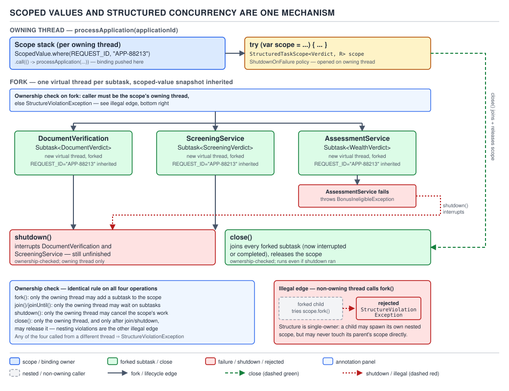

# 04 Modern Java — Structured concurrency — INTERNALS (§3.15)

**Target version: Java 21 LTS.** | **Part 3 of 5** | [Index](../00-index.md)
Previous: [Structured concurrency — in practice](02-in-practice.md) · Next: [The library additions, 9 to 21 — basics](../library-additions/01-basics.md)

Part 2 showed `StructuredTaskScope` and `ScopedValue` from the outside: fork a couple of subtasks,
join them, read a value that was bound higher up the call stack without threading it through a
parameter list. This part opens both of them up. Underneath, a `StructuredTaskScope` is a thin
wrapper around two things that already exist on every virtual thread — a `ThreadFlock` (an
internal, unstructured "group of threads with one owner") and a per-thread stack of those flocks —
plus an ownership check on every method that touches either. Underneath, a `ScopedValue` is not a
mutable slot at all: it is a key into an immutable, singly-linked chain of bindings that the JDK
calls a `Snapshot`, one per thread, replaced wholesale (never mutated) every time a `where(...)`
block starts, and looked up through a tiny two-way cache before anyone walks the chain by hand.
Once you can name those two structures, `StructureViolationException`, the ownership check, why
`shutdown()` and `close()` are different verbs, and why a scoped value costs less than a
`ThreadLocal` all stop being memorised rules and become consequences you can re-derive.

All source quoted in this file comes from `java.util.concurrent.StructuredTaskScope`,
`java.lang.ScopedValue`, `java.lang.Thread`, and `jdk.internal.misc.ThreadFlock` at the
**jdk-21+35** tag. Every number is worked with the one-8-core-box figures fixed across this note
set (`availableProcessors() = 8`, `commonPool` parallelism `7`, effective width `8`,
`LEAF_TARGET = 28`) wherever a figure from that set applies; the cache-sizing arithmetic in §3
below is independent of core count and is derived from the `ScopedValue` source directly.

**A framing correction, carried through from the previous internals file and load-bearing for
everything below:** treat structured concurrency as a feature named at two concrete API shapes, not
as "still evolving" hand-waving. **Java 21** ships it as **JEP 453 (preview)** — needs
`--enable-preview` on `javac` and `java` — with `StructuredTaskScope` built via public
constructors, `fork` returning `Subtask<T>`, and two concrete policies, `ShutdownOnFailure` and
`ShutdownOnSuccess`. Every code example in this file targets that shape and is marked
`--enable-preview` where it matters. §6 below walks the shapes either side of 21 in full, because
that walk *is* leaf 3.15.8.

---

## 1. The per-thread scope stack, `fork`, and the ownership check

### Mental model

Picture the owning thread's call stack with an invisible second stack running alongside it, one
frame per open `StructuredTaskScope`. Opening a scope with `try (var scope = new
StructuredTaskScope.ShutdownOnFailure())` pushes a frame; `scope.close()` pops it. Every `fork`
call inside that block starts exactly one virtual thread and records it as a child of the frame
currently on top. Nothing about this is symbolic — it is a real stack, held per-thread by the JDK,
and the four operations that touch it — `fork`, `join`, `shutdown`, `close` — all carry the same
guard: *only the thread that owns the frame may touch it.* A `StructuredTaskScope` is not a pool
you hand work to and query later from wherever is convenient; it is a stack discipline enforced at
runtime, and virtual threads are cheap enough that "one virtual thread per fork" is the mechanism,
not an implementation detail you're meant to look past.

### Why it exists

Before JEP 428 (Java 19, incubator), fanning out two calls and waiting for both meant an
`ExecutorService` and two `Future`s, or two `CompletableFuture`s joined with `.thenCombine(...)` or
`allOf(...)`. Both shapes share the same defect: nothing in the type system or the runtime stops a
`Future` from outliving the method that created it. A submitted task can keep running after its
caller has returned, thrown, or been cancelled — the thread pool has no idea the caller stopped
caring. That produces two classic failure shapes: a leaked thread doing pointless work forever
(nobody cancels the loser of a race), and a cancellation that doesn't propagate (the caller gives
up, but a subtask blocked on a slow call — the identity vendor's p99 of 38 seconds, the watchlist
provider's p99 of 25 seconds — keeps holding its thread and whatever resources it captured).
`StructuredTaskScope` fixes the *lifetime* problem by construction: every thread it starts must
finish, fail, or be interrupted before `close()` returns, and `close()` is unconditionally called
by virtue of being inside a try-with-resources block. The call tree's shape in the source now
matches the call tree's shape at runtime — which is the entire meaning of "structured."

### When to reach for it, and when not

Reach for `StructuredTaskScope` when a unit of work is naturally "fan out from one thread, wait for
all (or the first) of a fixed, known set of subtasks, then continue on that same thread" — an
`AssessmentService` case that needs a document check and a screening check before it can produce a
verdict is exactly this shape, because the case cannot proceed without both answers and nothing
about the fan-out needs to survive past the method that started it.

Do **not** reach for it when a task's lifetime is supposed to *outlive* the thread that started it
— a `PaymentRun` sign-off, or the notification fanned out after a client's `AA-801` activation,
where the point is precisely that no caller sits around waiting. That is what a plain
`ExecutorService`, a queue, or (for genuinely fire-and-forget work) a bare `Thread.startVirtualThread(...)`
is for. The sibling that wins there is the unstructured pool — structured concurrency's entire
value proposition, that every child's lifetime is bounded by its parent's stack frame, is a
liability, not a feature, for a task that is deliberately unbounded.

### How it works

`StructuredTaskScope` delegates its actual bookkeeping to an internal class,
`jdk.internal.misc.ThreadFlock`, which is the thing that actually owns the per-thread stack. The
ownership check that every public method runs, quoted verbatim:

```java
private void ensureOwner() {
    if (Thread.currentThread() != flock.owner())
        throw new WrongThreadException("Current thread not owner");
}
```

Read this line by line. `flock.owner()` is fixed at construction time to whichever thread called
`new StructuredTaskScope.ShutdownOnFailure()` — there is no "reassign the owner" operation anywhere
in the API. `ensureOwner()` is called at the top of `close()`, `join()`, `joinUntil()`, and
`shutdown()`. **`fork()` does not call `ensureOwner()` and does not throw `WrongThreadException`**
— it is deliberately legal to call `fork` from inside an already-forked subtask (that subtask
becomes a new owner of its own nested scope if it opens one), but every other structural operation
on *this* scope is owner-only. `fork`'s own body, quoted:

```java
public <U extends T> Subtask<U> fork(Callable<? extends U> task) {
    Objects.requireNonNull(task, "'task' is null");
    int s = ensureOpen();
    int round = -1;
    if (Thread.currentThread() == flock.owner()) {
        round = forkRound;
        if (forkRound == lastJoinCompleted) {
            round++;
        }
    }
    SubtaskImpl<U> subtask = new SubtaskImpl<>(this, task, round);
    boolean started = false;
    if (s < SHUTDOWN) {
        Thread thread = factory.newThread(subtask);
        if (thread == null) {
            throw new RejectedExecutionException("Rejected by thread factory");
        }
        try {
            flock.start(thread);
            started = true;
        } catch (IllegalStateException e) {
            // shutdown or unstructured use
        }
    }
    if (started && Thread.currentThread() == flock.owner() && round > forkRound) {
        forkRound = round;
    }
    return subtask;
}
```

The `round` bookkeeping (`forkRound`, `lastJoinCompleted`) is what makes the `close()`-without-`join()`
trap in §2 possible — it tracks whether the owner has called `join()` since the most recent batch of
`fork()` calls, purely as an accounting integer, not a scope-stack operation. The scope-stack
operation is `flock.start(thread)`: it is what actually creates and registers the child virtual
thread, and it is where the *reverse-order-close* invariant of §1's second half lives, not here.

The class family, so the hierarchy is on the page before the details pile up (§6 covers the
policies either side of Java 21):

| Type | Java 21 shape | Role |
|---|---|---|
| `StructuredTaskScope<T>` | Public constructors; `AutoCloseable` | The scope itself — owns the `ThreadFlock`, forks subtasks, defines `handleComplete` |
| `StructuredTaskScope.Subtask<T>` | Interface, returned by `fork` | A handle to one forked unit of work — `get()`, `exception()`, `state()` |
| `StructuredTaskScope.ShutdownOnFailure` | Concrete subclass | First failure shuts the scope down; `throwIfFailed(...)` re-raises it |
| `StructuredTaskScope.ShutdownOnSuccess<T>` | Concrete subclass | First success shuts the scope down; `result(...)` returns it |

### The stack discipline: `StructureViolationException`

The scope stack itself — the thing `ensureOwner()`'s prose refers to but its code doesn't show — is
enforced inside `ThreadFlock.close()`. Two lines from that method, quoted, with the intervening
join-and-reap logic (covered fully in §2) elided in prose rather than in the snippet itself:

```java
boolean atTop = popForcefully(); // may block
```

and, later in the same method:

```java
if (!atTop)
    throw new StructureViolationException();
```

`popForcefully()` blocks until every thread the flock started has terminated (this is the "join"
half of `close`, covered fully in §2), then pops this flock's frame off the per-thread stack and
reports whether the frame it removed was the one on **top** of the stack. If it wasn't — if some
scope opened *after* this one, nested inside it, is still open — `atTop` comes back `false` and
`close()` throws `StructureViolationException`, with **no message argument**: the fetched
constructor call passes nothing, so the exception carries no descriptive text of its own and a
reader has to identify the violation from the throw site in the stack trace, not from the
exception's message.

This is a genuinely different exception from the one in §1's ownership check, and conflating them
is the single most common mistake in blog-level treatments of this API:

| Violation | Exception | Thrown by | Trigger |
|---|---|---|---|
| Wrong thread calls `fork`/`join`/`shutdown`/`close` | `WrongThreadException` | `StructuredTaskScope.ensureOwner()` | Any thread other than the constructing thread touches the scope |
| Scopes closed out of stack order | `StructureViolationException` | `ThreadFlock.close()` | An inner scope is still open when an outer scope's `close()` runs |
| `fork()` happened but `join()` never did before `close()` | `IllegalStateException` | `StructuredTaskScope.close()` | `forkRound > lastJoinAttempted` when `close()` runs |

**Insight:** all three exist because "structured" means two separate promises, not one — the
*ownership* promise (only the creator drives the scope) and the *nesting* promise (scopes form a
tree, and a node cannot outlive its parent). `WrongThreadException` enforces the first;
`StructureViolationException` enforces the second; the `close()`-without-`join()`
`IllegalStateException` is a narrower, Java-21-specific hygiene check that a batch of forked work
was actually collected before the scope disappeared.

### The example: `AssessmentService`'s two-way fan-out

```java
// --enable-preview required on Java 21: StructuredTaskScope, Subtask, ShutdownOnFailure are preview API.

record ApplicationId(UUID value) {}

sealed interface Verdict permits DocumentVerdict, ScreeningVerdict {}
record DocumentVerdict(String outcome, String reason, Instant decidedAt) implements Verdict {}
record ScreeningVerdict(String outcome, String reason, Instant decidedAt) implements Verdict {}

record ReviewCase(ApplicationId applicationId, DocumentVerdict documentVerdict,
                   ScreeningVerdict screeningVerdict) {}

final class AssessmentFailedException extends RuntimeException {
    AssessmentFailedException(Throwable cause) {
        super("AA-700 case could not be assessed", cause);
    }
}

final class AssessmentService {

    private final DocumentVerification documentVerification;
    private final ScreeningService screeningService;

    AssessmentService(DocumentVerification documentVerification, ScreeningService screeningService) {
        this.documentVerification = documentVerification;
        this.screeningService = screeningService;
    }

    ReviewCase assessForReview(ApplicationId applicationId) throws InterruptedException {
        try (var scope = new StructuredTaskScope.ShutdownOnFailure()) {
            StructuredTaskScope.Subtask<DocumentVerdict> documentTask =
                    scope.fork(() -> documentVerification.verify(applicationId));
            StructuredTaskScope.Subtask<ScreeningVerdict> screeningTask =
                    scope.fork(() -> screeningService.screen(applicationId));

            scope.join();
            scope.throwIfFailed(AssessmentFailedException::new);

            return new ReviewCase(applicationId, documentTask.get(), screeningTask.get());
        }
    }
}
```

`documentVerification.verify(...)` and `screeningService.screen(...)` each start one virtual
thread. Both are children of the same frame — the one `assessForReview` pushed when it opened
`scope` — so `close()` (run implicitly by the try-with-resources block) cannot return until both
have terminated, however they terminate.

Here is the shape a JSON thread dump takes for that scope tree — `jcmd <pid> Thread.dump_to_file
-format=json <file>` produces this format since Java 19 (JEP 444's virtual-thread work). This is
constructed to show the shape, not captured live on this machine: the packet's own caution applies
— Java 21's preview `StructuredTaskScope` cannot be compiled in its Java 21 shape on the Java 25
toolchain installed here, so no live dump was taken. The **shape** of the container/thread
relationship below (`threadContainers`, each with a `container` name, a `parent`, and a `threads`
array) is the real jcmd JSON schema; the values are illustrative:

```json
{
  "threadDump": {
    "processId": "84213",
    "time": "2026-08-30T09:14:02Z",
    "runtimeVersion": "21.0.4",
    "threadContainers": [
      {
        "container": "owner-thread-review-worker-3",
        "parent": "<root>",
        "owner": "review-worker-3",
        "threads": [
          {
            "tid": "0x2a1",
            "name": "",
            "state": "WAITING",
            "stack": ["AssessmentService.assessForReview", "DocumentVerification.verify"]
          },
          {
            "tid": "0x2a2",
            "name": "",
            "state": "RUNNABLE",
            "stack": ["AssessmentService.assessForReview", "ScreeningService.screen"]
          }
        ]
      }
    ]
  }
}
```

Two entries under one `threadContainers` element, both children of `review-worker-3`'s scope, is
the JSON rendering of exactly the picture in the mental model at the top of this section: one
owning thread, one frame, two forked virtual threads underneath it.

### The gotcha

**Pitfall:** treating `fork()` after `shutdown()` as an error. It isn't one — read the fork source
above again: once `s >= SHUTDOWN`, the `if (s < SHUTDOWN)` block is skipped entirely, `started`
stays `false`, and `fork` still returns a `SubtaskImpl` — just one whose backing virtual thread was
never started. Code that calls `.get()` on that subtask without checking `.state()` first gets
`IllegalStateException` ("subtask not completed") rather than the exception it was expecting, and
the failure looks like it happened somewhere in the subtask's own logic when it actually happened
because the fork was silently ignored.

> **`StructuredTaskScope` is a per-thread stack of `ThreadFlock`s, one frame per open scope, where
> `fork` starts exactly one virtual thread as a child of the top frame and `fork`/`join`/`shutdown`/
> `close` are only legal from the thread that pushed that frame.**

---

## 2. Cancellation: `shutdown()` interrupts, `close()` joins

### Mental model

`shutdown()` is pulling the fire alarm: it stops anyone from entering the building (no more forks
succeed) and tells everyone already inside to leave immediately (every unfinished subtask gets
interrupted), but it does not itself wait to confirm the building is empty. `close()` is standing
at the door afterward, counting heads, and not leaving until the count is zero. They are two
different verbs because a scope can be shut down long before it is closed — the two events don't
even have to happen on a call stack that's still "inside" the scope the way a `finally` block is.

### Why it exists

Before this, cancelling a fan-out meant manually tracking every `Future` you'd submitted and
calling `.cancel(true)` on each of the ones that hadn't finished — easy to get right for two
futures, error-prone at scale, and universally skipped for the "happy path never fails" case, which
is exactly the case that turns into a production incident when the identity vendor's p99 spikes to
38 seconds and every other in-flight subtask for that request keeps burning a thread waiting for a
sibling that has already doomed the whole request.

### When to reach for it, and when not

`ShutdownOnFailure` is the default choice for "all of these must succeed" work — an
`AssessmentService` case needs both a document verdict and a screening verdict; if either fails,
finishing the other is wasted work. `ShutdownOnSuccess` is the mirror image, for "any one of these
answering is enough" work — for instance, querying the identity vendor's primary and failover
endpoints and taking whichever answers first. Reach for **neither**, and drive `shutdown()`
yourself from a custom `handleComplete` override, only when the policy is genuinely something other
than "all must succeed" or "first success wins" — for example, "wait for at least 2 of 3
screening providers to agree." That is rare enough in this domain that it does not get a worked
example here; both built-in policies cover the AssessmentService cases end to end.

### How it works — `[PROVE]`

Walk `shutdown()`'s actual sequence, quoted:

```java
private boolean implShutdown() {
    shutdownLock.lock();
    try {
        if (state < SHUTDOWN) {
            flock.shutdown();
            state = SHUTDOWN;
            interruptAll();
            return true;
        } else {
            return false;
        }
    } finally {
        shutdownLock.unlock();
    }
}
```

Three things happen, in this order, once: `flock.shutdown()` marks the flock itself so that any
`awaitAll()` a joining thread is blocked in wakes up; `state = SHUTDOWN` flips the scope's own
guard so future `fork()` calls take the no-op branch proven in §1; `interruptAll()` walks every
subtask this scope started and calls `Thread.interrupt()` on each one that hasn't finished. None of
that *waits* for anything — `implShutdown()` returns as soon as the interrupt flags are set, which
is the proof that `shutdown()` is asynchronous with respect to the subtasks actually stopping. A
subtask blocked in a non-interruptible operation (a tight CPU loop with no blocking call, or I/O
that doesn't respond to `Thread.interrupt()`) does not stop the instant `shutdown()` returns — it
stops whenever it next checks `Thread.interrupted()` or hits an interruptible blocking call, which
may be never.

Now `close()`, quoted:

```java
@Override
public void close() {
    ensureOwner();
    int s = state;
    if (s == CLOSED)
        return;
    try {
        if (s < SHUTDOWN)
            implShutdown();
        flock.close();
    } finally {
        state = CLOSED;
    }
    if (forkRound > lastJoinAttempted) {
        lastJoinCompleted = forkRound;
        throw newIllegalStateExceptionNoJoin();
    }
}
```

The proof that `close()` actually waits, as opposed to `shutdown()`'s fire-and-forget interrupt, is
the call to `flock.close()`: that is the method whose body (§1) blocks in `popForcefully()` until
every child thread has terminated, before it even gets to the stack-order check that can throw
`StructureViolationException`. So the full sequence for the common path — subtask fails, scope
shuts down, owner closes — is: `implShutdown()` fires interrupts and returns immediately;
`flock.close()` then blocks, potentially for however long the interrupted subtasks take to actually
unwind, before `close()` can return. **`close()` is where the wait happens, not `shutdown()`** —
if you time a "cancel this work" operation by wrapping only the `shutdown()` call, you have
measured the wrong thing; the wall-clock cost of cancellation is paid inside `close()`.

Notice also the last three lines: if the owner forked subtasks in a round it never called `join()`
for, `close()` still runs `flock.close()` (so the threads are still waited for and reaped), but
*then* throws `IllegalStateException` — a third, narrower correctness check layered on top of the
two structural exceptions from §1, catching "you forked and forgot to collect" specifically,
distinct from either owning-thread or nesting-order violations.

The full picture — the scope stack, the ownership check on all four verbs, and the two distinct
arrows for `shutdown()` (interrupt, no wait) versus `close()` (join, then check nesting) — drawn
together, plus the one piece this section hasn't reached yet (the scoped-value binding a fork
inherits, covered in §5):


**D-164** — Scoped values and structured concurrency are one mechanism

### The example

Continue the `AssessmentService` case from §1, now with a document check that fails:

```java
// --enable-preview required on Java 21.

ReviewCase assessForReview(ApplicationId applicationId) throws InterruptedException {
    try (var scope = new StructuredTaskScope.ShutdownOnFailure()) {
        StructuredTaskScope.Subtask<DocumentVerdict> documentTask =
                scope.fork(() -> documentVerification.verify(applicationId));
        // ScreeningService calls the watchlist provider: p99 25s, 30s timeout.
        StructuredTaskScope.Subtask<ScreeningVerdict> screeningTask =
                scope.fork(() -> screeningService.screen(applicationId));

        scope.join();                                  // blocks until both finish, or one fails
        scope.throwIfFailed(AssessmentFailedException::new);

        return new ReviewCase(applicationId, documentTask.get(), screeningTask.get());
    }
}
```

If `documentVerification.verify(applicationId)` throws because the vendor returned `AA-690
DOCUMENTS_REJECTED`, `ShutdownOnFailure.handleComplete(Subtask)` records that failure and calls
`scope.shutdown()` on the scope's behalf — from whichever virtual thread the failing subtask is
running on, which is legal because `handleComplete` is exempt from the owner check by design (it
runs inside the subtask, not as a direct API call by arbitrary code). `shutdown()` interrupts the
still-running `screeningTask`, which is most likely blocked waiting on the watchlist provider (p50
1.4s, p99 25s). If the interrupt lands while that call is parked in a blocking network read, it
unblocks immediately; if it lands mid-computation with no blocking point to interrupt, it keeps
running until the next one. Either way, `scope.join()` returns once both subtasks have reached a
terminal state, `throwIfFailed` re-raises the document failure wrapped as
`AssessmentFailedException`, and the implicit `close()` at the end of the try-with-resources block
is what actually waits for the (possibly still-unwinding) screening subtask before the method can
return.

### The gotcha

**Pitfall:** believing `shutdown()` is synchronous — that once it returns, no forked subtask is
still running. §2's proof shows the opposite: `interruptAll()` only *requests* termination.
Code that calls `scope.shutdown()` directly (bypassing a policy) and then immediately reads shared
state that a subtask was writing to can still race with that subtask, because the subtask may not
have observed its interrupt yet. The only point at which every subtask is provably finished is
after `close()` returns (or after `join()` returns, on the ordinary non-cancelled path) — never
right after `shutdown()`.

> **`shutdown()` interrupts every unfinished subtask and blocks further `fork()` calls, without
> waiting; `close()` is what actually blocks until every subtask has terminated, and only then
> checks that the scope is closing in the correct stack position.**

---

## 3. `ScopedValue`'s immutable binding snapshot and its cache

### Mental model

Forget "a box you can read and write." A `ScopedValue<T>` is a *key*. The *values* live in a
singly-linked, immutable chain that hangs off the current thread — the JDK calls each link a
`Snapshot`, and each `Snapshot` wraps a `Carrier`, which is itself a linked chain of individual
`(key, value)` pairs bound together by one `where(...)` call. Calling `.get()` does not look inside
some per-`ScopedValue` storage cell at all; it walks *the thread's* chain, outward from the most
recent binding, looking for a link whose key matches. Binding a value for the duration of a block
never mutates anything that existed before the block started — it installs a brand-new `Snapshot`
whose `prev` pointer is the old one, and the old one comes back the instant the block exits, simply
because the thread's pointer is restored to it.

### Why it exists

`ThreadLocal` solves "give this thread its own private copy of a value" by storing entries in a
`ThreadLocalMap` hung off the `Thread` object — genuinely a hash map, with all of a hash map's
costs: allocation on first use, open-addressing probes on lookup, and (this is the part that bites
in practice) no automatic cleanup. Passing a value down into a subtask meant either adding another
method parameter everywhere along the call chain — which every caller has to remember, and which
pollutes signatures with data that's a fact about the request, not an input to the logic — or
`InheritableThreadLocal`, which copies the entire relevant map when a child thread is created.
`ScopedValue` is designed for exactly the "pass request-scoped context implicitly" job, but with a
lifetime that is provably bounded — the value is gone the instant `where(...).run(...)` returns —
and, per JEP 446's own guidance, is preferred wherever the goal is one-way transmission of
immutable data rather than a place a thread stores something for itself over time.

### When to reach for it, and when not

Reach for `ScopedValue` for exactly the shape `ThreadLocal` is misused for today: context that a
method wants to make available to everything it calls, without a parameter, and that nothing
downstream should be able to mutate — an acting operator's identity while a `ReviewCase` decision
is being made, the jurisdiction a wealth check is running under. Do **not** reach for it as a
general mutable "current value" holder: there is no `set()`, no `remove()`, and rebinding requires
opening a new `where(...)` block, which is a design constraint, not a missing feature (§4 proves
why that constraint is what makes the cost model cheap). The sibling that wins when you genuinely
need per-thread *mutable* state with no natural block scope — a per-thread `SimpleDateFormat`
reused across an unbounded number of calls, say — is still plain `ThreadLocal`.

### How it works — `[RESEARCH]` `[NUM]`

The two linked structures, quoted verbatim from `ScopedValue`:

```java
static final class Carrier {
    final int bitmask;
    final ScopedValue<?> key;
    final Object value;
    final Carrier prev;
}

static final class Snapshot {
    final Snapshot prev;
    final Carrier bindings;
    final int bitmask;
}
```

`Carrier` is the chain built up *inside one* `where(...).where(...)....run(...)` call — each
`.where(key, value)` prepends a new `Carrier` node, so a single call that binds three scoped values
produces a three-link `Carrier` chain before `run` ever executes. `Snapshot` is the chain *across*
nested `where` blocks — a `Snapshot`'s `prev` points at whatever `Snapshot` was installed on the
thread before this `where(...).run(...)` started, and its `bindings` field points at the `Carrier`
chain this particular call introduced. Installing a new binding, quoted from `Carrier`'s run path:

```java
Thread.setScopedValueBindings(newSnapshot);
Thread.ensureMaterializedForStackWalk(newSnapshot);
ScopedValueContainer.run(op);
```

`Thread.setScopedValueBindings` writes exactly one field — `Thread`'s own
`scopedValueBindings` — to point at `newSnapshot`. No map is allocated, no existing entries are
touched, and undoing the bind on the way out means restoring that one field to whatever it held
before, which is why the JDK doesn't need a `finally { remove() }` block anywhere in user code: the
call stack itself is the undo log.

The cache. `.get()`, quoted:

```java
@ForceInline
public T get() {
    Object[] objects;
    if ((objects = scopedValueCache()) != null) {
        int n = (hash & Cache.SLOT_MASK) * 2;
        if (objects[n] == this) {
            return (T) objects[n + 1];
        }
        n = ((hash >>> Cache.INDEX_BITS) & Cache.SLOT_MASK) * 2;
        if (objects[n] == this) {
            return (T) objects[n + 1];
        }
    }
    return slowGet();
}
```

and `slowGet()`, which is only reached on a cache miss:

```java
private T slowGet() {
    var value = findBinding();
    if (value == Snapshot.NIL) {
        throw new NoSuchElementException();
    }
    Cache.put(this, value);
    return (T) value;
}
```

The arithmetic behind the cache, worked explicitly: `INDEX_BITS` is fixed at `4`, and
`TABLE_SIZE = 1 << INDEX_BITS = 16` — sixteen buckets. Each bucket needs two array slots, one for
the `ScopedValue` key and one for its cached value, so the backing `Object[]` on each thread is
`16 × 2 = 32` elements long, holding at most **16** cached `(key, value)` pairs at once. A lookup
computes **two** candidate slots from one hash — `hash & SLOT_MASK` for the low four bits, and
`(hash >>> INDEX_BITS) & SLOT_MASK` for the next four — and checks both before giving up and
falling through to `slowGet()`. That is a two-way set-associative cache, the same shape as a small
CPU cache: any given `ScopedValue` can only ever live in one of its two assigned slots, so a
lookup is at most two array reads and two reference comparisons, never a chain walk, on the common
path. `findBinding()` (the actual chain walk, invoked only on the two-in-a-row miss) traverses
`Carrier.prev` within the current `Snapshot`, then `Snapshot.prev` across enclosing `where` blocks,
comparing each node's `key` by reference (`==`, not `.equals()` — a `ScopedValue` has no meaningful
equality beyond identity) until it finds a match or runs out of chain and returns the sentinel
`Snapshot.NIL`, which is what `slowGet()` turns into `NoSuchElementException`.

### The example

```java
// --enable-preview required on Java 21.

record ActingOperator(String operatorId, String shift) {}

final class ReviewCaseHandler {

    static final ScopedValue<ActingOperator> CURRENT_OPERATOR = ScopedValue.newInstance();

    ReviewVerdict decide(ReviewCase reviewCase, ActingOperator operator) throws InterruptedException {
        return ScopedValue.where(CURRENT_OPERATOR, operator)
                .call(() -> evaluate(reviewCase));
    }

    private ReviewVerdict evaluate(ReviewCase reviewCase) {
        // No parameter for "who is deciding" anywhere on this call chain —
        // every method below can read it if it needs to, for audit logging,
        // without CURRENT_OPERATOR ever appearing in a signature.
        ActingOperator operator = CURRENT_OPERATOR.get();
        boolean approve = reviewCase.documentVerdict().outcome().equals("AA-611 DOCUMENTS_VERIFIED")
                && reviewCase.screeningVerdict().outcome().equals("AA-501 SCREENING_CLEAR");
        String outcome = approve ? "AA-711 REVIEW_APPROVED" : "AA-799 REVIEW_DECLINED";
        return new ReviewVerdict(outcome, "decided by " + operator.operatorId(), Instant.now());
    }
}

record ReviewVerdict(String outcome, String reason, Instant decidedAt) {}
```

`CURRENT_OPERATOR.get()` inside `evaluate` never sees a `null` and never needs a fallback, because
the entire call happened inside `.call(...)`, which is the only place the binding for
`CURRENT_OPERATOR` exists at all. Outside that lambda — before `.where(...)` was called, or after
`.call(...)` returns — `CURRENT_OPERATOR.get()` throws `NoSuchElementException`, because
`findBinding()` walks off the end of whatever `Snapshot` chain is active there and finds no
matching key.

### The gotcha

**Pitfall:** calling `.get()` unconditionally from code that might run both inside and outside a
`where(...)` block — a helper method shared between the review-case path (bound) and a batch
reconciliation job (unbound) — and treating the resulting `NoSuchElementException` as a bug in the
scoped value itself. It isn't; it's the correct signal that no binding is active on this thread
right now. `ScopedValue.orElse(Object)` and `.isBound()` exist precisely for code paths that need
to tolerate the absence gracefully instead of unconditionally calling `.get()`.

> **A `ScopedValue.get()` walks a per-thread, immutable, singly-linked chain of bindings —
> checking a 16-entry, two-way cache first — rather than reading a per-value mutable cell; nothing
> is ever mutated, only replaced for the duration of one `where(...)` call and restored on exit.**

---

## 4. Why scoped values are cheaper than `ThreadLocal` — `[PROVE]` `[RESEARCH]`

### Mental model

`ThreadLocal` gives every thread its own hash map and asks the programmer to keep it tidy by hand.
`ScopedValue` never allocates a map at all — inheriting a binding into a child thread is copying
one pointer, not copying a data structure, and "cleaning up" is something the call stack already
does for free when a method returns.

### Why it exists

`InheritableThreadLocal` was the JDK's first attempt at "pass context to a child thread without a
parameter," and it works by calling `childValue(Object)` for every inheritable entry on the parent
thread's map at the moment the child `Thread` is constructed — a full pass over the parent's
`ThreadLocalMap`, one allocation per surviving entry, done again for every single child thread. For
a platform-thread pool of a dozen workers this is invisible. For virtual threads, where forking is
meant to be routine — an `AssessmentService` case that forks 2 subtasks, a stake-settlement fan-out
that could fork many more — a per-fork map copy turns a cheap operation into one whose cost scales
with however much context the parent happened to be carrying, which is exactly the kind of cost a
feature co-designed with virtual threads cannot afford.

### When to reach for it, and when not

This section is the argument for reaching for `ScopedValue` over `ThreadLocal` specifically in code
that forks — `StructuredTaskScope` subtasks, or any other "start many short-lived children of one
parent" shape. It is not an argument that `ThreadLocal` should disappear from a codebase: for a
long-lived platform thread that needs to remember something of its own across many unrelated
method calls with no clean block boundary (a per-connection buffer reused by a database driver
across its whole lifetime, say), `ThreadLocal`'s mutability and independence from a lexical scope
are exactly what's needed, and `ScopedValue` cannot express "rebind this value without also
re-entering a new block."

### The proof

Take the `AssessmentService` fan-out from §1 and ask what changes as the number of forks per
request grows — at the domain's own peak of 1,200 stake reservations per second, imagine a
(hypothetical, illustrative) design that forked one virtual thread per reservation and needed the
initiating batch's `IdempotencyKey` visible to each.

**With `InheritableThreadLocal`:** every one of those 1,200 forks/sec triggers `Thread`
construction, which walks the parent's `ThreadLocalMap` calling `childValue()` for every
inheritable entry that map holds. If the parent thread is carrying `m` such entries (in practice,
more than one — request ID, tenant-equivalent jurisdiction context, trace span — accumulate over
a codebase's lifetime), the cost per fork is `O(m)`: one map traversal, one `childValue()` call and
one write per entry, per child thread, 1,200 times a second at peak.

**With `ScopedValue`:** each fork's virtual thread starts by copying its parent's current
`Thread.scopedValueBindings` reference into its own `scopedValueBindings` field — one field write,
regardless of how many scoped values are bound in that snapshot, because the snapshot is a single
immutable object reference, not a map to be copied entry-by-entry. The cost per fork is `O(1)`
in the number of bound scoped values: it does not matter whether the chain the child inherits is
one link deep or ten, the child's field write is the same single reference assignment either way.

That `O(m)` versus `O(1)` gap is the entire mechanical reason the leaf calls scoped values cheaper:
**"no map" removes the allocation and the per-entry copy that `InheritableThreadLocal` cannot avoid,
and the `Carrier`/`Snapshot` chain being immutable is exactly what makes sharing it by reference,
rather than copying it, safe** — nothing a child thread does to its own view of the chain (which is
to say, nothing, since there is no mutator) can corrupt what the parent or a sibling still sees.

### The comparison table

| | `ThreadLocal` | `InheritableThreadLocal` | `ScopedValue` |
|---|---|---|---|
| Storage | `ThreadLocalMap` per thread (open-addressed hash map) | Same map, plus `childValue()` copy on child creation | Immutable `Snapshot`/`Carrier` chain, shared by reference |
| Cost to bind for a child thread | N/A (not inherited) | `O(m)` — one `childValue()` call per inheritable entry, per child | `O(1)` — one field write, any chain depth |
| Cleanup discipline | Manual `remove()`, or the entry leaks until the `Thread` (or pooled-thread reuse) discards the map | Same manual discipline, on both parent and child | None needed — the binding is gone when `where(...).run(...)` returns, because the call stack itself restores the prior `Snapshot` |
| Mutability | Mutable (`set()` any time) | Mutable | Immutable — no `set()`; rebinding means opening a new `where(...)` block |
| Typical failure mode when misused | Stale value read by a *different* logical request reusing a pooled thread, because nobody called `remove()` | Same stale-value leak, now also paid for on every child thread whether or not the child reads the value | `NoSuchElementException` on a code path that assumed a binding exists but ran outside any `where(...)` block |

### The gotcha

**Pitfall:** assuming `ScopedValue`'s cheapness comes from "it's newer" or "it's better optimised."
It comes from removing an entire class of work — the map and its per-child copy — by construction,
not from a faster implementation of the same idea. Code that still calls `InheritableThreadLocal`
inside a hot fork path and expects a `--enable-preview` recompile to fix its overhead has
misdiagnosed the problem: the fix is migrating the value itself to `ScopedValue`, not upgrading the
JDK.

> **`ScopedValue` is cheaper than `InheritableThreadLocal` because inheriting a binding into a
> forked thread is one reference copy of an immutable chain, not a per-entry copy of a mutable map,
> and because the chain's lifetime is bounded by the call stack, so no `remove()` discipline is
> needed to avoid a leak.**

---

## 5. Inheritance into forked subtasks: why the two features are one mechanism

### Mental model

A forked virtual thread doesn't ask its parent "what's currently bound?" at the moment it starts
running — it is simply born already pointing at the same `Snapshot` its parent held the instant
`fork()` was called. There is no message passed, no lookup performed; the child's
`scopedValueBindings` field is initialised, at thread-construction time, from the value the parent
thread's field held right then. This single fact is what makes `StructuredTaskScope` and
`ScopedValue` a *pair* rather than two independent JEPs that happen to ship in the same release.

### Why it exists

Structured concurrency's whole appeal is that a subtask's behaviour should be indistinguishable, as
far as context goes, from the same code running inline on the parent thread — the only difference
should be that it runs concurrently. If forking silently dropped every `ScopedValue` binding the
parent had in effect, every fork site would need to explicitly re-thread context that the
surrounding code otherwise never has to mention, which reintroduces exactly the "context threading
through every signature" problem `ScopedValue` exists to remove. Designing the two features
together means a fork can never accidentally forget who the acting operator is, or what
jurisdiction a wealth check is running under, because there is no code path where a subtask starts
without the binding — the inheritance is not optional or configured, it is how a virtual thread
comes into existence.

### When to reach for it, and when not

This isn't a feature you opt into per fork — every subtask automatically inherits its parent's
bindings, full stop. The design choice that *is* yours is where to bind in the first place: bind
**before** opening the scope if every subtask should see the same context (the common case — one
`ReviewCase`, one acting operator, several forked checks), and bind in a **nested** `where(...)`
block only around the specific subtask that needs an escalated or overridden context, which is
exactly the shadowing case below. There is no mechanism to fork a subtask that deliberately does
**not** see its parent's current bindings; if that's genuinely required, the subtask has to start
its own unrelated thread outside any `StructuredTaskScope`, which is a strong signal it isn't
actually a structured-concurrency problem.

### How it works

Concretely: `flock.start(thread)` (called from `fork()`, quoted in §1) creates the child virtual
thread through the platform's normal `Thread` construction path, which reads `Thread.currentThread()
.scopedValueBindings` — the **parent's** field, read at the moment of construction — and copies that
reference into the new `Thread` object's own `scopedValueBindings` field. No `Carrier` or `Snapshot`
object is copied, walked, or reconstructed; the child simply starts life pointing at the identical
chain object the parent was pointing at. Because the chain is immutable, "identical chain object" is
completely safe to share across however many sibling subtasks a single fork batch produces — every
subtask started under one `StructuredTaskScope` call sees the exact same bindings, and none of them
can affect what a sibling or the parent sees, because none of them can mutate the chain, only
prepend to their own thread's pointer to it inside their own nested `where(...)` block, if they open
one.

### Nested shadowing — the example

```java
// --enable-preview required on Java 21.

record ActingOperator(String operatorId, String shift) {}

final class ReviewCaseEscalation {

    static final ScopedValue<ActingOperator> CURRENT_OPERATOR = ScopedValue.newInstance();

    ReviewVerdict decideWithEscalation(ReviewCase reviewCase, ActingOperator caseOwner,
                                        ActingOperator seniorOperator) throws InterruptedException {
        return ScopedValue.where(CURRENT_OPERATOR, caseOwner).call(() -> {
            // Every fork here inherits CURRENT_OPERATOR = caseOwner.
            boolean needsEscalation = requiresSeniorSignOff(reviewCase);
            if (!needsEscalation) {
                return evaluate(reviewCase);
            }
            // A nested where(...) rebinds CURRENT_OPERATOR for the escalated path only.
            // The outer binding is never mutated — it is simply not the one this thread
            // sees for the remainder of this inner call.
            return ScopedValue.where(CURRENT_OPERATOR, seniorOperator).call(() -> {
                try (var scope = new StructuredTaskScope.ShutdownOnFailure()) {
                    StructuredTaskScope.Subtask<ReviewVerdict> escalatedTask =
                            scope.fork(() -> evaluate(reviewCase));
                    scope.join();
                    scope.throwIfFailed(AssessmentFailedException::new);
                    // This forked subtask sees CURRENT_OPERATOR = seniorOperator, not caseOwner,
                    // because it was forked from inside the nested where(...) block.
                    return escalatedTask.get();
                }
            });
        });
    }

    private boolean requiresSeniorSignOff(ReviewCase reviewCase) {
        return reviewCase.screeningVerdict().outcome().equals("AA-550 SCREENING_POTENTIAL_MATCH");
    }

    private ReviewVerdict evaluate(ReviewCase reviewCase) {
        ActingOperator operator = CURRENT_OPERATOR.get();
        return new ReviewVerdict("AA-711 REVIEW_APPROVED", "signed off by " + operator.operatorId(),
                Instant.now());
    }
}
```

Trace the `Snapshot` chain through this call: entering the outer `.call(...)` installs `Snapshot₁`
(binding `CURRENT_OPERATOR → caseOwner`, `prev` pointing at whatever the thread held before). If
escalation is needed, entering the inner `.call(...)` installs `Snapshot₂` (binding
`CURRENT_OPERATOR → seniorOperator`, `prev = Snapshot₁`) — this does not touch `Snapshot₁` in any
way, it is a brand-new object. `fork()` inside that inner block starts `escalatedTask`'s virtual
thread by copying the thread's *current* field, which at that point is `Snapshot₂`, so
`evaluate`'s call to `CURRENT_OPERATOR.get()` inside the subtask finds `seniorOperator` at the very
first `Carrier` it checks — it never even reaches `Snapshot₁`. When the inner `.call(...)` returns,
the thread's field is restored to `Snapshot₁`, and `caseOwner` is what any code running after that
point (on the outer thread) sees again. `Snapshot₂` becomes unreachable and is simply garbage —
there was never a mutation to undo.

### The gotcha

**Pitfall:** assuming a nested `where(...)` "adds" a binding to whatever's already there in a way
that later code can see both old and new values for the *same* key at once. It can't — for a given
`ScopedValue` key, the nearest binding in the chain wins, full stop; `Snapshot₂` shadows
`Snapshot₁`'s `CURRENT_OPERATOR` binding completely for anything running inside the inner block, and
there is no way to read "the previous binding, one level up" from inside — the outer value is only
visible again once the inner scope's stack frame is gone.

> **Every forked subtask inherits its parent's `scopedValueBindings` reference at the moment
> `fork()` starts it — one immutable-chain pointer copy, not a snapshot recomputed per fork — which
> is why a nested `where(...)` can shadow a binding for exactly the subtree it wraps and nothing
> else, and why the two features are designed, and must be read, together.**

---

## 6. The version-by-version API churn, 19 through the release in flight — `[RESEARCH]` `[VERSION-TRAP]`

### Why this table earns its own primary concept

Everything in §1 through §5 is written against the **Java 21 preview shape**: public constructors,
`fork` returning `Subtask<T>`, `ShutdownOnFailure`/`ShutdownOnSuccess`, `ScopedValue.where(...).run(...)`.
None of that shape is final, and treating any single release's API as "the" API is precisely the
version-stale trap this file exists to close. This table is what lets a reader date any code sample
they see — their own, a blog's, or an interviewer's whiteboard — against the release it actually
compiles on.

**A necessary update to the packet's own row list:** the row list this file was commissioned
against was Java 19–25 plus "in flight." Java 26 has since shipped (with a further, sixth preview),
so the table below adds it as a verified row rather than silently absorbing it into "in flight,"
and moves "in flight" to the release that is genuinely still unreleased as of this file's writing.

**D-165** table:

| Release | JEP(s) | Package / status | API shape | Published examples still compile on 21? |
|---|---|---|---|---|
| **19** | 428 (Structured Concurrency, Incubator) | `jdk.incubator.concurrent`, incubator | `StructuredTaskScope` constructors; `fork` returns **`Future<T>`**; `ShutdownOnFailure`/`ShutdownOnSuccess` present | **No** — different package, and `fork`'s return type changed from `Future<T>` to `Subtask<T>` at 21 |
| **20** | 437 (Structured Concurrency, 2nd Incubator); 429 (Scoped Values, Incubator) | `jdk.incubator.concurrent`, incubator | Same constructors/`Future<T>` shape as 19; `ScopedValue` introduced, with `runWhere`/`callWhere` shorthand alongside `where(...).run(...)` | **No** — still `jdk.incubator.concurrent`; `ScopedValue` not yet in `java.lang` |
| **21** | 453 (Structured Concurrency, Preview); 446 (Scoped Values, Preview) | `java.util.concurrent` / `java.lang`, **preview** | `fork` now returns `Subtask<T>`; constructors + `ShutdownOnFailure`/`ShutdownOnSuccess`; `ScopedValue` moves to `java.lang`; `runWhere`/`callWhere` still present alongside `where(...).run(...)`/`.call(...)` | **Baseline** — trivially yes |
| **22** | 462 (Structured Concurrency, 2nd Preview); 464 (Scoped Values, 2nd Preview) | Same packages, preview | Same constructors/`Subtask<T>`/`ShutdownOnFailure` shape; scoped-value refinements to inheritance and stack-walk interaction | **Yes** — no change to the shape this file's examples use |
| **23** | 480 (Structured Concurrency, 3rd Preview); 481 (Scoped Values, 3rd Preview) | Same packages, preview | Same `StructuredTaskScope` shape; scoped-value semantics refined further | **Yes** |
| **24** | 499 (Structured Concurrency, 4th Preview); 487 (Scoped Values, 4th Preview) | Same packages, preview | Same `StructuredTaskScope` shape; `ScopedValue.runWhere`/`callWhere` **removed** — `where(...).run(...)`/`.call(...)` is now the only spelling | **Yes for `StructuredTaskScope`; a 21-era `runWhere` call site does not compile as-is on 24+**, though the `.where(...).run(...)` form this file uses is unaffected |
| **25** | 505 (Structured Concurrency, 5th Preview); **506 (Scoped Values, Final)** | `java.util.concurrent`, still preview / `java.lang`, **final, no `--enable-preview` needed** | **Breaking**: public constructors replaced by static `open()`/`open(Joiner)` factory methods; `ShutdownOnFailure`/`ShutdownOnSuccess` **removed as subclasses**, replaced by factory methods on a new `Joiner` interface; `ScopedValue.orElse(null)` no longer accepted | **No, for `StructuredTaskScope`** — `new StructuredTaskScope.ShutdownOnFailure()` does not compile at all on 25; **yes, for `ScopedValue`** — the finalised shape is backward-source-compatible with this file's `where(...).call(...)` usage |
| **26** | 525 (Structured Concurrency, 6th Preview) | `java.util.concurrent`, preview | `open()`/`Joiner` shape from 25 holds; adds a timeout callback for custom `Joiner`s | **No** — inherits 25's break from 21's constructor shape |
| **27 (in flight, as of this file's writing)** | 533 (Structured Concurrency, 7th Preview) | `java.util.concurrent`, preview | `open()`/`Joiner` shape still holds; `StructuredTaskScope` and `Joiner` gain a third type parameter for the exception type `join()` can throw, plus a new `open(UnaryOperator<Configuration>)` overload — described in its own JEP as refinement, not a redesign, of the shape set at 25 | **No** — same reason as 25/26 |

Read across one row at a time and the version trap resolves itself: **the break in
`StructuredTaskScope`'s shape happens exactly once, at 25**, moving from constructors to `open()`
factories and from concrete subclasses to a `Joiner` interface; every preview round from 21 through
24 refines behaviour without touching that shape, and every round from 25 onward refines the *new*
shape without reverting it. **`ScopedValue` finalises one release earlier in spirit than
`StructuredTaskScope`** — its last shape-level API change (`runWhere`/`callWhere` removal) lands at
24, and it goes fully final, no preview flag required, at 25 (JEP 506), while its structured-
concurrency partner is still on its seventh preview round two releases later. A reader who says
"scoped values and structured concurrency shipped together and finalise together" has the pairing
right and the finalisation timeline wrong — write it as two features that are inseparable in
*mechanism* but independent in *release status*.

### The gotcha

**Pitfall:** copying a `StructuredTaskScope` code sample from a 2026-dated blog post — plausibly
written against Java 25 or 26 — straight into Java 21 code, and getting a compile error on
`new StructuredTaskScope.ShutdownOnFailure()` that looks like a typo rather than what it is: the
constructor genuinely does not exist past 24. The fix is not "find the right import" — it's
recognising which of the two API generations (constructor-based, 19–24, or `open()`/`Joiner`-based,
25 onward) the sample and the target release each belong to, and translating between them, not
searching for a missing method.

> **Structured concurrency's public shape changed exactly once across seven preview rounds — at
> Java 25, from constructors and concrete policy subclasses to `open()` factories and a `Joiner`
> interface — while scoped values reached the same finalisation point one release earlier, at
> Java 25 as well, but by going final outright rather than by changing shape again.**

---

## Pitfalls

### Assuming `WrongThreadException` and `StructureViolationException` are the same failure

**Wrong**

```java
// --enable-preview required on Java 21.
try (var scope = new StructuredTaskScope.ShutdownOnFailure()) {
    scope.fork(() -> screeningService.screen(applicationId));
    Thread.ofVirtual().start(() -> {
        try {
            scope.join();   // called from a thread that did NOT create scope
        } catch (InterruptedException e) {
            Thread.currentThread().interrupt();
        }
    });
} // close() runs on the real owner while the wrong-thread join() may still be racing it
```

Output: `java.lang.WrongThreadException: Current thread not owner`, thrown from the spawned
thread's `join()` call — not a `StructureViolationException`, because nothing about nesting order
was violated; the wrong *thread*, not the wrong *stack position*, called an owner-only method.

**Right**

```java
// --enable-preview required on Java 21.
try (var scope = new StructuredTaskScope.ShutdownOnFailure()) {
    scope.fork(() -> screeningService.screen(applicationId));
    scope.join();                       // always from the thread that opened scope
    scope.throwIfFailed(AssessmentFailedException::new);
}
```

**Why people believe it:** both exceptions are about "using a `StructuredTaskScope` the wrong way,"
and most blog-level coverage of the API mentions only `StructureViolationException` because it's
the more novel-sounding name — so readers default to attaching it to any misuse, including the
ownership violation that `WrongThreadException` (a plain, pre-existing `java.lang` exception, not
introduced by this JEP) is actually responsible for.

### Reading `CURRENT_OPERATOR.get()` outside any `where(...)` block and blaming `ScopedValue`

**Wrong**

```java
// --enable-preview required on Java 21.
final class ReviewAuditLogger {
    void logDecision(ReviewVerdict verdict) {
        // Called from a scheduled reconciliation job — no where(...) is active here.
        String operatorId = ReviewCaseHandler.CURRENT_OPERATOR.get().operatorId();
        System.out.println(operatorId + " -> " + verdict.outcome());
    }
}
```

Output: `java.util.NoSuchElementException`, thrown from `slowGet()` when `findBinding()` walks off
the end of an empty (or unrelated) `Snapshot` chain — not a bug in `ScopedValue`, a correct report
that nothing bound `CURRENT_OPERATOR` on this call path.

**Right**

```java
// --enable-preview required on Java 21.
final class ReviewAuditLogger {
    void logDecision(ReviewVerdict verdict) {
        String operatorId = ReviewCaseHandler.CURRENT_OPERATOR
                .orElse(new ActingOperator("SYSTEM", "batch"))
                .operatorId();
        System.out.println(operatorId + " -> " + verdict.outcome());
    }
}
```

**Why people believe it:** a `ThreadLocal.get()` on an unset value silently returns `null` (or the
value from `withInitial(...)`) rather than throwing, so engineers carrying `ThreadLocal` habits into
`ScopedValue` code expect the same forgiving default and are surprised that the JDK chose to fail
loudly instead — which is deliberate: a silent `null` here would hide exactly the "this code
assumed it always runs inside a bound scope" bug that the exception surfaces immediately.

## Cheat sheet

| Fact | Value / behaviour |
|---|---|
| Owner-only methods | `fork`, `join`, `joinUntil`, `shutdown`, `close` — enforced by `ensureOwner()` throwing `WrongThreadException` |
| `fork()` ownership | **Not** owner-only; legal from inside another forked subtask |
| `fork()` after `shutdown()` | Silently no-ops — returns an unstarted `Subtask`, does not throw |
| `shutdown()` effect | Sets state, calls `flock.shutdown()`, calls `interruptAll()` — returns immediately, does not wait |
| `close()` effect | Blocks in `flock.close()` until every subtask terminates, then checks stack position |
| `StructureViolationException` | Thrown by `ThreadFlock.close()` when this scope isn't on top of the per-thread stack; carries no message |
| `close()` without `join()` | Throws `IllegalStateException` after still waiting for and reaping the forked threads |
| `ScopedValue` storage | `Snapshot` (across `where` blocks) wrapping `Carrier` (within one `where` call) — both immutable, singly-linked |
| Per-thread cache size | `TABLE_SIZE = 1 << 4 = 16` buckets × 2 slots (key, value) = 32-element array, 2-way associative |
| Inheritance into a fork | One reference copy of `Thread.scopedValueBindings` — `O(1)` regardless of chain depth |
| `InheritableThreadLocal` inheritance | `O(m)` — one `childValue()` call per inheritable entry, per child thread |
| Nested `where(...)` | Installs a new `Snapshot` shadowing the outer one for that block only; no partial visibility of both |
| Structured concurrency's one shape break | Java 25 (JEP 505): constructors → `open()`; `ShutdownOnFailure`/`ShutdownOnSuccess` → `Joiner` |
| Scoped values' finalisation point | Java 25 (JEP 506) — final, no `--enable-preview`, one release ahead of structured concurrency |
| `runWhere`/`callWhere` | Present 20–23, removed at Java 24 (JEP 487) |

## Self-test

**Q1.** A `StructuredTaskScope` was created on thread A. Thread B, holding a reference to that same
scope object, calls `scope.join()`. What exception is thrown, from where, and why is it not
`StructureViolationException`?

<details><summary>Answer</summary>

`join()` begins with `ensureOwner()`, which compares `Thread.currentThread()` (thread B) against
`flock.owner()` (thread A, fixed at construction). They differ, so it throws
`WrongThreadException("Current thread not owner")`. This is not `StructureViolationException`
because nothing about scope nesting order is at issue — no scope was closed out of turn; the wrong
*thread*, not the wrong *stack position*, tried to drive the scope. The two exceptions guard two
different promises: ownership (`WrongThreadException`) and nesting (`StructureViolationException`).

</details>

**Q2.** After `scope.shutdown()` returns, is it safe to assume every subtask forked under that
scope has stopped running? Justify from the source.

<details><summary>Answer</summary>

No. `implShutdown()`'s body sets the state, calls `flock.shutdown()`, and calls `interruptAll()`,
then returns — none of those steps block waiting for the interrupted threads to actually terminate.
A subtask parked in an interruptible blocking call unblocks promptly; a subtask running a tight
loop with no blocking point doesn't notice the interrupt until it next checks
`Thread.interrupted()` or hits a blocking call, which may be arbitrarily later, or never. The
method that actually blocks until every subtask is done is `close()`, via its call to
`flock.close()`.

</details>

**Q3.** Two scoped values, `CURRENT_OPERATOR` and `CURRENT_CASE`, are bound in one call:
`ScopedValue.where(CURRENT_OPERATOR, op).where(CURRENT_CASE, reviewCase).run(() -> ...)`. Sketch
the `Carrier` chain this produces, and say how many `Snapshot` objects exist at that point if no
`where` block was already active on this thread.

<details><summary>Answer</summary>

Two `Carrier` chained calls to `.where(...)` build a two-link `Carrier` chain: the first `.where`
produces a `Carrier` for `CURRENT_OPERATOR` with `prev = null`; the second `.where` produces a new
`Carrier` for `CURRENT_CASE` with `prev` pointing at the first `Carrier`. `.run(...)` then wraps
that whole two-link `Carrier` chain in exactly **one** `Snapshot`, whose own `prev` points at
whatever `Snapshot` the thread held before (`null`, or the sentinel "no bindings" state, if this is
the first `where` block on this thread). So: one `Snapshot`, holding a two-link `Carrier` chain —
`Carrier` links accumulate per chained `.where()` call within one binding operation; `Snapshot`
links accumulate per *nested* `where(...).run(...)` call.

</details>

**Q4.** Why does `ScopedValue.get()` check two array slots before falling back to `slowGet()`,
rather than one?

<details><summary>Answer</summary>

The cache is two-way set-associative: `INDEX_BITS = 4` gives a 16-bucket table, and a
`ScopedValue`'s hash can land it in one of exactly two candidate slots — computed from the low four
bits of the hash (`hash & SLOT_MASK`) and the next four bits (`(hash >>> INDEX_BITS) & SLOT_MASK`).
Checking only one slot would mean any two `ScopedValue`s whose hashes collided on that single slot
would constantly evict each other from the cache even while both are in active, alternating use.
Two independent slots absorb exactly that kind of two-way collision at the cost of one extra array
read and comparison — still `O(1)` and still far cheaper than `slowGet()`'s chain walk.

</details>

**Q5.** A team migrates a hot fork path from `InheritableThreadLocal` (carrying 5 inheritable
entries) to `ScopedValue`, forking at the domain's peak rate of 1,200 operations/second. Quantify
what changes, mechanically, per fork.

<details><summary>Answer</summary>

Before: each of the 1,200 forks/second triggers a `Thread` construction that walks the parent's
`ThreadLocalMap` and calls `childValue()` for each of the 5 inheritable entries — 5 method calls
and 5 writes into the new thread's own map, per fork, so roughly `1,200 × 5 = 6,000` such
operations per second at peak. After: each fork copies one reference —
`Thread.scopedValueBindings` — into the child's own field, a single assignment regardless of how
many scoped values that snapshot's chain actually holds, so the per-fork cost drops to `O(1)` and
is independent of how many values are bound, at the same 1,200 forks/second.

</details>

**Q6.** What does a nested `where(...)` block do to an outer binding of the *same* `ScopedValue`,
mechanically — does it overwrite, merge, or something else?

<details><summary>Answer</summary>

Neither overwrite nor merge. The outer binding lives in `Snapshot₁`, an immutable object that is
never touched. The nested `where(...).run(...)` (or `.call(...)`) installs a brand-new
`Snapshot₂`, whose `bindings` `Carrier` includes the new value for that key and whose `prev` points
at `Snapshot₁`. While the thread's field points at `Snapshot₂`, any `.get()` for that key finds the
new binding first and never reaches `Snapshot₁`'s copy — full shadowing, not merging. The instant
the nested block's `.run`/`.call` returns, the thread's field is restored to `Snapshot₁`, and the
outer value is visible again exactly as it was, because it was never modified.

</details>

**Q7.** A subtask is forked *before* an escalation's nested `where(...)` block is entered, but its
`.get()` is called from a callback that only runs after the escalation block has started. Which
`CURRENT_OPERATOR` value does it see?

<details><summary>Answer</summary>

The one in effect at the moment `fork()` actually started that subtask's virtual thread — inherited
once, at construction, from `Thread.currentThread().scopedValueBindings` as it stood at that
instant. Whatever the parent thread's binding becomes *afterward* (entering a nested `where(...)`,
or exiting one) has no effect on a subtask that was already forked and running; inheritance is a
one-time copy at fork time, not a live link back to the parent's current state.

</details>

**Q8.** Why is `StructureViolationException`'s lack of a message argument worth calling out, rather
than a trivial detail?

<details><summary>Answer</summary>

Because it means the exception's message alone (`null`, or whatever `Throwable`'s default provides)
gives a reader nothing to go on — diagnosing the violation requires reading the stack trace to find
which `close()` call actually threw, and reasoning about which scope was still open underneath it,
rather than trusting descriptive text the way most other JDK exceptions provide. Documentation and
notes that show a “helpful” message string for this exception are inventing one; the source passes
none.

</details>

**Q9.** A codebase has a working `StructuredTaskScope.ShutdownOnFailure` example copied from a blog
dated after Java 25's release. It does not compile under `--enable-preview` on a Java 21 JDK. Is
the JDK 21 installation broken?

<details><summary>Answer</summary>

No. `ShutdownOnFailure`/`ShutdownOnSuccess` as concrete subclasses, and `StructuredTaskScope`'s
public constructors, were removed at Java 25 (JEP 505) in favour of static `open()`/`open(Joiner)`
factories and a `Joiner` interface. A post-25 example is written against that later shape and will
not compile at all on 21 — not a partial incompatibility, a different API surface. The fix is
translating the sample back to 21's constructor-based shape (§6's table), not troubleshooting the
21 installation.

</details>

**Q10.** Rank, from most to least "changed since Java 21," structured concurrency's public API
shape versus scoped values' public API shape, and name the release each change lands on.

<details><summary>Answer</summary>

Structured concurrency changed more: it breaks its shape once, hard, at Java 25 (constructors →
`open()`, concrete policy subclasses → `Joiner`), and is still in preview seven rounds later (JEP
533, JDK 27) with further, smaller refinements (a third type parameter, a new `open` overload).
Scoped values changed less and settled sooner: one shape-level removal (`runWhere`/`callWhere`) at
Java 24, then finalisation with no further shape change at Java 25 (JEP 506) — one release ahead of
its partner feature, and with no analogue to structured concurrency's 25-era break.

</details>

## Deferred

None.

## Open questions

- **Unverified:** the exact numeric or descriptive form `Subtask.get()` uses when called on a
  subtask whose fork was silently skipped by the §1 gotcha (post-`shutdown()` fork) — this file
  states that it throws `IllegalStateException` by analogy with `Subtask.get()`'s documented
  contract for an incomplete subtask, but the precise message text was not confirmed against the
  jdk-21+35 source in this pass. Settle by reading `SubtaskImpl.get()`'s body directly at that tag.
- **Unverified:** whether JEP 533's third type parameter on `Joiner` (JDK 27, still in preview as of
  this file's writing) is expected to survive to eventual finalisation unchanged, or is itself
  provisional. Settle by re-reading JEP 533's own "Risks and Assumptions" section once it is
  publicly re-fetchable, or by checking whichever JEP eventually finalises structured concurrency.

---

**Leaves covered:** 3.15.1–3.15.8 (8 leaves)
**Leaves deferred:** none
**Diagrams included:** D-164, D-165
**Target version:** Java 21 LTS
**Lines:** 1194
