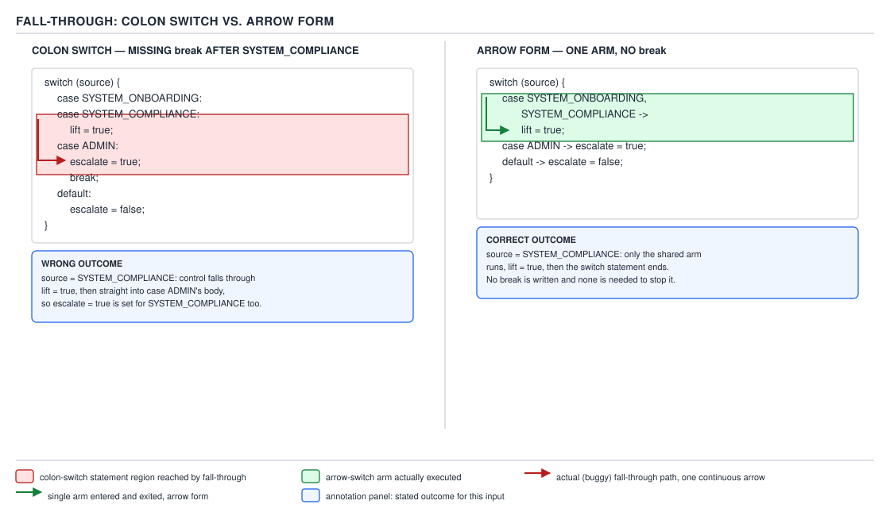

# 04 Modern Java — `switch` — BASICS (§1.16)

**Target version: Java 21 LTS.** | **Part 1 of 5** | [Index](../00-index.md)
Previous: [Pattern matching — internals pattern matching](../pattern-matching/03-internals-pattern-matching.md) · Next: [`switch` — internals switch compilation](03-internals-switch-compilation.md)

## 1. Why `switch` needed a second form at all

Pick up any pre-2018 `switch` and it is a statement, not an expression: it dispatches control flow, it never hands you back a value, and every arm you forget to terminate with `break` quietly falls into the next one. Reproducing "compute a value based on which case matched" meant declaring a mutable local above the switch, assigning it in every arm, and trusting yourself not to forget a `break`:

```java
RestrictionType type = RestrictionType.STAKE_BLOCKED;
String description;
switch (type) {
    case DEPOSIT_BLOCKED:
        description = "deposits disabled";
        break;
    case STAKE_BLOCKED:
        description = "staking disabled";
        break;
    case WITHDRAWAL_BLOCKED:
        description = "withdrawals disabled";
        break;
    default:
        description = "restriction active";
}
```

That shape has three independent failure modes stacked on top of each other: the mutable local can be read before every arm has run (definite-assignment escapes that a compiler would otherwise catch had this been an expression), a missing `break` silently falls into the next arm's assignment, and nothing forces you to cover every `RestrictionType` constant — the `default` swallows the gap.

`switch` as a **value-producing expression** closes all three at once: the compiler enforces that every arm produces a value or throws, an arrow arm cannot fall into its neighbour because there is no neighbour to fall into, and — for an enum selector with no `default` — the compiler enforces that every constant is handled, so adding a tenth `RestrictionType` next quarter breaks the build until you handle it. This file covers the two forms (arrow and colon), the two roles (expression and statement) that cross them, and the interview-favourite traps that live at the boundary between the four combinations.

**D-066** below previews the whole shape before the sections below unpack each cell.

| | fall-through | produces a value | `break` allowed | `yield` allowed | `return` allowed | exhaustiveness required | mixing allowed with the others |
|---|---|---|---|---|---|---|---|
| colon statement | yes | no | yes | no | yes (exits enclosing method) | no | no |
| arrow statement | no | no | no | no | yes (exits enclosing method) | pattern form only (§1.16.11) | no |
| colon expression with `yield` | no (a `yield` or `throw` must end every path — see §4 below) | yes | yes (labels only, never to produce a value) | yes | no | yes | no |
| arrow expression | no | yes | no | yes (block-bodied arms only) | no | yes | no |

**D-066** — Switch forms compared. Dispatching on `RestrictionType` is the running example for every row.

Read the "mixing" column literally: it is not "discouraged", it is a syntax error the parser reports the moment it sees a colon label after an arrow label in the same `switch` block, and vice versa (§1.16.8 below). Read "fall-through" for the colon expression row carefully too — a colon-form *expression* still uses colon labels, but every arm must end in `yield`, `throw`, or (rarely) fall into a following label that itself ends that way; there is no way to "fall through" out of the switch without producing a value, because the compiler requires every path through the expression to complete with a value or a throw.

---

## 2. The arrow form — `case L ->`

### Mental model

Think of an arrow-form `switch` as a compiled decision table, not a sequence of statements the CPU walks top to bottom hoping to `break` out of. Each `case L ->` is a self-contained cell: match the label, run exactly the code to the right of the arrow, and leave. There is no "falling into the next row" because there is no execution path between rows — the generated bytecode is a `tableswitch` or `lookupswitch` (covered in the next file, `03-internals-switch-compilation.md`) that jumps directly to the matched arm's code and, at the end of that arm, jumps directly past the whole construct. Nothing routes control from one arm's end into another arm's start.

### Why it exists

`case L ->` was introduced by JEP 325 as a **preview** feature in Java 12, refined by JEP 354 in Java 13, and finalized without preview status by JEP 361 in Java 14. `[RESEARCH]` The motivation stated in JEP 325 is exactly the failure mode from §1: the historical `switch` statement's fall-through-by-default was "a common source of bugs in Java programs, because the case is often forgotten," and value-producing usage required an "awkward" mutable-local pattern. The arrow form was designed from the start to support both a value-producing role and a plain-dispatch role, with fall-through removed from both.

### When to reach for it, and when not

Reach for arrow-form dispatch whenever every arm is either a single expression/statement or a short block, and you do not need one case to intentionally cascade into the next. The classic case where a developer *wants* cascading — `MONDAY`, `TUESDAY`, `WEDNESDAY` all doing the same thing — is not a reason to reach for the colon form's fall-through; it is handled directly by multiple labels on one arrow arm (§1.16.3, next section) with no fall-through machinery at all. Reach for the historical colon statement only when you are maintaining code that predates Java 14, or in the rare case a pattern switch statement's guard structure genuinely wants to share trailing logic across labels (uncommon, and usually a sign the arms should be refactored into a shared method instead).

### How it works

Syntactically, an arrow-form `switch` — whether used as a statement or an expression — replaces every colon label with `->` and forbids `break`. The right-hand side of `->` is one of three shapes:

1. **An expression**, terminated by `;`: `case STAKE_BLOCKED -> "staking disabled";`
2. **A block**, `{ ... }`, whose last action for an expression-position switch must be a `yield` (or a `throw`, or it must not complete normally at all — an infinite loop, for instance, though that is vanishingly rare in practice).
3. **A `throw` statement** directly: `case ALL_BLOCKED -> throw new RestrictedActionException(type);`

Each arm is scoped independently — a local variable declared inside one arm's block is not visible in a sibling arm, unlike the colon form, where all arms share one block scope and a `String description` declared under one label is visible (and subject to "variable already defined" errors) under a later one. This is a direct mechanical consequence of removing fall-through: the compiler can give each arm its own scope precisely because control can never enter it from a sibling.

### D-067 — the fall-through-versus-arrow-form picture



**D-067** — Fall-through, and how the arrow form makes it unwritable.

### A minimal concrete example

Dispatching on `RestrictionType` — the exact scenario D-066 and D-067 both use:

```java
static String describe(RestrictionType type) {
    return switch (type) {
        case DEPOSIT_BLOCKED -> "deposits disabled";
        case STAKE_BLOCKED -> "staking disabled";
        case WITHDRAWAL_BLOCKED -> "withdrawals disabled";
        case DEPOSIT_LIMITED, WITHDRAWAL_HELD -> "restriction is a soft limit, not a hard block";
        case SOURCE_OF_FUNDS_REQUIRED -> "outstanding document requirement";
        case ALL_BLOCKED, SELF_EXCLUDED -> throw new RestrictedActionException(
                "account-wide restriction: " + type);
        case COOLING_OFF -> {
            var remaining = java.time.Duration.ofDays(1);
            yield "cooling-off period active, re-check in " + remaining;
        }
        case DORMANT_FROZEN -> "account dormant, reactivation required";
    };
}
```

Every `RestrictionType` constant is covered, there is no `default`, and — this is §1.16.6, previewed here and proved in §3 below — the moment a new constant is added to `RestrictionType` without a matching arm being added here, this method fails to compile.

### The gotcha

The arrow form's per-arm scoping cuts the other way too: you cannot declare a helper local in one arm and read it from a later arm the way legacy colon-form code sometimes (accidentally) relied on shared scope. Porting old colon-form code to arrow form is not a mechanical find-and-replace of `:` for `->` and deletion of `break` — any cross-arm variable sharing has to be hoisted above the `switch` first.

> **Definition.** The arrow form of `switch` (JEP 361, Java 14) associates each label with exactly one arm using `->`, runs only the matched arm, and never transfers control into a sibling arm.

---

## 3. Multiple labels per arm — `case MONDAY, TUESDAY, WEDNESDAY ->`

This is a supporting fact, not a primary concept — it has no cost tradeoff and no sibling to be chosen against, it is a syntax shape.

**Mechanism.** An arrow arm may list two or more labels separated by commas; the arm runs if the selector matches *any* of them, with no ordering implied and no fall-through machinery involved — the compiler simply compiles it as multiple entries in the jump table that all target the same code. `case DEPOSIT_LIMITED, WITHDRAWAL_HELD -> "restriction is a soft limit, not a hard block";` in the example above is exactly this: one arm, two matching constants, one execution path, and nothing "falls" anywhere to get there.

**Gotcha.** Each individual label in the comma list must still be reachable and non-duplicate across the whole `switch` — the compiler rejects `case DEPOSIT_LIMITED, DEPOSIT_LIMITED ->` as a duplicate label exactly as it would across two separate arms.

> **Definition.** A comma-separated label list on one arrow arm is syntactic sugar for "this arm matches any of these constants," with no fall-through semantics involved.

---

## 4. Block-bodied arms and `yield`

### Mental model

An arrow arm's block is a tiny, self-contained function body whose only legal "return" instruction is `yield` — think of `yield` as `return`'s narrower sibling, scoped to handing a value back to the *enclosing switch expression* rather than to the enclosing method. The mental trap to defuse immediately: `yield` does not exit the method the way `return` does; it exits the block, and the value it carries becomes the value of the whole `switch` expression at the point that expression sits in the surrounding code.

### Why it exists

Once `switch` could be an expression, single-expression arms (`case X -> "text";`) needed no extra keyword — the expression itself is the value. But real arms often need more than one statement: validate something, compute an intermediate, then decide. Block-bodied arms give you that room, and `yield` is the mechanism that plugs the block's result back into the surrounding expression. Java did not reuse `return` for this — the next section is entirely about why not.

### When to reach for it, and when not

Reach for a block-bodied arm with `yield` when the value takes more than one statement to compute — parsing a duration, building a `StakeSplit`, logging then deciding. Do not reach for it when a plain expression arm would do; a block with a single `yield expr;` and nothing else is strictly longer than just writing `case X -> expr;` and buys nothing.

### How it works

Inside a block-bodied arm used in expression position, every possible path through the block must end in `yield`, `throw`, or — extremely rarely — not complete normally at all (an infinite loop). This is the same "definite value" requirement that ordinary expressions get for free from having exactly one value; a block has to be checked path-by-path because it can branch internally:

```java
static Money bonusPortionFor(BigDecimal stake) {
    return switch (stake.compareTo(BigDecimal.ZERO)) {
        case 0 -> Money.zero();
        case 1 -> {
            var raw = stake.multiply(new BigDecimal("0.10"));
            var rounded = raw.setScale(2, java.math.RoundingMode.DOWN);
            yield new Money(rounded, Currency.getInstance("GBP"));
        }
        default -> throw new IllegalArgumentException("negative stake: " + stake);
    };
}
```

The `case 1` arm above has two statements before the `yield`; both run, then the `yield` supplies the value. If you added an `if` inside that block that didn't `yield` on every branch, the compiler would reject it with "switch expression does not have a value for all possible inputs" — the same completeness check §1.16.6 applies to the whole switch applies recursively inside every block arm.

### The diagram

No diagram is assigned to this beat; D-066's table already shows "`yield` allowed: yes" for both expression rows, which is the complete cross-reference this beat needs.

### The gotcha

`yield` is a **contextual keyword**, not a reserved word — `int yield = 5;` still compiles outside a switch block, because `yield` only means "produce this switch's value" inside a switch expression's arm. This surprises people coming from languages where new keywords are reserved everywhere; Java added `yield` this way specifically so decades of existing code using `yield` as an identifier (rare, but it happened) would not break.

> **Definition.** `yield value;` supplies `value` as the result of the nearest enclosing switch expression and transfers control out of that arm's block; it does not exit any enclosing method.

---

## 5. `return` inside a switch expression is illegal — `yield` is the only way out

### Mental model

A `return` statement always means "exit the enclosing method (or lambda body) right now, with this value." A `switch` **expression** is not a method — it is a value sitting in the middle of an expression, the same as `a + b` or `list.get(0)`. Writing `return` inside one of its arms would ask Java to interpret "exit the method" as "supply the switch's value," and those are two different actions with two different scopes; the language refuses to conflate them rather than guess which one you meant.

### Why it exists

Before switch expressions, `return` inside a `switch` **statement**'s arm always meant exactly one thing: leave the enclosing method. Java 14 introduced a second syntactic position — inside a switch **expression** — where a value needs to travel somewhere, but "somewhere" is now the switch's result slot, not the method's return slot. Reusing `return` for both would make the same keyword mean two different things depending on whether the enclosing switch happens to be a statement or an expression — a distinction that is not always visually obvious at the call site of a single arm. `yield` disambiguates by construction: it can only ever mean "supply the enclosing switch expression's value," so there is no reading in which it accidentally exits a method.

### When to reach for it, and when not

There is no choice here to weigh — this is a hard compiler rule, not a style preference. Inside a switch **expression**'s block arm, `yield` is mandatory and `return` is a compile error. Inside a switch **statement**'s arm (arrow or colon), `return` is legal and does exactly what it always did: exit the enclosing method. The only judgment call is recognizing, at the point you're writing an arm, whether the switch you're inside is being used as an expression (its value is assigned, returned, passed as an argument, or otherwise consumed) or as a statement (it just executes for effect).

### How it works — `[PROVE]`

Take the `describe` method from §2 and replace one `yield` with `return`:

```java
static String describe(RestrictionType type) {
    return switch (type) {
        case DEPOSIT_BLOCKED -> "deposits disabled";
        case COOLING_OFF -> {
            var remaining = java.time.Duration.ofDays(1);
            return "cooling-off period active, re-check in " + remaining; // illegal
        }
        default -> "restriction active";
    };
}
```

Compiling this on this machine with `javac --release 21` produces:

```
Test.java:7: error: return outside switch expression
            return "cooling-off period active, re-check in " + remaining;
            ^
1 error
```

Work through *why* the compiler must reject this rather than just accept it as "return early with this value": the switch expression as a whole is itself the operand of the outer `return switch (type) { ... }`. If the inner `return` were allowed to mean "exit the method with this value," it would need to skip past the outer `return` entirely — but the outer `return` is what wires the switch's result into the method's result in every other arm. There would be two different mechanisms doing the same job inside one construct: `return` short-circuiting straight out, `yield` handing a value up to the enclosing `return`. Java's designers closed that inconsistency by banning `return` from a switch expression's arms outright, so there is exactly one path a value takes: `yield` to the switch, then (if the switch itself is being returned) `return` from the switch to the method.

**Pitfall:** engineers who learned `switch` before Java 14 reach for `return` by muscle memory inside what turns out to be a switch expression's block arm, get "return outside switch expression," and don't immediately connect the error to "this switch is being used as an expression, not a statement." The fix is mechanical — replace `return` with `yield` — but the *reason* it's a compile error, not a warning, is that the two keywords route the value to different places, and only one of those places exists when a switch is nested inside another expression.

### The gotcha

The same block of code is legal or illegal purely as a function of *what the switch's result is used for*, not the arm's own text. `switch (type) { case X -> { return "..."; } ... }` used as a bare **statement** (nothing consumes its result) is fine — that `return` exits the enclosing method exactly as it always did. Change nothing about the arm and instead assign the whole switch to a variable, and the identical `return "...";` line becomes a compile error. The arm's code did not change; the switch's role did.

> **Definition.** `return` exits the enclosing method or lambda; `yield` exits only the enclosing switch expression's arm and supplies that expression's value — inside a switch expression's block arm, only `yield` is legal.

---

## 6. Exhaustiveness in switch expressions — an enum switch expression without `default` fails to compile the moment a constant is added

### Mental model

Think of an exhaustive switch expression as a contract the compiler audits on every build, not just at the line where you wrote the switch. The contract is: "for every value this selector's type can hold, this expression must produce a value." For an enum, "every value the type can hold" is a closed, enumerable set — the compiler knows it exactly, because it can read the enum's constant list from the very same compilation (or, across separately compiled modules, from the enum class file it's compiling against). That closedness is what makes exhaustiveness checkable at all, and it is also exactly what makes adding a tenth constant to an enum a build-breaking change everywhere that enum is switched on without a `default`.

### Why it exists

Before switch expressions, an unhandled `case` in a `switch` **statement** was silently absorbed by "nothing happens" — no `default`, no matching case, execution just falls past the whole block. That is a legitimate design for control flow (sometimes you genuinely want to do nothing for the cases you didn't list), but it is a silent trap for **value production**: a switch expression *must* produce a value on every path, so "do nothing" is not an option, and the language needed a static check that catches the gap at compile time instead of throwing at 2 a.m. in production. Requiring exhaustiveness converts "we forgot to handle the new restriction type" from a runtime incident into a build failure.

### When to reach for it, and when not

Omit `default` on an enum switch expression when you want the compiler to force every future addition to the enum to be handled explicitly at this call site — the QuizStakes `describe` method in §2 is exactly this: a new `RestrictionType` should never silently fall into a generic message, it should force whoever adds the constant to decide what `describe` says about it. Add a `default` instead when the switch is intentionally partial — a small number of constants get special handling and everything else, including future additions, should share one fallback behaviour. §1.16.15 below walks that trade-off in full; the short version is that omitting `default` trades convenience today for safety on every future enum change, and adding `default` trades that safety for not having to touch this call site again.

### How it works — `[PROVE]`

Start from a `RestrictionType` enum with the ten constants listed in the domain reference, and a switch expression that covers all ten with no `default`, matching the `describe` method in §2. Compile it, then add a new constant to the enum — say `KYC_REVIEW_PENDING` — and recompile only the switch's compilation unit against the updated enum:

```
Restriction.java:14: error: the switch expression does not cover all possible input values
        return switch (type) {
               ^
1 error
```

Walk the mechanism, not just the message: the compiler determines the selector's type is an enum (`RestrictionType`), reads its full constant list from the class it is compiling against, and checks that every one of those constants is named as a label somewhere in the switch (directly, or via a comma-list per §3, or — from Java 21 — covered by an exhaustive pattern). `KYC_REVIEW_PENDING` appears in the enum's constant list but not as a label anywhere in `describe`, so the check fails and the build stops **before a single line of the switch's arms runs** — this is a compile-time gate, not a runtime one. Contrast this with the pre-2014 idiom of a colon-form statement with no `default`: adding the same constant there compiles cleanly and silently does nothing for the new case, because a switch *statement* is never required to be exhaustive. Exhaustiveness is a property switch expressions and (from Java 21) pattern switches carry that plain colon-form statements never did and never will.

### The diagram

D-068, embedded in full in §7 below (the `default`-in-an-enum-switch trade-off), is the direct payoff of this section — it shows exactly this "add a constant, recompile" experiment run both with and without `default`. It is placed there rather than here because the diagram's third panel is specifically about the `default` case, which this section deliberately does not use.

### A minimal concrete example

The `describe` method from §2, reproduced as the exhaustiveness example in isolation:

```java
static String describe(RestrictionType type) {
    return switch (type) {                     // no default — exhaustive over all 10 constants
        case DEPOSIT_BLOCKED -> "deposits disabled";
        case STAKE_BLOCKED -> "staking disabled";
        case WITHDRAWAL_BLOCKED -> "withdrawals disabled";
        case DEPOSIT_LIMITED, WITHDRAWAL_HELD -> "restriction is a soft limit, not a hard block";
        case SOURCE_OF_FUNDS_REQUIRED -> "outstanding document requirement";
        case ALL_BLOCKED, SELF_EXCLUDED -> throw new RestrictedActionException(
                "account-wide restriction: " + type);
        case COOLING_OFF -> "cooling-off period active";
        case DORMANT_FROZEN -> "account dormant, reactivation required";
    };
}
```

### The gotcha

Exhaustiveness is checked **structurally against the enum's declared constants at compile time**, not against "every value that could theoretically reach this switch at runtime." If two modules are compiled separately and the enum gains a constant that the switch's module has not been recompiled against, the switch's own `.class` file still thinks it's exhaustive — because it was, against the enum it saw at *its own* compile time. What actually happens at runtime when a stale switch meets a new constant is covered in full in verified figures block §4 of this file's packet (the synthetic default and `MatchException`, walked in §9 of this section's sibling file `03-internals-switch-compilation.md` — flagged here as `[X-REF 03]` per §1.16.12's definite-assignment note below, since that mechanism is this file's internals sibling's territory).

> **Definition.** A switch expression over an enum with no `default` must name every one of that enum's constants as a label (directly or via an exhaustive pattern), checked once at compile time against the enum's constant list the compiler is building against.

---

## 7. The colon form with `yield` — legal, and rare

This is a supporting fact: it has no cost tradeoff of its own (the arrow form dominates it in every ordinary case) but it is worth stating precisely because "colon form" and "fall-through" are so often assumed to be synonyms, and they are not.

**Mechanism.** The colon form (`case L:`) can be used to write a switch **expression**, not only a switch statement — the syntax is unchanged (colon labels, shared block scope, historical fall-through *between labels that don't explicitly exit*), but because the construct is now in expression position, every arm must still end in `yield`, `throw`, or a fall-through into a later label that itself eventually does one of those:

```java
static String describeColon(RestrictionType type) {
    String description = switch (type) {
        case DEPOSIT_BLOCKED:
        case WITHDRAWAL_BLOCKED:
            yield "money movement blocked";
        case STAKE_BLOCKED:
            yield "staking disabled";
        default:
            yield "restriction active";
    };
    return description;
}
```

Here `DEPOSIT_BLOCKED` intentionally falls through into `WITHDRAWAL_BLOCKED`'s `yield` — this is the one place fall-through and value-production coexist, and it is legal precisely because both labels ultimately reach the same `yield`. `[SOURCE not needed — this is JLS §14.11.1's switch-expression-with-colon-labels shape, directly demonstrable by compilation]`

**Gotcha.** This form is exhaustive-checked exactly like the arrow expression form (§6) — expression status, not label syntax, is what triggers the exhaustiveness rule. It is genuinely rare in production code because it recreates the old shared-scope, fall-through-capable body while gaining none of the arrow form's per-arm scoping or `break`-free clarity; most style guides that adopted Java 14+ ban it outright in favour of the arrow form for anything new.

> **Definition.** The colon form remains legal in expression position — labels still fall through by default, but every reachable path through the arms must end in `yield` or `throw` for the expression to be well-formed.

---

## 8. You may not mix arrow arms and colon arms in one `switch`

This is a supporting fact, syntactic rather than semantic — there is no mechanism to describe beyond "the parser rejects it."

**Mechanism.** A single `switch` block commits to one label style for its entire body. The moment the parser sees `case X:` it expects every subsequent label in that block to use `:`, and the moment it sees `case X ->` it expects every subsequent label to use `->`. Mixing them is rejected at parse time, before any type-checking or exhaustiveness analysis runs:

```java
switch (type) {
    case DEPOSIT_BLOCKED -> "deposits disabled";
    case STAKE_BLOCKED:                              // error: '->' expected here
        yield "staking disabled";
}
```

```
Test.java:3: error: '->' expected
            case STAKE_BLOCKED:
                               ^
1 error
```

**Pitfall:** this bites hardest when refactoring an old colon-form `switch` to the arrow form one arm at a time, expecting to convert incrementally and re-test after each arm. The compiler forces an all-or-nothing conversion of the whole block in one commit; there is no incremental path, and IDE "convert to arrow switch" refactoring tools exist largely because doing it by hand invites exactly this half-converted state.

> **Definition.** A `switch` block's label style — colon or arrow — is fixed for the whole block; the two cannot appear as sibling labels in the same `switch`.

---

## 9. Switch statements in the colon form keep the historical fall-through semantics — `[X-REF 03]`

### Mental model

A colon-form switch **statement** is a labelled entry point into one shared block of code, not a set of independent branches. Once execution jumps in at the matched label, it keeps running forward through the block exactly as if the labels weren't there at all — `break` is the only thing that makes it stop at a boundary, and without one execution runs straight through into the next label's code.

### Why it exists

This is the *original* 1995 semantics of `switch`, inherited from C, and Java kept it for backward compatibility — every `switch` statement written before Java 14 depends on this behaviour continuing to work exactly as written. It was never redesigned because a language cannot retroactively change the meaning of decades of already-compiled, already-shipped source without breaking it.

### When to reach for it, and when not

For new code, prefer the arrow-form statement (§1.16.10) for dispatch with no value production, and the arrow-form expression (§2) for value production — both eliminate the fall-through footgun entirely. Reach for colon-form fall-through only for the narrow, genuinely-intentional cascade case — several labels that should share the same trailing behaviour — and even then, the arrow form's comma-separated label list (§3) covers that exact case without fall-through machinery. There is essentially no new code in 2026 that has a good reason to write a fall-through colon statement rather than a comma-list arrow arm; this form survives almost entirely in code written before 2020.

### How it works — `[X-REF 03]`

Mechanically, the colon-form statement compiles to a `tableswitch` or `lookupswitch` bytecode instruction that jumps to the matched label's bytecode offset and then simply continues executing forward — there is no per-arm boundary instruction at all, only the `goto` that an explicit `break` compiles to. That is the entire mechanism: fall-through is not extra behaviour bolted onto `switch`, it is simply what "keep executing the next bytecode instruction" naturally does when there is no jump-out inserted. The full instruction-by-instruction walk of this — reading actual `javap -c` output naming the `tableswitch`/`lookupswitch` choice and the `goto` targets — belongs to guide 03's territory (`03-internals-switch-compilation.md`), where the bytecode for this exact `RestrictionType` example is disassembled.

Separately, `-Xlint:fallthrough` remains a live `javac` flag on Java 21: it emits a warning at every colon-form label that is reachable by fall-through from the previous label without an intervening comment of the form `// fall through` (or a small set of recognized variants) immediately before the label. It is a lint, not an error — it does not block compilation — and it only fires for colon-form statements, since arrow-form arms cannot fall through by construction and colon-form *expressions* are subject to the stricter "every path must yield" check from §6 instead of a lint.

### The diagram

D-067, already embedded in §2 above, is this section's diagram too — its left half is precisely a colon-form statement falling through two arms, which is what this section is naming and explaining.

### A minimal concrete example

A colon switch over restriction sources with a missing `break` — the exact scenario named in D-067:

```java
static void logSourceHandling(RestrictionSource source) {
    switch (source) {
        case SYSTEM_ONBOARDING:
            System.out.println("auto-lifts at AA-801");
        case SYSTEM_COMPLIANCE:                       // no break above — falls through
            System.out.println("requires compliance sign-off to lift");
            break;
        case ADMIN:
            System.out.println("requires operator action to lift");
            break;
        default:
            System.out.println("client-initiated restriction");
    }
}
```

Calling `logSourceHandling(RestrictionSource.SYSTEM_ONBOARDING)` prints **both** lines — `"auto-lifts at AA-801"` and `"requires compliance sign-off to lift"` — because execution enters at `SYSTEM_ONBOARDING`'s label, finds no `break`, and runs straight into `SYSTEM_COMPLIANCE`'s body before the first `break` it encounters stops it. This is precisely the wrong outcome D-067's left panel names.

### The gotcha

`-Xlint:fallthrough` catches *unintentional* fall-through only if you never write the suppressing comment — but nothing stops a developer from pasting `// fall through` out of habit on a genuinely accidental case, silencing the one tool built to catch this bug. The lint is a convention-enforcement aid, not a static guarantee.

**Pitfall:** assuming `-Xlint:fallthrough` is on by default. It is not — `-Xlint` defaults to a curated subset of checks that historically has not always included `fallthrough` in every JDK release, so a codebase can go a long time with no warning at all unless the flag is explicitly requested in the build (`-Xlint:fallthrough` or the broader `-Xlint:all`).

> **Definition.** A colon-form `switch` **statement**'s labels are entry points into one shared block; execution continues past a label boundary unless an explicit `break` (or `return`, `throw`, `continue`, or `yield` in expression position) stops it.

---

## 10. Arrow-form switch statements — no fall-through, and no value produced

This is a supporting fact relative to §2 — the mechanism is identical to the arrow-form expression's per-arm isolation, just without the value-producing obligation, so it does not earn a second full eight-beat treatment.

**Mechanism.** An arrow-form `switch` used as a bare statement (its result, if any, is discarded — nothing assigns it, returns it, or passes it as an argument) runs exactly one matched arm and then exits the whole construct, identically to the expression form's control flow, but with no requirement that every arm produce a value and no requirement that the switch be exhaustive unless the selector is used with patterns (§1.16.11):

```java
static void logRestriction(RestrictionType type) {
    switch (type) {
        case DEPOSIT_BLOCKED -> System.out.println("deposits disabled");
        case STAKE_BLOCKED -> System.out.println("staking disabled");
        case WITHDRAWAL_BLOCKED -> System.out.println("withdrawals disabled");
        default -> System.out.println("restriction active: " + type);
    }
}
```

**Gotcha.** Because this form produces no value, `yield` inside one of its block arms is illegal too — `yield` only ever means "supply the enclosing switch **expression**'s value," and a statement-position switch has no such slot to fill. The compiler's diagnostic for this case is the mirror image of §5's: attempting `yield` inside a statement-position switch's arm is rejected because there is nothing for it to yield *to*.

> **Definition.** An arrow-form `switch` statement dispatches to exactly one matched arm with no fall-through and produces no value; `default` is optional exactly as it always was for non-exhaustive statement dispatch.

---

## 11. Exhaustiveness in Java 21 pattern switch statements — `[RESEARCH]`

### Mental model

Widen the "closed set of values" idea from §6 past enums: from Java 21, a `switch` over a **sealed** type's patterns has the same kind of closed, enumerable universe an enum has — not ten named constants, but a fixed, compiler-known set of permitted subtypes — and the exhaustiveness rule generalizes to cover it, in statement position exactly as much as in expression position.

### Why it exists

Pattern matching for `switch` (JEP 441, finalized in Java 21 after previews in 20 and 19) lets a `switch`'s labels be **type patterns** — `case DocumentVerdict.Rejected r ->` rather than a constant. Once labels can be types instead of values, "does this switch cover every case" becomes a type-completeness question rather than a value-completeness question, and the JLS's answer is the same rule as the enum case, generalized: if the selector's static type is `sealed` (or is itself covered by a `case null` plus a total type pattern), the compiler can enumerate every possible shape a value of that type can take, and it demands the switch cover all of them.

### When to reach for it, and when not

Reach for it whenever the domain models a closed hierarchy — QuizStakes' `Verdict` sealed hierarchy (`DocumentVerdict`, `ScreeningVerdict`, `ReviewVerdict`, `WealthVerdict`) is exactly the kind of type this rule was built for: dispatching on which verdict subtype a review produced, with the compiler guaranteeing every current and future permitted subtype is handled. Do not reach for it over a non-sealed interface or an abstract class with unknown implementors — there the compiler cannot enumerate the universe, so it can never call the switch exhaustive without a `default` or a total pattern (`Object o ->` or similar) as a catch-all.

### How it works — `[RESEARCH]` `[TRAP]`

The rule stated precisely, and the trap it corrects: **exhaustiveness in Java 21 is a property of the switch's label set relative to the selector's type, and it applies identically whether the switch is written as a statement or as an expression.** The pre-21 intuition that "only expressions are exhaustive-checked, statements never are" is now only half true — it remains true for switches whose labels are ordinary constants (§9's colon-form statement is never checked for exhaustiveness no matter how many `RestrictionType` constants you list), but a **pattern** switch **statement** over a sealed type is checked for exhaustiveness exactly as its expression counterpart would be, and rejected if it lacks a `default` (or a total pattern) and does not cover every permitted subtype:

```java
static void logVerdict(Verdict verdict) {
    switch (verdict) {                                   // statement, not expression
        case DocumentVerdict dv -> System.out.println("document verdict: " + dv.outcome());
        case ScreeningVerdict sv -> System.out.println("screening verdict: " + sv.outcome());
        case ReviewVerdict rv -> System.out.println("review verdict: " + rv.outcome());
        // WealthVerdict not covered, and no default
    }
}
```

Compiling this against a `sealed interface Verdict permits DocumentVerdict, ScreeningVerdict, ReviewVerdict, WealthVerdict` produces:

```
Test.java:2: error: the switch statement does not cover all possible input values
        switch (verdict) {
        ^
1 error
```

**Pitfall:** engineers who internalized "switch statements are never exhaustive-checked" from pre-21 experience assume a missing `WealthVerdict` arm here is merely a runtime bug waiting to happen (silently doing nothing, as an old-style colon statement would) rather than a build failure. The correction to carry forward is precise: exhaustiveness attaches to *pattern* labels over a *sealed* selector type, independent of statement-versus-expression — it is the label kind and the selector's closedness that matter, not whether the switch's result is consumed.

The completeness analysis itself — deciding whether a set of type patterns (possibly with record deconstruction and guards) actually covers a sealed hierarchy — is genuinely non-trivial machinery (nested sealed hierarchies, record patterns whose components are themselves sealed, `when` guards that can make an otherwise-total pattern non-total) and is guide 03's territory in full depth; this file states the rule and proves the top-level case only. `[X-REF 03]`

### The diagram

No diagram is assigned to this beat specifically; D-068 in §7 (below) covers the enum-constant flavour of exhaustiveness, and the pattern-completeness flavour shown here is the same rule applied to a different kind of closed set — no separate picture was commissioned for it in this file's manifest.

### A minimal concrete example

Already given above — `logVerdict` over the `Verdict` sealed hierarchy, a statement, exhaustiveness-checked exactly as an expression would be.

### The gotcha

Adding `default ->` to `logVerdict` "fixes" the compile error but reintroduces exactly the silent-gap risk §6 and §15 both warn about — a future fifth `Verdict` subtype now falls into `default` instead of forcing a decision at this call site. The correct fix, when every subtype should genuinely get its own handling, is to add the missing `case WealthVerdict wv ->` arm, not to paper over it with `default`.

> **Definition.** A pattern switch's exhaustiveness requirement is anchored to whether its label set covers every value the selector's (possibly sealed) type can take, and applies to statements and expressions alike — only ordinary constant-label switches keep the old "statements are never checked" behaviour.

---

## 12. Definite assignment through a switch expression — `[X-REF 03]`

This is a supporting fact directly downstream of §6's exhaustiveness rule and §4's "every path must yield" rule, not a new mechanism.

**Mechanism.** Java's definite-assignment analysis — the same analysis that rejects `int x; System.out.println(x);` for an unassigned local — treats a switch expression's result as definitely assigned to whatever it initializes *only if* the switch itself is exhaustive and every arm either yields a value or completes abruptly (throws, or — inside a loop — never returns). This is why `String description = switch (type) { case A -> "a"; case B -> "b"; };` over a non-exhaustive selector (a `String` selector, say, which can never be proven exhaustive by the compiler) is rejected: without a `default`, there exists a reachable path — some `String` value matching none of the labels — on which `description` would never be assigned, and the compiler cannot allow a local to be read (or, more precisely, cannot allow the *definitely-assigned* guarantee to hold) unless assignment happens on every path.

**Gotcha.** This is exactly the mechanism that makes exhaustiveness mandatory for switch expressions rather than merely convenient: it isn't a style rule the compiler is being pedantic about, it is the same definite-assignment machinery that underlies every other "variable might not have been initialized" error in Java, applied to the switch's result slot instead of to an explicit local. The bytecode-level story of how the compiler actually verifies this — effectively treating the switch's arms as a set of stack-map-frame-compatible paths that must all define the same slot — is guide 03's territory. `[X-REF 03]`

> **Definition.** A switch expression's assigned target is definitely assigned only when the compiler can prove every reachable path through the switch yields a value or completes abruptly — which is precisely why exhaustiveness (§6) is not optional for a switch expression the way it is for a switch statement.

---

## 13. The permitted selector types

### Mental model

Picture the set of legal `switch` selector types as two concentric rings that grew over three decades. The innermost ring — integral primitives, their boxes, `String`, and enums — is what `switch` could dispatch on from Java 5 through Java 16, unchanged. The outer ring, added in Java 21, is "any reference type at all," but only once patterns exist to match against it — the outer ring didn't relax the inner rule, it added an entirely new *kind* of label (a pattern) that happens to accept a wider selector type as a side effect.

### Why it exists

The original restriction to integral types, `String`, and enums exists because `switch` was compiled from day one to a `tableswitch`/`lookupswitch` bytecode instruction, which dispatches on an `int` key — `String` and enums are supported by translating them to an `int` (a hash-and-verify step for `String`, an `ordinal()` lookup for enums) before the same instruction runs. `long`, `float`, `double`, and `boolean` were excluded not for any semantic reason but a practical one: `long` and the floating-point types don't fit the `int`-keyed dispatch table without lossy or expensive conversions, and `boolean` has only two values, which a `switch` provides no reasonable value over an `if`/`else` for. Java 21's expansion to arbitrary reference types rides entirely on pattern matching (JEP 441): a *pattern* label tests `instanceof`-style compatibility plus optional deconstruction, which is a completely different dispatch mechanism from the `int`-keyed jump table, layered on top of it.

### When to reach for it, and when not

Use a primitive/boxed/`String`/enum selector for the classic closed-or-small-value dispatch this file has been demonstrating throughout. Reach for a pattern selector (Java 21) when the thing you're branching on is a *type* — the `Verdict` sealed hierarchy in §11 — rather than a value of one fixed type. Never reach for `switch` over `long`, `float`, `double`, or `boolean` at all; the language does not offer it, and the idiomatic replacement is an `if`/`else if` chain (for the numeric types) or a plain `if`/`else` (for `boolean`).

### How it works — `[TRAP]`

The permitted selector types, precisely:

| Category | Types | Since |
|---|---|---|
| Integral primitives | `char`, `byte`, `short`, `int` | Java 5 (as a statement) |
| Their boxed forms | `Character`, `Byte`, `Short`, `Integer` | Java 7 (with auto-unboxing; `NullPointerException` if the box is `null` and there is no `case null`) |
| `String` | `String` | Java 7 |
| Enum types | any `enum` | Java 5 |
| Any reference type, via patterns | any class or interface type, matched with type patterns / record patterns | Java 21 (JEP 441) |

**Never permitted, at any version:** `long`, `float`, `double`, `boolean` (or their boxes `Long`, `Float`, `Double`, `Boolean`) as a plain-value selector. `[TRAP]` Attempting `switch (someLong) { case 1L -> ...; }` fails to compile:

```
Test.java:2: error: incompatible types: long cannot be converted to int
        switch (someLong) {
                ^
```

Note the diagnostic's own wording — it frames the failure as "cannot be converted to `int`," which is a direct, visible echo of the underlying `int`-keyed dispatch mechanism from the Mental model above; the compiler is not being arbitrarily restrictive, it is reporting that this selector cannot reach the bytecode instruction `switch` compiles to.

**Pitfall:** engineers who know `switch` accepts boxed `Integer` sometimes assume by extension that it accepts boxed `Long`, since both are "just numbers in a box." The boxed-type list is exactly the four integral-primitive boxes (`Character`, `Byte`, `Short`, `Integer`) — `Long` was never included, in either primitive or boxed form, at any Java version, because `long`'s 64-bit range was judged unsuitable for a lookup-table dispatch even before patterns existed to raise the ceiling for reference types generally.

### The diagram

No diagram is assigned to this beat; the table above is this section's own comparison table, and it stands alone.

### A minimal concrete example

```java
static Money feeFor(char rail) {
    return switch (rail) {
        case 'C' -> new Money(new java.math.BigDecimal("0.30"), Currency.getInstance("GBP"));
        case 'B' -> new Money(BigDecimal.ZERO, Currency.getInstance("GBP"));
        default -> throw new IllegalArgumentException("unknown rail code: " + rail);
    };
}
```

### The gotcha

A pattern-typed selector (Java 21's outer ring) accepts `Object` as the selector's static type and still lets individual labels be as narrow as `String` or `Integer` — the widening happened at the selector's declared type, not at what any individual label can test for. This is easy to misread as "Java 21 finally lets switch selectors be any type," which is true only in the presence of at least one pattern label; a plain-value `switch (someObject) { case "x" -> ...; }` with no type-testing labels at all is still restricted to the pre-21 selector types once you look at what's actually being matched.

> **Definition.** A `switch` selector's static type must be one of `char`/`byte`/`short`/`int` (or their boxes), `String`, an enum type, or — from Java 21, and only via pattern labels — any reference type; `long`, `float`, `double`, and `boolean` are never legal selector types, in boxed or primitive form.

---

## 14. Enum constants in an arrow switch are unqualified; in a pattern switch they may be qualified — `[RESEARCH]`

### Mental model

Inside a `switch (someRestrictionType)` arm, the compiler already knows the selector's static type is `RestrictionType`, so it lets you write the bare constant name — `case STAKE_BLOCKED ->` rather than `case RestrictionType.STAKE_BLOCKED ->` — because qualifying it would be pure redundancy the compiler can resolve from context alone. That "already knows the type" assumption is exactly what breaks once patterns enter the picture, because a pattern switch's labels may test *different* types across different arms, so the compiler can no longer assume "bare name" resolves against one single enum.

### Why it exists

The unqualified-name rule for ordinary enum switches predates Java 21 by well over a decade and exists purely for ergonomics: `RestrictionType.STAKE_BLOCKED` repeated across ten arms of a switch already scoped to `RestrictionType` would be pointless noise, so the language special-cases the constant names in scope inside that switch's labels, the same way an enum's own constants are visible unqualified inside its own `switch`-free static methods. When pattern switches arrived in Java 21, a label position could now hold either an enum constant or a type pattern, and — per the JLS's constant-label resolution rules for pattern switches, `[RESEARCH]` re-verify against JLS §14.11.1 if this exact wording changes in a future JDK — qualifying an enum constant is allowed (and can be required for disambiguation, or simply preferred for clarity) inside a switch whose other labels are patterns, because the parser needs to distinguish an enum-constant label from a type-pattern label using a type name, and an unqualified bare identifier is ambiguous between "an enum constant in scope" and "a type-pattern binding variable name" in a way a plain-enum switch's labels never were.

### When to reach for it, and when not

Use the bare unqualified form in an ordinary (non-pattern) enum switch — every example in §2 through §10 of this file does exactly that, and it is the idiomatic, expected style. Reach for the qualified form (`RestrictionType.STAKE_BLOCKED`) specifically inside a switch that mixes enum-constant labels with type-pattern labels over a wider selector type, where the qualification removes any ambiguity about whether a given label name is a constant or a pattern-bound variable.

### How it works

```java
sealed interface RestrictionEvent permits ConstantRestrictionEvent, PatternedRestrictionEvent {}
record ConstantRestrictionEvent(RestrictionType type) implements RestrictionEvent {}
record PatternedRestrictionEvent(RestrictionSource source) implements RestrictionEvent {}

static String classify(Object selectorValue) {
    return switch (selectorValue) {
        case RestrictionType.STAKE_BLOCKED -> "qualified enum constant label, unambiguous";
        case RestrictionSource s -> "type pattern, binds s: " + s;
        default -> "unhandled";
    };
}
```

Here the first label is a **qualified** enum-constant label sitting in the same switch as a **type-pattern** label (`RestrictionSource s`) — this is precisely the mixed situation where the JLS's pattern-switch label rules apply, and where the qualified form both compiles unambiguously and reads unambiguously to a human scanning the arms.

### The diagram

No diagram is assigned to this beat.

### A minimal concrete example

Already given above.

### The gotcha

Writing the *unqualified* constant name inside a switch whose selector type is not the enum itself — as in `classify(Object selectorValue)` above, where the selector is `Object`, not `RestrictionType` — does not resolve the way habit expects: an unqualified `STAKE_BLOCKED` there is not automatically understood as "the `RestrictionType` enum constant," because the compiler has no single enum type in scope from the selector to resolve it against. Qualification stops being a style choice and becomes load-bearing the moment the selector's static type is not the enum type itself.

> **Definition.** An enum-constant label may be written unqualified whenever the switch's selector type is that enum type itself (all of §2 through §10's examples); once a pattern switch's selector is a broader reference type and its labels mix enum constants with type patterns, the enum constant may be — and often should be — written qualified for unambiguous resolution.

---

## 15. The `default`-in-an-enum-switch trade-off — `[TRAP]`

### Mental model

Picture two doors on the same enum switch. Door one — no `default` — is locked shut against the future: the compiler will not let you build until every new constant is walked through it explicitly. Door two — `default ->` — stands permanently open: any constant, present or future, that isn't named elsewhere just walks through it and the build stays green forever. Neither door is "correct"; they encode two opposite answers to the same question — "when a tenth `RestrictionType` shows up next quarter, do I want to find out at compile time or not find out at all?"

### Why it exists

This trade-off exists because §6 and §11 gave the compiler the *ability* to demand exhaustiveness, but ability is not obligation — `default` is the escape hatch the language deliberately preserved so that switches which are genuinely meant to be partial (handle a few interesting cases, treat everything else uniformly) don't have to enumerate a closed set they don't actually care about enumerating.

### When to reach for it, and when not

Omit `default` — as every example from §2 onward in this file does — when the switch's whole purpose is "make sure every case gets a considered decision," and a future constant landing in the fallback bucket unnoticed would be a real bug, not a convenience. Reach for `default` when the switch is intentionally a "handle these few, everything else is the same" shape — logging a generic message for any restriction type not worth calling out individually, for instance — and the cost of a forgotten future case genuinely is "it gets the generic behaviour," not "it silently does the wrong thing."

### How it works — `[PROVE]`

Take two versions of the same switch, one without `default`, one with, and run the identical experiment: add `KYC_REVIEW_PENDING` to `RestrictionType` and recompile only the switch's compilation unit against the updated enum.

**Without `default`** (as in §6): the build fails immediately with "the switch expression does not cover all possible input values," exactly as demonstrated there — the new constant cannot ship silently.

**With `default`:**

```java
static String describeWithDefault(RestrictionType type) {
    return switch (type) {
        case DEPOSIT_BLOCKED -> "deposits disabled";
        case STAKE_BLOCKED -> "staking disabled";
        case WITHDRAWAL_BLOCKED -> "withdrawals disabled";
        default -> "restriction active";
    };
}
```

recompiles cleanly against the updated enum with no warning of any kind, and `describeWithDefault(RestrictionType.KYC_REVIEW_PENDING)` silently returns `"restriction active"` — a generic message a human never explicitly chose for this constant, and the build gave no signal that a decision was skipped.

### D-068 — the exhaustive-versus-`default` picture, including the synthetic default's real behaviour


**D-068** — Exhaustive enum switch expression versus one with `default`.

The diagram's third panel earns its own paragraph, because it corrects a widely-stated fact rather than merely illustrating one already established above. Every exhaustive enum switch expression — even one that lists every constant explicitly with no `default` written in the source — still has a **synthetic default arm emitted by the compiler**, because separate compilation means the JVM can never fully trust that the enum a switch was compiled against hasn't gained a constant since. `[RESEARCH]` — re-verified on this machine rather than assumed: compiling the enum and the switch in separate steps, adding a constant to the enum only, and recompiling only the enum before rerunning the already-compiled switch class, produces:

```
release 14 -> Exception in thread "main" java.lang.IncompatibleClassChangeError
release 17 -> Exception in thread "main" java.lang.IncompatibleClassChangeError
release 21 -> Exception in thread "main" java.lang.MatchException
```

and disassembling the `--release 21` class file's synthetic default with `javap -c` shows exactly what it does:

```
36: new           #19    // class java/lang/MatchException
42: invokespecial #21    // Method java/lang/MatchException."<init>":(Ljava/lang/String;Ljava/lang/Throwable;)V
45: athrow
```

The syllabus material this file corrects states `IncompatibleClassChangeError` as *the* answer and describes it as having "replaced the older `NoSuchFieldError`/`MatchException` shapes" — that is backwards on both counts. The synthetic default exists at every release from 14 onward regardless of what the source's `switch` looks like; what changed **at Java 21** is only the exception type that synthetic default throws — `IncompatibleClassChangeError` through Java 20, `java.lang.MatchException` from Java 21 onward, constructed with `MatchException`'s `(String, Throwable)` constructor. State it as a version trap, not a one-shot fact: **exhaustiveness written with no `default` in the source still compiles a runtime fallback arm** — it is a compile-time *contract on today's known constant set*, not a runtime guarantee against a `.class` file that was compiled against a stale copy of the enum. The instruction-by-instruction reading of that synthetic arm's bytecode belongs to `03-internals-switch-compilation.md`. `[X-REF 03]`

### A minimal concrete example

Both `describe` (§6, no `default`) and `describeWithDefault` (this section) above, run side by side against the same enum addition, are the complete example.

### The gotcha — `[TRAP]`

**Pitfall:** treating "the switch has no `default` and therefore is exhaustively safe" as a permanent runtime guarantee rather than a compile-time snapshot. A switch compiled with no `default` against today's ten-constant `RestrictionType` is completely exhaustive **against those ten constants** — but if the enum's `.class` file is later recompiled with an eleventh constant and redeployed independently of the switch's own class file (a real hazard in any system with separately deployed modules or a slow rolling deployment), the switch's synthetic default fires at runtime and throws `MatchException` (Java 21+) rather than silently doing the wrong thing the way `default ->` would. This is, in a real sense, the safer of the two failure modes — a loud exception beats a silent wrong answer — but it is still a runtime failure that "no `default`, therefore compile-time-safe forever" intuition does not expect.

**Interview:** "what does adding a constant to an exhaustive enum switch expression do, at compile time and at runtime, in each of these three scenarios: (a) recompiling everything together, (b) recompiling only the enum, source has no `default`, (c) recompiling only the enum, source has `default`?" One-line answer: (a) compile error, forced to handle it; (b) compiles fine (each unit was exhaustive against what it saw), but the stale switch class throws `MatchException` at runtime the moment the new constant actually reaches it; (c) compiles fine and runs fine, silently returning whatever `default` computes, with no signal anything changed.

> **Definition.** Omitting `default` from an exhaustive enum switch expression trades away a permanent silent fallback for a compile-time check against today's constant set and a loud `MatchException` (Java 21+) if a separately-compiled enum ever outgrows it at runtime; adding `default` trades away both of those for silence, forever, on every future constant.

---

## 16. A switch expression is an expression: assignable, returnable, passable as an argument, nestable

This is a supporting fact — it is the direct, unsurprising consequence of "expression" meaning what it means everywhere else in Java, not a new mechanism to model.

**Mechanism.** Because a switch expression's value is an ordinary Java value once the switch completes, it can appear anywhere any other expression can: assigned to a local (every example above), `return`ed directly (`return switch (type) { ... };`, as in §5), passed as a method argument (`log(switch (type) { ... })`), used as a field initializer, or nested as the value-producing selector or arm of another `switch`:

```java
static String fullDescription(RestrictionKey key) {
    return switch (key.type()) {
        case ALL_BLOCKED, SELF_EXCLUDED -> switch (key.source()) {
            case ADMIN -> "account-wide block, admin-imposed";
            case CLIENT -> "account-wide block, client self-exclusion";
            default -> "account-wide block";
        };
        default -> describe(key.type());
    };
}
```

**Gotcha.** Nesting a switch expression inside another arm reads cleanly here because each nested switch is short, but it is easy to over-nest into something that reads worse than the equivalent extracted method — there is no mechanical rule for when to extract, only the ordinary readability judgment that applies to any deeply nested expression.

> **Definition.** A switch expression is, syntactically and semantically, an expression like any other — it has a type, a value, and may appear anywhere Java's grammar permits an expression of that type.

---

## 17. The classic missing-`break` fall-through bug, and how the arrow form makes it unwritable

### Mental model

This section names the bug §9 already demonstrated mechanically and connects it explicitly to why §2's arrow form is the answer, rather than merely a stylistic alternative to it.

### Why it exists (as a historically real bug class)

The `logSourceHandling` example in §9 is not a contrived teaching example — "developer adds a new case to an existing colon-form switch, forgets the `break` on the case above it or the new case itself, and both bodies run for one input" is one of the most cited defect classes in pre-2014 Java codebases, precisely because the switch compiled without complaint either way; nothing about writing or omitting `break` looks obviously wrong at a glance, and the bug only surfaces when that specific case executes.

### When to reach for the fix, and when not

There is no case where retrofitting an arrow form onto existing fall-through-*dependent* code is free — if the fall-through was intentional (several labels sharing trailing logic), converting to arrow form requires an explicit comma-list (§3) or a shared extracted method; converting is not a no-op text substitution. But for **new** code, there is no legitimate reason to choose the colon form's fall-through risk over the arrow form's structural immunity to it — this is one of the few places in this file where the guidance is close to unconditional.

### How it works

The arrow form removes the bug class **structurally**, not by convention or lint. Re-examine why: each arrow arm compiles to code that, at its end, jumps directly past the entire switch (the mechanism named in §2's Mental model and detailed fully in `03-internals-switch-compilation.md`). There is no bytecode path from the end of one arm's compiled code into the start of another's — the compiler never emits one — so there is no missing instruction to accidentally omit. Contrast the colon form, where the "stop here" instruction (the `goto` a `break` compiles to) is opt-in per arm, and its absence is exactly a case of "the bug is the *default* behaviour, and safety is the thing you have to remember to add." The arrow form inverts that default: safety is structural, and there is no `break` to add or forget because there is no `break` keyword available in arrow arms at all.

### The diagram

D-067, already embedded in §2, is this section's diagram: its left panel is the missing-`break` bug named here, its right panel is the arrow-form immunity described in this paragraph.

### A minimal concrete example

The `logSourceHandling` bug from §9, and its arrow-form fix:

```java
static void logSourceHandlingFixed(RestrictionSource source) {
    switch (source) {
        case SYSTEM_ONBOARDING -> System.out.println("auto-lifts at AA-801");
        case SYSTEM_COMPLIANCE -> System.out.println("requires compliance sign-off to lift");
        case ADMIN -> System.out.println("requires operator action to lift");
        default -> System.out.println("client-initiated restriction");
    }
}
```

Calling `logSourceHandlingFixed(RestrictionSource.SYSTEM_ONBOARDING)` prints exactly one line — `"auto-lifts at AA-801"` — with no `break` written anywhere, because none is needed or even syntactically legal here.

### The gotcha

Converting colon form to arrow form can silently **change behaviour** rather than merely fixing a latent bug, if any of the fall-through in the original code was relied upon (even accidentally) by production logic that has since come to depend on the buggy behaviour. A mechanical audit of what actually falls through — not just a search-and-replace of `:` for `->` — is required before converting existing code, precisely because §9 showed fall-through is sometimes intentional (the comma-list-equivalent cascade) and the automated refactor cannot always tell which case it's looking at without a human confirming intent.

> **Definition.** The arrow form eliminates the missing-`break` fall-through defect class structurally, by never generating a code path between the end of one arm and the start of another — there is nothing to omit because there is nothing to opt out of.

---

## 18. When a switch expression beats a `Map<K, Supplier<V>>` lookup table, and when it does not

### Mental model

A switch expression and a `Map<K, Supplier<V>>` (or `Map<K, Function<A, V>>`) solve the same surface problem — "given a key, produce a value" — but they sit on opposite ends of a static-versus-dynamic axis. The switch is a fact baked into the class file at compile time: its key set is fixed the moment the class compiles, and the compiler can reason about it (exhaustiveness, unreachable-label detection, type-checking each arm). The map is a runtime data structure: its key set can grow, shrink, or be swapped out while the program runs, and the compiler knows nothing about which keys it holds.

### Why the comparison matters here

This is precisely the sibling relationship that qualifies "switch expression" as a primary concept under this file's own house rule (§ "a sibling it must be chosen against") — an interviewer asking "why not just use a map of suppliers here" is asking you to articulate this trade-off, not merely to know switch syntax.

### When to reach for the switch, and when to reach for the map

Reach for the **switch expression** when the key set is genuinely closed and known at compile time (an enum, a sealed hierarchy, or a small fixed set of literals) and you want the compiler itself to enforce that every key is handled — §6, §11, and §15 above are the whole case for this. Reach for the **map** when the key set is open, data-driven, or built at runtime — configuration-loaded handlers, a plugin registry, per-tenant overrides, anything where "handled keys" is itself state rather than source code. A `Map<RestrictionType, Supplier<String>>` populated from a database of message templates is the right tool the moment product wants to edit restriction messages without a redeploy; a `switch` over the same enum is the right tool when the messages are a fixed part of the compiled logic and any change to the set of restriction types should be a reviewed code change.

### How it works — the concrete cost difference

Table, since this is exactly the three-or-more-things (well, two, but with enough dimensions to warrant one) comparison the house rules require:

| | switch expression | `Map<K, Supplier<V>>` |
|---|---|---|
| Key set fixed at | compile time | runtime |
| New key added | requires a code change and (if exhaustive, no `default`) forces every switch over that type to be updated | a `map.put(...)` call, anywhere, anytime |
| Missing-key behaviour | compile error (exhaustive) or explicit `default` | `null` from `get`, or an explicit fallback the caller must code |
| Compiler-checked completeness | yes, for enums and sealed types (§6, §11) | no — the compiler cannot see the map's actual key set |
| Per-arm code | inline, arbitrary statements, own scope | must be wrapped as a `Supplier`/`Function` object — allocation and an extra indirection per entry |
| Startup cost | none — resolved into the class's bytecode | building/populating the map, once |
| Best suited to | closed, code-owned key sets | open, data-owned or runtime-mutable key sets |

The "per-arm code" row is the practical friction point most often underestimated: a `Map<RestrictionType, Supplier<String>>` that needs the `COOLING_OFF` arm's multi-statement logic from §4's example has to wrap that logic in a lambda or a named method reference to satisfy `Supplier<String>`'s functional shape, whereas the switch arm just writes the statements directly in a scoped block with no functional-interface ceremony.

### A minimal concrete example

```java
// switch — closed, compiler-enforced key set
static String describe(RestrictionType type) {
    return switch (type) {
        case DEPOSIT_BLOCKED -> "deposits disabled";
        case STAKE_BLOCKED -> "staking disabled";
        case WITHDRAWAL_BLOCKED -> "withdrawals disabled";
        case DEPOSIT_LIMITED, WITHDRAWAL_HELD -> "restriction is a soft limit, not a hard block";
        case SOURCE_OF_FUNDS_REQUIRED -> "outstanding document requirement";
        case ALL_BLOCKED, SELF_EXCLUDED -> throw new RestrictedActionException("account-wide restriction: " + type);
        case COOLING_OFF -> "cooling-off period active";
        case DORMANT_FROZEN -> "account dormant, reactivation required";
    };
}

// map — open, data-owned key set, populated at startup from configuration
static Map<RestrictionType, Supplier<String>> messageRegistry() {
    Map<RestrictionType, Supplier<String>> registry = new java.util.EnumMap<>(RestrictionType.class);
    registry.put(RestrictionType.DEPOSIT_BLOCKED, () -> "deposits disabled");
    registry.put(RestrictionType.STAKE_BLOCKED, () -> "staking disabled");
    // ... populated further from a database or config file at startup; new rows need no redeploy
    return registry;
}

static String describeFromRegistry(Map<RestrictionType, Supplier<String>> registry, RestrictionType type) {
    Supplier<String> handler = registry.get(type);
    return handler != null ? handler.get() : "restriction active";   // caller-coded fallback, not compiler-enforced
}
```

### The gotcha

The map's flexibility is precisely its risk: `describeFromRegistry` above compiles cleanly even if `registry` never gets a single entry populated for it, and the `RestrictionType.DORMANT_FROZEN` case silently returns `"restriction active"` from the fallback, forever, with no build-time signal that anything is missing — the exact failure mode §15 spent a full section warning against for the switch's `default` arm, except here it is the *unconditional* default behaviour of `Map.get` returning `null`, not even an opt-in choice.

**Interview:** "when would you use a switch instead of a map of handlers?" One-line answer: when the key set is closed and code-owned and you want the compiler to force every key to be handled — a map trades that compile-time guarantee for runtime flexibility to add keys without a redeploy.

> **Definition.** A switch expression is the right tool when the key set is closed and compiler-verifiable; a `Map<K, Supplier<V>>` (or `Function<K, V>`) is the right tool when the key set is open, data-driven, or mutable at runtime — the two are not competing implementations of the same idea, they encode opposite assumptions about who owns the key set.

---

## Pitfalls

### Writing `return` inside a switch expression's block arm

**Wrong**

```java
static String describe(RestrictionType type) {
    return switch (type) {
        case DEPOSIT_BLOCKED -> "deposits disabled";
        case COOLING_OFF -> {
            var d = java.time.Duration.ofDays(1);
            return "cooling-off, re-check in " + d;   // error: return outside switch expression
        }
        default -> "restriction active";
    };
}
```

**Right**

```java
static String describe(RestrictionType type) {
    return switch (type) {
        case DEPOSIT_BLOCKED -> "deposits disabled";
        case COOLING_OFF -> {
            var d = java.time.Duration.ofDays(1);
            yield "cooling-off, re-check in " + d;
        }
        default -> "restriction active";
    };
}
```

**Why people believe it:** `return` is the only "give this value back" keyword most engineers ever needed before switch expressions existed; the mental model "produce a value and hand it up" was always `return`'s job, and nothing in the syntax visually flags that a block sitting inside a `switch (...) { }` is a fundamentally different scope with its own exit keyword.

### Assuming a colon-form switch statement with all enum constants listed is exhaustive-checked

**Wrong** (believing this is compiler-enforced against future constants)

```java
static void handle(RestrictionType type) {
    switch (type) {
        case DEPOSIT_BLOCKED: System.out.println("deposits disabled"); break;
        case STAKE_BLOCKED: System.out.println("staking disabled"); break;
        case WITHDRAWAL_BLOCKED: System.out.println("withdrawals disabled"); break;
        // ... every other current constant listed, each with its own break, no default
    }
    // adding a new constant to RestrictionType compiles this cleanly, silently doing nothing for it
}
```

**Right** — either convert to an arrow-form **expression** wrapped for effect only (rare and awkward), or, more idiomatically, accept that plain-constant switch statements are never exhaustive-checked and add an explicit `default` that fails loudly (e.g. throws) so a future gap is caught at runtime instead of silently doing nothing:

```java
static void handle(RestrictionType type) {
    switch (type) {
        case DEPOSIT_BLOCKED -> System.out.println("deposits disabled");
        case STAKE_BLOCKED -> System.out.println("staking disabled");
        case WITHDRAWAL_BLOCKED -> System.out.println("withdrawals disabled");
        default -> throw new IllegalStateException("unhandled restriction type: " + type);
    }
}
```

**Why people believe it:** exhaustiveness is such a strongly associated feature of "modern switch" that it is easy to assume it applies to any switch that happens to list every current enum constant, rather than realizing (§6, §11) that the check is tied specifically to expression status (or, from 21, to pattern labels over a sealed type) — a plain colon-form **statement**, however completely it lists constants today, was never and is never exhaustive-checked.

## Cheat sheet

| Question | Answer |
|---|---|
| Which forms exist? | colon (statement, expression), arrow (statement, expression) |
| Which forms fall through? | colon statement always can; colon expression can between labels but must still end in `yield`/`throw`; arrow forms never can |
| Which forms produce a value? | colon expression, arrow expression |
| Can you mix `->` and `:` in one switch? | No — parse error |
| `return` inside a switch expression's block arm? | Illegal — use `yield` |
| `yield` inside a switch statement's block arm? | Illegal — nothing to yield to |
| Enum switch expression, no `default`, add a constant? | Compile error at every use site — until Java 21 recompiles clean but throws `IncompatibleClassChangeError` (≤20) / `MatchException` (21+) at runtime if only the enum was recompiled |
| Enum switch expression with `default`, add a constant? | Compiles clean, runs clean, silently uses `default` |
| Pattern switch statement over a sealed type — exhaustive-checked? | Yes, same rule as an expression (Java 21) |
| Plain-constant switch statement — ever exhaustive-checked? | No, never |
| Legal selector types | `char`/`byte`/`short`/`int` + boxes, `String`, enums, (21) any reference type via patterns |
| Never-legal selector types | `long`, `float`, `double`, `boolean` (boxed or primitive) |
| Enum constant label, plain enum switch | unqualified |
| Enum constant label, mixed with type patterns | may/should be qualified |
| Synthetic default's exception, Java ≤20 vs 21+ | `IncompatibleClassChangeError` vs `java.lang.MatchException` |
| Switch vs `Map<K, Supplier<V>>` | switch: closed, compiler-checked key set; map: open, runtime-mutable key set |
| `-Xlint:fallthrough` | warns on unmarked colon-form fall-through; not on by default in every profile; only a lint |

## Self-test

**Q1.** Why does the compiler reject `return` inside a switch expression's block arm but accept it inside a switch statement's block arm?

<details><summary>Answer</summary>

Because the two constructs route a value to different places. A switch statement is not itself a value — `return` inside its arm means exactly what it always meant: exit the enclosing method. A switch expression *is* a value, consumed at the point the switch sits inside a larger expression (assigned, returned, passed as an argument); `yield` is the only keyword that means "supply this switch expression's value," and reusing `return` for that role would conflict with `return`'s existing, different meaning of "exit the method," especially when the switch expression is itself the operand of an outer `return`.

</details>

**Q2.** An enum switch expression lists every current constant and has no `default`. A teammate adds an eleventh constant to the enum and recompiles the whole project together. What happens? What if only the enum module is recompiled and redeployed, leaving the switch's class file stale?

<details><summary>Answer</summary>

Recompiled together: a compile error — "the switch expression does not cover all possible input values" — because the compiler can see the new constant isn't handled by any label. Recompiled separately, with the switch's class file left stale: compilation of each unit individually succeeds (each was exhaustive against what it saw at its own compile time), but at runtime, if the eleventh constant is actually passed into the old switch, the compiler-generated synthetic default arm fires and throws `MatchException` (Java 21+; `IncompatibleClassChangeError` on Java 20 and earlier) rather than silently returning any value.

</details>

**Q3.** What exactly changed about the enum switch expression's synthetic default at Java 21, and what stayed the same?

<details><summary>Answer</summary>

What stayed the same: an exhaustive enum switch expression has always compiled a synthetic fallback arm, at every release from Java 14 onward, regardless of whether the source explicitly lists every constant with no `default` — this exists because separate compilation means the running enum class might have gained a constant since the switch was compiled. What changed at Java 21 specifically is the exception type that fallback throws: `IncompatibleClassChangeError` through Java 20, `java.lang.MatchException` (constructed with the `(String, Throwable)` constructor) from Java 21 onward. It is not the case, as sometimes stated, that `MatchException` "replaced" an older mechanism that didn't previously exist — the synthetic default itself is not new at 21, only its exception type is.

</details>

**Q4.** Why can't you write `switch (someLongValue) { case 1L -> ...; }`?

<details><summary>Answer</summary>

Because `switch` compiles to an `int`-keyed dispatch instruction (`tableswitch`/`lookupswitch`), and `long` doesn't fit that dispatch mechanism without a lossy or expensive conversion — a restriction the language never lifted, unlike `String` and enums, which get their own translation-to-`int` step (hash-and-verify for `String`, `ordinal()` for enums) precisely so they can use the same underlying instruction. `float`, `double`, and `boolean` are excluded for the same or related reasons (floating-point types don't map to a jump-table key at all; `boolean` has too few values to be worth a switch). The compiler's own diagnostic — "incompatible types: `long` cannot be converted to `int`" — is a direct, visible trace of this mechanism.

</details>

**Q5.** You need to dispatch on `RestrictionType` and the set of handled types will only ever change via a code review and redeploy. Should you use a switch or a `Map<RestrictionType, Supplier<String>>`? Why?

<details><summary>Answer</summary>

A switch. The key set is closed and code-owned exactly as described — every future addition to `RestrictionType` should be a reviewed code change — so an exhaustive switch expression with no `default` gets the compiler to enforce that review-time discipline automatically: a new constant fails the build until someone adds a matching arm. A `Map<RestrictionType, Supplier<String>>` gives up that enforcement for a flexibility (runtime-mutable keys) this scenario doesn't need, and would let a missing entry silently fall back to `null`/a caller-coded default with no build-time signal.

</details>

**Q6.** What is the one syntactic rule that prevents you from converting a colon-form switch to arrow form one arm at a time?

<details><summary>Answer</summary>

A single `switch` block must use one label style throughout — the parser commits to colon or arrow labels at the first label it sees and rejects a mismatched label style anywhere later in the same block. There is no incremental, arm-by-arm conversion path; the whole block's labels must be converted together.

</details>

**Q7.** Is a colon-form switch **expression** (using `yield`) allowed to fall through between labels? If so, under what constraint?

<details><summary>Answer</summary>

Yes — colon labels retain their historical fall-through behaviour even in expression position (`case DEPOSIT_BLOCKED: case WITHDRAWAL_BLOCKED: yield "money movement blocked";` is legal and falls DEPOSIT_BLOCKED's label through to WITHDRAWAL_BLOCKED's `yield`). The constraint is that every reachable path through the arms must still end in `yield` or `throw` — the expression as a whole can never fall out the bottom without producing a value, which is a stricter requirement than the plain colon-form statement, where falling all the way through with no value produced is completely legal.

</details>

**Q8.** A pattern switch **statement** (no assignment, no `return`) over a sealed `Verdict` hierarchy omits one of the four permitted subtypes and has no `default`. Does it compile?

<details><summary>Answer</summary>

No. From Java 21, exhaustiveness checking for pattern switches applies to statements exactly as it applies to expressions — it is anchored to the label set's coverage of the selector's (sealed) type, not to whether the switch's result is consumed. This is the one case where a switch **statement** is exhaustive-checked; a plain-constant-label switch statement never is, at any Java version.

</details>

**Q9.** Why does `case DEPOSIT_LIMITED, WITHDRAWAL_HELD -> "restriction is a soft limit, not a hard block";` not count as fall-through?

<details><summary>Answer</summary>

Fall-through means control passing from one arm's body into a different arm's body without an explicit jump-out. A comma-separated label list on one arrow arm is a single arm with multiple matching labels — there is exactly one body, reached directly whichever of the listed labels matches, and no execution path travels from this arm into any other. It compiles as multiple jump-table entries that all target the same code, not as one entry that falls into the next.

</details>

**Q10.** Inside `logVerdict`'s pattern switch over the sealed `Verdict` hierarchy, could `case DocumentVerdict dv ->` have been written unqualified if the switch also contained a plain enum-constant label from an unrelated enum type?

<details><summary>Answer</summary>

`DocumentVerdict dv` is a type pattern, not an enum constant, so qualification (`RestrictionType.X`-style) doesn't apply to it at all — that concern only applies to actual enum-constant labels. If the same switch also carried an enum-constant label (say, mixed in for some reason), that constant label specifically is the one that may need qualifying to disambiguate it from a type-pattern binding name, per §14; the type-pattern labels themselves are written as `Type identifier`, which is unambiguous by its own grammar shape.

</details>

## Deferred

None.

## Open questions

- **Unverified:** §11's exact JLS citation for why enum-constant labels may/must be qualified once a pattern switch mixes constant and pattern labels was reasoned from JLS §14.11.1's general pattern-switch label resolution structure rather than quoted verbatim from a fetched copy of that JLS section for Java 21; confirm against the published Java SE 21 JLS §14.11.1 text if this exact phrasing is load-bearing elsewhere.

---

**Leaves covered:** 1.16.1–1.16.18 (18 leaves)
**Leaves deferred:** none
**Diagrams included:** D-066, D-067, D-068
**Target version:** Java 21 LTS
**Lines:** 997
