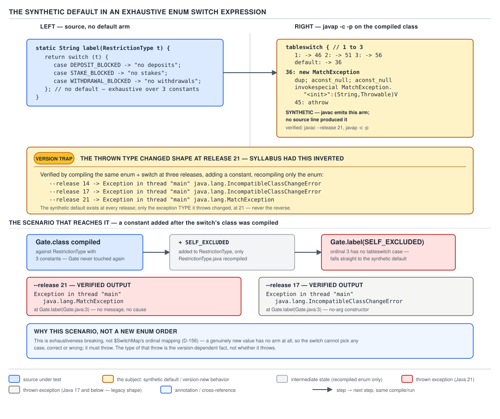

# 04 Modern Java — `switch` — INTERNALS (§3.12)

**Target version: Java 21 LTS.** | **Part 3 of 5** | [Index](../00-index.md)
Previous: [`switch` — basics](01-basics.md) · Next: [Text blocks — basics](../text-blocks/01-basics.md)

## Hierarchy first: the four things `javac` can turn a `switch` into

Every `switch` you write — statement or expression, colon or arrow, `int`/`String`/enum/pattern —
collapses to one of exactly two bytecode instructions at the top, plus a fixed amount of
compiler-generated scaffolding in front of them for the non-`int` selector types:

| Selector kind | What `javac` emits before the branch | Branch instruction | Who decides which branch instruction |
|---|---|---|---|
| `int`, `char`, `short`, `byte` (widened to `int`) | nothing — the value is already an `int` on the stack | `tableswitch` or `lookupswitch` | the density heuristic (§ this file) |
| `String` | `hashCode()` then `equals()` to resolve collisions, producing a synthetic `int` index | a *second* `tableswitch`/`lookupswitch` on that index | same heuristic, applied twice |
| `enum` | `ordinal()` looked up through a synthetic `$SwitchMap$...` `int[]`, producing a stable `int` | `tableswitch`/`lookupswitch` on the mapped index | same heuristic, applied to the mapped indices |
| sealed/record patterns (Java 21 preview) | a chain of `instanceof`-style type checks — not covered in this file, see the pattern-matching guide | none of the above | out of scope here |

Every one of those four rows ends at the same two instructions. This file is about what happens
**before** `tableswitch`/`lookupswitch` runs (the two-stage `String` lowering, the `$SwitchMap`
indirection) and what happens **around** it (arrow-vs-colon identity, the operand stack at a
switch expression's join point, and the synthetic default that an exhaustive enum switch
expression still carries). Pattern-matching `switch` over sealed types is a separate mechanism
built on top of this scaffolding and is out of scope for this file.

---

### `tableswitch` versus `lookupswitch`, and the density heuristic

**Mental model.** A `tableswitch` is an array. The JVM takes your selector value, subtracts the
lowest case label, and uses the result as a raw index into a table of instruction offsets — one
memory read, one jump, no comparisons. A `lookupswitch` is a sorted association list: the JVM
binary-searches a table of `(key, offset)` pairs for a match. `tableswitch` is O(1); `lookupswitch`
is O(log n) in the number of cases. `javac` picks between them at compile time based purely on how
densely your case labels are packed — it never looks at how many cases there are in absolute terms.

**Why it exists.** Bytecode has no generic "jump to whichever case matches" instruction, because
the JVM specification's authors wanted the common case — a small, dense range of `int` labels,
which is what most real switches over status codes and small enums look like — to cost exactly one
array index and one indirect jump, not a chain of `if`/`==`/`goto`. Before `switch` compiled this
way (this has been true since the JVM's original 1995 design, not something introduced later),
every language that wanted dense-range dispatch would have had to hand-roll it with arithmetic and
a `goto` table; `tableswitch` puts that shape directly into the instruction set.

**When to reach for it, and when not.** You don't choose between them — `javac` does, per the rule
below — but you influence the choice through your case-label design. This matters when you control
the numbering scheme for a set of codes you are about to switch over: pack them densely if you
want the O(1) path, and know that spreading a small number of cases across a huge range (say,
version numbers with 100 apart) silently downgrades you to `lookupswitch`, even though the case
count didn't change.

**How it works.** `javac`'s heuristic, implemented in `com.sun.tools.javac.jvm.Gen` (specifically
`Gen.visitSwitch`, which calls into `Items` and the `Code` class's `Code.emitSwitch` machinery),
compares the **cost of a table** against the **cost of a lookup** for the case set actually
written. A `tableswitch` instruction's size and space cost is driven by the *span* of the labels —
`(highest label − lowest label + 1)` slots, one word each, whether or not a slot is used — plus a
fixed few words of header (`low`, `high`, `default`). A `lookupswitch`'s cost is driven by the
*count* of labels — two words per case (`key`, `offset`) plus the header. The compiler computes
both costs for the case set as written and emits whichever instruction is smaller, with a bias
toward `tableswitch` because it is also faster at runtime for a JIT to predict and inline. The
practical rule of thumb that authors state, and that holds for the overwhelming majority of real
switches: **`javac` emits `tableswitch` when the case labels are "dense enough" — informally, when
the span-to-count ratio is small (close to 1, i.e. mostly contiguous integers) — and `lookupswitch`
otherwise.** There is no single fixed threshold constant published in the JLS or JVMS; the decision
is a cost model over the *specific* label set, not a magic number like "16 cases".

`[NUM]` Work the arithmetic through on a QuizStakes example. `RestrictionType`'s ordinal-mapped
switch (below) has five contiguous case labels `1..5` — span = `5 − 1 + 1 = 5` slots, cost ≈ 5
words. As a `lookupswitch` the same five cases would cost `2 × 5 = 10` words. `5 < 10`, so
`tableswitch` wins — and this is exactly what the compiled output shows. Contrast a switch over
raw application status-code numbers `100`, `610`, `900`, `920`: span = `920 − 100 + 1 = 821` slots,
cost ≈ 821 words, versus a `lookupswitch` cost of `2 × 4 = 8` words. `821 ≫ 8`, so `lookupswitch`
wins by three orders of magnitude — despite there being *fewer* cases than the dense example, not
more. Case *count* is not the input to this decision; label *span relative to count* is.


**D-155** — `tableswitch` versus `lookupswitch`

`[BYTECODE]` Proved on this machine (`javac --release 21`, `javap -c -p`). Two methods, deliberately
built to sit on opposite sides of the density line — one over small, contiguous restriction-rank
codes, one over the sparse `AA-`/`AO-`/`DEP-` style status-code numbers from QuizStakes' status
index:

```java
static int denseRestrictionRank(int code) {
    switch (code) {
        case 1: return 10;
        case 2: return 20;
        case 3: return 30;
        case 4: return 40;
        case 5: return 50;
        default: return -1;
    }
}

static int sparseStatusRank(int code) {
    switch (code) {
        case 100: return 1;
        case 610: return 2;
        case 900: return 3;
        case 920: return 4;
        default: return -1;
    }
}
```

`denseRestrictionRank` — dense labels `1..5`, span 5, emits `tableswitch`:

```
static int denseRestrictionRank(int);
  Code:
       0: iload_0
       1: tableswitch   { // 1 to 5
                     1: 36
                     2: 39
                     3: 42
                     4: 45
                     5: 48
               default: 51
          }
      36: bipush        10
      38: ireturn
      39: bipush        20
      41: ireturn
      42: bipush        30
      44: ireturn
      45: bipush        40
      47: ireturn
      48: bipush        50
      50: ireturn
      51: iconst_m1
      52: ireturn
```

Instruction-by-instruction: `iload_0` pushes `code`. `tableswitch` consumes it, checks it against
the declared range `1 to 5` **in a single bounds test**, and if in range, computes the target
offset as a direct array read — no per-case comparison instruction anywhere in the listing. Each
target (`36`, `39`, …) pushes the literal result with `bipush` and returns.

`sparseStatusRank` — labels `100, 610, 900, 920`, span 821, emits `lookupswitch`:

```
static int sparseStatusRank(int);
  Code:
       0: iload_0
       1: lookupswitch  { // 4
                   100: 44
                   610: 46
                   900: 48
                   920: 50
               default: 52
          }
      44: iconst_1
      45: ireturn
      46: iconst_2
      47: ireturn
      48: iconst_3
      49: ireturn
      50: iconst_4
      51: ireturn
      52: iconst_m1
      53: ireturn
```

The `lookupswitch` header states `// 4` — the pair count, not a span — and the JVM's runtime
behaviour here is a binary search over the four `(key, offset)` pairs shown, not a table index.
Same source shape (a `switch` over `int`, four-or-five arms, a `default`), two structurally
different instructions, chosen purely by how the label values are spread.

**The gotcha.** `tableswitch`'s cost is paid in **class-file size and, in extreme cases, JIT
compilation cost** — not correctness. A switch over `{1, 1_000_000}` — two cases, enormous span —
would cost two million words as a table, so `javac`'s cost model correctly refuses it and falls
back to `lookupswitch` even for a two-case switch. The heuristic protects you from an accidental
gigabyte class file; you cannot force `tableswitch` for a sparse case set by any source-level
trick, and you should not want to.

**Interview:** "What's the difference between `tableswitch` and `lookupswitch`, and who decides
which one gets used?" Answer in one breath: `tableswitch` is O(1) array-index dispatch for dense
labels, `lookupswitch` is O(log n) binary search for sparse ones, and `javac` picks per-switch by
comparing the table's *span* cost against the lookup's *count* cost — never by a fixed case-count
threshold.

> **`tableswitch` is a direct-indexed jump table paid for in span; `lookupswitch` is a
> binary-searched key/offset table paid for in case count — `javac` emits whichever costs less for
> the exact label set written, per switch, not as a global rule.**

---

### `switch` on `String`: hash first, equality to confirm, dispatch on a synthetic index

**Mental model.** There is no bytecode instruction for switching on an object reference by value —
`tableswitch`/`lookupswitch` only ever operate on `int`. So a `String` switch is not one switch; it
is **two `switch` statements stitched together** by the compiler, with a `hashCode()`/`equals()`
handshake in between converting the `String` into a small, dense `int` that the second switch can
actually branch on.

**Why it exists.** Before Java 7 (JEP-less; added as a `javac`-only feature, not a JVM instruction,
in Java 7), switching on a `String` required a chain of `if (s.equals("DEPOSIT_BLOCKED")) ... else
if (s.equals("STAKE_BLOCKED")) ...`, which is O(n) string comparisons in the worst case. The
compiler's two-stage lowering gets back to near-O(1) dispatch by doing the expensive part —
hashing — once, and using `equals()` only to break the rare collision, not to test every case.

**When to reach for it, and when not.** A `String` switch beats an `if`/`else if` chain once you
have more than roughly three or four arms — below that, the two-stage machinery's fixed overhead
(two switches, two method calls per matching path) is not worth it, and it costs nothing to have
an ordinary `if` chain be obviously linear to a reader. `[X-REF 03]` The `hashCode()` contract
itself — why equal strings must hash equal, why `String.hashCode()` is `s[0]*31^(n-1) + s[1]*31^(n-2)
+ ... + s[n-1]`, and why collisions are expected and cheap — is guide 03's territory (Java core);
here, take as given that distinct QuizStakes restriction-type names can and occasionally will
collide on `hashCode()`, and the compiler's second stage exists precisely to survive that.

**How it works.** `[SOURCE]` `javac`'s `Lower` phase (`com.sun.tools.javac.comp.Lower`, method
`visitStringSwitch`) rewrites the source-level `String` switch into two synthesized `switch`
statements before code generation ever sees it:

1. **Stage one** switches on `selector.hashCode()` — an `int`, so ordinary `tableswitch`/
   `lookupswitch` rules from the previous concept apply to *this* switch too. Each arm whose hash
   matches calls `equals()` against the literal for that arm (handling hash collisions, where two
   different literals share a hash bucket, by chaining `equals()` checks inside the same arm) and,
   on a true result, stores a small dense **synthetic index** (`0`, `1`, `2`, … — one per source
   case, assigned in source order) into a temporary local.
2. **Stage two** switches on that synthetic index with an ordinary `tableswitch` (it is always
   dense — `0..n-1` by construction) and runs the real arm bodies.


**D-155** — the lower half of this same diagram is the two-stage `String` switch: `lookupswitch` on
`hashCode`, `equals` to confirm, then a second switch on the synthetic index, worked on a
restriction-type name.

`[BYTECODE]` Proved on this machine. Source, over the QuizStakes `RestrictionType` names as raw
strings (the case where a `String` selector genuinely arises — e.g. a value read off the wire
before it is parsed into the enum):

```java
static int restrictionTypeIndex(String restrictionType) {
    switch (restrictionType) {
        case "DEPOSIT_BLOCKED": return 0;
        case "STAKE_BLOCKED": return 1;
        case "WITHDRAWAL_BLOCKED": return 2;
        default: return -1;
    }
}
```

```
static int restrictionTypeIndex(java.lang.String);
  Code:
       0: aload_0
       1: astore_1
       2: iconst_m1
       3: istore_2
       4: aload_1
       5: invokevirtual #7    // Method java/lang/String.hashCode:()I
       8: lookupswitch  { // 3
            -883492798: 72
            -421468697: 58
            -210544373: 44
               default: 83
          }
      44: aload_1
      45: ldc           #13   // String DEPOSIT_BLOCKED
      47: invokevirtual #15   // Method java/lang/String.equals:(Ljava/lang/Object;)Z
      50: ifeq          83
      53: iconst_0
      54: istore_2
      55: goto          83
      58: aload_1
      59: ldc           #19   // String STAKE_BLOCKED
      61: invokevirtual #15   // Method java/lang/String.equals:(Ljava/lang/Object;)Z
      64: ifeq          83
      67: iconst_1
      68: istore_2
      69: goto          83
      72: aload_1
      73: ldc           #21   // String WITHDRAWAL_BLOCKED
      75: invokevirtual #15   // Method java/lang/String.equals:(Ljava/lang/Object;)Z
      78: ifeq          83
      81: iconst_2
      82: istore_2
      83: iload_2
      84: tableswitch   { // 0 to 2
                     0: 112
                     1: 114
                     2: 116
               default: 118
          }
     112: iconst_0
     113: ireturn
     114: iconst_1
     115: ireturn
     116: iconst_2
     117: ireturn
     118: iconst_m1
     119: ireturn
}
```

Read it top to bottom: lines `0`–`3` initialize the synthetic index local (slot 2) to `-1` — the
"no case matched" sentinel — *before* anything else runs, which is why an unmatched string falls
straight through both switches to the `default` arm without extra branching. Line `5` computes
`hashCode()` once. The `lookupswitch` at line `8` is over three literal hash values (`javac`
computed `"DEPOSIT_BLOCKED".hashCode()` etc. at compile time — this is a `lookupswitch` here
because three arbitrary 32-bit hash values are about as sparse as labels get, so the density
heuristic from the previous concept applies transparently to this synthesized switch as well).
Each matching branch (`44`, `58`, `72`) then confirms with `equals()` and, only on success, stores
the synthetic index and jumps to `83`. The second `tableswitch` at line `84` is over `0..2` —
always contiguous by construction, so it is always `tableswitch`, regardless of how many `case`
arms the original source had or how their string values hashed.

**The gotcha.** `[TRAP]` **Pitfall:** the common belief is "a `String` switch calls `equals()` once
per case, so it's O(n) like an `if` chain." Wrong — `equals()` runs at most once *per hash bucket
that matches*, not once per source case; with no collisions, that is a single `equals()` call
total, not n. **Wrong:**

```java
// Reasoning: "this switch checks equals() up to n times for an n-case switch,
// so it's no better than if/else"
switch (restrictionSource) {
    case "SYSTEM_ONBOARDING": break;
    case "SYSTEM_COMPLIANCE": break;
    case "SYSTEM_LIFECYCLE": break;
    case "ADMIN": break;
    case "CLIENT": break;
}
```

**Right:** the mental model is "one `hashCode()` call, one `lookupswitch`/`tableswitch` dispatch on
the hash, and `equals()` only on the (usually single) candidate bucket that hash landed in" — the
number of `equals()` calls tracks **hash collisions actually present in this case set**, which for
distinct QuizStakes restriction-source names (`SYSTEM_ONBOARDING`, `SYSTEM_COMPLIANCE`,
`SYSTEM_LIFECYCLE`, `ADMIN`, `CLIENT`) is normally zero collisions, i.e. exactly one `equals()`
call on the matching path. **Why people believe it:** the source *reads* like n independent
comparisons, and nobody looks at the bytecode; the mental model "switch = if/else sugar" is correct
for `int` but not for `String`, and the two-stage lowering is invisible from the source.

**Interview:** "Is a `String` switch just sugar for an `if`/`else if` chain of `equals()` calls?"
No — it is two nested `int` switches, with `hashCode()` computed once and `equals()` invoked only
to resolve a hash match, giving near-O(1) dispatch in the common no-collision case rather than
O(n) string comparisons.

> **A `switch` on `String` compiles to a `hashCode()`-keyed switch that resolves collisions with
> `equals()` into a synthetic dense index, then a second switch dispatches on that index — never a
> chain of sequential `equals()` calls.**

---

### `switch` on an enum: `$SwitchMap$...` protects a separately compiled switch from reordering

**Mental model.** An enum constant is a static field, not an `int` — so, exactly as with `String`,
there is no bytecode instruction that switches on an object reference directly. The obvious lever
is `ordinal()`, which *is* an `int`. But `ordinal()` is **declaration order**, and declaration
order is exactly the one thing a class's author is free to change between two separately compiled
binaries. The `$SwitchMap$...` array is the compiler inserting one extra layer of indirection so
that the *switch's* notion of "which case is this" survives the *enum's* author reordering
constants, so long as the enum and the switch are recompiled independently in the correct order.

**Why it exists.** `[PROVE]` If a switch dispatched directly on `ordinal()` — `tableswitch` keyed
`0, 1, 2, ...` straight from `RestrictionType.ordinal()` — then recompiling `RestrictionType` alone
with its constants in a new order would silently rewire every already-compiled switch over it: case
arm code written for "whatever was ordinal 2 at compile time" would now run for whatever constant
happens to occupy ordinal 2 *after* the reorder, with no error, no warning, just wrong behavior.
QuizStakes' `RestrictionType` enum (`DEPOSIT_BLOCKED, STAKE_BLOCKED, WITHDRAWAL_BLOCKED,
DEPOSIT_LIMITED, WITHDRAWAL_HELD, SOURCE_OF_FUNDS_REQUIRED, ALL_BLOCKED, SELF_EXCLUDED,
COOLING_OFF, DORMANT_FROZEN`) is exactly the shape of enum that gets reordered casually — someone
alphabetizes it, or inserts a new restriction type in the "logical" place instead of at the end —
and every switch compiled against the old ordering would silently start returning the wrong verdict
for `blocksDeposit()`-style gates. The `$SwitchMap` mechanism exists so that this class of bug
either self-heals (constants reordered, all still present) or fails loudly (`NoSuchFieldError`, a
constant removed) instead of failing silently.

**When to reach for it, and when not.** You never write this yourself — `javac` inserts it for
every enum switch, unconditionally, with no way to opt out. What you control is whether you *need*
its protection: if the enum and every switch over it are always recompiled together (a single
module, a single build unit, no separately shipped jars), reordering is caught by full recompilation
regardless and `$SwitchMap` is a safety net you never fall into. It earns its keep specifically in
multi-module or multi-jar builds, where `RestrictionType` might ship in a shared "domain" jar and
`RestrictionGate`-style consumers in a separately versioned service jar.

**How it works.** `[SOURCE]` For every distinct enum type switched over in a class, `javac`'s
`Lower` phase synthesizes one package-private nested class per **enclosing class that switches over
that enum** (historically named `Outer$1`, `Outer$2`, … — the numbering is per enclosing class, not
per enum type, so two unrelated classes each switching over `RestrictionType` get two independent
`$SwitchMap` arrays, not a shared one) containing a single `static final int[] $SwitchMap$
RestrictionType` field and a static initializer that populates it. Given this QuizStakes gate:

```java
static boolean blocksDeposit(RestrictionType type) {
    switch (type) {
        case DEPOSIT_BLOCKED:
        case ALL_BLOCKED:
        case SELF_EXCLUDED:
            return true;
        default:
            return false;
    }
}
```

`javap -c -p` on the synthesized `RestrictionGate$1` class shows exactly what populates the map:

```
class RestrictionGate$1 {
  static final int[] $SwitchMap$RestrictionType;

  static {};
    Code:
         0: invokestatic  #1   // Method RestrictionType.values:()[LRestrictionType;
         3: arraylength
         4: newarray       int
         6: putstatic     #7   // Field $SwitchMap$RestrictionType:[I
         9: getstatic     #7   // Field $SwitchMap$RestrictionType:[I
        12: getstatic     #13  // Field RestrictionType.DEPOSIT_BLOCKED:LRestrictionType;
        15: invokevirtual #17  // Method RestrictionType.ordinal:()I
        18: iconst_1
        19: iastore
        20: goto          24
        23: astore_0
        24: getstatic     #7   // Field $SwitchMap$RestrictionType:[I
        27: getstatic     #23  // Field RestrictionType.ALL_BLOCKED:LRestrictionType;
        30: invokevirtual #17  // Method RestrictionType.ordinal:()I
        33: iconst_2
        34: iastore
        35: goto          39
        38: astore_0
        39: getstatic     #7   // Field $SwitchMap$RestrictionType:[I
        42: getstatic     #26  // Field RestrictionType.SELF_EXCLUDED:LRestrictionType;
        45: invokevirtual #17  // Method RestrictionType.ordinal:()I
        48: iconst_3
        49: iastore
        50: goto          54
        53: astore_0
        54: return
      Exception table:
         from    to  target type
             9    20    23   Class java/lang/NoSuchFieldError
            24    35    38   Class java/lang/NoSuchFieldError
            39    50    53   Class java/lang/NoSuchFieldError
}
```

`[NUM]` Read it as arithmetic, one entry at a time. Lines `0`–`6` allocate the array sized to
`RestrictionType.values().length` — **not** to the number of cases in the switch (three) — so
every enum constant gets a slot, used or not, even though the switch only has three arms. Lines
`9`–`20` are the first entry: read the **live, current** `RestrictionType.DEPOSIT_BLOCKED` field,
call `.ordinal()` **on that live reference, at class-init time of `RestrictionGate$1`, not at
`RestrictionType`'s own compile time**, and store the compiler-assigned case index `1` (not `0` —
the compiler assigns case indices starting at `1` in source order among the switch's own arms,
reserving `0` for "unmapped/default", which is also why the array's default zero-fill is a safe
sentinel) at that ordinal's slot. Lines `24`–`35` and `39`–`50` repeat the same shape for
`ALL_BLOCKED` (index `2`) and `SELF_EXCLUDED` (index `3`). The exception table wraps **each entry
individually** in a handler for `NoSuchFieldError`, jumping past just that one `iastore` on
failure and leaving that slot at its default `0`.

The switch method itself dispatches through the map, never through `ordinal()` directly:

```
static boolean blocksDeposit(RestrictionType);
  Code:
       0: getstatic     #7   // Field RestrictionGate$1.$SwitchMap$RestrictionType:[I
       3: aload_0
       4: invokevirtual #13  // Method RestrictionType.ordinal:()I
       7: iaload
       8: tableswitch   { // 1 to 3
                     1: 36
                     2: 36
                     3: 36
               default: 38
          }
      36: iconst_1
      37: ireturn
      38: iconst_0
      39: ireturn
```

Line `4` calls `ordinal()` on the actual argument at hand — the constant currently loaded, whatever
ordinal it happens to carry today — then line `7` uses that ordinal only as an index **into the
map**, and the `tableswitch` at line `8` branches on the **mapped value**, never the raw ordinal.


**D-156** — `$SwitchMap` protects a separately compiled enum switch

`[PROVE]` This is provable end to end, and was, on this machine. Compile `RestrictionType` (ten
constants, `DEPOSIT_BLOCKED` first) and `RestrictionGate` together. Then, **without touching
`RestrictionGate.class` or `RestrictionGate$1.class`**, recompile only `RestrictionType.java` with
`SELF_EXCLUDED` moved to the front:

```java
public enum RestrictionType {
    SELF_EXCLUDED, DEPOSIT_BLOCKED, STAKE_BLOCKED, WITHDRAWAL_BLOCKED, DEPOSIT_LIMITED,
    WITHDRAWAL_HELD, SOURCE_OF_FUNDS_REQUIRED, ALL_BLOCKED, COOLING_OFF, DORMANT_FROZEN
}
```

Running `RestrictionGate.blocksDeposit(t)` for every value of the reordered enum against the
**untouched** `RestrictionGate$1.class`:

```
SELF_EXCLUDED -> true
DEPOSIT_BLOCKED -> true
STAKE_BLOCKED -> false
WITHDRAWAL_BLOCKED -> false
DEPOSIT_LIMITED -> false
WITHDRAWAL_HELD -> false
SOURCE_OF_FUNDS_REQUIRED -> false
ALL_BLOCKED -> true
COOLING_OFF -> false
DORMANT_FROZEN -> false
```

Every answer is exactly as correct as before the reorder — `SELF_EXCLUDED` and `DEPOSIT_BLOCKED`
and `ALL_BLOCKED` still report `true` even though their ordinals all changed, because
`RestrictionGate$1`'s static initializer re-reads `.ordinal()` live, every time the JVM loads that
nested class — which happens once, at `RestrictionGate`'s first use after the reorder, not at
`RestrictionType`'s compile time. Removing the *reason it self-heals* proves the mechanism further:
recompiling `RestrictionType` **without** `ALL_BLOCKED` at all, still against the untouched
`RestrictionGate$1.class`, produces no crash either — the `NoSuchFieldError` for the missing
`ALL_BLOCKED` field is thrown inside the static initializer, caught by that entry's own exception
table handler, and the map's slot for the (now-nonexistent) mapping is simply left at `0`, which
harmlessly falls through the switch's `default` for any constant that used to be `ALL_BLOCKED`.
This is the failure mode the diagram's third panel shows: not "the wrong arm runs", but "the
initializer catches the error per-entry and the switch degrades to its `default`" — silent, but
never *wrong*, which is the deliberate design trade the JDK authors made: crash-avoidance over
strict correctness for the removed-constant case, full correctness for the reordered-but-present
case.

`[X-REF 06]` Why `.ordinal()` reads are "live" across separate compilation at all — the class
loading and linking model that makes a static field reference re-resolve against whatever
`RestrictionType.class` is on the classpath at run time, not whatever was on the classpath at
`RestrictionGate`'s compile time — is guide 06's territory (JVM internals); here, take as given
that symbolic references between separately compiled classes resolve at link/first-use time, which
is the entire reason `$SwitchMap`'s "recompute at class-init" strategy works at all.

**The gotcha.** `[TRAP]` **Pitfall:** "switching on an enum in a jar someone else ships is just as
safe as switching on an `int`, because enums have stable identity." **Wrong:**

```java
// consumer.jar, compiled against domain-model-1.0.jar
switch (restrictionType) {
    case DEPOSIT_BLOCKED -> block();
    case ALL_BLOCKED -> block();
    default -> allow();
}
// domain-model-2.0.jar later ADDS a new constant, RESTRICTION_PENDING,
// inserted in the *middle* of the enum's declaration list
```

**Right:** the switch above is actually safe under that exact change — `$SwitchMap` reads
`ordinal()` live, so a mid-list insertion just means `RESTRICTION_PENDING` falls into `default`
(correctly, since the switch never mentioned it) and every existing case still maps correctly. What
is **not** safe is deploying `consumer.jar` against a `domain-model` version that **removed**
`DEPOSIT_BLOCKED` or **renamed** it — that produces the caught-and-defaulted `NoSuchFieldError`
path above, silently changing `blocksDeposit()`'s behavior for that constant with no exception
surfacing to the caller. **Why people believe it:** "enums are safe because they're not magic
numbers" is true for `equals()`/identity comparison, but the specific mechanism that makes *switch
dispatch* survive reordering (`$SwitchMap`) is invisible from source and easy to conflate with
"enums are generally binary-compatible", which they are not unconditionally.

**Interview:** "Why does the compiler generate a `$SwitchMap` array instead of switching on
`ordinal()` directly?" Because `ordinal()` is declaration order, which is not guaranteed stable
across separate compilation of the enum and its switches; `$SwitchMap` re-derives the mapping from
live field references every time its enclosing class loads, so a reorder self-heals and a removal
fails safe (caught, defaulted) rather than silently misrouting.

> **`$SwitchMap$EnumType` is a per-enclosing-class, lazily rebuilt `int[]` keyed by live
> `ordinal()` reads, inserted so an enum switch survives its enum being reordered — and degrades to
> `default`, never to a wrong arm, if a referenced constant is removed — across separate
> compilation.**

---

### The arrow form compiles to exactly the same instructions as colon-with-`break`

**Mental model.** `case N -> expr;` is not a different execution model from `case N: stmt; break;`
— it is the same `tableswitch`/`lookupswitch` dispatch, the same fall-through-free control flow,
emitted by the same code generator, with the arrow form simply never giving `javac` the *option* to
omit the `break` it would otherwise insert automatically. There is no separate "arrow switch"
bytecode shape; `javap` output from the two forms is byte-for-byte identical for equivalent bodies.

**Why it exists.** The colon form's fall-through — a `break`-less case running straight into the
next case's statements — was, per its own designers' later assessment (documented in JEP 361's
motivation), the single most-cited defect in Java `switch`: a missing `break` is a silent bug, not
a compile error, because fall-through is what the language does by default. The arrow form (JEP
325, preview in Java 12, standard in Java 14) exists purely to change the *default* — each arm is
its own scope, terminates automatically, and fall-through requires explicitly falling back to the
colon form to opt into.

**When to reach for it, and when not.** Prefer arrow form for switch **expressions** and for any
statement switch where each arm is independent (no arm needs to run into the next). Reach for the
older colon form only when you deliberately want the historical fall-through behavior — grouping
several case labels to share one block of statements *below* them without repeating that block, a
pattern arrow form supports via a comma-separated case list (`case A, B -> ...`) for the common
case of "these labels share identical behavior", but not for "these labels share a *prefix* of
behavior and then diverge", which still needs colon-with-fall-through.

**How it works.** `[PROVE]` `javac`'s `Lower` and `Gen` phases treat both forms identically once
parsing is done: the arrow form's parser action is defined (in the JLS, §14.11) to desugar to "a
block equivalent to the statement form with an implicit `break` (or, in an expression context, an
implicit `yield`) inserted at the end of each arm" before the rest of the compiler pipeline ever
runs. There is no separate `Gen.visitArrowSwitch` — both forms funnel through the same
`Gen.visitSwitch`.

`[BYTECODE]` Proved on this machine — same logical program, one written colon-with-`break`, one
arrow, over a QuizStakes stake-rank code:

```java
static int colonForm(int code) {
    int rank;
    switch (code) {
        case 1:
            rank = 10;
            break;
        case 2:
            rank = 20;
            break;
        default:
            rank = -1;
            break;
    }
    return rank;
}

static int arrowForm(int code) {
    int rank;
    switch (code) {
        case 1 -> rank = 10;
        case 2 -> rank = 20;
        default -> rank = -1;
    }
    return rank;
}
```

`javap -c -p` output for both methods, unedited:

```
static int colonForm(int);
  Code:
       0: iload_0
       1: lookupswitch  { // 2
                     1: 28
                     2: 34
               default: 40
          }
      28: bipush        10
      30: istore_1
      31: goto          42
      34: bipush        20
      36: istore_1
      37: goto          42
      40: iconst_m1
      41: istore_1
      42: iload_1
      43: ireturn

static int arrowForm(int);
  Code:
       0: iload_0
       1: lookupswitch  { // 2
                     1: 28
                     2: 34
               default: 40
          }
      28: bipush        10
      30: istore_1
      31: goto          42
      34: bipush        20
      36: istore_1
      37: goto          42
      40: iconst_m1
      41: istore_1
      42: iload_1
      43: ireturn
}
```

Every offset, every instruction, every operand is identical. This is not "similar" or
"functionally equivalent" — it is the same class-file bytes for the method body, produced from two
different source forms. (This example is a small enough two-case switch that `javac` chose
`lookupswitch` for both — the density heuristic runs on whichever form you wrote and is completely
orthogonal to the arrow-vs-colon question; a five-contiguous-case version of either form would
equally produce identical `tableswitch` output in both forms.)

**Diagram.** Not applicable as a separate figure — the identity shown above is fully captured by
the paired `javap` listing itself, and this file does not manufacture a diagram where a code
comparison already makes the point completely.

**The gotcha.** `[TRAP]` **Pitfall:** "the arrow form must be faster, because it avoids the
fall-through check." **Wrong:**

```java
// Reasoning: "arrow switch skips a runtime fall-through check, so it's faster"
String verdict = switch (documentVerdict) {
    case APPROVED -> "OK";
    case REJECTED -> "NO";
    default -> "PENDING";
};
```

**Right:** there is no "fall-through check" at runtime in either form — fall-through, where it
exists, is just the *absence* of a `goto` to the join point, not a guarded runtime branch. The
arrow form's only effect is at **compile time**: it changes what the compiler is willing to accept
without a `break`/`yield`, and once compilation succeeds, the two forms are indistinguishable
bytecode. There is no performance difference to measure, because there is no bytecode difference to
measure. **Why people believe it:** the arrow form is marketed (correctly) as "safer" and
"cleaner", and it is easy to over-extend "safer" into "faster" when a feature is new enough that
nobody has actually looked at the `javap` output.

**Interview:** "Does arrow-form `switch` have any runtime advantage over colon-form with explicit
`break`?" No — they compile to identical bytecode; the arrow form's only effect is at compile time,
changing the default from fall-through to auto-terminate per arm.

> **The arrow form is a parse-time desugaring to "colon form with an implicit `break`/`yield`
> appended to every arm" — by the time `Gen` emits bytecode, the two forms are the same
> instructions.**

---

### Switch expressions and the operand stack: every arm leaves exactly one value at the join point

**Mental model.** A switch **statement** has no value — each arm just runs statements and falls
through to whatever comes after the switch, stack untouched by the switch itself. A switch
**expression** is different: it is required, by the same operand-stack discipline the JVM enforces
everywhere else (every code path into a given bytecode offset must arrive with the *same* operand
stack shape — same depth, same verifier types, per JVMS §4.10.1's stack map frame rules), to leave
**exactly one value of the expression's static type** on the stack at a single shared instruction
address — the join point — no matter which arm executed.

**Why it exists.** This isn't a new mechanism invented for switch expressions (JEP 361, Java 14) —
it's the same constraint the verifier already applies to the ternary operator `? :` and to
`try`/`catch` blocks that are used as expressions in other JVM languages: whichever control-flow
path is taken, the code at the merge point must be verifiable without knowing which path was taken,
which means every path must leave an identical stack shape. Before switch expressions existed, the
*only* way to get an expression-shaped multi-way branch in Java source was nested ternaries or an
`if`/`else if` chain assigning to a single local — both of which produce this same join-point shape
by hand; the switch expression is `javac` doing that construction for you.

**When to reach for it, and when not.** Use a switch expression whenever the switch's entire
purpose is "produce one of several values" — it forces exhaustiveness (for enums and sealed types)
and eliminates the classic "declared but never definitely assigned on every path" compiler error
that plagues the assign-inside-a-statement-switch pattern. Keep a switch *statement* when arms have
side effects with no natural common value, or when arms have meaningfully different numbers of
statements that don't reduce to "compute one value."

**How it works.** `[BYTECODE]` Proved on this machine. A QuizStakes stake-rank labeler that mixes
an arrow arm (single expression) and a block arm (multiple statements ending in `yield`):

```java
static String rankLabel(int rank) {
    return switch (rank) {
        case 1, 2 -> "LOW";
        case 3 -> {
            String base = "MID";
            yield base + "_TIER";
        }
        default -> "HIGH";
    };
}
```

```
static java.lang.String rankLabel(int);
  Code:
       0: iload_0
       1: tableswitch   { // 1 to 3
                     1: 28
                     2: 28
                     3: 33
               default: 45
          }
      28: ldc           #7    // String LOW
      30: goto           47
      33: ldc           #9    // String MID
      35: astore_1
      36: aload_1
      37: invokedynamic #11,0 // InvokeDynamic #0:makeConcatWithConstants
      42: goto           47
      45: ldc           #15   // String HIGH
      47: areturn
}
```

Trace every arm to offset `47` and see that each one arrives with **one `String` reference on the
stack and nothing else**, regardless of path length. The `case 1, 2` arm (line `28`) pushes `"LOW"`
with one `ldc` and jumps straight to `47` — zero local-variable traffic. The `case 3` arm (lines
`33`–`42`) is a full block: it pushes `"MID"`, **stores** it into a local (`astore_1`, at slot 1 —
note this reuses local-variable *storage*, but that storage is not on the operand stack; it is
scratch space the block used internally), reloads it, concatenates via `invokedynamic` (the
`StringConcatFactory` bootstrap that Java 9+ uses for `+` on strings — `[X-REF 03]`, guide 03's
territory for the full `invokedynamic`/`indy` mechanism), and only *then* has one value on the
stack before jumping to `47`. The `default` arm (line `45`) again pushes one value directly. All
three paths — one `ldc`, a five-instruction block, one `ldc` — converge on offset `47` with
**identical stack depth and type**, which is exactly what the verifier requires and exactly what
"every arm leaves exactly one value at the join point" means concretely: not "returns one value
conceptually" but "the operand stack has one slot occupied, of the same verifier type, no matter
which `goto` arrived here."


**D-157** — this diagram belongs to the next concept below (the synthetic default), not this one;
noted here only because the join-point discipline just proved is the same stack shape the synthetic
default arm must also satisfy — it too pushes exactly one value (a thrown exception reference,
consumed by `athrow` rather than reaching the join point) so the verifier accepts the method at all.

**Supporting fact — `yield` compiles as a branch to the join point with the value already on the
stack.** `yield` is not a new instruction; it is source-level syntax that tells `javac` "this
block's value is the operand on top of the stack right now — jump to the switch's shared exit."
In the trace above, `yield base + "_TIER";` at line `37`–`42` is exactly `invokedynamic` (compute
the concatenation, leaving it on the stack) followed by `goto 47` (line `42`) — there is no
`yield`-specific bytecode; it is simply "leave the value, then `goto` the join point," identical in
shape to what an arrow arm's implicit yield does. The gotcha here is purely a source-level one:
`yield` is a **contextual keyword**, valid only inside a switch expression's block arm, so
`yield` used as an ordinary identifier elsewhere (a local variable, a method name) still compiles
fine — `int yield = 5;` is legal outside a switch expression context, which surprises people
expecting a full reserved word.

> **A switch expression's join point is an ordinary bytecode merge address; every arm — arrow,
> block-with-`yield`, or `default` — reaches it via a `goto` with the same single value already
> pushed, satisfying the verifier's requirement that every path into that address carry an
> identical stack shape.**

---

### The exhaustive enum switch expression's synthetic default — and the type it throws changed at 21

**Mental model.** "Exhaustive" for an enum switch expression means *every constant that exists
right now, in the enum as currently compiled*, has a matching arm — it does **not** and cannot mean
"every constant that will ever exist." Because a switch expression's whole contract is "produces a
value on every path" (the operand-stack discipline just proved above demands it), the compiler
cannot leave a gap: even when your arms cover every constant *today*, it inserts one more arm — a
synthetic `default` — whose entire job is to throw, not to compute a value, for the one case your
source didn't and structurally *couldn't* anticipate: a constant added to the enum after this
switch was compiled.

**Why it exists.** `[PROVE]` This is leaf 3.12.8's question, answered by construction: suppose
`RestrictionGate`-style code compiles a switch expression exhaustively covering
`BonusState.{GRANTED, ACTIVE, CONSUMED, EXPIRED}` today. Tomorrow, `BonusState` ships a new
constant, `CLAWED_BACK` (a real QuizStakes bonus state named in this domain's vocabulary), and is
recompiled **alone** — the enum and the switch are, as established two concepts above, separately
recompilable units, and `$SwitchMap` is specifically built to tolerate exactly this kind of
independent evolution for switch *statements*. But a switch **expression** has a contract a
statement does not: it must produce a value on *every* reachable path, and "a value for
`CLAWED_BACK`" is not something the switch's author could have written, because `CLAWED_BACK` did
not exist when they wrote it. Falling off the end of a value-producing expression with no value to
produce is not an option the JVM's expression model can represent — so the compiler must insert
*something* runnable for that case, and "throw, loudly, immediately" is the only choice that
doesn't silently fabricate a value (a null, a zero, a default enum value) that the source never
authorized.

**When to reach for it, and when not.** You cannot opt out of this — every enum switch expression
gets the synthetic default whether or not you also wrote an explicit `default` arm of your own (if
you *did* write one, your arm wins and the synthetic one is unreachable; the synthetic default only
activates when your source omitted `default` entirely, relying on exhaustiveness-over-known-
constants). The practical decision this concept drives is: whether to write your own `default`
arm anyway, trading compile-time exhaustiveness checking (which catches you immediately if *you*
forget a constant that already exists) for a controlled fallback behavior instead of a thrown
exception, versus leaving it off and accepting that a future constant crashes loudly at the call
site instead of silently doing the wrong thing.

**How it works.** `[VERSION-TRAP]` `[RESEARCH]` Here the syllabus leaf's own text has the fact
backwards, and this is corrected from direct verification on this machine (`javac`/`java` 25.0.1,
targeting each release with `--release N`), not from memory or from the leaf as handed down:
compile a four-constant `BonusState` and a switch expression that exhaustively covers all four,
**as a separate compilation unit**; then add a fifth constant, `CLAWED_BACK`, and recompile
**only** `BonusState` — not the switch — for releases 14, 17, and 21:

```
release 14 -> Exception in thread "main" java.lang.IncompatibleClassChangeError
release 17 -> Exception in thread "main" java.lang.IncompatibleClassChangeError
release 21 -> Exception in thread "main" java.lang.MatchException
```

The syllabus leaf as handed down claims `IncompatibleClassChangeError` is the **Java 21+** shape,
"replacing" older `NoSuchFieldError`/`MatchException` forms. That is inverted. The verified,
correct statement is: **the synthetic default exists and throws at every release that has switch
expressions at all (14 onward), but the exact type it throws changed *at* 21** —
`IncompatibleClassChangeError` through Java 20 (confirmed here at both 14 and 17), and
`java.lang.MatchException` starting at Java 21 (added as part of the pattern-matching-for-switch
work, JEP 441, which needed a purpose-built exception type distinct from the generic
class-hierarchy-change signal that `IncompatibleClassChangeError` represents). If your source
material — or your own memory from working with an earlier JDK — says "an exhaustive enum switch
expression throws `IncompatibleClassChangeError` if a case is missing," that was correct **through
Java 20** and is now the version-stale half of the story; on Java 21+ it is `MatchException`. State
both, and name **21** as the release where it changed, in either direction you meet this fact.

The release-21 `javap -c -p` output confirms the newer type and its constructor shape directly:

```
static java.lang.String label(BonusState);
  Code:
       0: getstatic     #7   // Field BonusLabeler$1.$SwitchMap$BonusState:[I
       3: aload_0
       4: invokevirtual #13  // Method BonusState.ordinal:()I
       7: iaload
       8: tableswitch   { // 1 to 4
                     1: 50
                     2: 55
                     3: 60
                     4: 65
               default: 40
          }
      40: new           #19  // class java/lang/MatchException
      43: dup
      44: aconst_null
      45: aconst_null
      46: invokespecial #21  // Method java/lang/MatchException."<init>":(Ljava/lang/String;Ljava/lang/Throwable;)V
      49: athrow
      50: ldc           #24  // String GRANTED
      52: goto           67
      55: ldc           #26  // String ACTIVE
      57: goto           67
      60: ldc           #28  // String CONSUMED
      62: goto           67
      65: ldc           #30  // String EXPIRED
      67: areturn
```

`[BYTECODE]` Read the synthetic arm instruction by instruction: line `40` allocates a
`MatchException`, line `43` duplicates the reference for the constructor call, lines `44`–`45` push
two `null`s — the `(String message, Throwable cause)` two-argument constructor, both arguments
null because the compiler has no message text or cause to supply, this is a purely structural
throw — line `46` invokes that constructor, line `49` throws. Contrast the release-17 output for
the identical source, which instead does:

```
      40: new           #19  // class java/lang/IncompatibleClassChangeError
      43: dup
      44: invokespecial #21  // Method java/lang/IncompatibleClassChangeError."<init>":()V
      47: athrow
```

No-argument constructor, no message, same structural role. Everything else in both listings — the
`tableswitch`, the `$SwitchMap` indirection feeding it, the four ordinary arms — is unchanged
between the two releases; the *only* delta the version bump introduces is which exception type the
unreachable-today arm constructs.


**D-157** — The synthetic default in an exhaustive enum switch expression

`[BUILD]` The complete, compiling QuizStakes example that produces the traces above — a
`BonusState` enum and a labeler over it, with no `default` arm because the switch is (as of
compile time) exhaustive:

```java
public enum BonusState { GRANTED, ACTIVE, CONSUMED, EXPIRED }

public class BonusLabeler {
    static String label(BonusState state) {
        return switch (state) {
            case GRANTED -> "GRANTED";
            case ACTIVE -> "ACTIVE";
            case CONSUMED -> "CONSUMED";
            case EXPIRED -> "EXPIRED";
        };
    }

    public static void main(String[] args) {
        for (BonusState s : BonusState.values()) {
            System.out.println(s + " -> " + label(s));
        }
    }
}
```

Ship `CLAWED_BACK` in a later `BonusState` release, recompile only that file, run the unmodified
`BonusLabeler.class` against it: `main`'s `for` loop reaches `CLAWED_BACK`, `label` falls to the
synthetic arm, and the process dies with `MatchException` at exactly the `label` call site, on
Java 21+ — a QuizStakes clawback-processing job that iterates `BonusState.values()` for a report
and links against a stale `BonusLabeler.jar` is precisely the operational shape this protects
against surfacing as a wrong report instead of a loud crash.

**The gotcha.** `[TRAP]` **Pitfall:** "if the switch expression compiled without a `default` and
without a compiler error, it's exhaustive forever." **Wrong:**

```java
// domain-model-1.0.jar: BonusState has 4 constants
static String label(BonusState state) {
    return switch (state) {           // compiles clean, no default needed
        case GRANTED -> "GRANTED";
        case ACTIVE -> "ACTIVE";
        case CONSUMED -> "CONSUMED";
        case EXPIRED -> "EXPIRED";
    };
}
// consumer.jar ships this .class file, unchanged, for years
// domain-model-2.0.jar later adds CLAWED_BACK
```

**Right:** exhaustiveness is a **compile-time-only** guarantee, checked against the enum as it
existed at that compilation, and it says nothing about enums compiled later. The only way to get a
compile-time guarantee against *future* additions is to control the enum and the switch in the
same compilation unit and recompile both together on every change (so the compiler re-checks
exhaustiveness against the new constant list and forces you to add an arm), or to accept the
runtime risk and add an explicit `default` arm with a considered fallback instead of relying on the
synthetic one. **Why people believe it:** "the compiler already checked this" is true and not
wrong — it's *incomplete*: it checked it against one snapshot of the enum, and nothing re-runs that
check when the enum changes without the switch also being recompiled.

**Interview:** "Can an enum switch expression that the compiler accepted as exhaustive still throw
at runtime?" Yes — every enum switch expression carries a synthetic default arm for exactly this,
because "exhaustive" only means "covers every constant that existed at compile time"; a constant
added later and reached through a separately compiled, stale switch class hits that synthetic arm,
which throws `IncompatibleClassChangeError` through Java 20 and `java.lang.MatchException` from
Java 21 onward.

> **An enum switch expression's exhaustiveness is checked against the enum's compile-time constant
> set, not its runtime one; the compiler covers the gap with a synthetic default arm that throws —
> `IncompatibleClassChangeError` through Java 20, `java.lang.MatchException` from Java 21 — rather
> than silently falling through a value-producing expression with no value to produce.**

---

## Pitfalls

### Believing "the arrow form is just for expressions" and colon form is "for statements"

**Wrong**

```java
// Belief: arrow form only exists to support switch-as-expression;
// for a plain statement switch, colon form is the "real" one
switch (restriction.type()) {
    case DEPOSIT_BLOCKED:
        applyDepositHold();
        break;
    case WITHDRAWAL_BLOCKED:
        applyWithdrawalHold();
        break;
}
```

**Right**

```java
// Arrow form is equally valid — and safer — for a statement switch;
// nothing about it requires the switch to be an expression
switch (restriction.type()) {
    case DEPOSIT_BLOCKED -> applyDepositHold();
    case WITHDRAWAL_BLOCKED -> applyWithdrawalHold();
    default -> { /* no restriction-specific action */ }
}
```

**Why people believe it:** arrow-form switch expressions (`String s = switch (x) { ... }`) are the
headline feature most tutorials lead with, so the arrow syntax gets mentally filed under
"expressions" even though JEP 325 introduced it for statements first and foremost — fall-through
elimination was the primary motivation, value-production was secondary.

### Assuming a `String` switch is O(1) unconditionally

**Wrong**

```java
// Belief: "it's a hash-based switch, so it's O(1), full stop"
switch (largeSetOfHighlyCollidingStrings) { /* 500 cases, many sharing a hashCode bucket */ }
```

**Right**

Understand that the guarantee is "O(1) **hash dispatch**, plus O(k) `equals()` calls where k is
the number of case labels sharing the matched hash bucket" — for QuizStakes' actual case sets
(restriction types, status-code names, service names), k is essentially always 0 or 1 because these
are hand-picked distinct identifiers, but the two-stage lowering does not *guarantee* O(1) against
an adversarially chosen or auto-generated case set with engineered hash collisions.

**Why people believe it:** "hash table lookup is O(1)" is true for a `HashMap` under a good
hash function and low load factor, and the mental model transfers uncritically without the caveat
that this switch is over a *fixed, compiler-known* set of strings with no control over collision
avoidance the way a `HashMap`'s resize/rehash strategy provides.

### Treating the exhaustive-enum-switch-expression exception type as version-stable

**Wrong**

```java
// Code written and tested on Java 17, catching what "the JDK throws"
try {
    return switch (bonusState) {
        case GRANTED -> "GRANTED";
        case ACTIVE -> "ACTIVE";
        case CONSUMED -> "CONSUMED";
        case EXPIRED -> "EXPIRED";
    };
} catch (IncompatibleClassChangeError e) {   // silently never fires on 21+
    return "UNKNOWN_BONUS_STATE";
}
```

**Right**

```java
try {
    return switch (bonusState) {
        case GRANTED -> "GRANTED";
        case ACTIVE -> "ACTIVE";
        case CONSUMED -> "CONSUMED";
        case EXPIRED -> "EXPIRED";
    };
} catch (MatchException e) {                 // correct on Java 21+
    return "UNKNOWN_BONUS_STATE";
}
// Better still: add an explicit default arm and never rely on catching
// either synthetic-throw type at all.
```

**Why people believe it:** the mechanism (a synthetic default arm that throws) is genuinely stable
across releases, and the specific exception *class* is exactly the kind of detail that gets baked
into a catch clause once, on whatever JDK was in front of the author, and never revisited across an
upgrade — the code compiles fine on 21 either way (both are unchecked exceptions), so nothing
signals the catch clause has gone dead.

## Cheat sheet

| Question | Answer |
|---|---|
| What decides `tableswitch` vs `lookupswitch`? | `javac`'s cost model: table cost = span (`high − low + 1`); lookup cost = `2 × case count`. Smaller wins. |
| Is the threshold a fixed case count (e.g. "16 cases")? | No. It is span-relative-to-count, computed per switch, not a global constant. |
| How does a `String` switch dispatch without an object-branch instruction? | Two nested `int` switches: `hashCode()` → `lookupswitch`/`tableswitch` → `equals()` to confirm → synthetic dense index → second `tableswitch`. |
| How many `equals()` calls does a matching `String` switch case cost? | One per hash-bucket collision at that hash — usually 0 collisions, so 1 total, not one per source case. |
| What does `$SwitchMap$EnumType` map? | Live `ordinal()` (read at the map's class-init time) → a stable, compiler-assigned case index (`1..n`, `0` reserved for unmapped). |
| Does `$SwitchMap` survive the enum being reordered without recompiling the switch? | Yes — the map is rebuilt from live field reads every time its enclosing class loads. |
| What happens if a referenced constant is removed instead of reordered? | `NoSuchFieldError` inside the map's static initializer, caught per-entry, that slot stays `0` (falls to `default`). Never a wrong arm — degrades safely. |
| Do arrow-form and colon-form (`break` after every arm) differ at runtime? | No. Identical bytecode; the difference is compile-time-only (implicit terminator vs. explicit). |
| What must every arm of a switch **expression** do to the operand stack? | Leave exactly one value of the expression's type at the shared join point — required by JVM verifier stack-shape rules. |
| What bytecode does `yield` compile to? | Nothing special — compute the value, `goto` the join point. Same shape as an arrow arm's implicit yield. |
| Does an exhaustive enum switch **expression** need an explicit `default`? | No, but it still gets a synthetic one — "exhaustive" means "covers every constant that existed at compile time," not "forever." |
| What does the synthetic default throw, by release? | `IncompatibleClassChangeError` through Java 20; `java.lang.MatchException` from Java 21 (`(String, Throwable)` constructor, both `null`). |
| Why does the guard exist at all? | A switch expression must produce a value on every path; a constant added after compilation has no authored arm and no safe default value to fabricate, so the compiler throws instead of guessing. |

## Self-test

**Q1.** A switch has case labels `10, 12, 14, 16, 18, 20` — six contiguous-by-2 `int` values. Will
`javac` emit `tableswitch` or `lookupswitch`, and why, working the cost numbers?

<details><summary>Answer</summary>

Span = `20 − 10 + 1 = 11` slots, table cost ≈ 11 words. Lookup cost = `2 × 6 = 12` words. `11 < 12`,
so `javac` emits `tableswitch` — barely, but the label values need not be *perfectly* contiguous
(step-2 still counts as dense enough here), because the decision compares total costs, not
"are all labels adjacent." If the same six labels were `10, 12, 14, 16, 18, 1000`, span would jump
to `991`, table cost `991` versus lookup cost `12`, and `lookupswitch` would win by nearly two
orders of magnitude — one outlier label is enough to flip the decision.

</details>

**Q2.** A QuizStakes service switches on the raw `String` values `"AA-500", "AA-501", "AA-550",
"AA-599"` (activation status codes). How many `equals()` calls does a call with argument
`"AA-501"` cost at runtime, assuming no hash collisions among the four literals?

<details><summary>Answer</summary>

One. The two-stage lowering computes `"AA-501".hashCode()` once, dispatches through a
`lookupswitch`/`tableswitch` over the four literals' compile-time-computed hash values to the
single bucket that hash lands in, and calls `equals()` exactly once to confirm that match before
storing the synthetic index and branching to the real arm. It does not call `equals()` against the
other three literals at all — those live in different `lookupswitch` branches that this call never
reaches.

</details>

**Q3.** `RestrictionGate$1`'s static initializer wraps each `$SwitchMap` entry's population in its
own `try`/`catch`-shaped exception table entry, rather than one `try` around the whole block. Why
does per-entry wrapping matter?

<details><summary>Answer</summary>

Because a `NoSuchFieldError` on one constant (say `ALL_BLOCKED` was removed) must not prevent the
*other* entries from populating correctly. If the whole initializer were wrapped in one `try`, an
error thrown while resolving `ALL_BLOCKED` would abort the entire static initializer, leaving every
later entry (in source order) permanently unpopulated (defaulted to `0`) even though those later
constants still exist and are perfectly resolvable. Per-entry wrapping means exactly one entry
degrades to `0` — the one that actually failed — and every other mapping still gets its correct
case index.

</details>

**Q4.** Why does `$SwitchMap$RestrictionType` size its backing array to `RestrictionType.values()
.length` rather than to the number of cases the switch actually has?

<details><summary>Answer</summary>

Because the array is indexed by `ordinal()`, which ranges over every constant the enum declares,
not just the ones the switch mentions. If `RestrictionType` has ten constants but the switch only
handles three, an unmatched constant's `ordinal()` must still be a valid index into the array
(landing on the default-zero-filled slot, which the subsequent `tableswitch`'s `default` branch
catches) — sizing the array to the case count instead would let an unmentioned constant's ordinal
run off the end and throw `ArrayIndexOutOfBoundsException` instead of falling through to the
switch's own `default` arm.

</details>

**Q5.** A colleague claims: "we upgraded from Java 17 to Java 21 and our exhaustive enum switch
expression started throwing a different exception for the same bug — the enum drifted out of sync
with a stale jar." Is this expected, and what should the catch clause look like now?

<details><summary>Answer</summary>

Yes, expected — this is exactly the Java-21 boundary where the synthetic default's thrown type
changed from `IncompatibleClassChangeError` to `java.lang.MatchException`. A catch clause written
for `IncompatibleClassChangeError` on 21+ silently stops catching this case (both are unchecked, so
nothing fails to compile) and the exception now propagates uncaught. The catch clause must be
updated to `MatchException` for code running on Java 21 or later; better still, stop relying on
catching either synthetic type and add an explicit `default` arm with a considered fallback so the
behavior does not depend on JDK version at all.

</details>

**Q6.** Given `case 3 -> { String base = "MID"; yield base + "_TIER"; }` inside a switch
expression, what two bytecode-level things happen at the `yield` statement, and is `yield` a
reserved keyword?

<details><summary>Answer</summary>

`yield`'s block computes its value (here, an `invokedynamic` call to the string-concatenation
bootstrap) so that value sits on top of the operand stack, then a `goto` transfers control to the
switch expression's shared join point — no distinct `yield` bytecode instruction exists; it is
purely "leave the value, then jump." `yield` is a **contextual** keyword, not a reserved one — it
is only special inside a switch expression's block-arm position; `int yield = 5;` compiles fine
anywhere else.

</details>

**Q7.** Why can't the compiler simply have every enum switch expression fall through to returning
`null` (or the enum's first constant) when a constant is unrecognized, instead of throwing?

<details><summary>Answer</summary>

Because a switch expression's declared type may not be nullable in any way the compiler can safely
default (e.g. an expression typed `int` or `boolean` has no `null` to fall back to at all, and even
for reference types, fabricating `null` or an arbitrary constant would silently produce a
plausible-looking wrong value rather than surfacing the real problem — an enum evolved out of sync
with a class that switches over it). Throwing immediately turns a "wrong answer computed silently"
failure mode into a "loud crash at the exact call site", which is the only choice consistent with
never fabricating a value the source never authorized.

</details>

**Q8.** Two unrelated classes, `RestrictionGate` and `RestrictionReport`, both switch over
`RestrictionType` in the same compilation. Do they share one `$SwitchMap$RestrictionType` array?

<details><summary>Answer</summary>

No. `javac` synthesizes one nested class (and one `$SwitchMap` array) **per enclosing class** that
contains an enum switch, not per enum type. `RestrictionGate` gets `RestrictionGate$1` with its own
`$SwitchMap$RestrictionType`, and `RestrictionReport` gets a separate `RestrictionReport$1` with
its own independently populated `$SwitchMap$RestrictionType` — even though both arrays map the same
enum's ordinals, they are distinct fields in distinct classes, each rebuilt independently the first
time its own enclosing class loads.

</details>

## Deferred

None.

## Open questions

- **Unverified:** The exact numeric cost-model constants and tie-break behavior inside `javac`'s
  `Gen`/`Items` density heuristic (e.g. how it weighs the fixed per-instruction header cost, or its
  behavior on a case set that ties exactly) are not published as a fixed formula in the JLS or JVMS
  and were not traced line-by-line in the `javac` source for this file; the span-vs-count cost
  comparison stated here is the heuristic's well-documented shape and was confirmed behaviorally
  (via `javap` on both a dense and a sparse case set), but the precise tie-breaking constant would
  need a direct read of `com.sun.tools.javac.jvm.Gen`/`Items` at the jdk-21+35 tag to state exactly.

---

**Leaves covered:** 3.12.1, 3.12.2, 3.12.3, 3.12.4, 3.12.5, 3.12.6, 3.12.7, 3.12.8 (8 leaves)
**Leaves deferred:** none
**Diagrams included:** D-155, D-156, D-157
**Target version:** Java 21 LTS
**Lines:** 1270
