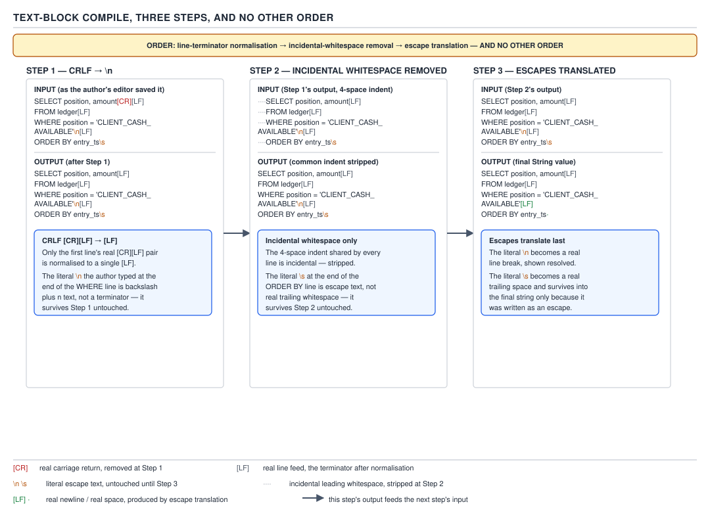
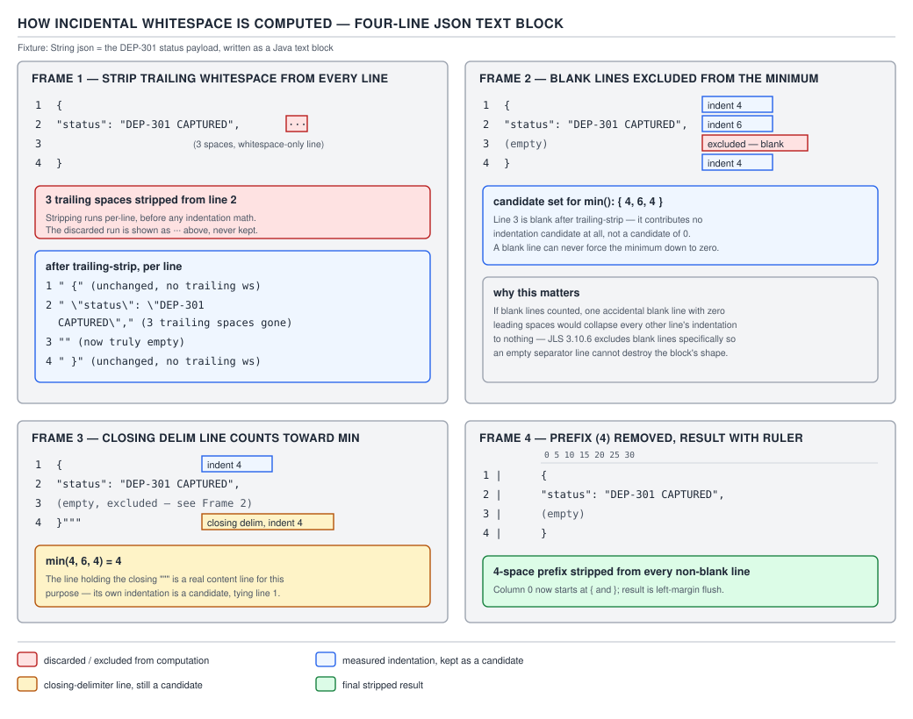
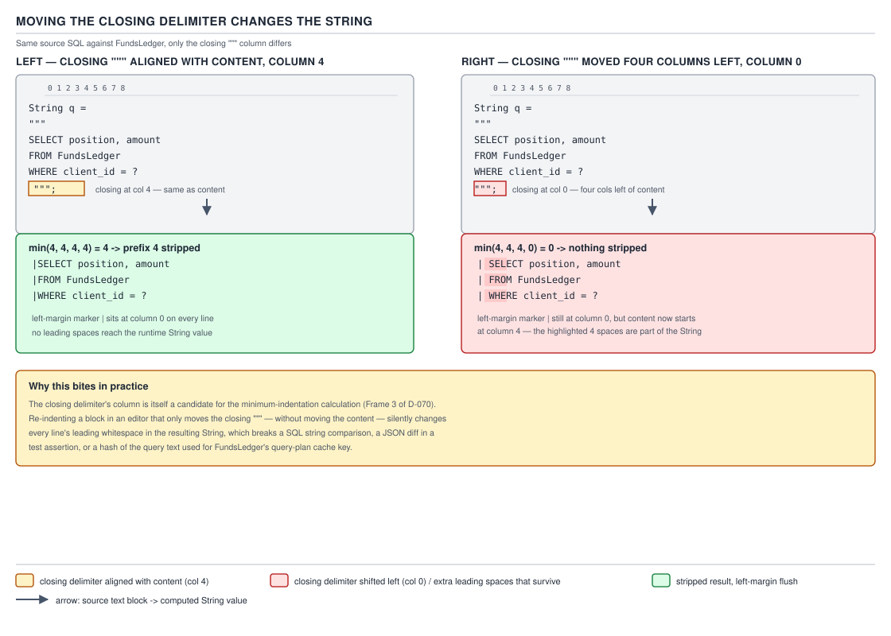

# 04 Modern Java — Text blocks — BASICS (§1.17)

**Target version: Java 21 LTS.** | **Part 1 of 5** | [Index](../00-index.md)
Previous: [`switch` — internals switch compilation](../switch/03-internals-switch-compilation.md) · Next: [Text blocks — in practice](02-in-practice.md)

## Overview: what a text block is and is not

A text block is not a new kind of string. It is a new *literal syntax* that the
compiler turns into an ordinary `java.lang.String` — the same class, the same
interning behaviour, the same `equals`/`hashCode`, the same everything at
runtime. Everything interesting about text blocks happens **at compile time**,
inside `javac`, before a single `CONSTANT_String_info` entry ever lands in a
class file. That single fact is the thread that ties every leaf in this file
together: a text block is source-code sugar for a `String` literal, resolved
by a fixed three-step transformation that runs once, at compile time, and
never again.

The family this file covers, and the runtime methods that grew up alongside
it because the compiler's transformation had to be re-exposed as a callable
API:

| Name | What it is | Where it runs |
|---|---|---|
| `"""..."""` syntax | The literal itself | Compile time (`javac`) |
| `String.stripIndent()` | The incidental-whitespace algorithm, as a method | Runtime |
| `String.translateEscapes()` | The escape-translation step, as a method | Runtime |
| `String.formatted(Object...)` | Shorthand for `String.format(this, args)` | Runtime |
| `String.indent(int)` | Adds or removes a fixed amount of leading whitespace per line | Runtime |

The last four exist because programs sometimes need to apply the *same*
transformation a text block gets at compile time to a `String` they only have
at runtime — a value read from a file, assembled from a template, or handed
back from a REST call. Beat 4 in Concept 4 below explains why each one is
shaped the way it is.

---

## Concept 1 — The text-block literal and its three-step compile pipeline

### Mental model first

Picture the compiler holding your text block as one long, unprocessed slab of
characters — everything between the opening `"""` and the closing `"""`,
exactly as it appears in the `.java` file, including whatever your editor's
line endings and your IDE's auto-indent left behind. Before that slab becomes
a `String` constant, the compiler runs it through exactly three passes, each
one **feeding off the previous pass's output**, never the raw source:
normalise line endings, strip the shared margin, then translate escapes. The
order is not incidental — the whole reason `\n` typed literally and `\s`
typed literally survive the earlier passes untouched is that those passes run
*before* escape translation, so at the time normalisation and margin-removal
happen, a written `\n` is still two harmless characters, backslash and `n`,
not a line break.

### Why it exists

Before Java 14 (JEP 368) / Java 15 (JEP 378 final), embedding a multi-line
string — SQL, JSON, HTML — meant one of:

- string concatenation with explicit `\n` on every line, which no editor
  could reformat sanely and which visually buried the content under
  punctuation;
- a series of `.append()` calls on a `StringBuilder`;
- reading the content from a resource file, which moved the string out of
  the code the reviewer was actually looking at.

None of those let you paste a block of SQL or JSON into the source file and
have it look, indented, exactly the way it will read at runtime. Text blocks
close that gap: the literal is allowed to be indented to match the
surrounding Java code, and the compiler's job is to strip exactly the
indentation that exists *only* to satisfy the surrounding code's formatting,
leaving the content's own relative indentation intact.

### When to reach for it, and when not

Reach for a text block whenever the value is multi-line and the line breaks
themselves are part of the content's meaning — SQL, JSON, HTML fragments,
GraphQL queries, usage/help text. Do not reach for it as a general
`StringBuilder` replacement for single-line values: a one-line
`"CLIENT_CASH_AVAILABLE"` gains nothing from `"""` and loses the visual
signal that a triple-quote means "this value's line breaks matter." Concept 5
below (`91-interview-basics.md`'s companion, "where they earn their keep")
sharpens this further: regular expressions are the sharpest case where a text
block is the *wrong* choice, because regex already overloads `\` as its own
escape character, and text blocks solve an indentation problem regex doesn't
have.

### How it works

**Leaf 1.17.1 — the JEP history.** Text blocks shipped as a preview feature
twice before being finalised: **JEP 355** previewed them in JDK 13, **JEP
368** re-previewed them (with the `\s` and `\` line-continuation escapes
added) in JDK 14, and **JEP 378** finalised them, unchanged from the second
preview, in JDK 15. On Java 21 there is no preview flag to remember — text
blocks have been a standard, no-flag language feature since 15, five releases
before this LTS.

**Leaf 1.17.2 — the syntax.** The literal opens with three double quotes,
`"""`. Everything up to the next line terminator on that same line must be
*only* whitespace — the compiler permits trailing spaces or tabs after the
opening delimiter (they are discarded; they exist only so a hurried editor's
auto-trim doesn't turn a valid text block into a compile error) but nothing
else. The next line terminator is what actually opens the content region.
Content follows, spanning as many lines as needed, and the literal closes on
a matching `"""`, which may appear on its own line or at the end of the final
content line.

```java
String ledgerQuery = """
    SELECT client_id, position, amount_minor, currency
    FROM ledger_entry
    WHERE position = 'CLIENT_CASH_AVAILABLE'
      AND client_id = ?
    ORDER BY posted_at DESC
    """;
```

**Leaf 1.17.3 — content cannot begin on the opening delimiter's line.**

```java
// Does not compile.
String ledgerQuery = """SELECT client_id
    FROM ledger_entry
    """;
```

`javac --release 21` on that snippet reports `illegal text block start: missing
line terminator after opening quotes`. This is not a style preference the
compiler is enforcing — it is baked into the grammar. `JLS §3.10.6` defines a
`TextBlock` as `"""` followed by `[TextBlockSpaces] LineTerminator
[TextBlockCharacters] TextBlockClose` — the `LineTerminator` is a mandatory,
non-optional grammar production between the opening delimiter and the
content. There is no way to write content on the opening line and have it
parse as anything but a syntax error.

**Insight:** the reason the grammar forces this is that it is what makes the
*first* content line's indentation participate in the incidental-whitespace
calculation on equal footing with every other line. If content could start on
the opening-delimiter line, that line would have no leading whitespace to
measure by construction (it starts right after `"""`), and it would silently
distort the common-prefix computation for every other line. Forcing a line
break after the delimiters makes every content line, including the first,
measured the same way.

**Pitfall:** writing `String s = """some text""";` expecting a compact
one-line text block, the way some other languages allow.

**Wrong**
```java
String s = """some text""";
// compile error: illegal text block start: missing line terminator after opening quotes
```

**Right**
```java
String s = """
    some text""";
// or, if there is genuinely no multi-line content, just use a normal literal:
String sameValue = "some text";
```

**Why people believe it:** other "block string" syntaxes — Python's triple
quotes among them — allow content on the opening line, so the intuition
transfers incorrectly. Java's grammar deliberately does not.

**Leaf 1.17.4 — the three compile-time steps, in this exact order.**
`JLS §3.10.6` (mirrored in the `String.stripIndent()` and
`String.translateEscapes()` javadoc, which describe the same algorithm
because they *are* the same algorithm, exposed as callable methods) specifies
the pipeline as:

1. **Line terminators are normalised to `\n`.**
2. **Incidental white space is removed** — leading common-prefix stripping
   plus per-line trailing-whitespace stripping.
3. **Escape sequences are translated** — `\n`, `\t`, `\"`, `\s`, `\`
   line-continuation, and the rest of the ordinary Java escape set.

`[SOURCE]` The JLS is explicit that this is a *sequence*, not a
simultaneous computation: "The value of a text block is determined at
compile time... as follows: Line terminators... are normalized... Incidental
white space is then removed... Escape sequences... are then interpreted."
Each "then" is load-bearing. Every leaf below — CRLF survival, the closing
delimiter controlling indentation, `\s` surviving stripping, a written `\n`
surviving normalisation — is a direct consequence of this ordering and
nothing else. There is exactly one order the JLS defines; there is no
configuration or compiler flag that changes it.

**Leaf 1.17.5 — normalisation makes text blocks platform-deterministic.**

`[PROVE]` Suppose a `.java` source file is checked out on a Windows machine
with `core.autocrlf=true`, so every line in the file physically ends in
`\r\n`. The text block:

```java
String ledgerQuery = """
    SELECT client_id, position
    FROM ledger_entry
    """;
```

is stored on disk, line by line, as `SELECT client_id, position\r\n` followed
by `FROM ledger_entry\r\n`. Step 1 of the pipeline runs *before* step 2 or
step 3 see any of it: every line terminator in the raw slab — whether it was
`\r\n`, a lone `\r` (old Mac OS 9 style, still a legal source line
terminator), or `\n` — is rewritten to `\n`. By the time incidental
whitespace is computed, there is no CRLF left to reason about; the compiler
is working over a `\n`-only intermediate string. This is why the same source
file, compiled on Linux (native `\n`) and on Windows (native `\r\n`),
produces **byte-for-byte identical** `String` contents — the class files
carry the same `CONSTANT_String_info` UTF-8 bytes regardless of which
platform's line endings the `.java` file happened to be saved with.

`[RESEARCH]` This is worth stating precisely because it is easy to
over-claim: normalisation only touches the *text block's own content*. It
says nothing about the file's other line endings, and it does not retroactively
change how the file is stored on disk — `javac` reads the source, normalises
during compilation, and the normalised value lives only in the resulting
`String` constant.

**Version behaviour:** this is true at every release since text blocks
existed (13 preview → 21 standard); normalisation was part of the feature
from JEP 355 onward, not something added later.

```
Diagram: D-069 — The three text-block compile steps, in order
```


**D-069** — The three text-block compile steps, in order

The diagram walks exactly the `ledgerQuery` example above through all three
frames: frame 1 shows the CRLF-terminated source lines being rewritten to
`\n`-terminated lines (with both forms drawn as visible control characters,
not blank line breaks, so the rewrite is visible rather than implied); frame
2 shows incidental whitespace removed, collapsing the four-space editor
indent down to the query's own relative structure; frame 3 shows escape
translation running last, with the diagram explicitly marking a `\n` the
author typed and a `\s` the author typed as **untouched by frames 1 and 2**
— they only become a newline character and a space character in frame 3,
which is the entire point this diagram exists to make. The frame order is
labelled "and no other order" because leaves 1.17.5 and 1.17.11 both depend
on that order being fixed, not a compiler implementation detail that happens
to hold today.

### A minimal concrete example

```java
// A parameterised SQL statement read straight off the funds ledger.
// FundsLedger service, reading CLIENT_CASH_AVAILABLE positions.
String ledgerQuery = """
    SELECT client_id, position, amount_minor, currency
    FROM ledger_entry
    WHERE position = 'CLIENT_CASH_AVAILABLE'
      AND client_id = ?
    ORDER BY posted_at DESC
    """;

// Equivalent, pre-Java-15, the way FundsLedger's query builder had to write
// this before text blocks existed:
String ledgerQueryOldStyle =
        "SELECT client_id, position, amount_minor, currency\n" +
        "FROM ledger_entry\n" +
        "WHERE position = 'CLIENT_CASH_AVAILABLE'\n" +
        "  AND client_id = ?\n" +
        "ORDER BY posted_at DESC\n";

assert ledgerQuery.equals(ledgerQueryOldStyle);
```

Both expressions produce the identical `String` — same characters, same
`hashCode()`, same interned constant-pool entry if both are literal
constant expressions (Concept 5 makes this precise). The text block is not a
different *value*; it is a different, far more legible *way to write* the
same value.

### The gotcha

The gotcha is the one this whole concept exists to set up: **the compiler
does not preserve your source formatting verbatim.** Two of your three
compile steps actively rewrite what you typed — normalisation changes line
endings you never see, and incidental-whitespace removal changes leading
spaces you *do* see, in a way that depends on a line you might not expect to
matter (the closing delimiter's own line — Concept 2 makes this the whole
subject). A text block is not "the literal text of this file"; it is "the
literal text of this file, run through three transformations, at least one
of which depends on how you indented a line you may have thought was purely
cosmetic."

> **A text block is a `"""`-delimited literal whose content is transformed
> by three fixed compile-time steps — line-terminator normalisation,
> incidental-whitespace removal, escape translation, run in that order and
> no other — into an ordinary interned `String`.**

---

## Concept 2 — Incidental whitespace: the closing delimiter sets the margin

### Mental model first

Every text block has two kinds of leading whitespace on every content line:
**essential** whitespace, which is part of what you meant to write (the
indentation *inside* a JSON fixture, say), and **incidental** whitespace,
which exists purely because you indented the whole literal to match the
surrounding Java code. The compiler's job is to figure out exactly how much
of the leading whitespace on each line is incidental, and strip precisely
that much — no more, no less — from every line, uniformly. Picture sliding a
vertical ruler in from the left margin until it touches the least-indented
line; the ruler's resting position is the incidental margin. The subtlety
this whole concept exists to teach: **the closing delimiter's own line
counts as one of the lines the ruler has to clear**, whether or not it holds
any content.

### Why it exists

Without a margin-removal step, indenting a text block to match the
surrounding code would bake that indentation into the string's actual
content — a text block nested three levels deep inside a method would have
twelve extra leading spaces on every line of, say, embedded JSON, which is
wrong: the JSON's *own* two-space indent should read as two spaces at
runtime, not fourteen. Text blocks solve this the same way most templating
languages solve it: compute the common leading-whitespace prefix across the
whole block and remove it, so the block can be indented for readability in
the source file without that indentation leaking into the value.

### When to reach for it, and when not

This isn't a feature you invoke — it happens automatically to every text
block, always. The choice you actually make is *where to put the closing
delimiter*, because that placement is what determines how much margin gets
removed (leaf 1.17.7). There is no way to opt out of incidental-whitespace
removal for a text block; if you need the compiler to preserve every literal
leading space exactly as typed, a text block is the wrong tool — an ordinary
`String` literal with explicit `\n` concatenation does not run this
algorithm at all.

### How it works

**Leaf 1.17.6 — the common prefix is computed over all non-blank content
lines, plus the closing delimiter's line.** `[SOURCE]` Quoting the relevant
part of `String.stripIndent()`'s specification, which the JLS incidental-
whitespace step follows exactly:

> "the minimum indentation (min) is determined as follows... **Except for
> the last line**, lines that are empty... are not considered. ... the last
> line, that is, the line with the closing delimiters, is always considered."

Two things this quote establishes, and both matter: blank content lines are
excluded from the minimum (a genuinely empty line contributes nothing to
"how far left can I push the margin," since it has no characters to measure
in the first place), but the **closing delimiter's line is never excluded**,
even though it usually holds no text content of its own beyond the `"""`.
Whatever column the closing `"""` sits in is one of the candidates the
minimum is computed over, on exactly the same footing as every real content
line.

`[PROVE]` Walk a four-line JSON fixture through the algorithm by hand — a
`FundsLedger` webhook payload reporting a settled stake:

```java
String settlementEvent = """
        {
          "position": "CLIENT_CASH_AVAILABLE",
          "amountMinor": 420
        }
        """;
```

Every content line here is indented 8 spaces before its own text starts
(matching the surrounding method body), except the two inner JSON lines,
which carry 8 + 2 = 10 spaces because the JSON itself is two-space indented.
The candidate lines and their leading-space counts:

| Line | Leading spaces | Blank? | Counted toward min? |
|---|---|---|---|
| `{` | 8 | no | yes |
| `"position": ...` | 10 | no | yes |
| `"amountMinor": ...` | 10 | no | yes |
| `}` | 8 | no | yes |
| closing `"""` | 8 | (no text, but always counted) | yes |

The minimum across all five candidates is **8**. The compiler strips exactly
8 leading spaces from every line (including, harmlessly, the now-empty
closing-delimiter line), leaving:

```
{
  "position": "CLIENT_CASH_AVAILABLE",
  "amountMinor": 420
}
```

— a value whose *own* two-space JSON indentation is preserved exactly, with
zero incidental margin left over. This is the algorithm working as intended:
the source file's 8-space method-body indent never appears in the runtime
string.

**Leaf 1.17.7 — therefore the closing delimiter's column controls the
result.** `[TRAP]` `[PROVE]` Because the closing delimiter's line is *always*
a candidate for the minimum, moving it changes the minimum, which changes
every line's leading whitespace in the result — even though you touched
only one line of source. Take the ledger query from Concept 1 and move the
closing `"""` four columns to the left of where the content sits:

```java
String ledgerQuery = """
    SELECT client_id, position, amount_minor, currency
    FROM ledger_entry
    WHERE position = 'CLIENT_CASH_AVAILABLE'
      AND client_id = ?
    ORDER BY posted_at DESC
""";
```

Now the candidates are: four content lines at 4 spaces of leading
indentation (`SELECT...`, `FROM...`, `ORDER BY...`), one at 6 spaces
(`  AND client_id = ?`), and the closing delimiter's line at **0** spaces —
it starts in column 0 because it was moved flush left. The minimum across
all candidates is now **0**, not 4. The compiler strips zero leading spaces
from every content line, so the result is:

```
    SELECT client_id, position, amount_minor, currency
    FROM ledger_entry
    WHERE position = 'CLIENT_CASH_AVAILABLE'
      AND client_id = ?
    ORDER BY posted_at DESC
```

— every line now carries **four extra leading spaces it did not have
before**, purely because the closing delimiter moved. `javac --release 21`
plus a quick `jshell` check on both variants confirms this: the first
literal's first line is `SELECT client_id, position, amount_minor, currency`
with no leading whitespace; the second literal's first line is `    SELECT
client_id, position, amount_minor, currency` with four leading spaces,
character-for-character.

**Pitfall:** reformatting a text block — reindenting the whole method, say,
via an IDE's auto-format action — and moving the closing delimiter along
with everything else, without noticing that this silently changes the
string's content rather than just its on-disk appearance.

**Wrong**
```java
// Auto-formatter left the closing delimiter flush with the opening line's
// indentation level, one column left of where it used to sit:
String query = """
        SELECT * FROM ledger_entry
       """;
// content is now off by one leading space per line versus before the reformat
```

**Right**
```java
// Keep the closing delimiter aligned with the least-indented content line
// you actually intend to have zero leading whitespace, and verify with a
// runtime check (or a unit test asserting on the literal's exact value)
// whenever a formatter touches a text block:
String query = """
        SELECT * FROM ledger_entry
        """;
assert query.equals("SELECT * FROM ledger_entry\n");
```

**Why people believe it:** in every other multi-line construct in Java —
comments, ordinary concatenated strings — trailing/leading whitespace on a
closing line is cosmetic and invisible in the compiled output. Text blocks
are the one construct where a line that holds no actual content still
participates in what the *other* lines' content becomes.

```
Diagram: D-070 — How incidental whitespace is computed
```


**D-070** — How incidental whitespace is computed

The diagram works the four-line JSON fixture (`settlementEvent` above)
through four frames: frame 1 strips trailing whitespace from every line,
marking each stripped character explicitly; frame 2 excludes the two blank
lines that would otherwise skew the minimum (there are none in this
particular fixture, so the frame notes that exclusion is a no-op here, and
cross-references the ledger-query example where it would not be); frame 3
highlights the closing delimiter's line as *included* in the minimum,
marking its indentation the same visual weight as a real content line; frame
4 shows the common prefix removed, with a left-margin ruler and column
numbers so the reader can see exactly which columns were stripped versus
which columns of essential JSON indentation survive.

```
Diagram: D-071 — Moving the closing delimiter changes the string
```


**D-071** — Moving the closing delimiter changes the string

The diagram draws the `ledgerQuery` SQL text block twice, side by side, each
with a column ruler: the left copy has its closing `"""` aligned with the
content (four-space margin, minimum = 4, stripped down to zero leading
spaces in the result); the right copy has the closing `"""` moved four
columns left (minimum = 0, nothing stripped). Both resulting strings are
printed beneath their source, each line prefixed with a visible left-margin
marker (`·` for a space), and the four extra spaces the right-hand version
carries on every line are highlighted, making the "same content, same
closing-delimiter *move*, different runtime string" claim visually
undeniable rather than asserted.

### A minimal concrete example

```java
// A minimal illustration, independent of the two worked examples above:
// the same three lines of a compliance restriction dump, closing delimiter
// in two different columns.
String restrictionDumpTight = """
    STAKE_BLOCKED / SYSTEM_ONBOARDING
    WITHDRAWAL_HELD / SYSTEM_COMPLIANCE
    """;
// leading margin = 4 (matches content) -> stripped to zero

String restrictionDumpLoose = """
    STAKE_BLOCKED / SYSTEM_ONBOARDING
    WITHDRAWAL_HELD / SYSTEM_COMPLIANCE
  """;
// closing delimiter at column 2 -> minimum becomes 2, not 4
// -> every content line keeps 2 leading spaces in the result
```

### The gotcha

Already stated as the pitfall above, but worth sharpening once more because
it is the single most commonly missed fact about text blocks in interviews:
**the closing delimiter is not decoration.** It is an active input to the
whitespace-stripping algorithm, on exactly the same footing as any content
line, every single time.

> **Incidental whitespace is the common leading-space prefix across every
> non-blank content line and the closing delimiter's line — so the closing
> delimiter's own column is what decides how much margin every other line
> keeps.**

---

## Concept 3 — Trailing-whitespace stripping, `\s`, and `\` line continuation

### Mental model first

Where Concept 2 is about the *left* margin, this concept is about the
*right* edge and about two escapes that exist purely to give you back
control the automatic transformations would otherwise take away. Trailing
whitespace on every content line is discarded, unconditionally, no
exceptions, no configuration — think of every line getting right-trimmed
before anything else happens to it. `\s` is the escape hatch: a literal
space character written as an escape sequence survives the trim because, at
trim time, it is not yet a space — it is still the two characters backslash
and `s`, and escape translation (step 3) has not run yet. `\` at the very
end of a line is the second escape hatch, suppressing the line terminator
itself so two source lines become one logical line in the result.

### Why it exists

Editors, version-control tools, and most linters treat trailing whitespace
as pure noise — many are configured to strip it automatically on save, and
teams that don't configure that often complain about diffs polluted by
invisible trailing-space churn. If text blocks preserved trailing whitespace
literally, every text block containing a fixed-width payload (padded fields
in a settlement file, say) would be one auto-save away from silent
corruption, because nothing about a trailing space at the end of a source
line visually signals "this space matters." Java's designers chose to
always strip it, and to provide `\s` as the one explicit, visually loud way
to say "no, keep this one."

### When to reach for it, and when not

Reach for `\s` only at the point in a line where a trailing space is
semantically load-bearing — the last character of a fixed-width field, for
instance. Do not sprinkle `\s` defensively through the middle of a text
block; ordinary spaces in the middle of a line are never touched by
trailing-whitespace stripping (only the actual trailing run at the end of
each line is affected), so a `\s` anywhere but the true end of a line is
either a no-op or, worse, a signal to the next reader that something subtle
is happening where nothing is.

### How it works

**Leaf 1.17.8 — trailing whitespace is stripped from every line, always.**
`[TRAP]` This happens as part of the same incidental-whitespace-removal step
that computes the left margin (step 2 of the three-step pipeline); the JLS
and the `String.stripIndent()` javadoc both describe it as: after the common
leading prefix is removed, "Any trailing white space on each line is
removed." There is no flag, no configuration property, and no way to
suppress this for an entire text block — it applies uniformly, to every line,
whether or not the line's trailing space looks intentional.

**Pitfall:** building a fixed-width text file — a payout batch record for
`BankWithdrawal`'s `PaymentRun`, say, where a field is right-padded with
spaces to a column boundary — inside a text block, and having the padding
silently vanish.

**Wrong**
```java
// Intent: a 20-character client-reference field, right-padded with spaces.
String payoutLine = """
    REF1234567          AMT00026000
    """;
// The trailing spaces after "REF1234567" are stripped by the compiler.
// payoutLine's first field is NOT 20 characters wide at runtime.
System.out.println(payoutLine.split("\n")[0].length()); // shorter than intended
```

**Right**
```java
// Fence the field's trailing spaces with \s so they survive stripping,
// or (better, for generated fixed-width data) build the padding at
// runtime with String.format or String::repeat instead of hand-typing
// invisible trailing spaces into source:
String field = "REF1234567";
String payoutLine = "%-20sAMT00026000".formatted(field);
System.out.println(payoutLine.length()); // 20 + "AMT00026000".length(), verified
```

**Why people believe it:** every other Java string literal preserves
whitespace exactly as typed between the quotes; text blocks are the one
literal form where the compiler actively removes characters you typed,
based on their *position* (trailing) rather than their content.

**Leaf 1.17.9 — `\s` is a space that survives stripping.** `[RESEARCH]`
`\s` was introduced alongside the line-continuation escape in the second
preview, **JEP 368 (JDK 14)**, and finalised with the rest of the feature in
JDK 15. `String.translateEscapes()`'s javadoc defines it plainly: `\s`
translates to a single space character, `' '`. Because escape
translation (step 3) runs strictly after trailing-whitespace stripping (step
2), a `\s` written at the end of a line is, at stripping time, still the
literal two-character sequence backslash-`s` — not a space — so the
stripping pass has nothing to trim there. Only after stripping has already
finished does step 3 turn that `\s` into an actual space, by which point it
is too late for the stripping pass to touch it. This ordering **is** the
mechanism; there is no separate "protect this space" flag, just the fact
that translation happens after the pass that would have removed a real
space.

```java
// The "fence" idiom: \s at the very end of a line whose trailing space
// must survive to the runtime value.
String payoutLine = """
    REF1234567         \sAMT00026000
    """;
```

**Leaf 1.17.10 — `\` at the end of a line suppresses the line terminator.**
Also introduced in JEP 368. A backslash as the literal last character before
a line's terminator means: do not include a line break here at all; treat
the next line as a continuation of this one. This is a source-formatting
convenience — it lets a single logical line of content be wrapped across
several physical source lines (useful for a long line of prose, or a long
URL, that would otherwise force horizontal scrolling in the source file)
without that wrapping showing up as embedded newlines in the resulting
string.

```java
String longDescription = """
    Withdrawal blocked: restriction SOURCE_OF_FUNDS_REQUIRED is active \
    from source SYSTEM_COMPLIANCE and has not yet been satisfied.""";
// longDescription is one logical line, no \n in the middle, despite
// spanning two physical source lines.
```

**Leaf 1.17.11 — escapes are processed after stripping, so a written `\n`
is never a normalisation candidate and a written `\s` is never a stripping
candidate.** `[PROVE]` `[RESEARCH]` This is the leaf that ties Concepts 1
and 3 together, and it is worth proving explicitly rather than asserting.
Consider:

```java
String mixed = """
    line one\n\
    line two \s
    """;
```

Trace it through all three steps in order:

1. **Normalise line terminators.** The *real* physical line breaks in the
   source (after `line one\n\` and, implicitly, none after `line two \s`
   because the closing `"""` follows it on the next physical line) get
   normalised to `\n`. The characters `\`, `n` typed inside `line one\n` are
   just two ordinary characters at this point — there is no line terminator
   there for step 1 to normalise, because a line terminator is a real
   `\r`/`\n`/`\r\n` byte in the source, not the two-character sequence
   backslash-`n`. Step 1 does not touch them.
2. **Remove incidental whitespace.** The trailing backslash on the physical
   line `line one\n\` is the line-continuation escape (leaf 1.17.10) — it
   suppresses that physical line's terminator entirely, splicing `line one\n\`
   directly onto the next physical line before stripping is even evaluated
   for a boundary there. The `\s` at the end of `line two \s` is, at this
   point, still the two characters backslash-`s`, not a space — so the
   trailing-whitespace stripper finds nothing whitespace-shaped to strip at
   that position and leaves it untouched. (The genuine single space
   immediately before `\s` on that line is *not* trailing — it has a
   non-whitespace-looking escape sequence after it as far as step 2 is
   concerned — so it survives for the same reason.)
3. **Translate escapes.** Only now does `\n` inside `line one\n` become an
   actual newline character, and only now does `\s` become an actual space
   character.

The result, character by character, is `line one`, a newline, `line two `
(with a real trailing space now present), with the two physical source
lines spliced into one logical line by the earlier line-continuation escape.
`jshell` on `--release 21` confirms this exact value; printing
`mixed.length()` and comparing against a hand-built equivalent
(`"line one\nline two  "` — note the `\n` and space here are ordinary
Java escapes in a *normal* string literal, not inside a text block, so they
translate immediately rather than in three deferred steps) shows the two are
equal.

**Insight:** this is the precise, provable reason interview folklore like
"text blocks don't let you control whitespace" is wrong. Text blocks
automate whitespace handling *by default*, but every automated behaviour has
an explicit escape that opts back into manual control, and both escapes work
specifically *because* escape translation is the last step, not the first.

```
Diagram: D-072 — `\s` as a trailing-space fence
```


**D-072** — `\s` as a trailing-space fence

The diagram shows the `payoutLine` fixed-width example twice, side by side.
Left: without `\s`, the trailing spaces after `REF1234567` are stripped, the
field prints at its collapsed length, and both the intended width (20) and
the actual stripped width are printed side by side to make the mismatch
concrete. Right: with `\s` at the end of the padding run, the space survives
translation and the field prints at the correct width. A second row on the
same diagram shows the `\` line-continuation example (`longDescription`
above), with the two physical source lines and the single resulting logical
line drawn stacked, so the terminator-suppression is visible rather than
described.

### A minimal concrete example

```java
// FundsLedger's fixed-width reconciliation export: client reference padded
// to 20 columns, amount right-aligned to 12, using \s to fence the padding.
String reconciliationRow = """
    REF-CLIENT-000042   \s      42000
    """;

// The interview-safe way to build genuinely fixed-width data, avoided here
// only to demonstrate the escape; in real code prefer this:
String reconciliationRowBuilt = "%-20s%12d".formatted("REF-CLIENT-000042", 42000);
```

### The gotcha

`\s` fences a *space*, specifically — it is not a general "protect this
whitespace" escape. A trailing tab character has no equivalent fence; if a
line's trailing whitespace needs to be a tab rather than a space, a text
block cannot express that directly, and the value has to be built with
explicit concatenation or `String.format` instead.

> **Trailing whitespace is stripped from every text-block line
> unconditionally, `\s` and `\` line-continuation are the two explicit
> escapes that survive because escape translation is the pipeline's last
> step, and neither is a candidate for the earlier normalisation or
> stripping passes precisely because those passes never see them as
> anything but ordinary backslash-prefixed characters.**

---

## Concept 4 — The runtime siblings: `stripIndent`, `translateEscapes`, `formatted`, `indent`

### Mental model first

A text block's three-step transformation is compiler magic — it happens
once, at compile time, on a literal the compiler can see in full. But
programs routinely need the *same* transformations applied to a `String`
they only have at runtime: a template read from a config file, a value
assembled from several `String`s at runtime, or a `Scanner`-read line whose
indentation needs normalising the same way a text block's would be. Java
exposed the compiler's own algorithm as four instance methods on `String`
itself, so "give me the text-block treatment" is available even when there
is no literal to attach `"""` to.

### Why it exists

Without these methods, a program that reads a multi-line template from a
resource file and wants text-block-style indentation stripping would have to
reimplement the incidental-whitespace algorithm by hand — split on `\n`,
compute a minimum, strip a prefix, strip trailing runs, rejoin — which is
exactly the kind of off-by-one-prone, easy-to-get-subtly-wrong code the
language feature was supposed to make unnecessary in the first place.
Exposing the algorithm as `String.stripIndent()` means "do what a text block
would do to this margin" is one method call, correct by construction,
instead of a hand-rolled reimplementation.

### When to reach for it, and when not

| Method | Reach for it when | Not when |
|---|---|---|
| `stripIndent()` | You have a runtime `String` (read from a file, built from parts) with a common leading margin you want removed the same way a text block would remove it | The value is a literal already known at compile time — write it as a text block directly instead |
| `translateEscapes()` | You have a runtime `String` containing literal backslash-escape sequences (e.g. read from a config file as raw text) that need interpreting the way Java source escapes would be interpreted | The string came from user input that should **not** be treated as containing escape sequences — translating untrusted input's escapes is a footgun, not a feature |
| `formatted(Object...)` | You want `String.format(this, args)` written the other way around, especially chained onto a text block for readability | You are formatting the same template repeatedly in a hot loop — prefer a pre-compiled `Formatter`/cached format string, since `formatted` re-parses the format string on every call just like `String.format` does |
| `indent(int)` | You want to *add* a fixed left margin to every line of a runtime string (e.g. nesting one block of formatted output inside another for a log message), or strip one with a negative argument | You need the text-block-style *minimum-based* dedent — that is `stripIndent()`, not `indent()` with a guessed negative number |

### How it works

**Leaf 1.17.14 — the runtime siblings, one at a time.** `[RESEARCH]`

- **`String.stripIndent()`** — added in JDK 12 as a standalone method (ahead
  of text blocks' own JDK 13 preview), later folded into the text-block
  story because it implements exactly the incidental-whitespace algorithm
  Concept 2 walked through by hand. Calling it directly runs the same
  minimum-computation-then-strip logic on any `String`, splitting on line
  terminators, computing the minimum indentation across non-blank lines plus
  the last line, and removing it.

  ```java
  String rawFromFile = "    {\n      \"position\": \"CLIENT_BONUS_AVAILABLE\"\n    }\n";
  String cleaned = rawFromFile.stripIndent();
  // cleaned == "{\n  \"position\": \"CLIENT_BONUS_AVAILABLE\"\n}\n"
  ```

- **`String.translateEscapes()`** — added alongside the text-block preview
  work (JDK 13). Runs step 3 of the pipeline — escape interpretation — on a
  `String` that contains literal backslash sequences, turning `\n`, `\t`,
  `\s`, `\"`, `\\`, and the rest into their real characters.

  ```java
  String literalFromConfig = "STAKE_BLOCKED\\tSYSTEM_ONBOARDING";
  String translated = literalFromConfig.translateEscapes();
  // translated == "STAKE_BLOCKED\tSYSTEM_ONBOARDING" (a real tab, not two chars)
  ```

  **Pitfall:** calling `translateEscapes()` on a string sourced from
  end-user input (a client's free-text support message, say) rather than a
  trusted template. A message containing a literal `\n` typed by a
  confused user would be silently turned into an actual newline, which can
  break downstream parsing or logging assumptions that treat one line as one
  record. Reserve `translateEscapes()` for trusted, developer-authored
  templates — never for arbitrary user-supplied text.

- **`String.formatted(Object...)`** — added in JDK 15, finalised alongside
  text blocks because the two are frequently chained: a text block gives you
  the multi-line template, `.formatted(...)` fills in the placeholders,
  without wrapping the whole expression in `String.format(...)`.

  ```java
  String template = """
      Withdrawal %s for client %s failed with status %s.""";
  String message = template.formatted("WD-88213", "CLIENT-9042", "AA-799 REVIEW_DECLINED");
  ```

  It is exactly `String.format(this, args)`, reordered so the template can
  sit on the left in a fluent chain: `someTextBlock.formatted(a, b)` reads
  left to right in template-then-arguments order, which a text block
  spanning several lines makes considerably easier to follow than
  `String.format(someTextBlock, a, b)` would, where the multi-line template
  argument buries the call's shape.

- **`String.indent(int)`** — added in JDK 12, predating the text-block
  preview by a release. Adds `n` spaces of leading indentation to every
  line (and appends a trailing line terminator if the string doesn't already
  end with one) when `n` is positive; strips up to `n` leading whitespace
  characters per line when `n` is negative. Unlike `stripIndent()`, it is
  not minimum-based — it applies (or removes) a fixed, caller-specified
  amount, uniformly, regardless of what any individual line's own
  indentation happens to be.

  ```java
  String innerJson = """
      {
        "position": "CLIENT_CASH_RESERVED"
      }
      """;
  String nestedForLog = innerJson.indent(4);
  // every line of innerJson now carries 4 additional leading spaces
  ```

`[X-REF 03]` `String` as a type — its immutability, its interning behaviour,
`intern()`, the constant pool mechanics that back every `String` literal
including a text block's compiled result — is guide 03's territory in full;
this file only needs the four methods above and the fact that whatever they
return is an ordinary, immutable `String` like any other.

### The diagram

These four methods have no dedicated diagram in this file's manifest — they
are supporting API surface around the mechanism Concepts 1–3 already
diagrammed (D-069 through D-072 collectively *are* the diagram set for
`stripIndent`'s and `translateEscapes`'s algorithms, since the methods
implement exactly those steps). Beat 5 is satisfied by that cross-reference
rather than a new figure.

### A minimal concrete example

```java
// PaymentService builds a multi-line failure report from a template read
// once at startup (so it is a compile-time text block, but demonstrates all
// four siblings together for a runtime-shaped value too).
String template = """
    Payment run %s failed for %d withdrawals.
    First failure: client %s, instrument rail BANK, reason %s.""";

String report = template.formatted(
        "RUN-2024-08-30-01",
        3,
        "CLIENT-77210",
        "AA-799 REVIEW_DECLINED");

// Simulate the same report arriving as raw text over a webhook, needing
// the text-block treatment applied manually at runtime:
String rawFromWebhook = "    Payment run RUN-2024-08-30-01 failed\\n    for 3 withdrawals.\n";
String normalised = rawFromWebhook.stripIndent().translateEscapes();
```

### The gotcha

`stripIndent()` and `translateEscapes()` are **not** automatically applied
to every `String` — only to text-block literals, at compile time, and to
whatever `String` a program explicitly calls these methods on, at runtime. A
`String` built by ordinary concatenation, or read from a file without an
explicit `.stripIndent()` call, keeps every space and every literal
backslash exactly as it arrived.

> **`stripIndent()`, `translateEscapes()`, `formatted(Object...)`, and
> `indent(int)` — added across JDK 12–15 — expose the text-block compiler's
> own margin-stripping, escape-translation, and formatting steps as callable
> `String` methods, for values a program only has at runtime.**

---

## Concept 5 — A text block is a constant expression

### Mental model first

Think of the compiler treating a text block exactly the way it treats an
ordinary `"quoted"` literal: as a value it can fully compute during
compilation, fold into the constant pool, and reuse. The `"""..."""` syntax
and the three-step transformation are resolved entirely by `javac` before a
class file exists — nothing about them depends on anything happening at
runtime — so the *result* is eligible for every privilege the JLS grants to
compile-time constants: interning, use as a `case` label, and use as an
annotation element value.

### Why it exists

Java has always required `switch` case labels and annotation element values
to be resolvable at compile time — the compiler needs to know these values
before the program ever runs, both for `switch`'s jump-table-style dispatch
and for annotations to be serialisable into class-file attributes without
carrying arbitrary runtime computation. When text blocks were designed,
extending "compile-time constant" to include text-block literals (whenever
they qualify under the same rules an ordinary string literal would) was the
only choice consistent with treating them as sugar for `String` literals
rather than as some separate, restricted kind of value.

### When to reach for it, and when not

Reach for a text block as a `case` label or annotation value whenever a
multi-line constant genuinely belongs in one of those positions — a
multi-line SQL fragment used as a dispatch key, for instance, though in
practice most `case`-label and annotation uses are naturally short, single
line strings (status codes, names), so this leaf is more often tested as
interview trivia than exercised in real code. It does not apply when any
part of the text block's content is computed at runtime — string
concatenation with a non-constant operand (a variable, a method call)
immediately disqualifies the result from being a compile-time constant,
whether it started life as a text block or an ordinary literal.

### How it works

**Leaf 1.17.15 — interned, usable as a `case` label, usable as an
annotation value.** `[PROVE]` `[X-REF 03]` A text block qualifies as a
"constant expression" under `JLS §15.29` on exactly the same terms an
ordinary string literal does: it must be composed entirely of literals and
compile-time-constant operators, with no variable or method-call operand
anywhere in it. Prove it by using one as a `switch` case label, which the
compiler only accepts for constant expressions:

```java
String statusCode = fetchStatusCode(); // AO-, AA-, DEP-, or BDP- prefixed

String category = switch (statusCode) {
    case """
         AA-801""" -> "activated";
    case "AA-900", "AA-910", "AA-920" -> "terminal-declined";
    default -> "in-progress";
};
```

This compiles cleanly under `--release 21` — the text-block case label is
accepted exactly where an equivalent `"AA-801"` literal would be, because
after the three compile-time steps run, the compiler is left holding the
same kind of constant a plain literal produces. As an annotation value:

```java
@interface SqlQuery {
    String value();
}

@SqlQuery("""
        SELECT client_id FROM ledger_entry
        WHERE position = 'CLIENT_BONUS_RESERVED'""")
class BonusReservationLookup { }
```

is legal for the identical reason — an annotation element value must be a
compile-time constant, and a text block's compiled result is one.

`[PROVE]` — the interning claim specifically: two identical text-block
literals, appearing in different places in the same compilation unit,
resolve to the same interned `String` instance, exactly as two identical
ordinary literals do:

```java
String a = """
    AA-801""";
String b = "AA-801";
System.out.println(a == b); // true — both are the same interned constant
```

`jshell` on `--release 21` confirms `true` here: after the three-step
transformation collapses `a`'s text block down to the same character
sequence as `b`'s ordinary literal, the constant-pool interning mechanism
(guide 03's territory for the full `intern()`/constant-pool treatment) does
not distinguish "this constant originated from a `"""` literal" from "this
constant originated from a `"` literal" — by the time interning happens,
both are just `String` constants with identical contents.

`[X-REF 03]` The constant pool itself — how `CONSTANT_String_info` and
`CONSTANT_Utf8_info` entries are structured, how `ldc` loads them, and the
full mechanics of `String.intern()` for runtime-computed strings — is guide
03's full territory; this leaf only needs the fact that a text block's
compiled value is indistinguishable, for pooling purposes, from an ordinary
literal with the same content.

### The diagram

No dedicated diagram is assigned to this leaf in the manifest; the
"identical to an ordinary literal, once compiled" claim is adequately shown
by the `jshell`-verified `a == b` snippet above, and duplicating a diagram
for a fact this narrow would be exactly the diagram-for-its-own-sake this
project's house rules warn against. One line, as the beat sequence permits
when a beat's normal form (here, a dedicated figure) genuinely does not add
anything beyond the code proof already given.

### A minimal concrete example

Given above, in full, as the `switch` and annotation snippets.

### The gotcha

The moment any part of a text block's construction touches a runtime value
— even something as innocuous as concatenating a variable onto an otherwise
literal text block — the whole expression stops being a constant
expression, and every privilege in this concept (case-label eligibility,
guaranteed interning, annotation-value eligibility) disappears:

```java
String suffix = fetchSuffix();
String notConstant = """
    AA-801""" + suffix; // no longer a constant expression
// cannot be used as a case label; would fail to compile in that position
```

> **A text block that is composed entirely of literal content is a
> compile-time constant expression exactly as an ordinary string literal
> is — interned, usable as a `switch` case label, and usable as an
> annotation element value.**

---

## Supporting facts

### Ending a text block without a trailing newline

By default, a text block that closes with the `"""` on its own line ends
with a trailing `\n` — the line terminator after the last content line is
part of the content, just as it is for every other line. To end the value
*without* a trailing newline, put the closing delimiter at the end of the
last content line instead of on its own line:

```java
String withTrailingNewline = """
    AA-801""";                 // trailing newline suppressed: "AA-801"

String alsoNoTrailingNewline = """
    AA-801
    """.stripTrailing();        // works, but reads as an afterthought

String withTrailingNewlineToo = """
    AA-801
    """;                         // this one DOES end in "\n": "AA-801\n"
```

**Gotcha:** the difference between the first and third examples above is
exactly where the closing `"""` sits — same content line, no trailing
newline; own separate line, trailing newline included — and it is easy to
introduce or remove a trailing newline by accident during a reformat,
silently changing a value that downstream code (a hash comparison, an exact
`.equals()` assertion in a test) depends on being trailing-newline-free.

> **Put the closing delimiter at the end of the last content line to end a
> text block without a trailing newline; put it on its own line to include
> one.**

### Quoting rules inside a text block

`"` and `""` need no escaping inside a text block — they are just
characters, since the block delimiter is three quotes, not one:

```java
String jsonFragment = """
    { "status": "AO-400 SUBMITTED", "note": "client said ""proceed"" via chat" }
    """;
```

Three consecutive quotes, however, would be ambiguous with the closing
delimiter, so the first of the three must be escaped:

```java
String needsEscape = """
    Values quoted \"""like this\""" need one escaped quote at the run's start.
    """;
```

**Gotcha:** this means a JSON or SQL fragment that happens to contain a
run of three or more literal double quotes back to back — rare, but not
impossible in escaped-JSON-inside-JSON payloads — needs manual escaping at
exactly that point, even though ordinary single and double occurrences of
`"` never do.

> **A lone `"` or a pair `""` is literal inside a text block; three in a row
> requires escaping the first as `\"""` to avoid being read as the closing
> delimiter.**

### Where text blocks earn their keep, and where they do not

`[TRAP]` Text blocks are unambiguously the right tool for SQL, JSON, HTML,
and GraphQL fragments — content whose own line structure matters and whose
native syntax rarely needs a literal backslash. They are the *wrong* tool
for regular expressions, because regex already uses `\` as its own escape
character for character classes, anchors, and quantifiers, and text blocks
do not exempt regex content from Java's own escape processing — a text
block still runs step 3 (escape translation) over its content, exactly as a
normal string literal would.

**Pitfall:** reaching for a text block to make a multi-line-looking regex
"cleaner," and getting bitten by the doubled backslashes regex already
requires.

**Wrong** (the intuition: "text blocks avoid escaping, so my regex needs
fewer backslashes")
```java
// Matching an IdempotencyKey shape: letters, digits, hyphens.
Pattern idempotencyKeyPattern = Pattern.compile("""
    ^[A-Za-z0-9]{8}-[A-Za-z0-9]{4}\d{4}$""");
// \d here is processed by Java's OWN escape translation first (step 3),
// and \d is not a recognised Java escape sequence -> compile-time error:
// invalid escape sequence
```

**Right**
```java
// Regex backslashes inside a text block need exactly the same doubling
// they would need inside an ordinary string literal — a text block changes
// nothing about how regex-vs-Java escaping interacts:
Pattern idempotencyKeyPattern = Pattern.compile("""
    ^[A-Za-z0-9]{8}-[A-Za-z0-9]{4}\\d{4}$""");
```

**Why people believe it:** text blocks are marketed, correctly, as
"no more escaping `"` inside your string" — but that only ever applied to
double-quote escaping. Backslash escaping for Java's own escape sequences
(`\n`, `\t`, `\s`, `\\`, and friends) still runs, unconditionally, in step 3
of the pipeline, whether or not the content happens to be a regular
expression that also wants `\` to mean something to *its own* engine.

> **A text block earns its keep wherever multi-line content with a native
> syntax of its own needs embedding verbatim — SQL, JSON, HTML, GraphQL —
> and loses to an ordinary literal (or `Pattern.compile` with normal
> doubled backslashes) for regular expressions, where Java's own escape
> processing and the regex engine's escape processing both claim `\`.**

---

## Pitfalls

### Assuming a text block preserves source indentation exactly as typed

**Wrong**
```java
String query = """
        SELECT * FROM ledger_entry
        WHERE client_id = ?
        """;
System.out.println(query.startsWith("        ")); // false — surprises most first-time readers
```

**Right**
```java
// Verify the actual stripped result rather than assuming; the eight-space
// editor indent is incidental and is removed because it is also the
// closing delimiter's indentation:
String query = """
        SELECT * FROM ledger_entry
        WHERE client_id = ?
        """;
System.out.println(query.startsWith("SELECT")); // true
```

**Why people believe it:** every other Java literal is verbatim; text
blocks are the first one where the compiler edits what you typed based on
where the closing delimiter sits.

### Reformatting a text block and silently changing its value

**Wrong**
```java
// Before an IDE auto-format pass, closing delimiter matched content indent.
// After the pass, the whole block (including the closing delimiter) was
// reindented one level deeper by an enclosing if-block the formatter added
// — the RELATIVE indentation between content and closing delimiter is now
// different from before, changing the stripped result.
```

**Right**
```java
// Pin the invariant with a test that asserts on the exact literal value,
// so a reformat that changes the margin fails CI instead of shipping:
@Test
void ledgerQueryHasNoLeadingWhitespace() {
    assertEquals("SELECT client_id FROM ledger_entry", ledgerQuery().lines().findFirst().orElseThrow());
}
```

**Why people believe it:** formatting tools are trusted to be
value-preserving for every other Java construct; text blocks are the
exception where formatting-only changes near the closing delimiter can
change runtime behaviour.

### Using a text block for a regex and expecting fewer backslashes

**Wrong**
```java
Pattern statusCodePattern = Pattern.compile("""
    ^[A-Z]{2}-\d{3}\s[A-Z_]+$""");
// \d and \s ARE NOT valid Java escapes on their own in this position —
// \s specifically is now a Java text-block escape (a literal space!),
// silently consuming the 'd' differently than intended, and \d alone is
// a compile error: invalid escape sequence
```

**Right**
```java
Pattern statusCodePattern = Pattern.compile("""
    ^[A-Z]{2}-\\d{3}\\s[A-Z_]+$""");
```

**Why people believe it:** the "text blocks need less escaping" pitch is
true for `"`, and people over-generalise it to `\`, which is unaffected.

### Forgetting that `summingInt`-style silent overflow has nothing to do with text blocks but gets confused with the "stable API" framing of this release family

This is not a text-block pitfall and is intentionally omitted from further
treatment here — it belongs to the `Collectors` guide, not this file. Listed
only so a reader searching this file for "silent numeric surprises in
Java 21-era APIs" is pointed at the right place instead of assuming it is
missing.

---

## Cheat sheet

| Fact | Detail |
|---|---|
| Result type | Ordinary `java.lang.String`, indistinguishable at runtime from any other literal |
| JEP history | 355 preview (13) → 368 second preview (14) → 378 final (15) |
| Opening syntax | `"""` + optional whitespace + mandatory line terminator, then content |
| Content on opening line | Compile error — grammar requires a line terminator before content |
| Compile-time step order | 1. normalise line terminators to `\n` → 2. remove incidental whitespace → 3. translate escapes |
| Normalisation scope | CRLF, lone CR, and LF all become `\n`; platform-deterministic result |
| Incidental whitespace = | Common leading-space prefix over non-blank content lines **plus the closing delimiter's line** |
| Closing delimiter's role | Its column is always a candidate for the margin — moving it changes every line's result |
| Trailing whitespace | Stripped from every line, unconditionally, no opt-out |
| `\s` | A literal space that survives stripping because it isn't a real space until step 3 (JDK 14) |
| `\` at end of line | Suppresses that line's terminator — line continuation (JDK 14) |
| Escape order | Translated last — a written `\n`/`\s` is never seen by steps 1–2 |
| End without trailing `\n` | Put closing `"""` at the end of the last content line |
| `"` / `""` inside | No escaping needed; `"""` inside needs the first quote escaped as `\"""` |
| `stripIndent()` | JDK 12; runtime version of step 2 |
| `translateEscapes()` | JDK 13; runtime version of step 3 |
| `formatted(Object...)` | JDK 15; `String.format(this, args)`, reordered for fluent chaining |
| `indent(int)` | JDK 12; fixed (not minimum-based) indent add/remove, positive/negative `n` |
| Constant expression? | Yes, on the same terms as an ordinary literal — interned, valid `case` label, valid annotation value |
| Best fit | SQL, JSON, HTML, GraphQL |
| Worst fit | Regular expressions — Java's own `\` escaping still applies in full |

---

## Self-test

**Q1.** Why does `content` have to start on a new line after the opening
`"""`, rather than immediately after it, the way some other languages'
triple-quoted strings allow?

<details><summary>Answer</summary>

Because the grammar (`JLS §3.10.6`) makes the `LineTerminator` after the
opening delimiter mandatory, not optional — a `TextBlock` production
requires `"""`, optional whitespace, then a line terminator, before content
can begin. Beyond being a grammar rule, this also makes the incidental-
whitespace computation uniform: every content line, including the first,
gets to start with its own measurable leading indentation, because none of
them can be "the line where content starts right after the delimiters."

</details>

**Q2.** A text block's closing delimiter sits four columns to the left of
every content line's own indentation. What happens to the resulting
string, and why?

<details><summary>Answer</summary>

Every content line gains four extra leading spaces in the result. The
incidental-whitespace algorithm computes the common leading-space prefix
across all non-blank content lines **and the closing delimiter's line**;
moving the closing delimiter four columns left makes its own indentation
(now lower than every content line's) the new minimum, so only that smaller
amount gets stripped from each line — leaving four leftover spaces per line
that would have been stripped had the delimiter stayed aligned with the
content.

</details>

**Q3.** What is `\s` for, and why does it survive trailing-whitespace
stripping when an ordinary trailing space does not?

<details><summary>Answer</summary>

`\s` (added in JDK 14's JEP 368, finalised in 15) translates to a single
literal space character. It survives stripping because the compile-time
pipeline runs incidental-whitespace removal (which includes trailing-
whitespace stripping) as step 2, and only translates escape sequences —
turning `\s` into an actual space — as step 3, afterward. At the moment
step 2 runs, `\s` is still the two characters backslash and `s`, not
whitespace, so the stripping pass has nothing to remove there. Only after
stripping is finished does `\s` become a real space.

</details>

**Q4.** Two source lines end with `\` immediately before the line
terminator. What does that do to the resulting string, and in which JEP was
this introduced?

<details><summary>Answer</summary>

The `\` suppresses that line's terminator — the current physical line and
the next physical line are spliced into a single logical line in the
resulting string, with no `\n` between them. It was introduced in **JEP
368** (JDK 14's second preview of text blocks) alongside `\s`, and
finalised unchanged in JEP 378 (JDK 15).

</details>

**Q5.** Is a text block a compile-time constant expression? What follows
from the answer?

<details><summary>Answer</summary>

Yes, provided it is composed entirely of literal content with no runtime
operand — on exactly the same terms as an ordinary string literal under
`JLS §15.29`. That means it is interned, it can be used as a `switch` case
label, and it can be used as an annotation element value. The moment any
part of its construction involves a variable or a method call (even simple
concatenation), it stops qualifying, and none of those privileges apply.

</details>

**Q6.** Why does a text block containing a regular expression still need
doubled backslashes for `\d`, `\s`, `\w`, and similar regex escapes, even
though text blocks are pitched as reducing the need for escaping?

<details><summary>Answer</summary>

Text blocks reduce the need to escape `"` — that is the escaping they
remove. They do not change Java's own escape-sequence processing, which
still runs as step 3 of the compile-time pipeline over every text block's
content. A regex engine's `\d` means "digit class" to the regex engine, but
`\d` is not a recognised Java escape sequence on its own, so the Java
compiler rejects a lone `\d` inside a text block exactly as it would inside
an ordinary string literal — it must be written `\\d` so that Java's escape
translation produces a literal backslash followed by `d`, which the regex
engine then interprets as the digit class.

</details>

**Q7.** What is the difference in the resulting string between a text
block whose closing `"""` sits on its own line versus one whose closing
`"""` sits at the end of the last content line?

<details><summary>Answer</summary>

A closing delimiter on its own line means the last content line's terminator
is part of the value — the result ends with `\n`. A closing delimiter placed
at the end of the last content line means there is no terminator to
preserve there — the result has no trailing newline. This is the mechanism
for controlling whether a text block's value ends in a newline, and it is
easy to change by accident during a reformat.

</details>

**Q8.** Name the three compile-time steps of a text block's transformation,
in order, and give one concrete consequence that depends on that specific
order (not just on the steps existing).

<details><summary>Answer</summary>

In order: (1) normalise line terminators to `\n`; (2) remove incidental
whitespace (common leading-margin stripping plus trailing-whitespace
stripping); (3) translate escape sequences. A consequence that depends on
the *order*, specifically: a literal `\n` typed inside the text block is
never treated as a line terminator by step 1, because at the time step 1
runs, `\n` is still two ordinary characters (backslash, `n`), not a real
line-break byte — only step 3 turns it into an actual newline, by which
point steps 1 and 2 have already finished running over the content as it
was originally typed.

</details>

**Q9.** `String.stripIndent()` and `String.translateEscapes()` were added
to the JDK. What do they do, and why do they exist separately from the
`"""` literal syntax itself?

<details><summary>Answer</summary>

`stripIndent()` (JDK 12) implements the incidental-whitespace-removal
algorithm (margin stripping plus trailing-whitespace stripping) as a
callable `String` method; `translateEscapes()` (JDK 13) implements the
escape-translation step the same way. They exist separately from the `"""`
syntax because a program sometimes has a `String` only at runtime — read
from a file, assembled from parts — and needs the exact same
transformation a text-block literal would get at compile time. Without
these methods, that transformation would have to be hand-reimplemented,
which is precisely the error-prone work the language feature was meant to
eliminate.

</details>

**Q10.** Give one concrete example (with a made-up but domain-consistent
value) of a JSON fixture inside a text block where the closing delimiter's
column choice makes the difference between correctly-indented JSON and
JSON with an extra unwanted margin.

<details><summary>Answer</summary>

```java
// Closing "" aligned with the outer braces -> correct.
String correct = """
    {
      "position": "CLIENT_BONUS_AVAILABLE"
    }
    """;
// result: {\n  "position": "CLIENT_BONUS_AVAILABLE"\n}\n

// Closing """ two columns further right than the outer braces -> the
// minimum becomes that deeper column, and lines shorter than it
// (impossible here since braces are the shortest lines) would break;
// more commonly, closing """ moved LEFT of the braces adds a margin:
String extraMargin = """
    {
      "position": "CLIENT_BONUS_AVAILABLE"
    }
""";
// result: "    {\n      \"position\": \"CLIENT_BONUS_AVAILABLE\"\n    }\n"
// every line now carries 4 extra leading spaces of unwanted margin
```

</details>

---

## Deferred

None.

---

**Leaves covered:** 1.17.1–1.17.16 (16 leaves)
**Leaves deferred:** none
**Diagrams included:** D-069, D-070, D-071, D-072
**Target version:** Java 21 LTS
**Lines:** 1492
