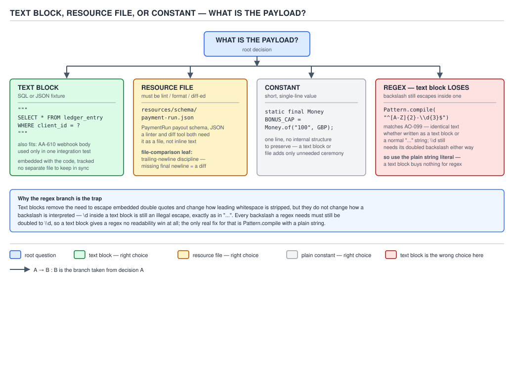

# 04 Modern Java — Text blocks — INTERMEDIATE (§2.11)

**Target version: Java 21 LTS.** | **Part 2 of 5** | [Index](../00-index.md)
Previous: [Text blocks — basics](01-basics.md) · Next: [Text blocks — internals compilation](03-internals-compilation.md)

## Where this file sits

The basics file covered the grammar: `"""`, incidental-whitespace stripping, `\`
line-continuation, `\s`. This file is about the decision a working engineer
actually makes several times a week — *should this payload be a text block at
all, and if it is, how do I not shoot myself with it.* Every leaf here is a
specific place a text block either earns its keep or quietly breaks something
that was working with an ordinary string.

---

## 2.11.1 — SQL in a text block, and why you still bind parameters

### Mental model first

A text block is a **compile-time string literal with different whitespace
rules**. It is not a query builder, not a prepared-statement API, and it has
zero awareness of what the runtime does with the resulting `String`. Picture it
as a stencil: you write the SQL exactly as it will appear when printed, and the
compiler hands you back a `String` object identical in every observable way to
one built with `+` concatenation or `String.format`. Whatever rule applied to
string-built SQL before Java 15 — "never interpolate a caller-supplied value
into the SQL text" — applies with exactly the same force to a text block, for
the same reason: **the database cannot tell where the string came from.**

### Why it exists

Before text blocks, embedding a multi-line `SELECT` in Java source meant one of:
string concatenation with `+` and manual `\n`, or `String.join("\n", ...)`
across an array of literals, or an external `.sql` file loaded as a classpath
resource. All three carry real friction — concatenated SQL is unreadable and
easy to get an escaped-quote wrong in; a `.sql` resource file means jumping
between two files to review one query, and a build step to make sure it ships
in the jar. JEP 378's stated motivation was exactly this: SQL, HTML, and JSON
are the three payloads explicitly named in the JEP as the reason text blocks
were worth adding to the language. The text block closes the gap between "SQL
readable to a DBA" and "Java source that compiles" without a new file, a new
build step, or a new dependency.

### When to reach for it, and when not

Reach for a text block when the query is short enough to read at a glance in
the calling method and does not need to be shared or hand-tuned by someone
without a Java toolchain. Reach instead for an external `.sql` resource file
(§2.11.8 covers the boundary) when the query is long enough that a DBA needs to
tune it independently, when the same query is shared across services in
different languages, or when it needs a dedicated diff history separate from
the Java class that happens to use it. The sibling that "wins" when the payload
is dynamic rather than parametrized is a query builder — jOOQ or the JPA
Criteria API — because a text block gives you no protection against building
SQL by string surgery at runtime; it only gives you a clean way to write a
**fixed** template.

### How it works

Mechanically nothing changes from an ordinary literal: the compiler strips
incidental whitespace (basics file, leaf 2.10.3) and hands the JDBC driver a
`String`. The driver's `PreparedStatement` machinery is what actually protects
you, and it protects you by a mechanism a text block plays no part in: the SQL
text is sent to the database **once**, with `?` placeholders still in place, and
compiled into an execution plan by the database's own parser; parameter values
are sent **afterward**, in a separate protocol message, and substituted by the
database engine into the already-parsed plan — never re-lexed as SQL text. This
is why a `?` placeholder is immune to injection and string concatenation is
not: injected SQL metacharacters in a bound parameter are just bytes of a
string value to the database, because they never pass through the SQL
tokenizer. Concatenating a value into the text block's `String` *before* it
reaches the driver puts that value through the tokenizer, indistinguishable
from code.

**[X-REF 09]** The JDBC `Connection.prepareStatement` / `PreparedStatement.setX`
contract is guide 09's territory (SQL databases) — this paragraph gives you
enough to answer "why do bind parameters stop injection" in an interview: the
SQL text and the parameter values travel to the database as two separate
things, and only the first one is ever parsed as SQL.

**[X-REF 13]** The web-security framing of "never build a query by
concatenating untrusted input" — OWASP's injection category, the historical
CVEs, defense-in-depth beyond parametrization (least-privilege DB accounts,
input validation as a second layer) — is guide 13's territory (web security).
The mechanism paragraph above is the part that is actually about text blocks;
the rest of that story does not change because the literal syntax changed.

Below the placeholder-safe version, immediately after the mechanism it embeds,
here is the diagram distinguishing when a text block is the right container at
all versus when a resource file or a constant wins:



**D-115** — Text block, resource file, or constant

### A minimal concrete example

The ledger-balance query — computing a client's four wallet buckets from
`LedgerEntry` rows, using the domain's real `Position` fields
(`CLIENT_CASH_AVAILABLE`, `CLIENT_BONUS_AVAILABLE`, and so on from §11 of the
scenario) and two bound parameters:

```java
private static final String LEDGER_BALANCE_SQL = """
        SELECT p.account_id,
               p.type            AS position_type,
               p.balance         AS balance,
               p.version         AS version
        FROM   position p
        WHERE  p.account_id = ?
          AND  p.type IN ('CLIENT_CASH_AVAILABLE',
                           'CLIENT_CASH_RESERVED',
                           'CLIENT_BONUS_AVAILABLE',
                           'CLIENT_BONUS_RESERVED')
        ORDER  BY p.type
        """;

public List<Position> loadWalletPositions(Connection connection, AccountId accountId)
        throws SQLException {
    try (PreparedStatement statement = connection.prepareStatement(LEDGER_BALANCE_SQL)) {
        statement.setObject(1, accountId.value());
        try (ResultSet resultSet = statement.executeQuery()) {
            List<Position> positions = new ArrayList<>();
            while (resultSet.next()) {
                positions.add(new Position(
                        accountId,
                        PositionType.valueOf(resultSet.getString("position_type")),
                        new Money(resultSet.getBigDecimal("balance"), Currency.getInstance("GBP")),
                        resultSet.getInt("version")));
            }
            return positions;
        }
    }
}
```

The `IN (...)` list above is a **fixed, compile-time-known set of four position
types** — not a caller-supplied list — which is exactly why it is safe to write
literally in the text block rather than parametrized. The single caller-varying
value, `accountId`, is the only `?` in the statement.

### The gotcha

**Pitfall:** the exact failure this leaf exists to prevent — reaching for
`.formatted(...)` on this same SQL text block because leaf 2.11.2 just showed
it working nicely for JSON fixtures, and using it to splice a client-supplied
filter value straight into the `WHERE` clause:

```java
// WRONG — text block + .formatted() building SQL from untrusted input
String search = request.getSearchTerm(); // attacker-controlled, e.g. "' OR '1'='1"
String sql = """
        SELECT * FROM position WHERE account_id = '%s'
        """.formatted(search);
statement.executeQuery(sql); // classic SQL injection, now dressed in triple quotes
```

```java
// RIGHT — the value is still a bind parameter, only the fixed template is a text block
String sql = """
        SELECT * FROM position WHERE account_id = ?
        """;
try (PreparedStatement ps = connection.prepareStatement(sql)) {
    ps.setString(1, request.getSearchTerm());
    ps.executeQuery();
}
```

**Why people believe it:** `.formatted()` on a text block *looks* identical in
shape to a parametrized query — a template with holes, filled at the call site
— and JEP 378's own JSON example (leaf 2.11.2 below) uses exactly that pattern
safely, because a JSON fixture's `%s` slots are test data, not SQL. The syntax
gives no visual signal that one substitution is safe and the other is a
vulnerability; only knowing *which side of the driver boundary* the
substitution happens on tells you.

**Interview:** "does using a text block for SQL change anything about
injection risk?" — no, and that "no" is the whole point: a text block is a
string literal with different whitespace handling, so every rule that applied
to concatenated or `String.format`-built SQL — bind, never splice — applies
unchanged. The only thing that changed is that the literal is now legible.

> **Definition:** a text block used for SQL is a fixed, readable template whose
> only caller-supplied content travels through `PreparedStatement` bind
> parameters, never through string substitution into the block itself.

---

## 2.11.2 — JSON fixtures in tests, with `.formatted(...)` for the varying parts

### Mental model first

Where SQL taught you where *not* to substitute, a test fixture is the mirror
case: it is data you generated, feeding a system under your control, so
substituting the parts that vary between test cases is exactly the intended
use of `.formatted(...)`. Picture the text block as a printed form with blank
lines, and `.formatted` as the pen filling in today's date and the claimant's
name — nobody is trying to defraud the form, so filling blanks is fine.

### Why it exists

Before text blocks, a JSON fixture embedded in a test method was either a
`.json` file under `src/test/resources` — one more file to open to understand
one test — or a `StringBuilder`/`+`-concatenated mess with every `"` in the
JSON payload doubled up as `\"`. JEP 378 names JSON explicitly as a target
payload alongside SQL and HTML. `.formatted(Object...)` — added to `String` in
the same JDK 15 release as the preview of text blocks, JDK 21 for
`String::formatted` being long-final by then — exists so the fixed shape of
the payload (the JSON structure) and its varying content (the field values for
this particular test case) can be separated without a templating library.

### When to reach for it, and when not

Reach for `.formatted` when the substitutions are few, the values are already
correctly typed and escaped for the destination format, and the fixture lives
next to the test that uses it. Reach instead for a proper (de)serialization
library call — building the fixture by constructing the actual DTO and letting
Jackson serialize it — when the JSON needs to stay in lockstep with a real
class's field renames, or when a value being substituted could itself contain
characters that need JSON escaping (a free-text string with an embedded quote,
for instance): `.formatted` performs **no escaping**, it is `String.format`
under a different entry point, so an unescaped substitution can silently
corrupt the JSON it is inserted into.

### How it works

`.formatted(args)` is precisely `String.format(this, args)` with the receiver
as the format string — no new formatting engine, no compile-time argument
checking, and the same `%s`/`%d`/`%.2f` conversion vocabulary `String.format`
has always had. A text block is just a `String`, so it inherits `.formatted`
like any other instance. The only interaction specific to text blocks is
visual: because `%` conversions sit inline in a block that is otherwise
formatted like the literal JSON document, the substitution points read as
"blanks in the form" rather than as a code expression breaking up prose,
which is the entire ergonomic win JEP 378 was chasing for this use case.

### A minimal concrete example

A `DEP-301 CAPTURED` webhook fixture — the card-deposit capture event from the
domain's `DEP-nnn` status family (§3.1 / §12 of the scenario) — with the
varying `accountId`, `amount`, and `idempotencyKey` filled per test case:

```java
private static final String DEPOSIT_CAPTURED_WEBHOOK = """
        {
          "eventType": "DEP-301",
          "eventStatus": "CAPTURED",
          "accountId": "%s",
          "amount": {
            "value": "%s",
            "currency": "GBP"
          },
          "idempotencyKey": "%s",
          "occurredAt": "%s"
        }
        """;

@Test
void capturedWebhookCreditsCashAvailable() {
    String payload = DEPOSIT_CAPTURED_WEBHOOK.formatted(
            "acc-77f2-4b91",
            "65.00",
            "dep-webhook-9a31c",
            "2026-08-30T09:14:22Z");

    PaymentIntentEvent event = objectMapper.readValue(payload, PaymentIntentEvent.class);

    assertThat(event.eventType()).isEqualTo("DEP-301");
    assertThat(event.amount().value()).isEqualByComparingTo("65.00");
}
```

Every value substituted here is a value the test itself generated — none of it
is attacker-controlled — which is exactly the property that made splicing safe
for §2.11.1's SQL example unsafe and makes it fine here.

### The gotcha

**Pitfall:** trusting `.formatted` to escape a substituted value that contains
a `"` or a `\`, because it never does:

```java
// WRONG — a free-text value containing a quote breaks the JSON
String note = "client said \"send it faster\"";
String payload = """
        { "note": "%s" }
        """.formatted(note); // produces invalid JSON: unescaped quotes inside the string
```

```java
// RIGHT — escape before substituting, or build the DTO and let the mapper serialize
String payload = """
        { "note": "%s" }
        """.formatted(note.replace("\"", "\\\""));

// better still, when the value is not a fixed test literal:
String payloadViaMapper = objectMapper.writeValueAsString(new NoteEvent(note));
```

**Why people believe it:** `.formatted` "looks like" a templating call, and
templating libraries (Mustache, Thymeleaf) auto-escape by default for their
target format, so engineers coming from those tools assume `String.formatted`
does the same. It does not — it is arithmetic-and-substring machinery with no
concept of JSON, HTML, or any other destination grammar.

**Interview:** "why is `.formatted` fine for a JSON test fixture but not for
building an HTML page from user input?" — because a test fixture's
substitutions are values the test controls and knows are well-formed for the
slot they fill, while HTML built from user input needs escaping the
substitution mechanism does not provide; the risk is identical in shape to
§2.11.1's SQL case, just against a different downstream parser.

> **Definition:** `.formatted(...)` on a text block is plain `String.format`
> with the block as the pattern — a convenient way to fill known-safe blanks in
> a fixed-shape payload, with zero awareness of the destination format's
> escaping rules.

---

## 2.11.3 — Regex in a text block: `\` is still an escape

**[TRAP]**

### Mental model first

A text block changes exactly one thing about escape processing relative to a
regular string literal: incidental whitespace handling and the meaning of a
line-ending `\`. It changes **nothing** about `\` as the general escape
character inside the text. A regex pattern is a string full of backslashes for
its *own* metacharacter escaping (`\d`, `\s`, `\.`), and Java's string-literal
escaping still runs first, unconditionally, before that string ever reaches
`Pattern.compile`. Picture two independent escape layers stacked on top of each
other — Java's literal-escape layer at compile time, then the regex engine's
metacharacter layer at `Pattern.compile` time — and a text block only ever
touches the first one, and only for whitespace.

### Why it exists

This leaf is not "text blocks add a feature for regex" — they add nothing here
— it exists because the *absence* of a difference is exactly where an engineer
who has half-internalized "text blocks are more literal" gets burned. JEP 378
never claimed backslash-as-escape goes away inside a text block; it only
relaxed which whitespace and line-ending sequences are significant. People
extrapolate the relaxation further than the spec grants it.

### When to reach for it, and when not

Reach for a text block for a regex when the pattern is long enough that
line breaks materially help readability — a multi-alternative pattern matching
several `StatusCode` shapes, for instance — and you are willing to keep every
backslash doubled. Do **not** reach for it, and prefer a plain `"..."`
single-line literal instead, when the pattern is short: `Pattern.compile("""
\\d{3}-\\d{3}""")` for a three-digit-dash-three-digit pattern gains nothing
over `Pattern.compile("\\d{3}-\\d{3}")` and costs three extra lines of
delimiter ceremony. This is the "regex where the text block loses" case named
in the syllabus: length is the only variable that ever tips the balance
regex's way, and it tips slowly.

### How it works

Both a text block and a normal `"..."` literal go through the same Java
Language Specification escape-sequence processing (JLS §3.10.6) before the
compiler ever produces a `String` constant: `\\` becomes one literal
backslash, `\d` (not a recognized Java escape) is a compile error, `\s` **is**
a recognized Java escape as of JDK 15 (space, JEP 378) that resolves to a
literal space character at *compile* time — which collides visually and
semantically with the regex engine's own `\s` (any whitespace character,
resolved at *pattern-compile* time). Writing a regex whitespace-class match
inside a text block therefore needs `\\s` for the regex engine to ever see a
backslash-s pair at all; a bare `\s` inside the text block is consumed by
Java's own literal processing into a single space character, and the regex
engine never sees an escape sequence.

The two-layer picture, worked through on a `StatusCode` pattern:

```
source text block:      \\d{3}-[A-Z]+
Java literal escaping:  \d{3}-[A-Z]+          (one backslash survives per \\)
regex engine sees:      \d{3}-[A-Z]+          (its own \d metaclass, one digit-class)
```

If you had written a single backslash (`\d{3}-[A-Z]+`) inside the text block
directly, `\d` is not a recognized Java escape sequence and the compiler
rejects the file outright with `illegal escape character` — this is one place
the compiler catches the mistake for you, loudly, rather than silently
misbehaving.

The one place it is **not** caught at compile time is exactly the `\s`
collision above, because `\s` *is* a legal Java escape (as of JEP 378) that
silently produces a space — no error, just the wrong regex.

### A minimal concrete example

A pattern matching the domain's numbered status-code shape `XX-Nnn` — two
letters, a dash, then a digit and two more characters, as described for
`AO-`/`AA-`/`DEP-`/`BDP-` codes in the scenario's status-code index:

```java
private static final Pattern STATUS_CODE_PATTERN = Pattern.compile("""
        ^(?<domain>[A-Z]{2,3})-(?<phase>\\d)(?<disposition>\\d)(?<variant>\\d)$\
        """);

public StatusCode parse(String raw) {
    Matcher matcher = STATUS_CODE_PATTERN.matcher(raw);
    if (!matcher.matches()) {
        throw new IllegalArgumentException("not a recognised status code: " + raw);
    }
    return new StatusCode(
            matcher.group("domain"),
            Integer.parseInt(matcher.group("phase")),
            Integer.parseInt(matcher.group("disposition")),
            Integer.parseInt(matcher.group("variant")));
}
```

Every `\d` in that pattern is written `\\d` — doubled — because the pattern
lives inside a text block (and would need doubling inside a normal `"..."`
literal too; this is not a text-block-specific tax, it is a **string-literal**
tax the syllabus phrasing correctly attributes to `\` remaining an escape). The
trailing `\` on the closing-quote line is the line-continuation escape from
the basics file (leaf 2.10.x) suppressing the final newline before `"""` —
included here because a trailing newline inside a compiled `Pattern` string
would silently make `$` anchor one line early against `Pattern.MULTILINE`
callers, though this particular pattern does not set that flag.

### The gotcha

**Pitfall:** believing a text block "relaxes" backslash handling the same way
it relaxed whitespace, and dropping the doubling:

```java
// WRONG — compile error, \d is not a legal Java escape sequence
Pattern p = Pattern.compile("""
        \d{3}-\d{3}
        """); // javac: illegal escape character
```

```java
// RIGHT — every regex backslash doubled, exactly as in a normal string literal
Pattern p = Pattern.compile("""
        \\d{3}-\\d{3}
        """);
```

A second, quieter version of the same pitfall — the `\s` collision that the
compiler will **not** catch:

```java
// WRONG — compiles, but matches a literal space, not "any whitespace"
Pattern p = Pattern.compile("""
        [A-Z]{2}-\s\d{3}
        """); // \s consumed by Java's own literal escaping into ' '

// RIGHT
Pattern p = Pattern.compile("""
        [A-Z]{2}-\\s\\d{3}
        """);
```

**Why people believe it:** JEP 378's headline feature — "no more escaping
inside a text block" — is true for quotes (`"` needs no escaping inside
`"""..."""` the way it does inside `"..."`) and largely true for whitespace.
The mental shortcut "text blocks don't need escaping" over-generalizes from
those two true cases to backslash itself, which was never part of the
relaxation.

**Interview:** "does a text block change how you write a regex?" — no, every
backslash in the pattern is still doubled exactly as in a normal string
literal; the only genuine risk unique to combining the two is `\s` being a
legal *Java* escape that silently swallows the backslash before the regex
engine ever sees it, so a regex whitespace class inside a text block that
compiles cleanly can still be silently wrong.

> **Definition:** a text block's escaping relaxation covers quotes and
> whitespace only; `\` remains the general Java escape character, so every
> regex metacharacter backslash is still doubled, and `\s` in particular is a
> legal Java escape that consumes itself before the regex engine runs.

---

## 2.11.4 — HTML, GraphQL and YAML payloads, and their indentation discipline

*(Supporting fact — no cost/performance claim distinct from the mechanism
already covered in the basics file, no sibling it is chosen against beyond what
§2.11.8 already covers, and it does not carry its own diagram; three beats.)*

**Mechanism:** all three formats are, like SQL and JSON, whitespace-significant
enough that hand-indented concatenated-string literals were painful before
text blocks — HTML for readability, GraphQL because query documents are
commonly reviewed as plain text in the same style as `.graphql` files, YAML
because YAML's *grammar itself* uses indentation to encode structure. The
indentation discipline is the same rule from the basics file (leftmost
non-blank line, including the closing `"""` line, sets the common prefix
stripped from every line) applied at the point where it actually bites: for
YAML specifically, the closing `"""` delimiter's column becomes part of the
grammar you are authoring, not just cosmetic — put it one column left of your
intended base indentation and every line in the block loses a level of nesting
it needed.

```java
String bonusRuleYaml = """
        rule: first-deposit-bonus
        eligibility:
          firstDepositOnly: true
          couponRequired: true
          couponValidityDays: 14
        grant:
          percentOfDeposit: 10
          cap: 100.00
        """;
```

Moving the closing `"""` in the snippet above one column to the left would
strip one fewer leading space from every line, silently promoting
`eligibility:`'s children (`firstDepositOnly`, `couponRequired`,
`couponValidityDays`) out from under it in the parsed YAML — a defect a Java
compiler has no way to flag, because the result is still a syntactically valid
`String`.

**Gotcha:** HTML and GraphQL do not enforce indentation as grammar the way
YAML does, so a shifted closing delimiter there produces ugly-but-correct
output; YAML is the one of the three where the same mistake is a silent
correctness bug, not a cosmetic one. This is the specific reason the YAML case
deserves a second look every time, even though the underlying mechanism
(leaf 2.10.3 in the basics file) is identical across all three formats.

> **Definition:** HTML, GraphQL, and YAML payloads use exactly the basics
> file's incidental-whitespace-stripping mechanism; YAML is the one format
> among the three where getting the closing delimiter's column wrong changes
> the payload's meaning rather than just its appearance.

---

## 2.11.5 — Trailing-newline discipline against a file's contents

**[TRAP]**

### Mental model first

A text block is not "the file's contents without escaping" — it is a string
literal whose trailing-newline presence is controlled by one specific
authoring choice: whether the last line of content and the closing `"""`
share a line. Picture the closing delimiter as a light switch for exactly one
character: put it on its own line, and the text block ends with `\n`; put it
immediately after the last content character, and it does not. Comparing that
string against a file read with `Files.readString` — which preserves whatever
trailing newline the file itself has, or lacks — is where the mismatch bites.

### Why it exists

This is a `[TRAP]` leaf, not a feature: text blocks did not introduce trailing
newlines as a concept, but they made writing multi-line literal content so
natural that engineers reach for a text block to hold "what a golden file
should look like" and then compare it directly against `Files.readString(path)`
in a test, discovering only at CI time that one has a trailing newline and the
other does not.

### When to reach for it, and when not

The discipline question is really "which of the two forms do you want", and
the answer depends on what produced the file being compared against. Text
files created by most editors and by `git` conventions end in exactly one
trailing newline (POSIX defines a text file as a sequence of lines, each
*terminated* by a newline, so a file with no trailing newline is, strictly, not
a well-formed line at the end). A golden-file fixture built to compare against
such a file should therefore put its closing `"""` on its own line, matching.
A fixture meant to represent a value with no imposed trailing newline — the
contents of a single JSON field, an in-memory string being compared against
another in-memory string that was itself built without a trailing newline —
should keep the closing `"""` on the last content line instead.

### How it works

The compiler's own algorithm, restated precisely for this leaf's purpose: the
last line of a text block's source **is** significant to the resulting string
content whenever it contains non-whitespace content before the closing `"""`.
Only when the closing delimiter sits alone on its own line does the text block
end with a `\n` after the last content line's characters; put the delimiter
immediately after the last character, and there is no trailing `\n` in the
resulting `String` at all.

```
"""
line one
line two
"""          →  "line one\nline two\n"   (closing delimiter on its own line: trailing \n present)

"""
line one
line two"""  →  "line one\nline two"     (closing delimiter shares the line: no trailing \n)
```

`Files.readString(Path)` (java.nio.file, since Java 11) returns the file's
bytes decoded as UTF-8 with **no normalization of a trailing newline at all**
— whatever bytes are on disk are what comes back, verbatim. A golden file
saved by any standard editor with "insert final newline" enabled (the common
default) will therefore have a `\n` at the end that a text block written with
the closing `"""` sharing the last content line will not have, and the
comparison fails on a difference invisible in most diff viewers and in the
IDE's own text-block rendering.

### A minimal concrete example

Comparing a generated `PaymentRun` reconciliation report against a checked-in
golden file:

```java
@Test
void reconciliationReportMatchesGoldenFile() throws IOException {
    String expected = """
            PaymentRun run-2026-08-30-01
            items: 7000
            totalAmount: 260.00
            state: SUBMITTED
            """;                                    // closing """ alone -> trailing \n present

    Path goldenFile = Path.of("src/test/resources/reconciliation/run-2026-08-30-01.txt");
    String actual = Files.readString(goldenFile);   // includes disk's trailing \n, if any

    assertThat(actual).isEqualTo(expected);
}
```

If `run-2026-08-30-01.txt` on disk was saved by a tool that strips the final
newline, this assertion fails with a diff that most terminals render as
identical text — the only difference is one invisible `\n` at the very end.

### The gotcha

**Pitfall:** assuming the text block and the file "obviously" match because
the visible characters are identical:

```java
// WRONG — closing """ placement silently disagrees with the file's actual trailing newline
String expected = """
        PaymentRun run-2026-08-30-01
        state: SUBMITTED""";                 // no trailing \n in this literal

String actual = Files.readString(goldenFile); // file on disk DOES end with \n
assertThat(actual).isEqualTo(expected);       // fails: "...SUBMITTED\n" vs "...SUBMITTED"
```

```java
// RIGHT — normalize explicitly, so the comparison is about content, not incidental formatting
String actual = Files.readString(goldenFile).stripTrailing();
String expected = """
        PaymentRun run-2026-08-30-01
        state: SUBMITTED""".stripTrailing();
assertThat(actual).isEqualTo(expected);

// or, equally right: make both sides deliberately keep exactly one trailing \n
// by putting the closing """ on its own line in the text block, and confirming
// the golden file was saved with a final newline.
```

**Why people believe it:** most terminals, diff tools, and IDE preview panes
render a trailing newline as *nothing visible at all* — there is no glyph for
"file ends here versus file ends one line later." The only place the
difference becomes visible is a byte-for-byte `String.equals`, which is
exactly what a golden-file assertion does.

**Interview:** "you compare a text block against a file's contents in a test
and it fails even though they look identical — why?" — one of the two has a
trailing newline the other lacks, almost always because the text block's
closing `"""` placement was chosen for readability rather than deliberately
matched to the file's actual trailing-newline convention; the fix is to
normalize both sides with `.stripTrailing()` (or a full-diff assertion library)
rather than relying on eyeballing.

> **Definition:** a text block's trailing newline is controlled entirely by
> whether the closing `"""` shares the last content line or sits alone on its
> own line, and that choice must be made deliberately whenever the block is
> compared against a file read with `Files.readString`, which preserves
> whatever the file on disk actually has.

---

## 2.11.6 — Text blocks in annotations and `case` labels

*(Supporting fact — an API-shape fact with a real gotcha, no sibling to choose
between, no diagram; three beats.)*

**Mechanism:** a text block is a **constant expression** exactly when every
requirement JLS §15.29 imposes on constant expressions is met — no runtime
interpolation, no method calls, nothing but literal text and (as of the
whitespace-stripping happening entirely at compile time) the fully-resolved
final string content. That makes it legal everywhere the language demands a
compile-time constant: an annotation element value, and a `case` label in a
`switch` over `String`. `.formatted(...)` breaks this immediately — the moment
a text block is combined with a method call, it stops being a constant
expression and both uses become compile errors.

```java
public @interface AuditedQuery {
    String sql() default """
            SELECT id FROM position WHERE account_id = ?
            """;
}

static String classify(String statusCode) {
    return switch (statusCode) {
        case """
                AA-801""" -> "activated";
        case """
                AA-900""" -> "declined";
        default -> "other";
    };
}
```

The `case` example above is deliberately shown in its legal-but-unidiomatic
form — a single-line value wrapped in a text block gains nothing and costs
three lines of delimiter ceremony, which is precisely §2.11.8's "when a text
block is worse than a shorter alternative" argument turned inward: nobody
should actually write the `switch` this way; a plain `case "AA-801" ->` is
strictly better for a single short token. The construct is legal, not
recommended.

**Gotcha:** the constant-expression requirement is exactly why `.formatted`,
concatenation with a non-constant `String`, or any method call inside the text
block's usage site fails to compile in either position — `default = """
%s""".formatted(x)` is not a constant expression no matter how it is
formatted, because `.formatted` is a runtime method invocation.

```java
// WRONG — does not compile: annotation element values must be constant expressions
public @interface AuditedQuery {
    String sql() default """
            SELECT id FROM position WHERE account_id = ?
            """.formatted(); // error: element value must be a constant expression
}
```

> **Definition:** a text block containing only literal content is a
> compile-time constant expression under JLS §15.29, and is therefore legal
> anywhere the language requires one — an annotation element's default value,
> or a `case` label in a `String` switch — but loses that status the instant
> it is combined with any runtime call, including `.formatted`.

---

## 2.11.7 — No interpolation in Java 21, and its withdrawn preview

**[VERSION-TRAP]** **[RESEARCH]**

### Mental model first

Java 21's text block is a **template with no engine** — the `"""..."""`
delimiters change lexing and whitespace rules, nothing more. Every language
with "string interpolation" (Kotlin's `$name`, JavaScript's `` `${expr}` ``,
Python's f-strings) compiles a hole-filling expression *into* the literal at
the source-text level; Java 21 has no comparable syntax anywhere in the
language, text block or otherwise. The three real tools available on Java 21
are `.formatted(Object...)` (positional, `%s`-style, seen in §2.11.2),
`MessageFormat.format` (positional with `{0}`, locale-aware, older and
heavier), and hand-rolled concatenation. None of them let the interpolated
expression sit inside the string text the way `${expr}` does.

### Why it exists — or rather, why it does not, yet

**[RESEARCH]** verified against the JEP index and the JDK 21/22/23 release
notes: JEP 430 (**Preview**, JDK 21) and JEP 459 (Second Preview, JDK 22)
introduced **string templates** — `STR."Balance for \{accountId} is
\{amount}"` — as exactly the interpolation mechanism Java had never had. Both
were preview features requiring `--enable-preview`; neither shipped as a
final, non-preview feature at any point. JEP 465 (JDK 23) is titled
**"Withdrawn"** in the JEP index and states the feature was withdrawn from
JDK 23 "in order to allow more time for evaluation" of the design, based on
feedback that the `StringTemplate` API surface (`STR`, `FMT`, and
`StringTemplate.Processor`) needed more work before becoming permanent. As of
this writing there is no successor JEP that has re-proposed string templates
for a later release with a fixed target. This is exactly the version story
this file's target version demands stating in full: previewed in two
consecutive releases, then formally withdrawn, not merely delayed to a named
future release.

**Unverified:** whether string templates (or a successor design) will
reappear in a future JDK release is not something the JEP index or release
notes state — JEP 465 records withdrawal, not a replacement roadmap. Treat any
claim of a specific future release as unconfirmed until a new JEP targets one.

### When to reach for what — Java 21's real options

| Mechanism | Interpolation syntax | Availability on 21 | Escaping behaviour |
|---|---|---|---|
| String templates (`STR."..."`) | `\{expr}` inline in the literal | **Preview only**, `--enable-preview`, withdrawn at JDK 23 | Processor-defined; `STR` performs no escaping |
| `.formatted(Object...)` | Positional `%s`/`%d`/... placeholders, values passed separately | Final, no flag needed | None — caller's responsibility |
| `MessageFormat.format` | Positional `{0}`, `{1}`, locale-sensitive | Final, `java.text`, pre-dates Java 5 | Locale-aware number/date formatting; still no output escaping |
| String concatenation (`+`) | None — build the string by hand | Final, always available | None |

Reach for `.formatted` for the common case — a handful of positional
substitutions into a fixed template, as in §2.11.2's fixture. Reach for
`MessageFormat` specifically when the substituted values need locale-sensitive
number or date formatting baked in (a report destined for a locale-aware UI),
which `.formatted`'s `%s` does not provide unless you format the value
yourself first. Do not reach for string templates on Java 21 in anything
meant to ship: the feature requires `--enable-preview` (meaning the class file
is marked preview and refuses to run on a standard, non-preview JVM of the
same version) and was subsequently withdrawn, so code depending on it has no
forward migration guarantee.

### How it works — what "no interpolation" actually means mechanically

Java's compiler never looks *inside* a string literal's characters for
expressions to evaluate — not in a plain `"..."` literal, and not in a text
block. Every substitution mechanism Java 21 actually has works by keeping the
template and the values as **separate compiler inputs**: `.formatted(args)`
passes `args` as a distinct method-call argument list; `MessageFormat.format`
does the same. What string templates would have changed, mechanically, is
letting the compiler desugar `\{accountId}` *inside* the literal into an
argument to a processor's `process` method — moving the substitution site
into the literal's own text is precisely the feature that got withdrawn.

```java
// The shape string templates would have had (JEP 430/459, PREVIEW ONLY on 21/22,
// requires --enable-preview; withdrawn at JDK 23 — do not ship this):
Money amount = new Money(new BigDecimal("65.00"), Currency.getInstance("GBP"));
AccountId accountId = new AccountId(UUID.fromString("77f2c4a1-0000-4000-8000-000000000001"));
String message = STR."Deposit of \{amount} captured for account \{accountId}";
```

### A minimal concrete example — the Java 21 way to do the same thing

```java
public String depositCapturedMessage(AccountId accountId, Money amount) {
    return "Deposit of %s captured for account %s".formatted(amount, accountId);
}

public String depositCapturedMessageLocaleAware(AccountId accountId, Money amount, Locale locale) {
    MessageFormat format = new MessageFormat(
            "Deposit of {0,number,currency} captured for account {1}", locale);
    return format.format(new Object[] { amount.amount(), accountId.value() });
}
```

Neither of these needs a preview flag, neither depends on a withdrawn feature,
and both are stable choices for shipping code on Java 21.

### The gotcha

**Pitfall:** writing `STR."..."` from a blog post or an LLM trained on
post-JEP-430 material and expecting it to compile with a plain `javac`:

```java
// WRONG on a standard Java 21 build — does not compile without --enable-preview,
// and produces preview-marked class files that only run with --enable-preview even then
String message = STR."Balance: \{balance}"; // error: string templates are a preview feature
```

```java
// RIGHT — no flag needed, ships normally
String message = "Balance: %s".formatted(balance);
```

**Why people believe it:** string templates were real, working, documented
preview features across two JDK releases (21 and 22) with their own JEPs,
official examples, and tooling support — the syntax is not a hallucination,
it existed and compiled with the right flag. What training material and blog
posts from that window frequently omit is the subsequent withdrawal at
JDK 23, so material written or trained during the preview window states the
feature as settled when it was provisional, and material trained after
withdrawal without noticing JEP 465 repeats the same mistake in the other
direction — presenting a withdrawn feature as still on track.

**Interview:** "how do you interpolate a value into a string in modern Java?"
— there is no interpolation syntax in Java 21; the two real options are
`.formatted(Object...)` for positional `%s`-style substitution and
`MessageFormat` for locale-aware formatting, and if the interviewer is
testing currency, the correct follow-up is naming that string templates were
previewed in JDK 21/22 (JEP 430, JEP 459) and formally withdrawn at JDK 23
(JEP 465) rather than shipped.

> **Definition:** Java 21 has no string-interpolation syntax; text blocks
> supply the multi-line literal, and `.formatted` or `MessageFormat` supply
> the substitution, with true inline interpolation (string templates, JEP 430
> and JEP 459) having existed only as a preview across JDK 21–22 before being
> withdrawn in JDK 23 (JEP 465).

---

## 2.11.8 — When a text block is worse than a resource file

### Mental model first

A text block lives inside a `.class` file as a `String` constant, indexed like
any other literal — invisible to every tool that is not a JVM. Picture the
choice as "does anything other than this Java process need to open this
payload" — the moment the answer is yes, the payload belongs in a file that
tool can actually open, and the text block becomes the wrong container no
matter how well it reads inside the `.java` file.

### Why it exists

JEP 378 optimized specifically for **readability inside Java source** — SQL,
JSON, and HTML that a Java developer reads while reading the surrounding
method. It was never a proposal to eliminate resource files, and treating every
multi-line payload as a text-block candidate ignores the tooling cost: a
payload embedded in a `.class` file cannot be linted by `sqlfluff`, formatted
by `prettier`, schema-validated by a JSON Schema tool in CI, diffed
meaningfully across versions by a DBA who does not read Java, or edited by a
non-engineer without a Java toolchain and a rebuild.

### When to reach for it, and when not — the actual decision

Reach for a text block when the payload is short, changes at the same cadence
as the Java code around it, and is read only by the Java process holding it.
Reach for a resource file (loaded via `Class::getResourceAsStream` or a
classpath-scanning config mechanism) instead when any of these hold: the
payload is long enough that a dedicated linter or formatter earns its keep;
the payload is maintained by someone without a Java build; the payload needs
its own diff history independent of the surrounding Java refactors; or a
non-Java tool in the pipeline (a CI schema validator, a DBA's SQL formatter, an
API-contract diff tool) needs to open it directly. This is the same axis
§2.11.1 and §2.11.4 already gestured at — length and audience — made explicit
as the file's closing decision point.

### How it works

Mechanically the two options differ in exactly one way that matters for this
decision: a text block is resolved at **compile time**, baked into the
constant pool, requiring a recompile to change; a resource file is resolved at
**run time** (or at worst, at packaging time), loadable, lintable, and
diffable independent of the Java build. Everything else — that both eventually
become an in-memory `String` inside the JVM — is identical.

The decision, worked as a tree, immediately follows because this is precisely
the point the diagram addresses:


**D-115** — Text block, resource file, or constant

### A minimal concrete example

The `PaymentRun` bank-file **format specification** — a payload the banking
partner's own tooling validates independently of anything Java does with it
(§B / §12 of the scenario names the payout file and its four daily windows) —
is the resource-file case, contrasted directly against the ledger-balance
query from §2.11.1, which stayed a text block:

```java
// Stays a text block: short, changes with the Java code, read only by this service.
private static final String LEDGER_BALANCE_SQL = """
        SELECT p.type, p.balance FROM position p WHERE p.account_id = ?
        """;

// Becomes a resource file: the banking partner's own validator needs to open
// this file directly, and it changes on the partner's schedule, not this service's.
public String loadBankFileTemplate() throws IOException {
    try (InputStream stream = getClass().getResourceAsStream(
            "/bank-file-templates/payment-run-v3.template")) {
        if (stream == null) {
            throw new IllegalStateException("payment-run-v3.template missing from classpath");
        }
        return new String(stream.readAllBytes(), StandardCharsets.UTF_8);
    }
}
```

### The gotcha

**Pitfall:** embedding a payload that a non-Java stakeholder needs to edit
directly as a text block anyway, because "it's just a string block, why not":

```java
// WRONG — the banking partner's ops team cannot review or amend this without
// a Java IDE, a rebuild, and a deploy, for a payload that is contractually theirs to sign off
private static final String BANK_FILE_TEMPLATE = """
        HEADER|{runId}|{fileDate}|GBP
        DETAIL|{accountRef}|{amount}|{narrative}
        TRAILER|{itemCount}|{totalAmount}
        """; // every schema tweak now requires a Java PR
```

```java
// RIGHT — the same content, in a file the partner's own tooling and reviewers can reach
// src/main/resources/bank-file-templates/payment-run-v3.template
// (loaded via getResourceAsStream, as above)
```

**Why people believe it:** a text block's readability win is genuinely real
for the *Java developer* reading the surrounding method, and that local win is
easy to mistake for a global one — it feels like a strict improvement over the
pre-JEP-378 alternative of ugly concatenation, without weighing the cost to
everyone who is not reading that Java method.

**Interview:** "when would you *not* use a text block for a multi-line
payload?" — when a non-Java tool or non-Java stakeholder needs to lint,
format, diff, or edit that payload independently of the Java build; the
compile-time-baked nature of a text block that makes it convenient for the
Java developer is precisely what makes it inconvenient for everyone else.

> **Definition:** a text block trades run-time file flexibility for
> compile-time, in-source readability; once any external tool or non-Java
> stakeholder needs to reach the payload directly, that trade stops paying off
> and a resource file is the better container.

---

## Pitfalls

### Assuming a text block is safe to splice caller-supplied SQL into

**Wrong**
```java
String sql = """
        SELECT * FROM position WHERE account_id = '%s'
        """.formatted(request.getSearchTerm());
statement.executeQuery(sql);
```
Output when `request.getSearchTerm()` is `' OR '1'='1`: every row in the
`position` table is returned, bypassing the intended filter entirely.

**Right**
```java
String sql = """
        SELECT * FROM position WHERE account_id = ?
        """;
try (PreparedStatement ps = connection.prepareStatement(sql)) {
    ps.setString(1, request.getSearchTerm());
    ps.executeQuery();
}
```
The value never re-enters the SQL tokenizer; the database receives it as a
bound parameter, not as text to parse.

**Why people believe it:** the triple-quote syntax reads as "modern, safer
Java," and JEP 378's own JSON-fixture examples use `.formatted` safely on
test-controlled values, blurring the line for a reader who has not separated
"whose data is this" from "what does the syntax look like."

### Regex inside a text block with un-doubled backslashes

**Wrong**
```java
Pattern p = Pattern.compile("""
        \d{3}-\d{3}
        """);
```
Output: `error: illegal escape character` at compile time — or, worse, for the
`\s` case specifically, a silent compile that matches a literal space instead
of any whitespace character.

**Right**
```java
Pattern p = Pattern.compile("""
        \\d{3}-\\d{3}
        """);
```

**Why people believe it:** JEP 378's genuinely true claim that quotes and
whitespace need less escaping inside a text block gets over-generalized to
"backslash needs less escaping too," which was never part of the change.

### Comparing a text block against a golden file without normalizing trailing newlines

**Wrong**
```java
String expected = """
        state: SUBMITTED""";                  // no trailing \n
String actual = Files.readString(goldenFile); // file has a trailing \n
assertThat(actual).isEqualTo(expected);        // fails on an invisible difference
```

**Right**
```java
assertThat(Files.readString(goldenFile).stripTrailing())
        .isEqualTo(expected.stripTrailing());
```

**Why people believe it:** a trailing newline renders as nothing in every
terminal, diff pane, and IDE preview an engineer normally looks at; only a
byte-exact `String.equals` — exactly what a golden-file test performs —
exposes it.

### Reaching for `STR."..."` string-template syntax on a standard Java 21 build

**Wrong**
```java
String message = STR."Deposit of \{amount} captured"; // error without --enable-preview,
                                                        // and the feature was withdrawn at JDK 23
```

**Right**
```java
String message = "Deposit of %s captured".formatted(amount);
```

**Why people believe it:** string templates were a real, working preview
feature across JDK 21 and 22 with their own JEPs and documentation; material
written or trained during that window states them as an arriving feature, and
frequently predates or omits their withdrawal in JDK 23 (JEP 465).

---

## Cheat sheet

| Situation | Right tool | Wrong tool / trap |
|---|---|---|
| SQL with caller-supplied values | Text block template + `PreparedStatement` bind (`?`) | `.formatted()`/concatenation splicing the value into the SQL text |
| JSON test fixture, test-controlled values | Text block + `.formatted(...)` | Same pattern with untrusted input — `.formatted` never escapes |
| Regex pattern in a text block | Every `\` doubled, exactly as in `"..."` | Assuming text-block escape relaxation covers `\` — it covers only quotes/whitespace |
| YAML payload in a text block | Closing `"""` column matches intended base indent | Shifting the closing delimiter — silently changes YAML nesting |
| Comparing a text block to a file's contents | `.stripTrailing()` both sides, or match trailing-`\n` deliberately | Assuming visually-identical means byte-identical |
| Constant needed in an annotation default or `case` label | Plain literal text block (no `.formatted`) | Any text block combined with a method call — not a constant expression |
| Interpolating a value into a Java 21 string | `.formatted(Object...)` or `MessageFormat.format` | `STR."\{expr}"` — preview-only in 21/22, withdrawn at JDK 23 (JEP 465) |
| Payload another tool must lint/format/diff | Classpath resource file, loaded at runtime | Text block — compile-time-baked, invisible to non-JVM tooling |
| Short single-line value | Plain `"..."` literal | Text block wrapping one short line — pure ceremony |

---

## Self-test

**Q1.** Why does binding `accountId` as a `PreparedStatement` parameter stop
SQL injection, when writing the same value into the text block via
`.formatted()` does not?

<details><summary>Answer</summary>

The SQL text is sent to the database once and parsed into an execution plan
with the `?` placeholder still in place. Parameter values travel afterward, in
a separate protocol message, and are substituted directly into the already-
parsed plan — they never pass through the SQL tokenizer, so injected
metacharacters are just bytes of a value. `.formatted()` performs the
substitution in Java, before the driver ever sees the string, so the injected
value is indistinguishable from code by the time the database's parser runs.

</details>

**Q2.** `Pattern.compile("""\s\d""")` inside a text block compiles cleanly but
does not do what its author intended. What does it actually match, and why?

<details><summary>Answer</summary>

It matches a literal space followed by any digit — not "any whitespace
character followed by a digit." `\s` is a legal *Java* string-literal escape
(added alongside text blocks in JEP 378) that resolves to a single space
character at compile time, before the regex engine ever sees the string. The
regex engine never receives a backslash-s pair, so its own `\s` metaclass
(any whitespace) never comes into play. The fix is `\\s`, which survives
Java's literal escaping as a literal backslash followed by `s`, giving the
regex engine the pair it needs.

</details>

**Q3.** Two `assertThat(actual).isEqualTo(expected)` calls compare a text
block against `Files.readString(goldenFile)` and fail even though the values
look identical when printed. What is the most likely cause, and how do you
fix it without changing what the test is actually checking?

<details><summary>Answer</summary>

A trailing-newline mismatch: the text block's closing `"""` placement (on its
own line versus sharing the last content line) controls whether the literal
ends with `\n`, and `Files.readString` preserves whatever the file on disk
actually has, with no normalization. The fix is to call `.stripTrailing()` on
both sides before comparing, or to deliberately match the delimiter placement
to the file's real trailing-newline convention — not to eyeball the printed
output, since trailing newlines render invisibly everywhere.

</details>

**Q4.** Why is a text block legal as a `case` label in a `switch (statusCode)`
statement, but `case """AA-%s""".formatted(suffix) ->` is not?

<details><summary>Answer</summary>

A `case` label over `String` requires a compile-time constant expression under
JLS §15.29. A text block containing only literal text (no interpolation
syntax exists in Java to break that) satisfies the constant-expression
requirement, exactly as a plain string literal would. The moment `.formatted`
is called, the expression involves a runtime method invocation, which is never
a constant expression regardless of what produces the arguments — so it fails
to compile in that position.

</details>

**Q5.** A teammate writes `STR."Deposit \{amount} captured"` after reading a
2024 tutorial and it fails to compile on the team's Java 21 toolchain even
with no typos. What two facts explain both why the syntax exists at all and
why it fails here?

<details><summary>Answer</summary>

String templates (`STR."..."`) were real: JEP 430 previewed them in JDK 21 and
JEP 459 gave a second preview in JDK 22, both requiring `--enable-preview` to
compile or run at all. They were never finalized — JEP 465 formally withdrew
the feature in JDK 23 "to allow more time for evaluation." So the syntax
existed and was documented, but even at its most available (JDK 21/22) it
needed an explicit preview flag, and the team's standard (non-preview) Java 21
build rejects it outright with no flag set.

</details>

**Q6.** Why does the ledger-balance query in §2.11.1 stay a text block while
the `PaymentRun` bank-file template in §2.11.8 moves to a resource file, given
that both are multi-line, structured text payloads?

<details><summary>Answer</summary>

The deciding axis is audience and change cadence, not payload shape. The
ledger-balance query is short, changes at the same pace as the Java method
around it, and is read only by the Java process executing it — a text block
optimizes exactly that case. The bank-file template is a payload the banking
partner's own tooling and reviewers must open, lint, and sign off on
independently of this service's Java build; baking it into a `.class` file
would force every schema tweak through a Java PR and deploy, which is the cost
a resource file avoids.

</details>

**Q7.** What specifically breaks if the closing `"""` in a YAML text block is
shifted one column to the left of where the author intended, and why does the
same mistake in an HTML text block only look ugly rather than break anything?

<details><summary>Answer</summary>

The closing `"""` line's indentation sets the common leading-whitespace prefix
the compiler strips from every line in the block. Shifting it one column left
strips one fewer space from every line, which for YAML changes the payload's
actual grammar — a value that should nest one level under its parent
key gets promoted out from under it, because YAML's structure is indentation
itself. HTML has no equivalent indentation-as-grammar rule, so the same
one-column shift produces HTML with different (but still syntactically valid
and equivalently rendered) whitespace — cosmetically off, not structurally
broken.

</details>

**Q8.** Why does `.formatted()` being safe for the JSON fixture in §2.11.2 not
imply it is safe for building HTML from user-submitted profile text?

<details><summary>Answer</summary>

`.formatted()` performs zero escaping for any destination format — it is
`String.format` under a different name. It was safe for the JSON fixture only
because every substituted value there was test-generated and known to be
well-formed for its slot, not because `.formatted` understands JSON syntax.
Building HTML from user-submitted text requires HTML-specific escaping (of
`<`, `>`, `&`, quotes) that `.formatted` never performs, so an unescaped
substitution there can inject markup or script content — the same class of
risk as SQL injection in §2.11.1, against a different parser.

</details>

## Deferred

None.

## Open questions

- **Unverified:** whether a successor to string templates (JEP 430/459) has
  been proposed with a fixed target release beyond JDK 23's withdrawal (JEP
  465). The JEP index and the JDK 23 release notes record the withdrawal but
  do not commit to a specific future re-proposal; confirming this would need
  checking the OpenJDK Amber project's current JEP list for a new proposal
  number at the time of reading.

---

**Leaves covered:** 2.11.1–2.11.8 (8 leaves)
**Leaves deferred:** none
**Diagrams included:** D-115
**Target version:** Java 21 LTS
**Lines:** 1266
