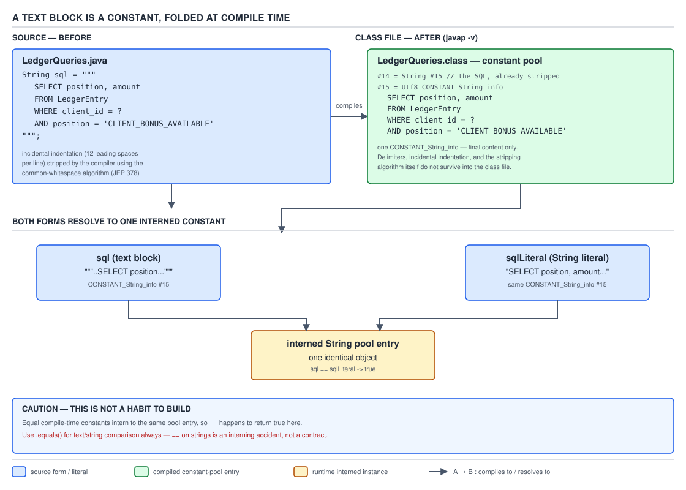

# 04 Modern Java — Text blocks — INTERNALS (§3.13)

**Target version: Java 21 LTS.** | **Part 3 of 5** | [Index](../00-index.md)
Previous: [Text blocks — in practice](02-in-practice.md) · Next: [Virtual threads — basics](../virtual-threads/01-basics.md)

Text blocks finalized in Java 15 (JEP 378), after previews in Java 13 (JEP 355) and Java 14
(JEP 368). Everything below targets the Java 21 class-file shape as it exists at the
**jdk-21+35** tag, and every source excerpt, `javap` listing, and program output below was
produced on this machine with `javac --release 21` / `java --release 21`, not recalled — see the
per-example note where each was run.

This file is about the *machinery* the compiler runs on a text block's source text, not how to
write one. If you have not read [Text blocks — in practice](02-in-practice.md) yet, the beats
below assume you already know the surface syntax: the `"""` delimiter, that the line after the
opening delimiter is never content, and that a text block can embed literal quotes without
escaping.

The whole story of this file is one sentence, and every leaf below is either proving it or
qualifying it: **a text block is erased entirely by `javac`.** By the time a class file exists,
there is no algorithm, no delimiter, no indentation logic anywhere in it — only a plain
`CONSTANT_String_info`, indistinguishable from one produced by an ordinary `"..."` literal with
the same final characters. Everything from "how is the content computed" to "why does `==` work"
falls out of that one fact.

## What this file covers

Four mechanisms, in the order a reader needs them — first the destination (what the compiler
produces and what that buys you), then the process that gets there:

| # | Mechanism | Where it lives | Diagram |
|---|---|---|---|
| 1 | Text block → `CONSTANT_String_info`, folding, and `==` | constant pool, `javac` constant folding | D-158 |
| 2 | The three-step transformation, in the order the JLS fixes it | `javac`'s parser/lowering phase | — (X-REF 03 touches interning only) |
| 3 | The minimal-indent computation, exactly | the second of the three steps | — |
| 4 | `String.stripIndent()` as the named runtime sibling | `java.lang.String`, called by ordinary code | — |

One supporting fact sits underneath mechanism 2: escape-sequence interpretation
(`String.translateEscapes()`, the third step) gets three lines, not eight — it has no tradeoff, no
sibling to choose between, and no diagram; it is "the same escapes as a regular string literal,
applied last so `\n` in your text block still means newline and not part of the indentation
computation."

Every worked example below is the ledger query QuizStakes' `FundsLedger` service runs to price a
client's stakeable balance — a `SELECT` over `CLIENT_CASH_AVAILABLE` and `CLIENT_BONUS_AVAILABLE`
(§11, Funds & Ledger Model) — because a multi-line SQL string is the canonical, everyday reason
anyone reaches for a text block in the first place, and because its exact indentation is what
mechanism 3 needs to be provable rather than asserted.

---

### Text block → `CONSTANT_String_info`, folding, and `==`

**Mental model.** Forget that `"""` exists once the class file is written. A text block is not a
special *kind* of string at runtime — it is a compile-time recipe that `javac` executes once,
during compilation, to produce an ordinary sequence of characters, which then goes through the
exact same "is this string a compile-time constant expression" machinery that a plain string
literal goes through (JLS §15.28, constant expressions). The two entry points — `"""..."""` and
`"..."` — converge on one instruction before the class file is even assembled: emit one
`CONSTANT_String_info` entry naming this exact sequence of characters, and reuse it if the pool
already has one with the same content.

**Why it exists.** Before text blocks, a multi-line SQL string, JSON payload, or HTML fragment was
either one line with `\n` escapes sprinkled through it (unreadable) or a `String.join("\n", ...)`
/ `+`-concatenation chain built from several literals (readable-ish, but each fragment is a
*separate* compile-time constant, concatenated at either compile time — if every operand is
itself constant — or, more often in practice, at class-init time via a `StringBuilder`). JEP 378's
stated design goal was that the embedded content should be able to "read as clearly as if it were
a data file" while still compiling down to the same thing a hand-written literal would: a single
constant, foldable, internable, comparable by identity if you already know its provenance. Text
blocks do not add a new runtime string type to buy that readability — they add a compile-time
front end that still targets the string-literal back end that already existed.

**When to reach for it, and when not.** Reach for a text block whenever the content is multi-line
and its own internal formatting matters to a reader — SQL, JSON payloads posted from
`PaymentService` to `CardPayments`, HTML email bodies, `curl` command examples in Javadoc. Do not
reach for it when the content is built from runtime values only known at call time — a
`WHERE client_id = ?` placeholder is fine because it is filled by a `PreparedStatement`, but a
literal client ID interpolated by string concatenation (`"""...""" + clientId`) forfeits every
guarantee this section proves, because the *concatenation result* is not a constant expression the
moment one operand is a variable. The sibling that wins there is `String.format` or a template
mechanism, not a bigger text block.

**How it works.** JLS §15.28 defines a *constant expression* as, among other forms, a literal of
primitive type or of type `String`. A text block literal is explicitly one of the literal forms
§15.28 lists as eligible — the content computed by the three-step process (mechanism 2 below) *is*
the literal's value, in exactly the same sense that the sequence of characters between two `"` is
an ordinary literal's value. Because both a text block and an equal-content `"..."` literal are
constant expressions of type `String`, `javac`'s constant pool builder treats them identically:
each distinct constant `String` value used anywhere in a class gets exactly one
`CONSTANT_String_info` entry (JVMS §4.4.3), which itself points at one `CONSTANT_Utf8_info`
holding the modified-UTF-8 bytes (JVMS §4.4.7). Every place in the bytecode that needs that value
loads it with `ldc` against the *same* pool index — there is no per-use duplication.

`CONSTANT_String_info`'s runtime resolution (JVMS §5.4.3.3) additionally guarantees that resolving
it "will always yield references to the same instance of class `String`" — which is precisely the
JVM's guarantee that class-file string constants are automatically interned when the class is
loaded. This is where mechanism 1 shakes hands with guide 03's territory: **string interning** —
the JVM-wide string pool, `String.intern()`, and why interning trades memory for identity — is
Java core's chapter, not this file's; the load-bearing fact this file needs is narrower and fully
provable here: *because* the constant pool entry is shared and *because* resolution always yields
the same instance, two `ldc` instructions against the same index always hand back `==`-identical
`String` objects. (Guide 03, Java core, has the full mechanism — the intern table's implementation,
`-XX:StringTableSize`, and what `.intern()` does when the table has no matching entry.)

Compiling confirms the dedup directly. Given

```java
static final String LEDGER_SQL = """
        SELECT position, amount
        FROM ledger_entry
        WHERE client_id = ?
          AND position IN ('CLIENT_CASH_AVAILABLE', 'CLIENT_BONUS_AVAILABLE')
        """;

static final String LEDGER_SQL_LITERAL =
    "SELECT position, amount\nFROM ledger_entry\nWHERE client_id = ?\n  AND position IN ('CLIENT_CASH_AVAILABLE', 'CLIENT_BONUS_AVAILABLE')\n";
```

`javap -v -p` (Java 21, verified on this machine) shows exactly one entry for the shared content:

```
#15 = String             #16            // SELECT position, amount\nFROM ledger_entry\nWHERE client_id = ?\n  AND position IN (\'CLIENT_CASH_AVAILABLE\', \'CLIENT_BONUS_AVAILABLE\')\n
#16 = Utf8               SELECT position, amount\nFROM ledger_entry\nWHERE client_id = ?\n  AND position IN (\'CLIENT_CASH_AVAILABLE\', \'CLIENT_BONUS_AVAILABLE\')\n
```

Nothing in that pool entry says "text block" anywhere — that is the whole claim of leaf 3.13.1
made concrete: by the time the class file exists, the two initializers are indistinguishable. The
`javap -c` disassembly of a method that reads both fields shows it directly — both `ldc`
instructions target the *same* index:

```
 3: ldc           #15   // loading LEDGER_SQL
 5: ldc           #15   // loading LEDGER_SQL_LITERAL — same pool slot
```


**D-158** — A text block is a constant, folded at compile time

**A minimal concrete example.** The full comparison, run end to end:

```java
public class LedgerQueryConstant {
    static final String LEDGER_SQL = """
            SELECT position, amount
            FROM ledger_entry
            WHERE client_id = ?
              AND position IN ('CLIENT_CASH_AVAILABLE', 'CLIENT_BONUS_AVAILABLE')
            """;

    static final String LEDGER_SQL_LITERAL =
        "SELECT position, amount\nFROM ledger_entry\nWHERE client_id = ?\n  AND position IN ('CLIENT_CASH_AVAILABLE', 'CLIENT_BONUS_AVAILABLE')\n";

    public static void main(String[] args) {
        System.out.println("equals: " + LEDGER_SQL.equals(LEDGER_SQL_LITERAL));
        System.out.println("==     : " + (LEDGER_SQL == LEDGER_SQL_LITERAL));
    }
}
```

Compiled and run on this machine (`javac --release 21`, `java`):

```
equals: true
==     : true
```

There is a second, sharper thing the `javap -c` output for this class shows, worth pointing at
because it is easy to miss: the second `println` line does not even contain a comparison
instruction. `javac` constant-folds `LEDGER_SQL == LEDGER_SQL_LITERAL` itself, at compile time,
because *both operands are themselves compile-time constants* (`static final String` fields
initialized from constant expressions are constant variables per JLS §4.12.4, and `==` between two
constant `String` expressions of statically-known-equal value is itself foldable). The emitted
bytecode is `ldc "==     : true"` — a single pre-built string, no `if_acmpne` anywhere:

```
21: ldc           #33   // String ==     : true
23: invokevirtual #27   // println
```

That is a second, independent confirmation that both sides are the same compile-time value — the
compiler did not need to run the comparison, because it already proved the answer while building
the constant pool.

**The gotcha.** The moment either side stops being a compile-time constant expression, every
guarantee in this section evaporates — and nothing about a text block's `"""` syntax makes it
special here; it reverts to being an ordinary runtime `String` like any other. Build the *same
characters* through a `StringBuilder` instead of a literal and `==` fails:

```java
StringBuilder sb = new StringBuilder();
sb.append("SELECT position, amount\n");
sb.append("FROM ledger_entry\n");
sb.append("WHERE client_id = ?\n");
sb.append("  AND position IN ('CLIENT_CASH_AVAILABLE', 'CLIENT_BONUS_AVAILABLE')\n");
String runtimeBuilt = sb.toString();
```

Verified on this machine:

```
content equals                                     : true
== (runtime-built, not interned)                   : false
== (after .intern())                               : true
```

**Pitfall:** treating the text-block-vs-literal `==` result as evidence that "text blocks make
`==` safe for strings." It does not — it was already true of `"..."` literals since Java 1.0, and
a text block only inherits it because it collapses to the identical literal machinery. The
symptom shows up one refactor later: someone reads a value out of `CardPayments`' response, or out
of a `ResultSet`, and compares it with `==` against a text-block or literal constant "because it
worked in the unit test that used the constant on both sides." The fix is unconditional: compare
`String`s with `.equals()`, always, and reserve `==` for the narrow, provable case this section
just walked — both sides visibly compile-time constants in the same compilation unit.

**Interview:** "why is `text block == literal` true here but generally unsafe for strings?" — the
one-line answer is "because both sides are compile-time constant expressions folded into the same
constant-pool entry and interned by the class loader, not because of anything text-block-specific;
the same is true of two identical `\"...\"` literals, and false the instant either side is computed
at runtime."

**Insight:** the `[X-REF 03]` thread to pull on next is the string pool's *lifetime* — the pool
entries every class file's `CONSTANT_String_info` resolves into live for the lifetime of the
classloader (or, since Java 7, in the heap where they can be collected once unreferenced), which is
why interning a huge one-off computed string as a memory optimization has a cost side too. Guide
03 has the full trade-off; the fact worth carrying here is narrower: interning happens *for you,
for free*, only when the value already existed as a `CONSTANT_String_info` — you never had to ask.

> A text block is not a distinct runtime type. It is a compile-time recipe whose result is an
> ordinary `CONSTANT_String_info`, subject to exactly the same constant folding and interning as a
> string literal — which is also the entire reason `==` between one and an equal literal is
> reliable, and equally the entire reason that reliability disappears the moment either operand is
> computed at runtime.

---

### The three-step transformation, in the order the JLS fixes it

**Mental model.** Do not picture "indentation gets stripped, then escapes get processed" as two
independent passes that could, in principle, run in either order. Picture a single compile-time
pipeline with a fixed conveyor-belt order, where each stage's *input* is defined as "whatever the
previous stage produced" — because the order is precisely what lets `\n`, `\s`, and a line-ending
backslash behave the way JEP 378 designed them to, rather than corrupting the indentation
computation that runs before they exist.

**Why it exists.** Any design that lets you write literal embedded whitespace for formatting *and*
escape sequences for control characters has to answer one design question up front: does an escape
sequence like `\s` (a literal space that survives trailing-whitespace stripping) get interpreted
before or after the indentation math runs? Get the order wrong and `\s`-terminated lines would
either lose their whitespace-preserving purpose (if escapes ran first, `\s` would already be a
plain space by the time trailing-whitespace stripping runs, and a *real* trailing space is
supposed to be stripped) or the indentation computation would have to special-case escape
sequences it doesn't understand yet. JEP 378 resolved this by specification, not convention: the
JLS pins one order, and every compliant `javac` must run it in that order.

**When to reach for it, and when not.** You never invoke these steps yourself — this is what
`javac` does to your source text before a `String` constant exists at all. The place this matters
in practice is reading someone else's text block and predicting its value without running it: you
have to mentally run all three steps, in order, on the raw characters between the delimiters,
not skim it as "it just looks like the string."

**How it works.** JLS §21 (Java SE 21 edition), §3.10.6, "Text Blocks," states the transformation
in exactly these words, quoted verbatim:

> The string represented by a text block is *not* the literal sequence of characters in the
> content. Instead, the string represented by a text block is the result of applying the following
> transformations to the content, in order:
>
> 1. Line terminators are normalized to the ASCII LF character, as follows: An ASCII CR character
>    followed by an ASCII LF character is translated to an ASCII LF character. An ASCII CR
>    character is translated to an ASCII LF character.
> 2. Incidental white space is removed, as if by execution of `String.stripIndent` on the
>    characters resulting from step 1.
> 3. Escape sequences are interpreted, as if by execution of `String.translateEscapes` on the
>    characters resulting from step 2.

Reading each line:

- **Step 1, line terminator normalization**, runs first so that a text block's meaning does not
  depend on which line-ending convention the source file happens to use. A `.java` file checked
  out on Windows with CRLF line endings and the same file checked out on Linux with LF endings
  produce byte-for-byte identical `String` constants from the same text block, because both CR and
  CRLF collapse to LF before anything else happens. Without this step, a text block's *value*
  would depend on a version-control setting (`core.autocrlf`) — an untenable source of
  non-reproducible builds.
- **Step 2, incidental white space removal**, is "as if by execution of `String.stripIndent`" —
  the JLS does not redefine the indentation algorithm for text blocks; it *is* `String.stripIndent`'s
  algorithm, applied to the line-normalized content. Mechanism 3 below walks that algorithm exactly,
  because "as if by execution of" is doing real work: it is the textual bridge that lets mechanism
  4 (calling `stripIndent()` yourself) be a genuine sibling rather than a coincidentally similar
  method.
- **Step 3, escape sequence interpretation**, is "as if by execution of `String.translateEscapes`"
  — the same escape grammar an ordinary string literal supports (`\n`, `\t`, `\"`, `\\`, `\uXXXX`,
  octal escapes) plus the two additions JEP 378 introduced specifically for text blocks: `\s` (a
  literal space, immune to the trailing-whitespace stripping that already ran in step 2) and a
  line-ending `\` (a line continuation that suppresses the line terminator entirely, letting a
  logical line wrap across two physical source lines without an embedded newline in the value).
  This step runs *last*, which is exactly what makes `\s` meaningful: if the JLS ran escapes before
  indentation, `\s` would have already become a plain space, indistinguishable from real trailing
  whitespace, and step 2 would strip it — defeating its entire purpose. Running escapes last is
  the specification's answer to the design question in "why it exists" above.

**The gotcha.** `\s` is not a general-purpose whitespace escape you can sprinkle mid-line for
readability — it exists specifically to protect *trailing* whitespace on a line from step 2's
stripping, and version-stale material sometimes describes it as "an escape for a space character,"
full stop, which invites writing `SELECT\sposition` mid-line where a plain space would do exactly
the same job with less noise.

**Pitfall — assuming escapes run before indentation is computed.**

```java
// Wrong belief: "\s at the end of a line is just a space, so indentation
// math sees it as trailing whitespace and strips the whole line's trailing run."
static final String ROW = """
        AA-610\s
        """;
// Actual value: "AA-610 \n" — the \s survives because step 2 (indentation
// and trailing-whitespace stripping) already ran on step 1's output, and
// step 3 (escape interpretation, which turns "\s" into a real space) has
// not happened yet. The space \s produces was never there for step 2 to see.
```

```java
// Right: reason about it in the specified order — strip first, escape second.
// If you want a real trailing space that survives, \s is correct exactly
// because it is invisible to step 2 and only appears in step 3's output.
static final String ROW = """
        AA-610\s""";  // value: "AA-610 " — no closing-delimiter newline either,
                       // because the closing """ sits on the same line as content
```

**Why people believe it:** every other Java escape (`\n`, `\t`, `\"`) reads naturally as "replace
this character sequence with the character it names," which is true — but people generalize that
to "so all escape processing happens as the compiler scans the text," which skips over the fact
that the JLS explicitly interleaves escape processing with two other whole-content transformations
that must see the *unescaped* text first.

**Interview:** "why does `\s` behave differently from just typing a space?" — a literal trailing
space is incidental whitespace and gets stripped by step 2; `\s` does not exist during step 2 (it
is still the two characters `\` and `s`), so it survives to step 3, where it becomes a real space
that nothing after it can strip.

**A minimal concrete example** tying all three steps to one query, matching the domain's
canonical ledger read (§11):

```java
static final String LEDGER_QUERY = """
        SELECT position, amount
        FROM ledger_entry
        WHERE client_id = ?
          AND position IN ('CLIENT_CASH_AVAILABLE', 'CLIENT_BONUS_AVAILABLE')
        """;
```

Run mentally through the three steps: step 1 normalizes whatever the source file's line endings
are to `\n` (no visible effect if the file is already LF-only, which is why this step is invisible
in the overwhelming majority of text blocks anyone writes); step 2 removes the four lines' common
leading indentation (mechanism 3, next); step 3 finds zero escape sequences in this particular
block, so it is a no-op here — this example simply does not exercise step 3, which is itself worth
noting: **not every text block exercises every step**, and step 3 being a no-op is the common case
for embedded SQL, which is precisely why JEP 378 designed `\s` and the line-continuation `\` as
*opt-in* escapes rather than something every text block pays a tax for.

**Version behaviour.** Text blocks previewed in Java 13 (JEP 355) and Java 14 (JEP 368) before
finalizing in Java 15 (JEP 378) with this exact three-step algorithm; there is no version delta to
call out for Java 15 through 21 — the transformation has been stable since finalization.

**[X-REF 03]** — the deeper reason the constant produced by step 2+3 is safe to intern the way
mechanism 1 describes (rather than, say, a mutable `char[]`-backed builder result) is that
`java.lang.String`'s internal representation is itself immutable and, since Java 9 (JEP 254), a
`byte[]` with a `coder` flag (Latin-1 or UTF-16) rather than a `char[]` — guide 03 has the full
compact-string story. What this file needs from that fact is narrow: immutability is *why*
sharing one `CONSTANT_String_info`-backed instance across every use site is safe at all; a mutable
string could not be interned without every holder risking corruption from another holder's edits.

> A text block's value is defined, in the JLS's own words, as three ordered transformations of the
> raw content — normalize line terminators, remove incidental white space as `String.stripIndent`
> would, interpret escapes as `String.translateEscapes` would — and the fixed order is not an
> implementation detail: it is what makes `\s` and the line-continuation `\` behave as designed
> rather than corrupting the indentation math that runs before them.

---

### The minimal-indent computation, exactly

**Mental model.** Do not picture "the compiler subtracts the first line's indentation from every
line." Picture the compiler scanning *every* line of the block, including the line the closing
delimiter sits on, measuring each one's leading-whitespace run, throwing out any line that is
*entirely* whitespace from that measurement, and then subtracting the smallest surviving number
from every line, including the ones that were thrown out of the measurement. The blank lines are
exempt from *deciding* the number; they are not exempt from *having it applied*.

**Why it exists.** A text block's source is indented to match the surrounding code — that is the
entire point of allowing multi-line embedded content to look like normal, readable Java rather than
column-zero text glued to the left margin. If the compiler used the literal number of leading
spaces as the content, every text block's value would be polluted by however deeply it happened to
be nested in braces, which would make refactoring a method (re-indenting its body) silently change
every embedded string's value. The minimal-indent computation removes exactly the whitespace that
is common to the whole block — the part that exists only because of source formatting — and leaves
untouched whatever *relative* indentation the author put in on purpose (a nested SQL clause, an
indented JSON child key).

**When to reach for it, and when not.** This is not a choice — it always runs, as part of step 2 of
mechanism 2. The only lever a author has is *where the closing delimiter sits*: on its own line,
indented to the block's natural margin (common indentation contributes nothing extra), or dedented
further left than every content line, which forces the whole block flush left regardless of how
deeply the code is nested — a technique worth knowing deliberately rather than discovering by
accident.

**How it works.** `javac` computes the minimal indent, per JLS §3.10.6 and (since step 2 is
specified as "as if by" that method) `String.stripIndent`'s own private `outdent` helper, at the
**jdk-21+35** tag, quoted verbatim:

```java
private static int outdent(List<String> lines) {
    // Note: outdent is guaranteed to be zero or positive number.
    // If there isn't a non-blank line then the last must be blank
    int outdent = Integer.MAX_VALUE;
    for (String line : lines) {
        int leadingWhitespace = line.indexOfNonWhitespace();
        if (leadingWhitespace != line.length()) {
            outdent = Integer.min(outdent, leadingWhitespace);
        }
    }
    String lastLine = lines.get(lines.size() - 1);
    if (lastLine.isBlank()) {
        outdent = Integer.min(outdent, lastLine.length());
    }
    return outdent;
}
```

Reading it line by line:

- `int outdent = Integer.MAX_VALUE;` — the running minimum starts at the largest possible value so
  that the first real measurement always wins the first comparison.
- `for (String line : lines)` iterates every physical line — for a text block, that is every line
  of content *plus* the line the closing delimiter sits on (more on why that line is in `lines` at
  all below).
- `int leadingWhitespace = line.indexOfNonWhitespace();` — for a line that is not entirely
  whitespace, this is exactly the count of leading whitespace characters: the count of leading
  blanks, i.e. this line's indentation.
- `if (leadingWhitespace != line.length())` is the blank-line exclusion, and it is subtler than "if
  the line is blank, skip it": `indexOfNonWhitespace()` returns the line's own length when *every*
  character is whitespace (there is no non-whitespace character to index), so this condition is
  precisely "this line has at least one non-whitespace character" — a genuinely blank line
  contributes nothing to the running minimum, which is leaf 3.13.3's first clause proved.
- After the loop, `String lastLine = lines.get(lines.size() - 1);` and
  `if (lastLine.isBlank()) { outdent = Integer.min(outdent, lastLine.length()); }` is the second
  clause: the *last* line — for a text block, the line holding the closing delimiter — gets a
  second chance to shrink the minimum even if it is blank, specifically because a wholly blank last
  line was excluded from every other line's blank check. This is precisely how "the closing
  delimiter's line is included" happens: the compiler does not special-case "the closing
  delimiter" as syntax — it special-cases "the last line," and for a text block, the closing
  delimiter's line always *is* the last line of the content handed to this computation, because a
  text block's raw content ends exactly where the closing `"""` starts, with no trailing line
  terminator character.
- Trailing-whitespace removal on every surviving line is not shown in `outdent` itself — it happens
  in the caller (`stripIndent`'s lambda, mechanism 4), which computes
  `lastIndexOfNonWhitespace()` per line and substrings up to it, discarding trailing runs
  regardless of `outdent`'s value. This is leaf 3.13.3's third clause: trailing whitespace is
  removed from *every* line first (functionally — the substring bound already excludes it), not
  only from lines that happen to be shorter than the computed indent.

Proved by compiling and inspecting, not asserted. This class deliberately varies indentation
across lines, includes one genuinely blank line, and dedents the closing delimiter shallower than
every content line, to exercise every branch of `outdent` at once:

```java
static final String BLOCK = """
        SELECT 1
            SELECT 2

        SELECT 3
    """;
```

Here, the source indentation is: `SELECT 1` at 12 columns, `SELECT 2` at 16, a wholly blank line
in between, `SELECT 3` at 12, and the closing `"""` at 8 columns — shallower than every content
line. Compiled and printed on this machine:

```
[    SELECT 1
        SELECT 2

    SELECT 3
]
```

Walking `outdent` by hand against these lines: `SELECT 1` (12), `SELECT 2` (16), the blank line
(excluded — `indexOfNonWhitespace()` equals its own length), `SELECT 3` (12), and the closing
delimiter's own line (8, and it is the last line, so it also passes through the `lastLine.isBlank()`
branch even though it was already counted in the main loop since it has zero non-whitespace
characters relative to *itself* — an empty line before a delimiter is entirely whitespace, so it
was in fact excluded by the loop and only picked up by the last-line special case). The minimum
across everything that counts is **8** (contributed by the closing delimiter's line). Subtracting 8
from every line's leading run gives `SELECT 1` at 4, `SELECT 2` at 8, the blank line untouched
(blank stays blank regardless), and `SELECT 3` at 4 — exactly what the program printed. Had the
closing delimiter instead been indented to column 12 (matching the shallowest *content* line), the
minimum would still be 12 and the output would be flush-left; had it been dedented all the way to
column 0, the minimum would be 0 and every content line would print with its *original* source
indentation intact.

**[NUM]** the arithmetic in full: minimum leading-whitespace run across
`{12, 16, (excluded), 12, 8}` = **8**; every surviving line loses exactly 8 leading columns;
`SELECT 1`'s 12 becomes `12 − 8 = 4`; `SELECT 2`'s 16 becomes `16 − 8 = 8`; `SELECT 3`'s 12 becomes
`12 − 8 = 4`.

**The gotcha.** A closing delimiter placed carelessly — matching whatever column the cursor
happened to be on rather than a deliberate choice — silently changes every line's indentation in
the value, because it participates in the minimum exactly like a content line. Two text blocks
with byte-identical content lines can produce different `String` values purely because their
closing delimiters sit at different columns.

**Pitfall: closing the block flush with the last content character, not on its own line, to "save
a line."**

```java
// Wrong: closing delimiter appended straight after content, with no
// dedicated whitespace-only line at all.
static final String ROW = """
        AA-610 DOCUMENTS_UPLOADED""";
// This is legal, but now there is no last "line" that is blank to anchor
// the outdent computation via the lastLine.isBlank() branch — the last
// line IS "        AA-610 DOCUMENTS_UPLOADED", which is not blank, so it
// contributes its own leading-whitespace count (8) to the ordinary loop
// instead, coincidentally producing the same minimum here only because
// this block has one line. Add a second, more deeply indented line above
// it and the result stops matching what a reader expects from eyeballing
// the source, because there is no longer a dedicated dedent anchor.
```

```java
// Right: give the closing delimiter its own line, at the column you want
// every line's baseline stripped to.
static final String ROW = """
        AA-610 DOCUMENTS_UPLOADED
        """;
```

**Why people believe it:** it looks tidier and saves one line in a short block, and for a
single-line block it happens to produce the identical value either way — the trap only shows up
once the block gains a second line with different indentation, by which point the closing
delimiter's position was already a habit.

**Interview:** "does a blank line inside a text block affect its indentation?" — no, a wholly
blank line is excluded from the minimum by `indexOfNonWhitespace() == line.length()`, but the
*closing delimiter's* line is not exempt from that exclusion rule — it only gets a second,
separate chance to set the minimum via the dedicated `lastLine.isBlank()` check, which is why
"the closing delimiter's line counts" and "blank lines don't count" are simultaneously true and
not contradictory.

**Insight:** the reason `outdent` treats the last line specially at all, rather than folding it
into the ordinary loop, is that a wholly-blank last line is *excluded* by the ordinary loop's
`leadingWhitespace != line.length()` guard — without the special case, a text block whose closing
delimiter is the only shallow line would never have that shallowness counted, and the minimum would
be set entirely by content lines, silently ignoring the position of the delimiter the author chose.

> The minimal indent is the smallest leading-whitespace count among all non-blank lines, with one
> deliberate exception: a wholly-blank last line — which, for a text block, is always the closing
> delimiter's line — gets counted too, via a dedicated check, specifically so a text block's author
> can control the whole block's dedent by choosing where to put `"""`.

---

### `String.stripIndent()` as the named runtime sibling

**Mental model.** `stripIndent()` is not "text blocks, minus parsing `\"\"\"`." It is the exact
`outdent`-based algorithm mechanism 3 just proved, packaged as a public instance method you can
call on *any* `String` at runtime — with one structural difference forced by the fact that an
arbitrary runtime string has no closing delimiter to anchor the last-line special case, and the
method has to decide what to do when that anchor does not exist.

**Why it exists.** JEP 378 shipped `stripIndent()`, `translateEscapes()`, and `formatted()` as
public `String` methods alongside text blocks precisely so the same normalization a text block
gets automatically is available to a string assembled by other means — a value read from a
resource file, built by string concatenation, or received over the wire, that a caller wants to
normalize the same way a text block would have. Without it, anyone wanting "de-indent this
multi-line string the way a text block would" would have had to reimplement `outdent` by hand.

**When to reach for it, and when not.** Reach for `stripIndent()` when you have runtime text that
was captured with incidental leading whitespace you want removed — for example, a QuizStakes
support-tooling script that reads an operator-pasted multi-line note (case reason text attached to
a `ReviewCase`, §8 Onboarding Journey) and wants to normalize accidental copy-paste indentation
before storing it. Do not reach for it expecting it to replicate a text block's full pipeline: it
only ever performs mechanism 3's step — indentation and trailing-whitespace removal — never
line-terminator normalization (mechanism 2's step 1) or escape interpretation (step 3); a
`\n`-containing runtime string already has real newline characters, so step 1 does not apply, and
`stripIndent()` never re-interprets backslash escapes, because at runtime there is no such thing
as an "escape sequence" left to interpret — those characters already are whatever they are.

**How it works.** `String.stripIndent()`, same tag, verbatim:

```java
public String stripIndent() {
    int length = length();
    if (length == 0) {
        return "";
    }
    char lastChar = charAt(length - 1);
    boolean optOut = lastChar == '\n' || lastChar == '\r';
    List<String> lines = lines().toList();
    final int outdent = optOut ? 0 : outdent(lines);
    return lines.stream()
        .map(line -> {
            int firstNonWhitespace = line.indexOfNonWhitespace();
            int lastNonWhitespace = line.lastIndexOfNonWhitespace();
            int incidentalWhitespace = Math.min(outdent, firstNonWhitespace);
            return firstNonWhitespace > lastNonWhitespace
                ? "" : line.substring(incidentalWhitespace, lastNonWhitespace);
        })
        .collect(Collectors.joining("\n", "", optOut ? "\n" : ""));
}
```

Reading it line by line:

- `boolean optOut = lastChar == '\n' || lastChar == '\r';` is the load-bearing line the syllabus's
  "minus the closing-delimiter line" phrasing is pointing at, made precise: if the string's *very
  last character* is a line terminator, `stripIndent()` sets `outdent` straight to `0` and skips
  calling `outdent(lines)` entirely — no indentation is removed at all, only per-line trailing
  whitespace. `[VERSION-TRAP]` this is stable across every release since Java 15 introduced the
  method; it is not a bug, it is documented behavior, and it is the single most surprising line in
  this file if you have not read it.
- Why that condition exists: `lines()` (a `Stream<String>` split on line terminators) never
  produces a trailing empty element for a string ending in `\n` — `"a\nb\n".lines()` yields exactly
  `"a"` and `"b"`, two elements, not three. That means a runtime string ending in a real newline
  has *no* line for `outdent`'s last-line special case to inspect — the anchor mechanism 3 relies
  on (a trailing blank line, standing in for the closing delimiter) simply is not there. Rather
  than guess at an outdent using only the *content* lines and risk stripping whitespace the caller
  never asked to have touched, the JDK authors chose to opt out of outdenting altogether whenever
  the input already looks like "a sequence of complete, newline-terminated lines" — the shape a
  file, a `BufferedReader` result, or a log capture typically has.
- For the compile-time path (mechanism 3), this condition never triggers, because a text block's
  raw content, as handed to step 2, never ends in an actual line-terminator character — it ends at
  the closing delimiter's own whitespace, which is a real (if blank) *line*, not a trailing `\n`.
  That is the precise, sourced answer to why 3.13.5 says "minus the closing-delimiter line": calling
  `stripIndent()` yourself on a string built the way people normally build one (each line
  terminated, including the last) hits `optOut` and skips outdenting entirely, whereas the compiler
  driving the identical algorithm on a text block's raw content never has a trailing terminator to
  trigger that opt-out, so outdenting always runs.
- `int incidentalWhitespace = Math.min(outdent, firstNonWhitespace);` clamps how much is stripped
  from a given line to the smaller of the block-wide outdent and that line's own leading run — a
  wholly-blank line has `firstNonWhitespace == line.length()`, so this clamp, combined with the
  next line's `firstNonWhitespace > lastNonWhitespace` check, is what turns a blank line into `""`
  regardless of `outdent`'s value, rather than leaving a partial run of spaces on it.

Proved directly. First, the case that matches a text block's shape — no trailing terminator,
`optOut == false`, outdenting runs:

```java
String s = "    A\n        B\n    C";  // no trailing newline
System.out.println(s.stripIndent());
```

```
A
    B
C
```

Now the surprising case — the same content, but with a trailing `\n`, so `optOut == true`:

```java
String s = "    A\n        B\n    C\n";  // trailing newline
System.out.println("[" + s.stripIndent() + "]");
```

```
[    A
        B
    C
]
```

Identical to the input. Verified on this machine with the exact source printed above: no
indentation was removed at all — only the (absent, in this example) trailing per-line whitespace
would have been. This is not a bug in the demonstration; it is the `optOut` branch, sourced and
explained above, firing exactly as written. A separate run confirms trailing whitespace is still
stripped even when `optOut` is true — the opt-out only disables the *outdent* half of the
algorithm, not the per-line trailing-whitespace half:

```java
String s = "    A   \n        B\t\n    C\n";  // trailing spaces/tab mid-content, trailing \n overall
System.out.println(s.stripIndent().equals("    A\n        B\n    C\n"));
```

```
true
```

**[VERSION-TRAP]** stable since Java 15's finalization of JEP 378; there is no Java 21 change to
call out for this method specifically.

**The gotcha.** Calling `"payload".stripIndent()` on a string that already came from
`String.join("\n", lines)` or a template with a trailing newline silently does *nothing* to the
indentation, and the caller who expected text-block-equivalent normalization gets back the input
unchanged (minus trailing per-line whitespace) with no exception, no warning — the method returns
successfully either way, so the silent no-op is easy to miss in review.

**Pitfall: calling `stripIndent()` on log- or file-style text expecting text-block normalization.**

```java
// Wrong: reading a multi-line ReviewCase note from a file (BufferedReader
// lines always come back newline-terminated when rejoined) and calling
// stripIndent(), expecting the same de-indenting a text block would give.
String note = Files.readString(notePath); // ends with '\n' — nearly every text file does
String normalized = note.stripIndent();   // optOut fires — no outdenting happens at all
```

```java
// Right: strip the trailing terminator first if you want the outdent
// branch to run, or accept per-line trimming and do the outdent yourself
// if the file's trailing newline is meaningful and must be preserved.
String note = Files.readString(notePath);
String normalized = note.stripTrailing().stripIndent(); // now optOut cannot fire on '\n'/'\r'
```

**Why people believe it:** the method's name and its one-line Javadoc summary ("Returns a string
whose value is this string, with incidental white space removed") say nothing about the trailing
terminator special case, and the overwhelming majority of manual testing anyone does with a
`String s = "...";` literal in a scratch file happens to *not* end that literal in `\n`, so the
`optOut` branch never gets exercised during casual verification.

**Interview:** "does `"a\nb\n".stripIndent()` remove any indentation?" — only if neither `a` nor
`b` has leading whitespace, is the wrong frame; the right answer is "it depends entirely on whether
the string's last character is a line terminator — if it is, `stripIndent()` opts out of the
outdent computation altogether and only trims trailing per-line whitespace."

**Insight:** this is the mechanism-level answer to why a text block "always" outdents correctly
while a naively-written `stripIndent()` call sometimes silently does nothing — they run the *same*
`outdent` function, but the compiler's input to it structurally can never trigger the `optOut`
guard (no trailing terminator exists in a text block's raw content, because the content ends where
the closing delimiter starts), while ordinary runtime strings very often do end in `\n` simply
because that is how lines are normally joined.

> `String.stripIndent()` runs the identical minimal-indent algorithm a text block's compiler uses,
> exposed for runtime strings — except that a string ending in an actual line terminator opts out
> of the outdent step entirely, because there is no trailing blank "line" left for the
> closing-delimiter-equivalent special case to anchor on, which is exactly the situation a text
> block's raw content never puts it in.

---

## Pitfalls

### Assuming text-block `==` reliability generalizes to any two equal-content strings

**Wrong**

```java
String fromLedger = fundsLedgerClient.readPosition(clientId, "CLIENT_CASH_AVAILABLE");
if (fromLedger == "CLIENT_CASH_AVAILABLE") { // never true unless fromLedger happens to be interned
    throw new RestrictedActionException("stake blocked: " + fromLedger);
}
```

**Right**

```java
if ("CLIENT_CASH_AVAILABLE".equals(fromLedger)) { // safe regardless of provenance
    throw new RestrictedActionException("stake blocked: " + fromLedger);
}
```

**Why people believe it:** they saw (or wrote) `LEDGER_SQL == LEDGER_SQL_LITERAL` returning `true`
in a unit test or in this file's own worked example, and generalized "text blocks / literals use
`==` safely for strings" instead of the narrower, correct claim: two compile-time constant
expressions with equal value are `==`; a value read from a client, a database, or the network is
never a compile-time constant, no matter how it is later compared.

### Closing a text block flush against its last content character to save a line

**Wrong**

```java
static final String STATUS_LIST = """
        AO-400 SUBMITTED
            AA-500 SCREENING_IN_PROGRESS""";
// The "last line" for outdent purposes is the SECOND content line itself
// (not blank), so its own 12-column indent, not a deliberately chosen
// dedent point, ends up deciding part of the computation, and the reader
// cannot tell from the source where the intended baseline was.
```

**Right**

```java
static final String STATUS_LIST = """
        AO-400 SUBMITTED
            AA-500 SCREENING_IN_PROGRESS
        """;
// A dedicated, blank closing-delimiter line at column 8 makes the dedent
// baseline explicit and independent of any one content line's indentation.
```

**Why people believe it:** it is fewer characters and IDEs do not flag it, so the difference is
invisible until a second line with different indentation is added and the result stops matching
what eyeballing the source suggests.

### Believing `stripIndent()` always mirrors a text block's normalization

**Wrong**

```java
String sql = someBuilder.toString(); // ends with '\n', built line by line with each line already \n-terminated
String normalized = sql.stripIndent(); // silently a no-op on indentation — optOut fired
```

**Right**

```java
String normalized = sql.stripTrailing().stripIndent();
// or, build the value without a final trailing terminator in the first place
```

**Why people believe it:** the JEP 378 rationale for `stripIndent()` markets it as "the algorithm
text blocks use," and the trailing-terminator opt-out is a single `if` buried in the source that no
Javadoc paragraph calls out by name.

---

## Cheat sheet

| Question | Answer |
|---|---|
| What survives to the class file from a text block? | Nothing but the final `CONSTANT_String_info` — no delimiter, no algorithm, no indentation metadata |
| What are the three steps, in order? | (1) normalize line terminators to `\n`, (2) remove incidental white space as if via `String.stripIndent`, (3) interpret escapes as if via `String.translateEscapes` |
| Why does the order matter? | Step 3 runs last so escapes like `\s` are invisible to step 2's whitespace stripping |
| What sets the minimal indent? | The smallest leading-whitespace count among non-blank lines, **plus** a dedicated check on the last line (the closing delimiter's line) even if it is blank |
| Are blank lines counted toward the minimum? | No — excluded via `indexOfNonWhitespace() == line.length()` — except the very last line, which has its own separate check |
| Is trailing whitespace stripped? | Yes, per line, independent of the indent computation |
| What does the compiler produce? | One `CONSTANT_String_info`, shared with any equal-content `"..."` literal |
| Is a text block interned? | Yes — automatically, as a JVM-resolved class-file constant, same as any string literal |
| Is `textBlock == equalLiteral` safe? | Yes, and only because both are compile-time constants of statically-equal value — not text-block-specific |
| Does `stripIndent()` = the text-block algorithm exactly? | No — it opts out of outdenting entirely if the string's last character is `\n` or `\r` |
| Does `stripIndent()` normalize line terminators or interpret escapes? | No — only step 2 of the three; runtime strings have no unnormalized terminators or unescaped sequences left |
| Where does `\s` fit? | Step 3 output — a literal space immune to step 2's trailing-whitespace stripping because it doesn't exist as a space until step 3 runs |

---

## Self-test

**Q1.** Two fields, `static final String A = """text""";` and `static final String B = "text";`
hold the same characters. What does `javap -v` show for their constant pool entries, and why?

<details><summary>Answer</summary>

Exactly one `CONSTANT_String_info` entry (pointing at one `CONSTANT_Utf8_info`), referenced by
both fields' `ldc` sites. Both initializers are compile-time constant expressions of type `String`
with identical value; `javac`'s constant pool builder deduplicates by content, so there is never a
second entry for the second field — nothing in the class file distinguishes "came from a text
block" from "came from a literal."

</details>

**Q2.** What are the JLS's three transformation steps for a text block's content, in order, and
which two are each defined as "as if by execution of" a named `String` method?

<details><summary>Answer</summary>

(1) Normalize line terminators to `\n`. (2) Remove incidental white space, "as if by execution of
`String.stripIndent`" on step 1's output. (3) Interpret escape sequences, "as if by execution of
`String.translateEscapes`" on step 2's output. Steps 2 and 3 are the two defined by reference to a
named method; step 1 has no runtime-callable equivalent because it operates purely on raw source
characters before any `String` value exists.

</details>

**Q3.** A text block has four content lines indented 12, 16, 12, and 20 columns respectively, and
its closing delimiter sits at column 4. What is the minimal indent, and what does that imply about
the resulting value's leftmost content line?

<details><summary>Answer</summary>

The minimal indent is **4**, contributed entirely by the closing delimiter's line via the
`lastLine.isBlank()` special case in `outdent` — it is shallower than every content line, so it
wins the minimum outright even though the ordinary per-line loop never would have picked it up on
its own (a wholly blank line is excluded from that loop). Every content line has 4 columns
subtracted: the results are indented 8, 12, 8, and 16 columns respectively in the value — none of
them flush left, because the delimiter, while the shallowest single line, is still 4 columns deep
rather than at column 0.

</details>

**Q4.** Does a wholly blank line in the middle of a text block ever affect the minimal-indent
computation? Does the closing delimiter's line get the same treatment?

<details><summary>Answer</summary>

A blank line in the *middle* never affects the minimum — `outdent`'s main loop explicitly excludes
any line where `indexOfNonWhitespace() == line.length()` (true for every wholly-whitespace line).
The closing delimiter's line is also excluded by that same main-loop check if it is blank — but it
additionally passes through a second, dedicated check afterward (`if (lastLine.isBlank())`) that
exists *only* for the last line, giving it a chance the middle blank line never gets. So: no for a
middle blank line under the ordinary rule, but the last line gets a special second look regardless
of whether it is blank.

</details>

**Q5.** `String s = "    A\n    B\n";` (trailing `\n`). What does `s.stripIndent()` return, and why
is it not `"A\nB\n"`?

<details><summary>Answer</summary>

It returns `"    A\n    B\n"` unchanged — no indentation removed. `s`'s last character is `\n`, so
`stripIndent()`'s `optOut` flag is set to `true`, which forces `outdent` to `0` and skips calling
the `outdent(lines)` helper entirely; only per-line trailing whitespace (none here) would have been
stripped. This is documented, stable JDK behavior at the `jdk-21+35` tag, not a bug — verified on
this machine.

</details>

**Q6.** Why does the text-block compiler never hit the same `optOut` branch that a direct
`stripIndent()` call so easily hits?

<details><summary>Answer</summary>

`optOut` fires when the string's very last character is `\n` or `\r`. A text block's raw content,
as handed to step 2, ends exactly where the closing `"""` begins — with whatever whitespace (or
none) precedes the delimiter, never with an actual line-terminator character, because the closing
delimiter is not itself a content character. A runtime string built by joining already-terminated
lines (a file read, a `BufferedReader` rejoin, most string-building idioms) very often *does* end
in `\n`, which is why the same algorithm behaves differently depending on how the input was
produced.

</details>

**Q7.** `LEDGER_SQL == LEDGER_SQL_LITERAL` compiles to a single `ldc` of a pre-built string
constant, with no `if_acmpne` anywhere in the method. Why, and what would have to change in the
source for a real comparison instruction to appear instead?

<details><summary>Answer</summary>

Both operands are `static final String` fields initialized from constant expressions, which makes
each of them a compile-time constant variable (JLS §4.12.4) with a statically known value. `==`
between two constant `String` expressions of known-equal value is itself a constant expression the
compiler can evaluate at compile time, so `javac` folds the whole comparison to the boolean literal
`true` and emits `ldc` against the pre-built concatenated message string — there is nothing left to
compare at run time. Declaring either field without `final`, or without a constant initializer
(for example, assigning it inside a constructor or from a method call), removes it from the set of
constant variables; the compiler would then have to emit a real `if_acmpne` because it can no
longer prove the values equal ahead of time.

</details>

**Q8.** Name the one syllabus-adjacent escape that exists specifically because step 3 runs after
step 2, and explain what would break if the order were reversed.

<details><summary>Answer</summary>

`\s`, a literal space. If escape interpretation ran before incidental-whitespace removal, `\s`
would already be an ordinary space character by the time the trailing-whitespace stripper looked
at the line, and — being indistinguishable from any other trailing space — it would be stripped
right back out, defeating its entire purpose (letting a line end in a real, surviving space). The
specified order — strip first, escape second — is what lets `\s` protect a trailing space from a
process that has already finished running by the time `\s` becomes a space.

</details>

**Q9.** True or false: calling `.equals()` between a text block constant and a runtime value built
via `StringBuilder` with the same characters returns `true`, and calling `==` between the same two
values also returns `true`.

<details><summary>Answer</summary>

`.equals()`: true, always — `String.equals` compares content, and the characters are identical.
`==`: false, in general — the `StringBuilder`-built value is a fresh, un-interned `String`
instance, not the interned constant-pool instance the text block resolves to; only calling
`.intern()` on the runtime-built value (or otherwise obtaining the same interned instance) would
make `==` return true. Verified on this machine: content-equal is `true`, `==` is `false`, and
`==` after `.intern()` is `true`.

</details>

**Q10.** A `CONSTANT_String_info` entry's runtime resolution is specified (JVMS §5.4.3.3) to
"always yield references to the same instance of class `String`." Which two of this file's
mechanisms both depend on that one guarantee, and how?

<details><summary>Answer</summary>

Mechanism 1 (constant folding and `==`) depends on it directly: every `ldc` against the same pool
index must resolve to the identical object, or `==` between a text block and an equal literal would
be unreliable rather than guaranteed. Mechanism 3's closing-delimiter behavior depends on it only
indirectly, through mechanism 1 — the *value* mechanism 3 computes is what becomes the constant
this guarantee applies to, but the guarantee itself is about identity of resolution, not about how
the value was computed; a wrongly-indented text block would still be reliably `==`-comparable
against an equal literal, just an unintended one.

</details>

---

## Deferred

None.

---

**Leaves covered:** 3.13.1–3.13.6 (6 leaves)
**Leaves deferred:** none
**Diagrams included:** D-158
**Target version:** Java 21 LTS
**Lines:** 1003
