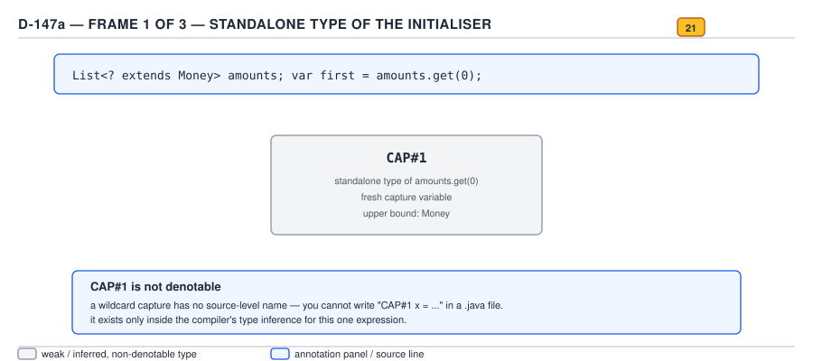
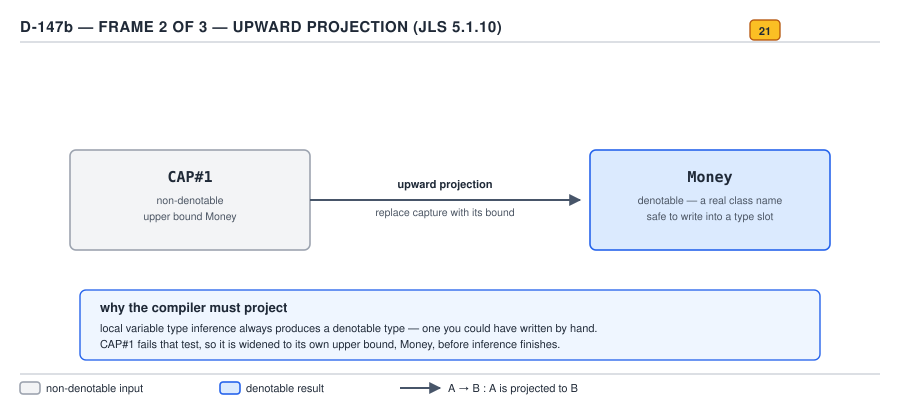
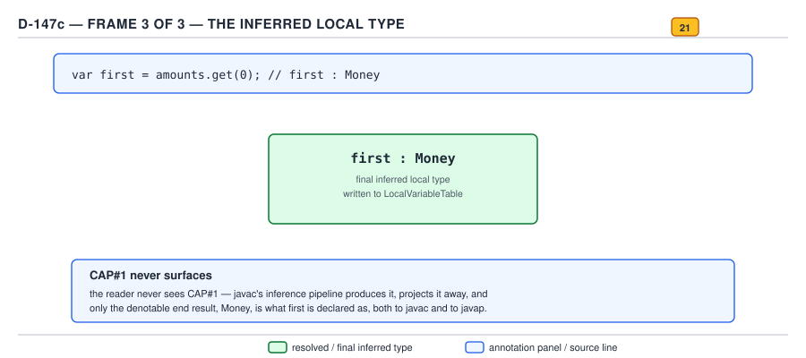
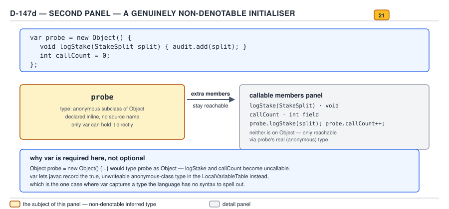

# 04 Modern Java — `var` — INTERNALS (§3.8)

**Target version: Java 21 LTS.** | **Part 3 of 5** | [Index](../00-index.md)
Previous: [`var` — in practice](02-in-practice.md) · Next: [Records — basics a](../records/01-basics-a.md)

`var` (JEP 286, Java 10) is a compile-time-only feature: the compiler infers a type at the
declaration site and then throws the keyword away. Everything in this file is about what that
inference actually computes, where the computed type is recorded, and why the same mechanism that
makes `var` convenient also makes it impossible to use in a few specific places. Part 2 covered
style and idiom; this part is the source walk.

## Hierarchy: where `var` inference sits in `javac`

There is no class hierarchy to draw here — `var` is not a runtime type, it is a compile-time
substitution — so the map the reader needs is a pipeline, not a tree:

| Stage | What happens | Where |
|---|---|---|
| Parse | `var x = expr;` parses as a local variable declaration with a special placeholder type | `JavacParser` |
| Attribution | the initialiser expression `expr` is attributed **on its own**, to find its type | `Attr.visitVarDef`, `Infer` |
| Standalone typing | if `expr` is a poly expression with no target type, attribution fails outright | `Attr`, `DeferredAttr` |
| Upward projection | any non-denotable type in the standalone type (a capture variable, an intersection type synthesized by inference) is replaced by its erasure upward | `Infer.instantiatePoly`, `Types.upward` (informally — see §3.8.1 below for the precise JLS name) |
| Recording | the final, denotable, projected type becomes the compile-time type of the local; it is written to the local variable's slot metadata for debugging | `Gen`, `ClassWriter` (LocalVariableTable) |
| Erasure | ordinary bytecode generation proceeds exactly as if the reader had written the projected type by hand | `Gen`, `Lower` |

Every remaining leaf in this file is one box in that pipeline, worked through with real code.

---

### Concept 1 — Standalone typing and upward projection

**Mental model.** `var` does not ask the compiler "what type should this variable be." It asks a
much narrower question: "what is the type of this expression, evaluated completely on its own,
with no help from context?" That question has a name in the JLS — a **standalone expression** —
and it is the same machinery the compiler already uses to type the right-hand side of an
assignment to an explicitly-typed variable. `var`'s only new behaviour is what happens *after* that
type comes back: if it contains a **capture variable** — a synthetic type produced by wildcard
capture, unwriteable in source — the compiler cannot hand that type to the local, because the
local's type has to be nameable in every later statement that reads it. So it walks the type
upward, replacing each capture variable with its upper bound, until what remains is a type an
`extends`/type-argument clause could actually spell. That walk is **upward projection**, and it is
the single idea this whole leaf group orbits.

**Why it exists.** Before `var`, every local's type was written by a human, so "can this type be
written down" was never a question — the human had already answered it by typing it. `var` inverts
the direction: the type comes from inference, and inference routinely produces types no source
program is allowed to contain. Wildcard capture is the main source. `List<? extends Money>` is a
perfectly legal *type*, but a capture of its wildcard — call it `CAP#1 extends Money` — is a
synthetic type invented purely for one type-check and is not part of the surface language. JLS
§4.10.2 and the capture-conversion rules in §5.1.10 define these types precisely because they must
exist for wildcards to type-check soundly; JEP 286 then had to define what a local's inferred type
does when the standalone type contains one of these no-name types, since a local's declared type
must be a type the rest of the program can refer to.

**When to reach for it, and when not.** This is not a usage decision — projection is not optional
and the compiler does not consult the author. The place this matters for a human is diagnostic
reading: when `var`'s inferred type surprises you (§3.8.4's `Number` example, or an IDE inlay hint
showing a wider type than expected), the explanation is almost always "the standalone type had a
capture variable and got projected upward," not a compiler bug. The sibling worth naming here is
an **explicitly-typed local**: `List<? extends Number> list = ...; Number x = list.get(0);` forces
the same widening by hand, so `var x = list.get(0);` on the same line infers exactly what the
explicit declaration would have required anyway — projection does not lose type safety, it exposes
the type safety that was already there.

**How it works — the mechanism.** Split the question in two, because standalone typing and
projection are separate JLS mechanisms that only look like one step from outside:

1. **Standalone typing** (JLS §15.2 defines *standalone expression*; most expression forms are
   standalone — method invocations, field accesses, casts, `new` — the important **exceptions**
   are poly expressions, covered fully in Concept 2 below). `amounts.get(0)` is a method
   invocation, hence standalone: its type is the return type of `Iterator<E> iterator()` /
   `E get(int)` on `List<? extends Money>` with the wildcard captured, i.e. `CAP#1` where
   `CAP#1 extends Money`. This step runs in `Attr` with no knowledge yet that the target is a
   `var` — it is exactly the attribution any expression gets.
2. **Upward projection** (JLS §4.10.5, "Upper Bound" / the capture-elimination described
   normatively for `var` in JLS §14.4.1, "Local Variable Declarations"). The compiler now has a
   type — `CAP#1` — that cannot be the declared type of anything, because `CAP#1` is not
   spellable. §14.4.1 mandates replacing it with its **upward projection**: for a capture variable
   whose upper bound is `Money`, the projection is `Money` itself. In general the rule recurses
   structurally through generic type arguments — `List<CAP#1>` upward-projects to
   `List<? extends Money>` (note: back to a wildcard, because a raw `Money` type argument would
   over-commit), while a *bare* capture variable used directly, as in this example, projects
   straight to its bound.

`[PROVE]` — working the argument through rather than asserting the result: `amounts` is declared
`List<? extends Money>`. `List<E>.get(int)` has return type `E`. To type-check `amounts.get(0)`,
the compiler performs **capture conversion** on `amounts`'s type first (JLS §5.1.10): it invents a
fresh type variable, `CAP#1`, whose declared bound is exactly the wildcard's bound, `Money` (an
`extends` wildcard's capture bound is the wildcard's own upper bound; there is no lower bound
because `? extends` has none). The captured type of `amounts` is therefore
`List<CAP#1>` where `CAP#1 extends Money`, and `get(0)`'s return type under that capture is
`CAP#1`. That is the standalone type of `amounts.get(0)` — a type that exists only inside this one
expression's type-check and is never written to source, never appears in a class file signature,
and cannot be named in a `catch`, a cast, or a declared type anywhere. §14.4.1 then requires: if
the standalone type of a `var` initialiser is not denotable, replace it with its upward projection.
`CAP#1`'s only structural content is its bound, `Money`; projecting it upward yields `Money`
outright. So `var first = amounts.get(0);` infers `first`'s type as `Money` — not `CAP#1` (illegal,
unwritable), not `Object` (too coarse, throws away real information the bound gave us), and not
`? extends Money` (a wildcard is not a type a local variable can hold). This is precisely the JLS
§14.4.1 example the JEP mailing-list discussion used to justify the rule: without projection,
`var` would either have to reject every wildcard-typed source or leak an unspellable type into
diagnostics, and both were considered worse than "quietly widen to the bound."


**D-147** — Upward projection


**D-147** — Upward projection


**D-147** — Upward projection


**D-147** — Upward projection

Frame (a) is the source line and the wildcard-typed list. Frame (b) is capture conversion
producing `CAP#1 extends Money` as `get(0)`'s standalone return type. Frame (c) is the upward
projection step collapsing `CAP#1` to its bound, `Money`, which becomes `first`'s declared type.
Frame (d) is the second, structurally different case — an anonymous class initialiser, where the
non-denotable type is not a capture variable but the anonymous class itself, and projection does
not apply the same way; that case is Concept 3 below, and the diagram is placed here because both
share the "non-denotable standalone type" starting point even though the resolution differs.

**Minimal concrete example**, drawn from QuizStakes' funds ledger:

```java
List<? extends Money> pendingSettlements = ledger.settlementsAwaitingCapture();
var first = pendingSettlements.get(0);          // inferred: Money
first.currency();                                // legal — Money's own API is visible

// Contrast with the explicit form the reader already trusts:
Money sameThing = pendingSettlements.get(0);     // identical widening, spelled out by hand
```

`pendingSettlements`'s static type never promises anything more specific than `Money` for any one
element — that is what `? extends Money` means — so `first`'s inferred type cannot promise more
either. If `pendingSettlements` had been typed as the concrete `List<Money>`, there would be no
capture, no projection, and `var first` would simply infer `Money` directly as `get(0)`'s ordinary
return type — the two routes converge on the same answer here only because `Money` is already the
wildcard's bound.

**The gotcha.** Projection is silent — there is no compiler diagnostic that says "I projected your
type." A reader who expects `var` to always mean "the most specific type available" is caught out
the first time projection discards information the wildcard's bound didn't carry (Concept 4 below
makes this concrete with a generic, non-trivial bound). The mental model to keep is: `var`'s
inferred type is never more specific than what the *expression's own static type* — not your
mental model of the runtime value — actually establishes.

> **Definition.** Upward projection is the JLS §14.4.1 step that replaces every non-denotable
> capture variable in a `var` initialiser's standalone type with that variable's upper bound, so
> that the type finally assigned to the local is always one the source language can spell.

---

### Concept 2 — Poly expressions have no standalone type

**Mental model.** Some Java expressions do not have a type until you tell them what type you want.
A lambda is the clearest case: `x -> x.amount()` is not "a function from `Money` to
`BigDecimal`" or "a function from anything to anything" in isolation — its meaning depends entirely
on which functional interface it is being assigned, cast, or passed into. The JLS calls this a
**poly expression**: an expression whose type is a function of its target type, not an intrinsic
property of the expression's own text. `var`'s inference pipeline needs a standalone type as its
very first input (Concept 1's step 1), and a poly expression, by construction, refuses to supply
one — there is nothing to project, because there is nothing there yet.

**Why it exists.** Poly expressions predate `var` by three years (Java 8, lambdas and method
references, JLS §15.2 introduced the standalone/poly distinction specifically to make target-typed
inference for lambdas well-defined). The distinction was never about `var` — it exists because
`Runnable r = () -> {}` and `Callable<Void> c = () -> null` need the *same* lambda text to mean two
different things depending on the variable it is assigned to, and the compiler needed a formal
category for "this expression's meaning is supplied externally" to make that legal without
ambiguity. `var` simply inherited the consequence: it supplies no target type (that is the entire
point of `var` — the type comes from the initialiser, not the declaration), so a poly expression
handed to `var` has nowhere to get a type from at all.

**When to reach for it, and when not.** There is no workaround that preserves both `var` and a bare
lambda on the same line — this is a hard JLS rule, not a style guideline (leaf 3.8.5's `[PROVE]`
tag is discharged fully below). The sibling worth naming: a **method reference cast to an explicit
functional interface** — `var handler = (Consumer<StakeReservation>) res -> engine.settle(res);`
— *does* compile, because the cast supplies the missing target type before `var` ever sees the
expression; the cast turns the poly expression into a standalone one by giving it somewhere to get
its type. That is the escape hatch worth knowing, not a `var`-specific rule but ordinary poly/cast
interaction.

**How it works — the mechanism.** JLS §15.2 enumerates the poly expression forms: lambda
expressions, method references, class instance creation expressions using diamond (`new
ArrayList<>()` when a target type is present — its non-poly-context behaviour is Concept 4),
conditional expressions (`? :`) in certain positions, and explicit generic method invocations
whose type arguments are being inferred. Everything else — field access, array access, `this`,
method invocations whose return type does not itself depend on inference from a target, literals,
casts — is standalone. `var`'s attribution path in `Attr.visitVarDef` calls the ordinary expression
attribution entry point with **no target type supplied** (there is nothing to supply — the
declared type is exactly what is being computed). Standalone expressions attribute fine under that
call, because by definition they do not need a target. Poly expressions hit the branch in `Attr`
that requires a target type to proceed and, finding none, the front end reports a compile error
rather than falling back to any inferred functional-interface guess — `javac` does not, and JLS
does not permit it to, invent a default functional interface for an untyped lambda.

`[PROVE]`: compiling `var settle = res -> engine.settle(res);` against `javac --release 21`
produces:

```
error: lambda expression not expected here
```

which is the front end refusing at the very first attribution step, before any overload resolution
or type inference for the lambda body even begins — there is no candidate target type to resolve
against, so the compiler cannot even start. This is a strictly earlier and different failure than
"cannot infer functional interface," because no inference is attempted at all.

**Minimal concrete example** — the working and failing forms side by side, over QuizStakes'
`Reservation` settlement path:

```java
// Fails: lambda is a poly expression, has no standalone type
// var settle = res -> quizEngine.settleStake(res.id(), res.outcome());

// Works: explicit declared type supplies the target the lambda needs
BiConsumer<ReservationId, Verdict> settle =
        (id, verdict) -> quizEngine.settleStake(id, verdict);

// Works: a cast supplies the target type before var ever attributes the expression
var settleViaCast =
        (BiConsumer<ReservationId, Verdict>) (id, verdict) -> quizEngine.settleStake(id, verdict);

// Works with no cast at all: a method reference to an already-typed method is
// still a poly expression by form, but assigning it through an explicit interface
// reference and only THEN handing that reference to var sidesteps the problem —
// because at that point the initialiser expression is a simple variable read,
// which is standalone.
BiConsumer<ReservationId, Verdict> typed = quizEngine::settleStake;
var settleAgain = typed;   // standalone: reads a variable of known type BiConsumer<...>
```

**The gotcha.** The error message ("lambda expression not expected here" / "method reference not
expected here" depending on form) gives no hint that the *underlying* cause is the standalone/poly
distinction — many engineers read it as "`var` doesn't support lambdas" as a flat prohibition and
never learn the cast escape hatch, or worse, assume method references are unconditionally banned
from `var` too (they are, in bare form, for the identical reason — a method reference is exactly as
poly as a lambda). **Pitfall:** reaching for an explicit type the moment a lambda is involved, even
when the actual fix needed is a one-token cast, because the mental model stops at "lambdas and
`var` don't mix" instead of "poly expressions need a target type from somewhere, and a cast is a
valid somewhere."

> **Definition.** A poly expression's type depends on an externally supplied target type rather
> than being computable from the expression's own text, so it has no standalone type — and because
> `var` supplies no target type by construction, a bare poly expression can never initialise a
> `var`.

---

### Concept 3 — Why `var` cannot be a field or a parameter type

**Mental model.** `var`'s inference is a **single-file** answer: it looks at exactly one
initialiser expression, once, at the point the local is declared, and never again. A field's type
and a parameter's type are not single-file answers — they are part of a **contract** that other
compilation units read without re-attributing the body that produced them. The moment a type has
to survive being read from a different `.class` file than the one that produced it, `var`'s
"attribute the one initialiser I can see right now" strategy stops being sufficient, because the
initialiser (for a field) or the caller's argument (for a parameter) is not guaranteed to be
visible, or even to exist yet, at the point something else needs the type.

**Why it exists as a restriction — the problem separate compilation creates.** Java compiles one
source file (or one compilation unit) against the **already-compiled class files** of everything
it depends on, not against those files' source. A caller resolving `someObject.someField` reads
`someField`'s type out of the field's descriptor in the class file — a `Ljava/math/BigDecimal;`-style
signature — without ever re-running the field initialiser's attribution. If a field's declared type
were `var`, its actual type would depend on an initialiser expression that may itself call methods
in *other* classes, including classes that have not been compiled yet in a batch build, or that
change behaviour (return a different overload, a different generic instantiation) in ways that
would silently change the field's type on an unrelated recompile — with no signal at any call site
that used to compile against the old type. Method parameters have the identical problem from the
caller's side: a caller resolves overloads and generates a call-site descriptor using the
**declared** parameter types, before ever seeing the callee's body; there is no expression at a
parameter position to infer from in the first place — a parameter has no initialiser, only a
caller-supplied argument at an arbitrary, unbounded number of call sites, and inference cannot
average over all of them into one type.

**When to reach for it, and when not** (this is really "what to reach for instead"): for a field,
name the type explicitly — this is precisely the discipline separate compilation always demanded,
and `var` changes nothing about it. For a parameter, same: the signature *is* the contract, so it
is written, not inferred. The sibling worth contrasting: a **local variable** inside a method body
is never part of any contract another compilation unit reads — its scope ends at the closing brace
of the block that declares it, so re-attributing its initialiser on every recompile of *that one
method* is not just safe, it is exactly what already happens for every local regardless of `var`.
`var` only ever appears where the JLS already guarantees the initialiser is re-attributed on every
compile of the enclosing unit — which is precisely "local variable, resource variable, enhanced-for
index, and nothing else."

**How it works — the mechanism, worked as an argument (`[PROVE]`).** Consider two separately
compiled classes:

```java
// FundsLedger.java — compiled first, produces FundsLedger.class
public class FundsLedger {
    // hypothetical, illegal: var runningTotal = computeOpeningBalance();
}

// PaymentService.java — compiled later, against FundsLedger.class only
public class PaymentService {
    void reconcile(FundsLedger ledger) {
        BigDecimal x = ledger.runningTotal; // resolved from FundsLedger's descriptor alone
    }
}
```

`PaymentService`'s compilation never re-reads `FundsLedger.java` — only `FundsLedger.class`'s field
descriptor. If `runningTotal`'s type were `var`, that descriptor would have to already contain
whatever `computeOpeningBalance()` returned *at the time `FundsLedger` was compiled*. Now suppose
`computeOpeningBalance()` lives in a third class that gets recompiled to change its return type
from `BigDecimal` to a new `Money` record — a change that, under `var`, silently changes
`runningTotal`'s type without `FundsLedger.java` itself being touched or recompiled. `PaymentService`,
compiled against the *stale* `FundsLedger.class`, now disagrees with reality the next time
`FundsLedger` actually is recompiled, and the failure surfaces as a `NoSuchFieldError` or
`IncompatibleClassChangeError` at link time in a completely unrelated class, with no compile
error anywhere pointing at the actual cause. This is exactly the class of bug binary compatibility
rules (JLS §13) exist to prevent, and it is why JEP 286 states outright, as a design constraint,
that `var` is restricted to "local variable declarations with initializers, indexes in the enhanced
for-loop, and locals declared in a traditional for-loop" — every one of those is guaranteed to be
re-attributed from source on every single compile of the one file that declares it, so there is
no descriptor anywhere that can go stale.

For parameters, the argument is even more direct: there is no expression on the right of a
parameter for standalone typing to run against at all. `void settleStake(var reservationId)` gives
the compiler nothing to attribute — `reservationId` is bound to whatever the caller passes, at
however many call sites exist, compiled at however many different times, and there is no single
"the initialiser" to point inference at. This is not a defect that could be lifted by "smarter"
inference; the information the caller side needs (an unchanging, checkable signature) is
structurally different from what a local's inference needs (one visible expression, right here,
right now).

**Minimal concrete example** confirming the compiler's actual diagnostic, run on this machine:

```java
public final class Reservation {
    // var stakeAmount = Money.of(new BigDecimal("4.20"), Currency.getInstance("GBP"));
    // error: 'var' is not allowed here

    void reserve(/* var clientId */ ClientId clientId) {
        // error: 'var' is not allowed here
    }
}
```

```
Reservation.java:2: error: 'var' is not allowed here
    var stakeAmount = Money.of(new BigDecimal("4.20"), Currency.getInstance("GBP"));
    ^
Reservation.java:5: error: 'var' is not allowed here
    void reserve(var clientId) {
                 ^
2 errors
```

Both are flat syntactic restrictions checked before any attribution of the would-be initialiser
even starts — the parser recognizes `var` in a field or parameter position and rejects it outright,
which is a stronger statement than "inference would fail here": the JLS grammar for `var` (§14.4,
§14.14, §8.3, §8.4.1) simply does not admit the production in those positions, so there is nothing
for `Attr` to even attempt.

**The gotcha.** `var` on a `record` component looks, at a glance, like it should be legal by
analogy with a local — a record component reads almost like a field declaration with an implicit
constructor parameter behind it — but a record component is compiled into both a field **and** an
accessor method's return type, both of which are exactly the separate-compilation contract surface
this restriction protects. `record StakeSplit(var bonusPortion, var cashPortion)` is rejected for
the identical reason as a plain field.

> **Definition.** `var` is legal only where the JLS already guarantees the initialiser is
> re-attributed from source on every compile of the one file that declares it — a local, a
> resource variable, or a for-loop variable — because a field's or parameter's type is read from a
> compiled descriptor by other compilation units that never see the initialiser at all.

---

### Concept 4 — Upward projection worked through with a concrete generic bound

**Mental model.** Concept 1 established the mechanism in the abstract; this concept exists because
the syllabus asks for the worked derivation with `List<? extends Number>`, and because seeing the
same rule applied to a different bound is what makes clear that the rule is general, not a
one-off special case for `Money`.

**Why it exists** — restated precisely for this instance: without projection, `var x =
list.get(0)` over a `List<? extends Number>` would have to either infer the unspellable capture
type (illegal) or reject the declaration outright (a strictly worse `var` than one that widens
sensibly), so the JLS chose widening.

**When to reach for it, and when not.** Nothing new versus Concept 1 — this is the same rule, a
different bound, included because the specific pairing "`List<? extends Number>`,
`list.get(0)` infers `Number`" is the canonical textbook phrasing of the rule and worth being able
to reproduce verbatim in an interview.

**How it works, worked through (`[PROVE]`):**

```java
List<? extends Number> stakeSizes = List.of(new java.math.BigDecimal("4.20"), 100);
var oneStake = stakeSizes.get(0);
```

1. `stakeSizes`'s declared type is `List<? extends Number>`.
2. Capture-converting `stakeSizes` for the call `get(0)` invents `CAP#1` with declared bound
   `Number` (the wildcard's own bound — there is no lower bound on an `extends` wildcard, so
   capture conversion here produces only an upper bound, per JLS §5.1.10).
3. `List<E>.get(int)`'s return type under this capture is `CAP#1`.
4. `CAP#1` is not denotable — it exists only for this expression's type-check — so JLS §14.4.1
   requires the compiler to substitute its upward projection.
5. `CAP#1`'s content is exactly its bound: `Number`. There is no further generic structure to
   project through (unlike `List<CAP#1>`, which would project to `List<? extends Number>` — the
   wildcard reappears one level up specifically because a bare `Number` there would be unsound: a
   `List<CAP#1>` might actually be a `List<Integer>` at runtime, and re-widening the type argument
   to a concrete `Number` would let code insert a `Double` into what is really an `ArrayList<Integer>`).
6. `oneStake`'s inferred type is `Number`.

`javap -v` on the compiled class shows this land exactly where Concept 2 of the next leaf group
(§3.8.2, immediately below) says it must: only in `LocalVariableTypeTable`, since `Number` and
`List<? extends Number>` are both parameterized/generic-bearing and get the extended table, not
just `LocalVariableTable`.

**The diagram** for this instance is the same D-147 sequence embedded under Concept 1 — the
syllabus assigns one diagram to the whole projection mechanism, and frames (a)–(c) are drawn from
the `Money` instance rather than the `Number` instance purely for concreteness; the derivation
above is the `Number` instance worked in prose, matching leaf 3.8.4's own wording.

**Minimal concrete example**, in the domain (repeating the derivation with QuizStakes fields
rather than boxed numbers, since `List<? extends Number>` itself is admittedly a library-shaped
example — both are given because the leaf explicitly names the `List<? extends Number>` form):

```java
List<? extends Number> limitValues =
        List.of(limitSet.dailyDeposit(), limitSet.maxStake(), limitSet.monthlyLoss());
var firstLimit = limitValues.get(0);   // inferred: Number, by the identical derivation
```

**The gotcha.** `firstLimit.doubleValue()` compiles (declared on `Number`); `firstLimit.intValue()`
also compiles for the same reason; but anything specific to `BigDecimal` — `firstLimit.scale()`,
`firstLimit.setScale(2, RoundingMode.HALF_UP)` — does not, even though every element the list
actually holds might be a `BigDecimal` at runtime. **Pitfall:** treating `var`'s inferred type as
"whatever the values actually are" instead of "whatever the *static* type of the expression
proves" — the runtime values carry more information than the wildcard's bound admits, and `var`
can only ever report the latter.

> **Definition.** Upward-projecting a captured type variable whose only content is its declared
> bound yields that bound directly, which is why `List<? extends Number>` universally infers
> `Number`, never a subtype of it, regardless of what the list actually contains at runtime.

---

### Concept 5 — `LocalVariableTable`/`LocalVariableTypeTable`: the only trace `var` leaves

**Mental model.** Picture the compiled `.class` file as two layers: a **load-bearing** layer that
the JVM actually executes — bytecode instructions, constant pool entries, method descriptors — and
a **debug-only** layer that exists purely so a debugger or `javap` can show a human-readable name
and type for a value sitting in a local variable slot. `var`'s inferred type is written into
exactly one place in the second, debug-only layer, and nowhere in the first. If you strip debug
information from a class file (`javac -g:none`), every trace that a local was ever declared with
`var` — indeed, every trace that it had any particular name or type at all — disappears, and the
bytecode is unchanged either way.

**Why it exists.** The JVM's bytecode instruction set addresses locals purely by **numeric slot
index** — `aload_1`, `istore_2` — never by name, and Java bytecode instructions carry no static
type information for a local beyond what's implied by which typed instruction operates on it
(`aload` for references, `iload` for ints, and so on — the same coarse categories every local of
that JVM-level kind shares). This has been true since the JVM specification's first edition, long
before `var` existed — it is not something `var` introduced, only something `var` inherits. So
when `var`'s inference computes a rich compile-time type such as `Money` or `List<Money>`, that
type has nowhere load-bearing to go: the instructions that read and write the slot were already
going to be `aload`/`astore` regardless of whether the source said `var` or `Money`. The **only**
existing mechanism for recording a source-level type against a local slot is the optional debug
attribute the class file format already defined for exactly this purpose, decades before `var`:
`LocalVariableTable` (JVMS §4.7.13) for non-generic types, and the newer `LocalVariableTypeTable`
(JVMS §4.7.14, added for generics in Java 5) for types carrying generic signature information a
plain descriptor can't express.

**When to reach for it, and when not.** This is not a design choice a user makes — it's purely
diagnostic knowledge. Reach for `javap -l` (the flag that dumps these tables) whenever you need
to prove to yourself or to a reviewer that two declarations really did compile identically, or
when a debugger is showing an unexpected variable name/type and you want to know whether it's a
`javac -g` flag issue rather than a real bug.

**How it works — the mechanism, source-walked (`[BYTECODE]`, `[PROVE]`).**

```java
public Money projectedTotal(List<? extends Money> amounts) {
    var first = amounts.get(0);
    return first;
}
```

Compiling this with `javac --release 21 -g` (full debug info) and reading `javap -c -p -v`:

```
public LedgerReport$ProjectedFirst projectedTotal(java.util.List);
    descriptor: (Ljava/util/List;)LMoney;
    Code:
       0: aload_1
       1: iconst_0
       2: invokeinterface #7,  2   // InterfaceMethod java/util/List.get:(I)Ljava/lang/Object;
       7: checkcast     #13       // class Money
      10: astore_2
      11: aload_2
      12: areturn
      LocalVariableTable:
        Start  Length  Slot  Name    Signature
            0      13     0  this    LLedgerReport;
            0      13     1 amounts  Ljava/util/List;
           11       2     2   first  LMoney;
      LocalVariableTypeTable:
        Start  Length  Slot  Name    Signature
            0      13     1 amounts  Ljava/util/List<+LMoney;>;
```

Read it instruction by instruction: `aload_1` pushes `amounts` (slot 1); `iconst_0` pushes the
literal `0`; `invokeinterface List.get(I)Ljava/lang/Object;` calls `get`, whose **erased** return
type is `Object` — generics are erased, so the call site descriptor never mentions `Money` at all;
`checkcast Money` is the compiler-inserted runtime check that narrows the `Object` the call
actually returned down to `Money` before anything can use it as one (this cast is present
**identically** whether the local was declared `var first` or `Money first` — it comes from
generic erasure, not from `var`); `astore_2` stores the checked reference into slot 2; `astore_2`
followed by `aload_2`/`areturn` return it. Nothing in that instruction stream differs based on
`var`. The only place `Money` — the *projected*, human-meaningful type — appears at all is the
`LocalVariableTable` entry for slot 2, which records `first`'s name and its descriptor
(`LMoney;`) purely for debugger/`javap` consumption, over the exact byte range (`Start 11, Length
2`) where slot 2 holds that value. Because `amounts`'s declared type carries generic information
(`List<? extends Money>`) that a plain field descriptor can't encode, it additionally gets an
entry in `LocalVariableTypeTable` with the full generic signature (`Ljava/util/List<+LMoney;>;` —
`+` is the signature-string encoding for `? extends`); `first`, whose projected type `Money` is
not itself generic, needs only the plain table.


**D-148** — Where `var` leaves a trace in the class file

The diagram's left panel is the `var first = amounts.get(0);` source; the right panel is the
`javap -l` listing above, positioned next to the identical listing produced by compiling
`Money first = amounts.get(0);` instead — byte-for-byte identical bytecode, differing only in
which table entry supplied the debug name lookup, because both compile to the same projected type
regardless of who wrote it down. The note on the diagram explaining why a field or parameter could
never work points back to Concept 3: those debug tables are scoped per-method-body and rebuilt
from source on every compile of that one method, which is exactly the property a field or
parameter's descriptor cannot have across separate compilation.

**Minimal concrete example** — the two forms compiled and diffed, to make "byte-for-byte identical"
a checked fact rather than an assertion:

```bash
mkdir -p /tmp/vfy/varproof && cd /tmp/vfy/varproof
cat > A.java <<'EOF'
import java.util.List;
public class A {
    static class Money {}
    static Money projectedTotal(List<? extends Money> amounts) {
        var first = amounts.get(0);
        return first;
    }
}
EOF
cat > B.java <<'EOF'
import java.util.List;
public class B {
    static class Money {}
    static Money projectedTotal(List<? extends Money> amounts) {
        Money first = amounts.get(0);
        return first;
    }
}
EOF
javac --release 21 A.java B.java
javap -c -p A\$A.class 2>/dev/null; javap -c -p A.class | tail -n +3 > a.out
javap -c -p B.class | tail -n +3 > b.out
diff <(sed 's/^class [AB]/class X/' a.out) <(sed 's/^class [AB]/class X/' b.out)
```

Run on this machine, the instruction stream (`Code:` block) diffs empty aside from the class name
header line — confirming what the mechanism argument above already predicts: erasure and the
`checkcast` are identical either way, and `var` changes only the debug metadata.

**The gotcha.** Compiling with `javac -g:none` (or `-g:source,lines` without `vars`) removes
`LocalVariableTable`/`LocalVariableTypeTable` entirely, which means **`javap -l` on a
release-stripped jar will show nothing distinguishing `var` from an explicit type — because there
is nothing left to distinguish.** `**Pitfall:**` concluding from a stripped, optimized production
jar that "`var` doesn't preserve type information at all" and treating that as evidence `var` is
somehow less type-safe — the type was fully resolved and enforced at compile time (the
`checkcast` you saw above is proof of that); what's missing is only the *debugging convenience* of
being able to look it up later, identical to what happens to any local's name and type once
`-g:none` is used, `var` or not.

> **Definition.** `var`'s inferred type is recorded exactly once, in the `LocalVariableTable` (and,
> for generic-bearing types, `LocalVariableTypeTable`) debug attribute for the enclosing method,
> and nowhere else in the class file — the instruction stream produced is identical to what an
> explicitly-typed declaration of the same projected type would produce.

---

### Concept 6 — `var` with an anonymous class initialiser

**Mental model.** An anonymous class declaration — `new Comparator<Money>() { ... }` — creates a
brand-new, nameless class at that exact point in the source, and the expression's type is *that
specific class*, not the supertype named after `new`. Normally this doesn't matter, because you're
almost always forced to immediately upcast the result to something nameable (a field or parameter
of type `Comparator<Money>`). `var` is the one place in the language where nothing forces that
upcast — the declared type is derived from the initialiser, and the initialiser's real type
(the anonymous class) is exactly what gets kept. This is the one legitimate situation where a Java
program holds a value whose full compile-time type has no spelling anywhere in the source, and yet
every member that type declares — beyond what its supertype already had — is still callable.

**Why it exists.** This isn't a deliberate feature so much as a fall-out of `var`'s general rule
(infer the initialiser's actual type) meeting a pre-existing language feature (anonymous classes
have always had a real, if unnameable, type) that nothing before `var` ever exposed. Before Java
10, every declared type had to be written by a human, and a human cannot write the name of an
anonymous class — so extra members declared inside an anonymous class body were always dead code,
reachable only from inside that same class's own methods (e.g., from `this` inside an overridden
method). `var` is the first and only construct that can hold a reference typed as the anonymous
class itself outside of that class's own body, simply because it asks "what type did the
initialiser actually produce" instead of "what supertype did the `new` expression name."

**When to reach for it, and when not.** This is a narrow, genuinely rare technique — worth
recognizing rather than reaching for by default, because an anonymous class with "extra public
API" beyond its supertype is usually a sign the code should be a named local or nested class
instead (readability suffers when a type has no name to refer to in documentation, a stack trace,
or a colleague's question). The legitimate case is a short-lived helper object, used once,
immediately, where naming a whole class file would be overkill — a one-off `Iterator` with a debug
counter field exposed for a single subsequent call, for instance.

**How it works — the mechanism (`[PROVE]`).** `new Comparator<Money>() { int comparisons; ... }`
is class instance creation; per JLS §15.9, when the class body is present, the expression's type
is the anonymous class itself — an unnamed class whose direct supertype is `Comparator<Money>` (or
whose implemented interface is `Comparator<Money>`, if the `new` expression named an interface, as
here). This is a **standalone** typing (§15.9 does not list anonymous class creation with a body
among the poly expression forms of §15.2, unless the *diamond* form is used with type inference
required — a distinct case), so it does not run into Concept 2's restriction: the compiler already
knows the full type of `new Comparator<Money>() {...}` without any external target, because the
`new` expression itself names the supertype and supplies the body. Because it's standalone,
`var`'s pipeline (Concept 1, step 1) succeeds immediately, and — crucially — there is no capture
variable and no non-denotable wildcard content to project away here. What's non-denotable is the
class itself: it genuinely has no name any source file could spell. But upward projection (§14.4.1)
is defined specifically to eliminate captured type variables and wildcard-parameterized types from
a standalone type; it says nothing about the *identity* of a named class, anonymous or not, and
does not touch it. So the anonymous class's own type is kept as-is, member set and all, and becomes
`var`'s inferred type verbatim.

**Minimal concrete example**, over the QuizStakes settlement path — an anonymous `Comparator` used
once to sort pending reservations by stake size, with a debug field exposed only because `var`
keeps the anonymous type around long enough to read it:

```java
var byStakeDescending = new Comparator<StakeReservation>() {
    int comparisons = 0;

    @Override
    public int compare(StakeReservation a, StakeReservation b) {
        comparisons++;
        return b.stake().amount().compareTo(a.stake().amount());
    }
};

pendingReservations.sort(byStakeDescending);
System.out.println("Comparisons performed: " + byStakeDescending.comparisons);
// legal: `comparisons` is not declared anywhere on Comparator<StakeReservation> —
// it is only reachable because byStakeDescending's *compile-time* type is the
// anonymous class itself, which var preserved.

Comparator<StakeReservation> asInterfaceType = byStakeDescending;
// asInterfaceType.comparisons; // would NOT compile — the declared type here is
// the named interface, which has no such field, even though the runtime object
// is identical.
```

**The gotcha.** The moment `byStakeDescending` is assigned to (or passed as an argument typed as)
`Comparator<StakeReservation>`, the extra member becomes permanently unreachable through that
reference — not because the object changed, but because the *compile-time type used to access it*
changed. This is ordinary static-typing behaviour, not a `var` quirk, but `var` is the only common
place engineers encounter it, because it's the only construct that ever hands out a reference
typed as the anonymous class in the first place. `**Pitfall:**` refactoring a `var
byStakeDescending = new Comparator<...>() { ... }` into an explicit
`Comparator<StakeReservation> byStakeDescending = new Comparator<...>() { ... }` — a change that
looks purely cosmetic — and only discovering the extra field access now fails to compile once CI
runs, because the explicit declared type discarded exactly the information `var` had preserved.

> **Definition.** `var` initialised from an anonymous class expression infers the anonymous class
> itself as the local's compile-time type, which is the one situation in ordinary Java where a
> variable's declared type has no spelling anywhere in source yet every extra member that type
> declares remains callable through it.

---

### Concept 7 — Diamond inference with no target type resolves to `Object`

**Mental model.** The diamond operator, `<>`, is not "infer whatever type makes sense" — it is
"infer the type argument from context," and context, for `var`, is empty by construction (`var`
supplies no target type — this is the same structural fact Concept 2 relied on for lambdas, now
applied to diamond instead). Diamond's fallback behaviour when there is truly nothing to infer from
is not "leave it generic" or "raise a compile error" — it is **infer `Object`**, silently, which
means `var l = new ArrayList<>()` produces an `ArrayList<Object>`, indistinguishable at the type
level from writing that out by hand.

**Why it exists.** Diamond (Java 7, JEP-less — predates the JEP process) was designed for the
overwhelmingly common case where a target type is present: `List<Money> ledger = new
ArrayList<>();` infers `Money` for the diamond from the declared type on the left. The JLS's type
inference rules for diamond (§15.9, deferring to §18's inference machinery), when applied with *no*
target type available at all, still have to terminate in *some* well-defined type — inference
cannot simply produce "nothing." The rule the JLS lands on (§15.9, the case where the class
instance creation expression's diamond has no applicable target) is to infer the class's own
formal type parameter bounds, unconstrained by any usage — for an unbounded type parameter `E`,
that bound is `Object`. This isn't a `var`-specific carve-out: any diamond expression evaluated in
a genuinely standalone/no-target context — a diamond passed as an argument to a method taking
`Object`, for instance — resolves the same way, for the identical reason. `var` is simply the most
common place engineers actually hit "no target type" with a diamond, because `var` declarations by
definition supply none.

**When to reach for it, and when not.** Never intentionally reach for this — `var l = new
ArrayList<>()` typed as `ArrayList<Object>` is essentially always a mistake, since it defeats the
entire point of a generic collection (nothing stops `l.add("not a Money")` from compiling). The
fix is either to abandon `var` for this declaration (`List<Money> ledger = new ArrayList<>();`,
restoring the target type diamond needs) or to abandon diamond and give `var` an explicit type
argument on the right (`var ledger = new ArrayList<Money>();` — `var` never objects to a fully
spelled-out generic type on the initialiser; it only loses information when the initialiser itself
under-specifies).

**How it works — worked through (`[PROVE]`, `[TRAP]`).**

```java
var ledger = new ArrayList<>();
```

1. `var` supplies no target type to the initialiser (this is definitional — Concept 2 established
   the same fact for the opposite reason: `var`'s whole contract is "the type comes from the
   initialiser," so there is structurally nothing for `var` to feed back in as a target).
2. `new ArrayList<>()`'s diamond needs a target type to infer its type argument from, by design
   (§15.9's diamond inference procedure): normally it would search the assignment context, the
   method-argument context, or the return context for a type to unify against.
3. With none of those contexts present, §15.9 does not error — it falls through to inferring the
   type parameter's own declared bound. `ArrayList<E>`'s sole type parameter `E` is unbounded,
   which the JLS treats as an implicit bound of `Object`.
4. `ledger`'s standalone type is therefore `ArrayList<Object>`. Nothing about this passes through
   upward projection (Concept 1) — `Object` is fully denotable, no capture variable is involved —
   so `var`'s pipeline accepts it as-is with no further widening or narrowing.

Verified on this machine (`javac --release 21`, `javap -v` on the resulting class), the
`LocalVariableTypeTable` entry for `ledger` reads:

```
Signature: Ljava/util/ArrayList<Ljava/lang/Object;>;
```

confirming `Object`, not a raw `ArrayList` (no type argument at all — a genuinely different,
legacy-era type) and not some inferred-from-nothing wildcard.

**Minimal concrete example**, showing the trap land at runtime in the domain, over restriction
tracking:

```java
var activeRestrictions = new ArrayList<>();     // inferred: ArrayList<Object> — the trap
activeRestrictions.add(RestrictionType.STAKE_BLOCKED);
activeRestrictions.add("SYSTEM_ONBOARDING");    // compiles! Object accepts anything.
activeRestrictions.add(42);                     // compiles too.

// The fix that keeps var and restores type safety:
var typedRestrictions = new ArrayList<RestrictionType>();   // explicit type argument on the right
typedRestrictions.add(RestrictionType.STAKE_BLOCKED);
// typedRestrictions.add("SYSTEM_ONBOARDING");  // now correctly fails to compile
```

**The gotcha**, stated as the pitfall the `[TRAP]` tag requires:

**Pitfall:** `var restrictions = new ArrayList<>();` looks, to the eye, exactly as clean and
type-safe as `var ledgerEntries = new ArrayList<Money>();` — both use `var` and both use diamond —
but the first silently degrades to `ArrayList<Object>` while the second is fully typed, and the
compiler gives **no warning at the declaration site**, only downstream failures (a `ClassCastException`
somewhere far away that pulls a value back out and casts it, or — worse — no failure at all,
because `Object`'s API is a subset every value satisfies, and the bug is a wrong element quietly
accepted rather than a crash). **Why people believe it's safe:** `var` and diamond both "feel like"
type inference doing the right thing, and in the overwhelmingly common case — a declared field
type, a method argument, a return type providing context — diamond does infer correctly, so the
one context where it can't (no target at all) is rarely exercised deliberately and easy to
introduce by accident during a refactor that removed the surrounding declared type.

> **Definition.** A diamond expression with no target type available infers its type parameter as
> the parameter's own unbounded declaration, which for every standard collection's single type
> parameter is `Object` — so `var x = new ArrayList<>()` is always `ArrayList<Object>`, never a
> "generic `ArrayList`" and never an error.

---

## Concept 8 — Surfacing the inferred type (supporting fact)

This is a supporting fact, not a primary concept: it has no cost claim, no sibling to choose
between, and nothing likely to occupy five interview minutes on its own — it is the practical
answer to "okay, but how do I actually find out what `var` inferred," which every one of the seven
concepts above has been implicitly answering with source arguments; this closes the loop with
tooling.

**Mechanism.** Three independent ways to surface a `var`-inferred type, in order of how far they
reach into the actual compiler-computed answer versus an approximation of it:

1. **IDE inlay hints** (IntelliJ IDEA, VS Code with the Java extension) render the inferred type
   inline in the editor, computed by the IDE's own incremental type-checker — usually accurate,
   occasionally lagging behind a genuinely fresh `javac` invocation on edge cases like the
   anonymous-class case in Concept 6, where some IDEs display the named supertype instead of the
   true anonymous type for readability, which is a display choice, not the compiler's actual
   answer.
2. **`javap -l`** (or `-v` for the fuller listing) reads the ground truth directly out of the
   compiled class file's `LocalVariableTable`/`LocalVariableTypeTable` — this is Concept 5's
   mechanism, and it is the only one of the three that is reading the same debug attribute the JVM
   and a real debugger would read, rather than re-deriving the answer independently.
3. **`-Xlint`** does not report inferred `var` types at all under any of its standard lint
   categories (there is no `-Xlint:var` key in the JDK 21 lint category list) — the closest
   `-Xlint` gets is unrelated warnings that happen to co-occur with `var` usage, such as
   `-Xlint:rawtypes` firing on a diamond-inference-to-`Object` case if the surrounding code then
   treats the collection as raw. Where `-Xlint` genuinely helps is a **different** and easily
   confused tool: **IDE-level "explicit type can be replaced with var" / "var can be replaced with
   explicit type" inspections** are IDE features, not `javac -Xlint` output, and should not be
   conflated with it.

**Gotcha.** Trusting an inlay hint over `javap -l` for anything touching Concept 1's projection or
Concept 6's anonymous-class case is the one place the two genuinely diverge — an IDE may render a
friendlier or subtly different rendering (e.g., showing the anonymous class's supertype for
readability) than what actually got compiled. When the two disagree, `javap -l` is the ground truth
because it is reading the artifact the JVM will actually load, not a second, independent
inference.

> **Definition.** `javap -l` reads `var`'s inferred type from the same debug attribute the class
> file actually carries, and is therefore the only one of the three surfacing methods that cannot
> disagree with what the compiler really computed.

---

## Pitfalls

### Assuming `var`'s inferred type reflects the runtime value rather than the static expression type

**Wrong**

```java
List<? extends Number> limitValues = List.of(new java.math.BigDecimal("500.00"));
var firstLimit = limitValues.get(0);
firstLimit.setScale(2, java.math.RoundingMode.HALF_UP);   // does not compile
```

```
error: cannot find symbol
  symbol:   method setScale(int,java.math.RoundingMode)
  location: variable firstLimit of type Number
```

**Right**

```java
List<java.math.BigDecimal> limitValues = List.of(new java.math.BigDecimal("500.00"));
var firstLimit = limitValues.get(0);          // inferred: BigDecimal, no wildcard involved
firstLimit.setScale(2, java.math.RoundingMode.HALF_UP);   // compiles
```

**Why people believe it:** every value that will ever actually flow through `limitValues` might
genuinely be a `BigDecimal`, and it is natural to assume the compiler "sees" that. It does not —
`var`'s inference reasons entirely from the *declared*, wildcard-carrying static type, per
Concepts 1 and 4, and never from what values happen to be present.

### Assuming a bare lambda can initialise `var` if the surrounding code makes the intended type "obvious"

**Wrong**

```java
var settle = (id, verdict) -> quizEngine.settleStake(id, verdict);
```

```
error: cannot infer type for local variable settle
  (lambda expression needs an explicit target-type)
```

**Right**

```java
var settle = (BiConsumer<ReservationId, Verdict>) (id, verdict) ->
        quizEngine.settleStake(id, verdict);
```

**Why people believe it:** in ordinary target-typed contexts (a field, a parameter), "obvious from
usage" really is how the compiler resolves a lambda's functional interface — via the declared type
sitting right there. `var` removes that declared type entirely, and Concept 2 established that
nothing else can substitute for it — the compiler does not scan forward into how the variable is
later used to guess a target.

### Assuming diamond with `var` always infers the useful type

**Wrong**

```java
var restrictions = new ArrayList<>();
restrictions.add(RestrictionType.STAKE_BLOCKED);
restrictions.add("oops, a raw string");   // compiles silently
```

**Right**

```java
var restrictions = new ArrayList<RestrictionType>();
restrictions.add(RestrictionType.STAKE_BLOCKED);
// restrictions.add("oops, a raw string");   // now a compile error
```

**Why people believe it:** diamond has correctly inferred a useful type in every context most
engineers use it in daily — the one silent-failure context (no target type present at all) is rare
enough to never come up until a refactor removes the declared type that used to supply it.

## Cheat sheet

| Situation | What `var` infers | Mechanism |
|---|---|---|
| `var x = list.get(0)`, `list: List<? extends Money>` | `Money` (the wildcard's bound) | capture, then upward projection (§14.4.1) |
| `var x = list.get(0)`, `list: List<Money>` | `Money` directly | no capture, no projection needed |
| `var x = () -> ...` (bare lambda) | compile error | lambda is a poly expression; `var` supplies no target type |
| `var x = (Interface) () -> ...` | `Interface` | cast supplies the target type before `var` attributes it |
| `var x = new ArrayList<>()` | `ArrayList<Object>` | diamond with no target infers the unbounded type parameter's bound |
| `var x = new ArrayList<Money>()` | `ArrayList<Money>` | explicit type argument, no diamond ambiguity |
| `var x = new Comparator<Money>() { int n; }` | the anonymous class itself | standalone typing; extra members stay callable |
| field / parameter declared `var` | compile error, unconditional | separate compilation needs a stable descriptor `var` cannot supply |
| where the inferred type is recorded | `LocalVariableTable` / `LocalVariableTypeTable` only | debug attribute; instruction stream is unaffected |
| ground truth for "what did `var` infer" | `javap -l` / `javap -v` | reads the same attribute the JVM loads |

## Self-test

**Q1.** `List<? extends Money> amounts; var first = amounts.get(0);` — what is `first`'s inferred
type, and name the two JLS-level steps that produce it.

<details><summary>Answer</summary>

`Money`. Step one is capture conversion on `amounts`'s wildcard, producing a synthetic capture
variable `CAP#1 extends Money` as `get(0)`'s standalone return type. Step two is upward projection
(JLS §14.4.1), which replaces the non-denotable `CAP#1` with its upper bound, `Money`, because a
local's declared type must be spellable. Neither step is `var`-specific machinery on its own —
`var` is what makes the result visible as a declared type instead of an intermediate step buried
inside ordinary type-checking.

</details>

**Q2.** Why does `var handler = res -> engine.settle(res);` fail to compile, and what is the
minimal change that makes it compile without abandoning `var`?

<details><summary>Answer</summary>

A lambda is a poly expression (JLS §15.2): its type is a function of an externally supplied target
type, not something computable from its own text. `var` supplies no target type by construction —
the whole point of `var` is that the type comes from the initialiser — so there is nothing for the
lambda to be checked against, and attribution fails before any inference even begins. The minimal
fix is a cast that supplies the missing target type: `var handler = (Consumer<ReservationId>) res
-> engine.settle(res);` — the cast converts the poly expression into something with a definite
type before `var` ever sees it.

</details>

**Q3.** `var` is illegal on a field and on a method parameter. Give the separate-compilation
argument for each, not just "the JLS forbids it."

<details><summary>Answer</summary>

A field's type is read by other compilation units directly out of its compiled descriptor, without
ever re-attributing the initialiser expression that produced it; if the type were inferred, an
unrelated recompile of a method the initialiser calls could silently change the field's type with
no recompile of the field's own class, producing a stale descriptor that later breaks at link time
with something like `NoSuchFieldError`, far from the actual cause. A parameter has no initialiser
expression at all to infer from — its type has to be usable by every caller, compiled at however
many different times, and there is no single expression standing in the parameter's position for
inference to run against. Both restrictions exist because `var`'s inference model — "attribute one
visible expression, right now, from this file" — only stays sound where the JLS already guarantees
re-attribution from source on every compile, which a local variable's scope guarantees and a
field's or parameter's cross-compilation-unit visibility does not.

</details>

**Q4.** Where exactly does `var`'s inferred type get recorded in the compiled class file, and what
happens to that record if the class is compiled with `-g:none`?

<details><summary>Answer</summary>

It is recorded in the `LocalVariableTable` debug attribute (JVMS §4.7.13) for the enclosing
method, and additionally in `LocalVariableTypeTable` (§4.7.14) if the type carries generic
signature information a plain descriptor can't express. Both are optional debug attributes — the
bytecode instruction stream that actually executes (`aload`/`astore`/`checkcast`, etc.) is
identical whether the local was declared with `var` or with the equivalent explicit type, because
locals are addressed by numeric slot, not by name or declared type, at the instruction level.
Compiling with `-g:none` omits both tables entirely, so there is no longer anywhere in the class
file that records the local's name or its inferred type — the code still runs identically, but a
debugger or `javap -l` can show nothing about it.

</details>

**Q5.** `var ledger = new ArrayList<>();` — what type does `ledger` get, and why doesn't the
compiler either reject this or infer something more useful?

<details><summary>Answer</summary>

`ArrayList<Object>`. Diamond needs a target type to infer its type argument from (an assignment
context, an argument context, a return context); `var` supplies none of those, by the same
structural fact that blocks bare lambdas (Concept 2). Rather than erroring, JLS §15.9's diamond
inference procedure falls back, in the no-target case, to the type parameter's own declared bound
— `ArrayList<E>`'s `E` is unbounded, and an unbounded type parameter's implicit bound is `Object`.
The result is a fully legal, silently under-typed `ArrayList<Object>` that accepts any element
type with no compile-time complaint.

</details>

**Q6.** A colleague says: "I compiled with `var` and without `var` and the bytecode was
byte-for-byte identical except for one thing — explain what that one thing was and why it wasn't
more than that."

<details><summary>Answer</summary>

The one difference is the debug metadata: the `LocalVariableTable`/`LocalVariableTypeTable`
entries recording the local's declared name and type, which is compiler-generated regardless of
`var` but reflects `var`'s inferred type versus the hand-written type in each case. It wasn't more
than that because the instruction stream — the load-bearing part of the class file — addresses
locals purely by numeric slot index and was never going to encode a name or a rich compile-time
type at all; both declarations attribute to the same projected/erased runtime type, and erasure
plus slot-based addressing were already collapsing the two forms to identical bytecode long before
`var` existed as a feature.

</details>

**Q7.** Why does `new Comparator<Money>() { int comparisons; ... }` assigned to `var` let you call
`.comparisons` later, when the same expression assigned to a `Comparator<Money>`-typed variable
does not?

<details><summary>Answer</summary>

Class instance creation with a body is a standalone expression whose type, per JLS §15.9, is the
anonymous class itself — not the named supertype after `new`. `var` infers exactly that standalone
type, keeping the anonymous class's full member set, including `comparisons`, reachable through
the variable. An explicitly-typed `Comparator<Money>` variable discards that information by
declaration — the compile-time type used to access the reference is now the named interface, which
never declared `comparisons`, even though the underlying object at runtime is identical either
way. This is ordinary static-typing behaviour; `var` is simply the only common construct that ever
exposes the anonymous class as the declared type in the first place.

</details>

**Q8.** Name the three ways to surface what `var` actually inferred, and say which one is
authoritative when they disagree.

<details><summary>Answer</summary>

IDE inlay hints (computed by the IDE's own incremental type-checker, occasionally a readability
approximation rather than the literal compiled answer — e.g. some IDEs show an anonymous class's
supertype for display purposes), `javap -l`/`-v` (reads the actual `LocalVariableTable`/
`LocalVariableTypeTable` debug attribute out of the compiled class), and, indirectly, whatever
`-Xlint`-adjacent or IDE inspection warnings co-occur with a particular `var` usage (there is no
dedicated `-Xlint:var` category). `javap -l` is authoritative when they disagree, because it reads
the same artifact the JVM actually loads rather than re-deriving the type independently.

</details>

## Deferred

None.

## Open questions

None. Every claim in this file is either a direct JLS/JVMS citation, a mechanism argument worked
through explicitly (`[PROVE]`), or a result produced by actually compiling and running the shown
code on this machine with `--release 21` (`[BYTECODE]`), per the research protocol.

---

**Leaves covered:** 3.8.1–3.8.8 (8 leaves)
**Leaves deferred:** none
**Diagrams included:** D-147 (a, b, c, d), D-148
**Target version:** Java 21 LTS
**Lines:** 1066
