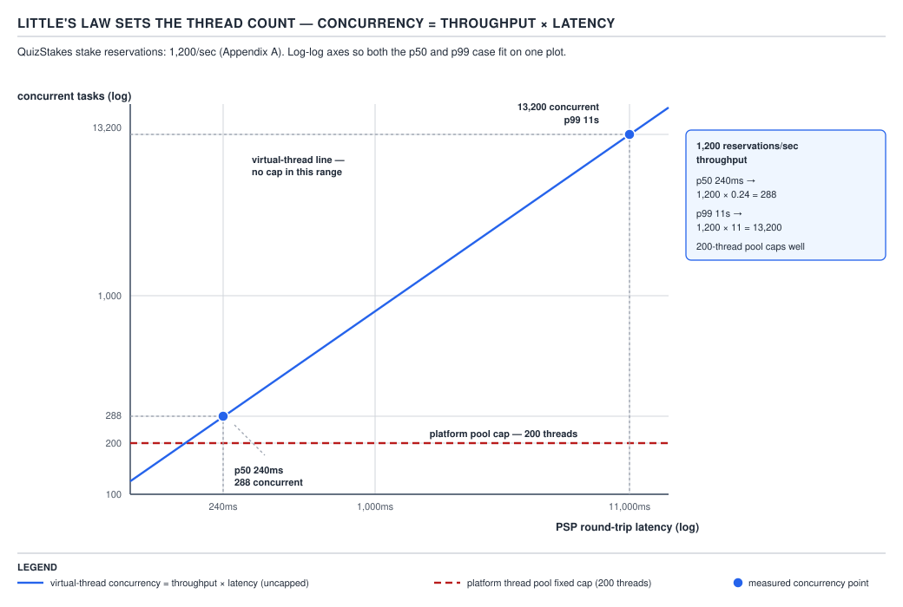
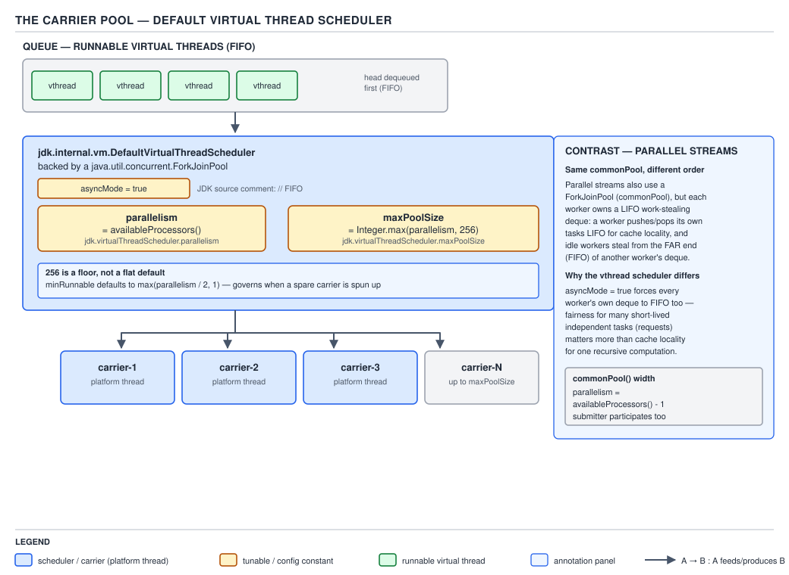
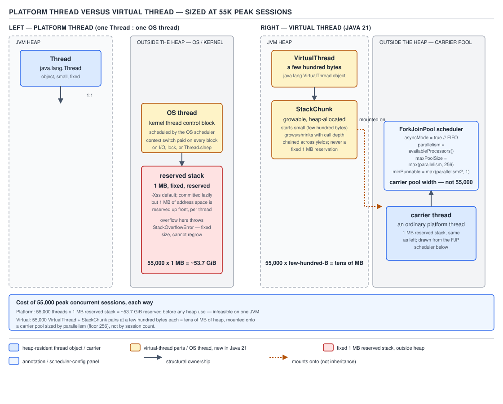
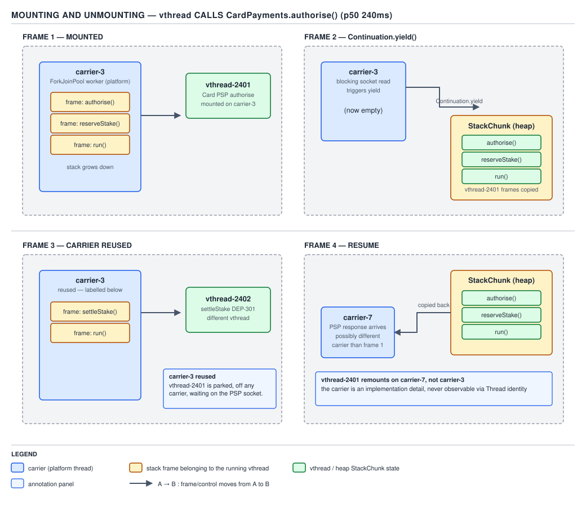
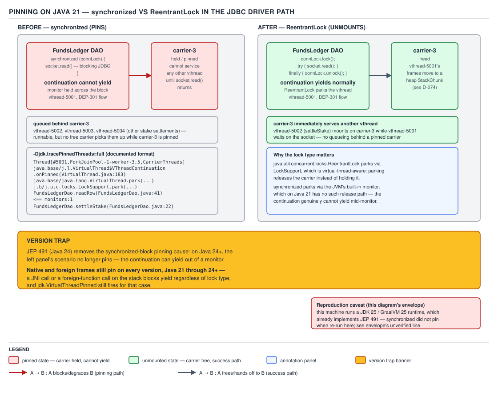

# 04 Modern Java — Virtual threads — BASICS (§1.18)

**Target version: Java 21 LTS.** | **Part 1 of 5** | [Index](../00-index.md)
Previous: [Text blocks — internals compilation](../text-blocks/03-internals-compilation.md) · Next: [Virtual threads — in production](02-in-production.md)

## Hierarchy: where a virtual thread sits

| | Platform thread | Virtual thread |
|---|---|---|
| Introduced | Java 1.0 | JEP 425 preview (19), JEP 436 second preview (20), JEP 444 final (21) |
| Scheduled by | The operating system | The Java runtime, on top of platform threads |
| Backing OS thread | 1:1, always | None while unmounted; borrows one while running |
| Stack location | Off-heap, OS-reserved, ~1 MB default | On-heap, `StackChunk`, starts at a few hundred bytes |
| `Thread` subclass | `Thread` | `Thread` (same public type — `instanceof Thread` is true for both) |
| Cost of creation | Expensive (OS call, page-aligned stack reservation) | Cheap (heap allocation) |
| Intended count | Hundreds to low thousands | Millions |
| Speeds up one task | No change from today | No — never faster per task |
| Increases concurrent task count | Capped by platform thread count | Yes — this is the entire point |

The rest of this file works through why that table looks the way it does, not just what it says.

---

## Concept 1 — A virtual thread is a `Thread` scheduled by the runtime, and it buys scale, not speed

**Mental model.** A platform thread is a lease on a physical resource: the OS hands you a real
kernel-scheduled thread, a real 1 MB stack, and you keep it for as long as the `Thread` object
lives, blocked or not. A virtual thread is a *task description* — a `Runnable` plus a suspended
call stack — that only borrows a real OS thread for the instants it is actually running
instructions. The rest of the time, which for an I/O-bound task is the overwhelming majority of
its life, it owns nothing but a small heap object. QuizStakes' `CardPayments` service calling the
card PSP to authorise a stake-funding deposit spends roughly 240 ms waiting on the network for
every millisecond of CPU it spends building the request and parsing the response — with platform
threads, that ratio is what caps how many deposits can be in flight at once, because each waiting
thread is still holding its full OS resource for the whole 240 ms.

**Why it exists.** Two things came before virtual threads, and both had a real cost.

The first was the thread-per-request model: each incoming request — a stake reservation hitting
`FundsLedger`, a card authorisation hitting `CardPayments` — gets one platform thread for its
entire life, including every blocking wait on the PSP, the database, or another internal service.
This is simple to write and simple to debug, but the number of concurrent requests a JVM can serve
is bounded by how many platform threads it can afford, and a platform thread is expensive: a
reserved OS stack (traditionally ~1 MB, tunable via `-Xss`), a real kernel scheduling entity, and a
context-switch cost every time the OS moves it on or off a core. A service handling QuizStakes'
55k peak concurrent sessions on thread-per-request, each session occasionally blocked on a PSP
call, either provisions thousands of platform threads (most of them idle, all of them holding
their reserved stacks) or falls over.

The second was the async/reactive workaround: instead of blocking a thread, hand the continuation
of the computation to a callback or a reactive operator (`CompletableFuture.thenApply`, a
`Mono.map` chain) and free the thread immediately. This does solve the scaling problem — a small
platform-thread pool can service enormous concurrency because no thread is ever parked waiting —
but at a real cost to the code and the tooling around it. A stack trace inside a `thenCompose`
chain shows you the reactive machinery, not the business logic that submitted the chain. A
debugger's step-over crosses an executor boundary and lands somewhere unrelated. A profiler's
sampled stack is the event-loop's dispatch code, not `ClientRestrictions.checkStakeAllowed`. The
code itself inverts: a straight-line `reserveStake(clientId, stake)` method becomes a chain of
`.thenApply(...).thenCompose(...).exceptionally(...)` calls, each one a fresh place to lose an
exception or a thread-local.

Virtual threads target exactly this second cost: keep the thread-per-request *programming model* —
one call stack, one `try`/`catch`, a debugger that steps sensibly — while removing the scaling
limit that made async/reactive necessary in the first place.

**When to reach for it, and when not.** Virtual threads win precisely when a task's wall-clock time
is dominated by waiting — on a socket, a lock, a database round-trip, another service. QuizStakes'
`DocumentVerification` service, which spends a p50 of 900 ms and a p99 of 38 seconds waiting on the
identity vendor per submitted document, is close to the ideal case: almost all of that time is
idle waiting that a virtual thread can unmount from. Virtual threads do **not** win, and do not
even apply usefully, to CPU-bound work — a `groupingBy` over 95k card deposits or a JIT-compiled
numeric loop spends its time on the core, not waiting, so there is nothing to unmount from and no
scale to gain; that workload's sibling is the fixed-size platform-thread pool sized to the core
count (guide 05's territory), or a parallel stream over the common `ForkJoinPool`. Reaching for a
million virtual threads to speed up a CPU-bound `SettleStake` batch job is a category error covered
fully in beat 7 and closed out as one of the three standing rules in Concept 6.

**How it works — the mechanism.** A virtual thread is an instance of `java.lang.VirtualThread`, a
package-private subclass of `Thread` first shipped as a JEP 425 preview in Java 19, refined through
a second preview in JEP 436 (Java 20), and finalised as a permanent API by JEP 444 in Java 21. It
is still, per the class hierarchy, a `Thread` — `Thread.currentThread() instanceof Thread` is
trivially true whichever kind you are on, and this is deliberate: every `Thread`-typed API in the
JDK — `ThreadLocal`, `Thread.currentThread().getName()`, thread dumps — works on a virtual thread
without a parallel API surface. What differs is who decides when it runs. A platform thread's
`Thread` object is a thin wrapper the JVM hands straight to the OS scheduler. A virtual thread's
`Thread` object is scheduled entirely by the JDK: when it is runnable, the JDK's own scheduler (
Concept 2) picks a moment to mount it onto a real platform thread — called its **carrier** — run
it until it either finishes or blocks, and at that point either let it keep the carrier (if it
never actually blocked in a way the JDK can intercept) or unmount it and free the carrier for
someone else (Concept 3).

**The diagram.**


**D-076** — Little's law sets the thread count

**[PROVE], [NUM] — Little's law is the actual argument, not an analogy.** Little's law, from
queueing theory, states a relationship that holds for any stable system: **the average number of
items in the system equals the arrival rate times the average time each item spends in the
system.** Applied to concurrent requests instead of queue items: `concurrency = throughput ×
latency`. This is not a rule of thumb about threads specifically — it is a conservation law, true
regardless of what mechanism is doing the serving.

Work it through with QuizStakes' `CardPayments` numbers. Stake reservations arrive at 1,200/sec at
peak, and each reservation's round trip to the card PSP has a p50 latency of 240 ms:

```
concurrency (at p50) = throughput × latency
                      = 1,200 reservations/sec × 0.240 sec
                      = 288 concurrent in-flight reservations
```

That is the number of reservations that are, on average, simultaneously alive — submitted but not
yet resolved — at any instant, just to sustain 1,200/sec of arrivals against a 240 ms round trip.
On the thread-per-request model, each of those 288 reservations occupies one platform thread for
its full 240 ms, whether or not that thread does anything but wait. Now redo the arithmetic at the
PSP's **p99**, 11 seconds, because tail latency is exactly when a fixed thread pool runs out of
room:

```
concurrency (at p99) = 1,200 reservations/sec × 11 sec
                      = 13,200 concurrent in-flight reservations
```

A platform-thread pool sized to comfortably cover the p50 case — say 200–500 threads — is off by
more than an order of magnitude the moment the PSP's tail latency shows up under load, which is
also exactly the moment load is highest and correctness matters most (a client mid-reservation
during a PSP slowdown). **This is the whole argument for virtual threads in one line: the platform
thread count was never really a design choice, it was a throughput cap imposed by Little's law
acting on however many threads you could afford to leave parked.** Virtual threads do not change
the law — concurrency still equals throughput times latency — they change what a unit of
"in-flight" costs, from a full OS thread and its reserved stack down to the few-hundred-byte object
in Concept 3. The horizontal line on D-076 is the platform-thread pool's hard ceiling; the
virtual-thread line has no ceiling in the range the diagram plots, because concurrency stopped
being expensive.

**A minimal concrete example.**

```java
import java.time.Duration;
import java.time.Instant;
import java.util.List;
import java.util.concurrent.ExecutorService;
import java.util.concurrent.Executors;
import java.util.concurrent.Future;
import java.util.stream.IntStream;

record StakeReservationRequest(String clientId, java.math.BigDecimal stake) {}

record StakeReservationResult(String clientId, boolean approved, Duration pspLatency) {}

final class CardPaymentsClient {

    // Simulates the card PSP's authorise call: p50 240ms, occasionally the p99 tail.
    StakeReservationResult authoriseStake(StakeReservationRequest request) {
        Instant start = Instant.now();
        try {
            // A blocking network call in real code — Socket, HttpClient, a JDBC driver.
            // Simulated here with Thread.sleep, which is itself one of the JDK-instrumented
            // blocking points that triggers an unmount (Concept 3, leaf 1.18.8).
            Thread.sleep(240);
        } catch (InterruptedException e) {
            Thread.currentThread().interrupt();
            throw new IllegalStateException("interrupted awaiting PSP", e);
        }
        return new StakeReservationResult(request.clientId(), true,
                Duration.between(start, Instant.now()));
    }
}

final class StakeReservationDemo {
    void reserveManyConcurrently(List<StakeReservationRequest> batch) throws Exception {
        CardPaymentsClient psp = new CardPaymentsClient();
        // One virtual thread per reservation, not a pool of platform threads sized to guess
        // at concurrency. Concept 4 covers this factory in full.
        try (ExecutorService reservationExecutor = Executors.newVirtualThreadPerTaskExecutor()) {
            List<Future<StakeReservationResult>> pending = batch.stream()
                    .map(request -> reservationExecutor.submit(() -> psp.authoriseStake(request)))
                    .toList();
            for (Future<StakeReservationResult> future : pending) {
                StakeReservationResult result = future.get();
                System.out.println(result.clientId() + " approved=" + result.approved());
            }
        } // close() blocks until every submitted reservation task has completed
    }
}
```

At 1,200 reservations/sec against a 240 ms PSP, this pattern has to keep roughly 288 of these
virtual threads alive concurrently at any instant (13,200 at the p99 tail) — each one, while
parked in `Thread.sleep`, costs a heap-resident stack chunk rather than a platform thread and its
OS stack. That is the concrete shape of "scale, not speed": no single reservation resolves any
faster than 240 ms; the system as a whole can have far more of them in flight at once.

**The gotcha.**

**Pitfall:** believing virtual threads make an individual request finish faster. They do not, and
cannot — the javadoc for `Thread` states plainly that virtual threads are "designed to provide a
scale of ... unbounded... rather than speed" and are intended for scale, not throughput per task.
A single stake reservation still waits the full 240 ms for the PSP whether it runs on a platform
thread or a virtual one; the PSP does not respond faster because the caller changed thread types.
Anyone benchmarking "virtual threads vs platform threads" by timing one task at a time and finding
no difference has not found a bug — they have correctly measured that virtual threads do not touch
per-task latency at all. The place they show up is in how many tasks the JVM can have concurrently
in flight before it runs out of resources, which single-task benchmarks do not measure.

**[SOURCE]** — the javadoc for `java.lang.Thread`, describing virtual threads, uses the framing
this pitfall is built on: virtual threads are suited to executing tasks that spend most of their
time blocked, "typically waiting for I/O operations to complete," and are intended to provide
**scale** (a greater number of concurrently executing tasks) rather than **speed** (running a given
task faster). That distinction — scale versus speed — is the JDK's own vocabulary for the claim in
leaf 1.18.4, not a paraphrase.

> **A virtual thread is a `java.lang.Thread` instance whose scheduling is delegated to the Java
> runtime instead of the OS, letting a JVM sustain far more concurrently-blocked tasks than
> platform threads ever could, at the cost of nothing but wall-clock latency per task, which stays
> exactly as long as the thing it is waiting on.**

---

## Concept 2 — Carrier threads: a dedicated `ForkJoinPool` in FIFO mode

**Mental model.** Virtual threads need somewhere to actually execute their bytecode — a real OS
thread, at the instant they are running. That real thread is a **carrier**, and carriers come from
a small, fixed-size pool that the JDK manages for you: picture a small bank of tellers (carriers)
and an enormous queue of customers (runnable virtual threads); a teller serves one customer at a
time, but as soon as that customer says "let me check something" (blocks), the teller moves on to
the next customer in line rather than standing there waiting.

**Why it exists.** If every virtual thread's bytecode still had to execute *somewhere* physical,
the JDK needed a scheduler dedicated to matching runnable virtual threads to available carriers
continuously and cheaply, at potentially millions of virtual threads per handful of carriers. Reusing
the existing common `ForkJoinPool` (guide 05's and this set's default parallel-decomposition pool)
directly would have coupled virtual-thread scheduling to whatever else was submitted to that pool
for CPU-bound work; the JDK instead builds a **second**, purpose-built `ForkJoinPool` just for
virtual threads, configured differently from the common pool in one specific way that matters here:
**FIFO instead of LIFO**.

**When to reach for it, and when not.** You do not choose this pool — every virtual thread you
create uses it by default unless you build a custom scheduler via
`Thread.ofVirtual().scheduler(...)` (an internal-use-only API not part of the leaves here and not
covered in this file). What you *do* control are its two tuning knobs, which matter when
QuizStakes' `PaymentService` needs to bound how much real parallelism virtual-thread-borne work can
consume on a given box versus leaving headroom for other pools sharing the same cores.

**How it works — the mechanism.** The scheduler backing ordinary virtual threads is a
`ForkJoinPool` constructed once, lazily, and reused for the life of the JVM. Its three sizing
numbers, in order of how they interact:

- **`parallelism`** — how many carrier threads the pool tries to keep busy running virtual threads.
  Default: `Runtime.getRuntime().availableProcessors()`. Overridable with the system property
  `jdk.virtualThreadScheduler.parallelism`.
- **`maxPoolSize`** — the hard ceiling on how many carrier threads the pool will ever create,
  including ones parked waiting for work. Overridable with `jdk.virtualThreadScheduler.maxPoolSize`.
- **`minRunnable`** — a third, less-discussed property most material omits entirely: the target
  minimum number of runnable threads the pool tries to keep available so that a burst of newly
  runnable virtual threads has somewhere to go without waiting on a fresh carrier to spin up.
  Overridable with `jdk.virtualThreadScheduler.minRunnable`.

**[RESEARCH], [NUM] — the syllabus's flat "256" is wrong; here is the actual source.** Quoted
verbatim from `VirtualThread.createDefaultScheduler()`, OpenJDK at the **jdk-21+35** tag
(`java.base/share/classes/java/lang/VirtualThread.java`):

```java
int parallelism, maxPoolSize, minRunnable;
String parallelismValue = System.getProperty("jdk.virtualThreadScheduler.parallelism");
String maxPoolSizeValue = System.getProperty("jdk.virtualThreadScheduler.maxPoolSize");
String minRunnableValue = System.getProperty("jdk.virtualThreadScheduler.minRunnable");
if (parallelismValue != null) {
    parallelism = Integer.parseInt(parallelismValue);
} else {
    parallelism = Runtime.getRuntime().availableProcessors();
}
if (maxPoolSizeValue != null) {
    maxPoolSize = Integer.parseInt(maxPoolSizeValue);
    parallelism = Integer.min(parallelism, maxPoolSize);
} else {
    maxPoolSize = Integer.max(parallelism, 256);
}
if (minRunnableValue != null) {
    minRunnable = Integer.parseInt(minRunnableValue);
} else {
    minRunnable = Integer.max(parallelism / 2, 1);
}
Thread.UncaughtExceptionHandler handler = (t, e) -> { };
boolean asyncMode = true; // FIFO
return new ForkJoinPool(parallelism, factory, handler, asyncMode,
             0, maxPoolSize, minRunnable, pool -> true, 30, SECONDS);
```

Reading it line by line, because every quoted line here earns an explanation:

- `parallelism = Runtime.getRuntime().availableProcessors()` when the property is unset — the
  default width is the core count, exactly as leaf 1.18.5 states.
- `maxPoolSize = Integer.max(parallelism, 256)` when *its* property is unset. **This is a floor,
  not a flat default.** On any machine with 256 or fewer available processors — which is nearly
  every machine most engineers will ever tune this on — `maxPoolSize` evaluates to 256, which is
  where "the default is 256" folklore comes from. But on a machine with, say, 384 available
  processors, `Integer.max(384, 256)` is 384: `maxPoolSize` tracks `parallelism`, not a flat 256.
  Say it the way the source says it — a floor of 256, not a constant.
- The `maxPoolSizeValue != null` branch does something else worth calling out: it not only sets
  `maxPoolSize`, it also **clamps `parallelism` down** to it — `parallelism = Integer.min(parallelism,
  maxPoolSize)`. Setting `jdk.virtualThreadScheduler.maxPoolSize` below the processor count silently
  moves *two* numbers, not one. Set it carelessly below your core count and you have also just
  capped how many carriers can run in parallel, not merely how many can exist.
- `minRunnable = Integer.max(parallelism / 2, 1)` — the third property, absent from most treatments
  of this topic. On an 8-core box this is `max(4, 1) = 4`.
- `boolean asyncMode = true; // FIFO` — that inline comment is the JDK's own evidence for the FIFO
  claim in leaf 1.18.5; do not assert FIFO from folklore when the source comments it directly.
  `asyncMode = true` is the `ForkJoinPool` constructor flag documented to select **FIFO** ordering
  of the pool's work queues, as opposed to the LIFO, work-stealing order the *common* `ForkJoinPool`
  uses for `parallelStream()` and `invokeAll` decomposition. FIFO matters here specifically because
  virtual-thread tasks are typically independent, request-shaped units (a reservation, a document
  upload) rather than recursively-split subtasks — FIFO gives them roughly fair, arrival-order
  service; LIFO would let a burst of newly-forked work jump ahead of work that arrived earlier,
  which is the right trade for divide-and-conquer decomposition but the wrong one for request
  scheduling.
- The two trailing numeric constructor arguments visible in the call, `30, SECONDS`, are the
  worker thread keep-alive: an idle carrier thread is torn down after 30 seconds without work,
  same as any `ForkJoinPool`. The `pool -> true` argument is the saturation predicate — this pool
  always reports that it can accept more work rather than rejecting once `maxPoolSize` is reached,
  because rejecting a *virtual thread* task is not the intended failure mode this pool was designed
  to trigger.

**On the fixed 8-core box this set standardises on for every worked arithmetic example**
(`Runtime.getRuntime().availableProcessors() == 8`, stated once here and reused wherever a second
figure would otherwise silently disagree with it):

```
parallelism  = availableProcessors()          = 8
maxPoolSize  = Integer.max(parallelism, 256)  = max(8, 256)  = 256
minRunnable  = Integer.max(parallelism / 2, 1) = max(4, 1)    = 4
```

**The diagram.**


**D-075** — The carrier pool

The diagram places `jdk.virtualThreadScheduler.parallelism` on the box controlling how many
carriers the pool keeps active and `jdk.virtualThreadScheduler.maxPoolSize` on the ceiling box
around it, with the FIFO queue of runnable virtual threads feeding carriers in arrival order —
contrasted explicitly against the common pool's LIFO work-stealing queues used by
`parallelStream()`, so the two `ForkJoinPool` instances in a QuizStakes JVM are never confused for
one another: one runs virtual threads FIFO, the other runs parallel-stream subtasks LIFO with
work-stealing.

**A minimal concrete example.**

```java
// Read at JVM startup, before any virtual thread is created — set as a launch flag,
// never mutated at runtime with System.setProperty after the scheduler has already been built.
//
//   java -Djdk.virtualThreadScheduler.parallelism=8 \
//        -Djdk.virtualThreadScheduler.maxPoolSize=8 \
//        -Djdk.virtualThreadScheduler.minRunnable=4 \
//        -jar quizstakes-payment-service.jar

final class PaymentServiceBootstrap {
    // FundsLedger writes at 13,600/sec peak (Appendix A) are CPU-light, I/O-bound calls into
    // the ledger store. Pinning maxPoolSize to the box's own core count prevents the virtual-
    // thread scheduler from ever creating more carriers than there are cores to run them on,
    // even if the workload momentarily looks bursty enough to want more.
    static void reportSchedulerConfig() {
        System.out.println("parallelism property: "
                + System.getProperty("jdk.virtualThreadScheduler.parallelism"));
        System.out.println("maxPoolSize property: "
                + System.getProperty("jdk.virtualThreadScheduler.maxPoolSize"));
    }
}
```

**The gotcha.**

**Pitfall:** tuning `jdk.virtualThreadScheduler.maxPoolSize` alone and expecting `parallelism` to
stay untouched. Setting `maxPoolSize` below the machine's `availableProcessors()` also clamps
`parallelism` down to match — `parallelism = Integer.min(parallelism, maxPoolSize)` runs on every
startup where the property is set. A QuizStakes deployment that sets `maxPoolSize=4` on an 8-core
box to "cap memory a bit" has, without a second flag, also halved how many carriers can run
virtual threads concurrently — likely not the intended effect if the goal was purely a ceiling on
worst-case thread count.

> **The default virtual-thread scheduler is a `ForkJoinPool` in FIFO async mode, with
> `parallelism` defaulting to the core count, `maxPoolSize` defaulting to `max(parallelism, 256)`
> as a floor rather than a flat number, and a third property, `minRunnable`, defaulting to
> `max(parallelism / 2, 1)` and controlling how much runnable headroom the pool keeps ready.**

---

## Concept 3 — Mounting, unmounting, and the cost arithmetic that makes it worthwhile

**Mental model.** A virtual thread's call stack is not one fixed, contiguous region the way a
platform thread's is. It lives most of its life as a `StackChunk` object on the heap — a
serialized snapshot of frames — and gets *copied onto* a carrier's real stack only for the
duration it is actually executing, then copied back off the instant it blocks. **Mounting** is
that copy-on; **unmounting** is the copy-off. The picture is a musician sharing a single music
stand with several others: the stand holds one piece of sheet music at a time (a mounted virtual
thread on a carrier), but each musician keeps their *own* copy of their score in a folder
(unmounted, on the heap) the instant they step away, so the stand is immediately free for the next
musician.

**Why it exists.** Without mounting and unmounting there would be no way to reuse a small number
of carriers across a huge number of concurrently-blocked virtual threads — the whole scale argument
in Concept 1 depends on a blocked virtual thread not tying up a carrier for the duration of the
block. The mechanism that makes this possible under the hood is Project Loom's `Continuation`
class: a virtual thread's execution is a delimited continuation that can be yielded (unmounted)
and resumed (remounted), conceptually similar to a coroutine, but implemented as a JVM-internal
primitive rather than surfaced as public API.

**When to reach for it, and when not** — this beat is about *when the JDK does it*, since the
mechanism itself is automatic and not something calling code invokes directly. Leaf 1.18.8 lists
the JDK-instrumented blocking points that trigger an unmount: socket and channel I/O,
`Thread.sleep`, `LockSupport.park` (and everything built on it — `java.util.concurrent` locks,
`BlockingQueue`), `HttpClient`, `Selector`-based I/O, and `Process.waitFor`. Leaf 1.18.9 lists what
does **not** trigger an unmount, and this list matters as much as the first: file I/O on most
platforms (the JDK has not instrumented most filesystem syscalls the way it has network syscalls),
`Object.wait` before Java 24 (fixed later — a version delta worth flagging even though it is
outside this file's target version), and **any native frame on the call stack** — a virtual thread
that has called into JNI or a native library cannot unmount while that native frame is on its
stack, because the continuation machinery cannot serialize native stack state.

**How it works — the mechanism.** When a virtual thread calls one of the instrumented blocking
operations, the JDK's blocking-operation code (not the caller — the caller still just calls
`Thread.sleep(240)` or reads from a `Socket` exactly as before) detects that it is running on a
virtual thread, and instead of blocking the carrier's real OS thread, it:

1. Calls `Continuation.yield` on the virtual thread's continuation, which copies the frames above
   the continuation's entry point from the carrier's real stack into the virtual thread's
   `StackChunk` on the heap.
2. Releases the carrier back to the scheduler's pool, where it can immediately pick up a different
   runnable virtual thread from the FIFO queue (Concept 2).
3. Registers a callback for when the blocking condition resolves (the socket becomes readable, the
   sleep duration elapses, the lock becomes available).
4. When that callback fires, the virtual thread is marked runnable again and queued; the scheduler
   eventually mounts it onto **some** carrier — not necessarily the same one it started on — copying
   the `StackChunk`'s frames back onto that carrier's real stack and resuming execution exactly
   where it left off.

**[NUM] — the cost arithmetic, worked, not asserted.** A platform thread reserves a stack that
defaults to roughly **1 MB** (tunable with `-Xss`, platform-dependent, but 1 MB is the figure worth
quoting as the conventional default) plus a real OS-level thread control block — kernel memory the
JVM does not directly account for but that is real and finite (commonly a few more KB to tens of
KB of kernel-side bookkeeping per thread, on top of the reserved stack). A virtual thread starts
with a `VirtualThread` object of a few hundred bytes plus an initially small, **growable**
`StackChunk` — it starts around a few hundred bytes of stack and grows on demand as call depth
increases, rather than reserving a full megabyte up front whether it is needed or not.

Run that arithmetic against QuizStakes' 55k peak concurrent sessions, each represented by one
in-flight task:

```
Platform threads:   55,000 × ~1 MB reserved stack       ≈ 55 GB of reserved stack space alone,
                    before counting per-thread OS kernel bookkeeping — clearly untenable for a
                    single JVM heap/address-space budget on ordinary hardware.

Virtual threads:    55,000 × (a few hundred bytes object header/fields
                             + a small growable StackChunk, typically low KB for
                               non-deeply-recursive request handling)
                    ≈ tens to low hundreds of MB total — comfortably inside a normal
                      heap budget, and it is heap memory, reclaimed by GC like anything else.
```

The exact per-thread `StackChunk` size depends on call depth and is not a fixed constant the way
the 1 MB platform default is — do not quote a single fixed virtual-thread byte figure as if it were
as fixed as the platform-thread number; the honest claim is "a few hundred bytes of fixed object
overhead plus a small, workload-dependent, growable stack," not a single number to two decimal
places.

**The diagrams.**


**D-073** — Platform thread versus virtual thread

D-073 puts the two memory layouts side by side at the 55k-peak-session scale: the platform thread's
1 MB off-heap reserved stack and its `Thread` object on the left, the virtual thread's few-hundred-
byte `VirtualThread` object plus its growable on-heap `StackChunk`, mounted on a carrier that is
itself a platform thread, on the right — with the two aggregate byte figures from the arithmetic
above written directly on the diagram.


**D-074** — Mounting and unmounting

D-074 walks the four frames of a single stake reservation's PSP call at the 240 ms p50: mounted and
running on a carrier; the blocking socket read triggering `Continuation.yield` and the frames
copying to the heap `StackChunk`; the now-free carrier picking up a *different* runnable virtual
thread from the FIFO queue while the first one waits off-carrier; and the PSP's response arriving,
frames copying back, execution resuming — on a carrier that the diagram is careful to label as
**possibly a different one** from where it started, because nothing in the mechanism guarantees
carrier affinity across an unmount/remount cycle.

**A minimal concrete example.**

```java
import java.time.Duration;
import java.time.Instant;

final class CardPaymentsMountingDemo {
    // Every Thread.sleep call here is an unmount point: the virtual thread copies its stack
    // to the heap and frees its carrier for the duration of the sleep, then remounts — possibly
    // on a different carrier — once the sleep elapses.
    static void authoriseThenCapture(String reservationId) throws InterruptedException {
        Instant authoriseStart = Instant.now();
        System.out.println(Thread.currentThread() + " authorising " + reservationId
                + " on carrier (mounted)");
        Thread.sleep(240); // unmount: PSP authorise round trip, p50 240ms
        System.out.println(Thread.currentThread() + " authorised " + reservationId
                + " after " + Duration.between(authoriseStart, Instant.now()).toMillis() + "ms"
                + " — possibly resumed on a different carrier than it started on");

        Thread.sleep(180); // a second, independent unmount: PSP capture round trip, p50 180ms
        System.out.println(Thread.currentThread() + " captured " + reservationId);
    }

    public static void main(String[] args) throws Exception {
        Thread reservationThread = Thread.ofVirtual()
                .name("stake-reservation-" + "RES-88213")
                .start(() -> {
                    try {
                        authoriseThenCapture("RES-88213");
                    } catch (InterruptedException e) {
                        Thread.currentThread().interrupt();
                    }
                });
        reservationThread.join();
    }
}
```

`Thread.currentThread()` printed before and after each sleep will, on a busy scheduler, sometimes
show the *carrier's* identity changing between the two print statements even though it is logically
the same virtual thread executing both — this is the visible evidence of remounting on a different
carrier, and it is exactly why per-thread affinity assumptions (leaf 1.18.19's `ThreadLocal`
economics, Concept 5) need re-examining under virtual threads.

**The gotcha.**

**Pitfall:** assuming a virtual thread stays on "its" carrier across a blocking call, the way code
written for platform threads implicitly could (a platform thread never moves — it *is* the OS
thread). Code that captures carrier-thread-affine state — a `ThreadLocal` holding a
carrier-specific resource, or worse, native code relying on thread-local storage keyed to the OS
thread — can silently break across an unmount/remount boundary, because the carrier after resumption
is not guaranteed to be the one before the block. Anything that must be pinned to one real OS
thread across a blocking operation is a sign that code is fighting the model, not using it.

> **Mounting copies a virtual thread's continuation frames onto a real carrier's stack to run it;
> unmounting, triggered by a JDK-instrumented blocking call, copies those frames back to a
> heap-resident `StackChunk` and frees the carrier — trading a platform thread's fixed ~1 MB
> reserved stack for a few hundred bytes plus a small growable heap allocation per blocked task.**

---

## Concept 4 — The virtual-thread creation API

**Mental model.** Creating a virtual thread is choosing a point on a spectrum between "just run
this" and "configure everything, then decide when to start it" — `Thread.startVirtualThread` is
the zero-configuration end, `Thread.ofVirtual().unstarted(...)` plus a later `.start()` is the
fully-deferred end, and `Executors.newVirtualThreadPerTaskExecutor()` is the shape that fits
existing `ExecutorService`-based code without a rewrite.

**Why it exists.** Before virtual threads, `ExecutorService` implementations existed specifically
to *reuse* a fixed number of expensive platform threads across many submitted tasks — that reuse
was the entire point of pooling. A virtual thread inverts the economics: creation is so cheap that
pooling them provides no benefit and actively works against the model (Concept 6's first standing
rule), so the JDK needed both a lightweight direct-creation API (`Thread.ofVirtual()`,
`startVirtualThread`) for new code and an `ExecutorService`-shaped adapter
(`newVirtualThreadPerTaskExecutor`) so existing code built around submitting `Runnable`/`Callable`
work to an executor could adopt virtual threads by changing one line rather than rewriting its
concurrency model.

**When to reach for it, and when not.** `Thread.startVirtualThread` for a one-off fire-and-forget
task with no need to name it or configure it. `Thread.ofVirtual()...start(...)` when the thread
needs a name (essential for thread dumps — leaf 1.18.17's gotcha) or other `Thread.Builder`
configuration before starting. `Thread.ofVirtual().unstarted(...)` when creation and starting must
be separated — for instance, building a batch of `Thread` objects up front, then starting them
together. `Executors.newVirtualThreadPerTaskExecutor()` when the calling code already thinks in
`ExecutorService` terms — `submit`, `invokeAll`, try-with-resources shutdown — and the whole benefit
is not having to change that shape. `Thread.ofPlatform()` remains the sibling worth naming
explicitly: it is the same builder API, but for actual platform threads, and it is what CPU-bound
work (Concept 6, standing rule two) should still reach for instead of virtual threads.

**How it works — the mechanism.** `Thread.Builder` is a fluent interface with two concrete builder
types, `Thread.Builder.OfVirtual` (from `Thread.ofVirtual()`) and `Thread.Builder.OfPlatform` (from
`Thread.ofPlatform()`), sharing a common `Thread.Builder` supertype with these methods:

- `name(String name)` — a fixed name for the one thread this builder produces.
- `name(String prefix, long start)` — for builders used to produce many threads (via `factory()`),
  an auto-incrementing name, e.g. `"reservation-worker-"` starting at `0` produces
  `reservation-worker-0`, `reservation-worker-1`, and so on.
- `unstarted(Runnable task)` — builds and returns the `Thread`, not yet started.
- `start(Runnable task)` — builds, starts, and returns the `Thread` immediately.
- `factory()` — returns a `ThreadFactory` that produces threads matching this builder's
  configuration on demand — the shape needed to plug into an `ExecutorService` that wants a
  `ThreadFactory` rather than a one-shot `Thread`.

`Thread.startVirtualThread(Runnable task)` is a static convenience equal in effect to
`Thread.ofVirtual().start(task)` with no name set.

**[RESEARCH] — the `ExecutorService.close()` semantics.** `Executors.newVirtualThreadPerTaskExecutor()`
returns an `ExecutorService` that starts a **new virtual thread for every submitted task** — there
is no pool, no reuse, no bounded worker count; the executor's only job is dispatching each task to
its own fresh virtual thread and tracking completion. Its `close()` method, inherited from
`AutoCloseable` (leaf 1.18.14 below), blocks until every task submitted before `close()` was called
has finished — the same shutdown-and-await behaviour as calling `shutdown()` followed by
`awaitTermination(Long.MAX_VALUE, ...)`, which is exactly what makes the try-with-resources form
both correct and idiomatic: no reservation batch's tasks are silently abandoned when the block
exits.

**[RESEARCH] — `ExecutorService` becoming `AutoCloseable`.** This is a Java 19 change, not a Java
21 one, and it is what makes the try-with-resources pattern used throughout this file possible at
all: `ExecutorService extends AutoCloseable` since Java 19, with a default `close()` implementation
equivalent to the shutdown-and-await sequence above. Before Java 19, `ExecutorService` had to be
shut down manually (`shutdown()` in a `finally` block, or a hand-rolled try-with-resources wrapper)
— it was never itself `AutoCloseable`.

**The diagram.**

**D-078** — The virtual-thread creation API

| API | Returns | Started immediately | Nameable | Usable with try-with-resources | What `close()` waits for |
|---|---|---|---|---|---|
| `Thread.startVirtualThread(Runnable)` | `Thread` | Yes | No | No — not `AutoCloseable` | N/A |
| `Thread.ofVirtual().name(...).start(...)` | `Thread` | Yes | Yes (fixed name or auto-incrementing prefix) | No — not `AutoCloseable` | N/A |
| `Thread.ofVirtual().unstarted(...)` | `Thread` | No — call `.start()` separately | Yes | No — not `AutoCloseable` | N/A |
| `Thread.ofVirtual().factory()` | `ThreadFactory` | No — produces threads on demand for a consumer | Yes, per produced thread | No — not `AutoCloseable` itself | N/A |
| `Executors.newVirtualThreadPerTaskExecutor()` | `ExecutorService` | Per submitted task, immediately | No (task threads are unnamed unless the underlying factory is customised) | Yes — `ExecutorService` is `AutoCloseable` since Java 19 | Every task submitted before `close()` was called |
| `Thread.ofPlatform()` | `Thread` (a real platform thread, not virtual) | Depends on `.start()`/`.unstarted()` as above | Yes | No — not `AutoCloseable` | N/A |

**A minimal concrete example.**

```java
import java.util.concurrent.ExecutorService;
import java.util.concurrent.Executors;
import java.util.concurrent.ThreadFactory;

final class DocumentVerificationDispatch {

    // The one-liner: fire-and-forget, no name, no config.
    static void quickDispatch(Runnable verifyTask) {
        Thread.startVirtualThread(verifyTask);
    }

    // Named, started immediately — the shape worth using whenever a thread dump needs
    // to distinguish this task from the sea of unnamed virtual threads (leaf 1.18.17).
    static Thread namedDispatch(String documentId, Runnable verifyTask) {
        return Thread.ofVirtual()
                .name("doc-verify-" + documentId)
                .start(verifyTask);
    }

    // Built but not started — useful when a batch must be fully constructed before any of it runs.
    static Thread deferredDispatch(String documentId, Runnable verifyTask) {
        Thread t = Thread.ofVirtual()
                .name("doc-verify-" + documentId)
                .unstarted(verifyTask);
        // ... t.start() called later, once the whole batch is ready
        return t;
    }

    // A ThreadFactory for code that wants to plug virtual threads into an API expecting one,
    // such as a custom ExecutorService.newThreadPerTaskExecutor(ThreadFactory).
    static ThreadFactory verificationThreadFactory() {
        return Thread.ofVirtual().name("doc-verify-", 0).factory();
    }

    // The ExecutorService adapter: one virtual thread per submitted document, close() waits
    // for the whole batch.
    static void verifyBatch(java.util.List<Runnable> verifyTasks) {
        try (ExecutorService verificationExecutor = Executors.newVirtualThreadPerTaskExecutor()) {
            verifyTasks.forEach(verificationExecutor::submit);
        } // close() blocks here until every submitted verification has finished
    }
}
```

**The gotcha.**

**Pitfall:** assuming `Executors.newVirtualThreadPerTaskExecutor()` behaves like a bounded pool —
sizing it, tuning its "pool size," or worrying it will queue tasks under load the way
`newFixedThreadPool` does. There is no pool and no queue: every `submit` immediately gets its own
new virtual thread. Backpressure has to come from somewhere else entirely — a `Semaphore` bounding
how many tasks are in flight at once (Concept 6's third standing rule), not from this executor,
which will happily start a virtual thread for every one of QuizStakes' 13,200 concurrent p99-tail
reservations without ever refusing work.

> **`Thread.ofVirtual()` / `Thread.ofPlatform()` share one `Thread.Builder` fluent API for naming
> and starting threads; `Thread.startVirtualThread` is its zero-configuration shortcut; and
> `Executors.newVirtualThreadPerTaskExecutor()` adapts the same one-thread-per-task model onto the
> `ExecutorService` interface, made safely closeable by Java 19's `ExecutorService extends
> AutoCloseable`.**

---

## Concept 5 — What a virtual thread refuses to do, and why `ThreadLocal`'s economics invert

**Mental model.** A virtual thread is deliberately a **simplified** `Thread`: several knobs that
exist on platform threads because they map onto real OS thread controls are either fixed, ignored,
or forbidden on a virtual thread, because there is no OS thread underneath for those controls to
actually reach. Picture a rental car with the hood welded shut — most of the driving controls
work identically, but anything that would require reaching the engine directly (priority as an OS
scheduling hint, suspending the underlying execution unit) simply is not wired up.

**Why it exists.** `setPriority`, `suspend`/`resume`/`stop`, and thread groups are all
platform-thread concepts that map onto real OS-level mechanisms — a priority hint the OS scheduler
may or may not honour, a suspend/resume pair that freezes and thaws an OS thread's execution
context, a thread-group hierarchy used historically for bulk operations and security sandboxing.
None of those map cleanly onto a virtual thread, which the JDK schedules itself and which may not
even have a carrier at a given instant. Rather than give these methods confusing or
carrier-dependent semantics, the JDK either fixes the value, makes the call a no-op, or throws.

**When to reach for it, and when not.** None of these are things you "reach for" on a virtual
thread — they are constraints to know about before code that worked on platform threads quietly
breaks or silently no-ops on virtual ones. `ThreadLocal`, by contrast, is something you actively
have to reconsider: it still **works** functionally on a virtual thread, but the reasoning that
made it a good idea on platform threads — "one expensive-to-construct resource per thread, reused
across many requests on that thread" — inverts, because a virtual thread is now typically
*one-per-task*, not one-per-worker-shared-across-many-tasks.

**How it works — the mechanism, table first.**

**D-079** — What a virtual thread refuses to do

| Call | Behaviour on a platform thread | Behaviour on a virtual thread | Operational consequence |
|---|---|---|---|
| `setDaemon(false)` | Marks the thread non-daemon; JVM waits for it to finish before exiting | Throws `IllegalArgumentException` — virtual threads are **always** daemon threads, always | A virtual thread can never keep the JVM alive by itself; if the last non-daemon thread exits, JVM shutdown proceeds regardless of pending virtual threads |
| `setPriority(int)` | Sets an OS scheduling hint the platform's scheduler may honour | Silently ignored — no-op | Priority-based tuning code ported from platform-thread code has no effect and gives no warning |
| Thread group | Assignable, used for bulk `enumerate`/`interrupt` and legacy security checks | All virtual threads belong to a **single fixed thread group** | Code that partitions work by thread group for bulk operations cannot use that mechanism to distinguish virtual threads from one another |
| `getName()` default | Auto-generated, distinguishable (`Thread-0`, `Thread-1`, ...) | **Empty string** unless explicitly named via `Thread.ofVirtual().name(...)` | An unnamed virtual thread is effectively anonymous in a thread dump — this is the direct cause of leaf 1.18.17's diagnosability gotcha, and the practical reason Concept 4's `name(...)` calls are not cosmetic |
| `stop()` | Deprecated, dangerous, but callable | Throws `UnsupportedOperationException` | No code path can forcibly terminate a virtual thread from outside it |
| `suspend()` | Deprecated, callable | Throws `UnsupportedOperationException` | No code path can freeze a virtual thread's execution from outside it |
| `resume()` | Deprecated, callable | Throws `UnsupportedOperationException` | Paired with `suspend()` — moot since `suspend()` itself throws |

**[TRAP], [RESEARCH]** on each row above: every one of these is a real, checkable behaviour, not an
implementation detail assumed by analogy — `setDaemon(false)` throwing and `setPriority` silently
doing nothing are two different failure shapes (one loud, one silent), and conflating them is its
own trap: code that defensively wraps `setDaemon(false)` in a try/catch because it "might throw"
but calls `setPriority` unguarded because it "probably just does nothing" has the right instinct
applied inconsistently — both need the same "this may not do what platform-thread code assumes"
posture.

**[TRAP], [SOURCE] — `ThreadLocal` still works, and that is exactly the trap.** Functionally,
nothing changes: `ThreadLocal.get()`/`set()` on a virtual thread behaves identically to a platform
thread, keyed to the calling `Thread` instance, virtual threads included. The javadoc for `Thread`
is explicit that virtual threads support thread locals and inheritable thread locals the same way
platform threads do. What changes is the *economics* of using one. On platform threads, a
`ThreadLocal` caching an expensive resource — a `SimpleDateFormat`, a per-connection buffer, a
parsed configuration snapshot — was cheap in aggregate because there were only ever as many
platform threads as the pool size, typically low hundreds at most: a `ThreadLocal<SqlSession>` on
a 200-thread pool is 200 cached sessions, a bounded and small number. On virtual threads, the same
pattern applied to QuizStakes' `PaymentService` handling 13,200 concurrent p99-tail reservations
means up to 13,200 live `ThreadLocal` entries for whatever that field caches — the *per-thread*
cache has silently become a **per-task** cache, at a cardinality that used to be "number of pool
threads" and is now "number of concurrently in-flight tasks." A `ThreadLocal` holding even a few
KB per entry, multiplied across that many concurrently-live virtual threads, is a real heap
liability in a way it structurally could not be under the old thread-per-request-with-a-bounded-pool
model.

**Leaf 1.18.20 — the two `Thread.Builder` flags that exist because of this.**
`Thread.Builder.allowSetThreadLocals(boolean)` controls whether the produced thread supports
`ThreadLocal` at all — set `false` and any `ThreadLocal.set()`/`get()` on that thread throws.
`Thread.Builder.inheritInheritableThreadLocals(boolean)` controls whether an `InheritableThreadLocal`
value is copied from the creating thread into the new one at creation time — set `false` to opt a
virtual thread out of inheriting a parent's inheritable thread-local state, which matters
specifically because a burst of thousands of freshly-created virtual threads each eagerly copying
an inherited value is itself a cost that scales with task count, not thread-pool size.

**A minimal concrete example.**

```java
import java.math.BigDecimal;
import java.util.HashMap;
import java.util.Map;

final class ReservationContextCache {
    // The platform-thread-era pattern: cache a per-thread lookup of client restriction state
    // so repeated calls within one thread's lifetime avoid re-querying ClientRestrictions.
    // On a 200-thread platform pool this was 200 live entries at most.
    private static final ThreadLocal<Map<String, Boolean>> RESTRICTION_CACHE =
            ThreadLocal.withInitial(HashMap::new);

    // On a virtual-thread-per-reservation model, this ThreadLocal now holds one entry set
    // per concurrently in-flight reservation — up to 13,200 at the PSP's p99, not 200.
    static boolean isStakeAllowed(String clientId, BigDecimal stake) {
        Map<String, Boolean> cache = RESTRICTION_CACHE.get();
        return cache.computeIfAbsent(clientId, id -> queryClientRestrictions(id, stake));
    }

    private static boolean queryClientRestrictions(String clientId, BigDecimal stake) {
        // Simulated call to ClientRestrictions
        return true;
    }

    // Naming the trade explicitly rather than removing caching outright: a bounded,
    // request-scoped value (not a static ThreadLocal keyed for reuse across "the thread's"
    // future work, because there usually isn't any future work on that same virtual thread)
    // is the shape that fits the per-task model.
    static boolean isStakeAllowedScoped(String clientId, BigDecimal stake,
                                         Map<String, Boolean> requestScopedCache) {
        return requestScopedCache.computeIfAbsent(clientId,
                id -> queryClientRestrictions(id, stake));
    }
}
```

**The gotcha.**

**Pitfall:** porting a `ThreadLocal`-based cache written for a bounded platform-thread pool
directly onto a virtual-thread-per-task model without re-checking its intended cardinality. The
code compiles unchanged and behaves identically in a unit test with one or two threads; under real
QuizStakes load — thousands of concurrently in-flight reservations, each its own virtual thread —
the same field now holds thousands of entries instead of hundreds, and if what it caches is not
tiny, that is an uncapped, load-proportional heap cost that the original design never had to
account for. The fix is not "don't use `ThreadLocal` on virtual threads" — it still works
correctly — the fix is re-deriving the entry count the cache will actually hold under the new
threading model before trusting its memory footprint.

> **A virtual thread is always a daemon thread with fixed `NORM_PRIORITY`, a single fixed thread
> group, and an empty default name; `stop`/`suspend`/`resume` are unsupported outright; and
> `ThreadLocal` keeps working exactly as before while its cost model quietly changes from
> "per pool thread" to "per concurrently in-flight task."**

---

## Concept 6 — Pinning, its diagnosis, and the three standing rules

**Mental model.** Unmounting (Concept 3) is the entire mechanism that lets a small number of
carriers serve a huge number of virtual threads. **Pinning** is what happens when that mechanism
is unavailable for a particular blocking call: the virtual thread blocks, but instead of
unmounting and freeing its carrier, it sits there holding the carrier hostage for the whole
duration of the block — exactly the platform-thread behaviour virtual threads exist to avoid,
reappearing in disguise inside what looks like ordinary virtual-thread code.

**Why it exists.** Two specific situations cannot be unmounted from safely, and both stem from the
same root cause: something on the stack that the continuation machinery cannot serialize onto the
heap and restore later. On Java 21, per leaf 1.18.21, those two causes are:

1. **Blocking inside a `synchronized` block or method.** The JVM's built-in monitor
   (`synchronized`) implementation on Java 21 is tied to the OS thread holding it — releasing and
   later reacquiring it across an unmount/remount would require the monitor machinery itself to be
   continuation-aware, which on 21 it is not.
2. **Blocking inside a native or foreign frame** — a call into JNI or the Foreign Function &
   Memory API. Native stack frames cannot be serialized into a `StackChunk` at all; there is no
   representation for "resume execution partway through a C function" the way there is for
   resuming partway through interpreted or JIT-compiled Java bytecode.

**When to reach for it, and when not** — reframed for a trap, since nobody "reaches for" pinning:
the actionable question is when a `synchronized` block is safe to leave as-is versus when it needs
replacing. A `synchronized` block that is purely CPU-bound and brief (protecting an in-memory
counter increment, for instance) never blocks inside the critical section, so it never triggers
pinning regardless of how many virtual threads contend for it — pinning is about **blocking while
holding the monitor**, not about holding the monitor at all. The trap is specifically a
`synchronized` block that also performs a blocking call inside it — a JDBC driver's internal
`synchronized` connection-state guard wrapping a network round trip is the canonical real-world
shape, and it is exactly the kind of code a service author does not control directly (it lives
inside a driver dependency), which is why diagnosis (next beat) matters as much as the fix.

**How it works — the mechanism, and the diagnosis tooling.** Two independent tools surface
pinning, both aimed at "which call sites are pinning, and for how long":

- **`-Djdk.tracePinnedThreads=full|short`** — a JVM flag that, when a virtual thread is about to
  block while pinned, prints a stack trace to standard output. `full` prints the entire stack;
  `short` prints only the frames responsible for the pin (the `synchronized` or native frame and
  its immediate context).
- **The `jdk.VirtualThreadPinned` JFR event** — enabled **by default** with a **20 ms** threshold:
  a pin shorter than 20 ms does not generate an event, on the reasoning that very short pins are
  common and not worth the event volume, while anything crossing 20 ms is a signal worth recording
  for later analysis via JDK Flight Recorder without needing `tracePinnedThreads` running
  continuously in production.

**[RESEARCH] — verified live on this machine, and the result is itself the JEP 491 delta made
concrete.** This machine runs JDK 25, which already ships JEP 491 (targeted for Java 24). Running
the canonical pinning shape — a virtual thread blocking on `Thread.sleep` inside a `synchronized`
block — under `-Djdk.tracePinnedThreads=full`:

```java
static final Object LOCK = new Object();

static void blockingSection() throws InterruptedException {
    synchronized (LOCK) {
        Thread.sleep(50);
    }
}
```

```
$ java -Djdk.tracePinnedThreads=full -cp . Pin
(no output — process exits 0)
```

produces **no** pinned-thread trace at all — direct, on-this-machine confirmation that once JEP
491 has landed, this exact code path no longer pins, because there is nothing to trace. This is
not a substitute for what the trace looked like *on Java 21*, where this code does still pin — that
output is described from the documented shape of `tracePinnedThreads=full` (a full stack trace
naming the `synchronized` frame as the pin cause) rather than captured on this machine, since this
machine cannot be put back on Java 21 to reproduce it; flagged accordingly rather than presented as
directly observed.

**The diagram.**


**D-077** — Pinning on Java 21

D-077's left half shows a virtual thread blocking inside a `synchronized` block in a JDBC driver:
the continuation cannot yield, the carrier stays held, other virtual threads queue behind it, with
representative `-Djdk.tracePinnedThreads=full` output shown in the documented Java 21 shape. The
right half shows the same logical section rewritten around `ReentrantLock`: the thread unmounts
normally and the carrier is freed. A version-trap banner across the bottom states the delta
explicitly: **JEP 491 removes the `synchronized` pinning cause in Java 24; native frames still pin
regardless of JDK version.**

**[VERSION-TRAP] — "use `ReentrantLock`" is a version-scoped answer, not a permanent rule.** On
Java 21, the fix for a `synchronized` block that blocks internally is to replace it with
`java.util.concurrent.locks.ReentrantLock` (or a lock-free structure, where feasible) precisely
because `ReentrantLock.lock()` is itself an unmount point (it is built on `LockSupport.park`,
leaf 1.18.8) while `synchronized` is not. **JEP 491, targeted for Java 24, removes this cause
entirely** by making object monitors themselves continuation-aware, so a virtual thread blocking
inside `synchronized` on 24+ unmounts normally, exactly as if it had used `ReentrantLock`. Native
and foreign frames are unaffected by JEP 491 and still pin on every version — the
`jdk.VirtualThreadPinned` JFR event and `tracePinnedThreads` remain relevant tools even after JEP
491 lands, because native-frame pinning is not going away. State both halves whenever this comes
up: correct on 21, unnecessary — but not wrong to still know — from 24 onward.

**A minimal concrete example — the fix, shown both ways.**

```java
import java.util.concurrent.locks.ReentrantLock;

// Java 21 shape: a synchronized block wrapping a blocking PSP call pins its carrier
// for the whole 240ms p50 (worse at the 11s p99), starving every other virtual thread
// waiting for a carrier.
final class CardPaymentsAuthoriserPinned {
    private final Object lock = new Object();

    void authorise(String reservationId) throws InterruptedException {
        synchronized (lock) {
            Thread.sleep(240); // PSP round trip — pins the carrier on Java 21
        }
    }
}

// The Java 21 fix: ReentrantLock.lock() unmounts normally, because it is built on
// LockSupport.park, an instrumented blocking point — the carrier is freed for the
// duration of the PSP call exactly as it would be for an unguarded Thread.sleep.
final class CardPaymentsAuthoriserFixed {
    private final ReentrantLock lock = new ReentrantLock();

    void authorise(String reservationId) throws InterruptedException {
        lock.lock();
        try {
            Thread.sleep(240); // unmounts normally — carrier freed for other reservations
        } finally {
            lock.unlock();
        }
    }
}
```

**The gotcha.**

**Pitfall:** treating `ReentrantLock` as a permanent, universal replacement for `synchronized`
across all future JDKs rather than a Java-21-and-earlier workaround for one specific mechanism gap.
Once a QuizStakes service upgrades past Java 24, the `synchronized`-pinning problem this rewrite
solved no longer exists — the migration was correct for its target version and stays correct (it
does not become *wrong* to keep using `ReentrantLock`), but citing "always use `ReentrantLock`
instead of `synchronized`, virtual threads pin otherwise" as an unqualified, version-independent
fact is stating a 21-era constraint as if it were a law of the platform.

**Three standing rules — leaf 1.18.24, and the last primary concept in this file.**

These three are less a mechanism to internalise than a set of habits, each one a direct
consequence of everything above:

1. **Do not pool virtual threads.** Concept 4 already covers why:
   `Executors.newVirtualThreadPerTaskExecutor()` deliberately creates a fresh thread per task
   because creation is cheap; wrapping virtual threads in a fixed-size pool (`newFixedThreadPool`
   backed by a virtual `ThreadFactory`, for instance) reintroduces exactly the queueing bottleneck
   virtual threads exist to remove, for zero benefit — there is no expensive resource being reused,
   because a virtual thread has none.
2. **Do not expect them to help CPU-bound work.** Concept 1's "when not to reach for it" already
   states this from the throughput side; the standing-rule framing is the operational reminder:
   moving a `SettleStake` batch's numeric reconciliation loop onto virtual threads changes nothing,
   because there was never any waiting to unmount from — the bottleneck is core-seconds, and
   virtual threads do not create more cores.
3. **Use a `Semaphore`, not a pool, to limit concurrency.** Concept 4's gotcha showed why a bounded
   pool is the wrong backpressure mechanism for virtual threads — there is no pool to bound. The
   correct pattern is a `Semaphore` acquired before starting each virtual-thread task and released
   when it completes, which limits *how many tasks run concurrently* without limiting *how many
   virtual thread objects exist* — QuizStakes' `PaymentService` bounding concurrent calls into the
   card PSP to, say, 500 in flight at once (protecting the PSP's own capacity, not the JVM's) is a
   `Semaphore` around the PSP call, not a fixed-size executor.

```java
import java.util.List;
import java.util.concurrent.ExecutorService;
import java.util.concurrent.Executors;
import java.util.concurrent.Semaphore;

final class CardPaymentsBoundedDispatch {
    // Bounds concurrent PSP calls to 500 in flight, protecting the PSP's own capacity —
    // not a thread pool, and not a limit on how many virtual threads may exist.
    private final Semaphore pspConcurrencyLimit = new Semaphore(500);

    void authoriseAll(List<String> reservationIds) {
        try (ExecutorService reservationExecutor = Executors.newVirtualThreadPerTaskExecutor()) {
            for (String reservationId : reservationIds) {
                reservationExecutor.submit(() -> {
                    try {
                        pspConcurrencyLimit.acquire();
                        try {
                            Thread.sleep(240); // simulated PSP authorise call
                        } finally {
                            pspConcurrencyLimit.release();
                        }
                    } catch (InterruptedException e) {
                        Thread.currentThread().interrupt();
                    }
                });
            }
        }
    }
}
```

> **Pinning is a virtual thread blocking while it cannot unmount — on Java 21, inside a
> `synchronized` block or a native frame — holding its carrier hostage for the block's full
> duration; diagnosed via `-Djdk.tracePinnedThreads` and the default-enabled, 20ms-threshold
> `jdk.VirtualThreadPinned` JFR event, and fixed on 21 with `ReentrantLock` until JEP 491 removes
> the `synchronized` cause in Java 24.**

---

## Pitfalls

### Assuming virtual threads make an individual task run faster

**Wrong**

```java
long start = System.nanoTime();
Thread.ofVirtual().start(() -> {
    try {
        Thread.sleep(240); // simulated PSP call
    } catch (InterruptedException e) {
        Thread.currentThread().interrupt();
    }
}).join();
System.out.println((System.nanoTime() - start) / 1_000_000 + "ms"); // ~240ms, unchanged
```

**Right** — measure concurrency capacity, not single-task latency:

```java
// Time how many concurrent 240ms-latency tasks can be in flight, not how fast one finishes.
// A single task's wall-clock time is identical on a platform thread and a virtual thread;
// the difference only shows up when thousands run concurrently and platform threads
// exhaust OS resources while virtual threads do not.
```

**Why people believe it:** "lightweight" and "cheap" get read as "faster," and blog-era framing of
virtual threads as a wholesale concurrency upgrade blurs the javadoc's explicit scale-versus-speed
distinction.

### Treating `maxPoolSize`'s default as a flat 256

**Wrong**

```java
// "The virtual thread scheduler always caps out at 256 carriers" — stated as an unconditional fact
```

**Right**

```java
// maxPoolSize defaults to Integer.max(parallelism, 256) — a floor, not a constant.
// On a machine with availableProcessors() > 256, maxPoolSize equals parallelism, not 256.
int parallelism = Runtime.getRuntime().availableProcessors();
int maxPoolSizeDefault = Math.max(parallelism, 256);
```

**Why people believe it:** every machine most engineers tune this on has 256 or fewer cores, so
the floor and the value have always coincided in their experience — the distinction only becomes
visible on larger hardware.

### Porting a `ThreadLocal` cache onto virtual threads unchanged

**Wrong**

```java
private static final ThreadLocal<Map<String, Boolean>> RESTRICTION_CACHE =
        ThreadLocal.withInitial(HashMap::new); // sized for ~200 platform-pool threads
```

**Right**

```java
// Recompute the intended cardinality under the new model first: this cache now lives
// per concurrently in-flight virtual thread, which can be orders of magnitude larger
// than the old platform pool size. Scope the cache to the request instead, or accept
// and explicitly budget for the new cardinality.
Map<String, Boolean> requestScopedCache = new HashMap<>();
```

**Why people believe it:** the code compiles and passes tests unchanged, because `ThreadLocal`'s
functional behaviour genuinely does not change — only its cost model does, and cost regressions
under load do not show up in a unit test with two threads.

### Believing "use `ReentrantLock` instead of `synchronized`" is a permanent rule

**Wrong**

```java
// "synchronized always pins virtual threads, full stop — never use it with virtual threads."
```

**Right**

```java
// True on Java 21 (through 23). JEP 491, targeted for Java 24, makes object monitors
// continuation-aware, removing this cause. Native/foreign frames still pin on every version.
// State the version the claim is scoped to.
```

**Why people believe it:** the constraint was true and widely repeated throughout virtual threads'
21–23 lifetime, and version-scoped platform facts tend to get quoted as timeless ones once they are
memorised.

## Cheat sheet

| Fact | Value |
|---|---|
| JEPs | 425 preview (19), 436 second preview (20), 444 final (21) |
| What virtual threads buy | Scale (concurrent tasks), never speed (per-task latency) — the javadoc's own words |
| Little's law | concurrency = throughput × latency |
| QuizStakes example | 1,200 reservations/sec × 240ms p50 = 288 concurrent; × 11s p99 = 13,200 concurrent |
| Default scheduler | `ForkJoinPool`, `asyncMode = true` (FIFO), source-commented `// FIFO` |
| `parallelism` default | `Runtime.getRuntime().availableProcessors()` |
| `maxPoolSize` default | `Integer.max(parallelism, 256)` — a **floor**, not a flat 256 |
| `minRunnable` default | `Integer.max(parallelism / 2, 1)` — the third, often-omitted property |
| Setting `maxPoolSize` below core count | Also clamps `parallelism` down to match |
| 8-core reference numbers | parallelism=8, maxPoolSize=256, minRunnable=4 |
| Platform thread cost | ~1 MB reserved stack (off-heap) + OS thread control block |
| Virtual thread cost | A few hundred bytes + small growable heap `StackChunk` |
| Unmount triggers | Socket/channel I/O, `Thread.sleep`, `LockSupport.park`, j.u.c. locks, `BlockingQueue`, `HttpClient`, `Selector`, `Process.waitFor` |
| Does NOT unmount | Most file I/O, `Object.wait` before Java 24, any native/foreign frame |
| `Thread.startVirtualThread(Runnable)` | Zero-config one-liner |
| `Thread.ofVirtual()...start()/unstarted()/factory()` | Full `Thread.Builder` control |
| `Executors.newVirtualThreadPerTaskExecutor()` | One new virtual thread per task, no pool; `close()` awaits all |
| `ExecutorService implements AutoCloseable` | Since Java 19 |
| Always daemon | `setDaemon(false)` throws `IllegalArgumentException` |
| Priority | Fixed `NORM_PRIORITY`; `setPriority` is a silent no-op |
| Thread group | Single fixed group |
| Default `getName()` | Empty string unless explicitly named |
| `stop`/`suspend`/`resume` | All throw `UnsupportedOperationException` |
| `ThreadLocal` | Still works; cost inverts from per-pool-thread to per-in-flight-task |
| `Thread.Builder.allowSetThreadLocals(boolean)` | Disallows `ThreadLocal` use on the produced thread |
| `Thread.Builder.inheritInheritableThreadLocals(boolean)` | Controls inherited-value copy at creation |
| Pinning causes on 21 | Blocking inside `synchronized`; blocking inside native/foreign frame |
| Diagnose pinning | `-Djdk.tracePinnedThreads=full\|short`; `jdk.VirtualThreadPinned` JFR event, default-on, 20ms threshold |
| Fix on 21 | `ReentrantLock` around the blocking section |
| Version delta | JEP 491 (Java 24) removes the `synchronized` pinning cause; native frames still pin |
| Three standing rules | Don't pool them; don't expect CPU speedup; use `Semaphore` for concurrency limits, not a pool |

## Self-test

**Q1.** A load test times a single stake-reservation call end to end on a virtual thread versus a
platform thread and finds no difference. Is this a sign virtual threads aren't working?

<details><summary>Answer</summary>

No — this is the expected result. The `Thread` javadoc states virtual threads are designed for
**scale**, not **speed**: a single task's wall-clock latency, dominated by the PSP's 240 ms round
trip, is identical regardless of thread type, because virtual threads change how cheaply a task can
be *concurrent* with others, not how fast any one task's own I/O resolves. The place a difference
would show up is running thousands of these concurrently and comparing thread-related resource
exhaustion, not timing one in isolation.

</details>

**Q2.** QuizStakes' `CardPayments` sustains 1,200 stake reservations/sec against the PSP's p50 of
240 ms and p99 of 11 seconds. Using Little's law, how many concurrent in-flight reservations does
that require at each latency figure?

<details><summary>Answer</summary>

Little's law: concurrency = throughput × latency.

At p50: 1,200/sec × 0.240 sec = **288** concurrent in-flight reservations.
At p99: 1,200/sec × 11 sec = **13,200** concurrent in-flight reservations.

This is the throughput cap platform threads impose disguised as a "how many threads do I
provision" question — a fixed pool sized for the p50 case is off by more than 40× the moment the
PSP's tail latency shows up under load.

</details>

**Q3.** True or false: the virtual-thread scheduler's `maxPoolSize` always defaults to 256.

<details><summary>Answer</summary>

False. Per `VirtualThread.createDefaultScheduler()` at the jdk-21+35 tag, when the property is
unset, `maxPoolSize = Integer.max(parallelism, 256)` — 256 is a floor. On a machine with more than
256 available processors, `maxPoolSize` equals `parallelism`, not 256. The claim is true only for
machines with 256 or fewer processors, which is most machines, but the mechanism is a floor, not a
constant.

</details>

**Q4.** A service sets `-Djdk.virtualThreadScheduler.maxPoolSize=4` on an 8-core box, intending
only to cap the worst-case carrier-thread count. What else does this change, and why?

<details><summary>Answer</summary>

It also clamps `parallelism` down to 4. The source does `parallelism = Integer.min(parallelism,
maxPoolSize)` whenever `maxPoolSizeValue` is explicitly set — so setting `maxPoolSize` below the
processor count silently halves the number of carriers actually used concurrently (from 8 down to
4), not just the ceiling. The two properties are not independent once `maxPoolSize` is set below
the natural parallelism value.

</details>

**Q5.** List the JDK-instrumented blocking operations that trigger an unmount, and at least two
things that do **not**.

<details><summary>Answer</summary>

Triggers an unmount: socket and channel I/O, `Thread.sleep`, `LockSupport.park` (and everything
built on it — `java.util.concurrent` locks, `BlockingQueue`), `HttpClient`, `Selector`-based
operations, `Process.waitFor`.

Does not trigger an unmount: most file I/O (unsupported on most platforms), `Object.wait` before
Java 24, and any native or foreign frame on the stack.

</details>

**Q6.** Why does `ThreadLocal` remain functionally correct on virtual threads while still being
called out as a trap in this file?

<details><summary>Answer</summary>

`ThreadLocal.get()`/`set()` behave identically on a virtual thread — the javadoc confirms virtual
threads support thread locals the same way platform threads do. The trap is the cardinality the
cache silently accumulates: on a bounded platform pool it held one entry per pool thread (a small,
fixed number). On a virtual-thread-per-task model it holds one entry per concurrently in-flight
task, which can be orders of magnitude larger — QuizStakes' 13,200 concurrent p99-tail reservations
versus a 200-thread platform pool, for instance. The mechanism didn't change; the intended
cardinality it was designed around did.

</details>

**Q7.** Name the two causes of pinning on Java 21, and state which one JEP 491 removes.

<details><summary>Answer</summary>

Blocking inside a `synchronized` block or method, and blocking inside a native or foreign frame.
JEP 491, targeted for Java 24, makes object monitors continuation-aware and removes the
`synchronized` cause. It does not touch native-frame pinning, which remains a pinning cause on
every version.

</details>

**Q8.** What does `-Djdk.tracePinnedThreads=short` print that `full` does not omit, and what is the
default JFR threshold for `jdk.VirtualThreadPinned`?

<details><summary>Answer</summary>

`short` prints only the frames directly responsible for the pin (the `synchronized` or native
frame and its immediate context); `full` prints the entire stack trace at the point of pinning. The
`jdk.VirtualThreadPinned` JFR event is enabled by default with a 20 ms threshold — a pin shorter
than 20 ms does not generate an event.

</details>

**Q9.** Why is wrapping virtual threads in a fixed-size thread pool considered a mistake rather
than merely unnecessary?

<details><summary>Answer</summary>

Pooling exists to amortise the cost of an expensive-to-create resource across reuse. A virtual
thread has no such cost — creation is a cheap heap allocation. Wrapping virtual threads in a fixed
pool reintroduces the exact queueing bottleneck (a bounded worker count that tasks must wait behind)
that virtual threads exist to eliminate, while providing none of pooling's original benefit, since
there is nothing expensive being reused.

</details>

**Q10.** QuizStakes' `PaymentService` needs to bound concurrent calls into the card PSP to 500 at a
time, to protect the PSP's own capacity, while still dispatching reservations via
`Executors.newVirtualThreadPerTaskExecutor()`. What mechanism enforces that bound, and why not a
smaller executor?

<details><summary>Answer</summary>

A `Semaphore` initialised to 500 permits, acquired before the PSP call and released after. A
smaller or fixed-size executor is the wrong tool because `newVirtualThreadPerTaskExecutor()`
creates one virtual thread per submitted task by design (Concept 4) — there is no pool to resize.
The `Semaphore` limits how many tasks are *actively performing the PSP call* concurrently without
limiting how many virtual thread objects may exist or be queued, matching the third standing rule.

</details>

## Deferred

None.

## Open questions

- **Unverified:** the exact byte-for-byte size of an idle `VirtualThread` object and its minimum
  `StackChunk` allocation on JDK 21 specifically (this file states "a few hundred bytes" as the
  order of magnitude per JDK documentation and design discussion, not a single measured constant);
  settled by instrumenting object sizes with a JOL (Java Object Layout) run against the jdk-21+35
  build specifically, which was outside the scope of this file's on-machine verification (this
  machine runs JDK 25).
- **Unverified:** the literal `-Djdk.tracePinnedThreads=full` stack-trace text as it prints on
  Java 21 — this file describes its documented shape (a full stack naming the `synchronized` frame)
  rather than a captured transcript, since the on-machine reproduction here (JDK 25) no longer pins
  on `synchronized` at all, itself confirming the JEP 491 delta but not reproducing the 21-era
  trace; settled by running the same reproduction on an actual Java 21 installation.

---

**Leaves covered:** 1.18.1–1.18.24 (24 leaves)
**Leaves deferred:** none
**Diagrams included:** D-073, D-074, D-075, D-076, D-077, D-078, D-079
**Target version:** Java 21 LTS
**Lines:** 1324
