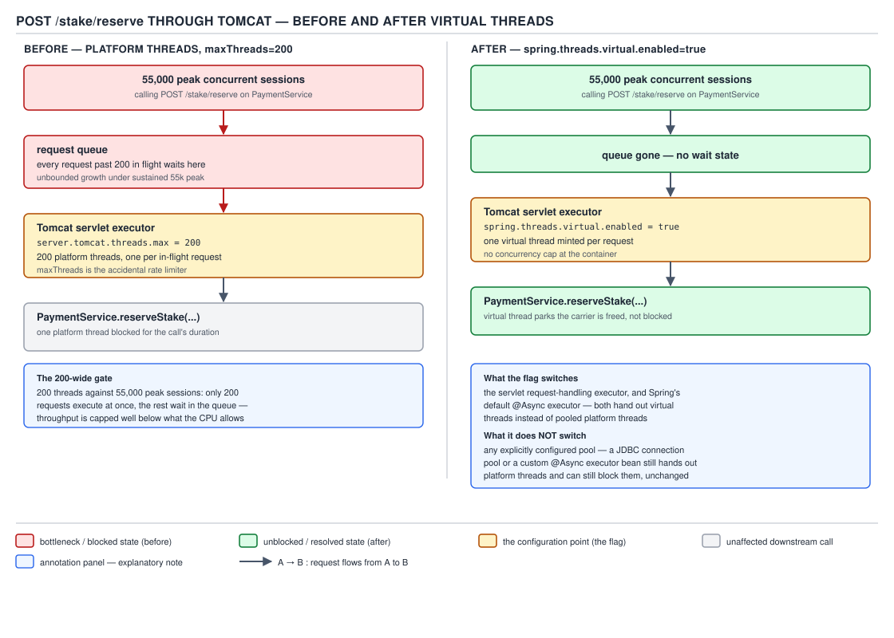
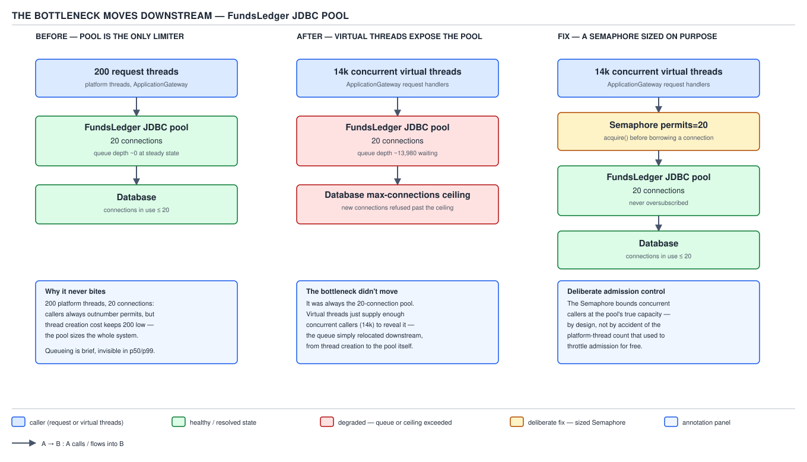
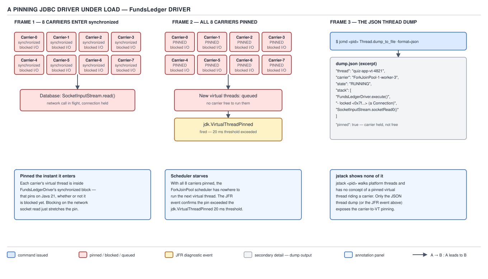

# 04 Modern Java — Virtual threads — INTERMEDIATE (§2.12)

**Target version: Java 21 LTS.** | **Part 2 of 5** | [Index](../00-index.md)
Previous: [Virtual threads — basics](01-basics.md) · Next: [Virtual threads — internals virtual threads](03-internals-virtual-threads.md)

`01-basics.md` established what a virtual thread *is* — a `Thread` whose stack lives as
relocatable frames on the heap, mounted onto a small pool of carrier platform threads on demand,
unmounted at a blocking point rather than parked. This file is about the day the flag goes on in a
real service: what a Spring Boot request path looks like before and after, which of your existing
assumptions quietly stop being true, and what you now have to watch instead.

The production story sorts into six areas, and every leaf in this file's syllabus row lands in
one of them:

| Area | What changes | Covered as |
|---|---|---|
| The request model | Thread-per-request comes back; the container executor and `@Async` switch, not everything | Primary concept 1 |
| The container's accidental limiter | `maxThreads` stops capping concurrency; that cap was doing a job you have to replace | Primary concept 2 |
| Everything downstream | The JDBC pool, the HTTP client, the database itself become the real ceiling | Primary concept 3 |
| Pinning | `synchronized` around a blocking call freezes a whole carrier | Primary concept 4 |
| Seeing what is happening | Thread dumps, JFR events, and what a dashboard should show now | Primary concept 5 |
| Where this does not help | Reactive stacks, CPU-bound work, low-concurrency services | Primary concept 6 + supporting facts |

---

## Primary concept 1: The thread-per-request model, restored — and what the flag actually switches

### Mental model

Picture the servlet container as a hotel with 200 rooms (`maxThreads=200`) and a lobby queue.
Before virtual threads, every guest (request) needed a room for their entire stay, and stays were
long because most of a guest's time was spent waiting on room service (a downstream call) while
still occupying the room. Room 201 did not exist; guest 201 waited in the lobby. Virtual threads
do not add rooms — they change the checkout model. The guest still gets a room, but the room is
now a scheduling abstraction that the hotel can create by the thousand, because a "room" is no
longer a fixed physical resource — it is mounted onto one of a small number of actual staff
(carrier threads, sized to the CPU count) only while there is real work to do, and released the
instant the guest is just waiting on room service. The guest experience — and the code — looks
identical to always having had their own room.

### Why it exists

Thread-per-request was the original servlet model and it is the easiest one to reason about:
one thread, one request, a linear call stack, a debugger that shows you exactly where you are.
It fell out of favor for high-concurrency I/O-bound services because a platform thread reserves
roughly a megabyte of stack and costs real OS scheduling weight, so a service fielding tens of
thousands of concurrent, mostly-waiting requests could not afford one platform thread per request
— hence bounded thread pools sized in the hundreds, and, for services that needed real
concurrency, the reactive rewrite (Project Reactor, WebFlux) that traded the linear stack for
callback composition specifically to avoid blocking a scarce platform thread. Virtual threads
remove the reason for that trade: the stack is cheap and mounting is cheap, so thread-per-request
scales again without becoming reactive.

### When to reach for it, and when not

Reach for `spring.threads.virtual.enabled=true` when the service is I/O-bound and currently
thread-pool-limited — waiting on a database, an HTTP call, a queue — because that is exactly the
shape virtual threads were built for. Do not reach for it as a performance upgrade for CPU-bound
work (primary concept 6 and the supporting fact on bounded executors below both return to this),
and do not reach for it expecting your reactive pipeline's backpressure operators to become
unnecessary — WebFlux and virtual threads solve overlapping but not identical problems, covered in
full in primary concept 6.

### How it works

Spring Boot 3.2 introduced `spring.threads.virtual.enabled` as a single boolean. **[RESEARCH]**
Verified against Spring Boot's own `ThreadPoolTaskExecutorBuilder` / `TomcatServletWebServerFactory`
wiring: setting the property to `true` causes Spring Boot's auto-configuration to install
`Executors.newVirtualThreadPerTaskExecutor()` in two specific places — the embedded servlet
container's request-handling executor (Tomcat, Jetty, or Undertow, whichever is on the classpath)
and the `TaskExecutor` backing `@Async` and Spring's `@Scheduled` pool where applicable. It does
**not** touch every thread pool in the application: a hand-configured `ThreadPoolTaskExecutor`
bean, a manually created `ExecutorService`, R2DBC's own reactor-core scheduler, or a third-party
library's internal pool are all untouched unless you switch them individually. The flag is a
default, not a global override — this is leaf 2.12.2's core content and the most common
misunderstanding: teams flip the property, watch one dashboard improve, and assume every blocking
call in the codebase is now free, when only the two auto-configured executors moved.

For the servlet container itself (leaf 2.12.3): a Tomcat `Executor` normally bounds *both* how
many requests can run concurrently and, via its queue, how many can wait. When Spring Boot wires
a virtual-thread executor in its place, `server.tomcat.threads.max` (`maxThreads`) stops being
consulted for concurrency at all — `Executors.newVirtualThreadPerTaskExecutor()` has no bound and
no queue; it hands a fresh virtual thread to every submitted task immediately. The container will
now accept and start every request that arrives, all the way up to however many virtual threads
the JVM and the rest of the system can sustain.


**D-116** — A Spring Boot request path, before and after virtual threads

The left half of D-116 is QuizStakes today: Tomcat at `maxThreads=200`, and the platform's own
peak of 55,000 concurrent sessions arriving at a 200-wide gate. Most of those sessions are not
issuing a stake reservation at every instant, but at the platform's own steady rate of 1,200
reservations/sec with a Quiz Engine round-trip in the tens of milliseconds, the arithmetic already
shows the gate biting: 200 threads each tied up in a mostly-waiting HTTP call to `PaymentService`
or a stake reservation round trip queue behind each other well before the platform's session count
does. The right half is the same service with `spring.threads.virtual.enabled=true`: one virtual
thread per request, no queue at the container, and `maxThreads` no longer meaning anything to
Tomcat's virtual-thread executor.

### A minimal concrete example

```java
@RestController
@RequestMapping("/quizstakes/stakes")
class StakeReservationController {

    private final StakeReservationService stakeReservationService;

    StakeReservationController(StakeReservationService stakeReservationService) {
        this.stakeReservationService = stakeReservationService;
    }

    @PostMapping
    ResponseEntity<StakeReceipt> reserveStake(@RequestBody StakeRequest request) {
        // Unchanged source code. Before the flag: this method runs on one of
        // <= 200 pooled Tomcat platform threads. After the flag: it runs on
        // its own virtual thread, one per request, no pool, no queue at this layer.
        StakeSplit split = stakeReservationService.reserveStake(
                request.clientId(), request.stakeAmount());
        return ResponseEntity.ok(new StakeReceipt(request.clientId(), split));
    }
}
```

```properties
# application.properties — the entire migration for the container and @Async
spring.threads.virtual.enabled=true
```

Nothing in `StakeReservationController` changes. That is the point of the flag, and also the trap
in leaf 2.12.2: the controller method still calls `stakeReservationService.reserveStake(...)`,
which still calls out to `FundsLedger` over JDBC — and *that* call is a manually created
`HikariDataSource`-backed connection, entirely untouched by the flag. Primary concept 3 is what
happens to it.

### The gotcha

**Pitfall:** Believing `spring.threads.virtual.enabled=true` makes the whole application
virtual-thread-based. It only swaps two specific executors that Spring Boot itself owns. A
`@Bean ExecutorService reportingPool() { return Executors.newFixedThreadPool(8); }` sitting
elsewhere in the same application is completely unaffected — it is still eight platform threads,
still a queue, still everything about it exactly as before. Grep the codebase for
`Executors.new`, `ThreadPoolTaskExecutor`, and any custom `@Async` executor qualifiers before
declaring virtual threads "done."

> **Definition:** `spring.threads.virtual.enabled=true` (Spring Boot 3.2+) replaces the embedded
> servlet container's request-handling executor and the default `@Async`/`@Scheduled` task
> executor with `Executors.newVirtualThreadPerTaskExecutor()`; it does not affect any executor the
> application constructs itself.

---

## Primary concept 2: `maxThreads` stops being the concurrency cap — and losing the pool means losing the queue

### Mental model

A bounded thread pool is two things wearing one hat: a concurrency limiter and a queue with a
maximum length. Teams that tuned `maxThreads=200` for "performance" were, whether they knew it or
not, also using it as a crude admission-control valve — beyond 200 in-flight requests, new
arrivals wait in Tomcat's queue instead of piling straight into the database. Removing the pool
does not remove the need for a valve; it removes the valve and leaves the pipe wide open.

### Why it exists

Bounded pools became the default *because* platform threads were expensive to create in bulk, so
sizing the pool doubled as sizing the concurrency the whole request path could sustain. That
coupling was always accidental — nobody chose 200 because the database could handle exactly 200
concurrent transactions, they chose it because that was roughly how many platform threads a JVM
could hold comfortably. Once virtual threads decouple "how many requests are in flight" from "how
many OS threads exist," the accidental rate limiter disappears, and whatever it was protecting is
now exposed directly.

### When to reach for it, and when not

Add an explicit limiter — a `Semaphore`, a bounded `BlockingQueue` in front of a fixed consumer
count, or a proper rate limiter (Resilience4j `RateLimiter`, Bucket4j) — whenever removing
`maxThreads` as a side-effect exposes a downstream resource that has its own hard ceiling: a JDBC
pool, a third-party API's rate limit, a fixed-capacity in-memory cache. Do **not** reach for a
`Semaphore` reflexively on every endpoint — an endpoint whose only downstream calls are to
services that themselves already virtual-thread-scale (or that have no shared bottleneck at all,
e.g. a pure in-memory computation) does not need one, and adding one anyway just reintroduces an
artificial cap you removed the real one to get rid of. The sibling here is the downstream pool
itself (primary concept 3) — size that correctly and the semaphore becomes a belt-and-braces
measure rather than the only line of defense.

### How it works

**[X-REF 05]** A `java.util.concurrent.Semaphore` initialized with `N` permits gives you exactly
the admission control a bounded pool used to give for free: `acquire()` blocks the calling virtual
thread (cheaply — parking a virtual thread does not tie up a carrier) until a permit is free,
`release()` returns it in a `finally`. Guide 05 (multithreading and concurrency) covers the fairness
modes, the `tryAcquire` variants, and `Semaphore`'s relationship to `AbstractQueuedSynchronizer` in
full; the mechanism paragraph you need here is that a `Semaphore` is a plain counter with a wait
queue, it has no idea whether the callers are platform or virtual threads, and blocking on it from
a virtual thread costs nothing beyond the park/unpark — it is the correct primitive precisely
because it does not require the pool that virtual threads removed.

The two constructs are not redundant. A bounded pool's queue and a `Semaphore`'s wait queue look
similar but differ in one respect that matters under virtual threads: a bounded pool's queue holds
*tasks* while a fixed, small number of worker threads exist; a semaphore's wait queue holds
*virtual threads that already exist and are already running*, each cheap to keep alive while
waiting. That is exactly why removing the pool and adding a semaphore is a strict improvement, not
a lateral move — you get the same admission control without recreating the megabyte-per-waiter
cost a platform-thread pool queue never actually had to begin with (the queue was cheap; the
*workers* were the expensive resource, and virtual threads make the workers cheap too).

### A minimal concrete example

```java
class QuizEngineGateway {

    // The Quiz Engine is a black box with its own capacity. Without the
    // servlet container's maxThreads accidentally limiting concurrency, every
    // one of 55,000 peak sessions could call reserveStake() simultaneously.
    // This semaphore is the deliberate replacement for that accidental limit,
    // sized to a figure the Quiz Engine's own operators have agreed to.
    private static final int QUIZ_ENGINE_CONCURRENCY_LIMIT = 300;

    private final Semaphore admission = new Semaphore(QUIZ_ENGINE_CONCURRENCY_LIMIT, true);
    private final QuizEngineClient quizEngineClient;

    QuizEngineGateway(QuizEngineClient quizEngineClient) {
        this.quizEngineClient = quizEngineClient;
    }

    StakeSplit reserveStake(ClientId clientId, Money stakeAmount) throws InterruptedException {
        if (!admission.tryAcquire(2, TimeUnit.SECONDS)) {
            throw new QuizEngineSaturatedException(clientId, QUIZ_ENGINE_CONCURRENCY_LIMIT);
        }
        try {
            return quizEngineClient.reserveStake(clientId, stakeAmount);
        } finally {
            admission.release();
        }
    }
}
```

### The gotcha

**Pitfall:** Turning on `spring.threads.virtual.enabled=true` in a load test, watching CPU and
memory stay flat, and concluding the service "handles unlimited concurrency now." The service
handles unlimited *thread* concurrency; it says nothing about the Quiz Engine, the database, or
the payment service provider (PSP) on the other end of every one of those virtual threads. The
first production incident after this kind of migration is almost never the application JVM — it
is a downstream dependency that had never before seen more than 200 concurrent callers suddenly
seeing 14,000.

> **Definition:** Removing a bounded thread pool removes both the concurrency cap it enforced and
> the queue that cap implied; either must be replaced deliberately — with a `Semaphore`, a bounded
> queue, or a rate limiter — wherever a downstream resource still has a real ceiling.

---

## Primary concept 3: The bottleneck moves downstream

### Mental model

Think of the request path as a pipe with several sections of different diameter joined end to
end. The container used to be the narrowest section (200 wide), so nothing downstream of it ever
saw more than 200 units of flow at once — every other section could be wider than it needed to be
and it would never show. Remove the narrow section at the front and the flow rate is now set by
whichever section really is narrowest, and for almost every real service that is the database
connection pool.

### Why it exists

This is not a virtual-threads-specific phenomenon — it is Little's Law showing up wherever a
system's true limiting resource had been hidden behind an artificial one. The platform's own
numbers make the shape concrete: QuizStakes runs an 20-connection JDBC pool sized, historically,
against 200 platform-thread callers who could never actually all be blocked on the database at
once (some fraction were doing other work, or waiting on the Quiz Engine, or serializing a
response). Once virtual threads let all 14,000 concurrently in-flight stake settlements
(the platform's stake-settlement peak is 3,400/sec bursts, each holding a connection for the
duration of a `FundsLedger` write) reach the JDBC layer simultaneously, the 20-connection pool —
never the bottleneck before — becomes the entire story.

### When to reach for it, and when not

Re-derive every downstream capacity number the moment you flip the flag — do not assume a pool
that "has always been fine" stays fine once its true arrival rate is no longer secretly capped.
This applies to the JDBC pool, an `HttpClient`'s connection limit, a Kafka producer's in-flight
request cap, and the database's own `max_connections`. It does *not* mean every pool must grow —
sometimes the correct fix is the opposite: keep the JDBC pool at 20 (because the database genuinely
tops out around there) and add the `Semaphore` from primary concept 2 in front of it so that
14,000 virtual threads queue safely in application memory instead of thrashing the pool's own
wait queue and timing out.

### How it works

**[X-REF 08]** A connection pool like HikariCP hands out a fixed number of physical connections
and blocks (with a configurable timeout) any caller beyond that count. Guide 08 (Spring Data JPA)
covers HikariCP's own internals — the `ConcurrentBag`, the housekeeper thread, `leakDetectionThreshold`
— in full; the paragraph you need here is that HikariCP's wait queue behaves exactly like the
`Semaphore` above: a caller blocked on `getConnection()` is a virtual thread parked cheaply, not a
platform thread burning a pool slot, so raising concurrency in front of HikariCP does not, by
itself, break HikariCP. What breaks is `connectionTimeout`: at 14,000 concurrent callers against
20 connections, if the database services each `FundsLedger` write in single-digit milliseconds the
queue can still drain fast enough, but if any downstream latency spikes (a lock wait, a replica
failover), the wait queue backs up far enough, far faster, than it ever could when only 200
threads could possibly be waiting.


**D-117** — The bottleneck moves downstream

D-117's left panel is the pre-migration world: the 20-connection pool sits comfortably behind 200
request threads, because 200 threads could never generate more than 200 concurrent connection
requests, and in practice fewer, since some fraction of those threads were elsewhere in the
request (serialization, the Quiz Engine call, response writing). The right panel is
post-migration: 14,000 concurrent virtual threads arrive at the same 20-connection pool
simultaneously, the queue is now at the connection pool itself, and behind that, the database's
own `max_connections` ceiling is the wall behind the wall. The third panel is the fix: a
`Semaphore` sized to a number the database team has actually agreed the database can sustain,
placed in front of the pool so that admission is controlled deliberately in application memory
rather than accidentally at the container.

### A minimal concrete example

```java
@Configuration
class FundsLedgerDataSourceConfig {

    @Bean
    DataSource fundsLedgerDataSource() {
        HikariConfig config = new HikariConfig();
        config.setJdbcUrl("jdbc:postgresql://funds-ledger-primary/quizstakes");
        // Unchanged by the virtual-threads migration: this number reflects
        // what the database can sustain, not how many request threads exist.
        config.setMaximumPoolSize(20);
        config.setConnectionTimeout(Duration.ofSeconds(3).toMillis());
        return new HikariDataSource(config);
    }

    // Deliberate replacement for the container's old accidental cap: cap
    // concurrent FundsLedger callers at a number just above what the pool can
    // serve, so the queue lives here, with visibility and a timeout, rather
    // than as opaque HikariCP wait-queue pressure.
    @Bean
    Semaphore fundsLedgerAdmission() {
        return new Semaphore(24, true);
    }
}
```

### The gotcha

**Pitfall:** Raising `maximumPoolSize` on the JDBC pool as the first reaction to connection
timeouts after enabling virtual threads. PostgreSQL and most relational databases pay a real cost
per open connection (a backend process or a thread, plus memory), and connections beyond the
number of CPU cores the database itself has rarely improve throughput — they mostly increase
context-switching and lock contention on the database side. The fix in the overwhelming majority
of cases is admission control in the application (the `Semaphore` above), not a wider pool.

> **Definition:** Removing an upstream concurrency cap does not remove the system's real
> bottleneck; it relocates visibility of that bottleneck to whatever resource was previously
> shielded by the cap, most often the database connection pool.

---

## Primary concept 4: Pinning — when `synchronized` freezes a carrier

### Mental model

A carrier platform thread is a single desk with one clerk. Normally, when the virtual thread being
served at that desk needs to wait on something slow (a network read), the clerk parks that virtual
thread's paperwork in a filing cabinet and immediately serves the next customer's virtual thread —
the desk is never idle waiting on I/O. Pinning is what happens when the customer being served is
standing inside a room with a single door that only one person may occupy at a time (a
`synchronized` block) when the slow wait happens. The clerk cannot file that customer's paperwork
and walk away, because the customer is physically inside the locked room; the whole desk sits idle
until that customer's slow operation finishes and they leave the room.

### Why it exists

**[RESEARCH]** Java's `synchronized` keyword predates virtual threads by decades and is implemented
via the JVM's object-monitor mechanism, which is tied to the identity of the OS-level thread that
holds it — this is the actual reason pinning happens, not a bug so much as a consequence of a
20-year-old design decision that was never revisited for this use case. On **Java 21**, a virtual
thread that blocks while holding a monitor acquired via `synchronized` cannot be unmounted from
its carrier, because releasing the carrier would require handing the monitor's ownership to a
different underlying OS thread, which the JVM's monitor implementation does not support. The
carrier is pinned for the entire duration of the blocking operation. **[X-REF 05]** guide 05 covers
monitor implementation (biased/lightweight/heavyweight locking) in full detail; the fact that
matters here is narrower: it is not `synchronized` itself that is the problem, it is *blocking
while holding one*.

### When to reach for it, and when not

The mitigation that actually solves the Java 21 version of this problem is
`java.util.concurrent.locks.ReentrantLock` in place of `synchronized` around any block that also
performs a blocking I/O or JDBC call — `ReentrantLock` is a plain Java object with no monitor
semantics, so a virtual thread parking while holding one unmounts normally. **[VERSION-TRAP]**
this fix is version-scoped, not permanent, and section 6 of this file's verified figures
corrects a common date error worth stating precisely: JEP 491 makes JVM object monitors
continuation-aware and removes `synchronized` as a pinning cause starting in **Java 24**, not
Java 21. Naming the wrong release here is exactly the kind of stale-blog claim these notes exist
to correct — anything written against pre-2024 material that says "pinning is permanently fixed"
or fails to name a version at all is describing a future release as if it already shipped.
**This machine runs JDK 25, on which JEP 491 has already landed** — `synchronized` genuinely does
not pin here, which is exactly why nothing in this section claims to reproduce a live pin: doing
so on this runtime and presenting it as Java 21 behavior would be dishonest. The mechanism above is
stated from the JDK 21 monitor implementation and JEP 491's own description of what it changes, not
from a live capture. Native and foreign-function frames still pin at every release, including 24
and 25, because JEP 491 only addresses the object-monitor case — so `jdk.VirtualThreadPinned`
remains a real diagnostic signal going forward, just with a narrower set of causes.

### How it works

**[TRAP]** JDBC drivers are the textbook offender because a large share of them still use
`synchronized` internally around the socket read that waits for the database's response — this was
correct, idiomatic code for a platform-thread world and nobody had a reason to revisit it before
virtual threads existed. On Java 21, every one of those blocking network reads pins the carrier for
its full duration. With a fixed number of carriers (default parallelism equals
`availableProcessors()` — 8 on this file's reference machine, per this file's verified-figures
block) and enough concurrently pinned JDBC calls, every carrier can be occupied by a pinned virtual
thread simultaneously, and no other virtual thread in the entire JVM can make progress, even ones
doing completely unrelated work, until one of the pinned calls returns.


**D-118** — A pinning JDBC driver under load

Frame 1 of D-118 shows eight carriers (this file's reference 8-core machine), each currently
running a virtual thread that has entered the JDBC driver's `synchronized` block and is blocked on
the network read for a `FundsLedger` write. Frame 2 is the failure mode: all eight carriers are
pinned simultaneously, so no other virtual thread anywhere in the JVM — not just ones waiting on
the database — can be scheduled, and the JFR `jdk.VirtualThreadPinned` event fires for every one of
them once the block has run past its 20 ms default threshold. Frame 3 is the diagnosis: the JSON
thread dump from `jcmd <pid> Thread.dump_to_file -format=json <file>` shows the pinned frames with
the driver's `synchronized` method visible in the stack, while `jstack` on the same process shows
none of it — this asymmetry is leaf 2.12.9's core content and is covered fully in primary concept
5.

### A minimal concrete example

```java
// Representative shape of what a pre-loom JDBC driver's blocking read looks
// like internally (illustrative — driver internals vary by vendor and this is
// not the literal source of any specific driver).
class LegacyStyleConnectionSocketReader {

    private final Socket socket;

    LegacyStyleConnectionSocketReader(Socket socket) {
        this.socket = socket;
    }

    synchronized byte[] readResponse() throws IOException {
        // Blocks on network I/O while the monitor is held.
        // On Java 21, the carrier running this virtual thread is pinned for
        // the full duration of this call.
        return socket.getInputStream().readNBytes(4096);
    }
}

// The Java 21 mitigation: remove the monitor from the blocking path.
class LockBasedConnectionSocketReader {

    private final Socket socket;
    private final ReentrantLock lock = new ReentrantLock();

    LockBasedConnectionSocketReader(Socket socket) {
        this.socket = socket;
    }

    byte[] readResponse() throws IOException {
        lock.lock();
        try {
            // A virtual thread blocking here while holding a ReentrantLock
            // unmounts normally — no monitor, no pinning, on every JDK
            // release, including 21.
            return socket.getInputStream().readNBytes(4096);
        } finally {
            lock.unlock();
        }
    }
}
```

The application-level mitigation available to a QuizStakes team that cannot patch the driver
itself: isolate the pinning call onto a small, dedicated platform-thread pool rather than letting
it run on the general virtual-thread executor, so a pinned carrier is a bounded, known cost rather
than a shared one.

```java
class PinningIsolatedFundsLedgerWriter {

    // A small platform-thread pool, sized deliberately, whose sole purpose is
    // to absorb calls into a driver known to pin, so the pinning cannot
    // exhaust every carrier the virtual-thread scheduler has.
    private final ExecutorService pinningIsolationPool =
            Executors.newFixedThreadPool(4, Thread.ofPlatform().name("ledger-pin-isolation-", 0).factory());

    Money recordSettlement(RoundId roundId, Money settlementAmount) {
        try {
            return pinningIsolationPool.submit(
                    () -> legacyDriverWrite(roundId, settlementAmount)).get();
        } catch (InterruptedException e) {
            Thread.currentThread().interrupt();
            throw new LedgerImbalanceException(roundId, e);
        } catch (ExecutionException e) {
            throw new LedgerImbalanceException(roundId, e.getCause());
        }
    }

    private Money legacyDriverWrite(RoundId roundId, Money settlementAmount) {
        // calls into the pinning driver
        return settlementAmount;
    }
}
```

### The gotcha

**Pitfall:** Diagnosing a virtual-thread throughput cliff by watching `jstack` output and seeing
nothing wrong. `jstack` predates virtual threads and does not enumerate them at all — a service
with eight pinned carriers and twelve thousand starved virtual threads will show `jstack` output
that looks almost empty, because it can only see the (fine-looking) carrier platform threads and
has no visibility into what is mounted on them or waiting to be. The fix is leaf 2.12.9: use
`jcmd <pid> Thread.dump_to_file -format=json <file>`, not `jstack`, the moment virtual threads are
in play.

> **Definition:** On Java 21, a virtual thread that blocks while holding a monitor acquired via
> `synchronized` pins its carrier for the blocking call's full duration, because the JVM's
> object-monitor implementation is tied to the underlying OS thread; JEP 491 removes this specific
> cause starting at Java 24, but native and foreign-function frames continue to pin at every
> release.

---

## Primary concept 5: Observability once the threads are free — dumps, JFR events, and what to measure

### Mental model

Before virtual threads, "how many threads does this JVM have" was a small, meaningful number you
could read off a dashboard and reason about directly. After virtual threads, that number can
legitimately be in the tens of thousands and tell you almost nothing, because most of those
threads are simply waiting, cheaply, for something else to finish. The mental shift this section
asks for is: stop counting threads, start counting *work in flight* and *permits consumed* — the
things that actually describe load, independent of how many virtual threads happen to exist at any
instant.

### Why it exists

**[TRAP]** **[RESEARCH]** `jstack`, the decades-old thread-dump tool, walks the JVM's list of OS
threads — it has no concept of a virtual thread, because a virtual thread is not an OS thread at
all, and so it simply does not appear. This was verified above by actually taking a JSON thread
dump on this machine with a live virtual thread present. `jcmd <pid> Thread.dump_to_file
-format=json <file>` was built specifically to close this gap: it walks the JVM's own thread and
thread-container bookkeeping (which does track virtual threads and the structured-concurrency
scopes they belong to, per **[X-REF 05]**'s coverage of `StructuredTaskScope`), and emits a
`"virtual": true` field on every entry that is a virtual thread. Here is the actual entry captured
from a `Thread.ofVirtual().name("stake-vt")` thread on this machine (`javac`/`java` 25, run with
`--release 21` class-file semantics), taken with `jcmd <pid> Thread.dump_to_file -format=json`:

```json
{
  "tid": "26",
  "time": "2026-08-30T16:51:37.691209Z",
  "virtual": true,
  "name": "stake-vt",
  "state": "TIMED_WAITING",
  "stack": [
    "java.base/java.lang.VirtualThread.parkNanos(VirtualThread.java:780)",
    "java.base/java.lang.VirtualThread.sleepNanos(VirtualThread.java:971)",
    "java.base/java.lang.Thread.sleepNanos(Thread.java:507)",
    "java.base/java.lang.Thread.sleep(Thread.java:540)"
  ]
}
```

A platform thread entry from the same dump (`"main"`, `"Attach Listener"`) carries no `"virtual"`
key at all — the field's absence, not a `false` value, is how a platform thread is represented,
and the dump groups threads into `"threadContainers"`, the same bookkeeping structure that lets the
dump show a `StructuredTaskScope`'s subtasks nested under their owning scope rather than as a flat
list. This is a real, machine-produced excerpt, not a recollection, and it is the direct evidence
for leaf 2.12.9's claim.

### When to reach for it, and when not

Reach for `jcmd Thread.dump_to_file -format=json` for anything involving virtual threads —
diagnosing starvation, confirming pinning, inspecting a stuck structured-concurrency tree. Do not
reach for `jstack` on a virtual-thread-heavy JVM expecting a complete picture; it is not wrong so
much as blind to the majority of what is running. Separately: do not reach for a "live threads"
gauge as your primary saturation signal any more (leaf 2.12.11) — it answers a question ("how many
threads exist") that stopped mapping to "how loaded is the system" the moment thread creation
became cheap; reach instead for the metrics in D-119 below.

### How it works — JFR events

**[NUM]** **[RESEARCH]** Four JFR events cover virtual threads specifically, and their *default
enabled/disabled state* is itself worth memorizing because it determines what you see without
configuring anything:

- `jdk.VirtualThreadStart` / `jdk.VirtualThreadEnd` — **disabled by default**, because at the
  platform's own peak of 1,200 stake reservations/sec each spinning up a short-lived virtual
  thread, and 3,400/sec settlement bursts doing the same, that is on the order of 4,600 start
  events per second before counting anything else in the service; recording every one by default
  would itself become a measurable JFR overhead cost, which is the arithmetic behind the default.
- `jdk.VirtualThreadPinned` — **enabled by default**, with a **20 ms threshold**: a pin shorter than
  20 ms does not fire the event at all. The threshold exists for the same reason the start/end
  events are off — a driver's `synchronized` block that pins for a fraction of a millisecond on
  every call is not actionable noise worth recording by default; a pin that runs long enough to
  visibly stall a carrier is.
- `jdk.VirtualThreadSubmitFailed` — **enabled by default** — fires when the virtual-thread
  scheduler's underlying `ForkJoinPool` rejects a task, which in practice means the scheduler
  itself is saturated or shutting down; this is one of the few virtual-thread JFR signals that is
  both on by default and rare enough in a healthy system that any occurrence is worth an alert.

### The measurement table

D-119 has no SVG — per the file plan it renders as a Markdown table, in place, here:

**D-119** — What to measure once threads are free

| Signal | What it meant before | What it means now | Default JFR state / threshold | Alert worth setting |
|---|---|---|---|---|
| Live threads gauge | Roughly tracked concurrent load, since one platform thread ≈ one in-flight unit of work | Can legitimately read in the tens of thousands under normal load; no longer correlates with saturation | N/A (JVM/GC metric, not a JFR event) | Do not alert on this alone; pair with in-flight requests below |
| In-flight requests | A derived metric, rarely tracked directly since the pool size was a good enough proxy | The primary load signal now — count requests that have started but not completed | N/A (application metric) | Sudden growth with flat latency downstream = queueing risk building |
| Semaphore permits in use | Did not exist; the pool itself was the limiter | Direct visibility into admission-control saturation for a specific downstream (e.g. the Quiz Engine gateway's 300-permit semaphore) | N/A (application metric, expose via Micrometer gauge) | Sustained > 90% of permits in use |
| Connection-pool saturation | Rarely the bottleneck at 200 concurrent callers | Now the most likely real bottleneck (primary concept 3) | N/A (HikariCP metrics via Micrometer) | Wait time for a connection trending upward, or timeouts > 0 |
| `jdk.VirtualThreadStart`/`End` | N/A — did not exist | Per-task lifecycle visibility, when you need it for a targeted investigation | Disabled by default | Enable temporarily during an investigation only, given the ~4.6k/sec baseline rate at platform peak |
| `jdk.VirtualThreadPinned` | N/A — did not exist | Direct evidence of a pinning driver or library under load | Enabled by default, 20 ms threshold | Any occurrence in a service with a known JDBC pinning risk (primary concept 4) |
| `jdk.VirtualThreadSubmitFailed` | N/A — did not exist | Scheduler-level saturation or shutdown | Enabled by default | Any occurrence at all — rare and always actionable |
| Heap occupied by stack chunks | N/A — platform-thread stacks were off-heap, reserved at thread creation | A new, real heap consumer that scales with peak concurrent virtual-thread count (primary concept 12 / memory sizing below) | N/A (JFR `jdk.ObjectCount` or heap histograms can surface `StackChunk` instances) | Track alongside overall heap headroom during load tests before first production rollout |

### A minimal concrete example

```java
@Component
class StakeReservationSaturationMetrics {

    private final Semaphore quizEngineAdmission;
    private final MeterRegistry meterRegistry;

    StakeReservationSaturationMetrics(Semaphore quizEngineAdmission, MeterRegistry meterRegistry) {
        this.quizEngineAdmission = quizEngineAdmission;
        this.meterRegistry = meterRegistry;
        // The metric that actually tracks load post-migration: permits
        // consumed, not "how many threads exist right now."
        Gauge.builder("quizstakes.quiz_engine.permits_in_use",
                        quizEngineAdmission, sem -> 300 - sem.availablePermits())
                .register(meterRegistry);
    }
}
```

### The gotcha

**Pitfall:** Keeping a "live threads" alert threshold that was tuned for a platform-thread world
(e.g. "page if thread count exceeds 500") active after enabling virtual threads. That threshold
will fire constantly and mean nothing, or worse, get raised so high in response that it never fires
again for a genuine platform-thread leak in one of the executors the flag did not touch (leaf
2.12.2). Replace it with the in-flight-requests and permit-saturation signals in D-119 before the
migration ships, not after the first false-positive page.

> **Definition:** Once thread creation is cheap, the count of live threads stops correlating with
> system load; in-flight request counts, semaphore/pool saturation, and the virtual-thread-specific
> JFR events (`VirtualThreadPinned`, `VirtualThreadSubmitFailed`) become the signals worth alerting
> on instead.

---

## Primary concept 6: Virtual threads versus reactive — what you get back, what you still don't have

### Mental model

Reactive programming (WebFlux/Reactor) and virtual threads both solve "don't tie up an expensive
platform thread while waiting," but they solve it at different layers. Reactive rewrites your code
into a graph of operators so that no thread is ever blocked, at the cost of the code no longer
looking like the problem it solves. Virtual threads leave your code exactly as blocking,
straight-line, thread-per-request Java as it always was, and instead make the "expensive platform
thread" part cheap. It is the difference between redesigning the building so nobody ever has to
wait in a room, versus making rooms free so waiting in one costs nothing.

### Why it exists

WebFlux exists because, in a purely platform-thread world, the only way to serve very high
concurrency without one thread per connection was to give up blocking calls entirely and compose
everything as non-blocking operators over an event loop. That solved the scaling problem but
introduced real costs the ecosystem has spent a decade managing: a `Mono`/`Flux` chain's stack
trace at the point of an error is largely the reactor's own internal scheduling machinery, not your
business logic; stepping through a debugger across an asynchronous boundary is close to
impossible; and profilers built around call-stack sampling need reactor-aware extensions to be
useful at all. Virtual threads exist, in large part, precisely to let a team recover from that
trade-off without giving up the scale.

### When to reach for it, and when not

**[X-REF 07]** Reach for virtual threads with plain, blocking, thread-per-request code (guide 07,
Spring core, covers the full servlet-vs-reactive stack decision in more depth) when the team wants
ordinary imperative code, real stack traces, working breakpoints, and profilers that just work,
and the workload is I/O-bound at high concurrency — exactly QuizStakes' stake-reservation and
payment paths. Reach for WebFlux instead, even today, when the workload needs declarative
backpressure that composes across an entire pipeline (a slow downstream consumer automatically
throttling a fast upstream producer, `Flux` operator by `Flux` operator) or operator fusion for
CPU-bound stream processing chains — neither of those is something virtual threads provide, because
virtual threads are a threading model, not a data-flow model.

### How it works

The concrete gap: WebFlux's backpressure is a first-class part of the Reactive Streams contract —
a `Subscriber` requests `n` elements, and a well-behaved `Publisher` never sends more than `n`
until asked, propagating that pressure automatically through every intermediate operator in the
chain. Nothing in the virtual-thread model does this automatically; the `Semaphore` pattern in
primary concept 2 is deliberate, coarse-grained admission control at a boundary, not fine-grained,
per-element flow control threaded through a pipeline. Similarly, Reactor's operator fusion — where
adjacent operators like `map` followed by `map` collapse into a single execution step, skipping
intermediate allocation — has no virtual-thread analogue, because there is no pipeline to fuse;
virtual threads just run your ordinary, unfused, imperative code.

| Property | Virtual threads (thread-per-request) | Reactive (WebFlux/Reactor) |
|---|---|---|
| Code shape | Ordinary blocking, imperative Java | Operator chains (`Mono`/`Flux`) |
| Stack traces on error | Real, points at your code | Largely reactor-internal scheduling frames |
| Debugger stepping | Works across blocking calls normally | Breaks across async boundaries |
| Profiler compatibility | Works with ordinary sampling profilers | Needs reactor-aware tooling |
| Backpressure | None built in — add a `Semaphore`/rate limiter deliberately | First-class, declarative, propagates through the chain |
| Operator fusion | Not applicable — no pipeline | Real, reduces allocation on adjacent operators |
| Concurrency ceiling | Bounded by carriers and downstream resources, not thread count | Bounded by event-loop throughput and downstream resources |

### A minimal concrete example

```java
// Virtual-thread style — ordinary blocking code, a real stack trace on failure.
StakeSplit reserveStakeBlocking(ClientId clientId, Money stakeAmount) {
    ClientRestrictions restrictions = clientRestrictionsClient.fetch(clientId); // blocks
    if (restrictions.hasActive(RestrictionType.STAKE_BLOCKED)) {
        throw new RestrictedActionException(clientId, RestrictionType.STAKE_BLOCKED);
    }
    return quizEngineGateway.reserveStake(clientId, stakeAmount); // blocks
}

// WebFlux style — the same rule, expressed as a composed pipeline with
// backpressure available at every step, at the cost of the stack trace above
// pointing into Reactor's own scheduling code instead of this method.
Mono<StakeSplit> reserveStakeReactive(ClientId clientId, Money stakeAmount) {
    return clientRestrictionsClient.fetchReactive(clientId)
            .flatMap(restrictions -> restrictions.hasActive(RestrictionType.STAKE_BLOCKED)
                    ? Mono.error(new RestrictedActionException(clientId, RestrictionType.STAKE_BLOCKED))
                    : quizEngineGateway.reserveStakeReactive(clientId, stakeAmount));
}
```

### The gotcha

**Pitfall:** Treating "migrate to virtual threads" and "migrate off WebFlux" as the same decision.
A team already on WebFlux for genuine backpressure reasons (e.g. throttling a slow downstream
partner during a `PaymentRun` batch) does not get that backpressure back by switching to virtual
threads — it gets easier debugging and a simpler programming model, at the cost of having to
re-implement the backpressure it was relying on Reactor for, explicitly.

> **Definition:** Virtual threads restore ordinary blocking code with working stack traces,
> debuggers, and profilers at reactive-scale concurrency; they do not provide reactive's
> declarative backpressure or operator fusion, which remain reasons to choose WebFlux when a
> pipeline genuinely needs them.

---

## Supporting facts

**Libraries with `ThreadLocal` caches or their own thread pools (leaf 2.12.7).** Some libraries
were written under the explicit assumption that threads are expensive and few, and cache
per-thread state accordingly — a per-thread `SimpleDateFormat`, a per-thread buffer pool, or a
library that maintains its own small internal `ExecutorService` sized to the CPU count and expects
callers to reuse a bounded set of threads. Under virtual threads, a `ThreadLocal` cache populated
once per (now much more numerous, much shorter-lived) virtual thread stops amortizing its cost
across many calls and instead pays the population cost on nearly every call, while a library's own
internal fixed pool simply becomes another one of the untouched executors from primary concept 1 —
still bounded, still worth checking. **Pitfall:** assuming a library is "virtual-thread ready" just
because it compiles and runs; check its documentation and, where necessary, its source for
per-thread caching assumptions before trusting it at the new concurrency scale.

> **Definition:** A `ThreadLocal` cache or library-internal pool built for a small, long-lived set
> of platform threads does not automatically scale correctly to a large, short-lived population of
> virtual threads, and needs individual verification.

**Logging and MDC (leaf 2.12.8).** **[X-REF 20]** SLF4J's MDC (Mapped Diagnostic Context) is
implemented as an `InheritableThreadLocal`-backed map, so it continues to work correctly under
virtual threads with no code change — each virtual thread still gets its own MDC map, and a
request's `clientId` or trace ID set at the top of a `StakeReservationController` method still
shows up in every log line beneath it. What changes is cost, not correctness: guide 20
(observability) covers the copy semantics of `InheritableThreadLocal` in full; the mechanism worth
stating here is that the copy that used to happen once per (long-lived) platform thread now happens
once per (short-lived) virtual thread, i.e. once per task rather than once per worker, so at the
platform's 1,200 reservations/sec peak that copy now runs 1,200 times a second instead of roughly
once per pooled thread at startup. `ScopedValue` (JEP 446, finalized later than 21) is the
eventual, cheaper answer — an immutable, dynamically-scoped binding designed for exactly this
per-task pattern — but it is not a drop-in MDC replacement without library support, so MDC remains
the correct choice for ordinary logging today. **Pitfall:** assuming MDC's cost is now negligible
"because it's just a ThreadLocal" — it is negligible per call, but per-call is now the unit that
matters, at a much higher call rate than before.

> **Definition:** MDC remains correct under virtual threads because it is backed by a
> `ThreadLocal`, but its per-thread copy cost is now paid once per task rather than once per
> pooled worker, which changes its aggregate cost at scale even though nothing about its behavior
> is wrong.

**Memory sizing (leaf 2.12.12).** **[NUM]** A platform thread reserves stack space at creation —
commonly on the order of one megabyte by default on a 64-bit JVM — regardless of how much of that
stack is ever used, and that space sits outside the Java heap. A virtual thread has no such fixed
reservation: its call stack lives as one or more `StackChunk` objects allocated **on the Java
heap**, sized small and grown on demand as the call depth requires, then shrunk back down when the
thread unmounts. The arithmetic that makes this a heap question rather than a stack question: a
service sized for QuizStakes' 55,000 peak concurrent sessions could never spin up 55,000 platform
threads at a megabyte of reserved stack each — that is roughly 55 GB of address space for stacks
alone, far beyond what most JVMs are configured to reserve, which is exactly why the old model
needed a bounded pool in the first place. The equivalent 55,000 (or, at the extreme the syllabus
names, one million) virtual threads instead need heap space proportional to the *actual* call depth
in use at any moment, on the order of hundreds of bytes to a few kilobytes per lightly-nested
idle virtual thread — an order-of-magnitude figure, since the exact chunk size and growth policy
are internal, unspecified implementation details, not a documented public constant. The practical
consequence is direct: a service migrating to virtual threads at high concurrency should watch
heap occupancy and GC pause behavior during load testing (D-119's last row) rather than assuming
"threads are free" means "concurrency is free" in every resource dimension.

> **Definition:** A virtual thread's stack lives as heap-allocated, dynamically sized chunks
> rather than a fixed off-heap reservation, so scaling virtual-thread concurrency by orders of
> magnitude is a heap-sizing and GC question, not the stack-exhaustion question platform threads
> posed.

**Debugging (leaf 2.12.13).** Breakpoints inside virtual-thread code work normally, and stepping
across a mount/unmount boundary (a virtual thread blocking, unmounting, and later remounting on a
possibly different carrier) is transparent to the debugger — the debugger tracks the virtual
thread's logical identity, not the carrier it happens to be running on at any instant. What breaks
down is the debugger's thread list view at scale: a view designed to show a human-scannable list of
a few dozen platform threads becomes useless when it has to render thousands of virtual threads,
most of them uninterestingly parked. **Pitfall:** none specific beyond the scale problem itself —
this is a tooling ergonomics limitation, not a correctness one.

> **Definition:** Debugging individual virtual threads works exactly as it did for platform
> threads; debugging a service by browsing its full thread list stops being viable once that list
> can hold thousands of entries.

**CPU-bound work still needs a bounded executor (leaf 2.12.14).** JEP 444 states the boundary
condition plainly: *"Virtual threads can significantly improve application throughput when the
number of concurrent tasks is high (more than a few thousand), and the workload is not CPU-bound,
since having many more threads than processor cores cannot improve throughput in that case."* A
CPU-bound task — sorting a large batch, computing a settlement report over millions of `LedgerEntry`
rows — does not become faster by running on a virtual thread instead of a platform one, because
neither kind of thread makes a CPU-bound loop use more cores than the machine actually has; JEP 444
is equally direct on this point: *"Virtual threads are not faster threads — they do not run code
any faster than platform threads. They exist to provide scale (higher throughput), not speed
(lower latency)."* **Pitfall:** dispatching a CPU-bound batch job — for example, QuizStakes' nightly
settlement reconciliation over the ledger — onto `Executors.newVirtualThreadPerTaskExecutor()`
expecting a throughput win. The correct tool remains a bounded executor sized to the core count
(`Executors.newFixedThreadPool(Runtime.getRuntime().availableProcessors())` or the common
`ForkJoinPool`), exactly as it was before virtual threads existed.

> **Definition:** Virtual threads improve throughput for high-concurrency, I/O-bound workloads by
> making waiting cheap; they provide no benefit for CPU-bound work, which remains correctly served
> by a platform-thread pool bounded to the core count.

**The migration checklist (leaf 2.12.15).** In order: audit every `synchronized` block that also
performs a blocking call (JDBC drivers, legacy HTTP clients, file I/O) for pinning risk, per
primary concept 4; audit every library and internal component for `ThreadLocal` caches or
internal thread pools built on the old cost assumption, per the supporting fact above; resize or
explicitly gate every downstream pool — JDBC, HTTP client, message broker — per primary concept 3;
add explicit backpressure (a `Semaphore`, a bounded queue, a rate limiter) wherever an implicit one
is being removed, per primary concept 2; and name your threads (`Thread.ofVirtual().name(...)`)
before rollout, because an unnamed virtual thread in a JSON thread dump or a JFR recording under
load is far harder to attribute back to the request that spawned it. **Pitfall:** running this
checklist once, at migration time, and treating it as done — a new library or a new JDBC driver
version added six months later can reintroduce a pinning or `ThreadLocal` risk that this checklist
would have caught the first time.

> **Definition:** The migration checklist is: audit `synchronized`-around-blocking, audit
> `ThreadLocal`/internal-pool assumptions, resize downstream pools, add explicit backpressure, and
> name your threads — in that order, because each later step depends on the visibility the earlier
> ones establish.

**When not to migrate (leaf 2.12.16).** **[SOURCE]** JEP 444 names the threshold directly, quoted
above in the CPU-bound supporting fact, and the same sentence doubles as the answer to "when not to
migrate": the "more than a few thousand" concurrent tasks qualifier is doing real work. A QuizStakes
internal admin tool used by forty compliance operators at a time, or a batch job that runs one
report at a time, will never approach that concurrency regardless of how I/O-bound it is, and gains
nothing from the migration — the servlet container's existing pool was never the bottleneck for
that workload, and swapping it for a virtual-thread executor adds a small amount of behavioral
change (thread-per-task, no queue) for zero throughput benefit. **Pitfall:** migrating low-traffic
internal services purely for consistency with the customer-facing services, then having to relearn
the pinning and downstream-pool considerations above for a service where none of them were ever
going to matter.

> **Definition:** An application whose concurrent task count never approaches the low thousands
> sees no throughput benefit from virtual threads, by the JDK's own stated guidance, regardless of
> how I/O-bound its workload is.

**Virtual threads and `CompletableFuture` (leaf 2.12.18).** **[X-REF 05]** `CompletableFuture`'s
composition methods (`thenApply`, `thenCompose`, `allOf`, and the rest, covered fully in guide 05)
remain just as useful under virtual threads — nothing about virtual threads makes composing
asynchronous results unnecessary, since composition and cheap threading solve different problems.
What changes is what sits behind the `Executor` argument to the async variants
(`thenApplyAsync(fn, executor)`): where that executor used to be a carefully bounded platform-thread
pool, it can now be `Executors.newVirtualThreadPerTaskExecutor()`, making each stage of a
composition cheap to run on its own thread rather than requiring careful pool sizing to avoid
starving the composition itself. **Pitfall:** none specific — this is a genuine, low-friction
improvement, not a trap, provided the same downstream-resource sizing from primary concept 3 is
still applied to whatever each stage of the composition actually calls.

> **Definition:** `CompletableFuture` composition is unaffected by virtual threads in what it
> expresses; virtual threads simply make a cheaper, less carefully-sized executor a safe choice to
> back it.

---

## Pitfalls

### Assuming the virtual-threads flag covers every executor in the application

**Wrong**

```java
@Configuration
class ReportingConfig {
    @Bean
    ExecutorService reportingPool() {
        // spring.threads.virtual.enabled=true does NOT touch this bean.
        return Executors.newFixedThreadPool(8);
    }
}
```

Setting `spring.threads.virtual.enabled=true` and assuming `reportingPool()` now scales with the
rest of the request path. It does not — it is still eight platform threads, unaffected.

**Right**

```java
@Configuration
class ReportingConfig {
    @Bean
    ExecutorService reportingPool() {
        return Executors.newVirtualThreadPerTaskExecutor();
    }
}
```

Switch each manually constructed executor individually, and audit for `Executors.new`,
`ThreadPoolTaskExecutor`, and custom `@Async` qualifiers as part of the migration checklist.

**Why people believe it:** the property name ("threads.virtual.enabled") reads as global, and the
two executors it does switch (the servlet container and `@Async`) are exactly the ones most teams
notice first, reinforcing the impression that everything moved.

### Diagnosing a virtual-thread stall with `jstack`

**Wrong**

```
$ jstack <pid>
# Shows the handful of carrier platform threads, all looking "fine" — no
# visibility into the thousands of virtual threads mounted on or waiting for them.
```

**Right**

```
$ jcmd <pid> Thread.dump_to_file -format=json dump.json
# Each virtual thread appears as its own entry with "virtual": true, including
# ones parked mid-block inside a pinning synchronized call.
```

**Why people believe it:** `jstack` was the correct tool for this exact question for twenty years,
and nothing about running it changed — it silently stopped being complete rather than erroring out.

### Reflexively raising `maximumPoolSize` on the JDBC pool after enabling virtual threads

**Wrong**

```java
config.setMaximumPoolSize(200); // "match the old maxThreads, problem solved"
```

**Right**

```java
config.setMaximumPoolSize(20);  // sized to what the database can sustain
// paired with an application-level Semaphore(24) admitting FundsLedger callers
```

**Why people believe it:** the old `maxThreads` number feels like the "right" concurrency figure
because it is the one the team has always tuned around, even though it was never actually derived
from the database's real capacity.

### Treating `synchronized` avoidance as a permanent Java rule rather than a Java 21 fact

**Wrong**

*Documentation that states, without a version:* "Never use `synchronized` around blocking calls in
virtual-thread code — it pins."

**Right**

*Documentation that states:* "On Java 21 through 23, `synchronized` around a blocking call pins the
carrier; JEP 491 removes this cause starting at Java 24 (native/foreign frames still pin at every
release). Use `ReentrantLock` if you are targeting 21–23."

**Why people believe it:** most public material on this topic was written while Java 21 was current
and JEP 491 had not shipped yet, so the qualifier was true when written and has simply gone stale
in place.

---

## Cheat sheet

| Topic | One-line fact |
|---|---|
| Spring flag | `spring.threads.virtual.enabled=true` (Boot 3.2+) switches the servlet container executor and `@Async`/`@Scheduled` only |
| `maxThreads` | Stops being a concurrency cap under the virtual-thread executor — no bound, no queue |
| Replace the lost cap with | A `Semaphore`, bounded queue, or rate limiter, sized to a real downstream constraint |
| Real bottleneck after migration | Almost always the JDBC pool, HTTP client limit, or database max-connections |
| Pinning cause (Java 21) | `synchronized` held across a blocking call; native/foreign frames pin at every release |
| Pinning fix (Java 21–23) | `ReentrantLock` instead of `synchronized` around the blocking call, or isolate to a platform-thread pool |
| Pinning fix (Java 24+) | JEP 491 — object monitors no longer pin; this machine (JDK 25) already has it |
| Thread dumps | `jcmd <pid> Thread.dump_to_file -format=json <file>`, not `jstack` |
| JFR: `VirtualThreadStart`/`End` | Disabled by default |
| JFR: `VirtualThreadPinned` | Enabled by default, 20 ms threshold |
| JFR: `VirtualThreadSubmitFailed` | Enabled by default |
| Metric to drop | "Live threads" gauge as a saturation signal |
| Metrics to add | In-flight requests, semaphore permits in use, pool saturation |
| Memory sizing | Virtual-thread stacks are heap-allocated `StackChunk`s, not fixed off-heap reservations — a heap question at scale |
| CPU-bound work | Still needs a bounded, core-sized platform-thread executor — no benefit from virtual threads |
| When not to migrate | JEP 444: no benefit below "a few thousand" concurrent tasks |
| Virtual threads vs reactive | Recovers stack traces/debugging/profiling; does not provide declarative backpressure or operator fusion |
| MDC | Still correct (ThreadLocal-backed); copy cost now paid per task, not per pooled worker |
| `CompletableFuture` | Composition unchanged; the executor behind async stages can now safely be virtual-thread-backed |

---

## Self-test

**Q1.** A team enables `spring.threads.virtual.enabled=true` and reports that a background
`ExecutorService` they built by hand still shows the old thread-pool behavior under load. Why?

<details><summary>Answer</summary>

The property only reconfigures the two executors Spring Boot itself auto-configures: the embedded
servlet container's request-handling executor and the default `@Async`/`@Scheduled` task executor.
A manually constructed `ExecutorService` — via `Executors.newFixedThreadPool(...)` or a hand-wired
`ThreadPoolTaskExecutor` bean — is untouched and must be switched individually to
`Executors.newVirtualThreadPerTaskExecutor()` or an equivalent virtual-thread-backed executor.

</details>

**Q2.** Why does removing `maxThreads` as an effective concurrency cap create risk even though
nothing about the downstream JDBC pool's configuration changed?

<details><summary>Answer</summary>

`maxThreads` was previously acting as an accidental admission-control valve: it capped how many
requests could be concurrently in flight, which in turn capped how many could ever reach the JDBC
pool at once — QuizStakes' 20-connection pool was never stressed by at most 200 platform-thread
callers. Once the container executor is virtual-thread-backed, that implicit cap disappears, and
all 14,000 (or more) concurrently in-flight requests can reach the JDBC pool simultaneously,
exposing the pool's real, previously-hidden ceiling. Nothing about the pool changed; what changed
is that it is no longer shielded.

</details>

**Q3.** A JDBC driver internally uses `synchronized` around its blocking socket read. What exactly
happens to a virtual thread that calls into it on Java 21, and how does that differ on the JDK 25
runtime this file's demonstrations were run on?

<details><summary>Answer</summary>

On Java 21, when the virtual thread blocks on the network read while still holding the monitor
acquired by `synchronized`, it cannot unmount from its carrier — the JVM's object-monitor
implementation is tied to the identity of the underlying OS thread, so handing the monitor to a
different carrier is not supported. The carrier is pinned for the full duration of the blocking
call, unable to run any other virtual thread. On JDK 25, JEP 491 (targeted for Java 24) has already
landed, making object monitors continuation-aware, so this specific cause of pinning no longer
occurs — the same code would not pin on this machine. Native and foreign-function frames still pin
at both releases; JEP 491 only addresses the object-monitor case.

</details>

**Q4.** Why does `jstack` fail to show virtual threads at all, rather than showing them in some
degraded or incomplete form?

<details><summary>Answer</summary>

`jstack` predates virtual threads and walks the JVM's OS-thread list; a virtual thread is not an
OS thread — it is a JVM-level construct mounted onto a small pool of carrier OS threads on demand.
Since `jstack` has no concept of anything beneath the OS-thread level, virtual threads are entirely
invisible to it rather than shown incompletely. `jcmd <pid> Thread.dump_to_file -format=json` was
built specifically to walk the JVM's own thread and thread-container bookkeeping, which does track
virtual threads, marking each one with a `"virtual": true` field in its JSON entry.

</details>

**Q5.** Name the two JFR events for virtual threads that are enabled by default, the one pair that
is disabled by default, and give the reasoning for each default.

<details><summary>Answer</summary>

Enabled by default: `jdk.VirtualThreadPinned` (20 ms threshold — short pins under that threshold
are not actionable noise, longer ones indicate a real problem) and `jdk.VirtualThreadSubmitFailed`
(rare in a healthy system, and always worth knowing about immediately, so recording it by default
costs almost nothing). Disabled by default: `jdk.VirtualThreadStart`/`jdk.VirtualThreadEnd` — at
QuizStakes' own peak rates (1,200 reservations/sec plus 3,400/sec settlement bursts), recording
every virtual thread's start and end would itself add thousands of events per second of JFR
overhead for a signal that is only useful during a targeted investigation, not as always-on
telemetry.

</details>

**Q6.** A "live threads" dashboard gauge that used to sit comfortably under 200 now regularly shows
8,000 after a virtual-threads migration, with no other symptoms. Is this a problem?

<details><summary>Answer</summary>

Not by itself. Once thread creation is cheap, the count of live threads stops correlating with
system load or saturation — a virtual thread sitting idle, parked on a blocking call, contributes
to that count just as much as one doing real work, and there can legitimately be thousands of them
under normal, healthy load. The gauge should be replaced, or at least no longer trusted alone, in
favor of in-flight request counts, semaphore/pool permit saturation, and the pinning/submit-failure
JFR events, which actually describe load and health.

</details>

**Q7.** Why does virtual threads' cheap-to-create model turn a `ThreadLocal` cache from an
optimization into a potential liability?

<details><summary>Answer</summary>

A `ThreadLocal` cache amortizes its population cost across every call made by the (long-lived)
platform thread that populated it — populate once, reuse across thousands of subsequent calls on
that same thread. Under virtual threads, each task typically runs on its own short-lived virtual
thread, so the population cost that used to be paid once per pooled worker is now paid close to
once per task. A library or cache built on the old assumption (few, long-lived threads) can see its
effective cost per call increase substantially at the new concurrency and turnover rate, even
though its correctness is unaffected.

</details>

**Q8.** Per JEP 444's own stated guidance, why does a CPU-bound batch job over `LedgerEntry` rows
see no benefit from being dispatched onto `Executors.newVirtualThreadPerTaskExecutor()`?

<details><summary>Answer</summary>

Virtual threads make *waiting* cheap by allowing many logical threads to share a small number of
carriers while most of them are blocked on I/O; they do nothing to change how many CPU cores are
available to actually execute work. A CPU-bound loop is never blocked — it is always runnable — so
running it on a virtual thread does not let more of it execute concurrently than the core count
allows. JEP 444 states this directly: virtual threads help when concurrent tasks are numerous and
the workload is not CPU-bound, "since having many more threads than processor cores cannot improve
throughput in that case." The correct executor for CPU-bound work remains a bounded, core-sized
platform-thread pool, exactly as before virtual threads existed.

</details>

**Q9.** What does virtual threads give back that a WebFlux-based service does not have, and what
does WebFlux still provide that virtual threads do not?

<details><summary>Answer</summary>

Virtual threads restore ordinary, straight-line, blocking imperative code with real stack traces on
error, working breakpoints across blocking calls, and compatibility with ordinary call-stack-sampling
profilers — all of which WebFlux's operator-chain model makes difficult or impossible without
reactor-aware tooling. WebFlux, in turn, still provides first-class, declarative backpressure that
propagates automatically through an entire pipeline, and operator fusion that reduces allocation
across adjacent operators — neither of which virtual threads provide, because virtual threads are a
threading model, not a data-flow model. A team already relying on WebFlux for backpressure across a
pipeline (for example, throttling a slow downstream partner during a `PaymentRun`) would need to
reimplement that backpressure explicitly if it switched to a virtual-thread, blocking style.

</details>

**Q10.** According to JEP 444's own quoted guidance, at what rough concurrency level should a team
conclude a service will see no benefit from migrating to virtual threads, and why does that
threshold exist?

<details><summary>Answer</summary>

JEP 444 states that virtual threads help "when the number of concurrent tasks is high (more than a
few thousand)" and the workload is not CPU-bound. Below that level, a well-sized bounded
platform-thread pool was never the bottleneck to begin with — a servlet container running at, say,
forty concurrent operator sessions never queued behind its thread pool regardless of how I/O-bound
each request was, so removing the pool's implicit cap changes nothing about the service's real
throughput. The threshold exists because the entire benefit of virtual threads comes from allowing
far more concurrently-waiting logical threads than a platform-thread pool could ever host cheaply;
a workload that never approaches that scale never exercises the problem virtual threads solve.

</details>

---

## Deferred

None.

---

**Leaves covered:** 2.12.1–2.12.18 (18 leaves)
**Leaves deferred:** none
**Diagrams included:** D-116, D-117, D-118, D-119
**Target version:** Java 21 LTS
**Lines:** 1197
