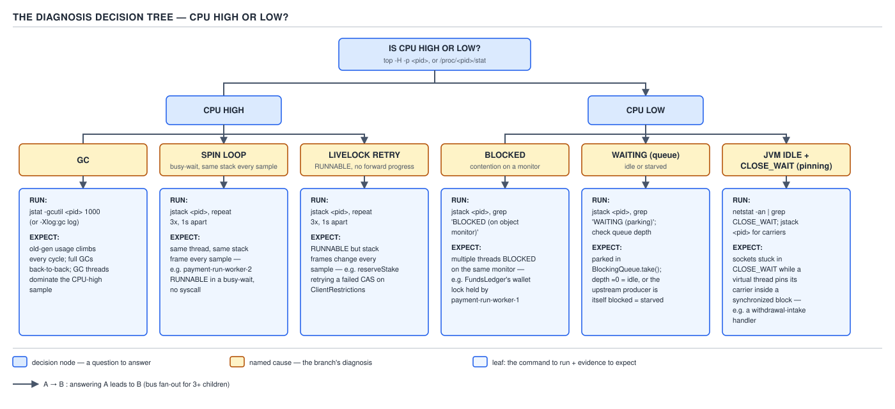
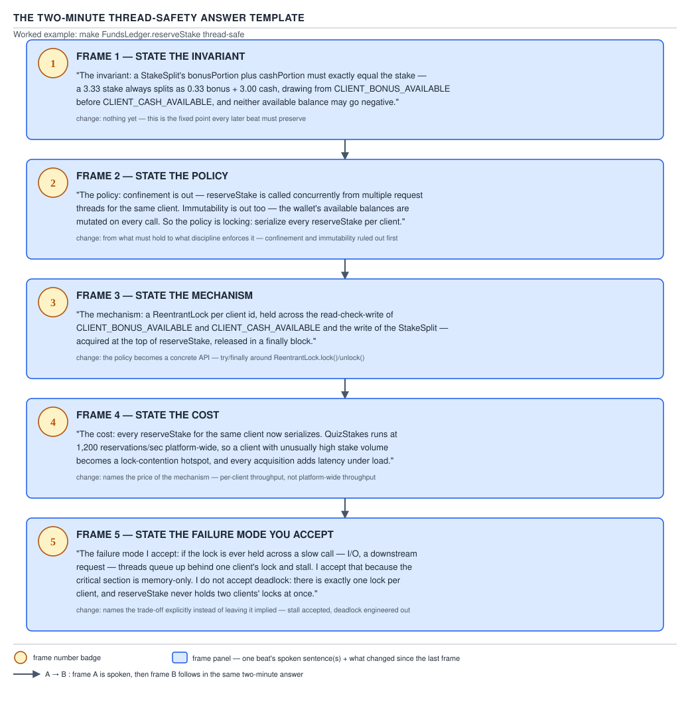

# 05 Multithreading and Concurrency — Drills and the atomic concept checklist — INTERVIEW (§5.3)

**Target version: Java 21 LTS.** | **Part 5 of 5** | [Index](00-index.md)
Previous: [The trap index](94f-trap-index.md)

This file closes Part 5. §5.1 and §5.2 built the trap and question inventory; this file is the
last-week drill set plus the flat checklist every other note in this set ultimately answers to.
Depth is read once; this file is read many times.

## §5.3.2 — The numbers drill

Recite these cold. Each one has cost a candidate the room when guessed instead of known.

| Value | What it controls | What changes on either side of it |
|---|---|---|
| 1 MB | Default platform-thread stack size (`-Xss`) | Smaller risks `StackOverflowError` on deep recursion (e.g. a recursive `computeIfAbsent` chain over `ClientRestrictions`); larger caps how many platform threads fit before native-thread exhaustion |
| 64 B | A CPU cache line | Two independently-written fields inside one line false-share; padding to the next line boundary stops it |
| 128 B | `@Contended` padding width | Below it, adjacent striped counters (a `Striped64` cell array counting `SettleStake` calls) still false-share; the pad trades memory for isolation |
| `TREEIFY_THRESHOLD = 8` | Node count in a `ConcurrentHashMap` bin before it treeifies | Below 8, a bin stays a linked list (O(n) worst case); at 8 **and** table capacity ≥ 64 it becomes a red-black tree (O(log n)) |
| `UNTREEIFY_THRESHOLD = 6` | Node count before a treeified bin reverts | The 8→6 gap is hysteresis — it stops a bin flapping tree↔list from one insert/remove pair oscillating at exactly 7 |
| `MIN_TREEIFY_CAPACITY = 64` | Table size below which treeify is refused | Below 64, a resize is preferred over treeify — treeifying a small table is wasted work when growing fixes the real problem |
| `MIN_TRANSFER_STRIDE = 16` | Minimum bins one helper thread claims during a cooperative `ConcurrentHashMap` resize | Below it, too many threads would fight over tiny slices of the transfer; the stride bounds coordination overhead |
| `0.75` | `ConcurrentHashMap`/`HashMap` default load factor | Lower trades memory for fewer collisions and rarer resizes; higher packs more `LedgerEntry` keys per bucket before growing |
| `2^29 − 1` | `ThreadPoolExecutor.CAPACITY` — the worker-count bits inside the packed `ctl` field | The remaining 3 bits hold run state; a pool can never exceed ~536M workers, which is never the real limit in practice |
| `availableProcessors() − 1` | Common `ForkJoinPool` default parallelism | On a single-core container this floors at 0, which silently forces serial execution of parallel streams and default-executor `CompletableFuture` stages |
| `availableProcessors()` | Default virtual-thread scheduler (`ForkJoinPool`) parallelism | No `− 1` here — carriers, not application logic, run on this pool, so it doesn't reserve a thread for the caller |
| 256 | `ThreadPoolExecutor` maxPoolSize used in most JDK-shipped defaults sizing discussions (not a hard constant, but the number workers quote) | A pool sized this large without a matching downstream capacity just moves the queue from in-JVM to the downstream connection pool |
| 256 | `commonPool` `common.maximumSpares` — extra compensating threads the common pool may create for blocked `ManagedBlocker` work | Beyond it, `tryCompensate` refuses further compensation and blocking `compute()` work stalls the pool |
| 256 | `Flow.defaultBufferSize()` — default reactive-streams buffer size | Too small increases request/refill round-trips between publisher and subscriber; too large defeats the point of bounded flow control |
| 20 ms | JFR's `jdk.VirtualThreadPinned` event threshold | Below it, a brief pin (e.g. a short `synchronized` block during a stake reservation) never shows up in the default recording at all |
| 1000 ms | `GuaranteedSafepointInterval` | The JVM forces a safepoint poll at least this often even with no other reason to, so profilers relying on safepoint-biased sampling never wait longer than this for a sample point |
| 16 / 16 | `ReentrantReadWriteLock`'s bit split of its packed `state` field between reader count and writer hold count | Caps concurrent readers and write-lock reentrancy at 65,535 each — a reservation-heavy read storm past that count would silently wrap, which is why the field is `int`-packed, not a real production limit anyone hits |
| 1 / 5 / 10 | `Thread.MIN_PRIORITY` / `NORM_PRIORITY` / `MAX_PRIORITY` | The OS is free to ignore all of it; priority is a hint, never a scheduling guarantee |

**D-214** — The numbers drill card.

## §5.3.3 — The table drill

Reproduce these four tables from memory. They are the ones an interviewer draws blank stares
checking for.

**The `ThreadPoolExecutor` submission algorithm, in exact order:**

| Step | Condition | Action |
|---|---|---|
| 1 | Fewer than `corePoolSize` workers exist | Start a new core worker with this task, regardless of queue state |
| 2 | Core is full | Offer the task to the work queue |
| 3 | Queue rejects the offer (full or `SynchronousQueue`) and fewer than `maximumPoolSize` workers exist | Start a new non-core worker with this task |
| 4 | Queue rejects and the pool is already at `maximumPoolSize` | Hand the task to the `RejectedExecutionHandler` |

**The four rejection policies:**

| Policy | Behaviour |
|---|---|
| `AbortPolicy` (default) | Throws `RejectedExecutionException` |
| `CallerRunsPolicy` | Runs the task synchronously on the submitting thread — backpressure by borrowing the caller |
| `DiscardPolicy` | Drops the task silently, no exception |
| `DiscardOldestPolicy` | Drops the queue head, then retries submission once |

**The four `BlockingQueue` method families:**

| Family | On full (insert) / empty (remove) |
|---|---|
| Throws | `add` / `remove` / `element` throw |
| Special value | `offer` / `poll` / `peek` return `false`/`null` |
| Blocks | `put` / `take` park until room/an element exists |
| Timed | `offer(timeout)` / `poll(timeout)` park up to a bound, then give up |

**The six `Thread.State` values:** `NEW`, `RUNNABLE`, `BLOCKED`, `WAITING`, `TIMED_WAITING`,
`TERMINATED` — no `RUNNING` state exists; a socket read still reports `RUNNABLE`.

**The four Coffman conditions** (all four required for deadlock): mutual exclusion,
hold-and-wait, no preemption, circular wait.

**The four `VarHandle` ordering modes:** plain, opaque, acquire/release, volatile — increasing
strength, increasing cost, in that order.

## §5.3.4 — The code drill

Each of these should compile correctly from memory in under five minutes. Domain: QuizStakes.

**The `lock`/`try`/`finally` idiom**, guarding a wallet's stake reservation:

```java
private final ReentrantLock walletLock = new ReentrantLock();

Reservation reserveStake(ClientId clientId, Money amount) {
    walletLock.lock();
    try {
        return ledger.reserve(clientId, amount);
    } finally {
        walletLock.unlock();
    }
}
```

**The `while`-loop `wait`**, a payment-run worker waiting for a non-empty withdrawal batch:

```java
private final Object batchMonitor = new Object();
private final Queue<WithdrawalTransaction> pending = new ArrayDeque<>();

WithdrawalTransaction takeNext() throws InterruptedException {
    synchronized (batchMonitor) {
        while (pending.isEmpty()) {
            batchMonitor.wait();
        }
        return pending.poll();
    }
}
```

**DCL with `volatile`**, lazily building an expensive `ScreeningService` client:

```java
private volatile ScreeningService screeningService;

ScreeningService screeningService() {
    ScreeningService local = screeningService;
    if (local == null) {
        synchronized (this) {
            local = screeningService;
            if (local == null) {
                screeningService = local = new ScreeningService(config);
            }
        }
    }
    return local;
}
```

**The holder singleton**, the same client without the DCL machinery:

```java
final class ScreeningServiceHolder {
    private ScreeningServiceHolder() {}
    static final ScreeningService INSTANCE = new ScreeningService(Config.load());
}
```

**Two-phase shutdown**, stopping a `PaymentRun` executor cleanly:

```java
void shutdownPaymentRunner(ExecutorService paymentRunner) {
    paymentRunner.shutdown();
    try {
        if (!paymentRunner.awaitTermination(30, TimeUnit.SECONDS)) {
            paymentRunner.shutdownNow();
        }
    } catch (InterruptedException e) {
        paymentRunner.shutdownNow();
        Thread.currentThread().interrupt();
    }
}
```

**The `try`/`finally` `ThreadLocal.remove`**, a correlation id for one `ApplicationGateway` request:

```java
private static final ThreadLocal<ApplicationId> CURRENT_APPLICATION = new ThreadLocal<>();

void handle(ApplicationId id, Runnable task) {
    CURRENT_APPLICATION.set(id);
    try {
        task.run();
    } finally {
        CURRENT_APPLICATION.remove();
    }
}
```

**The CAS retry loop**, an `AtomicLong` counting settled stakes:

```java
private final AtomicLong settledCount = new AtomicLong();

void recordSettlement() {
    long prev, next;
    do {
        prev = settledCount.get();
        next = prev + 1;
    } while (!settledCount.compareAndSet(prev, next));
}
```

## §5.3.5 — The diagnosis drill

Given a thread-dump excerpt, classify it as contention, saturation, idle, deadlock, or pinning
within thirty seconds. Work the decision tree, not a guess.



**D-216** — The diagnosis decision tree. Cross-references: 5.1.98 (reading a `jstack` dump line
by line), 5.1.99 (the three dump signatures — contention, saturation, and idle share a similar
"many `BLOCKED`/`WAITING`" shape and are told apart only by *what* they are blocked or waiting
on).

The five-way split, restated as a checklist:

- **Contention** — many threads `BLOCKED`, all wanting the *same* monitor, held by one thread
  currently `RUNNABLE`.
- **Saturation** — many threads `RUNNABLE`, more than the core count, none individually stuck —
  the CPU itself is the bottleneck, not a lock.
- **Idle** — many threads `WAITING`/`TIMED_WAITING` on a pool's task queue with nothing to do —
  correct, not a bug, unless the pool is undersized for a burst that hasn't arrived yet.
- **Deadlock** — a cycle: thread A `BLOCKED` on a monitor held by thread B, which is `BLOCKED` on
  a monitor held by thread A (or a longer cycle). The dump's own "Found one Java-level deadlock"
  section, when present, says so directly.
- **Pinning** — a virtual thread's carrier is stuck because the virtual thread is inside a
  `synchronized` block on Java 21 (JEP 491 removes this cause on Java 24) `[VERSION-TRAP]`, shown
  as a `jdk.VirtualThreadPinned` JFR event or a `<== monitors:` marker in the virtual-thread dump.

## §5.3.6 — The version drill

For each of these, state the release and the direction of the change — not just the current
state.

**D-215** — The version drill.

| The release | Direction of the change | JEP | True on Java 21 | True on Java 25 |
|---|---|---|---|---|
| `synchronized` pinning a virtual thread's carrier | Removed as a pinning cause | JEP 491 | A `synchronized` block or method pins the carrier for its whole duration; `-Djdk.tracePinnedThreads` diagnoses it | No longer pins (delivered final in JDK 24); the trace flag was removed with the cause it existed to find |
| Scoped values | Went from incubator/preview to final | JEP 506 | Preview (incubating in earlier releases; not the stable API surface) | **Final** — safe to use without `--enable-preview` |
| Structured concurrency | Repeated preview, not yet final | JEP 505 (5th preview) | Preview, `--enable-preview` required, API shape still moving | **Still preview** on Java 25 — do not describe it as final |
| `Thread.stop`/`suspend`/`resume` | Deprecated, then removed outright | — | **Removed** — throws `UnsupportedOperationException`, not merely deprecated, since Java 20 | Same — still removed |
| Biased locking | Disabled by default, then removed | JEP 374 | Already gone — disabled by default since Java 15, later removed entirely | Same — the biased→thin→fat escalation story is obsolete on both |
| Compact object headers | Experimental, then delivered | JEP 450 → JEP 519 | Not present (JEP 450 landed as experimental in JDK 24, after 21) | Delivered (JEP 519); whether on by default is **unverified** — do not assert it either way |
| `ExecutorService implements AutoCloseable` | Added | JDK 19 (no JEP number; a core-libraries API addition) | Already present — `try`-with-resources works on any `ExecutorService` | Same — unchanged since 19 |
| `Unsafe` memory access | Progressively fenced off in favor of `VarHandle` | JEP 471 (removal path, targeted beyond 21) | Still callable, with deprecation warnings on the memory-access methods | Migration pressure continues; `VarHandle` is the supported replacement for all four ordering levels |

## §5.3.7 — The "what does this print" set

Five short racy QuizStakes programs. State the *set* of legal outputs, not one expected value, and
justify each from the JMM. `[PROVE]`

**1 — the un-synchronized stop flag.**

```java
class ReservationWorker {
    boolean running = true;   // not volatile
    void run() {
        while (running) { reserveNext(); }
    }
    void stop() { running = false; }
}
```

Legal outputs: the worker loop **may never observe** `running = false` and run forever, or it may
observe it after an arbitrary delay. There is no happens-before edge between `stop()`'s write and
`run()`'s read — nothing here is `volatile`, a lock, or a `final`-field freeze — so the JIT is free
to hoist the read out of the loop entirely and the hardware is free to leave the write in a store
buffer indefinitely. `[PROVE]`

**2 — racy publication of a `StakeSplit`.**

```java
StakeSplit split;                 // not volatile, not final
void publisher() { split = compute(); }
Money reader() { return split == null ? Money.ZERO : split.cashPortion(); }
```

Legal outputs: `Money.ZERO` (the write hasn't become visible yet), the correct `cashPortion()`
value, **or** a `NullPointerException` if `reader()` observes a non-null reference to `split`
whose constructor writes have not yet become visible to this thread and one of `StakeSplit`'s own
fields reads as its default. Without safe publication (`volatile`, `final`, a lock, or a
concurrent collection) there is no guarantee the object a reader sees through `split` is the fully
constructed one. `[PROVE]`

**3 — the DCL without `volatile`.**

```java
private ScreeningService screeningService;   // not volatile
ScreeningService get() {
    if (screeningService == null) {
        synchronized (this) {
            if (screeningService == null) screeningService = new ScreeningService(config);
        }
    }
    return screeningService;
}
```

Legal outputs: `get()` can return a reference to a **partially constructed** `ScreeningService` —
one whose fields are still zero/null from the reader thread's point of view — because the compiler
and hardware may reorder the constructor's writes ahead of the reference assignment, and the
outer, unsynchronized read has no happens-before edge to detect it. `[PROVE]`

**4 — IRIW-shaped read of two independent flags.**

```java
volatile boolean bonusGranted = false, coupleApplied = false;
// Thread A: bonusGranted = true;
// Thread B: coupleApplied = true;
// Thread C: print(bonusGranted, coupleApplied);   // reads both
// Thread D: print(coupleApplied, bonusGranted);   // reads both, opposite order
```

Legal outputs (with plain `volatile`, not sequentially-consistent-total-order reasoning by two
*independent* observers): `C` and `D` can observe the two writes in **opposite orders** relative
to each other — `C` sees `(true, false)` while `D` sees `(false, true)` — because `volatile` gives
per-variable ordering, and the JMM does not guarantee a single global total order across
*independent* volatile variables the way sequential consistency would (the IRIW litmus test).
`[PROVE]`

**5 — the benign-looking non-atomic composite.**

```java
volatile int cashAvailable, bonusAvailable;   // each individually volatile
int stakeable() { return cashAvailable + bonusAvailable; }
```

Legal outputs: any value from a **mix of an old and a new** snapshot of the two fields — e.g. the
pre-deposit `cashAvailable` combined with a post-grant `bonusAvailable` — because each field's
`volatile` read is individually consistent, but the *pair* is not read atomically. `volatile`
guarantees visibility and ordering per variable, never atomicity across two variables. `[PROVE]`

## §5.3.8 — The whiteboard set

The six implementations to be able to write cold.

**D-218** — The whiteboard set.

| Implementation | Primitives it needs | The invariant | The trap the interviewer is watching for | Target time | Built in |
|---|---|---|---|---|---|
| Bounded buffer | `synchronized` + `wait`/`notifyAll`, or `ReentrantLock` + two `Condition`s | `0 ≤ size ≤ capacity`; no item is lost or duplicated | Using `notify()` instead of `notifyAll()` on a shared wait set, or guarding `wait()` with `if` | 8–10 min | §4.3.1–4.3.2 |
| Thread-safe singleton | `volatile` field, or a static holder class, or an enum | Exactly one instance is ever constructed and observed fully built | DCL without `volatile`; assuming `final` alone makes the reference safely published | 3–5 min | §3.4 (volatile-and-jmm) |
| Rate limiter | `AtomicLong`/CAS retry loop, or a `Semaphore` with a scheduled refill | The number of permits granted in any rolling window never exceeds the configured rate | Refilling with a plain (non-atomic) read-modify-write; forgetting to cap accumulated permits at the burst ceiling | 8–10 min | §2.5 (atomics), §3.6 (locks) |
| LRU cache | `LinkedHashMap` with `accessOrder=true` behind a single lock, or `ConcurrentHashMap` plus an external eviction policy | Capacity is never exceeded; the least-recently-used entry is evicted first | Believing `ConcurrentHashMap` alone gives LRU ordering — it has none | 8–10 min | §2.6 (concurrent-collections) |
| Alternating printers | Two threads, one shared lock, one `Condition` (or `wait`/`notifyAll`) plus a turn flag | Output strictly alternates; no turn is skipped or doubled | Checking the turn flag with `if` instead of `while`, missing a spurious-wakeup or lost-signal case | 5–8 min | §2.7 (wait-notify) |
| Dining philosophers | N locks (forks) plus a resource-ordering or arbitration rule | No philosopher starves; no deadlock cycle forms | Acquiring both forks in the philosopher's own left-then-right order for every philosopher, creating a circular wait | 8–10 min | §2.13 (liveness) |

## §5.3.9 — Spaced-repetition plan

- **Daily, right up to the onsite:** Part 5 §5.2 (the trap index). It is short by design — that is
  what makes daily repetition sustainable.
- **Weekly:** Part 5 §5.1 fundamentals — the full interview-question inventory across basics,
  intermediate, and internals tiers.
- **Once, the week before the onsite:** Part 3 (the internals depth files) end to end — AQS,
  `ConcurrentHashMap`'s table walk, the JMM formalised, virtual-thread mounting. This tier is read
  once because it is expensive to re-derive, not because it is unimportant.
- Depth (Parts 1–4) is read once and internalised; the trap index (§5.2) is read many times because
  traps are exactly the facts memory silently drops first.

## §5.3.10 — The two-minute answer template

For any "how would you make this thread-safe" question, answer in this fixed order — it is what
separates a structured two-minute answer from a rambling five-minute one that never reaches a
conclusion.



**D-217** — The two-minute thread-safety answer template.

1. **State the invariant.** Name exactly what must stay true under interleaving — e.g. "stakeable
   never goes negative" or "at most one `PaymentRun` is open per settlement window."
2. **State the policy.** Which lock, or which confinement strategy, protects that invariant — one
   lock per multi-variable invariant, never one lock per variable.
3. **State the mechanism.** The concrete primitive: `synchronized`, `ReentrantLock`,
   `ConcurrentHashMap.compute`, a `CAS` retry loop, immutability plus safe publication.
4. **State the cost.** What this buys and what it costs — contention under load, allocation on
   copy-on-write, latency on a blocking queue, pinning on a virtual thread on Java 21.
5. **State the failure mode you are accepting.** Every choice leaves something imperfect: an
   approximate `size()`, a possible retry storm, a bounded queue that sheds load under a spike.
   Naming it shows the answer was engineered, not guessed.

---

## Atomic concept checklist

- Threads share the heap and statics; each owns its stack. That split is where every race comes from.
- Throughput, latency, and blocking-tolerance are three different problems that a single design choice can trade against each other.
- The free lunch ended around 2004-2006: more performance now means more cores, not higher clock speed.
- Concurrency is structuring independent tasks; parallelism is running them literally at once — a single core can be concurrent but never parallel.
- Concurrency's three costs are context-switch overhead, coordination overhead, and cache-coherence traffic.
- Amdahl's law bounds speedup from parallelism by the serial fraction of the work, regardless of core count.
- The universal scalability law adds a coordination-cost term, which is why throughput can turn down, not just flatten, past some thread count.
- Little's law (L = lambda times W) sizes a thread pool from target throughput and per-task latency.
- The 1:1 threading model maps one Java platform thread to one OS thread, unlike the green-thread and N:M models that came before it.
- A context switch costs real time in register save/restore and cache/TLB pollution, even though the OS makes it look free.
- A platform thread reserves about 1 MB of stack by default, which is what caps how many can exist before native-thread creation fails.
- OS thread priority is only a scheduling hint the operating system is free to ignore.
- A daemon thread never keeps the JVM alive; the JVM exits once only daemon threads remain.
- `OutOfMemoryError: unable to create native thread` is an OS thread-count or address-space limit, not a heap problem.
- `Thread.State` has exactly six values: NEW, RUNNABLE, BLOCKED, WAITING, TIMED_WAITING, TERMINATED, and there is no RUNNING state.
- BLOCKED means monitor contention; WAITING means a deliberate park. Socket I/O reports RUNNABLE.
- `getState()` is a best-effort sample, not a synchronized read, and can be stale the instant it returns.
- `start()` creates a thread; `run()` does not. Interruption is a cooperative flag.
- Calling `start()` a second time throws `IllegalThreadStateException`, never `IllegalStateException`.
- `Thread.stop`, `suspend`, and `resume` were removed in Java 20 and now throw `UnsupportedOperationException`, not merely deprecated.
- `Thread.ofPlatform()`, `Thread.ofVirtual()`, and `Thread.Builder` are the modern way to configure and start a thread since Java 19.
- `Thread.ofVirtual().daemon(true)` compiles but is a no-op — virtual threads are always daemon.
- `Runnable` cannot return a value or throw a checked exception; `Callable<V>` can.
- `Thread.holdsLock(Object)` tests monitor ownership without attempting to acquire it.
- `sleep()` and `yield()` carry no synchronization semantics; they release no lock and fix no visibility bug.
- An empty `catch (InterruptedException e) {}` silently swallows a cancellation request.
- `Future.cancel(true)` only interrupts the task's thread; it does not guarantee a task that ignores interruption actually stops.
- `count++` is read-modify-write; `if (absent) put` is check-then-act. Both are races.
- Thread safety requires a stated invariant; a bare claim of "thread-safe" names nothing.
- The thread-safety taxonomy runs immutable, thread-safe, conditionally thread-safe, not thread-safe, thread-hostile.
- Thread confinement (stack, ThreadLocal, or instance confinement) avoids sharing instead of synchronizing access to it.
- `@GuardedBy` documents which lock protects a field; that policy exists only in documentation, never enforced by the compiler.
- Atomicity, visibility, and ordering are three independent properties; fixing one does not imply the other two.
- Publishing a reference to an object's internal mutable state lets a caller bypass every invariant the object tries to hold.
- Calling an unknown "alien" method while holding a lock risks deadlock or unwanted reentrancy.
- A multi-variable invariant needs one lock guarding all the variables together, not one lock per variable.
- `Collections.synchronizedList` guards each individual call but not a compound iterate-then-modify sequence.
- x86-TSO and AArch64 default to different memory-ordering strength, so a race that "works" on a laptop can fail on a weaker-ordered server.
- `synchronized` gives mutual exclusion and visibility; instance and static methods lock different monitors.
- Never lock on a String literal, a boxed Integer, or a reassignable field.
- Every object carries a monitor; a plain `Object` used only as a lock is a legitimate pattern.
- Reentrancy lets a thread re-acquire a monitor it already holds without deadlocking itself.
- Lock state, thin or inflated, lives multiplexed in the object header's mark word; compact headers shrink that space.
- Calling `identityHashCode()` on a lightweight-locked object can force it to inflate.
- A `synchronized` block and a `synchronized` method compile to different bytecode shapes with identical runtime semantics.
- Lock inflation from lightweight to a full `ObjectMonitor` does not deflate back mid-use under contention.
- A notified thread does not become runnable immediately — it must re-acquire the monitor first, going through BLOCKED again.
- On Java 21, `synchronized` pins a virtual thread's carrier for the whole blocking operation; JEP 491 removes that cause in Java 24.
- `volatile` gives visibility and ordering plus atomic 64-bit access — it does not make `count++` atomic.
- `volatile` is right for stop flags and DCL references; wrong for counters.
- Without a happens-before edge there is no visibility guarantee at all; know the six synchronizes-with edges.
- `volatile` does not "flush to main memory" — caches stay coherent via MESI; the real guarantee is expressed in happens-before terms.
- A `volatile` reference to an array or collection protects only the reference, never the elements or entries reached through it.
- A `volatile` read is essentially free; a `volatile` write costs a store-load barrier a plain write does not.
- The JMM is a contract between the language and hardware, not a description of any one CPU.
- Happens-before is a partial order, not a wall-clock timeline; two actions can be unordered without either happening first.
- No data race is universally "benign" — the JLS gives no guarantee about a racy read's value at all.
- The out-of-thin-air rule (JLS 17.4.8) forbids a racy value appearing with no causal origin anywhere in the execution.
- `Thread.sleep`, `yield`, and `onSpinWait` give no synchronization or visibility guarantee; they are scheduling hints only.
- Safe publication requires volatile, final, a lock, or a concurrent collection; a bare reference store can be reordered.
- A `final` field gets a freeze-action guarantee at constructor exit, but only if the constructing reference did not escape before that point.
- Double-checked locking is broken without `volatile`; the holder idiom or an enum is simpler.
- Class initialisation is itself lock-protected by the JVM, which is exactly why it can deadlock against a lock acquired in a static initializer.
- A safepoint pause can freeze every thread even when the GC log shows nothing.
- `wait`/`notify`/`notifyAll` live on `Object`, not `Thread`, because they operate on that object's monitor and wait set.
- Calling `wait()` or `notify()` without holding the object's monitor throws `IllegalMonitorStateException`.
- `wait()` releases exactly one monitor and re-acquires it before returning; it does not release every lock the thread holds.
- Always `wait()` in a `while` loop, never an `if` — spurious wakeups and notifyAll losers are both real.
- `notify()` can wake the wrong waiter; `notifyAll()` or separate `Condition`s avoid the thundering-herd waste.
- The missed-signal / lost-wakeup bug happens when notify fires before the matching wait; checking the condition first closes that window.
- The wait set is a separate collection from the monitor's contention queue; a notified thread moves between them before it can run again.
- Atomics use CAS retry loops; LongAdder beats AtomicLong under heavy write contention.
- ABA: CAS compares values, not history; `AtomicStampedReference` fixes it.
- `LongAdder.sum()` is not a linearizable snapshot — concurrent updates during the sum can be missed or double-counted.
- `weakCompareAndSet*` is allowed to fail spuriously even when the expected value matches.
- `lazySet`/`setRelease` give an ordered but not immediately visible write, cheaper than a full volatile store.
- `updateAndGet`/`accumulateAndGet`'s function argument may run more than once under contention, so it must be side-effect-free.
- Field updaters do reflection-based CAS on an existing volatile field without wrapping it in an Atomic type.
- `VarHandle` exposes four access modes — plain, opaque, acquire/release, volatile — replacing most direct `Unsafe` use.
- `@Contended` pads a field to 128 bytes to prevent false sharing, but needs a JVM flag outside `java.util` itself.
- False sharing happens when two independently-updated variables land on the same 64-byte cache line.
- `Striped64`'s cell array grows toward the core count, trading memory for reduced CAS contention.
- `ThreadLocalRandom` avoids the CAS contention a shared `Random` would create under concurrent use.
- Two separate atomic fields checked or updated in sequence are not as safe as one lock guarding both together.
- `ReentrantLock` needs `unlock()` in a finally; it adds tryLock, interruptibility, fairness, and multiple Conditions.
- `ReentrantLock` is not a strict upgrade over `synchronized` — it adds no automatic release on exception.
- `synchronized`, `ReentrantLock`, `ReadWriteLock`, and `StampedLock` form an escalation ladder from simplest to fastest-and-riskiest.
- Fairness on a lock guarantees FIFO acquisition but costs throughput because it forbids barging.
- `tryLock()` can barge ahead of a longer-waiting thread even on a fair lock; `tryLock(0, unit)` on a fair lock does not.
- `Condition` gives named wait sets on one lock, letting producers and consumers wait separately instead of sharing one set.
- `awaitNanos` returns the remaining time, not the elapsed time; a loop must re-derive the deadline each iteration.
- `ReentrantReadWriteLock` lets many readers or one writer proceed; downgrading is legal, upgrading self-deadlocks.
- A read-write lock does not automatically beat a plain lock for read-heavy code once bookkeeping overhead is counted.
- `StampedLock` adds a third, ownerless optimistic-read mode with no reentrancy and no monitor-based wait/notify.
- Treating a `StampedLock` optimistic-read validation failure as an error rather than a retry signal loses the point of the mode.
- `LockSupport.park`/`unpark` model a single-permit semaphore, not a counter; a second unpark grants only one free pass.
- Uncontended locks are cheap; the real cost is the lock-word cache-line ping-pong under contention.
- Splitting one lock into several, or striping, reduces contention by shrinking the set of threads competing for any single lock.
- The single-writer principle routes all mutation of a field through one thread via message-passing instead of synchronizing shared access.
- AQS is the shared queue-and-state foundation under ReentrantLock, Semaphore, CountDownLatch, and ReentrantReadWriteLock; StampedLock is not built on it.
- AQS's post-JDK-14 node/state design replaced the older waitStatus encoding most tutorials still describe.
- CountDownLatch is one-shot, CyclicBarrier is reusable, Semaphore permits are not thread-owned.
- Counting down a CountDownLatch outside a finally risks leaving waiters blocked forever if the counting code throws first.
- A broken CyclicBarrier stays broken for every party until explicitly reset.
- `Semaphore(1)` is not automatically reentrant, so using it as a drop-in mutex is a trap for a re-entering thread.
- Phaser generalizes CyclicBarrier with dynamic party registration and reusable phases.
- Exchanger hands off exactly one object between exactly two threads at a rendezvous point.
- Every synchronizer's acquire/release pair establishes its own happens-before edge.
- ConcurrentHashMap locks per bin, reads lock-free, iterators weakly consistent, `size()` approximate.
- Compound actions on a concurrent map need `computeIfAbsent`/`merge`, not containsKey-then-put.
- The `computeIfAbsent` mapping function runs under the bin lock: keep it short and never recursive.
- ConcurrentHashMap forbids nulls so that a null `get` is unambiguous.
- A bin treeifies at 8 nodes and untreeifies at 6, but only once the table itself is at least 64 buckets.
- Since Java 8, ConcurrentHashMap uses one shared resizable table with per-bin locking instead of Java 7's fixed Segment locks.
- `sizeCtl` is one field meaning four different things depending on its sign and value.
- A ConcurrentHashMap resize is cooperative: any thread touching a bin under active resize can help transfer nodes.
- ConcurrentSkipListMap gives sorted iteration with concurrent access, which ConcurrentHashMap cannot offer.
- CopyOnWriteArrayList gives lock-free O(1) reads and O(n) allocate-and-copy writes.
- There is no concurrent List with fine-grained locking; the only concurrent list option is copy-on-write.
- `keySet()`, `values()`, and `entrySet()` on a concurrent map return live views, not snapshots.
- Bulk operations on a concurrent map are not atomic as a whole, even though each individual put is.
- `Collections.synchronizedMap` only makes single calls atomic; a check-then-act sequence over it still races.
- Every queue needs a bound; unbounded queues convert overload into OOM.
- SynchronousQueue has zero capacity — it is a hand-off, not storage.
- The four BlockingQueue method families trade failure handling for latency in a fixed pattern.
- LinkedBlockingQueue splits put-side and take-side locks so producers and consumers rarely contend directly.
- Blocking the producer is only safe backpressure if the producer is the true source of load.
- `drainTo` batch-dequeues without acquiring the lock once per element.
- Total order across a queue is expensive at scale; per-key ordering is usually the practical compromise.
- ConcurrentLinkedQueue is Michael-Scott's lock-free queue; its `size()` is O(n), not O(1).
- DelayQueue elects a leader thread to sleep for the head element's remaining delay.
- The rejection or backpressure choice at a queue boundary is a design decision with different failure modes for the caller.
- Pool order: core threads first, then queue, then max threads, then reject.
- `newFixedThreadPool` has an unbounded queue, so maximumPoolSize is dead and overload becomes OOM.
- `newCachedThreadPool`'s mirror-image bug is an unbounded pool size with a zero-capacity queue, so bursts spawn unbounded threads.
- `CallerRunsPolicy` converts rejection into backpressure on the producer.
- The four rejection policies are AbortPolicy, CallerRunsPolicy, DiscardPolicy, and DiscardOldestPolicy.
- `execute()` runs a double-check after enqueueing to catch a pool that shut down or shrank in the race window.
- An uncaught exception in a scheduled task cancels all future runs.
- `scheduleAtFixedRate` schedules relative to the first run's start; `scheduleWithFixedDelay` schedules relative to the previous run's end.
- `Executors` factory methods hide dangerous defaults; naming the seven ThreadPoolExecutor constructor parameters directly is safer.
- `availableProcessors()` reports the container's cgroup CPU quota on modern JDKs but can still mislead if that limit changes at runtime.
- Pool sizing derives from Little's law: threads needed is roughly throughput times (compute time plus wait time).
- A fixed-size pool can still deadlock if tasks block waiting on other tasks queued behind them in the same pool.
- `submit()` wraps a thrown exception inside the returned Future and swallows it until `get()` is called; `execute()` propagates it immediately.
- ExecutorService has implemented AutoCloseable since Java 19, enabling try-with-resources shutdown.
- Two-phase shutdown (shutdown, then awaitTermination, then shutdownNow if it times out) stops a pool without abandoning in-flight work.
- `shutdownNow()` returns queued tasks and best-effort interrupts running ones — it does not guarantee a stuck task actually stops.
- CompletionService decouples submitting many tasks from processing results in completion order.
- `getActiveCount()` and `getQueue().size()` are point-in-time estimates, not safe correctness preconditions.
- A CompletableFuture chain with no terminal handler swallows exceptions silently.
- CompletableFuture without an explicit executor uses the shared common pool.
- The common pool's default parallelism is `availableProcessors() - 1`, which can floor at zero and force serial execution.
- `thenApply` transforms in place; `thenCompose` flattens a stage that itself returns another CompletableFuture.
- `allOf` waits for every listed stage; `anyOf` completes on the first stage to finish, success or failure — neither means "first success."
- `handle` runs regardless of outcome and can recover a value; `whenComplete` is a side-effect-only observer; `exceptionally` only fires on failure.
- `join()` throws unchecked CompletionException; `get()` throws checked ExecutionException — both wrap the original cause.
- `cancel(boolean)` on a CompletableFuture ignores its argument entirely and never interrupts an in-flight computation.
- A timeout added via `orTimeout`/`completeOnTimeout` completes the future but does not cancel the underlying async task still running.
- Context does not automatically follow a CompletableFuture across a stage hop onto a different thread.
- Every async stage in a chain should pass its own executor explicitly rather than rely on the implicit common pool.
- ForkJoinPool work-stealing keeps each worker's own tasks LIFO locally but lets idle workers steal FIFO from the other end.
- Fork both subtasks before joining either; forking one and immediately joining it serializes it against the other.
- Blocking I/O inside `compute()` starves the pool's fixed worker count unless routed through ManagedBlocker.
- `ForkJoinTask.join()` helps execute other queued work while it waits, unlike `Future.get()`, which just parks.
- `ctl` packs ForkJoinPool's active count, total count, and queue state into one 64-bit control word.
- `tryCompensate`/`ManagedBlocker` temporarily grow the pool's active worker count so a deliberately blocking task doesn't starve the rest.
- `CountedCompleter` lets a task chain completions without ever blocking on `join()`.
- `ForkJoinPool.commonPool()` backs parallel streams and the default virtual-thread scheduler; blocking work should never be submitted to it directly.
- The sequential threshold in a divide-and-conquer task trades task-creation overhead against parallelism.
- ThreadLocal in a pooled thread leaks the value into the next request; always `remove()` in a finally.
- ThreadLocal in a thread pool is worse than in a short-lived thread because the thread — and the stale value — outlives any single task.
- `set(null)` on a ThreadLocal is not equivalent to `remove()`.
- `InheritableThreadLocal` only copies context to a newly created thread; it does not fix leaked context in a pooled, reused thread.
- ThreadLocal should be used only for context, never as a cache, especially on virtual threads.
- ScopedValue is the migration target for context propagation on virtual threads: immutable, scoped, automatically cleaned up.
- ThreadLocal's backing map lives on the Thread object itself, keyed by weak references to the ThreadLocal instance.
- SLF4J's MDC and OpenTelemetry's Context/Scope are both ThreadLocal-backed and require their own mandatory cleanup.
- A ThreadLocal leak persists indefinitely in a long-lived pool thread because nothing else triggers its removal.
- Virtual threads buy scale, not per-task speed.
- A virtual thread mounts onto a carrier only while running; blocking on a supported operation unmounts it and frees the carrier.
- The carrier pool backing virtual threads is, by default, a ForkJoinPool sized to `availableProcessors()`.
- On Java 21, `synchronized` pins the carrier for its whole duration; JEP 491 removes that on Java 24, retiring `-Djdk.tracePinnedThreads` with it.
- Never pool virtual threads — create one per task and bound concurrency with a Semaphore or similar limiter instead.
- Deleting a thread pool for virtual threads without adding an explicit concurrency limit removes an implicit cap that used to exist.
- A ThreadLocal-based expensive-object cache regresses on virtual threads because there are more of them and each is short-lived.
- Sockets have a poller-based non-pinning path on virtual threads, but some file I/O still pins the carrier.
- Virtual threads are invisible to classic jstack in the way platform threads are; diagnosis uses the JFR-based or JSON thread dump instead.
- `Continuation` is the low-level primitive underneath a virtual thread — the freeze/thaw of a call stack.
- A `StackChunk` is a real, garbage-collected heap object holding a parked virtual thread's frozen stack frames.
- Forking unbounded virtual threads because "they're basically free" still exhausts whatever bounded resource each one contends for.
- ScopedValue internals use an immutable binding chain plus a small cache, not a mutable per-thread map.
- Reading a ScopedValue from a thread not forked through the binding scope throws NoSuchElementException rather than returning a default.
- ThreadContainer/ThreadFlock is the structural primitive behind both virtual-thread dumps and structured concurrency's tree-shaped lifetimes.
- Virtual-thread creation and mounting are cheap, not free; unbounded fan-out still adds up.
- Structured concurrency exists because plain Future/CompletableFuture fan-out has no enforced parent-child lifetime.
- A StructuredTaskScope is a tree with an enforced lifetime — every forked subtask completes or is cancelled before the scope closes.
- `ShutdownOnFailure` cancels sibling subtasks the moment one fails, unlike `CompletableFuture.allOf`, which waits regardless.
- Calling `join()` on a scope does not itself propagate a subtask's failure; the join policy's own check must be called afterward.
- Passing a StructuredTaskScope to a helper method so it can fork more work breaks the structure the API enforces.
- ScopedValue is the value-propagation mechanism structured concurrency pairs with, replacing ThreadLocal for forked subtasks.
- Structured concurrency is still preview as of Java 25; its API shape is not yet finalized.
- Deadlock needs all four Coffman conditions; global lock ordering breaks circular wait.
- Livelock is threads actively responding to each other but making no forward progress.
- Starvation is a thread perpetually losing the scheduling or lock-acquisition race, without necessarily any cycle.
- A lock convoy forms when many threads queue behind one frequently-taken, briefly-held lock.
- The JVM's built-in deadlock detector can find monitor and AQS-based cycles but cannot see one involving an external resource like a database row lock.
- Code review cannot reliably catch a lock-ordering deadlock, because the violation spans two call paths rarely seen in the same diff.
- A CPU profiler is the wrong tool for a blocking (off-CPU) problem; it needs an off-CPU or lock profiler instead.
- Reading a jstack dump means matching thread state, monitor info, and stack frames to a specific liveness pattern.
- Not every set of BLOCKED threads is a deadlock — it can be ordinary contention with no cycle.
- A default JFR recording does not capture every contention event; "no contention" only follows if the relevant event was enabled.
- `ThreadMXBean` exposes programmatic contention counts without needing to parse a text dump.
- `nid` in a jstack dump is the native OS thread ID, the join key to OS-level tooling.
- JFR's virtual-thread pinning event fires past a 20 ms threshold, a diagnostic cutoff, not an architectural limit.
- Removing synchronization and trusting profiling tools to "confirm" the fix afterward is backwards.
- A stress test passing 1,000 times does not prove thread safety.
- jcstress can actually demonstrate a JMM reordering happening, rather than merely failing to falsify one over repeated runs.
- Biased locking was disabled by JEP 374 in Java 15 and later removed; the biased-to-thin-to-fat escalation story no longer applies.
- Virtual threads (JEP 444) went final in Java 21.
- JEP 491 makes `synchronized` no longer pin a virtual thread's carrier, final in Java 24.
- On Java 25, scoped values are final while structured concurrency is still preview — the two must not be assumed to have shipped together.
- Compact object headers moved from experimental (JEP 450, Java 24) to delivered (JEP 519, Java 25); whether on by default is unverified.
- `Thread.stop`/`suspend`/`resume` are removed as of Java 20, not merely deprecated.
- Stating the direction of a version change, not just the current state, is the interview-safe way to answer a version question.
- AQS's internal node/state representation changed materially after JDK 14; the pre-14 waitStatus encoding is a version trap.
- Every single-JVM concurrency primitive has a distributed analogue with weaker guarantees and a network partition to worry about.
- A distributed lock needs a fencing token, or a paused-then-resumed holder can act after another has already taken over.
- `@Version` optimistic locking on a persisted entity is the CAS of the persistence layer.
- A distributed lock is not simply a stronger, slower `synchronized`; clock skew and partial failure give it new failure modes.
- A scheduled job running on multiple nodes without coordination duplicates its work on every node, not just occasionally.
- Distributed coordination trades "impossible to observe an inconsistent state" for "possible but detectable and recoverable."
- `System.nanoTime()` is the only correct basis for a deadline or elapsed duration; `currentTimeMillis()` can jump on a clock adjustment.
- `ThreadMXBean` is the programmatic equivalent of a thread dump, usable from inside the running application.
- `getBlockedTime()` reporting zero does not prove there was no contention unless contention monitoring was explicitly enabled.
- A spin lock is a CAS loop with nothing else, wasting CPU under real contention.
- Test-and-test-and-set reads before it writes, cutting failed CAS attempts under contention.
- A ticket lock gives strict FIFO fairness but every waiter spins on the same shared counter.
- CLH and MCS locks each spin on their own or their predecessor's cache line instead of one shared line.
- AQS chose CLH's queue shape, not MCS's, as its underlying design.
- A backoff lock retries after an increasing delay rather than immediately.
- A hand-built reentrant mutex on `AtomicReference<Thread>` tracks the owning thread and a hold count to support re-entry.
- A queue-based lock does not automatically support cancellation; a giving-up waiter must be unlinked carefully.
- A simple mutex, a counting semaphore, and a one-shot latch built on AQS all collapse to the same acquire/release template with a different `state` meaning.
- `hasQueuedPredecessors()` checks whether another thread is already waiting, the building block for a fair AQS acquire.
- A bounded blocking queue built with `synchronized` plus `wait`/`notifyAll` over a ring buffer needs `notifyAll`, not `notify`, once two conditions share one wait set.
- A two-lock bounded queue is only correct if full-queue operations like `remove(Object)` take both locks together.
- A lock-free single-producer/single-consumer ring buffer still needs the shared head/tail indices to be volatile or atomic, even if the "owned" side can stay plain.
- A Treiber stack is usually ABA-safe in Java because the garbage collector never reuses a node's identity while a reference to it still exists.
- Hazard pointers and epoch-based reclamation solve a memory-reclamation problem a GC'd language like Java mostly makes moot.
- A Michael-Scott queue's enqueue linearization point is the successful CAS on the tail node's `next` pointer, not any update to `tail` itself.
- A hand-built thread pool's packed `ctl` field needs no separate lock to read safely, because it is a single atomic load.
- A hand-built CompletableFuture's callback-firing loop is written iteratively, not recursively, to avoid a stack overflow on a long chain.
- A work-stealing deque's `popTop` must handle contention with the owner's `pushBottom`/`popBottom` even at one remaining element.
- Reproducing the classic concurrency bugs as runnable harnesses makes each bug's fix falsifiable rather than folklore.
- The master comparison tables collect every sibling-primitive decision into one lookup surface for a two-minute answer under pressure.

---

**Leaves covered:** 5.3.1–5.3.10 (10 leaves)
**Leaves deferred:** none
**Diagrams included:** D-214, D-215, D-216, D-217, D-218
**Target version:** Java 21 LTS
**Lines:** 633
