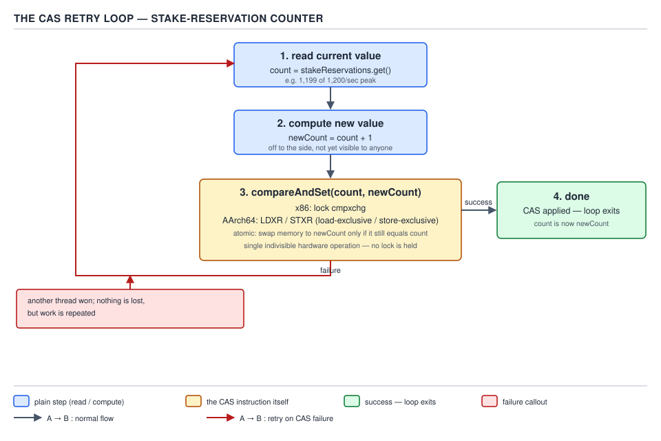
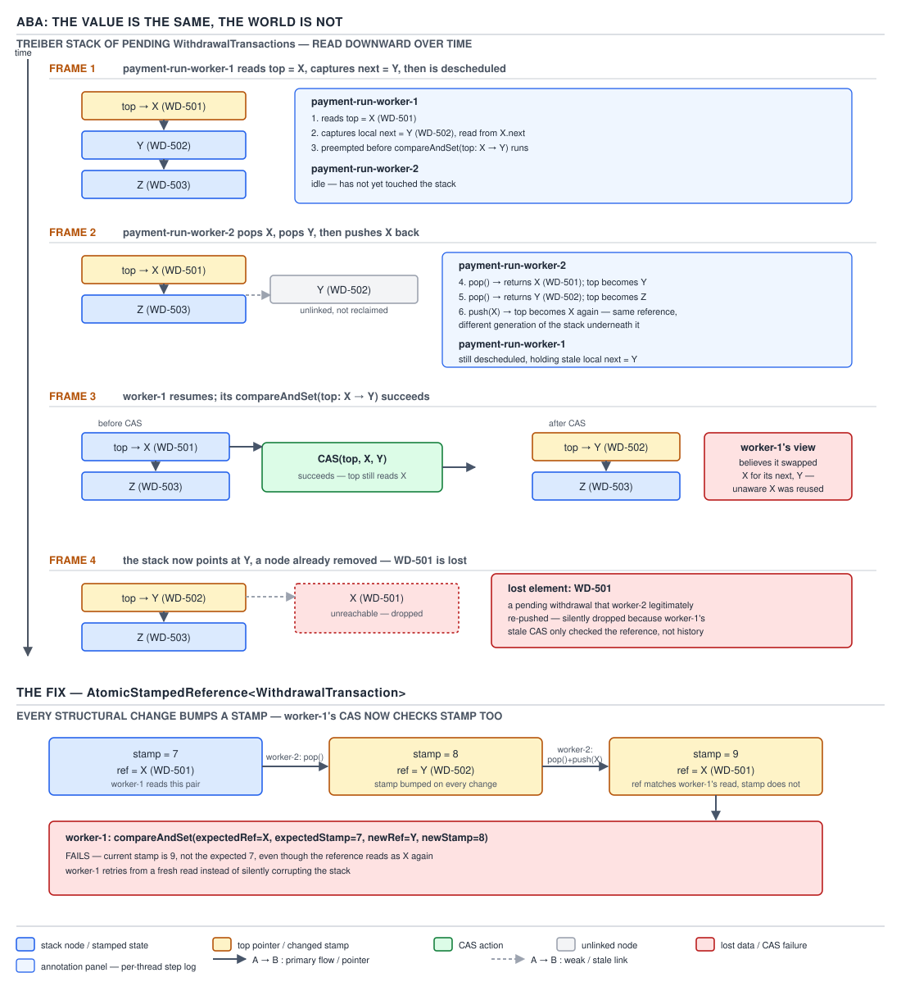

# 05 Multithreading and Concurrency — Atomics — BASICS (§1.13, leaves 1.13.1–1.13.15)

**Target version: Java 21 LTS.** | **Part 1 of 5** | [Index](../00-index.md)
Previous: [wait / notify / notifyAll](../wait-notify/01-basics.md) · Next: [Adders, VarHandles and the ordering levels](01b-basics-adders-varhandles-ordering.md)

## Compare-and-swap: the retry loop as the universal non-blocking idiom

### Mental model

Picture two tellers reaching for the same stake-reservation counter at once. A lock makes one
teller wait outside the room until the other leaves. CAS lets both walk up to the counter, each
carrying a sticky note that says "I expect the counter reads 41; if it still does, make it 42."
Whoever's sticky note matches wins and writes; the loser's note is stale, so the hardware refuses
the write and hands the loser nothing but the current value — which the loser reads again, writes
a new sticky note, and tries again. Nobody sleeps, nobody is descheduled by a monitor; the only
cost of losing is a wasted attempt.

### Why it exists

Before CAS-based atomics, a shared counter meant a lock: `synchronized` around
`reservationCount++`, forcing every thread through a monitor even though the operation touches one
word of memory. At 1,200 stake reservations/sec that is tolerable; at the burst rate this domain
actually sees for settlements — 3,400/sec — a monitor means every settling thread queues behind a
mutex to do a single add. `java.util.concurrent.atomic` (JSR 166, Java 5) exists to let hardware do
the exclusion instead of the OS scheduler: one instruction, no blocking, no context switch.

### When to reach for it, and when not

Reach for CAS-based atomics when the critical section is exactly one word — a counter, a flag, a
single reference swap — and contention is expected to be short-lived so retries stay cheap.
Do not reach for it when the update touches more than one variable that must change together (a
`Reservation`'s status and its ledger entry cannot be CAS'd as a pair — that needs a lock or a
transactional store), or when contention is so high that the retry loop itself becomes the
bottleneck (Day 05's `LongAdder` file covers the fix: stripe the counter instead of retrying
harder). `[X-REF 09]` A `ReentrantLock` (topic 09) is the pessimistic sibling: it assumes conflict
and excludes upfront; CAS assumes no conflict and only pays when it is wrong.

### How it works

`compareAndSet(expected, new)` is one hardware instruction on every mainstream CPU. `[ASM]` On
x86-64, javac/C2 emit `lock cmpxchg`: the `lock` prefix asserts the cache-coherence protocol's bus
lock for that cache line for the instruction's duration, so no other core can observe or complete a
conflicting write mid-instruction. On AArch64 there is no single locking instruction; the JVM emits
the load-linked/store-conditional pair `LDXR` (load, and mark the address as "exclusively
monitored") followed by `STXR` (store only if nothing touched that address since the `LDXR`; it
reports success or failure in a register). This is quoted from the general LL/SC pattern that
OpenJDK's AArch64 backend follows for `Unsafe.compareAndSwapInt`/`compareAndSetInt`; treat the
exact emitted opcodes as quoted from the architecture reference and JDK backend documentation, not
personally disassembled for this file.

The retry loop is the same shape everywhere the JDK needs a non-blocking read-modify-write, and
`incrementAndGet` is its canonical body: `[SOURCE]`

```java
public final int incrementAndGet() {
    return getAndAddInt(this, VALUE, 1) + 1;
}
// getAndAddInt, conceptually (java.util.concurrent.atomic.AtomicInteger, JDK 21):
public final int getAndAddInt(Object o, long offset, int delta) {
    int v;
    do {
        v = getIntVolatile(o, offset);
    } while (!weakCompareAndSetInt(o, offset, v, v + delta));
    return v;
}
```

Read the field's current value; compute the candidate new value from it; try to install it with a
CAS; if another thread got there first, the CAS fails, nothing is written, and the loop starts over
with a fresh read. Nothing is ever lost — a losing thread simply repeats work, it never corrupts
the counter or silently drops its increment.



**D-051** — The CAS retry loop.

### A minimal concrete example

`RollingSettlementCounter` mirrors the settlement burst — up to 3,400 `SettleStake` calls/sec
landing on one shared total, each thread racing every other:

```java
public final class RollingSettlementCounter {

    private final AtomicLong settledCount = new AtomicLong();
    private final AtomicLong settledCash = new AtomicLong(); // minor units, no BigDecimal in the hot path

    public void recordSettlement(long amountMinorUnits) {
        settledCount.incrementAndGet();
        settledCash.addAndGet(amountMinorUnits);
    }

    public long settledCount() {
        return settledCount.get();
    }
}
```

`incrementAndGet` and `addAndGet` are both the retry loop above, specialised for "add a constant."
No lock, no monitor entry — under the 3,400/sec settlement burst this counter never blocks a
settling thread on another settling thread.

### The gotcha

CAS is lock-free, not free: under sustained high contention the retry loop itself burns CPU cycles
re-reading and re-attempting, and every failed attempt invalidates the cache line for every other
core holding it, which is what eventually pushes teams toward striping (`LongAdder`, next file)
once a single `AtomicLong` becomes the visible bottleneck rather than the fix.

**Interview:** "Why not always use `AtomicLong` instead of `synchronized`?" — because CAS trades
guaranteed exclusion for cheap optimism; it wins when conflicts are rare and the operation is a
single word, and loses to striping when contention is high enough that retries dominate.

> **CAS** atomically replaces a value with a new one only if it still equals an expected value,
> using one hardware instruction with no OS-level blocking.

## Optimistic versus pessimistic concurrency

CAS assumes no conflict: read, compute, try to write, retry only if wrong. A lock assumes conflict
and excludes other threads before doing any work at all, whether or not they would actually have
collided. `[X-REF 09]` The `ReentrantLock` and `synchronized` notes (topic 09) build the pessimistic
side of this pair — the tradeoff is throughput under low contention (optimistic wins, no threads
ever block) against throughput under very high contention (pessimistic can win, because losers
sleep instead of burning CPU on retries).

## The three progress guarantees

**Non-blocking** (a.k.a. obstruction-free) is the loosest guarantee: a thread running in isolation
— no other thread interfering — is guaranteed to finish in a bounded number of steps, but with
concurrent interference *some* thread might live-lock forever, each undoing the others' progress.
**Lock-free** is stronger: at every step, *at least one* thread in the system is guaranteed to make
progress, even though any individual thread could in principle retry indefinitely (starvation of
one thread is allowed, starvation of the whole system is not). **Wait-free** is the strongest: every
individual thread is guaranteed to finish in a bounded number of its own steps, regardless of what
any other thread does — no thread can be starved, ever. `[PROVE]` `[RESEARCH]` The proof that
`AtomicInteger.incrementAndGet` is lock-free but not wait-free follows directly from its retry
loop: the loop has no bound on iterations — thread A can, in an adversarial schedule, lose every
single CAS attempt forever because thread B always happens to update first — so A's own completion
is not bounded, which rules out wait-free. But the loop cannot spin forever *system-wide*: every
time A's CAS fails, it is because some other thread's CAS just succeeded, so the counter as a whole
always advances. That "someone always wins" property is exactly the lock-free definition, and it is
the property JSR 166's own documentation and subsequent JVM concurrency literature attribute to the
`java.util.concurrent.atomic` classes as a group — none of them, including the counters used in
this file's settlement example, offer a wait-free guarantee; only specialised, purpose-built
algorithms (not general CAS loops) achieve wait-freedom in practice.

**Interview:** "Is `AtomicLong` wait-free?" — no. It is lock-free: the system as a whole always
makes progress, but a single unlucky thread's own CAS can be starved by a string of overtaking
writers.

## The 16-class inventory of `java.util.concurrent.atomic`

Every family solves the same problem — a compound read-modify-write on a single field without a
lock — for a different shape of storage. `[RESEARCH]` `[NUM]`

**D-052** — The 16 classes of `java.util.concurrent.atomic`, by family.

| Family | Classes | What it wraps | Adds over `volatile` | Memory cost | Reach for it when |
|---|---|---|---|---|---|
| Scalars | `AtomicBoolean`, `AtomicInteger`, `AtomicLong` | one primitive-shaped field | CAS, `getAndAdd`, `getAndUpdate`, `getAndSet` | one object header + one field (16–24 bytes) | a single shared counter or flag, e.g. `settledCount` above |
| Object reference | `AtomicReference<V>` | one reference field | CAS on identity, not equality | one object header + one reference (16 bytes) | swapping a whole immutable snapshot, e.g. the head of a lock-free stack |
| Arrays | `AtomicIntegerArray`, `AtomicLongArray`, `AtomicReferenceArray<E>` | every slot of a backing array | per-element CAS without per-element wrapper objects | one array, no per-slot boxing | many independent counters, e.g. one reservation counter per shard/partition |
| Field updaters | `AtomicIntegerFieldUpdater<T>`, `AtomicLongFieldUpdater<T>`, `AtomicReferenceFieldUpdater<T,V>` | one `volatile` field on an existing class, via reflection | CAS on a field that predates adding an atomic wrapper | zero extra object per instance (vs. one `AtomicLong` per instance) | millions of long-lived objects where a whole extra `AtomicLong` per instance is unaffordable, e.g. a per-`Reservation` version stamp |
| Marked / stamped references | `AtomicMarkableReference<V>`, `AtomicStampedReference<V>` | a reference plus a boolean / int, updated atomically together | detects "value changed and changed back" (the ABA fix, below) | one extra `Pair` allocation per update | a lock-free structure that recycles nodes, e.g. the Treiber stack of pending `WithdrawalTransaction`s below |
| Adders / accumulators | `LongAdder`, `DoubleAdder`, `LongAccumulator`, `DoubleAccumulator` | a set of internal striped cells | write-optimised high-contention counting; read is a sum across cells | multiple cache lines instead of one | contention itself is the bottleneck — covered in the next file, not here |

That is 3 scalars + 1 reference + 3 arrays + 3 field updaters + 2 marked/stamped + 4 adders/
accumulators = 16.

## The `AtomicInteger` method surface

`get`/`set` are plain volatile-style read/write. `lazySet` (now `setRelease`) is a cheaper store
covered fully in the ordering file next. `getAndSet` swaps unconditionally and returns the old
value. `compareAndSet` and `compareAndExchange` differ only in return value: the former returns
`boolean`, the latter returns the *witnessed* value, letting a caller retry without a second read.
`weakCompareAndSetPlain` is the weak CAS discussed below. `getAndIncrement`/`getAndDecrement`/
`getAndAdd`/`incrementAndGet`/`decrementAndGet`/`addAndGet` are all the retry loop specialised to
"add a constant." `getAndUpdate`/`updateAndGet`/`getAndAccumulate`/`accumulateAndGet` generalise the
loop to an arbitrary function — covered next, with its pitfall. `getPlain`/`setPlain`,
`getOpaque`/`setOpaque`, `getAcquire`/`setRelease` expose the `VarHandle` access-mode ladder
directly on the atomic class; the ordering file explains what each level actually guarantees.
`intValue`/`longValue`/`floatValue`/`doubleValue` are `Number` conversions with no atomicity story
of their own. `[RESEARCH]`

### `updateAndGet` / `accumulateAndGet`: the function may run more than once

`updateAndGet(IntUnaryOperator)` and `accumulateAndGet(x, IntBinaryOperator)` are still the CAS
retry loop underneath: read the current value, apply the supplied function to compute the
candidate, CAS it in, and — critically — **if the CAS fails, the function is called again** on the
freshly re-read value. `[SOURCE]` The JDK 21 source for `updateAndGet` is exactly the same shape as
`incrementAndGet`, just with the delta replaced by a function call:

```java
public final int updateAndGet(IntUnaryOperator updateFunction) {
    int prev = get(), next = 0;
    for (boolean haveNext = false;;) {
        if (!haveNext)
            next = updateFunction.applyAsInt(prev);
        if (weakCompareAndSetVolatile(prev, next))
            return next;
        haveNext = (prev == (prev = get()));
    }
}
```

The loop re-invokes `updateFunction` every time the CAS loses a race, so the function must be
**side-effect-free and idempotent-safe under repetition** — it must not, for example, append to a
log, mutate a shared collection, or call a non-idempotent remote service, because a contended
counter can legitimately invoke it several times for what the caller sees as one logical update.

**Pitfall:** treating the lambda passed to `updateAndGet` as "runs exactly once." A settlement
handler that does `settledTotal.updateAndGet(v -> { auditLog.append(v); return v + amount; })`
under the 3,400/sec settlement burst will double- or triple-write audit entries whenever contention
forces a retry — the fix is to keep the function pure (`v -> v + amount`) and do the logging outside
the atomic update, after `updateAndGet` returns.

## `weakCompareAndSet*`: allowed to fail for no reason

`weakCompareAndSetPlain` (and its siblings at other memory-order strengths) may return `false` even
when the current value *does* equal the expected value — a spurious failure unrelated to whether
the values match. `[PROVE]` `[RESEARCH]` This is only safe to use inside a retry loop, never as a
one-shot check, because a spurious `false` gives no information about the actual state. It exists
because LL/SC architectures (AArch64 among them) implement the strong `compareAndSet` by wrapping
an `LDXR`/`STXR` pair in a hardware retry themselves — an interrupt, a cache-line eviction, or even
another core's unrelated `STXR` to a nearby address in the same exclusive-monitor granule can make
`STXR` fail even though the compared value was correct. The weak variant simply reports that raw
hardware failure back to Java instead of masking it with an internal retry, which is what lets the
JDK's own retry loops (like `updateAndGet` above) use the cheaper weak primitive directly instead
of paying for two layers of retrying.

## `lazySet` / `setRelease`: cheap ordered writes

`lazySet` (the pre-`VarHandle` name; `setRelease` is its modern spelling) stores with release
semantics — writes before it cannot be reordered after it — but issues no `StoreLoad` barrier, so
it is cheaper than a full volatile write on architectures where that barrier is expensive. `[NUM]`
It is used for nulling out a reference after a queue element is consumed: the consumer does not
need other threads to *immediately* observe the null, only eventually and without reordering
hazards, so paying for a full fence on every dequeue is wasted work.

## `AtomicReference` vs. a `volatile` reference

`AtomicReference<V>` gives every read/write guarantee a `volatile V` field gives, plus `compareAndSet`
and the rest of the CAS surface. If code never needs the compare-and-swap operation, a plain
`volatile` field is lighter — no extra object, no method-call indirection — so `AtomicReference` is
the right choice specifically when an atomic *conditional* update is needed, such as swapping the
head pointer of a lock-free stack.

## `AtomicBoolean` as a one-shot guard

The idiom `if (started.compareAndSet(false, true)) { ... }` runs the guarded block exactly once no
matter how many threads race into it — every loser's CAS simply returns `false` and falls through.
This is the standard way to make a `PaymentRun`'s dispatch-once trigger race-safe without a lock:
`if (dispatched.compareAndSet(false, true)) { paymentService.releaseRun(run); }`.

## Field updaters: reflection-based CAS on an existing field

`AtomicIntegerFieldUpdater<T>`, `AtomicLongFieldUpdater<T>` and `AtomicReferenceFieldUpdater<T,V>`
give CAS access to a field that was declared as a plain `volatile` on some existing class, without
adding a whole `AtomicLong` object per instance. `[SOURCE]` `[RESEARCH]` The field must be
`volatile` and non-static, and access goes through reflection, so a field updater is chosen for
memory density — one `Reservation` object with a `volatile long version` field costs 8 bytes for
that field, versus one `Reservation` object each holding a separate `AtomicLong` object (its own
16-byte header plus the field) if millions of `Reservation`s exist concurrently. The JDK's own
javadoc now describes field updaters as "of more limited use" because `VarHandle` (covered next
file) does the same job without reflection's per-call overhead and without the fragile
string-based field lookup at construction time.

## The ABA problem

CAS compares the *current value* to the *expected value* — it has no memory of what happened in
between. If a value moves A → B → A, a CAS still succeeds even though the world changed underneath
it. `[TRAP]` `[PROVE]`

Walk it through on a Treiber stack of pending `WithdrawalTransaction`s awaiting a payment run,
where the stack top is an `AtomicReference<Node>`:

1. Thread A reads `top` and sees node **X** (withdrawal #501). A is then descheduled before its CAS
   runs.
2. Thread B pops **X** off the stack (`top` now points at **Y**, withdrawal #502), then pops **Y**
   too (`top` now points at **Z**, withdrawal #503) — then, for whatever reason (a retry, a pool
   reuse of the node object), B pushes **X** back onto the stack. `top` now points at **X** again,
   and by reference identity it is *the same object* A already read.
3. Thread A resumes and executes `top.compareAndSet(X, X.next)`. The comparison passes — `top`
   really does still equal `X` — so the CAS succeeds. But `X.next` is whatever B's push wired it to,
   not the **Y** that A believed came after **X** when it first read the stack.
4. The result: `top` now points at a node that was already logically removed and reintroduced, and
   withdrawal #502 (**Y**) — the element A actually intended to leave on the stack — has silently
   fallen off it. The CAS reported success throughout; nothing detected that the stack's shape
   changed twice in between.

**Where ABA actually bites:** lock-free stacks and any structure that recycles or reintroduces
node objects — the Treiber stack above, free-lists, memory pools. **Where it does not bite:** a
monotonically increasing counter like the settlement counter earlier in this file — a value that
only ever moves forward can never return to a previously-observed state, so "the same value again"
always means "nothing changed," and CAS's blindness to history is harmless.



**D-053** — ABA: the value is the same, the world is not.

**Pitfall:** assuming "the CAS succeeded" means "nothing changed since I read the value." It means
only "the value is currently what I expected" — a lock-free stack of recycled nodes can satisfy
that condition while having been popped and refilled twice underneath a stalled thread.

## `AtomicStampedReference` and `AtomicMarkableReference`: the two fixes

Both fixes attach extra state to the reference so that "same object" is no longer sufficient for a
CAS to succeed — the CAS must also match that extra state. `AtomicStampedReference<V>` pairs the
reference with an `int` stamp, incremented on every structural change; `AtomicMarkableReference<V>`
pairs it with a single `boolean` mark, cheaper but only able to distinguish two states rather than
an unbounded version history. `[NUM]` Both cost one extra `Pair` object allocation per update,
since the reference and its stamp/mark must be swapped together atomically and Java has no native
two-word CAS — the JDK boxes them into an immutable `Pair` and CASes the pointer to that pair.

Re-run the same walkthrough with a stamped top-of-stack, `AtomicStampedReference<Node>` starting at
stamp **7** on node **X**:

1. Thread A reads `(X, 7)` and stalls.
2. Thread B pops **X** (stamp → **8**), pops **Y** (stamp → **9**), then pushes **X** back
   (stamp → **10**, or B's own compensating stamp scheme — the concrete detail is that the stamp
   has moved past 7 and will never again equal 7 for this push sequence, unlike identity, which did
   repeat).
3. Thread A resumes and calls `top.compareAndSet(X, X.next, 7, newStamp)`. The reference still
   matches, but the stamp does not — it is no longer **7** — so the CAS **fails**, A discovers the
   world changed, and reloads instead of silently corrupting the stack.

## Pitfalls

### Assuming `updateAndGet`'s lambda runs exactly once

**Wrong**
```java
AtomicLong settledTotal = new AtomicLong();
settledTotal.updateAndGet(v -> { auditLog.append("settled " + v); return v + amountMinorUnits; });
```
Under contention this can call `auditLog.append` two or three times for a single logical
settlement, because the CAS loop re-invokes the whole lambda on every lost race.

**Right**
```java
long newTotal = settledTotal.updateAndGet(v -> v + amountMinorUnits); // pure, safe to retry
auditLog.append("settled " + newTotal); // side effect outside the CAS loop, runs exactly once
```
**Why people believe it:** the lambda reads like an ordinary method body executed once per call
site, and most of the time — under low contention — it *is* only invoked once, so the bug only
surfaces under the load this file's settlement burst represents.

### Assuming a CAS success means nothing changed

**Wrong**
```java
Node observed = top.get();
// ... thread stalls here ...
top.compareAndSet(observed, observed.next); // "succeeded, so the stack is exactly as I remember it"
```
This is the ABA walkthrough above: the CAS can succeed while a completely different node sequence
was popped and restored underneath the stalled thread, silently dropping an element.

**Right**
```java
AtomicStampedReference<Node> top = new AtomicStampedReference<>(initial, 0);
int[] stampHolder = new int[1];
Node observed = top.get(stampHolder);
int observedStamp = stampHolder[0];
// ... thread stalls here ...
top.compareAndSet(observed, observed.next, observedStamp, observedStamp + 1); // fails if the stamp moved
```
**Why people believe it:** CAS is taught as "atomic compare-and-set," which sounds like a complete
correctness guarantee, when it is really only a guarantee about the compared *value*, not about
the history of the memory location.

## Cheat sheet

| Concept | One-line fact |
|---|---|
| CAS | `compareAndSet(expected, new)`; one instruction — `lock cmpxchg` (x86), `LDXR`/`STXR` (AArch64) |
| Retry loop | read → compute → CAS → loop on failure; nothing lost, work repeated |
| Progress guarantees | non-blocking (isolated thread bounded) ⊂ lock-free (system always progresses) ⊂ wait-free (every thread bounded); atomics are lock-free only |
| 16 classes | 3 scalars, 1 reference, 3 arrays, 3 field updaters, 2 marked/stamped, 4 adders/accumulators |
| `updateAndGet`/`accumulateAndGet` | function may run more than once per call — must be side-effect-free |
| `weakCompareAndSet*` | may fail spuriously; loop-only, never a one-shot check |
| `lazySet`/`setRelease` | release write, no `StoreLoad` fence, cheaper than a full volatile write |
| `AtomicReference` vs `volatile` | same visibility, plus CAS |
| `AtomicBoolean` guard | `if (started.compareAndSet(false, true))` runs a block exactly once |
| Field updaters | CAS on an existing `volatile` field via reflection; no per-instance atomic object |
| ABA | value repeats, history doesn't; bites node-recycling structures, not monotone counters |
| Fix | `AtomicStampedReference` (int stamp) or `AtomicMarkableReference` (boolean); costs one `Pair` alloc/update |

## Self-test

**Q1.** Why does a failed CAS in the retry loop never lose or corrupt data?

<details><summary>Answer</summary>

Because a failed CAS performs no write at all — the memory location is untouched, and the losing
thread simply re-reads the (now-current) value and recomputes its candidate. The loop only ever
commits a value when the compare succeeds, so there is no window where a half-applied update is
visible.

</details>

**Q2.** Is `AtomicInteger.incrementAndGet()` wait-free? Justify from the definitions.

<details><summary>Answer</summary>

No — it is lock-free. Wait-free requires every individual thread's own call to complete in a
bounded number of its own steps regardless of other threads; the CAS retry loop has no such bound,
since an adversarial schedule can make one thread lose every CAS attempt indefinitely. It is
lock-free because every time that thread loses, it is because some other thread's CAS just
succeeded — the system as a whole always makes progress even if one thread is unlucky.

</details>

**Q3.** Why does `updateAndGet`'s function argument need to be side-effect-free?

<details><summary>Answer</summary>

Because the underlying CAS loop re-invokes the function every time the CAS fails and the loop
retries with a freshly read value — under contention, the function can run more than once for what
the caller perceives as a single logical update. Any side effect (logging, mutating shared state,
calling a non-idempotent remote service) inside the function will then execute multiple times.

</details>

**Q4.** A junior engineer claims `weakCompareAndSetPlain` returning `false` proves the value has
changed. What is wrong with that claim, and where is it safe to use the method anyway?

<details><summary>Answer</summary>

Wrong: the weak CAS is documented to fail spuriously — it can return `false` even though the
current value still equals the expected value, because on LL/SC architectures a `STXR` can fail for
reasons unrelated to the compared values (an intervening interrupt or nearby memory access). It is
safe only inside a retry loop that treats `false` purely as "try again," never as a one-shot
correctness check.

</details>

**Q5.** Walk through why a CAS on a Treiber stack's top pointer can succeed even though the stack's
contents changed underneath the CAS-ing thread.

<details><summary>Answer</summary>

CAS compares reference identity, not history. If thread A reads `top == X`, stalls, and thread B
pops X, pops the next node Y, then pushes X back on, `top` again equals X by identity when A
resumes — even though Y was removed in between and X's `next` pointer now points somewhere
different than what A observed. A's CAS on `(X, X.next)` succeeds because the compared value (X)
matches, silently dropping Y from the stack.

</details>

**Q6.** Why is ABA harmless for a monotonically increasing counter but dangerous for a lock-free
stack?

<details><summary>Answer</summary>

A monotone counter can never return to a value it has already passed, so observing "the same value
again" is impossible — there is no ABA window to exploit. A lock-free stack's nodes can be popped
and later re-pushed (object reuse, pooling, or genuinely re-inserting equal-looking data), so the
same reference can legitimately reappear at the top after intervening structural changes, which is
exactly the condition CAS cannot detect by value alone.

</details>

**Q7.** What extra cost does `AtomicStampedReference` pay compared to a plain `AtomicReference`,
and why is that cost unavoidable in Java?

<details><summary>Answer</summary>

Every update allocates a new immutable `Pair` object holding the reference and its stamp together,
because the JVM has no native two-word (reference + int) compare-and-swap instruction — the JDK
boxes the pair so the whole thing can be swapped with a single-word CAS on the `Pair` pointer.

</details>

**Q8.** Why do field updaters exist when `AtomicLong` already provides the same CAS surface?

<details><summary>Answer</summary>

Field updaters let a `volatile` field already declared on an existing class gain CAS access without
adding a whole extra `AtomicLong` object per instance — important when millions of instances of
that class exist concurrently and the per-object overhead of a separate atomic wrapper would be
significant. The tradeoff is reflection-based access and a documented decline in favour of
`VarHandle`.

</details>

**Q9.** Why is `lazySet`/`setRelease` cheaper than a full volatile write, and what does that
cheapness cost the caller?

<details><summary>Answer</summary>

It issues a release store without the trailing `StoreLoad` barrier that a full volatile write
requires, so it is cheaper on architectures where that barrier is costly. The cost is timeliness:
other threads are guaranteed to see the write eventually and without reordering hazards, but not as
promptly as a full volatile write — acceptable for a case like nulling out a consumed queue slot,
not for a value another thread is about to block waiting on.

</details>

**Q10.** Optimistic (CAS) versus pessimistic (lock) concurrency: which wins under very high
contention, and why?

<details><summary>Answer</summary>

Pessimistic locking tends to win under very high contention, because losing threads block instead
of burning CPU cycles on repeated failed CAS attempts and repeated cache-line invalidation across
cores; optimistic CAS wins under low-to-moderate contention because it never pays the cost of
blocking at all when conflicts are rare.

</details>

---

**Leaves covered:** 1.13.1–1.13.15 (15 leaves)
**Leaves deferred:** none
**Diagrams included:** D-051, D-052, D-053
**Target version:** Java 21 LTS
**Lines:** 518
