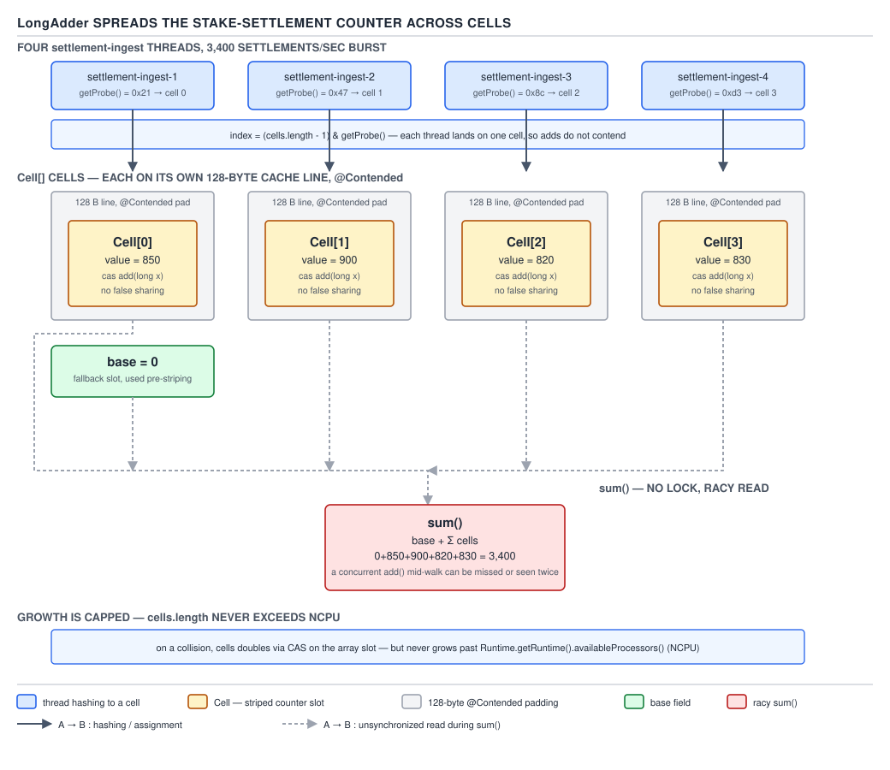

# 05 Multithreading and Concurrency — Atomics — BASICS (§1.13, leaves 1.13.16–1.13.29)

**Target version: Java 21 LTS.** | **Part 1 of 5** | [Index](../00-index.md)
Previous: [CAS and the atomic classes](01a-basics-cas-and-atomics.md) · Next: [Explicit locks — ReentrantLock and read-write locks](../locks/01a-basics-reentrantlock-and-rwlock.md)

## LongAdder and the striped counter

**Mental model.** Stake settlements land at up to 3,400/sec at burst — see [01a](01a-basics-cas-and-atomics.md) for the single-`AtomicLong` version of this counter and why it saturates. `LongAdder` does not make CAS cheaper; it makes contention rarer by giving each thread its own place to add. Picture a tip jar being replaced by four jars on four different tables — everyone stops queueing at one jar, and only at closing time does someone walk round and add the jars up.

**Why it exists.** A single `AtomicLong.incrementAndGet()` forces every updating thread to CAS against the same cache line. Under real contention that line ping-pongs between cores (MESI traffic, not a "flush"), and CAS retry loops burn CPU without making progress. `LongAdder`, backed by the package-private `Striped64`, was added in Java 8 (JSR 166e) specifically for write-heavy, read-rarely counters.

**When to reach for it, and when not.** Reach for it when you increment far more often than you read, and an approximate read is acceptable — a live throughput counter, a settlements-per-second metric, a retry counter for logging. Do **not** reach for it when you need the current exact value for a decision (an inventory count gating an action) or when reads are as frequent as writes — the cell walk in `sum()` then costs more than a single CAS would have. `AtomicLong` wins there; see the crossover measurement below.

**How it works.** `LongAdder` extends `Striped64`. A `base` field absorbs updates while there is no contention. Once a CAS on `base` fails, the thread lazily allocates a `Cell[]` sized to a power of two (capped at the next power of two ≥ `Runtime.getRuntime().availableProcessors()` — `NCPU`), and each `Cell` is padded to occupy its own cache line so cores never false-share one line for two different counters. A thread picks its cell via `ThreadLocalRandom.getProbe()` — a per-thread hash seeded once and rehashed only on collision — reducing the whole problem to "hash to a lane, CAS your own lane." `add(x)` tries `base` first, falls to the indexed cell, and on a CAS failure there either retries with a fresh probe or grows the array (never past `NCPU`, because beyond that point every core already has its own cell and growing further only wastes memory).



**D-054** — `LongAdder` spreads one counter across cells.

```java
public final class SettlementThroughputCounter {

    private final LongAdder settlementsPerWindow = new LongAdder();

    public void onStakeSettled(RoundId roundId) {
        settlementsPerWindow.increment();
    }

    // Called once per second by a scheduled reporter, never on the hot path.
    public long drainAndReport() {
        return settlementsPerWindow.sumThenReset();
    }
}
```

`increment()` is `add(1)`. `sumThenReset()` walks `base` and every `Cell`, summing and zeroing each as it goes — still racy against concurrent adders, but acceptable for a one-second reporting window where a handful of settlements landing in the gap is noise, not a correctness bug.

**The gotcha.** `LongAdder.sum()` is **not atomic** with respect to concurrent updates — it is a racy walk of `base` plus every live `Cell`, with no lock and no fence coordinating it against `add()`. Two calls to `sum()` a microsecond apart, or a `sum()` racing an in-flight `add()`, can each see a different partial state; the return value is an approximation of "the count at some moment during the walk," not a snapshot. That is the trade `LongAdder` makes deliberately: exactness of an instantaneous read, for write throughput.

> `LongAdder` trades the ability to read an exact instantaneous value for near-linear write scalability under contention, by striping updates across per-core-padded cells and only reconciling them — approximately — on demand.

### DoubleAdder and non-associative sums

**Mental model.** Same striping mechanism as `LongAdder`, `Striped64`-backed, but the cells and `base` hold the bit pattern of a `double` via `Double.doubleToRawLongBits`/`longBitsToDouble`, and `add`/`sum` operate through `Double.sum`.

**The QuizStakes example.** Suppose a reconciliation job wants a running total of bonus amounts granted this hour, fed from many concurrent `BonusService` workers, purely for a dashboard:

```java
private final DoubleAdder bonusGrantedThisHour = new DoubleAdder();

public void onBonusGranted(Money bonusAmount) {
    bonusGrantedThisHour.add(bonusAmount.amount().doubleValue());
}
```

**Pitfall:** treating `bonusGrantedThisHour.sum()` as reproducible. Floating-point addition is not associative — `(a + b) + c` and `a + (b + c)` can differ in their low bits — and the order in which cells are folded together depends on which threads hit which cells and in what order, which varies run to run. Two runs fed the exact same set of bonus amounts, in the exact same wall-clock order of arrival, can still produce two different `sum()` results if the interleaving across cells differs. This is why `FundsLedger` never uses `DoubleAdder` for anything that must reconcile to the penny — the real ledger balance is `BigDecimal` arithmetic under a lock or CAS on an immutable `Money`, never a floating-point stripe. `DoubleAdder` is for dashboards, not ledgers.

> `DoubleAdder` stripes floating-point addition the same way `LongAdder` stripes integer addition, but because IEEE 754 addition is not associative, its `sum()` is not just approximate under concurrency — it is not even reproducible across runs with identical inputs.

### LongAccumulator / DoubleAccumulator — supporting fact

`LongAccumulator`/`DoubleAccumulator` generalise the same `Striped64` striping to any `LongBinaryOperator`/`DoubleBinaryOperator` plus an identity value, not just `+`: a running `max` of stake sizes this minute, for instance, via `new LongAccumulator(Long::max, Long.MIN_VALUE)`. **[PROVE]** the operator must be associative and side-effect-free: because `Striped64` folds `base` and the cells together in an unspecified order when `get()` is called, `f(f(a, b), c)` must equal `f(a, f(b, c))` for the result to mean anything — `max` and `+` qualify, subtraction or a stateful lambda do not, and using either silently produces a value that depends on thread scheduling.

> `LongAccumulator` is `LongAdder` generalised from a hard-coded `+` to any caller-supplied associative binary operator with an identity.

### AtomicLong vs LongAdder — the crossover

**When to choose which.** `AtomicLong` when the code needs the exact post-increment value from `incrementAndGet()` itself — a sequence generator handing out the next `RoundId` ordinal, or a gate that only proceeds when a counter crosses a threshold. `LongAdder` when the value is a write-mostly metric read occasionally and approximately — the settlements-per-second counter above.

**[NUM]** The crossover is contention, not raw operation count. At low concurrency (one or two threads), `AtomicLong.incrementAndGet()` is faster per-call than `LongAdder.increment()` — the latter pays an extra field read to pick a cell and, on first contention, a lazy array allocation. Past roughly 4–8 concurrently-incrementing threads on an 8-core box, `AtomicLong` throughput flattens or drops (CAS retry storms) while `LongAdder` throughput keeps climbing until cells saturate `NCPU`, because each thread is now colliding with far fewer peers per cache line. Treat any specific multiplier as order-of-magnitude and workload-dependent — the shape of the curve (flat-then-falling vs. rising-then-flat) is the fact worth remembering, not a number.

| | `AtomicLong` | `LongAdder` |
|---|---|---|
| Exact instantaneous read | Yes, `get()` | No, `sum()` is racy |
| Low contention (1–2 threads) | Faster | Slightly slower (extra indirection) |
| High contention (8+ threads) | Degrades — CAS retries burn CPU/coherence | Scales — writes spread across cells |
| Memory footprint | One `long` | `base` + up to `NCPU` padded `Cell`s |
| Right call for | Sequence generator, gated counter | Throughput metric, hit counter |

### CAS versus locks under contention

**[PROVE]** At low to moderate contention, CAS wins because a failed CAS costs a retry — no context switch, no OS involvement, the thread stays on-CPU and simply reloads and retries, and most attempts succeed on the first or second try. A lock, by contrast, risks parking the loser: `ReentrantLock`'s slow path (see [locks/01a](../locks/01a-basics-reentrantlock-and-rwlock.md)) can push a blocked thread off-CPU entirely, and waking it back up costs a context switch — order-of-magnitude microseconds, not the tens-of-nanoseconds a CAS retry costs. Under **extreme** contention the picture reverses: every thread is now spinning and retrying CAS in a tight loop against the same cache line, so total CPU spent on retries grows roughly with the square of the waiter count while zero useful work completes, and the cache-coherence traffic (the line bouncing MESI-Invalid to MESI-Modified across cores on every attempt) saturates the interconnect. A lock caps this by parking losers instead of spinning them forever, trading latency for throughput once the waiter count is high enough. This is exactly why `LongAdder` exists: it does not choose CAS over locks, it reduces the number of threads contending for any one CAS in the first place.

## VarHandle

**Mental model.** A `VarHandle` is a typed, reflective handle onto one specific variable location — an instance field, a static field, an array element, or a byte inside an off-heap buffer — through which every read and write can be asked for a specific memory-ordering strength, chosen per call rather than baked into the variable's declaration. Where `volatile` is an all-or-nothing modifier on the field, a `VarHandle` lets the same field be read with no ordering guarantee in one hot loop and with full volatile semantics in another, from the same class.

**Why it exists.** Before Java 9, this kind of fine-grained control lived in `sun.misc.Unsafe` — an internal, unsupported, JVM-intrinsic-backed class that library authors used anyway because nothing public did the job. `VarHandle` (Java 9, JEP 193) is the supported, type-safe replacement: obtained through `MethodHandles.lookup().findVarHandle(OwnerClass.class, "fieldName", int.class)` for a field, `MethodHandles.arrayElementVarHandle(long[].class)` for an array, or `MethodHandles.byteArrayViewVarHandle(...)` for a view into a byte array.

**When to reach for it, and when not.** Reach for it when writing a concurrency primitive itself — a custom lock-free structure, a JDK-class-style striped counter — where the ordering level genuinely changes correctness or throughput and you can justify the choice line by line. Do not reach for it in application code: `AtomicLong`, `AtomicReference` and friends already wrap a `VarHandle` internally and expose the one ordering (volatile-strength for plain get/set, plus explicit lazySet/weak variants) that covers the overwhelming majority of real needs. **Insight:** reaching for `VarHandle` directly in application code is very often a sign the real requirement was `AtomicLong` all along.

**How it works.** A `VarHandle` exposes access through named methods, not a single `get`/`set` pair, and each name carries an explicit ordering strength baked into the method itself.


**D-055** — The `VarHandle` access-mode taxonomy.

| Group | Methods | Ordering supplied | Atomicity | Typical use | Application code should use it? |
|---|---|---|---|---|---|
| Read | `get`, `getOpaque`, `getAcquire`, `getVolatile` | none / coherence-only / acquire / full seq-cst | Per-read only (≤32-bit plain guaranteed) | reading a published flag or counter at increasing cost/strength | rarely — prefer `Atomic*.get()` |
| Write | `set`, `setOpaque`, `setRelease`, `setVolatile` | none / coherence-only / release / full seq-cst | Per-write only | publishing a field to other threads at increasing cost/strength | rarely — prefer `Atomic*.set()` |
| Atomic update | `compareAndSet`, `compareAndExchange`(+`Acquire`/`Release`), `weakCompareAndSet`(Plain/+`Acquire`/`Release`), `getAndSet`(+`Acquire`/`Release`) | varies by suffix, weak forms may spuriously fail | Read-modify-write is atomic | building a lock-free structure's CAS loop | almost never — `AtomicReference`/`AtomicLong` already do this |
| Numeric / bitwise | `getAndAdd`(+`Acquire`/`Release`), `getAndBitwiseOr`/`And`/`Xor`(+`Acquire`/`Release`) | varies by suffix | Read-modify-write is atomic | implementing a custom striped accumulator | almost never — `LongAdder`/`AtomicLong` already do this |

## The four memory-ordering levels

**Mental model.** Every `VarHandle` access method is really one of four ordering strengths wearing a different name. Picture four settings on the same dial: off (plain), a notch that only stops a variable from tearing and guarantees every core eventually agrees on it but says nothing about anything else happening at the same time (opaque), a one-way gate that lets some things move across it but not others (acquire/release), and a full stop where nothing crosses in either direction (volatile).

**Why it exists.** The JVM originally offered two knobs — plain field access, and `volatile` — with nothing in between. `VarHandle` exposes the intermediate levels that JDK-internal code (and hardware memory models) always had available, because paying for a full fence when only coherence or only one-way ordering is needed is wasted cost at scale.

**When to reach for it, and when not.** As leaf 1.13.26 states plainly: for application code, almost never — reach for plain (ordinary fields) or volatile (`volatile` keyword / `Atomic*`), and leave opaque and acquire/release to JDK and library authors building the primitives everyone else uses. The one exception worth knowing by name is `Thread`'s internal use of release/acquire-style ordering when publishing interrupt status, which application code never touches directly.

**How it works — [PROVE] working the guarantees through.** Start from what a plain field access gives: for a `long`/`double` field, a plain write is **not even guaranteed atomic** — two threads can observe a torn value, half of one write and half of another, because the JLS only guarantees atomicity for ≤32-bit fields (`int` and narrower) accessed plainly; every other field type or width needs at least opaque to guarantee no tearing. Opaque adds atomicity and coherence — every thread eventually sees writes to that one variable in a single total order — but it says nothing about how this variable's ordering relates to any *other* variable's reads and writes; the compiler and CPU are still free to reorder around it. Acquire/release adds a one-way barrier: a release-write cannot be reordered with anything that happened *before* it in program order, and an acquire-read cannot be reordered with anything that happens *after* it — so if thread A does `writeField(); handle.setRelease(ready, true);` and thread B does `if (handle.getAcquire(ready)) { readField(); }`, B's `readField()` is guaranteed to see A's `writeField()`, but two release-writes to two different variables from A carry no guarantee about *their* relative order as seen by a third thread. Volatile closes that last gap: it adds a full bidirectional fence plus a single global total order across *all* volatile accesses, matching Java's `happens-before` volatile semantics — this is the only one of the four that is sequentially consistent.


**D-056** — The four memory-ordering levels.

| Level | Atomicity | Coherence | Ordering with other variables | C++11 equivalent | Cost (order of magnitude) | JDK usage site |
|---|---|---|---|---|---|---|
| Plain | Only for ≤32-bit fields | None guaranteed | None | relaxed-without-atomicity | cheapest — a bare load/store | an ordinary instance field |
| Opaque | Yes, for any width | Yes — single total order per variable | None | `memory_order_relaxed` | slightly above plain — no fence, but not reorderable away | `Striped64` cell reads in `LongAdder` |
| Acquire/release | Yes | Yes | One-way — orders program-order-prior/-later accesses | `memory_order_acquire`/`release` | roughly comparable to a store/load fence, well below full fence | `AbstractQueuedSynchronizer` state handoff |
| Volatile | Yes | Yes | Full — single total order across all volatile accesses | `memory_order_seq_cst` | most expensive — full bidirectional fence | the `volatile` keyword; `AtomicLong.get()`/`set()` |

**Pitfall:** believing `volatile` works by "flushing to main memory." Modern CPUs keep caches coherent via a protocol like MESI regardless of `volatile`; there is no separate "main memory" round-trip being forced. What `volatile` (and its `VarHandle` equivalent) actually adds is a `happens-before` edge in the Java Memory Model and a compiler/CPU fence that prevents reordering — the visibility a reader gets comes from ordering guarantees, not from a literal flush.

**[SOURCE]** `VarHandle` also exposes standalone fences with no associated variable, for the rare case of ordering two unrelated accesses that aren't both going through the same handle: `VarHandle.fullFence()` forbids any reordering of loads and stores across it in either direction; `acquireFence()` forbids loads/stores *after* it from moving before it (but permits the reverse); `releaseFence()` forbids loads/stores *before* it from moving after it; `loadLoadFence()` orders only load-before-load; `storeStoreFence()` orders only store-before-store. These are the building blocks `Striped64` and `AbstractQueuedSynchronizer` compose into their own hand-rolled ordering, and application code has essentially no reason to call them directly.

> Plain, opaque, acquire/release and volatile are the same four ordering strengths the JMM and the hardware memory model both expose; `VarHandle` is simply the API that lets a caller pick per-access instead of accepting whatever the field's declared modifier fixed for every access.

### sun.misc.Unsafe — supporting fact

`sun.misc.Unsafe` was the pre-`VarHandle` mechanism for raw memory access, CAS, and object-header tricks — it is what `AtomicLong`, `ConcurrentHashMap`, and most of `java.util.concurrent` were originally built on, obtained via reflection since its factory method rejects normal callers. **[VERSION-TRAP]** In Java 21 the memory-access methods (`getInt`, `putLong`, `compareAndSwapObject`, and similar) still work with only a compile-time warning if flagged; **JEP 471** (JDK 23) formally deprecates them for removal, and **JEP 498** (JDK 24) turns on runtime warnings by default (`--sun-misc-unsafe-memory-access=warn`), with the option to set `allow`/`warn`/`debug`/`deny` explicitly; some time after JDK 25 they are expected to stop working. Every use has a replacement already: `VarHandle` for field/array/CAS access, and the Foreign Function & Memory API (JEP 454, finalized in JDK 22) for raw off-heap memory. New code should never call `Unsafe` directly.

> `sun.misc.Unsafe` is the unsupported, JVM-internal predecessor that `VarHandle` and the Foreign Function & Memory API were built to formally replace, and its memory-access methods are now on a deprecation-then-removal path starting JDK 23.

## ThreadLocalRandom

**Mental model.** `java.util.Random` is one mutable `AtomicLong` seed shared by however many threads hold a reference to that instance; every call to `nextInt()` CASes that seed. `ThreadLocalRandom.current()` instead hands each calling thread a seed that lives in that thread's own storage, so no two threads ever touch the same seed word.

**Why it exists.** Sharing one `Random` across many concurrent callers turns random-number generation into a contention point — every `nextInt()` call across every thread serializes on the same CAS, for a workload (RNG) that has no reason to be shared at all.

**Pitfall:** calling `new Random()` (or reusing one static `Random`) from multiple concurrent request-handling threads — for instance, a piece of code load-balancing which of several `PaymentService` shards a withdrawal is routed to. **[NUM]** `Random`'s internal seed is a single `AtomicLong`, updated via CAS on every `next(bits)` call; at, say, 1,200 stake-reservation-routing decisions per second spread across many worker threads, every one of those decisions now CASes the same 8-byte word, adding exactly the kind of avoidable hot-line contention this whole file has been about avoiding. The fix is `ThreadLocalRandom.current().nextInt(shardCount)` — each thread reads and updates only its own seed, with zero cross-thread CAS.

> `ThreadLocalRandom.current()` is the concurrent-safe way to get a `Random`-like generator: a per-thread seed with no shared mutable state, so there is never anything for two threads to contend over.

### Random vs. ThreadLocalRandom vs. SplittableRandom vs. RandomGenerator — supporting fact

`Random` is thread-safe but contended when shared, as above. `ThreadLocalRandom` fixes the contention for use *within* a single thread's own work but must never be stored and handed to another thread or reused across tasks that might migrate — see [X-REF 04, generics and API design](../../04-generics-and-collections/00-index.md) for why "never stash a `ThreadLocalRandom` in a field" is the same class of mistake as capturing shared mutable state in a lambda. `SplittableRandom` is not thread-safe by itself but is designed to be *split*: `split()` produces a new, statistically independent generator cheaply, making it the right choice for parallel streams and fork/join workloads that want one generator per subtask rather than one shared generator. **[RESEARCH]** Since Java 17 (JEP 356), all of these implement the `RandomGenerator` interface hierarchy (`RandomGenerator` → `SplittableGenerator`, `JumpableGenerator`, `LeapableGenerator`, `ArbitrarilyJumpableGenerator`), which also added newer algorithms (the `Xoshiro`/`L128X1024MixRandom`-style generators) selectable via `RandomGeneratorFactory.of(name)` without hard-coding a concrete class.

| | Thread-safe to share | Contention under sharing | Designed for |
|---|---|---|---|
| `Random` | Yes | High — one shared `AtomicLong` seed | Legacy code, single-threaded use |
| `ThreadLocalRandom` | No — never share across threads | None (per-thread seed) | Per-thread RNG inside one worker |
| `SplittableRandom` | No — split instead of sharing | None (each split is independent) | Fork/join, parallel streams |
| `RandomGenerator` (JEP 356) | Depends on implementor | Depends on implementor | Selecting an algorithm by name, forward-compatible API |

## Pitfalls

### Assuming LongAdder.sum() is a consistent snapshot

**Wrong**
```java
LongAdder settlements = new LongAdder();
// Thread A: settlements.increment() called continuously
// Thread B, reading twice a millisecond apart:
long first = settlements.sum();
long second = settlements.sum();
// Assuming second - first exactly equals the number of increments that
// occurred in that window, and that a single sum() is "the" count.
```

**Right**
```java
// Treat sum() as an approximation, valid for dashboards and rate metrics,
// never for a value a business decision depends on.
long approxCount = settlements.sum();
// If an exact, decision-grade value is required, use AtomicLong instead:
AtomicLong exactCount = new AtomicLong();
long exact = exactCount.incrementAndGet();
```

**Why people believe it:** `sum()` reads like `get()` on an `AtomicLong`, and in a lightly-loaded test it usually *does* return the exact count, because there is little concurrent traffic to race against — the racy walk only shows its true colors under the contention `LongAdder` was built for.

### Believing DoubleAdder's sum() is reproducible given the same inputs

**Wrong**
```java
// Run twice with the exact same set of bonus amounts granted, in the same
// wall-clock order, expecting sum() to return the identical double both times.
DoubleAdder total = new DoubleAdder();
amounts.forEach(total::add);
System.out.println(total.sum()); // assumed deterministic
```

**Right**
```java
// For anything that must reconcile exactly (ledger totals), use BigDecimal
// under explicit synchronization or an immutable Money accumulated via CAS,
// never a floating-point stripe.
Money runningTotal = ledgerLock.protectedAdd(bonusAmount);
```

**Why people believe it:** floating-point arithmetic looks deterministic in single-threaded code, so it is easy to forget that `Striped64`'s fold order depends on which threads landed in which cells — a scheduling detail, not a property of the numbers themselves.

### Reaching for VarHandle's acquire/release directly in application code

**Wrong**
```java
// A feature-flag class hand-rolling publication with a raw VarHandle,
// believing this is "more correct" than the standard tool.
private static final VarHandle READY;
static { /* ... findVarHandle setup ... */ }
private boolean ready;
void publish() { READY.setRelease(this, true); }
boolean isReady() { return (boolean) READY.getAcquire(this); }
```

**Right**
```java
// A plain volatile field gives the identical happens-before guarantee with
// no reflection, no static initializer boilerplate, and no ordering
// mistake to get wrong.
private volatile boolean ready;
void publish() { ready = true; }
boolean isReady() { return ready; }
```

**Why people believe it:** acquire/release sounds like "the correct, minimal-cost version of volatile," which is true for JDK-internal primitives operating at enormous scale — but for one boolean flag checked occasionally, the cost difference is unmeasurable and the reflection and boilerplate are pure risk.

## Cheat sheet

| Fact | Value |
|---|---|
| `LongAdder` backing structure | `base` field + `Cell[]`, `@Contended`-padded, package-private `Striped64` |
| `LongAdder.sum()` | Racy walk, not atomic — approximation under load |
| `Cell[]` growth cap | `NCPU` (`Runtime.getRuntime().availableProcessors()`) |
| Thread-to-cell mapping | `ThreadLocalRandom.getProbe()` hash |
| `DoubleAdder` caveat | Sum not reproducible — FP addition is non-associative |
| `LongAccumulator` requirement | Operator must be associative + side-effect-free (fold order unspecified) |
| `AtomicLong` wins when | Exact value needed, or low contention |
| `LongAdder` wins when | Write-mostly metric, moderate-to-high contention |
| CAS vs. lock, low/moderate contention | CAS wins — no context switch |
| CAS vs. lock, extreme contention | Lock wins — CAS retries burn CPU/coherence bandwidth |
| `VarHandle` origin | Java 9, JEP 193 — replaces `sun.misc.Unsafe` |
| `VarHandle` obtained via | `MethodHandles.lookup().findVarHandle(...)`, `arrayElementVarHandle`, `byteArrayViewVarHandle` |
| Four ordering levels | plain → opaque → acquire/release → volatile |
| Plain guarantees atomicity for | ≤32-bit fields only |
| Opaque adds | Atomicity + coherence, no cross-variable ordering |
| Acquire/release adds | One-way barrier (program-order before/after) |
| Volatile adds | Full fence + single total order (sequential consistency) |
| Standalone fences | `fullFence`, `acquireFence`, `releaseFence`, `loadLoadFence`, `storeStoreFence` |
| Application code should use opaque/acquire/release? | Almost never — JDK/library territory |
| `sun.misc.Unsafe` status (Java 21) | Works, compile-time-warned; JEP 471 (23) deprecates for removal, JEP 498 (24) warns at runtime |
| Never share across threads | `java.util.Random` (single `AtomicLong` seed) |
| Concurrent RNG of choice | `ThreadLocalRandom.current()` |
| Parallel-stream / fork-join RNG | `SplittableRandom` (`split()` for independence) |
| Algorithm-agnostic RNG API (Java 17+) | `RandomGenerator` hierarchy, JEP 356 |

## Self-test

**Q1.** Why is `LongAdder.sum()` not atomic, and what does that mean for a caller that calls it twice in a row?

<details><summary>Answer</summary>

`sum()` walks `base` plus every live `Cell` with no lock and no coordinating fence against concurrent `add()` calls. Two calls a moment apart (or one call racing an in-flight increment) can each observe a different partial state of the cells, so the result is an approximation of the count at some point during the walk, not a guaranteed exact snapshot. A caller needing an exact value must use `AtomicLong` instead.

</details>

**Q2.** Why is `DoubleAdder.sum()`'s result not reproducible across two runs fed the identical sequence of additions?

<details><summary>Answer</summary>

Floating-point addition is not associative — `(a + b) + c` can differ in its low bits from `a + (b + c)`. `Striped64` folds `base` and the cells together in whatever order the walk happens to visit them, and that order depends on thread scheduling (which threads landed in which cells, and in what interleaving), which varies run to run even with identical inputs and identical arrival order.

</details>

**Q3.** A `LongAccumulator` is built with a non-associative binary operator, such as subtraction. What goes wrong?

<details><summary>Answer</summary>

`Striped64` combines `base` and the cells in an unspecified order when `get()`/`sum()` is called. For an associative operator like `+` or `max`, any fold order produces the same result. For a non-associative operator like subtraction, `f(f(a,b),c)` differs from `f(a,f(b,c))`, so the returned value depends on which order the cells happened to be folded in — a scheduling artifact leaking into the answer, not a meaningful result.

</details>

**Q4.** At roughly what contention level does `AtomicLong.incrementAndGet()` start losing to `LongAdder.increment()`, and why does the direction reverse at low contention?

<details><summary>Answer</summary>

Order-of-magnitude, somewhere around 4–8 concurrently-incrementing threads on a modern multi-core box, `AtomicLong` throughput flattens or falls as CAS retries increase, while `LongAdder` throughput keeps climbing because writes spread across cells. At low contention (one or two threads) `AtomicLong` is faster because `LongAdder` pays extra overhead — a cell-selection read and, on first contention, a lazy array allocation — that a single uncontended CAS doesn't need to pay.

</details>

**Q5.** Why does CAS win over a lock at low contention but lose at extreme contention?

<details><summary>Answer</summary>

A failed CAS just retries on-CPU — no context switch, no OS involvement — and at low/moderate contention most attempts succeed within one or two tries, so CAS stays cheap. A lock's slow path can park a losing thread, and waking it back up costs a context switch, which is far more expensive than a retry. Under extreme contention, though, every thread is spinning and retrying against the same cache line: total CPU spent on retries grows sharply, useful work stalls, and coherence traffic saturates the interconnect. A lock caps this by parking losers instead of spinning them, trading latency for throughput once contention is high enough.

</details>

**Q6.** List the four `VarHandle` access-mode groups and name one method from each.

<details><summary>Answer</summary>

Read (`getVolatile`), write (`setRelease`), atomic update (`compareAndExchange`), numeric/bitwise (`getAndAdd`). Each group also has plain/opaque/acquire/release/volatile-strength variants where applicable.

</details>

**Q7.** What does "opaque" guarantee that "plain" does not, and what does it still not guarantee that acquire/release does?

<details><summary>Answer</summary>

Opaque guarantees atomicity for any width (no torn reads/writes) and coherence — every thread eventually sees a single total order of writes to that one variable — where plain only guarantees atomicity for ≤32-bit fields and nothing about ordering. Opaque still says nothing about how this variable's accesses order relative to any *other* variable's accesses; acquire/release adds that one-way ordering (a release-write can't move after subsequent code, an acquire-read can't move before it), which opaque does not provide.

</details>

**Q8.** Why does `volatile` not "flush to main memory," and what is actually happening?

<details><summary>Answer</summary>

Modern CPUs already keep caches coherent via a protocol like MESI, independent of `volatile` — there is no separate main-memory round-trip being forced by the keyword. What `volatile` actually does is establish a `happens-before` edge in the Java Memory Model and insert a compiler/CPU fence preventing reordering, so a reader is guaranteed to observe a writer's prior writes — the guarantee comes from ordering semantics, not a literal cache flush.

</details>

**Q9.** What is `sun.misc.Unsafe`'s status as of Java 21, and what happens in Java 23–25?

<details><summary>Answer</summary>

In Java 21 its memory-access methods still work, at most with a compile-time warning. JEP 471 (JDK 23) formally deprecates those methods for removal. JEP 498 (JDK 24) turns on runtime warnings by default (configurable via `--sun-misc-unsafe-memory-access={allow|warn|debug|deny}`). Some time after JDK 25 they are expected to stop working entirely. `VarHandle` and the Foreign Function & Memory API (JEP 454) are the supported replacements.

</details>

**Q10.** Why must a `ThreadLocalRandom` instance never be stored in a field and shared across threads, given that its whole purpose is per-thread state?

<details><summary>Answer</summary>

`ThreadLocalRandom.current()` hands back the seed belonging to *the calling thread*. Stashing that returned instance in a field and letting another thread call methods on it defeats the entire design — it turns a per-thread, contention-free generator back into a shared mutable object, exactly the problem `ThreadLocalRandom` exists to avoid. Each thread must call `ThreadLocalRandom.current()` itself.

</details>

---

**Leaves covered:** 1.13.16–1.13.29 (14 leaves)
**Leaves deferred:** none
**Diagrams included:** D-054, D-055, D-056
**Target version:** Java 21 LTS
**Lines:** 349
