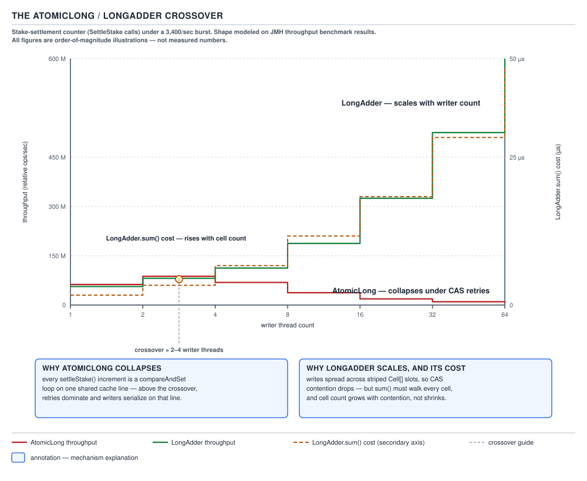
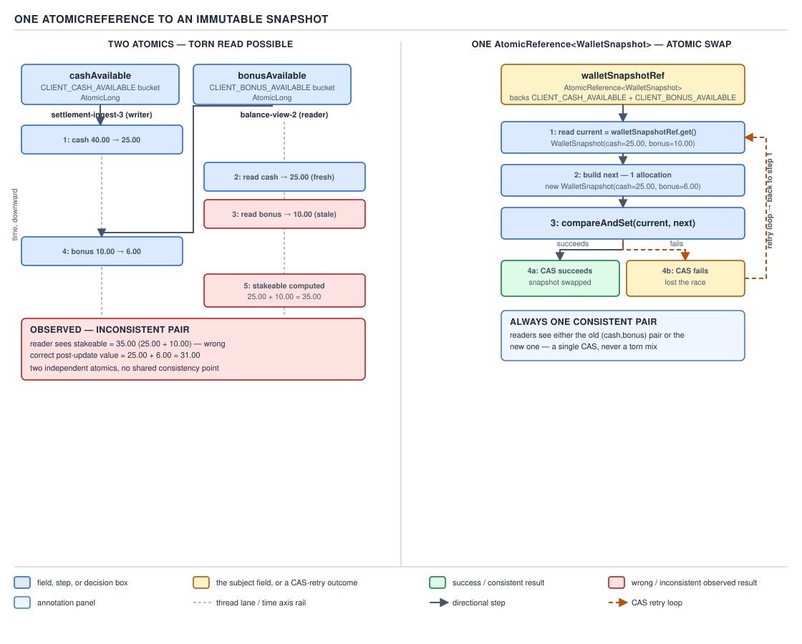

# 05 Multithreading and Concurrency — The atomicity decision in practice — INTERMEDIATE (§2.5)

**Target version: Java 21 LTS.** | **Part 2 of 5** | [Index](../00-index.md)
Previous: [Pool sizing and executor configuration](../executors/04-pool-sizing.md) · Next: [The concurrent collection decision](../concurrent-collections/02-the-collection-decision.md)

QuizStakes settles 2.8M stakes/day, bursting to **3,400 settlements/sec**. Every one of
those settlements touches at least one shared counter and, for the losing side of a bonus
stake, all four wallet buckets at once. This file is the decision procedure for making that
touch atomic without paying for a lock you don't need — and for recognizing the one case
(the wallet buckets) where a lock-free single-variable swap beats a lock outright.

### 2.5.1 / 2.5.2 — Five ways to count, and the `AtomicLong`/`LongAdder` crossover

**Mental model.** A counter is either a single memory cell everyone fights over, or a
striped set of cells each thread mostly owns and nobody reads until someone asks for the
total. `AtomicInteger`/`AtomicLong` is the single cell with a CAS retry loop. `LongAdder` is
the striped array: writes hash to a cell and CAS *that* cell, so sixteen threads fight over
sixteen cells instead of one.

**Why it exists.** `synchronized` around `count++` serializes every writer through one lock,
even though addition is commutative — order never matters, only the final sum. CAS on a
single `AtomicLong` removes the OS-level block/wake but still funnels every writer through
one contended cache line: every writer's CAS invalidates every other writer's cached copy of
that line, so throughput collapses exactly the way lock contention does, just without
`BLOCKED` threads. `LongAdder` (Java 8, Doug Lea, ported from JSR-166's `Striped64`)
exploits commutativity: give each thread its own cell most of the time, and only reduce
(sum) the cells when a reader actually needs the total.

**When to reach for it, and when not.** Reach for `LongAdder` when writes vastly outnumber
reads and the reads tolerate staleness — a settlement counter reported once a second to a
dashboard. Stay on `AtomicLong` when a caller needs the *exact instantaneous* value on every
write path — a reservation id generator via `incrementAndGet`, or a running balance a
transaction must read-and-branch on. `LongAdder` has no `compareAndSet` and no cheap
`incrementAndGet` return value; `sum()` is not itself atomic with respect to concurrent
updates, so treat it as "approximately now," never as an input to a decision.

**How it works.** `LongAdder` starts with a single `base` field acting as a plain
`AtomicLong` under low contention — the whole `Cell[]` array is null until contention is
detected. On CAS failure against `base`, or once the array exists, the thread hashes its
`ThreadLocalRandom` probe onto a `Cell` and CASes that cell instead; a CAS failure there
triggers rehashing to spread threads across more cells, doubling the array up to the next
power of two ≤ the core count. `sum()` walks `base` plus every non-null cell and adds them —
an O(cells) operation with no synchronization against concurrent writers, so it is a
best-effort total, not a snapshot.

`[NUM]` `[PROVE]` **The crossover, argued.** At 1 writer, `AtomicLong` and `LongAdder`
cost the same: one CAS, no contention, no array allocated. At 2–4 concurrent writers on a
typical 8-way cache-coherent machine, the probability that two writers' CAS attempts on the
*same* single cache line collide within a store-buffer-drain window rises fast enough that
`AtomicLong`'s retry loop starts re-executing 2×, 3×, 4× per logical increment — CAS failure
means re-read, re-add, re-CAS from scratch. `LongAdder`, once it detects that first
collision, spreads writers over 2+ cells, so each writer's line is contended by only a
fraction of the writers. Above roughly 4–8 concurrent writers `AtomicLong`'s retry storm
degrades close to linearly with writer count while `LongAdder`'s degrades close to linearly
with writer-count-divided-by-cell-count. These are **order-of-magnitude shapes from the
`Striped64` design rationale, not measured constants on any specific machine** — the exact
crossover point moves with core count, cache-line sharing, and JIT inlining.



**D-123** — The `AtomicLong`/`LongAdder` crossover.

```java
// settlement counter, contended write path, 3,400/sec burst
private final LongAdder settlementsProcessed = new LongAdder();

void onStakeSettled(RoundId roundId) {
    settlementsProcessed.increment();          // hashes to a Cell, CASes that cell
}

// read path — dashboard poll, once a second, staleness tolerated
long currentThroughputSample() {
    return settlementsProcessed.sumThenReset(); // O(cells), not atomic vs concurrent writers
}
```

**The gotcha.** `sum()`/`sumThenReset()` cost rises with the number of live cells — a
`LongAdder` that has scaled out to 64 cells under a traffic spike pays a 64-cell walk on
every read even after traffic subsides, because cells are never shrunk. A counter read on a
hot path (not the dashboard poll above, but something called per-request) can turn that
O(cells) walk into a real cost.

**Interview:** "Why not always use `LongAdder`?" — because it has no atomic
read-modify-write beyond plain addition; the moment you need `compareAndSet`, an exact
value on the write path, or a value smaller than "eventually accurate," you're back on
`AtomicLong`.

> **`LongAdder` trades exact instantaneous reads for write throughput under contention by
> striping the counter across cells that only get reduced to a total on demand.**

### 2.5.1 — Five ways to count, compared

D-122 (table) below folds in leaf 5.1.129 (per-thread counters). The three not walked above
in prose:

- **`int` guarded by `synchronized`** — a plain field, mutated only inside a monitor. Exact
  read requires taking the lock too, or the reader sees a stale value. Simplest correct
  option, worst throughput under contention, because every writer blocks every other writer
  *and* every reader.
- **`ConcurrentHashMap.merge`** — useful when the counter is one of *many* keyed counters
  (settlements per client, per rail) rather than one global number. `merge` does a
  per-bin-locked read-modify-write; contention is bounded by how many keys collide into the
  same bin, not by the whole map.
- **Per-thread counter, summed at read** — a `ThreadLocal<long[]>` (or one `AtomicLong` per
  known worker thread) that each thread only ever increments. No CAS, no contention, ever —
  the write is a plain store. The cost moves entirely to the read, which must enumerate every
  thread's cell, and to the lifecycle problem of threads that exit without deregistering.
  `LongAdder` is this idea, generalized and garbage-collected properly.

| Approach | Exact instantaneous read | Write throughput: 1 / 4 / 16 / 64 threads | Memory | Verdict for 3,400/sec settlements |
|---|---|---|---|---|
| `int` + `synchronized` | Yes, under the same lock | Best / Worst / Worst / Worst | 1 word + monitor | No — lock serializes every settlement thread |
| `AtomicInteger`/`AtomicLong` | Yes | Best / Good / Poor / Poor | 1 word | No above ~4–8 writers — CAS retry storm |
| `LongAdder` | No — `sum()` is a best-effort walk | Best / Best / Best / Best | 1 word idle, grows to N cells under contention | **Yes** — writes dominate, dashboard tolerates staleness |
| `ConcurrentHashMap.merge` | Yes, per key | Best / Good / Good / Fair (bin-lock bound) | 1 entry per key | Only if counting **per client/rail**, not the global total |
| Per-thread counter, summed at read | No — same caveat as `LongAdder`'s `sum()` | Best (no CAS at all) / Best / Best / Best | O(thread count), leak risk on unregistered exit | Reinvents `LongAdder` worse — use `LongAdder` |

**D-122** — Five ways to count, and when each wins.

### 2.5.3 — Cache decision, one paragraph `[X-REF 15]`

A `Map` guarded by a lock blocks every reader during a miss's compute; `ConcurrentHashMap
.computeIfAbsent` narrows that block to one bin but still holds the bin lock for the whole
computation (2.5.4 below is the workaround); Caffeine adds eviction (size/time/weight) and
refresh-ahead that neither option gives you for free. The three properties that decide it:
does a miss block other keys (no for CHM, no for Caffeine, yes for a single lock), does
anything ever get evicted (only Caffeine), and does staleness need active refresh rather
than lazy recompute (only Caffeine's `refreshAfterWrite`). See guide 15 for the full
`ConcurrentHashMap` internals this decision leans on.

> A cache decision is really an eviction-and-refresh decision; raw atomicity is table
> stakes all three options already clear.

### 2.5.4 — The "compute under the bin lock" workaround `[BUILD]`

**Mental model.** `ConcurrentHashMap.computeIfAbsent` holds the target bin's lock for the
entire duration of the mapping function. If that function is slow — a document-verdict
lookup, a wealth-score recompute — every other key hashing into that same bin queues behind
it, and a function that re-enters the same map deadlocks outright.

**Why it exists.** The map needs *some* way to guarantee the function runs at most once per
key under concurrent callers; holding the bin lock is the cheapest way to get that guarantee,
but it leaks the cost of the function into the map's own locking.

**When to reach for it, and when not.** Accept the lock-under-compute default when the
function is cheap (a few field reads, no I/O, no re-entrant map access). Reach for one of
the two workarounds below the moment the function does I/O or can be slow enough to matter —
which, for QuizStakes, is exactly the cached wealth-score lookup used to gate a stake.

**How it works — two workarounds.**

1. **Compute outside, `putIfAbsent`, accept duplicate work.** Read outside any lock; on a
   miss, do the expensive work *without* holding a bin lock, then race to install it with
   `putIfAbsent`. Some callers duplicate the computation on a cache-miss stampede, but no
   caller ever blocks on another caller's slow work.
2. **Store a `CompletableFuture` in the map.** The value type becomes
   `CompletableFuture<V>`; the first caller to miss creates the future and starts the
   computation, `putIfAbsent`s the future itself (a cheap, fast object), then completes it
   off-map. Every other caller that misses gets the *same* future back from
   `putIfAbsent`'s losing branch and calls `.join()` on it — one computation, many joiners,
   no bin lock held during the slow part.

```java
// Workaround 2: only one thread computes; the rest.md join.
private final ConcurrentHashMap<ClientId, CompletableFuture<WealthVerdict>> wealthCache =
        new ConcurrentHashMap<>();

WealthVerdict wealthVerdictFor(ClientId clientId, Supplier<WealthVerdict> slowLookup) {
    CompletableFuture<WealthVerdict> mine = new CompletableFuture<>();
    CompletableFuture<WealthVerdict> existing = wealthCache.putIfAbsent(clientId, mine);
    CompletableFuture<WealthVerdict> winner = existing != null ? existing : mine;
    if (existing == null) {
        // I won the race to install; I do the slow work, off the bin lock.
        try {
            mine.complete(slowLookup.get());
        } catch (RuntimeException e) {
            mine.completeExceptionally(e);
            wealthCache.remove(clientId, mine); // don't cache a failure
            throw e;
        }
    }
    return winner.join();
}
```

**The gotcha.** Workaround 1 is simpler but wastes work under a stampede — acceptable for a
cheap recompute, wasteful for the wealth-score lookup which calls `AssessmentService`.
Workaround 2 avoids the waste but means every joiner blocks on the *first* caller's latency,
including its p99, and a failed computation must be actively evicted (as above) or every
future caller inherits the same exception forever.

> Neither workaround is "the fix" — they trade duplicate work against shared latency, and
> the choice is which one your slow function can afford.

### 2.5.5 — Accumulator decision, one paragraph `[PROVE]`

`LongAdder` only adds. When the reduction is a different associative, commutative function
— max, min, bitwise OR — `LongAccumulator` generalizes the same striped-cell trick to an
arbitrary `LongBinaryOperator`, with the same requirement: the function must be pure (no
side effects, since a CAS retry re-invokes it) and associative (so which order cells combine
in doesn't matter). An `AtomicReference` CAS loop can express the same idea manually for any
type, at the cost of writing the retry loop yourself; a lock can express it for functions
that are *not* pure or associative, at the cost of serializing every writer. Proof sketch for
why purity matters: if the function had a side effect, a CAS failure would re-run that side
effect a second time for the same logical update, and the caller would observe it twice —
exactly the double-computation risk 2.5.4's workaround 1 accepts deliberately and 2.5.4's
workaround 2 exists to avoid.

### 2.5.6 / 2.5.7 — The immutable-snapshot-in-an-`AtomicReference` pattern

**Mental model.** Two atomics never make an atomic pair. `AtomicLong cashAvailable` and
`AtomicLong bonusAvailable` are each individually consistent, but a reader that calls `.get()`
on both can observe a torn combination — cash *after* a stake settled, bonus *before* it —
because nothing prevents another thread's update from landing between the two reads. The
fix is to stop having two variables: put the whole compound state into one immutable object
and swap the *reference* to it atomically.

**Why it exists.** A lock around both fields also fixes the tear, but locks the wallet
against every reader and writer, for buckets that legitimately need to move together only on
a settlement. `AtomicReference.compareAndSet` gives the same all-or-nothing view without a
monitor, at the cost of allocating a new object per update.



**D-124** — One `AtomicReference` to an immutable snapshot.

**When to reach for it, and when not.** Reach for it when the invariant spans more than one
field and updates are read-derive-write (read the old snapshot, compute a new one, try to
install it) rather than "add these fields independently." Stay on separate atomics only when
the fields are genuinely independent — no reader ever needs to see them together — which is
not true of the four wallet buckets: `Stakeable = CASH_AVAILABLE + BONUS_AVAILABLE` is read
as a pair on every stake preview.

**How it works.** `compareAndSet(expectedRef, newRef)` succeeds only if no other thread
already swapped the reference since this thread read it. A writer's loop is: read the
current snapshot, compute a new snapshot from it, CAS it in; on failure, someone else won —
re-read and retry. Because each attempt builds a brand-new immutable object, contention costs
allocations, not blocked threads.

`[BUILD]` — the full `WalletSnapshot` record over all four buckets, with the settlement
update that exercises the win/void asymmetry from §11.3 of the domain reference:

```java
public record WalletSnapshot(
        Money cashAvailable,
        Money cashReserved,
        Money bonusAvailable,
        Money bonusReserved) {

    public WalletSnapshot {
        if (cashAvailable.amount().signum() < 0 || cashReserved.amount().signum() < 0
                || bonusAvailable.amount().signum() < 0 || bonusReserved.amount().signum() < 0) {
            throw new LedgerImbalanceException("wallet bucket went negative");
        }
    }

    Money stakeable() {
        return cashAvailable.plus(bonusAvailable);
    }

    Money withdrawable() {
        return cashAvailable;
    }
}

public final class ClientWallet {

    private final AtomicReference<WalletSnapshot> snapshot;

    public ClientWallet(WalletSnapshot initial) {
        this.snapshot = new AtomicReference<>(initial);
    }

    /** Settlement moves reserved funds per the win/void/loss asymmetry (domain §11.3). */
    public WalletSnapshot applySettlement(StakeSplit reserved, SettlementOutcome outcome) {
        while (true) {
            WalletSnapshot current = snapshot.get();
            WalletSnapshot next = switch (outcome) {
                case WON -> new WalletSnapshot(
                        current.cashAvailable().plus(reserved.cashPortion()).plus(reserved.bonusPortion()),
                        current.cashReserved().minus(reserved.cashPortion()),
                        current.bonusAvailable(),
                        current.bonusReserved().minus(reserved.bonusPortion()));
                case VOIDED -> new WalletSnapshot(
                        current.cashAvailable().plus(reserved.cashPortion()),
                        current.cashReserved().minus(reserved.cashPortion()),
                        current.bonusAvailable().plus(reserved.bonusPortion()),
                        current.bonusReserved().minus(reserved.bonusPortion()));
                case LOST -> new WalletSnapshot(
                        current.cashAvailable(),
                        current.cashReserved().minus(reserved.cashPortion()),
                        current.bonusAvailable(),
                        current.bonusReserved().minus(reserved.bonusPortion()));
            };
            if (snapshot.compareAndSet(current, next)) {
                return next; // won the race; this settlement is durably visible
            }
            // lost the race — another settlement or reservation landed first; retry with fresh state
        }
    }
}
```

**The cost, named explicitly (2.5.7).** Every attempt — successful or not — allocates a new
`WalletSnapshot`. Under the 3,400/sec settlement burst with several concurrent settlements
per client being a practical impossibility (settlements are per-round, and a client's rounds
don't overlap in this domain), retries stay rare; but if this same pattern were applied to a
hotter, genuinely multi-writer aggregate, retry storms would show the identical
order-of-magnitude degradation as 2.5.2's `AtomicLong` — a CAS loop is a CAS loop whether the
payload is a `long` or a reference.

**Interview:** "How do you update two related fields atomically without a lock?" — collapse
them into one immutable object and CAS the reference; the two atomics separately is the wrong
answer the question is fishing for.

> **Two atomics never make an atomic pair; one immutable snapshot swapped by a single
> `compareAndSet` does, at the cost of one allocation per attempt.**

### 2.5.8 — Copy-on-write, the same idea for collections

`CopyOnWriteArrayList`/`CopyOnWriteArraySet` apply exactly 2.5.6's pattern to a collection:
every mutation copies the entire backing array, then swaps the reference. Readers never
block and never see a torn collection, for the same reason a `WalletSnapshot` reader never
does. The cost is worse than the wallet case because the object being copied scales with
collection size, not with four fixed fields — an O(n) copy per write. This is why the
domain reference's "2.8M appends" scenario is the canonical `CopyOnWriteArrayList` disaster:
fine for a rarely-written, often-read list (a set of active feature flags), catastrophic for
anything resembling a write-heavy log.

**Pitfall:** reaching for `CopyOnWriteArrayList` as a general-purpose thread-safe list
because "it's in `java.util.concurrent` so it must be fast." **Symptom:** append latency
that grows with list size and CPU pinned copying arrays under load. **Fix:** use it only
where reads vastly outnumber writes and the collection stays small; otherwise a
`ConcurrentHashMap`-backed structure or an external queue is the right shape.

### 2.5.9 — Idempotence as a substitute for atomicity `[X-REF 14]`

Where a network hop separates the check from the act — a payment retry that might have
already landed — no local atomic primitive helps, because the race isn't between threads on
one JVM, it's between a client's retry and a server that already processed the first
attempt. QuizStakes' `IdempotencyKey` on payment intents exists for exactly this: the second
`PaymentService` call with the same key returns the first call's recorded result instead of
re-executing it, which removes the need for atomicity across the network boundary entirely.
See guide 14 for the full idempotency-key mechanism and its storage/expiry tradeoffs.

### 2.5.10 — The "check then act" removal checklist

Before reaching for a lock around a compound operation, work down this list in order:

1. **Is there an atomic compound method already?** `computeIfAbsent`, `merge`,
   `compareAndSet`, `getAndUpdate` — most check-then-act races on a single map entry or
   single variable are already solved in the JDK.
2. **Can the state be collapsed into one variable?** This is 2.5.6: if the race is across
   several fields, make it one field (one record) behind one `AtomicReference`.
3. **Can the operation be made idempotent?** If the race crosses a process or network
   boundary rather than just threads, 2.5.9 applies — a retry-safe operation doesn't need
   mutual exclusion at all.
4. **Only then, a lock.** If none of the above holds — the operation is not expressible as
   one atomic step, does not reduce to one variable, and cannot be made idempotent — take
   the lock and stop looking for a lock-free trick that isn't there.

---

## Pitfalls

### Assuming `AtomicLong` is always the "fast" concurrent counter

**Wrong**

```java
// "AtomicLong is lock-free, so it must scale" — no bound on writer count considered
private final AtomicLong settlementsProcessed = new AtomicLong();
void onStakeSettled() { settlementsProcessed.incrementAndGet(); }
// At 3,400 settlements/sec fanned across dozens of worker threads, throughput
// flattens well below the arrival rate as CAS retries pile up on one cache line.
```

**Right**

```java
// LongAdder scales with writer count because writers stripe across cells.
private final LongAdder settlementsProcessed = new LongAdder();
void onStakeSettled() { settlementsProcessed.increment(); }
long dashboardSample() { return settlementsProcessed.sum(); } // approximate, and that's fine
```

**Why people believe it:** "lock-free" gets conflated with "scales under contention." A
CAS loop removes blocking, not cache-line contention — those are different problems, and
`LongAdder` only exists because the second one still needed solving.

### Believing two `AtomicLong` fields are as safe as one lock

**Wrong**

```java
private final AtomicLong cashAvailable = new AtomicLong(cashMinor);
private final AtomicLong bonusAvailable = new AtomicLong(bonusMinor);

Money stakeable() {
    // A settlement can land between these two reads: torn view.
    return Money.of(cashAvailable.get() + bonusAvailable.get());
}
```

**Right**

```java
// One reference read; the WalletSnapshot it points to is internally consistent
// because it was built and installed as a single unit (2.5.6).
Money stakeable() {
    WalletSnapshot s = snapshot.get();
    return s.cashAvailable().plus(s.bonusAvailable());
}
```

**Why people believe it:** each individual `AtomicLong` really is safe on its own, so it
feels like safety should compose. It doesn't — atomicity is a property of one memory
location, and "the pair" is not one memory location unless you make it one.

## Cheat sheet

| Situation | Reach for |
|---|---|
| Exact value needed on every write (id generator, gate check) | `AtomicLong`/`AtomicInteger` |
| High-write, staleness-tolerant global counter | `LongAdder` |
| High-write, staleness-tolerant per-key counter | `ConcurrentHashMap.merge` |
| Reduction is max/min/OR, not sum | `LongAccumulator` (pure, associative function) |
| Compound state across 2+ fields, updated as a unit | one immutable record + `AtomicReference.compareAndSet` |
| Slow function inside `computeIfAbsent` | compute-outside-then-`putIfAbsent`, or `CompletableFuture`-in-map |
| Mostly-read, rarely-written collection | `CopyOnWriteArrayList`/`Set` |
| Race crosses a network boundary | idempotency key, not a lock |
| Compound op has no atomic method, doesn't collapse, isn't idempotent | lock — last resort, not first |

## Self-test

**Q1.** Why does `LongAdder` beat `AtomicLong` above roughly 2–4 concurrent writers, and why is that number not a promise?

<details><summary>Answer</summary>

Above that range, `AtomicLong`'s single cache line sees enough concurrent CAS attempts that
retries dominate; `LongAdder` spreads writers over multiple cells so each cell sees fewer
competing writers. The exact crossover depends on core count, cache topology and JIT
behavior — it's an order-of-magnitude shape from the `Striped64` design rationale, not a
measured constant.

</details>

**Q2.** Why is `LongAdder.sum()` unsuitable as an input to a business decision (e.g., "has this client exceeded their daily deposit count")?

<details><summary>Answer</summary>

`sum()` walks cells without synchronizing against concurrent writers, so it can return a
value that never existed at any single instant — a best-effort approximation, not a
snapshot. A decision that must be exactly right needs an `AtomicLong` or a transactional
read instead.

</details>

**Q3.** Why do two `AtomicLong` fields not give you an atomic pair, even though each field is individually thread-safe?

<details><summary>Answer</summary>

Atomicity applies to one memory location at a time. Reading both fields is two separate
atomic reads with no guarantee nothing changes between them — another thread's update can
land in the gap, producing a torn combination even though neither individual read was wrong.

</details>

**Q4.** What does collapsing wallet state into a `WalletSnapshot` record cost that two separate `AtomicLong`s do not?

<details><summary>Answer</summary>

An allocation per update attempt (successful or retried), since every write builds a new
immutable object rather than mutating a primitive in place. Under contention, retries also
mean discarded allocations.

</details>

**Q5.** Why does `computeIfAbsent` risk a deadlock if the mapping function re-enters the same map for a different key?

<details><summary>Answer</summary>

The function runs while the target bin's lock is held; if it calls back into the map in a
way that needs the same lock (directly or via a hash collision into the same bin), the
thread blocks on a lock it already holds, or on a lock another thread holding a dependent
lock needs — a self-deadlock or map-wide deadlock depending on the collision.

</details>

**Q6.** Between "compute outside then `putIfAbsent`" and "store a `CompletableFuture` in the map," which wastes work and which serializes latency?

<details><summary>Answer</summary>

Compute-outside-then-`putIfAbsent` can duplicate the expensive computation across a
stampede of concurrent misses (wastes work, no shared latency). Storing a
`CompletableFuture` guarantees exactly one computation, but every other caller joins on that
one computation's latency, including its p99 (no wasted work, shared latency).

</details>

**Q7.** Why is `LongAccumulator`'s function required to be pure and associative?

<details><summary>Answer</summary>

A CAS failure re-invokes the function on fresh state; if it had a side effect, that side
effect would run again for the same logical update. Associativity is required because cells
combine in whatever order `sum`-equivalent reduction happens to visit them.

</details>

**Q8.** Why does an idempotency key solve a problem that no local Java atomic can?

<details><summary>Answer</summary>

The race in question is between a client retry and a server, across a network boundary —
there is no shared memory location for a CAS or a lock to protect. Recording the key and
returning the first result on a repeat removes the need for exclusion entirely.

</details>

**Q9.** In the "check then act" removal checklist, why does the lock come last rather than first?

<details><summary>Answer</summary>

Most compound races are already solved by an atomic compound method, by collapsing state
into one variable, or by making the operation idempotent — each of those avoids blocking
entirely. A lock is the only option that serializes threads, so it should only be reached
for once the cheaper options are ruled out.

</details>

**Q10.** For the 3,400/sec settlement counter itself (not the wallet), which of the five counting approaches wins, and why doesn't `ConcurrentHashMap.merge` apply?

<details><summary>Answer</summary>

`LongAdder` wins: writes vastly outnumber reads (one dashboard poll per second) and the read
tolerates staleness. `merge` is for *per-key* counters (per client, per rail); the
settlement counter is a single global total, so there's no key to shard the contention
across.

</details>

---

**Leaves covered:** 2.5.1–2.5.10 (10 leaves)
**Leaves deferred:** none
**Diagrams included:** D-122, D-123, D-124
**Target version:** Java 21 LTS
**Lines:** 549
