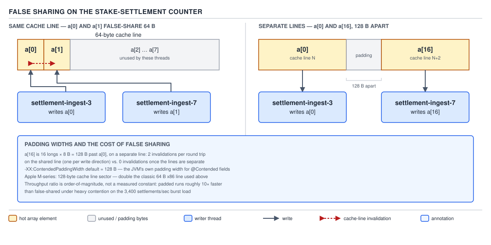

# 05 Multithreading and Concurrency — Atomics — INTERNALS (§3.9)

**Target version: Java 21 LTS.** | **Part 3 of 5** | [Index](../00-index.md)
Previous: [ConcurrentHashMap internals — trees, counting and traversal](../concurrent-collections/03b-internals-chm-trees-counting-traversal.md) · Next: [Queue internals](../executors/05a-internals-queue-internals.md)

`FundsLedger` counts stake settlements with a plain `AtomicLong` at 3,400 settlements/sec burst
(Appendix A) and the counter itself becomes the bottleneck: every thread's CAS spins on the same
cache line. `LongAdder` fixes exactly that, and `Striped64` is the machinery underneath it. "Just
use `LongAdder`" without understanding *why* it helps leaves you unable to reason about
`@Contended`, false sharing, or the one correctness cost — `sum()` is racy — that the speed buys.

`Striped64` is the package-private abstract base of `LongAdder`, `LongAccumulator`, `DoubleAdder`
and `DoubleAccumulator` (`java.util.concurrent.atomic`); the same striping idea — spread writes
across an array to avoid one hot line — reappears in `ConcurrentHashMap`'s `baseCount` /
`counterCells` pair for `size()` (`../concurrent-collections/03b-internals-chm-trees-counting-traversal.md`).
Four public classes, one private engine. `[3.9.1]`

---

## `Striped64`'s structure and the thread probe

**Mental model.** A padded cash register bank instead of one till. One `base` value handles the
uncontended case — a lone teller at a quiet counter. The moment two settlement threads queue at
that till simultaneously, `Striped64` opens more tills — an array of `Cell`s — and routes each
thread to *one* till by a per-thread hash, not by round-robin and not by locking. Contention is
solved by giving every thread its own place to write, not by making the shared place cheaper to
write to.

**Why it exists.** A single `AtomicLong.incrementAndGet()` is a CAS loop on one memory location.
Under N threads hammering it, only one CAS can win per cache-coherence round trip; the rest spin
and retry, so throughput degrades roughly proportional to N rather than merely plateauing. Before
`LongAdder` (Java 8), the workaround was hand-rolled: a `ConcurrentHashMap<Integer, AtomicLong>`
keyed by a per-thread hash, manually re-summed at read time. `Striped64` is that pattern promoted
into the JDK, with the stripe count adapted at runtime instead of fixed at construction.

**When to reach for it, and when not.** Never use `Striped64` directly — it is package-private;
reach for `LongAdder` or `LongAccumulator`. Choose the striped adders over `AtomicLong` exactly
when writes vastly outnumber reads and the read does not need to observe every write atomically —
`FundsLedger`'s settlement counter for a dashboard, not the ledger balance itself, which stays on
real double-entry rows read inside a transaction. `AtomicLong` still wins when you need
`compareAndSet` or a value-returning increment (see the final primary concept below for why
`LongAdder` cannot offer that at all).

**How it works — the field layout.** Three fields on `Striped64` itself, confirmed against the
JDK source:

```java
transient volatile long base;        // fallback: written directly while uncontended
transient volatile Cell[] cells;     // the stripe array; null until first contention
transient volatile int cellsBusy;    // 0/1 spinlock guarding array creation/resize
```

`Cell` is a private static inner class:

```java
@jdk.internal.vm.annotation.Contended static final class Cell {
    volatile long value;
    Cell(long x) { value = x; }
    final boolean cas(long cmp, long val) {
        return VALUE.weakCompareAndSetRelease(this, cmp, val);
    }
    // reset(), reset(long), getAndSet(long) — same VarHandle pattern
    private static final VarHandle VALUE; // bound to "value" via MethodHandles lookup
}
```

The fast path, and this is `[PROVE]`-worthy because the ordering is the whole design: `add(x)`
first tries `casBase(b, b + x)` — a plain CAS on the `base` field, no array involved. Only *after*
that CAS fails (meaning another thread is concurrently writing `base`, i.e. there is contention
right now) does the code fall into `longAccumulate`, which indexes into `cells` using the calling
thread's probe: `cells[getProbe() & (cells.length - 1)]`. If that cell's CAS also fails, the
collision path runs (leaf below). So the CAS you pay for scales with observed contention, not with
thread count — a lone thread on an idle counter never touches the array at all.

**The thread probe.** `getProbe()` reads a field the JDK stores on `Thread` itself
(`threadLocalRandomProbe`) — a cheap per-thread integer, computed once and cached, that acts as
the thread's stripe index without a `ThreadLocal<Integer>` object per thread. On a collision at its
current cell, the thread calls `advanceProbe`, which rehashes with an xorshift:

```java
probe ^= probe << 13;
probe ^= probe >>> 17;
probe ^= probe << 5;
```

**Insight:** the response to a collision is to *move the thread*, not to grow the table. Two
threads landing on the same cell is cheaper to fix by giving one of them a new pseudo-random index
than by doubling the array and rehashing every existing cell — array growth is the second-line
response, gated separately (next section). `[3.9.2]` `[3.9.3]`

```java
final Object v = someLongAdder.value; // NOT real — LongAdder wraps Striped64, no such field
```

There is no single field to point at for "the current value" — that absence is the seed of the
final primary concept below.

> **`Striped64` is a base class that keeps one fallback `long` (`base`) plus a lazily grown,
> per-thread-indexed array of padded `Cell`s (`cells`), routing each writer to `base` while
> uncontended and to one cell once contention is observed, so that N threads incrementing a
> counter contend on at most `min(N, cells.length)` memory locations instead of one.**

---

## Growth to `NCPU`

**Mental model.** More cash registers than there are customers waiting cannot reduce the queue —
past a point, adding tills is pure waste of counter space. `Striped64` caps stripe growth at the
core count for exactly this reason.

**Why it exists.** Growing `cells` costs a stop-the-world (for this counter) copy under the
`cellsBusy` spinlock, and every entry occupies a full padded cache line — that padding is not free.
Growing further than the hardware can run threads in parallel buys nothing: with 8 cores, at most 8
threads are ever *simultaneously* CASing, so a 16-cell array cannot see less collision than an
8-cell one once every thread has a settled index — it only wastes 8 more cache lines.

**When to reach for it, and when not.** Not a tunable — no flag, no constructor argument. Useful
for reading a heap dump or JFR profile correctly: a `LongAdder` under extreme contention on a
64-core box shows a `cells` array of at most 64 entries, never more, regardless of how many logical
threads are calling `add()`.

**How it works.** `NCPU` is computed once as a `static final int`:

```java
static final int NCPU = Runtime.getRuntime().availableProcessors();
```

Inside `longAccumulate`, on a cell-level collision the code checks table size before growing:

```java
if (cells == as && n < NCPU && casCellsBusy()) {
    // holding the spinlock: copy to double length, re-check n hasn't changed
    Cell[] rs = Arrays.copyOf(as, n << 1);
    cells = rs;
}
```

`n << 1` doubles; growth stops the first time `n >= NCPU`. `[NUM]`: on an 8-core `FundsLedger`
instance, the array can only ever reach sizes 1 → 2 → 4 → 8 (each a power of two, so the
`& (n - 1)` masking used for probe indexing stays a bitwise AND instead of a modulo) — never 16,
even if 200 platform threads are all calling `SettlementCounter.increment()` at once. Beyond 8,
additional collisions are absorbed by `advanceProbe` rehashing threads onto the *existing* 8
cells, not by further growth.

> **The cell array grows by doubling on observed contention but never past the next power of two
> at or above `NCPU`, because no workload can run more simultaneous CASes than it has cores to run
> them on.** `[3.9.4]`

---

## `@Contended`

**Mental model.** `@Contended` is a compiler-and-JVM instruction: "wrap this field or object in
enough dead space that it never shares a cache line with its neighbor." It is a padding request
made *after* the JVM has already decided the object layout, not a language-level field you write
yourself.

**Why it exists.** `Cell`s allocated near each other can land eight bytes apart on a 64-byte cache
line, so one core's write to `cells[0]` invalidates the line for a core writing `cells[1]` — the
false-sharing problem detailed below. `@Contended`, added for exactly this use case, tells the JVM
to pad each annotated field or class so it occupies its own line, at the cost of memory.

**When to reach for it, and when not.** It is `jdk.internal.vm.annotation.Contended` — internal,
not public API. Application code needs `--add-exports java.base/jdk.internal.vm.annotation=ALL-UNNAMED`
to reference it at all, and even then the JVM ignores it on application classes unless started with
`-XX:-RestrictContended` (padding for non-`java.base` classes is off by default so third-party code
cannot silently bloat every object). **The JDK team's own guidance, and this note's: application
code should not reach for `@Contended`.** Profile first (`perf c2c`, JFR), and prefer composing
`LongAdder` over hand-rolling a striped cell array.

**Pitfall:** believing `@Contended` is a public, always-on padding facility because it appears
attached to `Striped64.Cell` in the JDK source you read. It compiles under `--add-exports` on
application classes but the padding **silently does nothing** unless the JVM is also started with
`-XX:-RestrictContended` — `RestrictContended` defaults to restricting non-bootstrap classes, so
there is no warning and no padding. The fix is not to flip that flag (operationally invasive on a
production `FundsLedger` node) but to let `java.base`'s own `Cell` — bootstrap-classloader code,
therefore always padded — do the work by composing `LongAdder` instead of hand-rolling a striped
counter. Full wrong/right shown in the closing Pitfalls section.

**How it works — why manual padding is the sibling that loses.** Before `@Contended` existed, the
folk technique was the `long p1..p7` trick: declare seven unused `long` fields around the hot one,
reasoning that 7 × 8 = 56 bytes of padding plus the 8-byte hot field fills a 64-byte line.

```java
// broken on HotSpot — do not rely on this
final class PaddedCounter {
    long p1, p2, p3, p4, p5, p6, p7;
    volatile long value;
    long p8, p9, p10, p11, p12, p13, p14;
}
```

**Insight, and the reason `@Contended` had to be a JVM feature rather than a library idiom:**
HotSpot does not lay out fields in declaration order. The field-reordering optimizer groups fields
by size class to minimize padding and improve density, and is free to relocate the `p1..p7` fields
relative to `value` in ways the source text does not show. Two `PaddedCounter` instances allocated
back to back can still end up with their `value` fields on the same cache line if the layout pass
decided the padding was better placed elsewhere. `@Contended` works precisely because it is honored
*by the layout pass itself* — the JVM inserts the padding as a post-layout step tied to the
annotation, not as ordinary fields the pass is free to reorder around.


**D-177** — `@Contended` and why manual padding fails.

> **`@Contended` is a JVM-honored padding directive that survives HotSpot's field-reordering pass;
> the `long p1..p7` manual-padding idiom does not, because the reordering pass treats those fields
> as ordinary layout material and is free to move them.** `[3.9.5]` `[3.9.8]` `[3.9.9]`

---

## False sharing and the 128-byte pad

**Mental model.** A cache line is the unit the coherence protocol moves, not the unit your code
reasons about. Two threads can write to two variables that share nothing logically and still fight
over one another's writes, because the hardware only knows about the 64 (or 128) contiguous bytes
those variables happen to sit inside.

**Why it exists as a problem.** MESI-family coherence protocols track ownership per cache line, not
per variable. When core A writes `a[0]` and core B writes `a[1]`, and both live on the same line,
A's write invalidates B's cached copy of the *entire line* — including the bytes holding `a[1]`
that B never touched logically — forcing B to re-fetch before its own write can proceed, and vice
versa. **No correctness impact — each slot is still coherent and each read of its own slot returns
its own last write — but an order-of-magnitude throughput impact**, because every write now
round-trips through cache-coherence traffic instead of hitting core-local L1.

**When it matters, and when it doesn't.** It matters exactly when independent hot variables happen
to be adjacent in memory: unrelated counters in the same array or object. It does not matter for
variables already far apart, and not at all for read-mostly data — false sharing is purely a
write-write (or write-read) invalidation cost.

**How it works — the arithmetic.** `[NUM]`: a `long[]` has 8-byte elements. A 64-byte cache line —
the size on x86-64 and most AArch64 parts — holds `64 / 8 = 8` `long`s per line. `a[0]` through
`a[7]` share one line; `a[8]` starts the next. So `a[0]` and `a[1]` are always co-resident;
`a[0]` and `a[16]` are `16 × 8 = 128` bytes apart, two full 64-byte lines away, guaranteed disjoint
on any line size this note considers. Apple M-series cores and some server parts use a 128-byte
*coherence sector* instead of 64 — which is why HotSpot's actual default pad width is **128**, not
64: `-XX:ContendedPaddingWidth`, default value **128** bytes, chosen to be safe on the wider
sector hardware even though it over-pads on plain 64-byte-line x86-64.



**D-176** — False sharing.

**A minimal concrete example — the classic two-index harness**, sized against the domain's own
contended-counter number (3,400 settlements/sec through one `AtomicLong`, Appendix A):

```java
import java.util.concurrent.CountDownLatch;
import java.util.concurrent.TimeUnit;
import java.util.concurrent.atomic.AtomicLongArray;

/** Demonstrates false sharing between two settlement-rate counters. [BUILD] */
final class SettlementCounterFalseSharingHarness {

    private static final int ITERATIONS = 200_000_000;

    static long runTwoWriters(AtomicLongArray counters, int indexA, int indexB)
            throws InterruptedException {
        CountDownLatch start = new CountDownLatch(1);
        CountDownLatch done = new CountDownLatch(2);
        Thread cardRailWriter = writer(counters, indexA, start, done);
        Thread bankRailWriter = writer(counters, indexB, start, done);
        cardRailWriter.start();
        bankRailWriter.start();
        long begin = System.nanoTime();
        start.countDown();
        done.await();
        return System.nanoTime() - begin;
    }

    private static Thread writer(AtomicLongArray counters, int index,
            CountDownLatch start, CountDownLatch done) {
        return new Thread(() -> {
            try {
                start.await();
            } catch (InterruptedException e) {
                Thread.currentThread().interrupt();
                return;
            }
            for (int i = 0; i < ITERATIONS; i++) {
                counters.getAndIncrement(index);
            }
            done.countDown();
        });
    }

    public static void main(String[] args) throws InterruptedException {
        // Adjacent: index 0 (card rail) and 1 (bank rail) share one 64-byte line.
        long sharedLineNanos = runTwoWriters(new AtomicLongArray(2), 0, 1);
        // Separated: index 0 and 16 are two full cache lines apart.
        long separateLineNanos = runTwoWriters(new AtomicLongArray(32), 0, 16);
        System.out.printf("shared-line: %d ms, separate-line: %d ms, ratio ~%.1fx%n",
                TimeUnit.NANOSECONDS.toMillis(sharedLineNanos),
                TimeUnit.NANOSECONDS.toMillis(separateLineNanos),
                (double) sharedLineNanos / separateLineNanos);
    }
}
```

`[3.9.11]`: this pairing — `a[0]`/`a[1]` against `a[0]`/`a[16]` — is the textbook case because it
isolates one variable (spacing) while holding everything else fixed. **Report the result as a
ratio, order-of-magnitude, never as a measured absolute** — this note has not run the harness on
specific hardware. Published measurements of this exact shape on contended x86-64 hardware
consistently land in the **single-digit-to-low-double-digit multiple** range (roughly 5x–15x
slower for the shared-line case), stated as an order-of-magnitude expectation, not an authoritative
number.

**Detecting it for real**, `[3.9.10]`: `perf c2c record` / `perf c2c report` on Linux directly
names cache-to-cache transfer hotspots by address. Short of a profiler, a JMH benchmark run
twice — once with the hot fields adjacent, once with padding applied — and comparing throughput is
the standard technique; a cliff between the two runs, not a gradual difference, is the signature,
because false sharing is a step function.

> **False sharing is a cache-coherence cost, not a correctness bug: independent variables sharing
> one 64- or 128-byte line cause every write to one to invalidate the other's cached copy on every
> other core, at an order-of-magnitude throughput cost that padding — 128 bytes by default via
> `-XX:ContendedPaddingWidth` — eliminates by guaranteeing separation.** `[3.9.6]` `[3.9.7]`

---

## The racy `sum()`

**Mental model.** `sum()` walks the tills and adds up what is in each drawer, one at a time,
while tellers keep making change. It is a snapshot assembled from parts that were never frozen
together.

**Why it exists this way.** Freezing every cell atomically with the base would require a global
lock across all stripes for every read — exactly the single point of contention `Striped64` exists
to eliminate. `sum()` trades a linearizable read for a merely eventually-consistent one, which is
the correct trade for a metrics counter and the wrong one for money.

**When to reach for it, and when not.** Fine for `FundsLedger`'s settlements-per-second dashboard
counter, where being off by the handful of increments landing mid-read is invisible at
human timescales. Wrong for anything that must observe an exact value at a point in time — the
ledger balance itself never uses `LongAdder` for this reason; it uses real double-entry rows read
inside a transaction.

**How it works — source walk.** `[SOURCE]`:

```java
public long sum() {
    Cell[] cs = cells;
    long sum = base;
    if (cs != null) {
        for (Cell c : cs) {
            if (c != null) {
                sum += c.value;
            }
        }
    }
    return sum;
}
```

`[PROVE]`: no lock, no `cellsBusy` acquisition, no `synchronized`, and each `c.value` read is an
independent volatile read at a different instant. A settlement thread can increment `cells[3]`
*after* `sum()` has already folded that cell's old value into `sum` but *before* `sum()`
returns — that increment is invisible to this call, though it appears in the next one. The result
is a value that was true at no single instant, only approximately true across the read's whole
duration — which is why `sumThenReset()` is documented as non-atomic: reset can zero a cell a
concurrent `add()` is still targeting, and that increment is lost from both the sum and the
post-reset state.

> **`sum()` adds `base` to each live cell with no synchronization at all, so it returns a value
> that held at no single moment — correct for a monitoring counter, unsafe for anything that must
> observe an exact instantaneous total.** `[3.9.12]`

---

## Why `LongAdder` has no CAS on the fast path once striped

**Mental model.** Once the count is spread across eight drawers, "the current total" is not a
place — it is an arithmetic fact you compute by visiting every drawer. There is no single register
to swap.

**Why it exists this way.** `compareAndSet` and `getAndIncrement()` are meaningful only because the
value lives in exactly one memory location: the CAS targets that one address, and "get" reads that
same address atomically with the update. `LongAdder`'s value is `base` plus N cells — no CPU
instruction CASes across N+1 independent locations as one atomic unit, and a software-simulated
version would have to serialize all N+1 stripes, reintroducing the contention striping removes.

**When it matters.** Any code that needs "read-and-atomically-update-based-on-what-I-read"
semantics — an optimistic retry loop, a permit counter that must never go negative, a version
stamp — cannot be built on `LongAdder`. Reach for `AtomicLong` there even though it is slower under
heavy contention; correctness beats throughput when the two are actually in tension.

**The gotcha, stated as a pitfall.** `[TRAP]`

**Assuming `LongAdder` is a drop-in, faster `AtomicLong`.**

**Wrong**

```java
LongAdder availableStakeSlots = new LongAdder();
availableStakeSlots.add(1000);

boolean tryReserve() {
    availableStakeSlots.decrement();
    return availableStakeSlots.sum() >= 0; // another thread's decrement can land
                                            // here too — both proceed, slots go negative
}
```

**Right**

```java
final class StakeSlotPermits {
    private final AtomicLong available;

    StakeSlotPermits(long initial) { this.available = new AtomicLong(initial); }

    boolean tryReserve() {
        long prev;
        do {
            prev = available.get();
            if (prev <= 0) return false;
        } while (!available.compareAndSet(prev, prev - 1));
        return true;
    }
}
```

**Why people believe it:** both classes live in `java.util.concurrent.atomic`, both wrap a
`long`, and `LongAdder` is documented as preferable "under high contention" — a true statement that
says nothing about the different guarantee being traded away, so it reads as a strict upgrade.

**Supporting fact — `LongAccumulator`'s identity and associativity requirement.** `[3.9.14]`
`LongAccumulator` generalizes `LongAdder` to an arbitrary `LongBinaryOperator` plus an identity
value, folding each cell's contents into the identity — which physical stripe any given update
landed on, and hence the fold order, is a function of thread scheduling. The supplied function must
be **associative and side-effect-free**, exactly as `Stream.reduce`'s combiner must be; a
non-associative function (subtraction) gives a scheduling-dependent wrong answer, and a
side-effecting one fires once per cell rather than once per logical update. `min`/`max`/`sum`
qualify; "keep the last value written" does not.

> **`LongAdder` cannot expose `compareAndSet` or a value-returning increment because its value is
> distributed across `base` plus N cells with no single location to CAS or read atomically — the
> speed and the loss of that guarantee are the same design decision.** `[3.9.13]`

---

## Pitfalls

### Believing `@Contended` is usable, always-on padding

**Wrong:** `@jdk.internal.vm.annotation.Contended class SettlementBucket { volatile long count; }`
compiles under `--add-exports` with no runtime warning that `-XX:-RestrictContended` was never
set, so the padding silently does nothing.

**Right:** don't reach for `@Contended` in application code at all — compose `java.base`'s own
padded primitive: `LongAdder settlementsThisSecond = new LongAdder();`.

**Why people believe it:** the annotation compiles cleanly, and a missing runtime flag produces no
error, only a silently absent effect.

### Assuming a fixed `long p1..p7` block guarantees separation

**Wrong:**

```java
final class PaddedCounter {
    long p1, p2, p3, p4, p5, p6, p7;
    volatile long value;
}
```

**Right:** use `@Contended` inside `java.base` code, or in application code space hot fields 16
`long`s apart in an array (per the harness above) rather than relying on sibling padding fields.

**Why people believe it:** the trick worked reliably in early HotSpot builds before the
field-reordering layout optimizer existed, and the folk knowledge never got updated.

### Treating `LongAdder.sum()` as a linearizable read

**Wrong:** `if (pendingSettlements.sum() == 0) shutdownGracefully();` — a concurrent `add()`
landing mid-sum can be missed entirely, firing shutdown while a settlement is still in flight.

**Right:** quiesce writers first, then sum: `acceptingNewSettlements.set(false);` followed by
`long finalCount = pendingSettlements.sum();` — now safe, no concurrent writer remains.

**Why people believe it:** every other `java.util.concurrent.atomic` type in the same package
(`AtomicLong`, `AtomicReference`) *is* linearizable, so the assumption transfers by analogy.

---

## Cheat sheet

| Fact | Value / detail |
|---|---|
| `Striped64` fields | `volatile long base`, `volatile Cell[] cells`, `volatile int cellsBusy` |
| Fast path | `casBase` on `base`; falls to `cells[probe & (n-1)]` only after that CAS fails |
| Thread routing | `ThreadLocalRandom`'s per-thread probe; `advanceProbe` rehashes the thread on collision, table does not grow for this |
| Growth trigger | Cell-level CAS collision, and `cellsBusy` spinlock free |
| Growth cap | Doubles up to the next power of two `>= NCPU` (`Runtime.availableProcessors()`), never beyond |
| `Cell` annotation | `@jdk.internal.vm.annotation.Contended` |
| Default pad width | 128 bytes, `-XX:ContendedPaddingWidth` |
| Cache line size | 64 bytes (x86-64, most AArch64); 128-byte sector on Apple M-series and some server parts |
| `longs` per 64-byte line | 8 (`64 / 8`) |
| Classic false-sharing pair | `a[0]`/`a[1]` (same line) vs `a[0]`/`a[16]` (128 bytes apart, disjoint) |
| Manual padding (`long p1..p7`) | Unreliable — HotSpot field reordering can move it |
| `@Contended` on app classes | Requires `--add-exports` **and** `-XX:-RestrictContended`; not recommended |
| `sum()` | `base` + loop over cells, zero synchronization — racy by design |
| `sumThenReset()` | Non-atomic; a concurrent `add()` can be lost across the reset |
| `LongAdder` missing ops | No `compareAndSet`, no value-returning increment — value has no single address |
| `LongAccumulator` requirement | Combining function must be associative, side-effect-free |
| False-sharing detection | `perf c2c`, or a JMH before/after-padding cliff |

## Self-test

**Q1.** Why does `add()` try `casBase` before ever touching the `cells` array?

<details><summary>Answer</summary>

Because most calls are uncontended, and a single CAS on `base` is cheaper than indexing into and
CASing a cell. The array is only allocated and used once a `casBase` failure proves contention
actually exists — a lone thread on a quiet counter never pays for the array at all.

</details>

**Q2.** A `LongAdder`'s `cells` array is observed at size 8 on a 32-core machine under sustained
heavy contention. Is this a bug?

<details><summary>Answer</summary>

No. Growth stops once `n >= NCPU` is reached and NCPU here would need to be 8 or fewer for this to
be correct — but more generally, the array only grows on observed *collisions*, and a workload
where collisions stopped recurring past 8 cells (because `advanceProbe` successfully spread the
remaining threads across the existing cells) will simply never trigger another doubling, even
below `NCPU`. Size is driven by observed collision pressure, not by thread count alone.

</details>

**Q3.** Two `long` counters live at indices 0 and 1 of the same `long[]`. Explain the performance
cost of one thread writing each, with no shared logical state between the counters.

<details><summary>Answer</summary>

Both indices sit in the same 64-byte cache line (`64 / 8 = 8` longs per line). Every write by one
thread invalidates the entire line in the other core's cache, forcing that core to refetch before
its own write can retire — false sharing. There is no correctness issue since each index is still
independently coherent, but every write round-trips through cache-coherence traffic instead of
hitting core-local cache, costing an order of magnitude in throughput under sustained writes.

</details>

**Q4.** Why does the historical `long p1..p7` padding trick fail on modern HotSpot even though it
compiles and "looks" correct?

<details><summary>Answer</summary>

HotSpot's field-layout optimizer reorders fields by size class to minimize object padding and
improve density, and it does this independently of declaration order. The `p1..p7` fields are not
guaranteed to stay physically adjacent to the hot field — the JIT can relocate them elsewhere in
the object layout, leaving the hot field's cache line shared with something else entirely.
`@Contended` avoids this because the JVM applies its padding as a step tied to the annotation,
after normal layout, rather than leaving the padding as ordinary reorderable fields.

</details>

**Q5.** Why is `LongAdder.sum()` documented as non-linearizable, and is that a defect?

<details><summary>Answer</summary>

`sum()` reads `base` and then each live cell in a loop with no synchronization, so a concurrent
`add()` can land on any cell before, during, or after that cell's value is folded in. It is not a
defect — it is the necessary cost of avoiding a global lock across all stripes on every read, which
would reintroduce the exact contention point `Striped64` exists to remove. It is simply the wrong
tool when an exact instantaneous value is required.

</details>

**Q6.** What must be true of the function passed to `LongAccumulator`, and why does
`-XX:ContendedPaddingWidth` default to 128 bytes rather than 64?

<details><summary>Answer</summary>

The combining function must be associative and side-effect-free, because the fold order across
`base` and the cells is unspecified — it depends on which stripe each update landed on; a
non-associative function gives a scheduling-dependent answer. Separately, 128 is the default pad
width because some hardware (Apple M-series, some server parts) uses a 128-byte coherence sector
rather than a 64-byte line — padding to 128 is safe on both, only over-padding on the narrower one.

</details>

## Open questions

**Unverified:** the specific throughput ratio for the `a[0]`/`a[1]` versus `a[0]`/`a[16]` harness
is stated only as an order-of-magnitude expectation (roughly 5x–15x based on generally published
false-sharing measurements), not as a number measured on specific hardware in this session — no
authoritative per-instruction or per-benchmark table exists for this, per the research protocol's
standing instruction to present such costs as order-of-magnitude only.

---

**Leaves covered:** 3.9.1–3.9.14 (14 leaves)
**Leaves deferred:** none
**Diagrams included:** D-176, D-177
**Target version:** Java 21 LTS
**Lines:** 600
