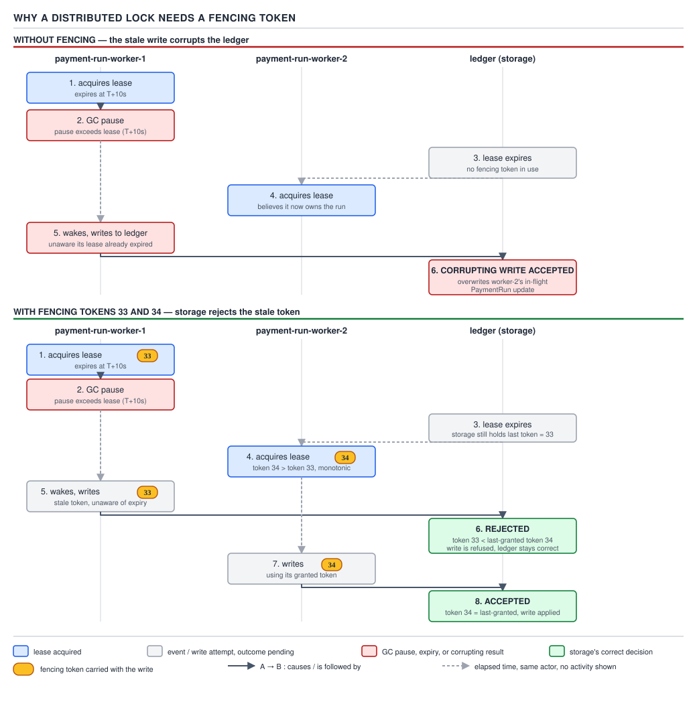

# 05 Multithreading and Concurrency — Concurrency beyond one JVM — INTERMEDIATE (§2.14)

**Target version: Java 21 LTS.** | **Part 2 of 5** | [Index](../00-index.md)
Previous: [The concurrency-adjacent utility surface](../utility-surface/01-the-adjacent-apis.md) · Next: [Version delta, Java 5 to 25](../version-delta/01-java-5-to-25.md)

Everything in the rest of this topic assumes one address space: one heap, one set of cache
lines, one hardware guarantee of atomicity underwriting `synchronized`, `volatile`, and every AQS
primitive. Scale `FundsLedger`, `BankWithdrawal`, or `BonusService` past one instance and that
assumption is gone. Shared memory is replaced by a database, a broker, or a coordination service —
and every in-JVM primitive gets a distributed analogue that is *shaped* like it but strictly
weaker. The rest of this file is that mapping, and the one failure mode — a lock outliving the
process that holds it — that no distributed analogue escapes without an explicit fix.

## Every primitive's distributed analogue

**Mental model.** An in-JVM lock is enforced by hardware: the CPU's compare-and-swap instruction
either succeeds or it does not, and nothing about a GC pause or a slow disk can make two threads
simultaneously believe they hold the same monitor. A distributed lock is enforced by a *timeout*:
a client asks a lock service for a lease that is valid for, say, 10 seconds, and everyone agrees —
by convention, not by hardware — to treat that lease as void once 10 seconds pass whether or not
the holder is still doing useful work. That single substitution, hardware guarantee for
timing-based convention, is the reason every row in the table below loses something.

**Why it exists.** Once `FundsLedger` runs as three partitioned instances (see the platform
mapping's discussion of partition affinity), "only one thread touches this counter" stops being
enforceable by a monitor. Before dedicated coordination services existed, the honest answer was
"don't allow concurrent writers to shared state across processes" — enforced by convention, by a
single writer process, or not at all, which is exactly the discipline `ClientRestrictions` still
leans on today for policy decisions.

**When to reach for the distributed version, and when not.** Reach for it only when the state
genuinely must be coordinated across processes — a `PaymentRun` must not be picked up by two
`BankWithdrawal` instances at once. Do not reach for it to protect state that a single owning
service already serialises through its own database transaction; that is paying for a second,
weaker lock on top of a lock you already have for free.

**How it works**, primitive by primitive:

| In-JVM primitive | In-JVM guarantee | Distributed replacement | What guarantee is lost |
|---|---|---|---|
| `synchronized` | Mutual exclusion enforced by the JVM's object monitor; cannot be held past release | A distributed lock (Redis single-instance lock, ZooKeeper ephemeral znode, etcd lease) | Ownership is a **lease with a timeout**, not a hardware-enforced boundary — see the fencing-token section below |
| `ReentrantLock` | Same exclusion, plus explicit `tryLock`, fairness, interruptibility | Same lock services, using their `tryAcquire`-style APIs | Fairness and interruptibility become best-effort; a partitioned client cannot be "interrupted", only timed out |
| `AtomicLong` | A single CAS instruction; no two threads ever read the same pre-increment value | A database `SEQUENCE`, or Redis `INCR` | Round-trip latency replaces an instruction; the increment is now a network call that can fail independently of the logical operation it was counting |
| CAS (general) | Hardware compare-and-swap on a memory word | An optimistic-locking version column (`@Version`, see below) | The "compare" and the "swap" are no longer atomic with each other at the CPU level — they are atomic only because the database's row lock makes them so, for the duration of one transaction |
| `CountDownLatch` | All waiters released the instant the count hits zero, using the JVM's own wait/notify queue | A ZooKeeper or etcd barrier: a well-known path that participants watch, deleted or updated when the last participant checks in | Wakeup is a **watch notification**, not an instantaneous wait/notify — participants can observe the barrier open at slightly different times |
| `volatile` | A happens-before edge: a write becomes visible to any thread that subsequently reads the same field | A consistent (not stale-replica) read from the database or coordination service | "Consistent" now depends on the store's own consistency model — a follower read of `PaymentRun` status can be stale in a way a `volatile` read of a heap field never is |
| Single-writer confinement | One thread owns a field; no one else touches it, so no synchronization is needed at all | Leader election (ZooKeeper, etcd, a database advisory lock) | The "owner" is only owner until its lease lapses; a slow GC pause on the leader and a fast failover elsewhere can produce two leaders briefly |
| `ScheduledExecutorService` | Exactly one JVM runs the scheduled task, because there is exactly one JVM | ShedLock, a database lock with a lease, or leader-election-gated scheduling | With N replicas of the same service each running their own scheduler, "exactly one execution" becomes something you must explicitly re-engineer — see the duplicated scheduled job below |

**D-141** — Every primitive's distributed analogue.

| Primitive | Distributed replacement | Guarantee lost |
|---|---|---|
| `synchronized` | Redis / ZooKeeper / etcd lock | Lease with timeout, not hardware exclusion |
| `ReentrantLock` | Same lock services via `tryAcquire`-style APIs | Fairness/interrupt become best-effort |
| `AtomicLong` | DB `SEQUENCE` or Redis `INCR` | Instruction becomes a fallible network call |
| CAS | `@Version` optimistic-locking column | Atomicity holds only for one DB transaction |
| `CountDownLatch` | ZooKeeper/etcd barrier | Wakeup via watch, not instantaneous wait/notify |
| `volatile` | Consistent (non-stale) read | Depends on the store's own consistency model |
| Single-writer confinement | Leader election | Owner only until lease lapses; brief dual leadership possible |
| `ScheduledExecutorService` | ShedLock / DB lease lock / leader-gated scheduling | "Exactly one execution" must be re-engineered |

**A minimal concrete example.** The `AtomicLong` row, made concrete: a naive in-process counter of
stake reservations per second cannot survive three `FundsLedger` instances.

```java
// In one JVM: correct, and free.
final AtomicLong reservationsThisSecond = new AtomicLong();
long count = reservationsThisSecond.incrementAndGet();

// Across three FundsLedger instances: each has its own AtomicLong, so the counter
// undercounts by roughly two-thirds. The distributed replacement is a shared sequence:
long count = jdbcTemplate.queryForObject(
    "SELECT nextval('reservation_seq')", Long.class);
// or, against Redis:
long count = redisTemplate.opsForValue().increment("reservations:" + currentSecond());
```

The JVM version is one instruction. The distributed version is a round trip that can time out,
retry, or land on a replica that has not caught up — the same operation, a strictly weaker
guarantee.

**The gotcha.** It is tempting to read this table as "everything has an equivalent, so distributed
code looks like concurrent code with higher latency." It does not: latency is the *visible* cost.
The invisible cost is that every one of these replacements trades a guarantee enforced by hardware
for one enforced by a timeout, a network round trip, or a single database's serialization
guarantee — and each of those can fail in ways CAS on a CPU register cannot.

> A distributed primitive has the same name and the same job as its in-JVM counterpart, but its
> safety now depends on time and network assumptions that a monitor never had to make.

## Why a distributed lock needs a fencing token

**Mental model.** A distributed lock is a claim ticket with an expiry printed on it, handed out by
a lock service that has no way to know whether the client holding it is still alive, merely
whether the clock has passed the expiry. Nothing about holding the ticket physically prevents the
holder from acting after it expires — the ticket is advisory. The storage system that the lock is
meant to protect is the only party that can actually refuse a stale actor, and only if it is given
something to check.

**Why it exists.** `BankWithdrawal` runs a lease-based lock so that only one instance processes a
given `PaymentRun` at a time — two instances submitting the same batch of withdrawals to the
banking partner would double-pay every client in it. The lease exists because there is no
JVM-style monitor spanning processes; without a lease, nothing stops two instances from both
believing they own the run.

**When to reach for a fencing token, and when not.** Reach for one whenever the lock protects a
side effect on a resource that can independently validate a token — a database row, a file with a
version, an idempotent API. Do not bother if the "lock" only ever guards an in-memory decision that
never reaches shared storage; there, ordinary lease expiry with no further action is enough,
because nothing durable can be corrupted.

**How it works — the failure, worked through.** Suppose `BankWithdrawal` instance C1 acquires a
10-second lease on `PaymentRun` #4471, and starts building the payout file.

1. `t = 0s` — C1 acquires the lease. Lease expires at `t = 10s`.
2. `t = 3s` — a full GC pauses C1's JVM (a large heap, a bad allocation spike, doesn't matter which).
3. `t = 10s` — the lease expires at the lock service. C1 is still paused; it has no way to know.
4. `t = 11s` — C2 acquires the lease on #4471, because as far as the lock service is concerned it
   is free. C2 begins building and submitting the same payout file.
5. `t = 14s` — C1's GC pause ends. C1 resumes exactly where it left off, believing it still holds
   the lease — nothing told it otherwise — and submits its payout file too.

Both C1 and C2 now submit `PaymentRun` #4471 to the banking partner. Every client in that batch is
paid twice. **The lock service did its job correctly** — it granted, expired, and re-granted the
lease exactly per its own contract. The corruption happened entirely on the *storage* side, after
the lock had already changed hands, and the lock service has no visibility into that at all.

**Insight:** the fix cannot live in the lock service, because the lock service is not the thing
being corrupted. A monotonically increasing **fencing token**, issued with every lease grant and
checked by the storage layer on every write, closes the gap: C1 acquired token 33; C2, acquiring
after expiry, gets token 34; when C1 wakes and submits its payout file tagged with token 33, the
banking partner's submission endpoint (or, more realistically, `BankWithdrawal`'s own "already
submitted" guard on the `PaymentRun` aggregate) rejects it because it has already accepted a
write at token 34, which is higher.



**D-142** — Why a distributed lock needs a fencing token. Top lane: C1 acquires the lease, GC-pauses
past expiry, C2 acquires and proceeds, then C1 wakes and submits — the corrupting double payout.
Bottom lane: the same timeline with fencing tokens 33 and 34 attached to every write; the storage
layer rejects C1's stale token-33 submission after it has already accepted C2's token-34 one.

**A minimal concrete example.** The token check belongs on the write path, not the lock:

```java
record PaymentRunLease(RoundId runId, long fencingToken, Instant expiresAt) {}

// BankWithdrawal, submitting a payment run file, checked against the storage-side guard.
public void submitPaymentRun(PaymentRunLease lease, PaymentRunFile file) {
    int updated = jdbcTemplate.update("""
        UPDATE payment_run
           SET status = 'SUBMITTED', submitted_token = ?
         WHERE id = ?
           AND (submitted_token IS NULL OR submitted_token < ?)
        """, lease.fencingToken(), lease.runId().value(), lease.fencingToken());

    if (updated == 0) {
        // A higher token already won this row — this submitter is the stale one.
        throw new IllegalStateException(
            "PaymentRun " + lease.runId() + " already submitted with a newer fencing token");
    }
    bankingPartner.submit(file);
}
```

The `WHERE submitted_token < ?` clause is the entire fix: it is the storage layer, not the lock
service, doing the rejecting, and it works even if the stale client never learns its lease expired.

**Pitfall:** believing that a shorter lease, or a faster lock service, makes the race less likely
and therefore acceptable to skip fencing on. **Wrong belief:** "GC pauses longer than our lease are
rare enough to ignore." **Symptom:** a payment run double-submitted once a quarter, indistinguishable
from a banking-partner-side duplicate until someone reconstructs the timeline from logs. **Fix:**
the fencing token, because it makes the race harmless rather than merely rare — the probability of
the pause is irrelevant once the storage layer rejects stale writes unconditionally.

**Interview:** "Why isn't a Redis lock with `SET NX PX` enough for a lease?" — because the lock only
controls *acquisition*, not the actions taken while held; only a token checked by the protected
resource itself can stop a client that acted after its lease silently expired.

**The Redlock debate, stated honestly.** Redis's own multi-instance Redlock algorithm was proposed
to make single-instance Redis locks safer against a node failing over. Martin Kleppmann's public
critique (2016) made two claims that both still stand as the mainstream position: first, Redlock's
safety depends on bounded network delay, bounded process pauses, and bounded clock error —
assumptions a real JVM under GC pressure, or a real network under a partition, does not actually
satisfy; second, and more fundamentally, Redlock as originally specified has **no fencing-token
mechanism at all**, so even a "correctly" acquired Redlock does nothing to stop the exact GC-pause
scenario walked through above. Salvatore Sanfilippo (Redlock's author) published a rebuttal
defending Redlock's design under its stated assumptions; Kleppmann's reply stood by the conclusion
that a lock service alone — Redlock or otherwise — cannot substitute for a fencing token checked
at the storage layer. The practical takeaway for `BankWithdrawal` is independent of which side of
that debate is right: fence at the resource regardless of which lock service grants the lease.

> A distributed lock is not a mutex: it is a lease enforced by a timeout, and only a fencing token
> checked by the protected resource — never the lock service alone — closes the gap a GC pause or
> a network partition opens.

## `@Version` as the CAS of the persistence layer

**Mental model.** JPA optimistic locking via `@Version` is compare-and-swap performed on a database
row instead of a CPU word: read the current version alongside the data, compute the new state,
then write it back only if the version has not changed since the read. The database's `UPDATE …
WHERE version = ?` plays the exact role the CPU's CAS instruction plays for `AtomicLong` — it is
the single atomic step that makes "read, compute, write" safe without holding a lock across the
whole sequence.

**Why it exists.** Pessimistic locking (`SELECT … FOR UPDATE`) is the `synchronized` of the
persistence layer: it holds a row lock for the duration of the transaction, blocking every other
writer, which is correct but throttles throughput exactly the way a coarse monitor does in-process.
Optimistic locking exists for the same reason `CAS`-based structures beat coarse locks under low
contention: most concurrent updates to a given `Bonus` or `Restriction` row do not actually
collide, so paying for exclusion up front is waste.

**When to reach for it, and when not.** Reach for `@Version` where writers to the same row are
frequent but collisions are rare — updating a `Bonus`'s `ACTIVE`/`CONSUMED` state as a client
stakes, for instance. Reach for pessimistic locking instead where collisions are the *common* case
and retrying would just mean everyone re-does the same work repeatedly — the kind of hot-row
contention `FundsLedger`'s single-writer-per-position design (§11.1) is built to avoid in the first
place.

**How it works.** The correspondence to CAS, made explicit:

| CAS step | `@Version` equivalent |
|---|---|
| Read current value | `SELECT amount, version FROM bonus WHERE id = ?` |
| Compute new value | Application code computes the new `amount` |
| Compare-and-swap | `UPDATE bonus SET amount = ?, version = version + 1 WHERE id = ? AND version = ?` |
| CAS failed → retry | Zero rows updated → JPA throws `OptimisticLockException` → caller retries from the read |

```java
@Entity
class Bonus {
    @Id UUID id;
    BigDecimal availableAmount;
    @Version long version;
    // ...
}

@Retryable(retryFor = OptimisticLockException.class, maxAttempts = 3)
public void consumeBonusPortion(UUID bonusId, BigDecimal amount) {
    Bonus bonus = bonusRepository.findById(bonusId).orElseThrow();
    bonus.setAvailableAmount(bonus.getAvailableAmount().subtract(amount));
    bonusRepository.save(bonus); // UPDATE ... WHERE version = ? — fails if someone else won the race
}
```

**The gotcha.** `@Retryable` is not optional decoration — a bare `save()` with no retry turns a
correct optimistic-locking scheme into a scheme that silently drops updates under contention: the
exception propagates, the caller sees a failure, and unless something retries, the bonus
consumption that should have happened simply did not.

> `@Version` is compare-and-swap performed by the database: read-with-version, compute, and
> write-if-version-unchanged, retrying on failure exactly as a CAS loop does.

## Supporting facts

**Idempotency keys**, the distributed answer to "exactly once". A network call can be retried after
a timeout without knowing whether the original attempt succeeded, so the caller attaches a
client-generated `IdempotencyKey` and the receiver stores "already processed this key" alongside
its effect, in the same transaction. Gotcha: the key must be scoped to the *intended effect*, not
the request — retrying a `ReserveStake` call with the same key must return the original
reservation's result, not silently no-op and leave the caller thinking it failed. Self-contained
here; the durable-storage and dedup-window mechanics behind exactly-once delivery belong to the
messaging topic. `Definition:` an idempotency key turns "at least once" into "effectively once" by
making the *receiver*, not the network, responsible for deduplication.

**Leader election**, the distributed answer to "single writer". Exactly as `FundsLedger` confines a
position's writes to one code path in one process, a leader-elected coordinator confines a
cluster-wide action — running the nightly reconciliation job, say — to whichever replica currently
holds the leadership lease. Gotcha: leadership is a lease like any other lock, so "exactly one
leader" is only true between lease renewals; a slow leader and a fast failover can produce two
leaders for the length of one lease period, which is why leader-gated writes still need the same
fencing discipline as any other leased lock. Self-contained here; the election protocols
themselves (ZooKeeper's ZAB, etcd's Raft) belong to the distributed-consensus topic. `Definition:`
leader election designates one process, for a lease period, as the sole executor of an action that
must not run concurrently.

**Ordering across a partition boundary.** Kafka's per-key ordering guarantee — all records for a
given key land on the same partition and are read in the order they were written, but there is no
ordering guarantee *across* keys or partitions — is the same "confine state to one owner" idea
applied to a message log instead of a lock. A `PaymentRun`'s events, keyed by `runId`, arrive at
consumers in the order they were produced; two different `PaymentRun`s' events carry no relative
ordering guarantee at all, and code that assumes one is making the same mistake as code that
assumes two unrelated `AtomicLong` increments on different fields happen in program order. Ordering
mechanics and consumer group rebalancing belong to the messaging topic. `Definition:` per-key
partition assignment is single-writer confinement applied to a log, buying ordering only within a
key, never across keys.

## The duplicated scheduled job

**Mental model.** A `@Scheduled` method in a single JVM runs on exactly one `Timer` thread inside
exactly one process, so "runs once, on schedule" is free — there is only one process to run it.
Deploy that same service as four replicas behind a load balancer, as `BankWithdrawal` is, and every
one of the four now has its own scheduler, its own timer, and no idea the other three exist. The
nightly job that closes out expired `PaymentRun`s in `REVIEW_QUEUED` fires four times, once per
replica, at approximately the same instant.

**Why it exists (as a problem).** Horizontal scaling for availability and throughput is the whole
point of running N replicas — but it is a side effect nobody asked for on the scheduling axis. The
naive fix, "just run the scheduled job on one designated instance", reintroduces a single point of
failure exactly where the horizontal scaling was meant to remove one, so it needs a real answer
rather than a workaround.

**When each fix applies, and when not.** Three real fixes, not equivalent:

| Fix | Mechanism | Best when | Weakness |
|---|---|---|---|
| Leader election | Only the current elected leader runs scheduled work | The service already needs a leader for other reasons | Adds a coordination dependency (ZooKeeper/etcd) purely to gate a cron job |
| Database lock with a lease | Job execution acquires a `SELECT … FOR UPDATE`-backed or advisory lock row with an expiry before running | The service already has a relational database, and jobs are infrequent | Same fencing problem as any leased lock — a paused holder and a stolen lease can, in principle, overlap without a fencing check on the job's own side effects |
| ShedLock | A library-level annotation (`@SchedulerLock`) that wraps the scheduled method, acquiring a lock row in an existing datastore for the duration of the call | Retrofitting existing `@Scheduled` methods with minimal code change | Only as safe as its own lock's lease duration versus the job's actual runtime — a job that overruns its configured `lockAtMostFor` window loses its exclusion guarantee before it finishes |

**How it works**, ShedLock specifically, since it is the fix most Spring Boot services reach for
first:

```java
@Scheduled(cron = "0 0 2 * * *")
@SchedulerLock(name = "closeExpiredReviewQueuedRuns", lockAtMostFor = "PT10M", lockAtLeastFor = "PT30S")
public void closeExpiredReviewQueuedRuns() {
    paymentRunRepository.findExpiredInReviewQueued()
        .forEach(paymentRunService::closeAsAbandoned);
}
```

`lockAtMostFor` is the fencing-relevant number here: it must exceed the job's worst realistic
runtime, or ShedLock releases the lock — believing the holder dead — while the original holder is
still legitimately running, opening exactly the double-execution window the lock exists to close.
`lockAtLeastFor` guards the opposite case: a fast, unreliable clock across replicas could otherwise
let a second replica start the same job moments after the first one finishes on a technicality.

**Unverified:** ShedLock's exact current default behavior and supported lock-provider list should
be checked against its current documentation before being asserted as a specific version number in
a production recommendation; the mechanism described above (lock row with `lockAtMostFor` /
`lockAtLeastFor`) is stable across the library's history and is what this section relies on.

**The gotcha.** All three fixes only prevent *concurrent* execution; none of them, by themselves,
prevents the job from running an *extra* time after a crash mid-job, which is a recovery and
idempotency concern layered on top, not solved by the lock.

> ShedLock, a database lease lock, and leader election all solve "N replicas, one scheduled job"
> by re-deriving single-writer confinement across processes — none of them is free of the same
> lease-expiry race a distributed lock always carries.

## Pitfalls

### Assuming a distributed lock is a stronger, slower version of `synchronized`

**Wrong**

```java
// Treated as a drop-in replacement for a JVM monitor:
RLock lock = redisson.getLock("payment-run:" + runId);
lock.lock();
try {
    processAndSubmit(runId); // no fencing token anywhere in this method
} finally {
    lock.unlock();
}
```

This "works" in every test run because tests do not GC-pause for eleven seconds. In production, a
long pause past the lease's expiry lets a second instance acquire the lock and start processing the
same `PaymentRun` while the first instance is still inside `processAndSubmit`.

**Right**

```java
RLock lock = redisson.getLock("payment-run:" + runId);
long fencingToken = lock.lockInterruptibly(leaseTimeMs, TimeUnit.MILLISECONDS); // or via a separate token service
try {
    processAndSubmit(runId, fencingToken); // storage-layer write rejects a stale token, see above
} finally {
    lock.unlock();
}
```

**Why people believe it:** the API — `lock()`, `unlock()`, a `try`/`finally` — is deliberately
shaped to look exactly like `ReentrantLock`, and the naming invites the reader to transfer every
guarantee they already trust from the in-JVM type across the boundary where it stops holding.

## Cheat sheet

| Concept | One-line takeaway |
|---|---|
| `synchronized` → distributed lock | Hardware exclusion becomes a leased, timeout-based convention |
| `AtomicLong` → DB sequence / `INCR` | One CPU instruction becomes one fallible network round trip |
| CAS → `@Version` | Read-version, compute, write-if-unchanged, retry — same shape, DB-enforced |
| `CountDownLatch` → ZK/etcd barrier | Wakeup via watch notification, not instantaneous wait/notify |
| `volatile` → consistent read | Visibility now depends on the store's own consistency model |
| Single-writer confinement → leader election | Owner only until its lease lapses |
| `ScheduledExecutorService` → ShedLock/DB lease/leader gate | "Exactly once" across N replicas must be re-engineered |
| Fencing token | Monotonic number, checked by the *storage*, not the lock service |
| Redlock debate | No fencing token in the original spec is the load-bearing critique, independent of the multi-node-quorum argument |
| ShedLock `lockAtMostFor` | Must exceed worst-case job runtime, or the lock self-releases early |

## Self-test

**Q1.** Why does a fencing token have to be checked by the storage layer rather than the lock
service itself?

<details><summary>Answer</summary>

Because the corruption in the GC-pause scenario happens *after* the lock has already changed
hands — the stale client's write lands on the storage system, not on the lock service. The lock
service has no visibility into writes made against the resource it is merely gating access to; only
the resource itself can compare the token on an incoming write against the highest token it has
already accepted and reject anything lower.

</details>

**Q2.** What specifically did Kleppmann's critique of Redlock claim, and what did it not claim?

<details><summary>Answer</summary>

It claimed two things: Redlock's safety depends on bounded network delay, bounded process pauses,
and bounded clock error, none of which real distributed systems guarantee; and, more
fundamentally, Redlock as specified provides no fencing-token mechanism, so even a correctly
acquired Redlock does not stop a paused-then-resumed client from corrupting shared state. It did
not claim Redis itself is unsafe for all locking use cases, nor did it settle the debate — Redlock's
author published a rebuttal, and the fencing-token gap is the point that survived it.

</details>

**Q3.** Why is `@Retryable` not optional on an `@Version`-guarded update?

<details><summary>Answer</summary>

Because `OptimisticLockException` on a version mismatch means the write did not happen, exactly
like a failed CAS loop iteration. Without a retry, the caller's intended state change — say,
consuming a portion of a `Bonus` — silently never lands, and the caller has no other signal that it
was dropped unless it explicitly checks for and handles the exception.

</details>

**Q4.** Why does `ScheduledExecutorService`'s "runs exactly once" guarantee disappear the moment a
service is scaled to N replicas, and why doesn't reducing to one replica count as a fix?

<details><summary>Answer</summary>

The guarantee was never really a property of the scheduler; it was a free consequence of there
being exactly one JVM. Once there are N independent JVMs each running their own scheduler, nothing
coordinates them, so the job fires N times. Reducing to one replica "fixes" the duplication but
reintroduces the single point of failure and the throughput ceiling that running N replicas existed
to remove — it trades one problem for the other rather than solving the actual one.

</details>

**Q5.** In the `@Version`-to-CAS correspondence, what row-level SQL clause plays the role of the
CPU's compare-and-swap instruction, and what happens on the equivalent of a failed CAS?

<details><summary>Answer</summary>

`UPDATE ... SET ..., version = version + 1 WHERE id = ? AND version = ?` is the atomic
compare-and-swap step — the database guarantees no other transaction can update the same row
between the comparison and the write. On a failed CAS, zero rows are affected, JPA surfaces this as
`OptimisticLockException`, and the correct response is to retry the whole read-compute-write
sequence from the read, exactly as a CAS loop retries from re-reading the value.

</details>

**Q6.** Why is `lockAtMostFor` the single most important number in a ShedLock configuration?

<details><summary>Answer</summary>

Because it is the point at which ShedLock will release the lock even if the original job holder is
still legitimately running — treating it as dead purely on elapsed time. Set it below the job's
worst-case runtime and a slow run can overlap with a second replica's execution of the same job,
which is exactly the double-execution ShedLock exists to prevent.

</details>

**Q7.** Why does per-key ordering in Kafka not help a consumer that needs to reason about the
relative order of two different `PaymentRun`s' events?

<details><summary>Answer</summary>

Per-key ordering guarantees only apply within a single partition, and records are partitioned by
key. Two different `PaymentRun`s are, in general, different keys, and different keys can land on
different partitions with no ordering relationship between them at all — the same way two unrelated
fields in a JVM program carry no relative ordering guarantee without an explicit happens-before
edge between them.

</details>

## Open questions

- ShedLock's precise current default configuration and its full list of supported lock providers
  are stated at the mechanism level above (a lock row with `lockAtMostFor` / `lockAtLeastFor`) but
  not verified against current library documentation for this file; treat any specific version
  number as unconfirmed.

---

**Leaves covered:** 2.14.1–2.14.8 (8 leaves)
**Leaves deferred:** none
**Diagrams included:** D-141, D-142
**Target version:** Java 21 LTS
**Lines:** 497
