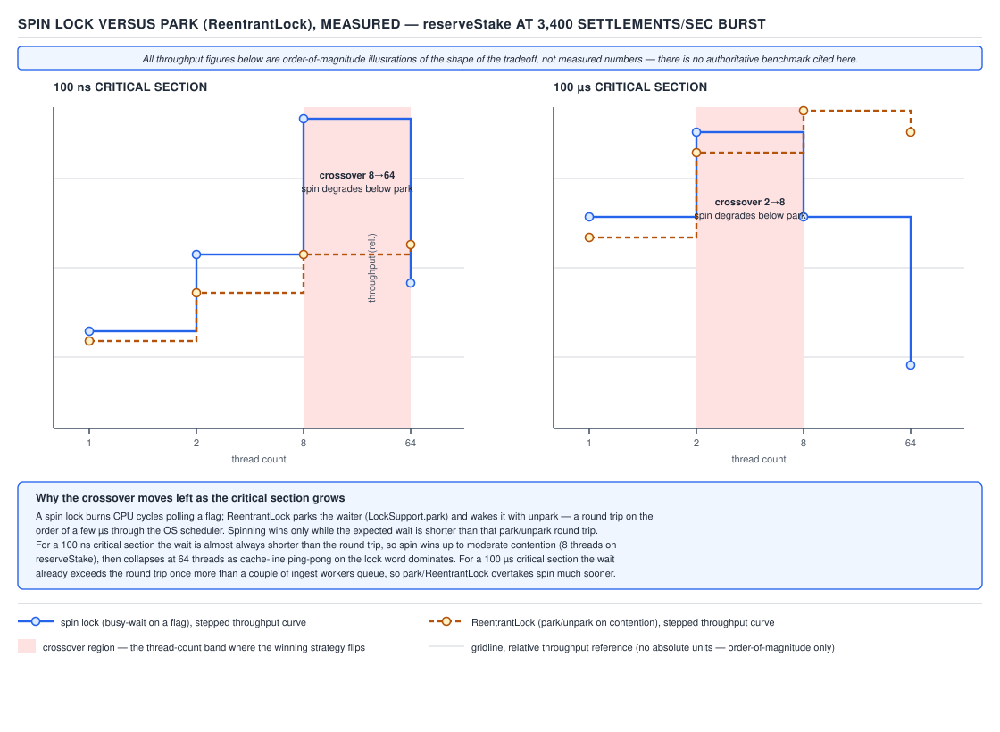
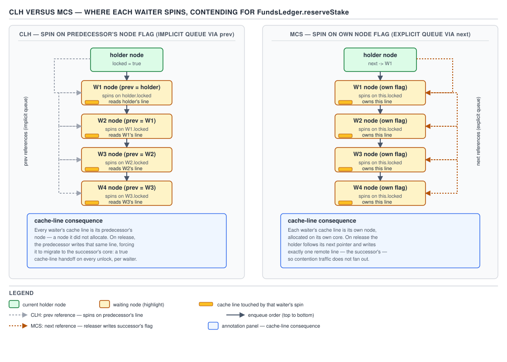

# 05 Multithreading and Concurrency — Locks from first principles — BUILD IT (§4.1, leaves 4.1.1–4.1.10)

**Target version: Java 21 LTS.** | **Part 4 of 5** | [Index](../00-index.md)
Previous: [Part 3 interview wrap-up](../92-interview-internals.md) · Next: [Building on AQS](02-building-on-aqs.md)

Every lock in this file guards the same critical section: `FundsLedger.reserveStake`, the
method that moves money from a client's available balance into a `Reservation` whose
`StakeSplit(bonusPortion, cashPortion)` must sum exactly to the stake, with the bonus bucket
never going negative. That invariant is the reason the section needs a lock at all — two
`settlement-ingest-N` threads racing to split the same stake across bonus and cash can produce
a `StakeSplit` that doesn't sum, or a bonus bucket that goes below zero. Peak load on this path
is 1,200 stake reservations/sec; settlements land separately at up to 3,400/sec (burst) and are
not this file's concern, but they explain why the ledger is contended from two directions at
once.

Six locks get built, cheapest first, in increasing sophistication: a bare CAS spin lock, a
coherence-aware variant of it, a fair ticket lock, two queue-based locks (CLH and MCS), and a
backoff variant. The point of building all six is not "use these instead of `ReentrantLock`" —
in production you reach for `ReentrantLock` or `synchronized` almost every time (leaf 4.1.10
says exactly why) — the point is that `ReentrantLock`'s internals, and AQS's internals more
generally, *are* one of these ideas (CLH) with blocking bolted on, and you cannot reason about
AQS without having built its ancestor first.

## Hierarchy before details

**D-199 — Five spin locks, compared**

| Lock | Where each waiter spins | Coherence traffic per acquisition | FIFO fair | Space per waiter | NUMA suitability | AQS derives from this? |
|---|---|---|---|---|---|---|
| TAS spin lock (4.1.1) | The single shared boolean's cache line | O(N) invalidations per release, N = waiters | No | O(1), no per-thread state | Poor — every waiter hammers one line | No |
| Test-and-test-and-set (4.1.3) | Same shared line, but read-only until it looks free | Lower than TAS: waiters only issue a bus/CAS operation when the line already looks unlocked | No | O(1) | Poor, but less traffic than TAS | No |
| Ticket lock (4.1.4) | The shared `nowServing` counter | O(N) invalidations per release — same as TAS, because every waiter still polls one line | Yes | O(1) | Poor | No |
| CLH (4.1.5) | The **predecessor's** node, via an implicit queue (`prev` links) | O(1) per release — only the true successor's line is touched | Yes (queue order = arrival order) | O(1) per thread if the node is reused via `ThreadLocal`; conceptually a queue, no dynamic array | Good on cache-coherent SMP; still needs a coherent `prev` read | **Yes** — AQS's javadoc names CLH explicitly (see 4.1.7) |
| MCS (4.1.6) | **Its own** node's flag, set by the predecessor on release | O(1) per release, and the write lands on a line the successor already owns, not a shared one | Yes | O(1) per thread, explicit node with a `next` pointer | Best — no shared line at all, only point-to-point node hand-off | No, but architecturally closer to AQS's node-per-waiter shape |
| Backoff (4.1.8) | Same as TAS (it wraps a TAS lock) | Lower than plain TAS under contention — waiters retry less often | No | O(1) | Poor, but throughput improves under contention | No |

Read the table as a spectrum: TAS and the ticket lock are simple and unfair-to-the-bus; CLH and
MCS trade a small amount of bookkeeping for making each waiter spin on a *different* line, which
is the single change that makes lock-free scaling possible on real SMP hardware. Backoff is an
orthogonal fix to TAS's specific pathology (retry storms), not a queue-based design at all.

## SpinLock — a CAS loop and nothing else

### Mental model

A spin lock is a padlock with a webcam pointed at it. Every thread that wants in just keeps
checking the webcam feed as fast as it can. There's no queue, no doorman, no fairness — whoever
notices the padlock is open first, and successfully clicks the CAS to close it, gets in.

### Why it exists

Before intrinsic locks and `synchronized`, the only primitive available on real hardware was an
atomic read-modify-write instruction (CAS, or the older test-and-set). A spin lock is what you
get from applying that primitive with zero extra machinery: loop until you can flip a boolean
from false to true.

### When to reach for it, and when not

Reach for a spin lock only when the expected wait is shorter than the cost of a context switch —
sub-microsecond critical sections on a machine with spare cores. `ReservationExpiryIndex` inside
`FundsLedger` (an in-memory structure touched on every reservation) is exactly the kind of thing
people are tempted to guard this way, because the critical section is often just a map update.
Never reach for it when the critical section can block (I/O, a downstream call, anything that
can page fault or wait on another lock) — a spinning waiter burns a core the lock holder might
need to make progress, and on an oversubscribed system (more runnable threads than cores) that
turns into priority inversion: the holder gets preempted, and every spinner keeps burning CPU
achieving nothing until the scheduler gets back to the holder.

### How it works

`compareAndSet(false, true)` is the acquire; a plain `set(false)` is the release, because release
doesn't need to be atomic with respect to anything — only one thread (the holder) ever performs
it. `Thread.onSpinWait()` is a JEP 285 (Java 9) hint to the CPU that this is a busy-wait loop; on
x86 it compiles to a `PAUSE` instruction, which reduces the pipeline's speculative-execution
pressure and, on hyperthreaded cores, yields execution resources to the sibling logical core.

**Insight:** `onSpinWait()` changes nothing about correctness — it is pure microarchitectural
politeness. Removing it from the loop below still compiles and still works; it just wastes more
power and starves siblings harder.

```java
import java.util.concurrent.atomic.AtomicBoolean;

public final class SpinLock {
    private final AtomicBoolean locked = new AtomicBoolean(false);

    public void lock() {
        while (!locked.compareAndSet(false, true)) {
            Thread.onSpinWait();
        }
    }

    public void unlock() {
        locked.set(false);
    }
}
```

```java
// FundsLedger.reserveStake, guarded by SpinLock — the running example for this whole file.
public record StakeSplit(Money bonusPortion, Money cashPortion) {
    public StakeSplit {
        if (bonusPortion.amount().signum() < 0) {
            throw new IllegalArgumentException("bonus portion cannot go negative: " + bonusPortion);
        }
    }
}

public final class FundsLedger {
    private final SpinLock ledgerLock = new SpinLock();
    private Money bonusBalance;
    private Money cashBalance;

    public StakeSplit reserveStake(Money stake) {
        ledgerLock.lock();
        try {
            Money bonusPortion = bonusBalance.min(stake);
            Money cashPortion = stake.minus(bonusPortion);
            bonusBalance = bonusBalance.minus(bonusPortion);
            cashBalance = cashBalance.minus(cashPortion);
            return new StakeSplit(bonusPortion, cashPortion);
        } finally {
            ledgerLock.unlock();
        }
    }
}
```

**Pitfall:** wrapping the body in `try`/`finally` looks like AutoCloseable habit transferred from
`ReentrantLock`, but a raw `SpinLock` has no interrupt or timeout path to worry about — the
`finally` still matters, though, because an exception thrown by `bonusBalance.minus(...)` (e.g. an
arithmetic overflow) must not leave the lock held forever.

> **Definition.** A spin lock is a mutual-exclusion primitive that makes a blocked thread poll an
> atomic flag in a tight loop instead of yielding the CPU, trading throughput-under-contention for
> latency-under-low-contention.

## Measuring spin versus block (4.1.2)

This is not a report of measured numbers. It is a runnable JMH harness plus a statement of the
*expected shape*, explicitly labelled as such.

```java
import java.util.concurrent.TimeUnit;
import java.util.concurrent.locks.ReentrantLock;
import org.openjdk.jmh.annotations.*;
import org.openjdk.jmh.infra.Blackhole;

@State(Scope.Benchmark)
@BenchmarkMode(Mode.Throughput)
@OutputTimeUnit(TimeUnit.MICROSECONDS)
@Warmup(iterations = 5, time = 1)
@Measurement(iterations = 5, time = 1)
@Fork(1)
public class ReserveStakeLockBenchmark {

    private final SpinLock spinLock = new SpinLock();
    private final ReentrantLock reentrantLock = new ReentrantLock();
    private long bonusCents = 1_000_000L;

    // A stand-in for reserveStake's body: cheap arithmetic only, no I/O.
    private void criticalSection(long busyNanos, Blackhole blackhole) {
        long deadline = System.nanoTime() + busyNanos;
        long acc = bonusCents;
        while (System.nanoTime() < deadline) {
            acc = (acc * 31 + 7) % 1_000_000_007L;
        }
        bonusCents = acc;
        blackhole.consume(acc);
    }

    @Benchmark
    @Threads(1)
    public void spinLock100ns(Blackhole bh) { runSpin(100L, bh); }

    @Benchmark
    @Threads(2)
    public void spinLock100ns_2t(Blackhole bh) { runSpin(100L, bh); }

    @Benchmark
    @Threads(8)
    public void spinLock100ns_8t(Blackhole bh) { runSpin(100L, bh); }

    @Benchmark
    @Threads(64)
    public void spinLock100ns_64t(Blackhole bh) { runSpin(100L, bh); }

    @Benchmark
    @Threads(1)
    public void spinLock100us(Blackhole bh) { runSpin(100_000L, bh); }

    @Benchmark
    @Threads(8)
    public void spinLock100us_8t(Blackhole bh) { runSpin(100_000L, bh); }

    @Benchmark
    @Threads(64)
    public void spinLock100us_64t(Blackhole bh) { runSpin(100_000L, bh); }

    @Benchmark
    @Threads(1)
    public void reentrant100ns(Blackhole bh) { runReentrant(100L, bh); }

    @Benchmark
    @Threads(8)
    public void reentrant100ns_8t(Blackhole bh) { runReentrant(100L, bh); }

    @Benchmark
    @Threads(64)
    public void reentrant100ns_64t(Blackhole bh) { runReentrant(100L, bh); }

    @Benchmark
    @Threads(1)
    public void reentrant100us(Blackhole bh) { runReentrant(100_000L, bh); }

    @Benchmark
    @Threads(8)
    public void reentrant100us_8t(Blackhole bh) { runReentrant(100_000L, bh); }

    @Benchmark
    @Threads(64)
    public void reentrant100us_64t(Blackhole bh) { runReentrant(100_000L, bh); }

    private void runSpin(long nanos, Blackhole bh) {
        spinLock.lock();
        try {
            criticalSection(nanos, bh);
        } finally {
            spinLock.unlock();
        }
    }

    private void runReentrant(long nanos, Blackhole bh) {
        reentrantLock.lock();
        try {
            criticalSection(nanos, bh);
        } finally {
            reentrantLock.unlock();
        }
    }
}
```

**expected shape, not measured — run the harness above on your own hardware**

| Threads | 100 ns section | 100 µs section |
|---|---|---|
| 1 | Spin ≈ ReentrantLock. No contention, `lock()` returns on the first CAS either way; ReentrantLock's biased/uncontended fast path (a single CAS in `sync.tryAcquire`) costs about the same as the spin loop's single CAS. | Same — no contention means the lock flavor barely matters versus the 100 µs of real work. |
| 2 | Spin likely wins narrowly. A 100 ns section means the loser waits ~100 ns; that is far cheaper than a park/unpark round trip, so spinning burns less wall time than blocking would. | Roughly even, trending toward ReentrantLock. 100 µs of contention is long enough that a blocked waiter's park/unpark cost is amortized against a much larger hold time. |
| 8 | Spin starts to lose. With 8 threads on a section this short, several spinners are active per release; they collectively burn CPU that could be running other `settlement-ingest-N` work, and cache-line ping-pong on the shared boolean adds real latency to every attempt. | ReentrantLock wins. Enough contention exists that blocked threads are better off surrendering the core; the JVM's adaptive spinning inside `ReentrantLock`'s park path (a short spin before parking) captures whatever benefit remains from short waits. |
| 64 | Spin loses badly, likely catastrophically once waiter count exceeds core count: spinners hold cores the lock holder needs to be *scheduled* on, so total throughput can fall below what a single thread alone would achieve. | ReentrantLock wins clearly. Most waiters are parked, consuming no CPU, and the OS scheduler decides who runs next instead of every core burning cycles polling. |

The crossover argument, stated once and directly: **spinning wins exactly while the expected wait
is shorter than a park/unpark round trip, and loses once waiters start outnumbering cores**,
because a spinning waiter occupies a core the lock holder may need to finish and release. Treat
the following as **order of magnitude only, explicitly not measured**: an uncontended CAS or
volatile read/write is on the order of a few nanoseconds; a full park/unpark round trip through
the OS scheduler is on the order of 1–10 microseconds; an involuntary context switch (the OS
preempting a thread) is in the same low-microsecond range, sometimes higher under load. These
numbers explain the crossover shape above without being a substitute for running the harness.



**Interview:** "When would you ever write a spin lock instead of using `ReentrantLock`?" — when
the critical section's expected duration is provably shorter than a park/unpark round trip *and*
you have spare cores to burn, which in practice means deep inside a lock-free data structure's
own implementation, not application code.

## TestAndTestAndSetLock — read before you write

### Mental model

Instead of hammering the padlock's webcam with a "try to click it shut" request every single
frame, first just *look* at the feed. Only when it looks open do you actually attempt the click.

### Why it exists

A bare CAS loop issues a cache-coherence-protocol write-intent (or at least a contended
read-modify-write bus transaction) on *every* iteration, even while the lock is obviously still
held. On a cache-coherent multiprocessor, a CAS that fails still typically requires the
requesting core to acquire the cache line in exclusive/modified state (MESI "M"), which
invalidates every other core's copy of that line — including the lock holder's own copy, which it
needs to read/write on release. Every failed CAS from every spinner therefore adds coherence
traffic that competes with the actual lock holder's memory traffic.

### When to reach for it, and when not

Same regime as `SpinLock` — short sections, spare cores — but strictly preferred over a bare TAS
loop whenever more than one or two threads might contend, because the fix costs nothing. There is
no case where plain TAS beats TTAS on real cache-coherent hardware; TTAS is a strict improvement,
not a trade-off.

### How it works

The loop first does a plain (non-atomic, cache-friendly) read of the flag. A plain volatile read
only needs the cache line in Shared state, which every spinning core can hold simultaneously
without invalidating each other. Only when that read reports "unlocked" does the thread attempt
the actual CAS. Under contention, most iterations are cheap shared reads that hit each core's own
cached copy of the line; the (still O(N)) CAS storm only happens in the brief window right after a
release, when every spinner's shared read simultaneously reports "free" and they all race the CAS.

**Insight:** TTAS does not eliminate the invalidation storm on release — it still happens, and it
is still O(N) — it only removes the storm during the *steady-state wait*, while the lock is held
and no release is imminent. That is the entire coherence-traffic win, and it is why the D-199
column says "lower than TAS," not "none."

```java
import java.util.concurrent.atomic.AtomicBoolean;

public final class TestAndTestAndSetLock {
    private final AtomicBoolean locked = new AtomicBoolean(false);

    public void lock() {
        while (true) {
            while (locked.get()) {
                Thread.onSpinWait();
            }
            if (locked.compareAndSet(false, true)) {
                return;
            }
        }
    }

    public void unlock() {
        locked.set(false);
    }
}
```

> **Definition.** Test-and-test-and-set is a spin lock that separates the cheap, cache-friendly
> "does this look free" check from the expensive, coherence-traffic-generating CAS, issuing the
> CAS only when the check suggests it might succeed.

## TicketLock — fair, but one shared line

### Mental model

A deli counter. Every arriving thread takes a numbered ticket (`nextTicket`, incremented
atomically) and then just watches the "now serving" display (`nowServing`) until its number comes
up.

### Why it exists

Both TAS and TTAS are unfair: under contention, whichever spinner happens to win the CAS race
after a release gets in next, which can starve a thread indefinitely (the "convoy" or "lock
lottery" problem) and produces wildly variable tail latency. The ticket lock fixes fairness with
two counters instead of one flag.

### When to reach for it, and when not

Reach for it when strict FIFO ordering matters more than raw throughput — for example, if
`settlement-ingest-N` threads must process reservations in arrival order to preserve an audit
trail's chronology. Do not reach for it purely for performance: it still has every waiter spinning
on the same `nowServing` line, so it inherits TAS's O(N)-invalidations-per-release cost — CLH and
MCS below strictly dominate it on scalability while also being fair.

### How it works

`lock()` atomically fetches-and-increments `nextTicket` to get "my number," then spins reading
`nowServing` (a plain volatile read, so it's cache-friendly like TTAS's read phase) until it
equals that number. `unlock()` increments `nowServing`, which is the only write — and it
invalidates every waiter's cached copy of that one line, because every waiter reads the same
address. That single shared line is exactly why the lock still shows up as "poor" on NUMA in
D-199, despite being fair.

```java
import java.util.concurrent.atomic.AtomicInteger;

public final class TicketLock {
    private final AtomicInteger nextTicket = new AtomicInteger(0);
    private final AtomicInteger nowServing = new AtomicInteger(0);

    public void lock() {
        int myTicket = nextTicket.getAndIncrement();
        while (nowServing.get() != myTicket) {
            Thread.onSpinWait();
        }
    }

    public void unlock() {
        nowServing.incrementAndGet();
    }
}
```

**Pitfall:** assuming `nextTicket.getAndIncrement()` can never overflow. Under `int` wraparound
(after ~2^31 acquisitions — entirely plausible on a `FundsLedger` instance processing 1,200
reservations/sec continuously for years) tickets wrap to negative values and the equality check
`nowServing.get() != myTicket` still works correctly, because both counters wrap together and
equality is wraparound-safe; the bug would only appear if you replaced `!=` with `<` for some
other kind of ordering check.

> **Definition.** A ticket lock enforces strict FIFO acquisition order using two monotonically
> increasing counters, at the cost of every waiter still polling one shared cache line.

## CLHLock — spin on your predecessor

### Mental model

Instead of everyone watching one shared "now serving" sign, each new arrival hands a private pager
to the person ahead of them and watches *that specific pager*, not a public display.

### Why it exists

TAS, TTAS, and the ticket lock all share one property that caps their scalability: every waiter
polls the *same memory location*, so every release invalidates every waiter's cache line at once,
even though only one waiter's wait is actually ending. CLH (Craig, Landin, and Hagersten) fixes
this by giving each waiter a private flag to watch — specifically, the flag on the node placed
immediately *before* it in an implicit queue.

### When to reach for it, and when not

In application code: essentially never directly — this is exactly the mechanism `ReentrantLock`
already gives you via AQS, with blocking added on top, so hand-rolling it only makes sense as a
learning exercise or when building your own synchronizer beneath AQS is somehow off the table.
Understand it because it *is* the ancestor of every `java.util.concurrent.locks` primitive (leaf
4.1.7).

### How it works

Each thread owns one reusable node (kept in a `ThreadLocal`) with a single boolean field,
`locked`. A shared `AtomicReference<Node>` tail always points at the most recently enqueued node.
To acquire: a thread sets its own node's `locked` to `true`, atomically swaps itself in as the new
tail (`getAndSet`), and remembers whichever node came out as the *previous* tail — its
predecessor. It then spins reading **the predecessor's** `locked` field, not its own, until that
flips to `false`. To release: a thread sets its own node's `locked` to `false`, which is exactly
the flag its successor is watching — and then, in this bounded implementation, recycles a fresh
node for its next acquisition. The queue is implicit: there is no explicit `next` pointer, only
each thread's private memory of "who I'm following," recovered structurally by the swap order of
the tail reference.



```java
import java.util.concurrent.atomic.AtomicReference;

public final class CLHLock {

    private static final class Node {
        volatile boolean locked = true;
    }

    private final AtomicReference<Node> tail = new AtomicReference<>(new Node() {{ locked = false; }});
    private final ThreadLocal<Node> myNode = ThreadLocal.withInitial(Node::new);
    private final ThreadLocal<Node> predecessorNode = new ThreadLocal<>();

    public void lock() {
        Node node = myNode.get();
        node.locked = true;
        Node predecessor = tail.getAndSet(node);
        predecessorNode.set(predecessor);
        while (predecessor.locked) {
            Thread.onSpinWait();
        }
    }

    public void unlock() {
        Node node = myNode.get();
        node.locked = false;
        // Reuse the predecessor's now-free node as this thread's node for its next acquisition,
        // so the ThreadLocal never grows an unbounded chain of garbage nodes.
        myNode.set(predecessorNode.get());
    }
}
```

**Pitfall:** forgetting the node-recycling step at the end of `unlock()`. Without it, every
acquisition allocates a brand-new `Node`, the `ThreadLocal` never shrinks, and — worse — the
*next* `lock()` call spins on the wrong node entirely, because `myNode.get()` would still return
the node this thread just released (with `locked` already `false`), making `lock()` return
instantly without actually queuing behind the real current tail.

> **Definition.** CLH is a queue-based spin lock where each waiter polls a private flag on the
> node immediately preceding it in an implicit, tail-pointer-defined queue, so a release only
> invalidates the one cache line the true successor is watching.

## MCSLock — spin on your own node

### Mental model

Same deli counter idea as CLH, but now every waiter is handed their *own* pager, and the person
ahead of them pages it directly when it's their turn — no watching someone else's device at all.

### Why it exists

CLH still requires a waiter to dereference and spin-read a *different* thread's node — on a
cache-coherent SMP that's cheap (that node's line just needs to be Shared), but on hardware
without uniform cache-coherent access to remote memory (NUMA, or historically cacheless
multiprocessors that CLH and MCS were literally designed for in 1991), reading a remote node
repeatedly can be far more expensive than reading local memory. MCS (Mellor-Crummey and Scott)
restructures the queue so every waiter only ever spins on memory it "owns."

### When to reach for it, and when not

Prefer MCS over CLH specifically on NUMA topologies where cross-node memory access is
measurably more expensive than local access — for everything else, they're close enough that CLH's
slightly simpler code (no explicit `next` maintenance) usually wins. Neither is what you reach for
in application code (see CLH's answer, same reasoning).

### How it works

Now the queue is explicit: each node carries both a `locked` flag and a `next` reference. To
acquire, a thread builds its own node, atomically swaps itself onto the shared tail, and — if
there *was* a predecessor — sets the predecessor's `next` to point at itself, then spins on its
**own** node's `locked` flag (initialized `true`). To release, a thread checks whether it already
has a successor (`next != null`); if not, it must atomically CAS the tail back to null to prove no
one snuck in, and if that CAS fails, a successor is arriving and the thread spins briefly until
`next` becomes visible, then sets that successor's `locked` to `false` directly. That direct write
into the successor's own node — not a shared line — is the entire structural difference from CLH.

```java
import java.util.concurrent.atomic.AtomicReference;

public final class MCSLock {

    private static final class Node {
        volatile boolean locked = true;
        volatile Node next = null;
    }

    private final AtomicReference<Node> tail = new AtomicReference<>(null);
    private final ThreadLocal<Node> myNode = ThreadLocal.withInitial(Node::new);

    public void lock() {
        Node node = myNode.get();
        node.locked = true;
        node.next = null;
        Node predecessor = tail.getAndSet(node);
        if (predecessor != null) {
            predecessor.next = node;
            while (node.locked) {
                Thread.onSpinWait();
            }
        }
    }

    public void unlock() {
        Node node = myNode.get();
        if (node.next == null) {
            if (tail.compareAndSet(node, null)) {
                return;
            }
            while (node.next == null) {
                Thread.onSpinWait();
            }
        }
        node.next.locked = false;
    }
}
```

**Pitfall:** releasing by only checking `node.next == null` without the tail CAS. If a new waiter
has already run `tail.getAndSet(node)` but has not yet executed `predecessor.next = node`, the
releasing thread sees `next == null`, wrongly concludes it's the last in line, and returns without
ever unblocking the new waiter — which then spins forever on a `locked` flag nobody will ever
clear. The tail-CAS-then-wait-for-`next` sequence above closes exactly that race.

> **Definition.** MCS is a queue-based spin lock where each waiter spins on its own node's flag,
> written directly by its predecessor on release, eliminating shared-line contention entirely in
> favor of point-to-point node hand-off.

## CLH versus MCS, and why AQS chose CLH's shape (4.1.7)

| Axis | CLH | MCS |
|---|---|---|
| Space per waiter | One node, implicit queue via tail swaps only — no explicit `next` field needed | One node with an explicit `next` field — marginally more state |
| Where it spins | Predecessor's node (a thread dereferences memory it doesn't own) | Its own node (thread-local memory only) |
| Release cost | O(1): flip your own flag; successor discovers it by polling | O(1) but slightly more code: must locate or wait for the successor pointer, or CAS the tail to null |
| Cacheless / NUMA suitability | Weaker — the spin read touches a remote node, expensive without uniform coherent caching | Stronger — this was MCS's whole motivation; a waiter never dereferences another thread's cache line while spinning |
| Cancellation support | **Yes** — an interrupted CLH waiter can splice itself out by leaving its own node's flag semantics intact and letting `prev` chains be walked or repaired, because the queue's ordering is defined by `prev`, not by an explicit forward pointer that must be kept consistent | Awkward — removing a node from the middle of an explicit doubly-ish linked structure while another thread might be mid-write to `next` is considerably harder to make safe |
| Which one AQS derives from | **CLH.** `java.util.concurrent.locks.AbstractQueuedSynchronizer`'s class javadoc (OpenJDK `jdk-21-ga` tag, `java.base/java/util/concurrent/locks/AbstractQueuedSynchronizer.java`, `raw.githubusercontent.com`) states: *"The wait queue is a variant of a 'CLH' (Craig, Landin, and Hagersten) lock queue. CLH locks are normally used for spinlocks. We instead use them for blocking synchronizers by including explicit ('prev' and 'next') links plus a 'status' field that allow nodes to signal successors when releasing locks, and handle cancellation due to interrupts and timeouts."* | — |

**Insight:** AQS's node design is not pure CLH — it explicitly adds a `next` link *on top of*
CLH's `prev` chain (so, structurally, an AQS node looks like a CLH node grafted onto an MCS node)
plus a `status` field, precisely because blocking synchronizers need to (a) find and directly
unpark a specific successor rather than have it discover a flag flip by polling, and (b) splice
cancelled waiters out of the middle of the queue without corrupting it. CLH's `prev`-based
structure is what makes that splicing safe, which is why AQS's javadoc credits CLH by name rather
than MCS, even though the final node shape borrows from both.

**Interview:** "Is `ReentrantLock` built on a spin lock?" — no; its underlying `AQS` queue *is
structurally a CLH-derived queue*, but nodes park via `LockSupport.park()` instead of spinning
once they fail to acquire (with a short optimistic spin only immediately before parking on some
JDK versions), which is exactly the spin-versus-block trade-off measured in leaf 4.1.2.

`[VERSION-TRAP]` The AQS internals here are drawn from the `jdk-21-ga` source tag. JDK 19
(JEP 425/incubator work on virtual threads) began adjusting how blocking synchronizers interact
with virtual-thread carriers; verify against the specific JDK build if you're running Loom-era
virtual threads through a `ReentrantLock` on 21+, since `LockSupport.park()` on a virtual thread
unmounts it from its carrier rather than blocking a platform thread outright.

## BackoffLock — don't retry immediately, retry later

### Mental model

A busy phone line. Redialing the instant a call drops just re-joins the same jam; waiting a random
short interval before redialing (and a longer one if that also fails) spreads retries out so
they stop colliding.

### Why it exists

Plain TAS's failure mode under contention isn't just coherence traffic — it's a *thundering herd*:
the instant the lock is released, every spinner's next CAS attempt fires near-simultaneously, so
only one succeeds and the rest immediately retry and collide again. Exponential randomized backoff
breaks that synchronization.

### When to reach for it, and when not

Reach for it as a cheap retrofit onto an existing TAS-style lock when you observe throughput
collapsing under moderate contention (say, several `settlement-ingest-N` threads racing on
`reserveStake` during a burst) and cannot restructure to CLH/MCS. Don't reach for it as a
substitute for CLH/MCS when you *can* restructure — backoff trades some acquisition latency
(the sleep) for throughput, whereas CLH/MCS get both fairness-adjacent behavior and no wasted
retries at once.

### How it works

Each failed CAS attempt increases a per-thread backoff window (typically by doubling it, capped at
some maximum), and the thread parks itself for a random duration inside that window before
retrying. The randomization is what prevents every backed-off thread from waking up and retrying
in lockstep again.

```java
import java.util.concurrent.ThreadLocalRandom;
import java.util.concurrent.atomic.AtomicBoolean;

public final class BackoffLock {
    private final AtomicBoolean locked = new AtomicBoolean(false);
    private final long minDelayNanos;
    private final long maxDelayNanos;

    public BackoffLock(long minDelayNanos, long maxDelayNanos) {
        this.minDelayNanos = minDelayNanos;
        this.maxDelayNanos = maxDelayNanos;
    }

    public void lock() {
        long delay = minDelayNanos;
        while (!locked.compareAndSet(false, true)) {
            long sleepNanos = ThreadLocalRandom.current().nextLong(delay);
            parkNanos(sleepNanos);
            delay = Math.min(delay * 2, maxDelayNanos);
        }
    }

    public void unlock() {
        locked.set(false);
    }

    private static void parkNanos(long nanos) {
        long deadline = System.nanoTime() + nanos;
        while (System.nanoTime() < deadline) {
            Thread.onSpinWait();
        }
    }
}
```

**Pitfall:** using `LockSupport.parkNanos` for the backoff sleep and assuming it always sleeps the
full duration. `parkNanos` can return early (spurious wakeups are explicitly permitted by its
contract), so a naive implementation that treats one `parkNanos` call as guaranteeing the full
delay elapsed can retry sooner than intended — usually harmless here since the CAS loop simply
retries, but worth knowing before reusing this pattern somewhere the sleep length is load-bearing.

> **Definition.** A backoff lock is a spin lock whose retry interval grows (typically
> exponentially) and is randomized on each failed attempt, trading a small amount of acquisition
> latency for avoiding synchronized retry storms under contention.

## A reentrant mutex on AtomicReference\<Thread\> (4.1.9)

### Mental model

A single doorman who remembers your face. If you're already inside and you walk up to the door
again, he waves you through without re-checking — but he also keeps a tally of how many times
you've walked through, so he knows how many times you have to walk *out* before the door is
truly unlocked for everyone else.

### Why it exists

None of the locks above are reentrant: a thread that already holds `SpinLock` and calls `lock()`
again (say, `reserveStake` calling into another ledger method that also takes the lock) deadlocks
against itself. `synchronized` and `ReentrantLock` both solve this by tracking *which* thread
holds the lock and how many times.

### When to reach for it, and when not

Build this only to understand the mechanism — production code takes `ReentrantLock` or
`synchronized`, both of which already do this correctly and additionally support conditions,
interruptible acquisition, and fairness modes (4.1.10).

### How it works

An `AtomicReference<Thread>` holds the current owner (or `null`). `lock()` first checks — with a
plain, non-atomic read — whether the calling thread already *is* the owner; if so, it just
increments the hold count and returns, no CAS needed. Otherwise it spins on
`owner.compareAndSet(null, currentThread)` until it wins, then sets the hold count to 1. `unlock()`
decrements the hold count and only clears `owner` back to `null` when the count reaches zero.

**Insight:** the hold count is a plain `int`, not an `AtomicInteger`, and that is deliberate, not
an oversight — precisely because of the ownership check. Once a thread has established (via the
atomic CAS) that it is the sole owner, every subsequent read and write of the count happens
exclusively from that one thread until it releases ownership; no other thread's `lock()` call can
even reach the count-touching code path without first successfully becoming the owner itself,
which cannot happen while the current owner still holds it. Only the owner ever touches the field,
so there is no race to guard against — the mutual exclusion the CAS already provides for `owner`
transitively protects the plain `int` too.

```java
import java.util.concurrent.atomic.AtomicReference;

public final class ReentrantSpinMutex {
    private final AtomicReference<Thread> owner = new AtomicReference<>(null);
    private int holdCount = 0; // touched only by the current owner — see Insight above.

    public void lock() {
        Thread current = Thread.currentThread();
        if (owner.get() == current) {
            holdCount++;
            return;
        }
        while (!owner.compareAndSet(null, current)) {
            Thread.onSpinWait();
        }
        holdCount = 1;
    }

    public void unlock() {
        if (owner.get() != Thread.currentThread()) {
            throw new IllegalMonitorStateException("unlock() called by a non-owner thread");
        }
        holdCount--;
        if (holdCount == 0) {
            owner.set(null);
        }
    }
}
```

```java
// reserveStake calling a second ledger method that also needs the lock — the reentrancy this
// buys. With SpinLock above, this would deadlock the calling settlement-ingest-N thread against
// itself; with ReentrantSpinMutex it does not.
public final class FundsLedgerReentrant {
    private final ReentrantSpinMutex ledgerLock = new ReentrantSpinMutex();
    private Money bonusBalance;
    private Money cashBalance;

    public StakeSplit reserveStake(Money stake) {
        ledgerLock.lock();
        try {
            recordAuditTrail(stake); // also takes ledgerLock — reentrant, so no self-deadlock.
            Money bonusPortion = bonusBalance.min(stake);
            Money cashPortion = stake.minus(bonusPortion);
            bonusBalance = bonusBalance.minus(bonusPortion);
            cashBalance = cashBalance.minus(cashPortion);
            return new StakeSplit(bonusPortion, cashPortion);
        } finally {
            ledgerLock.unlock();
        }
    }

    private void recordAuditTrail(Money stake) {
        ledgerLock.lock();
        try {
            // audit bookkeeping under the same ledger lock
        } finally {
            ledgerLock.unlock();
        }
    }
}
```

**Pitfall:** the ownership check `owner.get() == current` in `lock()` is a plain (non-volatile
w.r.t. ordering guarantees beyond what `AtomicReference.get()` already gives) read, which is fine
for correctness here because `AtomicReference.get()` has volatile semantics — but it's easy to
"simplify" this by replacing `AtomicReference<Thread>` with a plain field for a supposed
performance win, at which point the ownership check loses its happens-before guarantee entirely
and a thread can observe a stale owner across cores.

> **Definition.** A reentrant mutex tracks both *which* thread owns it and *how many times* that
> thread has acquired it, allowing the owning thread to re-acquire without blocking while still
> requiring one `unlock()` per `lock()` before another thread can proceed.

## Diff vs the real one (4.1.10)

| Lock built here | Blocks (parks) vs. spins when contended | Cancellation (interrupt/timeout) | Fairness mode | Condition variable support | Instrumentation (`isLocked`, `getQueueLength`, …) | Monitor-dump visibility (jstack/JFR) |
|---|---|---|---|---|---|---|
| `SpinLock` | Always spins | None — `lock()` cannot be interrupted or timed out | None (unfair) | None | None | Invisible — a spinning thread shows as `RUNNABLE`, not "waiting for a lock," so a stuck spin lock looks like a hot loop in a stack dump, not a deadlock |
| `TestAndTestAndSetLock` | Always spins | None | None | None | None | Same as `SpinLock` |
| `TicketLock` | Always spins | None | Strict FIFO (this is its *only* fairness option — cannot be configured) | None | None | Same as `SpinLock` |
| `CLHLock` / `MCSLock` | Always spins | None (real CLH/MCS have no notion of abandoning a queue position safely, per 4.1.7) | Strict FIFO by queue order | None | None | Same as `SpinLock`; queue position is invisible to any external tool |
| `BackoffLock` | Spins, with sleeps between attempts | None | None (unfair; backoff timing can accidentally favor recently-failed threads or starve them further) | None | None | Same as `SpinLock`, plus the sleeps show up as brief `TIMED_WAITING` blips that don't reflect true lock semantics |
| `ReentrantSpinMutex` | Always spins | None | None | None | Reentrancy count is inspectable only by adding your own getter | Same as `SpinLock` |
| **`java.util.concurrent.locks.ReentrantLock`** | **Blocks** — parks via `LockSupport.park()` after a brief optimistic spin, so it costs near-zero CPU while waiting long-term | **Full** — `lockInterruptibly()` and `tryLock(timeout, unit)` both exist and correctly abandon the attempt, splicing the cancelled node out of the AQS queue (the exact capability CLH's `prev` links enable, per 4.1.7) | **Configurable** — constructor takes a `fair` boolean; fair mode enforces FIFO (at a throughput cost), unfair (default) mode allows barging for higher throughput | **Full** — `newCondition()` gives `await`/`signal`/`signalAll`, each with its own wait queue | **Full** — `isLocked()`, `isHeldByCurrentThread()`, `getHoldCount()`, `getQueueLength()`, `hasQueuedThreads()` all exist | **Visible** — `jstack` reports the exact `ReentrantLock` instance a thread is `WAITING`/`TIMED_WAITING` on, and which thread owns it, because parked threads are properly registered with the JVM's own monitor/lock bookkeeping |

The short version: everything in this file is *mechanism*, not *product*. `ReentrantLock` is the
product, and it is built from a CLH-shaped queue with parking, cancellation, fairness, conditions,
and instrumentation layered on top of exactly the ideas in 4.1.1–4.1.9. **Why the JDK bothers**
building all of that on top of a "simple" queue: application code cannot tolerate a lock that
burns CPU while blocked (spinning locks don't scale past the core count), cannot tolerate a lock
that can't be interrupted (an app that needs to shut down or time out a stuck acquisition would
hang forever), and cannot be debugged in production without instrumentation that shows *who is
waiting on what* — none of which any lock in this file provides on its own.

## Open questions

None — the AQS/CLH lineage claim (4.1.7) was verified directly against the `jdk-21-ga` tag of
`java.base/java/util/concurrent/locks/AbstractQueuedSynchronizer.java` via
`raw.githubusercontent.com`, and every other claim in this file is either a stable data-structure
fact (marked `[STABLE]` implicitly by the house rule against researching fundamentals) or an
explicitly labelled expected-shape/order-of-magnitude estimate, not a fact requiring a citation.

## Pitfalls

### Assuming a spin lock is always faster because "no syscall"

**Wrong**

```java
// "This avoids the park/unpark syscall overhead, so it must be faster."
SpinLock fastLock = new SpinLock();
// ...used to guard reserveStake under 64 concurrent settlement-ingest-N threads.
```

Under 64 threads hammering a lock that's held even briefly, this collapses: most cores spend their
time polling a boolean instead of making progress, and the lock holder itself may get preempted
while 63 other cores spin uselessly waiting for it to come back.

**Right**

```java
ReentrantLock ledgerLock = new ReentrantLock();
// Parks waiters past a few tens of contended attempts; scales to high thread counts because
// blocked threads consume no CPU.
```

**Why people believe it:** "no syscall" is true and *is* faster in the uncontended or
low-contention case (leaf 4.1.2's threads=1/2 rows) — the mistake is generalizing a narrow
low-contention win into an always-true rule without checking the thread count and section length
that actually apply.

### Believing the ticket lock's fairness is "free"

**Wrong**

```java
// "TicketLock is fair AND simple — strictly better than TAS, no downside."
TicketLock ledgerLock = new TicketLock();
```

**Right**

Fairness here costs the same coherence-traffic problem as plain TAS — every waiter still spins on
`nowServing`, so under high contention throughput suffers just as much as TAS, just with FIFO
ordering layered on top. CLH/MCS get fairness (by queue order) *and* per-waiter cache lines; there
is no reason to pick the ticket lock over CLH once you're willing to build a queue-based lock at
all.

```java
CLHLock ledgerLock = new CLHLock(); // fair by queue order, without the shared-line cost.
```

**Why people believe it:** "fair" and "scalable" sound like the same axis, but D-199 shows they're
orthogonal — the ticket lock buys fairness on the fairness axis while remaining exactly as poor as
TAS on the coherence-traffic axis.

### Thinking CLH and MCS differ only in code style

**Wrong**

```java
// "CLH and MCS both use a queue, so they're basically interchangeable — pick whichever reads
// nicer."
```

**Right**

They differ in *where the spin lands*: CLH spins on a dereferenced predecessor node (fine on
cache-coherent SMP, expensive on NUMA/cacheless hardware); MCS spins on its own node, written
directly by the predecessor, which is strictly better for remote-memory cost but requires the
harder-to-get-right explicit `next`-pointer maintenance. The choice is a real hardware-topology
trade-off, not a style preference — and it's also why AQS, needing safe mid-queue cancellation
more than it needs NUMA-optimal spinning, derives from CLH specifically (4.1.7).

**Why people believe it:** both are commonly taught as "just queue-based spin locks" without
naming which end of the queue each design spins on, so the actual axis of difference gets lost.

## Cheat sheet

| Lock | Fair | Spin location | Best for | Never use when |
|---|---|---|---|---|
| SpinLock (TAS) | No | Shared flag | Ultra-short section, few threads | Section can block, or threads ≥ cores |
| TestAndTestAndSetLock | No | Shared flag (read-only until free) | Same as TAS, strictly better | Same as TAS |
| TicketLock | Yes (FIFO) | Shared counter | Needs strict arrival order, low contention | High contention (shares TAS's traffic cost) |
| CLHLock | Yes (queue order) | Predecessor's node | Cache-coherent SMP, learning AQS's ancestry | Need cancellation (not supported here) |
| MCSLock | Yes (queue order) | Own node | NUMA / non-uniform cache access | Simpler CLH already suffices |
| BackoffLock | No | Shared flag, delayed retry | Retrofitting TAS under moderate contention | Can restructure to CLH/MCS instead |
| ReentrantSpinMutex | No | Shared reference | Learning reentrancy mechanics only | Any production code — use `ReentrantLock` |
| `ReentrantLock` (real) | Configurable | N/A — parks | Production default whenever a lock is needed | Sub-microsecond sections with cores to spare |

## Self-test

**Q1.** Why does `TestAndTestAndSetLock` read the flag before attempting the CAS, instead of just
looping on the CAS like `SpinLock`?

<details><summary>Answer</summary>

Because a failed CAS still typically forces the requesting core to pull the cache line into
exclusive/modified state, invalidating every other core's cached copy of that same line —
including the lock holder's. A plain read only needs the line in Shared state, which every core
can hold at once without invalidating anyone. By checking with a cheap shared read first and only
attempting the CAS when the read suggests it will succeed, TTAS removes the coherence-traffic cost
during the steady-state wait, leaving only the unavoidable release-time race where multiple
spinners see "free" simultaneously and briefly compete via CAS.

</details>

**Q2.** In the ticket lock, why is `nowServing.incrementAndGet()` in `unlock()` not itself a
fairness or correctness bug even though every waiter reads the same field?

<details><summary>Answer</summary>

Fairness comes from the *values*, not from avoiding contention on the field: every waiter compares
its own fixed ticket number against `nowServing`, so exactly one waiter's condition becomes true
per increment, in strict arrival order. The cost this table charges the ticket lock is
performance (every waiter's cache line for `nowServing` is invalidated on every release), not
correctness — the FIFO guarantee itself is sound.

</details>

**Q3.** Why does CLH's `lock()` spin on the *predecessor's* node rather than its own, when MCS
spins on its own?

<details><summary>Answer</summary>

CLH assigns responsibility for "am I next" to the newly-arriving thread: it grabs whatever node
was previously the tail (its predecessor) and watches that predecessor's `locked` flag flip to
false, which the predecessor sets on release. This makes the queue purely implicit — no `next`
pointers are needed, because "who comes after me" is never asked; only "who is before me" matters,
and that's answered once, at enqueue time, by the tail swap. MCS instead makes the *releasing*
thread responsible for waking a specific successor, which requires an explicit `next` pointer and
lets each waiter spin on memory it already owns — better for NUMA, but requires safely
maintaining that `next` link.

</details>

**Q4.** A junior engineer proposes hand-rolling `CLHLock` inside `FundsLedger` "for performance,
since we don't need `ReentrantLock`'s condition variables." What's wrong with that reasoning?

<details><summary>Answer</summary>

The `CLHLock` built in this file has no cancellation support: a `settlement-ingest-N` thread that
times out or gets interrupted while queued has no way to leave the queue safely, so a slow or
stuck thread ahead of it stalls every thread behind it indefinitely. `ReentrantLock`'s AQS-based
queue is CLH-*derived* specifically because AQS adds the `prev`/`next`/`status` machinery needed
to splice a cancelled node out safely (4.1.7) — that's not a nice-to-have layered on top for
convenience, it's the reason production code doesn't use raw CLH. Not needing conditions doesn't
mean not needing cancellation.

</details>

**Q5.** Why does `ReentrantSpinMutex`'s `holdCount` field not need to be an `AtomicInteger`?

<details><summary>Answer</summary>

Because only the thread that currently owns the lock (as established by winning the CAS on
`owner`) ever reads or writes `holdCount`. No other thread's `lock()` call can reach the
count-touching branch until it too becomes the owner, which cannot happen while the current owner
still holds the `AtomicReference`. The exclusivity the atomic reference already guarantees for
`owner` transitively protects the plain `int`, since there is never a window where two threads
both believe they're the owner simultaneously.

</details>

**Q6.** In the 4.1.2 benchmark, why does the 100 µs critical section favor `ReentrantLock` even at
just 2 threads, while the 100 ns section still favors the spin lock at 2 threads?

<details><summary>Answer</summary>

The comparison that matters is the *waiting* thread's expected wait against the cost of a
park/unpark round trip (order of magnitude 1–10 microseconds). At 100 ns of hold time, the waiter
expects to wait roughly 100 ns — far cheaper to spin through than to pay for a park and a later
unpark. At 100 µs of hold time, the waiter expects to wait roughly 100 µs — comparable to or
larger than the park/unpark cost, so parking (and freeing the core for other work in the
meantime) is no longer a bad trade even with only one other thread contending.

</details>

**Q7.** Why is the D-199 table's "coherence traffic per acquisition" column O(N) for the ticket
lock but O(1) for CLH and MCS?

<details><summary>Answer</summary>

In the ticket lock, every one of the N waiters holds a cached copy of the single `nowServing`
line; one `unlock()` write invalidates all N copies, even though only one waiter's wait condition
actually became true. In CLH and MCS, each waiter watches a distinct piece of memory (a different
predecessor node in CLH, its own node in MCS), so a release only ever touches — and only ever
invalidates — the one line the true successor is watching. The other N-1 waiters' cache lines are
completely untouched by that release.

</details>

**Q8.** What does `Thread.onSpinWait()` actually change about correctness, and what does it
change about performance?

<details><summary>Answer</summary>

Nothing about correctness — every lock in this file compiles, behaves, and terminates identically
with or without it. On performance, it's a hint (JEP 285, Java 9) that the current loop iteration
is a busy-wait; on x86 it typically compiles to a `PAUSE` instruction, which reduces speculative
execution pressure in the busy-wait loop and, on a hyperthreaded core, can yield execution
resources to a sibling logical core doing real work. It's a power/throughput courtesy, not a
correctness mechanism.

</details>

**Q9.** Why does `BackoffLock` deliberately randomize its retry delay instead of using a fixed
doubling schedule with no randomness?

<details><summary>Answer</summary>

A fixed schedule keeps every backed-off thread synchronized with each other: if two threads both
fail a CAS at the same moment, a purely deterministic doubling schedule has them both wake up and
retry at the same moment again, recreating the exact thundering-herd collision backoff exists to
avoid. Randomizing the delay within the current window spreads retries out in time so collisions
become progressively less likely as the window (and its random spread) grows.

</details>

**Q10.** The consolidated diff table says none of the six built locks support "instrumentation"
the way `ReentrantLock` does. Concretely, what does that cost an on-call engineer debugging a
stuck `reserveStake` call in production?

<details><summary>Answer</summary>

With `ReentrantLock`, a `jstack` or JFR-based dump would show the blocked `settlement-ingest-N`
thread as `WAITING`/`TIMED_WAITING` on a named lock object, and identify exactly which thread
currently owns it — turning "why is this thread stuck" into a direct answer. With any of the
spin-based locks built here, a stuck thread shows up as `RUNNABLE`, indistinguishable from a
thread doing legitimate CPU-bound work; the dump gives no indication it's actually spinning on a
lock, let alone which other thread holds it, so diagnosing the stall requires reasoning about the
code rather than reading it off a stack dump.

</details>

---

**Leaves covered:** 4.1.1–4.1.10 (10 leaves)
**Leaves deferred:** none
**Diagrams included:** D-199, D-200, D-201
**Target version:** Java 21 LTS
**Lines:** 480
