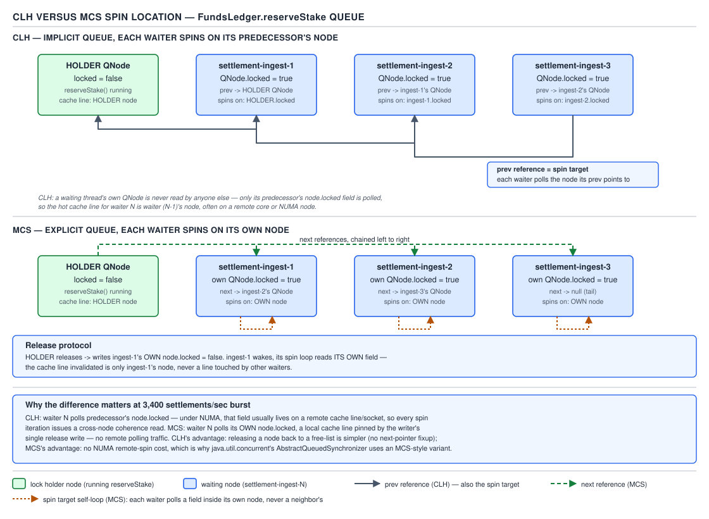

# 05 Multithreading and Concurrency — Locks from first principles: queue locks — BUILD IT (§4.1, leaves 4.1.5–4.1.10)

**Target version: Java 21 LTS.** | **Part 4 of 5** | [Index](../00-index.md)
Previous: [Locks from first principles: spinning](01-locks-from-first-principles.md) · Next: [Building on AQS](02-building-on-aqs.md)

This file continues directly from
[01-locks-from-first-principles.md](01-locks-from-first-principles.md), which built `SpinLock`,
`TestAndTestAndSetLock`, and `TicketLock` and measured spinning against blocking with a JMH
harness. Every lock here guards the same critical section as those did: `FundsLedger.reserveStake`,
which must produce a `StakeSplit(bonusPortion, cashPortion)` that sums exactly to the stake, with
the bonus bucket never going negative, under up to 1,200 stake reservations/sec from
`settlement-ingest-N` threads.

Two problems remained after 01: every lock built so far has every waiter spinning on *one* shared
memory location, which caps scalability, and none of them are reentrant. This file builds the two
fixes — CLH and MCS queue-based spin locks, plus a reentrant mutex — and a backoff variant of the
simple spin lock, then closes with the full diff table against `ReentrantLock` covering every lock
built across both files.

## CLHLock — spin on your predecessor

### Mental model

Instead of everyone watching one shared "now serving" sign, each new arrival hands a private pager
to the person ahead of them and watches *that specific pager*, not a public display.

### Why it exists

TAS, TTAS, and the ticket lock (all built in
[01](01-locks-from-first-principles.md)) share one property that caps their scalability: every
waiter polls the *same memory location*, so every release invalidates every waiter's cache line at
once, even though only one waiter's wait is actually ending. CLH (Craig, Landin, and Hagersten)
fixes this by giving each waiter a private flag to watch — specifically, the flag on the node
placed immediately *before* it in an implicit queue.

### When to reach for it, and when not

In application code: essentially never directly — this is exactly the mechanism `ReentrantLock`
already gives you via AQS, with blocking added on top, so hand-rolling it only makes sense as a
learning exercise or when building your own synchronizer beneath AQS is somehow off the table.
Understand it because it *is* the ancestor of every `java.util.concurrent.locks` primitive (leaf
4.1.7, below).

### How it works

Each thread owns one reusable node (kept in a `ThreadLocal`) with a single boolean field,
`locked`. A shared `AtomicReference<Node>` tail always points at the most recently enqueued node.
To acquire: a thread sets its own node's `locked` to `true`, atomically swaps itself in as the new
tail (`getAndSet`), and remembers whichever node came out as the *previous* tail — its
predecessor. It then spins reading **the predecessor's** `locked` field, not its own, until that
flips to `false`. To release: a thread sets its own node's `locked` to `false`, which is exactly
the flag its successor is watching — and then, in this bounded implementation, recycles a fresh
node for its next acquisition. The queue is implicit: there is no explicit `next` pointer, only
each thread's private memory of "who I'm following," recovered structurally by the swap order of
the tail reference.



**D-200** — CLH versus MCS spin location.

```java
import java.util.concurrent.atomic.AtomicReference;

public final class CLHLock {

    private static final class Node {
        volatile boolean locked = true;
    }

    private final AtomicReference<Node> tail = new AtomicReference<>(new Node() {{ locked = false; }});
    private final ThreadLocal<Node> myNode = ThreadLocal.withInitial(Node::new);
    private final ThreadLocal<Node> predecessorNode = new ThreadLocal<>();

    public void lock() {
        Node node = myNode.get();
        node.locked = true;
        Node predecessor = tail.getAndSet(node);
        predecessorNode.set(predecessor);
        while (predecessor.locked) {
            Thread.onSpinWait();
        }
    }

    public void unlock() {
        Node node = myNode.get();
        node.locked = false;
        // Reuse the predecessor's now-free node as this thread's node for its next acquisition,
        // so the ThreadLocal never grows an unbounded chain of garbage nodes.
        myNode.set(predecessorNode.get());
    }
}
```

**Pitfall:** forgetting the node-recycling step at the end of `unlock()`. Without it, every
acquisition allocates a brand-new `Node`, the `ThreadLocal` never shrinks, and — worse — the
*next* `lock()` call spins on the wrong node entirely, because `myNode.get()` would still return
the node this thread just released (with `locked` already `false`), making `lock()` return
instantly without actually queuing behind the real current tail.

> **Definition.** CLH is a queue-based spin lock where each waiter polls a private flag on the
> node immediately preceding it in an implicit, tail-pointer-defined queue, so a release only
> invalidates the one cache line the true successor is watching.

## MCSLock — spin on your own node

### Mental model

Same deli counter idea as CLH, but now every waiter is handed their *own* pager, and the person
ahead of them pages it directly when it's their turn — no watching someone else's device at all.

### Why it exists

CLH still requires a waiter to dereference and spin-read a *different* thread's node — on a
cache-coherent SMP that's cheap (that node's line just needs to be Shared), but on hardware
without uniform cache-coherent access to remote memory (NUMA, or historically cacheless
multiprocessors that CLH and MCS were literally designed for in 1991), reading a remote node
repeatedly can be far more expensive than reading local memory. MCS (Mellor-Crummey and Scott)
restructures the queue so every waiter only ever spins on memory it "owns."

### When to reach for it, and when not

Prefer MCS over CLH specifically on NUMA topologies where cross-node memory access is
measurably more expensive than local access — for everything else, they're close enough that CLH's
slightly simpler code (no explicit `next` maintenance) usually wins. Neither is what you reach for
in application code (see CLH's answer, same reasoning).

### How it works

Now the queue is explicit: each node carries both a `locked` flag and a `next` reference. To
acquire, a thread builds its own node, atomically swaps itself onto the shared tail, and — if
there *was* a predecessor — sets the predecessor's `next` to point at itself, then spins on its
**own** node's `locked` flag (initialized `true`). To release, a thread checks whether it already
has a successor (`next != null`); if not, it must atomically CAS the tail back to null to prove no
one snuck in, and if that CAS fails, a successor is arriving and the thread spins briefly until
`next` becomes visible, then sets that successor's `locked` to `false` directly. That direct write
into the successor's own node — not a shared line — is the entire structural difference from CLH.

```java
import java.util.concurrent.atomic.AtomicReference;

public final class MCSLock {

    private static final class Node {
        volatile boolean locked = true;
        volatile Node next = null;
    }

    private final AtomicReference<Node> tail = new AtomicReference<>(null);
    private final ThreadLocal<Node> myNode = ThreadLocal.withInitial(Node::new);

    public void lock() {
        Node node = myNode.get();
        node.locked = true;
        node.next = null;
        Node predecessor = tail.getAndSet(node);
        if (predecessor != null) {
            predecessor.next = node;
            while (node.locked) {
                Thread.onSpinWait();
            }
        }
    }

    public void unlock() {
        Node node = myNode.get();
        if (node.next == null) {
            if (tail.compareAndSet(node, null)) {
                return;
            }
            while (node.next == null) {
                Thread.onSpinWait();
            }
        }
        node.next.locked = false;
    }
}
```

**Pitfall:** releasing by only checking `node.next == null` without the tail CAS. If a new waiter
has already run `tail.getAndSet(node)` but has not yet executed `predecessor.next = node`, the
releasing thread sees `next == null`, wrongly concludes it's the last in line, and returns without
ever unblocking the new waiter — which then spins forever on a `locked` flag nobody will ever
clear. The tail-CAS-then-wait-for-`next` sequence above closes exactly that race.

> **Definition.** MCS is a queue-based spin lock where each waiter spins on its own node's flag,
> written directly by its predecessor on release, eliminating shared-line contention entirely in
> favor of point-to-point node hand-off.

## CLH versus MCS, and why AQS chose CLH's shape (4.1.7)

| Axis | CLH | MCS |
|---|---|---|
| Space per waiter | One node, implicit queue via tail swaps only — no explicit `next` field needed | One node with an explicit `next` field — marginally more state |
| Where it spins | Predecessor's node (a thread dereferences memory it doesn't own) | Its own node (thread-local memory only) |
| Release cost | O(1): flip your own flag; successor discovers it by polling | O(1) but slightly more code: must locate or wait for the successor pointer, or CAS the tail to null |
| Cacheless / NUMA suitability | Weaker — the spin read touches a remote node, expensive without uniform coherent caching | Stronger — this was MCS's whole motivation; a waiter never dereferences another thread's cache line while spinning |
| Cancellation support | **Yes** — an interrupted CLH waiter can splice itself out by leaving its own node's flag semantics intact and letting `prev` chains be walked or repaired, because the queue's ordering is defined by `prev`, not by an explicit forward pointer that must be kept consistent | Awkward — removing a node from the middle of an explicit doubly-ish linked structure while another thread might be mid-write to `next` is considerably harder to make safe |
| Which one AQS derives from | **CLH.** `java.util.concurrent.locks.AbstractQueuedSynchronizer`'s class javadoc (OpenJDK `jdk-21-ga` tag, `java.base/java/util/concurrent/locks/AbstractQueuedSynchronizer.java`, `raw.githubusercontent.com`) states: *"The wait queue is a variant of a 'CLH' (Craig, Landin, and Hagersten) lock queue. CLH locks are normally used for spinlocks. We instead use them for blocking synchronizers by including explicit ('prev' and 'next') links plus a 'status' field that allow nodes to signal successors when releasing locks, and handle cancellation due to interrupts and timeouts."* | — |

**Insight:** AQS's node design is not pure CLH — it explicitly adds a `next` link *on top of*
CLH's `prev` chain (so, structurally, an AQS node looks like a CLH node grafted onto an MCS node)
plus a `status` field, precisely because blocking synchronizers need to (a) find and directly
unpark a specific successor rather than have it discover a flag flip by polling, and (b) splice
cancelled waiters out of the middle of the queue without corrupting it. CLH's `prev`-based
structure is what makes that splicing safe, which is why AQS's javadoc credits CLH by name rather
than MCS, even though the final node shape borrows from both.

**Interview:** "Is `ReentrantLock` built on a spin lock?" — no; its underlying `AQS` queue *is
structurally a CLH-derived queue*, but nodes park via `LockSupport.park()` instead of spinning
once they fail to acquire (with a short optimistic spin only immediately before parking on some
JDK versions), which is exactly the spin-versus-block trade-off measured in
[01](01-locks-from-first-principles.md)'s leaf 4.1.2.

`[VERSION-TRAP]` The AQS internals here are drawn from the `jdk-21-ga` source tag. JDK 19
(JEP 425/incubator work on virtual threads) began adjusting how blocking synchronizers interact
with virtual-thread carriers; verify against the specific JDK build if you're running Loom-era
virtual threads through a `ReentrantLock` on 21+, since `LockSupport.park()` on a virtual thread
unmounts it from its carrier rather than blocking a platform thread outright.

## BackoffLock — don't retry immediately, retry later

### Mental model

A busy phone line. Redialing the instant a call drops just re-joins the same jam; waiting a random
short interval before redialing (and a longer one if that also fails) spreads retries out so
they stop colliding.

### Why it exists

Plain TAS's failure mode under contention isn't just coherence traffic — it's a *thundering herd*:
the instant the lock is released, every spinner's next CAS attempt fires near-simultaneously, so
only one succeeds and the rest immediately retry and collide again. Exponential randomized backoff
breaks that synchronization.

### When to reach for it, and when not

Reach for it as a cheap retrofit onto an existing TAS-style lock when you observe throughput
collapsing under moderate contention (say, several `settlement-ingest-N` threads racing on
`reserveStake` during a burst) and cannot restructure to CLH/MCS. Don't reach for it as a
substitute for CLH/MCS when you *can* restructure — backoff trades some acquisition latency
(the sleep) for throughput, whereas CLH/MCS get both fairness-adjacent behavior and no wasted
retries at once.

### How it works

Each failed CAS attempt increases a per-thread backoff window (typically by doubling it, capped at
some maximum), and the thread parks itself for a random duration inside that window before
retrying. The randomization is what prevents every backed-off thread from waking up and retrying
in lockstep again.

```java
import java.util.concurrent.ThreadLocalRandom;
import java.util.concurrent.atomic.AtomicBoolean;

public final class BackoffLock {
    private final AtomicBoolean locked = new AtomicBoolean(false);
    private final long minDelayNanos;
    private final long maxDelayNanos;

    public BackoffLock(long minDelayNanos, long maxDelayNanos) {
        this.minDelayNanos = minDelayNanos;
        this.maxDelayNanos = maxDelayNanos;
    }

    public void lock() {
        long delay = minDelayNanos;
        while (!locked.compareAndSet(false, true)) {
            long sleepNanos = ThreadLocalRandom.current().nextLong(delay);
            parkNanos(sleepNanos);
            delay = Math.min(delay * 2, maxDelayNanos);
        }
    }

    public void unlock() {
        locked.set(false);
    }

    private static void parkNanos(long nanos) {
        long deadline = System.nanoTime() + nanos;
        while (System.nanoTime() < deadline) {
            Thread.onSpinWait();
        }
    }
}
```

**Pitfall:** using a fixed doubling schedule with no randomness, on the theory that deterministic
backoff is "simpler and just as good." A fixed schedule keeps every backed-off thread synchronized
with every other one: if two threads both fail a CAS at the same moment, a purely deterministic
schedule has them both wake up and retry at the same moment again, recreating the exact
thundering-herd collision backoff exists to avoid. The randomization inside each window (via
`ThreadLocalRandom.current().nextLong(delay)` above) is what actually breaks the synchronization —
dropping it turns `BackoffLock` back into a slower version of plain `SpinLock` with the same
collision pathology, minus the constant CAS traffic.

> **Definition.** A backoff lock is a spin lock whose retry interval grows (typically
> exponentially) and is randomized on each failed attempt, trading a small amount of acquisition
> latency for avoiding synchronized retry storms under contention.

## A reentrant mutex on AtomicReference\<Thread\> (4.1.9)

### Mental model

A single doorman who remembers your face. If you're already inside and you walk up to the door
again, he waves you through without re-checking — but he also keeps a tally of how many times
you've walked through, so he knows how many times you have to walk *out* before the door is
truly unlocked for everyone else.

### Why it exists

None of the locks in either file are reentrant by default: a thread that already holds `SpinLock`
and calls `lock()` again (say, `reserveStake` calling into another ledger method that also takes
the lock) deadlocks against itself. `synchronized` and `ReentrantLock` both solve this by tracking
*which* thread holds the lock and how many times.

### When to reach for it, and when not

Build this only to understand the mechanism — production code takes `ReentrantLock` or
`synchronized`, both of which already do this correctly and additionally support conditions,
interruptible acquisition, and fairness modes (4.1.10, below).

### How it works

An `AtomicReference<Thread>` holds the current owner (or `null`). `lock()` first checks — with a
plain, non-atomic read — whether the calling thread already *is* the owner; if so, it just
increments the hold count and returns, no CAS needed. Otherwise it spins on
`owner.compareAndSet(null, currentThread)` until it wins, then sets the hold count to 1. `unlock()`
decrements the hold count and only clears `owner` back to `null` when the count reaches zero.

**Insight:** the hold count is a plain `int`, not an `AtomicInteger`, and that is deliberate, not
an oversight — precisely because of the ownership check. Once a thread has established (via the
atomic CAS) that it is the sole owner, every subsequent read and write of the count happens
exclusively from that one thread until it releases ownership; no other thread's `lock()` call can
even reach the count-touching code path without first successfully becoming the owner itself,
which cannot happen while the current owner still holds it. Only the owner ever touches the field,
so there is no race to guard against — the mutual exclusion the CAS already provides for `owner`
transitively protects the plain `int` too.

```java
import java.util.concurrent.atomic.AtomicReference;

public final class ReentrantSpinMutex {
    private final AtomicReference<Thread> owner = new AtomicReference<>(null);
    private int holdCount = 0; // touched only by the current owner — see Insight above.

    public void lock() {
        Thread current = Thread.currentThread();
        if (owner.get() == current) {
            holdCount++;
            return;
        }
        while (!owner.compareAndSet(null, current)) {
            Thread.onSpinWait();
        }
        holdCount = 1;
    }

    public void unlock() {
        if (owner.get() != Thread.currentThread()) {
            throw new IllegalMonitorStateException("unlock() called by a non-owner thread");
        }
        holdCount--;
        if (holdCount == 0) {
            owner.set(null);
        }
    }
}
```

```java
// reserveStake calling a second ledger method that also needs the lock — the reentrancy this
// buys. With SpinLock (01-locks-from-first-principles.md) this would deadlock the calling
// settlement-ingest-N thread against itself; with ReentrantSpinMutex it does not.
public final class FundsLedgerReentrant {
    private final ReentrantSpinMutex ledgerLock = new ReentrantSpinMutex();
    private Money bonusBalance;
    private Money cashBalance;

    public StakeSplit reserveStake(Money stake) {
        ledgerLock.lock();
        try {
            recordAuditTrail(stake); // also takes ledgerLock — reentrant, so no self-deadlock.
            Money bonusPortion = bonusBalance.min(stake);
            Money cashPortion = stake.minus(bonusPortion);
            bonusBalance = bonusBalance.minus(bonusPortion);
            cashBalance = cashBalance.minus(cashPortion);
            return new StakeSplit(bonusPortion, cashPortion);
        } finally {
            ledgerLock.unlock();
        }
    }

    private void recordAuditTrail(Money stake) {
        ledgerLock.lock();
        try {
            // audit bookkeeping under the same ledger lock
        } finally {
            ledgerLock.unlock();
        }
    }
}
```

**Pitfall:** the ownership check `owner.get() == current` in `lock()` is fine for correctness here
because `AtomicReference.get()` has volatile semantics — but it's easy to "simplify" this by
replacing `AtomicReference<Thread>` with a plain field for a supposed performance win, at which
point the ownership check loses its happens-before guarantee entirely and a thread can observe a
stale owner across cores.

> **Definition.** A reentrant mutex tracks both *which* thread owns it and *how many times* that
> thread has acquired it, allowing the owning thread to re-acquire without blocking while still
> requiring one `unlock()` per `lock()` before another thread can proceed.

## Diff vs the real one (4.1.10)

The first four rows below — TAS, TTAS, ticket lock, and the JMH measurement — are the locks built
in [01-locks-from-first-principles.md](01-locks-from-first-principles.md); the remaining rows are
built in this file. Together they cover every lock across both files.

| Lock built | Blocks (parks) vs. spins when contended | Cancellation (interrupt/timeout) | Fairness mode | Condition variable support | Instrumentation (`isLocked`, `getQueueLength`, …) | Monitor-dump visibility (jstack/JFR) |
|---|---|---|---|---|---|---|
| `SpinLock` (TAS, [01](01-locks-from-first-principles.md)) | Always spins | None — `lock()` cannot be interrupted or timed out | None (unfair) | None | None | Invisible — a spinning thread shows as `RUNNABLE`, not "waiting for a lock," so a stuck spin lock looks like a hot loop in a stack dump, not a deadlock |
| `TestAndTestAndSetLock` ([01](01-locks-from-first-principles.md)) | Always spins | None | None | None | None | Same as `SpinLock` |
| `TicketLock` ([01](01-locks-from-first-principles.md)) | Always spins | None | Strict FIFO (this is its *only* fairness option — cannot be configured) | None | None | Same as `SpinLock` |
| `CLHLock` / `MCSLock` | Always spins | None (real CLH/MCS have no notion of abandoning a queue position safely, per 4.1.7) | Strict FIFO by queue order | None | None | Same as `SpinLock`; queue position is invisible to any external tool |
| `BackoffLock` | Spins, with sleeps between attempts | None | None (unfair; backoff timing can accidentally favor recently-failed threads or starve them further) | None | None | Same as `SpinLock`, plus the sleeps show up as brief `TIMED_WAITING` blips that don't reflect true lock semantics |
| `ReentrantSpinMutex` | Always spins | None | None | None | Reentrancy count is inspectable only by adding your own getter | Same as `SpinLock` |
| **`java.util.concurrent.locks.ReentrantLock`** | **Blocks** — parks via `LockSupport.park()` after a brief optimistic spin, so it costs near-zero CPU while waiting long-term | **Full** — `lockInterruptibly()` and `tryLock(timeout, unit)` both exist and correctly abandon the attempt, splicing the cancelled node out of the AQS queue (the exact capability CLH's `prev` links enable, per 4.1.7) | **Configurable** — constructor takes a `fair` boolean; fair mode enforces FIFO (at a throughput cost), unfair (default) mode allows barging for higher throughput | **Full** — `newCondition()` gives `await`/`signal`/`signalAll`, each with its own wait queue | **Full** — `isLocked()`, `isHeldByCurrentThread()`, `getHoldCount()`, `getQueueLength()`, `hasQueuedThreads()` all exist | **Visible** — `jstack` reports the exact `ReentrantLock` instance a thread is `WAITING`/`TIMED_WAITING` on, and which thread owns it, because parked threads are properly registered with the JVM's own monitor/lock bookkeeping |

The short version: everything across both files is *mechanism*, not *product*. `ReentrantLock` is
built from a CLH-shaped queue with parking, cancellation, fairness, conditions, and instrumentation
layered on top of exactly the ideas in 4.1.1–4.1.9 — because a spinning lock can't scale past the
core count, an uninterruptible one can't support responsive shutdown, and an uninstrumented one
can't be debugged in production from a stack dump alone.

## Open questions

None — the AQS/CLH lineage claim (4.1.7) was verified directly against the `jdk-21-ga` tag of
`java.base/java/util/concurrent/locks/AbstractQueuedSynchronizer.java` via
`raw.githubusercontent.com`. Every other claim in this file is either a stable data-structure fact
(the house rules say not to re-research CLH/MCS mechanics or CAS fundamentals) or is explicitly
version-flagged (`[VERSION-TRAP]` above) rather than presented as settled.

## Pitfalls

### Thinking CLH and MCS differ only in code style

**Wrong**

```java
// "CLH and MCS both use a queue, so they're basically interchangeable — pick whichever reads
// nicer."
```

**Right**

They differ in *where the spin lands*: CLH spins on a dereferenced predecessor node (fine on
cache-coherent SMP, expensive on NUMA/cacheless hardware); MCS spins on its own node, written
directly by the predecessor, which is strictly better for remote-memory cost but requires the
harder-to-get-right explicit `next`-pointer maintenance. The choice is a real hardware-topology
trade-off, not a style preference — and it's also why AQS, needing safe mid-queue cancellation
more than it needs NUMA-optimal spinning, derives from CLH specifically (4.1.7).

**Why people believe it:** both are commonly taught as "just queue-based spin locks" without
naming which end of the queue each design spins on, so the actual axis of difference gets lost.

### Assuming a queue-based lock automatically supports cancellation

**Wrong**

```java
// "CLHLock is queue-based like AQS, so I can safely interrupt a thread stuck in lock()."
Thread waiter = new Thread(clhLock::lock);
waiter.start();
waiter.interrupt(); // "should" make it bail out of the queue cleanly
```

**Right**

The `CLHLock`/`MCSLock` built in this file have no interrupt or timeout handling at all — `lock()`
is an uninterruptible spin loop, so calling `interrupt()` on a waiting thread does nothing to it;
it keeps spinning. Only `ReentrantLock`'s AQS-derived queue, with its added `status` field and
`prev`/`next` links, actually supports splicing a cancelled waiter out safely (4.1.7's "cancellation
support" row). "Queue-based" and "cancellable" are independent properties — CLH's `prev` structure
merely makes cancellation *possible* to add, which is exactly what AQS added on top of it.

**Why people believe it:** because AQS *is* CLH-derived and *does* support cancellation, it's easy
to conflate "queue-based" with "therefore cancellable," when the cancellation support is a
deliberate addition layered on top of CLH, not a property CLH provides on its own.

## Cheat sheet

| Lock | Fair | Spin location | Best for | Never use when |
|---|---|---|---|---|
| CLHLock | Yes (queue order) | Predecessor's node | Cache-coherent SMP, learning AQS's ancestry | Need cancellation (not supported here) |
| MCSLock | Yes (queue order) | Own node | NUMA / non-uniform cache access | Simpler CLH already suffices |
| BackoffLock | No | Shared flag, delayed retry | Retrofitting TAS under moderate contention | Can restructure to CLH/MCS instead |
| ReentrantSpinMutex | No | Shared reference | Learning reentrancy mechanics only | Any production code — use `ReentrantLock` |
| `ReentrantLock` (real) | Configurable | N/A — parks | Production default whenever a lock is needed | Sub-microsecond sections with cores to spare |
| AQS lineage | — | — | Recall: "CLH-derived, `prev`/`next`/`status` added for blocking + cancellation" | Never say "MCS-derived" — the javadoc names CLH |

## Self-test

**Q1.** Why does CLH's `lock()` spin on the *predecessor's* node rather than its own, when MCS
spins on its own?

<details><summary>Answer</summary>

CLH assigns responsibility for "am I next" to the newly-arriving thread: it grabs whatever node
was previously the tail (its predecessor) and watches that predecessor's `locked` flag flip to
false, which the predecessor sets on release. This makes the queue purely implicit — no `next`
pointers are needed, because "who comes after me" is never asked; only "who is before me" matters,
and that's answered once, at enqueue time, by the tail swap. MCS instead makes the *releasing*
thread responsible for waking a specific successor, which requires an explicit `next` pointer and
lets each waiter spin on memory it already owns — better for NUMA, but requires safely
maintaining that `next` link.

</details>

**Q2.** A junior engineer proposes hand-rolling `CLHLock` inside `FundsLedger` "for performance,
since we don't need `ReentrantLock`'s condition variables." What's wrong with that reasoning?

<details><summary>Answer</summary>

The `CLHLock` built in this file has no cancellation support: a `settlement-ingest-N` thread that
times out or gets interrupted while queued has no way to leave the queue safely, so a slow or
stuck thread ahead of it stalls every thread behind it indefinitely. `ReentrantLock`'s AQS-based
queue is CLH-*derived* specifically because AQS adds the `prev`/`next`/`status` machinery needed
to splice a cancelled node out safely (4.1.7) — that's not a nice-to-have layered on top for
convenience, it's the reason production code doesn't use raw CLH. Not needing conditions doesn't
mean not needing cancellation.

</details>

**Q3.** Why does `ReentrantSpinMutex`'s `holdCount` field not need to be an `AtomicInteger`?

<details><summary>Answer</summary>

Because only the thread that currently owns the lock (as established by winning the CAS on
`owner`) ever reads or writes `holdCount`. No other thread's `lock()` call can reach the
count-touching branch until it too becomes the owner, which cannot happen while the current owner
still holds the `AtomicReference`. The exclusivity the atomic reference already guarantees for
`owner` transitively protects the plain `int`, since there is never a window where two threads
both believe they're the owner simultaneously.

</details>

**Q4.** Why is the "coherence traffic per acquisition" property O(N) for the ticket lock (from
[01](01-locks-from-first-principles.md)) but O(1) for CLH and MCS?

<details><summary>Answer</summary>

In the ticket lock, every one of the N waiters holds a cached copy of the single `nowServing`
line; one `unlock()` write invalidates all N copies, even though only one waiter's wait condition
actually became true. In CLH and MCS, each waiter watches a distinct piece of memory (a different
predecessor node in CLH, its own node in MCS), so a release only ever touches — and only ever
invalidates — the one line the true successor is watching. The other N-1 waiters' cache lines are
completely untouched by that release.

</details>

**Q5.** Why does `BackoffLock` deliberately randomize its retry delay instead of using a fixed
doubling schedule with no randomness?

<details><summary>Answer</summary>

A fixed schedule keeps every backed-off thread synchronized with each other: if two threads both
fail a CAS at the same moment, a purely deterministic doubling schedule has them both wake up and
retry at the same moment again, recreating the exact thundering-herd collision backoff exists to
avoid. Randomizing the delay within the current window spreads retries out in time so collisions
become progressively less likely as the window (and its random spread) grows.

</details>

**Q6.** The consolidated diff table says none of the six locks built in this pair of files support
"instrumentation" the way `ReentrantLock` does. Concretely, what does that cost an on-call engineer
debugging a stuck `reserveStake` call in production?

<details><summary>Answer</summary>

With `ReentrantLock`, a `jstack` or JFR-based dump would show the blocked `settlement-ingest-N`
thread as `WAITING`/`TIMED_WAITING` on a named lock object, and identify exactly which thread
currently owns it — turning "why is this thread stuck" into a direct answer. With any of the
spin-based locks built across both files, a stuck thread shows up as `RUNNABLE`, indistinguishable
from a thread doing legitimate CPU-bound work; the dump gives no indication it's actually spinning
on a lock, let alone which other thread holds it, so diagnosing the stall requires reasoning about
the code rather than reading it off a stack dump.

</details>

---

**Leaves covered:** 4.1.5–4.1.10 (6 leaves)
**Leaves deferred:** none
**Diagrams included:** D-200
**Target version:** Java 21 LTS
**Lines:** 597
