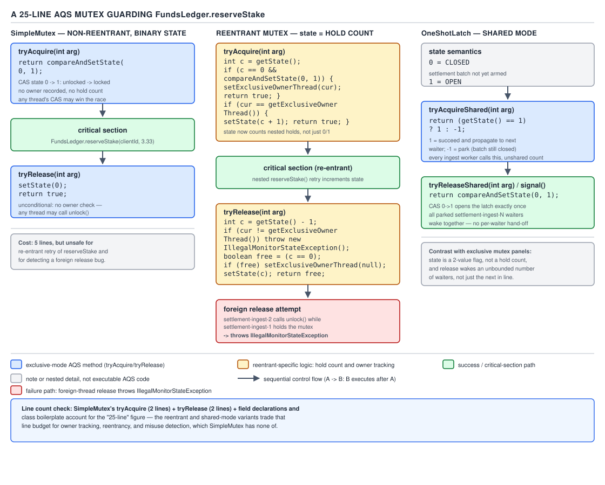

# 05 Multithreading and Concurrency — Building on AQS — BUILD IT (§4.2, leaves 4.2.1–4.2.4)

**Target version: Java 21 LTS.** | **Part 4 of 5** | [Index](../00-index.md)
Previous: [Queue locks and reentrancy](01b-queue-locks-and-reentrancy.md) · Next: [AQS fairness and conditions](02b-aqs-fairness-and-conditions.md)

`AbstractQueuedSynchronizer` (AQS) is the base class the JDK built `ReentrantLock`, `Semaphore`,
`CountDownLatch`, and `ReentrantReadWriteLock` on top of. [01b](01b-queue-locks-and-reentrancy.md)
built a CLH-style queue lock by hand; AQS is that same idea — a FIFO wait queue of parked threads —
packaged as a reusable superclass. You subclass it, hold exactly one `int` of state, and override a
handful of template methods deciding whether an acquire or release should succeed. AQS owns the
queue, the parking, and the memory ordering; your subclass owns only the *meaning* of `state`.

All four synchronizers here guard or gate `FundsLedger.reserveStake`, where a
`StakeSplit(bonusPortion, cashPortion)` must sum exactly to the stake, under `settlement-ingest-N`
threads pushing 1,200 reservations/sec while settlements burst to 3,400/sec.

I read the `jdk-21-ga` tag of `openjdk/jdk`'s `AbstractQueuedSynchronizer.java` (via
`raw.githubusercontent.com` — `openjdk.org` returns HTTP 403 here) for the claims below.

## Hierarchy before details

**D-202 — one base class, four meanings of `state`**

| Class (this file) | What `state` means | Template methods overridden | Mode | Mirrors |
|---|---|---|---|---|
| `SimpleMutex` (4.2.1) | 0 = unlocked, 1 = locked | `tryAcquire`, `tryRelease`, `isHeldExclusively` | Exclusive | The non-reentrant core of `ReentrantLock` |
| `CountingSemaphore` (4.2.2) | Remaining permits | `tryAcquireShared`, `tryReleaseShared` | Shared | `java.util.concurrent.Semaphore` |
| `OneShotLatch` (4.2.3) | 0 = closed, 1 = open | `tryAcquireShared`, `tryReleaseShared` | Shared | `java.util.concurrent.CountDownLatch` (a `CountDownLatch(1)`, specifically) |
| Reentrant mutex (4.2.4) | Hold count (0 = free) | `tryAcquire`, `tryRelease`, `isHeldExclusively` | Exclusive | `ReentrantLock`'s non-fair `Sync` |

AQS's javadoc states its five core template methods "by default throw
`UnsupportedOperationException`" — you override only the ones your mode needs; AQS never
interprets `state` itself, only CASes it via `getState()`/`setState()`/`compareAndSetState()`.

**Insight:** the shared-mode return convention is the detail both `CountingSemaphore` and
`OneShotLatch` depend on. Per the AQS source, `tryAcquireShared` returns "a negative value on
failure; zero if acquisition succeeded but no subsequent shared acquire can succeed; and a positive
value if acquisition succeeded and subsequent shared acquires might also succeed" — why a released
latch or semaphore with spare permits lets a chain of waiters through without each re-querying.



**D-202** — A 25-line AQS mutex.

## SimpleMutex — a non-reentrant lock in ~25 lines

A single-bit turnstile: `state` is 0 or 1, acquire CASes 0→1, release sets it back to 0. [01b](01b-queue-locks-and-reentrancy.md)'s
CLH and MCS locks build the queue by hand; once AQS's queue is free, a full mutual-exclusion lock
is a five-line `tryAcquire` and a two-line `tryRelease` — the shape `ReentrantLock`'s non-fair
`Sync` starts from before it adds reentrancy. Never ship `SimpleMutex` itself; build it only to see
what `ReentrantLock` does underneath, and reach for the real one for `tryLock`, timeouts,
`Condition`s, or reentrancy.

`tryAcquire` does exactly one `compareAndSetState(0, 1)`; on success it calls
`setExclusiveOwnerThread(Thread.currentThread())`, inherited from `AbstractOwnableSynchronizer` (a
superclass AQS extends purely to hold "who owns this exclusively," so thread dumps and deadlock
detectors can report ownership without every synchronizer reinventing an owner field). `tryRelease`
clears the owner and sets `state` back to 0 with a plain `setState(0)` — safe because only the
release-calling thread ever writes it, and `setState` is a volatile store, giving the next
`tryAcquire`'s CAS a happens-before edge to the critical section's writes.

```java
import java.util.concurrent.locks.AbstractQueuedSynchronizer;
import java.util.concurrent.locks.Lock;
import java.util.concurrent.locks.Condition;

public final class SimpleMutex implements Lock {

    private static final class Sync extends AbstractQueuedSynchronizer {
        @Override
        protected boolean tryAcquire(int acquires) {
            if (compareAndSetState(0, 1)) {
                setExclusiveOwnerThread(Thread.currentThread());
                return true;
            }
            return false;
        }

        @Override
        protected boolean tryRelease(int releases) {
            if (getState() == 0 || Thread.currentThread() != getExclusiveOwnerThread()) {
                throw new IllegalMonitorStateException("release by non-owner");
            }
            setExclusiveOwnerThread(null);
            setState(0);
            return true;
        }

        @Override
        protected boolean isHeldExclusively() {
            return getState() == 1 && Thread.currentThread() == getExclusiveOwnerThread();
        }
    }

    private final Sync sync = new Sync();

    @Override
    public void lock() {
        sync.acquire(1);
    }

    @Override
    public void unlock() {
        sync.release(1);
    }

    @Override
    public void lockInterruptibly() throws InterruptedException {
        sync.acquireInterruptibly(1);
    }

    @Override
    public boolean tryLock() {
        return sync.tryAcquire(1);
    }

    @Override
    public Condition newCondition() {
        throw new UnsupportedOperationException("no Condition support in this build");
    }
}
```

```java
// FundsLedger.reserveStake, guarded by SimpleMutex.
public final class FundsLedger {
    private final SimpleMutex ledgerLock = new SimpleMutex();
    private Money bonusBalance;
    private Money cashBalance;

    public StakeSplit reserveStake(Money stake) {
        ledgerLock.lock();
        try {
            Money bonusPortion = bonusBalance.min(stake);
            Money cashPortion = stake.minus(bonusPortion);
            bonusBalance = bonusBalance.minus(bonusPortion);
            cashBalance = cashBalance.minus(cashPortion);
            return new StakeSplit(bonusPortion, cashPortion);
        } finally {
            ledgerLock.unlock();
        }
    }
}
```

**Pitfall:** calling `sync.release(1)` from a thread that never acquired is not a silent no-op —
`tryRelease`'s owner check throws `IllegalMonitorStateException`. Skipping that check would let a
foreign thread "release" a lock it never held, corrupting `state` for the real owner.

**Diff vs the real one.** `ReentrantLock`'s `Sync` differs on: reentrancy (real re-acquires safely,
`SimpleMutex` self-deadlocks on a second `lock()`); fairness (`NonfairSync`/`FairSync` choice vs.
unfair-only); cancellation (`tryLock(timeout)` via `tryAcquireNanos`, unused here); `Condition`
support (real works, `SimpleMutex` throws); serialization (real is `Serializable`). A lock used
application-wide must survive self-acquire and support conditions — `SimpleMutex` strips those to
show the minimal skeleton.

> **Definition.** `SimpleMutex` is a non-reentrant exclusive lock built on `AbstractQueuedSynchronizer`
> whose entire state is a single 0/1 flag CASed by `tryAcquire` and cleared by `tryRelease`.

## CountingSemaphore — shared mode with a CAS loop

A parking garage with a fixed number of spaces tracked as one integer — multiple cars can be "in"
at once, the entire difference from `SimpleMutex` being a counter instead of a flag. `reserveStake`
needs exclusive access, but the *connection pool* in front of it doesn't — the anchor is
`Semaphore(20)` guarding a bounded pool of database connections; up to 20 `settlement-ingest-N`
threads hold a connection at once, the 21st waits. Shared mode exists so more than one waiter can
be released by a single `release()` without each separately winning a CAS race. Reach for a
semaphore for any fixed-capacity-greater-than-one resource; use `SimpleMutex`/`ReentrantLock`
otherwise.

`tryAcquireShared` decrements `state`: negative means "no permits, park," zero-or-more means
"acquired, continue." `tryReleaseShared` uses a CAS loop rather than a plain `getAndAdd`, since two
concurrent `release()` calls racing on `state` must not lose an increment; AQS propagates success
to the next queued shared waiter per the three-way return contract above.

```java
import java.util.concurrent.locks.AbstractQueuedSynchronizer;

public final class CountingSemaphore {

    private static final class Sync extends AbstractQueuedSynchronizer {
        Sync(int permits) {
            setState(permits);
        }

        @Override
        protected int tryAcquireShared(int acquires) {
            for (;;) {
                int available = getState();
                int remaining = available - acquires;
                if (remaining < 0 || compareAndSetState(available, remaining)) {
                    return remaining;
                }
            }
        }

        @Override
        protected boolean tryReleaseShared(int releases) {
            for (;;) {
                int current = getState();
                int next = current + releases;
                if (next < current) {
                    throw new Error("permit count overflow");
                }
                if (compareAndSetState(current, next)) {
                    return true;
                }
            }
        }
    }

    private final Sync sync;

    public CountingSemaphore(int permits) {
        if (permits < 0) {
            throw new IllegalArgumentException("permits cannot be negative: " + permits);
        }
        sync = new Sync(permits);
    }

    public void acquire() throws InterruptedException {
        sync.acquireSharedInterruptibly(1);
    }

    public void release() {
        sync.releaseShared(1);
    }

    public int availablePermits() {
        return sync.getState();
    }
}
```

The anchor is `Semaphore(20)` guarding reservation persistence: `poolPermits.acquire()` before
borrowing a connection, `poolPermits.release()` in a `finally` after — the same
`acquire`/`try`/`finally`/`release` shape as `SimpleMutex`, with a counted resource instead of a flag.

**Pitfall:** returning `available - acquires` even when negative looks wasteful, but the negative
value *is* the contract — AQS reads the sign, not the magnitude. Clamping to `-1` would still work
for single-permit acquires but loses the true deficit multi-permit `acquireShared(n)` calls need.

**Diff vs the real one.** `Semaphore` differs on: fairness (real offers `FairSync` via a
constructor argument adding `hasQueuedPredecessors()` before the CAS — this one is unfair-only);
cancellation (`tryAcquire(timeout)` via `tryAcquireSharedNanos`, unused here); serialization (real
is `Serializable`); monitoring (`getQueuedThreads()`, omitted for brevity). The fair variant exists
because a pool under sustained overload without it can starve threads indefinitely.

> **Definition.** A counting semaphore built on AQS is `state` holding "permits remaining,"
> acquired via a CAS-loop decrement in `tryAcquireShared` and released via a CAS-loop increment in
> `tryReleaseShared`, with AQS's shared-mode propagation letting one release wake more than one
> waiter when enough permits become available at once.

## OneShotLatch — exactly how CountDownLatch(1) works

A gate that starts closed and, once opened, stays open forever — every waiting thread, and every
thread that asks afterward, walks straight through. The QuizStakes load-testing harness for the
1,200-reservations/sec target needs exactly this: spin up every `settlement-ingest-N` worker,
block each on a single "go" signal, then release them all at once so the measured window excludes
thread-startup jitter — a one-time, one-directional transition, simpler than a semaphore's counter.
Reach for a one-shot latch for "wait for a single signal" shapes; never when the gate needs to
close again, since a `OneShotLatch`, like the real `CountDownLatch`, has no reset.

`state` is 0 (closed) or 1 (open). `tryAcquireShared` returns `1` if `state` is already `1`
(matching AQS's "positive: further shared acquires can succeed" case, since an open latch must let
every future caller through without re-parking) and `-1` otherwise (park). `tryReleaseShared`
CASes `state` to `1` and returns `true` exactly once — the first successful transition — so a
second call to `open()` is a correctly-behaved no-op, mirroring `CountDownLatch`'s count that
cannot go negative.

```java
import java.util.concurrent.locks.AbstractQueuedSynchronizer;

public final class OneShotLatch {

    private static final class Sync extends AbstractQueuedSynchronizer {
        @Override
        protected int tryAcquireShared(int ignored) {
            return getState() == 1 ? 1 : -1;
        }

        @Override
        protected boolean tryReleaseShared(int ignored) {
            return compareAndSetState(0, 1);
        }
    }

    private final Sync sync = new Sync();

    public void await() throws InterruptedException {
        sync.acquireSharedInterruptibly(1);
    }

    public void open() {
        sync.releaseShared(1);
    }

    public boolean isOpen() {
        return sync.getState() == 1;
    }
}
```

The anchor is the 1,200-reservations/sec load test's start gate: every `settlement-ingest-N`
worker calls `startGate.await()` after starting; once all are spawned, the harness calls
`startGate.open()` once, releasing them into `reserveStake` at effectively the same instant.

**Pitfall:** implementing `tryReleaseShared` as `setState(1); return true;` instead of a CAS looks
equivalent for one caller, but two racing `open()` calls would both return `true`, having AQS
propagate a release twice — harmless here since opening an already-open gate is idempotent, but it
breaks the moment the return value must mean "this call was the one that changed state," as in the
real `CountDownLatch`'s multi-count version.

**Diff vs the real one.** `CountDownLatch` differs on generality (real `CountDownLatch(int count)`
decrements `state` toward zero from any starting value — `OneShotLatch` is the `count == 1`
special case); the "return true exactly once" discipline is identical, just applied to a
decrement-to-zero instead of a 0→1 flip. Both support `await(timeout)`; neither is `Serializable`.
The general class exists because "wait for N things to finish" is common enough to deserve one —
a bare gate is just `new CountDownLatch(1)`.

> **Definition.** `OneShotLatch` is a single-transition gate built on AQS shared mode where
> `state` is 0 until the one `tryReleaseShared` call that CASes it to 1, after which every past and
> future `tryAcquireShared` call succeeds immediately.

## The reentrant variant — hold count, owner, and foreign release

The same turnstile as `SimpleMutex`, except the owner may walk through again without it locking
behind them, counting walk-throughs and requiring that many walk-backs before it locks again for
everyone else. A plain `SimpleMutex` deadlocks the instant its owner calls `lock()` twice — e.g. if
`reserveStake`, holding `ledgerLock`, called a second ledger method that also acquires it (realistic
once a compliance check is added inline). Reach for reentrancy whenever the same thread might
legitimately re-enter through a different call path — in practice "almost always," which is why
`ReentrantLock` defaults to it, at the cost of one extra `==` check and `int` increment per acquire.

`tryAcquire` checks whether `state == 0` (free) and CASes it to `acquires`; if the *current* thread
already owns it, it increments `state` by `acquires` without any CAS at all — safe because only the
owner ever touches `state` while it holds exclusive rights. `tryRelease` decrements `state`; only
when the result reaches exactly `0` does it clear the owner and report `true` to AQS ("fully
released, wake the next waiter") — a partial decrement returns `false`. Release by a non-owner
throws `IllegalMonitorStateException`, per AQS's own javadoc guidance.

```java
import java.util.concurrent.locks.AbstractQueuedSynchronizer;
import java.util.concurrent.locks.Lock;
import java.util.concurrent.locks.Condition;

public final class ReentrantMutex implements Lock {

    private static final class Sync extends AbstractQueuedSynchronizer {
        @Override
        protected boolean tryAcquire(int acquires) {
            Thread current = Thread.currentThread();
            int state = getState();
            if (state == 0) {
                if (compareAndSetState(0, acquires)) {
                    setExclusiveOwnerThread(current);
                    return true;
                }
                return false;
            }
            if (current == getExclusiveOwnerThread()) {
                int next = state + acquires;
                if (next < 0) {
                    throw new Error("hold count overflow");
                }
                setState(next);
                return true;
            }
            return false;
        }

        @Override
        protected boolean tryRelease(int releases) {
            if (Thread.currentThread() != getExclusiveOwnerThread()) {
                throw new IllegalMonitorStateException("release by non-owner");
            }
            int next = getState() - releases;
            boolean fullyReleased = (next == 0);
            if (fullyReleased) {
                setExclusiveOwnerThread(null);
            }
            setState(next);
            return fullyReleased;
        }

        @Override
        protected boolean isHeldExclusively() {
            return getExclusiveOwnerThread() == Thread.currentThread();
        }

        int currentHoldCount() {
            return isHeldExclusively() ? getState() : 0;
        }
    }

    private final Sync sync = new Sync();

    @Override
    public void lock() {
        sync.acquire(1);
    }

    @Override
    public void unlock() {
        sync.release(1);
    }

    @Override
    public void lockInterruptibly() throws InterruptedException {
        sync.acquireInterruptibly(1);
    }

    @Override
    public boolean tryLock() {
        return sync.tryAcquire(1);
    }

    @Override
    public Condition newCondition() {
        throw new UnsupportedOperationException("no Condition support in this build");
    }

    public int getHoldCount() {
        return sync.currentHoldCount();
    }
}
```

```java
// Reentrant re-entry: reserveStake calls a compliance check that itself re-acquires ledgerLock.
public final class FundsLedger {
    private final ReentrantMutex ledgerLock = new ReentrantMutex();
    private Money bonusBalance;
    private Money cashBalance;

    public StakeSplit reserveStake(Money stake) {
        ledgerLock.lock();
        try {
            recordLedgerTouch(); // re-enters: hold count 1 -> 2, no CAS, no parking
            Money bonusPortion = bonusBalance.min(stake);
            Money cashPortion = stake.minus(bonusPortion);
            bonusBalance = bonusBalance.minus(bonusPortion);
            cashBalance = cashBalance.minus(cashPortion);
            return new StakeSplit(bonusPortion, cashPortion);
        } finally {
            ledgerLock.unlock(); // hold count 2 -> 1 first, then 1 -> 0
        }
    }

    private void recordLedgerTouch() {
        ledgerLock.lock();
        try {
            // audit bookkeeping against the same ledger instance
        } finally {
            ledgerLock.unlock();
        }
    }
}
```

**Pitfall:** calling `unlock()` one fewer time than `lock()` (an unbalanced try/finally, or an
early `return` skipping a matching release) leaves `state` permanently above zero. Every subsequent
`tryAcquire` from other threads fails forever, and the lock looks identically "stuck" whether the
bug is a genuine deadlock or a leaked hold count — always pair each `lock()` with one
`finally { unlock(); }`.

**Diff vs the real one.** The fully consolidated table against `ReentrantLock`'s real fair and
non-fair `Sync` classes is leaf 4.2.7, in the next file,
[02b-aqs-fairness-and-conditions.md](02b-aqs-fairness-and-conditions.md), which closes §4.2. In
short: this class is unfair-only, has no `Condition` support, and has no serialization support —
all three of which that file's table and its fairness mechanics (`hasQueuedPredecessors()`) cover.

> **Definition.** A reentrant AQS mutex stores the owning thread's hold count in `state`, lets
> that same thread re-acquire without contention by comparing `getExclusiveOwnerThread()` against
> `Thread.currentThread()`, and only reports a full release back to AQS when the hold count reaches
> exactly zero.

## Open questions

None outstanding — the shared-mode return-value contract, the default-`UnsupportedOperationException`
behavior, and `setExclusiveOwnerThread`'s origin in `AbstractOwnableSynchronizer` were all confirmed
against the `jdk-21-ga` tag of `AbstractQueuedSynchronizer.java`.

## Pitfalls

### Believing `tryAcquireShared`'s return value is a boolean in disguise

**Wrong**

```java
@Override
protected int tryAcquireShared(int acquires) {
    return getState() > 0 ? 1 : -1;   // "1 for true, -1 for false" — looks boolean-ish
}
```

This works for a strict single-permit gate, but silently drops the "zero means succeeded, do not
propagate further" case — `CountingSemaphore.tryAcquireShared` above deliberately returns the true
remaining count, not a clamped sentinel, so AQS's propagation logic sees an accurate signal.

**Right**

```java
@Override
protected int tryAcquireShared(int acquires) {
    for (;;) {
        int available = getState();
        int remaining = available - acquires;
        if (remaining < 0 || compareAndSetState(available, remaining)) {
            return remaining;   // negative = failed, 0 = succeeded/no more, positive = succeeded/more available
        }
    }
}
```

**Why people believe it:** the AQS javadoc's three-way contract reads like an afterthought next to
the familiar boolean `tryAcquire`, and `OneShotLatch`-shaped code never exercises the "positive
means keep propagating" branch, so a two-value mental model carries over wrongly into a semaphore.

## Cheat sheet

| Class | `state` meaning | Mode | Template methods | Return-value convention | Mirrors |
|---|---|---|---|---|---|
| `SimpleMutex` | 0/1 | Exclusive | `tryAcquire`, `tryRelease`, `isHeldExclusively` | boolean: acquired? released fully? | `ReentrantLock` core (non-reentrant slice) |
| `CountingSemaphore` | permits remaining | Shared | `tryAcquireShared`, `tryReleaseShared` | int: negative fail, 0/+ succeed (propagate if +) | `Semaphore` |
| `OneShotLatch` | 0 closed / 1 open | Shared | `tryAcquireShared`, `tryReleaseShared` | int: -1 closed, 1 open; boolean: true only on 0→1 | `CountDownLatch(1)` |
| Reentrant mutex | hold count | Exclusive | `tryAcquire`, `tryRelease`, `isHeldExclusively` | boolean: acquired?; release true only at count 0 | `ReentrantLock.Sync` |
| All four | — | — | Never override: leave default `UnsupportedOperationException` on unused-mode methods | — | AQS javadoc, `jdk-21-ga` |

## Self-test

**Q1.** Why does `CountingSemaphore.tryAcquireShared` return the raw `remaining` value — which can
be a large negative number — instead of clamping to `-1` on failure?

<details><summary>Answer</summary>

AQS only inspects the *sign* of the return, so a clamp to `-1` would not break single-permit
acquires — but this method also serves multi-permit `acquireShared(n)` calls, where the true
deficit is meaningful information about how far short the available permits are, and reporting it
accurately costs nothing extra.

</details>

**Q2.** In `OneShotLatch`, why must `tryReleaseShared` use `compareAndSetState(0, 1)` and return
its result, rather than always returning `true` after an unconditional `setState(1)`?

<details><summary>Answer</summary>

`tryReleaseShared`'s return value tells AQS whether *this specific call* is the one that should
trigger propagation. If two threads call `open()` concurrently, only one should be credited; an
unconditional `true` from both would have AQS propagate a release twice for one logical state
change. The CAS guarantees exactly one caller observes `compareAndSetState(0, 1)` succeed — the
same discipline the real `CountDownLatch` needs for its general N-count case.

</details>

**Q3.** Why does the reentrant mutex's `tryAcquire` skip the CAS entirely when the current thread
already owns the lock, while `SimpleMutex`'s `tryAcquire` always CASes?

<details><summary>Answer</summary>

`SimpleMutex` has no concept of an owner re-entering at all — every attempt, including a
self-re-entry, goes through the same CAS race (and would simply fail, since `state` is already 1).
The reentrant mutex has already established, via `getExclusiveOwnerThread() == Thread.currentThread()`,
that no other thread can be racing this write, so a plain `setState` is safe and cheaper.

</details>

**Q4.** A thread calls `ledgerLock.unlock()` on the reentrant mutex without ever having called
`lock()`. What happens, and which line causes it?

<details><summary>Answer</summary>

`tryRelease` checks `Thread.currentThread() != getExclusiveOwnerThread()` before touching `state`.
Since this thread never acquired the lock, `getExclusiveOwnerThread()` is `null` or some other
thread, so the check is true and it throws `IllegalMonitorStateException` immediately, rather than
silently decrementing `state` into a corrupted negative hold count.

</details>

**Q5.** Why can `CountingSemaphore`'s `tryReleaseShared` use `state = state + releases` freely
(no upper bound check against the original permit count), while a real bounded pool would want to
guard against over-release?

<details><summary>Answer</summary>

AQS's `Sync` has no idea what the "correct" maximum permit count is — it only knows the current
`int`. The overflow guard only protects against wrapping past `Integer.MAX_VALUE`, not against a
caller releasing more times than it acquired, which is a caller-discipline bug the real `Semaphore`
doesn't guard against either, for the same reason.

</details>

---

**Leaves covered:** 4.2.1–4.2.4 (4 leaves)
**Leaves deferred:** none
**Diagrams included:** D-202
**Target version:** Java 21 LTS
**Lines:** 600
