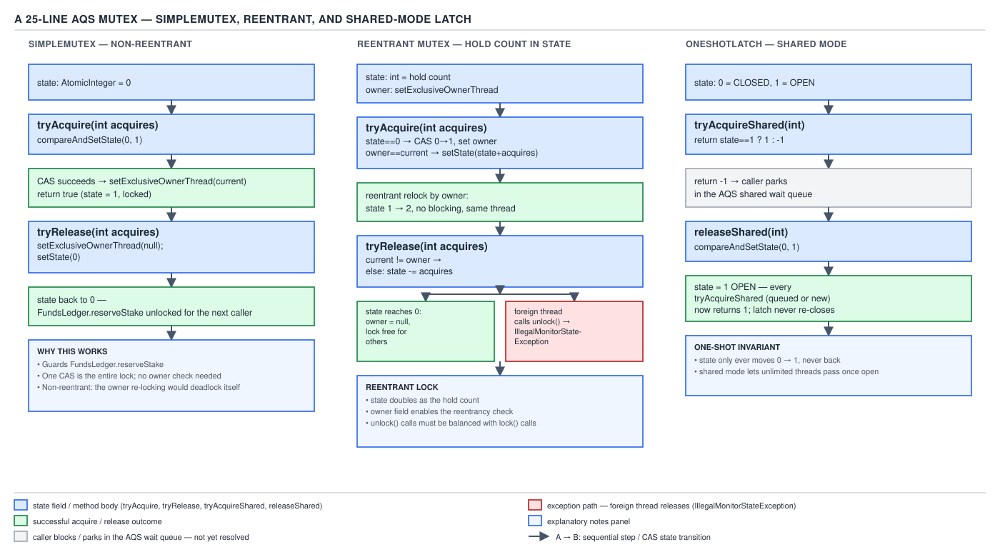

# 05 Multithreading and Concurrency — Latch and reentrant mutex on AQS — BUILD IT (§4.2, leaves 4.2.3–4.2.4)

**Target version: Java 21 LTS.** | **Part 4 of 5** | [Index](../00-index.md)
Previous: [Building on AQS: mutex and semaphore](02-building-on-aqs.md) · Next: [AQS fairness and conditions](02b-aqs-fairness-and-conditions.md)

The previous file built `SimpleMutex` (exclusive mode, a 0/1 flag in `state`) and
`CountingSemaphore` (shared mode, a permit count in `state`), both guarding
`FundsLedger.reserveStake`. This file finishes §4.2 with two more synchronizers on the same
critical section: a one-shot start gate for the 1,200 stake-reservations/sec load test, and the
reentrant mutex that closes `SimpleMutex`'s self-deadlock hole. The AQS facts already
established — `state` is `private volatile int`, mutated only via `getState`/`setState`/
`compareAndSetState`; the four hook methods (`tryAcquire`, `tryRelease`, `tryAcquireShared`,
`tryReleaseShared`) default to `UnsupportedOperationException`; the JDK 14 node-representation
rewrite [VERSION-TRAP] does not touch any of them — carry over unchanged and are not re-derived
here.

`OneShotLatch` is a one-way `state` flip with no tradeoff to weigh against a sibling, so it gets
the short treatment below rather than a full walk-through. The reentrant mutex is the one worth
slowing down for: it is what every production lock actually is, and it carries the ownership
gotcha that makes reentrancy worth building by hand once.

`OneShotLatch`: `state` starts at `0` (closed). `tryAcquireShared(int arg)` — called by every
thread that reaches `await()` — returns `1` if `state == 1` (open, proceed; a positive
shared-mode return also asks AQS to propagate the wake-up to the next queued waiter, which is
how one `open()` call cascades through the whole parked line) or `-1` if `state == 0` (park).
`tryReleaseShared`, called exactly once by whichever thread opens the gate, CASes `state` from
`0` to `1` and returns `true`, waking every thread currently parked in the queue in one pass.
**Gotcha:** `open()` is idempotent by construction — a second call's CAS observes `state == 1`
already and returns `false`, doing nothing — but nothing stops a caller from constructing a
*second* `OneShotLatch` per load-test run by mistake and opening the wrong instance; this class
has no name or registry beyond object identity, exactly like `CountDownLatch`.

```java
import java.util.concurrent.locks.AbstractQueuedSynchronizer;

/**
 * A one-shot latch: closed until opened once, then permanently open. Used as the start gate
 * for the 1,200 stake-reservations/sec load test — every settlement-ingest-N worker parks on
 * await() until the harness calls open(), then all workers proceed together.
 */
public final class OneShotLatch {

    private static final class Sync extends AbstractQueuedSynchronizer {
        Sync() {
            setState(0); // 0 = closed, 1 = open
        }

        @Override
        protected int tryAcquireShared(int ignoredArg) {
            return getState() == 1 ? 1 : -1;
        }

        @Override
        protected boolean tryReleaseShared(int ignoredArg) {
            for (;;) {
                if (getState() == 1) {
                    return false; // already open; nothing changed, no need to re-signal
                }
                if (compareAndSetState(0, 1)) {
                    return true; // opened; AQS wakes every parked waiter
                }
            }
        }
    }

    private final Sync sync = new Sync();

    public void await() throws InterruptedException {
        sync.acquireSharedInterruptibly(1);
    }

    public void open() {
        sync.releaseShared(1);
    }

    public boolean isOpen() {
        return sync.getState() == 1;
    }
}
```

> **Definition.** `OneShotLatch` is an AQS shared-mode synchronizer with a one-way `state`
> transition from `0` to `1`; every current and future `await()` call observes `1` and returns
> immediately, while the single `open()` call wakes every currently parked waiter at once.

**Diff vs the real one — `CountDownLatch`:**

| Axis | `OneShotLatch` | `CountDownLatch` |
|---|---|---|
| Count | Fixed at 1 (open/closed) | Arbitrary `int count`, decremented per `countDown()` |
| `getCount()` | `isOpen()` returns a boolean instead | Returns the live `long` count |
| Cancellation | None — `await()` only responds to interruption | Same — no cancellation beyond interruption, by design |
| Re-arming | Impossible, same as the real one | Impossible; `CyclicBarrier` is the reusable sibling |
| Why the JDK bothers | — | A general counter subsumes the single-flip case and covers "wait for N independent things," which this build deliberately does not need |

### 4.2.4 The reentrant AQS mutex

**Mental model.** Take `SimpleMutex` and stop asking "is the door free?" and start asking "how
many times has *this* thread already walked through without leaving?" — `state` changes from a
flag to a hold count, and the only new fact `tryAcquire` needs is *whose* thread already holds
it, which `getExclusiveOwnerThread()` (inherited from `AbstractOwnableSynchronizer`) already
tracks.

**Why it exists.** `SimpleMutex`'s gotcha from the previous file — self-deadlock on nested
`reserveStake` calls — is not hypothetical: a compliance check invoked from inside
`reserveStake` that also needs to touch ledger state, on the same thread, must not deadlock
against a lock that thread already holds. Every production lock in the JVM (`synchronized`,
`ReentrantLock`) is reentrant for exactly this reason — nested acquisition from the same thread
is common enough that a non-reentrant lock is a standing hazard.

**When to reach for it, and when not.** Always prefer this over `SimpleMutex` when the calling
code might legitimately re-enter — which, in practice, is almost always, since a private
helper method called both directly and from within an already-locked block is a completely
ordinary shape. The only reason not to pay for reentrancy is the same as not paying for a
`ReentrantLock` at all: on the uncontended fast path both cost one CAS, so the difference is
academic; reach for `SimpleMutex`-style non-reentrancy only when you specifically want nested
acquisition from the same thread to be a loud bug, not a silent no-op.

**How it works.** `tryAcquire` first checks `getState() == 0`; if so, it behaves exactly like
`SimpleMutex` (CAS `0 → 1`, then set the owner). If `state != 0`, it checks whether the current
thread *is* the owner (`getExclusiveOwnerThread() == Thread.currentThread()`); if so, it
increments `state` by `setState(getState() + 1)` — no CAS needed here, because only the owning
thread can be modifying `state` at this point (every other thread's `tryAcquire` will fail the
CAS-or-ownership check and park), which is itself a small proof that exclusive ownership
implies exclusive write access to `state`. `tryRelease` decrements the count and only clears
the owner and returns `true` (releasing the lock to AQS) once the count reaches `0`; if the
count is still positive, it returns `false`, and AQS does not attempt to wake anyone — the lock
is still held. A release from a thread that is not the owner throws
`IllegalMonitorStateException`, matching the same check `synchronized` performs at the bytecode
level (`monitorexit` on a monitor you don't own).

Refer back to [the diagram embedded in the previous file](02-building-on-aqs.md), same asset
`../diagrams/D-202-aqs-mutex-in-25-lines.svg`: the right panel — hold count in `state`, owner in
`setExclusiveOwnerThread`, and the `IllegalMonitorStateException` path on foreign release — is
this class. The third panel (`state` `0`/`1` as closed/open) is `OneShotLatch`, covered above.



```java
import java.util.concurrent.locks.AbstractQueuedSynchronizer;
import java.util.concurrent.locks.Lock;
import java.util.concurrent.TimeUnit;

/**
 * A reentrant exclusive-mode lock: state is a hold count, not a flag. The same thread may
 * call FundsLedger.reserveStake, and from inside it call a nested compliance check that also
 * locks the ledger, without deadlocking against itself.
 */
public final class ReentrantSimpleMutex implements Lock {

    private static final class Sync extends AbstractQueuedSynchronizer {
        @Override
        protected boolean tryAcquire(int ignoredArg) {
            Thread current = Thread.currentThread();
            int holds = getState();
            if (holds == 0) {
                if (compareAndSetState(0, 1)) {
                    setExclusiveOwnerThread(current);
                    return true;
                }
                return false;
            }
            if (getExclusiveOwnerThread() == current) {
                setState(holds + 1); // safe without CAS: only the owner thread reaches here
                return true;
            }
            return false;
        }

        @Override
        protected boolean tryRelease(int ignoredArg) {
            if (getExclusiveOwnerThread() != Thread.currentThread()) {
                throw new IllegalMonitorStateException(
                        "thread " + Thread.currentThread().getName() + " does not hold this lock");
            }
            int remaining = getState() - 1;
            boolean fullyReleased = remaining == 0;
            if (fullyReleased) {
                setExclusiveOwnerThread(null);
            }
            setState(remaining);
            return fullyReleased;
        }

        @Override
        protected boolean isHeldExclusively() {
            return getExclusiveOwnerThread() == Thread.currentThread();
        }

        int holdCount() {
            return isHeldExclusively() ? getState() : 0;
        }
    }

    private final Sync sync = new Sync();

    @Override
    public void lock() {
        sync.acquire(1);
    }

    @Override
    public void lockInterruptibly() throws InterruptedException {
        sync.acquireInterruptibly(1);
    }

    @Override
    public boolean tryLock() {
        return sync.tryAcquire(1);
    }

    @Override
    public boolean tryLock(long time, TimeUnit unit) throws InterruptedException {
        return sync.tryAcquireNanos(1, unit.toNanos(time));
    }

    @Override
    public void unlock() {
        sync.release(1);
    }

    @Override
    public java.util.concurrent.locks.Condition newCondition() {
        throw new UnsupportedOperationException("no Condition support in this build");
    }

    public int getHoldCount() {
        return sync.holdCount();
    }
}
```

**The gotcha.** `holdCount()`'s `isHeldExclusively()` check makes `getHoldCount()` return `0`
from any thread other than the owner, matching `ReentrantLock.getHoldCount()`'s documented
behavior — but it is easy to forget this when debugging and read `getHoldCount()` from a
monitoring thread expecting to see "how many times has *some* thread acquired this," when the
real answer is always thread-relative, never global.

**Pitfall:** assuming `setState(holds + 1)` inside `tryAcquire`'s reentrant branch is a data
race because it isn't a CAS. It is safe *only* because the branch is reached exclusively by the
thread already recorded in `setExclusiveOwnerThread` — every other thread's own `tryAcquire`
call fails the `holds == 0` CAS and the ownership check both, and is parked by AQS before it
can touch `state` at all. Removing the ownership check while keeping the plain `setState` write
would reintroduce exactly the race this comment rules out.

> **Definition.** A reentrant AQS mutex is an exclusive-mode synchronizer whose `state` is a
> per-owner hold count rather than a single bit, permitting the thread recorded in
> `setExclusiveOwnerThread` to re-acquire without blocking, and requiring the count to reach
> zero before another thread may acquire.

**Diff note (short — the full table lands in the next file):**

| Axis | This build | `ReentrantLock` |
|---|---|---|
| Overflow check | None — `state` can wrap past `Integer.MAX_VALUE` on ~2^31 nested acquires | Same in the real class; documented as a practical non-issue |
| Fairness | Unfair only | Fair/unfair `Sync` subclasses chosen at construction |
| `Condition` | Not implemented | Full `ConditionObject`, multiple per lock |
| Serialization | Not `Serializable` | `Serializable`, deserializes unlocked (`state = 0`) regardless of state at serialization time |

**Full diff vs `ReentrantLock`** (fairness internals, `Condition`, AQS node internals,
`hasQueuedPredecessors()`) is consolidated in the next file,
[AQS fairness and conditions](02b-aqs-fairness-and-conditions.md) — leaf 4.2.7.

## Pitfalls

### Assuming `SimpleMutex` is safe to reuse for a re-entered call path

**Wrong**

```java
SimpleMutex mutex = new SimpleMutex();

void reserveStake(Money stake) {
    mutex.lock();
    try {
        StakeSplit split = computeSplit(stake);
        runComplianceCheck(split); // also calls reserveStake-adjacent ledger reads under mutex.lock()
    } finally {
        mutex.unlock();
    }
}
```

The nested `mutex.lock()` inside `runComplianceCheck` CASes against a `state` that is already
`1`, fails, and the calling thread parks waiting for a release only it could perform — a
single-thread deadlock, invisible until the exact code path that re-enters actually runs.

**Right**

```java
ReentrantSimpleMutex mutex = new ReentrantSimpleMutex();

void reserveStake(Money stake) {
    mutex.lock();
    try {
        StakeSplit split = computeSplit(stake);
        runComplianceCheck(split); // safe: same thread, hold count goes to 2, then back to 1
    } finally {
        mutex.unlock();
    }
}
```

`tryAcquire`'s ownership branch lets the same thread increment the hold count instead of
CASing against an already-set bit; `tryRelease` only fully releases when the count reaches
zero, matching the balanced `lock()`/`unlock()` pairs.

**Why people believe it:** `SimpleMutex`'s API is identical to `ReentrantLock`'s (`lock()`,
`unlock()`, both implement `Lock`) — nothing in the type signature signals that reentrancy is
missing until the nested call path actually executes, often only under a rare production
sequence rather than in a unit test that never nests the call.

### Treating `open()` on a fresh `OneShotLatch` as always the correct instance

**Wrong**

```java
OneShotLatch startGate = new OneShotLatch();
// harness wiring gets refactored; a second gate is constructed by mistake for setup
OneShotLatch setupGate = new OneShotLatch();

void beginLoadTest() {
    setupGate.open(); // wrong instance — startGate is still closed
}
```

Every `settlement-ingest-N` worker thread parked on `startGate.await()` never wakes, because
`setupGate.open()` only flips `setupGate`'s own `state`; `OneShotLatch` has no name or registry
to catch the mismatch.

**Right**

```java
OneShotLatch startGate = new OneShotLatch();

void beginLoadTest() {
    startGate.open(); // same instance every worker awaits on
}
```

**Why people believe it:** a latch "feels" like a single global signal, so it is easy to assume
any latch construction downstream is interchangeable with the one workers are already parked
on — but each `new OneShotLatch()` is a fully independent `state` cell.

## Cheat sheet

| Synchronizer | Mode | `state` meaning | Acquire hook | Release hook | Owner tracking | JDK original |
|---|---|---|---|---|---|---|
| `OneShotLatch` | Shared | 0=closed/1=open, one-way | `tryAcquireShared` | `tryReleaseShared` | No | `CountDownLatch` |
| Reentrant mutex | Exclusive | Hold count | `tryAcquire` | `tryRelease` | Yes | `ReentrantLock` (full) |

- Reentrancy = check `getExclusiveOwnerThread() == Thread.currentThread()` before failing the CAS; increment the hold count with a plain `setState`, not a CAS — only the owner thread can reach that branch.
- Foreign release (thread that never acquired calling `unlock()`) → `IllegalMonitorStateException`, by convention, not by AQS enforcement — you must check for it yourself.
- `OneShotLatch.open()` is idempotent; a second call's CAS just fails harmlessly and returns `false`.
- `getHoldCount()` is thread-relative: `0` from any thread but the current owner.

## Self-test

**Q1.** A `settlement-ingest-N` thread holds the reentrant mutex with a hold count of `3`, then
a bug causes it to call `unlock()` four times. What happens on the fourth call, and why?

<details><summary>Answer</summary>

The third `unlock()` brings `state` to `0`, clears the owner via `setExclusiveOwnerThread(null)`,
and returns `true` (fully released) to AQS, which then wakes the next queued waiter — the lock
is now held by nobody, or by whichever thread AQS just granted it to. The fourth `unlock()`
call's `tryRelease` checks `getExclusiveOwnerThread() != Thread.currentThread()`; since the
owner is now `null` (or a different thread that just acquired it), the check is true, and
`IllegalMonitorStateException` is thrown — correctly, since the calling thread does not hold
the lock at that point.

</details>

**Q2.** The reentrant mutex's `tryAcquire` writes `setState(holds + 1)` without a CAS, while
`SimpleMutex`'s equivalent path always CASes. What specific invariant justifies dropping the CAS?

<details><summary>Answer</summary>

By the time the reentrant branch (`getExclusiveOwnerThread() == current`) is reached, the
calling thread is provably the sole thread that can be modifying `state`: every other thread's
`tryAcquire` call either fails the initial `holds == 0` CAS (if `holds != 0`, meaning someone
holds it) or fails the ownership check (since it isn't the owner) — either way, other threads
are parked by AQS before touching `state`. That leaves exactly one live writer to `state`
during any reentrant increment, so a CAS is unnecessary; a plain `setState` is not a race
because there is no concurrent writer to race against.

</details>

**Q3.** Why does `OneShotLatch.tryAcquireShared` return `1` rather than `0` when the gate is
open, given that both are non-negative and AQS treats any non-negative return as "acquired"?

<details><summary>Answer</summary>

Either non-negative value would let AQS treat the acquire as successful. `1` is chosen because a
positive shared-mode return additionally signals AQS to propagate the wake-up to the next
queued waiter — exactly the cascade needed so that one `open()` call wakes every parked
`settlement-ingest-N` worker in sequence, not just the head of the queue. Returning `0` would
still let the calling thread proceed but would not trigger that propagation, stalling the rest
of the parked line.

</details>

**Q4.** What would break if `OneShotLatch.tryReleaseShared` used `setState(1)` unconditionally
instead of the CAS loop shown, and would it matter for this class's actual use (a single load
test harness thread calling `open()` once)?

<details><summary>Answer</summary>

Nothing would break for the intended single-caller use — `state` only ever needs to end at `1`,
and a plain write achieves that as reliably as a successful CAS, since there is exactly one
writer. It would matter only if two threads raced to call `open()` concurrently: both plain
writes are harmless (both write `1`), but the CAS loop additionally provides the correct
`tryReleaseShared` return value in that race — the second caller's CAS observes `state == 1`
already and correctly returns `false` (nothing changed, no need to re-trigger AQS's wake
cascade), which the unconditional-write version cannot distinguish.

</details>

**Q5.** Why does the reentrant mutex need `isHeldExclusively()` to check
`getExclusiveOwnerThread() == Thread.currentThread()` rather than simply `getState() != 0`?

<details><summary>Answer</summary>

`getState() != 0` only tells you the lock is held by *someone* — it says nothing about which
thread. `isHeldExclusively()`'s contract (used by `Condition` support and by callers like
`getHoldCount()`) specifically means "does the *calling* thread hold it," which requires
comparing against the recorded owner. A thread parked waiting for the lock would see
`getState() != 0` as true even though it holds nothing.

</details>

**Q6.** Compare the gotcha in `SimpleMutex` (previous file) to the one in `OneShotLatch`. Both
involve a thread not getting the behavior it expects — what is the structural difference?

<details><summary>Answer</summary>

`SimpleMutex`'s gotcha is a same-thread reentrancy failure: a single thread deadlocks against
its own already-held lock because there is no ownership-aware re-entry path. `OneShotLatch`'s
gotcha is a wiring failure, not a concurrency one: any number of threads can safely `await()`
and any number of `open()` calls are safely idempotent — the risk is purely that the wrong
`OneShotLatch` *instance* gets opened, which no amount of correct AQS mechanics can catch,
since instance identity is outside what the synchronizer can reason about.

</details>

---

**Leaves covered:** 4.2.3–4.2.4 (2 leaves)
**Leaves deferred:** none
**Diagrams included:** D-202
**Target version:** Java 21 LTS
**Lines:** 420
