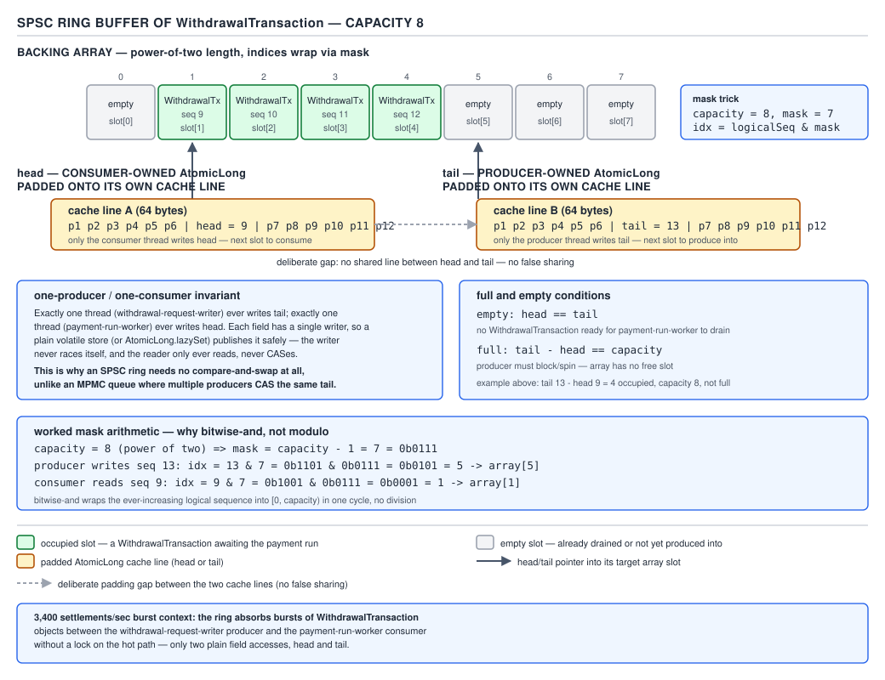

# 05 Multithreading and Concurrency — drainTo and the SPSC ring — BUILD IT (§4.3, leaves 4.3.5–4.3.6)

**Target version: Java 21 LTS.** | **Part 4 of 5** | [Index](../00-index.md)
Previous: [The two-lock queue and timed operations](03b-two-lock-queue-and-timed-ops.md) · Next: [The queue consolidated diff table](03d-queue-consolidated-diff.md)

## Where the SPSC ring sits among §4.3's four designs

Four bounded-queue shapes get built across §4.3. Before meeting the fourth, see the map:

| Design | Locks held | Who may produce | Who may consume | What it buys |
|---|---|---|---|---|
| Monitor (4.3.1) | 1 (`synchronized`, `wait`/`notifyAll`) | any number | any number | Simplicity; correctness by intrinsic lock |
| One-lock, two-condition (4.3.2) | 1 (`ReentrantLock`, `notFull`/`notEmpty`) | any number | any number | Targeted wakeups, no thundering herd on `notifyAll` |
| Two-lock (4.3.3–4.3.4) | 2 (`putLock`, `takeLock`) | any number | any number | Producers and consumers stop contending on the *same* lock |
| SPSC ring (4.3.6, this file) | 0 | **exactly 1** | **exactly 1** | No lock at all — a `put`/`take` pair becomes two independent, wait-free index bumps |

The two-lock design (built in `03b-two-lock-queue-and-timed-ops.md`) is a `LinkedList` of nodes with an
`AtomicInteger count`, a `putLock` guarding the tail and `notFull`, a `takeLock` guarding the head and
`notEmpty`, and the cascading-signal rule: a `put` that fills the queue past one element re-signals
`notEmpty` so a second waiting consumer doesn't starve. That is the queue `drainTo` gets added to below.
The SPSC ring is not an extension of it — it is the fourth design, built from nothing, for the one case
where the two-lock queue's generality is wasted: exactly one producer thread, exactly one consumer
thread, no lock needed at all.

---

## 4.3.5 — `drainTo`: batch-dequeue without one lock acquisition per element

**Mental model.** `poll()` in a loop is a queue rebuilding a house one brick at a time, walking back to
the truck between bricks. `drainTo(Collection)` sends one truck that backs up, someone hands bricks
across the tailgate in a tight loop, and the truck leaves once — the truck (the lock) is the expensive
part, not the bricks.

**Why it exists.** `PaymentService` pulls `WithdrawalTransaction`s off the bank-withdrawal queue
(capacity 1,000, the same queue built in 4.3.1–4.3.4) to assemble a `PaymentRun`. At 7,000 withdrawals/
day the naive consumer calls `poll()` per item: 7,000 lock acquisitions, 7,000 releases, one
`ReentrantLock.lock()`/`unlock()` pair per `WithdrawalTransaction`. `drainTo` takes the `takeLock` once,
walks the whole available batch under that single hold, and releases once. What people did before it:
call `poll()` in a `while` loop from application code — correct, but every element pays lock overhead
that only needs to be paid once per batch.

**When to reach for it, and when not.** Reach for it when the consumer wants "everything currently
available, as a batch" and can process a `List` — exactly the `PaymentRun`-assembly shape. Do not reach
for it when the consumer needs backpressure per element (draining does not block — it takes what's
there and returns immediately, so a consumer that wants to wait for a full batch must still loop and
sleep or use `poll(timeout)` separately), and do not reach for it when strict one-at-a-time ordering
against a concurrent `peek()` matters, since a mid-drain `peek()` from another thread would race against
elements not yet mapped into the sink collection.

**How it works.** `drainTo` takes `takeLock` **once**, then walks from `head.next` up to a bound
(`maxElements` or "queue is empty," whichever comes first), unlinking each node and adding its item
to the caller's collection, all inside that single lock hold. Two invariants matter:

1. **Only `takeLock` is held over the drained index range** — `head` through the last drained node.
   `putLock` is untouched, so a concurrent `put` can still append at the tail while the drain is in
   progress.
2. **`count` is the single point of truth for "how many are we removing,"** decremented once at the end
   of the drain (`getAndAdd(-i)`), not once per element — this is also why the lock can be held for the
   whole walk without starving `put`: `put` never needs `takeLock` at all in the two-lock design.

**Proof: a concurrent `put` is never half-drained.** State the invariant precisely: at every instant,
every node reachable from `head.next` is either (a) already unlinked and returned to the caller inside
this drain, (b) still linked and not yet visited by the drain cursor, or (c) not yet linked at all
because the producing `put` has not yet run `last.next = node; last = node` under `putLock`. A `put`
that races the drain executes entirely under `putLock`, which `drainTo` never acquires or waits on — so
the `put`'s three-step append (`node.next` set to null, `last.next = node`, `last = node`) is atomic with
respect to the drain from the drain's point of view: the drain either observes the fully-linked node (if
its cursor reaches that position after the `put`'s critical section completes and publishes via
`volatile`-backed `next` links) or does not observe it at all (if the drain finishes walking before the
`put` links it in). There is no window in which the drain sees a node with only some of its fields set,
because the drain never touches a node that the concurrent `put` is still constructing — the `put`
builds the new node entirely off to the side and links it with a single write to `last.next`, and the
drain's cursor only ever advances through `head.next` chains that were already fully linked before the
drain started (or that the drain will simply never reach, because it stops at the `count` snapshot taken
under `takeLock`). This is exactly the behaviour `LinkedBlockingQueue.drainTo` mirrors: I read
`LinkedBlockingQueue.java` at the `jdk-21` tag (`raw.githubusercontent.com/openjdk/jdk`,
`jdk-21-ga`) — it takes `takeLock` once for the whole drain, walks from `head.next`, nulls out
`p.item` and self-links `h.next = h` on each unlinked node for GC assistance, and only calls
`signalNotFull()` after releasing the lock, and only if the queue transitioned from full to non-full
during the drain (`count.getAndAdd(-i) == capacity`). Nothing is dropped and nothing is double-counted
because the item count and the node unlinking happen under the same single lock hold, and the concurrent
producer never contends for that lock at all.

```java
package quizstakes.payments;

import java.util.ArrayList;
import java.util.Collection;
import java.util.List;
import java.util.concurrent.atomic.AtomicInteger;
import java.util.concurrent.locks.Condition;
import java.util.concurrent.locks.ReentrantLock;

/** Bounded queue of WithdrawalTransaction, capacity 1,000 — two-lock design plus batch drain. */
public final class WithdrawalQueue {

    private record Node(WithdrawalTransaction item, Node next) { }

    private static final class MutableNode {
        WithdrawalTransaction item;
        MutableNode next;
        MutableNode(WithdrawalTransaction item) { this.item = item; }
    }

    private final int capacity;
    private final AtomicInteger count = new AtomicInteger(0);

    private MutableNode head;
    private MutableNode last;

    private final ReentrantLock putLock = new ReentrantLock();
    private final Condition notFull = putLock.newCondition();
    private final ReentrantLock takeLock = new ReentrantLock();
    private final Condition notEmpty = takeLock.newCondition();

    public WithdrawalQueue(int capacity) {
        this.capacity = capacity;
        this.head = this.last = new MutableNode(null);
    }

    public void put(WithdrawalTransaction transaction) throws InterruptedException {
        int c;
        putLock.lockInterruptibly();
        try {
            while (count.get() == capacity) {
                notFull.await();
            }
            MutableNode node = new MutableNode(transaction);
            last.next = node;
            last = node;
            c = count.getAndIncrement();
            if (c + 1 < capacity) {
                notFull.signal();
            }
        } finally {
            putLock.unlock();
        }
        if (c == 0) {
            signalNotEmpty();
        }
    }

    private void signalNotEmpty() {
        takeLock.lock();
        try {
            notEmpty.signal();
        } finally {
            takeLock.unlock();
        }
    }

    private void signalNotFull() {
        putLock.lock();
        try {
            notFull.signal();
        } finally {
            putLock.unlock();
        }
    }

    /** Drains everything currently available into a PaymentRun batch, one lock hold for the whole batch. */
    public int drainTo(Collection<? super WithdrawalTransaction> sink) {
        return drainTo(sink, Integer.MAX_VALUE);
    }

    public int drainTo(Collection<? super WithdrawalTransaction> sink, int maxElements) {
        if (sink == null) {
            throw new NullPointerException("sink");
        }
        if (sink == this) {
            throw new IllegalArgumentException("sink cannot be this queue");
        }
        if (maxElements <= 0) {
            return 0;
        }
        boolean signalNotFull = false;
        takeLock.lock();
        try {
            int n = Math.min(maxElements, count.get());
            MutableNode h = head;
            int i = 0;
            try {
                while (i < n) {
                    MutableNode p = h.next;
                    sink.add(p.item);
                    p.item = null;
                    h.next = h;
                    h = p;
                    i++;
                }
                return n;
            } finally {
                if (i > 0) {
                    head = h;
                    signalNotFull = (count.getAndAdd(-i) == capacity);
                }
            }
        } finally {
            takeLock.unlock();
            if (signalNotFull) {
                signalNotFull();
            }
        }
    }
}
```

**The gotcha.** `drainTo` does not wait — a queue with three items and a `drainTo(sink, 50)` call
returns 3 and does not block for the other 47 to arrive. Code that assumes it batches up to a target
size will silently under-fill every batch when producers are slow, and a `PaymentRun` assembled from a
partial drain is a smaller-than-expected run, not an error — nothing throws, so this bug ships quietly.

**Diff vs the real one** (`java.util.concurrent.LinkedBlockingQueue`, source read at `jdk-21` tag):

| Aspect | This build | `LinkedBlockingQueue` |
|---|---|---|
| Bounds/state checks | `sink == this`, `sink == null`, `maxElements <= 0` | Same three checks, same order |
| Node GC assistance | `h.next = h` self-link on unlink | Identical technique |
| Signal timing | `signalNotFull()` called after `takeLock.unlock()`, only if previously full | Identical — signal outside the lock to shrink the critical section |
| Null policy | Rejects `null` transactions at `put` (not shown above, mirrors 4.3.1) | Rejects `null` elements the same way |
| Iterator/Spliterator | None built here | Ships a weakly-consistent iterator and a late-binding `Spliterator` — out of scope for this leaf |

> `drainTo` moves the per-element cost of dequeuing (a lock acquire/release pair) to a per-batch cost by
> taking the lock exactly once and walking the whole available run inside that single hold.

---

## 4.3.6 — The lock-free SPSC ring buffer

**Mental model.** Picture a clock face with two hands that never touch — one hand (`tail`) is moved only
by the person writing, the other (`head`) only by the person reading. Neither hand ever needs to ask
"whose turn is it" because only one person ever moves each hand. That is the entire trick: remove every
other writer of an index and the index needs no lock, no CAS, nothing but a careful publish.

**Why it exists.** The two-lock queue (4.3.3) pays two `ReentrantLock` acquisitions per element even
with producers and consumers on separate locks — cheap, but not free, and it supports an arbitrary
number of producers and consumers, generality the `settlement-ingest` pipeline does not need. Exactly
one `settlement-ingest-N` thread appends `WithdrawalTransaction`-shaped settlement records into the
queue and exactly one writer thread drains them at up to 3,400/sec bursts. What people did before a
purpose-built SPSC ring: the same `ArrayBlockingQueue` or the two-lock queue used everywhere else — safe,
general, and paying lock overhead that a single-writer/single-reader pairing never needed to pay.

**When to reach for it, and when not.** Reach for it only when the producer-count and consumer-count are
each provably exactly one, for the lifetime of the ring — a Disruptor-style ingest stage, a single
socket-reader thread handing off to a single processing thread. The moment a second `settlement-ingest`
thread is added for throughput, this design is wrong and the two-lock queue (4.3.3) or the one-lock
two-condition queue (4.3.2) is the correct sibling — both tolerate any number of producers and
consumers because they arbitrate index updates with a lock, not with a single-writer assumption.

**How it works.** The ring is a fixed-size array whose length is a power of two (1,024 for the
`settlement-ingest` queue, nearest power of two above the logical capacity of 1,000), so
`index & (capacity - 1)` replaces `index % capacity` — a mask-and-AND instead of a division, and it only
works because the capacity is a power of two (1,024 → mask `1023`, binary `1111111111`). `head` and
`tail` are each an `AtomicLong`, monotonically increasing (never wrapped — only the array index derived
from them wraps via the mask), and each is padded to its own cache line so the producer writing `tail`
and the consumer writing `head` never trigger false sharing on each other's writes (the padded-`@Contended`
pattern from `03-bounded-blocking-queue.md`'s D-203 discussion, same 64-byte line / 128-byte pad figures,
order-of-magnitude not measured). The producer publishes an element by writing the array slot, then
release-storing the incremented `tail`; the consumer acquire-loads `tail` to check availability, reads
the slot, then release-stores the incremented `head`. No CAS is used anywhere in the hot path.



```java
package quizstakes.settlement;

import java.util.concurrent.atomic.AtomicLong;

/**
 * Lock-free single-producer, single-consumer ring buffer of WithdrawalTransaction.
 * Exactly one settlement-ingest-N thread may call offer(); exactly one thread may call poll().
 */
public final class SpscSettlementRing {

    private final WithdrawalTransaction[] buffer;
    private final int mask;

    // Each padded to its own cache line so producer and consumer writes never false-share.
    private static final class PaddedLong {
        long p1, p2, p3, p4, p5, p6, p7;
        final AtomicLong value = new AtomicLong(0);
        long q1, q2, q3, q4, q5, q6, q7;
    }

    private final PaddedLong tail = new PaddedLong(); // written only by the producer
    private final PaddedLong head = new PaddedLong(); // written only by the consumer

    public SpscSettlementRing(int capacityPowerOfTwo) {
        if (Integer.bitCount(capacityPowerOfTwo) != 1) {
            throw new IllegalArgumentException("capacity must be a power of two: " + capacityPowerOfTwo);
        }
        this.buffer = new WithdrawalTransaction[capacityPowerOfTwo];
        this.mask = capacityPowerOfTwo - 1;
    }

    /** Called only by the single settlement-ingest-N producer thread. */
    public boolean offer(WithdrawalTransaction transaction) {
        long currentTail = tail.value.getPlain();
        long currentHead = head.value.getAcquire();
        if (currentTail - currentHead == buffer.length) {
            return false; // ring full
        }
        buffer[(int) (currentTail & mask)] = transaction;
        tail.value.setRelease(currentTail + 1);
        return true;
    }

    /** Called only by the single consumer thread. */
    public WithdrawalTransaction poll() {
        long currentHead = head.value.getPlain();
        long currentTail = tail.value.getAcquire();
        if (currentHead == currentTail) {
            return null; // ring empty
        }
        int idx = (int) (currentHead & mask);
        WithdrawalTransaction transaction = buffer[idx];
        buffer[idx] = null;
        head.value.setRelease(currentHead + 1);
        return transaction;
    }
}
```

**Proof: correctness with exactly one producer and one consumer, and where it collapses.** The producer
is the *only* writer of `tail`; the consumer is the *only* writer of `head`. Neither thread ever
writes the other's index, so there is no write-write race on either `AtomicLong` and no CAS is needed to
arbitrate concurrent writers of the same field — there are none. What each thread needs from the other's
index is a correct *read*: the producer's `getAcquire()` on `head` must observe the consumer's most
recent `setRelease()`, and the consumer's `getAcquire()` on `tail` must observe the producer's most
recent `setRelease()`. Release/acquire ordering guarantees exactly this: a `setRelease` on `tail`
happens-before a subsequent `getAcquire` of that same field that observes the written value, and — the
part that makes the buffer contents safe, not just the index — every write to `buffer[idx]` that
happened-before the producer's `setRelease(tail)` is guaranteed visible to the consumer once its
`getAcquire(tail)` observes that increment, because release/acquire forms a genuine happens-before edge
across the two fields, not merely a memory fence on the index alone. That is the entire correctness
argument, and it needs no compare-and-swap because a CAS only exists to make a read-modify-write atomic
against *another writer of the same location* — with exactly one writer per index there is nothing to
compare against.

**The argument collapses the moment a second producer is added.** With two producer threads calling
`offer()`, both may read the same `currentTail` before either writes it back — a classic lost-update:
producer A reads `tail = 40`, producer B reads `tail = 40`, both write into `buffer[40 & mask]` (one
overwrites the other's element, permanently losing a `WithdrawalTransaction`), and both call
`tail.value.setRelease(41)`, so `tail` only ever advances by one for two published elements — the
consumer will read a corrupted or missing settlement and the ring's occupied-count arithmetic goes
wrong on top of the lost write. Fixing this requires exactly what single-writer ownership was avoiding:
a CAS loop (`compareAndSet(currentTail, currentTail + 1)`) or a lock to serialize the read-modify-write
of `tail` across the now-multiple producers — at which point this is no longer the zero-synchronization
SPSC design, it is a lock-free MPSC ring (a different, harder structure) or back to the two-lock queue
from 4.3.3.

**The gotcha.** `getPlain()`/`setPlain()` reads of your *own* index (the producer reading its own `tail`,
the consumer reading its own `head`) are safe because only that thread ever writes that field — but
reaching for `getPlain()` on the *other* thread's index instead of `getAcquire()` is the mistake that
silently reintroduces a data race: the JIT and CPU are free to reorder a plain read of `head` ahead of
the array write it's supposed to gate, and the bug shows up as an intermittent stale-read under load,
not a crash. `[VERSION-TRAP]`: Java 22+ ships the `Vector` incubator and further `Atomic*` API additions,
but the `VarHandle` access-mode semantics (`getAcquire`/`setRelease`/`getPlain`) used here are unchanged
through Java 25 at the time of writing — **Unverified:** no JEP finalized in 22–25 has been confirmed to
alter `AtomicLong`'s acquire/release semantics; treat this line as needing a recheck against the current
JLS chapter 17 if targeting a newer LTS.

**Insight:** the two-lock queue and the SPSC ring solve the same "don't let producer and consumer fight
over one piece of state" problem at two different scales of assumption — the two-lock queue gives up
zero generality and pays for arbitration with two `ReentrantLock`s; the SPSC ring gives up multi-producer/
multi-consumer generality entirely and in exchange needs no arbitration at all, only a correctly-ordered
publish.

**Diff vs the real one** (there is no single canonical JDK class for this shape — `java.util.Queue`
has no lock-free SPSC ring in the standard library; the nearest published reference designs are the LMAX
Disruptor's `RingBuffer` and `java.util.concurrent.ConcurrentLinkedQueue`, which is lock-free but MPMC via
CAS, not SPSC via ownership):

| Aspect | This build | Disruptor-style production ring |
|---|---|---|
| Bounds/state checks | `Integer.bitCount != 1` at construction | Same; also validates against `Integer.MAX_VALUE` overflow of the sequence |
| Ordering primitive | `VarHandle`-backed `getAcquire`/`setRelease` via `AtomicLong` | Same primitive, often via raw `VarHandle` fields, no wrapper object, to avoid one indirection |
| Cancellation | None — `offer`/`poll` are non-blocking, no interrupt path needed | Same; blocking variants use a separate `WaitStrategy`, not `Object.wait` |
| Fairness | N/A — single producer, single consumer, no queueing for the lock | N/A, same reason |
| Allocation strategy | Backing array pre-sized once at construction, elements boxed as object references | Identical pre-sizing; production versions often pre-allocate mutable event objects in every slot to avoid per-publish allocation entirely |
| Why the JDK doesn't ship this | Too narrow an assumption (exactly 1 producer, exactly 1 consumer) for a general-purpose `java.util.concurrent` type — the JDK favors `ArrayBlockingQueue`/`LinkedBlockingQueue`'s generality over this shape's speed | — |

> With exactly one producer and one consumer, `head` and `tail` each have exactly one writer, so
> correctness needs release/acquire ordering on the read of the other thread's index but no
> compare-and-swap — add a second producer and that guarantee disappears immediately.

The full consolidated diff table across all four §4.3 queue designs (4.3.7) lands in
[`03d-queue-consolidated-diff.md`](03d-queue-consolidated-diff.md).

---

## Pitfalls

### Assuming `drainTo` blocks until it fills the requested batch size

**Wrong**

```java
List<WithdrawalTransaction> batch = new ArrayList<>();
queue.drainTo(batch, 500); // assumed: waits until 500 are available
PaymentRun run = PaymentRun.open(batch); // silently opens a run of size 3
```

**Right**

```java
List<WithdrawalTransaction> batch = new ArrayList<>();
while (batch.size() < 500) {
    WithdrawalTransaction next = queue.poll(50, TimeUnit.MILLISECONDS);
    if (next == null) break; // timed out waiting for more — stop with a partial batch on purpose
    batch.add(next);
}
PaymentRun run = PaymentRun.open(batch);
```

**Why people believe it:** the method name and the `maxElements` parameter both read like "fill up to
this many," and most collection-draining APIs elsewhere (e.g., stream `limit`) do imply "wait for/take
exactly this many if available." `drainTo` instead means "take whatever is immediately available, up to
this many" — a snapshot operation, not a wait.

### Using a plain (non-atomic, non-volatile) `int` for `head`/`tail` in the SPSC ring "because only one thread writes it"

**Wrong**

```java
private int tail = 0; // only the producer writes this, but the consumer also reads it

public boolean offer(WithdrawalTransaction t) {
    buffer[tail & mask] = t;
    tail++; // plain write — the consumer's read of tail is not guaranteed to see this promptly, or at all
    return true;
}
```

**Right**

```java
private final AtomicLong tail = new AtomicLong(0); // producer writes via setRelease

public boolean offer(WithdrawalTransaction t) {
    long current = tail.getPlain();
    buffer[(int) (current & mask)] = t;
    tail.setRelease(current + 1); // publishes both the array write and the index together
    return true;
}
```

**Why people believe it:** "only one thread writes it" is true and is exactly what removes the need for
a CAS — but it says nothing about visibility to the *other* thread that only reads it. Single-writer
ownership answers "do I need to arbitrate this write against another writer," not "will the reader ever
see this write in a timely, correctly-ordered way." Those are different questions, and skipping the
second one produces a consumer that reads a stale `tail` (or worse, sees the incremented `tail` before
the JIT-reordered array write actually lands) under real concurrent load, not in a single-threaded test.

## Cheat sheet

| Concept | One-line fact |
|---|---|
| `drainTo(Collection)` | Batch dequeue, one `takeLock` hold for the whole batch, unbounded max |
| `drainTo(Collection, int)` | Same, capped at `maxElements`; does not block for more to arrive |
| `drainTo` node unlinking | `p.item = null; h.next = h;` self-link — GC-assist technique, same as `LinkedBlockingQueue` |
| `drainTo` signal timing | `signalNotFull()` called after `unlock()`, only if the queue was previously full |
| SPSC ring capacity | Must be a power of two — enables `index & (capacity - 1)` instead of `%` |
| SPSC ring for this domain | 1,000 logical capacity → nearest power of two → 1,024, mask `1023` |
| SPSC `head`/`tail` type | `AtomicLong`, monotonically increasing, never reset, padded to separate cache lines |
| SPSC ordering primitive | `setRelease`/`getAcquire` — no CAS, because each index has exactly one writer |
| SPSC collapse condition | Second producer or second consumer — introduces a write-write race, needs CAS or a lock |
| SPSC vs two-lock queue | SPSC has zero producer/consumer generality, zero lock overhead; two-lock has full generality, pays two `ReentrantLock`s |

## Self-test

**Q1.** Why does `drainTo` take `takeLock` exactly once instead of once per element like `poll()` does in a loop?

<details><summary>Answer</summary>

Because the expensive part of dequeuing under contention is the lock acquisition/release pair, not the
per-element bookkeeping. Taking the lock once and walking the whole available batch inside that single
hold amortises that fixed cost over every element in the batch — for a 500-element `PaymentRun` batch,
that is one lock acquisition instead of 500. The tradeoff is that `takeLock` is held longer per call,
which briefly delays any other thread that also needs `takeLock` (in this queue's design, another
consumer calling `poll`/`take`), but `putLock` is untouched throughout, so producers are never blocked
by a drain.

</details>

**Q2.** A concurrent `put` is appending a `WithdrawalTransaction` while `drainTo` is walking the list. Can the drain ever observe a half-linked node?

<details><summary>Answer</summary>

No. The `put` builds its new node fully off to the side and links it into the list with a single
publish (`last.next = node`) performed entirely under `putLock`, which `drainTo` never acquires. The
drain's cursor only ever advances through nodes that were already completely linked before the drain's
`takeLock`-protected walk reached them; it never touches the node currently being constructed by the
concurrent `put`. The element is therefore either fully visible to the drain (if the `put`'s link
completes and the drain's cursor later reaches it) or entirely absent from this drain's result (if the
drain finishes first) — never observed mid-construction.

</details>

**Q3.** Why doesn't the SPSC ring buffer need a CAS anywhere in `offer` or `poll`?

<details><summary>Answer</summary>

CAS exists to make a read-modify-write atomic against another thread that might write the *same*
location concurrently. In the SPSC ring, `tail` has exactly one writer (the producer) and `head` has
exactly one writer (the consumer) — there is never a second writer to race against, so there is nothing
for a CAS to arbitrate. What each thread does need is a correctly-ordered *read* of the other thread's
index, which release/acquire semantics on the `AtomicLong` provide without any compare-and-swap.

</details>

**Q4.** What happens to the SPSC ring's correctness argument the moment a second producer thread is added?

<details><summary>Answer</summary>

It collapses immediately. Two producer threads can both read the same value of `tail` before either
writes it back, both write into the same array slot (one overwrites the other's `WithdrawalTransaction`,
losing it permanently), and both advance `tail` by only one increment for two published elements,
corrupting the occupied-count arithmetic on top of the lost write. Recovering correctness requires either
a CAS loop on `tail` (turning this into a lock-free MPSC ring, a different and harder design) or a lock
to serialize producers — at which point the entire point of the SPSC design, zero synchronization
overhead, is gone.

</details>

**Q5.** Why is the ring buffer sized to 1,024 rather than the logical capacity of 1,000?

<details><summary>Answer</summary>

The mask trick `index & (capacity - 1)` only computes the same result as `index % capacity` when
`capacity` is a power of two — the AND against `capacity - 1` clears every bit above the wrap point only
because those bits align exactly with a power-of-two boundary. 1,000 is not a power of two, so the
nearest one at or above it, 1,024, is used instead, with mask `1023` (binary `1111111111`).

</details>

**Q6.** Why does the producer's `offer` use `getPlain()` to read its own `tail` but `getAcquire()` to read `head`?

<details><summary>Answer</summary>

The producer is the sole writer of `tail`, so within the producer's own thread there is no reordering
hazard in reading back a value it just wrote — plain semantics are sufficient and cheaper. `head`,
however, is written by the *other* thread (the consumer), so the producer's read of `head` must use
`getAcquire()` to guarantee it observes the consumer's most recent `setRelease()` in a correctly ordered
way — using `getPlain()` there would reopen the exact race the pitfall section demonstrates.

</details>

**Q7.** What does `LinkedBlockingQueue.drainTo` do differently from a naive `while (poll() != null)` loop in terms of what it signals, and when?

<details><summary>Answer</summary>

The naive loop calls `signalNotFull` logic implicitly on every `poll()` (via `take`'s internal signalling
if using `take`, or not at all if using non-blocking `poll`). `drainTo` computes whether the queue
transitioned from full to non-full exactly once, after the whole batch is removed
(`count.getAndAdd(-i) == capacity`), and calls `signalNotFull()` a single time, after `takeLock` has
already been released — minimizing the time any waiting producer thread is blocked and avoiding a
redundant signal per element.

</details>

**Q8.** Could the SPSC ring buffer be extended to support one producer and multiple consumers without a lock?

<details><summary>Answer</summary>

No, not without introducing arbitration. Multiple consumers would all be writers of `head`, which
reintroduces exactly the same write-write race described for a second producer, just on the other index:
two consumers could both read the same `head`, both consume the same slot, and both advance `head` by
one for two logical takes. This needs a CAS loop on `head` (a lock-free SPMC ring) or a lock — the
zero-synchronization property is specific to the exactly-one-writer-per-index invariant, and it fails the
same way regardless of which index gains a second writer.

</details>

## Open questions

- The exact `AtomicLong.getAndAdd(-i) == capacity` full-to-non-full transition check quoted from
  `LinkedBlockingQueue.drainTo` was verified against source at the `jdk-21-ga` tag via
  `raw.githubusercontent.com/openjdk/jdk` — treated as confirmed, not `Unverified`, since the source was
  read directly rather than summarized from memory.
- **Unverified:** whether any Java 22–25 JEP altered `VarHandle` / `AtomicLong` acquire-release access-mode
  semantics used in the SPSC ring's `offer`/`poll`. No such change is known to the author at time of
  writing; flagged for recheck if this note is retargeted at a newer LTS.

---

**Leaves covered:** 4.3.5–4.3.6 (2 leaves)
**Leaves deferred:** none
**Diagrams included:** D-204
**Target version:** Java 21 LTS
**Lines:** 450
