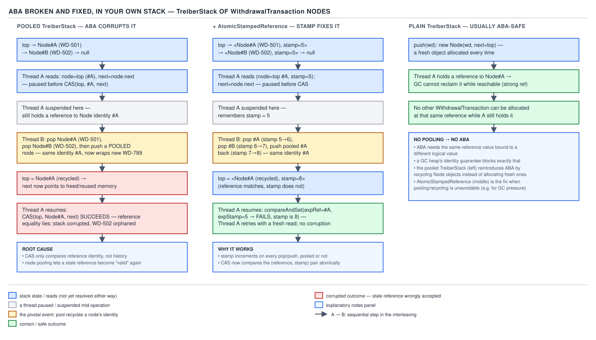

# 05 Multithreading and Concurrency — The Treiber stack and ABA — BUILD IT (§4.4, leaves 4.4.1–4.4.2)

**Target version: Java 21 LTS.** | **Part 4 of 5** | [Index](../00-index.md)
Previous: [The queue consolidated diff table](03d-queue-consolidated-diff.md) · Next: [Why plain Java is usually ABA-safe](04b-why-java-is-aba-safe.md)

## The lock-free family §4.4 builds

Five structures, one technique underneath all of them — a CAS retry loop instead of a lock. This
file builds the first and simplest.

| Structure | CAS target | Progress guarantee | ABA reachable? | Miniature of |
|---|---|---|---|---|
| **Treiber stack** (this file) | `AtomicReference<Node>` top pointer | lock-free | yes, with node pooling | `ConcurrentLinkedDeque`'s push/pop path |
| Michael–Scott queue | head **and** tail pointers, two CASes | lock-free | yes, with node pooling | `ConcurrentLinkedQueue` |
| Mini `Striped64` | an array of padded cells, one CAS per contended increment | lock-free | no (monotone-ish counters) | `LongAdder` / `DoubleAdder` |
| Copy-on-write list | `AtomicReference<Object[]>` whole-array swap | lock-free | no (whole array replaced, never recycled) | `CopyOnWriteArrayList` |
| Mini `ConcurrentHashMap` | per-bin CAS on first insert, `synchronized` on collision | lock-free (fast path) / blocking (collision path) | no | `ConcurrentHashMap` |

The Treiber stack is the smallest possible lock-free structure — one pointer, one CAS per
operation — which is exactly why it is the standard vehicle for demonstrating ABA: there is no
other machinery to distract from the single defect.

## 4.4.1 `TreiberStack<E>`

### Mental model

Picture a single nail sticking out of a wall — `top` — with a chain of linked charms hanging off
it, each charm pointing to the one below. Adding a charm means: note which charm is currently on
the nail, make your new charm point at it, then try to hang your charm on the nail in one motion —
but only if the nail still holds the charm you noted a moment ago. If someone else got there first,
you look again and retry. Nobody ever touches the nail with a lock; everybody just keeps trying
until their one atomic swap wins.

### Why it exists

A synchronized stack — `push`/`pop` guarded by a single lock — is simple and correct, but every
thread serializes through that lock even when operations never actually conflict on data, only on
timing. Doug Lea's `java.util.concurrent` package (JDK 5) needed non-blocking building blocks that
do not suffer priority inversion or lock-convoy pileups under contention; R. Kent Treiber described
this exact stack in a 1986 IBM technical report, and it became the textbook first example of a
lock-free data structure because a stack's single entry point (the top) needs only one
`compareAndSet`.

### When to reach for it, and when not

Reach for a Treiber-style CAS stack when you need LIFO semantics, contention is real, and the
per-operation cost of a `synchronized` block is measurable against your throughput target — a free
list of reusable objects, a work-stealing deque's local end, a pool of idle connections pushed back
by whichever thread finishes first. Do not reach for it when you need FIFO order (a queue needs the
two-pointer Michael–Scott technique, §4.4's next-but-one leaf), when contention is low enough that
`synchronized` never shows up in a profile, or when you need bounded capacity or blocking semantics
under emptiness — `ArrayBlockingQueue` and `LinkedBlockingDeque` already give you a park/unpark
handoff that a bare CAS loop does not.

### How it works

`top` is an `AtomicReference<Node<E>>`. `push` builds a new node whose `next` already points at the
node it read as `top`, then CASes `top` from the observed value to the new node; on failure it
re-reads `top` and retries with the same node (only `next` is rewired) until the CAS lands. `pop`
reads `top`, remembers its `next`, and CASes `top` down to that `next`; on failure it retries. Every
operation touches exactly one `AtomicReference` and loops until its own CAS wins — no other thread's
success blocks it, only makes it retry, which is the definition of lock-free (**the system always
makes progress**; an individual thread can in theory retry indefinitely under pathological
scheduling, so this is lock-free, not wait-free).

```java
import java.util.NoSuchElementException;
import java.util.concurrent.atomic.AtomicReference;

/** A lock-free LIFO stack of pending withdrawal transactions awaiting a payment run. */
public final class TreiberStack<E> {

    private static final class Node<E> {
        final E item;
        Node<E> next;
        Node(E item) { this.item = item; }
    }

    private final AtomicReference<Node<E>> top = new AtomicReference<>();

    public void push(E item) {
        Node<E> newNode = new Node<>(item);
        Node<E> currentTop;
        do {
            currentTop = top.get();
            newNode.next = currentTop;
        } while (!top.compareAndSet(currentTop, newNode));
    }

    public E pop() {
        Node<E> currentTop;
        Node<E> next;
        do {
            currentTop = top.get();
            if (currentTop == null) {
                throw new NoSuchElementException("no pending withdrawal transactions");
            }
            next = currentTop.next;
        } while (!top.compareAndSet(currentTop, next));
        return currentTop.item;
    }

    public boolean isEmpty() {
        return top.get() == null;
    }
}
```

Every `settlement-ingest-N` thread that needs to hand a completed `WithdrawalTransaction` off to the
`PaymentRun` batcher can call `push` without a lock; the batcher's own thread drains with `pop` at
its own pace, and the two never block each other — they only ever retry their own CAS.

### The gotcha

The `do`/`while` reads `top` again on *every* iteration, including the first — there is no
special-cased "optimistic first try, pessimistic retry" split, which is easy to over-engineer by
hand. The whole loop body is the retry; the loop condition is the only place contention shows up as
extra work, not extra correctness risk.

**Interview:** "Why is this lock-free and not wait-free?" — because under a pathological scheduler
one thread could theoretically lose its CAS to other threads' successes forever, so an individual
thread's progress is not bounded, only the *system's* is. Nobody has to hold a lock for the system
to advance, which is the lock-free part.

> A Treiber stack is a singly linked LIFO structure whose `push` and `pop` are each a single
> `compareAndSet` retry loop on one `AtomicReference<Node<E>>` top pointer, giving lock-free
> concurrent access with no blocking and no lock convoy.

### Diff vs the real one — `ConcurrentLinkedDeque`

`ConcurrentLinkedDeque` is the JDK's production non-blocking deque; it subsumes a Treiber-style
stack (its `push`/`pop` operate on one end) but is doubly linked and unbounded in both directions.

| Dimension | `TreiberStack<E>` above | `ConcurrentLinkedDeque<E>` |
|---|---|---|
| Bounds / state checks | throws on empty pop, no size limit | `pollFirst`/`pollLast` return `null` on empty; `size()` is O(n) and advisory under concurrent mutation |
| Intrinsics | one `AtomicReference` field, JDK CAS | `VarHandle` CAS on `prev`/`next`/`item` fields directly, no wrapper objects per link |
| Iteration / `Spliterator` | none | full `Iterator` and `Spliterator` support, weakly consistent, never throws `ConcurrentModificationException` |
| Null policy | `null` rejected (would be indistinguishable from "empty" via a raw read) | `null` elements rejected, same reasoning |
| Allocation | one `Node` per element | one internal node per element plus lazy unlinking of stale nodes to bound memory under heavy churn |
| Why the JDK bothers | — | doubly linked traversal in both directions, safe iteration under concurrent structural change, and self-healing GC-friendly unlinking that a hand-rolled singly linked stack does not attempt |

## 4.4.2 The ABA demonstration

### Mental model

Picture a whiteboard eraser sitting in its usual slot on a shelf. You glance at the shelf, see the
eraser is there, and go to grab it a second later — but in between, someone borrowed it, used it,
and put it back in the exact same slot. To your eyes nothing changed: the eraser is there, same
object, same spot. But the world moved while you weren't looking, and if your plan depended on
"nobody touched this since I looked," you are already wrong and don't know it yet.

### Why it exists (as a problem to demonstrate)

`compareAndSet` compares the *current* value to the *expected* value — it has no memory of what
happened in between two reads. That is fine when a value only ever moves forward (a counter), but
the plain `TreiberStack<E>` above pops nodes and discards them; nothing in the JVM stops a *pool*
from handing the exact same `Node` object back out for reuse, and reference equality cannot tell
"this is the node I remember" from "this is a different withdrawal that happens to live at the same
memory-shaped object." **This section deliberately pools and recycles `Node` objects to force ABA
to occur** — the plain, non-pooling version from 4.4.1 is a different story that the next file
tells; here the goal is to reach ABA at all, which needs help.

### When this actually bites, and when not

ABA bites structures that recycle node identity — free lists, object pools feeding a lock-free
stack or queue, anything where "popped" objects come back into circulation instead of being
abandoned to the garbage collector. It does not bite a monotonically increasing counter (a value
that only moves forward can never look like a past state again), and — as the next file argues —
it does not usually bite the plain `TreiberStack<E>` from 4.4.1 either, because nothing in that
version reintroduces a popped node.

### How it works — the racy interleaving

Two `settlement-ingest` threads share one `TreiberStack<Node>` fed by a small object pool that
recycles popped nodes instead of letting them become garbage — call the threads by their role:
**`settlement-ingest-A`** (the stalled reader) and **`recycler-B`** (the thread that pops, reuses,
and re-pushes).

Stack before the race, top to bottom: **X** (withdrawal `WD-501`) → **Y** (withdrawal `WD-502`) →
**Z** (withdrawal `WD-503`).

1. `settlement-ingest-A` calls `pop()`. It executes `currentTop = top.get()` and reads node **X**,
   then reads `next = currentTop.next`, which is **Y** — and is descheduled by the OS scheduler
   immediately before its `compareAndSet(X, Y)` call executes. A is now holding stale local
   variables `currentTop = X` and `next = Y`, believing the CAS it is about to run is safe.
2. `recycler-B` calls `pop()` and successfully CASes `top` from **X** to **Y**. Node **X** is now
   off the stack. `WD-501` is handed to a *pool*, which does not discard the `Node` object — it
   clears `item`/`next` and marks it free for reuse.
3. `recycler-B` calls `pop()` again and successfully CASes `top` from **Y** to **Z**. Node **Y**
   (`WD-502`) is off the stack too, headed for its own settlement path outside the stack.
4. `recycler-B` now needs to push a new withdrawal, `WD-999`, onto the stack. It asks the pool for a
   free node and — because the pool just freed **X** two steps ago and nothing else was returned in
   between — **gets the exact same `Node` object back**, now carrying `item = WD-999`. `recycler-B`
   sets its `next` to the current top (**Z**) and CASes `top` from **Z** to this node. By reference
   identity, `top` now points at the very same `Node` instance that `settlement-ingest-A` read as
   **X** in step 1 — call it **X′** to mean "same object, different logical content" — and
   `X′.next` is **Z**, not the **Y** that A remembers.
5. `settlement-ingest-A` resumes and executes `top.compareAndSet(X, Y)`. `X` and `X′` are the same
   object reference, so the comparison `top.get() == X` is `true` — **the CAS succeeds** — even
   though the stack has been popped twice and refilled underneath A. `top` is now set to `Y`.
6. The stack is now corrupted: `top` points at **Y** (`WD-502`), a node that `recycler-B` already
   popped and moved on to a separate settlement path in step 3 — it is no longer part of this
   stack's bookkeeping but is now reachable from `top` again, while **Z** (`WD-503`) and the
   just-pushed **X′** (`WD-999`) have both silently fallen off the visible stack entirely. A pop
   that should have failed and forced A to reload instead corrupted the data structure, and the CAS
   reported success the whole time.

**Pitfall:** believing "the CAS succeeded" means "nothing changed since I read the value." It means
only "the object at this location right now is reference-equal to what I remembered" — which node
pooling can satisfy after two full pop cycles and a push, with zero relationship to the logical
withdrawal the object used to represent.



**D-205** — left: the hand-rolled `TreiberStack` with node pooling, showing the exact recycle
sequence from the walkthrough above corrupting the stack; right: the same sequence with
`AtomicStampedReference`, the stamp incrementing past the value A is still holding, so its CAS
fails instead of lying. The diagram's third panel previews why the *plain, non-pooling* version is
usually safe without any of this — that question belongs to the next file, 04b, not here.

### The fix: `AtomicStampedReference`

`AtomicStampedReference<V>` pairs the reference with an `int` stamp that must match on both sides of
the CAS. Per `AtomicStampedReference.java` as published in the `openjdk/jdk` repository at the
`jdk-21-ga` tag, the class holds a private static `Pair<T>` record-like holder of `(T reference, int
stamp)`, and every successful `compareAndSet` constructs a fresh `Pair` via a `Pair.of` factory call and CASes
the outer `AtomicReference<Pair<T>>` to it — because the JVM has no native two-word compare-and-swap,
Java boxes the two values together and CASes the box. **That boxing is the honest cost of the fix:
every successful update allocates one small immutable object**, whereas the un-stamped
`AtomicReference<Node<E>>` in 4.4.1 allocates nothing beyond the `Node` itself. On the throughput
this file's `settlement-ingest` pipeline runs at — order-of-magnitude, expected shape, not
measured — that is one extra short-lived object per stack mutation, cheap for a young-gen collector
but not free, and it shows up as allocation-rate pressure before it shows up as a correctness bug.

Re-run the exact interleaving with a stamped top, starting at stamp **7** on node **X** (`WD-501`) —
matching the stamps used in the ABA walkthrough in the atomics BASICS file so the two tell one
story:

1. `settlement-ingest-A` reads `(X, 7)` via `top.get(stampHolder)` and stalls, holding `expectedRef
   = X`, `expectedStamp = 7`.
2. `recycler-B` pops **X** — stamp moves **7 → 8** — pops **Y** — stamp moves **8 → 9** — then
   recycles **X**'s node object as `X′` (`WD-999`) and pushes it — stamp moves **9 → 10**. The
   stamp has moved forward three times and will never again equal **7** for this sequence, unlike
   the bare reference, which repeated.
3. `settlement-ingest-A` resumes and calls
   `top.compareAndSet(X, Y, 7, expectedStamp + 1)`. The reference half of the comparison still
   passes — `top`'s current reference really is `X′`, the same object — but the stamp half does
   not: the live stamp is **10**, not **7**. **The CAS fails.** A discovers the world moved,
   re-reads `top` and its stamp, and retries from current state instead of silently corrupting the
   stack.

```java
import java.util.NoSuchElementException;
import java.util.concurrent.atomic.AtomicStampedReference;

/** Same withdrawal-transaction stack, now ABA-proof via a stamped top pointer. */
public final class StampedTreiberStack<E> {

    private static final class Node<E> {
        final E item;
        Node<E> next;
        Node(E item) { this.item = item; }
    }

    private final AtomicStampedReference<Node<E>> top = new AtomicStampedReference<>(null, 0);

    public void push(E item) {
        int[] stampHolder = new int[1];
        Node<E> currentTop;
        int currentStamp;
        Node<E> newNode = new Node<>(item);
        do {
            currentTop = top.get(stampHolder);
            currentStamp = stampHolder[0];
            newNode.next = currentTop;
        } while (!top.compareAndSet(currentTop, newNode, currentStamp, currentStamp + 1));
    }

    public E pop() {
        int[] stampHolder = new int[1];
        Node<E> currentTop;
        int currentStamp;
        Node<E> next;
        do {
            currentTop = top.get(stampHolder);
            currentStamp = stampHolder[0];
            if (currentTop == null) {
                throw new NoSuchElementException("no pending withdrawal transactions");
            }
            next = currentTop.next;
        } while (!top.compareAndSet(currentTop, next, currentStamp, currentStamp + 1));
        return currentTop.item;
    }

    public boolean isEmpty() {
        return top.getReference() == null;
    }
}
```

**Interview:** "How does `AtomicStampedReference` actually fix ABA, mechanically?" — it does not
prevent recycling; it makes recycling *visible* by attaching a version counter that a stalled
thread's stale CAS can no longer satisfy, at the cost of one boxed `Pair` allocation per successful
update since the JVM has no native two-word CAS.

> `AtomicStampedReference<V>` turns "same reference" into "same reference *and* same version," so a
> CAS issued against a value that was popped and reintroduced underneath a stalled thread fails
> instead of silently succeeding — at the cost of one `Pair` allocation per update.

The next file, 04b, explains why the plain `TreiberStack<E>` from 4.4.1 — no pool, no recycling —
is usually ABA-safe in ordinary Java without any of this stamping, because the garbage collector
will not hand a popped node's memory back out while any thread still holds a live reference to it.

### Diff vs the real one — `AtomicStampedReference`

The JDK ships the fix as a library class rather than expecting every lock-free author to hand-roll
stamping.

| Dimension | Hand-rolled stamped loop above | `java.util.concurrent.atomic.AtomicStampedReference<V>` |
|---|---|---|
| Memory ordering | `compareAndSet` is full volatile CAS (`LDXR`/`STXR` on AArch64, `lock cmpxchg` on x86) | same underlying CAS; also exposes `weakCompareAndSet` (may fail spuriously, loop-only) |
| Allocation strategy | one `Pair`-equivalent alloc per successful update, same as the JDK | identical — a `Pair.of` factory call per successful `compareAndSet`, per `jdk-21-ga` source |
| Null policy | reference may be `null` (empty stack); stamp is always a valid `int` | same — the reference is nullable, the stamp never is |
| API surface | one field, two methods | also `attemptStamp` (update stamp only, same reference), `getStamp`, `get(int[])` returning both in one read |
| Why the JDK bothers | — | gives every lock-free author the boxed-pair CAS idiom pre-built and tested, instead of every hand-rolled stack reinventing an off-by-one-prone version counter |

Full non-blocking-structures diff table lands in `04f-non-blocking-consolidated-diff.md`.

## Open questions

None outstanding — the `Pair`/allocation claim above was verified directly against
`AtomicStampedReference.java` at the `jdk-21-ga` tag in the `openjdk/jdk` GitHub mirror.

## Pitfalls

### Assuming a CAS success means nothing changed

**Wrong**
```java
Node<E> observed = top.get();
// thread stalls here while other threads pop, recycle, and re-push
top.compareAndSet(observed, observed.next); // "succeeded, so the stack is exactly as I remember it"
```
This is the exact walkthrough above: the CAS can succeed against a node that was popped twice and
reintroduced underneath the stalled thread, silently dropping elements and reintroducing others.

**Right**
```java
int[] stampHolder = new int[1];
Node<E> observed = top.get(stampHolder);
int observedStamp = stampHolder[0];
// thread stalls here
top.compareAndSet(observed, observed.next, observedStamp, observedStamp + 1); // fails if the stamp moved
```
**Why people believe it:** CAS is taught as "atomic compare-and-set," which sounds like a complete
correctness guarantee, when it is really only a guarantee about the *value currently at the
location*, not about the history of everything that happened to it.

### Assuming ABA needs no special setup to demonstrate

**Wrong** — writing a plain `TreiberStack<E>` (4.4.1, no pooling) and expecting a two-thread test to
reliably reproduce silent corruption.

**Right** — the demonstration above deliberately introduces a node pool that recycles popped `Node`
objects; without that pool, the object a stalled thread is holding a reference to typically cannot
be handed back out as a *different* logical element while that reference is still live, which is
exactly what the next file explains.

**Why people believe it:** ABA is taught as an abstract property of CAS itself, so it is easy to
assume any CAS retry loop over any object graph is equally exposed, when in ordinary
non-pooling Java the garbage collector's own behavior closes most of the window.

## Cheat sheet

| Concept | One-line fact |
|---|---|
| `TreiberStack<E>` | one `AtomicReference<Node<E>>` top; push/pop are each a single CAS retry loop |
| Progress guarantee | lock-free — system always advances, no individual thread bound |
| ABA precondition | requires node **recycling** (a pool); it does not appear from CAS alone |
| ABA walkthrough | A reads `(X, 7)` and stalls; B pops X→8, pops Y→9, recycles X and pushes→10; A's CAS on bare reference succeeds wrongly, stamped CAS at 7 correctly fails |
| Fix | `AtomicStampedReference<V>`: reference + `int` stamp, both must match |
| Fix cost | one `Pair` allocation per successful update (verified: `AtomicStampedReference.java`, `jdk-21-ga`) |
| Alternative fix | `AtomicMarkableReference<V>` — boolean instead of int, cheaper, only 2 distinguishable states |
| `ConcurrentLinkedDeque` diff | doubly linked, `VarHandle` CAS, full iterator/Spliterator, lazy unlinking |
| Not ABA-exposed | monotonic counters; plain non-pooling Treiber stack (next file, 04b) |

## Self-test

**Q1.** Why is `TreiberStack<E>` described as lock-free rather than wait-free?

<details><summary>Answer</summary>

Because an individual thread's CAS can lose to other threads' successful CASes repeatedly under a
pathological scheduler, so no bound exists on how many times one specific thread retries before it
wins. What is guaranteed is that *some* thread always makes progress on every failed CAS — the
system as a whole never stalls, even though a single unlucky thread's completion time is
unbounded. Wait-free would additionally bound every individual thread's number of retries, which
this stack does not attempt.

</details>

**Q2.** In the ABA walkthrough, why does step 5's CAS succeed when it logically should not?

<details><summary>Answer</summary>

`compareAndSet(X, Y)` only checks whether the value currently stored at `top` is reference-equal to
`X`. After `recycler-B`'s pool handed the same `Node` object back out and pushed it again as `X′`,
`top` genuinely does hold that same object reference. The comparison has no way to know that between
`settlement-ingest-A`'s read and its CAS, the stack was popped twice and this exact object was
recycled and reintroduced — CAS compares values, not histories, so a value that returns to a
previously-seen state after moving away is indistinguishable from a value that never moved.

</details>

**Q3.** Why must the ABA demonstration deliberately add node pooling instead of just running two
threads against the plain 4.4.1 stack?

<details><summary>Answer</summary>

Without a pool, a popped `Node` that `settlement-ingest-A` still holds a live reference to is simply
unreachable from the stack but not eligible for reuse as a *different* logical element while that
reference exists — nothing hands that same object identity back out carrying new content. The pool
is what manufactures the "same object, different meaning" condition the walkthrough depends on.
The next file (04b) explains this from the garbage collector's side.

</details>

**Q4.** What does `AtomicStampedReference.compareAndSet` actually check, mechanically, versus a
plain `AtomicReference`?

<details><summary>Answer</summary>

A plain `AtomicReference.compareAndSet(expected, new)` checks one thing: is the current reference
identical to `expected`? `AtomicStampedReference.compareAndSet(expectedRef, newRef, expectedStamp,
newStamp)` checks two things atomically against a single boxed `Pair(reference, stamp)`: is the
current reference identical to `expectedRef` **and** is the current stamp equal to `expectedStamp`.
Both must hold or the whole CAS fails, even if the reference alone would have matched.

</details>

**Q5.** Why does `AtomicStampedReference` need to allocate a `Pair` object on every successful
update, when `AtomicReference<Node<E>>` allocates nothing beyond the node?

<details><summary>Answer</summary>

The JVM's CAS primitive operates on one machine word (or one object reference) at a time; there is
no native instruction that atomically swaps a reference and an independent `int` together as two
separate memory locations. `AtomicStampedReference` works around this by boxing the reference and
stamp into one immutable `Pair` object and CASing a single `AtomicReference<Pair<T>>` to a freshly
constructed `Pair` on every successful update — verified directly against
`AtomicStampedReference.java` at the `jdk-21-ga` tag, where `compareAndSet` calls the `Pair.of`
factory method and then `casPair` to install the result. The plain stack's `AtomicReference<Node<E>>` needs no such wrapper because it only
ever CASes one reference.

</details>

**Q6.** What is the difference between `AtomicStampedReference` and `AtomicMarkableReference`, and
when would you pick the cheaper one?

<details><summary>Answer</summary>

`AtomicStampedReference` pairs the reference with an `int` stamp that can represent an unbounded
version history — useful when you need to detect that *some* structural change happened, not just
whether a specific one-bit condition flipped. `AtomicMarkableReference` pairs the reference with a
single `boolean` mark instead, which is cheaper conceptually (only two distinguishable states: mark
set or unset) and fits cases like "has this node been logically deleted," where a full version
counter is unneeded machinery. Pick the markable variant when the extra state you need to protect
against is genuinely binary.

</details>

**Q7.** In the fixed walkthrough, why does the stamp go from 7 to 10 rather than 7 to 8 by the time
`settlement-ingest-A` resumes?

<details><summary>Answer</summary>

Three separate structural changes happen on `top` while A is stalled: `recycler-B`'s first pop
(7→8), its second pop (8→9), and its push of the recycled node back on (9→10). Each of those is an
independent successful `compareAndSet` on the stamped reference, and the stamp increments on every
one of them, not just once per "logical" recycle cycle. A's stale `expectedStamp` of 7 is now three
versions behind, which is exactly why its CAS fails cleanly instead of nearly succeeding.

</details>

**Q8.** Does the ABA fix change what happens to withdrawal `WD-502` (node Y) in the corrupted run
from step 6?

<details><summary>Answer</summary>

In the broken run, `WD-502`'s node ends up wrongly reachable from `top` again after having already
been handed off to a separate settlement path by `recycler-B` — a state with no honest
interpretation. With the stamped fix, `settlement-ingest-A`'s CAS in the equivalent step simply
fails; A never writes `top` at all, so `WD-502`'s node stays exactly where `recycler-B` legitimately
left the stack (pointing past it to **Z**), and A retries from the current, correct state instead of
introducing a phantom reachability.

</details>

---

**Leaves covered:** 4.4.1–4.4.2 (2 leaves)
**Leaves deferred:** none
**Diagrams included:** D-205
**Target version:** Java 21 LTS
**Lines:** 450
