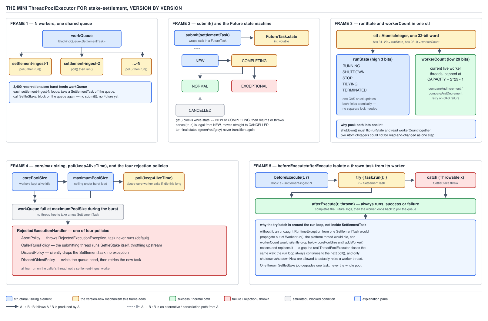

# 05 Multithreading and Concurrency — Packed ctl and rejection — BUILD IT (§4.5, leaves 4.5.3–4.5.4)

**Target version: Java 21 LTS.** | **Part 4 of 5** | [Index](../00-index.md)
Previous: [A thread pool from scratch](05-a-thread-pool-from-scratch.md) · Next: [Hooks and thread factories](05c-hooks-and-thread-factories.md)

`05a` built `MiniThreadPool` v1 (N `settlement-ingest-N` workers pulling `Runnable`s off one
`BlockingQueue`, shutdown via a poison pill) and v2 (`submit(Callable<T>)` returning `MiniFuture<T>`
— a `synchronized`/`wait`/`notifyAll` state machine with `PENDING → COMPLETED/FAILED/CANCELLED`).
This file keeps the class name and the `workQueue`/`workers` fields, but v3 and v4 replace the
poison-pill shutdown and the fixed worker count with something closer to the real
`ThreadPoolExecutor`: one packed `AtomicInteger` for run state and worker count, and a proper
core/max sizing model with rejection policies.

## v3 — one `AtomicInteger` for run state and worker count

### Mental model

Picture a 32-bit integer sliced into two fields: the top few bits are a **mode dial** (RUNNING,
SHUTDOWN, STOP, TERMINATED), the bottom bits a **counter** (how many workers exist right now).
Every question the pool needs to answer — "can I add a worker?", "should this task be accepted?"
— depends on *both* fields at once. Packing them into one word means one atomic read gives both
answers, and one CAS moves both together.

### Why it exists

v1/v2 tracked run state with a lone `volatile boolean shutdownRequested` and worker count
implicitly (a fixed-size array, never changing). The moment worker count becomes *dynamic* — v4
adds core/max sizing — two separate fields (`volatile boolean shutdown` + `AtomicInteger
workerCount`) create a race window: a thread reads `shutdown == false`, then before it increments
`workerCount`, another thread sets `shutdown = true`. "May I add a worker" was decided against a
stale run state. Packing both into one atomically-read, atomically-written word closes that
window by construction.

### When to reach for it, and when not

Pack fields into one atomic word only when a decision genuinely depends on the *combination* being
consistent — not merely when two related fields exist. If run state and worker count could be
decided independently, two separate atomics would be simpler to read and equally correct. The
packing costs readability — every access needs a decode step — so it only earns its complexity
when a real interleaving bug would otherwise exist.

### How it works — `[PROVE]`

Take a 32-bit `int`. Reserve the top 3 bits for run state, the low 29 bits for worker count
(matching the JDK's own split, `COUNT_BITS = Integer.SIZE - 3 = 29`). Four states, ordered so that
comparing the packed integer as a signed number also compares run-state urgency correctly:

```java
private static final int COUNT_BITS = Integer.SIZE - 3;           // 29
private static final int CAPACITY   = (1 << COUNT_BITS) - 1;      // 0x1FFFFFFF, max worker count

private static final int RUNNING    = -1 << COUNT_BITS;           // 0xE0000000
private static final int SHUTDOWN   =  0 << COUNT_BITS;           // 0x00000000
private static final int STOP       =  1 << COUNT_BITS;           // 0x20000000
private static final int TERMINATED =  2 << COUNT_BITS;           // 0x40000000

private final AtomicInteger ctl = new AtomicInteger(packCtl(RUNNING, 0));

private static int runStateOf(int c)          { return c & ~CAPACITY; }
private static int workerCountOf(int c)       { return c & CAPACITY; }
private static int packCtl(int runState, int workerCount) { return runState | workerCount; }
```

Walk why `RUNNING = -1 << COUNT_BITS`: as a signed 32-bit int, `-1` is all 1-bits
(`0xFFFFFFFF`), so shifting left by 29 leaves the top 3 bits `111` and clears the rest —
`0xE0000000`. Read as a **signed** integer, `0xE0000000` is negative (its top bit is 1), while
`SHUTDOWN`'s `0x00000000` is zero, `STOP`'s `0x20000000` and `TERMINATED`'s `0x40000000` are both
positive. That ordering is deliberate: `RUNNING < SHUTDOWN < STOP < TERMINATED` as **signed int
comparisons**, so a check like `runStateOf(c) >= STOP` correctly captures "STOP or TERMINATED" with
one comparison instead of an explicit enum-like switch. This is the same trick
`ThreadPoolExecutor` uses — the states are ints, not an enum, specifically so `<` and `>=`
double as "at least this severe."

The claim to prove: **incrementing worker count can never corrupt run-state bits, and vice
versa**, because they occupy disjoint bit ranges and every mutation goes through `compareAndSet`
on the whole packed word. `workerCountOf` masks with `CAPACITY` (all 29 low bits, top 3 zero) so it
can never read into the run-state bits. `runStateOf` masks with `~CAPACITY` (top 3 bits, low 29
zero) so it can never read into the count. Any CAS from `(runState, count)` to `(runState,
count+1)` computes the new packed value as `runState | (count + 1)` — since `runState`'s bits and
`count`'s bits never overlap, OR-ing them back together reconstructs exactly the intended pair,
and the CAS either installs that exact pair atomically or fails and retries against a fresh read.
There is no way to CAS "just the count" while leaving stale run-state bits, or vice versa, because
the CAS operates on the single word, not on a decoded field.



**D-206** — The mini `ThreadPoolExecutor`, version by version. This file covers frame 3 (run state
and worker count packed into one `AtomicInteger`) and frame 4 (core/max sizing with
`poll(keepAliveTime)` and the four rejection policies). Frames 1–2 (the base pool and `Future`) are
in [`05a`](05-a-thread-pool-from-scratch.md); frame 5 (`beforeExecute`/`afterExecute`) is in
[`05c`](05c-hooks-and-thread-factories.md).

### The four-step submission algorithm

`execute` now checks `ctl` at each decision point rather than a boolean, and re-checks after every
CAS attempt rather than trusting a stale read:

```java
public void execute(Runnable task) {
    if (task == null) throw new NullPointerException();

    int c = ctl.get();
    // Step 1: below core size, always try to start a new worker for this task.
    if (workerCountOf(c) < corePoolSize) {
        if (addWorker(task, true)) return;
        c = ctl.get();
    }
    // Step 2: at/above core, running: try to queue.
    if (isRunning(c) && workQueue.offer(task)) {
        int recheck = ctl.get();
        // Re-check: pool may have been shut down or emptied of workers between offer and now.
        if (!isRunning(recheck) && remove(task)) {
            reject(task);
        } else if (workerCountOf(recheck) == 0) {
            addWorker(null, false); // ensure at least one worker exists to drain the queue
        }
        return;
    }
    // Step 3: queue full or not running: try to add a max-size worker to run it directly.
    else if (addWorker(task, false)) {
        return;
    }
    // Step 4: nothing worked — reject.
    reject(task);
}

private static boolean isRunning(int c) {
    return c < SHUTDOWN;
}
```

`isRunning(c)` exploits exactly the signed-int ordering derived above: `RUNNING`
(`0xE0000000`, negative) is the only state strictly less than `SHUTDOWN` (`0x00000000`), so a
single `<` comparison distinguishes "still accepting work" from every terminal state in one
instruction, with no branch on an enum tag.

`addWorker` is the piece that actually needs the packed CAS — it must atomically verify run state
still permits a new worker *and* increment the count, or retry from scratch if either changed
underneath it:

```java
private boolean addWorker(Runnable firstTask, boolean core) {
    retry:
    for (;;) {
        int c = ctl.get();
        int rs = runStateOf(c);

        if (rs >= SHUTDOWN && !(rs == SHUTDOWN && firstTask == null && !workQueue.isEmpty())) {
            return false; // shutting down and this isn't "drain the queue" work
        }

        for (;;) {
            int wc = workerCountOf(c);
            if (wc >= CAPACITY || wc >= (core ? corePoolSize : maximumPoolSize)) {
                return false;
            }
            if (ctl.compareAndSet(c, c + 1)) {
                break retry; // count bumped, run-state bits untouched by construction
            }
            c = ctl.get(); // CAS lost the race — re-read and retry the inner count check
            if (runStateOf(c) != rs) {
                continue retry; // run state itself moved — restart the outer check too
            }
        }
    }

    Worker worker = new Worker(firstTask);
    Thread thread = worker.thread;
    workers.add(worker);
    thread.start();
    return true;
}
```

`c + 1` is exactly the packing trick paying off: because the count occupies the low 29 bits and
is far from overflowing into the run-state bits under any realistic pool size, plain integer
addition increments the count field while leaving the run-state field bit-for-bit unchanged — no
mask, no OR, needed for this specific operation, though `packCtl` is still used wherever the
run-state bits themselves change (shutdown transitions).

### The invariant

At every point where `execute` or `addWorker` reads `ctl`, the run state and worker count seen
existed together at some real instant — never a stale count paired with a fresher run state. This
is what makes step 2's re-check sound: re-reading `ctl` after `offer` succeeds sees an atomically
consistent snapshot, so "not running" and "worker count zero" cannot be a torn read straddling two
different pool states.

### The cost

Packing buys atomicity but costs readability and range: `CAPACITY` caps worker count at
`2^29 - 1` (536,870,911) workers — overkill, but the price of donating 3 bits to run state. Every
access needs a decode, and every retry loop (`addWorker`'s nested `for`) exists because CAS can
fail and must retry against a fresh read — a plain `synchronized` block needs none of this
ceremony, at the cost of a full lock acquisition per worker-count change.

**Pitfall:** checking `runStateOf(c) >= SHUTDOWN` and treating that as "reject everything" misses
the specific `SHUTDOWN`-plus-"draining the queue" exception `addWorker` carves out —
`ThreadPoolExecutor` (and this mini version) still lets `SHUTDOWN` state add a worker with no
`firstTask` if the queue is non-empty, specifically to guarantee already-queued work still gets
processed after `shutdown()` is called with no new work accepted. Treating all non-`RUNNING`
states identically breaks the "shutdown drains, doesn't discard" contract.

**Insight:** `execute`'s step 2 re-checks `ctl` *after* the successful `offer` because `offer` and
the run-state transition can interleave: a task can be legitimately queued while running, then
`shutdown()` fires with the pool's last worker having just exited. The recheck-and-remove pattern
closes that window — the initial `isRunning(c)` check alone cannot.

**Interview:** "Why does the JDK pack state and count into one int instead of two fields?" — any
decision needing both must see them as of the same instant; two independently-atomic fields can
each be individually valid while the *pair* was never true at any real point in time (a classic
check-then-act race even with each field itself race-free).

## v4 — core/max sizing, `keepAliveTime`, and rejection policies

### Mental model

Two dials replace v1's single fixed size: `corePoolSize` is the crew that's always on payroll
(they block indefinitely waiting for work, like v1's workers); `maximumPoolSize` is the surge crew
that gets hired only when the queue is genuinely backed up, and lets go the moment they idle past
`keepAliveTime`. The fourth wall — what happens when even surge capacity and the queue are both
full — is a pluggable **rejection policy**, because "what to do when overwhelmed" is a business
decision, not a mechanism.

### Why it exists

The stake-settlement pool sees 1,200 stake reservations/sec steady with bursts to 3,400/sec.
Sizing a fixed pool for the burst wastes threads most of the time; sizing for steady-state means
the burst either queues, if the queue is deep enough, or needs temporary extra capacity that
shrinks back afterward — that's core/max plus `keepAliveTime`.

### When to reach for it, and when not

Use core/max sizing when load is genuinely bursty and bounded — a burst that ends. For workloads
that are I/O-bound and bursty in a way that never really "ends" (many concurrent slow downstream
calls, like `FundsLedger.reserveStake` waiting on the PSP's p99 of 11s), virtual threads
(`Executors.newVirtualThreadPerTaskExecutor()`, Java 21+) sidestep sizing entirely by making
threads cheap enough not to pool. Core/max sizing is the right tool when platform threads
themselves are the scarce resource being rationed.

### How it works

Worker threads whose count is above `corePoolSize` use `workQueue.poll(keepAliveTime, unit)`
instead of `workQueue.take()` — `poll` returns `null` on timeout instead of blocking forever, and a
worker that gets `null` back retires itself (decrements the worker count, exits the loop):

```java
private final int corePoolSize;
private final int maximumPoolSize;
private final long keepAliveNanos;

private final class Worker implements Runnable {
    final Thread thread;
    private volatile Runnable firstTask;

    Worker(Runnable firstTask) {
        this.firstTask = firstTask;
        this.thread = new Thread(this, "settlement-ingest-" + workerSeq.incrementAndGet());
    }

    @Override
    public void run() {
        Runnable task = firstTask;
        firstTask = null;
        try {
            while (task != null || (task = getTask()) != null) {
                try {
                    task.run();
                } catch (RuntimeException e) {
                    System.err.println(thread.getName() + " task failed: " + e);
                } finally {
                    task = null;
                }
            }
        } finally {
            workers.remove(this);
            decrementWorkerCount();
        }
    }

    private Runnable getTask() {
        boolean timedOut = false;
        for (;;) {
            int c = ctl.get();
            if (runStateOf(c) >= STOP || (runStateOf(c) >= SHUTDOWN && workQueue.isEmpty())) {
                decrementWorkerCount();
                return null;
            }
            boolean allowTimeout = workerCountOf(c) > corePoolSize;
            if (allowTimeout && timedOut && workerCountOf(c) > 1) {
                if (compareAndDecrementWorkerCount(c)) return null;
                continue;
            }
            try {
                Runnable task = allowTimeout
                    ? workQueue.poll(keepAliveNanos, TimeUnit.NANOSECONDS)
                    : workQueue.take();
                if (task != null) return task;
                timedOut = true;
            } catch (InterruptedException e) {
                timedOut = false;
            }
        }
    }
}

private void decrementWorkerCount() {
    ctl.updateAndGet(c -> c - 1);
}

private boolean compareAndDecrementWorkerCount(int expect) {
    return ctl.compareAndSet(expect, expect - 1);
}
```

### The rejection policy interface and the four implementations

```java
public interface RejectionPolicy {
    void reject(Runnable task, MiniThreadPool pool);
}

public final class AbortPolicy implements RejectionPolicy {
    @Override
    public void reject(Runnable task, MiniThreadPool pool) {
        throw new RejectedExecutionException(
            task + " rejected from " + pool + " — queue and max workers both exhausted");
    }
}

public final class CallerRunsPolicy implements RejectionPolicy {
    @Override
    public void reject(Runnable task, MiniThreadPool pool) {
        if (!pool.isShutdown()) {
            task.run(); // runs on the submitting thread — natural backpressure
        }
    }
}

public final class DiscardPolicy implements RejectionPolicy {
    @Override
    public void reject(Runnable task, MiniThreadPool pool) {
        // silently drop — appropriate only when losing a task is an accepted cost,
        // e.g. best-effort notification fan-out, never for FundsLedger.reserveStake
    }
}

public final class DiscardOldestPolicy implements RejectionPolicy {
    @Override
    public void reject(Runnable task, MiniThreadPool pool) {
        if (!pool.isShutdown()) {
            pool.workQueue.poll();      // drop the head — oldest queued task
            pool.execute(task);         // retry the new task
        }
    }
}
```

`reject` on the pool delegates to whichever policy was configured at construction:

```java
private void reject(Runnable task) {
    rejectionPolicy.reject(task, this);
}
```

Domain framing: settlement tasks reserving funds through `FundsLedger.reserveStake` must never
silently vanish — `DiscardPolicy` there would create phantom reservations the ledger never sees
settled, an unrecoverable data-integrity bug. The settlement pool uses `CallerRunsPolicy`: under a
3,400/sec burst that outruns `maximumPoolSize`, the ingestion loop reading the exchange feed does
one settlement itself, guaranteeing no task is lost and throttling the read rate.

```java
MiniThreadPool settlementPool = new MiniThreadPool(
    /* corePoolSize */ 8,
    /* maximumPoolSize */ 32,
    /* keepAliveTime */ 60, TimeUnit.SECONDS,
    /* queueCapacity */ 2000,
    new CallerRunsPolicy());
```

### The invariant

A worker above `corePoolSize` retires (decrements `ctl`'s count) if and only if it observed
`poll` time out **and**, at decrement time, the worker count is still above 1 (so core capacity is
never accidentally reduced to zero by a timeout race). `compareAndDecrementWorkerCount` CASing
against the exact `c` observed means a worker that raced with a new task arriving (which would
have changed `ctl` via a concurrent `addWorker` or another retirement) fails its CAS and loops back
into `getTask()` rather than retiring based on stale information — the same "packed word, atomic
transition" discipline from v3 applied to the shrink path.

### The cost

`CallerRunsPolicy`, chosen because losing a task is unacceptable, means a burst can make the
*ingestion* thread pay settlement latency directly — `FundsLedger.reserveStake`'s write cost is
now sometimes charged to the feed reader, not a pool worker. That is the deliberate trade:
correctness over the ingestion loop's own throughput during a burst. `AbortPolicy` protects
throughput at the cost of an unhandled exception the caller must route to a dead letter.

**Pitfall:** assuming `keepAliveTime` bounds *core* threads too. Only threads above
`corePoolSize` time out via `poll`; core workers call `take()` and block forever, exactly like
v1, unless `allowCoreThreadTimeOut` is explicitly enabled (the JDK exposes this; this mini version
omits it for space).

**Insight:** the four-policy interface exists because "what to do under overload" is a domain
question, not a mechanism one — `DiscardPolicy` suits a best-effort notification fan-out and is
catastrophic for `FundsLedger.reserveStake`. Separating policy from mechanism lets one
`MiniThreadPool` implementation serve both.

**Interview:** "When would you pick `CallerRunsPolicy` over `AbortPolicy`?" — when losing or
failing a submission outright is worse than temporarily degrading the submitter's own throughput;
it is a built-in backpressure valve because the caller cannot submit faster than it can also
directly execute.

> Core/max sizing with `keepAliveTime` turns "how many threads" from a fixed number into a range
> that expands under burst and contracts back to a steady-state floor, and a rejection policy is
> the pluggable answer to "what happens when even the expanded range isn't enough."

## Pitfalls

### Assuming the packed `ctl` needs a lock to read safely

**Wrong**
```java
synchronized (this) {
    int state = runStateOf(ctl.get());
    int count = workerCountOf(ctl.get()); // two separate .get() calls — can tear!
}
```
Two separate `ctl.get()` calls can observe *different* packed values if another thread's CAS lands
between them — the "atomicity" of packing is destroyed by reading it twice.

**Right**
```java
int c = ctl.get(); // one read, one consistent snapshot
int state = runStateOf(c);
int count = workerCountOf(c);
```
Read `ctl` exactly once into a local variable, then decode both fields from that single snapshot.
No lock needed — `AtomicInteger.get()` is already a volatile read, and decoding is pure arithmetic
on a value already captured.

**Why people believe it:** the whole point of packing was "make it atomic," so it's tempting to
assume any sequence of reads from the packed field inherits that atomicity — but atomicity belongs
to each individual `get()` call, not to a sequence of them.

### Assuming `maximumPoolSize` workers all exist simultaneously under moderate load

**Wrong**
```java
MiniThreadPool pool = new MiniThreadPool(8, 32, 60, TimeUnit.SECONDS, 2000, new AbortPolicy());
// assumes: "we always have up to 32 workers ready"
```
Extra workers above `corePoolSize` are created only when the **queue is full** (step 3 of the
submission algorithm) — a moderate, steady 1,200/sec load that the queue absorbs comfortably never
triggers `addWorker(task, false)` at all, so the pool stays at 8 workers regardless of
`maximumPoolSize`.

**Right**
Size `queueCapacity` and `maximumPoolSize` together, deliberately: a shallow queue triggers max
sizing sooner (more responsive to bursts, more thread churn); a deep queue absorbs bursts without
ever growing past core (less churn, more latency under burst). For the settlement pool's 3,400/sec
burst, `queueCapacity = 2000` was chosen to absorb roughly half a second of full burst before the
max-size escalation (step 3) engages.

**Why people believe it:** `maximumPoolSize` reads like a target the pool tries to reach, when it
is actually a ceiling reached only as a last resort after the queue is already full — the
submission algorithm's step ordering (core first, then queue, then max) is easy to skip past when
skimming the API.

## Cheat sheet

| Concept | Key fact |
|---|---|
| `ctl` layout | Top 3 bits = run state, low 29 bits = worker count (`COUNT_BITS = 29`) |
| Run states, ordered | `RUNNING (-1<<29) < SHUTDOWN (0) < STOP (1<<29) < TERMINATED (2<<29)` |
| `isRunning(c)` | `c < SHUTDOWN` — one signed-int comparison |
| `addWorker` CAS | `compareAndSet(c, c + 1)` — count bump, run-state bits untouched by disjoint masks |
| Submission order | core (always try) → queue (`offer`) → max-size worker → reject |
| Core worker wait | `workQueue.take()` — blocks forever |
| Above-core worker wait | `workQueue.poll(keepAliveTime, unit)` — retires on `null` |
| `AbortPolicy` | Throws `RejectedExecutionException` |
| `CallerRunsPolicy` | Submitter runs the task itself — natural backpressure |
| `DiscardPolicy` | Silently drops — never for ledger-writing tasks |
| `DiscardOldestPolicy` | Evicts queue head, retries submission |

## Self-test

**Q1.** Why must `RUNNING` be the state with the numerically smallest (most negative) value among
the four run states?

<details><summary>Answer</summary>

`isRunning(c)` is implemented as the single comparison `c < SHUTDOWN`. For that to correctly
identify exactly the `RUNNING` state and no other, `RUNNING`'s packed value must be less than
every other state's packed value as a signed int — which holds because `RUNNING = -1 << 29` sets
the sign bit, making it negative, while `SHUTDOWN`, `STOP`, and `TERMINATED` are all
non-negative. Any other ordering would require a full switch instead of one comparison.

</details>

**Q2.** Two threads both call `addWorker` for the same pool at the same instant, and both read
`ctl.get()` as the same value `c` with `workerCountOf(c) == corePoolSize - 1`. What stops both from
successfully adding a worker and overshooting `corePoolSize` by one?

<details><summary>Answer</summary>

Both threads attempt `ctl.compareAndSet(c, c + 1)` against the same stale `c`. Only one CAS can
succeed — CAS is a single atomic hardware operation, so the second thread's CAS necessarily fails
because `ctl`'s actual value has already moved to `c + 1`. The losing thread re-reads `ctl.get()`
(getting `c + 1`), sees `workerCountOf(c+1) == corePoolSize`, and correctly fails the count check on
its next loop iteration instead of adding a second worker.

</details>

**Q3.** Why does `getTask()` check `runStateOf(c) >= STOP` as a *separate*, stricter condition from
`runStateOf(c) >= SHUTDOWN && workQueue.isEmpty()`?

<details><summary>Answer</summary>

`STOP` (from a hypothetical `shutdownNow()`) means "stop immediately, don't drain the queue" — a
worker should exit regardless of whether the queue still has tasks. `SHUTDOWN` (graceful) means
"stop accepting new work but finish what's already queued" — a worker should exit only once the
queue is actually empty. Collapsing these into one check would either make graceful shutdown drop
queued work (wrong) or make a hard stop wait for drainage (wrong in the opposite direction).

</details>

**Q4.** Why does `CallerRunsPolicy` check `!pool.isShutdown()` before running the task?

<details><summary>Answer</summary>

If the pool has already been told to shut down, running a rejected task on the caller's thread
would execute new work after the pool declared itself closed — violating the shutdown contract
("no more work runs after shutdown, beyond what was already queued"). Checking shutdown state
first means a rejection that arrives after shutdown is simply dropped rather than executed
out-of-band on the caller.

</details>

**Q5.** In the four-step submission algorithm, why does step 2 call `addWorker(null, false)` when
it finds `workerCountOf(recheck) == 0` right after successfully queuing a task?

<details><summary>Answer</summary>

A task was just successfully queued, but if the worker count has dropped to zero in the meantime
(every worker retired via `keepAliveTime` timeout, or a shutdown-and-recovery race), the newly
queued task would sit forever with nobody polling the queue. Adding a worker with no
`firstTask` (it will pick the queued task up via `getTask()` itself) guarantees at least one thread
exists to actually process what was just queued.

</details>

**Q6.** Why does `DiscardOldestPolicy` call `pool.execute(task)` again after evicting the queue
head, rather than running the task itself like `CallerRunsPolicy`?

<details><summary>Answer</summary>

`DiscardOldestPolicy`'s intent is "make room and let the normal submission path decide again" —
after evicting one queued item, the queue has a free slot, so re-running `execute` gives the new
task a fair chance to go through the same core → queue → max → reject sequence, rather than
special-casing it to run synchronously on the caller regardless of pool state.

</details>

**Q7.** Why would `DiscardPolicy` be an unacceptable choice for the stake-settlement pool
specifically?

<details><summary>Answer</summary>

Settlement tasks call `FundsLedger.reserveStake`, and a silently dropped task means a reservation
that was supposed to be made — and that the rest of the system (the Quiz Engine, the client's
wallet view) may already believe happened — never actually lands in the ledger. That is a direct
`LedgerImbalanceException`-class integrity violation, not a recoverable best-effort miss, unlike
(say) a best-effort push notification where a dropped task is merely a UX blemish.

</details>

**Q8.** What would go wrong if `getTask()` used `if (allowTimeout && timedOut)` without also
checking `workerCountOf(c) > 1`?

<details><summary>Answer</summary>

Every above-core worker could retire simultaneously the moment they all time out together (a
plausible outcome if they were all created together during one burst and the burst ends cleanly),
potentially retiring down through and below `corePoolSize`, or even to zero workers with tasks
still arriving. The `> 1` guard specifically prevents the very last worker from retiring due to
timeout alone — someone must remain to accept the next `execute()` call's queued work, mirroring
the real `ThreadPoolExecutor`'s same guard.

</details>

---

**Leaves covered:** 4.5.3–4.5.4 (2 leaves)
**Leaves deferred:** none
**Diagrams included:** D-206
**Target version:** Java 21 LTS
**Lines:** 599
