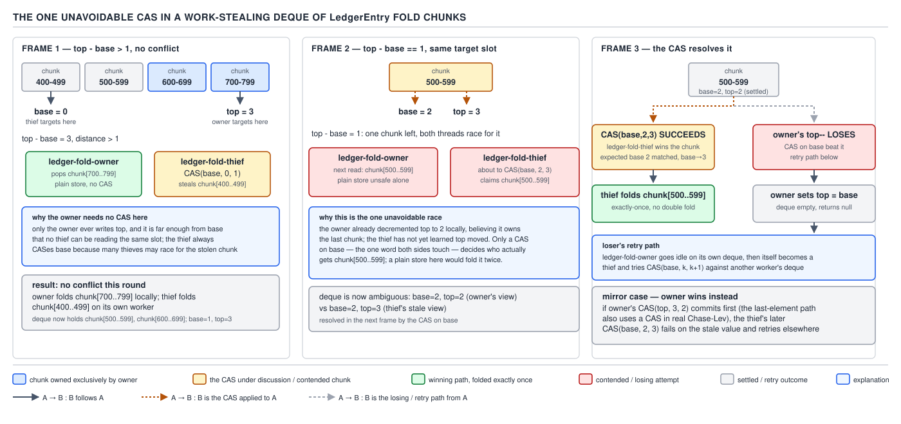

# 05 Multithreading and Concurrency — The work-stealing deque — BUILD IT (§4.6, leaves 4.6.1–4.6.2)

**Target version: Java 21 LTS.** | **Part 4 of 5** | [Index](../00-index.md)
Previous: [The pool consolidated diff](05e-pool-consolidated-diff.md) · Next: [Growing the deque and the mini pool](06b-growing-and-the-mini-pool.md)

### `WorkStealingDeque<T>` — one owner, many thieves, one array

#### Mental model

Picture the payments team's `ledger-reconcile` workers each holding a private deck of index
cards, one card per chunk of `LedgerEntry` rows still needing a `HOUSE_REVENUE` reconciliation
pass. Each worker deals cards to itself from the top of its own deck — push a new chunk on top
when it recursively splits a range, pop the top chunk when it wants more work. When a worker's
deck runs dry, it doesn't sit idle: it walks over to another worker's deck and takes a card from
the *bottom* — the end farthest from where the owner is working, so it almost never collides with
the owner's own hand. That asymmetry — owner works one end, thieves work the other — is the entire
idea. It turns a shared, always-contended resource (one global work queue) into a resource that is
contended only in the rare case where a deque is down to its last card.

#### Why it exists

A single shared work queue for N workers means N-way contention on every dequeue, and it means a
worker that produces two subtasks by splitting a range of `LedgerEntry` rows has to publish both
of them through the same contended channel a worker that produces none. Before deques-per-worker,
the two ways people balanced load were: a static partition of the 19.8M rows into N equal shares
(some workers finish the `HOUSE_REVENUE` slice early and starve while others still churn through a
denser one), or a single `synchronized` queue that turns every steal into a serialization point.
Neither uses idle capacity without paying for it on the hot path.

#### When to reach for it, and when not

Reach for a work-stealing deque when tasks are produced recursively, tasks are cheap to split
further, and the workload is bursty enough that static partitioning leaves cores idle — exactly
the merge-sort-over-`WithdrawalTransaction`-batches shape built in file 3 of this set. Do not reach
for it when tasks arrive from outside as a flat, un-splittable stream (a bounded queue of incoming
`ReserveStake` calls) — there a single `LinkedBlockingQueue` or the SPSC ring from the queues
folder is simpler and just as fast, because there is no recursive fan-out to balance. Do not reach
for it either when tasks must run in submission order — stealing reorders freely, which is exactly
what makes it fast and exactly what a `PaymentRun` settlement pipeline cannot tolerate.

#### How it works

This is the Chase-Lev deque, the same algorithm `ForkJoinPool.WorkQueue` is built on. One field,
`top`, is written only by the owning worker and always at the same end the owner pushes and pops
from. A second field, `base`, is written by whichever thief currently owns the race to take the
oldest task, and by the owner itself in exactly one case covered by the proof below. The backing
array is circular: index `i & mask` where `mask = capacity - 1` and `capacity` is a power of two.

```java
package quizstakes.forkjoin;

import java.util.concurrent.atomic.AtomicLong;
import java.util.concurrent.atomic.AtomicReferenceArray;

/**
 * A Chase-Lev work-stealing deque. The owning worker pushes and pops at {@code top};
 * any number of thief threads steal at {@code base} via a single CAS. Not resizable in
 * this file — see 06b-growing-and-the-mini-pool.md for the grow-in-place version.
 */
public final class WorkStealingDeque<T> {

    private final AtomicReferenceArray<T> tasks;
    private final int mask;

    // Owner-only. Not volatile: only the owning worker thread ever reads or writes it,
    // except that a thief reads it once, racily, purely to size the deque before stealing.
    private volatile int top = 0;

    // Shared end. CAS'd by thieves racing each other, and by the owner in the last-element case.
    private final AtomicLong base = new AtomicLong(0);

    public WorkStealingDeque(int capacityPowerOfTwo) {
        if (Integer.bitCount(capacityPowerOfTwo) != 1) {
            throw new IllegalArgumentException("capacity must be a power of two, got " + capacityPowerOfTwo);
        }
        this.tasks = new AtomicReferenceArray<>(capacityPowerOfTwo);
        this.mask = capacityPowerOfTwo - 1;
    }

    /** Owner-only. Pushes a new task onto the top of this worker's own deque. */
    public void pushTop(T task) {
        int t = top;
        tasks.set(t & mask, task);
        top = t + 1;
    }

    /** Owner-only. Pops the most recently pushed task, or returns null if this deque is empty. */
    public T popTop() {
        int t = top - 1;
        top = t;
        long b = base.get();
        if (t < b) {
            // Already empty before we even looked; undo the speculative decrement.
            top = t + 1;
            return null;
        }
        T task = tasks.get(t & mask);
        if (t > b) {
            // More than one element remains: no thief can be racing us for this slot.
            return task;
        }
        // t == b: exactly one element left. A thief may be mid-steal on this same slot.
        // This CAS is the one place ownership of the last slot is actually contested.
        boolean won = base.compareAndSet(b, b + 1);
        top = b + 1;
        return won ? task : null;
    }

    /** Called by any thief thread. Returns null if empty or if this steal lost a race. */
    public T steal() {
        long b = base.get();
        int t = top;
        if (b >= t) {
            return null; // deque looks empty from here
        }
        T task = tasks.get((int) (b & mask));
        if (task == null) {
            // Owner already cleared this slot via a concurrent grow or pop; caller should retry.
            return null;
        }
        if (!base.compareAndSet(b, b + 1)) {
            return null; // another thief (or the owner, in the last-slot case) won the race
        }
        return task;
    }

    public boolean isEmpty() {
        return base.get() >= top;
    }
}
```

The owner's `pushTop` and the two-or-more-element branch of `popTop` never touch `base` at all —
they are plain array and field operations, no CAS, no contention, because a thief can only ever be
reaching for the oldest element (`base`), and if `top - base > 1` the owner's `top - 1` slot and
the thief's `base` slot are provably different indices.



**D-207** — The one unavoidable CAS in a work-stealing deque.

#### Leaf 4.6.2 — proving the CAS is unavoidable exactly when `top - base == 1`

Claim: the only state in which the owner's `popTop` and some thief's `steal` can target the same
array slot is `top - base == 1`, i.e. the deque holds exactly one task.

Work it through by cases on `size = top - base` at the instant `popTop` computes `t = top - 1`:

**Case `size > 1` (two or more tasks present).** The owner reads slot `t = top - 1`. Any thief
that has not yet advanced `base` past its current value reads slot `base`. Since `size > 1` means
`top - 1 > base`, the two indices `t` and `base` are numerically distinct, and because the array is
circular with `capacity` strictly greater than the number of live tasks, distinct logical indices
map to distinct physical slots. No thief can be reading the owner's slot. The owner's read and
write of `tasks[t & mask]` and its plain store to `top` need no synchronization with `base` at
all — this is why the fast path is CAS-free.

**Case `size == 1` (`top - base == 1`, the boundary).** The owner computes `t = top - 1 = base`.
The single remaining task lives at slot `base & mask`, which is exactly the slot any concurrently
running thief is about to read in `steal()`. Both the owner (via `popTop`) and a thief (via
`steal`) now hold a plain read of the same task reference. If both were allowed to return it
unconditionally, the same `LedgerEntry`-chunk task would run twice — silently, with no exception,
just double-counted `HOUSE_REVENUE` reconciliation. The two parties must agree on exactly one
winner, and the only field either side can attempt to advance is `base` — advancing `top` settles
nothing, since the thief never looks at `top` to decide ownership. So the arbitration point *must*
be a single atomic operation on `base`, and it must be compare-and-set rather than get-and-set,
because the loser has to find out it lost rather than unconditionally overwriting the winner's
claim. `base.compareAndSet(b, b + 1)` is that operation: exactly one caller — owner or one specific
thief — observes `true`.

**Case `size == 0` (`top - base <= 0`, empty).** The owner's own `t < b` check catches this before
touching `tasks` at all and rolls back the speculative `top` decrement. No race is possible because
there is nothing left to race over.

**Why not just CAS every pop and every steal, for simplicity?** You could — early work-stealing
papers did exactly that — but it means paying an atomic instruction on every single pop, including
the overwhelming majority where the owner holds a private deque with dozens of tasks in it and no
thief is anywhere near it. Measured against the 2.8M-stake-reservation-per-day, thousands-of-tasks
workload this pool is built for, that is an atomic RMW on every task dequeue instead of on roughly
one dequeue per steal event — and steals are the rare case by design, since a worker only steals
when its own deque is empty. `size > 1` being CAS-free is not a micro-optimization bolted on after
the fact; it falls straight out of the proof that no conflict is possible there.

**Insight:** the proof shows *why* `top - base == 1` is special, not just *that* it is — a thief
targets `base` unconditionally, so the owner's only leverage to prevent a double-return is to make
its own claim on the last slot go through the same field the thief contends on, even though the
owner never touches `base` in any other code path.

**Pitfall:** assuming the owner needs to CAS `top` to protect against thieves. Thieves never read
or write `top` except once, racily, purely to compute `b >= t` as a fast empty-check — a stale
`top` there can only make `steal()` wrongly return `null` on a deque that briefly looks empty
(safe: the caller just retries against another victim), never wrongly hand out a task. The actual
contention is entirely on `base`.

**Interview:** "why is only one CAS needed in a work-stealing deque, and where?" — because the
owner and thieves work opposite ends of the same array, so slots only alias when exactly one task
remains; that single case is arbitrated by a CAS on the shared end (`base`), and every other case
is provably conflict-free by index arithmetic, not by locking.

> **`WorkStealingDeque<T>`** is a circular-array double-ended queue where the owning thread pushes
> and pops lock-free at one end (`top`) and any number of thief threads steal lock-free at the
> other end (`base`), with a single compare-and-set on `base` as the only synchronization needed,
> triggered only when the deque holds exactly one task.

## Pitfalls

### Assuming `popTop` never needs to touch `base`

**Wrong**

```java
// BROKEN: ignores the last-element race entirely
public T popTopBroken() {
    int t = top - 1;
    top = t;
    if (t < base.get()) {
        top = t + 1;
        return null;
    }
    return tasks.get(t & mask); // no CAS — a thief can return the same task
}
```

Run this with one owner and four `ledger-reconcile` thieves hammering `steal()` while the deque
drains to its last task, and roughly one run in a few hundred double-dispatches that last
`LedgerEntry` chunk — the owner's thread and a thief's thread both process it, and the
`HOUSE_REVENUE` total comes out too high by exactly one chunk's contribution.

**Right**

```java
public T popTop() {
    int t = top - 1;
    top = t;
    long b = base.get();
    if (t < b) { top = t + 1; return null; }
    T task = tasks.get(t & mask);
    if (t > b) return task;
    boolean won = base.compareAndSet(b, b + 1);
    top = b + 1;
    return won ? task : null;
}
```

**Why people believe it:** the owner "owns" `top` and never writes `base` anywhere else in the
class, so it looks safe to assume `base` is purely a thief-side concern — but ownership of a field
is not the same as ownership of the last remaining slot in the array that field indexes into.

## Cheat sheet

| Operation | Caller | Touches `base`? | Cost when `size > 1` | Cost when `size == 1` |
|---|---|---|---|---|
| `pushTop` | owner only | never | plain array store + plain field write | n/a (never last-slot logic) |
| `popTop`, `size > 1` | owner only | reads only | plain array read, no CAS | — |
| `popTop`, `size == 1` | owner only | CAS | — | one `compareAndSet` |
| `steal` | any thief | always CAS | one `compareAndSet` per attempt | one `compareAndSet`, may lose |
| `isEmpty` | any thread | reads only | plain comparison | plain comparison |

## Self-test

**Q1.** Why does the owner's `pushTop` never need to synchronize with `base` at all?

<details><summary>Answer</summary>

Pushing only ever grows `top`, and a thief only ever reads or claims the slot at `base`. Since
`base <= top` is an invariant of a non-empty-or-empty deque and pushing only widens the gap between
them, a push can never make an already-claimed or currently-being-stolen slot ambiguous — it only
ever adds new slots strictly above whatever a thief could be looking at.

</details>

**Q2.** What would go wrong if `popTop` used `base.getAndIncrement()` instead of
`base.compareAndSet(b, b + 1)` in the last-element case?

<details><summary>Answer</summary>

`getAndIncrement` always succeeds and always returns the previous value, so the owner would have
no way to detect that a thief had already claimed the slot first. Both the owner and the thief
would walk away believing they own the task, and the same `LedgerEntry` chunk would be processed
twice. The CAS's failure return is exactly the signal that arbitrates the race; an unconditional
increment throws that signal away.

</details>

**Q3.** Why is the backing array required to have capacity strictly greater than the maximum
number of tasks the deque will ever hold at once, rather than exactly equal?

<details><summary>Answer</summary>

If capacity equals the live task count, `top & mask` and `base & mask` can collide even in the
`size > 1` case, because the modular index space wraps around and a full-to-capacity deque makes
the oldest and newest logical slots physically adjacent with no empty buffer between them; a
concurrent grow (file 2 of this set) would then be unable to tell "one wrap-around apart" from
"actually aliased". Keeping capacity strictly above the maximum live count preserves the case
analysis in the proof above.

</details>

**Q4.** A thief calls `steal()` and gets back `null`. What are the two structurally different
reasons this can happen, and does the caller need to distinguish them?

<details><summary>Answer</summary>

Either the deque was genuinely empty (`b >= t`), or the deque had a task but the thief lost a race
— either to another thief's CAS, or to the owner claiming the last slot via `popTop`. The caller
does not need to distinguish them: both cases mean "no task obtained here", and the correct
response in the mini pool (file 2 of this set) is the same either way — try a different victim or
retry.

</details>

**Q5.** Why is `tasks` an `AtomicReferenceArray<T>` rather than a plain `T[]`?

<details><summary>Answer</summary>

A plain array's element writes and reads have no ordering guarantee with respect to other threads
under the Java Memory Model — a thief could observe a torn or stale reference at a slot the owner
just wrote. `AtomicReferenceArray` gives each element volatile-equivalent get/set semantics, so a
thief's read of a slot the owner just published via `pushTop` is guaranteed to see that write, not
an arbitrary older value.

</details>

**Q6.** Suppose `top - base == 2` and a thief's `steal()` call is delayed by a long GC pause right
after it reads `b = base.get()` but before its CAS. Meanwhile the owner pops twice. Can the thief's
eventual CAS still succeed, and is that safe?

<details><summary>Answer</summary>

The thief's stale `b` is the value `base` held before the owner's activity. If nothing else has
stolen from that slot in the meantime, `base` may still equal the thief's stale `b` (unlikely with
other thieves around, but possible with only one), and the CAS would then succeed — correctly,
because `base` only ever advances forward and a successful CAS from a stale-but-still-current value
is exactly as valid as one from a freshly-read value. If another thief already advanced `base` past
the delayed thief's `b`, the CAS simply fails, which is the safe, expected outcome of a lost race.

</details>

**Q7.** Why does `popTop` decrement `top` *before* checking whether the deque is empty, rather than
checking first and only then decrementing?

<details><summary>Answer</summary>

The decrement is what stakes the owner's claim to the top slot before it inspects `base` — reading
`base` after the speculative decrement is what makes the subsequent race-or-no-race decision valid
for the state the owner is about to act on. Checking first and decrementing after would leave a
window where the emptiness check and the actual pop are against two different snapshots of `base`,
reopening exactly the race the CAS exists to close.

</details>

---

**Leaves covered:** 4.6.1–4.6.2 (2 leaves)
**Leaves deferred:** none
**Diagrams included:** D-207
**Target version:** Java 21 LTS
**Lines:** 357
