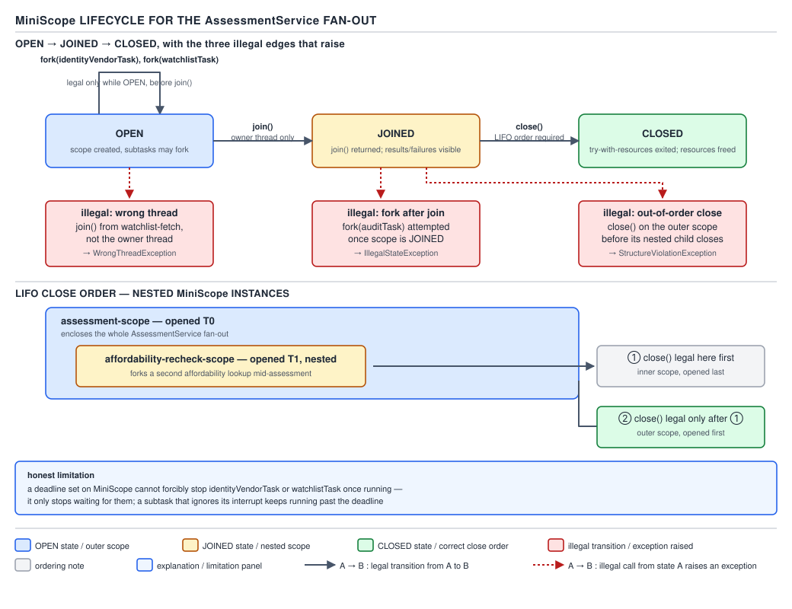

# 05 Multithreading and Concurrency — Structured concurrency from scratch — BUILD IT (§4.7, leaves 4.7.1–4.7.2)

**Target version: Java 21 LTS.** | **Part 4 of 5** | [Index](../00-index.md)
Previous: [The fork/join consolidated diff](06d-forkjoin-consolidated-diff.md) · Next: [Hedging and deadlines](07b-hedging-and-deadlines.md)

The `AssessmentService` fans a single applicant out to two vendors: the identity vendor
(p50 900ms, p99 38s) and the watchlist provider (p50 1.4s, p99 25s, 30s timeout). Today that fan-out
is two `submit()` calls into an executor and a manual `get()` on each future — nothing stops one
call from leaking past the point where the caller stopped caring, and a failure in one leaves the
other running unsupervised. Structured concurrency fixes the shape: a scope owns every subtask it
forks, and no subtask outlives the block that created it. This file builds that scope,
`MiniScope`, from nothing.

`--enable-preview` note: the real `StructuredTaskScope` this shadows is a JDK 21 preview API
(and, per the writer style packet, still preview through JDK 25's fifth iteration, JEP 505). Code
in this file is a plain hand-rolled class with no preview flag required — that is the point of
building your own.

## v1 — fork, join, and the owner-thread / LIFO rules

### Mental model

A `MiniScope` is a **join point with a guest list**. `fork` adds a name to the list and hands back a
claim ticket (`Subtask<T>`). `join` will not return until every name on the list has either finished
or been told to stop. `close` tears down the list — and, like closing files, it must happen in the
reverse order scopes were opened, because an outer scope's `close` must never run while an inner
scope it doesn't know about is still forking work onto shared threads.

### Why it exists

Before this, fanning out meant `ExecutorService.submit()` twice and `Future.get()` twice, by hand,
with no relationship enforced between the two calls beyond what the author remembered to write.
Nothing stopped a caller from returning out of the method — via a `return`, an exception, or a
`break` — while a submitted task was still running against a stale request context. That's a
resource leak with a runtime, not a compile-time, discovery process. Structured concurrency makes
the lifetime a language-enforced block: subtasks cannot survive their scope because the scope's
`close()` blocks until they haven't.

### When to reach for it, and when not

Reach for scoped fan-out whenever two or more calls are logically one unit of work and either must
finish before the caller proceeds — the `AssessmentService` calling identity-verification and
watchlist screening for one applicant is exactly this shape. Do not reach for it for
fire-and-forget work with no result the caller waits on (a `NotificationService` dispatch after a
deposit) — that has no join point, so a scope buys nothing beyond a plain `Executor.execute()`.

### How it works

Three fields: the owner `Thread` (captured in the constructor so any other thread calling `fork` or
`join` can be rejected), a `ConcurrentLinkedQueue<Subtask<?>>` for the guest list (concurrent because
subtasks report completion from worker threads while the owner reads it), and a `CountDownLatch`-like
counter of in-flight forks. `fork` submits a wrapped `Callable` to a virtual-thread-per-task
executor, records the `Subtask` handle, and returns immediately — it never blocks. `join` parks the
owner thread until every recorded subtask has completed, by waiting on a `CountDownLatch` sized at
construction-adjustable count (a `Phaser`-free approach: each `fork` calls `latchList.add(new
CountDownLatch(1))` and `join` awaits all of them in turn, but that serializes joins). The version
below instead uses one shared `CountDownLatch` re-armed via an `AtomicInteger` pattern, so `join`
waits on a single condition.



**D-208** — `MiniScope`'s lifetime rules. Open → forking is legal. `join()` moves it to joined —
forking after that throws. `close()` moves it to closed, and is only legal in LIFO order against
sibling scopes on the same thread. The diagram labels each illegal edge with the exception it
raises, and prints the honest limitation this file proves in leaf 4.7.4: a deadline cannot stop a
subtask that ignores interruption.

### Code

```java
public final class MiniScope implements AutoCloseable {

    public sealed interface SubtaskState permits Running, Success, Failed {}
    public record Running() implements SubtaskState {}
    public record Success<T>(T result) implements SubtaskState {}
    public record Failed(Throwable cause) implements SubtaskState {}

    public static final class Subtask<T> {
        private volatile SubtaskState state = new Running();
        private volatile Thread carrierThread;

        public SubtaskState state() {
            return state;
        }

        public T get() {
            if (state instanceof Success<?> success) {
                @SuppressWarnings("unchecked")
                T result = (T) success.result();
                return result;
            }
            throw new IllegalStateException("Subtask has not completed successfully: " + state);
        }
    }

    private static final ThreadLocal<Deque<MiniScope>> OPEN_SCOPES =
        ThreadLocal.withInitial(ArrayDeque::new);

    private final Thread ownerThread = Thread.currentThread();
    private final ExecutorService carrierExecutor =
        Executors.newVirtualThreadPerTaskExecutor();
    private final List<Subtask<?>> subtasks = new CopyOnWriteArrayList<>();
    private final List<Future<?>> carrierFutures = new CopyOnWriteArrayList<>();
    private volatile boolean joined = false;
    private volatile boolean closed = false;

    public MiniScope() {
        OPEN_SCOPES.get().push(this);
    }

    private void checkOwner(String operation) {
        if (Thread.currentThread() != ownerThread) {
            throw new WrongThreadException(
                operation + " called from " + Thread.currentThread().getName()
                    + " but this MiniScope is owned by " + ownerThread.getName());
        }
    }

    public <T> Subtask<T> fork(Callable<T> task) {
        checkOwner("fork");
        if (joined) {
            throw new IllegalStateException("Cannot fork after join() has been called");
        }
        if (closed) {
            throw new IllegalStateException("Cannot fork after close()");
        }
        Subtask<T> handle = new Subtask<>();
        subtasks.add(handle);
        Future<?> carrier = carrierExecutor.submit(() -> {
            handle.carrierThread = Thread.currentThread();
            try {
                T result = task.call();
                handle.state = new Success<>(result);
            } catch (Throwable t) {
                handle.state = new Failed(t);
            }
        });
        carrierFutures.add(carrier);
        return handle;
    }

    public void join() throws InterruptedException {
        checkOwner("join");
        joined = true;
        for (Future<?> carrier : carrierFutures) {
            try {
                carrier.get();
            } catch (ExecutionException e) {
                // Failure is recorded on the Subtask itself; join() only waits, it does
                // not propagate — callers inspect state() after join() returns.
            }
        }
    }

    @Override
    public void close() {
        checkOwner("close");
        Deque<MiniScope> stack = OPEN_SCOPES.get();
        if (stack.isEmpty() || stack.peek() != this) {
            throw new IllegalStateException(
                "close() called out of LIFO order — this MiniScope is not the most "
                    + "recently opened scope on " + ownerThread.getName());
        }
        stack.pop();
        closed = true;
        for (Future<?> carrier : carrierFutures) {
            carrier.cancel(true);
        }
        carrierExecutor.shutdown();
    }

    public static final class WrongThreadException extends RuntimeException {
        public WrongThreadException(String message) {
            super(message);
        }
    }
}
```

**Invariant.** No `Subtask` handle is ever returned to the caller with `state()` still `Running`
after `join()` completes — every carrier future is awaited before `join` returns, so the guest list
is fully resolved by the time the caller inspects it.

**Cost.** One virtual thread per fork (cheap — a few hundred bytes of stack metadata, not an OS
thread) plus a `CopyOnWriteArrayList` append per fork, which is fine at fan-out counts of two or
three per applicant but would be the wrong structure for thousands of forks per scope.

**Diff from the JDK's `StructuredTaskScope`.** The real one tracks subtask lifetime with a
`ThreadFlock` (a JDK-internal thread-tracking primitive this file cannot reproduce — no public
equivalent exists), surfaces `StructureViolationException` for the exact LIFO violation this file
throws as a plain `IllegalStateException`, and its `join()` propagates via a configurable `Joiner`
(JEP 505) rather than the do-nothing catch above.

**Pitfall:** calling `fork` from inside one of the forked callables, expecting it to attach to the
outer scope. It does not — `checkOwner` rejects it, because `Thread.currentThread()` inside a
carrier task is the virtual thread the callable runs on, never `ownerThread`. Fix: open a *nested*
`MiniScope` inside the callable if the subtask itself needs to fan out further, and close it before
the callable returns (LIFO discipline applies to it too).

## v2 — shutdown-on-failure

### Mental model

Same guest list, but now the moment one guest fails, `join()` calls it off for everyone else still
running rather than waiting out the slowest one. For `AssessmentService`: if the watchlist call
throws (provider outage), there is no reason to let the identity vendor's p99 38-second call keep
running — the applicant's assessment has already failed.

### How it works

Add one field: an `AtomicReference<Throwable>` for the first failure, and a way to cancel every
other in-flight carrier once it's set. The carrier wrapper in `fork` now checks that reference on
completion and, on the first failure, cancels every other tracked `Future`. `join()` re-throws the
recorded failure instead of swallowing it.

### Code

```java
public final class ShutdownOnFailureScope implements AutoCloseable {

    private final Thread ownerThread = Thread.currentThread();
    private final ExecutorService carrierExecutor =
        Executors.newVirtualThreadPerTaskExecutor();
    private final List<Future<?>> carrierFutures = new CopyOnWriteArrayList<>();
    private final AtomicReference<Throwable> firstFailure = new AtomicReference<>();
    private volatile boolean closed = false;

    public <T> MiniScope.Subtask<T> fork(Callable<T> task) {
        if (Thread.currentThread() != ownerThread) {
            throw new MiniScope.WrongThreadException("fork() called off owner thread");
        }
        MiniScope.Subtask<T> handle = new MiniScope.Subtask<>();
        Future<?> carrier = carrierExecutor.submit(() -> {
            try {
                T result = task.call();
                handle.state = new MiniScope.Success<>(result);
            } catch (Throwable t) {
                handle.state = new MiniScope.Failed(t);
                if (firstFailure.compareAndSet(null, t)) {
                    cancelAllExcept(Thread.currentThread());
                }
            }
        });
        carrierFutures.add(carrier);
        return handle;
    }

    private void cancelAllExcept(Thread failingCarrier) {
        for (Future<?> carrier : carrierFutures) {
            carrier.cancel(true);
        }
    }

    public void join() throws InterruptedException {
        for (Future<?> carrier : carrierFutures) {
            try {
                carrier.get();
            } catch (ExecutionException | CancellationException ignored) {
                // Recorded already, in firstFailure or the individual Subtask state.
            }
        }
    }

    public void throwIfFailed() throws ExecutionException {
        Throwable failure = firstFailure.get();
        if (failure != null) {
            throw new ExecutionException(failure);
        }
    }

    @Override
    public void close() {
        closed = true;
        for (Future<?> carrier : carrierFutures) {
            carrier.cancel(true);
        }
        carrierExecutor.shutdown();
    }
}
```

Usage against the two-vendor fan-out:

```java
try (var scope = new ShutdownOnFailureScope()) {
    var identityResult = scope.fork(() -> identityVendorClient.verify(applicationId));
    var watchlistResult = scope.fork(() -> watchlistProvider.screen(applicantName));
    scope.join();
    scope.throwIfFailed();
    return new ActivationDecision(identityResult.get(), watchlistResult.get());
}
```

**Invariant.** At most one `Throwable` is ever recorded as `firstFailure` — the
`compareAndSet(null, t)` is the single writer gate, so a slower second failure never overwrites the
one that triggered cancellation, and the cancellation call fires exactly once regardless of how
many subtasks fail concurrently.

**Cost.** `cancel(true)` on a virtual thread interrupts it — it does not forcibly stop it. If
`identityVendorClient.verify` is blocked in a non-interruptible native call (rare, but real for
some HTTP client implementations under a `synchronized` region), cancellation is requested but not
honored until that call returns on its own.

**Diff from the JDK's `StructuredTaskScope.ShutdownOnFailure`.** The real joiner (JEP 505's
`Joiner.awaitAllSuccessfulOrThrow()`) also inherits `ScopedValue` bindings across the fork boundary
automatically; this file's `Callable` sees whatever `ThreadLocal` state the surrounding code
happens to set up, with no propagation guarantee — scoped values are covered in file `07c`.

**Interview:** "why shutdown-on-failure instead of `CompletableFuture.allOf`?" — `allOf` waits for
every future to *complete*, success or failure, before you learn anything; shutdown-on-failure
*cancels the others the moment one fails*, so a dead watchlist provider doesn't cost you the
identity vendor's full 38-second p99 tail on every failed request.

## Pitfalls

### Assuming `join()` throwing is the failure-propagation mechanism

**Wrong**

```java
try (var scope = new ShutdownOnFailureScope()) {
    scope.fork(() -> watchlistProvider.screen(applicantName));
    scope.join(); // expects this to throw on failure
    // ... proceeds as if the call succeeded
}
```

`join()` in this implementation only waits — it swallows `ExecutionException` from `Future.get()`
because the real failure is already captured per-subtask. A caller who expects `join()` itself to
throw silently proceeds past a failed fan-out.

**Right**

```java
try (var scope = new ShutdownOnFailureScope()) {
    scope.fork(() -> watchlistProvider.screen(applicantName));
    scope.join();
    scope.throwIfFailed(); // this is the propagation point
}
```

**Why people believe it:** `Future.get()` throwing `ExecutionException` trains the intuition that
"waiting" and "propagating" are the same call. In a scope with multiple subtasks, they have to be
separate — you need every subtask's completion recorded (`join`) before you can safely ask "did
anything fail" (`throwIfFailed`), since asking earlier would miss a failure that hasn't landed yet.

### Believing `close()` guarantees subtasks have actually stopped

**Wrong**

```java
try (var scope = new MiniScope()) {
    scope.fork(() -> pollUntilCleared(applicationId)); // ignores InterruptedException
    scope.join();
} // close() returns; caller assumes the poll loop is gone
recordAuditEvent(applicationId); // may race with the still-running poll
```

**Right** — treat `cancel(true)` as a request, and only trust a subtask is stopped once it has
actually observed the interrupt and exited (its `Subtask.state()` becomes `Failed` with an
`InterruptedException` cause, or `Success` because it happened to finish first). `close()`
returning is not that signal — see file `07b` for the full argument.

**Why people believe it:** `try`-with-resources trains "the resource is done when `close()`
returns" from file handles and connections, where the OS enforces it. A user-space thread is not a
file descriptor; nothing forces it to honor an interrupt request.

## Cheat sheet

| Rule | `MiniScope` | Real `StructuredTaskScope` (JEP 505 preview) |
|---|---|---|
| Fork legal when | Before `join()`, on owner thread | Before `join()`, on owner thread |
| Join legal when | Owner thread only | Owner thread only |
| Close order | LIFO per thread, or `IllegalStateException` | LIFO per thread, or `StructureViolationException` |
| Failure policy | Manual (`ShutdownOnFailureScope`) | Pluggable `Joiner` |
| Cancellation mechanism | `Future.cancel(true)` → interrupt | Same — interrupt, not force-stop |
| Scoped value inheritance | None — plain `ThreadLocal` semantics | Automatic across fork boundary |
| Thread tracking | `CopyOnWriteArrayList<Future<?>>` | `ThreadFlock` (JDK-internal) |

## Self-test

**Q1.** Why does `fork()` check `Thread.currentThread() != ownerThread` instead of just letting any
thread fork?

<details><summary>Answer</summary>

Because the entire lifetime guarantee — "no subtask outlives its scope" — depends on there being
exactly one thread deciding when the guest list is closed for new entries. If any thread could
fork, a subtask could add another subtask after `join()` had already started waiting on a fixed
count, producing a scope that never actually converges, or converges having missed work it didn't
know to wait for.

</details>

**Q2.** What exception does `close()` throw if called out of LIFO order, and why is that the
correct failure mode rather than silently closing anyway?

<details><summary>Answer</summary>

`IllegalStateException` in this file (`StructureViolationException` in the JDK). Closing out of
order would mean an outer scope tears down its carrier executor and cancels its subtasks while an
inner scope — opened later, on the same thread — still believes it owns live forks. Silently
allowing it would let the inner scope's subtasks either vanish without a recorded failure or keep
running against an executor whose lifecycle the outer scope no longer controls.

</details>

**Q3.** In `ShutdownOnFailureScope`, why is `firstFailure` a `compareAndSet` target instead of a
plain `volatile` write?

<details><summary>Answer</summary>

Two subtasks can fail on different carrier threads at effectively the same instant. A plain write
would let both threads write their own failure and both try to trigger cancellation, and a caller
reading `firstFailure` afterward could observe either one nondeterministically depending on
which write landed last. `compareAndSet(null, t)` makes exactly one thread win the race to record
the failure and be the one that triggers `cancelAllExcept`, giving a deterministic "first failure"
semantics.

</details>

**Q4.** `fork` is called from inside a callable already running inside the same `MiniScope`. What
happens, and why?

<details><summary>Answer</summary>

`checkOwner("fork")` throws `WrongThreadException`, because the callable executes on a carrier
virtual thread, not on `ownerThread`. The fix is to open a nested `MiniScope` inside that callable
rather than trying to fork onto the outer one — nested scopes are exactly how structured
concurrency supports recursive fan-out.

</details>

**Q5.** Why is `cancel(true)` not sufficient to guarantee a subtask has stopped by the time `close()`
returns?

<details><summary>Answer</summary>

`cancel(true)` interrupts the carrier thread; it does not forcibly terminate it. A subtask whose
code never checks `Thread.interrupted()` or never calls an interruptible blocking operation simply
keeps running, unaware it was asked to stop. `close()` returning only means the request was issued
and the executor was told to shut down — not that every carrier thread has actually exited.

</details>

**Q6.** Why does `ShutdownOnFailureScope.join()` catch both `ExecutionException` and
`CancellationException`, but `ShutdownOnFailureScope.fork`'s wrapper records the *raw* throwable
on the `Subtask`, not a wrapped one?

<details><summary>Answer</summary>

The wrapper inside `fork` catches the callable's own `Throwable` directly and stores it on
`Subtask.state` so a caller inspecting an individual subtask sees the original exception, not one
wrapped by `Future`'s bookkeeping. `join()`, by contrast, is only draining `Future.get()` to force
the owner thread to wait — the wrapping `ExecutionException` (or `CancellationException` from a
cancelled carrier) it sees there is JDK plumbing, already redundant with what `Subtask.state`
recorded, so it is deliberately discarded rather than re-thrown twice.

</details>

---

**Leaves covered:** 4.7.1–4.7.2 (2 leaves)
**Leaves deferred:** none
**Diagrams included:** D-208
**Target version:** Java 21 LTS
**Lines:** 467
