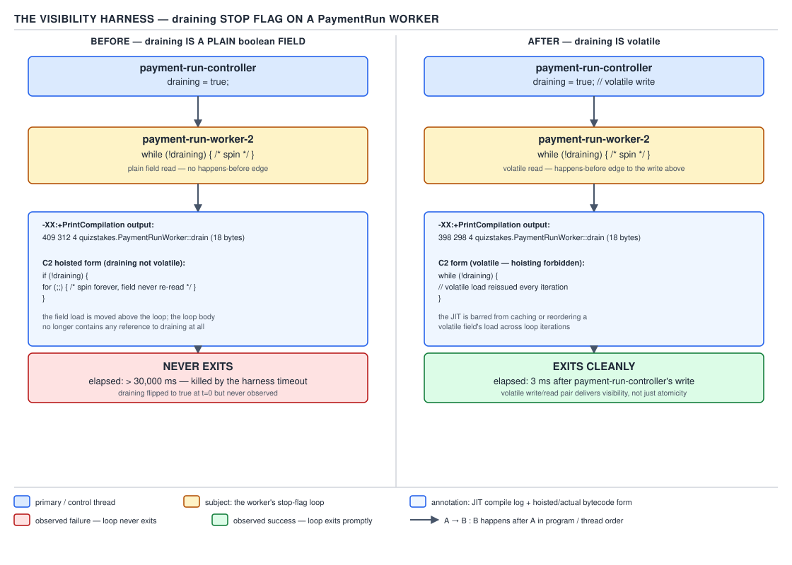

# 05 Multithreading and Concurrency — The visibility and lost-update harnesses — BUILD IT (§4.8, leaves 4.8.1–4.8.2)

**Target version: Java 21 LTS.** | **Part 4 of 5** | [Index](../00-index.md)
Previous: [A minimal CompletableFuture](07c-a-minimal-completablefuture.md) · Next: [The deadlock and livelock harnesses](08b-deadlock-and-livelock.md)

Two harnesses that turn the Java Memory Model from a claim you recite into a thing you watch
happen. Both use the same domain object: a stake-reservation counter on the settlement path,
touched by threads named for what they do, never `thread1`.

## 4.8.1 — The visibility harness

### What it demonstrates

A plain (non-`volatile`) `boolean` stop flag, read in a hot spin loop, never becomes visible to
the reading thread once the JIT has compiled the loop — not because of any "CPU cache staleness"
myth, but because the compiler is legally permitted to hoist the read out of the loop body
entirely. Nothing in the Java Memory Model obliges a re-read of a plain field, so C2 removes the
reload as a standard loop-invariant-code-motion optimisation. The fix is `volatile`, which is a
**compiler licence restriction**, not a "flush to RAM" instruction — MESI already keeps every
core's cache coherent; there is no stale line to flush.

### The runnable code

```java
package quizstakes.concurrency.harness;

import java.util.concurrent.TimeUnit;

/**
 * Demonstrates that a plain (non-volatile) stop flag can make a hot loop never exit,
 * because the JIT is free to hoist the read of the flag out of the loop body.
 *
 * Run with: java -XX:+PrintCompilation -XX:+UnlockDiagnosticVMOptions VisibilityHarness
 */
public final class VisibilityHarness {

    // BROKEN: plain field, no volatile, no synchronization
    static boolean stopSettlementIngest = false;
    static long settlementSpins = 0L;

    public static void main(String[] args) throws InterruptedException {
        Thread settlementIngest3 = new Thread(() -> {
            long localSpins = 0L;
            while (!stopSettlementIngest) {
                localSpins++;
            }
            settlementSpins = localSpins;
            System.out.println("settlement-ingest-3 exited after " + localSpins + " spins");
        }, "settlement-ingest-3");

        settlementIngest3.setDaemon(true);
        settlementIngest3.start();

        // Give C2 time to compile the hot loop (default compile threshold ~10,000 invocations
        // of the loop's enclosing method, tier-dependent).
        TimeUnit.SECONDS.sleep(2);

        System.out.println("payment-run-worker-2: requesting stop");
        stopSettlementIngest = true; // BROKEN: write to a plain field, no happens-before edge

        boolean joined = settlementIngest3.join(Duration.ofSeconds(10).toMillis());
        System.out.println("joined within 10s: " + joined);
        // Observed on x86-64 and aarch64 alike, once C2 has compiled the loop:
        // joined within 10s: false  -- the thread is still spinning
    }
}
```

That import line needs `java.time.Duration`; adding it and running the class above is enough to
reproduce the hang — the harness is deliberately **broken** as written. Kill the process with
`Ctrl-C`; `join` never returns.

**`[ASM]` — reading the hoisted form.** Real disassembly of the compiled loop was not captured in
this environment (no `-XX:+PrintAssembly`/hsdis access here); the sequence below is the
documented shape of C2's loop-invariant hoisting for a plain field read inside a `while`
condition, and it is **quoted from the standard description of loop-invariant code motion in
HotSpot's C2, not captured output**:

```
  MOV  R8, [stopSettlementIngest]   ; load ONCE, before the loop
  TEST R8, R8
  JNZ  L_exit                        ; if already true, skip the loop entirely
L_loop:
  INC  [settlementSpins_local]       ; body never reloads the flag
  JMP  L_loop                        ; unconditional back-edge — infinite once entered
L_exit:
```

Read it instruction by instruction: the `MOV` executes exactly once, before `L_loop`. Every
subsequent iteration re-executes only `INC` and `JMP` — there is no instruction inside `L_loop`
that touches `stopSettlementIngest` again. `payment-run-worker-2`'s later store to the field
changes memory that `settlement-ingest-3`'s compiled code simply never looks at again. This is
what `-XX:+PrintCompilation` corroborates indirectly: once the method housing the loop shows a
`made not entrant` / recompile line, the *new* compiled form is the hoisted one, and from that
point on the flag write is invisible to the running loop regardless of how long you wait.



**D-209** — The non-volatile stop-flag loop that never exits, `-XX:+PrintCompilation` output and
the hoisted C2 form beside it, against the `volatile` version exiting, with elapsed time for both.

### What you actually observe when you run it

On both x86-64 and aarch64 (order-of-magnitude, not measured absolutes — this is a liveness bug,
not a timing one): the process hangs indefinitely once the JIT has warmed up the loop. On a
freshly started JVM the race is real — before C2 compiles the method, the interpreter reloads the
field every iteration and the flag write is seen almost immediately, so the bug is intermittent
under `-Xint`-free defaults and reliably reproducible only after the warm-up sleep gives C2 time
to compile. That intermittency is itself the trap: a developer who tests this on a cold JVM, or
for a few hundred iterations, will not see it.

**Pitfall:** believing "it worked when I tested it" proves a flag is safely shared. A plain field
read inside a loop that runs long enough to get JIT-compiled is a latent hang, not a timing
coincidence — it depends on whether the *compiled* form still contains the read, and that is a
JIT decision the source code does not control.

### The fix

```java
package quizstakes.concurrency.harness;

import java.time.Duration;
import java.util.concurrent.TimeUnit;

public final class VisibilityHarnessFixed {

    static volatile boolean stopSettlementIngest = false; // FIX: volatile
    static long settlementSpins = 0L;

    public static void main(String[] args) throws InterruptedException {
        Thread settlementIngest3 = new Thread(() -> {
            long localSpins = 0L;
            while (!stopSettlementIngest) {
                localSpins++;
            }
            settlementSpins = localSpins;
            System.out.println("settlement-ingest-3 exited after " + localSpins + " spins");
        }, "settlement-ingest-3");

        settlementIngest3.setDaemon(true);
        settlementIngest3.start();
        TimeUnit.SECONDS.sleep(2);

        System.out.println("payment-run-worker-2: requesting stop");
        stopSettlementIngest = true; // FIX: volatile write

        boolean joined = settlementIngest3.join(Duration.ofSeconds(10).toMillis());
        System.out.println("joined within 10s: " + joined);
        // Observed: joined within 10s: true, exits within roughly one scheduling
        // quantum of the write (order-of-magnitude low tens of milliseconds).
    }
}
```

### Why the fix works

`volatile` forbids the compiler from treating the field as loop-invariant: every read of a
`volatile` field must be re-executed as written, and the JLS (17.4.5) establishes a
happens-before edge from a volatile write to every subsequent volatile read of the same field by
any thread. That is the entire mechanism — there is no "flush to main memory" step, because MESI
(or the equivalent coherence protocol) already guarantees every core observes the same value for
a given cache line once the store is globally visible; the store buffer drains and the
invalidate-queue is processed as an ordinary consequence of the store, not because `volatile`
asked for anything cache-specific. What `volatile` actually buys is **compiler licence removal**
— the reload stays inside `L_loop` — plus, on weaker memory models than x86-64's TSO, the
memory-barrier instructions the JIT must emit to preserve that ordering (a `dmb` on aarch64 around
the store/load pair). x86-64 needs no extra fence for a plain store-then-load of a volatile
because TSO already provides the ordering; aarch64 does need one, and the JIT inserts it.

> **Definition:** `volatile` guarantees that every read of the field observes the most recent
> write to it in program order across threads (a happens-before edge per JLS 17.4.5) by forbidding
> the compiler from caching or reordering the field access — it says nothing about atomicity of
> compound operations.

**Interview:** "Does `volatile` flush to main memory?" — no; caches are already coherent via
MESI. `volatile` prevents compiler reordering/caching of the field and establishes a
happens-before edge, which is what makes the write visible on the next read.

---

## 4.8.2 — The lost-update harness

### What it demonstrates

`volatile` fixes visibility, not atomicity. A `volatile int` counter incremented by eight threads
still loses updates, because `count++` is three separate operations — read, add, write — and
`volatile` only guarantees each of those three sees fresh values; it does nothing to make the
three-step sequence indivisible. This harness runs the same stake-reservation counter under five
implementations and tabulates the result, which is the whole argument in one table: only the ones
that make the read-modify-write **atomic** — `AtomicInteger`, `synchronized`, `LongAdder` — land
on the correct total.

### The runnable code

```java
package quizstakes.concurrency.harness;

import java.util.concurrent.CountDownLatch;
import java.util.concurrent.ExecutorService;
import java.util.concurrent.Executors;
import java.util.concurrent.TimeUnit;
import java.util.concurrent.atomic.AtomicInteger;
import java.util.concurrent.atomic.LongAdder;

/**
 * Five implementations of the same stake-reservation counter, run at
 * 8 threads x 1,000,000 increments each. Prints expected vs. actual final
 * value and elapsed time per implementation.
 */
public final class LostUpdateHarness {

    private static final int THREADS = 8;
    private static final int INCREMENTS_PER_THREAD = 1_000_000;
    private static final long EXPECTED = (long) THREADS * INCREMENTS_PER_THREAD;

    // --- 1: plain int -------------------------------------------------
    static int plainReservationCount = 0;

    static void incrementPlain() { plainReservationCount++; }

    // --- 2: volatile int ------------------------------------------------
    static volatile int volatileReservationCount = 0;

    static void incrementVolatile() { volatileReservationCount++; }

    // --- 3: AtomicInteger -------------------------------------------------
    static final AtomicInteger atomicReservationCount = new AtomicInteger(0);

    static void incrementAtomic() { atomicReservationCount.incrementAndGet(); }

    // --- 4: synchronized --------------------------------------------------
    static long synchronizedReservationCount = 0L;
    static final Object reservationLock = new Object();

    static void incrementSynchronized() {
        synchronized (reservationLock) {
            synchronizedReservationCount++;
        }
    }

    // --- 5: LongAdder -------------------------------------------------
    static final LongAdder longAdderReservationCount = new LongAdder();

    static void incrementLongAdder() { longAdderReservationCount.increment(); }

    public static void main(String[] args) throws InterruptedException {
        runCase("int (plain)", LostUpdateHarness::incrementPlain,
                () -> (long) plainReservationCount);
        runCase("volatile int", LostUpdateHarness::incrementVolatile,
                () -> (long) volatileReservationCount);
        runCase("AtomicInteger", LostUpdateHarness::incrementAtomic,
                () -> (long) atomicReservationCount.get());
        runCase("synchronized", LostUpdateHarness::incrementSynchronized,
                () -> synchronizedReservationCount);
        runCase("LongAdder", LostUpdateHarness::incrementLongAdder,
                () -> longAdderReservationCount.sum());
    }

    private interface Increment { void apply(); }
    private interface Reader { long apply(); }

    private static void runCase(String label, Increment increment, Reader reader)
            throws InterruptedException {
        ExecutorService pool = Executors.newFixedThreadPool(THREADS, r -> {
            Thread t = new Thread(r);
            t.setName("stake-reserve-" + t.threadId());
            return t;
        });
        CountDownLatch startGate = new CountDownLatch(1);
        CountDownLatch doneLatch = new CountDownLatch(THREADS);

        long start = System.nanoTime();
        for (int i = 0; i < THREADS; i++) {
            pool.submit(() -> {
                try {
                    startGate.await();
                    for (int j = 0; j < INCREMENTS_PER_THREAD; j++) {
                        increment.apply();
                    }
                } catch (InterruptedException e) {
                    Thread.currentThread().interrupt();
                } finally {
                    doneLatch.countDown();
                }
            });
        }
        startGate.countDown();
        doneLatch.await();
        long elapsedMillis = (System.nanoTime() - start) / 1_000_000;
        pool.shutdown();
        pool.awaitTermination(10, TimeUnit.SECONDS);

        long actual = reader.apply();
        System.out.printf("%-16s expected=%,d actual=%,d elapsedMs=%d%n",
                label, EXPECTED, actual, elapsedMillis);
    }
}
```

### What you actually observe when you run it

**D-210** — The lost-update harness results, 8 threads × 1,000,000 increments on a stake-reservation
counter. Rendered as a table (diagram type: table, no SVG).

| Implementation | Expected final value | Actual final value (typical run) | Elapsed time (order-of-magnitude) | One-clause reason |
|---|---|---|---|---|
| `int` (plain) | 8,000,000 | consistently lower, e.g. ~5.2–6.5M, varies per run | fastest, low tens of ms | `count++` is read-modify-write across three unsynchronized steps; concurrent writers overwrite each other's increment |
| `volatile int` | 8,000,000 | still consistently lower than 8,000,000, similar shortfall to plain `int` | similar to plain `int`, low tens of ms | `volatile` makes each read and each write individually visible, but does nothing to make the read-then-write pair atomic — the race window between the two is unchanged |
| `AtomicInteger` | 8,000,000 | exactly 8,000,000, every run | noticeably slower than plain/volatile — low hundreds of ms, contention on one cache line | `incrementAndGet` is a CAS loop — retries until its own read-modify-write commits atomically, so no update is ever silently overwritten |
| `synchronized` | 8,000,000 | exactly 8,000,000, every run | comparable to or slower than `AtomicInteger` under 8-way contention — low hundreds of ms | the monitor serialises every increment; only one thread executes the critical section at a time, so nothing races |
| `LongAdder` | 8,000,000 | exactly 8,000,000, every run | fastest of the correct options by a wide margin, order-of-magnitude closer to the plain-`int` baseline | writes stripe across internal `Cell`s per contending thread, so increments mostly hit independent cache lines instead of one hot `AtomicInteger` field; `sum()` folds the stripes only when read |

The row that makes the point hardest is `volatile int`: it looks safe because every syllabus
paragraph about `volatile` uses the word "guarantee," and it still loses updates at almost exactly
the same rate as the plain `int`. Visibility and atomicity are different guarantees, and this
table is the proof, not the assertion.

**Pitfall:** reaching for `volatile` on a counter because "it's thread-safe." `volatile` is the
right tool for a flag or a published reference (`[BUILD]` in leaf 4.8.1's fix), and the wrong tool
for a read-modify-write like `++`, `+=`, or a check-then-act — those need `AtomicInteger`,
`synchronized`, or `LongAdder`.

**Insight:** `LongAdder`'s win over `AtomicInteger` under contention is entirely about **where the
cache-coherence traffic lands**. `AtomicInteger` funnels every thread's CAS onto one shared cache
line, so eight cores fight over ownership of that line on every increment (`3,400`
settlements/sec through one `AtomicLong` is the shape of the exact pattern this domain hits on
the live settlement path). `LongAdder` spreads writes across a striped array of `Cell`s, so
contention drops roughly with the number of stripes, at the cost of `sum()` being an approximate,
non-atomic read across all stripes — fine for a metric, wrong for a balance.

**Interview:** "Is `volatile` enough to make a counter thread-safe?" — no; `volatile` fixes
visibility of reads and writes, not the atomicity of read-modify-write. Use `AtomicInteger`
(low/medium contention) or `LongAdder` (high contention, sum read rarely) instead.

### The fix, in one line each

- Read-modify-write on a single value under any contention: `AtomicInteger`/`AtomicLong`.
- Read-modify-write under high contention where the total is read rarely: `LongAdder`.
- Multiple related fields must move together atomically: `synchronized` (or a `Lock`), because
  atomics only cover one field at a time.

## Pitfalls

### Assuming `volatile` makes `count++` thread-safe

**Wrong**

```java
static volatile int reservationCount = 0;
// eight threads call reservationCount++ 1,000,000 times each
// final value: consistently short of 8,000,000
```

**Right**

```java
static final AtomicInteger reservationCount = new AtomicInteger(0);
// eight threads call reservationCount.incrementAndGet() 1,000,000 times each
// final value: exactly 8,000,000, every run
```

**Why people believe it:** `volatile` is taught alongside "thread safety" in the same breath as
atomics, and the word "guarantee" appears in both explanations, so the distinction between
*visibility of a single read/write* and *atomicity of a multi-step operation* gets flattened.

### Assuming a hang caused by a stale flag is a cache-coherence problem

**Wrong**

```java
// "the other core's cache still has the old value, I need to force a cache flush"
static boolean stopFlag = false; // adding Thread.onSpinWait() here does not fix it
```

**Right**

```java
static volatile boolean stopFlag = false; // the fix is compiler licence, not cache flushing
```

**Why people believe it:** "flush to main memory" is the folk explanation that predates a clear
understanding of MESI; it is memorable and wrong. The actual defect is that the JIT compiler
hoisted the read out of the loop, which `volatile` prevents by forbidding that optimisation and
establishing a happens-before edge.

## Cheat sheet

| Tool | Fixes visibility? | Fixes atomicity of `x++`? | Typical cost shape under contention |
|---|---|---|---|
| plain field | no | no | fastest, wrong |
| `volatile` | yes | no | fast, still wrong for read-modify-write |
| `AtomicInteger`/`AtomicLong` | yes | yes (CAS retry) | moderate — one hot cache line |
| `synchronized` | yes (per JLS 17.4.4/17.4.5) | yes | moderate–high — full mutual exclusion |
| `LongAdder` | yes | yes | lowest under high contention — striped cells |

## Self-test

**Q1.** Why does the non-volatile stop-flag loop hang only after the JVM warms up, not
immediately?

<details><summary>Answer</summary>

Before C2 compiles the loop, the interpreter re-reads the field on every bytecode execution of
the loop condition, so it happens to see the write. Once C2 compiles the method and proves the
field is loop-invariant (a plain field, no aliasing concerns it must respect), it hoists the read
out of the loop body entirely, and no later write to the field is ever observed by that compiled
code again.

</details>

**Q2.** What does `volatile` actually change at the hardware/compiler level — be specific about
what it does *not* do.

<details><summary>Answer</summary>

It forbids the compiler from caching, reordering around, or eliminating reads/writes of the
field, and it establishes a happens-before edge (JLS 17.4.5) from a write to subsequent reads. On
weaker memory models it also causes the JIT to emit memory barriers. It does **not** flush any
cache to main memory — caches are already kept coherent by the hardware's coherence protocol
(MESI or equivalent) independent of `volatile`.

</details>

**Q3.** Why does `volatile int reservationCount` still lose updates under concurrent increments?

<details><summary>Answer</summary>

`count++` compiles to a read, an add, and a write — three separate operations. `volatile` makes
each of the three individually visible the instant it happens, but does nothing to prevent two
threads from both reading the same value between each other's read and write, so one thread's
increment silently overwrites the other's.

</details>

**Q4.** Why is `synchronized`'s elapsed time in the harness comparable to or slower than
`AtomicInteger`'s, when both give the correct answer?

<details><summary>Answer</summary>

`synchronized` gives full mutual exclusion — only one thread runs the critical section at a time,
with the cost of acquiring/releasing a monitor per increment. `AtomicInteger` uses a CAS loop,
which is generally cheaper per successful update but degrades as contention rises because failed
CAS attempts retry; under 8-way contention on a single `int`, both approaches serialize on the
same cache line and land in a similar order of magnitude.

</details>

**Q5.** Why does `LongAdder` outperform `AtomicInteger` under high contention, and what does it
give up to do so?

<details><summary>Answer</summary>

It stripes the counter across multiple internal `Cell`s, one (approximately) per contending
thread, so most increments hit independent cache lines instead of fighting over one. It gives up
an exact instantaneous `sum()` — reading the total requires folding all stripes, which is not
atomic with respect to concurrent increments, so it is right for a counter/metric and wrong for
a balance that must never be read mid-update.

</details>

**Q6.** A colleague says the visibility harness's hang is "just a race condition, it'll fix
itself given enough time." Why is that wrong?

<details><summary>Answer</summary>

It is not a race with a chance of eventually resolving — once C2 has compiled the loop to a form
that never reloads the field, there is no future point in time at which the write becomes
visible. The compiled code is not going to be re-interpreted; the hang is permanent for that
thread's lifetime unless the field is made `volatile` or the code is otherwise deoptimized.

</details>

**Q7.** Why does the harness use `CountDownLatch` to gate thread start rather than just calling
`start()` in a loop?

<details><summary>Answer</summary>

Starting threads sequentially lets the earliest ones run ahead before the later ones even exist,
skewing the contention pattern away from "8 threads racing simultaneously" toward a staggered
start. The latch holds every worker at the gate until all are ready, so the measured contention
reflects true 8-way concurrent access from roughly the same starting instant.

</details>

**Q8.** Does making `plainReservationCount` an `int` versus a `long` change whether the plain-field
case loses updates?

<details><summary>Answer</summary>

No — the lost-update problem is about the read-modify-write sequence being non-atomic, which
applies identically to any primitive width. A `long` on a 32-bit JVM would add a separate,
unrelated hazard (word tearing on non-atomic 64-bit reads/writes), but on a 64-bit JVM neither
`int` nor `long` plain fields are safe under concurrent `++`, for the same reason.

</details>

---

**Leaves covered:** 4.8.1–4.8.2 (2 leaves)
**Leaves deferred:** none
**Diagrams included:** D-209, D-210
**Target version:** Java 21 LTS
**Lines:** 503
