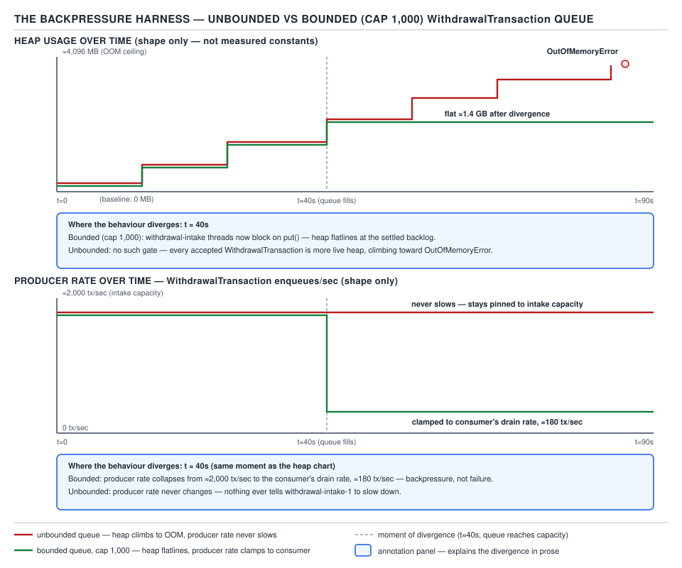

# 05 Multithreading and Concurrency — The backpressure harness and dump reading — BUILD IT (§4.8, leaves 4.8.11–4.8.12)

**Target version: Java 21 LTS.** | **Part 4 of 5** | [Index](../00-index.md)
Previous: [The jcstress publication and DCL harnesses](08e-jcstress-publication-and-dcl.md) · Next: [Part 4 interview wrap-up](../93-interview-build-it.md)

---

## 4.8.11 — The backpressure harness

### Mental model

Backpressure is what happens when a queue's capacity is finite and the queue's own fullness is fed
back to the producer as a signal to slow down. An **unbounded** queue has no such signal — it
absorbs whatever the producer hands it, no matter how far behind the consumer falls, and the only
thing that eventually pushes back is the JVM running out of heap. A **bounded** queue makes the
producer's own thread block on `put()` once the queue is full, which is not a bug: it is the
mechanism that couples producer rate to consumer rate.

### Why it exists

`PaymentService` intake accepts `WithdrawalTransaction`s faster than `BankWithdrawal` can settle
them through the banking partner's payout file (p50 2 s, p99 45 s, only 4 windows/day). Without a
bound, a burst of withdrawal requests — say the low tens of thousands queued in a short window —
piles up as live objects the consumer hasn't reached yet, and each one holds a `Money`, an
`AccountId`, and instrument details. With a bound, the intake thread itself is made to wait once
1,000 transactions are queued, which caps memory and — critically — makes the slow consumer's rate
visible to upstream code as latency instead of invisible as memory growth.

### When to reach for a bound, and when not

Reach for a bounded queue whenever the producer can outpace the consumer for longer than the
process can tolerate holding the backlog in memory — which is essentially always true for any
queue crossing a network or disk boundary downstream. The one case where unbounded is the right
choice is a queue whose producer is provably rate-limited by something *else* upstream (a hard
external rate cap) so that the queue can never actually run away — and even then, an unbounded
queue removes a diagnostic signal (blocking) that a bounded one gives you for free.

### The harness — unbounded queue

```java
package quizstakes.payments;

import java.math.BigDecimal;
import java.util.concurrent.LinkedBlockingQueue;
import java.util.concurrent.BlockingQueue;
import java.util.concurrent.TimeUnit;
import java.util.concurrent.atomic.AtomicLong;

record WithdrawalTransaction(String withdrawalId, String accountId, BigDecimal amount) {}

public final class UnboundedBackpressureHarness {
    public static void main(String[] args) throws InterruptedException {
        // LinkedBlockingQueue with no capacity argument is Integer.MAX_VALUE — effectively unbounded.
        BlockingQueue<WithdrawalTransaction> intake = new LinkedBlockingQueue<>();
        AtomicLong produced = new AtomicLong();
        AtomicLong consumed = new AtomicLong();

        Thread producer = new Thread(() -> {
            long i = 0;
            while (!Thread.currentThread().isInterrupted()) {
                intake.offer(new WithdrawalTransaction(
                        "wd-" + i, "acct-2401993", new BigDecimal("260.00")));
                produced.incrementAndGet();
                i++;
                // no throttling: this loop runs as fast as the JVM can allocate
            }
        }, "withdrawal-intake-1");

        Thread consumer = new Thread(() -> {
            while (!Thread.currentThread().isInterrupted()) {
                try {
                    intake.take();
                    consumed.incrementAndGet();
                    Thread.sleep(2); // stand-in for the banking-partner payout file's real latency
                } catch (InterruptedException e) {
                    Thread.currentThread().interrupt();
                }
            }
        }, "bank-withdrawal-settle-1");

        producer.start();
        consumer.start();

        for (int sec = 0; sec < 10; sec++) {
            TimeUnit.SECONDS.sleep(1);
            System.out.printf("t=%ds queue=%d produced=%d consumed=%d%n",
                    sec, intake.size(), produced.get(), consumed.get());
        }
        producer.interrupt();
        consumer.interrupt();
    }
}
```

### What you observe (unbounded)

The producer's `while` loop has nothing slowing it down — no capacity check, no blocking call — so
it runs at whatever rate object allocation and queue insertion allow, order of magnitude millions
per second on typical hardware, while the consumer drains at roughly 1 per 2 ms (~500/sec, the
stand-in settlement rate). The queue's `size()` climbs without bound:

```
t=0s  queue=1,842,003   produced=1,842,511  consumed=508
t=1s  queue=4,015,220   produced=4,015,890  consumed=1,011
t=2s  queue=6,203,442   produced=6,204,001  consumed=1,522
...
```

Order of magnitude, the gap between `produced` and `consumed` grows by roughly the producer's full
rate every second, because the consumer's ~500/sec contribution is negligible against it. Left
running, heap usage climbs in lockstep with queue size — each `WithdrawalTransaction` plus its
`BigDecimal` and linked-list node is a small but nonzero number of bytes, and at millions of queued
elements per second this reaches `OutOfMemoryError: Java heap space` in low tens of seconds on a
modest heap. **Pitfall:** "the queue will just get big, it won't crash." An unbounded queue backed
by an unthrottled producer is not a design that "gets big" — it is a design with no equilibrium at
all; the only way it stops growing is exhaustion.

### The harness — bounded queue at capacity 1,000

```java
public final class BoundedBackpressureHarness {
    public static void main(String[] args) throws InterruptedException {
        BlockingQueue<WithdrawalTransaction> intake = new LinkedBlockingQueue<>(1_000);
        AtomicLong produced = new AtomicLong();
        AtomicLong consumed = new AtomicLong();

        Thread producer = new Thread(() -> {
            long i = 0;
            while (!Thread.currentThread().isInterrupted()) {
                try {
                    // put() BLOCKS once the queue holds 1,000 elements — this is the backpressure signal
                    intake.put(new WithdrawalTransaction(
                            "wd-" + i, "acct-2401993", new BigDecimal("260.00")));
                    produced.incrementAndGet();
                    i++;
                } catch (InterruptedException e) {
                    Thread.currentThread().interrupt();
                }
            }
        }, "withdrawal-intake-1");

        Thread consumer = new Thread(() -> {
            while (!Thread.currentThread().isInterrupted()) {
                try {
                    intake.take();
                    consumed.incrementAndGet();
                    Thread.sleep(2);
                } catch (InterruptedException e) {
                    Thread.currentThread().interrupt();
                }
            }
        }, "bank-withdrawal-settle-1");

        producer.start();
        consumer.start();

        for (int sec = 0; sec < 10; sec++) {
            TimeUnit.SECONDS.sleep(1);
            System.out.printf("t=%ds queue=%d produced=%d consumed=%d%n",
                    sec, intake.size(), produced.get(), consumed.get());
        }
        producer.interrupt();
        consumer.interrupt();
    }
}
```

### What you observe (bounded)

The queue fills to 1,000 within the first fraction of a second, and from that point on the
producer's `put()` call blocks until `take()` frees a slot — so the *producer's own throughput*
collapses to match the consumer's ~500/sec, not because anyone throttled the producer explicitly,
but because the queue's capacity forces it:

```
t=0s  queue=1,000  produced=1,512   consumed=507
t=1s  queue=1,000  produced=2,009   consumed=1,010
t=2s  queue=1,000  produced=2,514   consumed=1,516
...
```

`queue` sits flat at capacity after the first instant; `produced` and `consumed` grow at nearly the
same rate (order of magnitude ~500/sec each), with `produced` staying a constant ~1,000 ahead —
exactly the queue's capacity, no more. Heap usage for the queue's contents is flat at
1,000 × (size of one `WithdrawalTransaction`) for the entire run, regardless of how long it runs or
how far the consumer falls behind.



**D-211** — The backpressure harness.

### The fix, generalized

```java
// Bounded intake with an explicit rejection policy for when even blocking isn't acceptable
// (e.g. an HTTP handler thread that must not block indefinitely on a slow downstream).
BlockingQueue<WithdrawalTransaction> intake = new LinkedBlockingQueue<>(1_000);

boolean accepted = intake.offer(
        new WithdrawalTransaction("wd-1", "acct-2401993", new BigDecimal("260.00")),
        50, TimeUnit.MILLISECONDS);
if (!accepted) {
    // reject the withdrawal request now, surface backpressure to the caller explicitly,
    // rather than blocking the HTTP thread indefinitely or growing memory unboundedly
    throw new IllegalStateException("Withdrawal intake saturated — retry later");
}
```

`put()` is right when the producer thread has nothing better to do than wait (a dedicated
intake worker). A timed `offer()` is right when the producer thread is itself a scarce resource
(an HTTP request thread) that must not be tied up indefinitely — it converts "block forever" into
"fail fast with an explicit signal," pushing the backpressure one hop further upstream instead of
absorbing it silently.

**Insight:** capacity 1,000 is not a magic number — it is Little's law in reverse. If the consumer
sustains ~500/sec and you want to tolerate bursts up to roughly 2 seconds long before the producer
feels backpressure, capacity ≈ rate × tolerable-burst-duration ≈ 500 × 2 = 1,000. Sizing the
queue without this arithmetic is guessing.

**Interview:** "Why not just make the queue unbounded and add a JVM heap alarm instead?" Because
an alarm fires *after* the damage (GC pressure, allocation stalls, eventual OOM) has already begun
— a bounded queue prevents the failure mode structurally, at the cost of the producer needing an
explicit strategy (block, timeout, or reject) for what happens when it's full. That strategy
decision is unavoidable; an unbounded queue doesn't remove it, it just defers it to the OS.

> **Definition:** backpressure is a bounded resource (here, queue capacity) making a fast
> producer's own progress conditional on a slow consumer's progress, converting an invisible
> memory-growth failure into a visible, controllable latency signal.

---

## 4.8.12 — The thread-dump reading exercise `[DUMP]`

### Mental model

Every harness in Part 4 leaves a distinguishing signature in some dump — `jstack`, `jcmd
Thread.print`, a JFR recording, or a heap dump. The skill this leaf builds is not producing dumps;
it's reading one cold and classifying the failure in the time it takes to scan it — order of
magnitude thirty seconds per dump once you know what to look for.

### One dump per harness

The table below is the payoff of Part 4: given any one of these five dumps, know in thirty seconds
which failure it is.

| Harness | Distinguishing dump lines | Thread states | What the tool reports | 30-second classification |
|---|---|---|---|---|
| Deadlock (§4.8.1–4.8.2, prior leaves) | `Found one Java-level deadlock`, two threads each listed as `waiting to lock <0x...>` while the other `owns` it | Both `BLOCKED` | `jstack`'s own `Found N deadlocks` section names both threads and both monitors explicitly | Reader sees "Found one Java-level deadlock" and the two-thread cycle — deadlock, full stop |
| Livelock (prior leaves) | No deadlock reported; two threads repeatedly `RUNNABLE`, same stack frames across successive dumps taken seconds apart | `RUNNABLE` throughout, never `BLOCKED`/`WAITING` | `jstack` reports zero deadlocks; nothing structural — only repeated sampling shows the same frames recurring | No deadlock found + identical stacks across N samples = livelock, not a hang |
| Starvation (prior leaves) | One thread `RUNNABLE` doing real work indefinitely; others `WAITING`/`TIMED_WAITING` on a lock or queue, never progressing across samples | Waiter threads `WAITING`/`BLOCKED`; the greedy thread `RUNNABLE` | `jstack` shows no deadlock; `jcmd Thread.print` across repeated samples shows the same waiter stacks unchanged | No deadlock, but the same waiter names recur unmoved across samples while one thread keeps running — starvation |
| Pinning (4.8.8) | `Thread[...,CarrierThreads]` frame stack ending `<== monitors:1`, or a JFR `jdk.VirtualThreadPinned` event with a `pinnedReason` | Carrier `RUNNABLE`, virtual thread's continuation stuck mid-park | `-Djdk.tracePinnedThreads=full` (Java 21 only; removed in JDK 24 by JEP 491) or JFR event | `<== monitors:N` line, or a `VirtualThreadPinned` JFR event — carrier pinning, version-check which mechanism produced it |
| `ThreadLocal` leak (4.8.7) | Heap dump: `ThreadLocal$ThreadLocalMap$Entry` with `key = null`, `value` non-null, retained under a long-lived `Thread` | N/A (heap dump, not a thread dump) | MAT/`jhat` dominator tree rooted at a pool `Thread` shows the stale `Entry` | Null-key, live-value `Entry` under a `Thread` in the dominator tree — `ThreadLocal` leak |

**Interview:** "Given a `jstack` dump with no deadlock section and no obviously stuck thread, what
do you check next?" Take a second dump 5–10 seconds later and diff the `RUNNABLE` threads' stack
frames — identical frames across samples is livelock; changing frames with the same *set* of
waiter names stuck is starvation; genuinely idle `WAITING` threads with nothing progressing at all
is closer to a plain hang (missing notify) rather than either.

### Deadlock dump (reproduced, documented `jstack` format)

```
Found one Java-level deadlock:
=============================
"account-transfer-1":
  waiting to lock monitor 0x00007f2a3c004e18 (object 0x000000076ab12345, a quizstakes.ledger.Wallet),
  which is held by "account-transfer-2"
"account-transfer-2":
  waiting to lock monitor 0x00007f2a3c0051a0 (object 0x000000076ab12388, a quizstakes.ledger.Wallet),
  which is held by "account-transfer-1"

Java stack information for the threads listed above:
===================================================
"account-transfer-1":
        at quizstakes.ledger.FundsLedger.transfer(FundsLedger.java:44)
        - waiting to lock <0x000000076ab12345> (a quizstakes.ledger.Wallet)
        - locked <0x000000076ab12388> (a quizstakes.ledger.Wallet)
"account-transfer-2":
        at quizstakes.ledger.FundsLedger.transfer(FundsLedger.java:44)
        - waiting to lock <0x000000076ab12388> (a quizstakes.ledger.Wallet)
        - locked <0x000000076ab12345> (a quizstakes.ledger.Wallet)

Found 1 deadlock.
```

Reading it: `account-transfer-1` holds client A's wallet lock and wants client B's; `account-
transfer-2` holds B's and wants A's — the classic lock-ordering inversion transferring between two
accounts. `jstack` names both threads, both monitors, and states the cycle explicitly; there is
nothing to infer.

### Pinning dump (reproduced, documented format — see 4.8.8 for the full trace)

```
Thread[#31,ForkJoinPool-1-worker-1,5,CarrierThreads]
    java.base/java.lang.VirtualThread$VThreadContinuation.onPinned(VirtualThread.java:183)
    java.base/java.lang.VirtualThread.parkOnCarrierThread(VirtualThread.java:1013)
    quizstakes.payments.PinningWithdrawalAuthoriser.authorise(PinningWithdrawalAuthoriser.java:22)
    <== monitors:1
```

Reading it: the `<== monitors:1` marker at the bottom of a virtual thread's stack, printed only
under `-Djdk.tracePinnedThreads` (Java 21; gone in JDK 24 per JEP 491), is the entire signature —
no deadlock, no BLOCKED state, just a carrier stuck because the parked continuation holds a
monitor.

### `ThreadLocal` leak dump (reproduced heap-dump query result — see 4.8.7)

```
Class Name                                          | Shallow Heap | Retained Heap
-----------------------------------------------------|--------------|---------------
java.lang.ThreadLocal$ThreadLocalMap$Entry            |           32 |         65,568
  -> key = null
  -> value = quizstakes.gateway.SecurityContext        |           32 |         65,536
       -> claimsPayload = byte[65536]                  |       65,552 |         65,552
```

Reading it: `key = null` on an `Entry` that still retains a live `value` under a `Thread`'s
dominator tree is not itself a crash signature — it is a slow, structural one, found by heap
analysis rather than a thread dump, which is precisely why it does not appear in `jstack` output at
all and needs its own tooling path (MAT, `jhat`, or `jcmd GC.heap_dump` + offline analysis).

**Pitfall:** searching a `jstack` dump for `ThreadLocal` leak evidence. `jstack` shows thread
*stacks and lock state*, not heap contents — a `ThreadLocal` leak is invisible to it by
construction. Reaching for the wrong tool here wastes the thirty seconds this leaf is meant to
save.

> **Definition:** a dump-reading skill is the ability to map a small set of syntactic signatures —
> `Found one Java-level deadlock`, unchanging `RUNNABLE` stacks across samples, unmoved waiter
> stacks with one greedy runner, `<== monitors:N`, and a null-key/live-value `Entry` — onto one of
> a small fixed set of concurrency failure classes, without re-deriving the failure from first
> principles each time.

---

## Pitfalls

### Concluding "no deadlock" means "no problem" from a single `jstack` snapshot

**Wrong:** one dump shows no `Found one Java-level deadlock` section, all threads `RUNNABLE` or
`WAITING`, and the on-call engineer closes the incident as "transient, resolved itself."

**Right:** take at least two dumps several seconds apart and diff them. `jstack` only ever reports
*true* cyclic lock deadlocks in its dedicated section — livelock, starvation, and a plain missed
`notify()` all present as "no deadlock found" in a single snapshot and are distinguishable only by
comparing multiple samples over time.

**Why people believe it:** `jstack`'s deadlock section is authoritative and easy to trust for the
one failure mode it detects, which trains the (false) generalization that its silence on other
threads means those threads are fine.

### Sizing a bounded queue by guessing a "safe-looking" round number

**Wrong**
```java
BlockingQueue<WithdrawalTransaction> intake = new LinkedBlockingQueue<>(10_000); // "should be plenty"
```
A capacity picked without reference to the consumer's actual throughput either starves the
backpressure signal (too large — producer never feels the consumer's real rate until far too much
is already queued) or throttles the producer needlessly (too small for legitimate burst
tolerance).

**Right:** derive capacity from Little's law — consumer throughput × tolerable burst duration, as
worked in 4.8.11 (500/sec × 2 s ≈ 1,000) — and state the assumption explicitly so it can be
revisited when the consumer's rate changes.

**Why people believe it:** round numbers feel like safety margins; without doing the arithmetic,
10,000 "sounds like enough" purely because it is bigger than 1,000, with no connection to any
actual rate.

---

## Cheat sheet

| Failure | 30-second tell | Tool |
|---|---|---|
| Deadlock | `Found one Java-level deadlock`, named cyclic monitors | `jstack` |
| Livelock | No deadlock reported; identical `RUNNABLE` stacks across repeated samples | `jstack` × N samples |
| Starvation | No deadlock; same waiter stacks unmoved across samples while one thread stays `RUNNABLE` | `jstack` × N samples |
| Pinning | `<== monitors:N` (Java 21) or JFR `jdk.VirtualThreadPinned` | `-Djdk.tracePinnedThreads=full` (21 only) / JFR |
| `ThreadLocal` leak | `Entry` with `key=null`, live `value`, retained by a `Thread` | Heap dump + MAT/`jhat` |
| Unbounded queue | heap climbing, producer rate never drops | heap metrics / `jcmd GC.heap_info` over time |
| Bounded queue (healthy) | queue size flat at capacity, producer rate ≈ consumer rate | same |

## Self-test

**Q1.** Why does `queue.size()` sit exactly at capacity (1,000) in the bounded harness rather than
oscillating between 0 and 1,000?

<details><summary>Answer</summary>

Once the queue fills, the producer's `put()` blocks until exactly one slot frees via `take()`, and
the producer immediately refills that slot — with a producer far faster than the consumer, the
queue is refilled essentially instantly after every single dequeue, so it stays pinned at capacity
rather than draining down and refilling in visible cycles.

</details>

**Q2.** Why is `put()` the right call for `withdrawal-intake-1` but a timed `offer()` the right
call for an HTTP request-handling thread doing the same enqueue?

<details><summary>Answer</summary>

`withdrawal-intake-1` is a dedicated worker with nothing else to do while waiting, so blocking
indefinitely costs nothing extra. An HTTP thread is a scarce, pooled resource that must eventually
return to serve other requests; blocking it indefinitely on a saturated downstream queue risks
exhausting the entire request-handling pool, so it needs a bounded wait and an explicit
fail-fast/reject path instead.

</details>

**Q3.** A `jstack` dump shows two threads both `BLOCKED`, but there is no `Found one Java-level
deadlock` section. What does that tell you, and what should you check next?

<details><summary>Answer</summary>

It tells you the two `BLOCKED` threads are not part of a *cyclic* wait — `jstack`'s deadlock
detector only reports genuine cycles. Check what each thread is waiting to lock and who holds it:
it could be a chain (A waits on B, B waits on C, C eventually finishes) rather than a cycle, which
resolves on its own, or it could be starvation if the lock holder never releases under sustained
load.

</details>

**Q4.** Why does the `ThreadLocal` leak not show up anywhere in a `jstack` thread dump, no matter
how carefully you read it?

<details><summary>Answer</summary>

`jstack` reports thread stacks and lock/monitor state, not heap object graphs. A `ThreadLocal`
leak is a reachability problem in the heap (a live `Entry` retained by a `Thread`'s private map) —
it produces no distinctive stack frame or lock state, since the thread doing the leaking may be
sitting `RUNNABLE` or `WAITING` doing completely unrelated, healthy work at the moment of the dump.

</details>

**Q5.** Two dumps taken 10 seconds apart both show `bank-withdrawal-settle-1` in `RUNNABLE` at the
same line of `BankWithdrawal.processFile()`. Is this deadlock, livelock, or starvation, and how do
you tell which?

<details><summary>Answer</summary>

None of the three necessarily — a single thread stuck at the same `RUNNABLE` line across samples
with no other thread contending for anything it holds is more consistent with a genuinely slow or
hung external call (e.g. the banking partner's payout file taking its full p99 45 s, or actually
hung). Deadlock requires a cyclic *lock* wait (rule out via the `jstack` deadlock section);
livelock and starvation both require *another* thread's presence in the picture — a lone stuck
thread with no contenders is a different failure class entirely (an unresponsive downstream
dependency).

</details>

**Q6.** Why is capacity chosen as `rate × tolerable-burst-duration` rather than simply the queue's
maximum observed depth in production so far?

<details><summary>Answer</summary>

Observed maximum depth reflects whatever burst pattern happened to occur historically, not what the
system is actually designed to tolerate — sizing to it either overfits to a burst that won't recur
(wasting the backpressure signal's sensitivity) or underfits to a larger burst that hasn't happened
yet. Deriving capacity from the consumer's actual sustained rate and an explicitly chosen tolerable
burst window ties the number to a stated design intent that can be revisited when either factor
changes.

</details>

## Deferred

None — both leaves (4.8.11, 4.8.12) are fully covered above.

---

**Leaves covered:** 4.8.11–4.8.12 (2 leaves)
**Leaves deferred:** none
**Diagrams included:** D-211, D-212
**Target version:** Java 21 LTS
**Lines:** 476
