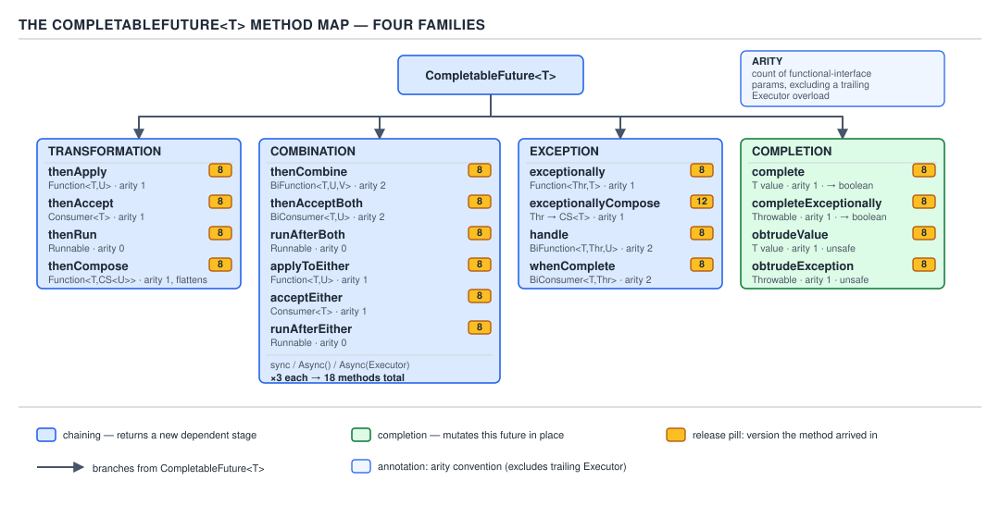
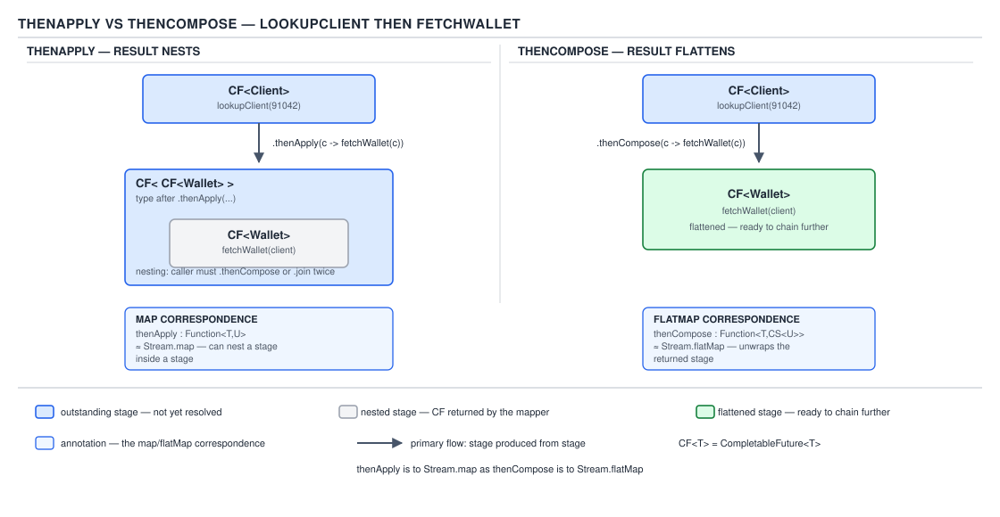
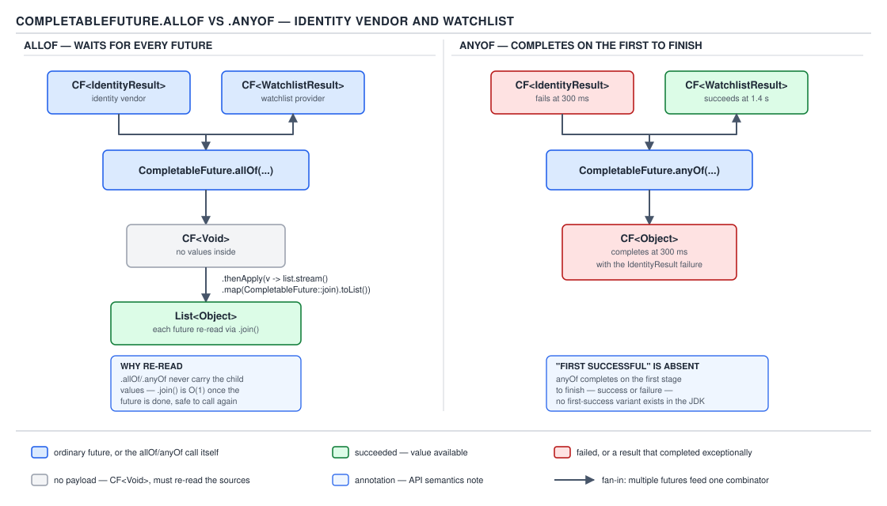
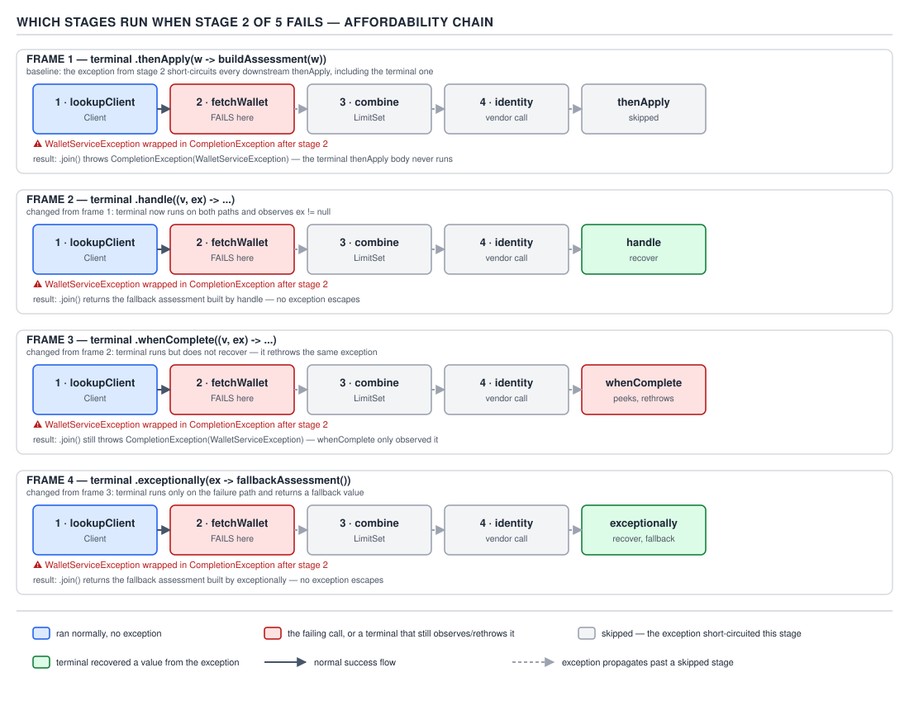

# 05 Multithreading and Concurrency — CompletableFuture — BASICS (§1.21, leaves 1.21.1–1.21.14)

**Target version: Java 21 LTS.** | **Part 1 of 5** | [Index](../00-index.md)
Previous: [Scheduled executors](../executors/03-basics-scheduled-executors.md) · Next: [CompletableFuture — executors, timeouts and lifecycle](01b-basics-executors-timeouts-lifecycle.md)

## Why `Future` was not enough

`AssessmentService` needs to score affordability for a submitted application: look up the
`Client`, fetch their `Wallet`, and combine both with the `LimitSet` derived from declared
income. With `java.util.concurrent.Future`, each of those three calls is an isolated
`submit()` that returns a handle with exactly one useful operation, `get()`, and `get()`
**blocks the calling thread**. There is no way to say "when the client lookup and the wallet
fetch both finish, combine them" without a thread parked on `get()`, no way to react to
failure without wrapping that blocking call in `try/catch`, and no way to start a third
computation automatically once the first two land. `Future` answers "is it done yet" and
"give me the value or block"; it has no vocabulary for *composition*.

`CompletableFuture<T>` fixes this by implementing both `Future<T>` (blocking `get()`/`join()`
still work) **and** `CompletionStage<T>` — chain a transformation, combine two stages, react to
failure, fan out across many stages and continue when they finish, with no thread blocking
until the very end, if at all. It can also be completed manually: `complete(T)` lets any
thread hand a finished result to a future nobody submitted as a task, the shape needed when a
webhook callback, not a `submit()`, produces the wealth verdict.



**D-085** — The `CompletableFuture` method map.

## The construction surface

Six ways to get a `CompletableFuture` into existence, each for a different starting shape.

- `new CompletableFuture<>()` — an empty stage, completed later by hand with `complete(T)` or
  `completeExceptionally(Throwable)`. The shape for wrapping a callback-based API (a webhook,
  a listener) that has no `Runnable`/`Supplier` to submit.
- `supplyAsync(Supplier<T>)` / `supplyAsync(Supplier<T>, Executor)` — runs the supplier on the
  common pool or the given executor. `AssessmentService` fetching the `Wallet`:
  `supplyAsync(() -> walletClient.fetch(clientId))`.
- `runAsync(Runnable)` / `runAsync(Runnable, Executor)` — same, for a side effect with no
  return value; completes with `Void`.
- `completedFuture(T)` / `completedStage(T)` (Java 9) — already-done, for a value already in
  hand that needs to compose with async work uniformly, e.g. a cached `LimitSet`.
- `failedFuture(Throwable)` / `failedStage(Throwable)` (Java 9) — already-failed, useful in
  tests and validation short-circuits ("this client is `SELF_EXCLUDED`, fail immediately").

`completedStage`/`failedStage` return a `CompletionStage<T>` with no `Future` methods exposed
— a signal to compose, not block. **Gotcha:** nothing stops casting back to
`CompletableFuture`; the restriction is advisory, encoded only in the declared return type.

> A `CompletableFuture` is either a submitted async computation, an already-known value, or an
> empty box waiting for someone to call `complete()` — and the API treats all three
> identically once created.

### The three shapes of every dependent operation, and which thread runs the callback

Every method that attaches a callback to a `CompletableFuture` — `thenApply`, `thenAccept`,
`thenRun`, `thenCompose`, `thenCombine`, `handle`, `whenComplete`, and so on — comes in exactly
three overloads, and the difference between them is the single most interview-relevant fact in
this file.

```java
CompletableFuture<Wallet> walletFuture = supplyAsync(() -> walletClient.fetch(clientId));

walletFuture.thenApply(w -> toLimitCheck(w));                      // (1) non-async
walletFuture.thenApplyAsync(w -> toLimitCheck(w));                 // (2) async, common pool
walletFuture.thenApplyAsync(w -> toLimitCheck(w), assessmentPool); // (3) async, your executor
```

**Why it exists.** `CompletableFuture` predates virtual threads; the only way to guarantee a
callback ran off a particular thread was to name an executor explicitly, and the plain
(non-`Async`) form is the zero-ceremony default for callbacks cheap enough not to care.

**When to reach for which.** Use the plain form only for callbacks that are pure, fast, and
non-blocking — a field projection, a `BigDecimal` comparison, building a `LimitSet`. Use
`xxxAsync(executor)` for anything that calls another service or could block, and always name
the executor explicitly — never rely on the common pool for production traffic (Part 2).

**How it works.** A `CompletionStage` internally holds either a result or a list of pending
dependent actions; when `complete()` runs, it walks that list and either runs each one inline
on the completing thread (plain form) or submits it to an executor (`Async` form). **The
subtlety that makes plain-form behaviour nondeterministic:** if a plain `thenApply` is attached
to a stage that is *already complete*, there is no "completing thread" to hand the callback to
— the calling thread runs it immediately, inline. The same line of code can therefore run on
the worker thread that produced the wallet (attached before completion) or on whatever thread
calls `thenApply` (attached after). `[SOURCE]`: this runs via `UniApply`/`UniCompose` nodes
pushed onto a lock-free stack (the `stack` field) when incomplete, executed via
`postComplete()` on whichever thread wins the CAS to complete the future — the JDK source
comment for `postComplete` notes these actions "may include more than one" with no ordering
guarantee.


**D-086** — Which thread runs the callback.

| Form | Thread that actually runs it | Deterministic? | Failure mode when the body blocks |
|---|---|---|---|
| `thenApply` (plain) | The thread that completed the previous stage — **or the calling thread**, if the stage was already complete when attached | No | Blocks whichever thread happened to win the race: a request thread, an executor worker, sometimes the common pool |
| `thenApplyAsync` (no executor) | A `ForkJoinPool.commonPool()` thread | Yes, always common pool | Starves the common pool other work depends on (parallel streams, other `xxxAsync` calls) |
| `thenApplyAsync(executor)` | Your named executor | Yes, always that executor | Confined to a pool you provisioned and can size and monitor |
| Attached to an already-complete stage | The calling thread (plain form only — `Async` forms still dispatch) | Yes, but easy to forget | Blocks the thread that called `thenApply`, which may be a thread you did not expect to ever block |

**The gotcha.** "Plain `thenApply` runs on the previous stage's thread" is the half-truth every
blog repeats — true only while the stage is still pending at attach time. Attach the same
callback a millisecond later and it runs synchronously on your thread instead, no thread hop.
`[PROVE]`: run `walletFuture.thenApply(w -> { System.out.println(Thread.currentThread()); return w; })`
twice — once right after `supplyAsync` returns (prints a pool thread) and once after
`walletFuture.join()` has already returned (prints the caller's own thread, e.g. `main`) — for
identical code. `[TRAP]`

> The plain form runs wherever the stage happens to be when you attach the callback — the
> completing thread if it is still pending, your own thread if it has already finished — which
> is exactly why it must never carry a blocking body.

## The transformation family

Four verbs, each ×3 (plain / async / async-with-executor) = 12 methods:

| Method | Signature shape | Meaning |
|---|---|---|
| `thenApply` | `Function<T,U> → CompletableFuture<U>` | Map the result to a new value |
| `thenAccept` | `Consumer<T> → CompletableFuture<Void>` | Consume the result, produce nothing |
| `thenRun` | `Runnable → CompletableFuture<Void>` | Ignore the result entirely, just react to completion |
| `thenCompose` | `Function<T,CompletableFuture<U>> → CompletableFuture<U>` | Flat-map: chain another async step |

**Gotcha:** `thenAccept`/`thenRun` return `CompletableFuture<Void>` — useful for side effects
but a dead end for further value composition; the chain only knows completion happened.

> `thenApply`/`thenAccept`/`thenRun` transform, consume, or ignore a value in place; only
> `thenCompose` knows how to chain to *another* asynchronous step.

### `thenApply` versus `thenCompose`

**Mental model.** `thenApply` is `Stream.map` for a future: one value in, one value out,
synchronously computed. `thenCompose` is `Stream.flatMap`: the function you hand it returns
*another future*, and `thenCompose` unwraps it so you get one flat future back instead of a
future of a future.

**Why it exists.** The affordability chain needs to fetch the `Wallet`, and *then*, using the
wallet, fetch the `LimitSet` — a second async call that depends on the first result. If you
reach for `thenApply` here by mistake:

```java
CompletableFuture<Client> clientFuture = supplyAsync(() -> clientRepo.findById(clientId));

// wrong shape: producing a future INSIDE thenApply
CompletableFuture<CompletableFuture<LimitSet>> nested =
        clientFuture.thenApply(client -> supplyAsync(() -> limitService.derive(client)));
```

`nested` is a `CompletableFuture<CompletableFuture<LimitSet>>` — reaching the `LimitSet` needs
`nested.join().join()`, and the outer future reports "done" the instant the *inner* future is
merely created, not when `derive` actually finishes. Callers who attach to `nested` get called
back before the real work is done.

**When to reach for which, and when not.** Use `thenApply` when the function is synchronous
and returns a plain value. Use `thenCompose` the moment the function's body itself calls
`supplyAsync`, `thenApply`, or any other method returning a `CompletableFuture` — that is the
tell. There is no case where `thenApply` is the *correct* choice for a function whose body
returns a future; it will always compile (generics do not catch this) and always produce the
wrong shape.

**How it works.** `thenCompose` flattens by attaching its own internal callback to the *inner*
future your function returns, wiring that stage's completion to complete the outer stage it
handed back to you, rather than completing as soon as the function returns like `thenApply`
does.



**D-087** — `thenApply` versus `thenCompose`.

```java
CompletableFuture<LimitSet> limitSetFuture =
        clientFuture.thenCompose(client -> supplyAsync(() -> limitService.derive(client)));
```

`limitSetFuture` is a flat `CompletableFuture<LimitSet>` that genuinely does not complete
until `limitService.derive` finishes — the correct shape for chaining a second async call off
the result of the first.

**The gotcha.** Assigning `thenApply`'s nested result to a raw `CompletableFuture<LimitSet>`
variable is a compile error (good), but passing it straight into another `thenApply(f -> ...)`
compiles fine, `f` typed as the inner future, silently one level too deep with no warning.
`[TRAP]`

**Interview:** "map versus flatMap for futures" — `thenApply` when the function returns `U`,
`thenCompose` when it returns `CompletableFuture<U>`, the same distinction as `Stream.map`
versus `Stream.flatMap`.

> `thenApply` maps a value; `thenCompose` flattens a future-returning function into the chain
> so the caller never sees a nested `CompletableFuture<CompletableFuture<T>>`.

## The combination family

Six verbs, each ×3 = 18 methods, all combining **two** existing stages:

| Method | Waits for | Produces | Meaning |
|---|---|---|---|
| `thenCombine` | Both | Combined value | Apply a `BiFunction` to both results |
| `thenAcceptBoth` | Both | `Void` | Consume both results, no return |
| `runAfterBoth` | Both | `Void` | Ignore both values, just react |
| `applyToEither` | Whichever finishes first | Transformed value | Apply a `Function` to whichever result arrives first |
| `acceptEither` | Whichever finishes first | `Void` | Consume whichever result arrives first |
| `runAfterEither` | Whichever finishes first | `Void` | Ignore values, react to first completion |

`thenCombine` is the shape for the affordability chain's final step — the `Client` lookup and
the `Wallet` fetch run concurrently, and only once both land does scoring proceed:

```java
CompletableFuture<Client> clientFuture = supplyAsync(() -> clientRepo.findById(clientId), pool);
CompletableFuture<Wallet> walletFuture = supplyAsync(() -> walletClient.fetch(clientId), pool);

CompletableFuture<AffordabilityVerdict> verdictFuture =
        clientFuture.thenCombine(walletFuture,
                (client, wallet) -> assessmentService.score(client, wallet));
```

**Gotcha:** the `-Both`/`-Either` naming mirrors the transformation family exactly
(`thenCombine`≈`thenApply`, `thenAcceptBoth`≈`thenAccept`, `runAfterBoth`≈`thenRun`) — the
eighteen methods are the transformation family applied twice, not eighteen names to memorise.

> The combination family is the transformation family's four shapes, doubled across whether
> you wait for both stages or race them and take whichever finishes first.

### `allOf` and `anyOf`: fan-out across many stages

**Mental model.** `allOf` is a synchronization barrier — a `CountDownLatch` for futures — that
tells you *when* every stage is done but hands back nothing itself. `anyOf` is a race with no
regard for who wins honestly — first to *finish*, success or failure, wins.

**Why it exists.** `thenCombine` only combines two stages. Fanning out to *n* independent
checks — identity vendor, watchlist provider, duplicate-person check — needs a variadic
combinator, and `allOf`/`anyOf` are the JDK's only built-in answer.

**When to reach for which, and when not.** Use `allOf` when every result matters — gathering
every gate verdict before deciding activation. Use `anyOf` only when the *first answer,
whatever it is* is useful — no built-in "first successful" combinator exists, covered below.

**How it works.** `allOf(CompletableFuture<?>... cfs)` returns `CompletableFuture<Void>` — the
input array is heterogeneous, so there is no single type it could return values as. The idiom
is: wait on the barrier, then re-read each original future — guaranteed non-blocking at that
point — with `join()`.



**D-089** — `allOf` versus `anyOf`.

`[BUILD]` The full affordability fan-out — identity check, watchlist screening, and duplicate
check, gathered and re-read:

```java
CompletableFuture<Verdict> identityCheck =
        supplyAsync(() -> identityVendor.verify(clientId), gatePool);
CompletableFuture<Verdict> screeningCheck =
        supplyAsync(() -> watchlistProvider.screen(clientId), gatePool);
CompletableFuture<Verdict> duplicateCheck =
        supplyAsync(() -> accountOpening.checkDuplicate(clientId), gatePool);

List<CompletableFuture<Verdict>> gates = List.of(identityCheck, screeningCheck, duplicateCheck);

CompletableFuture<List<Verdict>> allVerdicts =
        CompletableFuture.allOf(gates.toArray(new CompletableFuture[0]))
                .thenApply(v -> gates.stream()
                        .map(CompletableFuture::join)   // safe: allOf already completed
                        .toList());

List<Verdict> verdicts = allVerdicts.join();
boolean activationEligible = verdicts.stream().allMatch(Verdict::isClear);
```

`allOf`'s own `Void` result (`v` above) is never used for anything but sequencing — it exists
solely to guarantee every gate has finished before the `.map(CompletableFuture::join)` line
runs, at which point every `join()` call is guaranteed non-blocking. `[TRAP]` Forgetting the
re-read and trying to use `v` as if it carried the results is the classic mistake this leaf
warns about — `v` is always `null`.

`anyOf(CompletableFuture<?>... cfs)` returns `CompletableFuture<Object>` and completes the
instant **any** input completes — including by failing. In the affordability chain, the
identity vendor typically answers around p50 900ms and the watchlist provider around p50 1.4s;
if the *identity vendor fails* at 300ms while the *watchlist provider is still en route to
succeeding* at 1.4s, `anyOf` completes at 300ms — exceptionally, with the identity vendor's
failure — even though a good screening verdict was 1.1 seconds away. `[TRAP]` Nothing in
`anyOf` distinguishes "first to answer" from "first to answer successfully"; building "first
successful" means racing the futures yourself with `applyToEither`-style chaining plus
explicit fallback on exception, or reaching for a library.

> `allOf` waits for every stage and returns nothing itself, so you must re-read each original
> future; `anyOf` races every stage and returns whichever finishes first, success or failure,
> with no preference for success.

## The exception family, and how it wraps

Two ways to react to failure that don't fully overlap, plus the wrapper types the JDK inserts
along every path out of a `CompletableFuture`.

`exceptionally` (2), `exceptionallyAsync` (2, Java 12), `exceptionallyCompose` (2, Java 12),
`exceptionallyComposeAsync` (2, Java 12), `handle` (×3), `whenComplete` (×3) — twelve methods,
one family. `[RESEARCH]`: the `Async`/`Compose` variants were added by JDK-8134852 in Java 12;
plain `exceptionally` has existed since `CompletableFuture`'s introduction in Java 8.

### `handle` versus `whenComplete` versus `exceptionally`

**Mental model.** `exceptionally` is a `catch` block: fires only on failure, produces a
recovery value. `handle` is a `try { } finally { return ... }` that can also change the
*type*: it always fires, sees both outcomes, and its return value becomes the new stage's
result regardless of which branch ran. `whenComplete` is a pure observer: always fires, sees
both outcomes, but cannot change the result — it exists to log, audit, or clean up.

**Why it exists.** Three needs: recover only on failure (`exceptionally`), transform the
outcome uniformly either way (`handle`), and observe without altering anything (`whenComplete`)
— e.g. writing every wealth verdict to `ApplicationHistory` without disturbing the chain.

**When to reach for which, and when not.** `exceptionally` when only failure needs handling.
`handle` when both branches must produce a result, especially different shapes folded into one
type — a sealed `Verdict` covering both an accepted score and a referred-for-review outcome.
`whenComplete` when the only purpose is a side effect — audit logging, metrics, cleanup — never
for producing the downstream value, because it cannot.

**How it works.**

| Terminal | Fires on success | Fires on failure | Can change the value | If the callback itself throws |
|---|---|---|---|---|
| `exceptionally` | No | Yes | Only the failure branch (produces a recovery value) | Propagates as the new failure |
| `handle` | Yes | Yes | Yes, either branch | Propagates as the new failure, replacing the original |
| `whenComplete` | Yes | Yes | No — returns the same outcome it was given | Propagates, but **the original exception is added as a suppressed exception** rather than replaced, if the original also failed |



**D-088** — Which stages run when stage 2 of 5 fails.

Concretely, in a five-stage affordability chain — lookup, fetch wallet, derive limits, score,
notify — where the wallet fetch (stage 2) throws:

```java
clientFuture
        .thenCompose(client -> supplyAsync(() -> walletClient.fetch(client.id())))  // fails here
        .thenApply(wallet -> limitService.derive(wallet))                            // skipped
        .thenApply(limits -> assessmentService.score(limits))                        // skipped
        .thenApply(verdict -> notify(verdict))                                       // skipped
        .exceptionally(ex -> { log.warn("assessment failed", ex); return Verdict.REFERRED; });
```

Every `thenApply` between the failing stage and the terminal call is **skipped entirely** —
the failure propagates stage to stage without running any intermediate transformation — and
only the terminal callback (`exceptionally`, `handle`, or `whenComplete`) actually runs and
observes it.

**The gotcha.** `whenComplete`'s "rethrow" behaviour surprises people who expect it to behave
like `handle`: if the upstream already failed and the `whenComplete` action itself throws a
*different* exception, the resulting stage fails with the **original** exception, with the
action's exception attached via `addSuppressed` — not with the action's exception as the
primary cause. `[TRAP]`

> `exceptionally` recovers from failure only; `handle` transforms both outcomes into a new
> result; `whenComplete` observes both outcomes without being able to change either.

### Exception wrapping across the async APIs

**Mental model.** Every blocking or terminal retrieval path wraps the real exception in a
different envelope, and `getCause()` is always the way back to the original.


**D-090** — Exception wrapping across the async APIs.

| API | Wrapper | Checked? | Unwrap with | Cancelled future throws |
|---|---|---|---|---|
| `Future.get()` | `ExecutionException` | Checked | `getCause()` | `CancellationException` (unchecked) |
| `CompletableFuture.get()` | `ExecutionException` | Checked | `getCause()` | `CancellationException` (unchecked) |
| `CompletableFuture.join()` | `CompletionException` | Unchecked | `getCause()` | `CancellationException` (unchecked) |
| `exceptionally` callback argument | `CompletionException` | Unchecked (it's a `Throwable` param) | `getCause()`, if further unwrapping is needed | `CancellationException` wrapped in `CompletionException` |
| `handle` callback's `Throwable` argument | `CompletionException` | Unchecked | `getCause()` | Same |
| `whenComplete` callback's `Throwable` argument | `CompletionException` | Unchecked | `getCause()` | Same |
| `ForkJoinTask.join()` | None — rethrows the original unchecked exception directly, or wraps a checked one in `RuntimeException` | Depends on original | Usually none needed | `CancellationException` (unchecked) |

`[NUM]` Concretely: if `walletClient.fetch` throws `IllegalStateException("wallet locked")`
inside a `supplyAsync` task, `future.get()` throws `ExecutionException` with that exact
exception as `getCause()`, while `future.join()` throws `CompletionException` with the same
`getCause()` — one original exception, two wrapper types, one `getCause()` call either way.

**The gotcha.** Code that catches `ExecutionException` around a `CompletableFuture.join()` call
catches nothing — `join()` only ever throws `CompletionException` — and a broader
`catch (Exception e)` further up the stack masks the bug for months. `[TRAP]`

> `Future.get()` and `CompletableFuture.get()` wrap in checked `ExecutionException`;
> `CompletableFuture.join()` and every exception-family callback argument wrap in unchecked
> `CompletionException`; both unwrap with a single `getCause()`.

## `join()` versus `get()`

`join()` throws unchecked `CompletionException` and declares no checked exceptions; `get()`
throws checked `ExecutionException` and `InterruptedException`, both of which must be declared
or caught. **Gotcha:** inside a lambda passed to `thenApply`/`thenCompose`/etc., a checked
exception cannot escape the functional interface's signature at all, so `get()` forces a
`try/catch` wrapper every time while `join()` needs none — which is why almost every chain
uses `join()` inside lambda bodies and reserves `get()` for a top-level caller prepared to
handle `InterruptedException` explicitly.

> `join()` is the unchecked, lambda-friendly retrieval; `get()` is the checked, top-level-only
> retrieval — inside a `CompletableFuture` chain, reach for `join()`.

## Trap — swallowed exceptions

**Pitfall:** A chain that ends with a plain transformation and nothing that ever calls
`get()`, `join()`, `handle`, `exceptionally`, or `whenComplete` stores its exception inside the
future object and the exception **disappears completely** — no log line, no stack trace,
nothing on the console. The most common shape is a fire-and-forget `runAsync` fired from a
request handler that does not hold onto the returned future at all:

```java
// wrong — nobody ever observes this future
runAsync(() -> notificationService.sendActivationEmail(clientId), notifyPool);
```

If `sendActivationEmail` throws, that exception is captured inside the returned
`CompletableFuture<Void>`, immediately garbage — nothing references it, nothing calls `join()`
on it, and the JVM never surfaces the failure. No email, no alert.

```java
// right — always terminate a fire-and-forget chain with a terminal that logs
runAsync(() -> notificationService.sendActivationEmail(clientId), notifyPool)
        .whenComplete((v, ex) -> {
            if (ex != null) {
                log.error("activation email failed for {}", clientId, ex);
            }
        });
```

**Why people believe it works anyway:** most of the time the callback *doesn't* throw, so the
missing terminal is invisible in testing and low-traffic paths until a production incident
reveals the notification pipeline has been silently broken for weeks.

## Pitfalls

### Assuming plain `thenApply` always runs on "the previous stage's thread"

**Wrong**
```java
CompletableFuture<Wallet> f = supplyAsync(() -> walletClient.fetch(clientId));
Thread.sleep(500); // ensure f is already complete by now
f.thenApply(w -> {
    System.out.println(Thread.currentThread().getName()); // prints "main", not a pool thread
    return w;
});
```

**Right**
```java
// name the executor explicitly whenever the thread identity matters
f.thenApplyAsync(w -> toLimitCheck(w), assessmentPool);
```

**Why people believe it:** the javadoc phrase "may be performed by the thread that completes
the current stage" is usually quoted without its other clause — "or by the thread that calls a
dependent-completion method" — collapsing two possibilities into one remembered guarantee.

### Assuming `anyOf` means "first success"

**Wrong**
```java
Verdict fastest = (Verdict) CompletableFuture.anyOf(identityCheck, screeningCheck).join();
// identityCheck failed at 300ms; screeningCheck was about to succeed at 1.4s
// fastest.join() above actually throws CompletionException, it never reaches this line
```

**Right**
```java
CompletableFuture<Verdict> firstSuccess = identityCheck.handle((v, ex) -> ex == null ? v : null)
        .thenCombine(screeningCheck.handle((v, ex) -> ex == null ? v : null),
                (a, b) -> a != null ? a : b); // simplistic two-way version; real code needs n-way racing
```

**Why people believe it:** the name reads like "any of these succeeding," when the actual
contract is "any of these *completing*, by whatever means."

## Cheat sheet

| Concept | One-line fact |
|---|---|
| Plain vs `Async` vs `Async(executor)` | Completing/calling thread vs common pool vs your executor |
| Already-complete stage + plain callback | Runs synchronously on the calling thread |
| `thenApply` | map: `Function<T,U>` |
| `thenCompose` | flatMap: `Function<T,CompletableFuture<U>>` |
| `thenCombine` | Wait for both, combine with `BiFunction` |
| `applyToEither` | Wait for whichever finishes first |
| `allOf` | Returns `Void`; re-read each future with `join()` |
| `anyOf` | Returns `Object`; first to finish, success or failure |
| No "first success" combinator | Build it yourself with `handle` + fallback |
| `exceptionally` | Failure only, same type |
| `handle` | Both outcomes, can change type |
| `whenComplete` | Both outcomes, observe only, re-throws original |
| `Future.get()` / `CompletableFuture.get()` | Checked `ExecutionException` |
| `CompletableFuture.join()` | Unchecked `CompletionException` |
| Unwrap | `getCause()` |
| No terminal on a chain | Exception silently swallowed |

## Self-test

**Q1.** A plain `thenApply` is attached to a `CompletableFuture` that is already complete.
Which thread runs the callback?

<details><summary>Answer</summary>

The calling thread, synchronously and inline, with no submission to any executor. This applies
only to the plain form; the `Async` forms always dispatch regardless of completion state.

</details>

**Q2.** Why does `clientFuture.thenApply(client -> supplyAsync(() -> limitService.derive(client)))`
compile but produce the wrong shape?

<details><summary>Answer</summary>

The lambda returns a `CompletableFuture<LimitSet>`, so the result type is
`CompletableFuture<CompletableFuture<LimitSet>>`. `thenApply` completes as soon as the lambda
returns — the moment the inner future is *created*, not when `derive` actually finishes.
`thenCompose` flattens the nesting and waits for the real completion.

</details>

**Q3.** `allOf(a, b, c)` returns `CompletableFuture<Void>`. How do you get the three
individual results out once it completes?

<details><summary>Answer</summary>

Attach a `thenApply` after `allOf` and, inside it, call `join()` on each of `a`, `b`, `c` —
safe and non-blocking at that point because `allOf` already guarantees all three are complete.

</details>

**Q4.** The identity vendor fails at 300ms; the watchlist provider is on track to succeed at
1.4s. What does `CompletableFuture.anyOf(identityCheck, screeningCheck)` produce, and when?

<details><summary>Answer</summary>

It completes at 300ms, exceptionally, with the identity vendor's failure — `anyOf` completes on
the first stage to finish by any means, including failure, with no preference for success.

</details>

**Q5.** What is the difference between what `handle` and `whenComplete` are each allowed to
return to the rest of the chain?

<details><summary>Answer</summary>

`handle`'s return value becomes the new stage's result, whichever branch ran, and can change
type. `whenComplete` cannot change the outcome at all — its stage carries the same result or
exception it was given, regardless of what the action computes.

</details>

**Q6.** If the original stage failed and the action passed to `whenComplete` also throws a
different exception, which exception does the resulting stage fail with?

<details><summary>Answer</summary>

The original exception, with the action's exception attached via `addSuppressed` rather than
substituted as the primary cause.

</details>

**Q7.** What does `CompletableFuture.join()` throw on failure, and is it checked?

<details><summary>Answer</summary>

Unchecked `CompletionException`, wrapping the real cause behind one `getCause()` call — which
is why it is the natural choice inside a lambda body, where a checked `ExecutionException`
could not propagate without an extra `try/catch`.

</details>

**Q8.** A `runAsync` call is fired from a request handler and its returned future is never
assigned to a variable or chained further. The task throws. What happens to the exception?

<details><summary>Answer</summary>

It is stored inside the returned future and never surfaces — no log, no alert — because
nothing calls `get()`, `join()`, `handle`, `exceptionally`, or `whenComplete` on it. Always
terminate a fire-and-forget chain with a `whenComplete` that logs the exception branch.

</details>

**Q9.** Why do `thenAccept` and `thenRun` both return `CompletableFuture<Void>`?

<details><summary>Answer</summary>

Neither is permitted to produce a value for the rest of the chain: `thenAccept` consumes the
upstream value and returns nothing, `thenRun` ignores it entirely. Both exist for side effects,
so `Void` is the only honest return type.

</details>

---

**Leaves covered:** 1.21.1–1.21.14 (14 leaves)
**Leaves deferred:** none
**Diagrams included:** D-085, D-086, D-087, D-088, D-089, D-090
**Target version:** Java 21 LTS
**Lines:** 598
