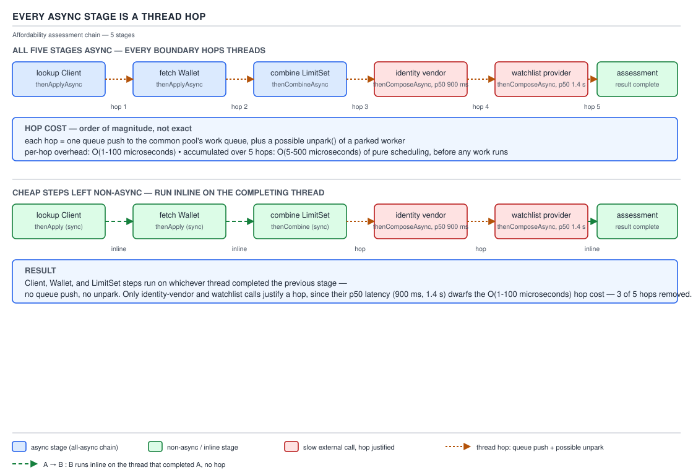
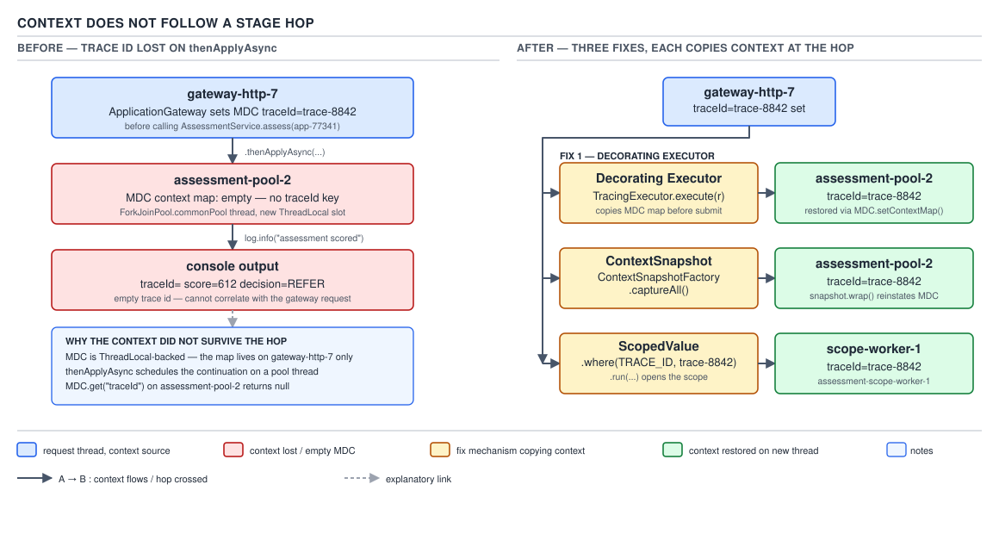

# 05 Multithreading and Concurrency — CompletableFuture in anger — INTERMEDIATE (§2.8)

**Target version: Java 21 LTS.** | **Part 2 of 5** | [Index](../00-index.md)
Previous: [Producer–consumer and backpressure design](../queues/02-backpressure-design.md) · Next: [Virtual threads in production](../virtual-threads/02-in-production.md)

Everything below chains off one flow: the five-stage affordability assessment
`AssessmentService` runs between `AO-140 WEALTH_PENDING` and `AO-141/145/149`. Stage 1
validates the application snapshot already in hand (cheap, CPU-only). Stage 2 fetches the
declared employment and income record. Stage 3 calls the wealth-scoring vendor — external,
blocking, sometimes slow. Stage 4 derives a `LimitSet` from the vendor's verdict. Stage 5
persists the verdict and emits the outcome event. Two of five stages touch the network;
three do not — that asymmetry is the entire subject of this file.

## The executor discipline, made enforceable

**Mental model.** `CompletableFuture.supplyAsync(task)` with no executor argument does not
run on "a thread pool" — it runs on `ForkJoinPool.commonPool()`, the same pool your
parallel streams share. That pool is sized to `Runtime.availableProcessors() - 1` and was
built for pure CPU work that never blocks: one shared elevator, fine while every ride is
short, catastrophic the moment one passenger wedges the door open with an external HTTP call.

**Why it exists.** The no-argument overloads exist so a quick demo or a genuinely CPU-bound
transform can be written without wiring a pool. They were never meant to be the default for
production I/O-bound chains, and the JDK gives no compiler signal that you reached for the
wrong one — `supplyAsync(this::callWealthVendor)` compiles identically to
`supplyAsync(this::square)`.

**When to reach for it, and when not.** Naming an executor is mandatory for any stage that
blocks — a JDBC call, an HTTP call, a queue receive — and optional, often wasteful (see the
thread-hop section below), for a stage that only transforms a value already in hand. The
sibling that wins when *every* stage blocks is a virtual-thread-per-task executor plus
straight-line blocking code ([Virtual threads in production](../virtual-threads/02-in-production.md)) — at that point chaining is solving a problem virtual threads make disappear.

**How it works.** Every `*Async` overload that omits an executor resolves it through
`defaultExecutor()`, a protected method that, unless overridden, returns
`ForkJoinPool.commonPool()` (or a fresh single-thread pool if the JVM started with
`-Djava.util.concurrent.ForkJoinPool.common.parallelism=0`). Being a method, not a
`static final` constant, it is overridable per subclass — the lever the discipline hangs on.



**D-130** — Every async stage is a thread hop.

**A minimal concrete example.** Two enforcement styles, both compiling and both usable
today. The first subclasses `CompletableFuture` and overrides `defaultExecutor()`, so any
stage chained off an instance of this type — even a bare `.thenApply()` that the JDK
promotes to `-Async` internally — inherits the named pool instead of the common pool:

```java
public final class AssessmentFuture<T> extends CompletableFuture<T> {

    private final Executor boundExecutor;

    private AssessmentFuture(Executor boundExecutor) {
        this.boundExecutor = boundExecutor;
    }

    public static <T> AssessmentFuture<T> supplyOn(Executor executor, Supplier<T> task) {
        AssessmentFuture<T> future = new AssessmentFuture<>(executor);
        executor.execute(() -> {
            try {
                future.complete(task.get());
            } catch (RuntimeException e) {
                future.completeExceptionally(e);
            }
        });
        return future;
    }

    @Override
    protected Executor defaultExecutor() {
        return boundExecutor;
    }

    @Override
    public <U> CompletableFuture<U> newIncompleteFuture() {
        return new AssessmentFuture<>(boundExecutor);
    }
}
```
`newIncompleteFuture()` is the part every blog skips: without overriding it, the *next*
stage in the chain reverts to a plain `CompletableFuture` backed by the common pool again,
because that is what the default `thenApply` uses to build its result future.

The lighter-weight alternative needs no subclass: a factory (`Assessments.supply(Executor,
Supplier<T>)`, delegating to `CompletableFuture.supplyAsync(task, executor)`) that simply
never exposes the no-argument overloads. It is weaker — nothing stops a teammate importing
`CompletableFuture` directly and calling `supplyAsync(task)` anyway — but it makes the
*sanctioned* path correct by construction, and a `forbidden-apis`/ArchUnit rule banning the
bare `CompletableFuture.supplyAsync` call site closes the gap the factory leaves open.

**Pitfall:** the belief that "the common pool is just a thread pool" leads teams to route a
blocking vendor call through a bare `supplyAsync(task)`. The symptom shows up far from the
call site: the pool is `cores - 1` threads shared by every parallel stream and `*Async` call
in the JVM, so one wedged blocking call starves unrelated CPU-bound work platform-wide. Fix:
name an executor on every blocking stage, always. Separately, overriding `defaultExecutor()`
changes the pool only for `*Async` calls with no explicit executor; the non-`Async` variants
(`thenApply`, `thenAccept`, `thenCompose`) run on *whichever thread completes the previous
stage* by design — the subject of the next section.

> **`defaultExecutor()` is the one hook that makes "always name a pool" an enforceable
> property of the type rather than a code-review reminder.**

## The thread-hopping cost

**Mental model.** Every `*Async` call is not "runs in parallel" — it is "put this closure
on a queue, and, if the target pool has no thread already spinning, wake one up." Picture a
relay where every runner hands the baton through a mail slot instead of into the next
runner's hand: even when nobody is waiting, someone still walks to the slot and pushes it
through, and the next runner has to notice it arrived.

**Why it exists.** The mechanism is not a mistake — it is what lets a stage run on a
different pool, or off the thread that produced the prior value, which is exactly what you
want when stage 3 must run on a bounded I/O pool and stage 1 ran on the caller's thread. The
cost is a side effect of that flexibility, not of a bug.

**When to reach for it, and when not.** Reach for `*Async` when the next stage must move
pools — a blocking vendor call cannot run on the thread about to answer an HTTP request. Do
not reach for it when the next stage is a pure, cheap transform: computing a `LimitSet` from
a `WealthVerdict` is nanoseconds of arithmetic, and forcing it onto a queue costs more than
the arithmetic itself.

**How it works, proved.** `[PROVE]` `[NUM]` Take the five-stage assessment and make every
stage `*Async` regardless of whether it blocks:

```java
CompletableFuture<Verdict> verdict = CompletableFuture
    .supplyAsync(this::validateSnapshot, cpuPool)          // hop 1
    .thenApplyAsync(this::attachEmploymentRecord, cpuPool) // hop 2 — cheap, no I/O
    .thenComposeAsync(this::callWealthVendor, ioPool)       // hop 3 — genuinely blocks
    .thenApplyAsync(this::deriveLimitSet, cpuPool)          // hop 4 — cheap, no I/O
    .thenApplyAsync(this::persistAndEmit, ioPool);          // hop 5 — genuinely blocks
```

Each `*Async` call does two things unconditionally: it pushes a task object onto the target
executor's work queue (an allocation plus a CAS or lock-guarded enqueue), and — only if every
worker in that pool is currently parked — it wakes one with `LockSupport.unpark`. Present
these as order-of-magnitude, never as measured constants: a queue push is tens to low
hundreds of nanoseconds; an unpark crossing into the kernel scheduler is one to several
*microseconds* — three orders of magnitude apart, and both dwarfed by an actual network round
trip. Chain twenty such stages — a realistic count once retries, logging hooks, and
metric-emitting `.whenComplete()` calls are folded in — and that overhead is paid twenty
times over, independent of how much real parallelism any of it bought. If seventeen of those
twenty are cheap transforms like hops 2 and 4 above, seventeen hops bought nothing: no stage
ran concurrently with any other, because each strictly depends on the previous one's output.
The overhead was pure tax.

**When not to use `Async`.** Hops 2 and 4 are the leaves this section is really arguing
for: `.thenApply(this::attachEmploymentRecord)` (no `Async` suffix, no executor) lets the
cheap transform run **inline, on whichever thread just completed the previous stage** —
the vendor-call thread for hop 4, straight after hop 3 finishes, with no queue push and no
possible unpark. The right chain names an executor only at the two hops that actually
block:

```java
CompletableFuture<Verdict> verdict = CompletableFuture
    .supplyAsync(this::validateSnapshot, cpuPool)     // hop: genuinely off-thread work
    .thenApply(this::attachEmploymentRecord)          // inline — no queue push
    .thenComposeAsync(this::callWealthVendor, ioPool) // hop: genuinely blocks
    .thenApply(this::deriveLimitSet)                  // inline — no queue push
    .thenApplyAsync(this::persistAndEmit, ioPool);    // hop: genuinely blocks
```

Three of the five stages disappear from the hop count entirely.

**The gotcha.** "Inline on the completing thread" is not "inline on the caller's thread."
If hop 3 completed on an `ioPool` worker, hop 4's inline `.thenApply` also runs on that
`ioPool` worker — borrowing capacity from the pool you sized for blocking I/O to do CPU
work. For a single cheap arithmetic step that is a fair trade against a queue push; for a
CPU-heavy inline transform chained after an I/O stage, it can starve the I/O pool instead.

> **A `*Async` suffix does not mean "runs in parallel" — it means "pay a queue push, and
> maybe an unpark, to move this closure onto a possibly different thread."**

## Context does not follow a stage hop

**Mental model.** MDC (`org.slf4j.MDC`), Spring Security's `SecurityContext`, and a tracing
span are all thread-local state — a sticky note taped to *this specific thread's* desk, not
to the request. `Thread.currentThread()` is the only address any of them are filed under.

**Why it exists, and when it bites.** Thread-locals need no explicit parameter threading
through every method signature — any log statement in `AssessmentService` can call
`MDC.get("traceId")` without the id being passed to it. That convenience is also the failure
mode: it does not bite inside a single synchronous call stack, but it bites the instant a
stage hop moves execution to a different thread — any `*Async` stage with no executor
override, or any stage completing on a different pool than the one that started the chain.

**How it works.** The request thread sets `MDC.put("traceId", id)` before starting the
chain. Hop 1 runs on `cpuPool` — a different thread already, so the MDC map (a plain
`ThreadLocal<Map<String,String>>` inside `MDC`) that thread sees is empty, because nothing
ever copied it there. Every log line from `cpuPool`'s thread onward prints an empty trace
id, and correlating it back to the triggering request now depends on some other field
carrying the id explicitly.



**D-131** — MDC set on the request thread, lost on the first hop, against the three fixes.

**A minimal concrete example — the broken version, then three fixes.** `[X-REF 20]`
`[BUILD]`

```java
// broken — MDC does not survive the first thenApplyAsync
MDC.put("traceId", traceId);
CompletableFuture<Verdict> verdict = CompletableFuture
    .supplyAsync(this::validateSnapshot, cpuPool)
    .thenApplyAsync(snapshot -> {
        log.info("assessing snapshot");   // prints traceId=""
        return attachEmploymentRecord(snapshot);
    }, cpuPool);
```

**Fix 1 — a decorating `Executor`.** Capture the MDC map on the submitting thread, restore
it on the worker thread, restore the prior map afterward so the pool thread never leaks
context into the next task it runs:

```java
public final class MdcPropagatingExecutor implements Executor {

    private final Executor delegate;

    public MdcPropagatingExecutor(Executor delegate) {
        this.delegate = delegate;
    }

    @Override
    public void execute(Runnable task) {
        Map<String, String> captured = Objects.requireNonNullElse(MDC.getCopyOfContextMap(), Map.of());
        delegate.execute(() -> {
            Map<String, String> previous = Objects.requireNonNullElse(MDC.getCopyOfContextMap(), Map.of());
            MDC.setContextMap(captured);
            try {
                task.run();
            } finally {
                MDC.setContextMap(previous);
            }
        });
    }
}
```

Pass an instance of this wrapping `cpuPool`/`ioPool` wherever the chain names an executor.

**Fix 2 — Micrometer `ContextSnapshot`.** `io.micrometer:context-propagation` generalises
fix 1 across MDC, Reactor's `Context`, and Spring Security's `SecurityContext` in one call:
`ContextSnapshot.captureAll()` on the request thread, then `snapshot.wrap(this::attachEmploymentRecord)`
in place of the bare method reference wherever the chain crosses a hop — one call site
instead of a hand-rolled decorator per context type.

**Fix 3 — `ScopedValue` plus a structured scope.** Scoped values shipped as a preview API in
Java 21 (final only at JEP 506 in Java 25 — `[VERSION-TRAP]`), needing
`--enable-preview --source 21` to compile. A `ScopedValue` is bound for the dynamic extent
of a call, and — unlike a `ThreadLocal` — a `StructuredTaskScope` fork explicitly re-binds it
into the child: `ScopedValue.where(TRACE_ID, traceId).call(() -> { try (var scope = new
StructuredTaskScope.ShutdownOnFailure()) { var employment = scope.fork(() ->
attachEmploymentRecord(snapshot)); var wealth = scope.fork(() -> callWealthVendor(snapshot));
scope.join().throwIfFailed(); return deriveLimitSet(employment.get(), wealth.get()); } })` —
pairing the two propagates where a raw executor would not. The fuller mechanics of
`StructuredTaskScope` forking and cancellation belong to guide 20.

**The gotcha.** All three fixes cost something on every hop: fixes 1 and 2 copy a map —
cheap but non-zero, and easy to forget on a hop added six months later. Fix 3 sidesteps the
copy by construction, at the cost of committing to `StructuredTaskScope`'s preview status
through Java 25.

> **A stage hop moves the closure to a new thread; it never moves that thread's
> thread-locals with it. Propagation is something you add, not something you get.**

## "First successful" — not `anyOf`

**Mental model.** `CompletableFuture.anyOf(futures...)` completes when the *first* of its
inputs completes — full stop, success or failure. Picture a race where the judge blows the
whistle the instant *any* runner crosses the line **or falls over**, regardless of whether
the other runners are still going strong.

**Why it exists, and when to reach for it.** `anyOf` is deliberately the raw primitive: it
makes no judgement about outcome, because the JDK cannot know whether "first to finish" or
"first to succeed" is wanted. Use it only when any completion, success or failure, is an
acceptable answer — racing two equally-valid strategies. Do not reach for it when a failing
alternative should be masked by a still-running or later-succeeding one: three internal
wealth-scoring partitions can serve the same verdict, and one returning `TimeoutException`
first must not fail the whole assessment while the other two are still in flight.

**How it works.** `[TRAP]` The concrete failure of naive code: `CompletableFuture.anyOf(a,
b, c)` returns a `CompletableFuture<Object>` that completes exceptionally the moment *any*
of `a`, `b`, `c` completes exceptionally, even if the other two would have succeeded a
millisecond later. There is no `firstSuccessfulOf` in `java.util.concurrent`, in any JDK
through 25.

**A minimal concrete example.** `[BUILD]` N futures in, complete on the first success,
fail only when every one of them has failed, and never leave the losers still holding a
completion callback that fires into a future nobody is listening to:

```java
public final class FirstSuccessful {

    private FirstSuccessful() { }

    public static <T> CompletableFuture<T> of(List<CompletableFuture<T>> candidates) {
        if (candidates.isEmpty()) {
            return CompletableFuture.failedFuture(
                new IllegalArgumentException("no candidates supplied"));
        }
        CompletableFuture<T> result = new CompletableFuture<>();
        AtomicInteger remaining = new AtomicInteger(candidates.size());
        List<Throwable> failures = Collections.synchronizedList(new ArrayList<>());

        for (CompletableFuture<T> candidate : candidates) {
            candidate.whenComplete((value, error) -> {
                if (error == null) {
                    result.complete(value);
                } else {
                    failures.add(error);
                    if (remaining.decrementAndGet() == 0) {
                        RuntimeException all =
                            new RuntimeException("all " + candidates.size() + " candidates failed");
                        failures.forEach(all::addSuppressed);
                        result.completeExceptionally(all);
                    }
                }
            });
        }
        result.whenComplete((v, e) -> candidates.forEach(c -> c.cancel(true)));
        return result;
    }
}
```

Applied to the three wealth-scoring partitions: `FirstSuccessful.of(List.of(supplyAsync(() ->
callPartition(A, snapshot), ioPool), supplyAsync(() -> callPartition(B, snapshot), ioPool),
supplyAsync(() -> callPartition(C, snapshot), ioPool)))`.

**Pitfall:** assuming `anyOf` already does this. It races on completion, not success, so a
losing candidate that fails first fails the whole race. Separately, `result.complete(value)`
on an already-completed future is a silent no-op returning `false`, not a throw, so a second
success does not corrupt `result` — but skipping the final `cancel(true)` pass leaves the
losers running to completion anyway, each still holding a connection, thread, or vendor quota
for a result nothing will read.

> **"First successful" tolerates failing losers and completes on the first winner;
> `anyOf` tolerates neither distinction — it is "first done," full stop — and the JDK ships
> only the second one.**

## Debuggability

**Mental model.** A stack trace answers "who called whom," reconstructed by walking frames
on one thread's call stack. `CompletableFuture` chains break that model on purpose: stage 2
of a five-stage chain runs on a *different* thread than stage 1, so there is no call stack
connecting them for an exception to walk.

**Why it exists, and where it bites.** The value of async chaining is that stage 3 need not
be *called by* stage 2's frame — it runs later, on whichever thread happens to complete
stage 2. That decoupling is the feature; its cost is that `getStackTrace()` on an exception
from stage 4 names the thread running stage 4, with zero information about stages 1–3 or the
thread that submitted the chain. It bites hardest on-call, reading a trace that says
`Exception in thread "ioPool-worker-7"` with no clue which of twenty chained stages that
worker was executing. The alternative already flagged in the executor-discipline section is
a virtual thread per request running the same stages as ordinary blocking calls with no
`*Async` at all — the stack trace is then the full call stack of that one logical request,
because there was never a hop to lose it across. `[X-REF 15]`

**How it works, proved.** `[PROVE]` `[TRAP]` Run this and read the printed trace:

```java
CompletableFuture<LimitSet> chain = CompletableFuture
    .supplyAsync(() -> validateSnapshot(), cpuPool)
    .thenApplyAsync(s -> attachEmploymentRecord(s), cpuPool)
    .thenComposeAsync(s -> callWealthVendor(s), ioPool)   // throws here
    .thenApplyAsync(v -> deriveLimitSet(v), cpuPool);

chain.exceptionally(ex -> {
    ex.printStackTrace();
    return null;
});
```

The printed trace's top frames name `ioPool`'s worker thread and the internal
`CompletableFuture` machinery (`uniWhenComplete`, `postComplete`) that dispatched the
callback — not `cpuPool`'s thread that ran stage 2, and not the original caller. The only
way to recover "which stage failed" is to tag every stage's failure path with its own name:
`.exceptionally(ex -> { throw new AssessmentStageException("wealth-vendor-call", ex); })`.

**Pitfall:** the belief that catching the exception once, at the end of the chain, is enough.
`handle` and `whenComplete` there see the raw exception with no stage name attached — the
wrapping has to happen at the stage that can name itself, or every failure again collapses
to "something in this chain threw," the exact problem being solved.

> **A `CompletableFuture` stack trace names the thread that happened to be running when the
> exception surfaced, never the chain that produced it — the chain's shape has to be
> reconstructed by the code, because the runtime does not keep it.**

## Supporting facts

**Timeout composition (2.8.6).** `[TRAP]` `[BUILD]` `orTimeout(2, SECONDS)` completes the
*future* exceptionally with `TimeoutException` after the deadline — it does not touch the
underlying task, which keeps running on its executor consuming a thread and, if it is the
wealth-vendor HTTP call, an open socket. Cancelling the *work* requires the task itself to
observe cancellation:

```java
CompletableFuture<WealthVerdict> call = CompletableFuture
    .supplyAsync(() -> vendorClient.score(snapshot), ioPool) // must check Thread.interrupted()
    .orTimeout(2, TimeUnit.SECONDS)
    .whenComplete((v, ex) -> { if (ex instanceof TimeoutException) inFlightCalls.cancel(snapshot); });
```

**Pitfall:** believing `orTimeout` stops the call. It only fails the future; the task keeps
running unless something explicitly cancels it too.

**Retry over `CompletableFuture` (2.8.7).** `[BUILD]` A naive recursive retry —
`callVendor().exceptionally(ex -> retry(attempt + 1))` — grows one stack frame and one
allocated lambda per attempt, real cost on a slow-failing vendor with a high retry ceiling.
`CompletableFuture.delayedExecutor` schedules the next attempt without growing recursion:

```java
CompletableFuture<WealthVerdict> withRetry(int attempt, int maxAttempts) {
    return CompletableFuture.supplyAsync(() -> vendorClient.score(snapshot), ioPool)
        .handle((v, ex) -> ex == null
            ? CompletableFuture.completedFuture(v)
            : attempt >= maxAttempts
                ? CompletableFuture.<WealthVerdict>failedFuture(ex)
                : CompletableFuture.supplyAsync(() -> null,
                      CompletableFuture.delayedExecutor(200L * attempt, TimeUnit.MILLISECONDS))
                  .thenCompose(unused -> withRetry(attempt + 1, maxAttempts)))
        .thenCompose(Function.identity());
}
```

> `delayedExecutor` schedules the next attempt off a timer thread, not a spin or a recursive
> call sitting on a growing stack.

**`allOf` with results (2.8.8).** `[BUILD]` `allOf` returns `CompletableFuture<Void>` — no
results, by design, since the input list can be heterogeneous in type. Collecting results
back out is one canonical line once `allOf` guarantees completion:

```java
List<CompletableFuture<DocumentVerdict>> checks = documents.stream()
    .map(doc -> CompletableFuture.supplyAsync(() -> verify(doc), ioPool))
    .toList();
CompletableFuture<List<DocumentVerdict>> all = CompletableFuture
    .allOf(checks.toArray(CompletableFuture[]::new))
    .thenApply(v -> checks.stream().map(CompletableFuture::join).toList());
```

> `join()` inside the final `thenApply` is safe there specifically because `allOf` already
> guarantees every element has completed — anywhere else, `join()` blocks.

**Bounded parallelism without a pool (2.8.10).** A `Semaphore` sized to the vendor's
concurrency cap gates how many of `checks` above run at once with no dedicated pool;
chunking into batches of N gets the same bound with simpler backpressure; `StructuredTaskScope`
gets it plus structured cancellation, at the preview-API cost already discussed.

**Error semantics you must be able to draw (2.8.11).** `[PROVE]` For a five-stage chain
where stage 2 throws: every `thenApply`/`thenCompose` after it is skipped — the exception
propagates directly to the first `handle`/`exceptionally`/`whenComplete` downstream.

| Stage type | Runs after an upstream failure? | Sees the exception? |
|---|---|---|
| `thenApply` / `thenCompose` | No — skipped | No |
| `handle` | Yes | Yes, as its second argument |
| `whenComplete` | Yes | Yes, as its second argument, but cannot recover — rethrows |
| `exceptionally` | Yes, only on failure | Yes, as its sole argument |

**`CompletableFuture` vs Reactor/RxJava vs virtual threads (2.8.13).** `[RESEARCH]`

| Axis | `CompletableFuture` | Reactor / RxJava | Virtual threads + blocking code |
|---|---|---|---|
| Backpressure | None built in | First-class (`request(n)`) | N/A — no stream abstraction; bound via `Semaphore` |
| Operators | Small, fixed set | Very large operator library | None — plain Java control flow |
| Debuggability | Poor — thread named, chain lost (see above) | Poor without Reactor's own hooks (checkpoint, `Hooks.onOperatorDebug`) | Good — one thread, one real stack trace |
| Learning cost | Low — stdlib, familiar names | High — a new programming model | Lowest — looks like the code you already write |
| Ecosystem | Universal (JDK) | Mature, widely used with Spring WebFlux | Growing; Spring MVC + JDBC drivers already compatible |

**Unverified:** current adoption breadth of virtual-thread-based libraries versus Reactor as
of Java 21–25 is a moving target not verified against a current primary source this session
(WebSearch exhausted); treat "growing" as directional, not measured.

**Interop (2.8.14).** `[X-REF 07]` `[RESEARCH]` `Mono.fromFuture(() -> futureCall())` wraps a
`CompletableFuture` as a `Mono`; `mono.toFuture()` goes the other way. `WebClient` returns
`Mono`/`Flux` natively, so the usual boundary is
`webClient.get().retrieve().bodyToMono(WealthVerdict.class).toFuture()` when this file's
chain needs WebClient-based code, or the reverse when a reactive pipeline calls
`supplyAsync` on a virtual-thread executor — that executor's construction belongs to guide
07. **Unverified:** whether `WebClient`'s reactor-netty transport benefits from or conflicts
with virtual-thread carrier pinning was not re-verified this session.

## Pitfalls

### Believing `anyOf` gives "first successful"

**Wrong**

```java
CompletableFuture<Object> verdict = CompletableFuture.anyOf(partitionA, partitionB, partitionC);
// partitionA times out first → verdict fails, even though B is about to succeed
```

**Right**

```java
CompletableFuture<WealthVerdict> verdict =
    FirstSuccessful.of(List.of(partitionA, partitionB, partitionC));
```

**Why people believe it:** the name "any" reads as "any one that works," and the javadoc's
one-line description ("returns a new CompletableFuture that is completed when any of the
given CompletableFutures complete") does not say the word "failure" at all, so the failure
case is easy to miss until it happens in production.

## Cheat sheet

| Situation | Do this |
|---|---|
| Any `*Async` call with no executor | Never — override `defaultExecutor()` or ban the bare call |
| Cheap, non-blocking transform mid-chain | `.thenApply(...)`, no `Async` suffix, no executor |
| MDC/trace context must survive a hop | Decorate the `Executor`, or Micrometer `ContextSnapshot`, or `ScopedValue` + `StructuredTaskScope` |
| `orTimeout` fired | The future failed; the task did not stop — cancel it yourself |
| Need first success, tolerate some failures | Hand-rolled `FirstSuccessful`, never `anyOf` |
| Need all results, not just completion | `allOf(...).thenApply(v -> list.stream().map(CompletableFuture::join).toList())` |
| Debugging a chain in production | Name the failing stage yourself in `exceptionally`; the stack trace will not |
| Every stage blocks anyway | Stop chaining — use a virtual thread and blocking code |

## Self-test

**Q1.** Why does chaining twenty cheap `*Async` transforms cost more than chaining them
with plain `.thenApply`?

<details><summary>Answer</summary>

Each `*Async` hop pushes the closure onto the target executor's queue and, if every worker
is parked, pays an `unpark`, regardless of whether the transform itself does any real work.
Twenty such hops pay that overhead twenty times for zero added parallelism, because each
stage strictly depends on the previous one's output. `.thenApply` with no `Async` suffix
runs inline on whichever thread completed the prior stage — no queue push, no possible
unpark.

</details>

**Q2.** A chain sets `MDC.put("traceId", id)` on the request thread, then calls
`.thenApplyAsync(...)` with no executor argument. What prints in the log line inside that
stage, and why?

<details><summary>Answer</summary>

An empty trace id. MDC is backed by a `ThreadLocal`, and the `*Async` stage runs on a
different thread (a common-pool worker) that never had the value copied into it. Nothing
propagates thread-local state across a stage hop automatically.

</details>

**Q3.** Why does overriding `defaultExecutor()` alone not fix a `CompletableFuture` subclass
across an entire chain?

<details><summary>Answer</summary>

Because the *next* stage in the chain is built by `newIncompleteFuture()`, not by
`defaultExecutor()`. If `newIncompleteFuture()` is not also overridden to return the same
subclass, the following stage reverts to a plain `CompletableFuture` whose
`defaultExecutor()` is the common pool again.

</details>

**Q4.** What is wrong with `CompletableFuture.anyOf(a, b, c)` as an implementation of "first
successful"?

<details><summary>Answer</summary>

`anyOf` completes on the first input to complete at all — success or failure. If `a` fails
first while `b` and `c` are still in flight and would have succeeded, `anyOf`'s result
future completes exceptionally with `a`'s failure, discarding the still-live chance of
success from `b` or `c`.

</details>

**Q5.** In a hand-rolled "first successful" implementation, why must the losing candidates
be cancelled once a winner is found?

<details><summary>Answer</summary>

Without cancellation, every losing candidate keeps running to completion on its executor,
holding whatever thread, connection, or vendor quota it acquired, to produce a result that
nothing will ever read — a resource leak proportional to how many candidates you race and
how long the slowest one takes.

</details>

## Open questions

- 2.8.13: current comparative ecosystem breadth of virtual-thread-based libraries versus
  Reactor/RxJava (Java 21–25) — not re-verified this session (WebSearch exhausted).
- 2.8.14: whether `WebClient`'s reactor-netty transport interacts favourably or
  unfavourably with virtual-thread carrier pinning — not re-verified this session.

---

**Leaves covered:** 2.8.1–2.8.14 (14 leaves)
**Leaves deferred:** none
**Diagrams included:** D-130, D-131
**Target version:** Java 21 LTS
**Lines:** 600
