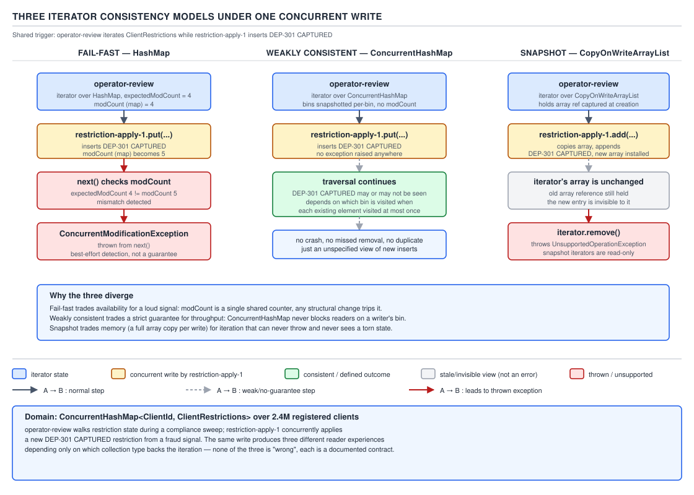
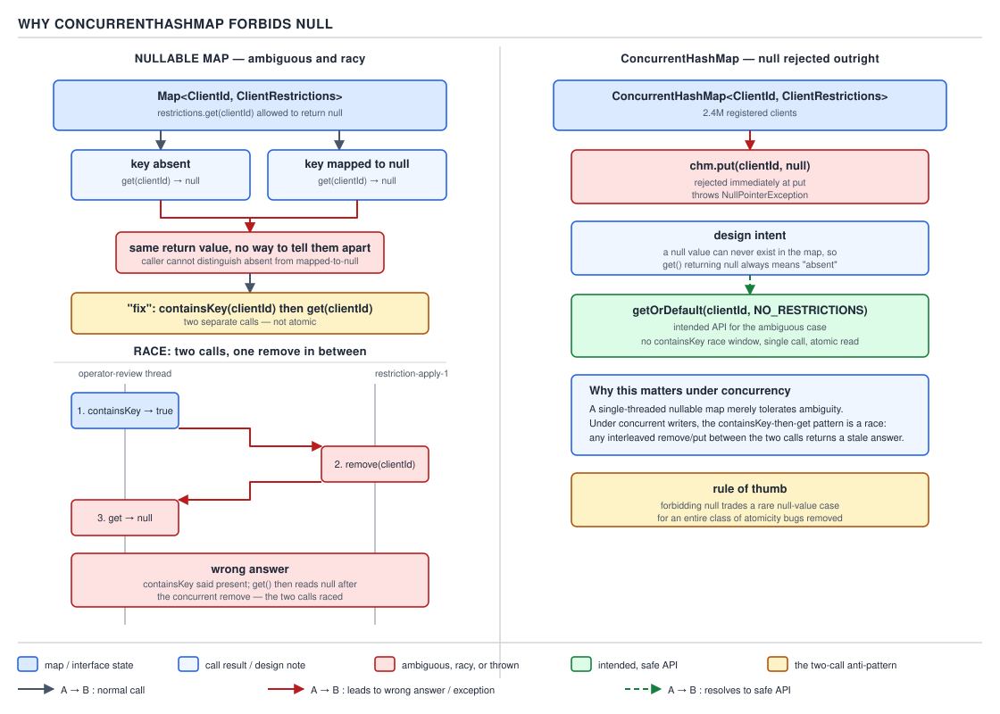
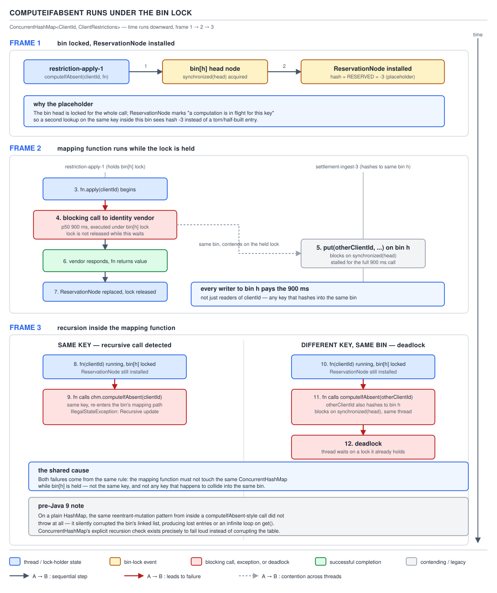

# 05 Multithreading and Concurrency — The concurrent collections — BASICS (§1.16, leaves 1.16.1–1.16.14)

**Target version: Java 21 LTS.** | **Part 1 of 5** | [Index](../00-index.md)
Previous: [Synchronizers](../synchronizers/01-basics.md) · Next: [Sorted maps, copy-on-write and the concurrent queues](01b-basics-sorted-cow-and-queues.md)

`ClientRestrictions` keeps a `ConcurrentHashMap<ClientId, ClientRestrictions>` over the platform's
2.4M registered clients — every deposit, stake and withdrawal checks it, and `AA-801 ACTIVATED`
writes to it while a settlement thread reads it. That map is the running example: what breaks a
naive lock, what a real concurrent map guarantees instead, and the atomic operations that make the
guarantee usable.

### Why `Collections.synchronizedMap` is not enough

**Mental model.** `Collections.synchronizedMap(map)` wraps a plain `HashMap` in a decorator that
puts a `synchronized` block around every single method call — `get`, `put`, `remove`, `size`, each
individually atomic, each acquiring and releasing the same intrinsic lock. Picture a bouncer at a
single door: one thread in, one call finished, door closed, next thread checked. Real safety for
one call, none at all for a sequence of them.

**Why it exists.** Before `java.util.concurrent` (Java 5, JSR-166), `HashMap` and `ArrayList` had no
thread-safety story beyond the legacy classes (§1.16.2 below). `Collections.synchronizedMap` and
`synchronizedList`, from Java 1.2, were the stopgap: wrap any collection, get per-call atomicity for
free.

**When to reach for it, and when not.** Fine when every access is a single independent call with
nothing composing two calls into one decision — rare in practice, since almost any real usage reads
a value and decides based on it. `ConcurrentHashMap` wins whenever the pattern includes a
check-then-act or read-modify-write, and additionally scales better: striped per-bin locking instead
of one global lock serialising every thread.

**How it works.** Two failure shapes, both from the same root cause — the lock is held for exactly
one method call, not for a logical operation:

1. **Compound actions are not atomic.** `if (!restrictions.containsKey(clientId))
   restrictions.put(clientId, ClientRestrictions.none());` on a `synchronizedMap` is two separate
   locked calls. Between the `containsKey` returning `false` and the `put` running, another thread
   can run the same check, also see `false`, and also `put` — one write is silently lost. The map
   itself never corrupts; the *decision* built on top of it is wrong.
2. **Iteration is entirely unprotected.** The bouncer only guards single calls; a `for` loop over
   `restrictions.entrySet()` or `keySet()` makes many separate calls to the iterator, none
   synchronized on the wrapper's lock. A concurrent mutation mid-iteration is undefined behaviour —
   most likely `ConcurrentModificationException` from the backing `HashMap`'s fail-fast iterator
   (§1.16.4) — and the javadoc's only fix is `synchronized (wrapperMap) { for (...) { ... } }`
   around the entire loop, held by the caller, not the wrapper. Skipping that manual lock is the
   most common bug report against `synchronizedMap`/`synchronizedList`: the collection "looks"
   thread-safe because every method is, so the missing lock around iteration is invisible until a
   peak-traffic race exposes it.

**A minimal concrete example** — the fix is given in full under Pitfalls at the end of this file;
here is the shape of the race itself:

```java
Map<ClientId, ClientRestrictions> restrictions = Collections.synchronizedMap(new HashMap<>());
// thread A: containsKey(clientId) -> false      (lock released)
// thread B: containsKey(clientId) -> false      (lock released, sees the same pre-write state)
// thread A: put(clientId, ClientRestrictions.none())
// thread B: put(clientId, ClientRestrictions.none())   -- overwrites A's write, no exception, no signal
```

**Pitfall:** `if (!map.containsKey(k)) map.put(k, v)` is a race *even on a real concurrent map* —
`ConcurrentHashMap` makes each call atomic, not the pair of calls. This is leaf 1.16.10 and it
recurs below with `computeIfAbsent`; the fix is always to replace the two calls with one atomic
compound method (`putIfAbsent`, `computeIfAbsent`, `merge`), never to add more locking around a
`ConcurrentHashMap` from the outside.

> **Definition:** `Collections.synchronizedMap`/`List`/`Set` guarantee that each individual method
> call is atomic and visible across threads; they guarantee nothing about sequences of calls,
> which must be locked externally on the wrapper itself, most commonly during iteration.

#### The legacy synchronized classes — supporting fact

`Vector`, `Stack` (extends `Vector`), `Hashtable` and `StringBuffer` predate `java.util.concurrent`
(Java 1.0–1.2) and synchronize every method on `this` — same compound-action gap and full
serialisation as the `synchronizedMap` wrapper, plus lock overhead on every call regardless of
contention. They still appear in old codebases and "what's wrong with this class" interviews;
nothing about them is safer than a synchronized wrapper, and `Vector` additionally leaks its lock
through public methods. There is no reason to write new code against any of the four. **Gotcha:**
`Stack` inherits `Vector`'s bottom-indexed `push`/`pop`/`peek`, easy to misread as `ArrayDeque`
semantics — prefer `ArrayDeque` for a stack and `ConcurrentHashMap`/`ConcurrentLinkedQueue` for
anything concurrent.

> **Definition:** The legacy synchronized collections (`Vector`, `Stack`, `Hashtable`,
> `StringBuffer`) synchronize every method on their own monitor, giving per-call atomicity with the
> same compound-action and iteration gaps as `Collections.synchronizedMap`, at the cost of
> uncontended lock overhead on every call.

### The concurrent collection inventory

Fifteen classes make up `java.util.concurrent`'s collection surface. This file covers the hash map
and its atomic API; the sibling file covers the sorted map/set, the copy-on-write pair and the six
queue types. The table below is the map of all fifteen so each one's place is visible before the
detail — treat it as the family tree, not a reading list.

**D-066** — The concurrent collection inventory.

| Class | Ordering | Bounded | Null policy | Read cost | Write cost | Iterator model | Blocking | Locks | Alloc/element | Right for |
|---|---|---|---|---|---|---|---|---|---|---|
| `ConcurrentHashMap` | none | no | no null key/value | O(1), lock-free | O(1) amortised, per-bin lock | weakly consistent | never | striped (per-bin) | none extra | `ClientRestrictions` lookup by `ClientId`, 1,200 stakes/sec |
| `ConcurrentHashMap.KeySetView` | none | no | no null | O(1) | O(1) per-bin lock | weakly consistent | never | shares backing map | none extra | set-of-clients view without a separate map |
| `ConcurrentSkipListMap` | sorted by key | no | no null key/value | O(log n) | O(log n), lock-free (CAS) | weakly consistent | never | none (lock-free) | node per level | ranged scans, e.g. clients by risk score |
| `ConcurrentSkipListSet` | sorted | no | no null | O(log n) | O(log n) | weakly consistent | never | none | node per level | sorted set of pending review case IDs |
| `CopyOnWriteArrayList` | insertion | no | allows null | O(1) | O(n) — full array copy | snapshot | never | one lock for writers | full array copy/write | read-heavy listener lists, not 2.8M stake appends |
| `CopyOnWriteArraySet` | insertion | no | allows null | O(n) (contains scans) | O(n) copy | snapshot | never | one lock | full array copy/write | small set of registered `NotificationService` listeners |
| `ConcurrentLinkedQueue` | FIFO | no | no null | O(1) | O(1), lock-free (CAS) | weakly consistent | never | none | node per element | unbounded work queue, no backpressure needed |
| `ConcurrentLinkedDeque` | FIFO/LIFO | no | no null | O(1) | O(1), lock-free | weakly consistent | never | none | node per element | double-ended work-stealing deque |
| `ArrayBlockingQueue` | FIFO | yes, fixed | no null | O(1) | O(1), blocks when full | weakly consistent | producer & consumer | one lock, two conditions | none (array-backed) | bounded queue of withdrawal transactions awaiting a payment run |
| `LinkedBlockingQueue` | FIFO | optional | no null | O(1) | O(1), blocks when full | weakly consistent | producer & consumer | two locks (head/tail) | node per element | high-throughput producer/consumer, e.g. stake settlement pipeline |
| `LinkedBlockingDeque` | FIFO/LIFO | optional | no null | O(1) | O(1) | weakly consistent | both ends | one lock | node per element | work-stealing with bounded capacity |
| `PriorityBlockingQueue` | priority order | no | no null | O(log n) | O(log n), blocks on take when empty | weakly consistent | consumer only | one lock | node/heap array | operator review queue ordered by SLA age |
| `DelayQueue` | delay-then-priority | no | no null | O(log n) | O(log n) | weakly consistent | consumer only | one lock | node/heap array | retrying failed PSP callbacks after backoff |
| `SynchronousQueue` | none (no storage) | yes (zero capacity) | no null | O(1) handoff | O(1) handoff, blocks until paired | n/a — no storage | both sides | none (transfer stack/queue) | none | direct handoff of a `PaymentIntent` to a dedicated executor thread |
| `LinkedTransferQueue` | FIFO | no | no null | O(1) | O(1), lock-free | weakly consistent | optional (`transfer`) | none | node per element | handoff with fallback to queuing under load |

`[NUM]` The fifteen split cleanly into four families: one hash map + its view, two sorted
structures, two copy-on-write structures, and ten queue/deque variants (including the two
blocking-deque and two priority/delay variants) — this file's leaves stop at the first family; the
next three are the sibling file's leaves 1.16.15–1.16.24.

### The three iterator-consistency models

**Mental model.** Every `java.util` collection makes one of three different promises about what an
iterator sees while another thread mutates the same collection. Picture three cameras on the same
moving scene: fail-fast slams shut the instant it detects the scene changed; weakly-consistent
keeps filming through the change, may or may not catch it in frame, never films the same object
twice; snapshot took one photograph at the start and shows only that, regardless of what happens
next.

**Why it exists.** A plain `HashMap`/`ArrayList` iterator was never designed for concurrent
mutation — it just notices corruption via a modification counter. `java.util.concurrent` had to
define, explicitly, what an iterator promises when concurrent writers are a certainty, and the three
collection families each chose a different, deliberate answer.

**When to reach for it, and when not.** The iterator model comes bundled with the collection, not
chosen separately: pick `CopyOnWriteArrayList` for the snapshot guarantee on a small, read-dominated
list; pick `ConcurrentHashMap`/the queues when weak consistency (never throws, might miss a very
recent write) is acceptable — almost always true for a live lookup like `ClientRestrictions`.

**How it works.** From the `java.util.concurrent` package javadoc, verbatim:

> "the collections in this package ... are ... generally proceed in a manner that ... never throw
> `ConcurrentModificationException` ... are guaranteed to traverse elements as they existed upon
> construction exactly once, and may (but are not guaranteed to) reflect any modifications
> subsequent to construction."

That is leaf 1.16.5's *weakly consistent* contract, and it is the middle of the three:

1. **Fail-fast** — `java.util` (`HashMap`, `ArrayList`, `TreeMap`, …). An internal `modCount` is
   bumped on every structural change; the iterator captures it at creation and compares before
   each `next()`. A mismatch throws `ConcurrentModificationException` on a **best-effort** basis —
   the javadoc is explicit that this detection is for bug-finding, not for correctness (leaf
   1.16.6): a mutation can slip through undetected, and code must never rely on catching CME as
   part of normal control flow.
2. **Weakly consistent** — `ConcurrentHashMap`, `ConcurrentLinkedQueue` and the blocking queues.
   Never throws. Guaranteed to see every element that was present for the iterator's entire
   lifetime at most once; a concurrent `put`/`remove` may or may not be visible in that same pass,
   with no way to tell which happened.
3. **Snapshot** — `CopyOnWriteArrayList`/`Set`. The iterator holds a reference to the backing
   array as it was at iterator-creation time; every subsequent structural change allocates an
   entirely new array (§1.16 sibling file), so the iterator's view is frozen and later changes are
   simply invisible to it. Its `remove()` throws `UnsupportedOperationException` because there is
   no live structure left for the iterator to mutate.



**D-067** — Three iterator-consistency models.

**A minimal concrete example** — the same concurrent removal of `target` against all three:

```java
// fail-fast: throws CME on the NEXT next() call after another thread removes during iteration
for (ClientId id : ownedHashMap.keySet()) { if (id.equals(target)) ownedHashMap.remove(id); }

// weakly consistent: never throws; removal may or may not be seen this same pass
for (ClientId id : chm.keySet()) { if (id.equals(target)) chm.remove(id); }

// snapshot: iterator already holds the pre-removal array, so it still sees target afterward
Iterator<ClientId> it = cowList.iterator();
cowList.remove(target);                 // mutates a NEW backing array
while (it.hasNext()) { it.next(); }     // untouched — still iterates the old array
```

**Pitfall:** relying on `ConcurrentModificationException` as a signal ("if it throws, retry") is
building correctness on a best-effort, unsynchronized check (leaf 1.16.6) — it can simply fail to
detect the race and let corrupted iteration proceed silently instead.

**Interview:** "What happens modifying a `HashMap` while iterating it?" — best-effort
`ConcurrentModificationException` via `modCount`, not a guarantee; the real answer under
concurrency is picking a collection whose iterator model matches the need, not "catch and retry."

> **Definition:** An iterator's consistency model is the contract for what it sees when the
> underlying collection changes during traversal — fail-fast throws best-effort, weakly consistent
> never throws and may miss recent changes, snapshot freezes the view at creation time.

### Why `ConcurrentHashMap` forbids null

**Mental model.** In a single-threaded `HashMap`, `map.get(k)` returning `null` is ambiguous on
purpose — a follow-up `containsKey(k)` check resolves it reliably because nothing else can touch
the map in between. Take that same two-step resolution into a concurrently-mutated map, and the
guarantee it depended on — "nothing changes between my two calls" — is exactly what no longer
holds.

**Why it exists.** Doug Lea's design note for `ConcurrentHashMap` treats this as a correctness
issue: with null values allowed, `get(k) == null` cannot distinguish "`k` is not mapped" from "`k`
is mapped to `null`," and the disambiguating idiom (`containsKey` then `get`) is a check-then-act
race the moment another thread can concurrently `put` or `remove` — precisely the situation
`ConcurrentHashMap` exists for.

**When to reach for it, and when not.** No toggle — every `java.util.concurrent` map
(`ConcurrentHashMap`, `ConcurrentSkipListMap`) rejects null keys and values outright, everywhere. To
represent "no restriction recorded yet," use a sentinel (`ClientRestrictions.none()`) or
`Optional<ClientRestrictions>` as the value type, never `null`.

**How it works.**



**D-070** — Why `ConcurrentHashMap` forbids null.

`put(key, null)` throws `NullPointerException` immediately, at the call site, rather than storing
an ambiguous mapping that would surface as a bug far away from its cause. The intended
disambiguating API is `getOrDefault(key, defaultValue)`, which is itself a single atomic call —
not two — so there is no window for a race in the first place.

**A minimal concrete example.**

```java
// broken — containsKey-then-get is not atomic; another thread can remove clientId in between,
// leaving r == null with no way to tell "removed" from "was mapped to null"
ClientRestrictions r = nullableRestrictions.containsKey(clientId)
        ? nullableRestrictions.get(clientId)
        : ClientRestrictions.none();

// fixed — one atomic call, no ambiguity, no race window
ClientRestrictions r2 = restrictions.getOrDefault(clientId, ClientRestrictions.none());

restrictions.put(clientId, null); // throws NullPointerException at this line, every time
```

**Pitfall:** treating the `NullPointerException` from `put(k, null)` as an arbitrary API
restriction rather than what it is — a designed rejection of an ambiguity that would otherwise be
undetectable under concurrent access. Reach for `getOrDefault`, a sentinel object, or
`Optional<V>` as the value type instead of trying to smuggle `null` in.

> **Definition:** `ConcurrentHashMap` throws `NullPointerException` on any attempt to store or
> query a null key or value, because under concurrent mutation a `null` result from `get` cannot be
> reliably disambiguated from "absent" without a racy second call.

#### `ConcurrentHashMap` basics and `mappingCount` — supporting fact

`get` is lock-free (a volatile read of the bin's head, optionally walking a list or red-black tree
with no lock at all), while every write takes a lock scoped to the single bin being modified
(`synchronized` on the bin's first node, or a CAS to install an empty bin) — never a map-wide lock.
`size()` returns an approximation under concurrent modification, summing per-segment counters that
can be stale by read time; `mappingCount()` (Java 8) is the `long`-returning replacement, same
caveat, correct for maps exceeding `Integer.MAX_VALUE` entries. **Gotcha:** neither takes a
snapshot — the true count at the instant either call returns can already be stale.

> **Definition:** `ConcurrentHashMap` gives lock-free reads and per-bin-locked writes, with
> `size()`/`mappingCount()` as best-effort approximations rather than a consistent count under
> concurrent mutation.

### The atomic compound API

**Mental model.** Every method in this group takes the two-step "look, then decide" pattern that
was racy on a plain map and collapses it into one call running, start to finish, under a single bin
lock — the map itself is the synchronization primitive; the caller never reaches for an external
lock.

**Why it exists.** `putIfAbsent`, `compute` and `merge` exist because `containsKey`-then-`put` is a
race (leaf 1.16.10) and `Collections.synchronizedMap` cannot fix it — locking each call individually
never makes a *sequence* of calls atomic. Java 8 added the `compute*`/`merge` family to give every
common check-then-act pattern a genuinely atomic, single-call form.

**When to reach for it, and when not.** Reach for these whenever the next value depends on the
current value or on absence — a counter, a lazily-initialised entry, a merge of two records. Not
when the mapping function itself needs to do anything slow, blocking, or map-touching — leaf
1.16.11 below, the sharpest trap in this family.

**How it works.** The full surface, each running atomically per key under that key's bin lock:

| Method | Behaviour |
|---|---|
| `putIfAbsent(k, v)` | inserts only if `k` is absent; returns the existing value if present, else `null` |
| `remove(k, v)` | removes only if currently mapped to exactly `v` |
| `replace(k, v)` | replaces only if `k` is present |
| `replace(k, old, new)` | replaces only if currently mapped to exactly `old` |
| `computeIfAbsent(k, fn)` | if absent, computes and inserts `fn.apply(k)`; if present, returns existing value untouched |
| `computeIfPresent(k, fn)` | if present, replaces with `fn.apply(k, v)`, or removes if `fn` returns `null` |
| `compute(k, fn)` | unconditionally computes `fn.apply(k, currentOrNull)`; removes on `null` result |
| `merge(k, v, fn)` | if absent, inserts `v`; if present, replaces with `fn.apply(existing, v)`, removes on `null` |
| `getOrDefault(k, def)` | atomic single-call read with a fallback, no `containsKey` needed |
| `forEach`, `search`, `reduce` | bulk traversal/aggregation forms, see leaf 1.16.14 below |

Every row above and their `...Key`, `...Value`, and `...Entry` bulk variants share the same
guarantee: one call, one atomic effect, no external lock required.

**A minimal concrete example** — the QuizStakes reservation counter, `merge` at 1,200/sec peak:

```java
ConcurrentHashMap<ClientId, Long> reservationsToday = new ConcurrentHashMap<>();

void recordStakeReservation(ClientId clientId) {
    // absent -> inserts 1L; present -> Long.sum(existing, 1L); one call, one bin lock, no race
    reservationsToday.merge(clientId, 1L, Long::sum);
}
```

**Interview:** "Thread-safe per-key counter without `AtomicLong` plumbing?" —
`ConcurrentHashMap<K, Long>` plus `merge(key, 1L, Long::sum)`: one atomic call, no external
synchronization, no per-key object unless the mapping function creates one (next leaf).

> **Definition:** The atomic compound API replaces every check-then-act pattern on a concurrent
> map with a single call whose entire effect — read, decide, write — runs under one bin lock.

### `computeIfAbsent` runs under the bin lock

**Mental model.** `computeIfAbsent` looks like a convenience method for lazy initialisation. Under
the hood it is "the map hands your function the keys to one bin and does not let go until your
function returns" — the mapping function executes *while the bin lock is held*, so its runtime is
exactly how long every other writer to that bin stays blocked.

**Why it exists.** Before `computeIfAbsent`, lazy initialisation of a per-key value needed exactly
the `containsKey`-then-`put` race this file keeps warning about, or a `synchronized` block around
both steps that defeated the point of using a concurrent map. `computeIfAbsent` gives atomicity for
free, at the cost of a sharp constraint on what the mapping function may do.

**When to reach for it, and when not.** Cheap, pure, non-blocking initialisation — a fresh
`AtomicLong`, a fresh empty list. Not when initialisation needs a network call, a lock on anything
else, or — the trap here — a second operation on the *same* `ConcurrentHashMap`.

**How it works.** `ConcurrentHashMap` installs a placeholder — a `ReservationNode` carrying the
sentinel hash `RESERVED = -3` — as the bin's head before calling the mapping function, holding the
bin lock and making reentrant attempts on that bin detectable. The mapping function then runs to
completion with that lock held. Three consequences:

1. A **blocking call** inside the mapping function (a network round-trip, a wait on another lock)
   stalls every other thread writing to that same bin — not the whole map, but every key hashing
   into that bin — for as long as the call takes.
2. **Recursion on the same key** — calling `computeIfAbsent` again for the same key from inside the
   mapping function — is detected via the `ReservationNode` and throws
   `IllegalStateException: Recursive update`, since it would otherwise block forever on a lock the
   outer call already holds.
3. **A different key hashing to the same bin** is *not* reliably detected as the same operation —
   it can deadlock instead of throwing. `[RESEARCH]`: OpenJDK issue trackers document this
   distinction explicitly — same-key recursion throws a documented exception, cross-key same-bin
   recursion is undefined behaviour up to and including deadlock.

`[VERSION-TRAP]` `HashMap` (the plain, non-concurrent one) had the equivalent bug pre-Java-9: a
reentrant `computeIfAbsent` on the same map during its own mapping function silently corrupted the
internal table (JDK-8071667-class issues), rather than failing loudly. Since Java 9, `HashMap`
detects the structural modification via `modCount` and throws `ConcurrentModificationException`
instead of corrupting state — safer, but still a bug, not a supported pattern; `HashMap` has no
locking model to make recursion into a well-defined feature.



**D-071** — `computeIfAbsent` runs under the bin lock.

**A minimal concrete example.**

```java
ConcurrentHashMap<ClientId, List<RestrictionKey>> restrictionsByClient = new ConcurrentHashMap<>();

// broken — touches the SAME map from inside its own mapping function: same-key case throws
// IllegalStateException, different-key-same-bin case can deadlock. Never do this.
restrictionsByClient.computeIfAbsent(clientId, id -> {
    restrictionsByClient.putIfAbsent(id, new ArrayList<>());
    return new ArrayList<>();
});

// fixed — mapping function only allocates; the second write happens after the call returns
List<RestrictionKey> keys = restrictionsByClient.computeIfAbsent(clientId, id -> new ArrayList<>());
synchronized (keys) {           // list itself still needs its own guard if mutated concurrently
    keys.add(key);
}
```

**Pitfall:** the `computeIfAbsent` mapping function must be short, must not block, and must not
read or write the same `ConcurrentHashMap` — a recursive call on the same key throws
`IllegalStateException: Recursive update`; on a different key hashing to the same bin it can
deadlock instead. Move any second map operation to after `computeIfAbsent` returns.

> **Definition:** `ConcurrentHashMap.computeIfAbsent` executes its mapping function while holding
> the target bin's lock, so the function must be short, non-blocking and must never touch the same
> map — violating that either throws a documented `IllegalStateException` or deadlocks, depending
> on whether the reentrant key shares the outer key's bin.

#### `merge` vs. `computeIfAbsent(...).incrementAndGet()` — supporting fact

`merge(clientId, 1L, Long::sum)` (leaf 1.16.12) keeps no per-key object, boxing a fresh `Long` every
call. `map.computeIfAbsent(clientId, k -> new AtomicLong()).incrementAndGet()` allocates one
`AtomicLong` per key once, then mutates it in place — no boxing on later calls, at the cost of 2.4M
long-lived counters if every client gets one. `merge` wins for first-touch-dominated traffic; the
cached `AtomicLong` wins for repeated increments to a stable key set. **Gotcha:** the `AtomicLong`
form still calls `computeIfAbsent`, so its mapping function must stay a plain allocation.

> **Definition:** `merge` with a reducing function is the zero-persistent-state atomic counter;
> `computeIfAbsent` caching a mutable `AtomicLong` trades a one-time per-key allocation for cheaper
> repeated increments.

#### `ConcurrentHashMap.newKeySet()` and `keySet(defaultValue)` — supporting fact

`ConcurrentHashMap.newKeySet()` returns a `Set<K>` backed by a hidden `ConcurrentHashMap<K,
Boolean>` — the concurrent-set equivalent of `Collections.newSetFromMap` with no manual backing
map. `keySet(V defaultValue)` is a view over an *existing* map's keys where added elements get a
fixed `defaultValue`, useful for a "clients under manual review" membership set layered on a map
that carries richer values elsewhere. Both share `ConcurrentHashMap`'s null policy and
weakly-consistent iterator. **Gotcha:** `keySet(defaultValue)`'s `add()` only works when a
`defaultValue` was supplied; the plain `keySet()` view is read-only for `add()`.

> **Definition:** `newKeySet()` is a `ConcurrentHashMap`-backed `Set` for pure membership tracking;
> `keySet(defaultValue)` is a mutable key-only view over an existing map for the same purpose
> without a second data structure.

#### The bulk parallel operations — supporting fact

`forEach`, `search` and `reduce` (each with `...Key`, `...Value`, `...Entry` variants) accept a
`parallelismThreshold` — the element count below which the operation runs serially on the calling
thread. Above it, the traversal is split and submitted to `ForkJoinPool.commonPool()`, the same
pool used by parallel streams and bare `CompletableFuture.supplyAsync`. `[RESEARCH]`: current
OpenJDK documentation confirms the common pool is the execution target and that `Long.MAX_VALUE`
forces strictly sequential execution; no alternate pool can be specified. Rarely reached for on a
map like `ClientRestrictions` (a targeted `merge`/`compute` is almost always the right tool), but
occasionally asked about for the shared-pool interaction. **Gotcha:** a blocking function passed to
bulk `reduce`/`forEach` starves every other common-pool consumer in the process.

> **Definition:** `ConcurrentHashMap`'s bulk `forEach`/`search`/`reduce` run sequentially below a
> caller-supplied `parallelismThreshold` and in parallel on the shared common `ForkJoinPool` above
> it.

## Pitfalls

### Assuming `Collections.synchronizedMap` makes a check-then-act sequence safe

**Wrong**

```java
if (!restrictions.containsKey(clientId)) {         // restrictions is Collections.synchronizedMap(...)
    restrictions.put(clientId, ClientRestrictions.none()); // two threads can both reach here
}
```

**Right**

```java
restrictions.putIfAbsent(clientId, ClientRestrictions.none()); // restrictions is a ConcurrentHashMap
```

**Why people believe it:** the class name contains "synchronized," and every individual call
genuinely is atomic — the gap only appears once two calls chain into one decision, easy to miss in
a review that checks "is this thread-safe?" instead of "is this *sequence* atomic?"

### Treating `computeIfAbsent`'s mapping function as an ordinary lambda

**Wrong**

```java
restrictionsByClient.computeIfAbsent(clientId, id -> {
    restrictionsByClient.putIfAbsent(id, new ArrayList<>()); // reentrant on the same map
    return new ArrayList<>();
});
```

**Right**

```java
List<RestrictionKey> keys = restrictionsByClient.computeIfAbsent(clientId, id -> new ArrayList<>());
// any further map operation happens AFTER this call returns, never inside it
```

**Why people believe it:** the mapping function has the shape of any ordinary lambda, and nothing
signals it executes under a lock — the constraint lives only in the javadoc's prose, not the type
system.

## Cheat sheet

| Fact | Value |
|---|---|
| `synchronizedMap`/`List`/`Set` per-call atomicity | yes |
| `synchronizedMap`/`List`/`Set` compound-action atomicity | no — external lock required |
| Legacy synchronized classes | `Vector`, `Stack`, `Hashtable`, `StringBuffer` |
| Fail-fast iterator collections | `java.util` (`HashMap`, `ArrayList`, …) |
| Weakly consistent iterator collections | `ConcurrentHashMap`, the `j.u.c` queues |
| Snapshot iterator collections | `CopyOnWriteArrayList`/`Set` |
| `ConcurrentModificationException` guarantee | best-effort, unsynchronized — never rely on catching it |
| `ConcurrentHashMap` null keys/values | forbidden — `NullPointerException` |
| Absent-vs-null-value disambiguation | `getOrDefault(k, default)`, one atomic call |
| `containsKey`-then-`put` on any map | always a race |
| Idiomatic atomic counter | `map.merge(k, 1L, Long::sum)` |
| Counter with persistent per-key state | `map.computeIfAbsent(k, x -> new AtomicLong()).incrementAndGet()` |
| `computeIfAbsent` mapping function runs | under the target bin's lock |
| Same-key recursive `computeIfAbsent` | `IllegalStateException: Recursive update` |
| Different-key, same-bin recursive `computeIfAbsent` | undefined — can deadlock |
| Plain `HashMap` reentrant `computeIfAbsent` (Java 9+) | `ConcurrentModificationException` |
| Plain `HashMap` reentrant `computeIfAbsent` (pre-Java 9) | silent table corruption |
| `newKeySet()` | `Set<K>` backed by hidden `ConcurrentHashMap<K, Boolean>` |
| `keySet(defaultValue)` | mutable key view, `add()` uses `defaultValue` |
| Bulk `forEach`/`search`/`reduce` above threshold | run on `ForkJoinPool.commonPool()` |

## Self-test

**Q1.** Why does wrapping a `HashMap` in `Collections.synchronizedMap` fail to make
`if (!map.containsKey(k)) map.put(k, v)` safe, and where does the same wrapper still need a manual
lock from the caller?

<details><summary>Answer</summary>

Each call is individually synchronized, but the lock releases between them, so two threads can both
see `false` from `containsKey` and both `put`. Iteration has the same gap: an iterator makes many
unlocked calls, so the caller must wrap the whole loop in `synchronized (map)` itself.

</details>

**Q2.** Name the three iterator-consistency models, one representative collection each, and why
`ConcurrentModificationException` cannot be relied on as a retry signal.

<details><summary>Answer</summary>

Fail-fast (`HashMap`/`ArrayList`) throws `CME` on a detected `modCount` change; weakly consistent
(`ConcurrentHashMap`, the `j.u.c` queues) never throws and may or may not see a concurrent change,
visiting each element at most once; snapshot (`CopyOnWriteArrayList`/`Set`) iterates the array
frozen at creation and throws `UnsupportedOperationException` on `remove()`. CME detection is
documented as best-effort and unsynchronized, so it can fail to fire — code must not depend on
catching it.

</details>

**Q3.** Why does `ConcurrentHashMap` forbid null keys and values, when `HashMap` allows both?

<details><summary>Answer</summary>

With null values allowed, `get(k) == null` cannot distinguish "`k` is absent" from "`k` is mapped to
`null`." A single-threaded caller resolves that with `containsKey` then `get` because nothing else
touches the map in between; under concurrent mutation another thread can insert or remove `k`
between the two calls, turning the disambiguating idiom itself into a race. `ConcurrentHashMap`
rejects null outright and offers `getOrDefault` as one atomic call instead.

</details>

**Q4.** What specifically goes wrong if a `computeIfAbsent` mapping function calls
`computeIfAbsent` again on the same map — for the same key, and for a different key hashing to the
same bin?

<details><summary>Answer</summary>

Same key: the `ReservationNode` (hash `RESERVED = -3`) already installed for that key is detected,
and the call throws `IllegalStateException: Recursive update`, since proceeding would block forever
on a lock the outer call already holds. Different key, same bin: the reentrancy is not detectable as
the same logical operation, so the inner call can simply block on the bin lock — a deadlock, not a
guaranteed exception.

</details>

**Q5.** What changed about a plain `HashMap`'s behaviour on reentrant `computeIfAbsent` between
Java 8 and Java 9, and why is the newer behaviour still not "supported"?

<details><summary>Answer</summary>

Java 8 silently corrupted the internal table; Java 9 detects the structural change via `modCount`
and throws `ConcurrentModificationException` instead — louder, but `HashMap` still has no locking
model that makes recursive self-modification a well-defined, supported pattern.

</details>

**Q6.** Give two ways to implement an atomic per-key counter on a `ConcurrentHashMap` and one
concrete tradeoff between them.

<details><summary>Answer</summary>

`map.merge(key, 1L, Long::sum)` keeps no persistent per-key object, boxing a fresh `Long` every
call. `map.computeIfAbsent(key, k -> new AtomicLong()).incrementAndGet()` allocates one `AtomicLong`
per key once, then mutates it in place with no further map interaction or boxing. Tradeoff:
`merge` suits first-touch-dominated traffic; the cached `AtomicLong` pays a one-time per-key
allocation (2.4M clients = 2.4M long-lived counters) for cheaper repeated increments.

</details>

**Q7.** What pool executes `ConcurrentHashMap`'s bulk `forEach`/`search`/`reduce` above the
`parallelismThreshold`, and what is the practical risk of that choice?

<details><summary>Answer</summary>

`ForkJoinPool.commonPool()` — the same pool used by parallel streams and any
`CompletableFuture.supplyAsync` without an explicit executor. A long-running or blocking function
passed to one of these bulk operations ties up common-pool workers, starving every other unrelated
consumer of that pool in the process.

</details>

---

**Leaves covered:** 1.16.1–1.16.14 (14 leaves)
**Leaves deferred:** none
**Diagrams included:** D-066, D-067, D-070, D-071
**Target version:** Java 21 LTS
**Lines:** 596
