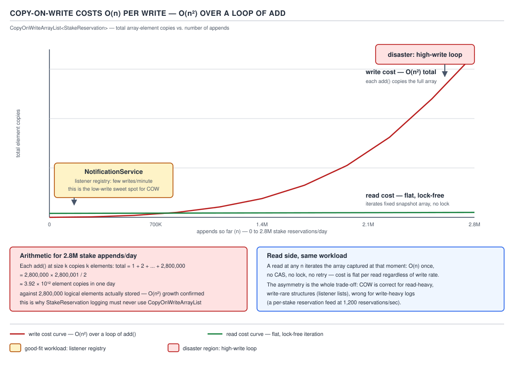

# 05 Multithreading and Concurrency — The concurrent collections — BASICS (§1.16, leaves 1.16.15–1.16.24)

**Target version: Java 21 LTS.** | **Part 1 of 5** | [Index](../00-index.md)
Previous: [Concurrent maps and iterators](01a-basics-maps-and-iterators.md) · Next: [BlockingQueue and the producer–consumer pattern](../queues/01-basics-blockingqueue.md)

`01a` covered `ConcurrentHashMap` and weakly-consistent iteration. This file covers the sorted
concurrent map, the copy-on-write family, the reason a concurrent `List` does not exist, and how
to tell a view from a copy from a snapshot — the mistake that produces three different bugs
depending on which one you reached for.

### `ConcurrentSkipListMap` — the sorted concurrent map

**Mental model.** A `TreeMap` is a red-black tree: balanced, ordered, but every rebalance touches
shared parent/child pointers, which makes fine-grained concurrent locking miserable — a rotation
at the root can ripple through the whole tree while another thread is mid-traversal. A skip list
sidesteps this entirely: it is a stack of linked lists, each level a sparser "express lane" over
the one below. A search drops down a level every time it overshoots. No rotations, no rebalancing
— nodes are inserted with a randomly chosen height and linked in, which is a purely local edit.
That locality is what makes it lock-free-friendly.

**Why it exists.** `ConcurrentHashMap` gives you thread-safe hashing but throws ordering away.
`TreeMap` gives you ordering but is not thread-safe at all — external synchronization on a
`TreeMap` serializes every read, including the read-only ones. `ConcurrentSkipListMap` is the
answer to "I need sorted iteration and range queries (`headMap`, `tailMap`, `ceilingKey`,
`firstKey`) under real concurrent access."

**When to reach for it, and when not.** Reach for it when the client genuinely needs order —
QuizStakes' `PendingActions` service keeping operator review queues ordered by `submittedAt` so
the oldest `ReviewCase` always sorts first, or a leaderboard keyed by stake volume. Do not reach
for it as a default map: `ConcurrentHashMap` is faster for pure key lookup because it does not pay
for order it never uses, and its `size()` is a maintained approximation rather than a full walk
(see below). If you don't need `NavigableMap` methods, you're paying a real cost for nothing.

**How it works.** Every node lives in the bottom-level list; a `ThreadLocalRandom` coin-flip
decides whether each newly inserted node also gets promoted into level 2, level 3, and so on, with
geometrically shrinking probability. Expected search, insert and delete are all **O(log n)** —
matching a balanced tree — because expected level count is `log n` and each level roughly halves
the remaining search space. Insertion and removal are implemented with CAS loops over the
`AtomicReference` next-pointers of the affected nodes at each level, not a global lock; that is
what lets one thread splice in a new node while another concurrently reads through untouched parts
of the list. The type also backs `ConcurrentSkipListSet`, which is a thin `NavigableSet` wrapper
over a `ConcurrentSkipListMap` with dummy values, the same relationship `HashSet` has to
`HashMap`. Neither accepts a `null` key — `compareTo`/`Comparator` needs something to order
against, and `null` breaks that contract silently rather than loudly, so both fail fast on
insertion instead.

```java
NavigableMap<Instant, ReviewCase> queueBySubmission = new ConcurrentSkipListMap<>();
queueBySubmission.put(reviewCase.submittedAt(), reviewCase);

// oldest case an operator should pick up next
Map.Entry<Instant, ReviewCase> oldest = queueBySubmission.firstEntry();

// every case submitted in the last SLA window
SortedMap<Instant, ReviewCase> withinSla =
        queueBySubmission.tailMap(Instant.now().minus(Duration.ofMinutes(30)));
```

**The gotcha — `size()` is O(n).** `[TRAP]` `[NUM]` A `TreeMap` maintains no running count either,
but it is single-threaded, so callers rarely notice a full-tree walk. `ConcurrentSkipListMap`
inherits the same absence of a counter, and here it bites: **`size()` traverses the entire
bottom-level list and counts nodes**, which is the opposite of `ConcurrentHashMap`, whose `size()`
sums per-segment counters that are already being maintained. `[SOURCE]` The javadoc says it
outright: *"Beware that, unlike in most collections, this method is NOT a constant-time
operation... if this collection is modified during execution of this method, the returned result
may be inaccurate."* The reason it cannot maintain a counter cheaply is the same reason it scales:
a shared `AtomicInteger` count, bumped on every insert and delete across all levels, would become
exactly the kind of single hot cache line that a lock-free skip list is built to avoid — you'd be
trading away the concurrency you just bought. Put a number on it: a `PendingActions` queue with
90 peak operators pulling and 40k applications/day landing in review at the 24% referral-adjacent
rate calls `size()` on a dashboard poll every few seconds; at even a modest 50k entries, that is a
50,000-node walk on every poll, competing for CPU with the inserts and removals actually driving
the business. The escape hatch is to keep your own `LongAdder` alongside the map, incremented on
insert and decremented on removal — approximate under concurrent mutation, but O(1), which is what
a dashboard actually needs.

> **`ConcurrentSkipListMap`** is a lock-free, node-local, probabilistically-balanced sorted map:
> O(log n) expected search/insert/delete, full `NavigableMap` surface, but an O(n) `size()` because
> no count is maintained anywhere in the structure.

---

### Copy-on-write: O(1) lock-free reads, O(n) allocate-and-copy writes

**Mental model.** Picture the backing array as a photograph, not a whiteboard. A whiteboard is
what `ArrayList` is: everyone reads and writes the same physical surface, so writers need a lock
to keep readers from seeing a half-finished edit. A photograph cannot be edited in place at all —
to change anything, you develop an entirely new photograph and swap which one the frame on the
wall points to. Every reader already holding the old photograph keeps looking at it, unaware
anything changed, until they ask for a fresh one.

**Why it exists.** `Collections.synchronizedList` makes every operation — reads included —
acquire the same lock, which serializes even a thread that only ever calls `size()` or iterates.
For a list that is read constantly and mutated almost never, that is pure waste. Copy-on-write
inverts the cost: reads pay nothing (no lock, no `synchronized`, no memory barrier beyond a plain
volatile-field read of the array reference) and all the cost is pushed onto the rare writer.

**When to reach for it, and when not.** The textbook fit is a listener registry: QuizStakes'
`NotificationService` holds a small, rarely-changed list of channel handlers — email, SMS,
webhook, in-app push — registered once at startup and iterated on every settlement event.
`[STAFF]` Reads vastly outnumber writes, the list stays small (tens of entries, not millions), and
an iterator that misses a listener registered a microsecond ago is completely harmless — the next
notification will pick it up. **Do not** reach for it when writes are frequent or the list is
large: appending stake reservations, buffering settlement events, or anything on the 2.8M/day,
1,200/sec-peak hot path is the wrong fit — see the disaster below. `ConcurrentLinkedQueue` or a
`BlockingQueue` wins there instead.

**How it works.** `CopyOnWriteArrayList` holds one `volatile Object[] array` field. Every mutator
— `add`, `remove`, `set`, `addIfAbsent` — takes an internal `ReentrantLock`, allocates a brand new
array one element larger or smaller via `Arrays.copyOf`, applies the single change, and publishes
the new array by reassigning the volatile field. `[NUM]` The cost model:

| Operation | Cost | Why |
|---|---|---|
| `get(i)` | O(1), lock-free | plain read of the current array reference, then index into it |
| iteration | O(n), lock-free | iterator captures the array reference once at creation and walks that fixed snapshot |
| `add`/`remove`/`set` | O(n) | `Arrays.copyOf` allocates and copies the *entire* backing array, even to change one element |



**D-068** — Copy-on-write costs O(n) per write: a loop of single appends accumulates copies as a
triangular sum, curving toward O(n²) total element-copies, plotted against a flat, lock-free read
line; the listener-registry fit sits at the low-write end of the axis where that curve is still
near zero.

```java
public final class NotificationService {

    private final List<NotificationListener> listeners = new CopyOnWriteArrayList<>();

    public void register(NotificationListener listener) {
        listeners.add(listener);                 // rare: a few times at startup
    }

    public void onStakeSettled(Movement settlement) {
        for (NotificationListener listener : listeners) {  // hot: 3,400/sec burst
            listener.notify(settlement);
        }
    }
}
```

Registration happens a handful of times over the service's lifetime; the settlement broadcast
runs at burst rate with zero locking on the read side. This is the shape copy-on-write was built
for.

**Pitfall:** `[TRAP]` the iterator returned by `CopyOnWriteArrayList.iterator()` is a snapshot over
the array reference captured at creation time. It does not support `remove()`, `set()`, or
`add()` — every one of those throws `UnsupportedOperationException`, because there is no
"current position" to mutate in a structure whose backing array may already have been replaced
twice since the iterator was built. It also never reflects changes made after it was created,
which is not a bug but is routinely mistaken for one: a thread that registers a listener mid-loop
and expects the loop it is inside to notice has misunderstood the contract.

**Pitfall:** `[TRAP]` `[NUM]` a loop of `list.add(x)` on a `CopyOnWriteArrayList` is **O(n²) in
total copies**, and it will melt a service that mistakes this for a general-purpose list. Work the
arithmetic through for QuizStakes' actual worst case: stake reservations run at 2.8M/day. Suppose
someone builds a "recent reservations" buffer with `CopyOnWriteArrayList<Reservation>` and appends
every one. The *i*-th `add` copies an array of size *i − 1*, so the total number of elements
copied across the whole run is

```
1 + 2 + 3 + ... + (n − 1)  =  n(n − 1) / 2   for n = 2,800,000

2,800,000 × 2,799,999 / 2  ≈  3.92 × 10¹² element-copies
```

Nearly four trillion element-copies in a single day, growing quadratically — the 1,200th append
copies 1,200 elements, the 1,200,000th append copies 1,200,000 elements, for one insert each. At
1,200 reservations/sec peak, the service is asking the JVM to allocate and copy a multi-megabyte
array *every single reservation*, and that allocation rate alone will drown the GC before the
copy cost even finishes mattering. This is precisely the contrast the syllabus numbers exist to
make concrete: the same class that is a perfect fit for a listener registry (tens of entries, rare
writes) is a service-melting disaster for a hot-path buffer of millions of appends.

> **`CopyOnWriteArrayList`** trades an O(n) allocate-and-copy on every write for a completely
> lock-free O(1) read and a stable iteration snapshot — correct only when writes are rare and the
> list is small, catastrophic under an append-heavy hot path.

---

### There is no concurrent `List`

**Mental model.** `ConcurrentHashMap` and `ConcurrentSkipListMap` both work because a map's
identity for any given entry is its *key*, and keys don't move when other keys are added or
removed. A `List`'s identity for an element is its *index*, and indices move: inserting at
position 3 silently renumbers every element from 3 onward. That difference is the whole reason
`java.util.concurrent` has no general-purpose concurrent, index-addressable, mutation-in-place
`List`.

**Why it exists — or rather, why it doesn't.** `[PROVE]` `[TRAP]` Walk the argument through.
Suppose a lock-free `ConcurrentArrayList` existed, backed by CAS operations the way
`ConcurrentSkipListMap`'s nodes are. Thread A calls `remove(3)` while thread B, holding no lock,
is mid-iteration and calls `get(5)`. Before A's remove, index 5 holds some element `E`. A's
`remove(3)` must shift every element from index 4 onward down by one — that's not one CAS, it's an
unbounded number of them, one per surviving element, and none of them can be made atomic together
because CAS operates on a single memory word. Between A's first shift and its last, B's `get(5)`
can observe either the pre-remove or post-remove value of index 5, or — worse — a state where the
shift is half-applied and index 5 holds neither the old element nor `E`'s new position. A
`HashMap`'s bucket for key `K` never needs this: removing some other key `K'` never moves `K`. The
structural requirement of a `List` — contiguous, renumbered-on-mutation indices — and the
structural requirement of lock-freedom — one atomic word decides the whole operation — are
mutually exclusive for any operation that isn't an append at the tail. That is why the only two
survivors are `Vector` (every operation behind one coarse lock, sidestepping the problem by
serializing everything) and `CopyOnWriteArrayList` (sidestepping it differently: never mutate the
array in place at all, publish a whole new one instead, so no reader ever observes a half-shifted
state).

**When this matters.** Any time a `List` needs concurrent read *and* write access, the real choice
is between `Collections.synchronizedList` (coarse lock, correct, slow under contention),
`CopyOnWriteArrayList` (lock-free read, O(n) write, correct only for the read-dominated shape
above), or reframing the problem so index-addressability isn't needed at all —
`ConcurrentLinkedQueue` (below) drops the index and gets lock-freedom back.

> There is no lock-free, index-addressable, in-place-mutable concurrent `List`, because a `List`'s
> per-element identity is its index, indices renumber on any positional insert or remove, and
> renumbering an unbounded run of elements cannot be expressed as one atomic CAS.

**Supporting fact — `ConcurrentLinkedQueue` / `ConcurrentLinkedDeque`.** `[NUM]` Both are
unbounded, non-blocking queues built on the Michael–Scott lock-free linked-list algorithm: `offer`
CASes a new tail node in and never blocks or fails on a full queue, because there is no "full" —
only `OutOfMemoryError` is the ceiling. `size()` is **O(n) and approximate** under concurrent
mutation, for the same reason as the skip list: no maintained counter, and by the time a full walk
finishes, the answer may already be stale. **Gotcha:** treating `size()` as authoritative for a
capacity check is a race — nothing stops another thread from adding between the read and the
decision. Reach for these when you need a hand-off structure with no blocking and no bound, such
as an internal work queue for `BankWithdrawal` retries where producers must never stall.

> **`ConcurrentLinkedQueue`** is a lock-free, unbounded, Michael–Scott linked queue: `offer` never
> blocks or fails, but `size()` costs a full traversal and is stale the instant it returns.

**Supporting fact — choosing among the concurrent collections.** `[TRAP]`

| Need | Choice | Why not the alternative |
|---|---|---|
| Sorted keys, range queries | `ConcurrentSkipListMap` | `ConcurrentHashMap` has no order at all |
| Unordered key lookup, hot path | `ConcurrentHashMap` | skip list pays O(log n) for order you don't use |
| Small, read-heavy, rarely mutated list | `CopyOnWriteArrayList` | `synchronizedList` locks every read too |
| Large or write-heavy sequence, no index needed | `ConcurrentLinkedQueue`/`Deque` | CoW's O(n) write melts under volume |
| Bounded hand-off with backpressure | `BlockingQueue` (next file) | unbounded queues can't signal "wait, I'm full" |
| Need index-addressable *and* heavily mutated | nothing fits — redesign | see "no concurrent `List`" above |

**Gotcha:** the table's last row is the one people skip past — there is no correct answer in that
box, only a wrong collection or a wrong requirement, and the fix is almost always to drop the
index requirement rather than keep hunting for a class that doesn't exist.

---

### Views versus copies versus snapshots

**Mental model.** Three words get used almost interchangeably and describe three different
relationships to the same underlying data: a **view** is a window onto the original — write
through it and the original changes; a **copy** is independent from the moment it's made — nothing
you do to either side reaches the other; a **snapshot** is a copy taken *at a point in time* —
independent going forward, but it was equal to the original at the instant it was captured.
Confusing any two of these produces a bug, and each pairing produces a *different* bug.

**Why it matters here.** `[X-REF 02]` §2.6 covers the JMM-level reasons a snapshot iterator is
safe without synchronization; this file covers the practical decision of which one to reach for.
`keySet()` on any map — `ConcurrentHashMap` included — returns a **view**: calling `.remove(k)` on
that set removes the entry from the underlying map, which surprises anyone expecting a detached
copy of the keys. `CopyOnWriteArrayList.iterator()` returns a **snapshot** over the array reference
held at creation: it never throws `ConcurrentModificationException`, but it also silently never
sees anything added after that point, which is a correctness bug dressed up as a convenience.
`List.copyOf(list)` is a genuine, fully independent **copy** — nothing written to the original
after that call is visible through it, and nothing written to it is visible in the original,
because Java 21 requires `List.copyOf` to return, and to be documented as returning, an unmodifiable structure fully detached from its source.

| Operation | View or copy | Writes through? | Thread-safe? | Reflects later changes? | Mistake it causes |
|---|---|---|---|---|---|
| `map.keySet()` | View | Yes (`remove` only) | as safe as the map | Yes | `remove()` on the view silently deletes the map entry |
| `map.values()` | View | Yes (`remove` only) | as safe as the map | Yes | assuming it's a detached list, then losing entries |
| `map.entrySet()` | View | `Entry.setValue` yes | as safe as the map | Yes | mutating a captured `Entry` after the map moved on |
| `Collections.unmodifiableList(list)` | View | No (throws) | only as safe as the wrapped list | Yes | assuming immutability protects against the *backing* list changing underneath it |
| `List.copyOf(list)` | Copy | N/A — unmodifiable | fully | No | none if used correctly; misuse is expecting it to see later writes |
| `list.toArray()` | Copy | N/A — plain array | fully | No | mutating the array and expecting the list to change |
| `CopyOnWriteArrayList` iterator | Snapshot | N/A — `remove`/`set`/`add` throw | fully (immutable snapshot) | No | expecting an in-flight loop to notice a listener registered mid-loop |
| `list.subList(from, to)` | View | Yes | as safe as the backing list | Yes | structurally modifying the backing list invalidates the view, `ConcurrentModificationException` on next use |


**D-069** — Views, copies and snapshots: the table above, keyed on write-through, thread-safety,
and the specific bug each mistake produces.

**Pitfall:** `[TRAP]` treating `keySet()` as a safe read-only export is the single most common
instance of this confusion — a method that hands out `application.getStatusHistory().keySet()`
"for the caller to inspect" has handed out a live door into the map, and a caller that calls
`.clear()` on what it thinks is a defensive copy has just wiped the real data.

**Interview:** "What's the difference between `Collections.unmodifiableList` and `List.copyOf`?"
— `unmodifiableList` wraps the original and blocks writes *through the wrapper*, but the backing
list can still be mutated directly and the wrapper will show it; `List.copyOf` detaches entirely,
so nothing done to the source list afterward is visible.

> A **view** writes through to its source; a **copy** never sees the source again after creation;
> a **snapshot** is a copy that was accurate exactly once, at the moment it was taken.

---

## Pitfalls

### Assuming `CopyOnWriteArrayList` is a drop-in replacement for `ArrayList`

**Wrong**
```java
List<Reservation> recent = new CopyOnWriteArrayList<>();
for (Reservation r : incomingReservations) {   // 2.8M/day, 1,200/sec peak
    recent.add(r);
}
// service falls over under GC pressure long before 2.8M appends complete
```

**Right**
```java
Queue<Reservation> recent = new ConcurrentLinkedQueue<>();
for (Reservation r : incomingReservations) {
    recent.add(r);   // O(1) node link, no full-array copy
}
```

**Why people believe it:** both implement `List`/`Collection`, both are in
`java.util.concurrent`, and the class name reads like a safety upgrade over `ArrayList` rather
than a specialized structure with an O(n) write built into its contract.

### Assuming `map.keySet()` returns a snapshot of the keys

**Wrong**
```java
Set<ClientId> exportedIds = restrictionsByClient.keySet();
exportedIds.clear();   // clears restrictionsByClient too — it's the same backing structure
```

**Right**
```java
Set<ClientId> exportedIds = Set.copyOf(restrictionsByClient.keySet());
exportedIds.clear();   // throws UnsupportedOperationException, and even if it didn't, it wouldn't reach the map
```

**Why people believe it:** `keySet()` reads like an accessor that produces a value, the same
mental shape as `getName()`, when it actually produces a live, writable window.

## Cheat sheet

| Type | Structure | Read cost | Write cost | Ordered? | Null keys/elements? |
|---|---|---|---|---|---|
| `ConcurrentSkipListMap` | lock-free skip list | O(log n) | O(log n) | yes (`NavigableMap`) | no null key |
| `ConcurrentSkipListMap.size()` | full traversal | O(n) | — | — | — |
| `CopyOnWriteArrayList` | volatile array + lock | O(1), lock-free | O(n) allocate+copy | insertion order | no null restriction (but avoid) |
| CoW iterator | fixed array snapshot | O(1) per step | unsupported (`UOE`) | — | never sees later writes |
| `ConcurrentLinkedQueue`/`Deque` | Michael–Scott linked list | O(1) `poll`/`offer` | O(1) | FIFO/deque order | no `null` elements |
| Concurrent `List` | does not exist | — | — | — | use CoW, `Vector`, or redesign |
| `keySet()`/`values()`/`entrySet()` | view | O(1) to obtain | writes through | insertion/iteration order of map | — |
| `List.copyOf()` | true copy | O(n) to build | detached | preserves order | rejects null elements |

## Self-test

**Q1.** Why is `ConcurrentSkipListMap.size()` O(n) when `ConcurrentHashMap.size()` is not?

<details><summary>Answer</summary>

`ConcurrentHashMap` maintains per-segment counters that are updated incrementally on every insert
and delete, so `size()` just sums a small number of counters. `ConcurrentSkipListMap` maintains no
such counter anywhere — adding one would create a single shared hot field that every insert and
delete across every level would need to update, which is exactly the kind of contention point a
lock-free skip list is designed to avoid. Its `size()` instead walks the entire bottom-level list
and counts nodes, an O(n) traversal, and the javadoc warns the result can be stale if the map is
modified mid-count.

</details>

**Q2.** A `CopyOnWriteArrayList` is used to hold 2.8 million stake reservations appended one at a
time over a day. Roughly how many total element-copies does this cost, and why?

<details><summary>Answer</summary>

Each `add` calls `Arrays.copyOf` on the entire current array, so the *i*-th append copies *i − 1*
elements. Summed over n = 2,800,000 appends, total copies = n(n − 1)/2 ≈ 3.92 × 10¹² — nearly four
trillion element-copies — because the cost grows with the *square* of the append count, not
linearly.

</details>

**Q3.** Why does `java.util.concurrent` have no general-purpose, lock-free, index-addressable
`List`?

<details><summary>Answer</summary>

A `List`'s per-element identity is its index, and inserting or removing at any position other than
the tail renumbers every subsequent element. Renumbering an unbounded run of elements cannot be
expressed as a single atomic compare-and-swap, which is the primitive lock-free structures rely
on. A map's keys never need this because removing one key never moves another key. The only
survivors are `Vector` (one coarse lock serializing everything) and `CopyOnWriteArrayList`
(publish a whole new array instead of mutating in place, so no reader ever sees a half-shifted
state).

</details>

**Q4.** What happens if you call `.remove()` on an iterator obtained from a
`CopyOnWriteArrayList`?

<details><summary>Answer</summary>

It throws `UnsupportedOperationException`. The iterator walks a fixed array snapshot captured when
it was created; there is no mutable "current position" in that snapshot to remove from, since any
real removal would need to allocate and publish an entirely new backing array, which the iterator
contract does not support mid-iteration.

</details>

**Q5.** Is `CopyOnWriteArrayList` a good fit for `NotificationService`'s listener list? Why?

<details><summary>Answer</summary>

Yes. Registration happens rarely — a handful of times at startup — while the listener list is
iterated on every settlement event at burst rate (3,400/sec). Copy-on-write pushes all of its cost
onto the rare write and gives the hot-path read a completely lock-free O(1) traversal with a
stable snapshot, which is exactly the read-dominated, small, rarely-mutated shape the structure is
built for.

</details>

**Q6.** What is the difference between `map.keySet()` and `Set.copyOf(map.keySet())`?

<details><summary>Answer</summary>

`map.keySet()` is a live view: it writes through to the map (`remove()` on the view deletes the
map entry) and reflects any later change to the map. `Set.copyOf(...)` takes a genuine, detached
copy at that instant — an unmodifiable set that never changes even if the source map does, and
mutating it isn't possible at all.

</details>

**Q7.** Why does `List.copyOf(list)` count as a copy rather than a view, while `list.subList(a, b)`
counts as a view rather than a copy?

<details><summary>Answer</summary>

`List.copyOf` allocates a new, independent, unmodifiable backing structure and populates it once;
nothing done to either list afterward is visible through the other. `subList` returns a window
backed by the *same* array/nodes as the original list — reads and structural changes to the
original are visible through the sublist, and a structural change to the original (not made
through the sublist itself) invalidates the sublist and throws `ConcurrentModificationException`
on next use.

</details>

**Q8.** What is the cost profile of `ConcurrentLinkedQueue.offer()` versus its `size()`?

<details><summary>Answer</summary>

`offer()` is O(1): a single CAS links a new node onto the tail using the Michael–Scott algorithm,
and it never blocks or fails — there is no bounded capacity to reject against. `size()` is O(n)
and only approximate under concurrency, because — like the skip list — no running counter is
maintained; it walks the linked list and counts, and the count can be stale before it's even
returned.

</details>

---

**Leaves covered:** 1.16.15–1.16.24 (10 leaves)
**Leaves deferred:** none
**Diagrams included:** D-068, D-069
**Target version:** Java 21 LTS
**Lines:** 465
