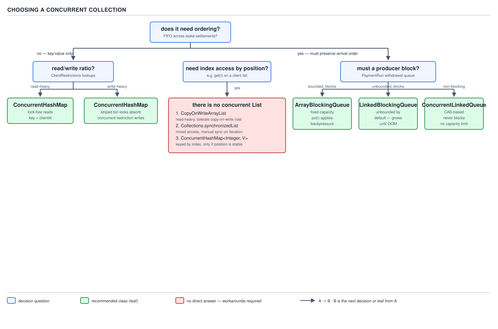

# 05 Multithreading and Concurrency — The concurrent collection decision — INTERMEDIATE (§2.6)

**Target version: Java 21 LTS.** | **Part 2 of 5** | [Index](../00-index.md)
Previous: [The atomicity decision in practice](../atomics/02-the-atomicity-decision.md) · Next: [Producer–consumer and backpressure design](../queues/02-backpressure-design.md)

This file is a decision file: the tables carry the content, the prose says how to read
them. Four families — map, queue, set, list — each with one right answer per shape of
problem, never one right answer overall.



**D-125** — Choosing a concurrent collection. Read the tree top to bottom: does the shape
of the problem need ordering, then how big it can get, then read/write ratio, then whether
a consumer should block, then whether the caller needs an index. Every leaf names one
class. The index-access leaf is worth memorising verbatim: **there is no concurrent
`List`**, and the workarounds are partitioning by key, an immutable list swapped atomically
behind an `AtomicReference`, or a queue drained into a snapshot when an index is genuinely
needed.

---

## 1. The four-way map decision

**Mental model.** `ClientRestrictions` holds every active restriction for 2.4M registered
clients, keyed by `ClientId`. Picture the map as a row of independent buckets, not one
guarded box: `ConcurrentHashMap` locks a bucket's slice, so a read on client A never waits
behind a write on client B. `Collections.synchronizedMap` and `Hashtable` are the opposite
— one lock, the whole map, every caller queued regardless of which key they touch.

**Why it exists.** `Hashtable` predates the collections framework and locks every method;
`Collections.synchronizedMap` wraps any map in one lock as a retrofit. Both were adequate
when a map was rarely read by more than one thread; neither survives a restriction lookup
running on every deposit, stake reservation, and withdrawal submission concurrently.

**When to reach for it, and when not.** `ConcurrentHashMap` is the default for any map more
than one thread touches. Reach for `Collections.synchronizedMap` only around a legacy `Map`
you cannot swap, throughput be damned; reach for `Hashtable` never. Reach for an immutable
map rebuilt on change when writes are rare and the map is small enough that a full rebuild
is cheap — not for a 2.4M-row restriction map under continuous writes.

**How it works.** `ConcurrentHashMap` (Java 8+) uses per-bin CAS for inserts into an empty
bin, and synchronizes on the bin's head node only when a bin already has entries — lock
scope is one bucket, not the table. `Collections.synchronizedMap` wraps every method in
`synchronized (mutex)` on the map itself; `Hashtable` declares every method `synchronized`
directly. An immutable map rebuilt on change is read with no lock at all — a writer
publishes a whole new map via a `volatile` field, so readers never block or see a half-built
map.

| | `ConcurrentHashMap` | `synchronizedMap` | `Hashtable` | Immutable + rebuild |
|---|---|---|---|---|
| Read cost | O(1), lock-free on a populated bin | O(1), but serialized on the map lock | O(1), but serialized on the instance lock | O(1), zero locking |
| Write cost | O(1), locks one bin | O(1), locks the whole map | O(1), locks the whole map | O(n) — full copy per write |
| Compound atomicity | `compute`/`merge`/`putIfAbsent` are atomic **per key** | Manual — caller must synchronize on the same mutex around the compound op | Manual, same caveat | Atomic by construction — old map or new map, never in between |
| Iteration | Weakly consistent, no `ConcurrentModificationException` | Fails fast; must externally synchronize during iteration | Fails fast; same caveat | Trivial — iterate the version you hold, which never changes under you |

**Insight:** the immutable-map row is not a toy option. `ClientRestrictions` publishing a
`SELF_EXCLUDED` override list to every service instance is exactly this shape — rebuilt
once a minute, read millions of times between rebuilds, zero locking on any read.

```java
public final class RestrictionCache {
    private final ConcurrentHashMap<ClientId, Set<RestrictionKey>> byClient =
            new ConcurrentHashMap<>();

    public boolean isBlocked(ClientId clientId, RestrictionType type) {
        Set<RestrictionKey> active = byClient.getOrDefault(clientId, Set.of());
        return active.stream().anyMatch(key -> key.type() == type);
    }

    public void apply(ClientId clientId, RestrictionKey key) {
        byClient.compute(clientId, (id, existing) -> {
            Set<RestrictionKey> next = existing == null
                    ? ConcurrentHashMap.newKeySet()
                    : existing;
            next.add(key);
            return next;
        });
    }
}
```

`compute` is atomic per key: two operators lifting different restrictions for the same
client at the same instant never lose an update, because the whole read-modify-write for
that key runs under that bin's lock.

**Pitfall:** replacing `Hashtable` with `ConcurrentHashMap` and assuming a
`putIfAbsent`-then-`put` pair is now safe. It is not — each call is atomic, the *pair* is
not. Use `computeIfAbsent`, not two calls.

> `ConcurrentHashMap` buys per-key atomicity and lock-free reads at the cost of no
> whole-map atomicity; the other three trade that away for simplicity, legacy
> compatibility, or zero-lock reads respectively.

### `ConcurrentHashMap` vs `ConcurrentSkipListMap`

Both are thread-safe maps; the choice is hashing versus ordering. `ConcurrentHashMap` gives
O(1) `get`/`put`; `size()` sums a striped per-segment counter array, cheap but still O(n) in
the number of stripes. `ConcurrentSkipListMap` gives O(log n) `get`/`put` via its layered
skip-list structure, and its `size()` is likewise O(n) — there is no maintained count either
side. The difference that matters is `NavigableMap`: `firstKey`, `ceilingKey`, `headMap`, a
sorted iteration order maintained live. A payment-run cutoff query — "every withdrawal
transaction below this submission timestamp" — is a `headMap` call on a skip list and a
full linear scan on a hash map. If nothing ever asks for range or order, the hash map's
O(1) wins outright; the moment something asks `NavigableMap` questions, O(log n) beats any
scan.

---

## 2. The queue selection table

**Mental model.** A queue is a pipe with a policy: how big it can get, whether a full pipe
blocks the producer, whether a slow consumer forces the producer to feel it. The withdrawal
work list is a good example because getting the policy wrong is invisible until a payment
run backs up.

**Why it exists.** A plain list behind a lock forces every producer and consumer through one
hand-written mutex and condition variable. The `java.util.concurrent` queue family packages
the handful of policies that actually occur in practice — bounded array, unbounded linked,
zero-capacity handoff, priority order, delayed release — as separate classes instead of one
queue with a dozen flags.

**When to reach for it, and when not.** Reach for a `BlockingQueue` whenever a producer must
feel backpressure from a slow consumer — the withdrawal work list must stall `PaymentService`
rather than pile up transactions unbounded. Reach for a non-blocking queue only when the
consumer is a busy poller that never wants to sleep, and check §2.6.5 first — the wrong
choice there burns a core for nothing.

**How it works.**

| Queue | Bound | Blocking? | Fits | Why |
|---|---|---|---|---|
| `ArrayBlockingQueue` | Fixed, given at construction | Producer and consumer both block | A withdrawal work list with a hard cap on in-flight transactions | Backed by one pre-allocated array — no per-element allocation, no growth, capacity is a real ceiling |
| `LinkedBlockingQueue` | Optional, unbounded by default | Producer and consumer both block (when bounded) | High-throughput work queues where the bound is set explicitly, not left at `Integer.MAX_VALUE` | Two separate locks for head and tail let a concurrent put and take proceed without contending each other |
| `SynchronousQueue` | Zero — no storage at all | Both sides block until a handoff pairs them | Direct handoff from a request thread to a worker thread, e.g. `Executors.newCachedThreadPool`'s internal queue | Every `put` waits for a matching `take`; there is nothing to buffer, so nothing to leak |
| `LinkedTransferQueue` | Unbounded | `transfer()` blocks for a consumer; `put()` does not | Handoff **or** buffering in the same queue, chosen per call | `transfer()` gives `SynchronousQueue` semantics on demand while still allowing buffering via `put()` |
| `PriorityBlockingQueue` | Unbounded | Consumer blocks when empty; producer never blocks | A review queue where `AA-700` cases must be served in urgency order, not arrival order | Backed by a binary heap; ordering is the entire point, so backpressure is not — it grows without bound if producers outrun consumers |
| `DelayQueue` | Unbounded | Consumer blocks until an element's delay expires | Bonus expiry timers, coupon 14-day windows | Elements implement `Delayed`; the head is only ever the earliest-expiring element |

Pick the bound first — fixed for a hard cap, explicit for throughput with a cap, zero for
pure handoff, unbounded only when order or timing (not volume) is the actual constraint —
then pick blocking behaviour to match how the producer should feel a slow consumer.

```java
public final class WithdrawalWorkQueue {
    // Fixed bound: PaymentService feels back-pressure at 500 queued withdrawals.
    private final BlockingQueue<WithdrawalTransaction> pending =
            new ArrayBlockingQueue<>(500);

    public void submit(WithdrawalTransaction tx) throws InterruptedException {
        pending.put(tx); // blocks the caller once full
    }

    public WithdrawalTransaction takeNext() throws InterruptedException {
        return pending.take(); // blocks the worker when idle
    }
}

public final class NotificationListenerRegistry {
    // Reads (fire a notification) vastly outnumber writes (register/deregister).
    private final CopyOnWriteArrayList<DeliveryListener> listeners =
            new CopyOnWriteArrayList<>();

    public void register(DeliveryListener listener) {
        listeners.add(listener); // rare: copies the backing array
    }

    public void notifyAll(DeliveryEvent event) {
        for (DeliveryListener listener : listeners) { // fixed snapshot
            listener.onDelivery(event);
        }
    }
}
```

Three right answers from one syllabus leaf: the withdrawal work list is
`ArrayBlockingQueue` for the hard cap and blocking backpressure; the `NotificationService`
listener registry is `CopyOnWriteArrayList` because registration is rare and a torn
iterator mid-broadcast is unacceptable; an audit buffer many threads append to and one
thread periodically drains is `ConcurrentLinkedQueue` — a plain `synchronizedList` would
serialize every append behind one lock, exactly the contention its CAS-based `offer` avoids.

**Pitfall:** polling `ConcurrentLinkedQueue.poll()` in a `while (queue.poll() == null) {}`
loop because "it's non-blocking, so it's fine." An idle consumer on a non-blocking queue
spins a core at 100% doing nothing — that structure is right only when the consumer is
already busy and checks the queue between other work.

**Pitfall:** choosing `ConcurrentLinkedQueue` for the withdrawal work list because "it's
concurrent, so it's safe." It has no bound and no backpressure at all — a stalled payment
run does not slow `PaymentService` down, it grows the queue until the heap does. An
unbounded queue is a memory leak with a delay on it, not a safety net.

> A `BlockingQueue` couples a bound with a wait policy; picking one without the other —
> an unbounded non-blocking queue for backpressure, or a blocking queue with no real cap —
> reproduces the exact failure the queue was chosen to prevent.

**Supporting fact — there is no concurrent `List` (2.6.8).** No `java.util.concurrent`
class gives thread-safe index-based mutation with `List` semantics — `ConcurrentLinkedQueue`
has no `get(int)`; `CopyOnWriteArrayList` does, but copies the whole array on every write, a
very different cost model. The three workarounds D-125 ends on: partition the data so each
partition is owned by one thread and needs no synchronization; hold an immutable list behind
an `AtomicReference` and swap it on change (§1's pattern, applied to lists); or write to a
queue and call `toArray()` for a one-off indexed snapshot when a caller needs `get(i)`.

---

## 3. The three concurrent `Set` options

**Mental model.** A concurrent `Set` is a concurrent `Map` wearing a mask — every option
below is literally backed by the map or list family already covered, with the values
thrown away.

**Why it exists.** `Collections.synchronizedSet(new HashSet<>())` is the naive answer and
carries the exact whole-set-lock problem §1 ruled out for maps. These three options give a
set the same per-key or per-append concurrency the underlying map or list already has.

**When to reach for it, and when not.** Default to `ConcurrentHashMap.newKeySet()` unless
sorted iteration is required (`ConcurrentSkipListSet`) or the set is small, rarely written,
and iteration-heavy (`CopyOnWriteArraySet`). Never reach for `CopyOnWriteArraySet` on a set
of more than a few dozen members that changes more than occasionally — `contains` is linear.

**How it works.** `ConcurrentHashMap.newKeySet()` returns a `Set` view backed by a
`ConcurrentHashMap<E, Boolean>` with every value fixed to a shared sentinel — `contains`
and `add` are exactly the map's `containsKey`/`put`. `ConcurrentSkipListSet` wraps a
`ConcurrentSkipListMap` the same way, O(log n) for sorted order. `CopyOnWriteArraySet` wraps
a `CopyOnWriteArrayList` and linear-scans the backing array before every `add` to preserve
set semantics — that scan is exactly what makes its `contains` O(n).

| | `ConcurrentHashMap.newKeySet()` | `ConcurrentSkipListSet` | `CopyOnWriteArraySet` |
|---|---|---|---|
| `contains` cost | O(1) | O(log n) | **O(n)** — linear scan of the backing array |
| `add` cost | O(1) | O(log n) | O(n) scan for the duplicate check, plus a full array copy |
| Ordering | None | Sorted, live | Insertion order preserved |
| Iterator model | Weakly consistent | Weakly consistent | Strong snapshot — never throws, never sees a concurrent write |
| Right for | A general-purpose concurrent set with no ordering requirement — the default choice | A set that must be iterated or range-queried in sorted order, e.g. active `ClientId`s under review sorted for a batch scan | A small, rarely-mutated, iteration-heavy set where a torn iterator is worse than an O(n) write — e.g. a set of currently-suspended payment rails checked on every deposit but changed only a few times a day |

**D-126** — The three concurrent `Set` options.

```java
// A set of client IDs currently flagged for enhanced due diligence — read on
// almost every deposit, written only when compliance raises or clears a flag.
private final Set<ClientId> underReview = ConcurrentHashMap.newKeySet();

public boolean requiresEnhancedCheck(ClientId clientId) {
    return underReview.contains(clientId); // O(1)
}
```

**Pitfall:** picking `CopyOnWriteArraySet` for `underReview` because "it rarely changes, and
CopyOnWrite is for that." It is read on every deposit at 40/sec peak — that is not the
CopyOnWrite shape, since `contains` there is O(n) per read, not O(1). `CopyOnWriteArraySet`
earns its place when the *read* side also tolerates a linear scan on a genuinely small set
— a handful of suspended payment rails, not a set that scales with client count.

> All three concurrent `Set`s reuse an existing concurrent map or list; the choice between
> them is really a choice between `ConcurrentHashMap`, `ConcurrentSkipListMap`, and
> `CopyOnWriteArrayList` made one level down, and it costs an order of complexity on
> `contains` to move from the first to the third.

---

## 4. Bulk operations are not atomic

**Mental model.** `forEach`, `search`, `reduce`, `putAll`, `addAll`, `removeIf`, `clear`,
and `toArray` all look like one operation from the call site. Underneath, each is a loop
over the collection's iterator or spliterator, interleaving with every other thread's
single-element operations exactly as if you had written the loop yourself.

**Why the non-atomicity exists.** Forcing bulk operations to be atomic on
`ConcurrentHashMap` would mean locking the whole map for the loop's duration, throwing away
the per-bin concurrency §1 relies on. The JDK chose weak consistency so single-key
operations never wait for someone else's `forEach` to finish.

**When it matters, and when it does not.** Not for a `forEach` that logs or reports — a
few-millisecond-stale report is fine. It matters enormously for `clear()` used as "reset
before repopulating" and `removeIf` used as "remove exactly these, no others" — both
**[TRAP]** patterns race every concurrent writer.

**How it works, proved.** Take `underReview` from §3 and a periodic sweep that clears it
before repopulating from a fresh compliance batch:

```java
underReview.clear();
underReview.addAll(freshFlaggedClients); // NOT [PROVE]
```

Walk the interleaving. Thread S (the sweep) calls `clear()`, emptying the set. Before S
calls `addAll`, thread D (a deposit check on a `ClientId` compliance flagged yesterday and
still applies) calls `underReview.contains(clientId)`. The set is momentarily empty, so
`contains` returns `false` — a client who should be blocked from depositing is allowed
through, for the window between the two calls. No exception fires; nothing looks wrong at
either call site.

The fix is not a different bulk method — no bulk method makes `clear()` + `addAll()`
atomic — it is to publish a whole new set and swap the reference, reusing the immutable-swap
pattern from §1 and §2:

```java
private volatile Set<ClientId> underReview = ConcurrentHashMap.newKeySet();

public void refresh(Collection<ClientId> freshFlaggedClients) {
    Set<ClientId> next = ConcurrentHashMap.newKeySet();
    next.addAll(freshFlaggedClients);
    underReview = next; // single volatile write — readers see the old set or the new one, never neither
}
```

**Pitfall:** believing `ConcurrentHashMap.forEach`, `search`, and `reduce` are atomic
snapshots because the map itself is thread-safe. They are weakly consistent: a `forEach`
running concurrently with a `put` may or may not see that new entry, and may see an entry
that was later removed, depending on exactly which bin the writer touched relative to where
the traversal currently is. The map is always internally consistent — no bin is ever
corrupted — but the *view* a bulk operation sees is a moving target, not a still photograph.

> Bulk operations on a concurrent collection are safe from corruption and unsafe from
> staleness: no operation ever sees a torn bin, but none sees a frozen collection either —
> an invariant spanning two bulk calls needs a swapped reference, not a bigger bulk method.

---

## 5. Views, copies, and snapshots

**Mental model.** Three words that sound interchangeable and are not: a **view** shares the
live backing store and moves when it moves; a **copy** is independent, frozen the instant
it is made; a **snapshot** sits between the two — independent of *future* changes, but how
"instant" its instant was depends entirely on which method made it.

**Why it exists as a distinction worth naming.** `keySet()`, `toArray()`, `List.copyOf()`,
and a `CopyOnWriteArrayList` iterator all *look* like "the data, as a collection" while
giving four different concurrency guarantees — treating them as interchangeable is how a
"safe publication" bug gets written by someone who tested it single-threaded.

**When to reach for which.** Reach for `Collections.unmodifiableXxx` only to signal intent —
"don't mutate this" — never for thread safety: it is a view over the original, which can
still change under it, and it offers no protection against a concurrent structural change
during iteration. Reach for `List.copyOf()` / `Map.copyOf()` for genuine thread-safe
publication — hand it to another thread and stop worrying. Reach for `keySet()` when the
caller wants a live, mutation-reflecting view. Reach for `toArray()` or a
`CopyOnWriteArrayList` iterator when the caller wants "the data as it was," knowing the two
differ in how consistent "as it was" actually is.

**How it works.**

| Source | What it gives | Live or frozen | Concurrency guarantee |
|---|---|---|---|
| `Collections.unmodifiableMap(map)` | A view | Live — mutations to `map` are visible through it | **None.** Throws `UnsupportedOperationException` on write, but a concurrent structural change from elsewhere can still throw `ConcurrentModificationException` during iteration on a non-concurrent backing map |
| `Map.copyOf(map)` | A genuine copy | Frozen at call time | Full — safely publishable to another thread with no further synchronization needed |
| `concurrentMap.keySet()` | A live view | Live | Reflects the map's own concurrency guarantees — weakly consistent iteration, no `ConcurrentModificationException` |
| `concurrentMap.entrySet().toArray()` (or any `toArray()`) | A weakly consistent snapshot | Frozen array, but assembled while the source could still be changing | The array itself never changes after the call returns, but which elements it contains reflects an arbitrary interleaving during construction, not necessarily a single consistent instant |
| `CopyOnWriteArrayList` iterator | A strong snapshot | Frozen at `iterator()` call | The iterator is backed by the array reference held *at creation*; a concurrent `add` replaces the list's array field but never touches the array the iterator is walking |

**Insight:** `toArray()`'s "weakly consistent snapshot" and a `CopyOnWriteArrayList`
iterator's "strong snapshot" are both frozen after the fact, and it is tempting to call them
equivalent. They are not: `toArray()` on `ConcurrentHashMap` walks bins while they may still
be changing, so the array can mix pre- and post-update state across keys. `CopyOnWriteArrayList`
guarantees the whole array is one photograph, because the array reference is immutable once
published.

```java
Map<ClientId, Wallet> live = walletCache; // a ConcurrentHashMap

// View: throws on write, but a concurrent put() elsewhere is visible here.
Map<ClientId, Wallet> readOnly = Collections.unmodifiableMap(live);

// Copy: independent of walletCache from this point on. Safe to hand to another
// thread, log, or serialize without any further synchronization.
Map<ClientId, Wallet> frozen = Map.copyOf(live);
```

**Pitfall:** wrapping a `ConcurrentHashMap` in `Collections.unmodifiableMap` and reporting
it as "now thread-safe for readers." It was already thread-safe; `unmodifiableMap` added
exactly one guarantee — callers cannot call `put` — nothing about consistency, staleness,
or iteration beyond what the backing map already provided.

**Pitfall:** publishing a plain (non-concurrent) `HashMap` via `Collections.unmodifiableMap`
across threads and calling it safe. The view shares the same backing `HashMap`; if any
thread anywhere still holds a mutable reference to that same map and structurally modifies
it during another thread's iteration of the view, that iteration throws
`ConcurrentModificationException` same as it would on the raw map. Only `Map.copyOf()`
severs the connection.

> A view shares state and inherits the backing structure's guarantees, a copy severs the
> connection at the cost of a full duplicate, and a snapshot's consistency is only ever as
> strong as the method that produced it.

---

## Supporting facts

**Bounded caches — `LinkedHashMap` + `removeEldestEntry` (2.6.9).** `LinkedHashMap` in
access-order mode with `removeEldestEntry` overridden is the textbook single-threaded LRU
cache — not thread-safe at all, since access order mutates the internal linked list on
every `get`, and even `Collections.synchronizedMap` around it does not cover the compound
`get`-then-evict semantics. For a bounded, thread-safe cache, reach for `Caffeine` or a
`ConcurrentHashMap` paired with an external eviction policy; see guide 02 (pool sizing) and
guide 15 (cache coherence) for the mechanisms this file only names. `[X-REF 02]` `[X-REF 15]`

**Streaming a concurrent collection (2.6.13).** `ConcurrentHashMap.spliterator()` is
weakly consistent, same as its bulk operations — a parallel stream over a live map gives a
well-defined traversal (no corruption, no exception) that is not a snapshot of any instant.
The streaming restatement of §4: the stream sees a moving target, correctly. `[X-REF 04]`

**`Collector` concurrency — `toConcurrentMap` / `groupingByConcurrent` (2.6.14).**
Verified against the Java 21 javadoc: both are documented `CONCURRENT` and `UNORDERED`
collectors. `UNORDERED` describes the *collector's* own characteristic, not a requirement
that the input stream be unordered — it tells the stream framework encounter order need not
survive this step, letting a parallel stream's threads write straight into one shared
container instead of merging partial maps pairwise. `toMap`/`groupingBy`'s own javadoc
states the trade from the other side: their combiner "merges the keys from one map into
another, which can be an expensive operation." Use the `Concurrent` variant on a **parallel**
stream over a large source to skip that merge; on a sequential stream there is no merge to
skip, so it buys nothing. `[X-REF 04]`

---

## Pitfalls

### Assuming a `ConcurrentHashMap`'s `putIfAbsent` then `put` pair is atomic

**Wrong**
```java
if (byClient.putIfAbsent(clientId, ConcurrentHashMap.newKeySet()) == null) {
    byClient.get(clientId).add(key); // a second thread can race here
}
```
Two threads applying the first restriction for the same never-before-seen client can both
pass the `== null` check before either mutates the winning set — the loser's `add` is
silently applied to a set nobody else will ever read.

**Right**
```java
byClient.compute(clientId, (id, existing) -> {
    Set<RestrictionKey> set = existing == null ? ConcurrentHashMap.newKeySet() : existing;
    set.add(key);
    return set;
});
```
`compute` runs the whole read-modify-write under the bin's lock, so there is no window for
a second thread to observe a half-finished state.

**Why people believe it:** each call — `putIfAbsent`, `get`, `add` — is genuinely
thread-safe in isolation, and it is easy to read "the class is thread-safe" as "every
sequence of calls on it is."

### Believing `Collections.unmodifiableMap` makes a plain map safe to share

**Wrong**
```java
Map<ClientId, Wallet> shared = Collections.unmodifiableMap(new HashMap<>(source));
// handed to another thread, which iterates it while `source` is still mutated elsewhere
```
`unmodifiableMap` wraps `source`'s own structure, not a copy — a structural change during
another thread's iteration throws `ConcurrentModificationException`, or is silently
invisible depending on timing.

**Right**
```java
Map<ClientId, Wallet> shared = Map.copyOf(source);
```
A genuine, independent copy — safe to hand to another thread with no further sync.

**Why people believe it:** "unmodifiable" reads as "immutable," and immutable data is
famously safe to share — the word describes the wrapper's API surface, not the data
behind it.

---

## Cheat sheet

| Need | Reach for |
|---|---|
| General-purpose concurrent map, no ordering | `ConcurrentHashMap` |
| Concurrent map with sorted / range operations | `ConcurrentSkipListMap` |
| Legacy map you cannot replace, low throughput | `Collections.synchronizedMap` |
| Rare writes, huge read volume, small-ish map | Immutable map, swap the reference |
| Bounded queue, hard cap, blocking backpressure | `ArrayBlockingQueue` |
| High-throughput queue, bound set explicitly | `LinkedBlockingQueue` |
| Pure handoff, no buffering | `SynchronousQueue` |
| Handoff or buffering, chosen per call | `LinkedTransferQueue` |
| Priority order, backpressure not required | `PriorityBlockingQueue` |
| Timer / expiry-driven release | `DelayQueue` |
| Busy poller, never wants to block | `ConcurrentLinkedQueue` (never for an idle consumer) |
| Concurrent set, no ordering | `ConcurrentHashMap.newKeySet()` |
| Concurrent set, sorted iteration | `ConcurrentSkipListSet` |
| Concurrent set, rare writes, iteration-heavy, tolerant of O(n) writes | `CopyOnWriteArraySet` |
| Index-based concurrent access | Does not exist — partition, swap an immutable list, or snapshot a queue |
| Clear-then-repopulate must be atomic | Swap a whole new collection via a `volatile`/`AtomicReference`, never `clear()` + bulk-add |
| Hand data to another thread, done with it | `List.copyOf()` / `Map.copyOf()` |
| Signal "don't mutate this," same thread only | `Collections.unmodifiableXxx` — not a concurrency tool |
| Parallel stream collecting into a map, order doesn't matter | `toConcurrentMap` / `groupingByConcurrent` |

## Self-test

**Q1.** Why does `ConcurrentHashMap` give O(1) `get`/`put` while `ConcurrentSkipListMap`
gives O(log n), and what does the skip list buy back for that cost?

<details><summary>Answer</summary>

`ConcurrentHashMap` hashes into buckets, O(1). `ConcurrentSkipListMap` traverses a layered
skip-list, O(log n) — the price of keeping order. It buys back `NavigableMap`: `firstKey`,
`ceilingKey`, `headMap`/`tailMap`, live sorted iteration, none of which a hash map offers
without a full scan.

</details>

**Q2.** A `NotificationService` listener registry is read on every notification delivery
and written to only when a listener registers or deregisters. Which concurrent collection
fits, and why is `synchronizedList` the wrong choice?

<details><summary>Answer</summary>

`CopyOnWriteArrayList`. Registration is rare, so a full array copy per `add`/`remove` is
cheap; delivery must never throw mid-broadcast, which its strong-snapshot iterator
guarantees. `synchronizedList` serializes every read behind one lock and still needs manual
sync during iteration to avoid `ConcurrentModificationException` — it defeats the point.

</details>

**Q3.** Why is `underReview.clear(); underReview.addAll(fresh);` unsafe even though both
calls individually are thread-safe?

<details><summary>Answer</summary>

Between `clear()` returning and `addAll()` beginning, the set is genuinely empty and
visible to every other thread — a concurrent `contains()` in that window returns `false`
even for keys flagged both yesterday and in the incoming batch. Each call is atomic alone;
the pair is not. The fix publishes a whole new populated set through one `volatile` write.

</details>

**Q4.** Order the three concurrent `Set` options by `contains` cost, from cheapest to most
expensive, and name the situation where the most expensive one is still the right choice.

<details><summary>Answer</summary>

`ConcurrentHashMap.newKeySet()` (O(1)), then `ConcurrentSkipListSet` (O(log n)), then
`CopyOnWriteArraySet` (O(n)). `CopyOnWriteArraySet` is still right for a small,
rarely-mutated, iteration-heavy set — e.g. a handful of currently-suspended payment rails
checked constantly but changed only a few times a day — where its strong-snapshot iterator
matters more than its linear `contains`.

</details>

**Q5.** What is the actual difference between a view, a copy, and a snapshot, using
`keySet()`, `Map.copyOf()`, and `toArray()` as the three examples?

<details><summary>Answer</summary>

`keySet()` is a live view backed by the same map — mutations and concurrent changes both
show through it. `Map.copyOf()` is a genuine independent copy, frozen at creation, safe to
hand to another thread with no further synchronization. `toArray()` sits in between: frozen
once returned, but built by traversing a possibly-changing source, so its contents reflect
an arbitrary interleaving rather than one clean instant.

</details>

**Q6.** Why does `ConcurrentHashMap.forEach` never throw `ConcurrentModificationException`,
and what guarantee does that absence *not* give you?

<details><summary>Answer</summary>

Its iteration is weakly consistent by design — it tolerates concurrent structural changes
instead of failing on them, unlike `HashMap`'s fail-fast iterator. That absence does not
mean `forEach` sees a consistent snapshot: it may or may not observe an in-flight `put`, or
see an entry a concurrent `remove` later deletes, depending on timing.

</details>

**Q7.** `Collections.unmodifiableMap(myConcurrentHashMap)` — what does wrapping it actually
add, given the map underneath is already thread-safe?

<details><summary>Answer</summary>

Exactly one thing: callers holding the wrapper cannot call `put` —
`UnsupportedOperationException` on any write attempt. No new consistency, staleness, or
iteration guarantee, because those already came from `ConcurrentHashMap` itself. It is an
intent signal, not a concurrency mechanism.

</details>

**Q8.** When does `toConcurrentMap` actually outperform `toMap` on a stream collecting
settlement records by `ClientId`, and when does it buy nothing?

<details><summary>Answer</summary>

It outperforms `toMap` on a **parallel** stream over a large source: `toMap`'s combiner must
merge each thread's partial map pairwise, while `toConcurrentMap`'s `CONCURRENT`/`UNORDERED`
collector lets every thread write straight into one shared map with no merge step. On a
**sequential** stream there is only one thread and no merge step to skip, so it buys nothing
and only adds a concurrent map's overhead.

</details>

---

**Leaves covered:** 2.6.1–2.6.14 (14 leaves)
**Leaves deferred:** none
**Diagrams included:** D-125, D-126
**Target version:** Java 21 LTS
**Lines:** 599
