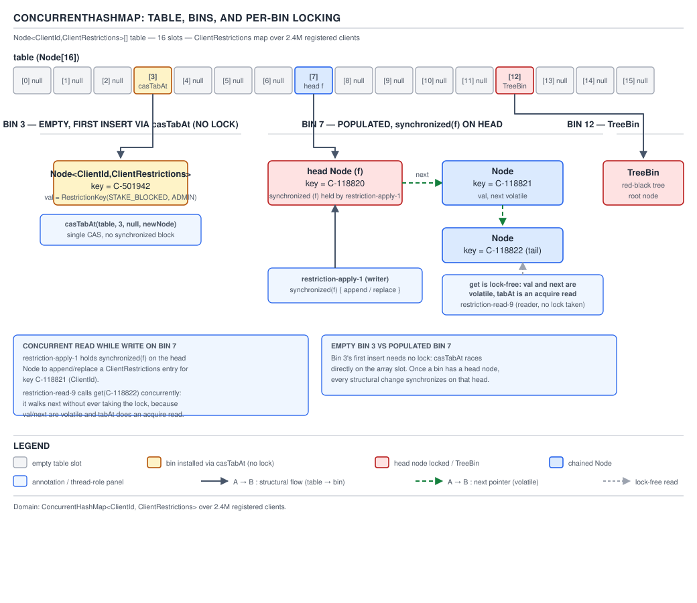
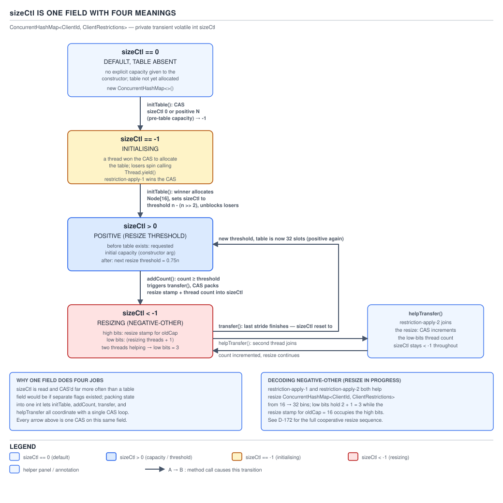
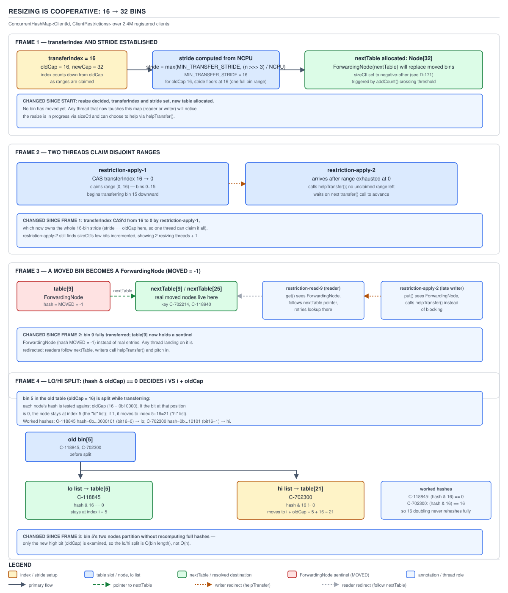

# 05 Multithreading and Concurrency — The concurrent collections — INTERNALS (§3.8, leaves 3.8.1–3.8.12)

**Target version: Java 21 LTS.** | **Part 3 of 5** | [Index](../00-index.md)
Previous: [The Java Memory Model, formally](../volatile-and-jmm/06-internals-jmm-formally.md) · Next: [ConcurrentHashMap internals — trees, counting and traversal](03b-internals-chm-trees-counting-traversal.md)

### From Java 7's segments to Java 8's single table

Picture `ClientRestrictions`' in-memory index of 2.4M `(clientId, restrictionSet)` pairs, hammered by 1,200 stake-reservation lookups a second and a steady trickle of writes as operators lift and apply blocks. Java 7's `ConcurrentHashMap` handled this by carving the table into 16 `Segment`s, each `extends ReentrantLock`, each holding its own private array of bins. A write locked exactly one segment; sixteen writers could proceed in parallel and a seventeenth blocked regardless of which key it wanted. `DEFAULT_CONCURRENCY_LEVEL = 16` was baked into the segment count at construction — you could raise it, but the ceiling was fixed the moment the map was built, and every lookup paid a two-level indirection: hash to a segment, then hash again to a bin inside it. `[NUM]` For a map sized for a mid-size cache this was fine. For 2.4M clients with peak write bursts during a compliance sweep, 16 was a hard ceiling on write concurrency no matter how large the table grew underneath it. `[X-REF 02]`

Java 8 threw the segment layer away. There is one `Node<K,V>[] table`. An insert into an empty bin is a single CAS that installs the first node — no lock at all. Everything else — a non-empty bin, a resize collision, a tree rebalance — takes a `synchronized` block on that bin's head node, and only that bin. Concurrency now scales with table size: a 2.4M-entry map with 4M buckets has, in the steady state, four million independent lock granules instead of sixteen. `[SOURCE]`

**Why it exists.** A single global lock (`Hashtable`) serializes every access. Segment locking (Java 7) fixes that but hard-codes the parallelism ceiling into the segment count. Per-bin CAS-then-lock removes the ceiling entirely: the granularity of contention is a function of `table.length`, which the map grows on its own.

**When to reach for it, and when not.** `ConcurrentHashMap` wins whenever the workload is get-heavy or the writes are scattered across keys — exactly the `ClientRestrictions` shape, where a lookup for one `clientId` never contends with a write for another. It loses when you need a consistent snapshot across multiple keys (§3.8.24 covers what it deliberately does not give you), when you need sorted iteration (`ConcurrentSkipListMap` earns its place there), or when the map is small and single-threaded, where the CAS/volatile machinery is pure overhead over a plain `HashMap`.

**How it works — the source walk.** The rest of this file walks `putVal`, the constants that gate its behaviour, `sizeCtl`, and cooperative resizing, all as they exist in the JDK 21 source for `java.util.concurrent.ConcurrentHashMap`.



**D-169** — `ConcurrentHashMap`: table, bins, and per-bin locking.

```java
// java.util.concurrent.ConcurrentHashMap, JDK 21 source, abbreviated to the relevant lines
final V putVal(K key, V value, boolean onlyIfAbsent) {
    int hash = spread(key.hashCode());
    int binCount = 0;
    for (Node<K,V>[] tab = table;;) {
        Node<K,V> f; int n, i, fh;
        if (tab == null || (n = tab.length) == 0)
            tab = initTable();
        else if ((f = tabAt(tab, i = (n - 1) & hash)) == null) {
            if (casTabAt(tab, i, null, new Node<K,V>(hash, key, value)))
                break;                              // no lock needed on an empty bin
        }
        else if ((fh = f.hash) == MOVED)
            tab = helpTransfer(tab, f);              // bin already forwarded — pitch in
        else {
            synchronized (f) {                       // lock this bin's head node only
                if (tabAt(tab, i) == f) {
                    if (fh >= 0) {                    // linked-list bin
                        binCount = 1;
                        for (Node<K,V> e = f;; ++binCount) {
                            // walk, replace on key match, else append and break
                        }
                    } else if (f instanceof TreeBin) {
                        binCount = 2;
                        // treeified bin — put via the red-black tree
                    }
                }
            }
            if (binCount != 0) {
                if (binCount >= TREEIFY_THRESHOLD)
                    treeifyBin(tab, i);
                break;
            }
        }
    }
    addCount(1L, binCount);
    return null;
}
```

Every quoted line: `spread(key.hashCode())` computes the mixed hash (below). The `tab == null` branch calls `initTable()` — lazy allocation on first write, walked next. An empty bin (`f == null`) is filled with a bare CAS via `casTabAt`, no lock. `fh == MOVED` means a resize is in flight and this bin has already been moved; the thread calls `helpTransfer` and pitches into the resize rather than spinning. Otherwise the thread takes the monitor on `f` — the bin's head node — and only that bin: no other thread touches this bin concurrently, but every other bin in the table is untouched by this lock. `binCount >= TREEIFY_THRESHOLD` triggers `treeifyBin` after the insert (covered in file 03b). `addCount` updates the size counters (also 03b).

**The gotcha.** The CAS-then-lock split means an empty-bin insert and a populated-bin insert take genuinely different code paths with different guarantees — an empty-bin write is lock-free and can race arbitrarily with a resize's `ForwardingNode` install, which is exactly why the `fh == MOVED` check exists as the second branch, not an afterthought.

> **Definition.** `ConcurrentHashMap` achieves per-bin concurrency by CAS-installing the first node of an empty bin and taking a `synchronized` lock on the bin's head node for every other mutation, so contention is scoped to `table.length` independent granules rather than a fixed segment count.

### The named constants

`[NUM]` `[SOURCE]` `[X-REF 02]` — verified against `raw.githubusercontent.com/openjdk/jdk/jdk-21+35/.../ConcurrentHashMap.java` in this session, not from a secondary article.

**D-170** — The `ConcurrentHashMap` constants.

| Constant | Value | What it controls | Either side of it |
|---|---|---|---|
| `MAXIMUM_CAPACITY` | `1 << 30` (≈1.07B) | The ceiling `tableSizeFor` will ever round up to | Below it, capacity keeps doubling on load; at it, growth stops and the load factor is exceeded rather than the table growing past `Integer.MAX_VALUE`-adjacent sizes |
| `DEFAULT_CAPACITY` | `16` | Table size used when the no-arg constructor's lazy `initTable()` fires | Below: table is `null`, `sizeCtl` holds the requested initial size or `0`. At/after: table exists with 16 bins |
| `LOAD_FACTOR` | `0.75f`, hard-coded | The fraction of capacity that triggers a resize | The constructor's `loadFactor` argument only ever affects the *initial* size computation (`tableSizeFor`); this constant is what every subsequent resize threshold is computed from |
| `TREEIFY_THRESHOLD` | `8` | Bin length that triggers treeification | Below 8: plain linked list, O(n) worst case per bin. At/above 8 (and `MIN_TREEIFY_CAPACITY` met): `TreeBin` red-black tree, O(log n) |
| `UNTREEIFY_THRESHOLD` | `6` | Bin length that reverts a `TreeBin` to a list, checked during resize | Above 6: stays a tree. At/below 6 during a transfer: converted back to a plain list |
| `MIN_TREEIFY_CAPACITY` | `64` | Table size below which a long bin resizes the table instead of treeifying | Below 64: even an 8+ node bin triggers `tryPresize`, not `treeifyBin`. At/above: treeify proceeds |
| `MIN_TRANSFER_STRIDE` | `16` | Smallest chunk of the table a single helper thread claims during resize | Below the stride: a helper would claim work too small to amortise the CAS on `transferIndex`; the constant is the floor `(NCPU-scaled)` stride computation clamps to |
| `RESIZE_STAMP_BITS` | `16` | Width of the resize-generation stamp packed into `sizeCtl`'s high bits | Everything above bit `32 - 16 = 16` in a negative `sizeCtl` is the stamp; everything from bit 0 up to `RESIZE_STAMP_SHIFT` is the resizer count |
| `MOVED` | `-1` | `Node.hash` value marking a `ForwardingNode` | A reader hitting `MOVED` follows `nextTable`; a writer hitting it calls `helpTransfer` |
| `TREEBIN` | `-2` | `Node.hash` value marking a bin's head as a `TreeBin` | Distinguishes a treeified bin from a plain list bin at the type-dispatch point in `putVal`/`getNode` |
| `RESERVED` | `-3` | `Node.hash` value for the placeholder installed by `computeIfAbsent` while the mapping function runs | Any other thread reading that bin during the computation sees the reservation and must wait or retry, never a partially-built value |
| `HASH_BITS` | `0x7fffffff` | Mask applied in `spread` | Forces the sign bit off every user-derived hash so no ordinary key hash can ever collide with `MOVED`/`TREEBIN`/`RESERVED`, all of which are negative |

```java
// java.util.concurrent.ConcurrentHashMap, JDK 21 source
static final int spread(int h) {
    return (h ^ (h >>> 16)) & HASH_BITS;
}
```

`[PROVE]` The XOR-fold (`h ^ (h >>> 16)`) is the same trick `HashMap` uses: it spreads a hash's high 16 bits down into the low bits before masking to the table size, so hashes that differ only in their high bits (a common pattern for `String` and boxed-integer hash codes) still land in different bins once masked with `(n - 1)`. The `& HASH_BITS` that follows is `ConcurrentHashMap`-specific and absent from plain `HashMap`: it clears bit 31, forcing the result non-negative. Without it, a user `hashCode()` that happened to spread to `0xFFFFFFFF` (`-1`) would be indistinguishable from `MOVED`, and `putVal`'s dispatch on `f.hash == MOVED` would treat a live node as a forwarding marker — silent data corruption during a resize, not an exception. The mask is what lets `MOVED`, `TREEBIN`, and `RESERVED` live in "hash space" at all: they are sentinel values that no `spread()` output can ever produce.

**Insight:** `Node.hash` is doing double duty as both "this key's mixed hash" and "this bin's control state" — the entire CAS-then-lock, forward-during-resize, tree-vs-list dispatch machinery reads off one `int` field, and the sign bit is the discriminant.

### `sizeCtl` — one field, four meanings

`[PROVE]` `[SOURCE]` `[RESEARCH]`



**D-171** — `sizeCtl` is one field with four meanings.

The JDK 21 source comment on the field:

```java
/**
 * Table initialization and resizing control. When negative, the
 * table is being initialized or resized: -1 for initialization,
 * else -(1 + the number of active resizing threads). Otherwise,
 * when table is null, holds the initial table size to use upon
 * creation, or 0 for default. After initialization, holds the
 * next element count value upon which to resize the table.
 */
private transient volatile int sizeCtl;
```

Four states, one `int`:

1. **`0`** — no table yet, and no explicit initial capacity was requested; the next write allocates a `DEFAULT_CAPACITY`-sized table.
2. **Positive, table `null`** — an explicit initial capacity was requested via the constructor; this is that capacity, rounded up by `tableSizeFor`, waiting for the first write to materialise it.
3. **Positive, table non-`null`** — the resize threshold: `capacity * LOAD_FACTOR`. When `baseCount` (file 03b) crosses this, a resize starts.
4. **Negative** — a resize (or the one-time initialization) is in flight. `-1` specifically means "a thread just won the race to call `initTable()`". Any other negative value is a **packed resize-in-progress record**: the high `32 - RESIZE_STAMP_BITS` bits hold `resizeStamp(n)` for the capacity being resized *from*, and the low bits count `1 + activeResizers`, so `sizeCtl == -(1 + k)` when `k` threads are cooperating and no separate stamp bit has been set — the field literally answers "is one resize in progress, and if so how many threads are helping" without a second field.

`[SOURCE]` `resizeStamp`, the function that produces the high-bits value packed into a multi-threaded resize's `sizeCtl`:

```java
// java.util.concurrent.ConcurrentHashMap, JDK 21 source
static final int resizeStamp(int n) {
    return Integer.numberOfLeadingZeros(n) | (1 << (RESIZE_STAMP_BITS - 1));
}
```

`Integer.numberOfLeadingZeros(n)` gives a value that is unique per power-of-two table size in the range this map ever reaches; OR-ing in `1 << (RESIZE_STAMP_BITS - 1)` sets a high bit that guarantees the packed `sizeCtl` value is always negative once shifted into position, so a plain integer comparison (`sizeCtl < 0`) is enough to detect "a resize is active" without unpacking anything.

`initTable()`:

```java
// java.util.concurrent.ConcurrentHashMap, JDK 21 source, condensed
private final Node<K,V>[] initTable() {
    Node<K,V>[] tab; int sc;
    while ((tab = table) == null || tab.length == 0) {
        if ((sc = sizeCtl) < 0)
            Thread.yield();                       // lost the race — back off
        else if (U.compareAndSetInt(this, SIZECTL, sc, -1)) {
            try {
                if ((tab = table) == null || tab.length == 0) {
                    int n = (sc > 0) ? sc : DEFAULT_CAPACITY;
                    Node<K,V>[] nt = (Node<K,V>[])new Node<?,?>[n];
                    table = tab = nt;
                    sc = n - (n >>> 2);            // 0.75 * n, without a float multiply
                }
            } finally {
                sizeCtl = sc;
            }
            break;
        }
    }
    return tab;
}
```

Every quoted line: the loop spins while `table` is unset. A negative `sizeCtl` means someone else already won — `Thread.yield()` and retry rather than block, because the winner's critical section is short (one array allocation). The CAS from the observed `sc` to `-1` is the initialization lock; only one thread can win it. Inside the `try`, `n - (n >>> 2)` computes `0.75n` with a shift instead of a float multiply — an integer-arithmetic trick worth recognising anywhere `LOAD_FACTOR` participates in a hot path. The `finally` always restores `sizeCtl`, whether the table was built by this thread or (in a narrow re-check race) had already appeared.

**Pitfall:** assuming `sizeCtl < 0` always means "resizing" and treating `-1` the same as any other negative value. `-1` is specifically the one-time table-creation lock; the four-meaning encoding above is what `[RESEARCH]`-tagged discussions of `sizeCtl` most often flatten into "negative means busy", losing the distinction between first-time initialization and an in-progress cooperative resize that the rest of this file depends on.

> **Definition.** `sizeCtl` is a single `volatile int` that encodes, depending on sign and value, either "no table yet" (zero or positive-before-creation), "the next resize threshold" (positive-after-creation), "one thread is creating the table" (`-1`), or "a resize is in progress with this many helpers" (negative, high bits stamped) — one field carrying what four fields would otherwise need, at the cost of one CAS per state transition instead of a lock.

**Why one field can safely carry four meanings.** The four states are not merely enumerable — they are *mutually exclusive by construction*, which is the actual precondition for packing them into one field rather than an accident that happens to work. Meanings 1 and 2 (zero/positive, table `null`) and meaning 3 (positive, table non-`null`) are distinguished by an orthogonal piece of state the field doesn't need to encode at all: whether `table == null`, checked separately at every read site. That leaves only two states sharing the field's sign: non-negative (no resize activity) and negative (some resize activity, either the one-time init or an in-flight `transfer`). Because table creation and table resizing can never be true at the same time for the same map — a table cannot be simultaneously "not yet created" and "in the middle of being grown" — `-1` (init) and "any other negative" (resize) never need to be told apart by a caller reasoning about *whether* work is in progress, only by code that specifically wants to know *which kind*. And within "any other negative", the resize stamp (high bits) and the helper count (low bits) coexist safely because a single resize generation is tagged with one `resizeStamp(n)` value at the start and every helper thread only ever increments or decrements the low bits of that same packed value via CAS — the high bits are read-only for the duration of one resize, so there is no write conflict between the two halves. The field works because the CAS that transitions it is always a full read-modify-write of the *entire* `int`, so "two logically different pieces of information in one field" never becomes "two threads racing to update different halves independently" — every writer sees and updates the whole packed value atomically, every time.

### `get` needs no lock at all — worked from `tabAt`/`casTabAt`

`[SOURCE]` `[PROVE]` The lock-freedom of `get` is not a design intention stated in a comment — it falls directly out of two static helper methods every table access goes through, quoted exactly as they exist in the JDK 21 source:

```java
// java.util.concurrent.ConcurrentHashMap, JDK 21 source
@SuppressWarnings("unchecked")
static final <K,V> Node<K,V> tabAt(Node<K,V>[] tab, int i) {
    return (Node<K,V>)U.getReferenceAcquire(tab, ((long)i << ASHIFT) + ABASE);
}

static final <K,V> boolean casTabAt(Node<K,V>[] tab, int i,
                                     Node<K,V> c, Node<K,V> v) {
    return U.compareAndSetReference(tab, ((long)i << ASHIFT) + ABASE, c, v);
}
```

Every quoted line, and why it is written this way rather than as `tab[i]`: `tabAt` never uses the plain array-index operator. It computes the byte offset of slot `i` (`((long)i << ASHIFT) + ABASE`, the same offset arithmetic `Unsafe`/`VarHandle`-based code always uses to address an array element directly) and reads it with `getReferenceAcquire` — an acquire-mode read, which is `ConcurrentHashMap`'s only tool for guaranteeing that a reader which sees a given `Node` reference in `table[i]` also sees every write that happened-before the *release* that published it (the CAS in `casTabAt`, or the volatile write of the array itself during `initTable`/`transfer`). A plain `tab[i]` read on the array reference alone gives no such guarantee under the JMM for the *contents* the array element points to becoming visible in program order — the JIT is free to reorder a plain field read around other memory operations in ways an acquire read is specifically fenced against. `casTabAt` is the write-side mirror: a `compareAndSetReference` on that same offset is a full-fence read-modify-write, which is what makes the empty-bin install in `putVal` (file section above) safe with zero explicit locking.

Given that, walk what `get` actually does: it computes `spread(key.hashCode())`, calls `tabAt(table, (n - 1) & hash)` to read the bin head with acquire semantics, and if the head's `hash` matches and its `key.equals(k)`, returns `val` — itself declared `volatile`, so this read too is guaranteed to observe the write from whichever thread last stored it, with no lock anywhere in the path. If the bin's `hash == MOVED`, `get` follows the `ForwardingNode`'s `nextTable` field into the new table and repeats the same acquire-read walk there instead of blocking on the resize. If the bin is a `TreeBin`, `get` calls into its `find`, which read-locks only in the narrow case where a rotation is actively in progress on that specific bin (`lockState`), otherwise walking the linked `prev`/`next` view under no lock at all.

**Insight:** every `ConcurrentHashMap` access — read or write — funnels through `tabAt`/`casTabAt`'s explicit acquire/CAS memory ordering rather than the language's plain array syntax; that is the actual mechanism underneath the informal claim "`get` is lock-free", not merely a consequence of `Node.val`/`Node.next` being `volatile`. The `volatile` fields make the *value inside a node* safely publishable; `tabAt`'s acquire read is what makes *reaching that node through the array* safe in the first place.

### Resizing is concurrent and cooperative

`[PROVE]` `[SOURCE]` `[RESEARCH]`



**D-172** — Resizing is cooperative.

`ClientRestrictions` growing from 16 bins toward the size that comfortably holds 2.4M clients does not happen in one jump nor on one thread's dime. `transfer` splits the *old* table into stride-sized chunks — the stride is `MIN_TRANSFER_STRIDE = 16` at minimum, scaled up from `NCPU` for larger tables so a machine with more cores claims larger chunks per CAS and pays fewer coordination costs. Each thread that wants to help — the thread that triggered the resize, and any writer that later hits a `MOVED` bin via `helpTransfer` — claims a range of the old table by CASing `transferIndex` downward, moves every bin in its claimed range into the new table, and installs a `ForwardingNode` (hash `MOVED`) at each *old* bin it finishes, so any reader or writer that reaches that bin afterward knows to look in `nextTable` instead. Two threads never move the same bin: the CAS on `transferIndex` is the sole arbiter of who owns which range.

The stride computation and claiming loop, condensed from the JDK 21 source to the lines that matter here:

```java
// java.util.concurrent.ConcurrentHashMap, JDK 21 source, condensed
private final void transfer(Node<K,V>[] tab, Node<K,V>[] nextTab) {
    int n = tab.length, stride;
    if ((stride = (NCPU > 1) ? (n >>> 3) / NCPU : n) < MIN_TRANSFER_STRIDE)
        stride = MIN_TRANSFER_STRIDE;              // floor at 16 regardless of core count
    // ... nextTab allocated by the first thread to reach here, sizeCtl updated ...
    int nextn = nextTab.length;
    ForwardingNode<K,V> fwd = new ForwardingNode<K,V>(nextTab);
    boolean advance = true;
    int i = 0, bound = 0;
    for (;;) {
        Node<K,V> f; int fh;
        while (advance) {
            int nextIndex, nextBound;
            if (--i >= bound)
                advance = false;
            else if ((nextIndex = transferIndex) <= 0) {
                i = -1; advance = false;             // no more bins left to claim
            } else if (U.compareAndSetInt(this, TRANSFERINDEX, nextIndex,
                       nextBound = (nextIndex > stride ? nextIndex - stride : 0))) {
                bound = nextBound;                   // won this stride: work bins [bound, nextIndex)
                i = nextIndex - 1;
                advance = false;
            }
        }
        if (i < 0 || i >= n) { /* this thread's slice is fully moved — finish-up path */ }
        else if ((f = tabAt(tab, i)) == null)
            advance = casTabAt(tab, i, null, fwd);   // empty old bin: mark it forwarded directly
        else if ((fh = f.hash) == MOVED)
            advance = true;                          // already moved by someone else
        else {
            synchronized (f) {
                if (tabAt(tab, i) == f) {
                    Node<K,V> loHead = null, loTail = null;
                    Node<K,V> hiHead = null, hiTail = null;
                    Node<K,V> next;
                    for (Node<K,V> e = f; e != null; e = next) {
                        next = e.next;
                        int runBit = e.hash & n;              // n is oldCap here
                        if (runBit == 0) {                      // lo list
                            if (loTail == null) loHead = e; else loTail.next = e;
                            loTail = e;
                        } else {                                 // hi list
                            if (hiTail == null) hiHead = e; else hiTail.next = e;
                            hiTail = e;
                        }
                    }
                    setTabAt(nextTab, i, loHead);           // stays at index i
                    setTabAt(nextTab, i + n, hiHead);       // moves to i + oldCap
                    setTabAt(tab, i, fwd);                  // old bin now forwards
                    advance = true;
                }
            }
        }
    }
}
```

Every quoted line worth naming: the stride formula `(n >>> 3) / NCPU` divides the old table into roughly `8 * NCPU` chunks before the `MIN_TRANSFER_STRIDE = 16` floor clamps chunks that would otherwise be too small to be worth a CAS. The `while (advance)` block is the claiming loop: `transferIndex` starts at `n` (the old table length) and each successful CAS moves it down by `stride`, handing the caller the half-open range `[bound, nextIndex)` to own exclusively — this is the *entire* coordination mechanism between helper threads, one field, one CAS per claim. An empty old bin (`f == null`) is forwarded with a single `casTabAt`, no lock, matching the empty-bin fast path from `putVal`. A bin already forwarded (`fh == MOVED`) is skipped — someone else got there first. Otherwise the thread takes the bin's lock (same monitor `putVal` takes) and does the actual lo/hi split, walked next.

Picture two threads helping resize `ClientRestrictions` from 16 bins to 32 while a compliance sweep is landing writes: thread A claims bins 8–15 and starts moving them; a write for a client hashing into bin 3 arrives on a third thread, finds a live (non-`MOVED`) bin 3, and proceeds normally without needing to help; a write for a client hashing into bin 9 arrives, finds bin 9 already forwarded (thread A got there first or is mid-move and locked the bin), and that write's thread becomes a second helper — it calls `helpTransfer`, claims the next unclaimed range via `transferIndex` (say bins 0–7), and moves those instead of blocking. The resize finishes when `transferIndex` reaches zero and every thread that was helping has finished its claimed range — tracked by the resizer count packed into `sizeCtl`'s low bits (above): the last thread to decrement that count to zero swaps `table` for `nextTable` and clears the resize state.

**The lo/hi split — worked, not stated.** `[PROVE]` `[X-REF 02]` Because `ConcurrentHashMap` only ever doubles capacity, every entry moving out of old bin `i` has exactly two possible destinations in the new table: it stays at `i`, or it moves to `i + oldCap`. Nothing else is possible, because the new index is `hash & (newCap - 1)` and `newCap - 1` is `oldCap - 1` with one extra high bit set. The decision reduces to a single bit test: `(hash & oldCap) == 0` means "stays at `i`" (the lo list), and non-zero means "moves to `i + oldCap`" (the hi list) — which is exactly the `runBit = e.hash & n` test in the quoted `transfer` code above, `n` being the old capacity at that point in the method.

Why this bit test is *sufficient* — not just correct, sufficient with no other information needed — is worth deriving rather than accepting. Old capacity `oldCap` is a power of two, so `oldCap - 1` is a run of low 1-bits (e.g. `0x0F` for `oldCap = 16`) and `oldCap` itself is a single 1-bit one position higher (`0x10`). New capacity is `newCap = oldCap << 1`, so `newCap - 1 = 0x1F` — the old mask plus exactly one more 1-bit, which is precisely the `oldCap` bit. That means `hash & (newCap - 1)` differs from `hash & (oldCap - 1)` in *at most one bit position* — the `oldCap` bit — and nothing else, because every other bit position is masked identically by both. So the new bin index is either identical to the old one (that extra bit was 0 in `hash`) or the old index with the `oldCap` bit added (that extra bit was 1 in `hash`), and "was that bit 0 or 1 in `hash`" is exactly `hash & oldCap`. No other bit of `hash` can matter to the decision, because no other bit of the mask changed between `oldCap - 1` and `newCap - 1`.

Work two real hashes through it. Take `oldCap = 16` (so `oldCap - 1 = 0xF`, `oldCap = 0x10`), resizing to `newCap = 32`. Two `clientId` hashes, already run through `spread`:

- `hash = 0x2A` (`0010 1010`). `hash & (oldCap - 1) = 0x2A & 0xF = 0xA` → old bin `10`. Test the split bit: `hash & oldCap = 0x2A & 0x10 = 0x00` → **lo list**, stays at new bin `10`.
- `hash = 0x3A` (`0011 1010`). `hash & (oldCap - 1) = 0x3A & 0xF = 0xA` → same old bin `10` — these two collided in the 16-bin table. Test the split bit: `hash & oldCap = 0x3A & 0x10 = 0x10` (non-zero) → **hi list**, moves to new bin `10 + 16 = 26`.

Both hashes shared old bin 10 because they agreed on the low four bits; growing the table to 32 bins exposes the fifth bit (`0x10`) as the new discriminant, and it happens to disagree between them — so the resize genuinely separates them into different bins, which is the entire performance point of doubling.

**Insight:** this is exactly `HashMap`'s resize split (Java 8 onward) reused verbatim; `ConcurrentHashMap` did not need a new algorithm for the split, only a way to do it while readers and writers keep operating on the table concurrently, which is what `ForwardingNode` and `transferIndex` add.

**Interview:** "How does `ConcurrentHashMap` resize without stopping the world?" — one sentence: readers/writers hitting a moved bin follow a `ForwardingNode` into `nextTable`, and any writer that hits one becomes a helper thread that claims and moves its own stride of the old table, so the resize is paid for by whichever threads happen to touch it rather than by one dedicated thread or a global pause.

## Pitfalls

### Assuming `sizeCtl < 0` always means "a resize is running"

**Wrong**
```java
// treats every negative sizeCtl as "resize in progress" and waits for it to clear
while (sizeCtlSnapshot < 0) {
    Thread.onSpinWait();
    sizeCtlSnapshot = readSizeCtl();
}
```
This conflates `-1` (one-time table initialization, over in one array allocation) with a genuine multi-thread resize (potentially moving 2.4M entries), leading to code that reasons about "resize duration" using a signal that fires on every cold-start table creation too.

**Right**
Read the source comment's four-way split directly: `sizeCtl == -1` is initialization; any other negative value is `-(1 + activeResizers)` combined with the packed stamp, and only that second form corresponds to a `transfer` in flight. Don't infer resize state from sign alone without checking which negative case applies.

**Why people believe it:** most secondary write-ups summarize `sizeCtl` as "negative means busy" because that's sufficient for a high-level explanation — it just isn't sufficient for reasoning about how long a table has been resizing or how many threads are helping.

### Assuming `get` is lock-free because `Node.val` is `volatile`, and stopping there

**Wrong**
```java
// "val is volatile, so reads are safe" — true but incomplete: this ignores
// how the bin is *reached* in the first place during a resize
Node<K,V> head = tab[i];              // plain array read — no acquire semantics
if (head != null && head.hash == wantedHash) {
    return head.val;                  // volatile read alone doesn't fix the line above
}
```
A plain array read on `tab[i]` gives no guarantee that a `Node` reference written by another thread's `casTabAt` (or moved into place by a resize) is actually visible in a way ordered correctly with respect to that node's own fields — the reference itself needs the acquire semantics, not just the fields it points to.

**Right**
```java
// what get() actually does: read the slot itself through tabAt's acquire read
Node<K,V> head = tabAt(tab, i);       // getReferenceAcquire — this is the real guarantee
if (head != null && head.hash == wantedHash) {
    return head.val;                  // volatile, now meaningfully ordered after the acquire
}
```

**Why people believe it:** `Node.val`/`Node.next` being `volatile` is the fact every summary of `ConcurrentHashMap` mentions, so it's easy to credit lock-freedom entirely to those two fields and miss that `tabAt`'s acquire read on the array slot is doing equally load-bearing work — reaching the node safely, not just reading its fields safely once reached.

## Cheat sheet

| Item | Value / behaviour |
|---|---|
| `MAXIMUM_CAPACITY` | `1 << 30` |
| `DEFAULT_CAPACITY` | `16` |
| `LOAD_FACTOR` | `0.75f`, hard-coded, ctor arg only sizes initial capacity |
| `TREEIFY_THRESHOLD` / `UNTREEIFY_THRESHOLD` | `8` / `6` |
| `MIN_TREEIFY_CAPACITY` | `64` — below it, resize instead of treeify |
| `MIN_TRANSFER_STRIDE` | `16` |
| `RESIZE_STAMP_BITS` | `16`; `RESIZE_STAMP_SHIFT = 32 - 16 = 16` |
| `MOVED` / `TREEBIN` / `RESERVED` | `-1` / `-2` / `-3` |
| `HASH_BITS` | `0x7fffffff` — masks sign bit off `spread()` output |
| `spread(h)` | `(h ^ (h >>> 16)) & HASH_BITS` |
| `sizeCtl` states | `0`/`+` before table exists → capacity or default; `+` after → resize threshold; `-1` → initializing; other `-` → resize stamp + helper count |
| Empty-bin write | Single CAS, no lock |
| Non-empty-bin write | `synchronized` on bin head node only |
| `get` | Fully lock-free, volatile reads, follows `ForwardingNode` during resize |
| `tabAt` / `casTabAt` | Acquire read / CAS on the raw array slot offset — the actual lock-free mechanism, not just `volatile` fields |
| `transferIndex` | Sole arbitration point for which old-table range a helper thread claims; one CAS per claim |
| Stride | `(n >>> 3) / NCPU`, floored at `MIN_TRANSFER_STRIDE = 16` |
| lo/hi split | `(hash & oldCap) == 0` → stays at `i`; else → moves to `i + oldCap` |

## Self-test

**Q1.** Why does `ConcurrentHashMap` no longer need a fixed concurrency-level parameter the way Java 7's `Segment` design did?

<details><summary>Answer</summary>

Because locking granularity is now the bin, not a pre-sized segment array. The number of independent lock granules equals `table.length`, which grows on its own via resize, so write concurrency scales with the table rather than being capped at construction time by `DEFAULT_CONCURRENCY_LEVEL`.

</details>

**Q2.** What does the `& HASH_BITS` mask in `spread` actually prevent?

<details><summary>Answer</summary>

It clears the sign bit so no ordinary key hash can ever equal `MOVED` (`-1`), `TREEBIN` (`-2`), or `RESERVED` (`-3`) — all of which are negative sentinel values stored in `Node.hash`. Without the mask, a user hash that happened to spread to a negative int could be misread as a control sentinel by `putVal`'s dispatch logic, corrupting the map's internal state.

</details>

**Q3.** A `ClientRestrictions` map has `sizeCtl == -1`. What is happening, and what should a thread that observes this do?

<details><summary>Answer</summary>

The table is being created for the first time (`initTable()`'s CAS from the observed value to `-1` won). A thread that observes it should `Thread.yield()` and retry rather than proceed, since `table` is momentarily `null` or being assigned.

</details>

**Q4.** Two keys hash (post-`spread`) to `0x2A` and `0x3A` in a 16-bin table. After a resize to 32 bins, do they land in the same new bin?

<details><summary>Answer</summary>

No. Both share old bin `0xA` (`hash & 0xF`), but the split bit `hash & oldCap` (`hash & 0x10`) is `0` for `0x2A` (stays at new bin 10) and `0x10` for `0x3A` (moves to new bin 26). The resize separates them because they disagree on the newly-exposed fifth bit.

</details>

**Q5.** Why is a writer that hits a `MOVED` bin made to help the resize rather than simply blocking until it finishes?

<details><summary>Answer</summary>

Blocking would serialize all writers behind one resize regardless of how many cores are idle. Making the writer call `helpTransfer` and claim its own stride via `transferIndex` turns the resize into work paid for by whichever threads happen to touch the map, finishing proportionally faster the more concurrent traffic there is.

</details>

**Q6.** What is stored in `sizeCtl`'s low bits during a multi-threaded resize, and what happens when that count reaches zero?

<details><summary>Answer</summary>

`1 + the number of active resizing threads`. When the last active resizer finishes its stride and decrements the count to the point representing zero active resizers, that thread swaps `table` for `nextTable` and clears the resize state, completing the resize.

</details>

**Q7.** Why does `putVal` check `f.hash == MOVED` before taking the bin's lock, rather than always locking first?

<details><summary>Answer</summary>

Locking a `ForwardingNode` would be pointless — the real data has already moved to `nextTable`. Checking `MOVED` first lets the thread redirect into `helpTransfer` immediately instead of acquiring a lock on a node that no longer represents live data for that bin.

</details>

**Q8.** Why does `tabAt` use `U.getReferenceAcquire` instead of a plain array-index read, given that `Node.val` and `Node.next` are already `volatile`?

<details><summary>Answer</summary>

`Node.val`/`Node.next` being `volatile` only guarantees safe visibility of a node's *fields* once the node itself has been safely reached. Reaching the node — reading the array slot that a concurrent `casTabAt` or resize may have just written — is a separate memory-ordering problem, and a plain `tab[i]` read carries no guarantee that such a write is visible in the right order. `tabAt`'s acquire read is what makes following the array reference itself safe; it is not redundant with the fields being `volatile`.

</details>

**Q9.** Two threads are both eligible to help a resize on `ClientRestrictions`. What single piece of shared state arbitrates which old-table bins each one moves, and how does a thread claim its share?

<details><summary>Answer</summary>

`transferIndex`. A thread reads the current value, computes the next lower bound by subtracting `stride`, and CASes `transferIndex` from the observed value to that new bound. Success means it now exclusively owns the half-open range `[newBound, oldValue)`; failure means another thread claimed first, and it re-reads and retries. No other coordination between helper threads is needed.

</details>

---

**Leaves covered:** 3.8.1–3.8.12 (12 leaves)
**Leaves deferred:** none
**Diagrams included:** D-169, D-170, D-171, D-172
**Target version:** Java 21 LTS
**Lines:** 435
