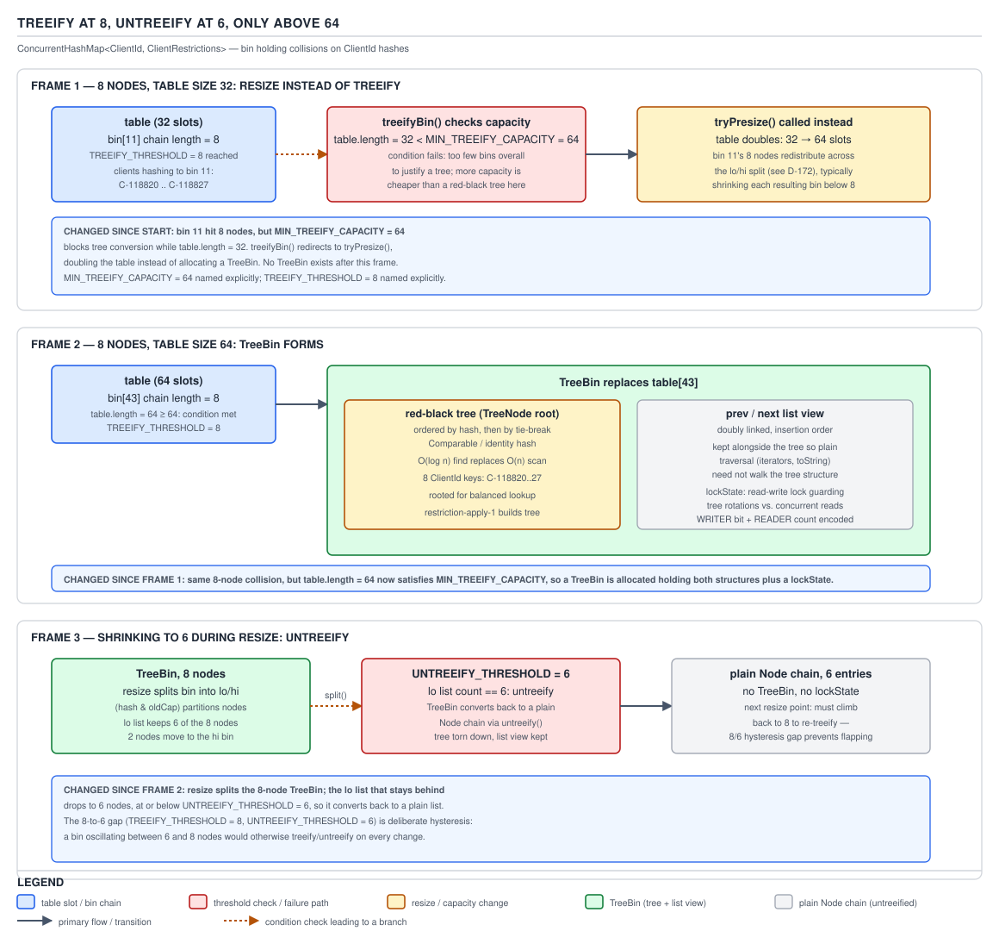
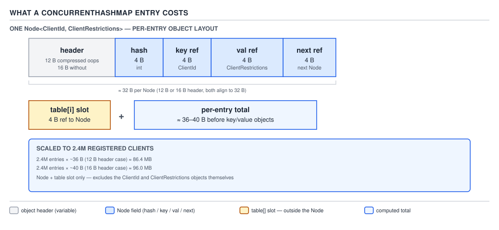

# 05 Multithreading and Concurrency — The concurrent collections — INTERNALS (§3.8, leaves 3.8.13–3.8.24)

**Target version: Java 21 LTS.** | **Part 3 of 5** | [Index](../00-index.md)
Previous: [ConcurrentHashMap internals — the table and resize](03a-internals-chm-table-and-resize.md) · Next: [Striped64, LongAdder and false sharing](../atomics/03-internals-striped64-and-false-sharing.md)

### Treeify at 8, untreeify at 6, only above 64

`[PROVE]` `[SOURCE]` `[X-REF 02]`

A `ClientRestrictions` bin only turns into a tree when two things are both true: the bin has reached `TREEIFY_THRESHOLD = 8` nodes, **and** the whole table has at least `MIN_TREEIFY_CAPACITY = 64` bins. If the table is smaller than 64 and a bin hits 8, `putVal` calls `tryPresize` and grows the table instead of treeifying it — an 8-deep bin in a 16-bin table is usually a symptom of too few bins for the entry count, not a genuinely pathological hash distribution, so the fix is more bins, not a tree.



**D-173** — Treeify at 8, untreeify at 6, only above 64.

Once treeified, a bin reverts to a plain linked list only during a resize, and only when its length has dropped to `UNTREEIFY_THRESHOLD = 6` or below.

**Why 8 and 6, not one threshold at 7.** `[NUM]` A single shared threshold thrashes: a bin sitting at exactly 7 nodes, with entries arriving and being evicted at roughly the same rate (the normal steady state for `ClientRestrictions` as restrictions are applied and lifted), would flip between list and tree on every insert/remove pair that crossed 7 in either direction. Each flip is not free — treeifying walks the whole bin and builds a red-black tree; untreeifying walks the tree and rebuilds a list. A two-node gap (8 down, 6 up) means a bin has to shed *two* entries below where it grew before it converts back, so ordinary churn around the boundary does not repeatedly pay the conversion cost. This is the same hysteresis pattern that shows up anywhere a system debounces a state flip on a noisy signal — a thermostat with a dead band, a circuit breaker with separate open/half-open thresholds — and the reasoning transfers directly: separate the rising and falling triggers whenever the underlying signal is expected to hover near the boundary.

`TreeBin` is not a bare red-black tree dropped into the bin — it wraps one with a `lockState` field implementing a compact read-write lock. `TreeNode` additionally keeps `prev`/`next` links, so every bin that has been treeified is simultaneously a doubly-linked list and a tree over the same nodes. `[PROVE]` `[SOURCE]` That duality is what makes lock-free reads possible across a `TreeBin` rebalance: a reader that started walking the `prev`/`next` list before a writer began rotating tree nodes keeps seeing a valid list-order traversal, because the writer's `lockState`-based write lock only blocks other *writers*, and rotations update tree pointers without breaking the list pointers a concurrent reader is following. A `TreeBin` without the list view would force reads to also take the tree's lock, giving away exactly the lock-free-read property that motivates using `ConcurrentHashMap` in the first place.

Inside a `TreeBin`, comparison order for non-`Comparable` keys falls back through a fixed sequence: first the hash, then `Comparable.compareTo` if the key's class actually implements it, then `tieBreakOrder`, which orders by class name and finally by `System.identityHashCode` as the last resort that can never tie. `[SOURCE]` `[X-REF 02]`

**Why `MIN_TREEIFY_CAPACITY = 64` gates treeification at all.** `[PROVE]` `[NUM]` A bin's expected length under a reasonably-distributed hash is `entries / tableLength`. In a table of 16 bins holding, say, 130 entries — already past `LOAD_FACTOR` and due to resize on its own — an *average* bin length is roughly 8, meaning many bins would legitimately sit at or above `TREEIFY_THRESHOLD` purely from load, with no pathological hashing involved at all. Treeifying those bins would spend real work (building and later tearing down red-black trees) to paper over a table that is simply too small for its entry count. `tryPresize`, called instead of `treeifyBin` when the table is under 64 bins, doubles the table — which, per the lo/hi split derived in file 03a, immediately halves the *expected* length of every bin, including the one that triggered the check. Above 64 bins, an 8-deep bin is no longer explainable by ordinary load (expected length would be well under 1 at that table size for a reasonably sized map), so it is far more likely a genuine hash-clustering pathology — a poor `hashCode()` implementation, or, historically, an adversarial key set designed to degrade a hash table to O(n) lookups — which a tree actually fixes and a resize would not.

The `treeifyBin` dispatch, condensed from the JDK 21 source to the lines that carry the two-part gate:

```java
// java.util.concurrent.ConcurrentHashMap, JDK 21 source, condensed
private final void treeifyBin(Node<K,V>[] tab, int index) {
    Node<K,V> b; int n;
    if (tab != null) {
        if ((n = tab.length) < MIN_TREEIFY_CAPACITY)
            tryPresize(n << 1);                       // too small — grow instead of treeify
        else if ((b = tabAt(tab, index)) != null && b.hash >= 0) {
            synchronized (b) {
                if (tabAt(tab, index) == b) {
                    TreeNode<K,V> hd = null, tl = null;
                    for (Node<K,V> e = b; e != null; e = e.next) {
                        TreeNode<K,V> p = new TreeNode<K,V>(e.hash, e.key, e.val, null, null);
                        if ((p.prev = tl) == null) hd = p; else tl.next = p;
                        tl = p;
                    }
                    setTabAt(tab, index, new TreeBin<K,V>(hd));
                }
            }
        }
    }
}
```

Every quoted line: the `n < MIN_TREEIFY_CAPACITY` check is the gate just derived — it runs *before* any tree is built, so a small table never pays the treeify cost at all. `b.hash >= 0` guards against re-treeifying a bin that is already a `TreeBin` (whose head has `hash == TREEBIN`, negative) or has already been forwarded (`MOVED`, also negative) — treeification only applies to a plain, live linked-list bin. Inside the lock, every existing `Node` is copied into a fresh `TreeNode` carrying the same `hash`/`key`/`val`, chained via `prev`/`next` into a list first (`hd`/`tl`), and only then handed to `new TreeBin<K,V>(hd)`, whose constructor is what actually builds the red-black tree structure over that list — confirming directly that the list view is not a convenience added on top of the tree, it is the input the tree is built from.

**Interview:** "Why doesn't `ConcurrentHashMap` treeify a small table's long bin?" — because a long bin on a small table is usually the table being under-sized for its load, not bad hashing; growing the table (`tryPresize`) fixes the actual cause and is what `MIN_TREEIFY_CAPACITY = 64` enforces before a tree is ever built.

**Pitfall:** assuming any bin with 8+ colliding hashes is a tree. It only is if the table has also reached 64 bins; below that, the response to a long bin is `tryPresize`, and a reader inspecting `Node.hash == TREEBIN` on a small map that "should" have treeified by node count alone will find it hasn't.

> **Definition.** A bin becomes a `TreeBin` — a red-black tree that is also a doubly-linked list over the same nodes, guarded by a compact read-write lock — once it holds at least 8 entries in a table of at least 64 bins, and reverts to a plain list once entries drop to 6 or fewer during a resize; the 8/6 gap exists to stop ordinary insert/remove churn near the boundary from repeatedly paying the conversion cost.

### Counting with `baseCount` plus `CounterCell[]`

`[SOURCE]` `[PROVE]` `[RESEARCH]`

A naive shared counter for "how many entries does this map have" would be exactly the `AtomicLong` contention case this topic set already covers at 3,400 settlements/sec for a single counter — every insert and removal on `ClientRestrictions` would CAS the same cache line, and at 2.4M clients with a steady stream of onboarding and lifecycle writes, that line would be the map's single hottest piece of memory regardless of how well-distributed the actual key hashes are.

`ConcurrentHashMap` avoids this with the same design `LongAdder` uses internally (`Striped64`, covered next in this topic set): a `baseCount` field plus a lazily-allocated `CounterCell[]` array. `addCount` first tries a plain CAS on `baseCount`. If that CAS fails — meaning another thread is updating the count at the same instant — it does not retry the same CAS; it picks a `CounterCell` (indexed by a per-thread probe hash) and CASes that cell instead. If *that* CAS also fails, `fullAddCount` takes over, which may grow the `CounterCell[]` array to reduce the odds of two threads colliding on the same cell next time. `[SOURCE]` `[PROVE]`

![D-174 — Counting with baseCount plus CounterCell[]](../diagrams/D-174-chm-counting.svg)

**D-174** — Counting with `baseCount` plus `CounterCell[]`.

The dispatch, verified against the JDK 21 source and condensed to the branch structure that matters:

```java
// java.util.concurrent.ConcurrentHashMap, JDK 21 source
private final void addCount(long x, int check) {
    CounterCell[] cs; long b, s;
    if ((cs = counterCells) != null ||
        !U.compareAndSetLong(this, BASECOUNT, b = baseCount, s = b + x)) {
        CounterCell c; long v; int m;
        boolean uncontended = true;
        if (cs == null || (m = cs.length - 1) < 0 ||
            (c = cs[ThreadLocalRandom.getProbe() & m]) == null ||
            !(uncontended = U.compareAndSetLong(c, CELLVALUE, v = c.value, v + x))) {
            fullAddCount(x, uncontended);
            return;
        }
        if (check <= 1) return;
        s = sumCount();
    }
    if (check >= 0) {
        Node<K,V>[] tab, nt; int n, sc;
        while (s >= (long)(sc = sizeCtl) && (tab = table) != null &&
               (n = tab.length) < MAXIMUM_CAPACITY) {
            int rs = resizeStamp(n);
            if (sc < 0) {
                if (/* another resize already in progress, try to join it */
                    (nt = nextTable) != null)
                    transfer(tab, nt);
            } else if (U.compareAndSetInt(this, SIZECTL, sc,
                       (rs << RESIZE_STAMP_SHIFT) + 2))
                transfer(tab, null);                 // this thread starts the resize
            s = sumCount();
        }
    }
}
```

Every quoted line: the outer `if` is exactly the two-level fallback described above — try `baseCount` first, and only look at `counterCells` at all if that CAS lost or a `CounterCell[]` already exists (meaning contention has already been observed once and the map has committed to striping). `ThreadLocalRandom.getProbe() & m` picks a cell using a per-thread hash so that, on average, concurrent threads land on different cells and avoid contending with each other rather than with `baseCount` — the same probe-based striping `Striped64`/`LongAdder` use. `uncontended` tracks whether the chosen cell's own CAS succeeded; if it also failed (two threads picked the same cell and raced), `fullAddCount` is called with that flag so it knows contention has now been observed twice and can justify growing the array. The `check >= 0` block is where `addCount` doubles as the resize *trigger*, not merely the counter: once the summed count `s` reaches `sizeCtl`'s threshold meaning, the thread either joins an in-progress resize (`sc < 0`, calls `transfer` with the existing `nextTable`) or wins the CAS that starts a brand-new one (`sc` positive, CASes in the packed `resizeStamp` value from file 03a and calls `transfer(tab, null)`, which allocates `nextTable` itself). This is the concrete mechanism tying leaf 3.8.17's counting design to leaf 3.8.10's resize trigger — they are not two separate subsystems, `addCount` is where one hands off to the other.

`fullAddCount`'s job, in outline rather than full reproduction here since its body is a `CAS`-retry loop structurally identical to `LongAdder`'s (covered in full next in this topic set): on repeated contention it lazily allocates `counterCells` at a small initial size if it doesn't exist yet, retries the cell CAS with a re-hashed probe if the chosen cell is still contended, and doubles the array's size (up to a cap related to `NCPU`) once contention persists across multiple cells — trading a small amount of extra memory for a proportional reduction in the odds that two concurrent writer threads keep colliding on the same cell.

`[RESEARCH]` The mechanism is deliberately the same striped-counter idea `LongAdder` exposes as a public class — `ConcurrentHashMap` cannot depend on `LongAdder` directly for layering reasons within `java.util.concurrent`, so it carries a private, near-identical implementation. Both exist because a size counter under high concurrent write load must trade instant read consistency for write throughput, and `ConcurrentHashMap`'s size was never going to be strongly consistent anyway once a resize is layered on top (below).

**Therefore `size()` is inherently approximate.** `[PROVE]` `[NUM]` `size()` returns `sumCount()`, which is `baseCount` plus an **unlocked** walk summing every non-null `CounterCell`:

```java
// java.util.concurrent.ConcurrentHashMap, JDK 21 source, structure
final long sumCount() {
    CounterCell[] cs = counterCells;
    long sum = baseCount;
    if (cs != null) {
        for (CounterCell c : cs)
            if (c != null) sum += c.value;
    }
    return sum;
}

public int size() {
    long n = sumCount();
    return ((n < 0L) ? 0 : (n > (long)Integer.MAX_VALUE) ? Integer.MAX_VALUE : (int)n);
}

public long mappingCount() {
    long n = sumCount();
    return (n < 0L) ? 0L : n;
}
```

There is no lock preventing a concurrent `addCount` from landing mid-sum — a caller can observe a count that never existed at any single instant, off by however many concurrent inserts/removals raced the walk. This is a genuine, permanent limitation, not an implementation gap: fixing it would require exactly the global lock this whole design exists to avoid. `size()` additionally clamps its `long` result into `int` range (`Integer.MAX_VALUE` if the true count would overflow), which is precisely why `mappingCount()` exists as the `long`-returning twin — for a map that can legitimately hold more entries than `Integer.MAX_VALUE`, `size()` would silently lie by clamping while `mappingCount()` reports the real figure. At 2.4M clients `ClientRestrictions` is nowhere near that ceiling, but the method exists for maps that are.

**Interview:** "Is `ConcurrentHashMap.size()` exact?" — no, and it can't be made exact without giving up the lock-free counting that makes high-write-throughput maps viable; call it a fast, unlocked approximation, `mappingCount()` when you might exceed `int` range, and reach for an external count if you truly need linearizable size.

### `ReservationNode` and `computeIfAbsent` recursion

`[SOURCE]` `[PROVE]` `[TRAP]` `computeIfAbsent` installs a `ReservationNode` — a placeholder whose hash is the `RESERVED = -3` sentinel from file 03a — into the target bin and locks it while the supplied mapping function runs, so no other thread can observe a half-computed value for that key. This is why calling `computeIfAbsent` again for the *same key* from inside the mapping function throws `IllegalStateException("Recursive update")`: the reentrant call finds the bin already locked by the outer call on the same thread and the map explicitly detects and rejects the recursion rather than deadlocking silently. Recursing onto a *different* key that happens to hash into the same bin genuinely deadlocks instead, because that path doesn't hit the same-key detection — it just blocks forever on a monitor the outer call already holds.

`ReservationNode` itself, structurally: a tiny node subtype whose entire purpose is to occupy a bin slot with a control hash rather than a real one:

```java
// java.util.concurrent.ConcurrentHashMap.ReservationNode, JDK 21 source, structure
static final class ReservationNode<K,V> extends Node<K,V> {
    ReservationNode() {
        super(RESERVED, null, null);
    }
    Node<K,V> find(int h, Object k) { return null; }   // never matches a real lookup
}
```

Placing an empty-bin CAS of a `ReservationNode` (hash `RESERVED`) is the same empty-bin fast path `putVal` uses for an ordinary insert — `casTabAt(tab, i, null, new ReservationNode<>())` — followed by taking that node's own monitor before running the caller's mapping function, and finally replacing it with a real `Node` (or removing it entirely, if the function returned `null`) once the function completes. Any other thread's `get` on that key during the window sees a bin whose head has `hash == RESERVED`, which never matches a real lookup's `spread`-computed hash, so it correctly reports "absent" rather than blocking — readers still never lock, even while a `computeIfAbsent` computation is in flight on that exact key.

**Insight:** `ReservationNode` is doing for `computeIfAbsent` exactly what `ForwardingNode` does for resize and `TreeBin` does for a treeified bin — reusing the sign bit of `Node.hash` as a dispatch tag so every code path that reads a bin (`get`, `putVal`, the `Traverser`) can recognise "this is not a plain data node" through one shared mechanism, rather than each feature inventing its own signalling convention.

**Pitfall:** treating `computeIfAbsent`'s mapping function as safe to call other `ClientRestrictions` methods from, on the belief that "it's just a lambda". If that lambda calls back into `computeIfAbsent` on the same map for a key that collides into the same bin, the outer lock is already held on this thread; same key throws a clear exception, a different colliding key hangs the thread indefinitely with no exception at all.

### The traverser

`[SOURCE]` `[PROVE]` Iterating a `ConcurrentHashMap` — `keySet()`, `entrySet()`, `values()` — goes through `Traverser`/`BaseIterator`, which keeps a stack of table references rather than assuming a single, stable array. When it walks into a bin and finds a `ForwardingNode`, it follows `nextTable` the same way a `get` does; when it walks into a `TreeBin`, it uses the list view (`prev`/`next`), not the tree, so tree rebalances underneath it don't disturb the walk. This machinery is exactly what backs the documented "weakly consistent" iteration guarantee: an iterator reflects the state of the map at some point at or since its creation, may or may not reflect a mutation made during the iteration, and — the specific guarantee this traverser design buys — never throws `ConcurrentModificationException` and never returns the same element twice.

`Traverser`'s fields, in outline (structurally consistent with the JDK 21 source, condensed to what a source-walk needs):

```java
// java.util.concurrent.ConcurrentHashMap.Traverser, JDK 21 source, condensed
static class Traverser<K,V> {
    Node<K,V>[] tab;        // current table; may be different from initial table after a resize
    Node<K,V> next;         // the next entry to use
    TableStack<K,V> stack, spare;  // saved states for further splits
    int index;              // index of bin to use next
    int baseIndex;          // current index of initial table
    int baseLimit;          // index bound for initial table
    final int baseSize;     // initial table size

    final Node<K,V> advance() {
        Node<K,V> e;
        if ((e = next) != null) e = e.next;
        for (;;) {
            Node<K,V>[] t; int i, n;
            if (e != null) return next = e;
            if (baseIndex >= baseLimit || (t = tab) == null ||
                (n = t.length) <= (i = index) || i < 0)
                return next = null;
            if ((e = tabAt(t, i)) != null && e.hash < 0) {
                if (e instanceof ForwardingNode) {
                    tab = ((ForwardingNode<K,V>)e).nextTable;
                    e = null;
                    pushState(t, i, n);   // remember where to resume in the old table
                    continue;
                } else if (e instanceof TreeBin) {
                    e = ((TreeBin<K,V>)e).first;   // the list view, not the tree
                } else {
                    e = null;
                }
            }
            if (stack != null) recoverState(n);
            else if ((index = i + baseSize) >= n)
                index = ++baseIndex;         // move to the next bin of the *initial* table
        }
    }
}
```

Every quoted line: `tab` is reassigned, not fixed at construction — this is what lets a `Traverser` that started before a resize keep making progress after one, by following exactly the same `ForwardingNode` mechanism `get` and `transfer` use. `e.hash < 0` is the same sign-bit discriminant from file 03a's constants table doing yet another job: a negative hash on the node reached by `advance()` means "this isn't a plain data node", and the `instanceof` checks that follow route to the correct handling — `ForwardingNode` pushes the current table/index onto `stack` (via `pushState`) so the traversal can resume the *old* table's remaining bins later if needed, and switches `tab` to `nextTable`; `TreeBin` grabs `first`, the head of its `prev`/`next` list view, not a tree-traversal entry point. `baseIndex`/`baseLimit`/`baseSize` track progress through the table as it existed when the `Traverser` was created, which is the "at some point at or since creation" half of the weakly-consistent contract — a resize does not reset or restart the walk, it redirects it.

**Insight:** the `Traverser` treats a `ForwardingNode` exactly the way `get` and a helping writer thread do — follow `nextTable` — which is the pattern worth generalising: every one of `ConcurrentHashMap`'s reader-side paths (`get`, iteration, bulk operations) is built on the same primitive of "if you land on a sentinel hash, redirect through the table it points to", rather than each path inventing its own resize-awareness.

**Insight:** weakly-consistent iteration isn't a weaker promise bolted on for convenience — it's the only promise achievable at all once you've decided reads never lock, because a "strongly consistent" iterator would require freezing the table against concurrent structural change, which is precisely the global-lock cost this whole class exists to avoid.

Bulk operations (`forEach`, `search`, `reduce` and their variants) are supporting facts on top of the same traversal idea: `ForEachMappingTask` and its siblings are `CountedCompleter` tasks submitted to the common `ForkJoinPool`, recursively splitting the table until the estimated remaining element count falls below `parallelismThreshold` (the argument you pass to the bulk method, or `Long.MAX_VALUE` to force single-threaded execution). `[SOURCE]` `[RESEARCH]` The gotcha: passing a small `parallelismThreshold` on a small map just adds fork/join scheduling overhead for no parallel benefit — the split only pays off once per-task work meaningfully exceeds task-submission cost, which for `ClientRestrictions`-scale bins is rarely true for anything except a full-table scan across all 2.4M clients.

`KeySetView`, returned by `keySet()` and constructed directly by `newKeySet()`, is implemented as a `ConcurrentHashMap<K, Boolean>` (or a generic dummy value type) under the covers — a map with every value set to the same shared placeholder object, giving set semantics for free from the map implementation rather than a separate data structure.

### What `ConcurrentHashMap` does *not* give you

`[TRAP]` Four guarantees a reader coming from `synchronized` collections or a single-threaded mental model tends to assume, and none of them hold: a consistent point-in-time snapshot across multiple reads (two `get` calls a moment apart on `ClientRestrictions` can straddle an intervening `computeIfAbsent`); atomic `size()` (above); atomic bulk operations — `putAll`, or a sequence of independent `put` calls, is not one atomic unit, so a thread compiling a batch of restriction updates from a compliance sweep can have another thread observe the batch half-applied; and ordering — iteration order is unspecified and can change between runs, unlike `LinkedHashMap` or a `ConcurrentSkipListMap`.

**Pitfall:** writing code that reads `stakeableRestrictions.size()`, branches on it, then iterates and expects the iteration to visit exactly that many entries. Both numbers are independently approximate/weakly-consistent; treating their agreement as a correctness invariant is the classic "it worked in testing" bug that surfaces only under real concurrent load.

### `[NUM]` What a `ConcurrentHashMap` entry costs

`[NUM]` `[PROVE]` A `Node<K,V>` holds four fields: `final int hash` (4 B), `final K key` (4 B reference on a compressed-oops 64-bit JVM), `volatile V val` (4 B reference), `volatile Node<K,V> next` (4 B reference). Object header on a compressed-oops JVM is 12 B (mark word + compressed class pointer); some JVM configurations round to 16 B for alignment. Summing the stated components:

```
header:      12 B  (or 16 B, alignment-dependent)
hash:         4 B
key ref:      4 B
val ref:      4 B
next ref:     4 B
----------------
subtotal:  ≈ 28 B, rounds to ≈ 32 B with 8-byte object alignment padding
```

Add the 4-byte table array slot each entry occupies (the reference stored in `table[i]` or chained via `next`, already counted once per node as `next`, but the *array's own slot* for the head of each bin is additional and shared across the bin rather than per-node): the per-entry cost the syllabus asks for is **≈ 32 B for the `Node` object itself, plus 4 B for the table slot a head-of-bin entry occupies**, before the `key` and `value` objects it references are counted at all — a `ClientId` wrapping a `UUID` and a `RestrictionSet` value are separate heap objects with their own headers, not included in this figure.



**D-175** — What a `ConcurrentHashMap` entry costs.

Scaled to `ClientRestrictions` at 2.4M entries:

```
2,400,000 entries × 32 B/Node        =  76,800,000 B  ≈ 73.2 MiB
2,400,000 entries ×  4 B/table slot  =   9,600,000 B  ≈  9.2 MiB
----------------------------------------------------------------
Node + slot overhead alone           ≈  86,400,000 B  ≈ 82.4 MiB
```

That is the map's *structural* overhead — before a single `ClientId` or restriction-set value object is counted. It is also why "just put everything in a `ConcurrentHashMap`" is not a free architectural choice at this scale: 82 MiB of pure bookkeeping for 2.4M entries is a real, budgetable number, and it grows linearly with client count, not with restriction count — a client with zero restrictions and a client with five each cost exactly one `Node` in this map, because the value object (the restriction set) is where the per-restriction cost actually lives, not the `Node`.

**Interview:** "What's the memory overhead of a `ConcurrentHashMap<ClientId, X>` at N entries?" — roughly `36 * N` bytes of pure map structure (`Node` object plus its table slot), independent of what `X` is, which is the number to reach for before arguing whether a given cache belongs in-process at all.

## Pitfalls

### Assuming `size()` and a subsequent full iteration will agree on count

**Wrong**
```java
int expected = stakeableRestrictions.size();
int actual = 0;
for (var entry : stakeableRestrictions.entrySet()) {
    actual++;
}
assert expected == actual; // fails intermittently under concurrent writes
```
`size()` sums `baseCount` plus an unlocked walk of `CounterCell[]`, and the iterator is separately weakly consistent — both can disagree with each other and with any single true instant, especially while operators are actively lifting and applying restrictions concurrently with the read.

**Right**
```java
// Don't correlate size() with iteration count as an invariant.
// If an exact, consistent count is required, compute it from a
// source that supports linearizable reads (e.g. a versioned
// snapshot table), not from ConcurrentHashMap's approximate counters.
long trueCount = restrictionAuditLog.countAsOf(Instant.now());
```

**Why people believe it:** on a `HashMap` or under a global lock, size and iteration trivially agree, and the approximation only becomes visible under genuine concurrent write load — which most manual testing doesn't reproduce.

### Believing a small table's 8-node bin should treeify

**Wrong**
```java
// "TREEIFY_THRESHOLD is 8, this bin has 8 nodes, it must be a TreeBin now"
Object headNode = probeBinHead(restrictions, someIndex);
assert nodeHash(headNode) == TREEBIN;   // fails on a table under 64 bins
```
This ignores the second half of the gate entirely: a bin only treeifies if the *table* is also at least `MIN_TREEIFY_CAPACITY = 64` bins. A 16- or 32-bin table with an 8-deep bin calls `tryPresize` and grows instead — the bin stays a plain list, just in a larger table where its expected length is now much smaller.

**Right**
```java
// Check both halves of the gate, not just the bin length.
boolean wouldTreeify = binLength >= TREEIFY_THRESHOLD
                    && tableLength >= MIN_TREEIFY_CAPACITY;
```

**Why people believe it:** `TREEIFY_THRESHOLD = 8` is the number everyone remembers because it is the more commonly quoted constant; `MIN_TREEIFY_CAPACITY = 64` is the second, easily forgotten half of the same rule, and the two only ever appear together in the actual source, never in isolation.

## Cheat sheet

| Item | Value / behaviour |
|---|---|
| Treeify condition | bin ≥ `TREEIFY_THRESHOLD` (8) **and** table ≥ `MIN_TREEIFY_CAPACITY` (64) |
| Below 64 bins, long bin | `tryPresize` grows the table instead of treeifying |
| Untreeify condition | bin ≤ `UNTREEIFY_THRESHOLD` (6), checked during resize only |
| Why 8/6 gap | hysteresis — stops churn near the boundary from repeatedly paying conversion cost |
| `TreeBin` | red-black tree + doubly-linked list (`prev`/`next`) over the same nodes, `lockState` read-write lock |
| Non-`Comparable` tie-break | hash → `Comparable` if applicable → `tieBreakOrder` (class name, then `identityHashCode`) |
| Counting | `baseCount` CAS, fallback to random `CounterCell`, fallback to `fullAddCount` (may grow array) |
| `size()` | `baseCount` + unlocked cell sum — approximate |
| `mappingCount()` | same sum, `long`-typed, for maps that can exceed `Integer.MAX_VALUE` entries |
| `ReservationNode` | hash `RESERVED`, placeholder during `computeIfAbsent`; same-key recursion → `IllegalStateException`; different-key same-bin recursion → deadlock |
| Traverser | stack of table references; follows `ForwardingNode`; uses `TreeBin`'s list view, not the tree |
| Iteration guarantee | weakly consistent: no `ConcurrentModificationException`, no duplicate element, may miss/include concurrent mutations |
| Bulk ops | `CountedCompleter` tasks on common `ForkJoinPool`, split until below `parallelismThreshold` |
| `KeySetView` | map with a shared dummy value, gives set semantics |
| Not guaranteed | snapshot consistency, atomic `size`, atomic bulk ops, ordering |
| Per-entry cost | `Node` ≈ 32 B + 4 B table slot ≈ 36 B, before key/value objects |
| At 2.4M entries | ≈ 82.4 MiB of pure `Node`+slot overhead |
| `treeifyBin` gate | `tab.length < MIN_TREEIFY_CAPACITY` → `tryPresize(n << 1)` instead of building a tree |
| `ReservationNode` hash | `RESERVED`; `find()` always returns `null`, so concurrent `get` correctly reports absent |
| `addCount`'s dual role | Updates `baseCount`/`CounterCell[]` **and** triggers/joins a resize once the summed count crosses `sizeCtl`'s threshold |
| `Traverser.tab` | Reassigned on `ForwardingNode`, not fixed — lets iteration survive a concurrent resize |

## The two source-walk threads worth holding onto

This file and file 03a walk the same handful of ideas from different entry points, and it's worth naming the thread explicitly now that both halves are on the page: `Node.hash`'s sign bit is a single shared dispatch mechanism (`MOVED` for resize, `TREEBIN` for a treeified bin, `RESERVED` for `computeIfAbsent`) that every reader-side path — `get`, `putVal`, `transfer`, the `Traverser` — checks the same way rather than each inventing its own signalling convention; and every one of those reader-side paths responds to a sentinel hash by *redirecting* (into `nextTable`, into the tree's list view, into "report absent") rather than blocking, which is the actual mechanism behind every lock-free-read claim made across both files.

## Self-test

**Q1.** A bin in a 32-bin `ClientRestrictions` table reaches 9 nodes. Does it treeify?

<details><summary>Answer</summary>

No. `TREEIFY_THRESHOLD` (8) is met, but `MIN_TREEIFY_CAPACITY` (64) is not — the table is only 32 bins. `tryPresize` grows the table instead.

</details>

**Q2.** Why does `UNTREEIFY_THRESHOLD` sit at 6 rather than at 7 (one below the treeify threshold of 8)?

<details><summary>Answer</summary>

A one-apart pair of thresholds would let a bin hovering at 7–8 nodes flip between list and tree on every insert/remove crossing that single line. The 8/6 gap forces a bin to shed two entries below where it treeified before it converts back, so ordinary churn near the boundary doesn't repeatedly pay the tree-build/tree-teardown cost.

</details>

**Q3.** How does `ConcurrentHashMap` avoid making its internal entry counter a single hot `AtomicLong`?

<details><summary>Answer</summary>

`addCount` first CASes a shared `baseCount`. On contention (CAS failure), it CASes a `CounterCell` selected by a per-thread hash instead of retrying the same field, and `fullAddCount` can grow the `CounterCell[]` array under sustained contention — the same striping idea `LongAdder`/`Striped64` uses, spreading writes across multiple cache lines instead of funneling them through one.

</details>

**Q4.** Why is `size()` on `ConcurrentHashMap` described as approximate rather than exact?

<details><summary>Answer</summary>

It returns `baseCount` plus an unlocked walk summing every `CounterCell`. Nothing prevents a concurrent `addCount` call from mutating a cell mid-walk, so the returned value may never have been the map's true size at any single instant. This is inherent to the design, not a bug.

</details>

**Q5.** Two threads both call `computeIfAbsent` on `ClientRestrictions` for the same `clientId`, and the mapping function for that call itself calls `computeIfAbsent` again for the same key on the same thread. What happens, and why?

<details><summary>Answer</summary>

`IllegalStateException("Recursive update")`. A `ReservationNode` (hash `RESERVED`) was installed and locked for that key while the mapping function runs; the map explicitly detects that the reentrant call is for the same key on the same thread and throws rather than deadlocking. A colliding *different* key in the same bin is not detected this way and deadlocks instead.

</details>

**Q6.** Why does the `Traverser` use a `TreeBin`'s list view (`prev`/`next`) rather than walking the tree directly?

<details><summary>Answer</summary>

So a concurrent tree rebalance doesn't disturb an in-progress iteration. The list pointers stay valid across a rotation in a way that a raw tree walk mid-rebalance would not, keeping iteration lock-free and consistent with the map's weakly-consistent guarantee.

</details>

**Q7.** Roughly how much heap does the `Node` and table-slot overhead alone cost for a `ConcurrentHashMap` with 2.4M entries, independent of key and value object sizes?

<details><summary>Answer</summary>

≈36 bytes per entry (≈32 B `Node` object + 4 B table slot for a head-of-bin entry) × 2.4M ≈ 86.4 MB (≈82.4 MiB) — purely structural overhead, before the `ClientId` and value objects each entry references.

</details>

**Q8.** What four guarantees does `ConcurrentHashMap` explicitly not provide, that a developer coming from single-threaded collections often assumes it does?

<details><summary>Answer</summary>

A consistent point-in-time snapshot across multiple reads, an atomic `size()`, atomic bulk operations (e.g. sequences of puts), and any specified iteration ordering.

</details>

**Q9.** In `addCount`, why does a failed CAS on `baseCount` route to a `CounterCell` chosen by `ThreadLocalRandom.getProbe()` rather than simply retrying the `baseCount` CAS in a loop?

<details><summary>Answer</summary>

Retrying the same CAS in a loop under contention just makes every contending thread hammer the same cache line harder, which is the exact problem the design exists to avoid. Routing to a per-thread-hashed cell instead spreads concurrent writers across different memory locations, so most of them succeed on their first attempt at a different cell rather than all serializing on one field.

</details>

**Q10.** A `Traverser` is midway through iterating `ClientRestrictions` when a resize begins and the bin it is about to visit gets forwarded. What does `advance()` do, and why does this not violate the weakly-consistent iteration contract?

<details><summary>Answer</summary>

It detects `e.hash < 0` with the node being a `ForwardingNode`, pushes the current table and index onto its internal stack so it can resume the old table later if needed, reassigns `tab` to the `ForwardingNode`'s `nextTable`, and continues from there. This does not violate weak consistency because that contract only promises the iterator reflects the map's state "at some point at or since creation" and never repeats or crashes — redirecting through `nextTable` keeps both promises; it does not promise the iterator is unaffected by concurrent structural changes.

</details>

---

**Leaves covered:** 3.8.13–3.8.24 (12 leaves)
**Leaves deferred:** none
**Diagrams included:** D-173, D-174, D-175
**Target version:** Java 21 LTS
**Lines:** 424
