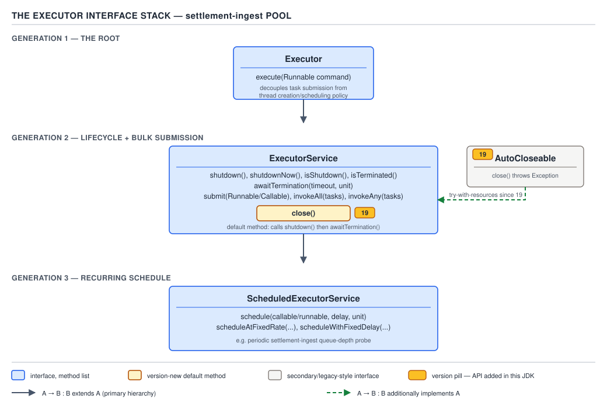

# 05 Multithreading and Concurrency — The Executor framework — BASICS (§1.18)

**Target version: Java 21 LTS.** | **Part 1 of 5** | [Index](../00-index.md)
Previous: [BlockingQueue and producer–consumer](../queues/01-basics-blockingqueue.md) · Next: [ThreadPoolExecutor — the submission algorithm](02a-basics-threadpoolexecutor-submission.md)

## Why the executor exists

### Mental model

`AssessmentService` calls two dependencies per application: the identity vendor (p50 900 ms, p99
38 s) and the watchlist provider (p50 1.4 s, 30 s timeout). Firing `new Thread(task).start()` per
application at the 24k/day peak reaching `AO-400` spins up unbounded OS threads, each with a
~1 MB stack, no cap, no queue, no way to ask "did it finish, with what result?" A thread is a
*mechanism*; an executor is a *policy*: it decouples **what to run** from **how and where**.

### Why it exists

Before `java.util.concurrent` (JDK 5, Doug Lea's `EDU.oswego.cs.dl.util.concurrent`), every
thread-pool was hand-rolled — a `BlockingQueue` of `Runnable`s, workers looping
`queue.take().run()`, ad-hoc shutdown flags, every team's slightly buggy version of the same
thing. `Executor`/`ExecutorService` standardize the shape so `submit`, `shutdown`, `Future` mean
the same thing everywhere.

### When to reach for it

Reach for an executor once you need more than "run this once, fire and forget" — a result back, a
concurrency bound, or a clean shutdown lifecycle. Skip it for a single virtual thread call
(`Thread.ofVirtual().start(task)`), and skip general-purpose `ExecutorService` for *structured*
concurrency with parent-child cancellation — `StructuredTaskScope` (JEP 505, preview on 21; Day
04, `[X-REF 04]`, leaf 1.18.19 below).

### How it works — the interface stack

`Executor` declares exactly one method: `void execute(Runnable command)` — no promise of a
result, a queue, or a shutdown path, the minimal "submit work" contract. `ExecutorService`
extends it with lifecycle (`shutdown`, `shutdownNow`, `isShutdown`, `isTerminated`,
`awaitTermination`) and result-bearing submission (`submit`, `invokeAll`, `invokeAny`).
`ScheduledExecutorService` extends it again with delay/fixed-rate scheduling (`schedule`,
`scheduleAtFixedRate`, `scheduleWithFixedDelay`).



**D-076** — The executor interface stack.

### A minimal concrete example

```java
ExecutorService verificationPool = Executors.newFixedThreadPool(8);

Runnable logIdentityCheckStarted =
        () -> System.out.println("identity check dispatched to vendor");
verificationPool.execute(logIdentityCheckStarted); // Executor's one method
```

### The gotcha

`execute` gives no handle on the outcome — no `Future`, no way to know it threw, short of a
custom `Thread.UncaughtExceptionHandler` or `afterExecute` override. That absence is exactly what
`submit` fixes, and exactly what makes `submit` dangerous in its own way (below).

> **Definition.** `Executor` is a single-method task-submission contract; `ExecutorService` adds
> lifecycle and Future-returning submission on top of it.

## `AutoCloseable` since Java 19 — supporting fact

`ExecutorService extends AutoCloseable` as of Java 19. Its default `close()` calls `shutdown()`,
then `awaitTermination` with an effectively unbounded wait; if interrupted, `close()` calls
`shutdownNow()`, waits for running tasks, then re-asserts the interrupt flag — what makes
`try (var ex = Executors.newVirtualThreadPerTaskExecutor()) { ... }` safe without a `finally`.

**Gotcha:** `close()` blocks until every task finishes — not fire-and-forget. On a pool running
the 38 s p99 identity-vendor call, `close()` itself can block for tens of seconds.

> **Definition.** `close()` is `shutdown()` + wait-forever + `shutdownNow()`-on-interrupt, wired
> so `ExecutorService` fits `try-with-resources`.

## The five execution-policy dimensions — supporting fact

Every pool answers five questions: **in what thread**, **in what order**, **how many**
concurrently, **how many** queued before backpressure, and **what happens** on rejection.
`newFixedThreadPool(n)` answers them one way (n platform threads, FIFO, unbounded queue, no
rejection until OOM); a hand-built `ThreadPoolExecutor` with a bounded queue and
`CallerRunsPolicy` answers differently (Part 2 works the submission algorithm leaf by leaf).

> **Definition.** An executor's identity is the tuple (thread source, ordering, concurrency
> bound, queue bound, rejection policy) — not just "a thread pool."

## The `Executors` factory inventory — supporting fact

`Executors` is a static factory class: `newFixedThreadPool`, `newSingleThreadExecutor`,
`newCachedThreadPool`, `newScheduledThreadPool`, `newSingleThreadScheduledExecutor`,
`newWorkStealingPool` (backed by `ForkJoinPool`), plus Java 21's
`newVirtualThreadPerTaskExecutor()` and `newThreadPerTaskExecutor(ThreadFactory)` — confirmed
current on the Java 21 javadoc. `newThreadPerTaskExecutor` starts one thread per task, no cap;
feeding it a virtual-thread factory is what `newVirtualThreadPerTaskExecutor` does internally.
Rounding out the family: `unconfigurableXxx` wrappers, `callable`/`privilegedCallable` adapters.

**Gotcha:** every one hides its queue and rejection policy behind a friendly name —
`newFixedThreadPool` uses an *unbounded* `LinkedBlockingQueue`, so "fixed" bounds thread count,
not memory. Part 2 covers why that combination is a production trap.

> **Definition.** `Executors` supplies opinionated, pre-wired `ExecutorService` configurations;
> it does not remove the five policy dimensions, it just picks defaults for you.

## `newSingleThreadExecutor` is not `newFixedThreadPool(1)` — supporting fact

`[TRAP]` `[SOURCE]` The single-thread factory returns a `FinalizableDelegatedExecutorService`
wrapping a real `ThreadPoolExecutor(1,1,...)` — the wrapper hides the `ThreadPoolExecutor` type so
callers cannot cast it back and call `setCorePoolSize(2)` to reconfigure it. It also replaces a
dead thread with a fresh one, guaranteeing "the same single worker forever" — `newFixedThreadPool(1)`
gives a size-1 pool with no such guarantee.

**Pitfall:** assuming `newFixedThreadPool(1)` and `newSingleThreadExecutor()` are interchangeable
because both run one task at a time. They differ in whether a caller can downcast and widen the
pool later — `newFixedThreadPool(1)`'s plain `ThreadPoolExecutor` permits it; the single-thread
wrapper forbids it structurally.

> **Definition.** `newSingleThreadExecutor` is a non-reconfigurable, self-healing wrapper around
> a size-1 pool, not merely a pool sized to one.

## `submit` swallows the exception — `execute` does not

### Mental model

Picture two doors into the same room. Through the `execute` door, a thrown exception walks
straight out the far side and hits whatever `UncaughtExceptionHandler` is standing there,
printing its stack trace. Through the `submit` door, the exception is *caught at the threshold*
and locked inside a box — the `FutureTask` — that only opens when someone calls `get()`. If
nobody opens the box, the exception ceases to exist as far as anyone can observe.

### Why it exists

`submit` needs a `Future` to report a result or failure asynchronously. The only way to report
"this task failed" through a `Future` is to capture the `Throwable` and store it, ready for
`get()` to rethrow as `ExecutionException`. That capture is the entire point of `Future` — but it
has a silent side effect: it *suppresses* the exception from every path that skips `get()`.

### When to reach for it, and when not

Use `submit` whenever you need the result, the completion signal, or `cancel()`. Use bare
`execute` only for genuinely fire-and-forget work where a missed exception is acceptable — a log
line, a best-effort cache warm. Never use `submit` for a task whose only value is its side effect
without also calling `get()` — that is exactly how `AssessmentService` swallows a failed identity
verification and silently reports success.

### How it works `[PROVE]`

Walk it through directly. `ThreadPoolExecutor.execute(Runnable)` runs the task inline inside
`Worker.run()`, which calls `task.run()` with no `try/catch` around user code beyond
`beforeExecute`/`afterExecute` hooks — an uncaught `RuntimeException` propagates out of
`Worker.run()`, out of `Thread.run()`, and reaches `Thread.dispatchUncaughtException`, invoking
whatever `UncaughtExceptionHandler` is set (default: print to `System.err`). `submit(Callable<T>)`
does not hand your task to `execute` unmodified — it first wraps it in a `FutureTask`, then calls
`execute(futureTask)`. `FutureTask.run()` invokes `Callable.call()` inside its own
`try/catch (Throwable ex)`, and on catch calls `setException(ex)`, storing the throwable in the
`outcome` field and transitioning state to `EXCEPTIONAL`. Because `FutureTask.run()` never
rethrows, `Worker.run()` sees a normal return — `afterExecute` gets a `null` throwable, and the
`UncaughtExceptionHandler` never fires. The only way the exception resurfaces is `future.get()`,
which sees `EXCEPTIONAL` and throws `new ExecutionException(outcome)`.


**D-077** — `submit` swallows the exception, `execute` does not.

### A minimal concrete example

```java
ExecutorService verificationPool = Executors.newFixedThreadPool(4);

// execute: the exception reaches the UncaughtExceptionHandler and prints.
verificationPool.execute(() -> {
    throw new IllegalStateException("watchlist provider returned malformed payload");
});

// submit: the exception is captured — nothing prints unless get() is called.
Future<Void> silent = verificationPool.submit(() -> {
    throw new IllegalStateException("identity vendor returned malformed payload");
}, null);

// The only way to observe it:
try {
    silent.get();
} catch (ExecutionException e) {
    Throwable cause = e.getCause(); // IllegalStateException, unwrapped here
    System.err.println("watchlist/identity check failed: " + cause.getMessage());
}
```

### The gotcha

Nobody calls `get()` on a `Future` submitted only for its side effect, and the failure vanishes
without a log line, a metric, or a crash — the task silently did nothing while the caller
proceeds as if verification succeeded.

**Pitfall:** believing `submit` gives the same crash-and-log behavior as `execute`. **Symptom:**
a task that throws inside `submit` produces zero log output anywhere, while the same body passed
to `execute` prints immediately. **Fix:** always call `get()` on every submitted `Future` (even
discarding the result), or route completion through a `CompletionService`/`CompletableFuture`
whose failure path is actually checked.

**Interview:** "Why didn't my exception show up with `submit` instead of `execute`?" — `submit`
captures the throwable into the returned `Future` instead of letting it reach the uncaught-
exception handler; it only resurfaces via `get()`.

> **Definition.** `submit` converts an uncaught exception into a stored `Future` outcome rather
> than an uncaught-exception-handler event — silence is the default unless `get()` is called.

## `invokeAll` and `invokeAny` — supporting fact

`invokeAll(tasks)` blocks until every task completes (or the optional timeout expires), returning
a `List<Future<T>>` in input order — some entries may be cancelled if the timeout fired mid-batch.
`invokeAny(tasks)` races all tasks and returns the first success, cancelling the rest; it throws
`ExecutionException` only if *every* task fails.

**Gotcha:** `invokeAll`'s return order is submission order, not completion order — calling
`invokeAll` with the identity check (p99 38 s) first and the watchlist check (30 s timeout) second
blocks the caller on the slow identity `Future` even if the watchlist result is already ready.
That mismatch is precisely why `CompletionService` exists (next).

> **Definition.** `invokeAll` returns all results in submission order after waiting for all of
> them; `invokeAny` returns the first success and cancels the losers.

## `CompletionService` / `ExecutorCompletionService` `[BUILD]`

### Mental model

Think of a restaurant order queue where dishes come out in whatever order they finish cooking, not
the order they were ordered — a runner grabs whichever plate is ready next.
`ExecutorCompletionService` is that runner: it wraps an `ExecutorService`, and every submitted
task's `Future` is pushed onto an internal completion queue the instant the task finishes,
regardless of submission order.

### Why it exists

`invokeAll` forces waiting on results in submission order even when a faster task finished first.
`AssessmentService` fanning out to the identity vendor and the watchlist provider almost always
wants to act on whichever result lands first, not whichever was listed first.

### When to reach for it, and when not

Reach for it with a fixed, small batch of heterogeneous tasks you want to process as each lands.
Skip it when you need to compose or chain results (`CompletableFuture`, leaf 1.18.14, wins there),
and skip it for an unbounded or streaming batch — its internal queue has no backpressure signal
back to the submitter.

### How it works

`ExecutorCompletionService<V>` wraps a delegate `Executor` and a `BlockingQueue<Future<V>>`.
`submit(Callable<V>)` wraps the task in a private `FutureTask` subclass whose `done()` hook
pushes itself onto that queue, then hands it to the delegate. `take()` blocks until a completed
`Future` is available; `poll()`/`poll(timeout, unit)` give non-blocking or bounded-wait variants.

### A minimal concrete example

```java
record VerificationResult(String source, boolean cleared, String detail) {}

ExecutorService pool = Executors.newFixedThreadPool(2);
CompletionService<VerificationResult> completion = new ExecutorCompletionService<>(pool);

completion.submit(() -> {
    // identity vendor: p50 900ms, p99 38s
    boolean verified = identityVendorClient.verify(applicationId);
    return new VerificationResult("IDENTITY", verified, "vendor check");
});
completion.submit(() -> {
    // watchlist provider: p50 1.4s, 30s timeout
    boolean clear = watchlistProvider.screen(applicationId);
    return new VerificationResult("WATCHLIST", clear, "screening check");
});

int remaining = 2;
while (remaining > 0) {
    Future<VerificationResult> completed = completion.take(); // blocks for the NEXT finisher
    try {
        VerificationResult result = completed.get();
        System.out.printf("%s finished first-available: cleared=%s%n",
                result.source(), result.cleared());
    } catch (ExecutionException e) {
        System.err.println("verification step failed: " + e.getCause());
    } finally {
        remaining--;
    }
}
pool.shutdown();
```

The watchlist provider's p50 (1.4 s) is slower than the identity vendor's p50 (900 ms), but the
identity vendor's tail (p99 38 s) is far worse than the watchlist's (p99 25 s, 30 s timeout) — so
completion order in production is genuinely unpredictable per request, exactly the case
`CompletionService` is built for.

### The gotcha

Each `take()` blocks for exactly the *next* completion — it does not let you peek ahead or
re-order by priority; preferring one result over another needs extra bookkeeping on top.

**Interview:** "How do you process parallel results as they arrive instead of waiting for the
slowest first?" — wrap the executor in an `ExecutorCompletionService` and loop `take()`/`poll()`
instead of iterating `invokeAll`'s list.

> **Definition.** `CompletionService` decouples "which task finished" from "which task was
> submitted first," delivering `Future`s through a queue in completion order.

## `Future<V>` and its exceptions — supporting fact

`Future<V>` exposes `get()`, `get(long, TimeUnit)`, `cancel(boolean)`, `isCancelled()`,
`isDone()`, and — since Java 19, confirmed current on Java 21 — `state()` returning a
`Future.State` enum (`RUNNING`, `SUCCESS`, `FAILED`, `CANCELLED`) plus `resultNow()`/
`exceptionNow()`, asserting a completed state and throwing `IllegalStateException` if wrong.
`[VERSION-TRAP]` These are stable on 21 as the non-blocking alternative to `get()`/`catch`.
`get()` itself throws `InterruptedException`, `ExecutionException` (unwrap via `getCause()`),
`CancellationException`, and `TimeoutException` from the timed overload.

**Gotcha:** `resultNow()` on a `Future` still `RUNNING` throws `IllegalStateException` rather than
blocking — it is an assertion, not a wait.

> **Definition.** `Future<V>` is a handle to an asynchronous result with four terminal
> observation paths (`get`, `get(timeout)`, and, since 19, `resultNow`/`exceptionNow` guarded by
> `state()`).

## `FutureTask` as the `RunnableFuture` basis — supporting fact

`FutureTask<V>` implements `RunnableFuture<V>` (`Runnable` + `Future<V>`) and is a one-shot state
machine over an `int state` field (`NEW → COMPLETING → NORMAL/EXCEPTIONAL/CANCELLED/...`), backed
by an `Object outcome` slot for the result or caught throwable — the concrete class every
`submit()` constructs. `Executors.callable(Runnable)`/`RunnableAdapter` let a `Runnable` be
wrapped the same way as a `Callable`.

> **Definition.** `FutureTask` is the single, reusable `Runnable`+`Future` implementation that
> `submit` always produces; a "future" is not a separate mechanism from a "task," it is the same
> object viewed from two interfaces.

## Why a `Future.get()` chain motivates `CompletableFuture` `[PROVE]`

Chain three dependent async steps with bare `Future`s: verify identity, then screen the
watchlist only if identity clears, then activate the account. Each step needs the previous
result, so the code becomes:

```java
Future<Boolean> identityFuture = pool.submit(() -> identityVendorClient.verify(applicationId));
boolean identityOk = identityFuture.get();           // BLOCKS this thread
Future<Boolean> watchlistFuture = identityOk
        ? pool.submit(() -> watchlistProvider.screen(applicationId))
        : null;
boolean watchlistOk = watchlistFuture != null && watchlistFuture.get(); // BLOCKS again
if (watchlistOk) accountActivation.activate(applicationId);
```

Every `get()` parks the calling thread until that stage finishes — the "parallelism" bought by
submitting to a pool is spent immediately by blocking on the very next line, for up to 38 s on the
identity vendor's tail, holding whatever resources it acquired the entire time. This is
sequential code wearing a thread-pool costume: no callback composition, no way to say "when
identity clears, *then* run watchlist, without blocking anyone." That gap is exactly what
`CompletableFuture` closes.

> **Definition.** A `Future.get()` chain buys concurrency between independent submissions but
> pays it straight back as blocking wherever one step depends on another's result.

## Two-phase shutdown `[BUILD]`

### Mental model

Shutting down an executor is closing a restaurant: stop seating new customers but let everyone
already eating finish (`shutdown()`); if some tables refuse to leave after a fair warning, turn
the lights off and ask them to go (`shutdownNow()`); only then lock the door.

### Why it exists

`shutdownNow()` immediately is too blunt — it interrupts running tasks and discards whatever is
queued, wrong for tasks nearly done. `shutdown()` alone with no follow-up is too soft — if a task
is stuck (blocked past the identity vendor's 38 s p99 with no timeout wired), the pool never
terminates.

### When to reach for it

Always, for any long-lived `ExecutorService` the application owns — `@PreDestroy`, a shutdown
hook, or the end of `main`. The exception: a pool inside `try-with-resources` (leaf 1.18.19) gets
this handled by `close()`.

### How it works

The idiom: `shutdown()` (refuses new tasks, drains running/queued normally); `awaitTermination`
with a deadline; on timeout, `shutdownNow()` (interrupts running tasks, **returns the
`List<Runnable>` of tasks that never started**); `awaitTermination` again with a shorter deadline;
restore the interrupt status if the wait was itself interrupted.

### A minimal concrete example

```java
void shutdownVerificationPool(ExecutorService verificationPool) {
    verificationPool.shutdown(); // phase 1: stop accepting, drain what's running/queued
    try {
        if (!verificationPool.awaitTermination(10, TimeUnit.SECONDS)) {
            List<Runnable> abandoned = verificationPool.shutdownNow(); // phase 2: interrupt + drain queue
            System.err.println("abandoned " + abandoned.size() + " unstarted verification tasks");
            if (!verificationPool.awaitTermination(5, TimeUnit.SECONDS)) {
                System.err.println("verification pool did not terminate cleanly");
            }
        }
    } catch (InterruptedException e) {
        verificationPool.shutdownNow();
        Thread.currentThread().interrupt(); // restore the interrupt status, never swallow it
    }
}
```

### The gotcha

`shutdownNow()`'s `List<Runnable>` return value is genuinely useful and almost always ignored —
those are the identity-verification or watchlist-screening tasks for applications that will now
silently never be processed unless something re-queues them.

**Pitfall:** a non-daemon pool thread that is never shut down keeps the JVM alive forever. `[TRAP]`
**Wrong belief:** "the JVM exits once `main()` returns." **Symptom:** a batch job that printed its
answer never exits — `jstack` shows `pool-1-thread-N` parked in `getTask()` on an empty queue.
**Fix:** pair every executor with the shutdown idiom above, or use a daemon `ThreadFactory` —
prefer explicit shutdown, since a daemon thread killed mid-task can leave a vendor call half-sent.

**Pitfall:** `shutdownNow()` relies entirely on interruption to stop running tasks. `[TRAP]`
**Wrong belief:** "`shutdownNow()` forcibly kills whatever the worker thread is doing."
**Symptom:** a task in a tight CPU loop, or one that swallows `InterruptedException` without
re-checking `isInterrupted()`, keeps running regardless — the pool never terminates.
**Fix:** long-running tasks must check `isInterrupted()` at regular points and exit promptly —
`shutdownNow()` is a request, not a kill signal.

**Interview:** "What's the difference between `shutdown()` and `shutdownNow()`?" — `shutdown()`
drains what's already running and queued; `shutdownNow()` additionally interrupts running tasks
and returns the still-queued ones — and interruption is cooperative, not forced.

> **Definition.** Two-phase shutdown is `shutdown()` → bounded `awaitTermination` → `shutdownNow()`
> → bounded `awaitTermination` again → restore the interrupt, the only sequence that is both
> graceful and guaranteed to terminate.

## `RejectedExecutionException` after shutdown — supporting fact

`RejectedExecutionException` is thrown by a saturated bounded-queue pool under its rejection
policy, but also by any executor — bounded or unbounded — once `shutdown()`/`shutdownNow()` has
been called and a task is submitted afterward.

**Gotcha:** assuming "I only see this under heavy load" misdiagnoses a post-shutdown submission
race as a capacity problem and tunes pool size instead of fixing the shutdown ordering.

> **Definition.** `RejectedExecutionException` signals "this executor will not run this task,"
> for either of two unrelated reasons: saturation, or shutdown already in progress.

## Executor as `try-with-resources` — Java 19, and Java 21 today `[VERSION-TRAP]` `[X-REF 04]`

Java 19 added `ExecutorService extends AutoCloseable`, enabling
`try (var pool = Executors.newVirtualThreadPerTaskExecutor()) { ... }` with `close()` performing
the wait-then-force shutdown above. On Java 21 this is finalized, non-preview — permanent from
19 onward, independent of virtual threads' own preview status (finalized separately in 21). The
mechanism worth stating: this pattern only closes the *pool*, waiting for tasks in flight — it
gives no way to cancel a *sibling* task the moment another fails, and no shared cancellation
scope. That gap is what `StructuredTaskScope` (JEP 505, preview through at least 21–24) closes;
see Day 04 for the full mechanism.

> **Definition.** `try (var pool = Executors...)` gives you automatic, blocking shutdown of a
> pool; it does not give you structured, propagating cancellation between the tasks inside it.

## Pitfalls

### Assuming `submit`'s thrown exception behaves like `execute`'s

**Wrong**
```java
pool.submit(() -> { throw new IllegalStateException("watchlist provider timed out"); });
```

**Right**
```java
Future<?> f = pool.submit(() -> { throw new IllegalStateException("watchlist provider timed out"); });
try {
    f.get();
} catch (ExecutionException e) {
    log.error("watchlist screening task failed", e.getCause());
}
```

**Why people believe it:** `execute` and `submit` both "run a `Runnable`/`Callable` on the pool,"
and most tutorials show `execute` printing an uncaught exception, leading readers to assume
`submit` does the same instead of capturing it.

### Assuming `shutdownNow()` stops a stuck task

**Wrong**
```java
pool.submit(() -> { while (true) { /* never checks interruption */ } });
pool.shutdownNow(); // ignored entirely
```

**Right**
```java
pool.submit(() -> { while (!Thread.currentThread().isInterrupted()) { /* bounded work */ } });
pool.shutdownNow(); // now observed, and the loop exits
```

**Why people believe it:** "shutdown now" reads as an imperative kill command, and other runtimes
(process-level `kill -9`) really do force-terminate — the JVM's cooperative interruption model
is the opposite of that.

## Cheat sheet

| Concept | Key fact |
|---|---|
| `Executor.execute` | One method, no result, no lifecycle |
| `ExecutorService` | Adds `submit`/`invokeAll`/`invokeAny` + shutdown lifecycle |
| `AutoCloseable` (Java 19+) | `close()` = `shutdown()` + wait forever + `shutdownNow()` on interrupt |
| `execute` + throw | Reaches `UncaughtExceptionHandler`, prints |
| `submit` + throw | Captured into `Future`; silent unless `get()` called |
| `invokeAll` | Waits for all, returns in submission order |
| `invokeAny` | Returns first success, cancels the rest |
| `CompletionService` | Delivers `Future`s in completion order via `take`/`poll` |
| `Future.get()` | Throws `InterruptedException`, `ExecutionException`, `CancellationException`, `TimeoutException` |
| `Future.state()`/`resultNow()`/`exceptionNow()` (19+) | Non-blocking assertion of terminal state |
| `FutureTask` | The one-shot `Runnable`+`Future` behind every `submit` |
| `newSingleThreadExecutor` | Non-reconfigurable, self-healing size-1 pool |
| `newFixedThreadPool` | Fixed thread count, **unbounded** queue |
| Shutdown idiom | `shutdown()` → `awaitTermination` → `shutdownNow()` → `awaitTermination` → restore interrupt |
| `RejectedExecutionException` | Saturation **or** already shut down |
| Non-daemon pool | Keeps JVM alive until explicitly shut down |

## Self-test

**Q1.** Why does calling `submit(callable)` and never calling `get()` on the result make a
thrown exception disappear entirely?

<details><summary>Answer</summary>

`submit` wraps the task in a `FutureTask`, whose `run()` catches every `Throwable` and stores it
via `setException()` instead of propagating it. `FutureTask.run()` then returns normally, so
`afterExecute` sees a null throwable and the `UncaughtExceptionHandler` never fires. The stored
throwable is only rethrown, as `ExecutionException`, when `get()` is called — skip `get()` and
the failure is recorded nowhere.

</details>

**Q2.** `AssessmentService` fans out to the identity vendor and the watchlist provider and calls
`invokeAll(List.of(identityTask, watchlistTask))`. Why might the caller block for up to 38
seconds even though the watchlist result was ready in 1.4 seconds?

<details><summary>Answer</summary>

`invokeAll` returns a `List<Future<T>>` in submission order, not completion order, and it does
not return control until every task has finished. Iterating that list and calling `get()` on the
identity `Future` first blocks regardless of whether the watchlist `Future` already completed —
ordering, not readiness, drives what the caller waits on next. `CompletionService` is the fix
when you want the first-ready result.

</details>

**Q3.** What's the structural difference between `Executors.newFixedThreadPool(1)` and
`Executors.newSingleThreadExecutor()`?

<details><summary>Answer</summary>

Both start with one worker thread, but `newFixedThreadPool(1)` returns a plain
`ThreadPoolExecutor` that can be downcast and reconfigured later, breaking the "always exactly
one thread" guarantee. `newSingleThreadExecutor()` wraps it in a
`FinalizableDelegatedExecutorService` exposing only `ExecutorService`, so it cannot be downcast,
and it replaces a dead worker so the guarantee survives a crash.

</details>

**Q4.** Why is a chain of blocking `Future.get()` calls described as "sequential code with extra
threads" rather than real concurrency?

<details><summary>Answer</summary>

The moment one step's result feeds the next, the caller must `get()` and block until that step
finishes before submitting the next one. The calling thread parks instead of doing useful work,
and no two dependent steps ever run concurrently — the only change versus calling the methods
directly is that a pool thread executed each step.

</details>

**Q5.** Why does `CompletionService.take()` matter for `AssessmentService`'s identity-vendor
(p99 38 s) and watchlist-provider (30 s timeout) fan-out specifically?

<details><summary>Answer</summary>

The watchlist provider's p50 (1.4 s) is slower than the identity vendor's p50 (900 ms), but the
identity vendor's tail (p99 38 s) is far worse than the watchlist's bounded 30 s timeout — which
finishes first is unpredictable per request. `take()` lets the caller process whichever result
is ready first instead of a fixed submission-order wait.

</details>

---

**Leaves covered:** 1.18.1–1.18.19 (19 leaves)
**Leaves deferred:** none
**Diagrams included:** D-076, D-077
**Target version:** Java 21 LTS
**Lines:** 595
