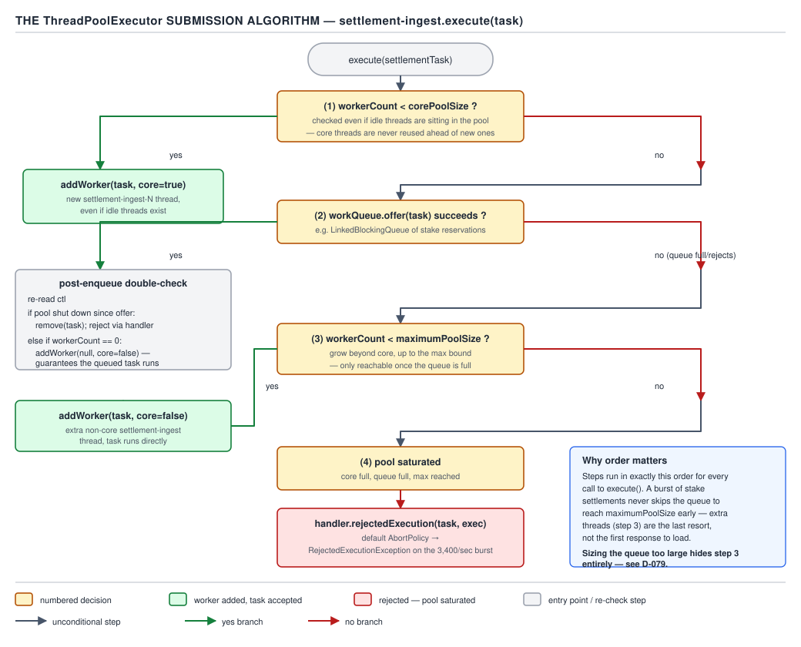
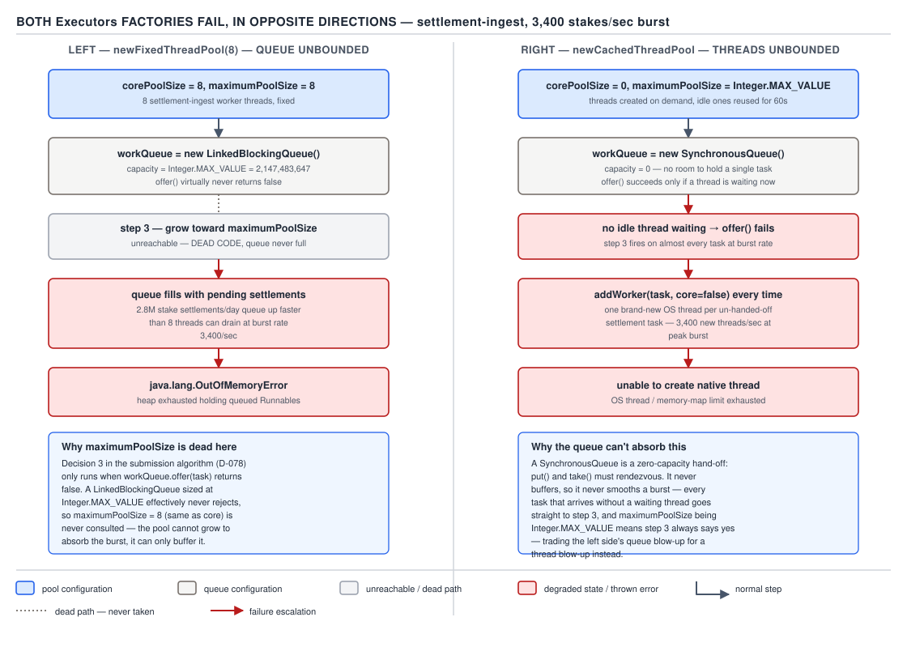

# 05 Multithreading and Concurrency — ThreadPoolExecutor — BASICS (§1.19, leaves 1.19.1–1.19.11)

**Target version: Java 21 LTS.** | **Part 1 of 5** | [Index](../00-index.md)
Previous: [The Executor framework](01-basics-executor-framework.md) · Next: [ThreadPoolExecutor — tuning, hooks and starvation](02b-basics-threadpoolexecutor-tuning.md)

`ExecutorService` gave you a task queue with a name. `ThreadPoolExecutor` is the thing that
actually decides, task by task, whether to spend a thread on it, park it in a queue, or refuse it
outright. Every production incident that starts with "the pool stopped responding" or "the box ran
out of memory" traces back to one of the eleven leaves in this file.

## The seven constructor parameters

`ThreadPoolExecutor` has exactly one designated constructor shape, and every `Executors` factory
method is just a call to it with different arguments baked in:

```java
public ThreadPoolExecutor(int corePoolSize,
                           int maximumPoolSize,
                           long keepAliveTime,
                           TimeUnit unit,
                           BlockingQueue<Runnable> workQueue,
                           ThreadFactory threadFactory,
                           RejectedExecutionHandler handler)
```

| Parameter | Meaning | Default if you go through `Executors.newXxx` |
|---|---|---|
| `corePoolSize` | Threads kept alive even when idle (unless `allowCoreThreadTimeOut`) | Varies by factory |
| `maximumPoolSize` | Hard ceiling on live worker threads | Varies by factory |
| `keepAliveTime` + `unit` | How long a thread above `corePoolSize` idles before it dies | Varies by factory |
| `workQueue` | Where a task waits when core threads are all busy | Varies by factory |
| `threadFactory` | Builds each new worker thread | `Executors.defaultThreadFactory()` |
| `handler` | What happens when the queue also refuses the task | `ThreadPoolExecutor.AbortPolicy` |

`defaultThreadFactory()` produces non-daemon threads named `pool-N-thread-M`, normal priority, no
uncaught-exception handler — which is why an unhandled exception in a task silently dies (see leaf
1.19 in the companion Executor-framework file for `submit()` swallowing exceptions, D-077).
`AbortPolicy` is the default rejection handler: it throws `RejectedExecutionException` rather than
doing anything clever, which is the right default because a silent failure mode should never be
the out-of-the-box behaviour.

**Insight:** all four `Executors` factory methods (`newFixedThreadPool`, `newCachedThreadPool`,
`newSingleThreadExecutor`, `newScheduledThreadPool`) are thin adapters over this one constructor.
Knowing the seven parameters means you can read any factory method's source and predict its
failure mode without memorising four separate names.

### The submission algorithm, in exact order

The single most-asked mechanism in this topic. When you call `execute(task)`, `ThreadPoolExecutor`
runs a strict four-step decision, always in this order, never any other:

1. **If `workerCount < corePoolSize`, start a new thread to run this task — even if idle threads
   already exist.** The check is on the *count* of workers, not on whether any of them happen to
   be idle right now.
2. **Else, try to enqueue the task** via `workQueue.offer(task)`. If the queue accepts it, done —
   the task waits.
3. **Else, if the queue rejected the offer** (it's full, or it's a zero-capacity queue with no
   waiting consumer), try to start a new thread — but only up to `maximumPoolSize`.
4. **Else** (workers are at `maximumPoolSize` and the queue rejected the offer), **invoke
   `handler.rejectedExecution(task, this)`.**



**D-078** — The `ThreadPoolExecutor` submission algorithm.

Reading the actual JDK source (`java.util.concurrent.ThreadPoolExecutor#execute`), the shape is:

```java
public void execute(Runnable command) {
    if (command == null) throw new NullPointerException();
    int c = ctl.get();
    if (workerCountOf(c) < corePoolSize) {
        if (addWorker(command, true)) return;
        c = ctl.get();
    }
    if (isRunning(c) && workQueue.offer(command)) {
        int recheck = ctl.get();
        if (!isRunning(recheck) && remove(command))
            reject(command);
        else if (workerCountOf(recheck) == 0)
            addWorker(null, false);
    }
    else if (!addWorker(command, false))
        reject(command);
}
```

Reading it line by line: `workerCountOf(c) < corePoolSize` is step 1 — `addWorker(command, true)`
passes `core = true`, meaning "only succeed if we're still under `corePoolSize`". If that add
fails (a race lost against another submitting thread), it re-reads `ctl` and falls through to step
2. `workQueue.offer(command)` is the non-blocking enqueue attempt for step 2. Everything from
`int recheck = ctl.get();` onward is the **double-check**, its own distinct box in the algorithm:
after the task is sitting in the queue, the pool re-reads its control state, because the pool could
have been shut down, or every worker could have died, in the gap between the offer succeeding and
this line running. If the pool is no longer running, it tries to `remove` the task it just enqueued
and reject it — you do not want to silently run a task queued after `shutdown()` was called. If the
pool is still running but somehow has zero workers (the last idle thread timed out and exited in
that same gap), it starts one bare worker (`addWorker(null, false)`) purely to make sure *someone*
is watching the queue — otherwise a task could sit there forever with no thread ever picking it up.
The final `else` branch is step 3 and step 4 collapsed together: `addWorker(command, false)` passes
`core = false`, meaning "succeed as long as we're under `maximumPoolSize`"; if that also fails, step
4 fires: `reject(command)` calls the configured handler.

**Why step 1 fires even when idle threads exist.** The guard is `workerCountOf(c) < corePoolSize`
— a comparison against a count, with no query anywhere in that branch for whether an existing
worker is currently idle. Concretely: a stake-settlement pool configured with `corePoolSize = 8` is
mid-startup, task #3 has just been submitted, and threads 1 and 2 are both idle, blocked on
`workQueue.take()` waiting for work. `execute()` for task #3 still creates thread 3, because
`workerCountOf(c)` reads 2, which is less than 8 — it never asks "is thread 1 idle right now?" This
is deliberate: the pool is trying to reach its steady-state core size as fast as possible during a
burst, not trying to minimise thread creation task by task. Once `workerCount` reaches
`corePoolSize`, step 1 stops firing and step 2 (enqueue) takes over — from that point on, idle
core threads pull from the queue instead of new ones being spun up.

**Interview:** "Walk me through what happens when you submit a task to a `ThreadPoolExecutor`." —
answer with the four steps in order, name the double-check, and land on why step 1 ignores
idleness. Interviewers listen for whether you say "queue first" (wrong for a cold pool) or
"threads first, up to core" (right).

## Trap — the unbounded-queue trap: `newFixedThreadPool`

`Executors.newFixedThreadPool(n)` is built as:

```java
new ThreadPoolExecutor(n, n, 0L, TimeUnit.MILLISECONDS,
                        new LinkedBlockingQueue<Runnable>());
```

`LinkedBlockingQueue`'s no-arg constructor defaults its capacity to `Integer.MAX_VALUE` —
**2,147,483,647**. `corePoolSize` and `maximumPoolSize` are both `n`, so once `n` workers are
running, step 2 of the submission algorithm (`workQueue.offer(task)`) always succeeds, because a
queue with over two billion slots essentially never returns "full". Step 3 — "add a thread up to
`maximumPoolSize`" — is consequently **unreachable code**: it can only trigger when the queue
rejects an offer, and this queue never does. `maximumPoolSize` being equal to `corePoolSize` here
is not a coincidence to note and move past; it is dead configuration, because the queue's capacity
already makes step 3 impossible regardless of what `maximumPoolSize` was set to.

**Pitfall:** the belief is "`newFixedThreadPool(8)` caps my concurrency at 8, so it's safe against
overload — extra tasks just queue up." The symptom: a stake-settlement pool sized at
`newFixedThreadPool(8)` faces a burst of 3,400 settlements/sec while the 8 workers can only drain
roughly 800/sec downstream. The gap — 2,600 tasks/sec — has nowhere to go but the queue, and the
queue has nowhere to stop growing. At 2,600 tasks/sec net accumulation, a `Runnable` object holding
a settlement request (say 200 bytes with its captured closure and queue node) adds roughly
520 KB/sec to the heap. Ten minutes of sustained burst is 3,600 seconds × 520 KB/sec ≈ 1.87 GB of
queued-but-unprocessed settlement tasks, entirely invisible to `corePoolSize` and
`maximumPoolSize` — the process degrades into GC thrashing and then `OutOfMemoryError: Java heap
space`, not a clean rejection. The fix: never take `LinkedBlockingQueue`'s no-arg constructor in
production code. Construct the executor by hand with a **bounded** queue —
`new ArrayBlockingQueue<>(500)` or `new LinkedBlockingQueue<>(500)` — so that step 3 and step 4
become reachable and overload turns into an explicit rejection (which you can retry, shed, or
alert on) instead of an unbounded memory leak.

**Why people believe it:** the name "fixed thread pool" describes the thread count, and it is
natural to assume the whole pool's resource usage is bounded by that same number — nothing in the
method name hints that the queue behind it is unbounded.

## Trap — the mirror-image bug: `newCachedThreadPool`

`Executors.newCachedThreadPool()` is built as:

```java
new ThreadPoolExecutor(0, Integer.MAX_VALUE,
                        60L, TimeUnit.SECONDS,
                        new SynchronousQueue<Runnable>());
```

`SynchronousQueue` has capacity **zero** — it has no storage cells at all; an `offer()` only
succeeds if another thread is concurrently calling `poll()`/`take()` to receive that exact
element. So for every task where no idle worker is already parked waiting to receive it, step 2
fails immediately, which means step 3 fires on essentially every submission: "add a thread up to
`maximumPoolSize`" — and `maximumPoolSize` here is `Integer.MAX_VALUE`, i.e. no practical limit at
all. The result is the opposite failure mode from `newFixedThreadPool`: instead of an unbounded
queue hiding unlimited memory growth behind a fixed thread count, this is an unbounded *thread
count* hiding behind a zero-capacity queue.



**D-079** — Both `Executors` factories fail, in opposite directions.

**Pitfall:** the belief is "`newCachedThreadPool` is safe because it reuses idle threads and only
grows when needed." True during moderate load — an idle thread is kept for 60 seconds and reused
for the next task, which is exactly what "cached" describes. It stops being true the moment
submissions outpace the rate at which any thread goes idle: each of those un-handed-off tasks
spins up a brand-new OS thread, and each platform thread reserves on the order of 1 MB of stack by
default. A burst of even 20,000 concurrent settlement-verification calls against a slow downstream
service can mean 20,000 native threads — 20,000 × 1 MB ≈ 19.5 GB of stack reservation alone,
before counting per-thread OS kernel bookkeeping. Long before the heap is threatened, the OS
refuses to hand out more native thread handles and the JVM throws
`java.lang.OutOfMemoryError: unable to create native thread`. The fix: only use
`newCachedThreadPool` for short-lived, low-volume, bursty work where you are certain the peak
concurrent count stays in the low hundreds — for anything with real burst risk, build a
`ThreadPoolExecutor` by hand with an explicit `maximumPoolSize` and a bounded queue.

**Why people believe it:** "cached" reads as "efficient reuse", and the pool genuinely does reuse
threads under normal load — the failure only shows up under exactly the kind of burst that a pool
is supposed to protect you from, so it is easy to test happily in staging and fail in production.

## The three documented queuing strategies

The `ThreadPoolExecutor` javadoc names three queueing strategies, and the two traps above are each
an accidental, unintentional instance of the first two:

| Strategy | Queue type | Effect on submission algorithm | When the javadoc recommends it |
|---|---|---|---|
| Direct handoff | `SynchronousQueue` (capacity 0) | Step 2 fails whenever no thread is waiting, so step 3 fires constantly — needs a large or unbounded `maximumPoolSize` to avoid rejecting good work | Small or unlimited-growth pools handling many short, independent tasks; requires the caller to accept possibly-unbounded thread growth |
| Unbounded queue | `LinkedBlockingQueue` with no capacity bound | Step 2 always succeeds, so step 3/4 are unreachable and `maximumPoolSize` is inert | Only when tasks are truly independent of each other **and** the submission rate is provably bounded below the service rate — the javadoc is explicit that this can still exhaust memory under load |
| Bounded queue | `ArrayBlockingQueue`, or a capacity-limited `LinkedBlockingQueue` | All four steps are live: the pool grows toward `maximumPoolSize` under sustained overload, then rejects — the only strategy where the executor's tuning knobs actually mean anything | Preventing resource exhaustion is more important than maximising throughput; javadoc: "using a smaller queue... generally allows higher throughput... but requires larger `maximumPoolSize`", the classic queue-size-versus-pool-size trade the tuning file (Part 2 of this set) works through with Little's law |

The javadoc's own framing is a direct trade-off, not a preference: a larger queue plus a smaller
`maximumPoolSize` reduces CPU usage, OS resources and context-switch overhead, at the cost of
artificially throttling throughput once the queue starts filling; a smaller queue typically
demands a larger `maximumPoolSize`, which raises scheduling overhead but keeps the pool responsive
to bursts. Neither of the two `Executors` factories above sits deliberately on this trade-off —
they each pin one axis to an extreme (queue at ∞, or pool at ∞) and leave the other dead.

## The four rejection policies

| Policy | What happens to the task | What happens to the caller | Backpressure? | Behaviour after `shutdown()` | Failure mode |
|---|---|---|---|---|---|
| `AbortPolicy` (default) | Discarded | `RejectedExecutionException` thrown synchronously in the submitting thread | Yes — the exception forces the caller to react | Same: always throws | None distinctive; loud and immediate, which is why it is the safe default |
| `CallerRunsPolicy` | Run **synchronously by the submitting thread itself**, not by a pool worker | Blocks running the task before it can submit anything else | Yes — the strongest built-in backpressure, since the source is directly slowed | **Silently discards** the task instead of running it, once the executor is shut down | A request-handling thread ends up doing background work it wasn't sized for (below) |
| `DiscardPolicy` | Silently dropped, no exception, no execution | Nothing — call returns normally | No — failure is invisible unless you instrument it | Same: silently drops | Data loss with zero signal; only acceptable for best-effort telemetry-style tasks |
| `DiscardOldestPolicy` | The **queue head** is polled off and discarded, then the new task is retried | Nothing observable unless the retry also fails | Partial — sheds load but the caller never learns what was dropped | Same: keeps discarding heads | With a **priority queue** as `workQueue`, the "head" is the highest-priority item, so this policy discards exactly the work you most wanted to keep |


**D-080** — The four rejection policies (table above).

**Pitfall:** the belief is "`CallerRunsPolicy` is strictly the safe, well-behaved choice because it
never loses work." Two things break that belief. First: if the executor backs an HTTP
request-handling thread pool, `CallerRunsPolicy` means the thread that would otherwise return an
HTTP response to a client is now blocked running a stake-settlement task that has nothing to do
with that request — request latency spikes exactly when the system is already overloaded, and it
spikes on the request path, which is the worst place for it. Second: the "never loses work"
belief is false specifically at shutdown — `ThreadPoolExecutor.CallerRunsPolicy#rejectedExecution`
checks `!e.isShutdown()` before running the task; once shutdown has begun, it does nothing at all,
and the task is gone with no exception and no log line. The fix: use `CallerRunsPolicy` only on
pools that are decoupled from a latency-sensitive caller (a background settlement-fanout pool
called from an already-async pipeline, not a request-handling thread), and if you need a signal at
shutdown, wrap it in a custom handler that logs before delegating.

**`CallerRunsPolicy` as backpressure, not failure.** The mechanism is not "the pool asks the
caller for help" in a cooperative sense — it is coercive throttling. While the caller is busy
running the rejected task itself, it cannot submit a new one, so the *rate of new submissions*
drops to match the *rate at which the caller can also double as a worker*. For QuizStakes, wiring
`CallerRunsPolicy` onto the pool that fans out `SettleStake` calls means a burst above the pool's
`maximumPoolSize` and queue capacity slows the upstream settlement dispatcher itself — the
producer feels the same back-pressure the consumer is under, instead of the two being decoupled by
an ever-growing buffer. That is a throttle, not a bug: the alternative (an unbounded queue) hides
the same overload as silent memory growth instead of visible slowdown.

## `[BUILD]` A custom `RejectedExecutionHandler`

None of the four built-ins log a metric, and only `CallerRunsPolicy` throttles without losing the
task — but it throttles the wrong thread if that thread is latency-sensitive. A pool backing
stake settlements wants: try to make room by waiting briefly, and if that still fails, drop the
task but count it so an alert can fire.

```java
package com.quizstakes.settlement.pool;

import java.util.concurrent.BlockingQueue;
import java.util.concurrent.RejectedExecutionHandler;
import java.util.concurrent.ThreadPoolExecutor;
import java.util.concurrent.TimeUnit;
import java.util.concurrent.atomic.LongAdder;

/**
 * Blocks the submitting thread for a bounded window trying to enqueue the
 * settlement task; if the queue is still full after the timeout, the task is
 * shed and counted rather than thrown from deep inside a hot path.
 */
public final class BoundedRetryThenShedHandler implements RejectedExecutionHandler {

    private final long retryTimeout;
    private final TimeUnit retryUnit;
    private final LongAdder shedCount = new LongAdder();

    public BoundedRetryThenShedHandler(long retryTimeout, TimeUnit retryUnit) {
        this.retryTimeout = retryTimeout;
        this.retryUnit = retryUnit;
    }

    @Override
    public void rejectedExecution(Runnable settlementTask, ThreadPoolExecutor pool) {
        if (pool.isShutdown()) {
            shedCount.increment();
            return;
        }
        BlockingQueue<Runnable> workQueue = pool.getQueue();
        boolean enqueued;
        try {
            enqueued = workQueue.offer(settlementTask, retryTimeout, retryUnit);
        } catch (InterruptedException e) {
            Thread.currentThread().interrupt();
            shedCount.increment();
            return;
        }
        if (!enqueued) {
            shedCount.increment();
            // In production this feeds a counter metric (e.g. Micrometer) rather
            // than being silently swallowed like DiscardPolicy.
        }
    }

    public long shedCount() {
        return shedCount.sum();
    }
}
```

This is generic across any `ThreadPoolExecutor`: it never assumes a specific task type, reads the
pool's own queue via `getQueue()`, and separates "we tried to make room" from "we gave up and
counted it" — the one thing none of the four built-ins do for you.

## Pitfalls

### Assuming `newFixedThreadPool(n)` bounds total resource usage at `n` threads

**Wrong**
```java
ExecutorService settlementPool = Executors.newFixedThreadPool(8);
// Burst: 3,400 settlements/sec submitted, downstream drains ~800/sec.
for (int i = 0; i < 100_000; i++) {
    settlementPool.execute(() -> settleStake(nextReservation()));
}
// No exception is ever thrown here — the queue just grows, silently,
// until the JVM logs OutOfMemoryError: Java heap space minutes later.
```

**Right**
```java
ExecutorService settlementPool = new ThreadPoolExecutor(
        8, 8,
        0L, TimeUnit.MILLISECONDS,
        new ArrayBlockingQueue<>(500),
        Executors.defaultThreadFactory(),
        new BoundedRetryThenShedHandler(50, TimeUnit.MILLISECONDS));
// Overload now surfaces as a bounded queue filling, then a counted,
// observable shed — not an unbounded heap leak.
```

**Why people believe it:** the method name promises a "fixed" thread count, and during any test
run short enough that the queue never gets a chance to grow past a few dozen entries, behaviour
looks identical to the bounded version — the bug only shows up under sustained real production
load.

### Assuming `CallerRunsPolicy` never loses work

**Wrong**
```java
ExecutorService pool = new ThreadPoolExecutor(
        4, 4, 0L, TimeUnit.MILLISECONDS,
        new ArrayBlockingQueue<>(100),
        new ThreadPoolExecutor.CallerRunsPolicy());
pool.shutdown();
pool.execute(() -> settleStake(reservation)); // assumed: runs on caller thread
// Actually: silently discarded, no exception, no log line.
```

**Right**
```java
RejectedExecutionHandler loggingCallerRuns = (task, executor) -> {
    if (executor.isShutdown()) {
        log.warn("Settlement task dropped after shutdown: {}", task);
        return;
    }
    task.run();
};
ExecutorService pool = new ThreadPoolExecutor(
        4, 4, 0L, TimeUnit.MILLISECONDS,
        new ArrayBlockingQueue<>(100),
        loggingCallerRuns);
```

**Why people believe it:** `CallerRunsPolicy`'s javadoc emphasises the running-on-caller behaviour
prominently and mentions the shutdown-discard case only as a secondary clause, so the common
mental model stops at "it runs the task" and never registers the shutdown carve-out.

## Cheat sheet

| Fact | Value / behaviour |
|---|---|
| Constructor parameters | `corePoolSize`, `maximumPoolSize`, `keepAliveTime`, `unit`, `workQueue`, `threadFactory`, `handler` |
| Default thread factory | `Executors.defaultThreadFactory()` — non-daemon, `pool-N-thread-M` |
| Default rejection handler | `AbortPolicy` — throws `RejectedExecutionException` |
| Submission order | (1) below core → new thread even if idle exist, (2) offer to queue, (3) queue full → new thread up to max, (4) else reject |
| Double-check | After a successful offer: re-verify still running, and ensure `workerCount > 0` |
| `newFixedThreadPool(n)` bug | `LinkedBlockingQueue` capacity `Integer.MAX_VALUE` → step 3/4 unreachable → `OutOfMemoryError` |
| `newCachedThreadPool` bug | `SynchronousQueue` (capacity 0) + `maximumPoolSize = Integer.MAX_VALUE` → unbounded thread creation → `unable to create native thread` |
| Three queueing strategies | direct handoff (`SynchronousQueue`), unbounded (`LinkedBlockingQueue`), bounded (`ArrayBlockingQueue`) |
| `AbortPolicy` | Throws, always, including after shutdown |
| `CallerRunsPolicy` | Runs on caller thread; **silently discards after `shutdown()`** |
| `DiscardPolicy` | Silent drop, no exception, no signal |
| `DiscardOldestPolicy` | Drops queue head; wrong with a priority queue — drops the highest-priority item |

## Self-test

**Q1.** A `ThreadPoolExecutor` has `corePoolSize = 4` and two of its four core threads are
currently idle. A fifth task is submitted. Does it run on an idle thread or spawn a new one — and
why?

<details><summary>Answer</summary>

It spawns a new thread. Step 1 of the submission algorithm checks `workerCount < corePoolSize`
purely as a count comparison — `workerCount` is currently under 4 (only, say, 2 or 3 threads have
been created so far if this is the 3rd or 4th submission), so a new thread is created regardless of
whether any existing thread is idle. The pool only stops creating new threads at step 1 once
`workerCount` actually reaches `corePoolSize`; idleness of existing threads plays no role in that
decision.

</details>

**Q2.** What is the "double-check" in `execute()`, and why does it exist?

<details><summary>Answer</summary>

After `workQueue.offer(command)` succeeds, the pool re-reads its control state (`ctl.get()`
again) to check two things: whether the pool is still running (if not, it removes the just-queued
task and rejects it, since a task shouldn't run after shutdown just because it slipped into the
queue in a race), and whether `workerCount` is now zero (if so, it starts one bare worker to
guarantee something will eventually pick the task up). It exists because the pool's state can
change in the gap between the successful offer and the code that follows it — shutdown could be
called, or the sole remaining idle worker could have just timed out and exited.

</details>

**Q3.** Why does `Executors.newFixedThreadPool(8)` never actually use its `maximumPoolSize` for
anything?

<details><summary>Answer</summary>

Because `corePoolSize` and `maximumPoolSize` are both set to 8, and the queue behind it is a
`LinkedBlockingQueue` with the default capacity of `Integer.MAX_VALUE`. Step 3 of the submission
algorithm — creating threads up to `maximumPoolSize` — only runs when `workQueue.offer()` fails,
and with over two billion queue slots available, that offer essentially never fails. `maximumPoolSize`
being equal to `corePoolSize` in this factory is therefore inert configuration, not a meaningful
choice.

</details>

**Q4.** A `newCachedThreadPool` is fed a sudden burst of 20,000 concurrent, slow calls. What
specifically causes the `OutOfMemoryError`, and how does its wording differ from the
`newFixedThreadPool` failure?

<details><summary>Answer</summary>

`newCachedThreadPool` uses a `SynchronousQueue` (capacity zero) with `maximumPoolSize =
Integer.MAX_VALUE`. Every task that cannot be handed off to an already-waiting idle thread fails
its queue offer immediately, which pushes the submission algorithm to step 3, creating a brand new
OS thread — with no ceiling. Each platform thread reserves roughly 1 MB of stack by default, so
20,000 threads is on the order of 19.5 GB of stack reservation, and the OS typically refuses to
create more native threads before the heap itself is exhausted. The resulting error is
`OutOfMemoryError: unable to create native thread`, distinct from the `Java heap space` variant
that `newFixedThreadPool`'s unbounded queue produces.

</details>

**Q5.** Why is `CallerRunsPolicy` described as backpressure rather than as a failure-handling
policy?

<details><summary>Answer</summary>

Because the task still gets executed — just by the thread that tried to submit it, not by a pool
worker. While that submitting thread is busy running the rejected task, it cannot submit further
work, which mechanically slows the rate of new submissions down to something the caller itself can
sustain. It couples the producer's rate to the consumer's capacity instead of letting a growing
buffer hide the mismatch, which is exactly what backpressure means.

</details>

**Q6.** What does `CallerRunsPolicy` do if the executor has already had `shutdown()` called on it,
and why is that surprising?

<details><summary>Answer</summary>

It does nothing at all — the task is silently discarded, not run and not reported. It is
surprising because the policy's defining behaviour (run the task on the caller) makes it feel like
the "safe, no-work-lost" option, but its javadoc-documented implementation checks
`!executor.isShutdown()` first and only falls through to running the task if that check passes; in
the false case there is no exception, no log line, and no signal that work was dropped.

</details>

**Q7.** Why is `DiscardOldestPolicy` especially dangerous when the work queue is a priority queue?

<details><summary>Answer</summary>

`DiscardOldestPolicy` always removes whatever is at the queue's head and then retries the offer.
For a FIFO queue, the head is simply the longest-waiting item, which is a defensible thing to
sacrifice under overload. For a priority queue, the head is defined by priority ordering, not
arrival order — it is the *highest*-priority item currently waiting. So the policy ends up
discarding exactly the task you most wanted to protect, which is the opposite of what "discard
oldest" sounds like it should do.

</details>

**Q8.** Name the three queueing strategies from the `ThreadPoolExecutor` javadoc and the trade-off
each one makes.

<details><summary>Answer</summary>

Direct handoff (`SynchronousQueue`, capacity zero) hands a task straight to a waiting thread or
else immediately forces the pool to consider growing, so it needs a generous or unbounded
`maximumPoolSize`. Unbounded queue (`LinkedBlockingQueue` with no capacity limit) lets tasks queue
indefinitely, which keeps the thread count perfectly stable but risks unbounded memory growth if
submission ever outpaces service for a sustained period. Bounded queue (`ArrayBlockingQueue` or a
capacity-limited `LinkedBlockingQueue`) is the only one where growing the pool toward
`maximumPoolSize` under sustained load, and rejecting once that's exhausted too, actually happens —
at the cost of needing to size both the queue and `maximumPoolSize` deliberately.

</details>

---

**Leaves covered:** 1.19.1–1.19.11 (11 leaves)
**Leaves deferred:** none
**Diagrams included:** D-078, D-079, D-080
**Target version:** Java 21 LTS
**Lines:** 520
