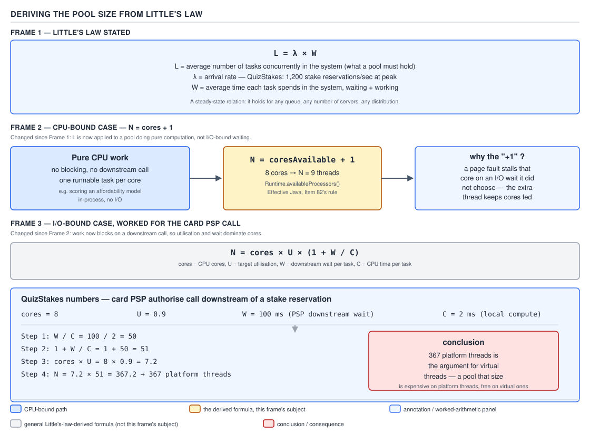
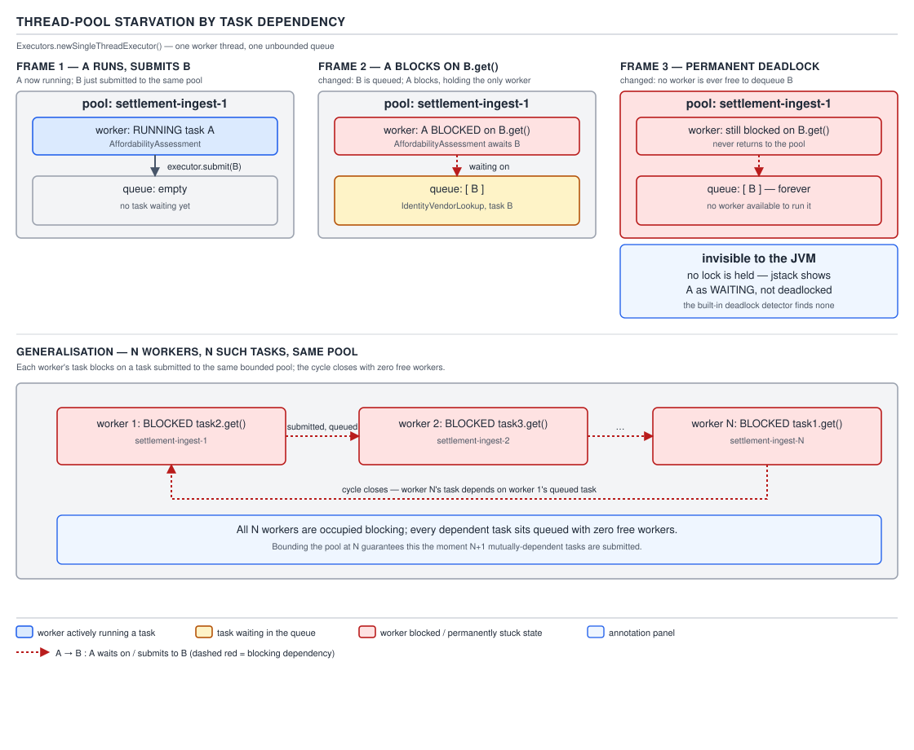

# 05 Multithreading and Concurrency — ThreadPoolExecutor — BASICS (§1.19, leaves 1.19.12–1.19.22)

**Target version: Java 21 LTS.** | **Part 1 of 5** | [Index](../00-index.md)
Previous: [ThreadPoolExecutor — the submission algorithm](02a-basics-threadpoolexecutor-submission.md) · Next: [Scheduled executors](03-basics-scheduled-executors.md)

The submission algorithm from the previous file tells you what happens to one task. This file is
about the pool as a whole: the knobs that reshape it at runtime, the hooks observing every task
crossing its boundary, how many threads it should actually have, and the one mistake that turns a
pool into a silent, permanent deadlock.

## The dynamic knobs and the three protected hooks

### Mental model

A `ThreadPoolExecutor` is not a fixed object configured once and forgotten. Every number passed to
the constructor — core size, max size, keep-alive — is a live field with a public setter, re-read
continuously while the pool runs: less a sealed appliance, more a thermostat you can turn while the
room is occupied. Layered on top, three `protected` methods — `beforeExecute`, `afterExecute`,
`terminated` — are the pool's equivalent of `Filter` interceptors: nothing runs on a pool thread
without passing through them.

### Why they exist

Before these hooks, the only way to instrument a pool was wrapping every submitted `Runnable` in a
timing/logging decorator — easy to forget at one call site, impossible to retrofit onto tasks from
library code you do not own. `ApplicationGateway` routes onboarding, activation, deposit and stake
calls through a shared pool; hand-wrapping guarantees one route eventually loses the trace id. The
hooks move the concern from "every call site" to "the pool itself."

`allowCoreThreadTimeOut` and `prestartCoreThread` solve a narrower problem: core threads normally
live forever, even idle — wasted memory (~1 MB of stack each) for a pool busy in bursts and silent
for hours (`ApplicationGateway` serves 12k registrations/day steady, 40k/day peak) — and wrong in
the other direction too: a cold pool pays full `Thread` construction cost on a burst's first tasks.

### When to reach for each, and when not

- **`allowCoreThreadTimeOut(true)`** — for a pool collectable to zero threads in idle windows. Skip
  it on steady-load pools, where the resulting thread churn beats the point of pooling.
- **`prestartCoreThread()` / `prestartAllCoreThreads()`** — right after constructing a pool that
  will face load immediately. Skip it for a pool that will sit idle a while first.
- **The three hooks** — cross-cutting instrumentation: MDC/trace propagation, per-task timing, and
  the standard fix for `submit()` swallowing exceptions into an unread `Future`. Do not use them to
  change *what* a task does — that is a job the `Executor` abstraction is meant to keep out of the
  pool.

### How it works

The dynamic setters mutate fields the pool's worker-management code re-reads on every pass through
its run loop. Calling `setCorePoolSize` downward does not kill threads immediately — excess idle
core threads time out and exit on their next `getTask()` poll once `allowCoreThreadTimeOut` (or
max-size overflow) makes them eligible for reaping. `prestartCoreThread()` calls the same internal
`addWorker(null, true)` used by ordinary submission, without a task attached — the thread parks
immediately in `getTask()`'s poll, ready for the first real submission with zero cold-start latency.

The three hooks are called from `runWorker(Worker w)`, the loop every pool thread executes for its
entire lifetime — the JDK source, abbreviated to the hook call sites, reads
`beforeExecute(wt, task); try { task.run(); afterExecute(task, null); } catch (Throwable ex) {
afterExecute(task, ex); throw ex; }`, wrapped in a `finally` that always clears `task`, bumps
`w.completedTasks`, and unlocks the worker — even after a veto or a throw.

`beforeExecute(Thread t, Runnable r)` runs immediately before `task.run()` and may throw to veto
execution (the task is abandoned; `afterExecute` never runs for it). `afterExecute(Runnable r,
Throwable t)` runs after `run()` returns or throws, with the exception passed explicitly — but only
for `execute()`; a `submit()` task is wrapped in a `FutureTask` whose `run()` catches everything, so
`t` arrives `null` even on failure. `terminated()` runs once, after every worker exits following
`shutdown()`/`shutdownNow()` — the pool's own destructor for resources that outlive every task.

**Insight:** the hooks run on the *worker* thread, not the submitting thread — anything they touch
(MDC, a `ThreadLocal`) is pool state, not request state. A trace id must be captured from the
submitting thread *at submission time* and carried on the task object, because by the time
`beforeExecute` runs, the worker thread's MDC still holds whatever the *previous* task left behind.

### A minimal concrete example

`ApplicationGateway` routes every onboarding and activation call through a shared pool. Requests
arrive with a trace id already in MDC (set by the ingress filter); the pool must carry that id
across the thread boundary so downstream log lines from `AccountOpening`, `AssessmentService` and
`DocumentVerification` code all share it, and must never let an exception thrown inside a task
vanish silently into an unread `Future`.

```java
package com.quizstakes.gateway.executors;

import org.slf4j.Logger;
import org.slf4j.LoggerFactory;
import org.slf4j.MDC;

import java.util.concurrent.*;

/** Carries the ApplicationGateway's MDC trace id across the pool boundary, and logs any
  * exception that would otherwise be swallowed by submit()'s Future. */
public final class TraceCarryingExecutor extends ThreadPoolExecutor {
    private static final Logger log = LoggerFactory.getLogger(TraceCarryingExecutor.class);

    public TraceCarryingExecutor(int coreSize, int maxSize, long keepAliveSeconds,
                                  BlockingQueue<Runnable> queue, ThreadFactory threadFactory,
                                  RejectedExecutionHandler rejectionHandler) {
        super(coreSize, maxSize, keepAliveSeconds, TimeUnit.SECONDS, queue, threadFactory, rejectionHandler);
    }

    /** Wraps every submitted task so the caller's trace id travels with it. */
    private record TracedTask(Runnable delegate, String traceId) implements Runnable {
        @Override public void run() { delegate.run(); }
    }

    @Override public void execute(Runnable command) {
        super.execute(new TracedTask(command, MDC.get("traceId")));
    }

    @Override protected void beforeExecute(Thread workerThread, Runnable task) {
        if (task instanceof TracedTask traced && traced.traceId() != null) {
            MDC.put("traceId", traced.traceId());
        }
    }

    @Override protected void afterExecute(Runnable task, Throwable thrown) {
        // submit() wraps the task in a FutureTask, which swallows the exception into
        // the Future instead of throwing it here — unwrap it explicitly so it is never lost.
        if (thrown == null && task instanceof Future<?> future && future.isDone()) {
            try {
                future.get();
            } catch (ExecutionException e) {
                thrown = e.getCause();
            } catch (InterruptedException e) {
                Thread.currentThread().interrupt();
            }
        }
        if (thrown != null) log.error("ApplicationGateway task failed", thrown);
        MDC.remove("traceId");
    }

    @Override protected void terminated() {
        log.info("ApplicationGateway pool fully terminated");
    }
}
```

This is the same shape as the JDK javadoc's own worked example, `PausableThreadPoolExecutor`, which
overrides `beforeExecute` to block newly-dispatched tasks on a `ReentrantLock`/`Condition` pair
while the pool is "paused" (`while (isPaused) unpaused.await();` inside the lock), and
`terminated()` to `signalAll()` any thread waiting on `awaitTermination` — the JDK's own canonical
proof that `beforeExecute` may legitimately block the worker before the task runs, not just log.

Alongside the hooks, `AssessmentService`'s pool prestarts its cores at startup to skip cold-start
latency on the first post-deploy wave, and shrinks to zero threads outside peak hours:

```java
ThreadPoolExecutor affordabilityPool = new ThreadPoolExecutor(
        8, 8, 60, TimeUnit.SECONDS, new LinkedBlockingQueue<>(500), namedThreadFactory);
affordabilityPool.allowCoreThreadTimeOut(true);
affordabilityPool.prestartAllCoreThreads();
```

### The gotcha

`allowCoreThreadTimeOut(true)` with a too-short keep-alive means the pool reaps a core thread the
instant it finds the queue empty — including one that just picked up work seconds ago under a
burst — then oscillates between spinning up and tearing down threads, paying construction cost on
almost every task. Set keep-alive to comfortably outlast the typical gap between traffic bursts.

### The definition

> The dynamic knobs (`setCorePoolSize`, `allowCoreThreadTimeOut`, `prestartCoreThread`) let a
> running pool's shape react to load without a restart; the three protected hooks
> (`beforeExecute`/`afterExecute`/`terminated`) are the pool's only sanctioned interception points
> for cross-cutting concerns that must apply to every task regardless of call site.

Two supporting facts belong here, both mechanism-only.

**The monitoring surface.** `getPoolSize()`, `getActiveCount()`, `getLargestPoolSize()`,
`getTaskCount()`, `getCompletedTaskCount()`, `getQueue()`, `remove(Runnable)` and `purge()` expose
the pool's counters for dashboards. **Pitfall:** every count is taken without the pool's main lock —
"for monitoring purposes only," per the javadoc — and can be transiently inconsistent under
concurrent submission. Treat them as a dashboard gauge, never a correctness precondition.
`getQueue()` returns the *live* queue; `remove(Runnable)`/`purge()` (drops cancelled `Future`s)
mutate it directly and are safe alongside the pool's own polling.

> A monitoring accessor on `ThreadPoolExecutor` is a best-effort gauge, not a lock-consistent
> read — never branch program logic on it.

## Pool sizing derived from Little's law

### Mental model

Every pool has a right-sized thread count, and it is derivable, not guessable. Picture a factory
floor with `N` workers (threads) and `N_cpu` machines (cores) they share. If a worker's job is pure
machine time, one worker per machine (plus a spare) keeps every machine busy. If a worker's job is
mostly *waiting* for a machine elsewhere — a downstream call, a disk read — one worker per machine
massively under-uses the floor, because most workers are standing at a phone booth, not a machine.

### Why it exists

Before this derivation, pool sizes get picked by folklore — "twice the cores," "a hundred should be
plenty" — and both directions are expensive: too few threads under-utilises CPU while requests
queue behind a downstream call with spare capacity of its own; too many adds overhead for no
throughput gain once cores saturate. `AssessmentService`'s affordability check is exactly the
workload folklore fails on: 2 ms of local compute against a ~100 ms downstream wait.

### When to reach for each formula, and when not

- **CPU-bound:** `N = N_cpu + 1` — pure computation, no blocking I/O. The `+1` is not superstition:
  even a "pure compute" task occasionally blocks on a page fault, and the extra thread absorbs that
  gap without leaving a core idle.
- **I/O-bound:** `N = N_cpu × U_target × (1 + W/C)` — most wall time spent waiting outside the CPU
  (identity vendor, PSP round trip). The CPU-bound formula here starves the downstream call of
  concurrency it could use; the I/O-bound formula on CPU-bound work over-provisions once saturated.
- Neither formula answers "how big should the queue be" — that is a separate trade-off.

### How it works — deriving the formula, not quoting it

Little's law states, for any stable queueing system: `L = λ × W` — the average number of items *in
the system* equals the arrival rate times the average time each item spends in the system. Apply
it to a single core. Let `C` be the compute time an I/O-bound task needs from that core, and `W`
the time it spends waiting on the downstream call per invocation. To hold the core at target
utilisation `U` (the fraction of wall-clock time doing real work), it must be handed compute-only
work at throughput `λ_core = U / C`.

Every task at that throughput spends `(W + C)` total time in the system — waiting, then computing.
By Little's law, the average number of tasks concurrently in flight against one core is:

```
L_core = λ_core × (W + C) = (U / C) × (W + C) = U × (1 + W/C)
```

Each of those "tasks in flight" needs its own thread — one is computing on the core, the rest are
parked waiting on the downstream call, each occupying a thread but no CPU. Multiply by the number
of cores to get the pool-wide thread count:

```
N_threads = N_cpu × U × (1 + W/C)
```

That is the formula from leaf 1.19.17, arrived at from Little's law rather than quoted from a
textbook. Now work it for `AssessmentService`'s affordability check against the identity vendor:
`N_cpu = 8` cores, target utilisation `U = 0.9`, downstream wait `W = 100 ms`, local compute
`C = 2 ms`.

```
W / C        = 100 / 2  = 50
1 + W/C      = 1 + 50   = 51
N_cpu × U    = 8 × 0.9  = 7.2
N_threads    = 7.2 × 51 = 367.2  →  367  (floor to a whole thread)
```



**D-081** — Deriving the pool size from Little's law: the law stated, the CPU-bound `cores + 1`
case, and the I/O-bound case worked to 367 for `AssessmentService`.

### A minimal concrete example

```java
double targetUtilisation = 0.9;
long downstreamWaitMillis = 100;   // identity-vendor p50, worst realistic single call
long localComputeMillis = 2;       // local scoring compute per assessment
int cores = Runtime.getRuntime().availableProcessors();      // 8 in this deployment

int ioBoundPoolSize = (int) Math.floor(
        cores * targetUtilisation * (1.0 + (double) downstreamWaitMillis / localComputeMillis));
// ioBoundPoolSize == 367; cpuBoundPoolSize would simply be cores + 1 == 9
```

### The gotcha

367 platform threads is not a number to provision casually — at ~1 MB of reserved stack each, that
is over 350 MB of stack space for one downstream call, before counting the scheduling overhead of
367 OS threads contending for 8 cores. The formula is honestly derived and honestly expensive to
satisfy with platform threads — **367 platform threads is the argument for virtual threads**: a
virtual-thread-per-task executor pays none of that stack cost, because blocking on `W` unmounts the
virtual thread from its carrier instead of occupying an OS thread.

**Interview:** "Size a pool for a 100 ms downstream call, 2 ms local work" — derive the formula
live, plug the numbers, then note the count itself argues for virtual threads.

### The definition

> Pool size for I/O-bound work follows from Little's law as `N = N_cpu × U × (1 + W/C)`; pool size
> for CPU-bound work is `N_cpu + 1`. Both are derived from the ratio of waiting to computing, not
> chosen by convention.

## `availableProcessors()` in a container

### Mental model

`Runtime.getRuntime().availableProcessors()` looks like a hardware query, but every formula above
is only correct if the number reflects what the JVM can *actually* use, not what the physical host
has. A 64-core host running a container capped to 2 CPUs is not a 64-core machine from the JVM's
point of view — treating it as one over-provisions every pool built from this call by 32×.

### Why it exists, and the version history

Before JDK 10, `availableProcessors()` unconditionally reported the *host's* processor count — a
thin wrapper over the OS's CPU-count API, blind to cgroups (the Linux mechanism containers use to
cap CPU) unless the JVM goes looking. Every pool sized off it on an early-JDK, containerised
`ApplicationGateway` node silently oversized itself to the host's core count.

Container awareness landed in JDK 10 (backported to 8u191): the JVM detects a cgroup, reads the
container's CPU quota/period or cpuset, and `availableProcessors()` reports the *effective*
container limit. `-XX:+UseContainerSupport` is default-on from JDK 11; `-XX:ActiveProcessorCount=N`
lets an operator override the detected value outright. cgroup v2 support arrived in JDK 15, and
`JDK-8281571` removed CPU *shares* (a relative-weighting mechanism, not a hard cap) from the
computation, since sizing off shares made the count depend on what else was on the node.

`**[VERSION-TRAP]**` this behaviour is stable, not newly changed, across Java 22–25 — no further
change to the container-awareness logic was found in the JDK 22–25 release notes or `openjdk/jdk`
tracking beyond the shares removal already folded into the 21 baseline.

### When to reach for it, and when not

Call `availableProcessors()` at pool-construction time, never cache it into a `static final` — a
container's CPU limit can change under a live resize (Kubernetes VPA). Do not use it to size a pool
against a fixed business quota (the identity vendor's 600/min estate-wide cap has nothing to do with
core count) — that belongs in configuration.

`[X-REF 06]` cgroup quota/period mechanics and `os::active_processor_count`'s rounding are covered
in the JVM-internals guide (06). `[X-REF 19]` aligning Kubernetes CPU requests/limits with
`-XX:ActiveProcessorCount` is covered in the deployment/tuning guide (19).

### How it works, in one paragraph

At startup the JVM checks whether it is inside a cgroup and, if so, reads the container's CPU quota
and period (v1) or `cpu.max` (v2). `os::active_processor_count()` divides quota by period, rounds
to a whole CPU count, and `availableProcessors()` returns that instead of the host's raw core count.

### A minimal concrete example

```java
// recomputed at pool-build time, not cached, so a live CPU-limit resize is honoured
int effectiveCores = Runtime.getRuntime().availableProcessors(); // container-aware since JDK 10
int ioBoundPoolSize = (int) Math.floor(effectiveCores * targetUtilisation * (1.0 + waitMillis / computeMillis));
```

Run this inside an `ApplicationGateway` pod capped to `2` CPUs and it returns a pool sized for 2
effective cores, not the host node's 64 — exactly the number every formula above depends on being
correct.

### The gotcha

A CPU **limit** (a hard quota) throttles the container once hit; a CPU **request** merely reserves
scheduling priority and does not cap detection the same way. A pool sized against a generous request
but a tight limit looks correctly sized yet gets CPU-throttled under load regardless — a symptom no
`ThreadPoolExecutor` counter surfaces, since throttling happens below the JVM entirely.

### The definition

> `Runtime.getRuntime().availableProcessors()` has been cgroup-aware since JDK 10 (default-on since
> 11, cgroup v2-aware since 15) and returns the container's effective CPU count, not the host's —
> every pool-sizing formula is only correct if this call, not the host's `nproc`, is what fed it.

**The bulkhead argument**: once a pool is sized for *one* downstream call's latency profile, mixing
in a second, unrelated call defeats the sizing — a slow identity-vendor call (p99 38 s) sharing a
pool with a fast card-PSP call (p99 11 s) lets vendor calls occupy every thread and starve the PSP
calls entirely. The fix is a dedicated pool per dependency. `[X-REF 20]` the full pattern, including
independent sizing and circuit breakers per pool, is in the resilience-patterns guide (20).

## Thread-pool starvation by task dependency

### Mental model

Every pool assumes a task, once started, finishes using only resources *outside* the pool. The
moment a task submits a second task to its *own* pool and blocks on that result, the assumption
breaks — the running task now depends on a resource (a free worker) only the pool can supply, and
has no way to know it. Picture a one-lane bridge: a car stops mid-span, waves a second car onto the
same lane — neither can ever move again.

### Why this matters

It produces a deadlock the JVM's own detector cannot see. `jstack`/`jcmd` detection walks threads
waiting on **monitors** or **locks** held by other threads; a thread parked in `Future.get()` on a
queued task is waiting on a *scheduling* resource, not a lock — the dump shows every thread as
`WAITING`, never a detected cycle, while the pool is in fact permanently stuck.

### When this actually happens, and how to avoid it

It happens whenever a task on pool `P` submits a dependent task back to `P` and blocks on its
result — directly via `future.get()`, or via a producer/consumer pair sharing `P` with a bounded
queue. `AssessmentService`'s affordability check is the realistic version: if the affordability
task submitted its identity-vendor lookup to that *same* gateway pool and `.get()`-ed on it, a burst
of concurrent checks fills every worker with a blocked `.get()`, and the vendor-lookup sub-tasks sit
queued with no worker ever free — permanent deadlock, invisible below the burst threshold in
testing. The fix: give the lookup **its own** dedicated pool.

### How it works

With a single-thread executor the mechanism is direct: task `A` calls `pool.submit(B)` then
`B_future.get()`. `B` is enqueued since the one thread is occupied running `A`; `A` blocks waiting
for `B`, but `B` can only run once a worker frees up — permanently occupied by `A`'s blocked call.

```java
// broken — classic single-thread-executor self-submission deadlock
ExecutorService affordabilityPool = Executors.newSingleThreadExecutor();
Future<VendorVerdict> lookup = affordabilityPool.submit(() -> {
    Future<VendorVerdict> vendorCall = affordabilityPool.submit(() -> callIdentityVendor(applicationId));
    return vendorCall.get();   // blocks forever: no thread left to run vendorCall
});
```

Generalising to `N` threads changes only the arithmetic: submit `N` tasks, each submitting a
dependent task to the same `N`-thread pool and blocking on it — the pool deadlocks once concurrently
blocked outer tasks reach the pool's thread count, however large that count is.



**D-082** — Thread-pool starvation by task dependency: the single-thread case where task `A` blocks
on task `B` in the same pool, and the general `N`-thread, `N`-task case.

A bounded-queue variant needs no `.get()`: producer and consumer tasks share one pool with a bounded
queue, and the producer outpaces the consumer (itself on the same pool) — once the queue fills and
every worker runs producer tasks, the consumer may never get a slot, and rejections fire instead of
the backlog draining. Same root cause, expressed as queue starvation rather than a blocked `get()`.

### A minimal concrete example, fixed

```java
// fixed — the identity-vendor lookup gets its own pool, so the AssessmentService
// task blocking on it can never be blocked by a worker shortage in that same pool
ExecutorService affordabilityPool = Executors.newFixedThreadPool(8);
ExecutorService identityVendorPool = Executors.newFixedThreadPool(4); // sized off leaf 1.19.17's math, not this one

Future<AffordabilityVerdict> assessment = affordabilityPool.submit(() -> {
    Future<VendorVerdict> vendorCall = identityVendorPool.submit(() -> callIdentityVendor(applicationId));
    VendorVerdict verdict = vendorCall.get(); // safe: identityVendorPool has independent workers
    return scoreAffordability(applicationId, verdict);
});
```

### The gotcha

**Pitfall:** the belief is "a fixed-size pool with enough threads can't deadlock — deadlocks need
locks." The symptom: a pool runs fine below some concurrency threshold, then wedges permanently the
moment enough requests each spawn a same-pool dependent task — `jstack` shows every thread
`WAITING`, no cycle. The fix is structural: never let a task on pool `P` block on a task also on `P`.

### The definition

> Thread-pool starvation by task dependency is a deadlock produced when a task blocks on the
> result of a dependent task submitted to its own pool, exhausting every worker before the
> dependent task can run — invisible to lock-based deadlock detection because no lock is held or
> awaited anywhere in the cycle.

The `finalize()`-based auto-shutdown is the last supporting fact here, and it is version-sensitive.
`[VERSION-TRAP]` older `ThreadPoolExecutor` versions shut a pool down from `finalize()` once
unreferenced, as a safety net against a leaked pool. Gone in two stages: deprecated in JDK 9, then
respecified to do nothing at all from **JDK 11** onward — the auto-shutdown *behaviour* actually
stopped in 11, two versions after the deprecation. Deprecated for removal under JEP 421 in JDK 18,
with removal slated for JDK 27. On Java 21, a dropped, un-shut-down pool simply leaks its threads
forever. `**Unverified:**` the JDK 27 removal timeline comes from an `inside.java` quality-outreach
post, not a shipped release note, since JDK 27 has not released as of this writing.

## Pitfalls

### Assuming a fixed-size pool with no locks anywhere cannot deadlock

**Wrong**

```java
ExecutorService affordabilityPool = Executors.newFixedThreadPool(8);
for (Application app : batch) {   // batch.size() >= 8 wedges the pool permanently — no exception, no log line
    affordabilityPool.submit(() -> {
        Future<VendorVerdict> vendorCall = affordabilityPool.submit(() -> callIdentityVendor(app.id()));
        return scoreAffordability(app.id(), vendorCall.get());
    });
}
```

**Right**

```java
ExecutorService affordabilityPool = Executors.newFixedThreadPool(8);
ExecutorService identityVendorPool = Executors.newFixedThreadPool(4);
for (Application app : batch) {
    affordabilityPool.submit(() -> {
        Future<VendorVerdict> vendorCall = identityVendorPool.submit(() -> callIdentityVendor(app.id()));
        return scoreAffordability(app.id(), vendorCall.get());
    });
}
```

**Why people believe it:** textbook deadlock is two threads each holding a lock the other wants. A
self-submission deadlock has no lock anywhere, so it reads as "not a deadlock" until it wedges.

### Trusting `getActiveCount()`/`getQueue().size()` as a correctness precondition

**Wrong**

```java
if (pool.getActiveCount() < pool.getMaximumPoolSize()) {
    pool.submit(criticalTask); // "there's definitely a free slot" — not guaranteed under concurrent submission
}
```

**Right**

```java
// let the pool's own bounded-queue + rejection-handler pair make the accept/reject decision;
// don't pre-check monitoring counters and race the pool's own internal state
try {
    pool.submit(criticalTask);
} catch (RejectedExecutionException e) {
    handleBackpressure(criticalTask, e);
}
```

**Why people believe it:** the getters look like ordinary field reads, and the javadoc's
"approximate" caveat is easy to skim past when counters *look* consistent in manual testing.

## Cheat sheet

| Knob / hook | Purpose | Key caveat |
|---|---|---|
| `allowCoreThreadTimeOut(true)` | lets idle core threads time out to zero | wrong for steady-load pools — causes churn |
| `prestartCoreThread()` / `prestartAllCoreThreads()` | avoids cold-start latency on first N tasks | only useful right before load begins |
| `beforeExecute(Thread, Runnable)` | runs before `task.run()`; can veto by throwing | runs on worker thread — carry state via the task object |
| `afterExecute(Runnable, Throwable)` | runs after `run()`; `Throwable` is `null` for `submit()` failures | must `Future.get()` to unwrap swallowed exceptions |
| `terminated()` | runs once, after every worker exits | pool's destructor-equivalent for pool-scoped resources |
| `getPoolSize`/`getActiveCount`/etc. | monitoring only | approximate, no global lock — never branch logic on them |
| CPU-bound sizing | `N = cores + 1` | `+1` covers page-fault stalls |
| I/O-bound sizing | `N = cores × U × (1 + W/C)` | derived from Little's law; 8×0.9×51 = 367 for W=100ms, C=2ms |
| `availableProcessors()` | cgroup-aware since JDK 10, default-on since 11 | call at pool-build time, never cache statically |
| Self-submission starvation | task blocks on a dependent task in its own pool | invisible to lock-based deadlock detection — use a separate pool |
| `finalize()` auto-shutdown | deprecated JDK 9, no-op since JDK 11, removal-deprecated JDK 18 | an unshut-down pool on 21 leaks threads forever |

## Self-test

**Q1.** Why does `afterExecute`'s `Throwable` argument arrive as `null` even when a task submitted
via `submit()` actually threw?

<details><summary>Answer</summary>

`submit()` wraps the task in a `FutureTask`, whose `run()` method catches every exception and
stores it inside the `Future` rather than letting it propagate out of `task.run()`. Since
`afterExecute` is passed whatever exception escaped `run()`, and nothing escaped, it sees `null`.
The fix is to check `task instanceof Future<?> f` in `afterExecute` and call `f.get()` inside a
try/catch to unwrap the stored exception explicitly.

</details>

**Q2.** Derive the I/O-bound pool-size formula from Little's law in one line of reasoning.

<details><summary>Answer</summary>

To hold one core at target utilisation `U`, feed it compute-only work at throughput `λ = U/C`.
Each task at that throughput occupies the system for `(W + C)` time. By Little's law, `L = λ ×
(W+C) = U × (1 + W/C)` tasks are in flight per core; multiply by `N_cpu` cores to get
`N_threads = N_cpu × U × (1 + W/C)`.

</details>

**Q3.** Why is a thread-pool self-submission deadlock invisible to `jstack`'s deadlock detector?

<details><summary>Answer</summary>

`jstack` detects cycles of threads waiting on monitors/locks held by other threads. A thread parked
in `Future.get()` on a queued task is waiting on a scheduling resource (a free worker), not a lock
held by any thread — every thread simply shows as `WAITING`, with no lock-owner edge to trace.

</details>

**Q4.** Why does `-XX:ActiveProcessorCount` exist if the JVM already detects the container's CPU
quota automatically?

<details><summary>Answer</summary>

Detection maps a container's CPU quota/period onto a whole-number core count via a fixed formula,
which does not always align with the orchestrator's own request/limit intent — an override lets a
deployment force a specific value when the detected number would otherwise misprovision every pool.

</details>

**Q5.** What actually happens to a `ThreadPoolExecutor` on Java 21 if it is dropped without ever
calling `shutdown()`?

<details><summary>Answer</summary>

Nothing reclaims it. The `finalize()`-based auto-shutdown safety net was deprecated in JDK 9 and
respecified to a no-op from JDK 11 onward, so an unreferenced, never-shut-down pool on 21 simply
leaks its worker threads for the life of the JVM.

</details>

**Q6.** Why is 367 platform threads, correctly derived by Little's law, itself an argument for
switching that workload to virtual threads?

<details><summary>Answer</summary>

Each platform thread reserves roughly 1 MB of stack by default, so 367 of them cost over 350 MB of
memory plus scheduling overhead for 8 physical cores, purely to keep threads parked waiting on a
downstream call. A virtual-thread-per-task executor unmounts the virtual thread from its carrier
while it blocks, so the same workload needs no capacity formula and no equivalent memory cost.

</details>

---

**Leaves covered:** 1.19.12–1.19.22 (11 leaves)
**Leaves deferred:** none
**Diagrams included:** D-081, D-082
**Target version:** Java 21 LTS
**Lines:** 599
