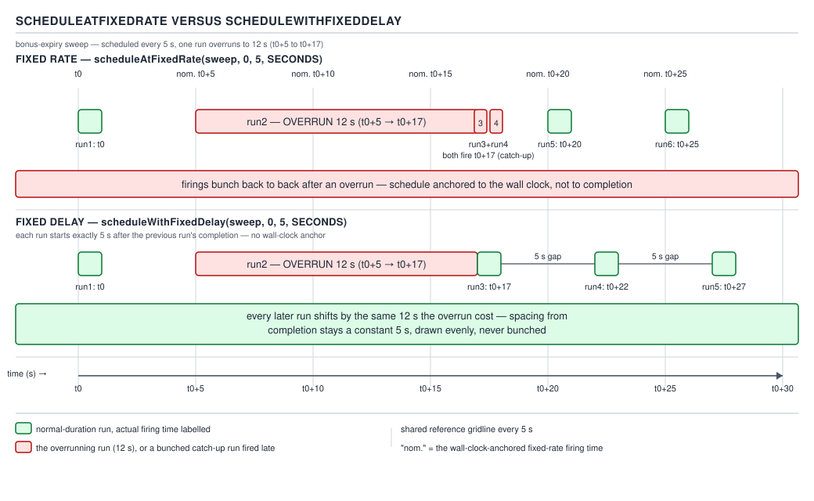
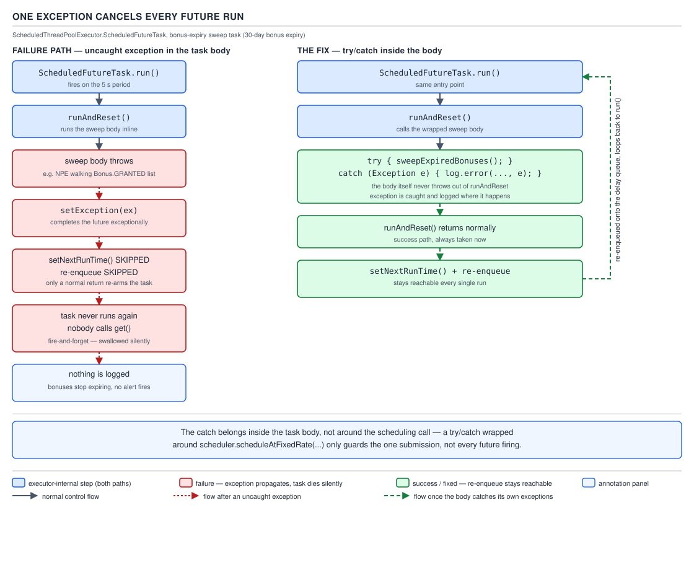

# 05 Multithreading and Concurrency — Scheduled executors — BASICS (§1.20)

**Target version: Java 21 LTS.** | **Part 1 of 5** | [Index](../00-index.md)
Previous: [ThreadPoolExecutor — tuning, hooks and starvation](02b-basics-threadpoolexecutor-tuning.md) · Next: [CompletableFuture — composition](../completable-future/01a-basics-composition.md)

QuizStakes runs a bonus-expiry sweep: bonuses expire 30 days from grant, and any
unspent bonus reverses to `PROMOTIONAL_EXPENSE`. The sweep runs every 5 seconds via
`ScheduledThreadPoolExecutor`. This file walks that job through the class's sharp
edges — pacing, exceptions, pool sizing, queue hygiene — using one run that
overruns to 12 seconds as the running example.

`ScheduledThreadPoolExecutor` sits in the executor family like this:

| Type | Extends / implements | What it adds |
|---|---|---|
| `ThreadPoolExecutor` | `AbstractExecutorService` | fixed/cached/single pool sizing, work queue, rejection policy |
| `ScheduledThreadPoolExecutor` | `ThreadPoolExecutor`, `ScheduledExecutorService` | delay/period semantics, a heap-backed `DelayedWorkQueue` |
| `Executors.newScheduledThreadPool(n)` | factory | returns a `ScheduledThreadPoolExecutor` with `corePoolSize = n` |
| `Executors.newSingleThreadScheduledExecutor()` | factory | same class with `corePoolSize = 1`, wrapped to block reconfiguration |

It is a `ThreadPoolExecutor` with one job swapped out: instead of a `LinkedBlockingQueue` of
ready-to-run tasks, its queue is a `DelayedWorkQueue` — a binary min-heap ordered by "when is
this task next due". Everything else — worker threads, `beforeExecute`/`afterExecute` hooks,
rejection handling — is inherited unchanged from the previous file's `ThreadPoolExecutor`
coverage.

---

### `scheduleAtFixedRate` versus `scheduleWithFixedDelay`

**Mental model.** Two ways to pace a repeating job. `scheduleAtFixedRate` is a metronome:
it decides the tick times up front — `t0+p, t0+2p, t0+3p, …` — and does not care how long
each beat's work took, short of overlapping runs on the *same* task (which it never allows
concurrently). `scheduleWithFixedDelay` is a relay baton: the next leg starts a fixed gap
after the *previous* runner crosses the line, so the schedule is anchored to completion, not
to a wall-clock grid.

**Why it exists.** A naive "sleep, then run, repeat" loop drifts: a hand-rolled
`while(true) { work(); sleep(5000); }` smears the actual cadence around whenever `work()`'s
duration varies, and there is no single owner deciding what "on schedule" means.
`ScheduledThreadPoolExecutor` externalizes that decision into two named, testable contracts.

**When to reach for it, and when not.** Use `scheduleAtFixedRate` when the cadence is the
contract — a heartbeat, a metrics flush, a token refill — and a slow run should trigger
catch-up rather than silently push everything later. Use `scheduleWithFixedDelay` when work
must never run back-to-back with itself — a rate-limited partner poll, or a sweep that must
not overlap its own retry window. The bonus-expiry sweep here is deliberately fixed-rate:
compliance wants "checked every 5 seconds," not "5 seconds after the last check finished,"
since a slow run must not widen the window an unswept bonus stays stakeable in.

**How it works.** Both variants enqueue one `ScheduledFutureTask` and give it a `period` field
(positive for fixed-rate, stored as its negative for fixed-delay, to distinguish the branches
internally). After a fixed-rate run finishes, `setNextRunTime` adds one more `period` to the
run that just fired — if that lands in the past, the task is eligible to run again
*immediately*, with no sleep, which is exactly the "bunching up" behaviour below.



**D-083** — `scheduleAtFixedRate` versus `scheduleWithFixedDelay`.

Work through the timelines with period = 5 s and one run overrunning to 12 s, starting at t0:

- **Fixed rate.** Scheduled fires: t0+5, t0+10, t0+15, t0+20, … The run that starts at t0+5
  overruns and finishes at t0+17 (12 s of work). The t0+10 and t0+15 fire times have already
  passed by the time the executor is free, so both queued firings run back-to-back the instant
  the worker thread is free — at t0+17 and t0+17 again — before the schedule catches up to
  t0+20. Nothing is skipped; work is compressed instead of spread out.
- **Fixed delay.** The run starting at t0 finishes at t0+12 (same 12 s overrun). The *next*
  run is scheduled for completion-time + 5 s = t0+17. There is no catch-up burst — the schedule
  simply slides later by however much the slow run cost, forever, until a run is fast again.

```java
public final class BonusExpirySweepScheduler {

    private final ScheduledExecutorService scheduler =
            Executors.newSingleThreadScheduledExecutor(
                    r -> new Thread(r, "bonus-expiry-sweep"));

    private final BonusService bonusService;

    public BonusExpirySweepScheduler(BonusService bonusService) {
        this.bonusService = bonusService;
    }

    public void start() {
        scheduler.scheduleAtFixedRate(
                this::sweepExpiredBonuses,
                0L,
                5L,
                TimeUnit.SECONDS);
    }

    private void sweepExpiredBonuses() {
        List<Bonus> expired = bonusService.findExpiredUnspent(Instant.now());
        for (Bonus bonus : expired) {
            bonusService.reverseToPromotionalExpense(bonus.id());
        }
    }
}
```

**Pitfall:** teams read "fixed rate" as "guaranteed exactly every 5 seconds" and are surprised
to see two sweeps fire in the same millisecond after a slow run. Fixed rate guarantees the
long-run *average* cadence and catch-up after a stall, not even spacing — if even spacing
matters more than the absolute grid, switch to `scheduleWithFixedDelay`.

**Interview:** "Difference between `scheduleAtFixedRate` and `scheduleWithFixedDelay`?" —
fixed-rate anchors to the start of each period and can fire catch-up runs after an overrun;
fixed-delay anchors to the *end* of the previous run and never bunches, but drifts under load.

> `scheduleAtFixedRate` schedules against an absolute t0+n·p grid and catches up after an
> overrun; `scheduleWithFixedDelay` schedules a fixed gap after each run's completion and
> never bunches, but drifts.

---

### One exception cancels every future run

**Mental model.** A periodic `ScheduledFutureTask` re-arms itself after every successful
run, the way a wind-up toy re-winds its own spring each time it completes a lap. An uncaught
exception snaps the spring: the task does not get wound again, and — because it is a fire-and-
forget submission with nobody holding the returned `ScheduledFuture` and calling `get()` on it —
nothing ever surfaces the failure. The sweep simply stops running, silently, forever.

**Why it exists (a consequence, not a goal).** `ScheduledFutureTask` reuses `FutureTask`'s
single-shot state machine (`NEW → COMPLETING → NORMAL/EXCEPTIONAL`) rather than inventing a
resumable one for periodic work. That reuse is what makes scheduled tasks composable with
`Future` — cancel, `isDone()`, `get()` a last exception — but it is also why one failure is
terminal: `FutureTask` has no "reset and go again" transition once an exception is recorded.

**When this bites, and the one fix.** Any periodic task whose body can throw for a reason
unrelated to the scheduler — a downstream call failing, a bad row, a transient DB timeout.
The fix is always the same: wrap the entire body in try/catch and log inside the catch, so the
*task* survives even when one *iteration* fails.

**How it works, read from the source.** `ScheduledFutureTask.run()` (java.util.concurrent,
`ScheduledThreadPoolExecutor` inner class, Java 21):

```java
public void run() {
    boolean periodic = isPeriodic();
    if (!canRunInCurrentRunState(periodic))
        cancel(false);
    else if (!periodic)
        super.run();
    else if (super.runAndReset()) {
        setNextRunTime();
        reExecutePeriodic(outerTask);
    }
}
```

- `isPeriodic()` — true for `scheduleAtFixedRate`/`scheduleWithFixedDelay`, false for `schedule`.
- The non-periodic branch (`super.run()`) is ordinary `FutureTask.run()` — a single execution,
  and its exception (if any) is observable because callers of a one-shot future do `get()` on it.
- The periodic branch calls `FutureTask.runAndReset()` instead: it runs the body and, on
  success, leaves state as `NEW` so it can run again, instead of transitioning to `NORMAL`.
- `setNextRunTime()` and `reExecutePeriodic(outerTask)` — the re-arm and re-enqueue — are gated
  behind `runAndReset()` returning `true`.

`FutureTask.runAndReset()` (java.util.concurrent, Java 21), the piece that decides that
boolean:

```java
protected boolean runAndReset() {
    if (state != NEW ||
        !RUNNER.compareAndSet(this, null, Thread.currentThread()))
        return false;
    boolean ran = false;
    int s = state;
    try {
        Callable<V> c = callable;
        if (c != null && s == NEW) {
            try {
                c.call();
                ran = true;
            } catch (Throwable ex) {
                setException(ex);
            }
        }
    } finally {
        runner = null;
        s = state;
        if (s >= INTERRUPTING)
            handlePossibleCancellationInterrupt(s);
    }
    return ran && s == NEW;
}
```

Trace the failure path: the body throws → the `catch (Throwable ex)` block runs
`setException(ex)`, which publishes the exception and moves `state` away from `NEW` — but
`ran` was never set to `true`. The method returns `ran && s == NEW`, and both halves of that
conjunction are now false. Back in `ScheduledFutureTask.run()`, the `else if (super.runAndReset())`
branch is false, so `setNextRunTime()` and `reExecutePeriodic(outerTask)` are **skipped
entirely** — the task is never put back in the `DelayedWorkQueue`. `setException` did complete
the future exceptionally, but nobody is calling `get()` on a fire-and-forget periodic
submission, so the exception sits there, fully recorded and completely unobserved.



**D-084** — `ScheduledFutureTask.run` → `runAndReset` → exception → `setException` completes the
future exceptionally → `setNextRunTime`/re-enqueue are skipped → nobody calls `get()`, so
nothing is ever logged.

```java
scheduler.scheduleAtFixedRate(
        this::sweepExpiredBonuses,
        0L,
        5L,
        TimeUnit.SECONDS);

private void sweepExpiredBonuses() {
    // BROKEN: one NPE from a malformed Bonus row silently ends the sweep forever.
    List<Bonus> expired = bonusService.findExpiredUnspent(Instant.now());
    for (Bonus bonus : expired) {
        bonusService.reverseToPromotionalExpense(bonus.id());
    }
}
```

Fixed:

```java
private void sweepExpiredBonuses() {
    try {
        List<Bonus> expired = bonusService.findExpiredUnspent(Instant.now());
        for (Bonus bonus : expired) {
            try {
                bonusService.reverseToPromotionalExpense(bonus.id());
            } catch (RuntimeException perBonusFailure) {
                log.error("bonus expiry reversal failed, bonusId={}", bonus.id(),
                        perBonusFailure);
            }
        }
    } catch (RuntimeException sweepFailure) {
        log.error("bonus expiry sweep failed; will retry on next tick", sweepFailure);
    }
}
```

The outer try/catch keeps the *task* alive across ticks; the inner one keeps a single bad
`Bonus` row from aborting the rest of that tick's batch. Both loops matter — either alone
still leaves a failure mode.

**Pitfall:** an uncaught exception in a scheduled task silently cancels all future executions
of that task. There is no log line, no thrown exception on any thread anyone is watching — the
sweep just stops. The only defensive pattern is a try/catch that never lets the runnable body
propagate.

**Interview:** "What happens if a `scheduleAtFixedRate` task throws?" — the periodic re-arm
never happens because `runAndReset()` returns false, so that task's future executions are
cancelled forever, silently, unless the body's own try/catch prevents the throw.

> A periodic task whose body throws is not retried and not rescheduled — `runAndReset()`
> returns `false`, so the fixed-rate/fixed-delay re-arm is skipped, and the failure is only
> visible to a caller that calls `get()` on the returned future, which fire-and-forget code
> never does.

---

### The scheduler is effectively fixed-size

**Mental model.** `ScheduledThreadPoolExecutor` still exposes `setMaximumPoolSize(int)`
because it inherits it from `ThreadPoolExecutor`, but calling it does nothing useful — the
knob is connected to nothing. Think of it as a lever bolted to the housing but disconnected
from the machinery inside.

**Why it exists (a consequence, not a feature).** `ThreadPoolExecutor` only spins up a thread
beyond `corePoolSize` when a submitted task is *rejected by the queue* — `workQueue.offer(task)`
returns `false`, which for a bounded queue happens once full. `DelayedWorkQueue`, the queue
backing every `ScheduledThreadPoolExecutor`, is an unbounded heap: `offer` always succeeds, so
the condition that would spin up an "extra" thread up to `maximumPoolSize` never fires. The
pool is bounded, in practice, by `corePoolSize` alone.

**When this bites.** Any deployment that reasons "set `maximumPoolSize` high for bursts, keep
`corePoolSize` low for steady state" — fine for a plain `ThreadPoolExecutor` — does nothing
here. If the bonus-expiry scheduler shares its `corePoolSize = 1` thread with any other
periodic job, one slow sweep run delays every other task on that same scheduler.

**How it works.** Size the pool for the actual number of *concurrently overlapping* scheduled
jobs, not for burst capacity — there is none to reserve. `Executors.newScheduledThreadPool(n)`
sets `corePoolSize = n` and leaves `maximumPoolSize` at `Integer.MAX_VALUE`, which looks
generous but is inert. Give each independent periodic concern (bonus expiry, chargeback
reconciliation, PSP settlement retries) its own single-thread scheduler unless measured
otherwise.

**Pitfall:** raising `maximumPoolSize` on a `ScheduledThreadPoolExecutor` expecting more
worker threads under load changes nothing, because `DelayedWorkQueue.offer` never returns
`false` to trigger that path. The only lever that changes concurrency here is `corePoolSize`.

**Interview:** "Why doesn't `maximumPoolSize` matter here?" — its `DelayedWorkQueue` is
unbounded, so the pool never sees the queue-full signal `ThreadPoolExecutor` uses to grow
past `corePoolSize`.

> `ScheduledThreadPoolExecutor` is effectively fixed-size at `corePoolSize`, because its
> unbounded `DelayedWorkQueue` never rejects an `offer`, so the "spin up to `maximumPoolSize`
> on a full queue" path that governs `ThreadPoolExecutor` growth is never taken.

---

### `setRemoveOnCancelPolicy`

**Mental model.** Cancelling a scheduled task by default only flips a flag on it — the task
object itself stays parked in the `DelayedWorkQueue` heap, a ghost entry that the scheduler
will not actually discard until its original fire time arrives and the run loop notices the
cancellation and drops it. `setRemoveOnCancelPolicy(true)` changes cancellation to also unlink
the entry from the heap immediately, the moment `cancel()` is called.

**Why it exists.** The default (`false`) keeps `DelayedWorkQueue`'s invariant cheap: removing
an arbitrary interior heap element is `O(log n)`, so leaving the entry in place until skipped
is the cheaper default for workloads that rarely cancel. A system that schedules many
short-lived timeouts and cancels most before they fire — exactly QuizStakes' PSP-authorise
timeout guard, cleared the instant the Quiz Engine settles — turns that cheap default into an
unbounded queue of dead entries.

**When to reach for it.** Any scheduler whose typical lifecycle is "schedule a timeout, then
usually cancel it before it fires" should call `setRemoveOnCancelPolicy(true)` once, at
construction. A scheduler whose tasks almost always run to completion — the fixed-rate bonus
sweep, never cancelled mid-life — gets no benefit from it.

**How it works.** `cancel(mayInterruptIfRunning)` on a `ScheduledFutureTask`, policy `true`,
calls back into the executor to remove that task's heap slot via `DelayedWorkQueue.remove
(Object)` (linear scan to find it, then sift the heap to restore the min-heap property).
Without the policy, `remove` is never invoked from `cancel()` — the entry is discarded only
when it reaches the head of the heap and the run loop notices it is cancelled.

```java
ScheduledThreadPoolExecutor timeoutGuard =
        new ScheduledThreadPoolExecutor(1,
                r -> new Thread(r, "stake-authorise-timeout"));
timeoutGuard.setRemoveOnCancelPolicy(true);

ScheduledFuture<?> guard = timeoutGuard.schedule(
        () -> voidStakeOnAuthoriseTimeout(reservationId),
        11L, TimeUnit.SECONDS);   // PSP authorise p99

// Quiz Engine settles well inside 11 s on the common path:
guard.cancel(false);              // now actually leaves the queue, not just flagged
```

**Pitfall:** without `setRemoveOnCancelPolicy(true)`, cancelled tasks stay in the queue until
their originally scheduled time elapses. A system that schedules and cancels thousands of
timeouts per second — 1,200 stake reservations/sec, each carrying its own authorise-timeout
guard that is almost always cancelled well before it would fire — accumulates a `DelayedWorkQueue`
that grows without bound relative to *pending* work, because "pending" now includes every
cancelled-but-not-yet-swept ghost entry too.

**Interview:** "Memory keeps growing even though most tasks are cancelled quickly — why?" — the
default cancel policy only flags the task; the entry stays in `DelayedWorkQueue` until its
scheduled time, so a high cancel-rate workload needs `setRemoveOnCancelPolicy(true)`.

> `setRemoveOnCancelPolicy(true)` makes `cancel()` unlink a task from `DelayedWorkQueue`
> immediately instead of leaving a dead entry parked until its scheduled fire time — the fix
> for any scheduler whose tasks are cancelled far more often than they run.

---

### Supporting facts

**`schedule` / `scheduleAtFixedRate` / `scheduleWithFixedDelay` (§1.20.1).** `schedule(Runnable,
delay, unit)` and `schedule(Callable, delay, unit)` are one-shot: `get()` blocks until that
single run completes (or throws). Only `Runnable` overloads exist for the two periodic
methods — a periodic task's per-tick return value has no sensible place to go. **Gotcha:**
`get()` on a periodic task's `ScheduledFuture` blocks until the run *sequence* ends, not after
each tick.

> `schedule(...)` is a one-shot `ScheduledFuture`; the periodic methods return a future that
> only completes when the periodic sequence itself ends.

**The remaining knobs: shutdown behaviour and queue introspection (part of §1.20.6).**
`setContinueExistingPeriodicTasksAfterShutdownPolicy(boolean)` (default `false`) and
`setExecuteExistingDelayedTasksAfterShutdownPolicy(boolean)` (default `true`) decide what
happens to queued work on `shutdown()` — by default a graceful shutdown still runs queued
one-shot delayed tasks but drops periodic ones immediately. `getQueue()` exposes the live
`DelayedWorkQueue` for monitoring (the operational signal for the `setRemoveOnCancelPolicy`
pitfall above). **Gotcha:** the two shutdown policies default differently — a periodic sweep is
cut off mid-schedule on `shutdown()` while a queued one-shot timeout still fires.

> Shutdown policy for delayed vs. periodic tasks is configured separately and defaults
> differently — delayed tasks run by default, periodic tasks do not.

**`Timer` / `TimerTask` and why they are obsolete (§1.20.8).** `Timer` runs every task on one
dedicated thread, scheduled against absolute wall-clock time rather than a monotonic clock.
**Gotcha, two of them:** an uncaught exception in any one `TimerTask` kills that `Timer`'s
thread, silently taking every other task on it down too — a far larger blast radius than
`ScheduledThreadPoolExecutor`'s "only this task's future runs stop." And an NTP correction or
manual clock change can make wall-clock-scheduled tasks fire early, late, or pile up.
`ScheduledThreadPoolExecutor` isolates failures per task and schedules off monotonic delays.

> `Timer` shares one thread across all tasks (one exception kills them all) and schedules
> against wall-clock time (NTP-sensitive); `ScheduledThreadPoolExecutor` fixes both.

**Per-JVM scheduling versus a distributed scheduler (§1.20.9).** A `ScheduledExecutorService`
schedules within one JVM only — it has no idea N replicas of the same service each run their
own copy of the sweep. Behind a horizontally scaled deployment, a naive `scheduleAtFixedRate`
sweep runs N times per tick, so `reverseToPromotionalExpense` must be idempotent, or only one
replica must be allowed to run it at all (leader election, a distributed lock, or a dedicated
scheduler service) — the mechanism is covered in full in guide 18.

**`CompletableFuture.delayedExecutor` and the `Delayer` (§1.20.10).** `CompletableFuture
.delayedExecutor(delay, unit[, executor])` returns an `Executor` whose `execute(Runnable)`
does not run the task itself — it schedules the *submission* of that task to a target executor
after the given delay, using one internal, lazily-initialized `ScheduledThreadPoolExecutor`
shared across the whole `CompletableFuture` class. Java 21's `CompletableFuture` source:

```java
static final class Delayer {
    static ScheduledFuture<?> delay(Runnable command, long delay, TimeUnit unit) {
        return delayer.schedule(command, delay, unit);
    }
    static final class DaemonThreadFactory implements ThreadFactory {
        public Thread newThread(Runnable r) {
            Thread t = new Thread(r);
            t.setDaemon(true);
            t.setName("CompletableFutureDelayScheduler");
            return t;
        }
    }
    static final ScheduledThreadPoolExecutor delayer;
    static {
        (delayer = new ScheduledThreadPoolExecutor(
                1, new DaemonThreadFactory())).
                setRemoveOnCancelPolicy(true);
    }
}
```

Read it line by line: `delayer` is a single-thread `ScheduledThreadPoolExecutor`
(`corePoolSize = 1`), created once, lazily, on first use. Its thread factory marks the thread
daemon and names it `CompletableFutureDelayScheduler`, so it never keeps the JVM alive.
`setRemoveOnCancelPolicy(true)` is applied directly — the JDK's own authors reach for exactly
the fix above, because `delayedExecutor` timeouts (paired with `orTimeout`/`completeOnTimeout`)
are cancelled far more often than they fire. This one thread **only triggers** the handoff to
the real executor; it never runs the delayed action's body, so a slow downstream task cannot
starve it. `[VERSION-TRAP]`: a JEP-506/Loom-era rework replaces this fixed `Delayer` with a
`DelayScheduler` attaching lazily to any `ForkJoinPool`; the shape above is the Java 21
baseline, not permanent. **Gotcha:** if the *target* executor passed to
`delayedExecutor(delay, unit, executor)` is itself saturated, the triggered submission still
queues there indefinitely — the `Delayer` triggering promptly does not guarantee prompt
execution.

> `CompletableFuture.delayedExecutor` schedules submission-after-delay via one shared,
> daemon, single-thread `ScheduledThreadPoolExecutor` (`Delayer`) that only triggers handoffs
> and never runs task bodies itself.

---

## Pitfalls

### Assuming `maximumPoolSize` gives a `ScheduledThreadPoolExecutor` burst capacity

**Wrong**
```java
ScheduledThreadPoolExecutor scheduler = new ScheduledThreadPoolExecutor(2);
scheduler.setMaximumPoolSize(20);   // "for bursts" — has no effect
```
Under load, the pool still runs at most 2 threads at a time; the extra 18 are never created,
because `DelayedWorkQueue.offer` never fails and never triggers the growth path.

**Right**
```java
ScheduledThreadPoolExecutor scheduler = new ScheduledThreadPoolExecutor(20);
```
Size `corePoolSize` for the true number of concurrently overlapping periodic/delayed jobs;
there is no meaningful `maximumPoolSize` to lean on.

**Why people believe it:** every other `ThreadPoolExecutor` factory teaches `maximumPoolSize`
as the real ceiling under load, and `ScheduledThreadPoolExecutor` inherits the same setter with
no compiler warning that it is now inert.

### Assuming a scheduled task's failure gets logged somewhere automatically

**Wrong**
```java
scheduler.scheduleAtFixedRate(() -> sweepExpiredBonuses(), 0, 5, TimeUnit.SECONDS);
// throws once, three weeks later, and nobody notices the sweep stopped
```

**Right**
```java
scheduler.scheduleAtFixedRate(() -> {
    try {
        sweepExpiredBonuses();
    } catch (RuntimeException e) {
        log.error("bonus expiry sweep failed; will retry on next tick", e);
    }
}, 0, 5, TimeUnit.SECONDS);
```

**Why people believe it:** `ThreadPoolExecutor` workers sometimes log uncaught exceptions from
`execute()`-submitted plain `Runnable`s via the thread's default uncaught exception handler, so
it is easy to assume scheduled tasks get the same courtesy — they do not, since the exception
is captured inside the `Future`'s state, not rethrown to the worker thread.

## Cheat sheet

| Fact | Detail |
|---|---|
| Fixed rate | Anchors to `t0+n·p`; overrun causes back-to-back catch-up runs |
| Fixed delay | Anchors to previous completion + delay; drifts, never bunches |
| One exception | `runAndReset()` returns `false` → re-arm skipped → all future runs cancelled, silently |
| `maximumPoolSize` | Inert — `DelayedWorkQueue` is unbounded, `offer` never fails, growth path never taken |
| Effective sizing lever | `corePoolSize` only |
| `setRemoveOnCancelPolicy(true)` | Cancel unlinks from queue immediately (default: waits for scheduled time) |
| Periodic `Callable` | Does not exist — only `Runnable` overloads for `scheduleAtFixedRate`/`scheduleWithFixedDelay` |
| Shutdown default | Delayed one-shot tasks run; periodic tasks do not (independent policies) |
| `Timer` obsolete because | one thread for all tasks; one exception kills the timer thread; wall-clock based |
| `CompletableFuture.delayedExecutor` | Backed by one shared daemon `Delayer` thread that triggers only, never runs bodies |
| Multi-replica deploys | Scheduler is per-JVM — N replicas run the same job N times unless coordinated (guide 18) |

## Self-test

**Q1.** Why does one uncaught exception in a `scheduleAtFixedRate` task cancel every future
run of that task, but the same exception in a `schedule(...)` one-shot task does not "cancel"
anything?

<details><summary>Answer</summary>

The periodic branch of `ScheduledFutureTask.run()` calls `FutureTask.runAndReset()`, which
returns `false` whenever the body throws (the catch block calls `setException` but never sets
`ran = true`). `run()` only re-arms via `setNextRunTime()`/`reExecutePeriodic` when
`runAndReset()` returns `true`, so a throwing periodic task is never re-enqueued. A one-shot
task calls ordinary `run()`, which completes exceptionally in the normal `Future` sense —
there is no re-arm to skip, so it is simply observable via `get()`.

</details>

**Q2.** A `ScheduledThreadPoolExecutor` was built with `corePoolSize = 2` and
`setMaximumPoolSize(50)`. Under a burst of 40 simultaneous delayed submissions, how many
worker threads actually run them concurrently, and why?

<details><summary>Answer</summary>

Two. `ThreadPoolExecutor` only creates threads beyond `corePoolSize` when the work queue
rejects an `offer`, the queue-full signal that triggers growth toward `maximumPoolSize`.
`DelayedWorkQueue` is unbounded, so `offer` never fails and that growth path is never reached —
the pool is effectively fixed at `corePoolSize`.

</details>

**Q3.** What is the practical difference in outcome between `scheduleAtFixedRate` and
`scheduleWithFixedDelay` when a single run of a 5-second-period task takes 12 seconds?

<details><summary>Answer</summary>

Fixed rate: fire times (t0+5, t0+10, t0+15, …) keep accumulating while the slow run is in
progress; once the worker frees up, every passed fire time runs back-to-back, catching the
schedule up toward its absolute grid. Fixed delay: no catch-up — the next run is scheduled 5
seconds after the 12-second run's *completion*, so the whole cadence permanently slides later
by 7 seconds relative to where fixed rate would land.

</details>

**Q4.** Why does calling `setRemoveOnCancelPolicy(true)` matter for a scheduler that issues a
short timeout guard on every stake reservation and cancels almost all of them?

<details><summary>Answer</summary>

Without the policy, `cancel()` only marks the task cancelled; the dead entry stays parked in
`DelayedWorkQueue` until its scheduled fire time, when the run loop notices it is cancelled and
drops it. At 1,200 reservations/sec, with guards usually cancelled well before their
~11-second timeout, the queue accumulates thousands of live-looking but dead entries at any
instant. The policy makes `cancel()` unlink the entry immediately, keeping the queue's true
size close to the number of guards actually still pending.

</details>

**Q5.** What specifically makes `Timer` a worse choice than `ScheduledThreadPoolExecutor` for
a job like the bonus-expiry sweep running alongside other periodic jobs in the same process?

<details><summary>Answer</summary>

`Timer` runs every `TimerTask` on one dedicated thread; an uncaught exception in any one of
them kills that thread and every other task scheduled on the same `Timer` — a shared blast
radius. It also schedules against wall-clock time, so an NTP correction can cause tasks to
fire early, late, or pile up. `ScheduledThreadPoolExecutor` isolates failures per task and
schedules off monotonic delays, immune to wall-clock jumps.

</details>

**Q6.** Why is there no `Callable`-returning overload of `scheduleAtFixedRate`?

<details><summary>Answer</summary>

A periodic task produces a fresh outcome every tick; a `Callable`'s single return value has
nowhere sensible to go after the first tick through one long-lived `ScheduledFuture`. Only
`Runnable` overloads exist for the two periodic methods; results must be surfaced some other
way (a side effect, a queue, a metric).

</details>

---

**Leaves covered:** 1.20.1–1.20.10 (10 leaves)
**Leaves deferred:** none
**Diagrams included:** D-083, D-084
**Target version:** Java 21 LTS
**Lines:** 599
